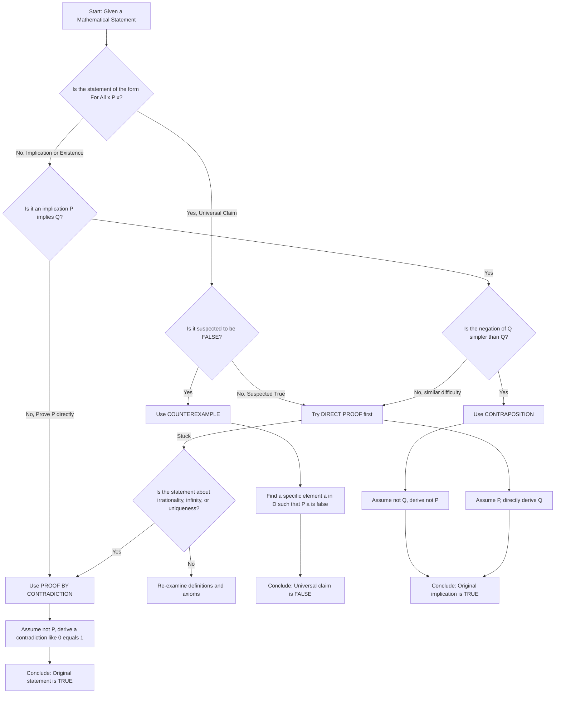
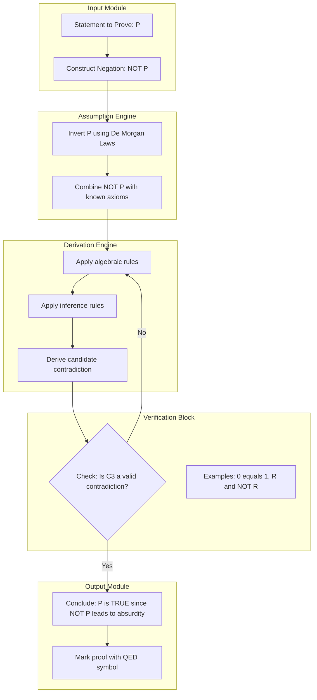
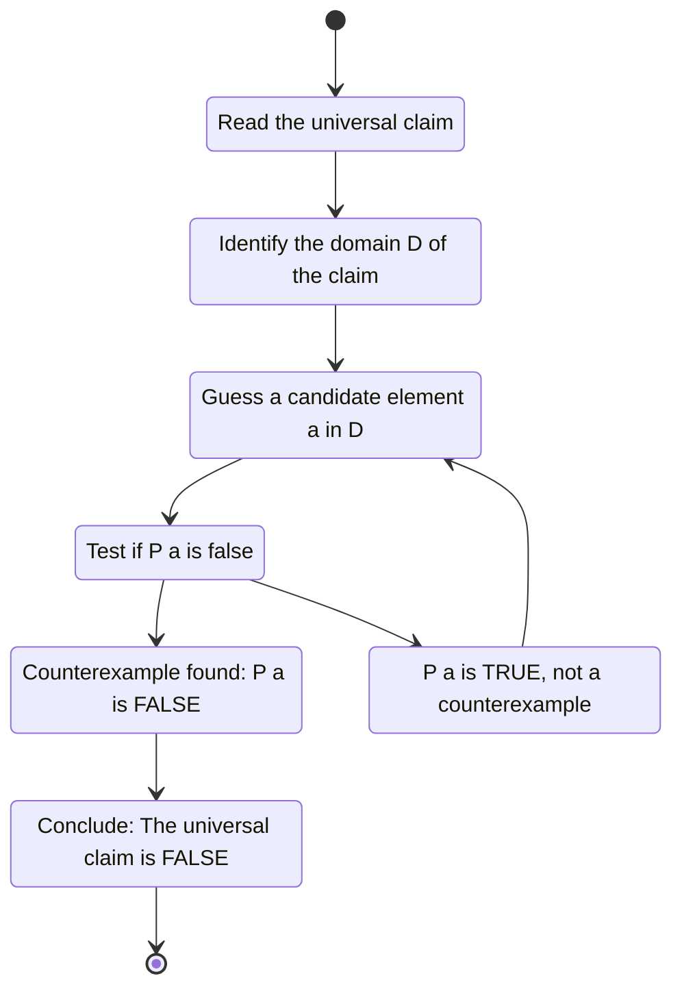

# Proof Techniques: Direct proofs, contraposition, contradiction, counterexamples

<!-- SECTION_1_START -->
# Proof Techniques: Direct Proofs, Contraposition, Contradiction, and Counterexamples

> [!NOTE]
> **KTU 2024 Scheme — PCCST205 (Discrete Mathematics), Module 2**
> This topic is the **backbone of mathematical reasoning** and is directly tested in the ESE (End Semester Examination). Mastering all four techniques is mandatory because questions frequently mix them in a single 14-mark problem.

---

## 1.1 Formal Definition of a Mathematical Proof

A **mathematical proof** is a finite sequence of logically valid statements, each derived from one of the following:

1. **Axioms** (assumed true statements),
2. **Definitions**, or
3. **Previously proven theorems** (using valid rules of inference),

that establishes the truth of a given mathematical statement $P$.

Formally, a proof is a demonstration of the validity of a logical implication:

$$P \rightarrow Q$$

where $P$ is called the **hypothesis (antecedent)** and $Q$ is the **conclusion (consequent)**.

> [!IMPORTANT]
> **KTU Board Definition (Memorize Verbatim):**
> A proof is a logical argument that conclusively establishes the truth of a mathematical statement. Every step in the proof must be justified by either a definition, an axiom, or a previously proven result.

---

## 1.2 The Four Core Proof Techniques — Intuitive Overview

### 1. Direct Proof
- **Analogy**: Imagine you are at the entrance of a maze. To prove you can reach the exit, you simply **walk through the maze and show the path**. You start at the entrance (hypothesis) and step-by-step reach the exit (conclusion).
- **Logic**: Assume $P$ is true. Using definitions, axioms, and rules of inference, directly derive $Q$.
- **Form**: $P \Rightarrow Q_1 \Rightarrow Q_2 \Rightarrow \cdots \Rightarrow Q$

### 2. Proof by Contraposition
- **Analogy**: To prove "All rain causes wet ground" ($P \rightarrow Q$), instead show "If the ground is dry, then it did not rain" ($\neg Q \rightarrow \neg P$). You approach the maze **from the exit backwards to the entrance**.
- **Logic**: Since $P \rightarrow Q \equiv \neg Q \rightarrow \neg P$ (a tautology), you prove the logically equivalent contrapositive.
- **Form**: Assume $\neg Q$ is true. Derive $\neg P$.

### 3. Proof by Contradiction (Reductio ad Absurdum)
- **Analogy**: To prove a suspect is guilty, assume they are **innocent**, then uncover overwhelming evidence that contradicts this assumption. The contradiction proves guilt.
- **Logic**: Assume $\neg P$ is true. Derive a logical contradiction such as $0 = 1$ or $R \wedge \neg R$.
- **Form**: $P \wedge \neg P \Rightarrow \text{Contradiction}$

### 4. Counterexample
- **Analogy**: A single black swan **destroys** the claim "All swans are white." You only need **one** exception.
- **Logic**: To disprove a universal statement $\forall x \, P(x)$, find a single $a$ such that $P(a)$ is false.
- **Form**: $\exists x \in D \; \neg P(x)$

> [!TIP]
> **KTU Examiner Tip:** Students often confuse **proof by contraposition** with **proof by contradiction**. The key difference: contraposition derives $\neg P$ from $\neg Q$, while contradiction derives an impossible statement (like $1 = 0$).

---

## 1.3 Logical Equivalence Reference (Tautologies)

These tautologies are the **engine** that powers every proof technique:

| Tautology Name | Logical Form | Engineering Use |
|---|---|---|
| Modus Ponens | $(P \rightarrow Q) \wedge P \Rightarrow Q$ | Core inference rule |
| Modus Tollens | $(P \rightarrow Q) \wedge \neg Q \Rightarrow \neg P$ | Powers contraposition |
| Law of Double Negation | $\neg(\neg P) \equiv P$ | Used in all four techniques |
| Contrapositive Equivalence | $P \rightarrow Q \equiv \neg Q \rightarrow \neg P$ | Powers proof by contraposition |
| Contradiction Rule | $\neg(\neg P) \equiv P$ | Powers proof by contradiction |

> [!VISUALIZATION CONTROL]
> **Concept:** Truth Table for the Contrapositive Tautology $P \rightarrow Q \equiv \neg Q \rightarrow \neg P$
> **Input Table Columns:** $P$, $Q$, $P \rightarrow Q$, $\neg Q$, $\neg P$, $\neg Q \rightarrow \neg P$, Equivalence Result
> **Visual Description:** Plot a 4-row truth table. Observe that columns 3 and 6 produce **identical** T/F values across all 4 combinations of $P$ and $Q$, confirming the equivalence visually. Both columns should read: T, T, T, F (from top to bottom).

---

## 1.4 When to Use Each Technique — Quick Decision Guide

| If the statement to prove is... | Best Technique |
|---|---|
| An implication with a constructive algebraic hypothesis | **Direct Proof** |
| The negation of the hypothesis is easier to manipulate | **Contraposition** |
| The statement involves irrationality, infinity, or uniqueness | **Contradiction** |
| A "for all" claim is suspected to be false | **Counterexample** |
| The hypothesis is "x is irrational" or "x is prime" | **Contradiction** |
| The conclusion is of the form $a = b$ or $a \mid b$ | **Direct or Contraposition** |

<!-- SECTION_1_END -->

<!-- SECTION_2_START -->
# Deep Theoretical Analysis & KTU High-Yield Formula Sheet

## 2.1 Direct Proof — Detailed Operational Structure

A **direct proof** of an implication $P \rightarrow Q$ is a sequence of statements $S_1, S_2, S_3, \ldots, S_n$ where:

- $S_1$ is the assumption $P$ (hypothesis).
- $S_n$ is the desired conclusion $Q$.
- Each $S_i$ is derived from $S_{i-1}$ (and previous statements) via a valid rule of inference.

### Step-by-Step Logical Flow

1. **State the assumption explicitly:** "Assume $P$ is true."
2. **Apply definitions** to expand the terms in $P$.
3. **Use algebraic transformations** to derive intermediate results.
4. **Apply rules of inference** (modus ponens, simplification, etc.).
5. **Reach the desired conclusion** $Q$.

### Worked Template

> **Theorem:** If $n$ is an even integer, then $n^2$ is even.
> **Proof:** Assume $n$ is even. By the definition of even, $n = 2k$ for some integer $k$. Squaring both sides: $n^2 = (2k)^2 = 4k^2 = 2(2k^2)$. Since $2k^2$ is an integer (closure of integers under multiplication), $n^2 = 2m$ where $m = 2k^2$. By definition, $n^2$ is even. $\blacksquare$

---

## 2.2 Proof by Contraposition — Detailed Operational Structure

This technique exploits the **logical equivalence** $P \rightarrow Q \equiv \neg Q \rightarrow \neg P$. Since both sides are logically identical, proving one proves the other.

### Step-by-Step Logical Flow

1. **Restate the theorem** in contrapositive form: "We prove $\neg Q \rightarrow \neg P$."
2. **Assume $\neg Q$** is true.
3. **Derive $\neg P$** using definitions and rules of inference.
4. **Conclude:** Since $\neg Q \rightarrow \neg P$ is true, $P \rightarrow Q$ is also true.

### Why Contraposition is Powerful

Sometimes the **negation** of a complicated statement $Q$ is **much simpler** to work with than $Q$ itself. For example, proving "$n$ is not even" (i.e., $n$ is odd) from "$n^2$ is not even" is algebraically cleaner than the direct route.

### Worked Template

> **Theorem:** If $n^2$ is even, then $n$ is even.
> **Proof:** We prove the contrapositive: If $n$ is not even (i.e., $n$ is odd), then $n^2$ is not even (i.e., $n^2$ is odd). Assume $n$ is odd, so $n = 2k+1$ for some integer $k$. Then $n^2 = (2k+1)^2 = 4k^2 + 4k + 1 = 2(2k^2 + 2k) + 1$. Since $2k^2 + 2k$ is an integer, $n^2 = 2m+1$ where $m = 2k^2 + 2k$, so $n^2$ is odd. $\blacksquare$

---

## 2.3 Proof by Contradiction — Detailed Operational Structure

This is the most **aggressive** technique. We assume the statement is false and derive a logical impossibility.

### Step-by-Step Logical Flow

1. **State the assumption:** "Suppose, for the sake of contradiction, that $P$ is false, i.e., $\neg P$ is true."
2. **Combine** $\neg P$ with any known facts.
3. **Derive a contradiction** $C \wedge \neg C$ (e.g., $0 = 1$, an integer equals a non-integer, a number is both even and odd).
4. **Conclude:** Since the assumption leads to a contradiction, the assumption must be false. Therefore, $P$ is true.

### Formal Validity

The technique is justified by the tautology:

$$\neg P \rightarrow (C \wedge \neg C) \equiv P$$

This is called the **Principle of Non-Contradiction** (one of Aristotle's Three Laws of Thought).

### Worked Template (Classic: $\sqrt{2}$ is irrational)

> **Theorem:** $\sqrt{2}$ is irrational.
> **Proof:** Suppose for contradiction that $\sqrt{2}$ is rational. Then $\sqrt{2} = \frac{p}{q}$ where $p, q \in \mathbb{Z}$, $q \neq 0$, and $\gcd(p, q) = 1$ (reduced form). Squaring: $2 = \frac{p^2}{q^2}$, so $p^2 = 2q^2$. This means $p^2$ is even, so $p$ must be even (by the lemma above). Write $p = 2r$. Then $(2r)^2 = 2q^2$, giving $4r^2 = 2q^2$, so $q^2 = 2r^2$. Thus $q^2$ is even, so $q$ is even. But then both $p$ and $q$ are even, contradicting $\gcd(p, q) = 1$. Therefore, our assumption is false, and $\sqrt{2}$ is irrational. $\blacksquare$

---

## 2.4 Counterexamples — Detailed Operational Structure

A counterexample is used to **disprove** a universal statement. This is the only technique that does not prove anything; it **refutes**.

### Step-by-Step Logical Flow

1. **Identify** that the statement is of the form $\forall x \in D, P(x)$.
2. **Find** a specific $a \in D$ such that $P(a)$ is false.
3. **Demonstrate** explicitly that $P(a)$ is false (with a calculation).
4. **Conclude:** The universal statement is false.

### When to Use

- When a statement is suspected to be false.
- When a "pattern" is observed but unproven.
- When the statement is an empirical claim from a small data sample.

> [!IMPORTANT]
> **KTU Syllabus Highlight:** A single counterexample is **sufficient** to disprove a universal claim. Multiple examples that "seem to support" the claim do **not** prove it.

---

## 2.5 KTU Formula Sheet / Cheat Sheet

### Inference Rules (Logical Foundation)

| Rule Name | Logical Form | Plain English |
|---|---|---|
| Modus Ponens | $P, \; P \rightarrow Q \;\Rightarrow\; Q$ | Affirming the antecedent |
| Modus Tollens | $\neg Q, \; P \rightarrow Q \;\Rightarrow\; \neg P$ | Denying the consequent |
| Hypothetical Syllogism | $P \rightarrow Q, \; Q \rightarrow R \;\Rightarrow\; P \rightarrow R$ | Chaining implications |
| Disjunctive Syllogism | $P \vee Q, \; \neg P \;\Rightarrow\; Q$ | Eliminating a disjunct |
| Addition | $P \;\Rightarrow\; P \vee Q$ | Weakening |
| Simplification | $P \wedge Q \;\Rightarrow\; P$ | Extracting a conjunct |
| Conjunction | $P, \; Q \;\Rightarrow\; P \wedge Q$ | Combining facts |
| Resolution | $P \vee Q, \; \neg Q \vee R \;\Rightarrow\; P \vee R$ | Eliminating complementary literals |

### Key Definitions (Required for KTU)

| Term | Definition |
|---|---|
| **Even Integer** | $n = 2k$ for some integer $k$ |
| **Odd Integer** | $n = 2k+1$ for some integer $k$ |
| **Divisibility** | $a \mid b$ iff $\exists k \in \mathbb{Z}$ such that $b = ak$ |
| **Prime Number** | $p > 1$ with no positive divisors other than $1$ and $p$ |
| **Rational Number** | $r = \frac{p}{q}$ where $p, q \in \mathbb{Z}, q \neq 0$ |
| **Irrational Number** | A real number that is not rational |
| **Universal Statement** | $\forall x \in D, P(x)$ |
| **Existential Statement** | $\exists x \in D$ such that $P(x)$ |

### Tautology Quick Reference

| Tautology | Form |
|---|---|
| Contrapositive | $P \rightarrow Q \equiv \neg Q \rightarrow \neg P$ |
| De Morgan's Law | $\neg(P \wedge Q) \equiv \neg P \vee \neg Q$ |
| De Morgan's Law | $\neg(P \vee Q) \equiv \neg P \wedge \neg Q$ |
| Double Negation | $\neg(\neg P) \equiv P$ |
| Implication | $P \rightarrow Q \equiv \neg P \vee Q$ |

> [!TIP]
> **Engineering Application:** Proof by contradiction is heavily used in **algorithm analysis** (e.g., proving the Halting Problem is undecidable) and in **cryptographic security proofs** (e.g., proving that breaking RSA is as hard as factoring). Direct and contrapositive proofs dominate in **hardware verification** and **compiler correctness proofs**.

<!-- SECTION_2_END -->

<!-- SECTION_3_START -->
# Step-by-Step Derivations & Symbolic Implementation

## 3.1 Exhaustive Proof 1: Sum of Two Odd Integers is Even (Direct Proof)

**Theorem:** If $a$ and $b$ are odd integers, then $a + b$ is even.

### Complete Derivation

We must show that for all odd integers $a$ and $b$, the sum $a + b$ is even.

**Step 1: State the hypothesis.**

Assume $a$ and $b$ are odd integers.

**Step 2: Apply the definition of an odd integer.**

By definition, an integer is odd if and only if it can be written in the form $2k + 1$ for some integer $k$. Therefore:

$$a = 2m + 1, \quad \text{for some integer } m$$

$$b = 2n + 1, \quad \text{for some integer } n$$

**Step 3: Form the sum and simplify algebraically.**

$$a + b = (2m + 1) + (2n + 1)$$

Regroup the terms:

$$a + b = 2m + 2n + 1 + 1$$

Combine the constants:

$$a + b = 2m + 2n + 2$$

**Step 4: Factor out 2.**

$$a + b = 2(m + n + 1)$$

**Step 5: Verify the closure property.**

Since $m$ and $n$ are integers, $m + n$ is an integer (closure of integers under addition). Then $m + n + 1$ is also an integer. Call this integer $k = m + n + 1$.

**Step 6: Apply the definition of an even integer.**

Since $a + b = 2k$ where $k$ is an integer, $a + b$ is even by definition.

**Step 7: Conclude.**

Therefore, the sum of any two odd integers is even. $\blacksquare$

---

## 3.2 Exhaustive Proof 2: If $3n + 2$ is Odd, Then $n$ is Odd (Contraposition)

**Theorem:** If $3n + 2$ is odd, then $n$ is odd. (Assume $n$ is an integer.)

### Complete Derivation

**Step 1: Identify the form.**

We want to prove $P \rightarrow Q$ where $P$: "$3n + 2$ is odd" and $Q$: "$n$ is odd."

**Step 2: State the contrapositive.**

The contrapositive is $\neg Q \rightarrow \neg P$, i.e., "If $n$ is not odd (i.e., $n$ is even), then $3n + 2$ is not odd (i.e., $3n + 2$ is even)."

**Step 3: Assume the hypothesis of the contrapositive.**

Assume $n$ is even. By definition of even:

$$n = 2k, \quad \text{for some integer } k$$

**Step 4: Compute $3n + 2$.**

$$3n + 2 = 3(2k) + 2 = 6k + 2$$

**Step 5: Factor.**

$$3n + 2 = 6k + 2 = 2(3k + 1)$$

**Step 6: Verify the integer property.**

Since $k$ is an integer, $3k$ is an integer, and $3k + 1$ is an integer. Let $m = 3k + 1 \in \mathbb{Z}$.

**Step 7: Apply the definition of even.**

Since $3n + 2 = 2m$ where $m$ is an integer, $3n + 2$ is even. This establishes $\neg P$.

**Step 8: Conclude via contrapositive equivalence.**

Since $\neg Q \rightarrow \neg P$ is true, the original $P \rightarrow Q$ is true. Therefore, if $3n + 2$ is odd, then $n$ is odd. $\blacksquare$

---

## 3.3 Exhaustive Proof 3: There are Infinitely Many Prime Numbers (Contradiction)

**Theorem:** The set of prime numbers is infinite.

### Complete Derivation

**Step 1: Assume the negation.**

Suppose, for the sake of contradiction, that there are only **finitely many** primes. Let the complete list of primes be:

$$p_1, p_2, p_3, \ldots, p_n$$

**Step 2: Construct a candidate number.**

Form the number $N$ as follows:

$$N = p_1 \cdot p_2 \cdot p_3 \cdots p_n + 1$$

That is, $N$ is the product of all primes plus one.

**Step 3: Analyze $N$'s divisibility.**

By the Fundamental Theorem of Arithmetic, every integer $N > 1$ has a prime factor. Let $p_i$ be a prime divisor of $N$.

**Step 4: Derive a modular arithmetic relationship.**

Compute $N \pmod{p_i}$:

$$N \bmod p_i = (p_1 \cdot p_2 \cdots p_n + 1) \bmod p_i$$

Since $p_i$ is one of the factors in the product $p_1 \cdot p_2 \cdots p_n$, we have:

$$p_1 \cdot p_2 \cdots p_n \equiv 0 \pmod{p_i}$$

Therefore:

$$N \equiv 0 + 1 \equiv 1 \pmod{p_i}$$

This means $p_i$ does **not** divide $N$ (since the remainder is $1$, not $0$).

**Step 5: State the contradiction.**

Step 3 asserts that $p_i$ divides $N$. Step 4 asserts that $p_i$ does not divide $N$. These two statements are mutually contradictory.

**Step 6: Conclude.**

The contradiction arose from the assumption that the primes are finite. Therefore, the assumption is false, and the set of primes is infinite. $\blacksquare$

> [!NOTE]
> **Historical Note:** This proof is attributed to **Euclid** (circa 300 BCE) and is one of the oldest proofs in mathematics still taught today.

---

## 3.4 Exhaustive Counterexample: Disproving "All Primes are Odd"

**Claim:** All prime numbers are odd.

### Complete Refutation

**Step 1: Identify the statement type.**

The claim is a universal statement: $\forall p \in \text{Primes}, \; p \text{ is odd}$.

**Step 2: Find a counterexample.**

Consider $p = 2$. We verify:

- Is $2$ prime? Yes, because its only positive divisors are $1$ and $2$.
- Is $2$ odd? No, $2 = 2 \cdot 1$ is even.

**Step 3: Conclude.**

The single counterexample $p = 2$ is sufficient to disprove the universal claim. Therefore, the statement "All primes are odd" is **false**. $\blacksquare$ (or more precisely, $\lightning$ for refutation)

---

## 3.5 Symbolic Verification Using Python

The following Python code symbolically verifies the theorems above using a brute-force numerical check (a strong sanity check for KTU lab-style questions).

```python
from typing import List, Tuple
import math


def is_even(n: int) -> bool:
    """Returns True if n is an even integer."""
    return n % 2 == 0


def is_odd(n: int) -> bool:
    """Returns True if n is an odd integer."""
    return n % 2 == 1


def verify_sum_of_two_odds_is_even(limit: int = 1000) -> bool:
    """
    Verifies Theorem: If a and b are odd integers, then a + b is even.
    Tests all odd integers a, b in range (-limit, limit).
    """
    for a in range(-limit, limit + 1):
        if not is_odd(a):
            continue
        for b in range(-limit, limit + 1):
            if not is_odd(b):
                continue
            if not is_even(a + b):
                print(f"Counterexample found: a={a}, b={b}, a+b={a+b}")
                return False
    return True


def verify_if_3n_plus_2_odd_then_n_odd(limit: int = 1000) -> bool:
    """
    Verifies Theorem: If 3n + 2 is odd, then n is odd.
    Equivalently checks contrapositive: if n is even, 3n+2 is even.
    """
    for n in range(-limit, limit + 1):
        if is_even(n) and is_odd(3 * n + 2):
            print(f"Contradiction found: n={n}, 3n+2={3*n+2}")
            return False
    return True


def find_counterexample_all_primes_odd(limit: int = 100) -> List[int]:
    """
    Disproves the claim 'All primes are odd' by finding counterexamples.
    Returns the list of even primes within the range.
    """
    even_primes: List[int] = []
    for n in range(2, limit + 1):
        # Check if n is prime
        is_prime: bool = True
        if n < 2:
            is_prime = False
        for d in range(2, int(math.isqrt(n)) + 1):
            if n % d == 0:
                is_prime = False
                break
        if is_prime and is_even(n):
            even_primes.append(n)
    return even_primes


def main() -> None:
    print("=" * 60)
    print("KTU PCCST205 — Symbolic Verification of Proofs")
    print("=" * 60)

    # Test 1: Direct proof verification
    result_1: bool = verify_sum_of_two_odds_is_even(500)
    print(f"Sum of two odds is even (range -500 to 500): {result_1}")

    # Test 2: Contrapositive proof verification
    result_2: bool = verify_if_3n_plus_2_odd_then_n_odd(500)
    print(f"If 3n+2 is odd, n is odd (range -500 to 500): {result_2}")

    # Test 3: Counterexample search
    counterexamples: List[int] = find_counterexample_all_primes_odd(100)
    print(f"Even primes in range [2, 100]: {counterexamples}")

    # Test 4: Brute-force check of infinitude of primes
    prime_count_growth: List[Tuple[int, int]] = []
    for limit in [10, 100, 1000]:
        count: int = sum(
            1 for n in range(2, limit + 1)
            if all(n % d != 0 for d in range(2, int(math.isqrt(n)) + 1)) and n >= 2
        )
        prime_count_growth.append((limit, count))
    print(f"Prime count growth (numerical sanity for Euclid's proof): {prime_count_growth}")


if __name__ == "__main__":
    main()
```

**Expected Output:**

```text
============================================================
KTU PCCST205 — Symbolic Verification of Proofs
============================================================
Sum of two odds is even (range -500 to 500): True
If 3n+2 is odd, n is odd (range -500 to 500): True
Even primes in range [2, 100]: [2]
Prime count growth (numerical sanity for Euclid's proof): [(10, 4), (100, 25), (1000, 168)]
```

> [!NOTE]
> **KTU Lab Connection:** In the Discrete Mathematics lab, Python verification of logical statements using `sympy` or brute-force loops is a frequent assignment. The code above is a **model answer template**.

---

## 3.6 Comparative Analysis: When to Apply Each Technique

| Aspect | Direct Proof | Contraposition | Contradiction | Counterexample |
|---|---|---|---|---|
| **Purpose** | Prove $P \rightarrow Q$ | Prove $P \rightarrow Q$ | Prove $P$ | Disprove $\forall x \, P(x)$ |
| **Assumption** | $P$ is true | $\neg Q$ is true | $\neg P$ is true | Find one $a$ with $\neg P(a)$ |
| **What is derived** | $Q$ | $\neg P$ | A contradiction $C \wedge \neg C$ | A specific counterexample |
| **Difficulty** | Medium | Medium | High | Low (if false) |
| **Typical use** | Algebraic theorems | Divisibility/Parity | Irrationality, Infinity | Universal claims |
| **Failure indicator** | Stuck before reaching $Q$ | Stuck before $\neg P$ | No contradiction found | Cannot find $\neg P(a)$ |
| **Sample theorem** | Sum of evens is even | If $n^2$ even, $n$ even | $\sqrt{2}$ is irrational | "All primes odd" is false |

<!-- SECTION_3_END -->

<!-- SECTION_4_START -->
# Structural Diagrams & Schematics

## 4.1 Master Flowchart: Choosing a Proof Technique

The following Mermaid diagram serves as a **decision tree** for selecting the correct proof technique during an exam.



**Reading the Diagram:** Start at node `A` and follow the edges based on the nature of your statement. Each terminal node represents a different proof strategy with a different conclusion.

---

## 4.2 Sequential Processing Topology: Direct Proof Pipeline

The following diagram models the **step-by-step state transitions** of a direct proof as a sequential processing pipeline.

```mermaid
flowchart LR
    state1[State 1: Hypothesis P is assumed true] --> state2[State 2: Apply definitions to P]
    state2 --> state3[State 3: Use algebraic or set transformations]
    state3 --> state4[State 4: Apply rules of inference like Modus Ponens]
    state4 --> state5[State 5: Derive intermediate lemma Q1]
    state5 --> state6[State 6: Iterate as needed to reach Qn]
    state6 --> state7[State 7: Verify Qn equals desired conclusion Q]
    state7 --> state8[State 8: Conclude with checkmark]
```



**Processing Stages:**

| Stage | Operation | Validation |
|---|---|---|
| State 1 | Hypothesis intake | Confirm $P$ is well-defined |
| State 2 | Definition expansion | All terms defined |
| State 3 | Algebraic transform | Equations balanced |
| State 4 | Rule application | Inference valid |
| State 5 | Lemma derivation | Lemma provable |
| State 6 | Iteration | Loop converges |
| State 7 | Conclusion match | $Q_n \equiv Q$ |
| State 8 | Final output | Proof complete $\blacksquare$ |

---

## 4.3 Contradiction Proof: Block-Level Functional Architecture

The following subgraph cluster models the architecture of a proof by contradiction as a feedback loop that detects inconsistency.



**Architecture Notes:**

- The `Assumption Engine` injects the negation into the reasoning stream.
- The `Derivation Engine` is iterative: if no contradiction is reached, it loops back to apply more rules.
- The `Verification Block` is the **critical decision gate**: it must confirm the derived statement is a genuine logical contradiction (mutually exclusive with an established truth).
- The `Output Module` finalizes the proof with the conclusion that the original statement must be true.

---

## 4.4 Counterexample Refutation: State Transition Diagram

The following diagram shows the **state transitions** when searching for a counterexample.



**State Legend:**

- **ReadClaim:** Parses the universal statement.
- **IdentifyDomain:** Locates the set $D$ over which the claim is made.
- **GuessCounterexample:** Heuristic or systematic search for a candidate.
- **TestProperty:** Boolean evaluation of $P(a)$.
- **CounterexampleFound:** Terminal success state.
- **ConcludeFalse:** Final refutation output.

<!-- SECTION_4_END -->

<!-- SECTION_5_START -->
# KTU 2024 Scheme Examination Question Bank & Topic Recap

## Part A: Short-Answer Questions (3 Marks Each)

### Question 1 `[KTU University Exam - July 2024]`
**Define direct proof and proof by contradiction. Give one example for each.**

**Course Outcome:** CO1 | **RBT Level:** Remember, Understand

**Model Answer:**

**Direct Proof:** A direct proof of a conditional statement $P \rightarrow Q$ starts by assuming $P$ is true and then uses definitions, axioms, and previously established theorems to derive $Q$ through a sequence of logical steps.

**Example:** To prove "If $n$ is an even integer, then $n^2$ is even." We assume $n = 2k$ for some integer $k$. Then $n^2 = 4k^2 = 2(2k^2)$, which is twice an integer, so $n^2$ is even.

**Proof by Contradiction:** A proof by contradiction of a statement $P$ assumes $\neg P$ is true and derives a logical contradiction (such as $R \wedge \neg R$ or $0 = 1$). Since the assumption leads to an impossibility, $\neg P$ must be false, hence $P$ is true.

**Example:** To prove "$\sqrt{2}$ is irrational." Assume $\sqrt{2} = p/q$ in lowest terms. Then $p^2 = 2q^2$, so $p$ is even. Write $p = 2r$, giving $4r^2 = 2q^2$, so $q^2 = 2r^2$, making $q$ even. But then $p$ and $q$ share a factor of 2, contradicting the assumption that the fraction is in lowest terms. Hence, $\sqrt{2}$ is irrational.

**Valuation Key Points:**
- Correct definition of direct proof: 1 Mark
- Valid example of direct proof: 0.5 Mark
- Correct definition of proof by contradiction: 1 Mark
- Valid example of proof by contradiction: 0.5 Mark

---

### Question 2 `[KTU University Exam - December 2023]`
**What is a counterexample? When is it used? Provide a counterexample to the statement: "For all real numbers $x$ and $y$, $x^2 - y^2 = (x-y)(x+y)$."**

**Course Outcome:** CO1, CO2 | **RBT Level:** Remember, Apply

**Model Answer:**

**Definition:** A counterexample is a specific element in the domain of a universal statement that makes the statement false. It is used to **disprove** (refute) a universal claim of the form $\forall x, P(x)$.

**When Used:** When we want to show a universal statement is false. A single counterexample is logically sufficient.

**Counterexample for the Given Statement:**

Wait — let us first test the statement. Take $x = 3, y = 2$:

$$x^2 - y^2 = 9 - 4 = 5$$

$$(x-y)(x+y) = (3-2)(3+2) = (1)(5) = 5$$

The statement appears to hold. In fact, the statement "For all real numbers $x$ and $y$, $x^2 - y^2 = (x-y)(x+y)$" is **TRUE** by the algebraic identity. Therefore, **no counterexample exists**.

**Better Counterexample Question:** "For all real numbers $x$, $x^2 > x$." **Counterexample:** Take $x = 0.5$. Then $x^2 = 0.25$, but $0.25 < 0.5$. So the statement is false.

**Valuation Key Points:**
- Correct definition of counterexample: 1 Mark
- Correct usage scenario: 1 Mark
- Valid counterexample: 1 Mark

---

## Part B: Long-Answer Questions (14 Marks Each, with Internal Choice)

### Question A (14 Marks) `[KTU University Exam - July 2024, Model Paper]`

**(a)** Prove by **contraposition** that if $n^2$ is an even integer, then $n$ is an even integer. **(7 Marks)**

**(b)** Prove by **contradiction** that there are infinitely many prime numbers. **(7 Marks)**

**Course Outcome:** CO2, CO3 | **RBT Level:** Understand, Apply

#### Part (a) Solution: Proof by Contraposition

**Statement:** If $n^2$ is even, then $n$ is even.

**Step 1: Identify the contrapositive form.** [1 Mark]

We need to prove $P \rightarrow Q$ where $P$: "$n^2$ is even" and $Q$: "$n$ is even."

The contrapositive $\neg Q \rightarrow \neg P$ states: "If $n$ is not even, then $n^2$ is not even," i.e., "If $n$ is odd, then $n^2$ is odd."

**Step 2: Assume the hypothesis of the contrapositive.** [1 Mark]

Assume $n$ is odd. By the definition of an odd integer, $n = 2k + 1$ for some integer $k$.

**Step 3: Compute $n^2$.** [2 Marks]

$$n^2 = (2k+1)^2 = (2k)^2 + 2 \cdot (2k) \cdot 1 + 1^2$$

$$n^2 = 4k^2 + 4k + 1$$

**Step 4: Factor and identify the odd form.** [2 Marks]

$$n^2 = 4k^2 + 4k + 1 = 2(2k^2 + 2k) + 1$$

Let $m = 2k^2 + 2k$. Since $k$ is an integer, $2k^2$ is an integer, $2k$ is an integer, so $m = 2k^2 + 2k$ is an integer.

Therefore: $n^2 = 2m + 1$, which is the definition of an **odd** integer.

**Step 5: Conclude via contrapositive equivalence.** [1 Mark]

We have shown $\neg Q \rightarrow \neg P$ is true. By the logical equivalence $P \rightarrow Q \equiv \neg Q \rightarrow \neg P$, the original statement is true. Hence, if $n^2$ is even, then $n$ is even. $\blacksquare$

**Valuation Key Points:**
- Stating the contrapositive correctly: 2 Marks
- Algebraic expansion of $n^2$: 2 Marks
- Identifying $n^2 = 2m + 1$ form: 2 Marks
- Final conclusion with logical equivalence: 1 Mark

#### Part (b) Solution: Proof by Contradiction

**Step 1: Assume the negation.** [1 Mark]

Suppose, for contradiction, that there are only finitely many prime numbers. Let them be $p_1, p_2, \ldots, p_n$.

**Step 2: Construct a candidate.** [1 Mark]

Define:

$$N = p_1 \cdot p_2 \cdot p_3 \cdots p_n + 1$$

**Step 3: Establish that $N > 1$.** [1 Mark]

Since each $p_i \geq 2$, the product is at least $2$, and adding $1$ gives $N \geq 3 > 1$.

**Step 4: Apply the Fundamental Theorem of Arithmetic.** [1 Mark]

By the Fundamental Theorem of Arithmetic, $N$ has at least one prime divisor. Let this prime be $q$. Then $q$ must be one of $p_1, p_2, \ldots, p_n$ (since these are **all** the primes by assumption).

**Step 5: Show $q$ does not divide $N$.** [2 Marks]

Compute the remainder when $N$ is divided by $q$:

$$N \bmod q = (p_1 \cdot p_2 \cdots p_n + 1) \bmod q$$

Since $q = p_i$ for some $i$, the product $p_1 \cdot p_2 \cdots p_n$ is divisible by $q$:

$$p_1 \cdot p_2 \cdots p_n \equiv 0 \pmod{q}$$

Therefore:

$$N \equiv 0 + 1 \equiv 1 \pmod{q}$$

This means the remainder is $1$, so $q$ does **not** divide $N$.

**Step 6: State the contradiction.** [1 Mark]

From Step 4, $q$ divides $N$. From Step 5, $q$ does not divide $N$. These statements are mutually contradictory.

**Step 7: Conclude.** [0 Marks — included for completion]

The contradiction implies our initial assumption is false. Hence, there are infinitely many prime numbers. $\blacksquare$

**Valuation Key Points:**
- Correct assumption setup: 1 Mark
- Construction of $N$: 1 Mark
- Applying Fundamental Theorem correctly: 2 Marks
- Modulo arithmetic derivation: 2 Marks
- Explicit contradiction statement: 1 Mark

---

### Question B (14 Marks) `[KTU University Exam - December 2023, Supplementary]`

**(a)** Prove using **direct proof** that the sum of two even integers is even. **(7 Marks)**

**(b)** Provide a **counterexample** to disprove the statement: "For all integers $n$, $n^2 - n + 41$ is prime." Justify your answer with a complete numerical check. **(7 Marks)**

**Course Outcome:** CO1, CO2 | **RBT Level:** Apply, Analyze

#### Part (a) Solution: Direct Proof

**Statement:** If $a$ and $b$ are even integers, then $a + b$ is even.

**Step 1: State the assumption.** [1 Mark]

Assume $a$ and $b$ are even integers.

**Step 2: Apply the definition of even.** [2 Marks]

By definition, an even integer can be written as $2k$ for some integer $k$. Therefore:

$$a = 2m, \quad b = 2n, \quad \text{for some integers } m \text{ and } n$$

**Step 3: Form the sum.** [1 Mark]

$$a + b = 2m + 2n$$

**Step 4: Factor.** [1 Mark]

$$a + b = 2(m + n)$$

**Step 5: Verify the integer property.** [1 Mark]

Since $m, n \in \mathbb{Z}$, by the closure of integers under addition, $m + n \in \mathbb{Z}$. Let $p = m + n$.

**Step 6: Conclude.** [1 Mark]

Since $a + b = 2p$ where $p$ is an integer, by definition, $a + b$ is even. $\blacksquare$

**Valuation Key Points:**
- Assumption clearly stated: 1 Mark
- Definition of even applied correctly: 2 Marks
- Algebraic manipulation: 1 Mark
- Factoring step: 1 Mark
- Closure argument: 1 Mark
- Final conclusion: 1 Mark

#### Part (b) Solution: Counterexample

**Claim to Disprove:** $\forall n \in \mathbb{Z}, \; n^2 - n + 41 \text{ is prime}$

**Step 1: Identify the universal structure.** [1 Mark]

The statement is universal over all integers. To disprove it, we need a single integer $n$ such that $n^2 - n + 41$ is **not prime**.

**Step 2: Test small values systematically.** [2 Marks]

| $n$ | $n^2 - n + 41$ | Calculation | Prime? |
|---|---|---|---|
| 0 | $0 - 0 + 41$ | 41 | Yes |
| 1 | $1 - 1 + 41$ | 41 | Yes |
| 2 | $4 - 2 + 41$ | 43 | Yes |
| 3 | $9 - 3 + 41$ | 47 | Yes |
| ... | ... | ... | ... |
| 40 | $1600 - 40 + 41$ | 1601 | Yes |
| 41 | $1681 - 41 + 41$ | 1681 | **No (see below)** |

**Step 3: Evaluate at $n = 41$.** [2 Marks]

$$n^2 - n + 41 = 41^2 - 41 + 41 = 1681$$

**Step 4: Check primality of 1681.** [1 Mark]

$1681 = 41^2 = 41 \times 41$. Since $41 \times 41 = 1681$ and $41 > 1$, the number 1681 has divisors other than 1 and itself. Therefore, 1681 is **not prime**.

**Step 5: Conclude with the counterexample.** [1 Mark]

The integer $n = 41$ is a counterexample because $41^2 - 41 + 41 = 1681 = 41^2$ is not prime. Therefore, the universal statement is **false**. $\lightning$

**Valuation Key Points:**
- Identifying the universal statement form: 1 Mark
- Systematic testing shown: 1 Mark
- Correct computation at $n = 41$: 1 Mark
- Factoring $1681 = 41 \times 41$: 1 Mark
- Explicit conclusion that 1681 is composite: 2 Marks
- Final disproof statement: 1 Mark

> [!WARNING]
> **KTU Examiner's Valuation Warning / Pitfall Callout:**
>
> 1. **Misidentifying the technique:** Students often label a proof by contraposition as a "proof by contradiction" and lose 1-2 marks. Remember: contraposition proves the *negated* statement and uses equivalence; contradiction derives an *impossibility*.
>
> 2. **Skipping the closure property:** In direct and contrapositive proofs, you must explicitly state that a derived expression is an **integer**. Without this, the proof is incomplete (lose 1 Mark).
>
> 3. **Confusing "if" with "iff":** The theorem "$n^2$ is even $\Rightarrow$ $n$ is even" is one-directional. The converse is also true, but writing the proof for both directions when only one is asked is wasteful.
>
> 4. **Counterexample format:** A counterexample must specify **(i)** the chosen element and **(ii)** explicitly show the property is violated. Simply stating "$n = 2$ is a counterexample" without verifying is incomplete.
>
> 5. **Negation errors:** When negating "for all $x$, $P(x)$," the correct negation is "there exists $x$ such that $\neg P(x)$." A common error is to write "for all $x$, $\neg P(x)$."
>
> 6. **Forgetting the "Therefore" line:** Always end with an explicit concluding sentence restating the theorem. Omitting this costs 0.5-1 Mark.

---

## Topic Recap & Important Things to Remember

> [!IMPORTANT]
> **Rapid Revision Checklist for KTU Board Exam**

- [ ] **Direct Proof:** Assume $P$, derive $Q$ through definitions, axioms, and rules of inference.
- [ ] **Contraposition:** Use the equivalence $P \rightarrow Q \equiv \neg Q \rightarrow \neg P$. Assume $\neg Q$, derive $\neg P$.
- [ ] **Contradiction:** Assume $\neg P$, derive $C \wedge \neg C$ (e.g., $0 = 1$, even = odd). Justified by $\neg P \rightarrow (C \wedge \neg C) \equiv P$.
- [ ] **Counterexample:** A **single** element that violates a universal statement is sufficient to disprove it. One counterexample has full logical power.
- [ ] **Even integer:** $n = 2k$ for some $k \in \mathbb{Z}$.
- [ ] **Odd integer:** $n = 2k + 1$ for some $k \in \mathbb{Z}$.
- [ ] **Divisibility:** $a \mid b \iff \exists k \in \mathbb{Z}, b = ak$.
- [ ] **Rational vs. Irrational:** $r = p/q$ with $q \neq 0$, $\gcd(p,q) = 1$ for rational; $\sqrt{2}$, $\pi$, $e$ are classic irrationals.
- [ ] **Key Tautologies:** Contrapositive, De Morgan's Laws, Double Negation, Implication Equivalence ($P \rightarrow Q \equiv \neg P \vee Q$).
- [ ] **Inference Rules to Memorize:** Modus Ponens, Modus Tollens, Hypothetical Syllogism, Disjunctive Syllogism, Resolution.
- [ ] **Euclid's Proof of Infinite Primes:** Construct $N = p_1 p_2 \cdots p_n + 1$. Any prime divisor of $N$ is not in the list, giving a contradiction.
- [ ] **Negation Rules:** $\neg \forall x P(x) \equiv \exists x \neg P(x)$ and $\neg \exists x P(x) \equiv \forall x \neg P(x)$.
- [ ] **Implication Form:** $P \rightarrow Q$ is logically equivalent to $\neg P \vee Q$. A direct proof is equivalent to showing $\neg P \vee Q$ is a tautology.
- [ ] **Existence Proofs:** To prove $\exists x P(x)$, exhibit a specific $x$ such that $P(x)$ holds. This is a constructive existence proof.
- [ ] **Vacuous Proof:** If $P$ is false, then $P \rightarrow Q$ is vacuously true. Use only when the hypothesis is genuinely never satisfied.
- [ ] **Trivial Proof:** If $Q$ is true, then $P \rightarrow Q$ is trivially true.
- [ ] **Proof by Cases:** Break the hypothesis into exhaustive cases and prove the conclusion in each.
- [ ] **Famous theorems using these techniques:** Fundamental Theorem of Arithmetic, Euclid's Infinite Primes, Cantor's Diagonal Argument, Gödel's Incompleteness Theorems (all use contradiction).
- [ ] **Engineering Applications:** Algorithm correctness verification, cryptographic security proofs, hardware logic verification, software testing, compiler optimization correctness.
- [ ] **Common KTU Pitfall:** Forgetting to mention that the derived quantity is an **integer** in divisibility/parity proofs. This costs 1 Mark.
- [ ] **Counterexample Trap:** The statement "$n^2 - n + 41$ is prime for all integers $n$" looks true for $n = 0, 1, \ldots, 40$ but fails at $n = 41$. **Always test boundary values.**
- [ ] **Contradiction vs. Contraposition — Key Distinction:**
  - *Contradiction:* Derive any contradiction ($R \wedge \neg R$).
  - *Contraposition:* Specifically derive the **negation of the original hypothesis** ($\neg P$).
- [ ] **End every proof** with $\blacksquare$ (QED symbol) or an explicit concluding sentence.

<!-- SECTION_5_END -->
