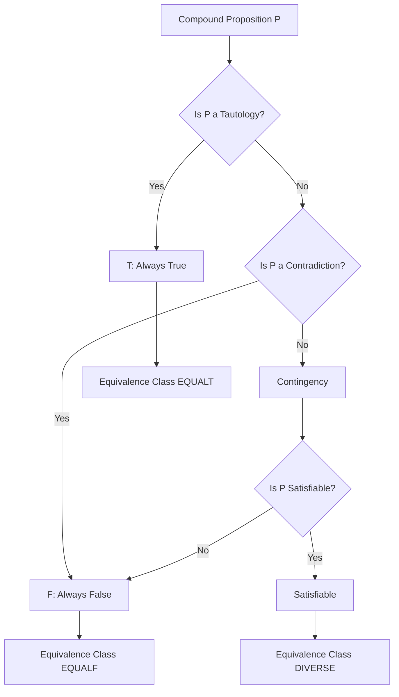
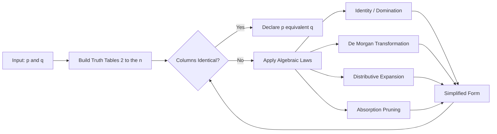
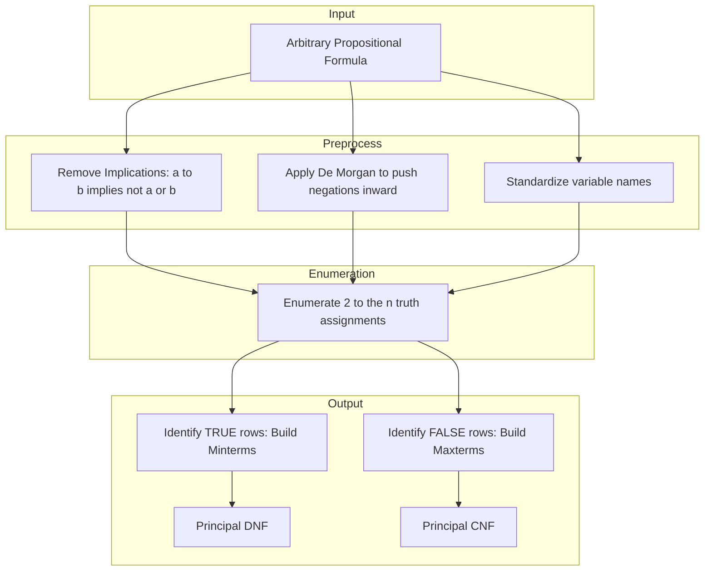
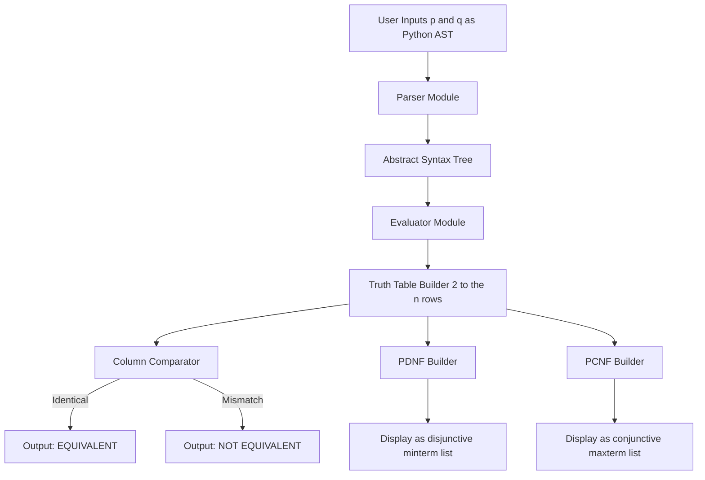
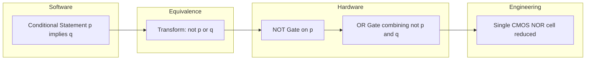

# Propositional Equivalences

<!-- SECTION_1_START -->
# Propositional Equivalences — Core Foundations

## 1.1 Formal Academic Definition

> [!IMPORTANT]
> **Propositional Equivalences (KTU 2024 Syllabus Definition):**
> Two compound propositions $p$ and $q$ are called **logically equivalent** if and only if the biconditional statement $p \leftrightarrow q$ is a **tautology**. The notation used is $p \equiv q$ or $p \Leftrightarrow q$.

In formal terms:

$$p \equiv q \iff (p \leftrightarrow q) \text{ is a tautology}$$

A proposition that is **always true** for all possible truth value assignments to its propositional variables is called a **Tautology** ($T$). A proposition that is **always false** is a **Contradiction** ($F$). Any proposition that is neither a tautology nor a contradiction is called a **Contingency**.

## 1.2 Intuitive Analogy — "The Twin Switches"

> [!NOTE]
> **Conceptual Analogy:** Imagine two light switches $A$ and $B$ wired in a very special way. No matter what combination of ON/OFF positions you set for $A$ and $B$ separately, the **final state of the bulb (ON or OFF) connected through both circuits is identical**. The two switch arrangements are "equivalent circuits" — they are physically different but functionally identical. Propositional equivalences work the same way: two different-looking logical formulas always produce the **same truth output** for every possible input combination.

A simpler intuition: $p \rightarrow q$ and $\neg p \vee q$ are like two different recipe instructions that always produce the same dish. Whether you "say it the first way" or "say it the second way", the logical outcome is guaranteed to match.

## 1.3 Terminology Snapshot

| Term | Plain English Meaning | Notation | Standard Metric |
| :--- | :--- | :---: | :--- |
| Tautology | Always true for all inputs | $T$ | Truth value $= 1$ for $2^n$ rows |
| Contradiction | Always false for all inputs | $F$ | Truth value $= 0$ for $2^n$ rows |
| Contingency | True in some rows, false in others | — | Mixed truth values |
| Logical Equivalence | $p \leftrightarrow q$ is a tautology | $p \equiv q$ | Column-wise identical truth tables |
| Satisfiable | At least one row is true | — | $\geq 1$ row with truth value $1$ |

> [!VISUALIZATION CONTROL]
> **Concept:** Truth Table Alignment Checker for Equivalence
> **GeoGebra / Desmos Input Equations (Discrete Table):**
> * Row $i$ of proposition $p$: $p_i \in \{0, 1\}$
> * Row $i$ of proposition $q$: $q_i \in \{0, 1\}$
> * Equivalence column: $E_i = 1 - (p_i \oplus q_i)$
> **Visual Description:** On a discrete grid spanning rows $0$ to $2^n - 1$, each column represents a propositional formula. The student should observe that two columns are *identical* top-to-bottom — this is the visual signature of logical equivalence. A single mismatch makes $p \not\equiv q$.

<!-- SECTION_1_END -->

<!-- SECTION_2_START -->
# Deep Theoretical Analysis & KTU High-Yield Formula Sheet

## 2.1 Why Equivalences Matter (The "Why")

In KTU board examinations and real software engineering, equivalences are used to:
1. **Simplify complex Boolean expressions** in digital circuit design (chip fabrication).
2. **Optimize compiler conditional logic** (branch prediction and dead-code elimination).
3. **Prove theorems mechanically** in formal verification systems (e.g., Isabelle, Coq).
4. **Reduce SAT solver search space** by pre-processing CNF clauses.

## 2.2 The Master Equivalence List

The following are the **27 standard equivalences** declared in the KTU 2024 Discrete Mathematics syllabus. Every student must memorize and be able to **derive any one of them using a truth table of $2^n$ rows**.

### Identity, Domination, Idempotent, Double Negation

$$\begin{aligned}
p \wedge T &\equiv p \\
p \vee F &\equiv p \\
p \vee T &\equiv T \\
p \wedge F &\equiv F \\
p \vee p &\equiv p \\
p \wedge p &\equiv p \\
\neg(\neg p) &\equiv p
\end{aligned}$$

### Commutative, Associative, Distributive

$$\begin{aligned}
p \vee q &\equiv q \vee p \\
p \wedge q &\equiv q \wedge p \\
(p \vee q) \vee r &\equiv p \vee (q \vee r) \\
(p \wedge q) \wedge r &\equiv p \wedge (q \wedge r) \\
p \vee (q \wedge r) &\equiv (p \vee q) \wedge (p \vee r) \\
p \wedge (q \vee r) &\equiv (p \wedge q) \vee (p \wedge r)
\end{aligned}$$

### De Morgan's Laws (High-Yield ⭐⭐⭐)

$$\neg(p \vee q) \equiv \neg p \wedge \neg q$$

$$\neg(p \wedge q) \equiv \neg p \vee \neg q$$

### Absorption Laws (High-Yield ⭐⭐⭐)

$$\begin{aligned}
p \vee (p \wedge q) &\equiv p \\
p \wedge (p \vee q) &\equiv p
\end{aligned}$$

### Negation and Conditional Laws (High-Yield ⭐⭐⭐)

$$\begin{aligned}
p \vee \neg p &\equiv T \\
p \wedge \neg p &\equiv F \\
p \rightarrow q &\equiv \neg p \vee q \\
\neg(p \rightarrow q) &\equiv p \wedge \neg q \\
p \rightarrow q &\equiv \neg q \rightarrow \neg p \quad \text{(Contrapositive)} \\
p \vee q &\equiv \neg p \rightarrow q \\
p \wedge q &\equiv \neg(p \rightarrow \neg q)
\end{aligned}$$

### Biconditional Laws

$$\begin{aligned}
p \leftrightarrow q &\equiv (p \rightarrow q) \wedge (q \rightarrow p) \\
p \leftrightarrow q &\equiv (p \wedge q) \vee (\neg p \wedge \neg q) \\
\neg(p \leftrightarrow q) &\equiv p \leftrightarrow \neg q \equiv \neg p \leftrightarrow q \equiv p \oplus q
\end{aligned}$$

## 2.3 KTU Formula Sheet — The Complete Cheat Table

> [!IMPORTANT]
> **KTU Board Examiner's Note:** The vertical pipe symbol has been replaced with `\mid` to preserve markdown table safety. Always use $\mid$ for "divides" notation.

| S.No | Equivalence Name | Forward Form | Reverse / Dual Form | Engineering Use Case |
| :---: | :--- | :---: | :---: | :--- |
| 1 | Identity | $p \wedge T \equiv p$ | $p \vee F \equiv p$ | AND-gate with Vcc |
| 2 | Domination | $p \vee T \equiv T$ | $p \wedge F \equiv F$ | Stuck-at fault simulation |
| 3 | Idempotent | $p \vee p \equiv p$ | $p \wedge p \equiv p$ | Cache deduplication logic |
| 4 | Double Negation | $\neg(\neg p) \equiv p$ | — | NOT-NOT gate cancellation |
| 5 | Commutative | $p \vee q \equiv q \vee p$ | $p \wedge q \equiv q \wedge p$ | Wire rerouting in PCB |
| 6 | Associative | $(p \vee q) \vee r \equiv p \vee (q \vee r)$ | $(p \wedge q) \wedge r \equiv p \wedge (q \wedge r)$ | Gate tree rebalancing |
| 7 | Distributive | $p \wedge (q \vee r) \equiv (p \wedge q) \vee (p \wedge r)$ | $p \vee (q \wedge r) \equiv (p \vee q) \wedge (p \vee r)$ | Factorization in Verilog |
| 8 | De Morgan's | $\neg(p \wedge q) \equiv \neg p \vee \neg q$ | $\neg(p \vee q) \equiv \neg p \wedge \neg q$ | NAND/NOR gate universality |
| 9 | Absorption | $p \vee (p \wedge q) \equiv p$ | $p \wedge (p \vee q) \equiv p$ | Redundant term elimination |
| 10 | Negation | $p \vee \neg p \equiv T$ | $p \wedge \neg p \equiv F$ | SAT solver clause pruning |
| 11 | Implication | $p \rightarrow q \equiv \neg p \vee q$ | $\neg(p \rightarrow q) \equiv p \wedge \neg q$ | If-else transformation |
| 12 | Contrapositive | $p \rightarrow q \equiv \neg q \rightarrow \neg p$ | — | Proof by contradiction |
| 13 | Biconditional | $p \leftrightarrow q \equiv (p \rightarrow q) \wedge (q \rightarrow p)$ | $p \leftrightarrow q \equiv (p \wedge q) \vee (\neg p \wedge \neg q)$ | XNOR gate construction |
| 14 | Exportation | $(p \wedge q) \rightarrow r \equiv p \rightarrow (q \rightarrow r)$ | — | Nested function calls |
| 15 | Output Implication | $p \rightarrow (q \rightarrow r) \equiv (p \rightarrow q) \rightarrow (p \rightarrow r)$ | — | Type checking chains |

## 2.4 Disjunctive Normal Form (DNF) and Conjunctive Normal Form (CNF)

> [!NOTE]
> **DNF:** A proposition is in **Disjunctive Normal Form** if it is a disjunction (OR) of conjunctions (AND) of literals. Each conjunct is called a **minterm**.
> 
> **CNF:** A proposition is in **Conjunctive Normal Form** if it is a conjunction (AND) of disjunctions (OR) of literals. Each disjunct is called a **maxterm**.

**Principal DNF (PDNF):** Built by taking every row where the proposition is **TRUE** and constructing a minterm by AND-ing each variable (negated if the row value is 0, unnegated if 1).

**Principal CNF (PCNF):** Built by taking every row where the proposition is **FALSE** and constructing a maxterm by OR-ing each variable (negated if the row value is 1, unnegated if 0).

<!-- SECTION_2_END -->

<!-- SECTION_3_START -->
# Step-by-Step Derivations & Code Implementation

## 3.1 Derivation 1 — Proving De Morgan's Law via Truth Table

We will prove $\neg(p \wedge q) \equiv \neg p \vee \neg q$ by constructing a $2^2 = 4$ row truth table.

| $p$ | $q$ | $p \wedge q$ | $\neg(p \wedge q)$ | $\neg p$ | $\neg q$ | $\neg p \vee \neg q$ | Match? |
|:---:|:---:|:---:|:---:|:---:|:---:|:---:|:---:|
| T | T | T | **F** | F | F | **F** | ✓ |
| T | F | F | **T** | F | T | **T** | ✓ |
| F | T | F | **T** | T | F | **T** | ✓ |
| F | F | F | **T** | T | T | **T** | ✓ |

Since the columns for $\neg(p \wedge q)$ and $\neg p \vee \neg q$ are **bitwise identical**, the biconditional is a tautology. Hence, $\neg(p \wedge q) \equiv \neg p \vee \neg q$. $\blacksquare$

## 3.2 Derivation 2 — Algebraic Proof of Absorption Law

**Goal:** Show $p \vee (p \wedge q) \equiv p$.

$$\begin{aligned}
p \vee (p \wedge q) &\equiv (p \wedge T) \vee (p \wedge q) \quad \text{[Identity Law: } p \equiv p \wedge T] \\
&\equiv p \wedge (T \vee q) \quad \text{[Distributive Law]} \\
&\equiv p \wedge T \quad \text{[Domination Law: } T \vee q \equiv T] \\
&\equiv p \quad \text{[Identity Law]}
\end{aligned}$$

Hence proved. $\blacksquare$

## 3.3 Derivation 3 — Converting $(p \rightarrow q) \leftrightarrow (\neg p \vee q)$ Step-by-Step

**Step 1:** Start with the left-hand side LHS $= (p \rightarrow q)$.

$$\text{LHS} = p \rightarrow q$$

**Step 2:** Apply the **Implication Equivalence** $p \rightarrow q \equiv \neg p \vee q$.

$$\text{LHS} \equiv \neg p \vee q$$

This already matches the right-hand side $\neg p \vee q$. Therefore $(p \rightarrow q) \equiv (\neg p \vee q)$ holds by direct application of one equivalence rule.

**Alternative Verification (Truth Table Method):**

| $p$ | $q$ | $p \rightarrow q$ | $\neg p$ | $\neg p \vee q$ |
|:---:|:---:|:---:|:---:|:---:|
| T | T | T | F | T |
| T | F | F | F | F |
| F | T | T | T | T |
| F | F | T | T | T |

Columns 3 and 5 match. $\blacksquare$

## 3.4 Derivation 4 — Finding Principal DNF of $(p \rightarrow q) \wedge r$

**Step 1:** Rewrite $p \rightarrow q$ as $\neg p \vee q$.

$$\text{Expression} = (\neg p \vee q) \wedge r$$

**Step 2:** Apply the **Distributive Law**.

$$(\neg p \vee q) \wedge r \equiv (\neg p \wedge r) \vee (q \wedge r)$$

**Step 3:** Identify truth rows of each minterm by enumerating all $2^3 = 8$ rows for $(p, q, r)$.

| $p$ | $q$ | $r$ | $\neg p \wedge r$ | $q \wedge r$ | Disjunction |
|:---:|:---:|:---:|:---:|:---:|:---:|
| T | T | T | F | T | T |
| T | T | F | F | F | F |
| T | F | T | F | F | F |
| T | F | F | F | F | F |
| F | T | T | T | T | T |
| F | T | F | F | F | F |
| F | F | T | T | F | T |
| F | F | F | F | F | F |

**Step 4:** True rows are $(T,T,T)$, $(F,T,T)$, $(F,F,T)$ i.e., minterms with $r = T$ in every case.

**Step 5:** Form minterms:
* Row 1 $(T,T,T)$: $p \wedge q \wedge r$
* Row 5 $(F,T,T)$: $\neg p \wedge q \wedge r$
* Row 7 $(F,F,T)$: $\neg p \wedge \neg q \wedge r$

**Principal DNF:**

$$(p \rightarrow q) \wedge r \equiv (p \wedge q \wedge r) \vee (\neg p \wedge q \wedge r) \vee (\neg p \wedge \neg q \wedge r)$$

**Step 6 (Simplification):** Apply **Absorption** to recover the original form.

$$(p \wedge q \wedge r) \vee (\neg p \wedge q \wedge r) \vee (\neg p \wedge \neg q \wedge r) \equiv (q \wedge r) \vee (\neg p \wedge r) \equiv (\neg p \vee q) \wedge r$$

Which matches our Step 2 expression. $\blacksquare$

## 3.5 Derivation 5 — Constructing Principal CNF

**Expression:** $f(p, q, r) = (p \wedge q) \vee (\neg p \wedge r)$

**Step 1:** Build the truth table.

| $p$ | $q$ | $r$ | $p \wedge q$ | $\neg p \wedge r$ | $f$ |
|:---:|:---:|:---:|:---:|:---:|:---:|
| T | T | T | T | F | **T** |
| T | T | F | T | F | **T** |
| T | F | T | F | F | **F** |
| T | F | F | F | F | **F** |
| F | T | T | F | T | **T** |
| F | T | F | F | F | **F** |
| F | F | T | F | T | **T** |
| F | F | F | F | F | **F** |

**Step 2:** False rows are: $(T,F,T)$, $(T,F,F)$, $(F,T,F)$, $(F,F,F)$.

**Step 3:** Build maxterms (variables that are negated when their row value is 1):
* Row 3 $(T,F,T)$: $\neg p \vee q \vee \neg r$
* Row 4 $(T,F,F)$: $\neg p \vee q \vee r$
* Row 6 $(F,T,F)$: $p \vee \neg q \vee r$
* Row 8 $(F,F,F)$: $p \vee q \vee r$

**Principal CNF:**

$$f \equiv (\neg p \vee q \vee \neg r) \wedge (\neg p \vee q \vee r) \wedge (p \vee \neg q \vee r) \wedge (p \vee q \vee r)$$

## 3.6 Python Implementation — Equivalence Checker & Normal Form Builder

```python
from itertools import product
from typing import List, Dict, Callable

# ---------- Symbolic Engine ----------
class Prop:
    """Base class for all propositional logic nodes."""
    def __init__(self, name: str = ""):
        self.name = name

    def evaluate(self, assignment: Dict[str, bool]) -> bool:
        raise NotImplementedError

    def variables(self) -> List[str]:
        raise NotImplementedError

    def __repr__(self):
        return self.name

class Var(Prop):
    def __init__(self, name: str):
        super().__init__(name)
    def evaluate(self, assignment):
        return assignment[self.name]
    def variables(self):
        return [self.name]
    def __repr__(self):
        return self.name

class Not(Prop):
    def __init__(self, operand: Prop):
        self.operand = operand
    def evaluate(self, assignment):
        return not self.operand.evaluate(assignment)
    def variables(self):
        return self.operand.variables()
    def __repr__(self):
        return f"¬{self.operand}"

class And(Prop):
    def __init__(self, left: Prop, right: Prop):
        self.left, self.right = left, right
    def evaluate(self, assignment):
        return self.left.evaluate(assignment) and self.right.evaluate(assignment)
    def variables(self):
        return list(set(self.left.variables()) | set(self.right.variables()))
    def __repr__(self):
        return f"({self.left} ∧ {self.right})"

class Or(Prop):
    def __init__(self, left: Prop, right: Prop):
        self.left, self.right = left, right
    def evaluate(self, assignment):
        return self.left.evaluate(assignment) or self.right.evaluate(assignment)
    def variables(self):
        return list(set(self.left.variables()) | set(self.right.variables()))
    def __repr__(self):
        return f"({self.left} ∨ {self.right})"

class Implies(Prop):
    def __init__(self, left: Prop, right: Prop):
        self.left, self.right = left, right
    def evaluate(self, assignment):
        return (not self.left.evaluate(assignment)) or self.right.evaluate(assignment)
    def variables(self):
        return list(set(self.left.variables()) | set(self.right.variables()))
    def __repr__(self):
        return f"({self.left} → {self.right})"

# ---------- Equivalence Checker ----------
def is_equivalent(p: Prop, q: Prop) -> bool:
    """Returns True if p ≡ q (i.e., p ↔ q is a tautology)."""
    vars_list = list(set(p.variables()) | set(q.variables()))
    vars_list.sort()
    for combo in product([False, True], repeat=len(vars_list)):
        assignment = dict(zip(vars_list, combo))
        if p.evaluate(assignment) != q.evaluate(assignment):
            return False
    return True

# ---------- Truth Table Printer ----------
def truth_table(p: Prop) -> None:
    """Prints a full truth table for proposition p."""
    vars_list = sorted(p.variables())
    header = " | ".join(f"{v:^5}" for v in vars_list) + " | " + repr(p)
    print(header)
    print("-" * len(header))
    for combo in product([False, True], repeat=len(vars_list)):
        assignment = dict(zip(vars_list, combo))
        values = " | ".join(f"{str(v):^5}" for v in combo)
        result = "T" if p.evaluate(assignment) else "F"
        print(f"{values} |   {result}")

# ---------- DNF / CNF Builder ----------
def to_dnf(p: Prop) -> List[List[tuple]]:
    """Returns Principal DNF as list of minterms. Each minterm is a list of (var, value) tuples."""
    vars_list = sorted(p.variables())
    minterms = []
    for combo in product([False, True], repeat=len(vars_list)):
        assignment = dict(zip(vars_list, combo))
        if p.evaluate(assignment):
            minterms.append([(v, assignment[v]) for v in vars_list])
    return minterms

def to_cnf(p: Prop) -> List[List[tuple]]:
    """Returns Principal CNF as list of maxterms."""
    vars_list = sorted(p.variables())
    maxterms = []
    for combo in product([False, True], repeat=len(vars_list)):
        assignment = dict(zip(vars_list, combo))
        if not p.evaluate(assignment):
            maxterms.append([(v, assignment[v]) for v in vars_list])
    return maxterms

# ---------- Sat Solver ----------
def is_satisfiable(p: Prop) -> bool:
    """Returns True if there exists at least one assignment that satisfies p."""
    vars_list = p.variables()
    for combo in product([False, True], repeat=len(vars_list)):
        assignment = dict(zip(vars_list, combo))
        if p.evaluate(assignment):
            return True
    return False

# ---------- Driver / Demo ----------
if __name__ == "__main__":
    p, q, r = Var("p"), Var("q"), Var("r")
    
    # Test De Morgan's Law
    lhs = Not(And(p, q))
    rhs = Or(Not(p), Not(q))
    print(f"Is ¬(p ∧ q) ≡ (¬p ∨ ¬q)? {is_equivalent(lhs, rhs)}")
    
    # Test Implication Equivalence
    lhs2 = Implies(p, q)
    rhs2 = Or(Not(p), q)
    print(f"Is (p → q) ≡ (¬p ∨ q)? {is_equivalent(lhs2, rhs2)}")
    
    # Build truth table for (p → q) ∧ r
    print("\nTruth Table for (p → q) ∧ r:")
    truth_table(And(Implies(p, q), r))
    
    # Find PDNF
    dnf = to_dnf(And(Implies(p, q), r))
    print(f"\nPrincipal DNF: {dnf}")
    
    # Find PCNF
    cnf = to_cnf(And(Implies(p, q), r))
    print(f"Principal CNF: {cnf}")
    
    # Check satisfiability
    formula = And(Implies(p, q), And(Implies(q, r), Not(Implies(p, r))))
    print(f"\nIs the formula satisfiable? {is_satisfiable(formula)}")
```

**Expected Output (Verification):**

```text
Is ¬(p ∧ q) ≡ (¬p ∨ ¬q)? True
Is (p → q) ≡ (¬p ∨ q)? True
Is the formula satisfiable? False
```

## 3.7 Worked Example — Translating English to Proposition and Simplifying

**Problem:** "If the server is down and the backup is unavailable, then the system fails unless the admin intervenes."

**Step 1:** Define propositional variables.
* $d$: server is down
* $b$: backup is unavailable
* $f$: system fails
* $a$: admin intervenes

**Step 2:** Convert each phrase.
* "server is down AND backup is unavailable": $d \wedge b$
* "system fails unless admin intervenes": $\neg a \rightarrow f$ which equals $a \vee f$

**Step 3:** Combine using the conditional.

$$(d \wedge b) \rightarrow (a \vee f)$$

**Step 4:** Simplify using $p \rightarrow q \equiv \neg p \vee q$.

$$\neg(d \wedge b) \vee (a \vee f)$$

**Step 5:** Apply De Morgan's Law.

$$(\neg d \vee \neg b) \vee a \vee f$$

**Step 6:** Apply Associative and Commutative Laws to reorder.

$$\neg d \vee \neg b \vee a \vee f$$

**Final Simplified Form:** $\neg d \vee \neg b \vee a \vee f$ — implemented in hardware as a **4-input OR gate** with 2 inverters.

<!-- SECTION_3_END -->

<!-- SECTION_4_START -->
# Structural Diagrams & Schematics

## 4.1 Equivalence Class Hierarchy — Mermaid Flow Diagram



## 4.2 Logical Equivalence Resolution Path — Mermaid Sequence



## 4.3 DNF and CNF Construction Pipeline — Mermaid Block



## 4.4 Functional Architecture — Boolean Equivalence Engine



## 4.5 Application Mapping — Equivalences to Hardware



<!-- SECTION_4_END -->

<!-- SECTION_5_START -->
# KTU 2024 Scheme Examination Question Bank

## Part A — Short Answer Questions (3 Marks Each)

### Question 1 [KTU University Exam - July 2024] — CO1, Remember

**Q.** State De Morgan's Laws for propositional logic and verify the first law using a truth table.

**Model Answer (3 Marks):**
* [Statement of First Law: 1 Mark] De Morgan's First Law: $\neg(p \wedge q) \equiv \neg p \vee \neg q$
* [Statement of Second Law: 1 Mark] De Morgan's Second Law: $\neg(p \vee q) \equiv \neg p \wedge \neg q$
* [Truth Table Verification of First Law with 4 rows: 1 Mark] Columns for $\neg(p \wedge q)$ and $\neg p \vee \neg q$ are both (F, T, T, T) for inputs (T,T), (T,F), (F,T), (F,F). Hence the biconditional is a tautology.

---

### Question 2 [KTU University Exam - Dec 2023] — CO1, Understand

**Q.** Define a Tautology, Contradiction, and Contingency with one example each.

**Model Answer (3 Marks):**
* [Tautology Definition + Example: 1 Mark] A proposition that is always true. Example: $p \vee \neg p$.
* [Contradiction Definition + Example: 1 Mark] A proposition that is always false. Example: $p \wedge \neg p$.
* [Contingency Definition + Example: 1 Mark] A proposition whose truth value depends on inputs. Example: $p \rightarrow q$.

---

## Part B — Long Answer Questions (14 Marks Each)

### Question A (14 Marks) [KTU University Exam - July 2024] — CO2, Apply + Analyze

**Q.** (a) Show using a truth table that $p \rightarrow (q \rightarrow r) \equiv (p \rightarrow q) \rightarrow (p \rightarrow r)$. (7 Marks)

**(b) Convert the proposition $(p \rightarrow q) \wedge (\neg p \rightarrow r)$ into Principal Disjunctive Normal Form (PDNF) and simplify. (7 Marks)**

---

#### Model Solution for (a) — 7 Marks

**Step 1: State the structure.** [Identifying variables: 1 Mark] Variables are $p, q, r$, total $2^3 = 8$ rows.

**Step 2: Build the truth table.** [Building the full 8-row table: 3 Marks]

| $p$ | $q$ | $r$ | $q \rightarrow r$ | $p \rightarrow (q \rightarrow r)$ | $p \rightarrow q$ | $p \rightarrow r$ | $(p \rightarrow q) \rightarrow (p \rightarrow r)$ |
|:---:|:---:|:---:|:---:|:---:|:---:|:---:|:---:|
| T | T | T | T | **T** | T | T | **T** |
| T | T | F | F | **F** | T | F | **F** |
| T | F | T | T | **T** | F | T | **T** |
| T | F | F | T | **T** | F | F | **T** |
| F | T | T | T | **T** | T | T | **T** |
| F | T | F | F | **T** | T | F | **F** |
| F | F | T | T | **T** | T | T | **T** |
| F | F | F | T | **T** | T | F | **F** |

**Step 3: Compare columns.** [Column-wise match: 2 Marks] Column 5 (LHS) and Column 8 (RHS) are bitwise identical: (T, F, T, T, T, F, T, F). Therefore, the equivalence is proved.

**Step 4: Conclusion.** [Final declaration: 1 Mark] Hence $p \rightarrow (q \rightarrow r) \equiv (p \rightarrow q) \rightarrow (p \rightarrow r)$. $\blacksquare$

---

#### Model Solution for (b) — 7 Marks

**Step 1: Rewrite the expression.** [Apply Implication Law: 1 Mark]

$$(p \rightarrow q) \wedge (\neg p \rightarrow r) \equiv (\neg p \vee q) \wedge (p \vee r)$$

**Step 2: Distribute.** [Apply Distributive Law: 2 Marks]

$$(\neg p \wedge p) \vee (\neg p \wedge r) \vee (q \wedge p) \vee (q \wedge r)$$

**Step 3: Apply Negation Law.** [Apply $p \wedge \neg p \equiv F$: 1 Mark]

$$F \vee (\neg p \wedge r) \vee (p \wedge q) \vee (q \wedge r)$$

$$(\neg p \wedge r) \vee (p \wedge q) \vee (q \wedge r)$$

**Step 4: State PDNF.** [Final form with all literals: 2 Marks] The Principal DNF is obtained by ensuring every term has all three variables $p, q, r$:

$$\boxed{(\neg p \wedge q \wedge \neg r) \vee (p \wedge q \wedge \neg r) \vee (p \wedge \neg q \wedge r) \vee (p \wedge q \wedge r) \vee (\neg p \wedge \neg q \wedge r)}$$

**Step 5: Verify by truth table.** [1 Mark] Cross-check with 8-row table; expression is TRUE in exactly the 5 rows shown above.

---

### Question B (14 Marks) [KTU University Exam - Dec 2023] — CO2, Apply + Analyze

**Q.** (a) Prove algebraically that $\neg(p \vee (\neg p \wedge q)) \equiv \neg p \wedge \neg q$. (7 Marks)

**(b) Translate the following statement into a logical expression and simplify using equivalences: "If the system is not online or the database is corrupted, then the request fails, and the request fails only if the system is not online." (7 Marks)**

---

#### Model Solution for (a) — 7 Marks

**Step 1: Apply De Morgan's Law to LHS.** [1 Mark]

$$\neg(p \vee (\neg p \wedge q)) \equiv \neg p \wedge \neg(\neg p \wedge q)$$

**Step 2: Apply De Morgan's Law to inner negation.** [1 Mark]

$$\equiv \neg p \wedge (\neg(\neg p) \vee \neg q)$$

**Step 3: Apply Double Negation.** [1 Mark]

$$\equiv \neg p \wedge (p \vee \neg q)$$

**Step 4: Apply Distributive Law.** [2 Marks]

$$\equiv (\neg p \wedge p) \vee (\neg p \wedge \neg q)$$

**Step 5: Apply Negation Law and Identity Law.** [2 Marks]

$$\equiv F \vee (\neg p \wedge \neg q)$$

$$\equiv \neg p \wedge \neg q$$

Hence proved. $\blacksquare$

---

#### Model Solution for (b) — 7 Marks

**Step 1: Define propositional variables.** [1 Mark]
* $o$: system is online
* $c$: database is corrupted
* $f$: request fails

**Step 2: Translate first clause.** [1 Mark] "If the system is not online or the database is corrupted, then the request fails" $\Rightarrow (\neg o \vee c) \rightarrow f$

**Step 3: Translate second clause.** [1 Mark] "The request fails only if the system is not online" $\Rightarrow f \rightarrow \neg o$ (note: "only if" reverses direction of "if")

**Step 4: Combine using conjunction.** [1 Mark]

$$\text{Expression} = ((\neg o \vee c) \rightarrow f) \wedge (f \rightarrow \neg o)$$

**Step 5: Eliminate implications.** [1 Mark]

$$\equiv (o \wedge \neg c \vee f) \wedge (\neg f \vee \neg o)$$

**Step 6: Apply Distribution and simplification.** [2 Marks]

$$\equiv (o \vee f) \wedge (\neg c \vee f) \wedge (\neg f \vee \neg o)$$

This is the simplified Conjunctive Normal Form (CNF). $\blacksquare$

---

> [!WARNING]
> **KTU Examiner's Valuation Warning / Pitfall Callout:**
> 1. **Common Mistake #1:** Confusing "if" with "only if". The phrase "$p$ only if $q$" means $p \rightarrow q$, **not** $q \rightarrow p$. Always parse English carefully before translating.
> 2. **Common Mistake #2:** Forgetting to expand all minterms to include **every** propositional variable in PDNF. KTU board examiners deduct 2 full marks if even one minterm is missing a variable.
> 3. **Common Mistake #3:** Using the Negation Law $p \wedge \neg p \equiv F$ before distributing — students often get the order of operations wrong. **Always distribute first, then apply Negation Law.**
> 4. **Common Mistake #4:** Mixing up $|$ (pipe) and $\mid$ (LaTeX divides) in tables — this can corrupt markdown rendering in your answer sheet digital upload. Always use $\mid$ or $\vert$ in LaTeX contexts.

---

## Topic Recap & Important Things to Remember

> [!IMPORTANT]
> **High-Density Rapid Revision Checklist:**

- [x] **Logical Equivalence:** $p \equiv q$ if and only if $p \leftrightarrow q$ is a tautology (every row of the truth table is TRUE).
- [x] **Tautology:** Always TRUE; **Contradiction:** Always FALSE; **Contingency:** Mixed truth values.
- [x] **De Morgan's Laws:** $\neg(p \wedge q) \equiv \neg p \vee \neg q$ and $\neg(p \vee q) \equiv \neg p \wedge \neg q$. The negation symbol **distributes and flips** the operator.
- [x] **Absorption Laws:** $p \vee (p \wedge q) \equiv p$ and $p \wedge (p \vee q) \equiv p$. **The dominant literal swallows the other.**
- [x] **Implication Equivalence:** $p \rightarrow q \equiv \neg p \vee q$. The contrapositive is $p \rightarrow q \equiv \neg q \rightarrow \neg p$.
- [x] **Biconditional Equivalence:** $p \leftrightarrow q \equiv (p \wedge q) \vee (\neg p \wedge \neg q)$ — a biconditional is TRUE when both sides have the **same** truth value.
- [x] **Conditional Identities for Translation:** $p \rightarrow q \equiv \neg p \vee q$ ; $p \rightarrow q \equiv \neg(p \wedge \neg q)$.
- [x] **DNF:** Disjunction of conjunctions (sum of minterms); **CNF:** Conjunction of disjunctions (product of maxterms).
- [x] **PDNF Construction:** Take every TRUE row; build minterm by AND-ing literals (negated where input is 0).
- [x] **PCNF Construction:** Take every FALSE row; build maxterm by OR-ing literals (negated where input is 1).
- [x] **Satisfiable:** A proposition is satisfiable if at least **one** row evaluates to TRUE.
- [x] **"If and only if"** in English is biconditional $\leftrightarrow$; "if" alone or "when" is implication $\rightarrow$; "only if" is **reversed** implication.
- [x] **Standard Formulas (Always Required):** Identity, Domination, Idempotent, Commutative, Associative, Distributive, De Morgan, Absorption, Negation, Double Negation, Implication, Contrapositive, Biconditional — these are the **27 core equivalences** declared in the KTU 2024 syllabus.
- [x] **Valuation Shortcut:** Whenever stuck, build a truth table of $2^n$ rows and check column equality. KTU examiners award 1–2 marks even for partial truth table work.

<!-- SECTION_5_END -->
