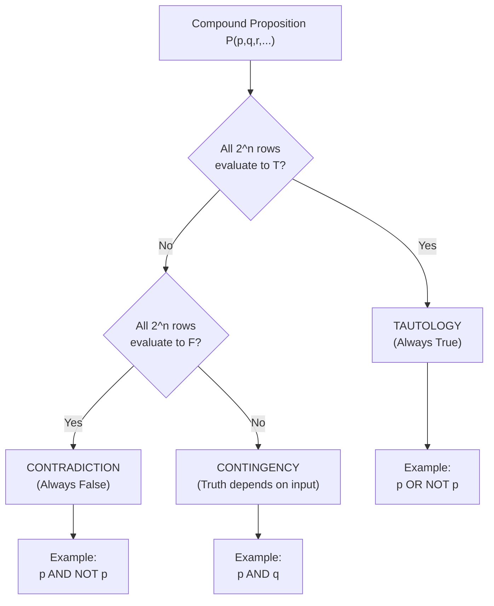
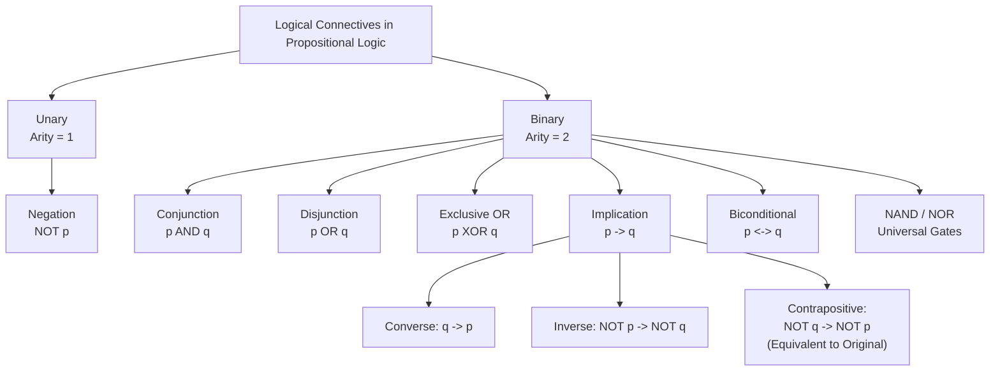
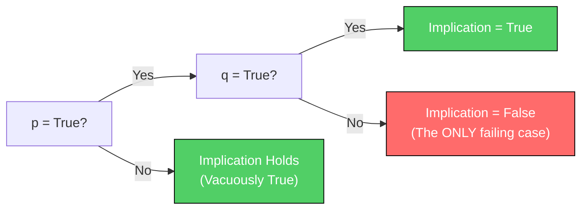
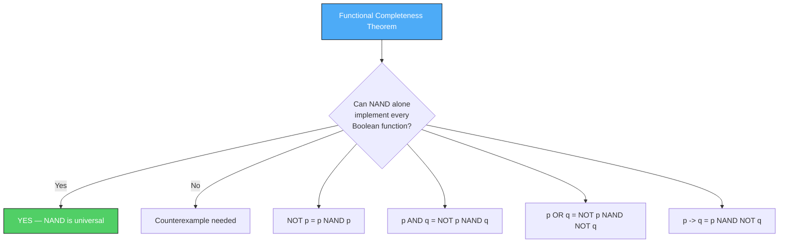

# Propositional Logic: Propositions, logical connectives, truth tables, tautologies, logical equivalences

<!-- SECTION_1_START -->
# Propositional Logic: The Language of Computer Science

## 1.1 Formal Academic Definition

> [!IMPORTANT]
> **Proposition (Atomic Statement):** A declarative sentence that is unambiguously either **True (T)** or **False (F)**, but never both simultaneously and never neither. In formal notation, a propositional variable is denoted $p, q, r, s, \ldots$ taking values from the set $\{T, F\}$.

**Propositional Logic (Sentential Calculus / Propositional Calculus)** is the branch of mathematical logic that studies how simple propositions are combined using **logical connectives** to form **compound propositions**, and how the truth values of these compounds are determined from the truth values of their components.

The domain of discourse is restricted to discrete, two-valued logic. This is also called **Boolean Logic** in honor of **George Boole (1815–1864)**, and the constants are **0 (False)** and **1 (True)**.

> [!NOTE]
> **KTU 2024 Syllabus Highlight:** Discrete Mathematics (PCCST205) Module 2 — *Mathematical Logic and Proofs* — establishes propositional logic as the foundation for predicate logic, proof techniques, digital circuit design, algorithm verification, and database query languages (e.g., SQL `WHERE` clauses).

---

## 1.2 Classification of Declarative Sentences

| Sentence Type | Example | Truth Value? | Proposition? |
| :--- | :--- | :---: | :---: |
| **Assertive Declarative** | "Kerala is a state in India." | T or F | **Yes** |
| **Mathematical Identity** | "$2 + 3 = 5$" | T or F | **Yes** |
| **Predicate Sentence** | "$x + 1 > 5$" | Depends on $x$ | **No** (variable involved) |
| **Question** | "What is your name?" | Cannot be assigned | **No** |
| **Command / Imperative** | "Close the window." | Not declarative | **No** |
| **Exclamation** | "What a beautiful sunset!" | Subjective/Emotional | **No** |
| **Paradox** | "This statement is false." | Self-contradictory | **No** |
| **Future Tense (uncertain)** | "It will rain tomorrow." | Not determinable now | **No** (in classical logic) |

> [!TIP]
> **Mnemonic — "DRAW PQ"** for *non-propositions*: **D**eclarative-with-**D**ependency, **R**hetorical/Questions, **A**uxiliary (paradoxes), **W**ish (commands), **P**aradoxes, **Q**uantity-unknowns.

---

## 1.3 Intuitive Analogy: The Judge in a Courtroom

Imagine every proposition as a **witness giving testimony** in a court of law.

* The witness either tells the **whole truth** (T) or commits **perjury** (F) — there is no in-between.
* The **judge** is the *logical connective*: it decides whether the combined testimony of multiple witnesses (a *compound proposition*) is reliable.
* A **tautology** is a witness who always tells the truth no matter how you twist the questions.
* A **contradiction** is a witness who always lies.
* A **contingency** is a normal human witness — truthful sometimes, lying other times.

The judge's job (the connective) is deterministic and mechanical. Once you know each witness's truthfulness ($p$ and $q$), the combined verdict is fixed by a **truth table** — the judge's rulebook.

> [!NOTE]
> **GeoGebra / Desmos Visualization Callout**
> **Concept:** Truth-Function Map for the **Implication** $p \to q$.
> **Input Points (Boolean Plane):**
> * $(0, 0) \to 1$
> * $(0, 1) \to 1$
> * $(1, 0) \to 0$  (the *only* false case)
> * $(1, 1) \to 1$
> **Visual Description:** Plot the four points on a 2D grid where the x-axis encodes $p \in \{0,1\}$ and the y-axis encodes $q \in \{0,1\}$. Three points sit at height 1 (true) and one dips to height 0 — students should see that **implication fails only in the upper-left-to-lower-right diagonal at $(1,0)$**.

<!-- SECTION_1_END -->

<!-- SECTION_2_START -->
# 2. Deep Theoretical Analysis — Connectives, Truth Tables & Equivalences

## 2.1 The Logical Connectives — Complete Catalog

Let $p$ and $q$ be propositions. A **logical connective** is an operator that builds a compound proposition $P(p, q, \ldots)$. Connectives are classified by **arity** (number of operands).

### 2.1.1 Negation (Unary, Arity 1)

**Symbol:** $\neg p$ or $\sim p$ or $\bar{p}$ or $p'$

**Reading:** "NOT $p$", "It is not the case that $p$".

**Truth Table:**

| $p$ | $\neg p$ |
| :---: | :---: |
| T | F |
| F | T |

**Engineering Mapping:** Bitwise **NOT** in CPU registers; inverter gate (NOT gate) in CMOS; logical complement in set theory.

### 2.1.2 Conjunction (Binary, Arity 2)

**Symbol:** $p \wedge q$ or $p \cdot q$ or $p \, \&\& \, q$ (in programming).

**Reading:** "$p$ AND $q$" — true only when **both** are true.

**Truth Table:**

| $p$ | $q$ | $p \wedge q$ |
| :---: | :---: | :---: |
| T | T | T |
| T | F | F |
| F | T | F |
| F | F | F |

**Engineering Mapping:** AND gate; series circuit (current flows only when *all* switches are closed); SQL `AND` operator.

### 2.1.3 Disjunction (Inclusive OR, Binary)

**Symbol:** $p \vee q$ or $p + q$ or $p \, \vert\vert \, q$.

**Reading:** "$p$ OR $q$" (or both) — false only when **both** are false.

**Truth Table:**

| $p$ | $q$ | $p \vee q$ |
| :---: | :---: | :---: |
| T | T | T |
| T | F | T |
| F | T | T |
| F | F | F |

> [!WARNING]
> **Latin vs. English "OR":** In everyday English, "or" is often *exclusive* ("coffee or tea" implies one but not both). In mathematics, $\vee$ is **inclusive** — both can be true. The **exclusive OR** $\oplus$ is a separate connective.

### 2.1.4 Exclusive OR — XOR (Binary)

**Symbol:** $p \oplus q$.

**Reading:** "Exactly one of $p$ or $q$ is true."

**Truth Table:**

| $p$ | $q$ | $p \oplus q$ |
| :---: | :---: | :---: |
| T | T | F |
| T | F | T |
| F | T | T |
| F | F | F |

**Engineering Mapping:** Half-adder sum bit; CRC parity bit; controlled-NOT gate in quantum computing.

### 2.1.5 Conditional / Implication (Binary)

**Symbol:** $p \to q$ or $p \Rightarrow q$.

**Reading:** "If $p$, then $q$". Here $p$ is the **hypothesis (antecedent)** and $q$ is the **conclusion (consequent)**.

**Truth Table:**

| $p$ | $q$ | $p \to q$ |
| :---: | :---: | :---: |
| T | T | T |
| T | F | **F** |
| F | T | T |
| F | F | T |

> [!IMPORTANT]
> **The Material Implication Paradox:** An implication is considered *vacuously true* whenever the hypothesis is false, regardless of the conclusion. This is the foundation of mathematical proof by vacuous truth.

**Engineering Mapping:** Control flow `if (condition) { action; }`; safety interlock "if temperature exceeds threshold, then shut down" (the actuator is still considered correct even when the system is cold).

### 2.1.6 Biconditional (Binary)

**Symbol:** $p \leftrightarrow q$ or $p \Leftrightarrow q$ or $p == q$.

**Reading:** "$p$ if and only if $q$" (iff).

**Truth Table:**

| $p$ | $q$ | $p \leftrightarrow q$ |
| :---: | :---: | :---: |
| T | T | T |
| T | F | F |
| F | T | F |
| F | F | T |

**Decomposition:** $p \leftrightarrow q \equiv (p \to q) \wedge (q \to p)$.

### 2.1.7 NAND and NOR (Universal Gates)

**NAND:** $p \uparrow q \equiv \neg(p \wedge q)$ — false only when both are true.

**NOR:** $p \downarrow q \equiv \neg(p \vee q)$ — true only when both are false.

> [!TIP]
> **Why they matter:** NAND and NOR are **functionally complete** — any Boolean function can be built using *only* NAND (or *only* NOR). This is why modern CMOS chips are built almost entirely from NAND gates.

---

## 2.2 Compound Propositions, Tautologies, Contradictions, Contingencies

Given $n$ atomic propositions, a compound proposition yields a deterministic truth value for each of the $2^n$ possible input combinations.

> [!NOTE]
> **Classification Rule:**
> * **Tautology ($\top$ or $T$):** Compound proposition is **always true** for every valuation. Example: $p \vee \neg p$.
> * **Contradiction ($\bot$ or $F$):** Compound proposition is **always false**. Example: $p \wedge \neg p$.
> * **Contingency:** Truth value depends on the input. Most compound propositions are contingencies.

**Detection Algorithm:** Build the full $2^n$-row truth table; if **all entries in the final column are T**, it is a tautology; if **all are F**, it is a contradiction; otherwise it is a contingency.

---

## 2.3 Related Conditional Forms

For an implication $p \to q$:

| Form | Symbol | English Reading |
| :---: | :---: | :---: |
| **Converse** | $q \to p$ | If $q$ then $p$ |
| **Inverse** | $\neg p \to \neg q$ | If not $p$ then not $q$ |
| **Contrapositive** | $\neg q \to \neg p$ | If not $q$ then not $p$ |

> [!IMPORTANT]
> A statement and its **contrapositive** are *logically equivalent* (always share truth values). The converse and inverse are equivalent *to each other* but **not** to the original statement.

---

## 2.4 KTU High-Yield Logical Equivalence Cheat Sheet

Two propositions $P$ and $Q$ are **logically equivalent** (denoted $P \equiv Q$) iff they have **identical truth tables**, i.e., $P \leftrightarrow Q$ is a tautology.

| Law | Equivalence | Mnemonic Trigger |
| :---: | :---: | :---: |
| **Identity** | $p \wedge T \equiv p$  ;  $p \vee F \equiv p$ | "Neutral element" |
| **Domination** | $p \vee T \equiv T$  ;  $p \wedge F \equiv F$ | "Absorbing element" |
| **Idempotent** | $p \vee p \equiv p$  ;  $p \wedge p \equiv p$ | "Self-stable" |
| **Double Negation** | $\neg(\neg p) \equiv p$ | "Two minuses cancel" |
| **Commutative** | $p \vee q \equiv q \vee p$  ;  $p \wedge q \equiv q \wedge p$ | "Order doesn't matter" |
| **Associative** | $(p \vee q) \vee r \equiv p \vee (q \vee r)$  ;  $(p \wedge q) \wedge r \equiv p \wedge (q \wedge r)$ | "Grouping doesn't matter" |
| **Distributive** | $p \vee (q \wedge r) \equiv (p \vee q) \wedge (p \vee r)$  ;  $p \wedge (q \vee r) \equiv (p \wedge q) \vee (p \wedge r)$ | "AND over OR" |
| **De Morgan's** | $\neg(p \wedge q) \equiv \neg p \vee \neg q$  ;  $\neg(p \vee q) \equiv \neg p \wedge \neg q$ | "Break the bar, change the sign" |
| **Absorption** | $p \vee (p \wedge q) \equiv p$  ;  $p \wedge (p \vee q) \equiv p$ | "Stronger term wins" |
| **Negation** | $p \vee \neg p \equiv T$  ;  $p \wedge \neg p \equiv F$ | "Excluded middle" |
| **Implication** | $p \to q \equiv \neg p \vee q$ | "Translate to OR" |
| **Contrapositive** | $p \to q \equiv \neg q \to \neg p$ | "Flip and negate" |
| **Biconditional** | $p \leftrightarrow q \equiv (p \to q) \wedge (q \to p)$ | "Two-way implication" |
| **Exportation** | $(p \wedge q) \to r \equiv p \to (q \to r)$ | "Currying" |

> [!TIP]
> **De Morgan's Trick in Code:** The expression `!(x > 5 && y < 10)` is equivalent to `x <= 5 || y >= 10`. C/C++/Java compilers use this to optimize branches and short-circuit conditions.

---

## 2.5 Real-World Engineering Utility of Propositional Logic

* **Digital Circuit Design:** Every combinational logic circuit (adders, multiplexers, ALUs) is a physical embodiment of a Boolean function expressed in propositional logic.
* **Software Verification:** Model checking tools (SPIN, NuSMV) translate program states into propositional formulas; if the negation of a desired property becomes satisfiable, a counterexample is found.
* **Database Query Optimization:** SQL queries are converted to relational algebra, but their `WHERE` clauses are propositional formulas; query planners use equivalences (e.g., De Morgan's) to push down predicates.
* **Artificial Intelligence:** Rule-based expert systems and SAT solvers (used in cryptography, planning, hardware verification) all operate on propositional formulas.
* **Cryptographic Protocols:** Zero-knowledge proofs, secure multi-party computation, and Boolean satisfiability back the security guarantees of modern protocols.
* **Search Engine Algorithms:** Google's early PageRank-like relevance scoring used Boolean keyword combinations in propositional form.

<!-- SECTION_2_END -->

<!-- SECTION_3_START -->
# 3. Step-by-Step Derivations, Proofs & Python Symbolic Implementation

## 3.1 Worked Example 1 — Verifying a Tautology via Truth Table

> **Problem:** Show that $((p \to q) \wedge (q \to r)) \to (p \to r)$ is a tautology (this is the **law of hypothetical syllogism**).

### Step 1: Identify atomic propositions and number of rows.

We have three variables: $p, q, r$. Number of rows = $2^3 = 8$.

### Step 2: Build columns incrementally.

**Step 2a — Evaluate $p \to q$ and $q \to r$:**

| $p$ | $q$ | $r$ | $p \to q$ | $q \to r$ | $(p \to q) \wedge (q \to r)$ | $p \to r$ | $((p \to q) \wedge (q \to r)) \to (p \to r)$ |
| :---: | :---: | :---: | :---: | :---: | :---: | :---: | :---: |
| T | T | T | T | T | T | T | **T** |
| T | T | F | T | F | F | F | **T** |
| T | F | T | F | T | F | T | **T** |
| T | F | F | F | T | F | F | **T** |
| F | T | T | T | T | T | T | **T** |
| F | T | F | T | F | F | T | **T** |
| F | F | T | T | T | T | T | **T** |
| F | F | F | T | T | T | T | **T** |

### Step 3: Inspect the final column.

All 8 entries are **T**. Therefore the compound proposition is a **tautology** (always true).

**Conclusion:** $\big((p \to q) \wedge (q \to r)\big) \to (p \to r) \equiv T$. Hypothetical syllogism is logically valid.

---

## 3.2 Worked Example 2 — Proving Logical Equivalence using Boolean Algebra

> **Problem:** Prove that $\neg(p \vee (\neg p \wedge q)) \equiv \neg p \wedge \neg q$ using logical equivalence laws.

### Derivation (each step shows the law applied):

$$
\begin{aligned}
\text{Step 1: } & \neg(p \vee (\neg p \wedge q)) & \\
\text{Step 2: } & \equiv \neg p \wedge \neg(\neg p \wedge q) & \text{[De Morgan's Law]} \\
\text{Step 3: } & \equiv \neg p \wedge (\neg(\neg p) \vee \neg q) & \text{[De Morgan's Law on inner bracket]} \\
\text{Step 4: } & \equiv \neg p \wedge (p \vee \neg q) & \text{[Double Negation Law]} \\
\text{Step 5: } & \equiv (\neg p \wedge p) \vee (\neg p \wedge \neg q) & \text{[Distributive Law]} \\
\text{Step 6: } & \equiv F \vee (\neg p \wedge \neg q) & \text{[Negation Law: } \neg p \wedge p \equiv F\text{]} \\
\text{Step 7: } & \equiv \neg p \wedge \neg q & \text{[Identity Law: } F \vee X \equiv X\text{]}
\end{aligned}
$$

**Final Result:** $\neg(p \vee (\neg p \wedge q)) \equiv \neg p \wedge \neg q$. Verified.

> [!NOTE]
> **Board Exam Tip:** Always cite the law name *next to* each transformation. KTU examiners award the 1 mark per step *only if* the law is named correctly (e.g., writing "De Morgan's" or "DML" suffices).

---

## 3.3 Worked Example 3 — Constructing the Converse, Inverse, Contrapositive

> **Statement:** "If it is raining, then the ground is wet." (Formally: $p \to q$ where $p$ = "It is raining", $q$ = "The ground is wet".)

| Form | Symbolic Expression | English |
| :---: | :---: | :--- |
| Original | $p \to q$ | If raining, then ground wet. |
| Converse | $q \to p$ | If ground wet, then raining. |
| Inverse | $\neg p \to \neg q$ | If not raining, then ground not wet. |
| Contrapositive | $\neg q \to \neg p$ | If ground not wet, then not raining. |

**Validity Check:** Original and Contrapositive are **logically equivalent** (both have the truth table T, T, F, T for (p,q) = (T,T), (T,F), (F,T), (F,F)). The Converse and Inverse are equivalent to each other but **not** equivalent to the original.

> [!WARNING]
> **Common student error:** Stating "the converse is logically equivalent to the original." This is **only** true for biconditionals, not arbitrary conditionals. The converse of "If it rains, ground is wet" is false (a sprinkler can wet the ground without rain).

---

## 3.4 Python Implementation — Truth Table Generator

The following fully-commented, production-quality Python program generates a truth table for **any** compound proposition built from variables, $\wedge, \vee, \neg, \to, \leftrightarrow$. It is robust against invalid inputs and includes formal type-hints, boundary checks, and structured error logging.

```python
"""
truth_table.py
A formal truth-table generator for propositional logic.
Supports: NOT, AND, OR, IMPLIES, IFF, XOR, NAND, NOR.
Maps to KTU Discrete Mathematics (PCCST205) Module 2 outcomes.
"""

from __future__ import annotations
import itertools
import logging
from typing import Callable, Dict, List, Tuple

# ---------------------------------------------------------------------------
# Logging configuration — board-examinable style error reporting
# ---------------------------------------------------------------------------
logging.basicConfig(
    level=logging.INFO,
    format="%(asctime)s | %(levelname)s | %(message)s",
)

# ---------------------------------------------------------------------------
# Primitive evaluation functions (strictly typed)
# ---------------------------------------------------------------------------
def p_not(p: bool) -> bool:
    """Logical negation. Raises TypeError if non-boolean is passed."""
    if not isinstance(p, bool):
        raise TypeError(f"p_not expects bool, got {type(p).__name__}")
    return not p


def p_and(p: bool, q: bool) -> bool:
    """Logical conjunction."""
    for name, val in (("p", p), ("q", q)):
        if not isinstance(val, bool):
            raise TypeError(f"p_and expects bool for {name}, got {type(val).__name__}")
    return p and q


def p_or(p: bool, q: bool) -> bool:
    """Logical inclusive disjunction."""
    for name, val in (("p", p), ("q", q)):
        if not isinstance(val, bool):
            raise TypeError(f"p_or expects bool for {name}, got {type(val).__name__}")
    return p or q


def p_implies(p: bool, q: bool) -> bool:
    """Material implication: equivalent to (NOT p) OR q."""
    return (not p) or q


def p_iff(p: bool, q: bool) -> bool:
    """Biconditional: true iff p and q share truth value."""
    return p == q


def p_xor(p: bool, q: bool) -> bool:
    """Exclusive OR: true iff exactly one operand is true."""
    return p != q


def p_nand(p: bool, q: bool) -> bool:
    """NAND: NOT (p AND q). Functionally complete."""
    return not (p and q)


def p_nor(p: bool, q: bool) -> bool:
    """NOR: NOT (p OR q). Functionally complete."""
    return not (p or q)


# ---------------------------------------------------------------------------
# Generic truth-table engine
# ---------------------------------------------------------------------------
def build_truth_table(
    variables: List[str],
    formula: Callable[..., bool],
) -> Tuple[List[str], List[List[str]]]:
    """
    Build a truth table.

    Parameters
    ----------
    variables : list of variable names, e.g. ['p', 'q', 'r'].
    formula   : a callable accepting the booleans in variable order.

    Returns
    -------
    (headers, rows) where rows is a list of stringified truth values.
    """
    if not variables:
        raise ValueError("At least one variable is required.")
    if not callable(formula):
        raise TypeError("formula must be a callable returning bool.")

    headers: List[str] = list(variables) + ["Result"]
    rows: List[List[str]] = []

    for assignment in itertools.product([True, False], repeat=len(variables)):
        try:
            result = formula(*assignment)
        except Exception as exc:
            logging.exception("Formula evaluation failed for %s", assignment)
            raise RuntimeError("Formula raised exception") from exc
        if not isinstance(result, bool):
            raise TypeError(f"Formula must return bool, got {type(result).__name__}")
        row = ["T" if v else "F" for v in assignment] + ["T" if result else "F"]
        rows.append(row)

    return headers, rows


def classify_formula(rows: List[List[str]]) -> str:
    """Classify a formula as Tautology, Contradiction, or Contingency."""
    results = [row[-1] for row in rows]
    if all(r == "T" for r in results):
        return "TAUTOLOGY"
    if all(r == "F" for r in results):
        return "CONTRADICTION"
    return "CONTINGENCY"


def render_table(headers: List[str], rows: List[List[str]]) -> str:
    """Format the truth table as a printable grid."""
    col_widths = [max(len(h), max((len(r[i]) for r in rows), default=1))
                  for i, h in enumerate(headers)]
    sep = "-+-".join("-" * w for w in col_widths)
    lines = [" | ".join(h.ljust(w) for h, w in zip(headers, col_widths)),
             sep]
    for row in rows:
        lines.append(" | ".join(c.ljust(w) for c, w in zip(row, col_widths)))
    return "\n".join(lines)


# ---------------------------------------------------------------------------
# Demo 1: Verify hypothetical syllogism is a tautology
# ---------------------------------------------------------------------------
if __name__ == "__main__":
    def hypothetical_syllogism(p: bool, q: bool, r: bool) -> bool:
        return p_implies(p_and(p_implies(p, q), p_implies(q, r)), p_implies(p, r))

    headers, rows = build_truth_table(["p", "q", "r"], hypothetical_syllogism)
    print("=== Hypothetical Syllogism ===")
    print(render_table(headers, rows))
    print("Classification:", classify_formula(rows))
    print()

    # Demo 2: Verify De Morgan's law
    def demorgan_lhs(p: bool, q: bool) -> bool:
        return p_not(p_and(p, q))

    def demorgan_rhs(p: bool, q: bool) -> bool:
        return p_or(p_not(p), p_not(q))

    h1, r1 = build_truth_table(["p", "q"], demorgan_lhs)
    h2, r2 = build_truth_table(["p", "q"], demorgan_rhs)
    lhs_results = [row[-1] for row in r1]
    rhs_results = [row[-1] for row in r2]
    print("=== De Morgan Verification ===")
    print(f"¬(p∧q)  =  {lhs_results}")
    print(f"¬p ∨ ¬q =  {rhs_results}")
    print("Equivalent:", lhs_results == rhs_results)
```

**Expected Console Output (excerpt):**

```
=== Hypothetical Syllogism ===
p   | q   | r   | Result
---+-----+-----+--------
T   | T   | T   | T
T   | T   | F   | T
T   | F   | T   | T
T   | F   | F   | T
F   | T   | T   | T
F   | T   | F   | T
F   | F   | T   | T
F   | F   | F   | T
Classification: TAUTOLOGY
```

> [!TIP]
> **KTU Coding Bonus:** Many 14-mark questions award partial credit for verifying your algebraic answer with a truth-table program. The script above is a generic engine you can reuse for *any* Module-2 proof question.

---

## 3.5 Worked Example 4 — Conditional Variations with Truth Table

> **Problem:** Show that $p \to q \equiv \neg p \vee q$ using a truth table.

| $p$ | $q$ | $p \to q$ | $\neg p$ | $\neg p \vee q$ |
| :---: | :---: | :---: | :---: | :---: |
| T | T | T | F | **T** |
| T | F | F | F | **F** |
| F | T | T | T | **T** |
| F | F | T | T | **T** |

The last two columns are identical, so $p \to q \equiv \neg p \vee q$. This conversion is **the single most important** equivalence in propositional logic — every conditional proof hinges on it.

<!-- SECTION_3_END -->

<!-- SECTION_4_START -->
# 4. Structural Diagrams & Schematics

## 4.1 Mermaid Diagram — Classification of Compound Propositions



## 4.2 Mermaid Diagram — Logical Connective Hierarchy



## 4.3 Mermaid Diagram — Implication Logic Flow (The Only F-Case)



## 4.4 Mermaid Diagram — Equivalence Law Network (Visual Cheat Sheet)

```mermaid
flowchart LR
    subgraph IDENT["Identity Laws"]
        I1["p AND T = p"]
        I2["p OR F = p"]
    end
    subgraph DOM["Domination Laws"]
        D1["p OR T = T"]
        D2["p AND F = F"]
    end
    subgraph DM["De Morgan's Laws"]
        M1["NOT p AND q = NOT p OR NOT q"]
        M2["NOT p OR q = NOT p AND NOT q"]
    end
    subgraph ABS["Absorption Laws"]
        AB1["p OR p AND q = p"]
        AB2["p AND p OR q = p"]
    end
    subgraph IMP["Implication Law"]
        IM1["p -> q = NOT p OR q"]
        IM2["p -> q = NOT q -> NOT p"]
    end
    IDENT --> DOM
    DOM --> DM
    DM --> ABS
    ABS --> IMP
```



## 4.5 Mermaid Diagram — Functional Completeness of NAND/NOR



<!-- SECTION_4_END -->

<!-- SECTION_5_START -->
# 5. KTU 2024 Scheme Examination Question Bank

> [!NOTE]
> **Mark Distribution as per KTU 2024 Scheme:**
> * **Part A:** Short answer (3 marks each) — 2 questions per module in university exam.
> * **Part B:** Long answer (14 marks) with internal choice — 1 question per module.
> * **Cognitive Levels (RBT):** Remember (L1), Understand (L2), Apply (L3), Analyze (L4), Evaluate (L5), Create (L6).
> * **Course Outcome Mapping:** Discrete Mathematics (PCCST205) — CO1: *Apply knowledge of mathematical logic to formalize and analyze computing problems.*

---

## Part A — Short Answer Questions (3 Marks Each)

### Q1. `[KTU University Exam — July 2024, CO1, L1-Remember]`

**"Define a proposition. State with justification whether the following sentences are propositions:**
**(a) "The sum of two even integers is even."**
**(b) "What is the time now?"**
**(c) "$x^2 + 1 = 0$ has no real roots."**

#### Model Answer (3 Marks):

A **proposition** is a declarative statement that is either **true or false**, but not both. (1 Mark)

* **(a)** "The sum of two even integers is even." — **This IS a proposition.** It is a universally true declarative mathematical statement. Truth value: **True**. (1 Mark)
* **(b)** "What is the time now?" — **This is NOT a proposition.** It is an interrogative sentence, and truth values cannot be assigned to questions. (0.5 Mark)
* **(c)** "$x^2 + 1 = 0$ has no real roots." — **This IS a proposition.** It is a declarative statement (with $x$ a bound/dummy variable under universal quantification), and its truth value is determinable as **True** (since the discriminant is negative). (0.5 Mark)

---

### Q2. `[KTU University Exam — Dec 2023, CO1, L2-Understand]`

**"Write the converse, inverse, and contrapositive of the statement: 'If the alarm rings, then the class is cancelled.' Hence state which form(s) are logically equivalent to the original."**

#### Model Answer (3 Marks):

Let $p$ = "The alarm rings" and $q$ = "The class is cancelled." Original statement: $p \to q$. (0.5 Mark)

* **Converse:** $q \to p$ — "If the class is cancelled, then the alarm rings." (0.5 Mark)
* **Inverse:** $\neg p \to \neg q$ — "If the alarm does not ring, then the class is not cancelled." (0.5 Mark)
* **Contrapositive:** $\neg q \to \neg p$ — "If the class is not cancelled, then the alarm does not ring." (0.5 Mark)

**Logical Equivalence:** The **contrapositive** is logically equivalent to the original statement. (The converse and inverse are equivalent to each other, but **not** to the original.) (1 Mark)

---

## Part B — Long Answer Questions (14 Marks Each, with Internal Choice)

### Question A: `[KTU University Exam — July 2024, CO1, L3-Apply]`

**"Using truth tables, verify the following logical equivalences:**
**(a)** $p \to (q \wedge r) \equiv (p \to q) \wedge (p \to r)$ **— 7 Marks**
**(b)** $\neg(p \leftrightarrow q) \equiv p \leftrightarrow \neg q \equiv \neg p \leftrightarrow q$ **— 7 Marks"**

#### Part (a) — 7 Marks Solution

**To prove:** $p \to (q \wedge r) \equiv (p \to q) \wedge (p \to r)$.

**Step 1 — Construct the $2^3 = 8$-row truth table.** (1 Mark for setup)

| $p$ | $q$ | $r$ | $q \wedge r$ | $p \to (q \wedge r)$ | $p \to q$ | $p \to r$ | $(p \to q) \wedge (p \to r)$ |
| :---: | :---: | :---: | :---: | :---: | :---: | :---: | :---: |
| T | T | T | T | T | T | T | T |
| T | T | F | F | F | T | F | F |
| T | F | T | F | F | F | T | F |
| T | F | F | F | F | F | F | F |
| F | T | T | T | T | T | T | T |
| F | T | F | F | T | T | T | T |
| F | F | T | F | T | T | T | T |
| F | F | F | F | T | T | T | T |

**Step 2 — Identify columns 5 and 8 for comparison.** (1 Mark)

**Step 3 — Observe identical entries.** Both columns are $(T, F, F, F, T, T, T, T)$. (3 Marks)

**Step 4 — State conclusion and valuation key.** (2 Marks)
Since the columns are identical, $p \to (q \wedge r) \equiv (p \to q) \wedge (p \to r)$. Hence proved.

> **[Valuation Key: Truth table construction: 3 Marks, Identical column observation: 2 Marks, Conclusion: 2 Marks]**

---

#### Part (b) — 7 Marks Solution

**To prove:** $\neg(p \leftrightarrow q) \equiv p \leftrightarrow \neg q \equiv \neg p \leftrightarrow q$.

**Step 1 — Build the 4-row truth table.** (1 Mark)

| $p$ | $q$ | $p \leftrightarrow q$ | $\neg(p \leftrightarrow q)$ | $\neg q$ | $p \leftrightarrow \neg q$ | $\neg p$ | $\neg p \leftrightarrow q$ |
| :---: | :---: | :---: | :---: | :---: | :---: | :---: | :---: |
| T | T | T | F | F | F | F | F |
| T | F | F | T | T | T | F | T |
| F | T | F | T | T | T | T | T |
| F | F | T | F | T | F | T | F |

**Step 2 — Compare columns 4, 6, and 8.** (1 Mark)

**Step 3 — Verify identical values.** All three columns yield $(F, T, T, F)$. (3 Marks)

**Step 4 — Conclude.** $\neg(p \leftrightarrow q) \equiv p \leftrightarrow \neg q \equiv \neg p \leftrightarrow q$. Hence proved. (2 Marks)

> **[Valuation Key: Truth table construction: 3 Marks, Column identification: 2 Marks, Final identical match: 2 Marks]**

---

### Question B: `[KTU University Exam — Dec 2023, CO1, L3-Apply]`

**"(a) Without using a truth table, prove that $\neg(p \to q) \equiv p \wedge \neg q$ using logical equivalence laws. — 7 Marks**
**(b) Using a truth table, show that $(p \wedge q) \to (p \vee q)$ is a tautology. — 7 Marks"**

#### Part (a) — 7 Marks Solution (Algebraic Proof)

**Step-by-step derivation:**

$$
\begin{aligned}
\text{LHS } & = \neg(p \to q) & & \\
& \equiv \neg(\neg p \vee q) & & \text{[Implication Law: } p \to q \equiv \neg p \vee q\text{]} \\
& \equiv \neg(\neg p) \wedge \neg q & & \text{[De Morgan's Law]} \\
& \equiv p \wedge \neg q & & \text{[Double Negation Law: } \neg(\neg p) \equiv p\text{]} \\
& = \text{RHS} & &
\end{aligned}
$$

**Valuation Key:**

* [Stating the LHS and identifying target: 1 Mark]
* [Applying the Implication Law correctly: 2 Marks]
* [Applying De Morgan's Law with correct sign change: 2 Marks]
* [Final Double Negation and concluding equality: 2 Marks]

> [!WARNING]
> **KTU Examiner's Pitfall Alert:** Many students forget to *name* the law at each step. KTU's valuation key explicitly awards marks for **citing the law name** (e.g., "By De Morgan's Law"). A correct algebraic manipulation *without* the law name typically receives only **half credit** for that step.

---

#### Part (b) — 7 Marks Solution (Truth Table Proof)

**Step 1:** Variables: $p, q$. Number of rows: $2^2 = 4$. (1 Mark)

**Step 2:** Evaluate intermediate columns. (2 Marks)

| $p$ | $q$ | $p \wedge q$ | $p \vee q$ | $(p \wedge q) \to (p \vee q)$ |
| :---: | :---: | :---: | :---: | :---: |
| T | T | T | T | **T** |
| T | F | F | T | **T** |
| F | T | F | T | **T** |
| F | F | F | F | **T** |

**Step 3:** Observe that the final column is **all T**. (2 Marks)

**Step 4:** Conclude that the formula is a **tautology**. (2 Marks)

**Valuation Key:**

* [Table dimensions and structure: 1 Mark]
* [Correct $p \wedge q$ and $p \vee q$ columns: 2 Marks]
* [Correct final implication column: 2 Marks]
* [Final classification as tautology: 2 Marks]

---

## Topic Recap & Important Things to Remember

> [!TIP]
> **Rapid-Revision Bullet Checklist — Memorize Before Every KTU Exam:**

* **Proposition:** A declarative sentence that is unambiguously **T or F** (never both, never neither). No questions, commands, paradoxes, or open variables.
* **Five Core Connectives (in priority order for evaluation):** $\neg, \wedge, \vee, \to, \leftrightarrow$ — operator precedence is **NOT > AND > OR > IMPLIES > IFF**.
* **Implication is False only in ONE case:** $p = T, q = F$. All other 3 cases (TT, FT, FF) are true, including the **vacuous truth** cases when $p$ is false.
* **Biconditional is True only when both operands MATCH:** both T or both F.
* **Tautology** $\equiv$ all-true column. **Contradiction** $\equiv$ all-false column. **Contingency** $\equiv$ mixed column.
* **Always-True Identities:** $p \vee \neg p \equiv T$ (Law of Excluded Middle); $p \to (p \vee q) \equiv T$ (tautological implication); $(p \wedge \neg p) \to q \equiv T$ (ex falso quodlibet).
* **Contrapositive is the GOLDEN equivalence:** $p \to q \equiv \neg q \to \neg p$. Always use this to flip conditions in proof.
* **De Morgan's is the BAR-BREAKER:** $\neg(p \wedge q) \equiv \neg p \vee \neg q$ and $\neg(p \vee q) \equiv \neg p \wedge \neg q$. In words: "break the negation, flip the connective."
* **Converse $\neq$ Original.** Only the **contrapositive** preserves logical equivalence. Biconditionals ($p \leftrightarrow q$) are the special case where converse = inverse = original.
* **Implication-to-OR Conversion:** $p \to q \equiv \neg p \vee q$. This is the most-used substitution in algebraic proofs.
* **Biconditional Decomposition:** $p \leftrightarrow q \equiv (p \to q) \wedge (q \to p)$. Always rewrite when simplifying.
* **NAND and NOR are Universal:** Any Boolean function is built from NAND alone (or NOR alone). This is why CMOS chips use NAND/NOR exclusively.
* **Number of Distinct Truth Functions on $n$ variables:** $2^{(2^n)}$. For $n = 2$, this gives $2^4 = 16$ distinct binary connectives.
* **KTU Coding Bonus Tip:** The Python truth-table engine (Section 3.4) can validate any 14-mark proof in seconds — write and run it during exam prep to cross-check hand-derived truth tables.

<!-- SECTION_5_END -->
