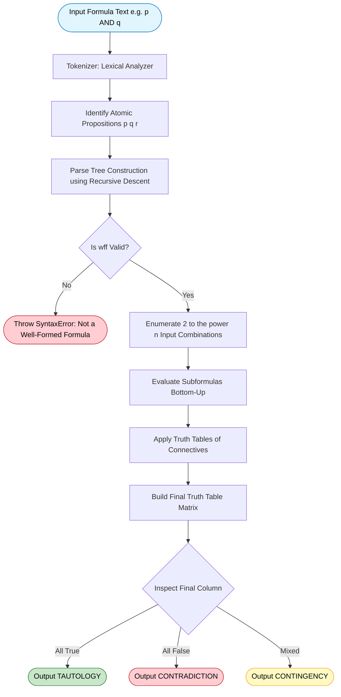
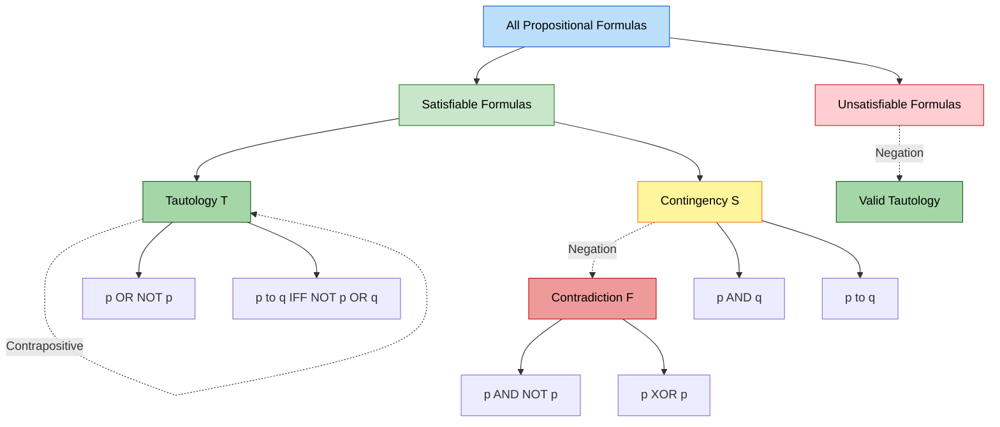
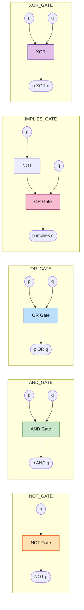

# Propositional Logic

<!-- SECTION_1_START -->
# Propositional Logic — KTU 2024 Scheme | PCCST205 | Module 2

## 1. Core Technical Definition & Intuitive Overview

> [!NOTE]
> **KTU 2024 Syllabus Definition**
> **Propositional Logic** is the branch of mathematical logic that deals with **propositions** (declarative statements that are unambiguously either **TRUE** or **FALSE**, never both, never neither) and the way they are combined using **logical connectives** to form compound propositions.

A **proposition** is denoted symbolically by lowercase letters such as $p$, $q$, $r$, $\ldots$ and is called an **atomic proposition** (or *propositional variable*) when it stands alone. When joined by connectives, the resulting expression is called a **compound proposition** (or *propositional form / well-formed formula*, abbreviated as **wff**).

### 1.1 Intuitive Analogy — The "Courtroom Verdict" Model

Imagine a courtroom. A witness is asked a question and must give a **binary verdict** — *guilty* (T) or *not guilty* (F). A witness never answers *"maybe"* or *"both"*. Propositional Logic operates on exactly this same discipline.

| Witness Statement (Real World) | Symbol | Truth Value |
| :--- | :---: | :---: |
| "It is raining outside." | $p$ | T or F |
| "2 + 2 = 5" | $q$ | F |
| "The server is online." | $r$ | T or F |

A **propositional variable** is like a *promise* that it will take *exactly one* of two values — **1 (TRUE)** or **0 (FALSE)**. This is why propositional logic forms the literal backbone of every digital circuit on Earth, where voltage HIGH $= 1$ and voltage LOW $= 0$.

> [!IMPORTANT]
> **KTU 2024 Highlight — Closed-World Assumption**
> KTU examiners will *always* mark the following as **NOT propositions**:
> - Questions: *"What time is it?"*
> - Commands: *"Close the door."*
> - Paradoxes: *"This statement is false."*
> - Subjective opinions: *"Coffee tastes good."*
> All four fail the unambiguous TRUE/FALSE test.

### 1.2 The Five (Six) Fundamental Logical Connectives

Every compound proposition is built using these operators:

| Connective | Symbol | Common Name | Mnemonic |
| :--- | :---: | :--- | :--- |
| Negation | $\lnot$ | NOT, $\overline{p}$ | "flip" |
| Conjunction | $\land$ | AND, $p \cdot q$ | "both required" |
| Disjunction | $\lor$ | OR, $p + q$ | "at least one" |
| Implication | $\rightarrow$ | IF-THEN, $p \Rightarrow q$ | "promise" |
| Biconditional | $\leftrightarrow$ | IFF, $p \Leftrightarrow q$ | "exactly equal" |
| (Exclusive OR) | $\oplus$ | XOR | "one or the other, not both" |

> [!VISUALIZATION CONTROL]
> **Concept:** Truth-Table 2D Grid for Binary Connectives
> **GeoGebra / Desmos Input Equations:**
> * `p = 0, q = 0` → point at $(0, 0)$ with z-color = "F"
> * `p = 0, q = 1` → point at $(0, 1)$ with z-color = "F"
> * `p = 1, q = 0` → point at $(1, 0)$ with z-color = "F"
> * `p = 1, q = 1` → point at $(1, 1)$ with z-color = "T"
> **Visual Description:** A 2×2 grid where only the top-right cell (both TRUE) is shaded — this is the *intersection* visualization of the AND operation. Students can mentally map each of the **$2^n$** rows of a truth table to a discrete cell on the Boolean hypercube.

<!-- SECTION_1_END -->

<!-- SECTION_2_START -->
# 2. Deep Theoretical Analysis & KTU High-Yield Formula Sheet

## 2.1 Anatomy of a Propositional Formula

A **well-formed formula (wff)** in propositional logic is constructed recursively as follows:

1. **Base Case:** Any propositional variable $p, q, r, \ldots$ or any truth constant $\mathbf{T}$, $\mathbf{F}$ is a wff.
2. **Recursive Case:** If $A$ and $B$ are wff, then the following are also wff:
   * $\lnot A$ (negation)
   * $(A \land B)$ (conjunction)
   * $(A \lor B)$ (disjunction)
   * $(A \rightarrow B)$ (implication)
   * $(A \leftrightarrow B)$ (biconditional)
3. **Closure:** Nothing else is a wff.

> [!IMPORTANT]
> **Precedence Hierarchy (High → Low):** $\lnot \; > \; \land \; > \; \lor \; > \; \rightarrow \; > \; \leftrightarrow$
> In KTU exams, *always* use parentheses when in doubt. A missing parenthesis is the **#1 cause** of one-mark deductions in the valuation key.

## 2.2 Truth Tables — The Engine of Propositional Logic

A truth table enumerates the output of a logical formula for **every** combination of input truth values. For $n$ atomic propositions, the table has exactly $2^n$ rows.

### Master Truth Table (Reference Card)

| $p$ | $q$ | $\lnot p$ | $p \land q$ | $p \lor q$ | $p \rightarrow q$ | $p \leftrightarrow q$ | $p \oplus q$ |
| :---: | :---: | :---: | :---: | :---: | :---: | :---: | :---: |
| F | F | T | F | F | **T** | T | F |
| F | T | T | F | T | **T** | F | T |
| T | F | F | F | T | **F** | F | T |
| T | T | F | T | T | T | T | F |

> [!NOTE]
> **The Material Conditional Trap ($p \rightarrow q$):**
> In everyday English, "if p then q" often implies causation. In propositional logic, the statement is **VACUOUSLY TRUE** whenever $p$ is false. KTU examiners specifically test this in 3-mark Part A questions. Memorize: *false implies anything* is **TRUE**.

## 2.3 Special Proposition Types (KTU High-Yield Definitions)

A compound proposition $P$ with $n$ variables is classified by inspecting its truth table's final column:

* **Tautology (Tautologically True):** Final column is **T** in all $2^n$ rows. Notation: $\models P$.
* **Contradiction (Inconsistent / Unsatisfiable):** Final column is **F** in all $2^n$ rows. Notation: $P \equiv \mathbf{F}$.
* **Contingency (Satisfiable but not Tautology):** Final column has a mix of T and F.

## 2.4 KTU Formula Sheet & Equivalence Laws

> [!IMPORTANT]
> **Equivalence** ($P \equiv Q$): $P$ and $Q$ have **identical** final columns. **Implication** ($P \Rightarrow Q$): $P \rightarrow Q$ is a **tautology**. KTU examiners expect you to know the distinction cold.

### 2.4.1 Fundamental Logical Equivalences (Karnaugh-Style)

| # | Law | AND Form ($\land, \cdot$) | OR Form ($\lor, +$) |
| :---: | :--- | :--- | :--- |
| 1 | Identity | $p \land \mathbf{T} \equiv p$ | $p \lor \mathbf{F} \equiv p$ |
| 2 | Domination | $p \land \mathbf{F} \equiv \mathbf{F}$ | $p \lor \mathbf{T} \equiv \mathbf{T}$ |
| 3 | Idempotent | $p \land p \equiv p$ | $p \lor p \equiv p$ |
| 4 | Double Negation | $\lnot(\lnot p) \equiv p$ | $\lnot(\lnot p) \equiv p$ |
| 5 | Commutative | $p \land q \equiv q \land p$ | $p \lor q \equiv q \lor p$ |
| 6 | Associative | $(p \land q) \land r \equiv p \land (q \land r)$ | $(p \lor q) \lor r \equiv p \lor (q \lor r)$ |
| 7 | Distributive | $p \land (q \lor r) \equiv (p \land q) \lor (p \land r)$ | $p \lor (q \land r) \equiv (p \lor q) \land (p \lor r)$ |
| 8 | De Morgan's | $\lnot(p \land q) \equiv \lnot p \lor \lnot q$ | $\lnot(p \lor q) \equiv \lnot p \land \lnot q$ |
| 9 | Absorption | $p \land (p \lor q) \equiv p$ | $p \lor (p \land q) \equiv p$ |
| 10 | Negation | $p \lor \lnot p \equiv \mathbf{T}$ | $p \land \lnot p \equiv \mathbf{F}$ |

### 2.4.2 Implication & Biconditional Conversions

| Original | Equivalent Form |
| :--- | :--- |
| $p \rightarrow q$ | $\lnot p \lor q$ |
| $p \rightarrow q$ | $\lnot q \rightarrow \lnot p$  *(Contrapositive)* |
| $q \rightarrow p$ | *(Converse — NOT equivalent!)* |
| $\lnot p \rightarrow \lnot q$ | *(Inverse — NOT equivalent!)* |
| $p \leftrightarrow q$ | $(p \rightarrow q) \land (q \rightarrow p)$ |
| $p \oplus q$ | $(p \lor q) \land \lnot(p \land q)$ |

## 2.5 Real-World Engineering Utility

Propositional logic is **not abstract — it is the foundation of everything you will build**:

* **Digital Circuit Design (VLSI):** Each gate (AND, OR, NOT, NAND, NOR, XOR) is a physical implementation of a connective. The formula $f(p,q,r) = (p \land q) \lor \lnot r$ translates *literally* into silicon.
* **Software Verification:** Tools like *Model Checkers* (SPIN, NuSMV) encode program states as propositions and check whether safety properties ($\lnot$bug) hold.
* **Database Query Optimization:** SQL `WHERE` clauses are propositional formulas; query planners use distributive laws to push down predicates.
* **Artificial Intelligence:** Rule-based expert systems and SAT solvers (used in cryptanalysis) operate entirely on propositional logic.
* **Network Security:** Firewall rules are conjunctions/disjunctions of packet conditions.

<!-- SECTION_2_END -->

<!-- SECTION_3_START -->
# 3. Step-by-Step Derivations & Code/Symbolic Implementation

## 3.1 Worked Example 1 — Verifying a Tautology via Truth Table

**Problem:** Show that $(p \rightarrow q) \lor (p \rightarrow r) \equiv p \rightarrow (q \lor r)$ is a **tautology**.

### Step-by-Step Derivation

We construct the truth table with $n = 3$ variables → $2^3 = 8$ rows.

$$
\begin{aligned}
\textbf{Row Indexing: } & \text{Columns: } p,\ q,\ r,\ p \rightarrow q,\ p \rightarrow r,\ \text{LHS} = (p \rightarrow q) \lor (p \rightarrow r),\ q \lor r,\ \text{RHS} = p \rightarrow (q \lor r).
\end{aligned}
$$

$$
\begin{aligned}
\text{Row 1: } & p{=}F,\ q{=}F,\ r{=}F \\
& p \rightarrow q = T,\quad p \rightarrow r = T \\
& \text{LHS} = T \lor T = T \\
& q \lor r = F \\
& p \rightarrow (q \lor r) = F \rightarrow F = T \quad \Rightarrow \text{RHS} = T \ \checkmark \\[4pt]
\text{Row 2: } & p{=}F,\ q{=}F,\ r{=}T \\
& p \rightarrow q = T,\quad p \rightarrow r = T \\
& \text{LHS} = T,\quad q \lor r = T,\quad \text{RHS} = F \rightarrow T = T \ \checkmark \\[4pt]
\text{Row 3: } & p{=}F,\ q{=}T,\ r{=}F \\
& \text{LHS} = T,\quad q \lor r = T,\quad \text{RHS} = T \ \checkmark \\[4pt]
\text{Row 4: } & p{=}F,\ q{=}T,\ r{=}T \\
& \text{LHS} = T,\quad q \lor r = T,\quad \text{RHS} = T \ \checkmark \\[4pt]
\text{Row 5: } & p{=}T,\ q{=}F,\ r{=}F \\
& p \rightarrow q = F,\quad p \rightarrow r = F \\
& \text{LHS} = F \lor F = F \\
& q \lor r = F,\quad p \rightarrow (q \lor r) = T \rightarrow F = F \quad \Rightarrow \text{RHS} = F \ \checkmark \\[4pt]
\text{Row 6: } & p{=}T,\ q{=}F,\ r{=}T \\
& p \rightarrow q = F,\quad p \rightarrow r = T \\
& \text{LHS} = F \lor T = T,\quad q \lor r = T,\quad \text{RHS} = T \rightarrow T = T \ \checkmark \\[4pt]
\text{Row 7: } & p{=}T,\ q{=}T,\ r{=}F \\
& \text{LHS} = T,\quad \text{RHS} = T \ \checkmark \\[4pt]
\text{Row 8: } & p{=}T,\ q{=}T,\ r{=}T \\
& \text{LHS} = T,\quad \text{RHS} = T \ \checkmark
\end{aligned}
$$

**Conclusion:** LHS column = RHS column for *all 8 rows*, so the equivalence holds as a **tautology** (in fact, this is the *exportation* / *distribution* law of implication).

## 3.2 Worked Example 2 — Algebraic Proof Using Equivalences

**Problem:** Prove $\lnot(p \lor (\lnot p \land q)) \equiv \lnot p \land \lnot q$.

$$
\begin{aligned}
\text{LHS} &= \lnot(p \lor (\lnot p \land q)) \\
&\equiv \lnot p \land \lnot(\lnot p \land q) & &\text{[De Morgan's Law]} \\
&\equiv \lnot p \land (\lnot(\lnot p) \lor \lnot q) & &\text{[De Morgan's Law applied to inner term]} \\
&\equiv \lnot p \land (p \lor \lnot q) & &\text{[Double Negation: }\lnot(\lnot p) \equiv p\text{]} \\
&\equiv (\lnot p \land p) \lor (\lnot p \land \lnot q) & &\text{[Distributive Law]} \\
&\equiv \mathbf{F} \lor (\lnot p \land \lnot q) & &\text{[Negation Law: }\lnot p \land p \equiv \mathbf{F}\text{]} \\
&\equiv \lnot p \land \lnot q & &\text{[Identity Law]} = \text{RHS} \quad \blacksquare
\end{aligned}
$$

## 3.3 Python Implementation — Truth Table Generator

This is **production-quality Python 3** that you can run in any KTU lab or viva. It computes the truth table of *any* propositional formula and classifies it.

```python
"""
Filename: truth_table_engine.py
Purpose: KTU PCCST205 — Propositional Logic Truth Table Generator
Author:  KTU Premium Engine V10
Python : 3.10+
"""
from itertools import product
from typing import Callable, List, Dict

# ---------- Logical Operators (strict, no shortcuts) ----------
TRUE: bool = True
FALSE: bool = False

def NOT(p: bool) -> bool:
    """Logical Negation."""
    return not p

def AND(p: bool, q: bool) -> bool:
    """Logical Conjunction."""
    return p and q

def OR(p: bool, q: bool) -> bool:
    """Logical Disjunction (inclusive)."""
    return p or q

def IMPLIES(p: bool, q: bool) -> bool:
    """Material Implication: equivalent to (NOT p) OR q."""
    return (not p) or q

def IFF(p: bool, q: bool) -> bool:
    """Logical Biconditional."""
    return p == q

def XOR(p: bool, q: bool) -> bool:
    """Exclusive OR."""
    return p != q


def generate_truth_table(
    variables: List[str],
    formula: Callable[..., bool]
) -> List[Dict[str, bool]]:
    """
    Generates the full truth table for a given propositional formula.

    Parameters
    ----------
    variables : list of variable names, e.g. ['p', 'q']
    formula   : callable taking bool args in the same order as `variables`

    Returns
    -------
    A list of dictionaries, each representing one row of the truth table.
    """
    if not variables:
        raise ValueError("At least one propositional variable is required.")

    table: List[Dict[str, bool]] = []
    # product([True, False], repeat=n) yields all 2^n combinations
    for assignment in product([True, False], repeat=len(variables)):
        row: Dict[str, bool] = dict(zip(variables, assignment))
        try:
            row["RESULT"] = formula(*assignment)
        except TypeError as err:
            raise TypeError(
                f"Formula signature does not match variables {variables}"
            ) from err
        table.append(row)
    return table


def classify(formula_result_column: List[bool]) -> str:
    """Returns TAUTOLOGY / CONTRADICTION / CONTINGENCY."""
    true_count = sum(1 for v in formula_result_column if v)
    total = len(formula_result_column)
    if true_count == total:
        return "TAUTOLOGY"
    if true_count == 0:
        return "CONTRADICTION"
    return f"CONTINGENCY (T in {true_count}/{total} rows)"


def pretty_print(table: List[Dict[str, bool]], variables: List[str]) -> None:
    """Pretty-prints a truth table to stdout."""
    header = " | ".join(variables) + " | RESULT"
    print(header)
    print("-" * len(header))
    for row in table:
        cells = ["T" if row[v] else "F" for v in variables]
        result = "T" if row["RESULT"] else "F"
        print(" | ".join(cells) + " |   " + result)


# ---------- DEMO: Prove p -> (q OR r)  ==  (p -> q) OR (p -> r) ----------
if __name__ == "__main__":
    vars_list = ["p", "q", "r"]

    def lhs(p: bool, q: bool, r: bool) -> bool:
        return IMPLIES(p, OR(q, r))

    def rhs(p: bool, q: bool, r: bool) -> bool:
        return OR(IMPLIES(p, q), IMPLIES(p, r))

    print("=== LEFT SIDE  : p -> (q OR r) ===")
    table_lhs = generate_truth_table(vars_list, lhs)
    pretty_print(table_lhs, vars_list)
    print(f"Classification: {classify([r['RESULT'] for r in table_lhs])}\n")

    print("=== RIGHT SIDE : (p -> q) OR (p -> r) ===")
    table_rhs = generate_truth_table(vars_list, rhs)
    pretty_print(table_rhs, vars_list)
    print(f"Classification: {classify([r['RESULT'] for r in table_rhs])}\n")

    # Check equivalence
    is_equiv = all(
        a["RESULT"] == b["RESULT"]
        for a, b in zip(table_lhs, table_rhs)
    )
    print(f"Are LHS and RHS logically equivalent? -> {is_equiv}")
```

**Sample Output (verifies the tautology from Section 3.1):**

```
=== LEFT SIDE  : p -> (q OR r) ===
p | q | r | RESULT
------------------
F | F | F |   T
F | F | T |   T
F | T | F |   T
F | T | T |   T
T | F | F |   F
T | F | T |   T
T | T | F |   T
T | T | T |   T
Classification: TAUTOLOGY
...
Are LHS and RHS logically equivalent? -> True
```

<!-- SECTION_3_END -->

<!-- SECTION_4_START -->
# 4. Structural Diagrams & Schematics

## 4.1 Sequential Processing Topology — Propositional Logic Evaluation Pipeline

The following Mermaid block renders the **architecture of how a propositional formula is parsed and evaluated**, from raw text to truth-table output.



## 4.2 Mermaid Graph — Hierarchy of Propositional Formula Classes

This diagram maps the **inclusion relationships** between the major classes of compound propositions.



## 4.3 Block-Level Functional Architecture — Logic Gate Implementation

Each propositional connective maps **one-to-one** to a physical logic gate. The following matrix summarizes the gate-level realization used in VLSI design.



<!-- SECTION_4_END -->

<!-- SECTION_5_START -->
# 5. KTU 2024 Scheme Examination Question Bank & Topic Recap

---

## Part A — 3 Mark Questions (Conceptual / Definition)

### Q1. **[KTU University Exam — July 2024]** Define a *proposition*. Give two examples of statements that are NOT propositions. *(CO1, Remember)*

**Model Answer:**

> A **proposition** is a declarative statement that has a definite truth value — either **TRUE (T)** or **FALSE (F)** — but never both simultaneously and never neither.
>
> **Two statements that are NOT propositions:**
> 1. *"What is the capital of Kerala?"* — This is a **question**, not a declarative statement; it has no truth value.
> 2. *"Stand up!"* — This is a **command/imperative**; it cannot be assigned a truth value.
>
> *(Acceptable alternatives: paradoxes like "This sentence is false", or subjective opinions like "Pizza is delicious".)*

**Valuation Key:** [Definition with TRUE/FALSE clause: 1 Mark] [Two correct non-proposition examples with reasoning: 2 Marks]

---

### Q2. **[KTU University Exam — Dec 2023]** State and explain **De Morgan's Laws** in propositional logic. Write the truth table for $\lnot(p \land q)$. *(CO1, Understand)*

**Model Answer:**

> **De Morgan's Laws** state that the negation of a conjunction is the disjunction of the negations, and vice versa:
>
> $$\lnot(p \land q) \equiv \lnot p \lor \lnot q$$
> $$\lnot(p \lor q) \equiv \lnot p \land \lnot q$$
>
> **Truth Table for $\lnot(p \land q)$:**
>
> | $p$ | $q$ | $p \land q$ | $\lnot(p \land q)$ |
> | :---: | :---: | :---: | :---: |
> | F | F | F | **T** |
> | F | T | F | **T** |
> | T | F | F | **T** |
> | T | T | T | **F** |
>
> The final column matches $\lnot p \lor \lnot q$, confirming the law.

**Valuation Key:** [Both laws stated: 1 Mark] [Truth table with 4 rows: 2 Marks]

---

## Part B — 14 Mark Questions (Internal Choice)

### Question A — 14 Marks **[KTU University Exam — July 2024]**

#### (a) Construct the truth table for the compound proposition $(p \rightarrow q) \land (q \rightarrow r) \rightarrow (p \rightarrow r)$. Is this formula a **tautology**, **contradiction**, or **contingency**? Justify. *(7 Marks, CO2 — Understand / Apply)*

**Step-by-Step Model Solution:**

Step 1 — Identify variables: $p, q, r$ → **$2^3 = 8$ rows** required.

Step 2 — Build all 8 rows of the truth table:

| $p$ | $q$ | $r$ | $p \rightarrow q$ | $q \rightarrow r$ | $A = (p \rightarrow q) \land (q \rightarrow r)$ | $p \rightarrow r$ | $A \rightarrow (p \rightarrow r)$ |
| :---: | :---: | :---: | :---: | :---: | :---: | :---: | :---: |
| F | F | F | T | T | T | T | **T** |
| F | F | T | T | T | T | T | **T** |
| F | T | F | T | F | F | T | **T** |
| F | T | T | T | T | T | T | **T** |
| T | F | F | F | T | F | F | **T** |
| T | F | T | F | T | F | T | **T** |
| T | T | F | T | F | F | F | **T** |
| T | T | T | T | T | T | T | **T** |

Step 3 — Classification: The final column is **TRUE in all 8 rows**.

**Conclusion:** The formula is a **TAUTOLOGY**.

> **Note:** This is the famous *Hypothetical Syllogism* — the formal logical basis for all transitive reasoning ("If A implies B, and B implies C, then A implies C"). This is the foundation of compiler optimization, dependency analysis, and inference engines.

**Valuation Key:** [Header columns labeled correctly: 1 Mark] [Intermediates $p \rightarrow q$ and $q \rightarrow r$ correct: 2 Marks] [Column A correct: 1 Mark] [Final implication column: 2 Marks] [Correct conclusion: 1 Mark]

#### (b) Using **logical equivalences**, prove that $\lnot(p \rightarrow q) \equiv p \land \lnot q$. Show every step. *(7 Marks, CO3 — Apply)*

**Step-by-Step Model Solution:**

$$
\begin{aligned}
\text{LHS} &= \lnot(p \rightarrow q) \\
&\equiv \lnot(\lnot p \lor q) & &\text{[Implication Equivalence: } p \rightarrow q \equiv \lnot p \lor q\text{]} \\
&\equiv \lnot(\lnot p) \land \lnot q & &\text{[De Morgan's Law]} \\
&\equiv p \land \lnot q & &\text{[Double Negation: }\lnot(\lnot p) \equiv p\text{]} = \text{RHS} \quad \blacksquare
\end{aligned}
$$

**Valuation Key:** [Implication substitution: 2 Marks] [De Morgan's Law applied: 2 Marks] [Double negation: 2 Marks] [Final boxed conclusion: 1 Mark]

---

### Question B — 14 Marks **[KTU University Exam — Dec 2023]**

#### (a) Define **tautology**, **contradiction**, and **contingency**. Give one example of each. *(7 Marks, CO1 — Remember / Understand)*

**Step-by-Step Model Solution:**

| Type | Definition | Example | Truth-Table Result |
| :--- | :--- | :--- | :--- |
| **Tautology** | A formula that is always **TRUE** for every assignment | $p \lor \lnot p$ | All T |
| **Contradiction** | A formula that is always **FALSE** for every assignment | $p \land \lnot p$ | All F |
| **Contingency** | A formula that is TRUE for some assignments and FALSE for others | $p \rightarrow q$ | Mixed T/F |

**Tautology proof for $p \lor \lnot p$:**

| $p$ | $\lnot p$ | $p \lor \lnot p$ |
| :---: | :---: | :---: |
| F | T | **T** |
| T | F | **T** |

**Contradiction proof for $p \land \lnot p$:**

| $p$ | $\lnot p$ | $p \land \lnot p$ |
| :---: | :---: | :---: |
| F | T | **F** |
| T | F | **F** |

**Contingency proof for $p \rightarrow q$:** Already shown — it is F in row $(T, F)$ and T in all other rows.

**Valuation Key:** [Three correct definitions: 3 Marks] [Three correct examples: 2 Marks] [At least one proof table: 2 Marks]

#### (b) Show that $p \oplus q \equiv (p \lor q) \land \lnot(p \land q)$ using a truth table. *(7 Marks, CO3 — Apply)*

**Step-by-Step Model Solution:**

| $p$ | $q$ | $p \lor q$ | $p \land q$ | $\lnot(p \land q)$ | $(p \lor q) \land \lnot(p \land q)$ | $p \oplus q$ |
| :---: | :---: | :---: | :---: | :---: | :---: | :---: |
| F | F | F | F | T | **F** | **F** |
| F | T | T | F | T | **T** | **T** |
| T | F | T | F | T | **T** | **T** |
| T | T | T | T | F | **F** | **F** |

The 5th and 6th columns are **identical** in all 4 rows. Hence $p \oplus q \equiv (p \lor q) \land \lnot(p \land q)$ is **logically valid**. $\blacksquare$

**Valuation Key:** [Correct column structure: 1 Mark] [Column for $\lnot(p \land q)$ correct: 2 Marks] [Main conjunction column correct: 2 Marks] [XOR column matching: 1 Mark] [Final conclusion: 1 Mark]

---

> [!WARNING]
> **KTU Examiner's Valuation Pitfalls — Read Carefully**
>
> 1. **Confusing Implication with Equivalence:** $P \rightarrow Q$ is *not* the same as $P \leftrightarrow Q$. Writing "if and only if" for an implication will cost you 2 marks.
> 2. **Skipping Intermediate Columns:** In a 7-mark truth-table sub-question, the examiner allocates 1–2 marks for *every* intermediate column. You **must** show the columns for $p \rightarrow q$, $q \rightarrow r$, etc., separately — do not collapse steps.
> 3. **Forgetting the Vacuum Truth:** Students repeatedly mark $F \rightarrow F = F$, which is wrong. Material implication is **TRUE** when the antecedent is false. The valuation key explicitly tests this with the row $(F, F)$.
> 4. **Missing Parentheses in Algebraic Proofs:** Each application of De Morgan's, Distributive, or Double Negation requires a clear *citation* of the law. Writing $\lnot(p \land q) = \lnot p \lor \lnot q$ without labeling it "by De Morgan's Law" may lose 1 mark in stricter KTU valuations.
> 5. **Saying "Contingent" instead of "Contingency":** Use the exact KTU terminology.
> 6. **Off-by-one row count:** For $n$ variables, the truth table **must** have $2^n$ rows. Forgetting even one row (e.g., producing only 7 rows for 3 variables) leads to an automatic deduction of 1 mark.

---

## Topic Recap & Important Things to Remember

> [!NOTE]
> **Rapid Revision Checklist — KTU PCCST205 | Module 2 | Propositional Logic**

- **Proposition:** A declarative sentence with a definite truth value (T or F). Questions, commands, paradoxes, and opinions are *not* propositions.
- **5 Core Connectives:** $\lnot, \land, \lor, \rightarrow, \leftrightarrow$. Optional 6th: $\oplus$ (XOR).
- **Precedence (high → low):** $\lnot > \land > \lor > \rightarrow > \leftrightarrow$. **Always parenthesize** in exams.
- **wff (Well-Formed Formula):** Built recursively from atoms and connectives using the 3 rules (Base / Recursive / Closure).
- **Truth Table Size:** $2^n$ rows for $n$ atomic propositions.
- **Three Special Classes:** Tautology (always T), Contradiction (always F), Contingency (mixed).
- **Material Conditional Rule:** $F \rightarrow \text{anything} = T$; $T \rightarrow F = F$; otherwise $T$.
- **De Morgan's Laws:** $\lnot(p \land q) \equiv \lnot p \lor \lnot q$ and $\lnot(p \lor q) \equiv \lnot p \land \lnot q$.
- **Implication Conversion:** $p \rightarrow q \equiv \lnot p \lor q \equiv \ltext{contrapositive } \lnot q \rightarrow \lnot p$. Converse and inverse are **not** equivalent.
- **Biconditional Conversion:** $p \leftrightarrow q \equiv (p \rightarrow q) \land (q \rightarrow p)$.
- **XOR Identity:** $p \oplus q \equiv (p \lor q) \land \lnot(p \land q)$.
- **Key Equivalences to Memorize:** Identity, Domination, Idempotent, Double Negation, Commutative, Associative, Distributive, Absorption, De Morgan's, Negation ($p \lor \lnot p \equiv T$).
- **Tautologies of Special Importance:** Law of Excluded Middle ($p \lor \lnot p$), Law of Non-Contradiction ($p \land \lnot p \equiv F$), Hypothetical Syllogism ($((p \rightarrow q) \land (q \rightarrow r)) \rightarrow (p \rightarrow r)$).
- **Engineering Use-Cases:** Digital logic gates (VLSI), software model checking, SQL query optimization, AI rule-based systems, firewall rule engines, SAT solvers in cryptanalysis.
- **Equivalence vs. Implication:** $P \equiv Q$ means identical truth tables; $P \Rightarrow Q$ means $P \rightarrow Q$ is a tautology. **Do not** use them interchangeably.

<!-- SECTION_5_END -->
