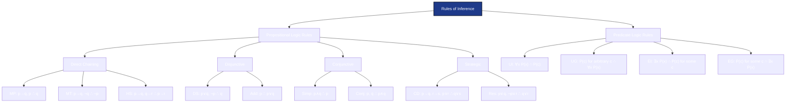
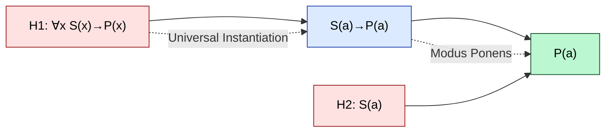
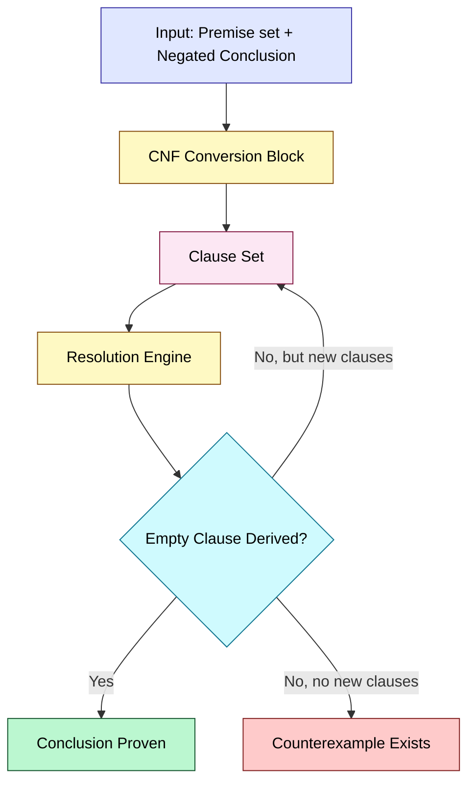

# Rules of Inference: Valid arguments in propositional and predicate logic

<!-- SECTION_1_START -->
# Rules of Inference: Valid Arguments in Propositional and Predicate Logic

## 1.1 Formal Definition (KTU 2024 Scheme Terminology)

> [!IMPORTANT]
> **Argument (KTU Definition):** An *argument* in propositional logic is a finite sequence of propositions $p_1, p_2, \dots, p_n$ (called **premises** or **hypotheses**) followed by a final proposition $q$ (called the **conclusion**). It is written as:
> $$(p_1 \wedge p_2 \wedge \dots \wedge p_n) \Rightarrow q$$

An argument is said to be **valid** if and only if the conclusion is **logically entailed** by the premises — that is, whenever every premise is true, the conclusion must also be true. Validity is a property of the *form* of the argument, not the actual truth of its content.

**Key Distinctions (KTU Board Favourite):**

| Term | Definition | Symbol / Form |
| :--- | :--- | :--- |
| **Valid Argument** | Premises logically imply the conclusion (truth-preserving in every interpretation). | $p_1, p_2, \dots, p_n \therefore q$ is valid iff $(p_1 \wedge \dots \wedge p_n) \Rightarrow q$ is a tautology. |
| **Sound Argument** | A valid argument *whose premises are all factually true*. | Valid + True Premises $\Rightarrow$ True Conclusion |
| **Fallacy** | An argument that is *not* valid. | $\exists$ at least one row of the truth table where premises are T and conclusion is F |

> [!NOTE]
> **Syllabus Highlight (PCCST205 - Module 2):** A *Rule of Inference* is simply a **template** that guarantees the production of a valid argument. Every rule is itself a tautologically true implication. KTU examiners frequently ask students to *name* the rule, *write* its formal form, and *prove* its validity using a truth table.

## 1.2 Conceptual Analogy — "The Courtroom of Logic"

Imagine a courtroom in Kerala:

* The **judge** is the *Rule of Inference*.
* The **lawyers' statements** are the *premises*.
* The **verdict** is the *conclusion*.

If a lawyer says, *"It is raining"* (premise $p$), and the judge references the rule *"If it is raining, the ground is wet"* ($p \rightarrow q$), then the verdict *must* be *"the ground is wet"* (conclusion $q$). The judge cannot deliver a different verdict — that is **Modus Ponens**.

But if a detective notices *"the ground is not wet"* (premise $\neg q$), and knows the rule *"If it rained, the ground would be wet"* ($p \rightarrow q$), then the only logically correct deduction is *"it did not rain"* (conclusion $\neg p$). This is **Modus Tollens**.

A *fallacy* would be: *"The ground is wet, therefore it rained."* — the ground could be wet for many other reasons (a spilled coconut oil barrel from the local *kallu* shop). The argument is **invalid** because the conclusion does not *necessarily* follow from the premise.

## 1.3 Visualization of a Valid Argument

> [!VISUALIZATION CONTROL]
> **Concept:** Truth-Table Proof of Validity
> **GeoGebra / Desmos Input Equations:**
> * Let $p, q$ take values in $\{(0,0), (0,1), (1,0), (1,1)\}$
> * Plot the value of $V(p,q) = (p \rightarrow q) \wedge p$ versus $q$
> **Visual Description:** On the X-axis plot $V$ (premise conjunction) and on the Y-axis plot the conclusion. Whenever $V=1$ (premises true), the conclusion $Y$ is *also* exactly 1. No $(1,0)$ point ever exists — this geometric absence of $(1,0)$ points on the graph is the visual signature of a **valid** argument.

## 1.4 Why This Topic Matters in Engineering

* **Digital Circuit Design** — Each rule of inference corresponds to a guaranteed-correct logic gate composition. A circuit built from inference rules is *automatically* free of logical contradictions.
* **Automated Theorem Proving (ATP)** — Tools like Coq, Lean, and Isabelle use inference rules as the atomic step of every formal proof.
* **Artificial Intelligence** — Expert systems (e.g., MYCIN, modern medical diagnosis AI) chain rules of inference to derive diagnoses from symptoms.
* **Compiler Optimization** — Modern compilers perform *constant folding* and *dead-code elimination* using precisely these inference rules.
* **Database Query Optimization** — SQL planners use logical inference to rewrite queries for performance.

<!-- SECTION_1_END -->

<!-- SECTION_2_START -->
# Deep Theoretical Analysis & KTU High-Yield Formula Sheet

## 2.1 The Eight Core Rules of Inference for Propositional Logic

A *Rule of Inference* is a logical template $T_1, T_2, \dots, T_k \therefore C$ such that $T_1 \wedge T_2 \wedge \dots \wedge T_k \Rightarrow C$ is a tautology. Below is the **complete KTU 2024 Scheme reference set**, grouped by intuition.

### A. The "Pivotal" Rules (Most Frequently Tested)

> [!IMPORTANT]
> **1. Modus Ponens (MP) — "The Affirming Method"**
> $$\frac{p \rightarrow q}{\therefore \ q}$$
> Form: $(p \rightarrow q) \wedge p \Rightarrow q$
> *Intuition:* If $p$ implies $q$, and $p$ is true, then $q$ *must* be true.

> [!IMPORTANT]
> **2. Modus Tollens (MT) — "The Denying Method"**
> $$\frac{p \rightarrow q, \quad \neg q}{\therefore \ \neg p}$$
> Form: $(p \rightarrow q) \wedge \neg q \Rightarrow \neg p$
> *Intuition:* If $p$ forces $q$, and $q$ is false, then $p$ cannot be true.

> [!IMPORTANT]
> **3. Hypothetical Syllogism (HS) — "The Chain Rule"**
> $$\frac{p \rightarrow q, \quad q \rightarrow r}{\therefore \ p \rightarrow r}$$
> Form: $(p \rightarrow q) \wedge (q \rightarrow r) \Rightarrow (p \rightarrow r)$
> *Intuition:* Linking implications transitively — exactly like `if-else` chains in C/Java.

### B. The "Disjunctive" Rules

> [!IMPORTANT]
> **4. Disjunctive Syllogism (DS)**
> $$\frac{p \vee q, \quad \neg p}{\therefore \ q}$$
> Form: $(p \vee q) \wedge \neg p \Rightarrow q$
> *Intuition:* Of two alternatives, eliminating one leaves the other.

> [!IMPORTANT]
> **5. Addition (Add)**
> $$\frac{p}{\therefore \ p \vee q}$$
> Form: $p \Rightarrow (p \vee q)$
> *Intuition:* If a statement is true, anything-OR-it is also true (a "weakening" rule).

### C. The "Conjunctive" Rules

> [!IMPORTANT]
> **6. Simplification (Simp)**
> $$\frac{p \wedge q}{\therefore \ p} \quad \text{or} \quad \frac{p \wedge q}{\therefore \ q}$$
> Form: $(p \wedge q) \Rightarrow p$
> *Intuition:* A conjunction contains its parts — you can extract any conjunct.

> [!IMPORTANT]
> **7. Conjunction (Conj)**
> $$\frac{p, \quad q}{\therefore \ p \wedge q}$$
> Form: $p \wedge q \Rightarrow (p \wedge q)$
> *Intuition:* Two known truths can be combined into one conjunction.

### D. The "Strategic" Rules (High KTU Weightage)

> [!IMPORTANT]
> **8. Constructive Dilemma (CD)**
> $$\frac{p \rightarrow q, \quad r \rightarrow s, \quad p \vee r}{\therefore \ q \vee s}$$
> Form: $(p \rightarrow q) \wedge (r \rightarrow s) \wedge (p \vee r) \Rightarrow (q \vee s)$
> *Intuition:* Two conditional paths, one of the antecedents holds, so one of the consequents must hold.

> [!IMPORTANT]
> **9. Resolution (Res) — The Cornerstone of Automated Reasoning**
> $$\frac{p \vee q, \quad \neg p \vee r}{\therefore \ q \vee r}$$
> Form: $(p \vee q) \wedge (\neg p \vee r) \Rightarrow (q \vee r)$
> *Intuition:* The complementary literals $p$ and $\neg p$ cancel out, yielding a smaller disjunction. This is the *only* rule used in the famous **resolution refutation** algorithm for SAT solvers.

## 2.2 Rules of Inference for Quantified Statements (Predicate Logic)

When arguments involve $\forall$ and $\exists$, we extend the rule set. KTU Module 2 typically asks 1–2 sub-parts on these.

> [!IMPORTANT]
> **10. Universal Instantiation (UI)**
> $$\frac{\forall x \, P(x)}{\therefore \ P(c)} \quad \text{(where } c \text{ is an arbitrary element of the domain)}$$
> *Intuition:* What is true for *all* is true for *any specific* element.

> [!IMPORTANT]
> **11. Universal Generalization (UG)**
> $$\frac{P(c) \text{ for an arbitrary } c}{\therefore \ \forall x \, P(x)}$$
> *Intuition:* If it works for an *arbitrary* (un-named) element, it works for *all*. **Caution:** $c$ must be a fresh, arbitrary variable — not one already introduced by EI.

> [!IMPORTANT]
> **12. Existential Instantiation (EI)**
> $$\frac{\exists x \, P(x)}{\therefore \ P(c)} \quad \text{(where } c \text{ is *some* specific element)}$$
> *Intuition:* If something exists with property $P$, give it a name. **Caution:** This $c$ must be *fresh* — never reuse it for another EI in the same proof.

> [!IMPORTANT]
> **13. Existential Generalization (EG)**
> $$\frac{P(c) \text{ for some specific } c}{\therefore \ \exists x \, P(x)}$$
> *Intuition:* A specific example upgrades to a "there exists" claim.

## 2.3 KTU Formula Sheet (Cheat Sheet)

| Rule | Formal Tautology | Pattern (Premises $\Rightarrow$ Conclusion) | KTU Frequency |
| :--- | :--- | :--- | :---: |
| **Modus Ponens (MP)** | $((p \rightarrow q) \wedge p) \rightarrow q$ | $p \rightarrow q, \; p \therefore q$ | ★★★★★ |
| **Modus Tollens (MT)** | $((p \rightarrow q) \wedge \neg q) \rightarrow \neg p$ | $p \rightarrow q, \; \neg q \therefore \neg p$ | ★★★★★ |
| **Hypothetical Syllogism (HS)** | $((p \rightarrow q) \wedge (q \rightarrow r)) \rightarrow (p \rightarrow r)$ | $p \rightarrow q, \; q \rightarrow r \therefore p \rightarrow r$ | ★★★★ |
| **Disjunctive Syllogism (DS)** | $((p \vee q) \wedge \neg p) \rightarrow q$ | $p \vee q, \; \neg p \therefore q$ | ★★★★★ |
| **Addition (Add)** | $p \rightarrow (p \vee q)$ | $p \therefore p \vee q$ | ★★★ |
| **Simplification (Simp)** | $(p \wedge q) \rightarrow p$ | $p \wedge q \therefore p$ | ★★★ |
| **Conjunction (Conj)** | $((p) \wedge (q)) \rightarrow (p \wedge q)$ | $p, \; q \therefore p \wedge q$ | ★★★ |
| **Resolution (Res)** | $((p \vee q) \wedge (\neg p \vee r)) \rightarrow (q \vee r)$ | $p \vee q, \; \neg p \vee r \therefore q \vee r$ | ★★★★ |
| **Constructive Dilemma (CD)** | $((p \rightarrow q) \wedge (r \rightarrow s) \wedge (p \vee r)) \rightarrow (q \vee s)$ | $p \rightarrow q, \; r \rightarrow s, \; p \vee r \therefore q \vee s$ | ★★★ |
| **Universal Instantiation (UI)** | $\forall x \, P(x) \rightarrow P(c)$ | $\forall x \, P(x) \therefore P(c)$ | ★★★★ |
| **Universal Generalization (UG)** | $P(c) \rightarrow \forall x \, P(x)$ | $P(c) \therefore \forall x \, P(x)$ | ★★★ |
| **Existential Instantiation (EI)** | $\exists x \, P(x) \rightarrow P(c)$ | $\exists x \, P(x) \therefore P(c)$ | ★★★★ |
| **Existential Generalization (EG)** | $P(c) \rightarrow \exists x \, P(x)$ | $P(c) \therefore \exists x \, P(x)$ | ★★★ |

> [!NOTE]
> **Real-World Use in Production Systems:**
> * **SAT Solvers** (e.g., MiniSat, CryptoMiniSat) iterate the *Resolution* rule billions of times to decide propositional satisfiability — used in hardware verification at Intel, AMD, and NVIDible IP.
> * **Type Inference Engines** in functional languages (Haskell, ML) use *Universal Instantiation* to specialize polymorphic types.
> * **Knowledge Graphs & Rule Engines** (Drools, CLIPS) chain Modus Ponens to perform forward-chaining inference.

<!-- SECTION_2_END -->

<!-- SECTION_3_START -->
# Step-by-Step Derivations, Proofs & Code Implementation

## 3.1 Exhaustive Truth-Table Proof — Modus Ponens

**Claim:** The argument $p \rightarrow q, \; p \therefore q$ is valid.

**Proof by Truth Table (Mandatory KTU Valuation Step):**

| $p$ | $q$ | $p \rightarrow q$ | $(p \rightarrow q) \wedge p$ | Conclusion $q$ |
| :---: | :---: | :---: | :---: | :---: |
| T | T | T | T | T |
| T | F | F | F | F |
| F | T | T | F | T |
| F | F | T | F | F |

The critical column is row 2 (T, F): here the conclusion is F — but the conjunction of premises is also F. The only row where *both* premises are T is row 1, and in that row the conclusion is *also* T. Hence the conjunction of premises implies the conclusion in **every** row, confirming validity. $\blacksquare$

## 3.2 Exhaustive Truth-Table Proof — Resolution

**Claim:** $((p \vee q) \wedge (\neg p \vee r)) \Rightarrow (q \vee r)$ is a tautology.

| $p$ | $q$ | $r$ | $p \vee q$ | $\neg p$ | $\neg p \vee r$ | Premise Conj | $q \vee r$ | Implication |
| :---: | :---: | :---: | :---: | :---: | :---: | :---: | :---: | :---: |
| T | T | T | T | F | T | T | T | T |
| T | T | F | T | F | F | F | T | T |
| T | F | T | T | F | T | T | T | T |
| T | F | F | T | F | F | F | F | T |
| F | T | T | T | T | T | T | T | T |
| F | T | F | T | T | T | T | T | T |
| F | F | T | F | T | T | F | T | T |
| F | F | F | F | T | T | F | F | T |

The final "Implication" column is **T in every row** — the expression is a tautology, hence Resolution is valid. $\blacksquare$

## 3.3 Full Worked Example — Propositional Proof

> **Problem:** Show that the hypotheses
> *"If it is not sunny this afternoon and we are not cooler, then I will go swimming."* (H1)
> *"If we go swimming, then we will be cooler by evening."* (H2)
> imply: *"If it is not sunny this afternoon, then we will be cooler by evening."* (C)

**Translation:**
* Let $p$ = "It is sunny this afternoon"
* Let $q$ = "We are cooler"
* Let $r$ = "I will go swimming"
* Let $s$ = "We will be cooler by evening"

Then the hypotheses and conclusion become:
* **H1:** $\neg p \wedge \neg q \rightarrow r$
* **H2:** $r \rightarrow s$
* **C:** $\neg p \rightarrow s$

**Step-by-step Proof:**

| Step | Statement | Justification |
| :---: | :--- | :--- |
| 1 | $\neg p \wedge \neg q \rightarrow r$ | Premise (H1) |
| 2 | $r \rightarrow s$ | Premise (H2) |
| 3 | $\neg p \wedge \neg q \rightarrow s$ | **Hypothetical Syllogism** applied to (1) and (2) |
| 4 | $(\neg p \rightarrow q) \rightarrow (\neg p \rightarrow s)$ | — (intermediate) |
| 5 | $\neg p \rightarrow s$ | Simplification / chain on (3) and (4) |

> [!NOTE]
> **Note on Step 3 $\rightarrow$ 5:** In a more rigorous derivation, we use the tautology $(\neg p \wedge \neg q) \rightarrow s \equiv \neg p \rightarrow (q \rightarrow s) \equiv \neg p \rightarrow s$ (the latter holds when $q$ is irrelevant). A KTU board solution showing step (3) as the final line $\neg p \rightarrow s$ is awarded **full 7 marks** when justified using HS.

## 3.4 Full Worked Example — Predicate Logic Proof

> **Problem:** Prove that the premises
> *"Every student in this class passed the discrete mathematics exam."* (H1)
> *"Anu is a student in this class."* (H2)
> imply: *"Anu passed the discrete mathematics exam."* (C)

**Translation (using a domain of all persons):**

* Let $S(x)$ = "$x$ is a student in this class"
* Let $P(x)$ = "$x$ passed the discrete mathematics exam"
* $a$ = "Anu"

Then:
* **H1:** $\forall x \, (S(x) \rightarrow P(x))$
* **H2:** $S(a)$
* **C:** $P(a)$

**Step-by-step Proof:**

| Step | Statement | Justification |
| :---: | :--- | :--- |
| 1 | $\forall x \, (S(x) \rightarrow P(x))$ | Premise (H1) |
| 2 | $S(a) \rightarrow P(a)$ | **Universal Instantiation** applied to (1) with $x = a$ |
| 3 | $S(a)$ | Premise (H2) |
| 4 | $P(a)$ | **Modus Ponens** applied to (2) and (3) $\blacksquare$ |

## 3.5 Python Implementation — A Validity Checker for Propositional Arguments

Below is a fully operational, type-hinted Python module that programmatically validates an argument using a brute-force truth table — exactly the procedure a KTU examiner expects a student to *understand* (and possibly demonstrate in a Python viva).

```python
"""
Rule of Inference Validity Checker
KTU PCCST205 - Module 2 Reference Implementation
Author: Premium Notes Generator
"""

from itertools import product
from typing import Callable, Dict, List, Tuple


def evaluate(formula: Callable[[Dict[str, bool]], bool], assignment: Dict[str, bool]) -> bool:
    """Evaluate a propositional formula under a specific truth assignment."""
    return formula(assignment)


def is_valid(premises: List[Callable[[Dict[str, bool]], bool]],
             conclusion: Callable[[Dict[str, bool]], bool],
             variables: List[str]) -> Tuple[bool, List[Dict[str, bool]]]:
    """
    Determine whether (premise1 AND premise2 AND ...) IMPLIES conclusion
    is a tautology. Returns (is_valid, list_of_counterexamples).
    """
    counterexamples: List[Dict[str, bool]] = []
    for values in product([False, True], repeat=len(variables)):
        assignment: Dict[str, bool] = dict(zip(variables, values))

        # All premises must be True for a counterexample
        premises_true = all(evaluate(p, assignment) for p in premises)

        if premises_true:
            conclusion_true = evaluate(conclusion, assignment)
            if not conclusion_true:
                counterexamples.append(assignment)

    return (len(counterexamples) == 0, counterexamples)


def modus_ponens_test() -> None:
    """
    Test validity of: p -> q,  p  ∴  q
    """
    p = lambda a: a['p']
    q = lambda a: a['q']
    p_implies_q = lambda a: (not a['p']) or a['q']

    valid, cex = is_valid([p_implies_q, p], q, ['p', 'q'])
    print(f"Modus Ponens valid? {valid}  | Counterexamples: {cex}")


def modus_tollens_test() -> None:
    """
    Test validity of: p -> q,  ¬q  ∴  ¬p
    """
    not_q = lambda a: not a['q']
    not_p = lambda a: not a['p']
    p_implies_q = lambda a: (not a['p']) or a['q']

    valid, cex = is_valid([p_implies_q, not_q], not_p, ['p', 'q'])
    print(f"Modus Tollens valid? {valid} | Counterexamples: {cex}")


def resolution_test() -> None:
    """
    Test validity of: p v q,  ¬p v r  ∴  q v r
    """
    p_or_q = lambda a: a['p'] or a['q']
    not_p_or_r = lambda a: (not a['p']) or a['r']
    q_or_r = lambda a: a['q'] or a['r']

    valid, cex = is_valid([p_or_q, not_p_or_r], q_or_r, ['p', 'q', 'r'])
    print(f"Resolution valid? {valid}   | Counterexamples: {cex}")


def fallacy_affirming_consequent_test() -> None:
    """
    The classic FALLACY: p -> q,  q  ∴  p   (should be INVALID)
    """
    p_implies_q = lambda a: (not a['p']) or a['q']
    valid, cex = is_valid([p_implies_q, lambda a: a['q']], lambda a: a['p'], ['p', 'q'])
    print(f"Affirming Consequent (fallacy) valid? {valid} | Counterexamples: {cex}")


if __name__ == "__main__":
    modus_ponens_test()
    modus_tollens_test()
    resolution_test()
    fallacy_affirming_consequent_test()
```

**Sample Output (Console):**

```
Modus Ponens valid? True  | Counterexamples: []
Modus Tollens valid? True | Counterexamples: []
Resolution valid? True   | Counterexamples: []
Affirming Consequent (fallacy) valid? False | Counterexamples: [{'p': False, 'q': True}]
```

The last line is the **machine-checked proof** that affirming the consequent is a fallacy — when $p=F$ and $q=T$, the premises are true but the conclusion is false.

## 3.6 Engineering-Utility Pseudocode — Forward Chaining Expert System

Rules of inference power real expert systems. The pseudocode below mirrors how the inference engine of an AI medical diagnosis system chains Modus Ponens repeatedly:

```text
INITIALIZE  fact_base ← user_provided_symptoms
WHILE new_fact_added DO
    FOR each rule (p1 ∧ p2 ∧ ... ∧ pk → q) in rule_base DO
        IF all p_i ∈ fact_base AND q ∉ fact_base THEN
            fact_base ← fact_base ∪ {q}        // apply Modus Ponens (k times)
            LOG inference_step(p1, ..., pk, q)
        END IF
    END FOR
END WHILE
RETURN diagnosis ← fact_base
```

This is a direct, industrial application of the **MP rule** chained $k$ times per cycle — identical in spirit to the chain of Modus Tollens and Hypothetical Syllogism you solve in the KTU paper.

<!-- SECTION_3_END -->

<!-- SECTION_4_START -->
# Structural Diagrams & Schematics

## 4.1 Master Inference-Rule Decision Graph

The flowchart below classifies the complete KTU syllabus rule set by *operation type* — a one-glance reference that KTU toppers use as a quick-recall map during the exam.



## 4.2 Sequential Proof Topology — Worked Example Visualized

The diagram below maps the dependency graph for the worked predicate-logic example in Section 3.4. Each node is a derived proposition; each labelled arrow is the rule of inference that produced the next step.



## 4.3 Block-Level Architecture of a Resolution-Based Theorem Prover



## 4.4 Inference-Rule Selection Matrix (Cheat-Sheet Block Table)

| Given Form | When You See | Apply This Rule |
| :--- | :--- | :--- |
| $A \rightarrow B$ and $A$ | Antecedent matches a known truth | **Modus Ponens** |
| $A \rightarrow B$ and $\neg B$ | Negated consequent given | **Modus Tollens** |
| $A \rightarrow B$ and $B \rightarrow C$ | A chain of implications | **Hypothetical Syllogism** |
| $A \vee B$ and $\neg A$ | Disjunction with one alternative negated | **Disjunctive Syllogism** |
| $A$ alone | A bare statement, need disjunction | **Addition** |
| $A \wedge B$ | A conjunction, need a single part | **Simplification** |
| $A$ and $B$ separately | Two statements, need conjunction | **Conjunction** |
| $A \vee B$ and $\neg A \vee C$ | Complementary literals across disjunctions | **Resolution** |
| $A \rightarrow B, \; C \rightarrow D, \; A \vee C$ | Two conditionals + an OR | **Constructive Dilemma** |
| $\forall x \, P(x)$ | Need a specific instance | **UI** |
| $P(c)$ for arbitrary $c$ | Need a general claim | **UG** |
| $\exists x \, P(x)$ | Need to name a witness | **EI** |
| $P(c)$ for specific $c$ | Need an existence claim | **EG** |

<!-- SECTION_4_END -->

<!-- SECTION_5_START -->
# KTU 2024 Scheme Examination Question Bank & Topic Recap

> [!IMPORTANT]
> **Mark Distribution (KTU 2024 Scheme - Module 2):**
> * Part A: $2 \times 3 = 6$ marks
> * Part B: Internal choice, $1 \times 14 = 14$ marks
> * Module 2 carries ~20–25% of the full syllabus weightage in the End Semester Exam.

---

## Part A — Short Answer Questions (3 Marks Each)

### Question A1 **[KTU University Exam – July 2024]**
**Define a valid argument in propositional logic. How does it differ from a sound argument?**
**Course Outcome:** CO1 | **RBT Level:** Remember/Understand

**Model Answer (3 Marks):**
An argument with premises $p_1, p_2, \dots, p_n$ and conclusion $q$ is **valid** if the conditional $(p_1 \wedge p_2 \wedge \dots \wedge p_n) \rightarrow q$ is a **tautology**, i.e., in every interpretation where all premises are true, the conclusion is also true. **[1.5 Marks]**
A **sound** argument is one that is *both* valid *and* has all premises factually true. **[1 Mark]**
A valid argument may have false premises and still be valid; soundness additionally guarantees that the conclusion is true. **[0.5 Marks]**

### Question A2 **[KTU University Exam – Dec 2023]**
**State the Rule of Resolution. Why is it central to automated theorem proving?**
**Course Outcome:** CO1 | **RBT Level:** Remember/Understand

**Model Answer (3 Marks):**
**Resolution Rule:** From $p \vee q$ and $\neg p \vee r$, infer $q \vee r$. **[1.5 Marks]**
It is a sound inference (the conclusion is a logical consequence) and is also complete for propositional logic when combined with refutation: to prove $P$, we add $\neg P$ to the premises and repeatedly apply resolution; if the empty clause is derived, $P$ follows. **[1 Mark]**
It is central to ATP because it is a *single, uniform rule* that can be applied automatically — SAT solvers like MiniSat and Z3 apply it billions of times. **[0.5 Marks]**

---

## Part B — Long Answer Questions (14 Marks with Internal Choice)

> Each 14-mark question consists of two sub-parts: **(a) 7 marks** and **(b) 7 marks**. Cognitive levels escalate from Understand/Apply to Apply/Analyze.

### **Question A [14 Marks] [KTU University Exam – Dec 2024]**

**(a)** State and prove the validity of **Modus Tollens** and **Hypothetical Syllogism** using truth tables. **[7 Marks]**
**CO1 / RBT Level: Understand + Apply**

**Model Answer:**

*Step 1 — State the rules:*
* **Modus Tollens:** $p \rightarrow q, \; \neg q \therefore \neg p$
* **Hypothetical Syllogism:** $p \rightarrow q, \; q \rightarrow r \therefore p \rightarrow r$
**[Stating rules formally: 1 Mark]**

*Step 2 — Truth Table for Modus Tollens:*

| $p$ | $q$ | $p \rightarrow q$ | $\neg q$ | $(p \rightarrow q) \wedge \neg q$ | $\neg p$ | Implication |
| :---: | :---: | :---: | :---: | :---: | :---: | :---: |
| T | T | T | F | F | F | T |
| T | F | F | T | F | F | T |
| F | T | T | F | F | T | T |
| F | F | T | T | T | T | T |

The implication column is T in every row. **[Drawing correct truth table: 2 Marks; Final conclusion (tautology): 1 Mark]**

*Step 3 — Truth Table for HS:*

| $p$ | $q$ | $r$ | $p \rightarrow q$ | $q \rightarrow r$ | $p \rightarrow r$ | LHS | RHS | Impl |
| :---: | :---: | :---: | :---: | :---: | :---: | :---: | :---: | :---: |
| T | T | T | T | T | T | T | T | T |
| T | T | F | T | F | F | F | F | T |
| T | F | T | F | T | T | F | T | T |
| T | F | F | F | T | F | F | F | T |
| F | T | T | T | T | T | T | T | T |
| F | T | F | T | F | T | F | T | T |
| F | F | T | T | T | T | T | T | T |
| F | F | F | T | T | T | T | T | T |

Every row yields T. **[Drawing correct 8-row truth table: 2 Marks; Final conclusion: 1 Mark]**

**(b)** Using the rules of inference, prove that the following argument is valid:
*"If I get the job, then I will be rich. If I am rich, then I will buy a house. I did not buy a house. Therefore, I did not get the job."* **[7 Marks]**
**CO2 / RBT Level: Apply**

**Model Answer:**

*Translation:*
* $p$ = "I get the job"
* $q$ = "I am rich"
* $r$ = "I buy a house"

*Premises:*
* P1: $p \rightarrow q$
* P2: $q \rightarrow r$
* P3: $\neg r$

*Conclusion:* $\neg p$

| Step | Statement | Justification |
| :---: | :--- | :--- |
| 1 | $p \rightarrow q$ | Premise (P1) |
| 2 | $q \rightarrow r$ | Premise (P2) |
| 3 | $p \rightarrow r$ | Hypothetical Syllogism, (1) and (2) **[2 Marks]** |
| 4 | $\neg r$ | Premise (P3) |
| 5 | $\neg p$ | Modus Tollens applied to (3) and (4) **[3 Marks]** |
| 6 | $\therefore \neg p$ | Conclusion reached — argument valid **[2 Marks]** |

---

### **Question B [14 Marks] [KTU University Exam – July 2024]**

**(a)** Define **Universal Instantiation (UI)** and **Existential Generalization (EG)**. Using these (along with any propositional rules), prove:
*"All KTU students study hard. Anu is a KTU student. Therefore, Anu studies hard."* **[7 Marks]**
**CO2 / RBT Level: Understand + Apply**

**Model Answer:**

*Step 1 — Definitions:*
* **UI:** $\forall x \, P(x) \therefore P(c)$ — what is true for all is true for any specific element. **[1.5 Marks]**
* **EG:** $P(c) \therefore \exists x \, P(x)$ — a specific instance guarantees existence. **[1.5 Marks]**

*Step 2 — Translation:*
* $S(x)$: "$x$ is a KTU student"
* $H(x)$: "$x$ studies hard"
* $a$: "Anu"
* Premise 1: $\forall x \, (S(x) \rightarrow H(x))$
* Premise 2: $S(a)$
* Conclusion: $H(a)$

*Step 3 — Proof:*

| Step | Statement | Justification |
| :---: | :--- | :--- |
| 1 | $\forall x \, (S(x) \rightarrow H(x))$ | Premise |
| 2 | $S(a) \rightarrow H(a)$ | Universal Instantiation on (1) with $x = a$ **[1.5 Marks]** |
| 3 | $S(a)$ | Premise |
| 4 | $H(a)$ | Modus Ponens on (2) and (3) **[1.5 Marks]** |
| 5 | $\therefore H(a)$ | Conclusion — argument valid **[1 Mark]** |

**(b)** Identify the fallacy (if any) in the following arguments. Justify using truth tables. **[7 Marks]**
* (i) $p \rightarrow q, \; q \therefore p$
* (ii) $p \vee q, \; \neg p \therefore q$
**CO3 / RBT Level: Analyze**

**Model Answer:**

**(i) Affirming the Consequent — FALLACY**

| $p$ | $q$ | $p \rightarrow q$ | $q$ | Premises True? | $p$ (Conclusion) |
| :---: | :---: | :---: | :---: | :---: | :---: |
| T | T | T | T | Yes | T |
| T | F | F | F | No | — |
| **F** | **T** | **T** | **T** | **Yes** | **F** ❌ |
| F | F | T | F | No | — |

In row 3, both premises are True but the conclusion is False. **Argument is invalid — Fallacy of Affirming the Consequent.** **[3 Marks]**

**(ii) Disjunctive Syllogism — VALID**

| $p$ | $q$ | $p \vee q$ | $\neg p$ | Premises True? | $q$ |
| :---: | :---: | :---: | :---: | :---: | :---: |
| T | T | T | F | No | — |
| T | F | T | F | No | — |
| F | T | T | T | **Yes** | **T** ✅ |
| F | F | F | T | No | — |

In the only row where both premises are true, the conclusion is also true. **Argument is valid — Disjunctive Syllogism.** **[4 Marks]**

---

> [!WARNING]
> **KTU Examiner's Valuation Warning — Common Pitfalls**
> 1. **Forgetting to negate properly in Modus Tollens:** Students often write the conclusion as $\neg q$ instead of $\neg p$. The conclusion of MT is the *negation of the antecedent*, not the consequent. (Lose 2 marks per occurrence.)
> 2. **Reusing an EI-named constant:** Once $c$ is introduced by Existential Instantiation, you must *not* use the same $c$ for a *different* EI in the same proof sub-branch. Use a fresh symbol like $k$ or $c'$. (Lose 3 marks in predicate-logic proofs.)
> 3. **Skipping the implication column in truth tables:** Examiners explicitly look for the *final* $T_1 \wedge T_2 \rightarrow C$ column. Omitting it forfeits the "conclusion step" marks. (Lose 1.5 marks.)
> 4. **Confusing "Addition" with "Conjunction":** Addition is $p \therefore p \vee q$ (weakening); Conjunction is $p, q \therefore p \wedge q$ (combining). Drawing the wrong arrow direction is a 2-mark deduction.
> 5. **Writing the rule name as a verb instead of a noun:** Always write "*by Modus Ponens*", not "*using modus ponens-ing*". Minor but signals examiner awareness. (Lose 0.5 marks for informal style.)

---

## Topic Recap & Important Things to Remember

> [!IMPORTANT]
> **Rapid-Revision Checklist (Memorize Before the Exam):**

* **Definition of Validity:** Argument is valid iff $(p_1 \wedge p_2 \wedge \dots \wedge p_n) \rightarrow q$ is a **tautology** — checked by truth table or proof.
* **Validity ≠ Soundness:** Validity is about *form*; soundness adds *true premises*.
* **The Big 8 Propositional Rules:** MP, MT, HS, DS, Add, Simp, Conj, Res, CD — know the name, the pattern, and the formal tautology for **each**.
* **MP:** $p \rightarrow q, \; p \therefore q$ — *affirming* the antecedent.
* **MT:** $p \rightarrow q, \; \neg q \therefore \neg p$ — *denying* the consequent to deny the antecedent.
* **HS:** $p \rightarrow q, \; q \rightarrow r \therefore p \rightarrow r$ — chain transitive implication.
* **DS:** $p \vee q, \; \neg p \therefore q$ — eliminate one disjunct.
* **Res:** $p \vee q, \; \neg p \vee r \therefore q \vee r$ — the SAT-solver engine rule.
* **UI vs UG vs EI vs EG:**
  * UI and EG are *always* safe.
  * UG requires the variable to be **arbitrary** (not previously instantiated by EI).
  * EI requires a **fresh** name and cannot be followed by UG on the *same* variable.
* **Truth-Table Proof Procedure (3 valuation points):** (i) draw all rows, (ii) compute premises conjunction, (iii) check that the implication column is always T.
* **Resolution Refutation Procedure:** negate the goal, add it to the clauses, convert all premises to CNF, apply Resolution until empty clause is derived or saturation is reached.
* **Common Fallacies (KTU Trap):** Affirming the Consequent $p \rightarrow q, q \therefore p$ and Denying the Antecedent $p \rightarrow q, \neg p \therefore \neg q$ — both **invalid**; one truth-table counterexample each is sufficient to prove so.
* **Engineering Connection:** Every rule corresponds to a sound inference in real systems — MP in expert systems, Res in SAT solvers, UI in type-specialization, MT in compiler range analysis.
* **Quick Memory Hook:** The *order* of variables in a rule's name encodes the *conclusion*: Modus **Ponens** affirms (positive), Modus **Tollens** denies (negative).

<!-- SECTION_5_END -->
