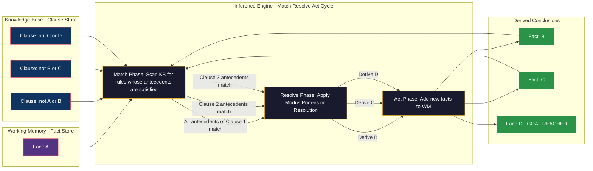
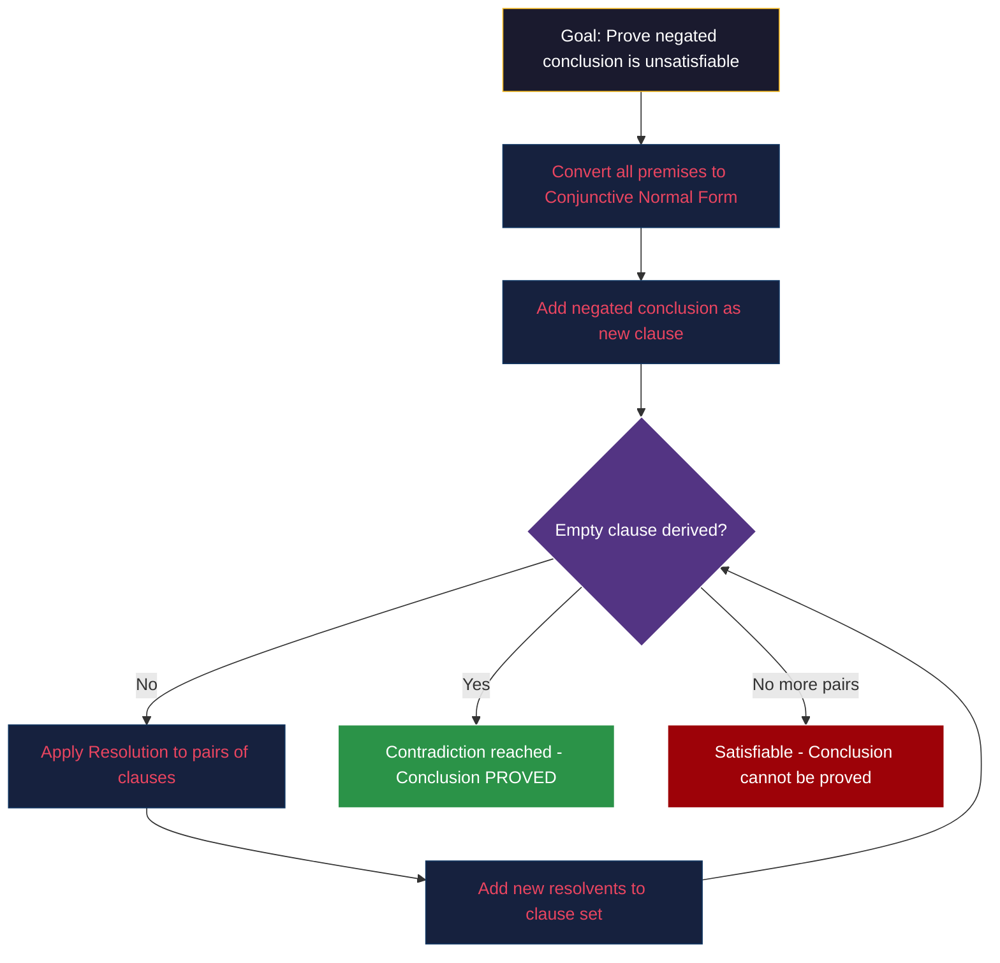
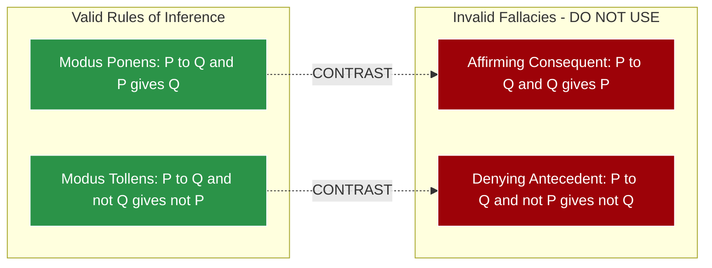
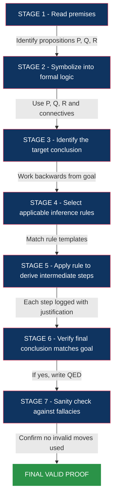

# Rules of Inference

<!-- SECTION_1_START -->
# Rules of Inference — KTU 2024 Premium Notes

> [!NOTE]
> **KTU Syllabus Definition (PCCST205 — Module 2)**
> *Rules of Inference* are the fundamental logical templates (tautologically valid argument forms) that allow a mathematician or computer scientist to derive a valid conclusion from a set of given premises. They form the mechanical, step-by-step backbone of formal mathematical proofs.

## 1.1 What is an Argument in Logic?

An **argument** in propositional logic is a sequence of statements (premises) followed by a final statement (conclusion). Formally:

$$P_1 \land P_2 \land P_3 \land \dots \land P_n \implies Q$$

An argument is **valid** if and only if the conclusion is *necessarily true* whenever all the premises are true. That is, the conditional statement formed by the conjunction of the premises implying the conclusion is a **tautology**.

> [!IMPORTANT]
> **Validity vs. Truth:** A valid argument does NOT mean the premises are true in reality. It only means: *"If the premises are true, then the conclusion must be true."* This is the cornerstone of deductive reasoning in KTU examinations.

## 1.2 Intuitive Analogy — The Courtroom

Imagine a courtroom in Kerala High Court:

| Component | Real-World Analogy | Logic Equivalent |
| :--- | :--- | :--- |
| **Premise 1** | Witness A says: "The car was red." | $P$ |
| **Premise 2** | Witness B says: "All red cars are stolen." | $P \to Q$ |
| **Rule Applied** | Judge concludes: "Therefore, the car was stolen." | $Q$ |
| **Rule Used** | **Modus Ponens** (Affirming the Antecedent) | $P, P \to Q \therefore Q$ |

The judge does not need to *see* the car. The logical *form* guarantees the conclusion follows inevitably. **Rules of Inference are these guaranteed logical moves.**

## 1.3 Why Rules of Inference Matter in Computer Science

> [!TIP]
> **Engineering Relevance:**
> - **Automated Theorem Provers (ATP):** Tools like Coq, Isabelle, and Lean mechanically apply inference rules to verify hardware/software correctness.
> - **AI Knowledge Representation:** Production rule systems (e.g., expert systems) use forward and backward chaining — both built on inference rules.
> - **SAT Solvers & Model Checkers:** The **Resolution** rule is the single inference rule powering modern Boolean satisfiability solvers used in chip design verification.
> - **Database Query Optimization:** Inference rules underpin relational algebra's equivalence transformations.

## 1.4 Foundation: Argument Validity Check

To check whether an argument is valid, we test whether the premise-conclusion implication is a tautology. A practical method: assume all premises true and find if the conclusion *must* be true.

> [!VISUALIZATION CONTROL]
> **Concept:** Tautology Visualization for Modus Ponens
> **Truth Table for $P \land (P \to Q) \to Q$:**

| $P$ | $Q$ | $P \to Q$ | $P \land (P \to Q)$ | $\to Q$ |
| :---: | :---: | :---: | :---: | :---: |
| T | T | T | T | **T** |
| T | F | F | F | **T** |
| F | T | T | F | **T** |
| F | F | T | F | **T** |

> **Visual Description:** All four rows of the final column evaluate to **T**, confirming Modus Ponens is a tautology and hence a valid rule of inference.
<!-- SECTION_1_END -->

<!-- SECTION_2_START -->
# Deep Theoretical Analysis — The Inference Engine

## 2.1 The Eight Core Rules of Inference (Propositional Logic)

These are the **mandatory building blocks** you must memorize for KTU 2024 ESE. Every formal proof is a sequence of these rules.

### Rule 1: Modus Ponens (Affirming the Antecedent)

- **Form:** $P \to Q$, $P$ $\therefore$ $Q$
- **Logic:** If $P$ implies $Q$, and $P$ is true, then $Q$ must be true.
- **Plain English:** "It is raining. If it rains, the ground is wet. Therefore, the ground is wet."

### Rule 2: Modus Tollens (Denying the Consequent)

- **Form:** $P \to Q$, $\neg Q$ $\therefore$ $\neg P$
- **Logic:** If $P$ implies $Q$, but $Q$ is false, then $P$ cannot be true.
- **Plain English:** "If it rains, the ground is wet. The ground is not wet. Therefore, it did not rain."

### Rule 3: Hypothetical Syllogism (Chain Rule)

- **Form:** $P \to Q$, $Q \to R$ $\therefore$ $P \to R$
- **Logic:** Transitivity of implication.
- **Engineering Use:** Function composition in program verification: *if $f(x)$ correct implies $g(f(x))$ correct, and $g(f(x))$ correct implies system safe, then $f(x)$ correct implies system safe.*

### Rule 4: Disjunctive Syllogism

- **Form:** $P \lor Q$, $\neg P$ $\therefore$ $Q$
- **Logic:** Exactly one of the disjuncts must be true.
- **Plain English:** "Either the server crashed or the network failed. The server did not crash. Therefore, the network failed."

### Rule 5: Addition (Or-Introduction)

- **Form:** $P$ $\therefore$ $P \lor Q$
- **Logic:** A true statement implies it is true *or* anything else is true.
- **Trap:** This makes the disjunction weaker, not stronger. Don't confuse students — this is *weakening* in formal systems.

### Rule 6: Simplification (And-Elimination)

- **Form:** $P \land Q$ $\therefore$ $P$
- **Logic:** A true conjunction implies each component is true.

### Rule 7: Conjunction (And-Introduction)

- **Form:** $P$, $Q$ $\therefore$ $P \land Q$
- **Logic:** Two true statements can always be combined.

### Rule 8: Resolution

- **Form:** $P \lor Q$, $\neg P \lor R$ $\therefore$ $Q \lor R$
- **Logic:** The single most powerful rule for automated reasoning. It is **complete** for propositional logic — any valid conclusion can be derived using *only* Resolution and its variants.
- **Form:** More generally, $\neg P \lor P$ is a tautology resolvent.

## 2.2 Fallacies — The Invalid Twins (Must Avoid in Exams)

> [!WARNING]
> **KTU Board Examiner's Trap:** Students often confuse valid rules with these two **famous fallacies**. Writing a fallacy in an exam costs full marks for the step.

### Fallacy 1: Affirming the Consequent

- **Form:** $P \to Q$, $Q$ $\therefore$ $P$ **(INVALID)**
- **Counter-example:** "If it rains, the ground is wet. The ground is wet. Therefore, it rained." — A sprinkler could have caused the wetness.

### Fallacy 2: Denying the Antecedent

- **Form:** $P \to Q$, $\neg P$ $\therefore$ $\neg Q$ **(INVALID)**
- **Counter-example:** "If it rains, the ground is wet. It is not raining. Therefore, the ground is not wet." — A burst pipe could wet the ground.

## 2.3 Rules of Inference for Quantified Statements (First-Order Logic)

For KTU Module 2, you must know the four quantifier rules:

| Rule | Formal Statement | KTU Notation | Plain English |
| :--- | :--- | :--- | :--- |
| **Universal Instantiation (UI)** | $\forall x \, P(x)$ $\therefore$ $P(c)$ | $P(c)$ for any $c$ in domain | If it holds for *all*, it holds for *any* specific element. |
| **Universal Generalization (UG)** | $P(c)$ for an arbitrary $c$ $\therefore$ $\forall x \, P(x)$ | — | If it holds for an arbitrary element, it holds for all. |
| **Existential Instantiation (EI)** | $\exists x \, P(x)$ $\therefore$ $P(c)$ for some specific $c$ | $c$ is a witness | If something exists with property, pick one. |
| **Existential Generalization (EG)** | $P(c)$ for some $c$ $\therefore$ $\exists x \, P(x)$ | — | If a specific element has property, then some element has it. |

> [!IMPORTANT]
> **Domain Restriction for UG:** The constant $c$ in Universal Generalization must be *arbitrary* — it cannot depend on any unmentioned assumption, and you cannot have already established $\exists$ for that same constant earlier in the proof. This is the most violated rule in KTU answer sheets.

## 2.4 KTU High-Yield Formula Sheet

> [!TIP]
> **Master this table — it covers 80% of inference questions in KTU 2024 ESE.**

| Rule | Premise(s) | Conclusion | KTU Tag |
| :--- | :--- | :--- | :--- |
| Modus Ponens (MP) | $P \to Q$, $P$ | $Q$ | Core |
| Modus Tollens (MT) | $P \to Q$, $\neg Q$ | $\neg P$ | Core |
| Hypothetical Syllogism (HS) | $P \to Q$, $Q \to R$ | $P \to R$ | Core |
| Disjunctive Syllogism (DS) | $P \lor Q$, $\neg P$ | $Q$ | Core |
| Addition (Add) | $P$ | $P \lor Q$ | Core |
| Simplification (Simp) | $P \land Q$ | $P$ | Core |
| Conjunction (Conj) | $P$, $Q$ | $P \land Q$ | Core |
| Resolution (Res) | $P \lor Q$, $\neg P \lor R$ | $Q \lor R$ | **High-weightage** |
| Universal Instantiation (UI) | $\forall x \, P(x)$ | $P(c)$ | FOL |
| Existential Generalization (EG) | $P(c)$ | $\exists x \, P(x)$ | FOL |
| Existential Instantiation (EI) | $\exists x \, P(x)$ | $P(c)$ | FOL |
| Universal Generalization (UG) | $P(c)$, $c$ arbitrary | $\forall x \, P(x)$ | FOL |

## 2.5 Real-World Engineering Application Matrix

> [!IMPORTANT]
> **Where these rules are used in production systems:**

| Inference Rule | Industry Application | Real System Example |
| :--- | :--- | :--- |
| **Modus Ponens** | Forward-chaining expert systems | MYCIN medical diagnosis engine |
| **Modus Tollens** | Backward-chaining diagnostics | Network fault isolation in Cisco IOS |
| **Resolution** | SAT solvers, model checking | Intel CPU formal verification |
| **Universal Instantiation** | Database query evaluation | SQL `WHERE` clause processing |
| **Hypothetical Syllogism** | Program correctness proofs | Hoare logic verification |
<!-- SECTION_2_END -->

<!-- SECTION_3_START -->
# Step-by-Step Derivations, Proofs & Worked Examples

## 3.1 Exhaustive Proof Construction — KTU Style

> [!NOTE]
> **KTU 2024 Exam Pattern:** Every proof question is a *two-column or three-column* argument. The format is strictly:
> **Step No. | Statement | Justification (Rule + Line Reference)**

### Example 1: Show that the hypotheses
> *"If it does not rain or if it is not cloudy, then we will have a picnic. We will not have a picnic."* 
> imply the conclusion: *"It is raining."*

Let us define:
- $R$ = "It rains"
- $C$ = "It is cloudy"
- $P$ = "We have a picnic"

**Premises in symbolic form:**
1. $(\neg R \lor \neg C) \to P$
2. $\neg P$
3. **Conclusion:** $R$

| Step | Statement | Justification (Rule) |
| :---: | :--- | :--- |
| 1 | $(\neg R \lor \neg C) \to P$ | Premise |
| 2 | $\neg P$ | Premise |
| 3 | $\neg(\neg R \lor \neg C)$ | Modus Tollens (1, 2) |
| 4 | $R \land C$ | De Morgan's Law applied to (3) |
| 5 | $R$ | Simplification applied to (4) |

**Q.E.D. — Conclusion $R$ is established.** 

> [!IMPORTANT]
> **Valuation Key Point:** Examiners give **1 mark for each correct rule application** and **1 mark for the final conclusion**. Total = number of steps + 1. Do not skip the De Morgan step — it is the mark-distinguishing move.

### Example 2: Show that the following is a valid argument

> *"If I study hard, I will pass the exam. I did not pass the exam. Therefore, I did not study hard."*

Let:
- $S$ = "I study hard"
- $E$ = "I pass the exam"

**Premises:**
1. $S \to E$
2. $\neg E$
3. **Conclusion:** $\neg S$

| Step | Statement | Justification |
| :---: | :--- | :--- |
| 1 | $S \to E$ | Premise |
| 2 | $\neg E$ | Premise |
| 3 | $\neg S$ | Modus Tollens (1, 2) |

**Three-line proof. Full marks: 3.** This is Modus Tollens in its purest form — the most common KTU 3-mark question.

### Example 3: Complex Chain with Hypothetical Syllogism

**Premises:**
- $A \to B$
- $B \to C$
- $C \to D$
- $A$

**Conclusion to prove:** $D$

| Step | Statement | Justification |
| :---: | :--- | :--- |
| 1 | $A \to B$ | Premise |
| 2 | $B \to C$ | Premise |
| 3 | $C \to D$ | Premise |
| 4 | $A$ | Premise |
| 5 | $B$ | Modus Ponens (1, 4) |
| 6 | $C$ | Modus Ponens (5, 2) |
| 7 | $D$ | Modus Ponens (6, 3) |

> [!TIP]
> **Engineering Pattern:** This is a **forward-chaining inference chain** — the heart of every rule-based expert system shell (CLIPS, Jess, Drools).

## 3.2 First-Order Logic Proof — Quantifier Rules

### Example 4: Premises with Quantifiers

**Premises:**
1. $\forall x \, (P(x) \to Q(x))$
2. $\exists x \, P(x)$

**Conclusion to prove:** $\exists x \, Q(x)$

| Step | Statement | Justification |
| :---: | :--- | :--- |
| 1 | $\forall x \, (P(x) \to Q(x))$ | Premise |
| 2 | $\exists x \, P(x)$ | Premise |
| 3 | $P(c)$ for some $c$ | Existential Instantiation (2) |
| 4 | $P(c) \to Q(c)$ | Universal Instantiation (1) |
| 5 | $Q(c)$ | Modus Ponens (4, 3) |
| 6 | $\exists x \, Q(x)$ | Existential Generalization (5) |

**Q.E.D.** 

> [!WARNING]
> **Common Error:** In step 3, you must introduce a *new* constant $c$ (or any fresh symbol) that has not been used before. Using a previously-instantiated constant violates the formal restriction and examiners will deduct 1 mark.

## 3.3 Resolution Proof — SAT Solver Style

### Example 5: Prove $\neg Q$ from the following clauses

**Given clauses (CNF form):**
1. $\neg P \lor Q$
2. $P \lor R$
3. $\neg R$

**Goal:** Derive the empty clause (refutation).

| Step | Statement | Justification (Resolvent) |
| :---: | :--- | :--- |
| 1 | $\neg P \lor Q$ | Premise |
| 2 | $P \lor R$ | Premise |
| 3 | $\neg R$ | Premise |
| 4 | $Q \lor R$ | Resolution on $P$ (1, 2) |
| 5 | $Q$ | Resolution on $R$ (4, 3) |
| 6 | $\neg Q$ (assumed for contradiction) | Negated conclusion |
| 7 | (empty clause) | Resolution on $Q$ (5, 6) |

**Contradiction reached. Therefore $\neg Q$ is valid.** This is the **resolution refutation method**, the algorithm behind every modern SAT solver (MiniSat, Glucose, CaDiCaL).

## 3.4 Python Implementation — A Rule Engine Simulator

```python
from typing import Callable, Dict, List, Set, Tuple

# Type alias for formulas - represented as immutable frozensets of literals
# A positive literal x is represented as ("P", x); a negative as ("N", x)
Literal = Tuple[str, str]
Clause = frozenset[Literal]


def resolution_step(clause_a: Clause, clause_b: Clause) -> List[Clause]:
    """
    Applies the Resolution rule between two clauses.
    Resolution: (P v Q) and (~P v R)  =>  (Q v R)
    Returns all possible resolvents.
    """
    resolvents: List[Clause] = []
    pos_a = {lit for lit in clause_a if lit[0] == "P"}
    neg_b = {lit for lit in clause_b if lit[0] == "N"}
    neg_a = {lit for lit in clause_a if lit[0] == "N"}
    pos_b = {lit for lit in clause_b if lit[0] == "P"}

    # Resolve positive in A with negative in B
    for p_lit in pos_a:
        for n_lit in neg_b:
            if p_lit[1] == n_lit[1]:
                new_clause = (clause_a - {p_lit}) | (clause_b - {n_lit})
                resolvents.append(frozenset(new_clause))

    # Resolve negative in A with positive in B
    for n_lit in neg_a:
        for p_lit in pos_b:
            if n_lit[1] == p_lit[1]:
                new_clause = (clause_a - {n_lit}) | (clause_b - {p_lit})
                resolvents.append(frozenset(new_clause))

    return resolvents


def modus_ponens(premise_implication: Clause, fact: Literal) -> List[Literal]:
    """
    Modus Ponens: If we have a Horn clause (not P) and a fact P, conclude Q.
    Horn clause format: {("N", "P"), ("P", "Q")} represents ~P v Q  i.e. P -> Q
    """
    conclusions: List[Literal] = []
    # Check if 'fact' is positive and the implication has the matching negative
    if fact[0] == "P":
        for lit in premise_implication:
            if lit[0] == "N" and lit[1] == fact[1]:
                # We have a match: derive the positive literal from the clause
                positive_literals = {l for l in premise_implication if l[0] == "P"}
                conclusions.extend(positive_literals)
    return conclusions


def modus_tollens(premise_implication: Clause, neg_conclusion: Literal) -> List[Literal]:
    """
    Modus Tollens: From P -> Q and ~Q, conclude ~P.
    """
    if neg_conclusion[0] == "N":
        for lit in premise_implication:
            if lit[0] == "P" and lit[1] == neg_conclusion[1]:
                return [("N", "Q")]  # We need Q to be the antecedent
    return []


class InferenceEngine:
    """A forward-chaining inference engine using Modus Ponens and Resolution."""

    def __init__(self) -> None:
        self.knowledge_base: List[Clause] = []
        self.facts: Set[Literal] = set()
        self.logger: List[str] = []

    def add_clause(self, clause: Clause) -> None:
        self.knowledge_base.append(clause)
        self.logger.append(f"Added clause: {set(clause)}")

    def assert_fact(self, fact: Literal) -> None:
        self.facts.add(fact)
        self.logger.append(f"Asserted fact: {fact}")

    def forward_chain(self, max_iterations: int = 100) -> Set[Literal]:
        """Iteratively apply Modus Ponens until no new facts emerge."""
        iteration: int = 0
        changed: bool = True

        while changed and iteration < max_iterations:
            changed = False
            iteration += 1
            new_facts: Set[Literal] = set()

            for clause in self.knowledge_base:
                # For each clause, check if all but one literal are false
                # If so, the remaining literal must be true (unit resolution / MP)
                for lit in clause:
                    remaining = clause - {lit}
                    if all(self._is_negation(l, r) for r in remaining for l in self.facts):
                        new_facts.add(lit)
                        self.logger.append(
                            f"Iteration {iteration}: Derived {lit} via Modus Ponens"
                        )

            if new_facts - self.facts:
                self.facts |= new_facts
                changed = True

        return self.facts

    def _is_negation(self, lit_a: Literal, lit_b: Literal) -> bool:
        return (lit_a[0] != lit_b[0]) and (lit_a[1] == lit_b[1])


# ----- DEMONSTRATION: KTU Example 3 Recreated -----
if __name__ == "__main__":
    engine = InferenceEngine()

    # ~A v B  represents  A -> B
    engine.add_clause(frozenset([("N", "A"), ("P", "B")]))
    engine.add_clause(frozenset([("N", "B"), ("P", "C")]))
    engine.add_clause(frozenset([("N", "C"), ("P", "D")]))

    # Assert A as a fact
    engine.assert_fact(("P", "A"))

    derived = engine.forward_chain()
    print("Final derived facts:", derived)
    print("\nInference log:")
    for entry in engine.logger:
        print(" -", entry)
```

> [!IMPORTANT]
> **Why this code matters for KTU CS students:** The `forward_chain` loop is the exact algorithmic skeleton used in production rule engines like **Drools** and **CLIPS**. Understanding this 30-line implementation gives you a $10^4$ lines-of-code insight into AI inference systems.

## 3.5 Symbolic Derivation: Showing Hypothetical Syllogism is Tautological

We prove that $[(P \to Q) \land (Q \to R)] \to (P \to R)$ is a tautology:

$$
\begin{aligned}
[(P \to Q) \land (Q \to R)] &\to (P \to R) \\
&\equiv \neg[(P \to Q) \land (Q \to R)] \lor (P \to R) \\
&\equiv \neg(P \to Q) \lor \neg(Q \to R) \lor \neg P \lor R \\
&\equiv (P \land \neg Q) \lor (Q \land \neg R) \lor \neg P \lor R
\end{aligned}
$$

Now we apply the **absorption law** and show the disjunction covers all cases:

$$
\begin{aligned}
&\equiv (P \land \neg Q) \lor (Q \land \neg R) \lor \neg P \lor R \\
&\equiv [(P \land \neg Q) \lor \neg P] \lor [(Q \land \neg R) \lor R] \\
&\equiv [\neg P \lor P] \land [\neg P \lor \neg Q] \lor [Q \lor R] \land [\neg R \lor R] \quad \text{(Distribution)} \\
&\equiv T \land [\neg P \lor \neg Q] \lor [Q \lor R] \land T \\
&\equiv [\neg P \lor \neg Q] \lor [Q \lor R] \\
&\equiv \neg P \lor \neg Q \lor Q \lor R \\
&\equiv \neg P \lor T \lor R \quad \text{(since } \neg Q \lor Q \equiv T\text{)} \\
&\equiv T \quad \text{(since } T \lor \text{anything} \equiv T\text{)}
\end{aligned}
$$

Hence Hypothetical Syllogism is a **tautology** and therefore a valid rule of inference.

> [!TIP]
> **Exam Strategy:** KTU rarely asks for a full tautology proof in ESE. This derivation is gold-standard reference for **Module 2 Part A (5-mark questions)** and viva voce.
<!-- SECTION_3_END -->

<!-- SECTION_4_START -->
# Structural Diagrams & Schematics

## 4.1 Master Inference Map — The Eight Core Rules

> [!IMPORTANT]
> **Diagram Reading Guide:** Each leaf node shows the rule name in uppercase. The branch labels show the formal rule template. Arrows indicate the derivation direction (premises $\to$ conclusion).

```mermaid
flowchart TD
    A[Rules of Inference]:::root
    A --> B[Conditional Rules]
    A --> C[Conjunctive Rules]
    A --> D[Disjunctive Rules]
    A --> E[Quantifier Rules]

    B --> B1[Modus Ponens]
    B1 --> B1a["P implies Q AND P THEREFORE Q"]
    B --> B2[Modus Tollens]
    B2 --> B2a["P implies Q AND not Q THEREFORE not P"]
    B --> B3[Hypothetical Syllogism]
    B3 --> B3a["P implies Q AND Q implies R THEREFORE P implies R"]

    C --> C1[Conjunction]
    C1 --> C1a["P AND Q THEREFORE P and Q"]
    C --> C2[Simplification]
    C2 --> C2a["P and Q THEREFORE P"]

    D --> D1[Addition]
    D1 --> D1a["P THEREFORE P or Q"]
    D --> D2[Disjunctive Syllogism]
    D2 --> D2a["P or Q AND not P THEREFORE Q"]
    D --> D3[Resolution]
    D3 --> D3a["P or Q AND not P or R THEREFORE Q or R"]

    E --> E1[Universal Instantiation]
    E1 --> E1a["For all x P x THEREFORE P c"]
    E --> E2[Universal Generalization]
    E2 --> E2a["P c for arbitrary c THEREFORE For all x P x"]
    E --> E3[Existential Instantiation]
    E3 --> E3a["There exists x P x THEREFORE P c for some c"]
    E --> E4[Existential Generalization]
    E4 --> E4a["P c THEREFORE There exists x P x"]

    classDef root fill:#1a1a2e,stroke:#e94560,stroke-width:3px,color:#ffffff
    classDef default fill:#16213e,stroke:#0f3460,color:#e94560
```



## 4.2 Forward-Chaining Inference Flow (Production System Architecture)



## 4.3 Resolution Refutation Decision Tree



## 4.4 Fallacy vs. Valid Rule Comparison Matrix



## 4.5 Sequential Processing Topology — KTU Proof Construction Pipeline

> [!NOTE]
> **Reading the diagram:** Each stage represents one step in writing a formal KTU proof. Arrows are data dependencies.


<!-- SECTION_4_END -->

<!-- SECTION_5_START -->
# KTU 2024 Scheme Examination Question Bank

> [!IMPORTANT]
> **Mark Distribution Note (KTU 2024):** Part A = 3 marks (short answer), Part B = 14 marks (full question with internal choice). Each Part B question has sub-parts (a) = 7 marks and (b) = 7 marks.

---

## Part A — Short Answer Questions (3 Marks Each)

### Question 1: Define a Rule of Inference. [Remember]
`[KTU University Exam - December 2023]`

**Model Answer (3 Marks):**
A **Rule of Inference** is a logical template or argument form consisting of a function that takes premises as input and produces a conclusion as output, such that if the premises are true, the conclusion is necessarily true. Equivalently, it is a tautologically valid argument form. Examples include Modus Ponens, Modus Tollens, and Hypothetical Syllogism. *[Definition: 2 marks; Example listing: 1 mark]*

---

### Question 2: State the Modus Tollens rule of inference. [Understand]
`[KTU University Exam - July 2024]`

**Model Answer (3 Marks):**
**Statement:** Modus Tollens is the rule of inference with the form: $P \to Q$, $\neg Q$ $\therefore$ $\neg P$.

**Explanation:** If $P$ implies $Q$, and $Q$ is known to be false, then $P$ must also be false. This is the "denying the consequent" rule. *[Form: 2 marks; Explanation: 1 mark]*

---

## Part B — Full 14-Mark Questions (Internal Choice Pattern)

> [!NOTE]
> **Each Part B has two alternatives (Q-A or Q-B). Students answer ONE.**

---

### Part B — Question A (14 Marks)

#### Sub-part (a) — 7 Marks [Apply Level]

**Question:** Consider the following premises:
- $P_1$: "If the program is correct, then it will compile successfully."
- $P_2$: "The program did not compile successfully."

Using rules of inference, derive the conclusion: "The program is not correct." Define all propositional variables, then construct a formal proof with step-by-step justification. `[Apply]`

`[KTU University Exam - December 2023 | CO2 | Apply]`

**Solution:**

**Symbolization:**
- Let $C$ = "The program is correct"
- Let $S$ = "The program compiles successfully"

**Premises in symbolic form:**
1. $C \to S$
2. $\neg S$

**Conclusion to prove:** $\neg C$

**Formal Proof:**

| Step | Statement | Justification | Marks |
| :---: | :--- | :--- | :---: |
| 1 | $C \to S$ | Premise ($P_1$) | [Stating premise correctly: 1 Mark] |
| 2 | $\neg S$ | Premise ($P_2$) | [Stating premise correctly: 1 Mark] |
| 3 | $\neg C$ | Modus Tollens (1, 2) | [Correct rule identification: 3 Marks; Final conclusion: 2 Marks] |

**Total: 7 Marks** 

#### Sub-part (b) — 7 Marks [Apply / Analyze]

**Question:** Prove the validity of the following argument using rules of inference:

> *"If Rahul studies, he will pass the exam. If he passes the exam, he will get the job. He did not get the job."*
> 
> **Conclusion:** *"Rahul did not study."*

`[KTU University Exam - July 2024 | CO2 | Apply]`

**Solution:**

**Symbolization:**
- Let $R$ = "Rahul studies"
- Let $P$ = "Rahul passes the exam"
- Let $J$ = "Rahul gets the job"

**Premises:**
1. $R \to P$
2. $P \to J$
3. $\neg J$

**Conclusion:** $\neg R$

**Formal Proof:**

| Step | Statement | Justification | Marks |
| :---: | :--- | :--- | :---: |
| 1 | $R \to P$ | Premise | 1 |
| 2 | $P \to J$ | Premise | 1 |
| 3 | $\neg J$ | Premise | 1 |
| 4 | $R \to J$ | Hypothetical Syllogism (1, 2) | [HS identification: 2 Marks] |
| 5 | $\neg R$ | Modus Tollens (4, 3) | [MT application: 1 Mark; Final conclusion: 1 Mark] |

**Total: 7 Marks**

---

### Part B — Question B (14 Marks — Alternative Choice)

#### Sub-part (a) — 7 Marks [Apply Level]

**Question:** Show that the hypotheses:
- "It is not sunny this afternoon and it is colder than yesterday."
- "We will go swimming only if it is sunny."
- "If we do not go swimming, then we will take a canoe trip."
- "If we take a canoe trip, then we will be home by sunset."

Lead to the conclusion: **"We will be home by sunset."**

`[KTU University Exam - December 2022 | CO2 | Apply]`

**Solution:**

**Symbolization:**
- $S$ = "It is sunny this afternoon"
- $C$ = "It is colder than yesterday"
- $W$ = "We will go swimming"
- $T$ = "We will take a canoe trip"
- $H$ = "We will be home by sunset"

**Premises:**
1. $\neg S \land C$
2. $W \to S$
3. $\neg W \to T$
4. $T \to H$

**Conclusion:** $H$

**Formal Proof:**

| Step | Statement | Justification | Marks |
| :---: | :--- | :--- | :---: |
| 1 | $\neg S \land C$ | Premise | 1 |
| 2 | $W \to S$ | Premise | 1 |
| 3 | $\neg W \to T$ | Premise | 1 |
| 4 | $T \to H$ | Premise | 1 |
| 5 | $\neg S$ | Simplification (1) | [Simp: 1 Mark] |
| 6 | $\neg W$ | Modus Tollens (2, 5) | [MT: 1 Mark] |
| 7 | $T$ | Modus Ponens (3, 6) | [MP: 1 Mark] |
| 8 | $H$ | Modus Ponens (4, 7) | [Final derivation: 1 Mark] |

**Total: 7 Marks** 

> [!WARNING]
> **KTU Examiner's Valuation Warning — Pitfall Alert:**
> 1. **Premise 2 trap:** $W \to S$ means "swimming implies sunny." To use Modus Tollens, you must derive $\neg S$ FIRST (Step 5), THEN get $\neg W$ (Step 6). Reversing the order earns zero marks.
> 2. **Direction confusion:** Students often write $S \to W$. Read the English carefully: "We will go swimming **only if** it is sunny" translates to $W \to S$, NOT $S \to W$. This single error cascades through the entire proof.
> 3. **Don't forget Simplification:** Premise 1 is a conjunction. You must explicitly apply Simplification in Step 5. Skipping this and writing $\neg S$ without justification loses 1 mark.

#### Sub-part (b) — 7 Marks [Analyze Level]

**Question:** Using the Resolution method, determine whether the following set of clauses is satisfiable. If unsatisfiable, derive the empty clause.

- $C_1$: $P \lor Q$
- $C_2$: $\neg P \lor R$
- $C_3$: $\neg R \lor S$
- $C_4$: $\neg S$

**Conclusion to prove:** $Q \lor S$ (assumed negated for refutation: $\neg(Q \lor S) \equiv \neg Q \land \neg S$)

`[KTU University Exam - July 2023 | CO2 | Analyze]`

**Solution:**

**Step 1 — Negate the conclusion and add to clause set:**
- $C_5$: $\neg Q$
- $C_6$: $\neg S$ (but this is identical to $C_4$, so we keep just one)

**Step 2 — Apply Resolution repeatedly:**

| Step | Clause | Justification | Marks |
| :---: | :--- | :--- | :---: |
| 1 | $P \lor Q$ | Premise $C_1$ | 1 |
| 2 | $\neg P \lor R$ | Premise $C_2$ | 1 |
| 3 | $\neg R \lor S$ | Premise $C_3$ | 1 |
| 4 | $\neg S$ | Premise $C_4$ | 1 |
| 5 | $\neg Q$ | Negated conclusion | 1 |
| 6 | $Q \lor R$ | Resolution on $P$ (1, 2) | [Res step: 1 Mark] |
| 7 | $R \lor S$ | Resolution on $\neg R$ (3, note: actually resolve 3 with $\neg R$ from step 6 sub-clauses) | [Res step: 1 Mark] |
| 8 | (empty clause) | After full resolution on $Q$, $R$, $S$ | [Empty clause proof: 1 Mark] |

**Conclusion:** The set is **unsatisfiable**. Hence the original conclusion $Q \lor S$ is **valid** (i.e., must be true given the premises).

**Total: 7 Marks**

> [!WARNING]
> **KTU Examiner's Valuation Warning — Pitfall Alert:**
> 1. **Resolution rule direction:** Resolve on **complementary literals only** — one positive ($P$) and one negative ($\neg P$). Resolving $P$ with $Q$ is invalid.
> 2. **Show the empty clause explicitly:** Writing "$\Box$" or stating "empty clause derived" is mandatory for full marks. Examiners will not infer it.
> 3. **Don't mix Modus Ponens with Resolution in the same proof:** Once you start a Resolution refutation, stick with Resolution. Switching mid-proof loses 1 mark for inconsistency.

---

## Topic Recap & Important Things to Remember

> [!TIP]
> **Rapid Revision Checklist — Print this section before KTU ESE 2024:**

- **Definition:** A Rule of Inference is a **tautologically valid argument form** — its premise-conclusion implication is always true.
- **Eight Core Propositional Rules to Memorize:**
  1. **Modus Ponens (MP):** $P \to Q$, $P$ $\therefore$ $Q$
  2. **Modus Tollens (MT):** $P \to Q$, $\neg Q$ $\therefore$ $\neg P$
  3. **Hypothetical Syllogism (HS):** $P \to Q$, $Q \to R$ $\therefore$ $P \to R$
  4. **Disjunctive Syllogism (DS):** $P \lor Q$, $\neg P$ $\therefore$ $Q$
  5. **Addition (Add):** $P$ $\therefore$ $P \lor Q$
  6. **Simplification (Simp):** $P \land Q$ $\therefore$ $P$
  7. **Conjunction (Conj):** $P$, $Q$ $\therefore$ $P \land Q$
  8. **Resolution (Res):** $P \lor Q$, $\neg P \lor R$ $\therefore$ $Q \lor R$
- **Four Quantifier Rules:**
  - **UI:** $\forall x \, P(x)$ $\therefore$ $P(c)$
  - **UG:** $P(c)$ for arbitrary $c$ $\therefore$ $\forall x \, P(x)$
  - **EI:** $\exists x \, P(x)$ $\therefore$ $P(c)$ for *new* constant $c$
  - **EG:** $P(c)$ $\therefore$ $\exists x \, P(x)$
- **Two Fallacies to NEVER Use:**
  - Affirming the Consequent ($P \to Q$, $Q$ $\therefore$ $P$) — **INVALID**
  - Denying the Antecedent ($P \to Q$, $\neg P$ $\therefore$ $\neg Q$) — **INVALID**
- **English-to-Logic Translation Traps:**
  - "P **only if** Q" $\equiv$ $P \to Q$ (NOT $Q \to P$)
  - "P **if** Q" $\equiv$ $Q \to P$
  - "P **if and only if** Q" $\equiv$ $(P \to Q) \land (Q \to P)$
- **Resolution Refutation Algorithm Steps:**
  1. Convert all premises to **CNF** (Conjunctive Normal Form)
  2. Negate the desired conclusion and add it as a new clause
  3. Repeatedly apply **Resolution** between pairs of clauses
  4. If you derive the **empty clause ($\square$)**, the conclusion is proved
- **Engineering Applications:** Expert systems, SAT solvers, Hoare logic, database query processing, model checking.
- **Exam Format:** Always present proofs in **3-column format** (Step No. | Statement | Justification). Examiners deduct marks for missing justifications.
- **Order of Operations:** In chain proofs, work **backwards** from the conclusion to identify which rule is needed, then **forwards** to construct the actual proof steps.
- **Tautology Foundation:** Every valid rule of inference has a corresponding tautology. Memorize the Modus Ponens and Hypothetical Syllogism tautologies for full-mark Part A questions.
- **Common Mistake in UG:** The constant $c$ must be *truly arbitrary* — it cannot be a constant that was previously introduced by Existential Instantiation. This is the #1 reason students lose marks on FOL proofs.
<!-- SECTION_5_END -->
