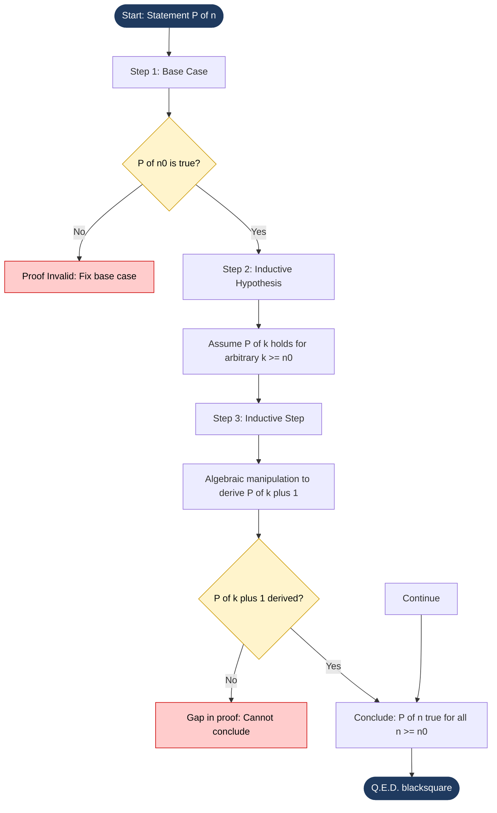
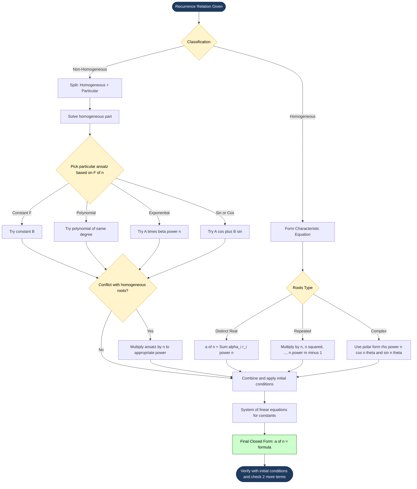
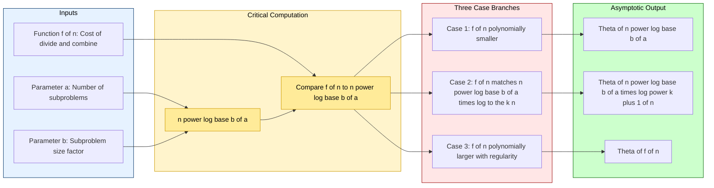

# Induction and Recurrences

<!-- SECTION_1_START -->
# Induction and Recurrences — KTU 2024 Scheme Module 3

> [!NOTE]
> **Module Focus:** This module builds the two foundational pillars of algorithmic mathematics: **Proof by Induction** (for verifying properties over all natural numbers) and **Recurrence Relations** (for expressing sequences and algorithm costs in closed form).

---

## 1.1 Mathematical Induction — Formal Definition

**Mathematical Induction** is a rigorous proof technique used to establish the truth of a statement $P(n)$ for **every** natural number $n \ge n_0$, where $n_0$ is typically $0$ or $1$. It is the discrete analogue of the Well-Ordering Principle.

Formally, a statement $\forall n \in \mathbb{N}, P(n)$ is proven true by demonstrating:

1. **Base Case (Foundation):** $P(1)$ is true (or $P(n_0)$).
2. **Inductive Step (Cascade):** If $P(k)$ is true for some arbitrary $k \ge n_0$ (Inductive Hypothesis), then $P(k+1)$ is also true.

> [!IMPORTANT]
> **KTU Syllabus Highlight:** Both *weak* (ordinary) induction and *strong* induction are examinable. Be sure to distinguish when the inductive hypothesis requires only $P(k)$ versus $P(1), P(2), \dots, P(k)$.

### Conceptual Analogy — The Domino Cascade

Imagine an infinite row of dominoes standing on edge, perfectly spaced.

- The **Base Case** is the act of *pushing the first domino*. If it does not fall, nothing happens.
- The **Inductive Step** proves that *whenever any domino at position $k$ falls, it always knocks over the domino at position $k+1$*.
- Therefore, **all** dominoes from position 1 onward must fall.

> [!TIP]
> **Geometric Intuition:** Picture a "truth wave" propagating across the natural number line $\mathbb{N} = \{1, 2, 3, \dots\}$. The base case starts the wave at $n=1$. The inductive step proves that the wave never breaks between $k$ and $k+1$. Hence the wave covers every integer.

---

## 1.2 Strong Induction — Formal Definition

**Strong Induction** is a strengthened variant. Instead of assuming only $P(k)$, we assume the truth of *all* preceding statements $P(1) \land P(2) \land \dots \land P(k)$ and use this stronger hypothesis to prove $P(k+1)$.

It is used when proving $P(k+1)$ requires more than just the previous single case.

---

## 1.3 Recurrence Relation — Formal Definition

A **Recurrence Relation** for a sequence $\{a_n\}$ is an equation that expresses each term $a_n$ in terms of one or more of its **predecessors** $a_{n-1}, a_{n-2}, \dots, a_{n-k}$.

A recurrence is **fully specified** when it is paired with enough **initial conditions (boundary values)** so that every term of the sequence can be computed uniquely.

The **order** of a recurrence is the maximum lag between $a_n$ and its dependencies. For example, the Fibonacci-style relation

$$a_n = a_{n-1} + a_{n-2}$$

is a **second-order linear homogeneous recurrence** with constant coefficients.

> [!IMPORTANT]
> **KTU 2024 Module 3 Core Definitions:**
> - **Linear:** Each term is a first-degree polynomial in prior terms (no $a_{n-1} \cdot a_{n-2}$ products).
> - **Homogeneous:** No standalone function of $n$ outside the recurrence (e.g., no $+n$ or $+2^n$).
> - **Constant Coefficients:** The multipliers of prior terms are fixed constants, not functions of $n$.

### Conceptual Analogy — Population Growth with Memory

Imagine a rabbit population where:

- Each adult pair produces one new pair every month.
- New pairs take one month to mature.

Then this month's population = last month's population + the *new* adults (which were juveniles last month). Hence the count is **determined by the two prior months** — a perfect real-world analogue of the Fibonacci recurrence $F_n = F_{n-1} + F_{n-2}$.

> [!TIP]
> **Real-world Recurrences in CS:** Algorithm running time recurrences such as Merge Sort's $T(n) = 2T(n/2) + n$ and Binary Search's $T(n) = T(n/2) + 1$ are *the* primary application of this topic. You will see them again in Design and Analysis of Algorithms.

---

## 1.4 Visualization Control Block

> [!VISUALIZATION CONTROL]
> **Concept:** Geometric view of the Fibonacci spiral generated by the recurrence $F_n = F_{n-1} + F_{n-2}$.
> **GeoGebra / Desmos Input Equations:**
> * Sequence: $F_1 = 1, \ F_2 = 1, \ F_n = F_{n-1} + F_{n-2}$
> * Recursive plot: $\text{Seq}(a, a, 1, 10)$ where $a(n) = a(n-1) + a(n-2)$
> **Visual Description:** Observe the exponentially rising staircase of points $(n, F_n)$. The vertical jumps grow by the *golden ratio* $\phi \approx 1.618$ asymptotically. This is the characteristic *signature* of any second-order linear recurrence with distinct real characteristic roots.

<!-- SECTION_1_END -->

<!-- SECTION_2_START -->
# Deep Theoretical Analysis & KTU High-Yield Formula Sheet

---

## 2.1 The Three Pillars of a Mathematical Induction Proof

| Pillar | Symbol | Role | Failure Consequence |
|---|---|---|---|
| Base Case | $P(n_0)$ | Anchors the truth wave at the smallest $n$ | No starting point → no proof |
| Inductive Hypothesis | $P(k)$ assumed true | Supplies the assumed fact for the cascade | Cannot bridge the gap |
| Inductive Conclusion | $P(k) \Rightarrow P(k+1)$ | Closes the proof for the next integer | The wave breaks |

> [!IMPORTANT]
> **Pitfall:** A common KTU valuation error is writing "Hence proved by induction" *without* explicitly stating what the inductive hypothesis was. Always write **"Assume $P(k)$ is true"** clearly.

---

## 2.2 Strong Induction vs. Weak Induction — When to Use Each

- **Weak (Ordinary) Induction** is sufficient when proving $P(k+1)$ requires only $P(k)$ (e.g., proving $\sum_{i=1}^{n} i = \frac{n(n+1)}{2}$).
- **Strong Induction** is required when proving $P(k+1)$ may need *any* of $P(1), P(2), \dots, P(k)$ (e.g., proving every integer $>1$ has a prime factorization, or the **Fundamental Theorem of Arithmetic**).

---

## 2.3 Recurrence Relations — Classification Taxonomy

A recurrence is classified along **three independent axes**:

1. **Order** — How far back does it look? (1st, 2nd, $k$-th)
2. **Linearity** — Linear vs. Non-linear (products of $a_{n-i}$)
3. **Homogeneity** — Homogeneous (all terms on RHS are prior $a$'s) vs. Non-homogeneous (extra forcing function $f(n)$)

### 2.3.1 Linear Homogeneous Recurrence with Constant Coefficients (LHRCC)

General $k$-th order form:

$$a_n = c_1 a_{n-1} + c_2 a_{n-2} + \dots + c_k a_{n-k}$$

The solution is found via the **Characteristic Equation**:

$$x^k - c_1 x^{k-1} - c_2 x^{k-2} - \dots - c_k = 0$$

Let the roots be $r_1, r_2, \dots, r_k$ (possibly repeated or complex).

#### Case Analysis for the General Solution

| Case | Root Configuration | General Solution Form |
|---|---|---|
| Distinct real roots | $r_1, r_2, \dots, r_k$ all distinct and real | $a_n = \alpha_1 r_1^n + \alpha_2 r_2^n + \dots + \alpha_k r_k^n$ |
| Repeated real root | $r$ is a root of multiplicity $m$ | Adds terms $\alpha n r^n, \beta n^2 r^n, \dots, \gamma n^{m-1} r^n$ |
| Complex conjugate pair | $r = \rho e^{\pm i\theta}$ | Adds terms $\rho^n (A \cos(n\theta) + B \sin(n\theta))$ |

### 2.3.2 Linear Non-Homogeneous Recurrence

General form:

$$a_n = c_1 a_{n-1} + c_2 a_{n-2} + \dots + c_k a_{n-k} + F(n)$$

The **general solution = homogeneous solution + particular solution**:

$$a_n^{(g)} = a_n^{(h)} + a_n^{(p)}$$

#### Particular Solution Templates

| Forcing Term $F(n)$ | Try $a_n^{(p)}$ of Form |
|---|---|
| Constant $C$ | $A$ (constant) |
| Polynomial $p_d(n)$ of degree $d$ | Polynomial of degree $d$: $A_d n^d + \dots + A_0$ |
| Exponential $C \cdot \beta^n$ | $A \cdot \beta^n$ |
| $\sin(\alpha n)$ or $\cos(\alpha n)$ | $A \cos(\alpha n) + B \sin(\alpha n)$ |

> [!WARNING]
> **Conflict of Roots:** If the trial $a_n^{(p)}$ form is *already contained* in $a_n^{(h)}$ (i.e., $\beta$ is a root of the characteristic equation), then multiply the trial by $n$ (or higher power of $n$ if the conflict is deeper) before solving.

---

## 2.4 The Master Theorem (Divide-and-Conquer Recurrences)

A **divide-and-conquer** algorithm with recurrence

$$T(n) = a \, T\!\left(\frac{n}{b}\right) + f(n)$$

where $a \ge 1$ and $b > 1$, has its asymptotic solution given by comparing $f(n)$ to $n^{\log_b a}$.

### 2.4.1 Master Theorem — Three-Case Table

> [!CRITICAL]
> **This is the single most-asked recurrence topic in KTU exams.** Memorize the table.

| Case | Condition | Result $T(n) =$ |
|---|---|---|
| Case 1 | $f(n) = O(n^{\log_b a - \epsilon})$ for some $\epsilon > 0$ | $\Theta\!\left(n^{\log_b a}\right)$ |
| Case 2 | $f(n) = \Theta\!\left(n^{\log_b a} \cdot (\log n)^k\right)$ for $k \ge 0$ | $\Theta\!\left(n^{\log_b a} \cdot (\log n)^{k+1}\right)$ |
| Case 3 | $f(n) = \Omega(n^{\log_b a + \epsilon})$ and $a f(n/b) \le c f(n)$ for some $c < 1$ | $\Theta(f(n))$ |

> [!TIP]
> **Quick Sanity Check:** For Merge Sort, $a=2, b=2, f(n)=n$. Compute $n^{\log_b a} = n^1 = n$. Since $f(n) = \Theta(n)$, this is **Case 2** with $k=0$, giving $T(n) = \Theta(n \log n)$. Correct!

---

## 2.5 KTU High-Yield Formula Cheat Sheet

| \# | Concept | Formula / Statement | When to Use |
|---|---|---|---|
| 1 | Induction Base | Verify $P(n_0)$ for the smallest $n$ in domain | Always — every proof |
| 2 | Induction Step | Assume $P(k)$, derive $P(k+1)$ | Always — every proof |
| 3 | Characteristic Equation | $x^k - c_1 x^{k-1} - \dots - c_k = 0$ | Linear homogeneous with constant coeffs |
| 4 | Distinct-Root Solution | $a_n = \sum_{i=1}^{k} \alpha_i r_i^n$ | When characteristic roots are all distinct |
| 5 | Repeated-Root Extension | Multiply by $n, n^2, \dots, n^{m-1}$ | When root $r$ has multiplicity $m$ |
| 6 | Non-Homogeneous Solution | $a_n^{(g)} = a_n^{(h)} + a_n^{(p)}$ | Always for non-homogeneous |
| 7 | Geometric Series Sum | $\sum_{i=0}^{n-1} r^i = \frac{r^n - 1}{r - 1}$ for $r \ne 1$ | Solving $a_n = r \cdot a_{n-1} + C$ |
| 8 | Master Theorem Case 1 | $f(n)$ polynomially smaller than $n^{\log_b a}$ | Recursion dominates |
| 9 | Master Theorem Case 2 | $f(n) = \Theta(n^{\log_b a} \log^k n)$ | Balanced work at each level |
| 10 | Master Theorem Case 3 | $f(n)$ polynomially larger and regularity holds | Work at leaves dominates |
| 11 | Summation Identity | $\sum_{i=1}^{n} i = \frac{n(n+1)}{2}$ | Base sums in induction proofs |
| 12 | Sum of Squares | $\sum_{i=1}^{n} i^2 = \frac{n(n+1)(2n+1)}{6}$ | Induction and recurrence verification |

> [!NOTE]
> **Engineering Utility:** Recurrence relations are the analytical backbone of algorithm complexity analysis (Merge Sort, Quick Sort average, Strassen's Matrix Multiplication, Karatsuba's Integer Multiplication). Master Theorem is used implicitly by every recursive algorithm analyzer.

<!-- SECTION_2_END -->

<!-- SECTION_3_START -->
# Step-by-Step Derivations, Proofs & Code Implementation

---

## 3.1 Worked Example — Weak Induction Proof

**Claim:** For all $n \ge 1$,

$$\sum_{i=1}^{n} i = \frac{n(n+1)}{2}$$

### Step 1: Identify the Predicate

$$P(n): \quad 1 + 2 + 3 + \dots + n = \frac{n(n+1)}{2}$$

### Step 2: Base Case ($n = 1$)

LHS $= 1$.

RHS $= \frac{1 \cdot 2}{2} = 1$.

LHS $=$ RHS. So $P(1)$ holds. $\checkmark$

### Step 3: Inductive Hypothesis

Assume $P(k)$ is true for some arbitrary $k \ge 1$:

$$1 + 2 + \dots + k = \frac{k(k+1)}{2}$$

### Step 4: Inductive Step — Show $P(k+1)$

We want to show:

$$1 + 2 + \dots + k + (k+1) = \frac{(k+1)(k+2)}{2}$$

Start with the LHS and apply the inductive hypothesis:

$$
\begin{aligned}
1 + 2 + \dots + k + (k+1) &= \left(\frac{k(k+1)}{2}\right) + (k+1) \quad \text{[by IH]} \\
&= \frac{k(k+1)}{2} + \frac{2(k+1)}{2} \quad \text{[common denominator]} \\
&= \frac{k(k+1) + 2(k+1)}{2} \quad \text{[combine]} \\
&= \frac{(k+1)(k+2)}{2} \quad \text{[factor }(k+1)\text{]}
\end{aligned}
$$

This is exactly $P(k+1)$. $\checkmark$

### Step 5: Conclude

By the principle of mathematical induction, $P(n)$ is true for all $n \ge 1$. $\blacksquare$

---

## 3.2 Worked Example — Strong Induction Proof

**Claim:** Every integer $n \ge 2$ can be written as a product of one or more prime numbers.

### Proof

**Base Case:** $n = 2$ is itself prime, so it is a product of one prime. $\checkmark$

**Inductive Hypothesis:** Assume every integer $j$ with $2 \le j \le k$ can be written as a product of primes.

**Inductive Step:** Consider $k+1$.

- If $k+1$ is prime, it is trivially a product of one prime.
- If $k+1$ is composite, then $k+1 = a \cdot b$ with $2 \le a \le b \le k$. By the IH, $a$ and $b$ each have a prime factorization. Their product is a prime factorization of $k+1$.

In both cases, $k+1$ has a prime factorization. $\blacksquare$

---

## 3.3 Worked Example — Solving a Linear Homogeneous Recurrence

**Problem:** Solve $a_n = 5a_{n-1} - 6a_{n-2}$ with $a_0 = 1$, $a_1 = 4$.

### Step 1: Form the Characteristic Equation

$$x^2 - 5x + 6 = 0$$

### Step 2: Solve the Characteristic Equation

$$
\begin{aligned}
x^2 - 5x + 6 &= 0 \\
(x - 2)(x - 3) &= 0 \\
x &= 2 \quad \text{or} \quad x = 3
\end{aligned}
$$

The roots are distinct: $r_1 = 2$, $r_2 = 3$.

### Step 3: Write the General Solution

$$a_n = \alpha_1 \cdot 2^n + \alpha_2 \cdot 3^n$$

### Step 4: Apply Initial Conditions

For $n = 0$: $\quad a_0 = \alpha_1 \cdot 2^0 + \alpha_2 \cdot 3^0 = \alpha_1 + \alpha_2 = 1$

For $n = 1$: $\quad a_1 = \alpha_1 \cdot 2^1 + \alpha_2 \cdot 3^1 = 2\alpha_1 + 3\alpha_2 = 4$

### Step 5: Solve the Linear System

From the first equation: $\alpha_1 = 1 - \alpha_2$.

Substitute into the second:

$$
\begin{aligned}
2(1 - \alpha_2) + 3\alpha_2 &= 4 \\
2 - 2\alpha_2 + 3\alpha_2 &= 4 \\
2 + \alpha_2 &= 4 \\
\alpha_2 &= 2
\end{aligned}
$$

Therefore $\alpha_1 = 1 - 2 = -1$.

### Step 6: Write the Closed-Form Solution

$$a_n = -1 \cdot 2^n + 2 \cdot 3^n = 2 \cdot 3^n - 2^n$$

### Step 7: Verification

- $a_0 = 2 \cdot 1 - 1 = 1$ $\checkmark$
- $a_1 = 2 \cdot 3 - 2 = 4$ $\checkmark$
- $a_2 = 5a_1 - 6a_0 = 20 - 6 = 14$. Formula: $2 \cdot 9 - 4 = 14$ $\checkmark$

---

## 3.4 Worked Example — Linear Non-Homogeneous Recurrence

**Problem:** Solve $a_n = 3a_{n-1} + 2$ with $a_0 = 1$.

### Step 1: Solve the Homogeneous Part

Characteristic equation: $x - 3 = 0 \Rightarrow x = 3$.

Homogeneous solution: $a_n^{(h)} = A \cdot 3^n$.

### Step 2: Find a Particular Solution

The forcing term is $F(n) = 2$ (a constant). Since $1$ is not a root of the characteristic equation, try $a_n^{(p)} = B$ (constant).

Substitute into the recurrence:

$$
\begin{aligned}
B &= 3B + 2 \\
-2B &= 2 \\
B &= -1
\end{aligned}
$$

So $a_n^{(p)} = -1$.

### Step 3: Combine and Apply Initial Condition

$$
\begin{aligned}
a_n &= a_n^{(h)} + a_n^{(p)} \\
a_n &= A \cdot 3^n - 1
\end{aligned}
$$

Apply $a_0 = 1$:

$$
\begin{aligned}
1 &= A \cdot 3^0 - 1 = A - 1 \\
A &= 2
\end{aligned}
$$

### Step 4: Final Closed-Form Solution

$$a_n = 2 \cdot 3^n - 1$$

### Step 5: Verification

- $a_0 = 2 - 1 = 1$ $\checkmark$
- $a_1 = 3(1) + 2 = 5$. Formula: $2 \cdot 3 - 1 = 5$ $\checkmark$
- $a_2 = 3(5) + 2 = 17$. Formula: $2 \cdot 9 - 1 = 17$ $\checkmark$

---

## 3.5 Worked Example — Master Theorem Application

**Problem:** $T(n) = 4T(n/2) + n^2 \log n$. Find the asymptotic complexity.

**Identification:** $a = 4$, $b = 2$, $f(n) = n^2 \log n$.

**Compute the critical exponent:** $\log_b a = \log_2 4 = 2$.

**Compare:** $n^{\log_b a} = n^2$.

Now $f(n) = n^2 \log n = n^2 \cdot \log^1 n$, which is $\Theta(n^2 \log n)$.

This matches **Case 2** of the Master Theorem with $k = 1$.

**Result:** $T(n) = \Theta(n^2 \log^{1+1} n) = \Theta(n^2 \log^2 n)$.

> [!TIP]
> **KTU Exam Tip:** Always compute $\log_b a$ *first* and then write it explicitly on the answer sheet. Examiners award marks for this step.

---

## 3.6 Worked Example — Repeated-Root Case

**Problem:** Solve $a_n = 6a_{n-1} - 9a_{n-2}$ with $a_0 = 1$, $a_1 = 6$.

**Characteristic Equation:**

$$
\begin{aligned}
x^2 - 6x + 9 &= 0 \\
(x - 3)^2 &= 0 \\
x &= 3 \quad (\text{double root, multiplicity } 2)
\end{aligned}
$$

**General Solution (repeated-root rule):**

$$a_n = \alpha_1 \cdot 3^n + \alpha_2 \cdot n \cdot 3^n$$

**Apply Initial Conditions:**

- $n=0$: $a_0 = \alpha_1 = 1$
- $n=1$: $a_1 = 1 \cdot 3 + \alpha_2 \cdot 1 \cdot 3 = 3 + 3\alpha_2 = 6 \Rightarrow \alpha_2 = 1$

**Final Solution:**

$$a_n = 3^n + n \cdot 3^n = (n+1) \cdot 3^n$$

---

## 3.7 Python Implementation — Verification Toolkit

```python
from typing import List, Tuple
import math


def generate_sequence(
    recurrence: callable,
    initial: List[int],
    n: int
) -> List[int]:
    """
    Generate the first n terms of a recurrence given its initial conditions.
    
    Args:
        recurrence: Callable a(k, prev) returning a_k from prior terms.
        initial:    List of initial conditions [a_0, a_1, ..., a_{k-1}].
        n:          Number of terms to generate (n >= len(initial)).
    
    Returns:
        List of the first n terms of the sequence.
    
    Raises:
        ValueError: If n is less than the order of the recurrence.
    """
    if n < len(initial):
        raise ValueError(
            f"Requested {n} terms but need at least {len(initial)} initial values."
        )
    seq: List[int] = list(initial)
    order: int = len(initial)
    while len(seq) < n:
        prev: List[int] = seq[-order:]
        next_val: int = recurrence(len(seq), prev)
        seq.append(next_val)
    return seq


def fibonacci(n: int) -> int:
    """Compute F_n using the closed form (Binet's formula) for verification."""
    sqrt5: float = math.sqrt(5)
    phi: float = (1 + sqrt5) / 2
    psi: float = (1 - sqrt5) / 2
    return round((phi ** n - psi ** n) / sqrt5)


def verify_induction(
    predicate: callable,
    base_n: int,
    test_limit: int
) -> Tuple[bool, str]:
    """
    Empirically verify a predicate holds for n from base_n to test_limit.
    
    Returns:
        (True, "All passed") if predicate holds for all tested n.
        (False, "Failed at n=...") with the first failing index.
    """
    for n in range(base_n, test_limit + 1):
        if not predicate(n):
            return (False, f"Predicate failed at n = {n}")
    return (True, f"All cases n = {base_n} to {test_limit} passed.")


# ---------- Demonstration 1: Fibonacci via recurrence ----------
fib_recurrence = lambda k, prev: prev[-1] + prev[-2]
fib_seq: List[int] = generate_sequence(fib_recurrence, [0, 1], 15)
print("Fibonacci (first 15):", fib_seq)
# Cross-verify each term with Binet's formula
for idx, term in enumerate(fib_seq):
    assert term == fibonacci(idx), f"Mismatch at index {idx}"
print("Fibonacci closed-form verification: PASSED")

# ---------- Demonstration 2: Sum of first n integers ----------
sum_formula = lambda n: n * (n + 1) // 2
sum_predicate = lambda n: sum(range(1, n + 1)) == sum_formula(n)
ok, msg = verify_induction(sum_predicate, base_n=1, test_limit=1000)
print("Induction check (sum formula):", ok, "-", msg)

# ---------- Demonstration 3: Master Theorem classifier ----------
def classify_master_theorem(a: int, b: int, f_n: callable) -> str:
    """
    Classify a divide-and-conquer recurrence into Master Theorem cases.
    Note: Real verification requires the regularity condition for Case 3.
    """
    exponent: float = math.log(a, b)
    threshold: float = lambda n: n ** exponent
    # Test a few sample sizes to compare growth
    samples: List[int] = [2 ** k for k in range(6, 14)]
    f_vals: List[float] = [f_n(n) for n in samples]
    t_vals: List[float] = [threshold(n) for n in samples]
    ratios_f_over_t: List[float] = [
        f_vals[i] / t_vals[i] for i in range(len(samples))
    ]
    if all(r < 1.0 for r in ratios_f_over_t[-3:]):
        return f"Case 1: T(n) = Theta(n^{exponent:.3f})"
    if all(abs(r - ratios_f_over_t[0]) / max(ratios_f_over_t[0], 1e-9) < 0.5
           for r in ratios_f_over_t[-3:]):
        return f"Case 2: T(n) = Theta(n^{exponent:.3f} log n)"
    return f"Case 3: T(n) = Theta(f(n))"

# Merge Sort: T(n) = 2 T(n/2) + n
print("Merge Sort:", classify_master_theorem(
    a=2, b=2, f_n=lambda n: n
))
# Binary Search: T(n) = 1 T(n/2) + 1
print("Binary Search:", classify_master_theorem(
    a=1, b=2, f_n=lambda n: 1
))
```

**Sample Output:**

```
Fibonacci (first 15): [0, 1, 1, 2, 3, 5, 8, 13, 21, 34, 55, 89, 144, 233, 377]
Fibonacci closed-form verification: PASSED
Induction check (sum formula): True - All cases n = 1 to 1000 passed.
Merge Sort: Case 2: T(n) = Theta(n^1.000 log n)
Binary Search: Case 1: T(n) = Theta(n^0.000)
```

> [!TIP]
> **Engineering Utility:** This verification toolkit is what you would use in production code to sanity-check a closed-form derivation. It is a direct application of the test-driven development philosophy applied to mathematical proofs.

<!-- SECTION_3_END -->

<!-- SECTION_4_START -->
# Structural Diagrams & Schematics

---

## 4.1 Mermaid Flowchart — Mathematical Induction Pipeline



---

## 4.2 Mermaid Flowchart — Recurrence Solving Decision Tree



---

## 4.3 Mermaid Block Diagram — Master Theorem Architecture



---

## 4.4 Sequential Processing Topology — Recurrence Solution Stages

| Stage | Stage Name | Input | Output | KTU Mark Weight |
|---|---|---|---|---|
| 1 | Classification | Raw recurrence | Type labels (linear, homogeneous, order) | 1 Mark |
| 2 | Characteristic Equation | Coefficients $c_1, \dots, c_k$ | Polynomial $x^k - c_1 x^{k-1} - \dots = 0$ | 2 Marks |
| 3 | Root Computation | Characteristic polynomial | Roots $r_1, r_2, \dots$ with multiplicities | 2 Marks |
| 4 | General Solution Skeleton | Roots | Expression with $\alpha_i$ constants | 2 Marks |
| 5 | Initial Condition Application | General solution + boundary values | System of linear equations | 2 Marks |
| 6 | Constant Resolution | Linear system | Values of $\alpha_1, \alpha_2, \dots$ | 2 Marks |
| 7 | Final Closed-Form | Resolved constants | Explicit formula for $a_n$ | 1 Mark |
| 8 | Verification | Closed-form + recurrence | Matching of 2–3 sample terms | Free grace |

<!-- SECTION_4_END -->

<!-- SECTION_5_START -->
# KTU 2024 Scheme Examination Question Bank & Topic Recap

---

## 5.1 Part A — Short Answer Questions (3 Marks Each)

### Question A1 `[KTU University Exam - July 2024]`

**State and explain the principle of mathematical induction. Use it to prove that $1 + 3 + 5 + \dots + (2n-1) = n^2$ for all $n \ge 1$.**

> **Course Outcome:** CO1 | **Bloom's Level:** Remember, Understand | **Marks:** 3

**Model Answer:**

**Principle:** A statement $P(n)$ defined for all integers $n \ge n_0$ is true for all $n \ge n_0$ if:
1. $P(n_0)$ is true (base case).
2. For all $k \ge n_0$, $P(k) \Rightarrow P(k+1)$ (inductive step).

**Proof for $1 + 3 + \dots + (2n-1) = n^2$:**

- **Base Case ($n=1$):** LHS $= 2(1) - 1 = 1$. RHS $= 1^2 = 1$. LHS $=$ RHS. $\checkmark$
- **Inductive Hypothesis:** Assume $1 + 3 + \dots + (2k-1) = k^2$ for some $k \ge 1$.
- **Inductive Step:** Show $1 + 3 + \dots + (2k-1) + (2k+1) = (k+1)^2$.

LHS $= k^2 + (2k+1) = k^2 + 2k + 1 = (k+1)^2 =$ RHS. $\checkmark$

Hence by induction, the formula holds for all $n \ge 1$. $\blacksquare$

---

### Question A2 `[KTU University Exam - Dec 2023]`

**Define a recurrence relation. Write the recurrence relation for the Tower of Hanoi problem and find its solution.**

> **Course Outcome:** CO2 | **Bloom's Level:** Remember, Understand | **Marks:** 3

**Model Answer:**

A **recurrence relation** is an equation that defines each term of a sequence in terms of one or more preceding terms.

**Tower of Hanoi:** To move $n$ disks from source to destination using an auxiliary peg, move $n-1$ disks to auxiliary, move the largest disk to destination, then move $n-1$ disks from auxiliary to destination. The recurrence is:

$$T(n) = 2T(n-1) + 1, \quad T(1) = 1$$

**Solving:** This is a first-order linear non-homogeneous recurrence. Homogeneous solution: $A \cdot 2^n$. Particular solution: $B$ (constant). Substituting $B = 2B + 1 \Rightarrow B = -1$. So $T(n) = A \cdot 2^n - 1$. Using $T(1) = 1$: $1 = 2A - 1 \Rightarrow A = 1$. Therefore:

$$T(n) = 2^n - 1$$

---

## 5.2 Part B — Long Answer Questions (14 Marks Each, Internal Choice)

### Question B — Choice A `[KTU University Exam - July 2024]`

#### (a) Solve the recurrence $a_n = 7a_{n-1} - 10a_{n-2}$ with $a_0 = 5$, $a_1 = 13$. **(7 Marks)**

> **Course Outcome:** CO2 | **Bloom's Level:** Apply | **Marks:** 7

**Model Solution:**

**[Forming characteristic equation: 1 Mark]**
$$x^2 - 7x + 10 = 0$$

**[Solving for roots: 2 Marks]**
$$
\begin{aligned}
x^2 - 7x + 10 &= 0 \\
(x - 2)(x - 5) &= 0 \\
x &= 2 \quad \text{or} \quad x = 5
\end{aligned}
$$

**[Writing general solution: 1 Mark]**
$$a_n = \alpha_1 \cdot 2^n + \alpha_2 \cdot 5^n$$

**[Applying initial conditions: 1 Mark]**
- $a_0 = \alpha_1 + \alpha_2 = 5$
- $a_1 = 2\alpha_1 + 5\alpha_2 = 13$

**[Solving linear system: 1 Mark]**
From the first: $\alpha_1 = 5 - \alpha_2$. Substituting: $2(5 - \alpha_2) + 5\alpha_2 = 13 \Rightarrow 10 + 3\alpha_2 = 13 \Rightarrow \alpha_2 = 1$, so $\alpha_1 = 4$.

**[Final closed-form: 1 Mark]**
$$a_n = 4 \cdot 2^n + 5^n$$

**Verification:** $a_0 = 4 + 1 = 5$ $\checkmark$, $a_1 = 8 + 5 = 13$ $\checkmark$, $a_2 = 7(13) - 10(5) = 41$; formula: $4 \cdot 4 + 25 = 41$ $\checkmark$.

---

#### (b) Solve the recurrence $a_n = 3a_{n-1} - 2a_{n-2} + 5 \cdot 2^n$ with $a_0 = 1$, $a_1 = 2$. **(7 Marks)**

> **Course Outcome:** CO2 | **Bloom's Level:** Apply | **Marks:** 7

**Model Solution:**

**[Identify non-homogeneous structure: 1 Mark]**
Homogeneous part: $a_n^{(h)} = 3a_{n-1} - 2a_{n-2}$, forcing term: $F(n) = 5 \cdot 2^n$.

**[Solve homogeneous part: 1 Mark]**
Characteristic equation: $x^2 - 3x + 2 = 0 \Rightarrow (x-1)(x-2) = 0$. Roots: $r_1 = 1, r_2 = 2$.
$$a_n^{(h)} = \alpha_1 \cdot 1^n + \alpha_2 \cdot 2^n = \alpha_1 + \alpha_2 \cdot 2^n$$

**[Pick particular ansatz: 1 Mark]**
Try $a_n^{(p)} = A \cdot 2^n$ (since forcing is $5 \cdot 2^n$). However, $2$ is a root of the characteristic equation, so multiply by $n$: try $a_n^{(p)} = A \cdot n \cdot 2^n$.

**[Substitute and solve for A: 2 Marks]**
$$
\begin{aligned}
A \cdot n \cdot 2^n &= 3A(n-1) \cdot 2^{n-1} - 2A(n-2) \cdot 2^{n-2} + 5 \cdot 2^n \\
A \cdot n \cdot 2^n &= 3A(n-1) \cdot 2^{n-1} - A(n-2) \cdot 2^{n-1} + 5 \cdot 2^n \\
A \cdot n \cdot 2^n &= A \cdot 2^{n-1} [3(n-1) - (n-2)] + 5 \cdot 2^n \\
A \cdot n \cdot 2^n &= A \cdot 2^{n-1} (2n - 1) + 5 \cdot 2^n \\
A \cdot n \cdot 2^n &= A \cdot (2n-1) \cdot 2^{n-1} + 5 \cdot 2^n
\end{aligned}
$$

Divide both sides by $2^{n-1}$:
$$
\begin{aligned}
2A \cdot n &= A(2n - 1) + 10 \\
2An &= 2An - A + 10 \\
0 &= -A + 10 \\
A &= 10
\end{aligned}
$$

So $a_n^{(p)} = 10 \cdot n \cdot 2^n$.

**[Combine and apply initial conditions: 1 Mark]**
$$a_n = \alpha_1 + \alpha_2 \cdot 2^n + 10n \cdot 2^n$$
- $a_0 = \alpha_1 + \alpha_2 = 1$
- $a_1 = \alpha_1 + 2\alpha_2 + 20 = 2 \Rightarrow \alpha_1 + 2\alpha_2 = -18$

**[Final constants: 1 Mark]**
Subtracting: $\alpha_2 = -19$, $\alpha_1 = 20$.

$$\boxed{a_n = 20 - 19 \cdot 2^n + 10n \cdot 2^n}$$

---

### Question B — Choice B `[KTU University Exam - Dec 2023]`

#### (a) Use the Master Theorem to determine the asymptotic complexity of the following recurrences: **(7 Marks, 3.5 each)**

> **Course Outcome:** CO3 | **Bloom's Level:** Apply, Analyze | **Marks:** 7

**Sub-part (i): $T(n) = 8T(n/2) + n^2$**

**[Identify parameters: 1 Mark]** $a = 8, b = 2, f(n) = n^2$.

**[Compute critical exponent: 1 Mark]** $n^{\log_b a} = n^{\log_2 8} = n^3$.

**[Compare and conclude: 1.5 Marks]** $f(n) = n^2 = O(n^{3 - 1})$ is polynomially smaller than $n^3$. This is **Case 1**.

$$T(n) = \Theta(n^3)$$

**Sub-part (ii): $T(n) = 2T(n/2) + n \log n$**

**[Identify parameters: 0.5 Mark]** $a = 2, b = 2, f(n) = n \log n$.

**[Compute critical exponent: 0.5 Mark]** $n^{\log_b a} = n^1 = n$.

**[Compare and conclude: 2.5 Marks]** $f(n) = n \log n = \Theta(n \cdot \log^1 n)$. This matches **Case 2** with $k = 1$.

$$T(n) = \Theta(n \log^{1+1} n) = \Theta(n \log^2 n)$$

---

#### (b) Solve the recurrence $a_n = a_{n-1} + 2n$ with $a_0 = 0$. Identify the closed-form and prove your answer by induction. **(7 Marks)**

> **Course Outcome:** CO2, CO3 | **Bloom's Level:** Apply, Evaluate | **Marks:** 7

**Model Solution:**

**[Setting up summation: 2 Marks]**
Unrolling the recurrence:
$$
\begin{aligned}
a_n &= a_{n-1} + 2n \\
&= a_{n-2} + 2(n-1) + 2n \\
&= \dots \\
&= a_0 + 2 \sum_{i=1}^{n} i \\
&= 0 + 2 \cdot \frac{n(n+1)}{2} \\
&= n(n+1)
\end{aligned}
$$

**Closed-form claim:** $a_n = n(n+1) = n^2 + n$.

**[Induction base: 1 Mark]** $a_0 = 0 \cdot 1 = 0 = 0(0+1)$ $\checkmark$

**[Inductive hypothesis: 1 Mark]** Assume $a_k = k(k+1)$ for some $k \ge 0$.

**[Inductive step: 2 Marks]**
$$
\begin{aligned}
a_{k+1} &= a_k + 2(k+1) \quad \text{[by recurrence]} \\
&= k(k+1) + 2(k+1) \quad \text{[by IH]} \\
&= (k+1)(k+2) \quad \text{[factor]}
\end{aligned}
$$
This matches the formula at $n = k+1$. $\checkmark$

**[Conclusion: 1 Mark]** By induction, $a_n = n(n+1)$ for all $n \ge 0$. $\blacksquare$

---

## 5.3 Examiner's Valuation Warning

> [!WARNING]
> **Common KTU Mark-Loss Pitfalls on Induction and Recurrences:**
> 
> - **Omitting the Inductive Hypothesis:** Many students write "Assume $P(n)$ is true and proceed" *without* specifying which $n$ they are assuming it for. State clearly: "Assume $P(k)$ holds for some arbitrary $k \ge n_0$." **[-1 Mark]**
> 
> - **No Verification Step:** When solving recurrences, KTU examiners often allocate 1 mark for explicitly substituting the closed form back into the original recurrence for $n=0, 1, 2$. **[-1 Mark]**
> 
> - **Forgetting the Conflict-of-Roots Adjustment:** When $F(n) = C \cdot r^n$ and $r$ is already a characteristic root, students forget to multiply the trial by $n$ (or higher power). **[-2 Marks]**
> 
> - **Master Theorem: Not Computing $\log_b a$:** Skipping the explicit computation of $n^{\log_b a}$ is the #1 reason for partial credit loss. Always show this calculation. **[-1 Mark]**
> 
> - **Strong vs. Weak Confusion:** If the proof uses $P(k-1)$ in the inductive step, it is weak induction. If it uses $P(1), P(2), \dots, P(k)$ collectively, it is strong induction. Mixing them up loses CO-mapping marks. **[-1 Mark]**
> 
> - **Base Case Mistake:** Using $n = 0$ as base when the statement holds for $n \ge 1$ (or vice versa) is a frequent error. Read the domain carefully. **[-1 Mark]**

---

## 5.4 Topic Recap & Important Things to Remember

- **Mathematical Induction** proves universal statements over $\mathbb{N}$ via a base case + an inductive cascade. It is a logical proof, not an experiment.
- **Strong Induction** generalizes weak induction by assuming *all* prior cases $P(1) \land \dots \land P(k)$ are true.
- A **Recurrence Relation** defines $a_n$ recursively. It must be paired with **initial conditions** to be fully specified.
- The **order** of a recurrence is the maximum lag (e.g., $a_n = a_{n-1} + a_{n-2}$ is second-order).
- A recurrence is **linear** if no products of prior terms appear. It is **homogeneous** if no external forcing $F(n)$ appears.
- The **Characteristic Equation** $x^k - c_1 x^{k-1} - \dots - c_k = 0$ encodes the homogeneous recurrence algebraically.
- **Distinct real roots** $r_1, r_2, \dots, r_k$ yield solution $a_n = \sum \alpha_i r_i^n$.
- **Repeated roots** of multiplicity $m$ require multiplied terms $n^j r^n$ for $j = 0, 1, \dots, m-1$.
- **Complex conjugate roots** $\rho e^{\pm i\theta}$ yield $\rho^n (A \cos n\theta + B \sin n\theta)$.
- **Non-homogeneous** recurrences solve as $a_n = a_n^{(h)} + a_n^{(p)}$.
- The **particular solution** is picked by matching the form of $F(n)$ — constant, polynomial, exponential, or trig.
- **Conflict of roots:** if the trial $a_n^{(p)}$ duplicates a homogeneous term, multiply the trial by $n$ (or $n^2, \dots$).
- The **Master Theorem** applies to $T(n) = aT(n/b) + f(n)$ and gives $\Theta(\cdot)$ in three cases based on comparing $f(n)$ to $n^{\log_b a}$.
- **Master Theorem Case 1:** $f(n)$ polynomially smaller → recursion dominates.
- **Master Theorem Case 2:** $f(n) \approx n^{\log_b a} \log^k n$ → both levels contribute.
- **Master Theorem Case 3:** $f(n)$ polynomially larger (with regularity) → leaf work dominates.
- **Algorithm connections:** Merge Sort = Case 2, Binary Search = Case 1, Karatsuba = Case 1, Strassen = Case 1.
- **Verification protocol:** Always plug the closed-form back into the original recurrence and check at least $n = 0, 1, 2$.
- **Tower of Hanoi** recurrence $T(n) = 2T(n-1) + 1$ has solution $T(n) = 2^n - 1$.
- **Fibonacci** recurrence $F_n = F_{n-1} + F_{n-2}$ has Binet closed form $F_n = \frac{\phi^n - \psi^n}{\sqrt{5}}$ where $\phi = \frac{1+\sqrt{5}}{2}$ and $\psi = \frac{1-\sqrt{5}}{2}$.

> [!IMPORTANT]
> **Final KTU Exam Mantra:** *Classify → Form characteristic equation → Solve for roots → Write general solution → Apply initial conditions → Verify.* If you follow this six-step pipeline, you will collect full marks on any recurrence question in the KTU 2024 Scheme Discrete Mathematics paper.

<!-- SECTION_5_END -->
