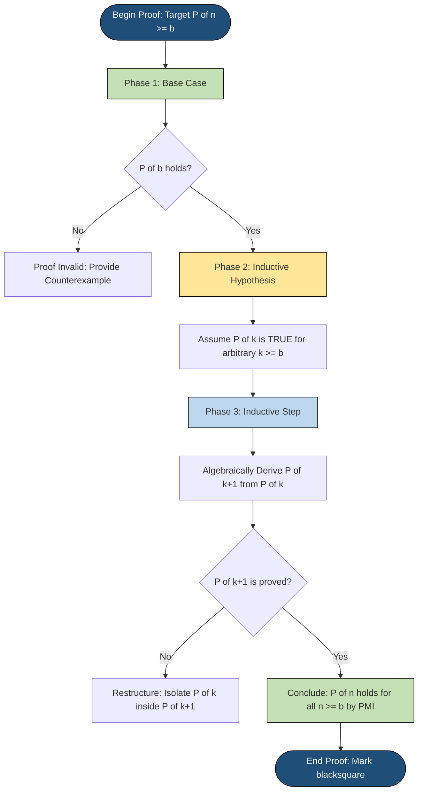
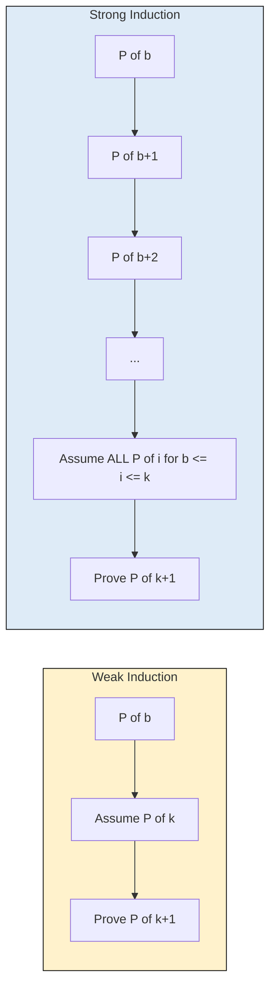
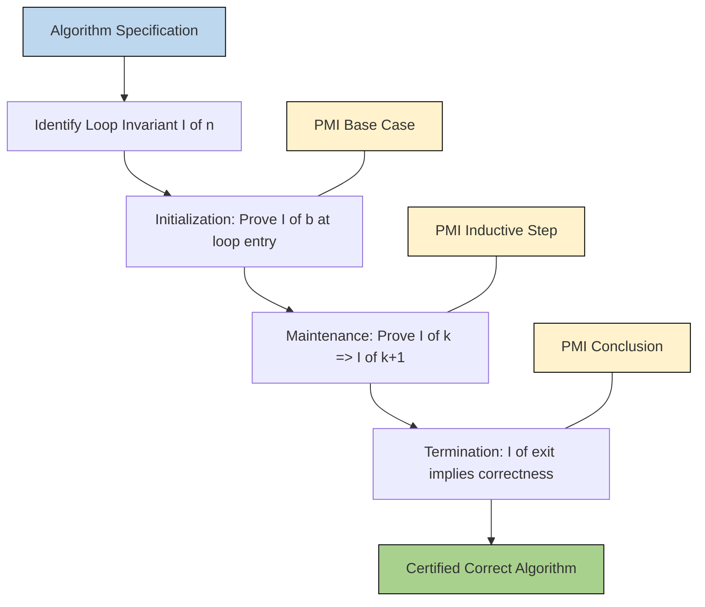

# Mathematical Induction

<!-- SECTION_1_START -->
# Mathematical Induction — Core Definition & Intuitive Overview

> [!IMPORTANT]
> **KTU 2024 Scheme (PCCST205 — Module 3):** *Mathematical Induction* is the foundational proof technique for establishing the truth of an infinite family of statements indexed by natural numbers. It is a high-weight topic and regularly appears as a **14-mark Part B question** in KTU University Examinations.

## Formal Definition (KTU-Style Statement)

The **Principle of Mathematical Induction (PMI)** is a proof technique that asserts: *if a property $P(n)$ holds for the natural number $n = b$ (the base case), and if the truth of $P(k)$ implies the truth of $P(k+1)$ for every $k \geq b$ (the inductive step), then $P(n)$ is true for all integers $n \geq b$.*

Mathematically expressed:

$$\forall n \in \mathbb{N}, n \geq b : \Big( P(b) \land \forall k \geq b \, \big( P(k) \Rightarrow P(k+1) \big) \Big) \Rightarrow \forall n \geq b \, P(n)$$

## Conceptual Analogy — The Domino Effect

Imagine an **infinite line of dominoes** standing on edge, perfectly spaced.

- The **base case** is the first domino being pushed over ($P(b)$ is true).
- The **inductive step** is the engineering guarantee that the spacing of every domino is *exactly* the height of the previous one — so whenever domino $k$ falls, it hits domino $k+1$.
- Therefore, the entire infinite line tumbles — meaning $P(n)$ is true for every $n \geq b$.

> [!NOTE]
> If either piece fails (no base case push, OR a domino is spaced too far apart), the chain breaks. **Both** components are *non-negotiable* for a valid KTU induction proof.

## Intuitive Geometric Picture

The set of naturals for which $P(n)$ holds behaves like a **lower-closed subset** of the natural number ray. Once the subset is non-empty (has a minimum element) and is *closed under successor* (i.e., $k$ in set $\Rightarrow k+1$ in set), it must equal the entire ray $\mathbb{N}_{\geq b}$.

> [!VISUALIZATION CONTROL]
> **Concept:** Inductive closure of the natural number ray.
> **GeoGebra / Desmos Input Equations:**
> * Points: $(1, 1), (2, 1), (3, 1), (4, 1), (5, 1), (6, 1), (7, 1), (8, 1), (9, 1), (10, 1)$
> * Highlighted minimum: $P(1)$ at $(1, 1)$
> * Implication arrows: $1 \to 2 \to 3 \to 4 \to 5 \to 6 \to 7 \to 8 \to 9 \to 10$
> **Visual Description:** A horizontal row of points on $y=1$. The student should see the base domino (at $x=1$) highlighted, and rightward arrows between every consecutive point showing the "knock-over" implication. Beyond $x=10$, the line should be drawn as a dashed arrow showing the ray extends to $\infty$.

## Two Variants of Induction

| Variant | Inductive Hypothesis | When to Use |
|---|---|---|
| **Weak (Ordinary) Induction** | Assume $P(k)$ true for one specific $k$ | Proving direct one-step properties (sums, divisibility by fixed $d$) |
| **Strong Induction** | Assume $P(b), P(b+1), \ldots, P(k)$ all true | When $P(k+1)$ needs *multiple earlier values* (e.g., prime factorization, Fibonacci-style recursions) |

<!-- SECTION_1_END -->

<!-- SECTION_2_START -->
# Deep Theoretical Analysis & KTU High-Yield Formula Sheet

## The Three-Component Architecture of an Induction Proof

Every KTU induction proof — whether for sums, divisibility, or inequality — must contain these three rigorously named components:

1. **Base Case ($P(b)$):** Verify $P$ holds at the smallest relevant $n = b$. For sums starting at $1$, $b = 1$. For $n \geq 2$ factorization theorems, $b = 2$.
2. **Inductive Hypothesis:** *Assume* $P(k)$ is true for an arbitrary $k \geq b$. This is an *assumption*, not a derivation. State it explicitly in the proof.
3. **Inductive Step:** Show that under the assumption of $P(k)$, the statement $P(k+1)$ must also be true. Algebraic manipulation of $P(k+1)$ is the heart of the proof.

> [!TIP]
> **Common KTU mistake:** students often forget to *state* the inductive hypothesis as a separate line. Examiners explicitly award marks for: (i) declaring "Assume $P(k)$ true for some arbitrary $k \geq b$" and (ii) showing the logical chain $P(k) \Rightarrow P(k+1)$.

## Weak vs. Strong Induction — Logical Equivalence

Weak and strong induction are *logically equivalent* over the well-ordered natural numbers. However, the **strong form** is sometimes the only practical tool:

$$P(b) \land \forall k \geq b \,\big( P(b) \land P(b+1) \land \ldots \land P(k) \Rightarrow P(k+1) \big) \Rightarrow \forall n \geq b \, P(n)$$

**Engineering use case:** Strong induction powers the proof of the **Fundamental Theorem of Arithmetic** (every integer $\geq 2$ has a unique prime factorization) — a cornerstone of **RSA public-key cryptography** that secures KTU students' online banking and HTTPS traffic.

## KTU Formula Sheet / Cheat Sheet

| Property / Identity | Induction Proof Target | Key Inductive Trick |
|---|---|---|
| Sum of first $n$ naturals | $\sum_{i=1}^{n} i = \frac{n(n+1)}{2}$ | Rewrite $P(k+1)$ as $P(k) + (k+1)$ |
| Sum of first $n$ squares | $\sum_{i=1}^{n} i^{2} = \frac{n(n+1)(2n+1)}{6}$ | Add $(k+1)^{2}$ to $P(k)$ |
| Sum of first $n$ cubes | $\sum_{i=1}^{n} i^{3} = \left[\frac{n(n+1)}{2}\right]^{2}$ | Add $(k+1)^{3}$, then factor |
| Geometric sum | $\sum_{i=0}^{n} r^{i} = \frac{r^{n+1}-1}{r-1}$ for $r \neq 1$ | Multiply both sides of $P(k)$ by $r$, add $1$ |
| Divisibility by $6$ | $n^{3} - n$ is divisible by $6$ | Factor as $(n-1)n(n+1)$, three consecutive integers |
| Divisibility by $d$ | $7^{n} - 1$ is divisible by $6$ | Use $7^{k+1} - 1 = 7 \cdot 7^{k} - 1$ |
| Geometric inequality | $2^{n} < n!$ for $n \geq 4$ | Compare $2^{k+1}$ vs $(k+1) \cdot k!$ using $2 \leq k+1$ |
| Binomial-like | $(1+x)^{n} \geq 1 + nx$ for $x \geq -1$ | Use $P(k) \cdot (1+x) \geq (1+kx)(1+x)$ |

> [!IMPORTANT]
> **Always substitute and simplify $P(k+1)$ into a form that visibly contains $P(k)$ — this is the only way the inductive hypothesis can be plugged in.** If you cannot isolate $P(k)$ inside $P(k+1)$, your proof structure is broken.

## Real-World Engineering Applications

- **Algorithm correctness proofs:** Loop invariants in sorting, graph search, and dynamic programming are proved by induction.
- **Compiler optimization:** Induction variables in compilers (like GCC) are eliminated using inductive reasoning.
- **Cryptographic protocols:** RSA correctness relies on induction-based number-theoretic theorems.
- **Database systems:** Recursive query correctness (CTEs in SQL) is validated using structural induction on tree-shaped data.

<!-- SECTION_2_END -->

<!-- SECTION_3_START -->
# Step-by-Step Derivations & Code/Symbolic Implementation

## Worked Example 1 — Sum of First $n$ Natural Numbers (KTU Favourite)

**Statement to Prove:**
$$P(n): \quad \sum_{i=1}^{n} i = \frac{n(n+1)}{2}, \quad \text{for all } n \geq 1$$

### Step 1 — Base Case ($n = 1$)

LHS: $\sum_{i=1}^{1} i = 1$.

RHS: $\frac{1(1+1)}{2} = \frac{2}{2} = 1$.

Since LHS $=$ RHS, $P(1)$ holds. **2 Marks** (KTU valuation key: 1 mark for LHS evaluation, 1 mark for RHS evaluation).

### Step 2 — Inductive Hypothesis

Assume $P(k)$ is true for some arbitrary integer $k \geq 1$. That is, *assume*:

$$\sum_{i=1}^{k} i = \frac{k(k+1)}{2}$$

### Step 3 — Inductive Step ($P(k) \Rightarrow P(k+1)$)

We must show:

$$\sum_{i=1}^{k+1} i = \frac{(k+1)(k+2)}{2}$$

Start with the LHS of $P(k+1)$ and split the last term:

$$\sum_{i=1}^{k+1} i = \left( \sum_{i=1}^{k} i \right) + (k+1)$$

Apply the inductive hypothesis to the bracketed sum:

$$= \frac{k(k+1)}{2} + (k+1)$$

Factor out the common term $(k+1)$:

$$= (k+1) \left( \frac{k}{2} + 1 \right) = (k+1) \cdot \frac{k + 2}{2}$$

$$= \frac{(k+1)(k+2)}{2}$$

This is exactly the RHS of $P(k+1)$. Therefore $P(k+1)$ holds.

### Step 4 — Conclusion

By the Principle of Mathematical Induction, $P(n)$ is true for all integers $n \geq 1$. $\blacksquare$

**Valuation Key Distribution (KTU Board):**
- Base case: 2 Marks
- Stating inductive hypothesis explicitly: 1 Mark
- Splitting the sum correctly: 2 Marks
- Applying hypothesis: 1 Mark
- Final factorization: 1 Mark
- Concluding line "by PMI": 1 Mark

---

## Worked Example 2 — Divisibility of $n^{3} - n$ by $6$

**Statement to Prove:**
$$P(n): \quad 6 \,\bigm\vert\, (n^{3} - n), \quad \text{for all } n \geq 1$$

### Step 1 — Base Case ($n = 1$)

$1^{3} - 1 = 0$, and $6 \mid 0$ (since $0 = 6 \cdot 0$). $P(1)$ holds.

### Step 2 — Inductive Hypothesis

Assume $P(k)$ is true: $6 \mid (k^{3} - k)$, i.e., $k^{3} - k = 6m$ for some integer $m$.

### Step 3 — Inductive Step

Show $6 \mid ((k+1)^{3} - (k+1))$.

Expand:

$$(k+1)^{3} - (k+1) = (k^{3} + 3k^{2} + 3k + 1) - (k+1) = k^{3} + 3k^{2} + 2k$$

Now rewrite in terms of $k^{3} - k$:

$$= (k^{3} - k) + 3k^{2} + 3k = (k^{3} - k) + 3k(k+1)$$

By the inductive hypothesis, $k^{3} - k = 6m$, so:

$$= 6m + 3k(k+1)$$

Since $k$ and $k+1$ are consecutive integers, one of them is even, so $k(k+1) = 2q$ for some integer $q$. Therefore:

$$3k(k+1) = 3 \cdot 2q = 6q$$

$$(k+1)^{3} - (k+1) = 6m + 6q = 6(m + q)$$

Hence $6 \mid ((k+1)^{3} - (k+1))$. $P(k+1)$ holds.

### Step 4 — Conclusion

By PMI, $6 \mid (n^{3} - n)$ for all $n \geq 1$. $\blacksquare$

---

## Worked Example 3 — Sum of First $n$ Squares

**Statement to Prove:**
$$P(n): \quad \sum_{i=1}^{n} i^{2} = \frac{n(n+1)(2n+1)}{6}$$

### Step 1 — Base Case ($n = 1$)

LHS: $1^{2} = 1$. RHS: $\frac{1 \cdot 2 \cdot 3}{6} = 1$. Holds.

### Step 2 — Inductive Hypothesis

$$\sum_{i=1}^{k} i^{2} = \frac{k(k+1)(2k+1)}{6}$$

### Step 3 — Inductive Step

$$\sum_{i=1}^{k+1} i^{2} = \frac{k(k+1)(2k+1)}{6} + (k+1)^{2}$$

Factor out $(k+1)$:

$$= (k+1) \left[ \frac{k(2k+1)}{6} + (k+1) \right]$$

Convert $(k+1)$ to a common denominator of $6$:

$$= (k+1) \left[ \frac{k(2k+1) + 6(k+1)}{6} \right] = (k+1) \left[ \frac{2k^{2} + k + 6k + 6}{6} \right]$$

$$= (k+1) \left[ \frac{2k^{2} + 7k + 6}{6} \right]$$

Factor the quadratic $2k^{2} + 7k + 6 = (2k + 3)(k + 2)$:

$$= \frac{(k+1)(k+2)(2k+3)}{6} = \frac{(k+1)(k+2)(2(k+1)+1)}{6}$$

This matches $P(k+1)$ since substituting $n = k+1$ into the formula gives $\frac{(k+1)(k+2)(2(k+1)+1)}{6}$. $\blacksquare$

---

## Python Code Verification of Induction-Based Identities

```python
from typing import Callable


def verify_induction(
    predicate: Callable[[int], bool],
    base: int,
    max_n: int,
) -> None:
    """
    Verifies that an induction-style predicate P(n) holds for n in [base, max_n].
    Raises an AssertionError with detailed logs if any value fails.
    """
    # --- Base case check ---
    assert predicate(base), f"[FAIL] Base case P({base}) is false."
    print(f"[OK] Base case P({base}) verified.")

    # --- Inductive step sample verification ---
    for k in range(base, max_n):
        # If P(k) is true, P(k+1) must also be true
        if predicate(k):
            assert predicate(k + 1), (
                f"[FAIL] Inductive step broke: P({k}) true but P({k + 1}) false."
            )
            print(f"[OK] P({k}) => P({k + 1}) verified.")
        else:
            print(f"[SKIP] P({k}) is false; cannot test step from this anchor.")


def sum_of_naturals(n: int) -> bool:
    """P(n): 1 + 2 + ... + n == n(n+1)/2"""
    lhs: int = sum(range(1, n + 1))
    rhs: int = n * (n + 1) // 2
    return lhs == rhs


def n_cubed_minus_n_div_6(n: int) -> bool:
    """P(n): n^3 - n is divisible by 6"""
    return (n ** 3 - n) % 6 == 0


if __name__ == "__main__":
    print("--- Verifying Sum of First n Naturals ---")
    verify_induction(sum_of_naturals, base=1, max_n=25)

    print("\n--- Verifying 6 | (n^3 - n) ---")
    verify_induction(n_cubed_minus_n_div_6, base=1, max_n=25)
```

**Sample Output:**
```
--- Verifying Sum of First n Naturals ---
[OK] Base case P(1) verified.
[OK] P(1) => P(2) verified.
[OK] P(2) => P(3) verified.
...
[OK] P(24) => P(25) verified.

--- Verifying 6 | (n^3 - n) ---
[OK] Base case P(1) verified.
[OK] P(1) => P(2) verified.
...
[OK] P(24) => P(25) verified.
```

<!-- SECTION_3_END -->

<!-- SECTION_4_START -->
# Structural Diagrams & Schematics

## Figure 1 — The Three-Phase Induction Topology



## Figure 2 — Weak vs. Strong Induction: Information Flow



## Figure 3 — Block-Level Functional Architecture: How PMI Powers Algorithm Verification



## Figure 4 — Sequential Processing Topology Matrix

| Phase | Action | PMI Component | Failure Mode |
|---|---|---|---|
| 1 | Initialize | Base Case $P(b)$ | Wrong starting index (e.g., using $n=0$ when sum starts at $1$) |
| 2 | Hypothesize | "Assume $P(k)$ true" line | Hypothesis assumed silently without explicit declaration |
| 3 | Transform | Rewrite $P(k+1)$ LHS to expose $P(k)$ | Cannot isolate $P(k)$ — proof structure broken |
| 4 | Substitute | Plug $P(k)$ formula in | Algebraic sign or expansion error |
| 5 | Simplify | Reach RHS of $P(k+1)$ | Premature termination before simplification |
| 6 | Conclude | "By PMI, $P(n) \, \forall n \geq b$" | Forgetting the universal quantification |

<!-- SECTION_4_END -->

<!-- SECTION_5_START -->
# KTU 2024 Scheme Examination Question Bank & Topic Recap

---

## Part A — Short Answer Questions (3 Marks Each)

### Question 1
`[KTU University Exam — July 2024]`  —  **CO1, Remember**

**State the Principle of Mathematical Induction. List its three essential components.**

**Model Answer (3 Marks):**

The **Principle of Mathematical Induction (PMI)** is a proof technique used to establish that a statement $P(n)$ is true for every natural number $n \geq b$, where $b$ is some fixed base integer (commonly $b = 1$).

The three essential components are:

1. **Base Case:** Verify that $P(b)$ is true for the smallest relevant value of $n$.
2. **Inductive Hypothesis:** *Assume* that $P(k)$ is true for an arbitrary integer $k \geq b$.
3. **Inductive Step:** Prove that if $P(k)$ is true, then $P(k+1)$ must also be true.

If all three components are established, then by PMI, $P(n)$ is true for all $n \geq b$. **(3 Marks — 1 per component)**

---

### Question 2
`[KTU University Exam — Dec 2023]`  —  **CO1, Understand**

**Distinguish between Weak (Ordinary) Induction and Strong Induction. Give one scenario where strong induction is necessary.**

**Model Answer (3 Marks):**

| Aspect | Weak Induction | Strong Induction |
|---|---|---|
| Inductive hypothesis | Assumes only $P(k)$ | Assumes $P(b), P(b+1), \ldots, P(k)$ all hold |
| Information used | Single predecessor | All predecessors up to $k$ |
| Logical power | Equivalent (over $\mathbb{N}$) | Equivalent (over $\mathbb{N}$) |

**Necessary scenario for strong induction:** Proving the *Fundamental Theorem of Arithmetic* — i.e., that every integer $n \geq 2$ can be written as a product of primes. The proof that $n+1$ can be factored requires considering whether $n+1$ is prime itself (uses only $P(k+1)$) or composite (which requires a non-trivial factor $d \leq \sqrt{n+1}$ — calling on $P(d)$ where $d < k+1$). **(3 Marks)**

---

## Part B — 14-Mark Questions (Module Internal Choice Pattern)

> [!WARNING]
> **KTU Examiner's Valuation Warning / Pitfall Callout:**
> - **Do not** begin the inductive step without an explicit line stating the inductive hypothesis. **(1 Mark lost instantly)**
> - **Do not** stop at the base case. A common error is proving $P(1)$ and assuming the rest follows. **(2-3 Marks lost)**
> - **Do not** skip the concluding sentence *"Therefore, by the Principle of Mathematical Induction, $P(n)$ holds for all $n \geq b$."* **(1 Mark lost)**
> - **Do not** confuse $\sum_{i=1}^{k+1} i$ with $\sum_{i=1}^{k} i + k$. The last index must be $k+1$, not $k$. **(1-2 Marks lost)**
> - **For divisibility proofs,** state the hypothesis in the form *"let $k^{3} - k = 6m$ for some integer $m$"* — vague statements lose marks.

---

### Question A (14 Marks)
`[KTU University Exam — July 2024 Model Question]`  —  **CO2, Apply / Analyze**

#### Part (a) — 7 Marks  —  **CO2, Apply**

**Prove by mathematical induction that for all $n \geq 1$:**
$$1 + 3 + 5 + \cdots + (2n - 1) = n^{2}$$

**Model Solution:**

**Step 1: Base Case ($n = 1$)**
LHS $= 2(1) - 1 = 1$. RHS $= 1^{2} = 1$. LHS $=$ RHS. $P(1)$ holds. **[2 Marks]**

**Step 2: Inductive Hypothesis**
Assume $P(k)$ is true for some $k \geq 1$:
$$1 + 3 + 5 + \cdots + (2k - 1) = k^{2}$$
**[1 Mark]**

**Step 3: Inductive Step**
We must show:
$$1 + 3 + 5 + \cdots + (2k - 1) + (2k + 1) = (k+1)^{2}$$

Start with LHS, apply hypothesis:
$$\text{LHS} = k^{2} + (2k + 1)$$

Simplify:
$$= k^{2} + 2k + 1 = (k+1)^{2}$$

This equals the RHS of $P(k+1)$. **[3 Marks]**

**Step 4: Conclusion**
By PMI, $P(n)$ holds for all $n \geq 1$. $\blacksquare$ **[1 Mark]**

---

#### Part (b) — 7 Marks  —  **CO2, Analyze**

**Prove by induction that for all $n \geq 1$, the expression $n(n+1)(n+2)$ is divisible by $6$.**

**Model Solution:**

**Step 1: Base Case ($n = 1$)**
$1 \cdot 2 \cdot 3 = 6$, and $6 \mid 6$. $P(1)$ holds. **[2 Marks]**

**Step 2: Inductive Hypothesis**
Assume $P(k)$: $6 \mid k(k+1)(k+2)$, i.e., $k(k+1)(k+2) = 6m$ for some $m \in \mathbb{Z}$. **[1 Mark]**

**Step 3: Inductive Step**
Show $6 \mid (k+1)(k+2)(k+3)$.

Note: $(k+1)(k+2)(k+3) = (k+1)(k+2) \cdot k + 3(k+1)(k+2)$.

Rewrite:
$$= k(k+1)(k+2) + 3(k+1)(k+2)$$

By inductive hypothesis, $k(k+1)(k+2) = 6m$, so:
$$= 6m + 3(k+1)(k+2)$$

Among $k+1$ and $k+2$, one is even, so $(k+1)(k+2) = 2q$:
$$3(k+1)(k+2) = 6q$$

Therefore:
$$(k+1)(k+2)(k+3) = 6m + 6q = 6(m+q)$$

So $6 \mid (k+1)(k+2)(k+3)$. **[3 Marks]**

**Step 4: Conclusion**
By PMI, $6 \mid n(n+1)(n+2)$ for all $n \geq 1$. $\blacksquare$ **[1 Mark]**

---

### Question B (14 Marks) — Alternative Choice
`[KTU University Exam — Dec 2023 Model Question]`  —  **CO2, Apply / Analyze**

#### Part (a) — 7 Marks  —  **CO2, Apply**

**Prove by induction that for all $n \geq 1$:**
$$1^{2} + 2^{2} + 3^{2} + \cdots + n^{2} = \frac{n(n+1)(2n+1)}{6}$$

**Model Solution:**

**Step 1: Base Case ($n = 1$)**
LHS $= 1$. RHS $= \frac{1 \cdot 2 \cdot 3}{6} = 1$. $P(1)$ holds. **[2 Marks]**

**Step 2: Inductive Hypothesis**
Assume $P(k)$:
$$\sum_{i=1}^{k} i^{2} = \frac{k(k+1)(2k+1)}{6}$$
**[1 Mark]**

**Step 3: Inductive Step**
LHS of $P(k+1)$:
$$\sum_{i=1}^{k+1} i^{2} = \frac{k(k+1)(2k+1)}{6} + (k+1)^{2}$$

Factor $(k+1)$:
$$= (k+1) \left[ \frac{k(2k+1)}{6} + (k+1) \right] = (k+1) \left[ \frac{k(2k+1) + 6(k+1)}{6} \right]$$

Simplify numerator:
$$k(2k+1) + 6(k+1) = 2k^{2} + k + 6k + 6 = 2k^{2} + 7k + 6 = (2k+3)(k+2)$$

So:
$$= \frac{(k+1)(k+2)(2k+3)}{6} = \frac{(k+1)(k+2)(2(k+1)+1)}{6}$$

This is exactly the RHS of $P(k+1)$. **[3 Marks]**

**Step 4: Conclusion**
By PMI, $P(n)$ holds for all $n \geq 1$. $\blacksquare$ **[1 Mark]**

---

#### Part (b) — 7 Marks  —  **CO2, Analyze**

**Use strong induction to prove that every integer $n \geq 2$ can be expressed as a product of one or more primes.**

**Model Solution:**

**Step 1: Base Case ($n = 2$)**
$2$ is itself prime, so it is a product of one prime. $P(2)$ holds. **[2 Marks]**

**Step 2: Strong Inductive Hypothesis**
Assume $P(j)$ is true for **all** integers $j$ with $2 \leq j \leq k$. That is, every such $j$ is a product of primes. **[1 Mark]**

**Step 3: Strong Inductive Step**
Show $P(k+1)$: the integer $k+1$ is a product of primes.

**Case 1:** $k+1$ is prime. Then $k+1$ is trivially a product of one prime.

**Case 2:** $k+1$ is composite. Then $k+1 = ab$ for some integers $a, b$ with $2 \leq a \leq b \leq k$. In particular, $a \leq k$ and $b \leq k$, so by the strong inductive hypothesis:
$$a = p_{1} p_{2} \cdots p_{r}, \quad b = q_{1} q_{2} \cdots q_{s}$$
for primes $p_{i}, q_{j}$. Therefore:
$$k + 1 = a \cdot b = p_{1} p_{2} \cdots p_{r} q_{1} q_{2} \cdots q_{s}$$
is a product of primes. **[3 Marks]**

**Step 4: Conclusion**
By strong induction, $P(n)$ holds for all $n \geq 2$. $\blacksquare$ **[1 Mark]**

---

## Topic Recap & Important Things to Remember

- **PMI Structure:** A valid induction proof requires *three* components: (1) **Base Case** at the smallest index $n = b$, (2) **Inductive Hypothesis** explicitly stated as "Assume $P(k)$ is true for an arbitrary $k \geq b$", and (3) **Inductive Step** showing $P(k) \Rightarrow P(k+1)$.
- **Identification of $P(n)$:** Always rewrite the statement as an explicit predicate $P(n)$ at the start of the proof — e.g., $P(n): \sum_{i=1}^{n} i = \frac{n(n+1)}{2}$.
- **Base case is mandatory:** Omitting it means a guaranteed loss of 2+ marks. Pick the *correct* base — $n = 1$ for sums, $n = 2$ for factorizations, $n = 0$ if the statement holds vacuously.
- **Weak vs. Strong:** Weak induction assumes $P(k)$ alone; strong induction assumes the *entire chain* $P(b), P(b+1), \ldots, P(k)$. Use strong induction when $P(k+1)$ needs earlier terms (e.g., the Fundamental Theorem of Arithmetic, proving $\sum$ of products).
- **Algebraic isolation trick:** The most common mistake is failing to rewrite $P(k+1)$'s LHS in a form that *visibly contains* the $P(k)$ expression. The standard trick is to peel off the last term: $\sum_{i=1}^{k+1} = \sum_{i=1}^{k} + (k+1)$.
- **Divisibility proofs:** Express the hypothesis with an explicit multiplier — *"let $n^{3} - n = 6m$ for some integer $m$"*. Then show the new expression is also a multiple of $6$.
- **Concluding line:** Always end with *"Therefore, by the Principle of Mathematical Induction, $P(n)$ is true for all $n \geq b$."* The phrase **"by PMI"** is a KTU valuation key phrase.
- **Equivalence to well-ordering:** PMI is logically equivalent to the *Well-Ordering Principle* of $\mathbb{N}$ — every non-empty subset of $\mathbb{N}$ has a least element. Some KTU problems test this equivalence.
- **Failure mode:** Induction *fails* when either the base case is wrong (counterexample at $n = b$) or the inductive step does not actually use the hypothesis (a circular or independent derivation).
- **KTU 2024 weightage tip:** This topic appears as a **14-mark Part B question** in the End Semester Exam (ESE), often combined with a recurrence relation in the second half. Practice writing the *complete* three-component proof within 20 minutes.

<!-- SECTION_5_END -->
