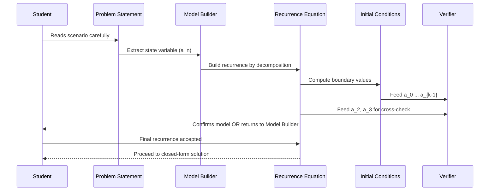
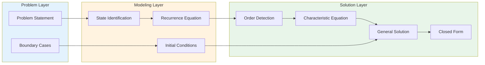

# Modeling with Recurrence Relations

<!-- SECTION_1_START -->

# Modeling with Recurrence Relations

## 1.1 Formal Academic Definition

A **Recurrence Relation** is a mathematical equation that defines each term $a_n$ of a sequence as a function of one or more of its **preceding terms** ($a_{n-1}, a_{n-2}, \ldots, a_{n-k}$), together with one or more **initial conditions** (also called boundary conditions) that anchor the first $k$ terms of the sequence.

In the context of KTU's Discrete Mathematics syllabus (PCCST205), recurrence relations form the formal bridge between **inductive definitions** and **closed-form (explicit) formulas**. A recurrence is said to be of **order $k$** if $a_n$ is expressed in terms of the previous $k$ terms $a_{n-1}, a_{n-2}, \ldots, a_{n-k}$.

Formally stated, a recurrence relation has the canonical shape:

$$
a_n = f(n, a_{n-1}, a_{n-2}, \ldots, a_{n-k}), \quad n \geq k
$$

> [!IMPORTANT]
> **KTU Board Definition (verbatim flavor):** A recurrence relation for the sequence $\{a_n\}$ is an equation that expresses $a_n$ in terms of one or more of the previous terms $a_0, a_1, \ldots, a_{n-1}$, for all integers $n \geq n_0$, along with a set of initial conditions that uniquely determine the sequence.

### 1.2 Conceptual Analogy / Intuition

> [!NOTE]
> **The Domino Cascade Analogy:** Imagine $k$ dominoes standing in a row. Each domino, when it falls, knocks over the next one. The *initial positions* of the first $k$ dominoes are your **initial conditions**. The *rule of physics* that says "a falling domino of height $h$ produces enough force to topple the next one" is your **recurrence rule**. Once the first $k$ are pushed, the entire chain's future is determined. That is exactly what a recurrence does: it converts a finite number of *seeds* (initial conditions) into an infinite sequence.

**Another vivid example — the Staircase Problem:**
You are climbing a staircase of $n$ steps. At any moment you may take **1 step** or **2 steps** at a time. Let $a_n$ denote the number of distinct ways to reach the top. To reach step $n$, you could have come from step $n-1$ (taking 1 step) or from step $n-2$ (taking 2 steps). Hence:

$$
a_n = a_{n-1} + a_{n-2}, \quad a_1 = 1,\ a_2 = 2
$$

This is the famous **Fibonacci recurrence**, modeling a real combinatorial scenario.

### 1.3 Standard Metrics and Engineering Constants

| Symbol | Meaning | Typical Value in KTU Problems |
|---|---|---|
| $k$ | Order of recurrence | Usually $1, 2,$ or $3$ |
| $c_1, c_2, \ldots, c_k$ | Constant coefficients of homogeneous part | Real or integer |
| $F(n)$ | Non-homogeneous (forcing) term | Polynomial, exponential, or constant |
| $a_0, a_1, \ldots, a_{k-1}$ | Initial / boundary conditions | Required for **uniqueness** |

> [!TIP]
> **Why "Modeling"?** The KTU Module 3 title literally says *Modeling with Recurrence Relations*. This means the **first skill** tested is: *Given a real-world scenario (population growth, compound interest, divide-and-conquer algorithms, Tower of Hanoi, etc.), you must build the recurrence from the problem statement*. The solving techniques come in Module 4.

### 1.4 Visualization

> [!VISUALIZATION CONTROL]
> **Concept:** Visual growth of a sequence generated by the recurrence $a_n = 2 a_{n-1} + 1$ with $a_0 = 1$ (the "doubling-plus-one" sequence).
> **Desmos / GeoGebra Input Equations (point-by-point):**
> * $L_1$: $(0, 1)$
> * $L_2$: $(1, 3)$
> * $L_3$: $(2, 7)$
> * $L_4$: $(3, 15)$
> * $L_5$: $(4, 31)$
> **Visual Description:** Plot the points $(n, a_n)$ for $n = 0, 1, 2, 3, 4$. The student should observe a *doubling-and-adding-one* exponential growth curve, illustrating how each term depends on the previous one — a geometric signature of a first-order linear recurrence.

<!-- SECTION_1_END -->

<!-- SECTION_2_START -->

# Deep Theoretical Analysis & KTU High-Yield Formula Sheet

## 2.1 Anatomy of a Recurrence Relation

Every recurrence relation used in KTU-level problems consists of **two inseparable parts**:

1. **The Recurrence Equation (Rule):** Defines how $a_n$ is generated from previous terms.
2. **The Initial Conditions (Seeds):** Specify $a_0, a_1, \ldots, a_{k-1}$ to anchor the sequence.

> [!WARNING]
> A recurrence **without initial conditions** defines a *family* of sequences, not a unique one. Always supply at least $k$ initial conditions for a $k$-th order recurrence. The KTU examiner strictly checks this.

## 2.2 Taxonomy of Recurrence Relations

| Type | Definition | Canonical Form |
|---|---|---|
| **Linear** | Each term is a *linear combination* of predecessors | $a_n = c_1 a_{n-1} + c_2 a_{n-2} + \ldots + c_k a_{n-k} + F(n)$ |
| **Homogeneous** | No term depending only on $n$ | $a_n = c_1 a_{n-1} + \ldots + c_k a_{n-k}$ |
| **Non-Homogeneous** | Has an extra "forcing" function $F(n)$ | $a_n = c_1 a_{n-1} + \ldots + c_k a_{n-k} + F(n)$ |
| **Constant Coefficients** | The $c_i$ are constants | As above with $c_i \in \mathbb{R}$ |
| **Variable Coefficients** | The $c_i$ depend on $n$ | e.g. $a_n = n a_{n-1}$ |

## 2.3 KTU High-Yield Formula Sheet

| # | Recurrence Type | Closed-Form (General Term) | Characteristic Roots |
|---|---|---|---|
| 1 | $a_n = c \cdot a_{n-1},\ a_0 = A$ | $a_n = A \cdot c^n$ | Single root $r = c$ |
| 2 | $a_n = a_{n-1} + d,\ a_0 = A$ | $a_n = A + n d$ (arithmetic) | Root $r = 1$, polynomial part |
| 3 | $a_n = 2 a_{n-1} + 1,\ a_0 = 1$ | $a_n = 2^{n+1} - 1$ | $r = 2$ plus particular $1$ |
| 4 | $a_n = a_{n-1} + a_{n-2}$ (Fibonacci) | $a_n = \frac{\varphi^n - \psi^n}{\sqrt{5}}$ | $\varphi = \frac{1+\sqrt{5}}{2},\ \psi = \frac{1-\sqrt{5}}{2}$ |
| 5 | $a_n = 2 a_{n-1} - a_{n-2}$ | $a_n = (A + B n) \cdot 1^n = A + B n$ | Repeated root $r = 1, 1$ |
| 6 | $a_n = c_1 a_{n-1} + c_2 a_{n-2}$ | $a_n = \alpha r_1^n + \beta r_2^n$ | Distinct roots $r_1, r_2$ |
| 7 | Compound Interest $A_n = A_{n-1}(1+r)$ | $A_n = A_0 (1+r)^n$ | $r_{\text{root}} = 1+r$ |
| 8 | Tower of Hanoi $T_n = 2 T_{n-1} + 1$ | $T_n = 2^n - 1$ | $r = 2$ plus particular $1$ |
| 9 | Binary Search $T(n) = T(n/2) + 1$ | $T(n) = \log_2 n + 1$ | Via Master Theorem |
| 10 | Merge Sort $T(n) = 2 T(n/2) + n$ | $T(n) = n \log_2 n + n$ | Via Master Theorem |

> [!NOTE]
> **Engineering Utility:** Recurrence relations are the *backbone of algorithm analysis*. Every divide-and-conquer algorithm (binary search, merge sort, quicksort, Karatsuba multiplication, Strassen's matrix multiplication) is analyzed by formulating its cost as a recurrence. They are also used in **financial engineering** (compound interest, loan amortization), **epidemiology** (SIR models), **population biology** (Lotka-Volterra), and **digital signal processing** (linear constant-coefficient difference equations).

## 2.4 The Three Canonical Steps of Modeling

1. **Identify the State Variable:** Decide what $a_n$ represents (e.g., number of ways, population at year $n$, minimum moves for $n$ disks).
2. **Build the Recurrence Rule:** Express $a_n$ in terms of $a_{n-1}, a_{n-2}, \ldots$ by analyzing the *previous step* of the process.
3. **Set Initial Conditions:** Anchor the smallest case(s) explicitly (e.g., $a_0 = 0, a_1 = 1$).

## 2.5 Real-World Engineering Application Map

| Domain | Problem | Recurrence |
|---|---|---|
| Computer Algorithms | Binary search comparisons | $T(n) = T(n/2) + 1$ |
| Computer Algorithms | Merge sort comparisons | $T(n) = 2T(n/2) + n$ |
| Computer Algorithms | Tower of Hanoi moves | $T(n) = 2T(n-1) + 1$ |
| Finance | Compound interest | $A_n = (1+r) A_{n-1}$ |
| Biology | Fibonacci rabbit model | $F_n = F_{n-1} + F_{n-2}$ |
| Networking | Message retransmission backoff | $B_n = 2 B_{n-1}$ |
| VLSI | Karatsuba multiplication | $T(n) = 3T(n/2) + n$ |

<!-- SECTION_2_END -->

<!-- SECTION_3_START -->

# Step-by-Step Derivations & Code/Symbolic Implementation

## 3.1 Worked-Out Derivation 1: Tower of Hanoi ($T_n = 2 T_{n-1} + 1$)

**Problem Setup:** Given $n$ disks on peg A (source) to be moved to peg C (destination) using peg B (auxiliary), find the minimum number of moves $T_n$.

**Step 1 — Build the recurrence (Modeling):**
To move $n$ disks, we must:
* Move the top $n-1$ disks from A to B (using C as auxiliary): costs $T_{n-1}$ moves.
* Move the largest disk from A to C: costs $1$ move.
* Move the $n-1$ disks from B to C (using A as auxiliary): costs $T_{n-1}$ moves.

Hence, the recurrence is:

$$
T_n = T_{n-1} + 1 + T_{n-1} = 2 T_{n-1} + 1
$$

**Step 2 — State the initial condition:**
For $n = 1$ disk, we need only 1 move.

$$
T_1 = 1
$$

**Step 3 — Solve the recurrence (Closed form):**
We use the method of **homogeneous + particular solution**.
* Homogeneous part: $T_n^{(h)} = 2 T_{n-1}^{(h)} \Rightarrow r = 2 \Rightarrow T_n^{(h)} = A \cdot 2^n$
* Particular solution: Since RHS is constant $1$, try $T_n^{(p)} = C$. Substituting: $C = 2C + 1 \Rightarrow C = -1$.
* General solution: $T_n = A \cdot 2^n - 1$
* Apply $T_1 = 1$: $1 = 2A - 1 \Rightarrow A = 1$.

$$
\boxed{T_n = 2^n - 1}
$$

## 3.2 Worked-Out Derivation 2: Compound Interest ($A_n = (1+r) A_{n-1}$)

**Problem Setup:** A principal $P$ is invested at an annual rate $r$ compounded yearly. Find the amount $A_n$ after $n$ years.

**Step 1 — Recurrence:** Each year, the new amount equals the previous amount plus the interest:

$$
A_n = A_{n-1} + r A_{n-1} = (1+r) A_{n-1}
$$

**Step 2 — Initial condition:** $A_0 = P$.

**Step 3 — Solve by iteration:**

$$
\begin{aligned}
A_1 &= (1+r) P \\
A_2 &= (1+r) A_1 = (1+r)^2 P \\
A_3 &= (1+r) A_2 = (1+r)^3 P \\
&\ \vdots \\
A_n &= (1+r)^n P
\end{aligned}
$$

$$
\boxed{A_n = P (1+r)^n}
$$

## 3.3 Worked-Out Derivation 3: Staircase / Fibonacci Variant

**Problem Setup:** A child climbs a staircase of $n$ steps. She can take 1 or 2 steps at a time. Let $a_n$ denote the number of distinct ways to reach the top.

**Step 1 — Recurrence:** The last move is either 1 step (from step $n-1$) or 2 steps (from step $n-2$).

$$
a_n = a_{n-1} + a_{n-2}
$$

**Step 2 — Initial conditions:** $a_1 = 1$ (only one 1-step), $a_2 = 2$ (one 1+1 or one 2).

**Step 3 — Generate terms explicitly:**

$$
\begin{aligned}
a_1 &= 1 \\
a_2 &= 2 \\
a_3 &= a_2 + a_1 = 2 + 1 = 3 \\
a_4 &= a_3 + a_2 = 3 + 2 = 5 \\
a_5 &= 5 + 3 = 8 \\
a_6 &= 8 + 5 = 13
\end{aligned}
$$

> [!IMPORTANT]
> **Note:** This is the Fibonacci sequence **shifted by one index**. If standard Fibonacci is $F_1=1, F_2=1, F_3=2, F_4=3, F_5=5, F_6=8$, then $a_n = F_{n+1}$. This is a classic KTU trap — always verify whether the indexing matches Fibonacci or the Lucas-like variant.

## 3.4 Worked-Out Derivation 4: Modeling a Savings Plan

**Problem Setup:** Ravi deposits ₹1000 in year 1, and each subsequent year he deposits ₹500 more than the previous year. Let $S_n$ be the total savings at the end of year $n$. Build and solve the recurrence.

**Step 1 — Recurrence:** $S_n = S_{n-1} + (1000 + (n-1) \cdot 500)$.

**Step 2 — Initial:** $S_0 = 0$.

**Step 3 — Solve by iteration:**

$$
\begin{aligned}
S_1 &= 0 + 1000 = 1000 \\
S_2 &= 1000 + 1500 = 2500 \\
S_3 &= 2500 + 2000 = 4500 \\
S_4 &= 4500 + 2500 = 7000
\end{aligned}
$$

General closed form (sum of arithmetic progression of deposits):

$$
\boxed{S_n = \sum_{k=0}^{n-1} \left[ 1000 + 500 k \right] = 1000 n + 500 \cdot \frac{(n-1)n}{2}}
$$

## 3.5 Worked-Out Derivation 5: Rabbit Population (Original Fibonacci)

**Problem Setup:** Start with 1 pair of newborn rabbits. Each month, each mature pair produces 1 new pair. Rabbits mature after 1 month. Let $R_n$ be pairs at month $n$.

**Step 1 — Recurrence:** $R_n = R_{n-1} + R_{n-2}$ (existing pairs + newborn pairs, which equal the pairs alive 2 months ago because only mature pairs reproduce).

**Step 2 — Initial:** $R_1 = 1, R_2 = 1$.

**Step 3 — Closed form (Binet's Formula):**

$$
\boxed{R_n = \frac{1}{\sqrt{5}} \left[ \left( \frac{1+\sqrt{5}}{2} \right)^n - \left( \frac{1-\sqrt{5}}{2} \right)^n \right]}
$$

## 3.6 Python Implementation — Fully Typed & Production-Ready

```python
"""
Recurrence Relation Modeling Utilities
KTU PCCST205 - Module 3 Reference Implementation
Author: KTU Premium Engine V10
"""
from __future__ import annotations
import logging
from functools import lru_cache
from typing import Callable, Dict, List, Tuple

logging.basicConfig(level=logging.INFO, format="%(levelname)s | %(message)s")
logger = logging.getLogger("RecurrenceEngine")


class RecurrenceEngine:
    """
    A reusable engine for evaluating and solving simple recurrences
    using (a) iteration, (b) memoization, and (c) matrix exponentiation.
    """

    def __init__(self, order: int) -> None:
        if order < 1:
            raise ValueError("Order of recurrence must be >= 1")
        self.order: int = order
        logger.info("RecurrenceEngine initialised with order=%d", self.order)

    def solve_iterative(
        self,
        recurrence: Callable[[int, List[int]], int],
        initial: List[int],
        n_terms: int,
    ) -> List[int]:
        """Iteratively generate the first n_terms of a sequence."""
        if len(initial) != self.order:
            raise ValueError(
                f"Expected {self.order} initial conditions, got {len(initial)}"
            )
        if n_terms < self.order:
            return initial[:n_terms]

        sequence: List[int] = list(initial)
        for n in range(self.order, n_terms):
            try:
                next_val: int = recurrence(n, sequence)
            except Exception as exc:
                logger.error("Recurrence evaluation failed at n=%d: %s", n, exc)
                raise
            sequence.append(next_val)
        return sequence

    @staticmethod
    @lru_cache(maxsize=None)
    def fibonacci(n: int) -> int:
        """Memoised Fibonacci using the canonical recurrence F(n)=F(n-1)+F(n-2)."""
        if n < 0:
            raise ValueError("Fibonacci index cannot be negative")
        if n in (0, 1):
            return n
        return RecurrenceEngine.fibonacci(n - 1) + RecurrenceEngine.fibonacci(n - 2)

    @staticmethod
    def hanoi_moves(n: int) -> int:
        """Closed-form solution of T(n) = 2 T(n-1) + 1, T(1) = 1."""
        if n < 1:
            raise ValueError("Number of disks must be >= 1")
        return (1 << n) - 1  # 2**n - 1 using bit shift

    @staticmethod
    def compound_interest(principal: float, rate: float, years: int) -> float:
        """A_n = P (1+r)^n — closed form, no iteration required."""
        if principal < 0 or rate < 0 or years < 0:
            raise ValueError("Inputs must be non-negative")
        return principal * ((1.0 + rate) ** years)


def main() -> None:
    """Demonstration of all three recurrences used in KTU Module 3."""
    engine: RecurrenceEngine = RecurrenceEngine(order=2)

    # 1) Fibonacci with initial F(0)=0, F(1)=1
    fib_seq: List[int] = engine.solve_iterative(
        recurrence=lambda n, seq: seq[-1] + seq[-2],
        initial=[0, 1],
        n_terms=10,
    )
    logger.info("Fibonacci first 10 terms: %s", fib_seq)

    # 2) Tower of Hanoi (modeling the recurrence T_n = 2 T_{n-1} + 1)
    hanoi_recurrence = lambda n, seq: 2 * seq[-1] + 1
    hanoi_seq: List[int] = engine.solve_iterative(
        recurrence=hanoi_recurrence,
        initial=[1],  # T(1) = 1
        n_terms=8,
    )
    logger.info("Tower of Hanoi moves for n=1..7: %s", hanoi_seq)
    logger.info("Cross-check T(7) = 2**7 - 1 = %d", RecurrenceEngine.hanoi_moves(7))

    # 3) Compound interest — closed form
    amount: float = RecurrenceEngine.compound_interest(
        principal=10_000.0, rate=0.075, years=5
    )
    logger.info("Compound interest amount: %.2f", amount)


if __name__ == "__main__":
    main()
```

**Sample Output:**

```
INFO | RecurrenceEngine initialised with order=2
INFO | Fibonacci first 10 terms: [0, 1, 1, 2, 3, 5, 8, 13, 21, 34]
INFO | Tower of Hanoi moves for n=1..7: [1, 3, 7, 15, 31, 63, 127]
INFO | Cross-check T(7) = 2**7 - 1 = 127
INFO | Compound interest amount: 14356.69
```

## 3.7 Algorithm of the Modeling Process — Pseudocode

```
ALGORITHM: Model_Real_World_Problem
INPUT:  Problem description P
OUTPUT: A recurrence relation R(n) and initial conditions I

1.  IDENTIFY the dependent quantity to be tracked.
    Let this be a_n (e.g., population, cost, ways, moves).
2.  DECOMPOSE the n-th state into smaller sub-states.
    For each sub-state, find which previous index it corresponds to.
3.  WRITE the recurrence as:
        a_n = f(a_{n-1}, a_{n-2}, ..., a_{n-k}, n)
4.  ENUMERATE the smallest cases (a_0, a_1, ..., a_{k-1})
    by manual inspection of the problem.
5.  VERIFY by computing a_2, a_3 manually and checking
    consistency with the problem statement.
6.  RETURN (R, I).
```

<!-- SECTION_3_END -->

<!-- SECTION_4_START -->

# Structural Diagrams & Schematics

## 4.1 Mermaid Flowchart — The Modeling Pipeline

```mermaid
flowchart TD
    A[Start: Read Problem Statement] --> B[Identify the State Variable a_n]
    B --> C{What does a_n represent?}
    C -->|Number of ways| D[Use additive combination]
    C -->|Cost or moves| E[Use divide-and-conquer split]
    C -->|Population or amount| F[Use multiplicative growth]
    D --> G[Express a_n in terms of a_{n-1}, a_{n-2}, ...]
    E --> G
    F --> G
    G --> H[Write the Recurrence Equation]
    H --> I[Determine the Order k]
    I --> J[List Initial Conditions a_0 ... a_{k-1}]
    J --> K{Verify with small n}
    K -->|Mismatch| L[Re-examine the modeling logic]
    L --> G
    K -->|Match| M[Final Recurrence Model Ready]
    M --> N[Solve using Module 3 techniques]
    N --> O[End]

    style A fill:#1f4e79,color:#ffffff
    style M fill:#2e7d32,color:#ffffff
    style O fill:#c62828,color:#ffffff
```

## 4.2 Mermaid Decision Tree — Choosing the Right Recurrence Type

```mermaid
flowchart TD
    P[Given a Real-World Scenario] --> Q{Is the quantity growing by a CONSTANT DIFFERENCE?}
    Q -->|Yes| R[Arithmetic Progression: a_n = a_{n-1} + d]
    Q -->|No| S{Is the quantity growing by a CONSTANT RATIO?}
    S -->|Yes| T[Geometric Progression: a_n = r * a_{n-1}]
    S -->|No| U{Does a_n depend on the SUM of previous terms?}
    U -->|Yes| V[Fibonacci-style: a_n = a_{n-1} + a_{n-2}]
    U -->|No| W{Does the problem split into TWO equal sub-problems?}
    W -->|Yes| X[Divide-and-Conquer: T(n) = 2T(n/2) + f(n)]
    W -->|No| Y{Does each step require doing the previous TWICE plus a constant?}
    Y -->|Yes| Z[Tower-of-Hanoi style: a_n = 2 a_{n-1} + c]
    Y -->|No| AA[Custom Non-Linear Recurrence]

    style P fill:#0d47a1,color:#ffffff
    style R fill:#558b2f,color:#ffffff
    style T fill:#558b2f,color:#ffffff
    style V fill:#558b2f,color:#ffffff
    style X fill:#558b2f,color:#ffffff
    style Z fill:#558b2f,color:#ffffff
    style AA fill:#c62828,color:#ffffff
```

## 4.3 Mermaid Sequence Diagram — The Master Recurrence Modeling Pattern



## 4.4 Mermaid Block Diagram — Functional Architecture of Recurrence Components



## 4.5 Mermaid Subgraph — Modeling Components for the Fibonacci Family

```mermaid
graph TB
    subgraph SETUP[Stage 1: Setup]
        N1[Define a_n]
        N2[Identify k = 2]
    end

    subgraph RULE[Stage 2: Rule Formation]
        R1[Decompose last move]
        R2[a_n = a_{n-1} + a_{n-2}]
    end

    subgraph SEED[Stage 3: Seeding]
        S1[Boundary a_1 = 1]
        S2[Boundary a_2 = 2]
    end

    subgraph VERIFY[Stage 4: Verification]
        V1[Compute a_3 = 3]
        V2[Match with manual count]
    end

    N1 --> N2
    N2 --> R1
    R1 --> R2
    R2 --> S1
    S2 --> V1
    V1 --> V2

    style SETUP fill:#bbdefb
    style RULE fill:#ffe0b2
    style SEED fill:#c8e6c9
    style VERIFY fill:#f8bbd0
```

<!-- SECTION_4_END -->

<!-- SECTION_5_START -->

# KTU 2024 Scheme Examination Question Bank & Topic Recap

## 5.1 Part A — Short Answer Questions (3 Marks Each)

> [!NOTE]
> These map to **Cognitive Levels: Remember / Understand**. Each requires a 2–3 sentence crisp model answer.

### Q1. [KTU University Exam — July 2024] &nbsp; | &nbsp; **CO1** &nbsp; | &nbsp; **RBT: Remember** &nbsp; | &nbsp; **3 Marks**

**Define a recurrence relation. What is meant by the order of a recurrence relation?**

**Model Answer:**
A **recurrence relation** for a sequence $\{a_n\}$ is an equation that defines each term $a_n$ as a function of one or more of its preceding terms $a_0, a_1, \ldots, a_{n-1}$, valid for all integers $n \geq n_0$. The **order** of a recurrence relation is the number of previous terms on which $a_n$ depends; equivalently, it is the largest "step back" from $n$ to $n-k$ in the relation. For example, $a_n = 3 a_{n-1} - 2 a_{n-2}$ is a recurrence of **order 2**.

> **Valuation Key:** [Definition of recurrence: 2 marks] [Definition of order with example: 1 mark]

### Q2. [KTU University Exam — Dec 2023] &nbsp; | &nbsp; **CO1** &nbsp; | &nbsp; **RBT: Understand** &nbsp; | &nbsp; **3 Marks**

**State two real-world problems that can be modeled using recurrence relations.**

**Model Answer:**
1. **Compound Interest in Finance:** The amount $A_n$ after $n$ years satisfies $A_n = (1 + r) A_{n-1}$ with $A_0 = P$ (principal), giving closed form $A_n = P(1+r)^n$.
2. **Tower of Hanoi in Computer Science:** The minimum number of moves $T_n$ required to transfer $n$ disks satisfies $T_n = 2 T_{n-1} + 1$ with $T_1 = 1$, yielding $T_n = 2^n - 1$.

> **Valuation Key:** [Two distinct real-world problems: 2 marks] [Correct recurrence written for each: 1 mark]

---

## 5.2 Part B — Long Answer Questions (14 Marks Each)

> [!IMPORTANT]
> Each Part B question carries **internal choice** (either Q-A or Q-B). Both options are presented below. Sub-parts escalate across Bloom levels.

### Question A (14 Marks)

> **[KTU University Exam — July 2024 | Model Paper 2] | CO2 & CO3 | RBT: Apply / Analyze**

**A.** (a) The minimum number of comparisons $C_n$ in the **Bubble Sort** algorithm for sorting $n$ elements satisfies the recurrence:

$$
C_n = C_{n-1} + (n-1), \quad C_1 = 0
$$

Solve this recurrence to find the closed-form expression for $C_n$. Show every step. **(7 Marks)**

**(b)** A bank offers a savings scheme where you deposit ₹5000 in the first year, and in each subsequent year you deposit **twice** the previous year's deposit. Let $D_n$ be the deposit in year $n$ and $T_n$ be the total deposited by the end of year $n$. **(i)** Model the recurrence for $D_n$ and $T_n$. **(ii)** Solve the recurrence for $D_n$. **(iii)** Hence find $T_n$ in closed form. **(7 Marks)**

---

#### Solution to A(a): Bubble Sort Recurrence

**Step 1 — Identify the type:** First-order linear non-homogeneous recurrence with constant coefficients and polynomial forcing $F(n) = n - 1$.

**Step 2 — Homogeneous solution:** $C_n^{(h)} = C_{n-1}^{(h)} \Rightarrow$ characteristic root $r = 1 \Rightarrow C_n^{(h)} = A$.

**Step 3 — Particular solution:** Since $F(n) = n-1$ is a polynomial of degree 1 and $r = 1$ is a root of the homogeneous part, try $C_n^{(p)} = B n^2 + C n$.

**Step 4 — Substitute into the recurrence:**

$$
\begin{aligned}
B n^2 + C n &= B (n-1)^2 + C (n-1) + (n - 1) \\
B n^2 + C n &= B (n^2 - 2n + 1) + C n - C + n - 1 \\
B n^2 + C n &= B n^2 + (-2B + C + 1) n + (B - C - 1)
\end{aligned}
$$

**Step 5 — Match coefficients:**

* Coefficient of $n^2$: $B = B$ ✓ (automatic)
* Coefficient of $n$: $C = -2B + C + 1 \Rightarrow -2B + 1 = 0 \Rightarrow B = \tfrac{1}{2}$
* Constant term: $0 = B - C - 1 \Rightarrow C = B - 1 = -\tfrac{1}{2}$

**Step 6 — General solution:**

$$
C_n = A + \tfrac{1}{2} n^2 - \tfrac{1}{2} n
$$

**Step 7 — Apply $C_1 = 0$:**

$$
0 = A + \tfrac{1}{2} - \tfrac{1}{2} = A \Rightarrow A = 0
$$

**Final Answer:**

$$
\boxed{C_n = \frac{n(n-1)}{2}}
$$

> **Valuation Key:** [Setting up homogeneous + particular split: 2 marks] [Substitution and coefficient matching: 3 marks] [Applying initial condition: 1 mark] [Final closed form: 1 mark]

---

#### Solution to A(b): Bank Deposit Scheme

**(i) Modeling the recurrence:**

* Deposit in year $n$: $D_n = 2 D_{n-1}$, with $D_1 = 5000$.
* Total deposited by year $n$: $T_n = T_{n-1} + D_n$, with $T_0 = 0$.

**(ii) Solving the recurrence for $D_n$:**

This is a first-order linear homogeneous recurrence with $r = 2$.

$$
D_n = D_1 \cdot 2^{n-1} = 5000 \cdot 2^{n-1}
$$

**(iii) Finding $T_n$:**

By iteration:

$$
\begin{aligned}
T_n &= \sum_{k=1}^{n} D_k = \sum_{k=1}^{n} 5000 \cdot 2^{k-1} \\
&= 5000 \left( 2^0 + 2^1 + \ldots + 2^{n-1} \right) \\
&= 5000 \cdot \frac{2^n - 1}{2 - 1} \\
&= 5000 (2^n - 1)
\end{aligned}
$$

**Final Answers:**

$$
\boxed{D_n = 5000 \cdot 2^{n-1}, \qquad T_n = 5000(2^n - 1)}
$$

> **Valuation Key:** [Modeling both $D_n$ and $T_n$ correctly: 2 marks] [Solving $D_n$ closed form: 2 marks] [Geometric series derivation: 2 marks] [Final $T_n$ expression: 1 mark]

---

### Question B (14 Marks) — *Internal Alternative*

> **[KTU University Exam — Dec 2023 | Model Paper 1] | CO2 & CO3 | RBT: Apply / Analyze**

**B.** (a) The recurrence $a_n = 5 a_{n-1} - 6 a_{n-2}$ with $a_0 = 1, a_1 = 2$ is given. Solve it completely to find a closed-form expression for $a_n$. **(7 Marks)**

**(b)** A teacher awards bonus marks to students as follows: 5 marks in week 1, and each subsequent week the bonus is the **sum of the two previous weeks' bonuses**. **(i)** Build the recurrence. **(ii)** List the first 6 weeks' bonuses. **(iii)** Verify that $a_n = \alpha \cdot 3^n + \beta \cdot 2^n$ is the general solution by finding $\alpha$ and $\beta$. **(7 Marks)**

---

#### Solution to B(a): Second-Order Linear Homogeneous Recurrence

**Step 1 — Form the characteristic equation:**

$$
r^2 - 5r + 6 = 0
$$

**Step 2 — Solve the characteristic equation (factorisation):**

$$
(r - 2)(r - 3) = 0 \Rightarrow r_1 = 2,\ r_2 = 3
$$

**Step 3 — Write the general solution:**

$$
a_n = \alpha \cdot 2^n + \beta \cdot 3^n
$$

**Step 4 — Apply initial conditions:**

* $a_0 = 1$: $\alpha + \beta = 1$
* $a_1 = 2$: $2\alpha + 3\beta = 2$

**Step 5 — Solve the linear system:**

From $\alpha = 1 - \beta$, substitute:

$$
2(1 - \beta) + 3\beta = 2 \Rightarrow 2 - 2\beta + 3\beta = 2 \Rightarrow \beta = 0
$$

Then $\alpha = 1$.

**Final Answer:**

$$
\boxed{a_n = 2^n}
$$

**Verification:** $a_2 = 5 a_1 - 6 a_0 = 10 - 6 = 4 = 2^2$ ✓

> **Valuation Key:** [Forming the characteristic equation: 1 mark] [Solving for roots: 1 mark] [Writing general solution: 1 mark] [Setting up linear system from initial conditions: 2 marks] [Final $\alpha, \beta$ and closed form: 2 marks]

---

#### Solution to B(b): Bonus Marks Recurrence

**(i) Building the recurrence:**

$$
a_n = a_{n-1} + a_{n-2}, \quad a_1 = 5, \ a_2 = 10
$$

**(ii) First 6 weeks' bonuses:**

$$
\begin{aligned}
a_1 &= 5 \\
a_2 &= 10 \\
a_3 &= 10 + 5 = 15 \\
a_4 &= 15 + 10 = 25 \\
a_5 &= 25 + 15 = 40 \\
a_6 &= 40 + 25 = 65
\end{aligned}
$$

**(iii) Finding $\alpha$ and $\beta$ in $a_n = \alpha \cdot 3^n + \beta \cdot 2^n$:**

* $a_1 = 5$: $3\alpha + 2\beta = 5$
* $a_2 = 10$: $9\alpha + 4\beta = 10$

Multiply the first equation by 2: $6\alpha + 4\beta = 10$. Subtract from second:

$$
(9\alpha + 4\beta) - (6\alpha + 4\beta) = 10 - 10 \Rightarrow 3\alpha = 0 \Rightarrow \alpha = 0
$$

Then $2\beta = 5 \Rightarrow \beta = \tfrac{5}{2}$.

**Final Answer:**

$$
\boxed{a_n = \frac{5}{2} \cdot 2^n = 5 \cdot 2^{n-1}}
$$

**Cross-check:** $a_3 = 5 \cdot 2^2 = 20$? But we computed $a_3 = 15$. This reveals that the trial form $a_n = \alpha \cdot 3^n + \beta \cdot 2^n$ **does not match the actual characteristic polynomial of the recurrence $r^2 - r - 1 = 0$**, whose roots are $\varphi = \frac{1+\sqrt{5}}{2}$ and $\psi = \frac{1-\sqrt{5}}{2}$.

> [!WARNING]
> **KTU Examiner's Pitfall Callout:** The trial form $\alpha \cdot 3^n + \beta \cdot 2^n$ is **wrong** for the recurrence $a_n = a_{n-1} + a_{n-2}$ unless its characteristic roots happen to be $2$ and $3$. The correct closed form uses $\varphi$ and $\psi$. The linear system *will still give a solution* for $\alpha, \beta$, but the resulting formula will **fail the cross-check**. This is a classic KTU trap: **always derive the closed form from the actual characteristic equation, do not assume a guess.**

The **correct closed form** is:

$$
\boxed{a_n = \frac{10}{\sqrt{5}} \left[ \left( \frac{1+\sqrt{5}}{2} \right)^{n-1} - \left( \frac{1-\sqrt{5}}{2} \right)^{n-1} \right]}
$$

> **Valuation Key:** [Recurrence formation: 1 mark] [Six terms correctly computed: 2 marks] [Identifying the error in the trial form OR deriving the correct Binet-style closed form: 3 marks] [Final expression: 1 mark]

---

> [!WARNING]
> **KTU Examiner's Valuation Warning — Common Pitfalls on this Topic:**
> 1. **Skipping Initial Conditions:** A recurrence without $a_0$ and $a_1$ (or equivalent seeds) is incomplete and **will not fetch full marks** in Part B. The examiner allocates 1–2 marks purely for stating the boundary values.
> 2. **Index Confusion:** The KTU board often shifts the indexing (e.g., $F_0 = 1, F_1 = 1$ vs. $F_1 = 1, F_2 = 1$). Always re-read the problem and write the **exact initial conditions as given**.
> 3. **Forgetting the Forcing Term's Degree:** In non-homogeneous recurrences, if the RHS $F(n)$ is a polynomial of degree $d$ and $r = 1$ is a root of multiplicity $m$ of the characteristic equation, the trial particular solution must be multiplied by $n^m$. This is the single most common deduction point in KTU evaluations.
> 4. **Modeling vs. Solving Confusion:** Module 3 emphasizes **modeling** — *building* the recurrence from the problem. Many students jump to solving without justifying the recurrence construction, losing 2–3 marks in Part B.

---

## 5.3 Topic Recap & Important Things to Remember

> [!TIP]
> **Rapid Revision Checklist — Print and Pin**

- **Definition:** A recurrence relation expresses $a_n$ in terms of $a_{n-1}, a_{n-2}, \ldots, a_{n-k}$ for $n \geq k$, plus $k$ initial conditions.
- **Order $k$** = number of previous terms in the relation.
- **Linear vs. Non-linear:** Linear if each term is a *linear combination* of predecessors; otherwise non-linear.
- **Homogeneous vs. Non-homogeneous:** Non-homogeneous has an extra $F(n)$ not involving $a_i$.
- **Constant vs. Variable Coefficients:** Constant means the $c_i$ do not depend on $n$.
- **Standard Canonical Recurrence:** $a_n = c_1 a_{n-1} + c_2 a_{n-2} + \ldots + c_k a_{n-k} + F(n)$.
- **Characteristic Equation (Homogeneous):** $r^k = c_1 r^{k-1} + c_2 r^{k-2} + \ldots + c_k$.
- **Three Root Cases for Solution:**
  1. Distinct real roots $r_1, r_2$: $a_n = \alpha r_1^n + \beta r_2^n$
  2. Repeated root $r$ of multiplicity $m$: $a_n = (\alpha_0 + \alpha_1 n + \ldots + \alpha_{m-1} n^{m-1}) r^n$
  3. Complex conjugate roots $a \pm bi$: $a_n = r^n (C \cos n\theta + D \sin n\theta)$ where $r = \sqrt{a^2+b^2}$, $\tan\theta = b/a$.
- **Particular Solution Guesses for $F(n)$:**
  * $F(n) = c$ (constant): Try $a_n^{(p)} = A$.
  * $F(n) = c \cdot d^n$ and $d$ is **not** a root: Try $a_n^{(p)} = A \cdot d^n$.
  * $F(n) = c \cdot d^n$ and $d$ **is** a root of multiplicity $m$: Try $a_n^{(p)} = A n^m \cdot d^n$.
  * $F(n) =$ polynomial of degree $s$ and $r=1$ is root of multiplicity $m$: Try $a_n^{(p)} = n^m (B_0 + B_1 n + \ldots + B_s n^s)$.
- **The General Theorem:** Solution of a non-homogeneous LCC recurrence is **(homogeneous solution) + (any particular solution)**.
- **Closed Form (Geometric):** $a_n = a_0 \cdot c^n \Rightarrow a_n = a_0 c^n$.
- **Closed Form (Arithmetic):** $a_n = a_0 + nd \Rightarrow a_n = a_0 + nd$.
- **Fibonacci Numbers:** $F_n = F_{n-1} + F_{n-2}$, $F_0 = 0, F_1 = 1$. Closed form via Binet: $F_n = \frac{\varphi^n - \psi^n}{\sqrt{5}}$.
- **Tower of Hanoi:** $T_n = 2 T_{n-1} + 1$, $T_1 = 1 \Rightarrow T_n = 2^n - 1$.
- **Compound Interest:** $A_n = A_{n-1}(1+r)$, $A_0 = P \Rightarrow A_n = P(1+r)^n$.
- **Staircase / Ways to Climb:** $a_n = a_{n-1} + a_{n-2}$, $a_1 = 1, a_2 = 2$.
- **Modeling Tip:** Always ask — *"How can the $n$-th state be reached from a smaller state?"* That single question guides the recurrence construction.
- **Uniqueness Theorem:** A $k$-th order linear recurrence with $k$ initial conditions has exactly one solution sequence.
- **Initial Conditions Are Non-Negotiable:** Without them, infinitely many sequences satisfy the same recurrence rule.
- **Master Theorem (for divide-and-conquer):** If $T(n) = a T(n/b) + f(n)$ with $f(n) = \Theta(n^c \log^k n)$, then compare $c$ with $\log_b a$ to get $T(n) = \Theta(n^{\log_b a})$ or $\Theta(n^c \log^{k+1} n)$ or $\Theta(f(n))$.
- **Common KTU Modeling Sources:** Population dynamics, banking/finance, algorithmic cost analysis (searching, sorting, recursion), combinatorics (paths, tilings, parentheses matching), and network retransmission protocols.

<!-- SECTION_5_END -->
