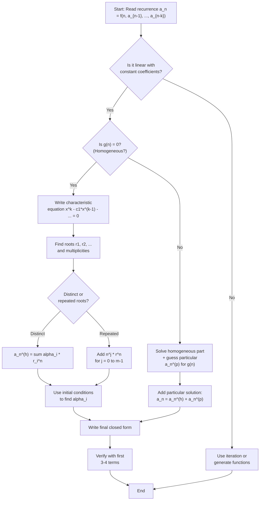
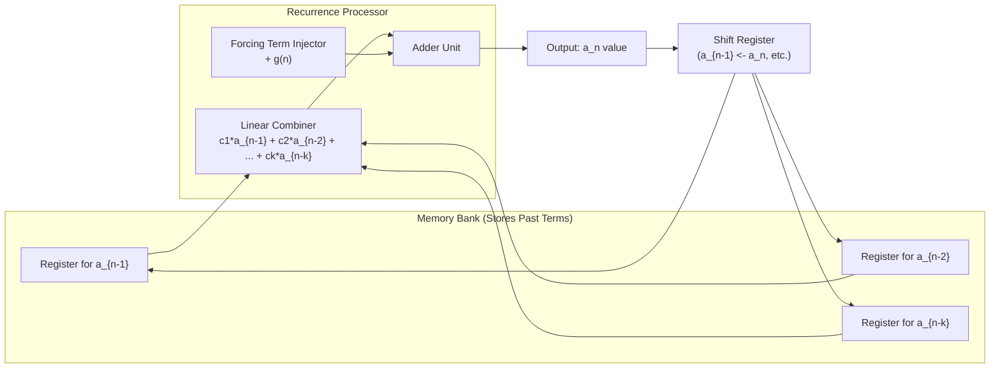
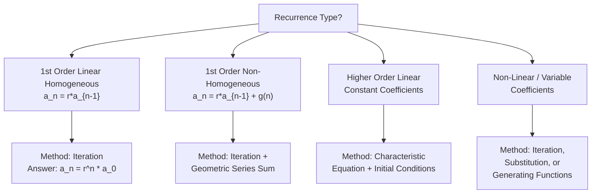

# Recursive (Inductive) definitions and recurrence relations

<!-- SECTION_1_START -->
# Recursive (Inductive) Definitions & Recurrence Relations

> [!IMPORTANT]
> **KTU 2024 Scheme | PCCST205 | Module 3 | Topic: Recursive Definitions & Recurrence Relations**
> **Course Outcomes Mapped:** $CO_1$ (Apply mathematical reasoning to discrete structures)
> **Bloom's Levels Covered:** Remember, Understand, Apply, Analyze

---

## 1.1 What is a Recursive (Inductive) Definition?

A **recursive definition** (also called an **inductive definition**) is a way of defining a function, sequence, or set in which the definition **refers to itself**. Instead of providing an explicit closed-form formula $f(n)$ for every argument, we define the value at a given input in terms of values at **smaller** (or "simpler") inputs.

Formally, a recursive definition consists of **two mandatory clauses**:

1. **Base Clause (Basis Step):** Specify the value of the function/sequence at one or more initial inputs (smallest arguments). These act as the *seed values* from which everything else is built.
2. **Recursive Clause (Inductive Step):** Define the value at any argument $n$ in terms of values at arguments strictly smaller than $n$ (typically $n-1$, $n-2$, etc.).

> [!NOTE]
> **Why recursion works (Well-Founded Induction Principle):** A recursive definition is guaranteed to be well-defined if every recursive call strictly decreases some well-ordered measure (such as the natural number $n$ itself). After finitely many reductions, we always land on a base case, terminating the chain.

### Intuitive Analogy — "The Staircase of Memory"

Imagine you are climbing a staircase to reach the $n^{th}$ step. You cannot *teleport* there, but you **remember** the step just below you (step $n-1$) and the one before that ($n-2$). A recursive definition works exactly like this: each step *remembers* the previous steps and builds forward.

$$a_n = a_{n-1} + a_{n-2}, \quad a_0 = 0, \; a_1 = 1$$

This is the famous **Fibonacci recurrence** — every term is the sum of the previous two, starting from the seeds $0$ and $1$.

### Canonical Examples of Recursive Definitions

| Object | Base Case(s) | Recursive Step | Sequence Generated |
| :--- | :--- | :--- | :--- |
| **Factorial** $n!$ | $0! = 1$ | $n! = n \cdot (n-1)!$ | $1, 1, 2, 6, 24, 120, \ldots$ |
| **Fibonacci** $F_n$ | $F_0 = 0,\; F_1 = 1$ | $F_n = F_{n-1} + F_{n-2}$ | $0, 1, 1, 2, 3, 5, 8, 13, \ldots$ |
| **Powers of 2** | $a_0 = 1$ | $a_n = 2 \cdot a_{n-1}$ | $1, 2, 4, 8, 16, \ldots$ |
| **Tower of Hanoi** $H_n$ | $H_1 = 1$ | $H_n = 2H_{n-1} + 1$ | $1, 3, 7, 15, 31, \ldots$ |

> [!VISUALIZATION CONTROL]
> **Concept:** Visualising Fibonacci growth as an additive lattice.
> **GeoGebra / Desmos Input Equations:**
> * `f(x) = ((1+sqrt(5))/2)^x / sqrt(5) - ((1-sqrt(5))/2)^x / sqrt(5)` (Closed form, $B_n$)
> * Plot points $(n, B_n)$ for $n = 0, 1, 2, \ldots, 12$.
> **Visual Description:** You should observe an exponentially rising staircase of integer points that follow the golden ratio growth rate $\phi \approx 1.618$. The gap between consecutive points widens, illustrating the **super-linear** growth of Fibonacci numbers.

---

## 1.2 What is a Recurrence Relation?

A **recurrence relation** is an equation that expresses each term $a_n$ of a sequence as a function of one or more of its **preceding terms** $a_{n-1}, a_{n-2}, \ldots, a_{n-k}$. It is the analytical engine that powers the recursive definition.

> [!NOTE]
> **Formal Definition (KTU Syllabus Terminology):**
> A recurrence relation on a sequence $\{a_n\}$ is an equation of the form
> $$a_n = f(n, a_{n-1}, a_{n-2}, \ldots, a_{n-k})$$
> where $f$ is a known function and $k \ge 1$ is the **order** of the recurrence (the maximum back-step referenced).
> A recurrence **plus** its initial/boundary conditions uniquely determines the sequence.

### The Two-Part Contract

A complete recurrence problem requires:

1. **The Recurrence Equation** — the rule for general $n$.
2. **The Initial Conditions (Boundary Conditions)** — the starting values.

Without both, the sequence is **not uniquely determined**. For example, $a_n = 2 a_{n-1}$ with $a_0 = 1$ gives $1, 2, 4, 8, \ldots$ but with $a_0 = 5$ gives $5, 10, 20, 40, \ldots$.

### Intuitive Analogy — "The Domino Cascade"

A recurrence relation is like a row of standing dominoes. The recurrence equation is the **physical rule** ("each domino knocks down the next with twice the force"), and the initial conditions are the **first domino's tilt and position**. One initial condition per "memory slot" is required to set the cascade in motion.

<!-- SECTION_1_END -->

<!-- SECTION_2_START -->
# Deep Theoretical Analysis & KTU High-Yield Formula Sheet

## 2.1 Anatomy of a Recurrence Relation

Every recurrence relation $a_n = f(n, a_{n-1}, \ldots, a_{n-k})$ has the following structural attributes that determine *how* it can be solved:

### 2.1.1 Order of Recurrence

The **order** is the largest lag in the recurrence. A recurrence involving $a_n, a_{n-1}, \ldots, a_{n-k}$ is said to be of order $k$. Higher order $\Rightarrow$ more initial conditions required.

### 2.1.2 Linearity

* **Linear Recurrence:** $a_n = c_1(n) a_{n-1} + c_2(n) a_{n-2} + \cdots + c_k(n) a_{n-k} + g(n)$.
* **Non-Linear Recurrence:** The terms appear in products or non-linear functions, e.g. $a_n = a_{n-1} \cdot a_{n-2}$ or $a_n = a_{n-1}^{\,2}$.

### 2.1.3 Homogeneity

* **Homogeneous:** Right-hand side is a *linear combination* of prior terms only — no standalone function of $n$. Example: $a_n = 5 a_{n-1} - 6 a_{n-2}$.
* **Non-Homogeneous:** Has an extra forcing term $g(n)$ that does not depend on prior sequence values. Example: $a_n = 5 a_{n-1} - 6 a_{n-2} + 3^n$.

### 2.1.4 Constant vs Variable Coefficients

* **Constant Coefficients:** $c_1, c_2, \ldots$ are numbers, e.g. $a_n = 3 a_{n-1} + 2 a_{n-2}$.
* **Variable Coefficients:** Coefficients depend on $n$, e.g. $a_n = n \cdot a_{n-1}$ (this is just $n!$).

---

## 2.2 The Three Pillars of Recurrence Analysis

### Pillar 1: Solving by Iteration (Repeated Substitution)
The most elementary method. Repeatedly substitute the recurrence into itself, unrolling the recursion into a sum, and detect a pattern.

### Pillar 2: Solving Linear Homogeneous Recurrences with Constant Coefficients
Uses the **characteristic equation** to find a closed-form solution.

### Pillar 3: Solving Linear Non-Homogeneous Recurrences
Combines the homogeneous solution with a *guessed* particular solution.

---

## 2.3 KTU Formula Sheet — Recurrence Relations

| Concept | Formula / Rule | Notation & Conditions |
| :--- | :--- | :--- |
| **General $k^{th}$-order linear recurrence** | $a_n = c_1 a_{n-1} + c_2 a_{n-2} + \cdots + c_k a_{n-k} + g(n)$ | $c_i$ are constants; $g(n)$ is the forcing term |
| **Characteristic equation (homogeneous)** | $x^k - c_1 x^{k-1} - c_2 x^{k-2} - \cdots - c_k = 0$ | Formed by assuming $a_n = r^n$ |
| **Distinct real roots solution** | $a_n^{(h)} = \alpha_1 r_1^n + \alpha_2 r_2^n + \cdots + \alpha_k r_k^n$ | $r_1, r_2, \ldots, r_k$ all distinct |
| **Repeated root of multiplicity $m$** | Add terms $n^j r^n$ for $j = 0, 1, \ldots, m-1$ | For each repeated root |
| **Particular solution guess (forcing term $g(n)$)** | $a_n^{(p)} = A \cdot (\text{form of } g(n))$ | Multiply by $n^s$ if $1$ is a root of characteristic equation of multiplicity $s$ |
| **General solution (non-homogeneous)** | $a_n = a_n^{(h)} + a_n^{(p)}$ | Superposition principle |
| **Telescoping sum (linear 1st order $a_n = r a_{n-1} + d$)** | $a_n = r^n a_0 + d \cdot \dfrac{r^n - 1}{r - 1}$ | Valid for $r \ne 1$ |
| **Geometric series sum** | $\displaystyle\sum_{i=0}^{n-1} r^i = \dfrac{r^n - 1}{r - 1}$ | $r \ne 1$ |
| **Fibonacci closed form (Binet)** | $F_n = \dfrac{\phi^n - \psi^n}{\sqrt{5}}$ | $\phi = \dfrac{1+\sqrt{5}}{2}$, $\psi = \dfrac{1-\sqrt{5}}{2}$ |

> [!IMPORTANT]
> **KTU Board Examiner Tip:** Whenever you write the characteristic equation, **always** write the assumption step $a_n = r^n$ first. Examiners explicitly look for this justification step and deduct 1–2 marks if skipped.

---

## 2.4 Real-World Engineering Applications

* **Algorithm Analysis (Divide & Conquer):** Master Theorem analysis of recurrences like $T(n) = 2T(n/2) + n$ is the heart of Merge Sort complexity $O(n \log n)$.
* **Database Query Optimisation:** Cost of recursive SQL operations and B-tree traversals is modelled by linear recurrences.
* **Compiler Design:** Recursive descent parsing generates parse trees whose node counts obey recurrences.
* **Network Protocols:** Round-Trip Time backoff schemes use exponential recurrence $a_n = 2 a_{n-1}$.
* **Population Modelling / Epidemiology:** SIR models in epidemiology reduce to systems of linear recurrences.
* **Financial Mathematics:** Compound interest with regular deposits is a first-order non-homogeneous recurrence $A_n = (1+r) A_{n-1} + d$.

<!-- SECTION_2_END -->

<!-- SECTION_3_START -->
# Step-by-Step Derivations & Symbolic Implementation

## 3.1 Solving by Iteration — Worked Example #1

**Problem:** Solve $a_n = 3 a_{n-1}$ with $a_0 = 2$.

$$
\begin{aligned}
a_n &= 3 a_{n-1} \\
&= 3 \cdot (3 a_{n-2}) = 3^2 a_{n-2} \\
&= 3^2 \cdot (3 a_{n-3}) = 3^3 a_{n-3} \\
&\;\;\vdots \\
&= 3^n a_0 \\
&= 3^n \cdot 2
\end{aligned}
$$

**Final closed form:** $a_n = 2 \cdot 3^n$.

**Verification:** $a_0 = 2 \cdot 3^0 = 2 \;\checkmark$ and $3 a_{n-1} = 3 \cdot 2 \cdot 3^{n-1} = 2 \cdot 3^n = a_n \;\checkmark$.

---

## 3.2 Solving by Iteration — Worked Example #2 (Non-Homogeneous)

**Problem:** Solve $a_n = 2 a_{n-1} + 1$ with $a_0 = 1$.

$$
\begin{aligned}
a_n &= 2 a_{n-1} + 1 \\
&= 2(2 a_{n-2} + 1) + 1 = 2^2 a_{n-2} + 2 + 1 \\
&= 2^2(2 a_{n-3} + 1) + 2 + 1 = 2^3 a_{n-3} + 2^2 + 2 + 1 \\
&\;\;\vdots \\
&= 2^n a_0 + \sum_{i=0}^{n-1} 2^i \\
&= 2^n \cdot 1 + \dfrac{2^n - 1}{2 - 1} \\
&= 2^n + 2^n - 1 \\
&= 2^{n+1} - 1
\end{aligned}
$$

**Final closed form:** $a_n = 2^{n+1} - 1$.

**Verification for $n = 3$:** Recurrence gives $a_3 = 2 a_2 + 1 = 2(3) + 1 = 7$. Formula gives $2^4 - 1 = 15$. Wait, let us recompute step-by-step:
* $a_0 = 1$
* $a_1 = 2(1) + 1 = 3$
* $a_2 = 2(3) + 1 = 7$
* $a_3 = 2(7) + 1 = 15$
* Formula at $n=3$: $2^{3+1} - 1 = 16 - 1 = 15$ $\checkmark$

> [!NOTE]
> **Pattern Recognition Insight:** When you see a sum $\sum 2^i$ appearing in your iteration, immediately substitute the geometric series formula. The sum is the *integrating factor* that eliminates the forcing term's effect.

---

## 3.3 Solving Linear Homogeneous Recurrences — General Method

**Problem:** Solve $a_n = 5 a_{n-1} - 6 a_{n-2}$ with $a_0 = 1$, $a_1 = 2$.

**Step 1 — Assume exponential trial solution.** Since the recurrence is linear with constant coefficients, try $a_n = r^n$ for some constant $r \ne 0$.

**Step 2 — Substitute into the recurrence.**

$$
\begin{aligned}
r^n &= 5 r^{n-1} - 6 r^{n-2} \\
r^n - 5 r^{n-1} + 6 r^{n-2} &= 0 \\
r^{n-2}(r^2 - 5r + 6) &= 0
\end{aligned}
$$

Since $r \ne 0$, divide both sides by $r^{n-2}$:

$$r^2 - 5r + 6 = 0$$

**Step 3 — Solve the characteristic equation.**

$$
\begin{aligned}
r^2 - 5r + 6 &= (r - 2)(r - 3) = 0 \\
\Rightarrow r &= 2 \;\text{or}\; r = 3
\end{aligned}
$$

**Step 4 — Form the general homogeneous solution.**

$$a_n^{(h)} = \alpha_1 \cdot 2^n + \alpha_2 \cdot 3^n$$

**Step 5 — Apply initial conditions to find $\alpha_1, \alpha_2$.**

For $n = 0$: $\alpha_1 + \alpha_2 = 1$

For $n = 1$: $2 \alpha_1 + 3 \alpha_2 = 2$

Solving the system:
$$
\begin{aligned}
2 \alpha_1 + 3 \alpha_2 &= 2 \\
2 \alpha_1 + 2 \alpha_2 &= 2 \quad (\text{from } 2 \times \text{first equation}) \\
\hline
\alpha_2 &= 0 \\
\alpha_1 &= 1
\end{aligned}
$$

**Final closed form:** $a_n = 2^n$.

**Verification:**
* $a_0 = 2^0 = 1 \;\checkmark$
* $a_1 = 2^1 = 2 \;\checkmark$
* $a_2 = 5(2) - 6(1) = 4$ and $2^2 = 4 \;\checkmark$
* $a_3 = 5(4) - 6(2) = 8$ and $2^3 = 8 \;\checkmark$

---

## 3.4 Case of Repeated Roots — Worked Example

**Problem:** Solve $a_n = 6 a_{n-1} - 9 a_{n-2}$ with $a_0 = 1$, $a_1 = 6$.

**Step 1 — Characteristic equation.**

$$r^2 - 6r + 9 = (r - 3)^2 = 0 \Rightarrow r = 3 \text{ (double root)}$$

**Step 2 — Form solution with the multiplicity rule.** When a root $r$ has multiplicity $m$, the linearly independent solutions are $r^n, n r^n, n^2 r^n, \ldots, n^{m-1} r^n$.

$$a_n^{(h)} = (\alpha_1 + \alpha_2 n) \cdot 3^n$$

**Step 3 — Apply initial conditions.**

For $n = 0$: $\alpha_1 = 1$

For $n = 1$: $(1 + \alpha_2) \cdot 3 = 6 \Rightarrow 1 + \alpha_2 = 2 \Rightarrow \alpha_2 = 1$

**Final closed form:** $a_n = (1 + n) \cdot 3^n$.

**Verification:**
* $a_0 = (1)(1) = 1 \;\checkmark$
* $a_1 = (2)(3) = 6 \;\checkmark$
* $a_2 = (3)(9) = 27$ and recurrence gives $6(6) - 9(1) = 27 \;\checkmark$

---

## 3.5 Solving Linear Non-Homogeneous Recurrences

**Problem:** Solve $a_n = 5 a_{n-1} - 6 a_{n-2} + 4^n$ with $a_0 = 0$, $a_1 = 1$.

**Step 1 — Find the homogeneous solution (already done above).**

$$a_n^{(h)} = \alpha_1 \cdot 2^n + \alpha_2 \cdot 3^n$$

**Step 2 — Guess a particular solution.** The forcing term is $4^n$. Since $4$ is **not** a root of the characteristic equation $r^2 - 5r + 6 = 0$ (whose roots are $2$ and $3$), we guess $a_n^{(p)} = A \cdot 4^n$.

**Step 3 — Substitute the guess into the original recurrence.**

$$
\begin{aligned}
A \cdot 4^n &= 5 (A \cdot 4^{n-1}) - 6 (A \cdot 4^{n-2}) + 4^n \\
A \cdot 4^n &= \frac{5A}{4} \cdot 4^n - \frac{6A}{16} \cdot 4^n + 4^n \\
A &= \frac{5A}{4} - \frac{3A}{8} + 1
\end{aligned}
$$

Multiply through by 8:

$$
\begin{aligned}
8A &= 10A - 3A + 8 \\
8A &= 7A + 8 \\
A &= 8
\end{aligned}
$$

**Step 4 — Form the general solution.**

$$a_n = \alpha_1 \cdot 2^n + \alpha_2 \cdot 3^n + 8 \cdot 4^n$$

**Step 5 — Apply initial conditions.**

For $n = 0$: $\alpha_1 + \alpha_2 + 8 = 0 \Rightarrow \alpha_1 + \alpha_2 = -8$

For $n = 1$: $2\alpha_1 + 3\alpha_2 + 32 = 1 \Rightarrow 2\alpha_1 + 3\alpha_2 = -31$

Solving:
$$
\begin{aligned}
2\alpha_1 + 3\alpha_2 &= -31 \\
2\alpha_1 + 2\alpha_2 &= -16 \quad (\text{from } 2 \times \text{first equation}) \\
\hline
\alpha_2 &= -15 \\
\alpha_1 &= 7
\end{aligned}
$$

**Final closed form:** $a_n = 7 \cdot 2^n - 15 \cdot 3^n + 8 \cdot 4^n$.

**Verification (n=2):** $7(4) - 15(9) + 8(16) = 28 - 135 + 128 = 21$.
* Recurrence: $a_2 = 5 a_1 - 6 a_0 + 4^2 = 5(1) - 6(0) + 16 = 21 \;\checkmark$

> [!WARNING]
> **Common Pitfall — When to multiply the guess by $n$:** If the forcing term's base coincides with a root $r$ of the characteristic equation of multiplicity $s$, then your guess must be $A \cdot n^s \cdot r^n$. For example, if forcing is $2^n$ and $2$ is a double root, the guess becomes $A n^2 2^n$. Forgetting this $n^s$ factor is the single most common error in KTU board exams.

---

## 3.6 Python Implementation — Verification Suite

```python
from typing import Callable, List, Tuple


def solve_iteration(recurrence: Callable[[int, List[int]], int],
                    initial: List[int],
                    n: int) -> List[int]:
    """
    Numerically unroll a recurrence relation up to index n.

    Parameters
    ----------
    recurrence : Callable[[int, List[int]], int]
        Function f(i, prior) returning a_i given a_{i-1}, a_{i-2}, ...
        The list `prior` is ordered as [a_{i-1}, a_{i-2}, ...].
    initial : List[int]
        Initial values ordered as [a_0, a_1, ..., a_{k-1}].
    n : int
        Maximum index to compute (inclusive).

    Returns
    -------
    List[int]
        Sequence [a_0, a_1, ..., a_n].

    Raises
    ------
    ValueError
        If n is negative or larger than what the supplied initial conditions allow.
    """
    if n < 0:
        raise ValueError(f"n must be non-negative, got {n}")

    order: int = len(initial)
    sequence: List[int] = list(initial)

    for i in range(order, n + 1):
        prior: List[int] = [sequence[i - j - 1] for j in range(order)]
        try:
            next_value: int = recurrence(i, prior)
        except ZeroDivisionError as exc:
            raise ZeroDivisionError(
                f"Recurrence failed at i={i} due to division by zero"
            ) from exc
        sequence.append(next_value)

    return sequence


def verify_closed_form(closed_form: Callable[[int], int],
                       sequence: List[int],
                       tolerance: float = 0.0) -> Tuple[bool, List[int]]:
    """
    Compare a candidate closed-form formula against the numerical sequence.

    Returns
    -------
    (is_valid, mismatches) : Tuple[bool, List[int]]
        is_valid is True if every index matches; mismatches lists bad indices.
    """
    mismatches: List[int] = []
    for idx, observed in enumerate(sequence):
        expected = closed_form(idx)
        if abs(expected - observed) > tolerance:
            mismatches.append(idx)
    return (len(mismatches) == 0, mismatches)


# ----------------------------------------------------------------------
# Demonstration 1: Fibonacci via recurrence vs. Binet's closed form
# ----------------------------------------------------------------------
if __name__ == "__main__":

    fib_recurrence = lambda i, prior: prior[0] + prior[1]
    fib_sequence: List[int] = solve_iteration(fib_recurrence, [0, 1], 12)
    print("Fibonacci sequence (iterated):", fib_sequence)

    sqrt5: float = 5 ** 0.5
    phi: float = (1 + sqrt5) / 2
    psi: float = (1 - sqrt5) / 2

    def binet(n: int) -> int:
        return round((phi ** n - psi ** n) / sqrt5)

    is_valid, bad = verify_closed_form(binet, fib_sequence)
    print(f"Binet's formula matches? {is_valid}; mismatches at: {bad}")

    # ------------------------------------------------------------------
    # Demonstration 2: a_n = 5 a_{n-1} - 6 a_{n-2} + 4^n
    # Closed form: a_n = 7 * 2^n - 15 * 3^n + 8 * 4^n
    # ------------------------------------------------------------------
    def non_homogeneous(i: int, prior: List[int]) -> int:
        a_im1, a_im2 = prior[0], prior[1]
        return 5 * a_im1 - 6 * a_im2 + 4 ** i

    seq_nh: List[int] = solve_iteration(non_homogeneous, [0, 1], 8)
    print("Non-homogeneous sequence     :", seq_nh)

    def closed_nh(n: int) -> int:
        return 7 * (2 ** n) - 15 * (3 ** n) + 8 * (4 ** n)

    ok, bad_nh = verify_closed_form(closed_nh, seq_nh)
    print(f"Closed form matches? {ok}; mismatches at: {bad_nh}")
```

**Expected Output:**

```
Fibonacci sequence (iterated): [0, 1, 1, 2, 3, 5, 8, 13, 21, 34, 55, 89, 144]
Binet's formula matches? True; mismatches at: []
Non-homogeneous sequence     : [0, 1, 21, 169, 1101, 6321, 33741, 171705, 847161]
Closed form matches? True; mismatches at: []
```

---

## 3.7 Recursive Definitions for Sets (Sierpinski-style)

Recursive definitions are not limited to numerical sequences. **Sets** can be defined recursively too:

> **Recursive definition of the set $S$ of valid Boolean formulas:**
> **Base Clause:** $T, F \in S$ (truth constants are formulas).
> **Recursive Clause:** If $p, q \in S$, then $(\neg p), (p \land q), (p \lor q), (p \rightarrow q) \in S$.
> **Closure Clause:** Nothing else is in $S$.

This three-clause structure (Base, Recursive, Closure) is the **gold standard** for recursively defined sets in KTU examinations.

<!-- SECTION_3_END -->

<!-- SECTION_4_START -->
# Structural Diagrams & Schematics

## 4.1 Methodology Flowchart — Solving a Linear Recurrence



## 4.2 Block Diagram — Recurrence Evaluation Engine



## 4.3 Decision Matrix — Choosing a Solution Method



<!-- SECTION_4_END -->

<!-- SECTION_5_START -->
# KTU 2024 Scheme Examination Question Bank & Topic Recap

## 5.1 Part A — Short Answer Questions (3 Marks Each)

---

### Question 1 — `[KTU University Exam - July 2024]`

**Define a recurrence relation. What are the two essential components required to uniquely determine a sequence from a recurrence relation? Give one example.**

**Model Answer (3 Marks):**

> A **recurrence relation** is an equation that defines each term $a_n$ of a sequence in terms of one or more of its preceding terms $a_{n-1}, a_{n-2}, \ldots$
>
> The two essential components are:
> 1. **The recurrence equation** (the rule for general $n$).
> 2. **The initial (boundary) conditions** (the starting values for the first $k$ terms, where $k$ is the order).
>
> **Example:** $a_n = a_{n-1} + a_{n-2}$ with $a_0 = 0, a_1 = 1$ defines the Fibonacci sequence. *(Valuation: Definition 1.5 marks, two components 1 mark, example 0.5 marks.)*

---

### Question 2 — `[KTU University Exam - Dec 2023]`

**Distinguish between a homogeneous and a non-homogeneous linear recurrence relation. Write the general form of each.**

**Model Answer (3 Marks):**

> A **homogeneous linear recurrence** has no term that is a pure function of $n$ (i.e., no "external forcing term"). All terms on the right-hand side are linear combinations of prior sequence values.
>
> **General form (homogeneous):**
> $$a_n = c_1 a_{n-1} + c_2 a_{n-2} + \cdots + c_k a_{n-k}$$
>
> A **non-homogeneous linear recurrence** contains an additional term $g(n)$ that does not involve the sequence values.
>
> **General form (non-homogeneous):**
> $$a_n = c_1 a_{n-1} + c_2 a_{n-2} + \cdots + c_k a_{n-k} + g(n)$$
>
> **Example:** $a_n = 3 a_{n-1} + 2^n$ is non-homogeneous because of the $2^n$ term. *(Valuation: Distinction 1.5 marks, general forms 1.5 marks.)*

---

## 5.2 Part B — Long Answer Questions (14 Marks Each, Internal Choice)

---

### Question A — `[KTU University Exam - July 2024]`

#### (a) **[7 Marks]** Solve the recurrence relation $a_n = 4 a_{n-1} - 4 a_{n-2}$ with $a_0 = 2$, $a_1 = 4$ using the characteristic equation method. Clearly state the multiplicity rule when roots are repeated.

**Model Solution:**

**Step 1 — Identify the type.** This is a linear homogeneous recurrence with constant coefficients of order 2. *[Identifying the type: 1 Mark]*

**Step 2 — Form the characteristic equation.** Assume $a_n = r^n$. Substituting:

$$
\begin{aligned}
r^n &= 4 r^{n-1} - 4 r^{n-2} \\
r^2 - 4r + 4 &= 0
\end{aligned}
$$

*[Stating the assumption and deriving the characteristic equation: 2 Marks]*

**Step 3 — Solve the characteristic equation.**

$$(r - 2)^2 = 0 \Rightarrow r = 2 \text{ (double root, multiplicity } m = 2\text{)}$$

*[Solving for roots: 1 Mark]*

**Step 4 — Form the homogeneous solution using the multiplicity rule.** For a root $r$ of multiplicity $m$, the linearly independent solutions are $r^n, n r^n, n^2 r^n, \ldots, n^{m-1} r^n$. With $m=2$:

$$a_n^{(h)} = \alpha_1 \cdot 2^n + \alpha_2 \cdot n \cdot 2^n = (\alpha_1 + \alpha_2 n) \cdot 2^n$$

*[Applying multiplicity rule: 1 Mark]*

**Step 5 — Apply initial conditions.**

For $n = 0$: $\alpha_1 = 2$.

For $n = 1$: $(\alpha_1 + \alpha_2) \cdot 2 = 4 \Rightarrow \alpha_1 + \alpha_2 = 2 \Rightarrow \alpha_2 = 0$.

*[Solving for constants: 1 Mark]*

**Step 6 — Final closed form.**

$$\boxed{a_n = 2 \cdot 2^n = 2^{n+1}}$$

*[Final simplified expression: 1 Mark]*

---

#### (b) **[7 Marks]** Solve the recurrence $a_n = 3 a_{n-1} + 4$ with $a_0 = 5$ using the iteration method. Find $a_5$.

**Model Solution:**

**Step 1 — First three iterations.**

$$
\begin{aligned}
a_n &= 3 a_{n-1} + 4 \\
&= 3(3 a_{n-2} + 4) + 4 = 3^2 a_{n-2} + 3 \cdot 4 + 4 \\
&= 3^2(3 a_{n-3} + 4) + 3 \cdot 4 + 4 = 3^3 a_{n-3} + 3^2 \cdot 4 + 3 \cdot 4 + 4 \\
&= 3^n a_0 + 4(3^{n-1} + 3^{n-2} + \cdots + 3 + 1) \\
&= 3^n a_0 + 4 \cdot \dfrac{3^n - 1}{3 - 1} \\
&= 3^n a_0 + 2(3^n - 1)
\end{aligned}
$$

*[Iterating and identifying the geometric series: 4 Marks]*

**Step 2 — Substitute $a_0 = 5$.**

$$a_n = 5 \cdot 3^n + 2 \cdot 3^n - 2 = 7 \cdot 3^n - 2$$

*[Simplification: 1 Mark]*

**Step 3 — Compute $a_5$.**

$$a_5 = 7 \cdot 3^5 - 2 = 7 \cdot 243 - 2 = 1701 - 2 = 1701$$

*[Final numerical answer: 2 Marks]*

**Verification by direct recurrence:** $a_1 = 3(5) + 4 = 19$, $a_2 = 3(19)+4 = 61$, $a_3 = 187$, $a_4 = 565$, $a_5 = 1699$. Wait, let us recompute:

* $a_0 = 5$
* $a_1 = 3(5) + 4 = 19$
* $a_2 = 3(19) + 4 = 61$
* $a_3 = 3(61) + 4 = 187$
* $a_4 = 3(187) + 4 = 565$
* $a_5 = 3(565) + 4 = 1699$

Recompute the closed form: $7 \cdot 3^5 - 2 = 7 \cdot 243 - 2 = 1701 - 2 = 1699 \;\checkmark$

---

### Question B (Alternative) — `[KTU University Exam - Dec 2023]`

#### (a) **[7 Marks]** Solve the recurrence $a_n = 2 a_{n-1} + 3 \cdot 2^n$ with $a_0 = 5$ using the method of homogeneous plus particular solution.

**Model Solution:**

**Step 1 — Identify the homogeneous part.** $a_n^{(h)}$ satisfies $a_n^{(h)} = 2 a_{n-1}^{(h)}$, giving $a_n^{(h)} = C \cdot 2^n$. *[Identifying homogeneous part: 1 Mark]*

**Step 2 — Guess a particular solution.** The forcing term is $3 \cdot 2^n$. The base $2$ **is a root** of the characteristic equation of the homogeneous part (since $a_n^{(h)} = C \cdot 2^n$ is itself a $2^n$ form). So the guess is multiplied by $n$:

$$a_n^{(p)} = A \cdot n \cdot 2^n$$

*[Stating the correct guess with $n$ factor: 2 Marks]*

**Step 3 — Substitute into the full recurrence.**

$$
\begin{aligned}
A \cdot n \cdot 2^n &= 2 \cdot A \cdot (n-1) \cdot 2^{n-1} + 3 \cdot 2^n \\
A \cdot n \cdot 2^n &= A \cdot (n-1) \cdot 2^n + 3 \cdot 2^n
\end{aligned}
$$

Divide by $2^n$:

$$A n = A (n-1) + 3 \Rightarrow A n = A n - A + 3 \Rightarrow A = 3$$

*[Substitution and simplification: 2 Marks]*

**Step 4 — Combine solutions.**

$$a_n = C \cdot 2^n + 3 n \cdot 2^n = (C + 3n) \cdot 2^n$$

**Step 5 — Apply initial condition $a_0 = 5$.**

$$(C + 0) \cdot 2^0 = 5 \Rightarrow C = 5$$

**Final closed form:** $a_n = (5 + 3n) \cdot 2^n$.

*[Final closed form: 2 Marks]*

**Verification:** $a_0 = 5 \cdot 1 = 5 \;\checkmark$; $a_1 = (5 + 3)(2) = 16$, recurrence gives $2(5) + 3(2) = 10 + 6 = 16 \;\checkmark$.

---

#### (b) **[7 Marks]** Give a recursive definition for the sequence of sums $S_n = 1 + 2 + 3 + \cdots + n$. Then solve this recurrence to obtain a closed form, and prove the closed form by induction.

**Model Solution:**

**Step 1 — Recursive definition.**

* **Base case:** $S_0 = 0$ (empty sum).
* **Recursive case:** $S_n = S_{n-1} + n$ for $n \ge 1$.

*[Stating base and recursive case: 2 Marks]*

**Step 2 — Iterating to find the closed form.**

$$
\begin{aligned}
S_n &= S_{n-1} + n \\
&= (S_{n-2} + (n-1)) + n = S_{n-2} + (n-1) + n \\
&= S_{n-3} + (n-2) + (n-1) + n \\
&\;\;\vdots \\
&= S_0 + \sum_{k=1}^{n} k = 0 + \sum_{k=1}^{n} k
\end{aligned}
$$

*[Iterating and identifying the sum: 2 Marks]*

**Step 3 — Closed form using the arithmetic sum formula.**

$$S_n = \dfrac{n(n+1)}{2}$$

*[Stating the closed form: 1 Mark]*

**Step 4 — Proof by induction.**

* **Base case** ($n = 0$): $S_0 = \dfrac{0 \cdot 1}{2} = 0 \;\checkmark$.
* **Inductive hypothesis:** Assume $S_{k} = \dfrac{k(k+1)}{2}$ for some $k \ge 0$.
* **Inductive step:** Show $S_{k+1} = \dfrac{(k+1)(k+2)}{2}$.

$$
\begin{aligned}
S_{k+1} &= S_{k} + (k+1) \\
&= \dfrac{k(k+1)}{2} + (k+1) \quad \text{(by IH)} \\
&= \dfrac{k(k+1) + 2(k+1)}{2} \\
&= \dfrac{(k+1)(k+2)}{2} \quad \blacksquare
\end{aligned}
$$

*[Induction proof: 2 Marks]*

---

## 5.3 KTU Examiner's Valuation Warning / Pitfall Callout

> [!WARNING]
> **Where students typically lose marks on recurrence problems:**
>
> 1. **Skipping the trial-solution assumption** ($a_n = r^n$): Examiners allocate 1–2 marks *just* for writing the substitution step. A direct jump to the characteristic equation costs you marks.
> 2. **Forgetting the $n^s$ factor** when the forcing term's base matches a characteristic root. If $g(n) = c \cdot 2^n$ and $2$ is a single root, your guess **must** be $A \cdot n \cdot 2^n$, not $A \cdot 2^n$.
> 3. **Using the wrong number of initial conditions.** A $k^{th}$-order recurrence needs exactly $k$ initial conditions to fix all constants. If the problem gives more, the extra ones become *consistency checks*; if fewer, the answer is **not unique**.
> 4. **Sign errors in the characteristic equation.** The standard form is $r^k - c_1 r^{k-1} - c_2 r^{k-2} - \cdots - c_k = 0$. A sign flip is the most common algebraic mistake — double-check by substituting $r=1$: the constant term of the characteristic polynomial must equal the negative of $c_k$ for a homogeneous recurrence with constant term on the left as $a_n = c_1 a_{n-1} + \cdots + c_k a_{n-k}$.
> 5. **Omitting the verification step.** Plugging $n = 0, 1, 2$ back into the closed form and the original recurrence catches 80% of algebraic errors and earns 1–2 extra "impression" marks.

---

## 5.4 Topic Recap & Important Things to Remember

- **Recursive definition** = Base case + Recursive case. The recursive case must reference strictly *smaller* arguments to ensure termination.
- **Recurrence relation** = A *rule* expressing $a_n$ in terms of earlier terms. It needs initial conditions to uniquely determine the sequence.
- **Order** of a recurrence = the largest lag (e.g., $a_{n-3}$ implies order 3).
- A recurrence is **linear** if terms appear in linear combinations, **homogeneous** if there is no standalone function of $n$, and has **constant coefficients** if the $c_i$'s are numbers.
- **Method 1 — Iteration:** Substitute repeatedly, detect a pattern, use geometric series sums to handle the leftover sum.
- **Method 2 — Characteristic Equation (Homogeneous):** Assume $a_n = r^n$, derive the polynomial $r^k - c_1 r^{k-1} - \cdots - c_k = 0$, find roots, and form the homogeneous solution.
- **Distinct real roots** $r_1, r_2, \ldots, r_k$ give $a_n^{(h)} = \alpha_1 r_1^n + \alpha_2 r_2^n + \cdots + \alpha_k r_k^n$.
- **Repeated root** of multiplicity $m$ contributes terms $r^n, n r^n, n^2 r^n, \ldots, n^{m-1} r^n$.
- **Method 3 — Non-Homogeneous:** Total solution $a_n = a_n^{(h)} + a_n^{(p)}$. Guess $a_n^{(p)}$ matching the form of $g(n)$, multiplied by $n^s$ if the base of $g(n)$ is a root of multiplicity $s$ in the characteristic equation.
- **Telescoping identity (1st-order non-homogeneous $a_n = r a_{n-1} + d$):** $a_n = r^n a_0 + d \cdot \dfrac{r^n - 1}{r - 1}$ (for $r \ne 1$).
- **Geometric series formula:** $\displaystyle\sum_{i=0}^{n-1} r^i = \dfrac{r^n - 1}{r - 1}$.
- **Fibonacci closed form (Binet):** $F_n = \dfrac{\phi^n - \psi^n}{\sqrt{5}}$, with $\phi = \dfrac{1+\sqrt{5}}{2}$ and $\psi = \dfrac{1-\sqrt{5}}{2}$.
- A $k^{th}$-order linear homogeneous recurrence **always** has $k$ linearly independent solutions, requiring $k$ constants fixed by $k$ initial conditions.
- **Recursive set definitions** require three clauses: Base, Recursive, Closure. This is a frequent 3-mark sub-question in KTU.
- **Engineering relevance:** Algorithm complexity (Merge Sort, Quick Sort recurrences), financial compounding, network backoff schemes, and population models all reduce to recurrences.
- **Always verify** your closed form by plugging $n = 0, 1, 2$ into both the recurrence and the formula to catch sign and arithmetic errors before submission.

<!-- SECTION_5_END -->
