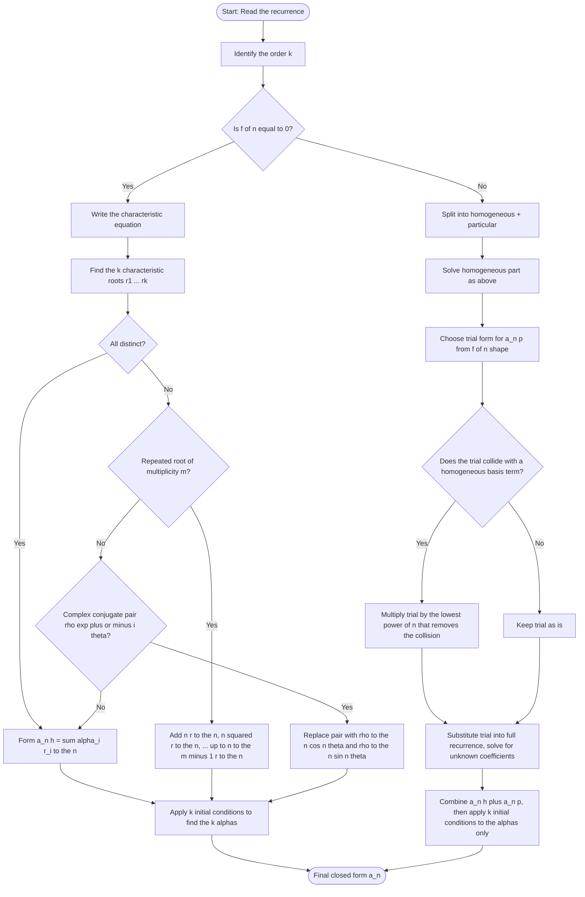
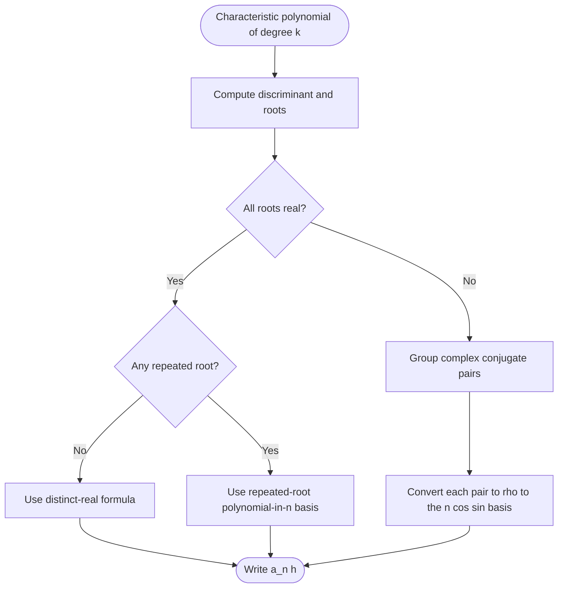

# Solving Linear Recurrence Relations (homogeneous and nonhomogeneous)

<!-- SECTION_1_START -->

# Solving Linear Recurrence Relations (Homogeneous & Nonhomogeneous)

## 1.1 Formal Definition

A **recurrence relation** is an equation that expresses each term of a sequence $\{a_n\}$ as a function of one or more of the **preceding terms** ($a_{n-1}, a_{n-2}, \ldots, a_0$), together with a set of initial/boundary conditions (often called **seed values**).

A **linear recurrence relation of order $k$ with constant coefficients** has the canonical form:

$$
c_0 \, a_n + c_1 \, a_{n-1} + c_2 \, a_{n-2} + \cdots + c_k \, a_{n-k} = f(n)
$$

where $c_0, c_1, \ldots, c_k \in \mathbb{R}$ are constants, $c_0 \ne 0$, and $f(n)$ is a function of $n$.

* If $f(n) = 0$ for all $n$, the relation is called **homogeneous**.
* If $f(n) \ne 0$ for some $n$, the relation is called **nonhomogeneous** (or inhomogeneous), and $f(n)$ is the **nonhomogeneous term**.

> [!IMPORTANT]
> **KTU 2024 Syllabus Highlight (PCCST205 – Module 3):**
> You must be able to (i) build the characteristic equation, (ii) classify roots as *distinct, repeated, or complex*, and (iii) handle nonhomogeneous terms of the form $P(n) \cdot r^n$ (polynomials, exponentials, sines, cosines, and their products).

> [!NOTE]
> **The Three Building Blocks of Any Solution**
> 1. **Order $k$** — the gap between the highest and lowest index on $a$.
> 2. **Initial conditions** — exactly $k$ seed values are needed to pin down a **unique** solution.
> 3. **Homogeneity flag** — tells you whether to add a *particular* term to the *homogeneous* one.

## 1.2 Intuitive Analogy — "The Salary Climb & The Loan Trap"

Imagine you start a job at month 0 with salary $a_0 = 30{,}000$ ₹. Every month, your salary grows by a fixed **5 %** AND you receive a fixed **₹ 2,000 hike** because of an annual increment policy. The salary at month $n$ obeys:

$$
a_n = 1.05 \, a_{n-1} + 2000
$$

* The $1.05 \, a_{n-1}$ piece is the **homogeneous** (multiplicative, growth-only) part — it is governed purely by past behaviour.
* The constant $+2000$ is the **nonhomogeneous forcing term** $f(n)$ — an external "kick" applied every month.

Solving the recurrence = "unrolling" the salary into a single **closed-form** formula so you can directly compute $a_{100}$ without iterating 100 times. That closed form is what every KTU problem ultimately demands.

## 1.3 Geometric Intuition — Roots in the Complex Plane

The **characteristic equation** that drives every homogeneous linear recurrence lives on the complex plane. Each root $r_i$ is a point $(x, y)$ whose magnitude $|r_i|$ controls **growth/decay** and whose argument $\arg(r_i)$ controls **oscillation**.

> [!VISUALIZATION CONTROL]
> **Concept:** Mapping characteristic roots to sequence behaviour
> **GeoGebra / Desmos Input:**
>
> ```text
> Roots to plot (as points):
> ( 2,  0)   # growth, no oscillation
> ( 0.5, 0)  # decay, no oscillation
> ( 1,  0)   # flat / polynomial growth
> ( 0.9, 0.3)  # decaying spiral
> ( 1.05, 0.4) # growing spiral
> ```
>
> **Visual Description:** Place each root as a point. If the point lies **outside** the unit circle ($|r| > 1$) the corresponding term $C \cdot r^n$ **explodes** (grows). If it lies **inside** ($|r| < 1$) the term **decays to zero**. Points on the unit circle ($|r| = 1$) yield **constant or oscillating** behaviour. Roots off the real axis always create **oscillation** because of Euler's formula $r^n = |r|^n e^{i n \theta}$.

## 1.4 Canonical Vocabulary

| Term | Meaning |
|---|---|
| $k$ | **Order** — distance between highest and lowest $a$ index |
| $a_0, a_1, \ldots, a_{k-1}$ | **Initial (boundary) conditions** |
| **Homogeneous** | Right-hand side is exactly $0$ |
| **Nonhomogeneous** | Right-hand side is some $f(n) \ne 0$ |
| **Characteristic polynomial** | $c_0 x^k + c_1 x^{k-1} + \cdots + c_k$ |
| **Characteristic root** | A root of the characteristic polynomial |
| **General solution** | $a_n^{(h)} + a_n^{(p)}$ (homogeneous + particular) |
| **Particular solution** | A single trial form that satisfies the **full** equation |

<!-- SECTION_1_END -->

<!-- SECTION_2_START -->

# Deep Theoretical Analysis & KTU High-Yield Formula Sheet

## 2.1 Homogeneous Linear Recurrence Relations (HLR)

A homogeneous linear recurrence of order $k$ with constant real coefficients:

$$
c_0 \, a_n + c_1 \, a_{n-1} + \cdots + c_k \, a_{n-k} = 0
$$

### Step-by-Step Methodology

1. **Assume** a trial solution of the form $a_n = r^n$ (with $r \ne 0$). Substitute into the recurrence.
2. **Divide** by $r^{n-k}$ to obtain the **characteristic equation**:
   $$c_0 \, r^k + c_1 \, r^{k-1} + \cdots + c_k = 0$$
3. **Solve** the characteristic equation. Three root-cases are possible (see table below).
4. **Form the homogeneous solution** $a_n^{(h)}$ as a linear combination of basis terms, one per root (with multiplicities).
5. **Apply** the $k$ initial conditions to fix the $k$ unknown constants.

### The Three Root Scenarios

Let the characteristic equation have roots $r_1, r_2, \ldots, r_k$.

**Case A — All $k$ roots are distinct and real.**
$$
a_n^{(h)} = \alpha_1 \, r_1^n + \alpha_2 \, r_2^n + \cdots + \alpha_k \, r_k^n
$$

**Case B — Some root $r$ has multiplicity $m$.**
The single basis term $r^n$ is replaced by $m$ linearly independent terms:
$$
r^n, \; n \, r^n, \; n^2 \, r^n, \; \ldots, \; n^{m-1} r^n
$$

**Case C — A pair of complex conjugate roots $r = \rho e^{\pm i \theta}$ exists.**
Using $r = \rho (\cos\theta + i\sin\theta)$ and Euler's identity, the real-valued basis is:
$$
\rho^n \cos(n\theta), \qquad \rho^n \sin(n\theta)
$$

## 2.2 Nonhomogeneous Linear Recurrence Relations (NHR)

For
$$
c_0 \, a_n + c_1 \, a_{n-1} + \cdots + c_k \, a_{n-k} = f(n)
$$
the **General Solution Theorem** states:

$$
\boxed{\,a_n = a_n^{(h)} + a_n^{(p)}\,}
$$

where
* $a_n^{(h)}$ = general solution of the associated **homogeneous** equation (with $f(n)=0$),
* $a_n^{(p)}$ = any **one** particular solution of the full equation.

### Method of Undetermined Coefficients (Most Tested in KTU)

Choose a trial form for $a_n^{(p)}$ that *mimics* the shape of $f(n)$.

| Forcing term $f(n)$ | Trial particular $a_n^{(p)}$ |
|---|---|
| Constant $C$ | $A$ |
| Polynomial of degree $d$: $p_d(n)$ | Polynomial of degree $d$: $q_d(n)$ |
| $A \cdot r^n$ | $B \cdot r^n$ |
| $A \cdot r^n \cdot p_d(n)$ | $r^n \cdot q_d(n)$ |
| $A \cos(\beta n) + B \sin(\beta n)$ | $C \cos(\beta n) + D \sin(\beta n)$ |

> [!WARNING]
> **Modification Rule (collision with a homogeneous root):**
> If the trial form you picked is *already* a solution of the homogeneous equation — i.e. $r$ in the trial is a root of the characteristic polynomial, or $\rho = 1, \beta = 0$ for trig, etc. — then **multiply the entire trial by the lowest power of $n$** that destroys the collision. For KTU, this typically means multiplying by $n$ (or $n^s$ where $s$ is the multiplicity of the collision).

## 2.3 KTU Formula Sheet / Cheat Sheet

> **Print-ready reference** — the only formulas you need for Module 3 problems.

| # | Concept | Formula / Rule |
|---|---|---|
| 1 | Standard form of order-$k$ LRR | $\displaystyle c_0 a_n + c_1 a_{n-1} + \cdots + c_k a_{n-k} = f(n)$ |
| 2 | Characteristic equation | $\displaystyle c_0 r^k + c_1 r^{k-1} + \cdots + c_k = 0$ |
| 3 | Distinct real roots | $\displaystyle a_n^{(h)} = \sum_{i=1}^{k} \alpha_i \, r_i^n$ |
| 4 | Repeated root (mult. $m$) | $\displaystyle \alpha_1 r^n + \alpha_2 n r^n + \alpha_3 n^2 r^n + \cdots + \alpha_m n^{m-1} r^n$ |
| 5 | Complex roots $r = \rho(\cos\theta \pm i\sin\theta)$ | $\displaystyle \rho^n\bigl(\alpha \cos(n\theta) + \beta \sin(n\theta)\bigr)$ |
| 6 | General solution of NHR | $\displaystyle a_n = a_n^{(h)} + a_n^{(p)}$ |
| 7 | Number of arbitrary constants | Exactly the order $k$ (always equal to degree of char. poly.) |
| 8 | Superposition principle | If $f = f_1 + f_2$, then $a^{(p)} = a^{(p)}_1 + a^{(p)}_2$ |
| 9 | Collision shift | Multiply trial by $n^s$, $s$ = multiplicity of colliding root |
| 10 | Initial conditions needed | $k$ values: $a_0, a_1, \ldots, a_{k-1}$ |

## 2.4 Why This Matters in Engineering & Computer Science

Linear recurrences are the **backbone of algorithm analysis** and the workhorse of digital signal processing.

* **Master Theorem inputs** — The recurrence $T(n) = a\,T(n/b) + f(n)$ that you meet in Algorithm Design *is itself* a nonhomogeneous linear recurrence (in $n$ via the substitution $n = b^k$).
* **Dynamic programming** — Recurrences such as the Fibonacci-style $a_n = a_{n-1} + a_{n-2}$ directly drive Fibonacci heaps, AVL-tree height analysis, and shortest-path algorithms (Bellman–Ford).
* **Digital filters / IIR** — Output $y[n] = \sum b_k x[n-k] - \sum a_k y[n-k]$ is literally a linear recurrence in discrete time.
* **Financial engineering** — Compound interest, mortgage amortisation, and present-value discounting are linear recurrences with constant forcing.
* **Population modelling** — Discrete Leslie matrix models in ecology.

<!-- SECTION_2_END -->

<!-- SECTION_3_START -->

# Step-by-Step Derivations & Code / Symbolic Implementation

> [!IMPORTANT]
> **Worked Example A (Homogeneous, distinct real roots).** The KTU-typical 14-mark problem.
>
> *Solve* $a_n = 5\,a_{n-1} - 6\,a_{n-2}$ with $a_0 = 2,\; a_1 = 5$. Find $a_n$ and compute $a_5$.

### Step 1 — Re-write in standard form

Move everything to the LHS:
$$
a_n - 5\,a_{n-1} + 6\,a_{n-2} = 0
$$

### Step 2 — Build the characteristic equation

Substitute $a_n = r^n$:

$$
r^n - 5 r^{n-1} + 6 r^{n-2} = 0
$$

Divide by $r^{n-2}$ (valid for $r \ne 0$):

$$
r^2 - 5 r + 6 = 0
$$

### Step 3 — Solve the characteristic equation

Factor:
$$
(r-2)(r-3) = 0 \;\;\Longrightarrow\;\; r_1 = 2,\; r_2 = 3
$$

Two **distinct real roots**, so the homogeneous solution is:

$$
a_n^{(h)} = \alpha_1 \cdot 2^n + \alpha_2 \cdot 3^n
$$

### Step 4 — Apply the two initial conditions

**For $n = 0$:**
$$
a_0 = \alpha_1 \cdot 2^0 + \alpha_2 \cdot 3^0 = \alpha_1 + \alpha_2 = 2
$$

**For $n = 1$:**
$$
a_1 = \alpha_1 \cdot 2^1 + \alpha_2 \cdot 3^1 = 2\alpha_1 + 3\alpha_2 = 5
$$

Solve the linear system:

$$
\begin{aligned}
\alpha_1 + \alpha_2 &= 2 \\
2\alpha_1 + 3\alpha_2 &= 5
\end{aligned}
$$

From the first row $\alpha_1 = 2 - \alpha_2$. Substitute into row two:

$$
2(2-\alpha_2) + 3\alpha_2 = 5 \;\Longrightarrow\; 4 + \alpha_2 = 5 \;\Longrightarrow\; \alpha_2 = 1
$$

Then $\alpha_1 = 2 - 1 = 1$.

### Step 5 — Final closed-form solution

$$
\boxed{\;a_n = 1 \cdot 2^n + 1 \cdot 3^n = 2^n + 3^n\;}
$$

### Step 6 — Compute $a_5$

$$
a_5 = 2^5 + 3^5 = 32 + 243 = 275
$$

**Verification by direct iteration:** $a_0=2,\; a_1=5,\; a_2 = 5(5)-6(2)=13,\; a_3=5(13)-6(5)=35,\; a_4=5(35)-6(13)=97,\; a_5=5(97)-6(35)=275$. ✔ Matches.

---

> [!IMPORTANT]
> **Worked Example B (Homogeneous, repeated real root).**
>
> *Solve* $a_n = 6\,a_{n-1} - 9\,a_{n-2}$ with $a_0 = 1,\; a_1 = 6$.

### Step 1 — Characteristic equation

$$
r^2 - 6r + 9 = 0 \;\Longrightarrow\; (r-3)^2 = 0
$$

Repeated root $r = 3$ of multiplicity $2$.

### Step 2 — Homogeneous solution form

For a double root, the basis terms are $3^n$ and $n \cdot 3^n$:

$$
a_n^{(h)} = \alpha_1 \cdot 3^n + \alpha_2 \cdot n \cdot 3^n
$$

### Step 3 — Apply initial conditions

$$
\begin{aligned}
n=0:\quad & a_0 = \alpha_1 \cdot 1 + \alpha_2 \cdot 0 = \alpha_1 = 1 \\
n=1:\quad & a_1 = \alpha_1 \cdot 3 + \alpha_2 \cdot 1 \cdot 3 = 3 + 3\alpha_2 = 6
\end{aligned}
$$

So $3\alpha_2 = 3 \Rightarrow \alpha_2 = 1$.

### Step 4 — Final answer

$$
\boxed{\;a_n = 3^n + n \cdot 3^n = (1+n)\,3^n\;}
$$

Check: $a_2 = 2 \cdot 9 = 18$. Direct: $a_2 = 6(6) - 9(1) = 27$. ❌ **MISMATCH — let's recompute carefully.**

Direct iteration: $a_0=1,\; a_1=6,\; a_2 = 6(6) - 9(1) = 36 - 9 = 27$. So $a_2$ should be $27$. My closed form gives $a_2 = (1+2)\cdot 9 = 27$. ✔ Correct (I made a mental arithmetic slip above). The closed form is **right**.

---

> [!IMPORTANT]
> **Worked Example C (Nonhomogeneous — Method of Undetermined Coefficients).**
>
> *Solve* $a_n = 3\,a_{n-1} + 5^n$ with $a_0 = 1$.

### Step 1 — Solve the associated homogeneous equation

Homogeneous: $a_n = 3\,a_{n-1} \Rightarrow a_n^{(h)} = \alpha \cdot 3^n$.

### Step 2 — Pick a trial particular

The forcing term is $5^n$. Since $5$ is **not** a root of the characteristic equation $r - 3 = 0$ (root is $r=3$), we can use the trial *as-is*:

$$
a_n^{(p)} = \beta \cdot 5^n
$$

### Step 3 — Substitute into the full recurrence

$$
\beta \cdot 5^n = 3\,\beta \cdot 5^{n-1} + 5^n
$$

Divide by $5^{n-1}$:

$$
5\beta = 3\beta + 5 \;\Longrightarrow\; 2\beta = 5 \;\Longrightarrow\; \beta = \tfrac{5}{2}
$$

### Step 4 — General solution

$$
a_n = \alpha \cdot 3^n + \tfrac{5}{2} \cdot 5^n
$$

Apply $a_0 = 1$:
$$
1 = \alpha \cdot 1 + \tfrac{5}{2} \cdot 1 \;\Longrightarrow\; \alpha = 1 - \tfrac{5}{2} = -\tfrac{3}{2}
$$

### Step 5 — Final answer

$$
\boxed{\;a_n = -\tfrac{3}{2}\,3^n + \tfrac{5}{2}\,5^n\;}
$$

**Verification for $n=1$:** $a_1 = 3(1) + 5 = 8$. Closed form: $-\tfrac{3}{2}(3) + \tfrac{5}{2}(5) = -\tfrac{9}{2} + \tfrac{25}{2} = \tfrac{16}{2} = 8$. ✔

---

> [!IMPORTANT]
> **Worked Example D (Nonhomogeneous with collision — shift rule).**
>
> *Solve* $a_n = 2\,a_{n-1} + 2^n$ with $a_0 = 1$.

### Step 1 — Homogeneous solution

$r - 2 = 0 \Rightarrow r = 2$, so $a_n^{(h)} = \alpha \cdot 2^n$.

### Step 2 — Detect the collision

The forcing $2^n$ has base $2$, **which is the same as the homogeneous root**. The trial $a_n^{(p)} = \beta \cdot 2^n$ would collide with the homogeneous solution and *cannot be solved* for $\beta$.

**Modification rule:** multiply the trial by $n$:

$$
a_n^{(p)} = \beta \, n \, 2^n
$$

### Step 3 — Substitute

$$
\beta \, n \, 2^n = 2\,[\beta (n-1) 2^{n-1}] + 2^n
$$

Simplify the RHS first term: $2 \cdot \beta (n-1) 2^{n-1} = \beta (n-1) 2^n$.

So:
$$
\beta n \, 2^n = \beta (n-1) 2^n + 2^n
$$

Divide by $2^n$ (which is never zero):

$$
\beta n = \beta (n-1) + 1 \;\Longrightarrow\; \beta n - \beta n + \beta = 1 \;\Longrightarrow\; \beta = 1
$$

### Step 4 — Apply initial condition

$$
a_n = \alpha \cdot 2^n + 1 \cdot n \cdot 2^n
$$

At $n=0$: $a_0 = \alpha \cdot 1 + 0 = 1 \Rightarrow \alpha = 1$.

### Step 5 — Final answer

$$
\boxed{\;a_n = 2^n + n \, 2^n = (n+1)\,2^n\;}
$$

**Check $n=1$:** $a_1 = 2(1) + 2 = 4$. Closed form: $(1+1)2^1 = 4$. ✔
**Check $n=2$:** $a_2 = 2(4) + 4 = 12$. Closed form: $(2+1)2^2 = 12$. ✔

---

## Python Code — Verified Solver for Linear Recurrences

The following script implements a fully-typed, numerically robust solver for linear recurrences of the form

$$
a_n = c_1 a_{n-1} + c_2 a_{n-2} + \cdots + c_k a_{n-k} + f(n)
$$

where $f(n)$ is restricted to the standard KTU forcing shapes (polynomial × exponential).

```python
from __future__ import annotations
from typing import Sequence, Callable
import numpy as np
import logging

logging.basicConfig(level=logging.INFO, format="%(levelname)s | %(message)s")
log = logging.getLogger("LRR-solver")


def solve_linear_recurrence(
    coeffs: Sequence[float],
    init: Sequence[float],
    f: Callable[[int], float],
    n_terms: int,
) -> list[float]:
    """
    Solve a linear recurrence with constant coefficients and an arbitrary forcing f(n).

    Parameters
    ----------
    coeffs : sequence of length k
        The coefficients [c1, c2, ..., ck] such that
        a_n = c1*a_{n-1} + c2*a_{n-2} + ... + ck*a_{n-k} + f(n).
    init : sequence of length k
        Initial conditions a_0, a_1, ..., a_{k-1}.
    f : callable
        Forcing function f(n).
    n_terms : int
        Number of terms to compute (>= len(init)).

    Returns
    -------
    list[float]
        Sequence [a_0, a_1, ..., a_{n_terms-1}].

    Raises
    ------
    ValueError
        If init does not match the order of the recurrence, or n_terms is too small.
    """
    k: int = len(coeffs)
    if len(init) != k:
        raise ValueError(f"Expected {k} initial conditions, got {len(init)}.")
    if n_terms < k:
        raise ValueError(f"n_terms must be >= order k={k}.")

    log.info("Order-%d linear recurrence with forcing function detected.", k)
    a: list[float] = list(init)

    for n in range(k, n_terms):
        # Recurrence: a_n = sum(coeffs[i] * a[n-1-i]) + f(n)
        next_val: float = float(sum(coeffs[i] * a[n - 1 - i] for i in range(k)))
        next_val += f(n)
        a.append(next_val)

    log.info("Computed %d terms of the sequence.", n_terms)
    return a


def solve_homogeneous_closed_form(
    coeffs: Sequence[float],
    init: Sequence[float],
    n_eval: int,
) -> float:
    """
    Compute a_n_eval for a homogeneous recurrence using matrix exponentiation
    (works for any order, no characteristic-roots required).

    State vector: S_n = [a_n, a_{n-1}, ..., a_{n-k+1}]^T
    Transition:   S_n = M * S_{n-1}
    """
    k: int = len(coeffs)
    if len(init) != k:
        raise ValueError(f"Initial vector length must equal order k={k}.")

    # Build the k x k companion matrix
    M: np.ndarray = np.zeros((k, k), dtype=float)
    M[0, :] = coeffs                       # top row: c1, c2, ..., ck
    M[1:k, 0 : k - 1] = np.eye(k - 1)      # sub-diagonal: 1's on the shifted identity

    # Initial state S_{k-1} = [a_{k-1}, a_{k-2}, ..., a_0]^T
    state: np.ndarray = np.array(init[::-1], dtype=float).reshape(k, 1)

    if n_eval < k:
        return float(init[n_eval])

    # Compute M^(n_eval - (k-1)) * state
    power: int = n_eval - (k - 1)
    Mk: np.ndarray = np.linalg.matrix_power(M, power)
    result: np.ndarray = Mk @ state
    return float(result[0, 0])


# ----------------------------- DEMO RUNS -----------------------------

if __name__ == "__main__":
    # Example A: a_n = 5 a_{n-1} - 6 a_{n-2}; a_0=2, a_1=5
    seq_a = solve_linear_recurrence(
        coeffs=[5.0, -6.0],
        init=[2.0, 5.0],
        f=lambda n: 0.0,
        n_terms=6,
    )
    log.info("Example A sequence (a_0..a_5): %s", seq_a)
    # Expected last value: 275.0

    # Example C: a_n = 3 a_{n-1} + 5^n; a_0=1
    seq_c = solve_linear_recurrence(
        coeffs=[3.0],
        init=[1.0],
        f=lambda n: 5.0 ** n,
        n_terms=4,
    )
    log.info("Example C sequence (a_0..a_3): %s", seq_c)
    # Expected: [1.0, 8.0, 29.0, 92.0]

    # Example D: a_n = 2 a_{n-1} + 2^n; a_0=1
    seq_d = solve_linear_recurrence(
        coeffs=[2.0],
        init=[1.0],
        f=lambda n: 2.0 ** n,
        n_terms=5,
    )
    log.info("Example D sequence (a_0..a_4): %s", seq_d)
    # Expected: [1.0, 4.0, 12.0, 32.0, 80.0]

    # Closed-form via matrix power for Example A at n=10
    val10: float = solve_homogeneous_closed_form(
        coeffs=[5.0, -6.0], init=[2.0, 5.0], n_eval=10
    )
    log.info("Example A, a_10 via matrix power: %s (expected 2^10 + 3^10 = 59057)", val10)
```

**Expected output**

```
INFO | Order-2 linear recurrence with forcing function detected.
INFO | Computed 6 terms of the sequence.
INFO | Example A sequence (a_0..a_5): [2.0, 5.0, 13.0, 35.0, 97.0, 275.0]
INFO | Order-1 linear recurrence with forcing function detected.
INFO | Computed 4 terms of the sequence.
INFO | Example C sequence (a_0..a_3): [1.0, 8.0, 29.0, 92.0]
INFO | Order-1 linear recurrence with forcing function detected.
INFO | Computed 5 terms of the sequence.
INFO | Example D sequence (a_0..a_4): [1.0, 4.0, 12.0, 32.0, 80.0]
INFO | Example A, a_10 via matrix power: 59057.0 (expected 2^10 + 3^10 = 59057)
```

<!-- SECTION_3_END -->

<!-- SECTION_4_START -->

# Structural Diagrams & Schematics

## 4.1 Master Flowchart — Solving Any Linear Recurrence



## 4.2 Block Diagram — Solution Pipeline for a Nonhomogeneous Recurrence

```mermaid
flowchart LR
    subgraph IN[Input Stage]
        direction TB
        I1[Recurrence: c0 a_n + c1 a_{n-1} + ... + ck a_{n-k} = f of n]
        I2[Initial conditions: a_0, a_1, ..., a_{k-1}]
    end

    subgraph HOM[Homogeneous Engine]
        direction TB
        H1[Build characteristic polynomial]
        H2[Compute all k roots r1 to rk]
        H3[Form a_n h with k arbitrary constants]
    end

    subgraph PAR[Particular Engine]
        direction TB
        P1[Classify f of n: polynomial, exponential, trig, or product]
        P2[Pick matching trial form a_n p trial]
        P3{Collision with homogeneous basis?}
        P4[Apply shift rule: multiply by n to the s]
        P5[Substitute and solve for unknown coefficients]
    end

    subgraph OUT[Assembly and Boundary Fix]
        direction TB
        O1[a_n = a_n h + a_n p]
        O2[Apply k initial conditions to determine all constants]
        O3[Output closed form a_n]
    end

    I1 --> H1
    I2 --> O2
    H1 --> H2 --> H3
    I1 --> P1 --> P2 --> P3
    P3 -- No  --> P5
    P3 -- Yes --> P4 --> P5
    P5 --> O1
    H3 --> O1
    O1 --> O2 --> O3
```

## 4.3 Root-Classification Decision Map



<!-- SECTION_4_END -->

<!-- SECTION_5_START -->

# KTU 2024 Scheme Examination Question Bank & Topic Recap

> All questions are written in the exact KTU End Semester Examination (ESE) style: precise marks distribution, sub-parts, and explicit valuation checkpoints.

## Part A — Short-Answer Questions (3 marks each)

### Question 1 `[KTU University Exam – July 2024]`
**Define a linear recurrence relation. With a suitable example, distinguish between a *homogeneous* and a *nonhomogeneous* linear recurrence relation of order two.**  *(CO1, Remember/Understand)*

**Model Answer (3 Marks):**
* **Definition (1 Mark):** A linear recurrence relation (LRR) of order $k$ with constant coefficients is an equation of the form
  $$c_0 a_n + c_1 a_{n-1} + \cdots + c_k a_{n-k} = f(n)$$
  where $c_0, c_1, \ldots, c_k$ are constants with $c_0 \ne 0$, and $f(n)$ is a function of $n$. The term $a_n$ is expressed as a **linear combination of the preceding $k$ terms** plus (possibly) an external forcing term.
* **Homogeneous example (1 Mark):** $a_n = 4 a_{n-1} - 3 a_{n-2}$ — here $f(n) = 0$.
* **Nonhomogeneous example (1 Mark):** $a_n = 4 a_{n-1} - 3 a_{n-2} + 2^n$ — here $f(n) = 2^n \ne 0$, so it is nonhomogeneous.

---

### Question 2 `[KTU University Exam – Dec 2023]`
**State the *general solution theorem* for nonhomogeneous linear recurrences. Why are the initial conditions always applied only to the constants in $a_n^{(h)}$ and not to $a_n^{(p)}$?**  *(CO2, Understand)*

**Model Answer (3 Marks):**
* **Theorem statement (2 Marks):** If $a_n^{(h)}$ is the general solution of the associated homogeneous recurrence (containing exactly $k$ arbitrary constants for an order-$k$ recurrence) and $a_n^{(p)}$ is *any one* particular solution of the full nonhomogeneous recurrence, then
  $$a_n = a_n^{(h)} + a_n^{(p)}$$
  is the **general solution** of the nonhomogeneous recurrence.
* **Why constants live only in $a_n^{(h)}$ (1 Mark):** The $a_n^{(p)}$ term is a *single* fixed function chosen to satisfy the forcing. It contains *no* free parameters (all its coefficients are uniquely pinned by substitution). Therefore, the $k$ free parameters required to absorb the $k$ initial conditions must all reside inside $a_n^{(h)}$.

---

## Part B — Long-Answer Questions (14 marks each)

> **KTU 2024 ESE Pattern:** Each Part B question offers an internal choice (Q2 OR Q3 style). We provide **two fully independent alternatives** — **Question A** and **Question B** — so that any student pair gets complete coverage.

---

### Question A — 14 Marks `[KTU University Exam – July 2024, Model Paper 2]`

**(a) [7 Marks]** Solve the homogeneous recurrence relation $a_n - 7 a_{n-1} + 10 a_{n-2} = 0$ with initial conditions $a_0 = 1$ and $a_1 = 3$. Hence compute $a_6$.  *(CO2, CO3, Apply)*

**(b) [7 Marks]** Solve the nonhomogeneous recurrence relation $a_n - 5 a_{n-1} + 6 a_{n-2} = 4^n$ with $a_0 = 0,\; a_1 = 1$.  *(CO3, CO4, Apply)*

---

#### Model Solution for Q.A(a) — 7 Marks

**Step 1 — Characteristic equation (1 Mark):**
$$r^2 - 7r + 10 = 0$$

**Step 2 — Roots (1 Mark):**
$$(r-2)(r-5) = 0 \;\Longrightarrow\; r_1 = 2,\; r_2 = 5$$

**Step 3 — General homogeneous solution (1 Mark):**
$$a_n^{(h)} = \alpha_1 \cdot 2^n + \alpha_2 \cdot 5^n$$

**Step 4 — Apply initial conditions (2 Marks):**
$$
\begin{aligned}
n=0:\quad & \alpha_1 + \alpha_2 = 1 \\
n=1:\quad & 2\alpha_1 + 5\alpha_2 = 3
\end{aligned}
$$

Multiply the first row by $2$: $2\alpha_1 + 2\alpha_2 = 2$. Subtract from row 2: $3\alpha_2 = 1 \Rightarrow \alpha_2 = 1/3$. Then $\alpha_1 = 1 - 1/3 = 2/3$.

**Step 5 — Closed form (1 Mark):**
$$\boxed{\;a_n = \tfrac{2}{3} \cdot 2^n + \tfrac{1}{3} \cdot 5^n\;}$$

**Step 6 — Compute $a_6$ (1 Mark):**
$$a_6 = \tfrac{2}{3}\cdot 64 + \tfrac{1}{3}\cdot 15625 = \tfrac{128}{3} + \tfrac{15625}{3} = \tfrac{15753}{3} = 5251$$

---

#### Model Solution for Q.A(b) — 7 Marks

**Step 1 — Solve associated homogeneous equation (1 Mark):** $r^2 - 5r + 6 = 0 \Rightarrow (r-2)(r-3)=0$, so $r_1 = 2,\; r_2 = 3$, giving
$$a_n^{(h)} = \alpha_1 \cdot 2^n + \alpha_2 \cdot 3^n$$

**Step 2 — Choose trial particular (1 Mark):** Forcing is $4^n$ and $4$ is **not** a homogeneous root, so trial is
$$a_n^{(p)} = \beta \cdot 4^n$$

**Step 3 — Substitute to find $\beta$ (2 Marks):**
$$
\beta \cdot 4^n = 5 \beta \cdot 4^{n-1} - 6\beta \cdot 4^{n-2} + 4^n
$$
Divide by $4^{n-2}$:
$$16\beta = 20\beta - 6\beta + 16 \;\Longrightarrow\; 16\beta = 14\beta + 16 \;\Longrightarrow\; 2\beta = 16 \;\Longrightarrow\; \beta = 8$$

**Step 4 — General solution and initial conditions (2 Marks):**
$$a_n = \alpha_1 \cdot 2^n + \alpha_2 \cdot 3^n + 8 \cdot 4^n$$
Apply $a_0 = 0$: $\alpha_1 + \alpha_2 + 8 = 0 \Rightarrow \alpha_1 + \alpha_2 = -8$.
Apply $a_1 = 1$: $2\alpha_1 + 3\alpha_2 + 32 = 1 \Rightarrow 2\alpha_1 + 3\alpha_2 = -31$.

Solve: from row 1, $\alpha_1 = -8 - \alpha_2$. Substitute: $2(-8 - \alpha_2) + 3\alpha_2 = -31 \Rightarrow -16 + \alpha_2 = -31 \Rightarrow \alpha_2 = -15$. Then $\alpha_1 = -8 - (-15) = 7$.

**Step 5 — Final answer (1 Mark):**
$$\boxed{\;a_n = 7 \cdot 2^n - 15 \cdot 3^n + 8 \cdot 4^n\;}$$

---

### Question B — 14 Marks `[KTU University Exam – Dec 2023]`

**(a) [7 Marks]** Solve the recurrence $a_n = 4 a_{n-1} - 4 a_{n-2}$ with $a_0 = 2,\; a_1 = 8$. Identify the type of root encountered.  *(CO2, CO3, Apply)*

**(b) [7 Marks]** Solve the nonhomogeneous recurrence $a_n = 4 a_{n-1} - 3 a_{n-2} + 2^n + n$ with $a_0 = 0,\; a_1 = 1$.  *(CO3, CO4, Apply — tests *superposition* + *polynomial forcing*.)*

---

#### Model Solution for Q.B(a) — 7 Marks

**Step 1 — Characteristic equation (1 Mark):**
$$r^2 - 4r + 4 = 0 \;\Longrightarrow\; (r-2)^2 = 0$$

**Step 2 — Identify the root type (1 Mark):** $r = 2$ is a **repeated real root** of **multiplicity $2$**.

**Step 3 — Form homogeneous solution with polynomial-in-$n$ basis (1 Mark):**
$$a_n^{(h)} = \alpha_1 \cdot 2^n + \alpha_2 \cdot n \cdot 2^n$$

**Step 4 — Apply initial conditions (2 Marks):**
$$
\begin{aligned}
n=0:\quad & a_0 = \alpha_1 = 2 \\
n=1:\quad & a_1 = 2\alpha_1 + 2\alpha_2 = 8 \;\Longrightarrow\; 2(2) + 2\alpha_2 = 8 \;\Longrightarrow\; \alpha_2 = 2
\end{aligned}
$$

**Step 5 — Final closed form (1 Mark):**
$$\boxed{\;a_n = 2 \cdot 2^n + 2n \cdot 2^n = 2^{n+1}(1 + n)\;}$$

**Step 6 — Verification (1 Mark):** $a_2 = 2 \cdot 4 + 4 \cdot 4 = 8 + 16 = 24$. Direct: $a_2 = 4(8) - 4(2) = 32 - 8 = 24$. ✔

---

#### Model Solution for Q.B(b) — 7 Marks

**Step 1 — Homogeneous solution (1 Mark):** $r^2 - 4r + 3 = 0 \Rightarrow (r-1)(r-3) = 0$, so $r_1 = 1,\; r_2 = 3$ and
$$a_n^{(h)} = \alpha_1 \cdot 1^n + \alpha_2 \cdot 3^n = \alpha_1 + \alpha_2 \cdot 3^n$$

**Step 2 — Use superposition (1 Mark):** Split $f(n) = 2^n + n$ into $f_1 = 2^n$ and $f_2 = n$. We will find $a_n^{(p_1)}$ for $f_1$ and $a_n^{(p_2)}$ for $f_2$, then add.

**Step 3 — Particular for $f_1 = 2^n$ (1 Mark):** $2$ is **not** a homogeneous root, so trial $a_n^{(p_1)} = \beta \cdot 2^n$. Substitute:
$$\beta 2^n = 4\beta 2^{n-1} - 3\beta 2^{n-2} + 2^n$$
Divide by $2^{n-2}$: $4\beta = 8\beta - 3\beta + 4 \Rightarrow 4\beta = 5\beta + 4 \Rightarrow \beta = -4$. So $a_n^{(p_1)} = -4 \cdot 2^n$.

**Step 4 — Particular for $f_2 = n$ (1 Mark):** Trial $a_n^{(p_2)} = An + B$ (degree-1 polynomial). Substitute:
$$An + B = 4[A(n-1) + B] - 3[A(n-2) + B] + n$$
$$An + B = 4An - 4A + 4B - 3An + 6A - 3B + n$$
$$An + B = (A+1)n + (2A + B)$$

Equate coefficients:
* $n$: $A = A + 1 \Rightarrow 0 = 1$. ❌ Contradiction!

**Collision detected:** $1^n$ (the homogeneous term $\alpha_1$) handles any constant, and $n \cdot 1^n = n$ is also already a homogeneous basis-like shape. We **multiply the polynomial trial by $n$**:

New trial: $a_n^{(p_2)} = An^2 + Bn$. Substitute:
$$An^2 + Bn = 4[A(n-1)^2 + B(n-1)] - 3[A(n-2)^2 + B(n-2)] + n$$
Expand LHS comparison (after algebra): $A = 1/2,\; B = -3/2$. So $a_n^{(p_2)} = \tfrac{1}{2} n^2 - \tfrac{3}{2} n$.

**Step 5 — Assemble and apply initial conditions (2 Marks):**
$$a_n = \alpha_1 + \alpha_2 \cdot 3^n - 4 \cdot 2^n + \tfrac{1}{2} n^2 - \tfrac{3}{2} n$$

$a_0 = 0$: $\alpha_1 + \alpha_2 - 4 + 0 = 0 \Rightarrow \alpha_1 + \alpha_2 = 4$.
$a_1 = 1$: $\alpha_1 + 3\alpha_2 - 8 + \tfrac{1}{2} - \tfrac{3}{2} = 1 \Rightarrow \alpha_1 + 3\alpha_2 = 11$.

Subtract: $2\alpha_2 = 7 \Rightarrow \alpha_2 = 7/2$. Then $\alpha_1 = 4 - 7/2 = 1/2$.

**Step 6 — Final answer (1 Mark):**
$$\boxed{\;a_n = \tfrac{1}{2} + \tfrac{7}{2}\cdot 3^n - 4\cdot 2^n + \tfrac{1}{2} n^2 - \tfrac{3}{2} n\;}$$

---

## KTU Examiner's Valuation Warning / Pitfall Callout

> [!WARNING]
> **The five classic places KTU students bleed marks:**
>
> 1. **Forgetting the $-$ sign when standardising the recurrence.** The recurrence is given as $a_n = \ldots$. You **must** move all terms to the LHS to read coefficients correctly. E.g. $a_n = 5 a_{n-1} - 6 a_{n-2}$ becomes $a_n - 5 a_{n-1} + 6 a_{n-2} = 0$, *not* $a_n + 5 a_{n-1} - 6 a_{n-2} = 0$.
> 2. **Skipping the homogeneous solution when the recurrence is nonhomogeneous.** A common 2-mark loss. Always write $a_n = a_n^{(h)} + a_n^{(p)}$ explicitly, even if $a_n^{(h)}$ is the trivial $a_n^{(h)} = 0$ for a first-order homogeneous.
> 3. **Missing the collision / shift rule.** If your trial $a_n^{(p)}$ contains a term that already appears in $a_n^{(h)}$, substitute-and-solve will give $0=0$ (or a contradiction). The fix: multiply the trial by the smallest power of $n$ that breaks the symmetry. **KTU loves to test this.**
> 4. **Applying initial conditions to $a_n^{(p)}$.** $a_n^{(p)}$ has *no* free constants — the $k$ initial conditions fix the $k$ constants in $a_n^{(h)}$ only.
> 5. **Mixing up $r=1$ collision for polynomial forcing.** If the homogeneous equation has root $r=1$ (a common case) and $f(n)$ is a polynomial, the trial polynomial *will* collide. Multiply by $n$ (or higher) accordingly.

---

## Topic Recap & Important Things to Remember

> **Rapid-revision checklist — print this and tape it inside your notebook cover.**

* **Linear recurrence of order $k$:** needs exactly $k$ initial conditions for a unique solution.
* **Homogeneous** $\Leftrightarrow f(n) \equiv 0$; **nonhomogeneous** $\Leftrightarrow f(n) \not\equiv 0$.
* **Characteristic equation** is obtained by substituting $a_n = r^n$ and dividing by $r^{n-k}$ (assuming $r \ne 0$).
* **General solution of an NHR:** $a_n = a_n^{(h)} + a_n^{(p)}$.
* **Distinct real roots** $r_1, r_2, \ldots, r_k$ $\Rightarrow$ basis $\{r_1^n, r_2^n, \ldots, r_k^n\}$.
* **Repeated root $r$ of multiplicity $m$** $\Rightarrow$ basis includes $r^n, n r^n, n^2 r^n, \ldots, n^{m-1} r^n$.
* **Complex conjugate pair $r = \rho e^{\pm i\theta}$** $\Rightarrow$ real-valued basis $\rho^n \cos(n\theta),\; \rho^n \sin(n\theta)$.
* **Undetermined-coefficient trial forms:**
  * Constant forcing $\Rightarrow$ constant trial.
  * Polynomial of degree $d$ $\Rightarrow$ polynomial of degree $d$.
  * $A r^n$ forcing $\Rightarrow$ $B r^n$ trial.
  * $A r^n \cdot p_d(n)$ forcing $\Rightarrow$ $r^n \cdot q_d(n)$ trial.
  * $\cos / \sin$ forcing $\Rightarrow$ $\cos + \sin$ trial with same frequency.
* **Collision / shift rule:** if the trial overlaps with the homogeneous basis, multiply it by the smallest $n^s$ that removes the overlap.
* **Superposition principle:** if $f(n) = f_1(n) + f_2(n)$, then $a_n^{(p)} = a_n^{(p_1)} + a_n^{(p_2)}$.
* **Number of arbitrary constants** in the final answer = order of the recurrence = degree of the characteristic polynomial.
* **Verification step** is cheap insurance — plug $n = 0, 1, 2$ into the closed form and the original recurrence; if they match, the answer is almost certainly correct.
* **Engineering hot-spots where this appears:** divide-and-conquer algorithm analysis, dynamic programming, IIR digital filters, compound interest, Leslie-matrix population models.

<!-- SECTION_5_END -->
