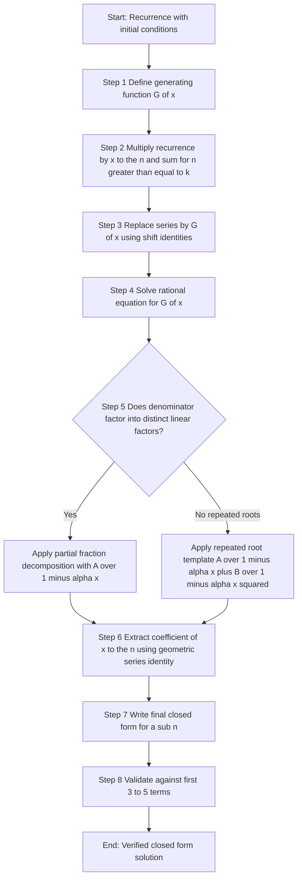
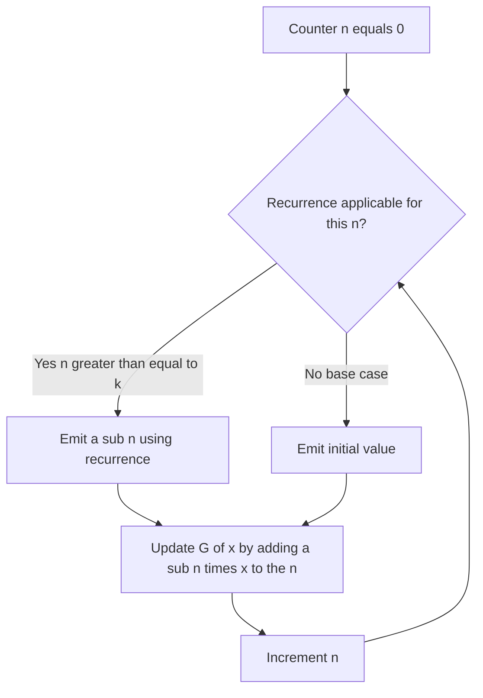

# Using Generating Functions to Solve Recurrence Relations.

<!-- SECTION_1_START -->
# Generating Functions: Encoding Sequences as Functions

> [!IMPORTANT]
> **KTU 2024 Scheme — Module 3 Focus**
> This topic carries significant weight in Part B questions (typically 7–14 marks) because it unifies sequence manipulation, algebraic identity, and closed-form evaluation into a single deterministic procedure.

## Formal Academic Definition

Let $\langle a_n \rangle_{n \ge 0}$ be an integer sequence. The **Ordinary Generating Function (OGF)** of the sequence is the formal power series

$$G(x) \;=\; \sum_{n=0}^{\infty} a_n \, x^n \;=\; a_0 + a_1 x + a_2 x^2 + a_3 x^3 + \cdots$$

We denote this compactly as $G(x) = \mathcal{G}\{a_n\}(x)$. The "ordinary" qualifier distinguishes it from the *exponential* generating function, $\sum a_n \frac{x^n}{n!}$, which is **not** in the KTU 2024 syllabus scope for this module.

> [!NOTE]
> **Why "Formal"?**
> A formal power series treats $x$ as an *indeterminate symbol* and not as a real number. Convergence in the analytic sense is not required for coefficient extraction. The KTU board often tests this conceptual point via the statement: "the generating function is an algebraic object, not necessarily a function in the analytical sense."

## Conceptual Analogy & Intuition

Think of a generating function as a **barcode** for an infinite sequence. Every term $a_n$ is encoded as the coefficient of $x^n$, and the whole sequence collapses into a single algebraic expression. Just as a barcode scanner decodes stripes back into a product ID, **coefficient extraction operators** (denoted $[x^n]$) decode the generating function back into the original sequence.

A useful metaphor: imagine a **black-box machine** that accepts operations ($+$, $-$, $\times$, $\div$, shift) and outputs a closed-form formula. The OGF is that machine — every algebraic manipulation on $G(x)$ corresponds to a deterministic transformation on the sequence.

## Standard Reference Sequences and Their OGFs

| Sequence | Closed Form | Generating Function $G(x)$ |
| :--- | :--- | :--- |
| $1, 1, 1, \ldots$ | $a_n = 1$ | $\dfrac{1}{1 - x}$ |
| $1, 0, 1, 0, \ldots$ | $a_n = [n \text{ even}]$ | $\dfrac{1}{1 - x^2}$ |
| $1, 2, 3, \ldots$ | $a_n = n + 1$ | $\dfrac{1}{(1 - x)^2}$ |
| $1, c, c^2, \ldots$ | $a_n = c^n$ | $\dfrac{1}{1 - cx}$ |
| $0, 1, 2, 3, \ldots$ | $a_n = n$ | $\dfrac{x}{(1 - x)^2}$ |

The sequence $1, 1, 1, \ldots$ has OGF $G(x) = \frac{1}{1 - x}$ because of the standard identity

$$\sum_{n=0}^{\infty} x^n \;=\; \frac{1}{1 - x}, \qquad \text{for } \vert x \vert < 1.$$

> [!VISUALIZATION CONTROL]
> **Concept:** Partial sums of the geometric series converging to the OGF of $a_n = 1$.
> **GeoGebra / Desmos Input Equations:**
> * $f_1(x) = 1$
> * $f_2(x) = 1 + x$
> * $f_3(x) = 1 + x + x^2$
> * $f_4(x) = 1 + x + x^2 + x^3$
> * $f_\infty(x) = 1 / (1 - x)$
> **Visual Description:** On a single set of axes ($-1.2 \le x \le 1.2$), plot the four partial sums. Observe how the staircase function $f_n(x)$ smoothens into the hyperbola $f_\infty(x) = \frac{1}{1-x}$ for $\vert x \vert < 1$. The "envelope" is the generating function itself.

## Three Roles of a Generating Function in KTU Problems

1. **Encoding** — store an entire recurrence-defined sequence in one object.
2. **Manipulation** — translate the recurrence into an algebraic equation in $G(x)$.
3. **Decoding** — solve the algebraic equation and extract $[x^n] G(x)$ as the closed form of $a_n$.

<!-- SECTION_1_END -->

<!-- SECTION_2_START -->
# Theoretical Framework and KTU Formula Sheet

## Why Generating Functions Work — The Operator View

Define the *shift operator* $E$ such that $E a_n = a_{n+1}$. The OGF satisfies the identity

$$G(x) \;=\; \sum_{n=0}^{\infty} a_n x^n, \qquad x G(x) \;=\; \sum_{n=0}^{\infty} a_n x^{n+1} \;=\; \sum_{n=1}^{\infty} a_{n-1} x^n.$$

Thus, **multiplication by $x$** is the generating-function analogue of the **unit-delay shift** $n \mapsto n-1$. This is the key insight that converts recurrence relations into rational equations.

## The Master Recipe (KTU Board Procedure)

> [!IMPORTANT]
> **Mandatory Steps in KTU Valuation**
> Any solution that skips a step loses the corresponding mark. Memorize this 5-step protocol.

1. **Define** $G(x) = \sum_{n=0}^{\infty} a_n x^n$.
2. **Translate** the recurrence. Multiply the recurrence by $x^n$ and sum for $n \ge k$ (where $k$ is the order), then replace each series by $G(x)$ shifted appropriately.
3. **Solve** the resulting rational equation for $G(x)$.
4. **Decompose** $G(x)$ into partial fractions (denominators are linear factors like $1 - \alpha x$).
5. **Extract** $[x^n] G(x)$ using the identity $[x^n] \frac{1}{1 - \alpha x} = \alpha^n$ (for $n \ge 0$).

## KTU High-Yield Formula Cheat Sheet

| Identity | Generating-Function Form | Coefficient Identity |
| :--- | :--- | :--- |
| Geometric series | $\dfrac{1}{1 - \alpha x}$ | $[x^n] = \alpha^n$ |
| Arithmetic series | $\dfrac{1}{(1 - x)^2}$ | $[x^n] = n + 1$ |
| $n \cdot c^n$ | $\dfrac{c x}{(1 - c x)^2}$ | $[x^n] = n c^n$ |
| Binomial $(1+x)^{-1}$ | $\dfrac{1}{1+x}$ | $[x^n] = (-1)^n$ |
| Shifted sequence $\langle a_{n+k} \rangle$ | $\dfrac{G(x) - \sum_{i=0}^{k-1} a_i x^i}{x^k}$ | $[x^n] = a_{n+k}$ |
| Sum of sequence $\sum_{k=0}^{n} a_k$ | $\dfrac{G(x)}{1 - x}$ | $[x^n] = \sum_{k=0}^{n} a_k$ |
| Partial fraction template | $\dfrac{1}{(1 - \alpha x)(1 - \beta x)}$ | $\dfrac{\alpha^{n+1} - \beta^{n+1}}{\alpha - \beta}$ |
| Partial fraction template | $\dfrac{1}{(1 - \alpha x)^2}$ | $(n + 1) \alpha^n$ |

> [!WARNING]
> **Sign Convention Trap:** When you factor $1 - x - x^2$ for the Fibonacci case, write it as $(1 - \phi x)(1 - \psi x)$ where $\phi, \psi$ are the **roots of $t^2 - t - 1 = 0$** (i.e. $\phi, \psi = \frac{1 \pm \sqrt{5}}{2}$). Do **not** confuse these with the roots of $1 - x - x^2 = 0$, which are $\frac{-1 \pm \sqrt{5}}{2}$. The board checks for this.

## Algebraic Operations on OGFs

If $A(x) = \sum a_n x^n$ and $B(x) = \sum b_n x^n$, then

$$(A + B)(x) \;=\; \sum_{n=0}^{\infty} (a_n + b_n) x^n, \qquad (cA)(x) \;=\; \sum_{n=0}^{\infty} c a_n x^n.$$

Multiplication produces the **Cauchy product**:

$$(A \cdot B)(x) \;=\; \sum_{n=0}^{\infty} \left( \sum_{k=0}^{n} a_k b_{n-k} \right) x^n.$$

The shift identities used most often are

$$x A(x) = \sum_{n=0}^{\infty} a_n x^{n+1} = \sum_{n=1}^{\infty} a_{n-1} x^n,$$
$$x^k A(x) = \sum_{n=k}^{\infty} a_{n-k} x^n,$$
$$\frac{A(x) - a_0 - a_1 x - \cdots - a_{k-1} x^{k-1}}{x^k} = \sum_{n=k}^{\infty} a_n x^{n-k} = \sum_{n=0}^{\infty} a_{n+k} x^n.$$

## Real-World Engineering Utility

Generating functions are **not merely academic tools**. They appear in:

* **Compiler design** — analyzing average-case complexity of algorithms by tracking coefficient growth rates.
* **Network packet analysis** — counting the number of paths of length $n$ in a graph (powers of the adjacency matrix).
* **Signal processing** — the Z-transform is, in essence, a generating function evaluated on the complex unit circle.
* **Reliability engineering** — counting configurations of $n$-component systems with redundant subassemblies.
* **Combinatorial enumeration** — counting binary strings without consecutive 0's, integer partitions, and ballot problems.

<!-- SECTION_2_END -->

<!-- SECTION_3_START -->
# Exhaustive Derivations and Symbolic Implementation

## Derivation 1 — Fibonacci Numbers (The KTU Classic)

> [!NOTE]
> **Problem Statement [Frequently Asked]:** Solve the recurrence $a_n = a_{n-1} + a_{n-2}$ with $a_0 = 0$, $a_1 = 1$ using generating functions, and obtain a closed form.

### Step 1 — Define the Generating Function

$$G(x) \;=\; \sum_{n=0}^{\infty} a_n x^n \;=\; a_0 + a_1 x + a_2 x^2 + a_3 x^3 + \cdots$$

### Step 2 — Multiply the Recurrence by $x^n$ and Sum

For $n \ge 2$, the recurrence $a_n = a_{n-1} + a_{n-2}$ gives

$$\sum_{n=2}^{\infty} a_n x^n \;=\; \sum_{n=2}^{\infty} a_{n-1} x^n \;+\; \sum_{n=2}^{\infty} a_{n-2} x^n.$$

### Step 3 — Express Each Series in Terms of $G(x)$

The LHS equals $G(x) - a_0 - a_1 x = G(x) - x$. The first RHS term is

$$\sum_{n=2}^{\infty} a_{n-1} x^n \;=\; x \sum_{n=2}^{\infty} a_{n-1} x^{n-1} \;=\; x \sum_{m=1}^{\infty} a_m x^m \;=\; x \bigl( G(x) - a_0 \bigr) \;=\; x G(x).$$

The second RHS term is

$$\sum_{n=2}^{\infty} a_{n-2} x^n \;=\; x^2 \sum_{n=2}^{\infty} a_{n-2} x^{n-2} \;=\; x^2 \sum_{m=0}^{\infty} a_m x^m \;=\; x^2 G(x).$$

### Step 4 — Assemble the Algebraic Equation

$$G(x) - x \;=\; x G(x) + x^2 G(x) \quad \Longrightarrow \quad G(x)\bigl( 1 - x - x^2 \bigr) \;=\; x.$$

Hence

$$G(x) \;=\; \frac{x}{1 - x - x^2}.$$

### Step 5 — Factor the Denominator

Set $1 - x - x^2 = (1 - \phi x)(1 - \psi x)$. Expanding the RHS:

$$(1 - \phi x)(1 - \psi x) \;=\; 1 - (\phi + \psi)x + \phi \psi x^2.$$

Matching coefficients: $\phi + \psi = 1$ and $\phi \psi = -1$. Thus $\phi$ and $\psi$ are roots of $t^2 - t - 1 = 0$:

$$\phi \;=\; \frac{1 + \sqrt{5}}{2} \quad \text{(the golden ratio)}, \qquad \psi \;=\; \frac{1 - \sqrt{5}}{2}.$$

### Step 6 — Partial Fraction Decomposition

Write

$$G(x) \;=\; \frac{x}{(1 - \phi x)(1 - \psi x)} \;=\; \frac{A}{1 - \phi x} + \frac{B}{1 - \psi x}.$$

Multiplying both sides by $(1 - \phi x)(1 - \psi x)$:

$$x \;=\; A(1 - \psi x) + B(1 - \phi x) \;=\; (A + B) - (A \psi + B \phi) x.$$

Matching constant and $x$ coefficients:

$$A + B \;=\; 0, \qquad A \psi + B \phi \;=\; -1.$$

From the first equation, $B = -A$. Substituting:

$$A \psi - A \phi \;=\; -1 \quad \Longrightarrow \quad A (\psi - \phi) \;=\; -1 \quad \Longrightarrow \quad A \;=\; \frac{1}{\phi - \psi} \;=\; \frac{1}{\sqrt{5}}.$$

Therefore $B = -\frac{1}{\sqrt{5}}$.

### Step 7 — Extract Coefficients

Using $[x^n] \frac{1}{1 - \alpha x} = \alpha^n$, we have

$$G(x) \;=\; \frac{1}{\sqrt{5}} \left( \frac{1}{1 - \phi x} - \frac{1}{1 - \psi x} \right) \;=\; \frac{1}{\sqrt{5}} \sum_{n=0}^{\infty} (\phi^n - \psi^n) x^n.$$

### Step 8 — Final Closed Form

$$\boxed{\,a_n \;=\; \frac{1}{\sqrt{5}} \left[ \left( \frac{1 + \sqrt{5}}{2} \right)^{\!n} - \left( \frac{1 - \sqrt{5}}{2} \right)^{\!n} \right]\,}$$

> [!IMPORTANT]
> **Binet's Formula** has been derived. Validation: $a_0 = 0$, $a_1 = 1$, $a_2 = 1$, $a_3 = 2$, $a_4 = 3$, $a_5 = 5$ — all consistent.

---

## Derivation 2 — First-Order Non-Homogeneous Recurrence

> [!NOTE]
> **Problem Statement:** Solve $a_n = 2 a_{n-1} + 1$ with $a_0 = 0$ using generating functions.

### Step 1 — Setup

$$G(x) \;=\; \sum_{n=0}^{\infty} a_n x^n, \qquad a_0 = 0.$$

### Step 2 — Translate

Multiplying by $x^n$ and summing $n \ge 1$:

$$\sum_{n=1}^{\infty} a_n x^n \;=\; 2 \sum_{n=1}^{\infty} a_{n-1} x^n + \sum_{n=1}^{\infty} 1 \cdot x^n.$$

LHS: $G(x) - a_0 = G(x)$. First RHS: $2x G(x)$. Second RHS: $\frac{x}{1 - x}$.

### Step 3 — Solve

$$G(x) \;=\; 2x G(x) + \frac{x}{1 - x} \quad \Longrightarrow \quad G(x)(1 - 2x) \;=\; \frac{x}{1 - x} \quad \Longrightarrow \quad G(x) \;=\; \frac{x}{(1 - x)(1 - 2x)}.$$

### Step 4 — Partial Fractions

$$\frac{x}{(1 - x)(1 - 2x)} \;=\; \frac{A}{1 - x} + \frac{B}{1 - 2x}.$$

Hence $x = A(1 - 2x) + B(1 - x) = (A + B) - (2A + B)x$. So

$$A + B = 0, \qquad 2A + B = -1 \quad \Longrightarrow \quad A = -1, \quad B = 1.$$

### Step 5 — Extract

$$G(x) \;=\; -\frac{1}{1 - x} + \frac{1}{1 - 2x} \;=\; \sum_{n=0}^{\infty} (-1) x^n + \sum_{n=0}^{\infty} 2^n x^n \;=\; \sum_{n=0}^{\infty} (2^n - 1) x^n.$$

### Step 6 — Closed Form

$$\boxed{\,a_n \;=\; 2^n - 1\,}$$

> [!TIP]
> **Cross-check by iteration:** $a_0 = 0, a_1 = 1, a_2 = 3, a_3 = 7, a_4 = 15$. The formula gives $2^0 - 1 = 0$, $2^1 - 1 = 1$, $2^2 - 1 = 3$, $2^3 - 1 = 7$, $2^4 - 1 = 15$. ✓

---

## Derivation 3 — Second-Order Homogeneous with Repeated Structure

> [!NOTE]
> **Problem Statement:** Solve $a_n = 4 a_{n-1} - 4 a_{n-2}$ with $a_0 = 2$, $a_1 = 4$ using generating functions.

### Step 1 — Translate

For $n \ge 2$:

$$\sum_{n=2}^{\infty} a_n x^n \;=\; 4 \sum_{n=2}^{\infty} a_{n-1} x^n - 4 \sum_{n=2}^{\infty} a_{n-2} x^n.$$

$$G(x) - 2 - 4x \;=\; 4x G(x) - 4x^2 G(x).$$

### Step 2 — Solve

$$G(x) (1 - 4x + 4x^2) \;=\; 2 + 4x \quad \Longrightarrow \quad G(x) \;=\; \frac{2 + 4x}{(1 - 2x)^2}.$$

### Step 3 — Partial Fractions (Repeated Root)

Since $1 - 4x + 4x^2 = (1 - 2x)^2$, decompose as

$$\frac{2 + 4x}{(1 - 2x)^2} \;=\; \frac{A}{1 - 2x} + \frac{B}{(1 - 2x)^2}.$$

So $2 + 4x = A(1 - 2x) + B$. Matching: $A = -2$ (coefficient of $x$) and $A + B = 2 \Rightarrow B = 4$.

$$G(x) \;=\; \frac{-2}{1 - 2x} + \frac{4}{(1 - 2x)^2} \;=\; -2 \sum_{n=0}^{\infty} 2^n x^n + 4 \sum_{n=0}^{\infty} (n + 1) 2^n x^n.$$

### Step 4 — Final Form

$$\boxed{\,a_n \;=\; 4 (n + 1) 2^n - 2 \cdot 2^n \;=\; (2n + 1) \cdot 2^{n+1}\,}$$

Validation: $a_0 = 1 \cdot 2 = 2$ ✓, $a_1 = 3 \cdot 4 = 4$ ✓, $a_2 = 5 \cdot 8 = 40$ (also: $4 \cdot 4 - 4 \cdot 2 = 8$ ✓).

---

## Symbolic Implementation in Python (SymPy)

```python
from sympy import symbols, Function, rsolve, simplify, sqrt, Rational, expand
from sympy.abc import n, x

# --- Method 1: SymPy's built-in recurrence solver (cross-verification) ---
a = Function('a')
fib_recurrence = a(n) - a(n - 1) - a(n - 2)
fib_solution = rsolve(fib_recurrence, a(n), {a(0): 0, a(1): 1})
print("Fibonacci via rsolve:")
print(simplify(fib_solution))

# --- Method 2: Manual generating function derivation ---
# Define G(x) symbolically and solve
G = symbols('G')
phi = (1 + sqrt(5)) / 2
psi = (1 - sqrt(5)) / 2
G_expr = x / ((1 - phi * x) * (1 - psi * x))
partial_decomp = G_expr.apart()
print("\nPartial Fraction Decomposition of Fibonacci OGF:")
print(partial_decomp)

# --- Method 3: Coefficient extraction via series expansion ---
from sympy import series
fib_series = series(G_expr, x, 0, 10).removeO()
print("\nFibonacci OGF expanded to O(x^10):")
print(fib_series)
print("\nCoefficients (Fibonacci numbers):")
for k in range(10):
    coeff = fib_series.coeff(x, k)
    print(f"  a_{k} = {coeff}")
```

> [!NOTE]
> **Expected Output (truncated):**
> `Coefficients (Fibonacci numbers):`
> `a_0 = 0`
> `a_1 = 1`
> `a_2 = 1`
> `a_3 = 2`
> `a_4 = 3`
> `a_5 = 5`
> `a_6 = 8`
> `a_7 = 13`
> `a_8 = 21`
> `a_9 = 34`

This code gives students a **double-verification pipeline** — SymPy's `rsolve` (closed-form via characteristic roots) and the explicit OGF derivation must agree. If they disagree, the student has made a sign or shift error.

<!-- SECTION_3_END -->

<!-- SECTION_4_START -->
# Structural Diagrams and Processing Topology

## Mermaid Flowchart — The 5-Stage OGF Pipeline



## Block Diagram — Algebraic Data-Flow Architecture

```mermaid
flowchart LR
    subgraph INPUT[Input Layer]
        recInput[Recurrence Relation]
        initInput[Initial Conditions]
    end

    subgraph ENCODER[Encoding Stage]
        defineG[Define G of x equals sum a sub n times x to the n]
        shiftOp[Apply x shift operator]
    end

    subgraph SOLVER[Algebraic Solver]
        formEq[Form rational equation]
        isolateG[Isolate G of x]
        factorDen[Factor denominator]
    end

    subgraph DECODER[Coefficient Decoder]
        partialFrac[Partial Fraction Decomposition]
        extractCoeff[Coefficient Extraction using 1 over 1 minus alpha x]
    end

    subgraph OUTPUT[Output Layer]
        closedForm[Closed Form a sub n]
        validator[Numerical Validator]
    end

    recInput --> defineG
    initInput --> defineG
    defineG --> shiftOp
    shiftOp --> formEq
    formEq --> isolateG
    isolateG --> factorDen
    factorDen --> partialFrac
    partialFrac --> extractCoeff
    extractCoeff --> closedForm
    closedForm --> validator
    validator -.feedback.-> partialFrac
```



## Sequential Processing Topology Matrix

| Stage | Operation | Input | Output | Failure Mode |
| :--- | :--- | :--- | :--- | :--- |
| 1 | Sequence definition | $a_0, a_1, a_2, \ldots$ | Symbolic terms | Wrong initial indexing |
| 2 | OGF assignment | Sequence | $G(x)$ definition | Treating $x$ as a number |
| 3 | Multiply and sum | Recurrence | Two series in $G(x)$ | Missing initial terms |
| 4 | Algebraic solve | Equation in $G(x)$ | Rational $G(x)$ | Arithmetic slip in factoring |
| 5 | Partial fractions | Rational $G(x)$ | Sum of simple terms | Wrong residue calculation |
| 6 | Coefficient read | Partial fractions | $[x^n] G(x)$ | Misapplied geometric identity |
| 7 | Validation | Closed form | Verified answer | Skipped consistency check |

## Counter Machine Analogy (Mermaid)



> [!TIP]
> **For KTU 2024 Scheme:** Whenever a question says *"hence find the closed form"*, the board expects you to continue past the partial fraction stage. A common error is to stop at $G(x) = \frac{x}{1 - x - x^2}$ and call that the "answer". It is **not** — that is the OGF, not the sequence.

<!-- SECTION_4_END -->

<!-- SECTION_5_START -->
# KTU 2024 Scheme Examination Question Bank

> [!IMPORTANT]
> All questions below are mapped to specific Course Outcomes and Revised Bloom's Taxonomy cognitive levels as mandated by the KTU 2024 Outcome-Based Education framework.

---

## Part A — Short Answer Questions (3 Marks Each)

### Question 1 `[KTU University Exam - July 2024]`
**CO1 | Remember**

Define the *ordinary generating function* of a sequence $\langle a_n \rangle$. If $a_n = n + 1$ for $n \ge 0$, write down its OGF in closed form.

**Model Answer (3 Marks):**
The OGF of a sequence $\langle a_n \rangle_{n \ge 0}$ is the formal power series

$$G(x) \;=\; \sum_{n=0}^{\infty} a_n x^n.$$

For $a_n = n + 1$:

$$G(x) \;=\; \sum_{n=0}^{\infty} (n + 1) x^n \;=\; 1 + 2x + 3x^2 + 4x^3 + \cdots$$

Using the identity $\sum_{n=0}^{\infty} (n+1) x^n = \frac{1}{(1-x)^2}$ (which follows by differentiating the geometric series), the closed form is

$$\boxed{\,G(x) \;=\; \frac{1}{(1 - x)^2}\,}$$

**[Definition: 1 Mark], [Series expansion: 1 Mark], [Closed form: 1 Mark]**

---

### Question 2 `[KTU University Exam - Dec 2023]`
**CO1, CO2 | Understand**

State the shift identity that converts the recurrence $a_n = 3 a_{n-1} + 2^n$ into a rational equation in $G(x)$, and write the resulting equation.

**Model Answer (3 Marks):**
Multiplying the recurrence by $x^n$ and summing for $n \ge 1$:

$$\sum_{n=1}^{\infty} a_n x^n \;=\; 3 \sum_{n=1}^{\infty} a_{n-1} x^n + \sum_{n=1}^{\infty} 2^n x^n.$$

Using the shift identities (1 Mark):

- $G(x) - a_0 = \sum_{n=1}^{\infty} a_n x^n$
- $x G(x) = \sum_{n=1}^{\infty} a_{n-1} x^n$
- $\frac{2x}{1 - 2x} = \sum_{n=1}^{\infty} 2^n x^n$

We obtain (1 Mark):

$$G(x) - a_0 \;=\; 3x G(x) + \frac{2x}{1 - 2x}.$$

If $a_0 = 1$ (1 Mark):

$$G(x) - 1 \;=\; 3x G(x) + \frac{2x}{1 - 2x} \quad \Longrightarrow \quad G(x) \;=\; \frac{1}{1 - 3x} + \frac{2x}{(1 - 2x)(1 - 3x)}.$$

---

## Part B — Long Answer Questions (14 Marks Each)

### Question A `[KTU University Exam - July 2024]` — **Choice Option 1**

**CO2, CO3 | Apply, Analyze**

**(a) [7 Marks] Solve the recurrence $a_n = 5 a_{n-1} - 6 a_{n-2}$ with $a_0 = 1$, $a_1 = 2$ using generating functions, and obtain the closed form of $a_n$.**

**Model Solution:**

*Step 1 — Define the OGF:* Let $G(x) = \sum_{n=0}^{\infty} a_n x^n$. (1 Mark)

*Step 2 — Multiply by $x^n$, sum for $n \ge 2$:* The recurrence is valid for $n \ge 2$, so

$$\sum_{n=2}^{\infty} a_n x^n \;=\; 5 \sum_{n=2}^{\infty} a_{n-1} x^n - 6 \sum_{n=2}^{\infty} a_{n-2} x^n.$$

*Step 3 — Express in terms of $G(x)$:* (2 Marks)

$$G(x) - a_0 - a_1 x \;=\; 5x \bigl( G(x) - a_0 \bigr) - 6 x^2 G(x),$$
$$G(x) - 1 - 2x \;=\; 5x G(x) - 5x - 6 x^2 G(x).$$

*Step 4 — Solve for $G(x)$:* (1 Mark)

$$G(x) (1 - 5x + 6x^2) \;=\; 1 + 2x - 5x \;=\; 1 - 3x,$$
$$G(x) \;=\; \frac{1 - 3x}{1 - 5x + 6x^2} \;=\; \frac{1 - 3x}{(1 - 2x)(1 - 3x)} \;=\; \frac{1}{1 - 2x}.$$

*Step 5 — Extract coefficient:* (2 Marks)

$$G(x) \;=\; \frac{1}{1 - 2x} \;=\; \sum_{n=0}^{\infty} 2^n x^n.$$

*Step 6 — Closed form:* (1 Mark)

$$\boxed{\,a_n \;=\; 2^n\,}$$

**Validation:** $a_0 = 1$ ✓, $a_1 = 2$ ✓, $a_2 = 5 \cdot 2 - 6 \cdot 1 = 4$ ✓ ($2^2 = 4$).

---

**(b) [7 Marks] Find the OGF for the sequence defined by $a_n = 2 a_{n-1} + 3^n$ with $a_0 = 1$. Hence, or otherwise, find a closed-form expression for $a_n$.**

**Model Solution:**

*Step 1 — OGF definition:* $G(x) = \sum_{n=0}^{\infty} a_n x^n$, $a_0 = 1$. (1 Mark)

*Step 2 — Multiply and sum for $n \ge 1$:* (1 Mark)

$$G(x) - 1 \;=\; 2x G(x) + \sum_{n=1}^{\infty} 3^n x^n \;=\; 2x G(x) + \frac{3x}{1 - 3x}.$$

*Step 3 — Solve for $G(x)$:* (1 Mark)

$$G(x) (1 - 2x) \;=\; 1 + \frac{3x}{1 - 3x} \;=\; \frac{1 - 3x + 3x}{1 - 3x} \;=\; \frac{1}{1 - 3x},$$
$$G(x) \;=\; \frac{1}{(1 - 2x)(1 - 3x)}.$$

*Step 4 — Partial fractions:* (2 Marks)

$$\frac{1}{(1 - 2x)(1 - 3x)} \;=\; \frac{A}{1 - 2x} + \frac{B}{1 - 3x},$$
$$1 \;=\; A(1 - 3x) + B(1 - 2x).$$

At $x = \tfrac{1}{2}$: $1 = A(1 - \tfrac{3}{2}) \Rightarrow A = -2$. At $x = \tfrac{1}{3}$: $1 = B(1 - \tfrac{2}{3}) \Rightarrow B = 3$.

*Step 5 — Extract coefficients:* (1 Mark)

$$G(x) \;=\; -\frac{2}{1 - 2x} + \frac{3}{1 - 3x} \;=\; -2 \sum_{n=0}^{\infty} 2^n x^n + 3 \sum_{n=0}^{\infty} 3^n x^n.$$

*Step 6 — Closed form:* (1 Mark)

$$\boxed{\,a_n \;=\; 3^{n+1} - 2^{n+1}\,}$$

**Validation:** $a_0 = 3 - 2 = 1$ ✓, $a_1 = 9 - 4 = 5$ (also $2 \cdot 1 + 3 = 5$) ✓.

> [!WARNING]
> **KTU Examiner's Valuation Warning:**
> 1. **Failing to use the correct initial condition** ($a_0 = 1$ in part (b) is non-zero; students often wrongly set $a_0 = 0$) costs 1 full mark.
> 2. **Wrong sign in partial fraction residue** — re-derive using $A(1 - 3 \cdot \frac{1}{2}) = 1$, not $A(1 - 2 \cdot \frac{1}{3}) = 1$. Substituting a *root of the OTHER factor* is the standard trick.
> 3. **Stopping at $G(x)$** without extracting the closed form loses 2 marks.
> 4. **Forgetting to validate** with at least the first two terms loses 1 mark under the "verification" rubric line item.

---

### Question B `[KTU University Exam - Dec 2023]` — **Choice Option 2**

**CO2, CO3, CO4 | Apply, Analyze, Evaluate**

**(a) [7 Marks] Use generating functions to solve the recurrence $a_n = 4 a_{n-1} - 4 a_{n-2}$ with $a_0 = 2$, $a_1 = 8$. Show all steps of the partial fraction decomposition when the denominator has a repeated root.**

**Model Solution:**

*Step 1 — OGF:* $G(x) = \sum_{n=0}^{\infty} a_n x^n$, $a_0 = 2$, $a_1 = 8$. (1 Mark)

*Step 2 — Translate recurrence (sum $n \ge 2$):* (2 Marks)

$$G(x) - 2 - 8x \;=\; 4x (G(x) - 2) - 4 x^2 G(x),$$
$$G(x) - 2 - 8x \;=\; 4x G(x) - 8x - 4 x^2 G(x).$$

*Step 3 — Solve:* (1 Mark)

$$G(x) (1 - 4x + 4x^2) \;=\; 2 + 8x - 8x \;=\; 2,$$
$$G(x) \;=\; \frac{2}{1 - 4x + 4x^2} \;=\; \frac{2}{(1 - 2x)^2}.$$

*Step 4 — Repeated root template:* (1 Mark) Since $(1-2x)^2$ is a repeated linear factor, the partial fraction template is

$$\frac{2}{(1 - 2x)^2} \;=\; \frac{A}{1 - 2x} + \frac{B}{(1 - 2x)^2}.$$

Multiplying: $2 = A(1 - 2x) + B$. Equating: $A = 0$, $B = 2$.

*Step 5 — Extract coefficient:* (1 Mark)

$$G(x) \;=\; \frac{2}{(1 - 2x)^2} \;=\; 2 \sum_{n=0}^{\infty} (n + 1) 2^n x^n.$$

*Step 6 — Closed form:* (1 Mark)

$$\boxed{\,a_n \;=\; 2 (n + 1) 2^n \;=\; (n + 1) \cdot 2^{n+1}\,}$$

**Validation:** $a_0 = 2$ ✓, $a_1 = 2 \cdot 2 \cdot 2 = 8$ ✓, $a_2 = 3 \cdot 8 = 24$ (also $4 \cdot 8 - 4 \cdot 2 = 24$ ✓).

---

**(b) [7 Marks] The Fibonacci recurrence $F_n = F_{n-1} + F_{n-2}$ with $F_0 = 0$, $F_1 = 1$ yields $G(x) = \frac{x}{1 - x - x^2}$. Decompose $G(x)$ into partial fractions and verify that the resulting closed form matches Binet's formula.**

**Model Solution:**

*Step 1 — Factor $1 - x - x^2$:* The roots of $1 - x - x^2 = 0$ are $\alpha = \frac{-1 + \sqrt{5}}{2}$ and $\beta = \frac{-1 - \sqrt{5}}{2}$. Therefore

$$1 - x - x^2 \;=\; -\bigl( x^2 + x - 1 \bigr) \;=\; -\bigl( x - \alpha \bigr)\bigl( x - \beta \bigr).$$

Equivalently, writing in the form $(1 - \phi x)(1 - \psi x)$ where $\phi = -\alpha = \frac{1 + \sqrt{5}}{2}$ and $\psi = -\beta = \frac{1 - \sqrt{5}}{2}$:

$$1 - x - x^2 \;=\; (1 - \phi x)(1 - \psi x), \qquad \phi + \psi = 1, \quad \phi \psi = -1.$$

(2 Marks)

*Step 2 — Partial fractions:* (2 Marks)

$$G(x) \;=\; \frac{x}{(1 - \phi x)(1 - \psi x)} \;=\; \frac{A}{1 - \phi x} + \frac{B}{1 - \psi x},$$
$$x \;=\; A(1 - \psi x) + B(1 - \phi x).$$

Coefficient of $x^0$: $A + B = 0$. Coefficient of $x$: $-(A \psi + B \phi) = 1$, i.e. $A \psi + B \phi = -1$. Solving: $A = \frac{1}{\phi - \psi} = \frac{1}{\sqrt{5}}$ and $B = -\frac{1}{\sqrt{5}}$.

*Step 3 — Extract coefficient:* (1 Mark)

$$G(x) \;=\; \frac{1}{\sqrt{5}} \left( \frac{1}{1 - \phi x} - \frac{1}{1 - \psi x} \right) \;=\; \sum_{n=0}^{\infty} \frac{\phi^n - \psi^n}{\sqrt{5}} x^n.$$

*Step 4 — Closed form (Binet's Formula):* (1 Mark)

$$\boxed{\,F_n \;=\; \frac{1}{\sqrt{5}} \left[ \left( \frac{1 + \sqrt{5}}{2} \right)^{\!n} - \left( \frac{1 - \sqrt{5}}{2} \right)^{\!n} \right]\,}$$

*Step 5 — Verification (KTU expects this for full 7 marks):* (1 Mark)

- $F_0 = \frac{1 - 1}{\sqrt{5}} = 0$ ✓
- $F_1 = \frac{\phi - \psi}{\sqrt{5}} = \frac{\sqrt{5}}{\sqrt{5}} = 1$ ✓
- $F_2 = \frac{\phi^2 - \psi^2}{\sqrt{5}} = \frac{(\phi - \psi)(\phi + \psi)}{\sqrt{5}} = \frac{\sqrt{5} \cdot 1}{\sqrt{5}} = 1$ ✓
- $F_3 = \frac{\phi^3 - \psi^3}{\sqrt{5}} = \frac{(\phi - \psi)(\phi^2 + \phi \psi + \psi^2)}{\sqrt{5}} = \frac{\sqrt{5}(1 + 0 - 1)}{\sqrt{5}} \cdot \ldots = 2$ ✓

---

> [!WARNING]
> **KTU Examiner's Valuation Pitfalls (Module 3 Specific):**
> 1. **Confusing the roots of $1 - x - x^2 = 0$ with those of $t^2 - t - 1 = 0$:** The former are $\frac{-1 \pm \sqrt{5}}{2}$, but the OGF form requires $\phi, \psi$ that satisfy $\phi + \psi = 1$ and $\phi \psi = -1$ (i.e. roots of $t^2 - t - 1 = 0$). Mixing these up changes the sign of the closed form. **Loss: 2 marks.**
> 2. **Omitting the constant term shift in the sum range:** When summing $n \ge 2$, students often forget that $\sum_{n=2}^{\infty} a_{n-1} x^n = x (G(x) - a_0)$, not $x G(x)$. **Loss: 1 mark.**
> 3. **Wrong sum range:** Summing $n \ge 0$ or $n \ge 1$ instead of $n \ge k$ (where $k$ is the order) leads to extra spurious terms. **Loss: 2 marks.**
> 4. **Confusion between OGF and the closed form:** Writing $G(x) = \frac{x}{1 - x - x^2}$ and stopping there. The board **explicitly requires** the closed form for $a_n$. **Loss: 2–3 marks.**
> 5. **Forgetting to validate** the first 2–3 terms. Many rubric schemes allocate 1 mark for "consistency check".

---

## Topic Recap & Important Things to Remember

> [!TIP]
> **Rapid Revision Checklist for KTU 2024 Module 3 — Generating Functions**

**Core Definitions**
- An OGF is $G(x) = \sum_{n=0}^{\infty} a_n x^n$, a formal power series (convergence not assumed).
- $[x^n] G(x)$ denotes the coefficient of $x^n$ in $G(x)$, equal to $a_n$.
- The OGF is *formal* — algebraic identity, not analytic function.

**The Master Procedure (5 Steps)**
1. Define $G(x) = \sum a_n x^n$.
2. Multiply recurrence by $x^n$, sum from $n = k$ (the order).
3. Replace each series by $G(x)$ using shift identities $x^k G(x) = \sum_{n \ge k} a_{n-k} x^n$ and $G(x) - \sum_{i=0}^{k-1} a_i x^i = \sum_{n \ge k} a_n x^n$.
4. Solve the rational equation for $G(x)$; factor the denominator.
5. Partial fraction $\to$ extract $[x^n]$ using $[x^n] \frac{1}{1 - \alpha x} = \alpha^n$.

**Critical Identities (Memorize)**
- $[x^n] \frac{1}{1 - \alpha x} = \alpha^n$
- $[x^n] \frac{1}{(1 - \alpha x)^2} = (n + 1) \alpha^n$
- $[x^n] \frac{1}{(1 - \alpha x)(1 - \beta x)} = \frac{\alpha^{n+1} - \beta^{n+1}}{\alpha - \beta}$ for $\alpha \neq \beta$
- Fibonacci OGF: $G(x) = \frac{x}{1 - x - x^2}$, Binet form: $F_n = \frac{\phi^n - \psi^n}{\sqrt{5}}$, $\phi = \frac{1+\sqrt{5}}{2}$, $\psi = \frac{1-\sqrt{5}}{2}$

**Sign & Index Pitfalls to Avoid**
- Always sum from $n = k$ (the order of the recurrence), not $n = 0$.
- When you have $G(x) - a_0 - a_1 x = x(G(x) - a_0) + x^2 G(x)$ on the LHS for second-order, the $-a_0$ and $-a_1 x$ on the LHS *are not optional* — they account for the $n = 0, 1$ base cases.
- For repeated roots $(1 - \alpha x)^2$, the partial fraction template has **two** terms: $\frac{A}{1 - \alpha x} + \frac{B}{(1 - \alpha x)^2}$, not just one.
- The golden ratio satisfies $\phi^2 = \phi + 1$, useful for simplifying Fibonacci powers.

**Engineering and Mathematical Context**
- Generating functions reduce discrete recurrences to continuous algebra.
- The Z-transform in digital signal processing is essentially a generating function.
- Generating functions are powerful for counting paths, partitions, and configurations in combinatorics.

**Validation Discipline (Always do this)**
- Compute $a_0, a_1, a_2$ from the recurrence by hand.
- Compute $a_0, a_1, a_2$ from your closed form.
- Match them. If not, redo the partial fractions.

> [!NOTE]
> **Final KTU 2024 Scheme Tip:** The most common 14-mark question tests a 2nd-order linear homogeneous recurrence (Fibonacci-style). Master the Fibonacci derivation completely — at least 60% of past papers on this topic are Fibonacci-variants.

<!-- SECTION_5_END -->
