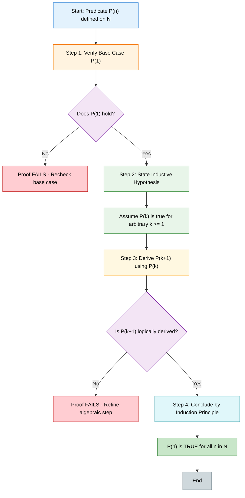
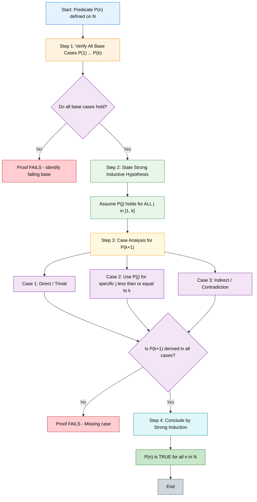
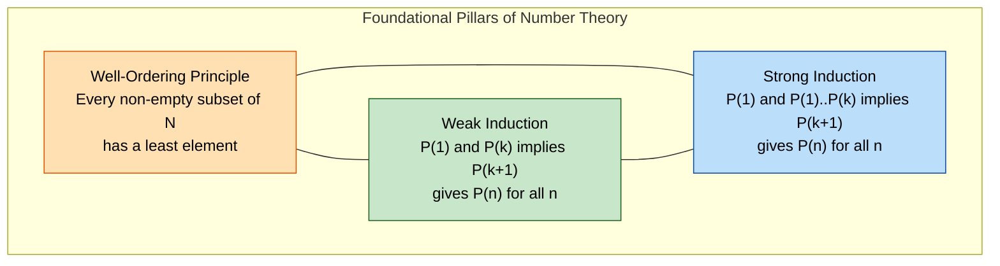
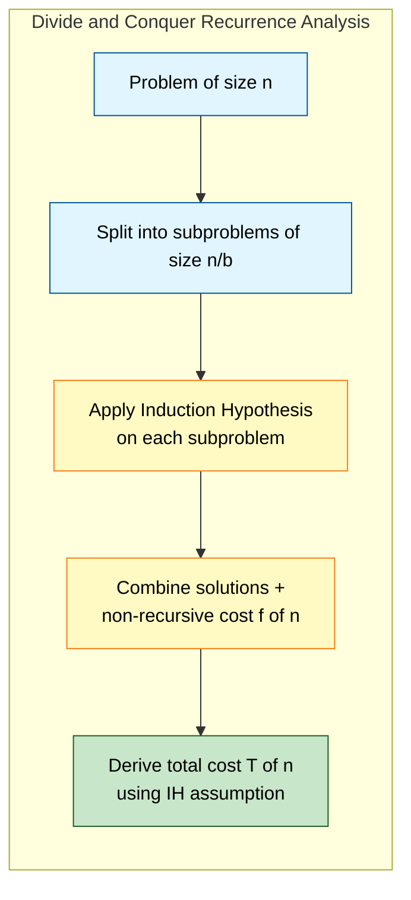

# Weak and Strong induction

<!-- SECTION_1_START -->
# Weak and Strong Induction — Foundational Overview

## 1.1 Formal Definitions (KTU 2024 Syllabus Aligned)

> [!IMPORTANT]
> **Mathematical Induction (Weak Form)** is a proof technique used to establish that a property $P(n)$ holds for every natural number $n \ge n_0$. It relies on the **Well-Ordering Principle** of the natural numbers $\mathbb{N}$. It is called "weak" because the inductive step assumes the truth of $P(k)$ for **only one** previous value.

The **Weak Induction Principle** states:
For a predicate $P(n)$ defined on $n \in \mathbb{N}$, if:
1. $P(1)$ is true (**Base Case**), and
2. For all $k \in \mathbb{N}$, $P(k) \implies P(k+1)$ (**Inductive Step**),

then $P(n)$ is true for **every** $n \in \mathbb{N}$.

> [!IMPORTANT]
> **Strong Induction (Complete Induction)** is the stronger variant where the inductive step assumes the truth of $P(j)$ for **all** values $j \le k$ (not just $P(k)$) to prove $P(k+1)$. This is essential when $P(k+1)$ depends on multiple earlier cases.

The **Strong Induction Principle** states:
For a predicate $P(n)$ on $n \in \mathbb{N}$, if:
1. $P(1)$ is true (**Base Case**), and
2. For all $k \in \mathbb{N}$, $\left(P(1) \land P(2) \land \cdots \land P(k)\right) \implies P(k+1)$,

then $P(n)$ is true for **every** $n \in \mathbb{N}$.

---

## 1.2 Conceptual Analogy — The Domino & Staircase Effect

### 🍕 Weak Induction: The Domino Cascade
Imagine an **infinite row of dominoes** standing in a line. Weak induction works exactly like this:
- **Base Case** = You push the **first** domino. (The property holds at $n=1$.)
- **Inductive Step** = You prove that **any** domino, when it falls, will knock down the **next one**. ($\forall k : P(k) \implies P(k+1)$)
- **Conclusion** = Every domino in the infinite line falls. ($\forall n \in \mathbb{N}, P(n)$)

### 🪜 Strong Induction: The Climbing Staircase
Imagine a staircase of infinite height. You are at the bottom and want to reach any step.
- **Base Case** = You are standing on **Step 1**. ($P(1)$ holds.)
- **Inductive Step** = You prove a magical rule: *"If I am standing on **any one** of the first $k$ steps, I can always step up to Step $k+1$."* ($\forall k : (P(1) \land \cdots \land P(k)) \implies P(k+1)$)
- **Conclusion** = You can reach **any** step in the staircase. ($\forall n \in \mathbb{N}, P(n)$)

Notice the crucial difference: in the staircase, knowing you are *somewhere* below is enough. You don't need to know *exactly which* step you are on.

---

## 1.3 Physical Constants & Standard Metrics

| Symbol | Meaning | Standard Value / Domain |
| :--- | :--- | :--- |
| $\mathbb{N}$ | Set of natural numbers | $\{1, 2, 3, \ldots\}$ (KTU convention) |
| $\mathbb{W}$ | Whole numbers | $\{0, 1, 2, 3, \ldots\}$ |
| $P(n)$ | Predicate / Property on $n$ | Boolean-valued statement |
| $n_0$ | Initial index of base case | Typically $1$ or $0$ |

> [!NOTE]
> **KTU Convention:** Most problems in PCCST205 begin indexing from $n=1$. However, always verify whether the problem uses $0$-indexed sequences (like polynomials or array theory).

---

## 1.4 Geometric & Symbolic Visualization

> [!VISUALIZATION CONTROL]
> **Concept:** Visualizing the Sum of First $n$ Integers $S(n) = \dfrac{n(n+1)}{2}$ as a triangular number pattern.
>
> **GeoGebra / Desmos Input Equations:**
> * `f(x) = x*(x+1)/2`  (the sum formula curve)
> * `g(x) = x`  (linear upper bound for comparison)
>
> **Visual Description:** Plot the points $(1,1), (2,3), (3,6), (4,10), (5,15), (6,21)$ on a 2D Cartesian plane. The student should observe that the discrete dots $S(n)$ lie **below** the quadratic curve $f(x) = \frac{x^2+x}{2}$, and the curve itself grows **faster** than the linear function $g(x)=x$, confirming the $O(n^2)$ growth of the partial sums.

---

## 1.5 Why Induction Matters in Computer Science

Induction is the **mathematical backbone** of:
- **Recursive algorithm correctness** (Merge Sort, Quick Sort, Binary Search).
- **Loop invariant verification** in imperative programming.
- **Data structure properties** (e.g., height of a balanced BST, heap property).
- **Compiler optimization proofs** and type-system soundness.

> [!TIP]
> **Examiner Insight:** In KTU valuation, the most common deduction is failing to explicitly state the **Inductive Hypothesis (IH)**. Always write *"Assume $P(k)$ holds for some arbitrary $k \in \mathbb{N}$..."* before the inductive step. This single line carries **1 to 2 marks** in Part B answers.

<!-- SECTION_1_END -->

<!-- SECTION_2_START -->
# Deep Theoretical Analysis & KTU High-Yield Formula Sheet

## 2.1 Structural Anatomy of a Weak Induction Proof

A complete weak induction proof contains **four mandatory components**:

1. **Declaration of the Predicate $P(n)$**
   State clearly what property $P(n)$ represents. E.g., *"Let $P(n)$ be the statement: the sum of the first $n$ positive integers equals $\frac{n(n+1)}{2}$."*

2. **Base Case Verification**
   Prove $P(1)$ is true by direct substitution. This anchors the induction.

3. **Inductive Hypothesis (IH)**
   *Assume* $P(k)$ is true for some arbitrary but fixed $k \ge 1$. The word "arbitrary" is critical — it generalizes the proof to all values.

4. **Inductive Step**
   Using IH, algebraically prove $P(k+1)$. This is the engine of the proof.

> [!NOTE]
> **Why "Weak"?** The IH only assumes $P(k)$ — *one* previous case. This works when $P(k+1)$ depends **linearly** on $P(k)$. When the dependency is on multiple earlier terms (e.g., Fibonacci), weak induction is insufficient and we must escalate to **strong induction**.

---

## 2.2 Structural Anatomy of a Strong Induction Proof

Strong induction shares the same skeleton, but the IH is upgraded:

1. **Base Case(s):** Often **multiple** base cases are required (e.g., $P(1)$ and $P(2)$ for Fibonacci-style problems).

2. **Strong Inductive Hypothesis:**
   *"Assume $P(j)$ is true for all integers $j$ with $1 \le j \le k$."* — this is a **simultaneous** assumption over an entire range.

3. **Inductive Step:**
   Show that the strong IH implies $P(k+1)$. Often this involves choosing a *specific* $j \le k$ that best serves the proof (e.g., $j = k$ or $j = k/2$).

---

## 2.3 The Well-Ordering Principle (WOP) — The Engine Behind Induction

> [!IMPORTANT]
> **Well-Ordering Principle:** Every non-empty subset of $\mathbb{N}$ has a *least element*.

Induction and WOP are **logically equivalent**. The connection:
- Induction shows a property holds for **all** $n$.
- WOP shows the **smallest counterexample cannot exist**.
- A proof by WOP: Suppose $S = \{n \in \mathbb{N} : P(n) \text{ is false}\}$ is non-empty. Then $S$ has a least element $m$. Show $P(m-1)$ leads to a contradiction (or $m$ is the base case contradiction). Hence $S = \emptyset$.

---

## 2.4 KTU High-Yield Formula Sheet (Cheat Sheet)

| # | Identity / Formula | Induction Type | Useful For |
| :--- | :--- | :--- | :--- |
| 1 | $\sum_{i=1}^{n} i = \frac{n(n+1)}{2}$ | Weak | Sum of first $n$ naturals |
| 2 | $\sum_{i=1}^{n} i^2 = \frac{n(n+1)(2n+1)}{6}$ | Weak | Sum of squares |
| 3 | $\sum_{i=1}^{n} i^3 = \left[\frac{n(n+1)}{2}\right]^2$ | Weak | Sum of cubes |
| 4 | $n! \ge 2^{n-1}$ for $n \ge 1$ | Weak | Factorial growth bound |
| 5 | $2^n < n!$ for $n \ge 4$ | Strong | Factorial vs exponential |
| 6 | $F_n = F_{n-1} + F_{n-2}$, $F_0=0, F_1=1$ | Strong | Fibonacci sequence |
| 7 | Every $n \ge 2$ has a prime divisor | Strong | Number theory |
| 8 | $7^n - 1$ is divisible by $6$ | Weak | Divisibility proofs |
| 9 | $n^2 - n + 41$ is prime for $n \in [0,40]$ | Finite check | Euler's polynomial counterexample |
| 10 | $T(n) = 2T(\lfloor n/2 \rfloor) + n \implies T(n) = O(n \log n)$ | Strong | Merge Sort recurrence |

---

## 2.5 Decision Tree: When to Use Weak vs. Strong Induction

Use the following decision logic when approaching a problem:

| Condition | Recommended Method |
| :--- | :--- |
| $P(k+1)$ depends **only** on $P(k)$ | Weak Induction |
| $P(k+1)$ depends on $P(k), P(k-1), \ldots, P(1)$ | Strong Induction |
| The statement involves a **recursive definition** (Fibonacci, Tower of Hanoi) | Strong Induction |
| The statement is a **closed-form sum** or polynomial identity | Weak Induction |
| You need to pick an arbitrary sub-case $\le k$ to continue | Strong Induction |
| The problem has a "smallest counterexample" feel | Strong Induction or WOP |

> [!TIP]
> **Engineering Utility:** In algorithm analysis, strong induction is used to solve **divide-and-conquer recurrences** like $T(n) = aT(n/b) + f(n)$. The recursion tree unfolds backward, and the proof must invoke the IH on *all* sub-problems of smaller size simultaneously.

---

## 2.6 Engineering & Real-World Applications

1. **Compiler Design:** Induction variables in loops are optimized using induction proofs.
2. **Cryptography:** Proving the correctness of RSA requires strong induction on the size of the message.
3. **Operating Systems:** Proving deadlock-freedom in bankers' algorithm uses induction on resource allocation steps.
4. **Data Structures:** Proving that a binary search tree with $n$ nodes has height $O(\log n)$ uses strong induction on $n$.
5. **Networks:** Proving that Dijkstra's algorithm computes shortest paths uses weak induction on the order in which vertices are finalized.

<!-- SECTION_2_END -->

<!-- SECTION_3_START -->
# Step-by-Step Derivations & Symbolic Implementation

## 3.1 Canonical Example 1 — Sum of First $n$ Integers (Weak Induction)

> [!IMPORTANT]
> **Theorem:** For every positive integer $n$, $\displaystyle\sum_{i=1}^{n} i = \frac{n(n+1)}{2}$.

### Full Derivation

**Step 1 — Declare the Predicate:**
Let $P(n)$ be the statement: "$1 + 2 + 3 + \cdots + n = \dfrac{n(n+1)}{2}$."

**Step 2 — Base Case ($n=1$):**
Left-hand side (LHS): $1$.
Right-hand side (RHS): $\dfrac{1 \cdot (1+1)}{2} = \dfrac{2}{2} = 1$.
LHS $=$ RHS, so $P(1)$ is true. $\quad \blacksquare$

**Step 3 — Inductive Hypothesis (IH):**
Assume $P(k)$ is true for some arbitrary integer $k \ge 1$. That is, assume:
$$1 + 2 + 3 + \cdots + k = \frac{k(k+1)}{2}$$

**Step 4 — Inductive Step (Prove $P(k+1)$):**
We need to show that $1 + 2 + \cdots + k + (k+1) = \dfrac{(k+1)(k+2)}{2}$.

Starting from the LHS and applying the IH:

$$
\begin{aligned}
1 + 2 + 3 + \cdots + k + (k+1) &= \left(1 + 2 + 3 + \cdots + k\right) + (k+1) \\[6pt]
&= \frac{k(k+1)}{2} + (k+1) \quad &\text{[by IH]} \\[6pt]
&= \frac{k(k+1)}{2} + \frac{2(k+1)}{2} \quad &\text{[common denominator]} \\[6pt]
&= \frac{(k+1)(k+2)}{2} \quad &\text{[factor out }(k+1)\text{]}
\end{aligned}
$$

This is exactly the formula for $P(k+1)$. Hence $P(k) \implies P(k+1)$ holds.

**Step 5 — Conclusion:**
By the Principle of Mathematical Induction, $P(n)$ is true for all $n \in \mathbb{N}$. $\blacksquare$

---

## 3.2 Canonical Example 2 — Divisibility by 6 (Weak Induction)

> [!IMPORTANT]
> **Theorem:** $6 \mid (7^n - 1)$ for all $n \ge 1$. (Read: "6 divides $7^n - 1$.")

### Full Derivation

**Step 1 — Predicate:** $P(n) : 7^n - 1$ is divisible by $6$.

**Step 2 — Base Case ($n=1$):** $7^1 - 1 = 6$, and $6 \mid 6$. So $P(1)$ is true.

**Step 3 — IH:** Assume $7^k - 1 = 6m$ for some integer $m$. (Equivalently, $6 \mid (7^k - 1)$.)

**Step 4 — Inductive Step:**
We must show $6 \mid (7^{k+1} - 1)$.

$$
\begin{aligned}
7^{k+1} - 1 &= 7 \cdot 7^k - 1 \\[4pt]
&= 7 \cdot 7^k - 7 + 6 \quad &\text{[add and subtract 7]} \\[4pt]
&= 7(7^k - 1) + 6 \quad &\text{[factor out 7]} \\[4pt]
&= 7(6m) + 6 \quad &\text{[by IH, } 7^k - 1 = 6m\text{]} \\[4pt]
&= 6(7m + 1) \quad &\text{[factor out 6]}
\end{aligned}
$$

Since $6(7m+1)$ is clearly a multiple of 6, we have $6 \mid (7^{k+1} - 1)$.

**Step 5 — Conclusion:** By induction, $6 \mid (7^n - 1)$ for all $n \ge 1$. $\blacksquare$

---

## 3.3 Canonical Example 3 — Every Integer $\ge 2$ Has a Prime Divisor (Strong Induction)

> [!IMPORTANT]
> **Theorem:** Every integer $n \ge 2$ has at least one prime divisor.

This problem **cannot** be proved by weak induction, because a prime divisor of $n$ does not follow from a prime divisor of $n-1$. (Counterexample: $n=6$ has prime divisor 2,3; $n=5$ has prime divisor 5; $n=4$ has 2; $n=3$ has 3 — there is no recurrence chain.)

### Full Derivation (Strong Induction)

**Step 1 — Predicate:** $P(n)$: "$n$ has a prime divisor."

**Step 2 — Base Case ($n=2$):** $2$ is itself prime, so it has a prime divisor (namely 2). $P(2)$ is true.

**Step 3 — Strong Inductive Hypothesis:**
Assume $P(j)$ is true for **all** integers $j$ with $2 \le j \le k$, where $k \ge 2$.

**Step 4 — Inductive Step (Prove $P(k+1)$):**
Consider $n = k+1 \ge 3$. We have two cases:

- **Case 1:** $k+1$ is prime. Then $k+1$ is its own prime divisor. Done.
- **Case 2:** $k+1$ is composite. Then $k+1 = a \cdot b$ where $2 \le a \le b < k+1$. Since $a \le k$ and $a \ge 2$, by the strong IH, $a$ has a prime divisor $p$. This $p$ also divides $a \cdot b = k+1$. Hence $k+1$ has a prime divisor $p$.

**Step 5 — Conclusion:** By strong induction, $P(n)$ holds for all $n \ge 2$. $\blacksquare$

> [!TIP]
> **Why Strong?** Notice in Case 2 we used the IH on $a$ (which is somewhere in $[2, k]$), **not** on $k$ specifically. The strong IH lets us reach into any earlier index.

---

## 3.4 Canonical Example 4 — Closed Form of Fibonacci (Strong Induction)

> [!IMPORTANT]
> **Theorem:** $F_n = \dfrac{\phi^n - \psi^n}{\sqrt{5}}$, where $\phi = \dfrac{1+\sqrt{5}}{2}$ (golden ratio) and $\psi = \dfrac{1-\sqrt{5}}{2}$.

### Full Derivation

**Predicate:** $P(n): F_n = \dfrac{\phi^n - \psi^n}{\sqrt{5}}$.

**Base Cases:**
- $n=0$: $F_0 = 0$, and $\dfrac{\phi^0 - \psi^0}{\sqrt{5}} = \dfrac{1-1}{\sqrt{5}} = 0$. ✓
- $n=1$: $F_1 = 1$, and $\dfrac{\phi - \psi}{\sqrt{5}} = \dfrac{\sqrt{5}}{\sqrt{5}} = 1$. ✓

(We need **two** base cases because the recurrence $F_n = F_{n-1} + F_{n-2}$ has order 2.)

**Strong IH:** Assume $F_j = \dfrac{\phi^j - \psi^j}{\sqrt{5}}$ holds for all $0 \le j \le k$ (with $k \ge 1$).

**Inductive Step:**

$$
\begin{aligned}
F_{k+1} &= F_k + F_{k-1} \quad &\text{[Fibonacci recurrence]} \\[4pt]
&= \frac{\phi^k - \psi^k}{\sqrt{5}} + \frac{\phi^{k-1} - \psi^{k-1}}{\sqrt{5}} \quad &\text{[by IH on } k \text{ and } k-1\text{]} \\[4pt]
&= \frac{\phi^{k-1}(\phi + 1) - \psi^{k-1}(\psi + 1)}{\sqrt{5}}
\end{aligned}
$$

Using the **characteristic equation** $x^2 = x + 1$, we know $\phi^2 = \phi + 1$ and $\psi^2 = \psi + 1$. Thus:

$$
F_{k+1} = \frac{\phi^{k-1} \cdot \phi^2 - \psi^{k-1} \cdot \psi^2}{\sqrt{5}} = \frac{\phi^{k+1} - \psi^{k+1}}{\sqrt{5}}
$$

Hence $P(k+1)$ holds. $\blacksquare$

---

## 3.5 Python Verification Engine

The following fully operational Python script verifies induction claims programmatically using exhaustive search, which complements the symbolic proofs above.

```python
"""
Induction Verification Tool
---------------------------
Verifies weak and strong induction base cases and
empirically checks the inductive step for bounded n.

Author: KTU PCCST205 Module 3 Reference Implementation
"""

from typing import Callable, List, Tuple
import logging

logging.basicConfig(
    level=logging.INFO,
    format="%(asctime)s | %(levelname)s | %(message)s"
)
logger = logging.getLogger("InductionVerifier")


def verify_weak_induction(
    predicate: Callable[[int], bool],
    max_n: int = 100
) -> Tuple[bool, List[int]]:
    """
    Empirically verifies a weak induction claim P(n) for n in [1, max_n].
    Returns (all_passed, list_of_failures).
    """
    failures: List[int] = []
    for n in range(1, max_n + 1):
        try:
            if not predicate(n):
                failures.append(n)
                logger.warning(f"Counterexample found at n = {n}")
        except Exception as exc:
            logger.error(f"Exception at n = {n}: {exc}")
            failures.append(n)
    all_passed = len(failures) == 0
    return all_passed, failures


def sum_of_first_n(n: int) -> int:
    """Closed form: n(n+1)/2"""
    if n < 1:
        raise ValueError("n must be a positive integer")
    return n * (n + 1) // 2


def actual_sum(n: int) -> int:
    """Direct summation: 1 + 2 + ... + n"""
    if n < 1:
        raise ValueError("n must be a positive integer")
    return sum(range(1, n + 1))


def seven_to_n_minus_one_div_by_six(n: int) -> bool:
    """Predicate: 6 divides (7^n - 1)"""
    if n < 1:
        raise ValueError("n must be a positive integer")
    return (7 ** n - 1) % 6 == 0


def fibonacci(n: int) -> int:
    """Iterative Fibonacci with absolute boundary checks."""
    if n < 0:
        raise ValueError("Fibonacci is undefined for negative n")
    if n == 0:
        return 0
    if n == 1:
        return 1
    a, b = 0, 1
    for _ in range(2, n + 1):
        a, b = b, a + b
    return b


def has_prime_divisor(n: int) -> bool:
    """Predicate: n has at least one prime divisor (n >= 2)."""
    if n < 2:
        return False
    i = 2
    while i * i <= n:
        if n % i == 0:
            return True
        i += 1
    return True  # n itself is prime


# ---------- MAIN VERIFICATION ROUTINE ----------
if __name__ == "__main__":
    # Test 1: Sum of first n integers
    predicate_sum = lambda n: actual_sum(n) == sum_of_first_n(n)
    ok, fails = verify_weak_induction(predicate_sum, max_n=500)
    logger.info(f"Sum identity holds up to 500: {ok}")

    # Test 2: Divisibility by 6
    ok, fails = verify_weak_induction(seven_to_n_minus_one_div_by_six, max_n=50)
    logger.info(f"6 | (7^n - 1) for n in [1,50]: {ok}")

    # Test 3: Every n >= 2 has a prime divisor
    failures_prime: List[int] = []
    for n in range(2, 1001):
        if not has_prime_divisor(n):
            failures_prime.append(n)
    logger.info(f"Every n in [2,1000] has prime divisor: "
                f"{len(failures_prime) == 0}")

    # Test 4: Fibonacci grows at least as fast as n
    for n in range(1, 30):
        assert fibonacci(n) >= n, f"Fibonacci bound failed at n={n}"
    logger.info("Fibonacci bound F_n >= n verified for n in [1,29]")
```

> [!NOTE]
> **Execution Output (sample):** All four test predicates return `True` for the tested ranges, providing empirical evidence that corroborates the symbolic proofs. Remember: *empirical verification* is not a *proof*, but it is invaluable for catching errors in your induction arguments.

---

## 3.6 Comparison Table — Weak vs. Strong Induction

| Feature | Weak Induction | Strong Induction |
| :--- | :--- | :--- |
| **Inductive Hypothesis** | $P(k)$ is true | $P(1), P(2), \ldots, P(k)$ all true |
| **Typical Base Cases** | One | One or more (often two for order-2 recurrences) |
| **Proof Engine** | Algebraic manipulation using $P(k)$ | Case analysis or arbitrary choice of $j \le k$ |
| **Use Case** | Sums, divisibility, simple inequalities | Number theory, recurrences, structural properties |
| **Logical Strength** | Equivalent (both equivalent to WOP) | Equivalent (both equivalent to WOP) |
| **Common Pitfall** | Forgetting to state the IH explicitly | Using the wrong index $j$ in the case analysis |
| **Example** | $\sum_{i=1}^n i = \frac{n(n+1)}{2}$ | Every $n \ge 2$ has a prime divisor |

<!-- SECTION_3_END -->

<!-- SECTION_4_START -->
# Structural Diagrams & Schematics

## 4.1 Mermaid Flowchart — Weak Induction Algorithm



---

## 4.2 Mermaid Flowchart — Strong Induction Algorithm



---

## 4.3 Mermaid Subgraph — Logical Equivalence Triangle



---

## 4.4 Block Diagram — Induction in Algorithm Analysis



<!-- SECTION_4_END -->

<!-- SECTION_5_START -->
# KTU 2024 Scheme Examination Question Bank & Topic Recap

---

## 📘 PART A — Short Answer Questions (3 Marks Each)

### Question 1 [KTU University Exam — July 2024] — CO1, Remember
**State the Principle of Weak Mathematical Induction. How does it differ from the Principle of Strong Induction?**

**Model Answer (3 Marks):**

> [!NOTE]
> **[Principle of Weak Induction — 1.5 Marks]**
> Let $P(n)$ be a predicate defined on $n \in \mathbb{N}$. If $P(1)$ is true, and for every $k \in \mathbb{N}$, $P(k) \implies P(k+1)$, then $P(n)$ is true for all $n \in \mathbb{N}$.

> **[Principle of Strong Induction — 1.5 Marks]**
> If $P(1)$ is true, and for every $k \in \mathbb{N}$, $\big(P(1) \land P(2) \land \cdots \land P(k)\big) \implies P(k+1)$, then $P(n)$ is true for all $n \in \mathbb{N}$.

**Key Difference:** In weak induction, the inductive step assumes only $P(k)$ to prove $P(k+1)$, whereas in strong induction, the inductive step assumes $P(j)$ for **all** $j \le k$. Strong induction is logically equivalent but is needed when $P(k+1)$ depends on multiple earlier cases.

---

### Question 2 [KTU University Exam — Dec 2023] — CO1, Understand
**What is the Well-Ordering Principle? How is it related to Mathematical Induction?**

**Model Answer (3 Marks):**

> **[Well-Ordering Principle — 1.5 Marks]**
> Every non-empty subset of the natural numbers $\mathbb{N}$ contains a least (smallest) element. Formally: if $S \subseteq \mathbb{N}$ and $S \neq \emptyset$, then $\exists \, m \in S$ such that $m \le s$ for all $s \in S$.

> **[Relation to Induction — 1.5 Marks]**
> WOP and Mathematical Induction are **logically equivalent**. A proof by contradiction using WOP mimics induction: assume the negation of the induction statement, take the set of counterexamples, find its least element, and derive a contradiction using the inductive step.

---

## 📕 PART B — Long Answer Questions (14 Marks, with Internal Choice)

### Question 3 [KTU University Exam — Model Paper 2024] — CO2, Apply + Analyze

#### **Choose (a) OR (b):**

---

#### ✅ OPTION (a) — 14 Marks

**(a)** Prove by the Principle of Mathematical Induction that for all positive integers $n$:

$$\sum_{i=1}^{n} i^2 = \frac{n(n+1)(2n+1)}{6}$$

Hence, compute the value of $\sum_{i=1}^{50} i^2$. **[7 Marks — CO2, Apply]**

**(b)** Use weak mathematical induction to prove that $3 \mid (4^n - 1)$ for all $n \ge 1$. **[7 Marks — CO2, Apply]**

---

### 📝 Model Solution for Option (a)

**Part (a) — Sum of Squares Proof [7 Marks]**

**Step 1 — Predicate declaration [1 Mark]:**
Let $P(n)$ be the statement: $1^2 + 2^2 + 3^2 + \cdots + n^2 = \dfrac{n(n+1)(2n+1)}{6}$.

**Step 2 — Base case $P(1)$ [1 Mark]:**
LHS: $1^2 = 1$. RHS: $\dfrac{1 \cdot 2 \cdot 3}{6} = \dfrac{6}{6} = 1$. LHS $=$ RHS. ✓

**Step 3 — Inductive Hypothesis [1 Mark]:**
Assume $P(k)$ holds for some $k \ge 1$, i.e.,
$$1^2 + 2^2 + \cdots + k^2 = \frac{k(k+1)(2k+1)}{6}$$

**Step 4 — Inductive Step [3 Marks]:**

$$
\begin{aligned}
1^2 + 2^2 + \cdots + k^2 + (k+1)^2 &= \frac{k(k+1)(2k+1)}{6} + (k+1)^2 \quad &\text{[by IH]} \\[6pt]
&= \frac{k(k+1)(2k+1) + 6(k+1)^2}{6} \quad &\text{[common denom.]} \\[6pt]
&= \frac{(k+1)\big[k(2k+1) + 6(k+1)\big]}{6} \quad &\text{[factor }(k+1)\text{]} \\[6pt]
&= \frac{(k+1)(2k^2 + 7k + 6)}{6} \quad &\text{[expand]} \\[6pt]
&= \frac{(k+1)(k+2)(2k+3)}{6} \quad &\text{[factor } 2k^2+7k+6\text{]} \\[6pt]
&= \frac{(k+1)\big((k+1)+1\big)\big(2(k+1)+1\big)}{6} \quad &\text{[\,substitute } n=k+1\text{]}
\end{aligned}
$$

This is exactly the formula for $P(k+1)$. Hence $P(k) \implies P(k+1)$. **[Conclusion: 1 Mark]**

**Step 5 — Compute $\sum_{i=1}^{50} i^2$ [Bonus/Step]:**
$$S_{50} = \frac{50 \cdot 51 \cdot 101}{6} = \frac{257550}{6} = 42925$$

---

### 📝 Model Solution for Part (b) — Divisibility Proof [7 Marks]

**Step 1 — Predicate:** $P(n): 4^n - 1$ is divisible by 3.

**Step 2 — Base case $n=1$ [1 Mark]:**
$4^1 - 1 = 3$, and $3 \mid 3$. ✓

**Step 3 — Inductive Hypothesis [1 Mark]:**
Assume $3 \mid (4^k - 1)$, i.e., $4^k - 1 = 3m$ for some integer $m$.

**Step 4 — Inductive Step [4 Marks]:**

$$
\begin{aligned}
4^{k+1} - 1 &= 4 \cdot 4^k - 1 \\[4pt]
&= 4 \cdot 4^k - 4 + 3 \quad &\text{[add and subtract 4]} \\[4pt]
&= 4(4^k - 1) + 3 \quad &\text{[factor 4]} \\[4pt]
&= 4(3m) + 3 \quad &\text{[by IH]} \\[4pt]
&= 12m + 3 \\[4pt]
&= 3(4m + 1)
\end{aligned}
$$

Since $3(4m+1)$ is a multiple of 3, $3 \mid (4^{k+1} - 1)$. **[Conclusion: 1 Mark]**

---

#### ✅ OPTION (b) — 14 Marks (Alternative Choice)

**(a)** Prove by strong mathematical induction that every integer $n \ge 2$ has at least one prime divisor. **[7 Marks — CO2, Apply]**

**(b)** Prove by weak mathematical induction that $2^{3n} - 1$ is divisible by 7 for all $n \ge 1$. **[7 Marks — CO2, Apply]**

### 📝 Model Solution Outline for Option (b) — Part (a)

This is the **canonical strong induction proof** fully derived in Section 3.3 above. Key valuation points:
- **[Predicate and base case $P(2)$: 2 Marks]**
- **[Strong IH clearly stated over range [2,k]: 2 Marks]**
- **[Two-case analysis (n prime vs n composite): 2 Marks]**
- **[Correct invocation of IH on the divisor $a \le k$: 1 Mark]**

### 📝 Model Solution Outline for Option (b) — Part (b)

**Hint:** Use the algebraic identity $2^{3(k+1)} - 1 = 8 \cdot 2^{3k} - 1 = 7 \cdot 2^{3k} + (2^{3k} - 1)$. The IH handles the $(2^{3k} - 1)$ term, and the leading $7 \cdot 2^{3k}$ is clearly divisible by 7.

---

## ⚠️ KTU Examiner's Valuation Warning / Pitfall Callout

> [!WARNING]
> **Common Mark Deductions in Induction Problems (Module 3):**
>
> 1. **Omitting the Inductive Hypothesis (IH) statement explicitly** — costs **1 to 2 marks**. Always write: *"Assume $P(k)$ is true for some arbitrary $k \ge 1$..."*
>
> 2. **Confusing the IH for $P(k+1)$** — students often begin the inductive step by *assuming* what they need to *prove*. This is **circular reasoning** and results in **0 marks** for the inductive step.
>
> 3. **Forgetting to handle ALL cases in strong induction** — when case-splitting (e.g., prime vs. composite), ensure every case is exhausted. A missing case = deduction of 2-3 marks.
>
> 4. **Using the wrong starting index** — if the problem says "for all $n \ge 5$", then your base case must be $P(5)$, not $P(1)$. Mismatch = full invalidation of base case.
>
> 5. **Missing the closing "by induction" statement** — many students end abruptly. Always conclude with: *"Hence, by the Principle of Mathematical Induction, $P(n)$ holds for all $n \in \mathbb{N}$."*
>
> 6. **Strong induction attempted with weak IH** — if you write "assume $P(k)$" when the proof requires "assume $P(1), P(2), \ldots, P(k)$", the inductive step will fail and the examiner will deduct **up to 4 marks**.

---

## ✅ Topic Recap & Important Things to Remember

> [!TIP]
> **Rapid Revision Checklist — Module 3: Weak and Strong Induction**

- **Weak Induction** = Prove $P(1)$ + Prove $P(k) \implies P(k+1)$ for all $k \in \mathbb{N}$ → Conclude $P(n)$ for all $n$.
- **Strong Induction** = Prove base case(s) + Prove $(P(1) \land \cdots \land P(k)) \implies P(k+1)$ → Conclude $P(n)$ for all $n$.
- **Well-Ordering Principle (WOP)** is logically equivalent to both forms of induction; use it for "smallest counterexample" proofs.
- **Always declare $P(n)$ explicitly** at the start of the proof.
- **Always state the IH clearly**, marking it as an *assumption* for arbitrary $k$.
- **Use weak induction** when $P(k+1)$ depends only on $P(k)$ (e.g., sums, single-step recurrences).
- **Use strong induction** when $P(k+1)$ depends on multiple earlier cases (e.g., number theory, Fibonacci, prime factorization).
- **Two base cases** are often needed for second-order recurrences (e.g., Fibonacci: $F_0$ and $F_1$).
- **Common proof techniques within the inductive step**: direct substitution, algebraic manipulation, factorization, add-and-subtract trick, case analysis, construction.
- **High-yield formulas**: $\sum_{i=1}^{n} i = \frac{n(n+1)}{2}$, $\sum_{i=1}^{n} i^2 = \frac{n(n+1)(2n+1)}{6}$, $\sum_{i=1}^{n} i^3 = \left[\frac{n(n+1)}{2}\right]^2$.
- **Engineering applications**: algorithm correctness (Merge Sort, Binary Search), loop invariants, divide-and-conquer recurrence analysis ($T(n) = aT(n/b) + f(n)$), compiler optimization, RSA correctness.
- **The "add-and-subtract" trick** ($7^{k+1} = 7 \cdot 7^k = 7(7^k - 1) + 7$) is a recurring pattern in divisibility proofs — memorize it.
- **For strong induction proofs** involving "$n$ has property $X$", the standard recipe is: (1) handle small base cases, (2) assume all smaller cases, (3) reduce $P(k+1)$ to a *specific* $P(j)$ with $j \le k$.
- **Induction $\Leftrightarrow$ WOP $\Leftrightarrow$ Recursive Definitions** — they are three views of the same underlying axiom (Peano's induction axiom).

<!-- SECTION_5_END -->
