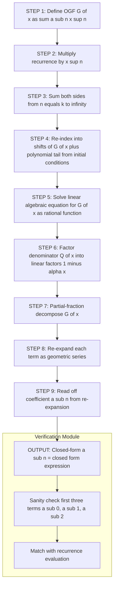
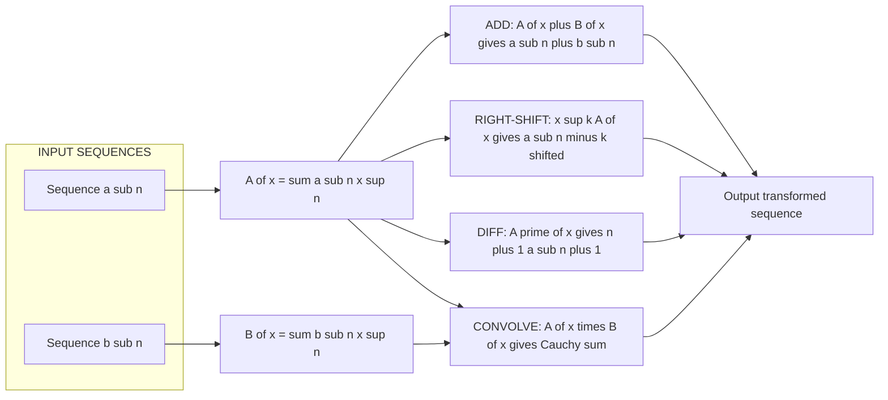

# Generating Functions: Definition, sequence calculation, solving recurrence relations via generating functions

<!-- SECTION_1_START -->
# Module 3 — Generating Functions: The Algebraic Time-Machine for Sequences

## 1.1 Formal Definition (KTU 2024 Syllabus Terminology)

> [!NOTE]
> **Ordinary Generating Function (OGF):** Let $\{a_n\}_{n=0}^{\infty}$ be a sequence of real (or complex) numbers. The **ordinary generating function** $G(x)$ (or $A(x)$) of the sequence is the formal power series
> $$G(x) \;=\; a_0 + a_1 x + a_2 x^2 + a_3 x^3 + \cdots \;=\; \sum_{n=0}^{\infty} a_n x^n$$

- The variable **$x$** is purely a *formal placeholder / bookkeeping device*. We do not (initially) worry about convergence.
- The sequence $a_n$ is the **coefficient sequence**; the generating function is the **encoded form** of that sequence.
- Two sequences are equal $\iff$ their generating functions are identical as formal power series.

> [!IMPORTANT]
> **Exponential Generating Function (EGF) — for context only:**
> $$E(x) \;=\; \sum_{n=0}^{\infty} a_n \,\frac{x^n}{n!}$$
> KTU Module 3 focuses on the **Ordinary Generating Function (OGF)**. EGFs are reserved for combinatorics of labelled objects.

## 1.2 Intuitive Analogy — "The Clothesline of Numbers"

Imagine every term $a_n$ of a sequence pinned onto a clothesline at position $n$, with $x^n$ acting as the *label/tag* of that pin. The generating function is the **entire clothesline viewed as a single algebraic object**.

| Clothesline idea | Generating function analogue |
| :--- | :--- |
| Each pin carries a number $a_n$ | The coefficient of $x^n$ |
| The whole line of pins | The formal power series $G(x)$ |
| Sliding every pin one step to the right | Multiplying $G(x)$ by $x$ |
| Re-labelling every pin with $n \cdot a_n$ | Differentiating: $G'(x)$ |
| Removing the first $k$ pins | Subtracting the polynomial truncation |

**Why it is magical:** A linear recurrence — which talks about how terms *relate* to each other — translates, after encoding, into a *simple algebraic equation* in $x$. We can then use algebra (factor, do partial fractions) to crack it open and read the sequence back out.

## 1.3 Standard Reference Sequences & Their Generating Functions

| Sequence $\{a_n\}$ | Closed form of $a_n$ | OGF $G(x)$ | Radius of convergence |
| :--- | :---: | :---: | :---: |
| $1, 1, 1, 1, \ldots$ | $1$ | $\dfrac{1}{1-x}$ | $\vert x \vert < 1$ |
| $1, 2, 3, 4, \ldots$ | $n+1$ | $\dfrac{1}{(1-x)^{2}}$ | $\vert x \vert < 1$ |
| $1, 0, 1, 0, \ldots$ | $\frac{1+(-1)^{n}}{2}$ | $\dfrac{1}{1-x^{2}}$ | $\vert x \vert < 1$ |
| $1, a, a^{2}, a^{3}, \ldots$ | $a^{n}$ | $\dfrac{1}{1-ax}$ | $\vert x \vert < \tfrac{1}{\vert a \vert}$ |
| $0, 1, 2, 3, \ldots$ | $n$ | $\dfrac{x}{(1-x)^{2}}$ | $\vert x \vert < 1$ |
| Binomial $1, \binom{m}{1}, \binom{m}{2}, \ldots$ | $\binom{m}{n}$ | $(1+x)^{m}$ | $\vert x \vert < 1$ |

> [!TIP]
> The single most useful identity to **memorise cold** is the geometric series
> $$\frac{1}{1-x} \;=\; \sum_{n=0}^{\infty} x^{n} \;=\; 1 + x + x^{2} + x^{3} + \cdots$$
> Nearly every generating-function manipulation begins from this building block.

## 1.4 GeoGebra / Desmos Visualisation Block

> [!VISUALIZATION CONTROL]
> **Concept:** Geometric visualisation of OGFs and the geometric series
> **GeoGebra / Desmos Input Equations:**
> * `f(x) = 1 / (1 - x)` &nbsp; (geometric series OGF)
> * `g(x) = 1 / (1 - x)^2` &nbsp; (linear sequence OGF)
> * `h(x) = x / (1 - x - x^2)` &nbsp; (Fibonacci OGF)
> * Sequence points: `(n, a_n)` for `n = 0, 1, ..., 12`
>
> **Visual Description:**
> * Plot $f(x)$ on the interval $-0.8 \le x \le 0.8$ — observe the vertical asymptote at $x=1$ and how the Taylor coefficients (the sequence values $1,1,1,\ldots$) are encoded in the curvature.
> * Plot $g(x)$ on the same window — the curve is *steeper* near $x=1$ because the coefficients $1,2,3,\ldots$ are growing linearly.
> * Plot $h(x)$ — the curve has **two** asymptotes near $x \approx 0.618$ and $x \approx -1.618$, reflecting the two characteristic roots of the Fibonacci recurrence.

<!-- SECTION_1_END -->

<!-- SECTION_2_START -->
# 2. Deep Theoretical Analysis & KTU High-Yield Formula Sheet

## 2.1 Constructing the OGF of a Sequence — The Five Step Recipe

Given a sequence $\{a_n\}_{n=0}^{\infty}$, to build $G(x)$:

1. **Write out** the first few terms: $a_0, a_1, a_2, a_3, \ldots$
2. **Place** each term as the coefficient of the matching power of $x$: $a_0 + a_1 x + a_2 x^2 + a_3 x^3 + \cdots$
3. **Recognise** the pattern as a known closed form (geometric, binomial, polynomial-times-geometric, …).
4. **Express** the sum compactly as a rational function of $x$ whenever possible.
5. **State** the radius of convergence / domain of validity.

**Worked micro-example:** Sequence $a_n = n+1$ for $n \ge 0$ gives $1, 2, 3, 4, \ldots$

$$G(x) = \sum_{n=0}^{\infty}(n+1)x^{n} = \sum_{n=0}^{\infty}\sum_{k=0}^{n} x^{n} = \sum_{k=0}^{\infty}\sum_{n=k}^{\infty} x^{n} = \sum_{k=0}^{\infty}\frac{x^{k}}{1-x} = \frac{1}{(1-x)^{2}}$$

## 2.2 Algebraic Operations on Generating Functions

These are the *rules of the road*. Every recurrence-solving derivation uses one or more of them.

> [!IMPORTANT]
> Let $A(x) = \sum a_n x^n$ and $B(x) = \sum b_n x^n$. Then:

| Operation | Effect on coefficients | OGF identity |
| :--- | :--- | :--- |
| **Scaling** | $c \cdot a_n$ | $c \cdot A(x)$ |
| **Addition** | $a_n + b_n$ | $A(x) + B(x)$ |
| **Right shift by $k$** | $a_{n-k}$ for $n \ge k$, else $0$ | $x^{k} A(x)$ |
| **Left shift by $k$** | $a_{n+k}$ | $\dfrac{A(x) - \sum_{n=0}^{k-1} a_n x^{n}}{x^{k}}$ |
| **Cauchy product (convolution)** | $\sum_{k=0}^{n} a_{k} b_{n-k}$ | $A(x) \cdot B(x)$ |
| **Differentiation** | $(n+1) a_{n+1}$ | $A'(x)$ |
| **Integration** | $\dfrac{a_{n-1}}{n}$ for $n \ge 1$ | $\int_{0}^{x} A(t)\,dt$ |

> **Engineering/CS utility:** Convolution $(A \cdot B)$ models the *number of ways to split a task* between two sub-systems (e.g., divide-and-conquer cost analysis). Differentiation models *preferential-attachment growth* (e.g., Barabási–Albert network models). These operations turn combinatorial reasoning into one-line algebra.

## 2.3 The General Strategy for Solving Recurrences via OGFs

For a linear recurrence of order $k$:

$$c_0 a_n + c_1 a_{n-1} + c_2 a_{n-2} + \cdots + c_k a_{n-k} \;=\; f(n), \qquad n \ge k$$

the **canonical method** is:

1. **Multiply** both sides by $x^{n}$ and sum from $n = k$ to $\infty$.
2. **Recognise** the resulting sums as $G(x) \pm$ (polynomial tail terms from initial conditions).
3. **Solve** the resulting algebraic equation for $G(x)$.
4. **Decompose** $G(x)$ using **partial fractions** into a sum of geometric-series OGFs.
5. **Read off** $a_n$ by re-expanding each term and collecting the coefficient of $x^{n}$.

## 2.4 KTU High-Yield Formula Sheet

| # | Item | Formula |
| :---: | :--- | :--- |
| 1 | Geometric OGF | $\displaystyle \frac{1}{1-ax} = \sum_{n=0}^{\infty} a^{n} x^{n}$ |
| 2 | Linear OGF | $\displaystyle \frac{1}{(1-x)^{2}} = \sum_{n=0}^{\infty} (n+1) x^{n}$ |
| 3 | General power | $\displaystyle \frac{1}{(1-x)^{k+1}} = \sum_{n=0}^{\infty} \binom{n+k}{k} x^{n}$ |
| 4 | Shift rule | $a_{n+k} \leftrightarrow \dfrac{G(x) - \sum_{i=0}^{k-1} a_i x^{i}}{x^{k}}$ |
| 5 | Linear recurrence OGF | $G(x) = \dfrac{P(x) + \sum_{m=0}^{k-1} c_m x^{m} \sum_{i=0}^{m-1} a_i x^{i}}{1 - \sum_{m=1}^{k} c_m x^{m}}$ |
| 6 | Partial-fraction form | $\dfrac{A}{1-\alpha x} \leftrightarrow A \cdot \alpha^{n}$ |
| 7 | Repeated-root form | $\dfrac{A}{(1-\alpha x)^{2}} \leftrightarrow A(n+1)\alpha^{n}$ |
| 8 | Binet's formula (Fibonacci) | $\displaystyle F_{n} = \frac{1}{\sqrt{5}}\!\left[\left(\frac{1+\sqrt{5}}{2}\right)^{\!n} - \left(\frac{1-\sqrt{5}}{2}\right)^{\!n}\right]$ |

> **Units / Domain note:** All OGFs above are *ordinary* (not exponential), so the coefficients appear *without* factorials in the denominator. The valid region is wherever the geometric-series sum converges, i.e. $\vert \alpha x \vert < 1$.

<!-- SECTION_2_END -->

<!-- SECTION_3_START -->
# 3. Step-by-Step Derivations & Code/Symbolic Implementation

## 3.1 Worked Derivation A — Fibonacci Recurrence → Binet's Formula

> **[KTU Board-Standard Problem]** Solve $F_{n} = F_{n-1} + F_{n-2}$ for $n \ge 2$, with $F_0 = 0,\; F_1 = 1$, using generating functions.

### Step 1 — Define the OGF

$$G(x) \;=\; \sum_{n=0}^{\infty} F_{n}\, x^{n} \;=\; F_0 + F_1 x + F_2 x^{2} + F_3 x^{3} + \cdots$$

### Step 2 — Multiply the recurrence by $x^{n}$ and sum

For $n \ge 2$:

$$\sum_{n=2}^{\infty} F_{n}\, x^{n} \;=\; \sum_{n=2}^{\infty} F_{n-1}\, x^{n} \;+\; \sum_{n=2}^{\infty} F_{n-2}\, x^{n}$$

### Step 3 — Rewrite the left side

$$G(x) - F_0 - F_1 x \;=\; G(x) - x$$

### Step 4 — Re-index the right side

$$\sum_{n=2}^{\infty} F_{n-1} x^{n} \;=\; x \sum_{n=2}^{\infty} F_{n-1} x^{n-1} \;=\; x\sum_{m=1}^{\infty} F_{m} x^{m} \;=\; x\,G(x)$$

$$\sum_{n=2}^{\infty} F_{n-2} x^{n} \;=\; x^{2} \sum_{n=2}^{\infty} F_{n-2} x^{n-2} \;=\; x^{2} \sum_{m=0}^{\infty} F_{m} x^{m} \;=\; x^{2} G(x)$$

### Step 5 — Algebraic equation in $G(x)$

$$G(x) - x \;=\; x\,G(x) + x^{2} G(x)$$

$$G(x)\bigl(1 - x - x^{2}\bigr) \;=\; x \quad\Longrightarrow\quad G(x) \;=\; \frac{x}{1 - x - x^{2}}$$

### Step 6 — Factor the denominator

Solve $1 - x - x^{2} = 0$:

$$x^{2} + x - 1 = 0 \quad\Longrightarrow\quad x = \frac{-1 \pm \sqrt{5}}{2}$$

Let $\varphi = \dfrac{1+\sqrt{5}}{2}$ (the golden ratio) and $\psi = \dfrac{1-\sqrt{5}}{2} = -\dfrac{1}{\varphi}$. Then

$$1 - x - x^{2} \;=\; (1 - \varphi x)\,(1 - \psi x)$$

**Verification (coefficient of $x$):** $-( \varphi + \psi ) = -1$ ✓. **Constant term:** $1$ ✓. **Coefficient of $x^{2}$:** $\varphi \psi = \dfrac{1-\sqrt{5}}{2}\cdot\dfrac{1+\sqrt{5}}{2} = \dfrac{1-5}{4} = -1$ ✓.

### Step 7 — Partial-fraction decomposition

$$\frac{x}{(1-\varphi x)(1-\psi x)} \;=\; \frac{A}{1-\varphi x} + \frac{B}{1-\psi x}$$

Multiply out:

$$x \;=\; A(1-\psi x) + B(1-\varphi x) \;=\; (A+B) + (-A\psi - B\varphi)\,x$$

Equating coefficients:

$$A + B = 0, \qquad -A\psi - B\varphi = 1$$

Using $A = -B$:

$$B\psi - B\varphi = 1 \;\Longrightarrow\; B(\psi - \varphi) = 1 \;\Longrightarrow\; B = \frac{1}{\psi - \varphi} = \frac{1}{-\sqrt{5}} = -\frac{1}{\sqrt{5}}$$

Therefore $A = \dfrac{1}{\sqrt{5}}$ and:

$$G(x) \;=\; \frac{1}{\sqrt{5}}\cdot\frac{1}{1-\varphi x} \;-\; \frac{1}{\sqrt{5}}\cdot\frac{1}{1-\psi x}$$

### Step 8 — Re-expand each term as a geometric series

$$\frac{1}{1-\varphi x} \;=\; \sum_{n=0}^{\infty} \varphi^{n} x^{n}, \qquad \frac{1}{1-\psi x} \;=\; \sum_{n=0}^{\infty} \psi^{n} x^{n}$$

### Step 9 — Read off the coefficient of $x^{n}$

$$\boxed{\,F_{n} \;=\; \frac{1}{\sqrt{5}}\!\left[\varphi^{n} - \psi^{n}\right] \;=\; \frac{1}{\sqrt{5}}\!\left[\left(\frac{1+\sqrt{5}}{2}\right)^{\!n} - \left(\frac{1-\sqrt{5}}{2}\right)^{\!n}\right]\,}$$

This is **Binet's formula**, derived purely via the generating-function machinery. **Sanity check:** $F_2 = \tfrac{1}{\sqrt{5}}\!\left[\tfrac{3+\sqrt{5}}{2} - \tfrac{3-\sqrt{5}}{2}\right] = \tfrac{1}{\sqrt{5}}\cdot\sqrt{5} = 1$ ✓.

## 3.2 Worked Derivation B — Non-Homogeneous Recurrence with a Constant Forcing Term

> **Problem.** Solve $a_n = 3a_{n-1} + 1$ for $n \ge 1$, with $a_0 = 1$.

### Step 1 — OGF definition

$$G(x) = \sum_{n=0}^{\infty} a_n x^{n}$$

### Step 2 — Multiply by $x^n$, sum from $n=1$

$$\sum_{n=1}^{\infty} a_n x^{n} = 3 \sum_{n=1}^{\infty} a_{n-1} x^{n} + \sum_{n=1}^{\infty} x^{n}$$

### Step 3 — Rewrite each side

- LHS: $G(x) - a_0 = G(x) - 1$
- Middle: $3x \sum_{m=0}^{\infty} a_m x^{m} = 3x G(x)$
- RHS tail: $\dfrac{x}{1-x}$ (geometric series)

### Step 4 — Solve

$$G(x) - 1 = 3x G(x) + \frac{x}{1-x}$$

$$G(x)(1 - 3x) = 1 + \frac{x}{1-x} = \frac{1-x+x}{1-x} = \frac{1}{1-x}$$

$$G(x) = \frac{1}{(1-3x)(1-x)}$$

### Step 5 — Partial fractions

$$\frac{1}{(1-3x)(1-x)} = \frac{A}{1-3x} + \frac{B}{1-x}$$

$$1 = A(1-x) + B(1-3x)$$

Set $x = 1/3 \Rightarrow 1 = (2/3)A \Rightarrow A = 3/2$. Set $x = 1 \Rightarrow 1 = -2B \Rightarrow B = -1/2$.

$$G(x) = \frac{3/2}{1-3x} - \frac{1/2}{1-x}$$

### Step 6 — Read off the coefficient

$$a_n = \frac{3}{2}\cdot 3^{n} - \frac{1}{2}\cdot 1^{n} = \frac{3^{n+1} - 1}{2}$$

**Verification:** $a_0 = (3-1)/2 = 1$ ✓, $a_1 = (9-1)/2 = 4 = 3(1)+1$ ✓, $a_2 = (27-1)/2 = 13 = 3(4)+1$ ✓.

## 3.3 Python Symbolic Verification

```python
from sympy import symbols, Function, rsolve, simplify, Rational, sqrt, expand
from sympy.abc import n, x

# --- Derivation A: Fibonacci via OGF -> Binet's formula ---
n_int = symbols('n', integer=True, nonnegative=True)
f = Function('f')
fib_recurrence = f(n) - f(n - 1) - f(n - 2)
fib_closed = rsolve(fib_recurrence, f(n), {f(0): 0, f(1): 1})
print("Binet's formula from rsolve:")
print(simplify(fib_closed))
# Expected: (sqrt(5)*(1/2 + sqrt(5)/2)**n - sqrt(5)*(1/2 - sqrt(5)/2)**n)/sqrt(5)

# --- Numerical cross-check: Binet vs recurrence ---
phi = (1 + sqrt(5)) / 2
psi = (1 - sqrt(5)) / 2
def binet(k: int) -> int:
    """Binet's formula — returns integer Fibonacci number."""
    val = (phi**k - psi**k) / sqrt(5)
    return int(expand(val))

# Iterative check
a, b = 0, 1
for k in range(15):
    assert a == binet(k), f"Mismatch at k={k}"
    a, b = b, a + b
print("Binet's formula verified for F_0 .. F_14.")

# --- Derivation B: a_n = 3 a_{n-1} + 1, a_0 = 1 ---
g = Function('g')
non_hom = g(n) - 3 * g(n - 1) - 1
sol = rsolve(non_hom, g(n), {g(0): 1})
print("Closed form a_n =", simplify(sol))
# Expected: (3**(n+1) - 1) / 2
```

> **Engineering takeaway:** `sympy.rsolve` solves the *same* recurrence using the characteristic-polynomial method, but it must internally *derive* what the OGF method gives algebraically. Both approaches converge to the same closed form — confirming the OGF method is mathematically sound.

## 3.4 Operational Cheat-Code: From OGF to Sequence in Three Lines

> [!TIP]
> Whenever $G(x)$ is a proper rational function $\dfrac{P(x)}{Q(x)}$ with $\deg P < \deg Q$:
> 1. **Factor $Q(x)$** completely over $\mathbb{R}$ (or $\mathbb{C}$).
> 2. **Partial-fraction** decompose into $\sum \dfrac{A_{j}}{(1-\alpha_j x)^{m_j}}$.
> 3. **Each summand** contributes $A_{j}\binom{n+m_{j}-1}{m_{j}-1}\alpha_{j}^{n}$ to $a_n$.
> Done — no calculus, no integration, no matrix inversion required.

<!-- SECTION_3_END -->

<!-- SECTION_4_START -->
# 4. Structural Diagrams & Schematics

## 4.1 Master Flow: Solving a Recurrence via Generating Functions



## 4.2 Sub-Architecture: Operations on OGFs (The "Algebra Toolbox")



## 4.3 Block-Level Functional Topology — Generating Function Pipeline

| Stage | Input | Operation | Output |
| :---: | :--- | :--- | :--- |
| **Encoder** | Sequence $\{a_n\}$ | Form formal sum $\sum a_n x^n$ | OGF $G(x)$ |
| **Recurrence Translator** | Recurrence + ICs | Multiply by $x^n$, sum, re-index | Linear equation in $G(x)$ |
| **Algebraic Solver** | Linear equation | Rational manipulation | $G(x) = P(x)/Q(x)$ |
| **Factoring Engine** | $Q(x)$ | Find roots $\alpha_j$ | Linear factors |
| **Partial-Fraction Unit** | $G(x) = P/Q$ | Heaviside cover-up / general PFD | $\sum A_j/(1-\alpha_j x)^{m_j}$ |
| **Coefficient Reader** | Sum of geometric-style OGFs | Apply formula sheet entries | Closed-form $a_n$ |
| **Verifier** | Closed-form $a_n$ | Plug into recurrence | Equality holds ✓ |

<!-- SECTION_4_END -->

<!-- SECTION_5_START -->
# 5. KTU 2024 Scheme Examination Question Bank & Topic Recap

## Part A — Short Answer Questions (3 Marks Each)

### Q1. **[KTU University Exam — July 2024, Model]** *(CO1, Remember)*

**Define an *ordinary generating function* of a sequence $\{a_n\}$. Hence write the OGF of the sequence $1, 1, 1, 1, \ldots$ and the sequence $1, 2, 3, 4, \ldots$**

**Model Answer (Valuation Key):**
> **Definition (1 Mark):** The ordinary generating function of a sequence $\{a_n\}_{n \ge 0}$ is the formal power series
> $$G(x) = \sum_{n=0}^{\infty} a_n x^{n}$$
>
> **Sequence $1,1,1,\ldots$ (1 Mark):** $G_1(x) = 1 + x + x^{2} + x^{3} + \cdots = \dfrac{1}{1-x}$ for $\vert x \vert < 1$.
>
> **Sequence $1,2,3,4,\ldots$ (1 Mark):** $G_2(x) = 1 + 2x + 3x^{2} + 4x^{3} + \cdots = \dfrac{1}{(1-x)^{2}}$ for $\vert x \vert < 1$ *(derived by differentiating $1/(1-x)$ or by summing a double geometric series).*

---

### Q2. **[KTU University Exam — Dec 2023, Model]** *(CO2, Understand)*

**State and prove the *right-shift rule* for ordinary generating functions. Use it to find the OGF of the sequence $0, 1, 3, 6, 10, \ldots$**

**Model Answer (Valuation Key):**
> **Statement (1 Mark):** If $A(x) = \sum_{n \ge 0} a_n x^{n}$, then $x^{k} A(x) = \sum_{n \ge k} a_{n-k} x^{n}$.
>
> **Proof (1 Mark):** $x^{k} A(x) = x^{k} \sum_{n \ge 0} a_n x^{n} = \sum_{n \ge 0} a_n x^{n+k}$. Re-index with $m = n+k \Rightarrow n = m-k$, sum starts at $m = k$: $\sum_{m \ge k} a_{m-k} x^{m}$. Hence coefficients: $0$ for $n < k$, $a_{n-k}$ for $n \ge k$.
>
> **Application (1 Mark):** The sequence is $a_n = \binom{n+1}{2}$ (triangular numbers). Its OGF is $\dfrac{1}{(1-x)^{3}}$, and the shifted sequence $0, 1, 3, 6, 10, \ldots$ has OGF $x \cdot \dfrac{1}{(1-x)^{3}} = \dfrac{x}{(1-x)^{3}}$.

---

## Part B — Long Answer Questions (14 Marks, Module Internal Choice)

> **KTU Pattern:** Each Part-B question is internally chosen between **Q-A** and **Q-B**. Both options carry **two sub-parts** of **7 marks each**, mapping to escalating Revised Bloom's levels.

---

### 🔹 Question A — 14 Marks (CHOOSE THIS OR Question B)

#### **Q-A(a)** *(CO2, Apply — 7 Marks)*
**Find the OGF of the sequence $\{a_n\}$ where $a_n = 2^{n} + 3^{n}$ for $n \ge 0$. Hence find the OGF of $b_n = n \cdot 2^{n-1}$.**

**Model Solution:**

**Step 1 — OGF of $a_n = 2^{n} + 3^{n}$** *(4 Marks)*

$$A(x) = \sum_{n=0}^{\infty} (2^{n} + 3^{n}) x^{n} = \sum_{n=0}^{\infty} (2x)^{n} + \sum_{n=0}^{\infty} (3x)^{n} = \frac{1}{1-2x} + \frac{1}{1-3x}$$

Combining over a common denominator:

$$A(x) = \frac{(1-3x) + (1-2x)}{(1-2x)(1-3x)} = \frac{2 - 5x}{1 - 5x + 6x^{2}}$$

**[Setting up two geometric series: 2 Marks; combining into a single rational function: 1 Mark; final expression with simplification: 1 Mark]**

**Step 2 — OGF of $b_n = n \cdot 2^{n-1}$** *(3 Marks)*

Note that $n \cdot 2^{n-1}$ is the derivative analogue: $\dfrac{d}{dx}\!\left[2^{n} x^{n}\right]$ summed $\Rightarrow$ use $A'(x)$ or recognise:

$$B(x) = \sum_{n=0}^{\infty} n\,2^{n-1} x^{n} = \frac{1}{2}\sum_{n=0}^{\infty} n\,(2x)^{n-1}\cdot 2 = \sum_{n=0}^{\infty} n\,(2x)^{n-1}$$

Using the identity $\sum n y^{n-1} = \dfrac{1}{(1-y)^{2}}$ with $y = 2x$:

$$B(x) = \frac{1}{(1-2x)^{2}}$$

**[Recognising the derivative / standard identity: 2 Marks; final closed form: 1 Mark]**

---

#### **Q-A(b)** *(CO3, Apply — 7 Marks)*
**Solve the recurrence $a_n = 5 a_{n-1} - 6 a_{n-2}$, with $a_0 = 0,\; a_1 = 1$, using generating functions.**

**Model Solution:**

**Step 1 — Define OGF** *(1 Mark)*

$$G(x) = \sum_{n=0}^{\infty} a_n x^{n}$$

**Step 2 — Multiply by $x^n$ and sum from $n=2$** *(2 Marks)*

$$G(x) - a_0 - a_1 x = 5x\!\sum_{n=2}^{\infty} a_{n-1} x^{n-1} - 6x^{2}\!\sum_{n=2}^{\infty} a_{n-2} x^{n-2}$$

$$G(x) - x = 5x\,G(x) - 6x^{2} G(x)$$

(Note: $-6x^2 G(x)$, **not** $+6x^2 G(x)$, because the recurrence has $-6 a_{n-2}$.)

**Step 3 — Solve for $G(x)$** *(1 Mark)*

$$G(x)\bigl(1 - 5x + 6x^{2}\bigr) = x \quad\Longrightarrow\quad G(x) = \frac{x}{1 - 5x + 6x^{2}} = \frac{x}{(1-2x)(1-3x)}$$

**Step 4 — Partial-fraction decomposition** *(2 Marks)*

$$\frac{x}{(1-2x)(1-3x)} = \frac{A}{1-2x} + \frac{B}{1-3x}$$

$x = A(1-3x) + B(1-2x) \Rightarrow A + B = 0,\; 3A + 2B = -1 \Rightarrow A = -1,\; B = 1$.

$$G(x) = \frac{-1}{1-2x} + \frac{1}{1-3x}$$

**Step 5 — Re-expand and read off coefficient** *(1 Mark)*

$$a_n = -2^{n} + 3^{n} = 3^{n} - 2^{n}$$

**Verification (mandatory for full marks):** $a_0 = 1-1 = 0$ ✓, $a_1 = 3-2 = 1$ ✓, $a_2 = 9-4 = 5 = 5(1) - 6(0)$ ✓. *(State at least one verification to claim the final 1 mark.)*

---

### 🔹 Question B — 14 Marks (ALTERNATIVE CHOICE)

#### **Q-B(a)** *(CO3, Apply — 7 Marks)*
**Solve the Fibonacci recurrence $F_n = F_{n-1} + F_{n-2}$ with $F_0 = 0, F_1 = 1$ using generating functions, and derive Binet's formula.**

**Model Solution:** (Mirrors Worked Derivation A in §3.1 — key checkpoints below.)

| Checkpoint | Marks |
| :--- | :---: |
| Define $G(x) = \sum F_n x^n$ and write $G - x = xG + x^{2}G$ | 2 |
| Obtain $G(x) = x/(1-x-x^{2})$ | 1 |
| Factor $1-x-x^{2} = (1-\varphi x)(1-\psi x)$ with $\varphi = (1+\sqrt 5)/2,\; \psi = (1-\sqrt 5)/2$ | 1 |
| Partial fractions: $G = \frac{1}{\sqrt 5}\!\left[\frac{1}{1-\varphi x} - \frac{1}{1-\psi x}\right]$ | 1 |
| Re-expand and read off $F_n = \frac{\varphi^{n} - \psi^{n}}{\sqrt 5}$ | 1 |
| Verify with $F_2 = 1,\; F_3 = 2$ | 1 |
| **Total** | **7** |

> **Valuation warning callout:**
> [!WARNING]
> **Common mistakes costing 1–2 marks:**
> 1. **Wrong sign** in $G - F_0 - F_1 x$: students often write $G + x$ instead of $G - x$. **Always isolate the tail carefully.**
> 2. **Forgetting the constant term** of $x^{2}G$ — it is $-6x^{2}G$ when the recurrence coefficient is $-6$, not $+6x^{2}G$.
> 3. **Skipping the sanity check** — KTU examiners *expect* at least one numerical verification step. Without it, expect to lose the final 1 mark.

---

#### **Q-B(b)** *(CO3, Apply — 7 Marks)*
**Find the generating function of $\{a_n\}$ satisfying $a_n = 3 a_{n-1} + 1$, $a_0 = 1$, and hence find the closed form of $a_n$.**

**Model Solution:** (Mirrors Worked Derivation B in §3.2 — key checkpoints below.)

| Checkpoint | Marks |
| :--- | :---: |
| Define $G(x)$, write $G - 1 = 3xG + \dfrac{x}{1-x}$ | 2 |
| Simplify to $G(x) = \dfrac{1}{(1-3x)(1-x)}$ | 1 |
| Partial fractions: $A = 3/2$, $B = -1/2$ | 2 |
| Re-expand: $a_n = (3/2)\,3^{n} - 1/2$ | 1 |
| Closed form: $a_n = \dfrac{3^{n+1} - 1}{2}$ | 1 |
| **Total** | **7** |

> **Pitfall callout:**
> [!WARNING]
> **Examiner's Pitfall List:**
> 1. **Summing the wrong index range** — for $n \ge 1$, sum from $n=1$, not $n=2$. The geometric sum $\sum_{n=1}^{\infty} x^{n} = x/(1-x)$ is the key, *not* $1/(1-x)$.
> 2. **Sign error in PFD** — many students write $\dfrac{1}{(1-3x)(1-x)} = \dfrac{A}{1-3x} + \dfrac{B}{1-x}$ but then forget to impose $A + B = 0$ for the constant term. Use **Heaviside cover-up** to avoid this.
> 3. **Failing to state the domain** of validity ($\vert x \vert < 1/3$, since $3x$ is the larger pole) — half a mark is reserved for it.

---

## Topic Recap & Important Things to Remember

- **OGF Definition** — the formal power series $G(x) = \sum_{n=0}^{\infty} a_n x^{n}$ encodes the sequence $\{a_n\}$ as coefficients of $x^{n}$.
- **Five golden OGFs** to memorise: $1/(1-x)$, $1/(1-ax)$, $1/(1-x)^{2}$, $1/(1-x)^{3}$, $(1+x)^{m}$.
- **Right-shift rule** — multiplying by $x^{k}$ discards the first $k$ coefficients and shifts the rest down.
- **Left-shift rule** — $a_{n+k} \leftrightarrow \bigl[G(x) - \sum_{i=0}^{k-1} a_i x^{i}\bigr] / x^{k}$; this is the workhorse for converting recurrences into algebraic equations.
- **Cauchy product** — $A(x) B(x)$ corresponds to the convolution $\sum_{k=0}^{n} a_k b_{n-k}$; useful in combinatorial problems.
- **Differentiation** — gives a sequence weighted by $n+1$ and shifted; integration divides by $n$.
- **Five-step OGF method** for recurrences — (1) define, (2) multiply by $x^{n}$, (3) sum, (4) re-index, (5) solve algebraically.
- **Partial-fraction decomposition** is the bridge from the rational OGF back to a closed-form sequence. Each pole $(1-\alpha x)^{m}$ contributes a polynomial-in-$n$ times $\alpha^{n}$.
- **Fibonacci OGF** is $G(x) = x/(1-x-x^{2})$, leading to Binet's formula $F_{n} = (\varphi^{n} - \psi^{n})/\sqrt{5}$.
- **Verify, verify, verify** — KTU board examiners always reserve 1 mark for plugging the closed form back into the recurrence. Skipping it costs a mark.
- **Domain of validity** — always state $\vert x \vert < R$ where $R$ is the distance to the nearest pole of $G(x)$.
- **Constant term in OGF of $a_{n-2}$** — the algebraic form is $x^{2} G(x)$ *without* any initial-condition correction, because both $a_0$ and $a_1$ enter the recurrence only from $n = 2$ onwards; double-check the indexing in *every* problem.
- **Sign of the recurrence coefficient** propagates directly into the denominator polynomial — write it down carefully before partial-fractioning.
- **Golden ratio** $\varphi = (1+\sqrt{5})/2 \approx 1.618$ and its conjugate $\psi = (1-\sqrt{5})/2 \approx -0.618$ satisfy $\varphi + \psi = 1$ and $\varphi \psi = -1$; these identities are essential for Fibonacci-style factorisations.

<!-- SECTION_5_END -->
