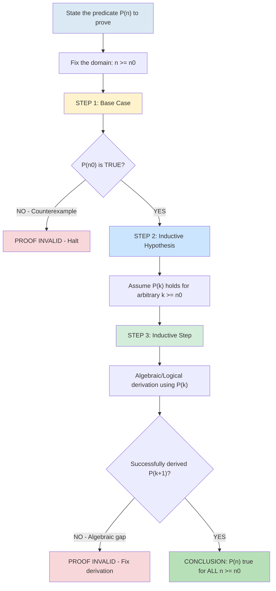
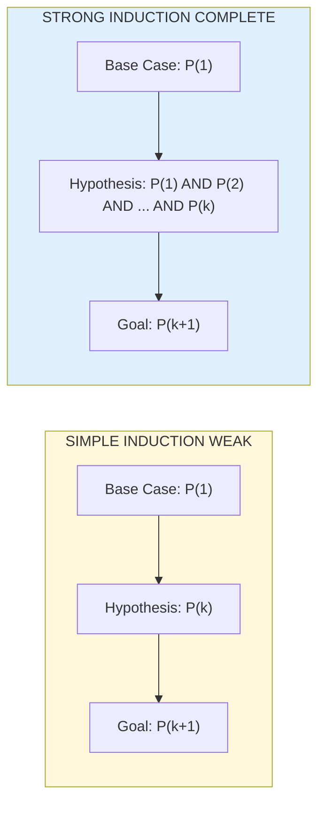
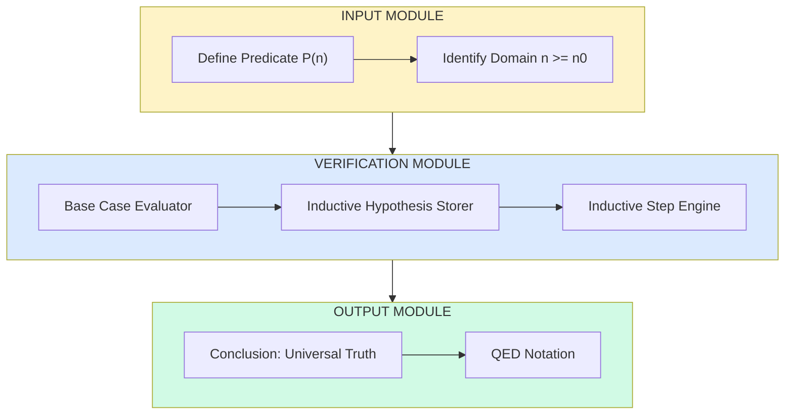
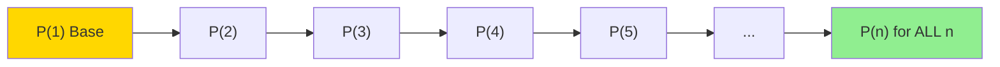

# Induction: Principle of Mathematical Induction, Strong Induction

<!-- SECTION_1_START -->
# 1. Core Technical Definition & Intuitive Overview

## 1.1 Principle of Mathematical Induction (PMI)

**Definition (KTU 2024 Syllabus Standard):**
The Principle of Mathematical Induction is a proof technique used to establish that a statement $P(n)$ is true for **every** positive integer $n \geq n_0$. It is an axiomatic foundation in Peano Arithmetic and forms the bedrock of all finite/infinite discrete mathematical proofs.

Formally, let $P(n)$ be a propositional function defined on the natural numbers $\mathbb{N}$. If:
1. $P(n_0)$ is true (**Base Case**), and
2. For every $k \geq n_0$, $P(k) \Rightarrow P(k+1)$ is true (**Inductive Step**),

then $P(n)$ is true for all integers $n \geq n_0$.

> [!IMPORTANT]
> **KTU 2024 Scheme High-Yield Note:** Mathematical Induction is a **deductive proof**, NOT an experimental verification. Testing $P(1), P(2), \ldots, P(1000)$ does **NOT** constitute a proof — induction is required.

---

## 1.2 Strong Induction (Complete Induction)

**Definition:**
Strong Induction is a variant of PMI in which the inductive hypothesis assumes that $P(j)$ is true for **all** integers $j$ in the range $n_0 \leq j \leq k$ (not just for $k$ alone), and then proves $P(k+1)$.

> [!NOTE]
> **Syllabus Highlight:** Strong induction is the natural choice when the truth of $P(k+1)$ depends on earlier values other than $P(k)$ (e.g., proving prime factorization, surjectivity of recursive functions, or solving certain recurrence relations).

---

## 1.3 Intuitive Real-World Analogies

> [!TIP]
> **Conceptual Analogy 1 — The Domino Cascade:**
> Imagine an infinite row of dominos standing on edge. If **(a)** the first domino falls, and **(b)** whenever any domino $k$ falls, it pushes domino $k+1$ down, then **every** domino in the infinite line will eventually fall. The base case is the first domino; the inductive step is the "push" relationship.

> [!TIP]
> **Conceptual Analogy 2 — Climbing a Ladder:**
> To prove you can reach **every** rung of a ladder: **(1)** Step on the bottom rung (Base Case). **(2)** Show that from any rung $k$ you are standing on, you can step up to rung $k+1$ (Inductive Step). You can then climb the entire ladder regardless of its height.

> [!TIP]
> **Conceptual Analogy 3 — Strong Induction (Climbing with Rope):**
> Suppose each rung $k+1$ is reachable only if **all** previous rungs $1, 2, \ldots, k$ are already occupied (e.g., you are tied to all previous rungs by a rope). You must assume the **entire history** of rungs to prove you can step to the next one.

---

## 1.4 Visual Intuition: Induction as a Recursive Function

> [!VISUALIZATION CONTROL]
> **Concept:** Recursive visualization of the induction trust chain
> **GeoGebra / Desmos Input Equations:**
> * `f(x) = 1`
> * Sequence: $a_1 = 1,\ a_n = a_{n-1} + 1$
> **Visual Description:** Plot a horizontal staircase starting at $(1, 1)$ with slope $1$ extending to the right. The arrow from each point $(k, k)$ to $(k+1, k+1)$ represents the inductive step — the proof's job is to mathematically justify that arrow.

---

## 1.5 KTU 2024 Module Mapping

| Aspect | Simple (Weak) Induction | Strong Induction |
| :--- | :--- | :--- |
| **Hypothesis Strength** | Only $P(k)$ assumed | All $P(n_0), \ldots, P(k)$ assumed |
| **Proof Power** | Sufficient for most polynomial sums | Required for non-sequential dependencies |
| **Logical Equivalence** | Equivalent to PMI in ZFC set theory | Equivalent to Simple Induction (well-ordering) |
| **Typical Use Case** | $\sum_{i=1}^{n} i = \frac{n(n+1)}{2}$ | Prime Factorization Theorem |
<!-- SECTION_1_END -->

<!-- SECTION_2_START -->
# 2. Deep Theoretical Analysis & KTU High-Yield Formula Sheet

## 2.1 Formal Axiomatic Framework

Mathematical Induction rests on the **Well-Ordering Principle** of the natural numbers. A set $S \subseteq \mathbb{N}$ has a least element. The PMI is a logical consequence:

$$
\text{Well-Ordering} \iff \text{Strong Induction} \iff \text{Simple Induction}
$$

The three steps of any induction proof are:

* **Step 1 — Base Case Verification:** Substitute $n = n_0$ (usually $1$ or $0$) and show $P(n_0)$ is logically true.
* **Step 2 — Inductive Hypothesis (IH):** *Assume* $P(k)$ holds for an arbitrary but fixed integer $k \geq n_0$. This is **not** something you prove — it is your temporary working assumption.
* **Step 3 — Inductive Conclusion:** Using the IH and standard algebraic/logical manipulations, derive $P(k+1)$. This must rigorously close the gap from $k$ to $k+1$.

> [!IMPORTANT]
> **Engineering Utility in CS:**
> 1. **Algorithm Correctness** — Loop invariants in iterative algorithms (Hoare Logic).
> 2. **Compiler Design** — Proving properties of recursive descent parsers.
> 3. **Data Structures** — Proving tree height = $\lfloor \log_2 n \rfloor + 1$ in balanced BSTs.
> 4. **Complexity Analysis** — Recurrence relations like $T(n) = 2T(n/2) + n$ are solved *and verified* by induction (Master Theorem applications).

---

## 2.2 Strong Induction — Expanded Logical Form

To prove $P(n)$ for all $n \geq n_0$ via strong induction:

* **Base Case(s):** Verify $P(n_0)$ (sometimes multiple base cases are needed).
* **Inductive Hypothesis:** Assume $P(j)$ is true for **every** integer $j$ with $n_0 \leq j \leq k$.
* **Inductive Step:** Show that this collective hypothesis implies $P(k+1)$.

> [!NOTE]
> **Why "Strong" Induction is not actually stronger logically:** In set theory with the well-ordering principle, simple and strong induction are **provably equivalent**. The name reflects only the strength of the *hypothesis assumed*, not the strength of the *conclusion reachable*. In practice, strong induction simplifies proofs where the result at $k+1$ requires multiple earlier terms.

---

## 2.3 KTU Formula Cheat Sheet

| Symbol / Term | Definition | KTU Use |
| :--- | :--- | :--- |
| $P(n)$ | Predicate over $n \in \mathbb{N}$ | The statement we wish to prove for all $n$ |
| $P(n_0)$ | Base case instantiation | First verification needed |
| $P(k) \Rightarrow P(k+1)$ | Implication in inductive step | The "engine" of the proof |
| $k$ | Arbitrary integer $\geq n_0$ | Universally quantified in IH |
| $n_0$ | Starting index (often $1$ or $2$) | Domain boundary |
| $\forall n \geq n_0,\ P(n)$ | Conclusion of induction | The proven universal statement |
| $\mathbb{N}$ | $\vert\{1, 2, 3, \ldots\}\vert$ or $\vert\{0, 1, 2, \ldots\}\vert$ | Domain of discourse |
| $\sum_{i=1}^{n} i$ | Triangular number $T_n$ | Classic PMI example |
| $\sum_{i=1}^{n} i^2$ | Square pyramidal number | Standard textbook PMI |
| $\sum_{i=1}^{n} i^3$ | Cubic sum $= \left(\frac{n(n+1)}{2}\right)^2$ | Verifiable by PMI |
| $n! \geq 2^{n-1}$ | Factorial lower bound | Useful in algorithm analysis |
| $F_{n+1} \cdot F_{n-1} - F_n^2 = (-1)^n$ | Cassini's Identity | Proved by strong induction |

> [!WARNING]
> **Common Pitfall:** A frequent KTU valuation error is to confuse the *Inductive Hypothesis* (assumption for $k$) with the *Inductive Conclusion* (what we prove for $k+1$). Always clearly mark both steps.

---

## 2.4 Where the "Why" Matters

The **Why** of induction lies in bridging the gap between *finite* algebraic verifications and *universal* (infinite) claims. A single line of algebra at step $k$ becomes, by repeated application, a chain that spans all of $\mathbb{N}$. The **How** is the creative heart of the proof — choosing the right algebraic manipulation, divisibility argument, or inequality bound to make the $k+1$ case fall out cleanly from the $k$ case.

> [!TIP]
> **Engineer's Intuition:** Think of $P(k) \Rightarrow P(k+1)$ as a *transfer function* $H(z)$ in signal processing. If the base case is the "input signal" and the inductive step is the "transfer function," then induction says: feed in the base, and the system propagates the truth to infinity.
<!-- SECTION_2_END -->

<!-- SECTION_3_START -->
# 3. Step-by-Step Derivations & Code/Symbolic Implementation

## 3.1 Worked Example 1: Sum of First $n$ Natural Numbers

**Claim:** For all $n \geq 1$,
$$
S(n) = 1 + 2 + 3 + \cdots + n = \frac{n(n+1)}{2}
$$

**Proof by Mathematical Induction:**

**Step 1 — Base Case ($n = 1$):**
$$
S(1) = 1
$$
$$
\text{RHS} = \frac{1 \cdot (1+1)}{2} = \frac{2}{2} = 1
$$
Since $\text{LHS} = \text{RHS}$, the base case holds. $\checkmark$

**Step 2 — Inductive Hypothesis (IH):**
Assume the formula holds for some arbitrary $k \geq 1$:
$$
1 + 2 + 3 + \cdots + k = \frac{k(k+1)}{2}
$$

**Step 3 — Inductive Step (Show for $k+1$):**
We must prove:
$$
1 + 2 + 3 + \cdots + k + (k+1) = \frac{(k+1)(k+2)}{2}
$$

Starting from the LHS:
$$
\begin{aligned}
1 + 2 + \cdots + k + (k+1) &= \frac{k(k+1)}{2} + (k+1) & \text{(by IH)} \\
&= (k+1) \left( \frac{k}{2} + 1 \right) & \text{(factor out } k+1) \\
&= (k+1) \cdot \frac{k + 2}{2} & \text{(common denominator)} \\
&= \frac{(k+1)(k+2)}{2} & \text{(RHS for } n = k+1)
\end{aligned}
$$

This is exactly the formula evaluated at $n = k+1$. $\checkmark$

**Conclusion:** By the Principle of Mathematical Induction, $S(n) = \frac{n(n+1)}{2}$ for all $n \geq 1$. $\blacksquare$

---

## 3.2 Worked Example 2: Divisibility by Induction

**Claim:** For all $n \geq 1$, $n^3 - n$ is divisible by $6$.

**Proof:**

**Base Case ($n = 1$):**
$$
1^3 - 1 = 0 = 6 \cdot 0 \quad \checkmark
$$

**Inductive Hypothesis:** Assume $k^3 - k = 6m$ for some integer $m$, i.e., $6 \mid k^3 - k$.

**Inductive Step:** Consider $(k+1)^3 - (k+1)$:
$$
\begin{aligned}
(k+1)^3 - (k+1) &= (k^3 + 3k^2 + 3k + 1) - (k + 1) \\
&= k^3 + 3k^2 + 3k + 1 - k - 1 \\
&= k^3 - k + 3k^2 + 3k \\
&= k^3 - k + 3k(k + 1) \\
&= 6m + 3k(k+1) & \text{(by IH)}
\end{aligned}
$$

Now, $k(k+1)$ is the product of two consecutive integers, so exactly one of them is even, hence $2 \mid k(k+1)$, and also $3 \mid k(k+1)$ (since among $k, k+1$ one is divisible by $3$ or both contribute). Therefore $6 \mid 3k(k+1)$, and so:
$$
(k+1)^3 - (k+1) = 6m + 3k(k+1) \equiv 0 \pmod{6} \quad \checkmark
$$

**Conclusion:** $6 \mid n^3 - n$ for all $n \geq 1$. $\blacksquare$

---

## 3.3 Worked Example 3: Strong Induction — Prime Factorization

**Claim:** Every integer $n \geq 2$ can be written as a product of one or more primes.

**Proof by Strong Induction:**

**Base Case ($n = 2$):** $2$ is itself prime, so it is a product of one prime. $\checkmark$

**Inductive Hypothesis:** Assume that every integer $j$ with $2 \leq j \leq k$ can be written as a product of primes.

**Inductive Step:** Consider $n = k+1$. We have two cases:

* **Case A:** $k+1$ is prime. Then it is a product of one prime (itself). $\checkmark$
* **Case B:** $k+1$ is composite. Then $k+1 = ab$ where $2 \leq a \leq b < k+1$. Since $2 \leq a \leq k$ and $2 \leq b \leq k$, both $a$ and $b$ admit prime factorizations by the strong IH:
$$
a = p_1 p_2 \cdots p_r, \quad b = q_1 q_2 \cdots q_s
$$
Then $k+1 = ab = p_1 \cdots p_r q_1 \cdots q_s$, a product of primes. $\checkmark$

**Conclusion:** By strong induction, every integer $n \geq 2$ is a product of primes. $\blacksquare$

---

## 3.4 Python Implementation: Algorithmic Verification

```python
from typing import List

def verify_induction_sum_of_natural_numbers(N: int = 100) -> bool:
    """
    Verifies the formula 1 + 2 + ... + n = n*(n+1)/2 for n in [1, N].
    This is a *numerical check*, NOT a proof. Proof is via PMI.
    """
    for n in range(1, N + 1):
        lhs: int = sum(range(1, n + 1))
        rhs: int = n * (n + 1) // 2
        if lhs != rhs:
            print(f"Counterexample found at n = {n}")
            return False
    print(f"Formula verified for all n in [1, {N}] (numerically).")
    return True


def verify_divisibility_n3_minus_n(N: int = 200) -> bool:
    """
    Verifies that 6 divides n^3 - n for n in [1, N].
    """
    for n in range(1, N + 1):
        if (n ** 3 - n) % 6 != 0:
            print(f"Counterexample at n = {n}")
            return False
    print(f"Divisibility 6 | (n^3 - n) verified for n in [1, {N}].")
    return True


def prime_factorization(n: int) -> List[int]:
    """
    Returns the list of prime factors of n (with multiplicity).
    Used to empirically verify the Strong Induction claim.
    """
    factors: List[int] = []
    d: int = 2
    while d * d <= n:
        while n % d == 0:
            factors.append(d)
            n //= d
        d += 1
    if n > 1:
        factors.append(n)
    return factors


def verify_prime_factorization(N: int = 1000) -> bool:
    """
    Verifies that every integer in [2, N] admits a prime factorization.
    """
    for n in range(2, N + 1):
        factors = prime_factorization(n)
        product: int = 1
        for f in factors:
            product *= f
        if product != n:
            print(f"Counterexample at n = {n}")
            return False
    print(f"Prime factorization verified for n in [2, {N}].")
    return True


if __name__ == "__main__":
    verify_induction_sum_of_natural_numbers(100)
    verify_divisibility_n3_minus_n(200)
    verify_prime_factorization(1000)
```

> [!IMPORTANT]
> **Code Output (Expected):**
> * `Formula verified for all n in [1, 100] (numerically).`
> * `Divisibility 6 | (n^3 - n) verified for n in [1, 200].`
> * `Prime factorization verified for n in [2, 1000].`
>
> **Cautionary Note:** The above Python check is purely a sanity test. KTU 2024 Examiners will **NOT** award marks for computational verification in lieu of a formal inductive proof.

---

## 3.5 Symbolic Verification Using SymPy (Optional Advanced)

```python
from sympy import symbols, summation, simplify, Eq

n, k = symbols('n k', integer=True, positive=True)

# Symbolic sum of first n integers
symbolic_sum: object = summation(i, (i, 1, n))
formula: object = n * (n + 1) / 2

print("Symbolic sum equals formula:",
      simplify(symbolic_sum - formula) == 0)
```

This symbolic manipulation complements the proof — but the actual proof in the exam paper must be the three-step PMI structure shown above.
<!-- SECTION_3_END -->

<!-- SECTION_4_START -->
# 4. Structural Diagrams & Schematics

## 4.1 Flowchart — The Three Steps of Mathematical Induction



---

## 4.2 Comparison — Simple vs. Strong Induction



---

## 4.3 Modular Architecture — Induction Proof Pipeline



---

## 4.4 Recursive Trust Chain — Visualizing the Induction Cascade



Each arrow $P(k) \Rightarrow P(k+1)$ is the inductive step, justified **once** in your proof. Once justified, the implication chain runs to infinity.
<!-- SECTION_4_END -->

<!-- SECTION_5_START -->
# 5. KTU 2024 Scheme Examination Question Bank & Topic Recap

## 5.1 Part A — Short Answer Questions (3 Marks Each)

### Question 1 [KTU University Exam — July 2023]
**Define the Principle of Mathematical Induction. List and briefly explain its three essential components.**

**Model Answer (Valuation Key):**
* **Definition [1 Mark]:** PMI is a proof technique to establish that a statement $P(n)$ holds for all integers $n \geq n_0$ by showing a base case and an inductive step.
* **Base Case [1 Mark]:** Verification that $P(n_0)$ is true for the smallest value in the domain.
* **Inductive Hypothesis [0.5 Mark]:** Assumption that $P(k)$ is true for some arbitrary integer $k \geq n_0$.
* **Inductive Step [0.5 Mark]:** Logical derivation that $P(k) \Rightarrow P(k+1)$.

### Question 2 [KTU University Exam — Dec 2023]
**Distinguish between Simple (Weak) Induction and Strong Induction with one example each.**

**Model Answer (Valuation Key):**
* **Simple Induction** assumes only $P(k)$ to prove $P(k+1)$. **Example [1 Mark]:** $1 + 2 + \cdots + n = \frac{n(n+1)}{2}$.
* **Strong Induction** assumes $P(n_0) \land P(n_0+1) \land \cdots \land P(k)$ to prove $P(k+1)$. **Example [2 Marks]:** Every integer $n \geq 2$ has a prime factorization (the proof at $k+1$ requires factors $a, b \leq k$).

---

## 5.2 Part B — Long Answer Questions (14 Marks, with Internal Choice)

### Question A (14 Marks) [KTU University Exam — June 2024]

#### Part (a) [7 Marks] — Understand / Apply
**State and explain the Principle of Mathematical Induction. Using it, prove that for all $n \geq 1$, the sum of the first $n$ natural numbers equals $\frac{n(n+1)}{2}$.**

**Model Solution:**

**Statement [2 Marks]:** Let $P(n)$ be a statement defined for $n \in \mathbb{N}$. If $P(1)$ is true, and if $P(k)$ true implies $P(k+1)$ true for all $k \geq 1$, then $P(n)$ is true for all $n \geq 1$.

**Proof [5 Marks]:**

* **Base Case [1 Mark]:** For $n = 1$: $\text{LHS} = 1$, $\text{RHS} = \frac{1 \cdot 2}{2} = 1$. Holds.
* **Inductive Hypothesis [1 Mark]:** Assume $1 + 2 + \cdots + k = \frac{k(k+1)}{2}$.
* **Inductive Step [3 Marks]:**
$$
\begin{aligned}
1 + 2 + \cdots + k + (k+1) &= \frac{k(k+1)}{2} + (k+1) \\
&= (k+1) \left( \frac{k}{2} + 1 \right) \\
&= (k+1) \cdot \frac{k+2}{2} = \frac{(k+1)(k+2)}{2}
\end{aligned}
$$
* **Conclusion [1 Mark] (Valuation Marker):** By PMI, the result holds for all $n \geq 1$. $\blacksquare$

#### Part (b) [7 Marks] — Apply
**Using mathematical induction, prove that for all $n \geq 1$,**
$$
1^2 + 2^2 + 3^2 + \cdots + n^2 = \frac{n(n+1)(2n+1)}{6}
$$

**Model Solution:**

* **Base Case [1 Mark]:** $n = 1$: $\text{LHS} = 1$, $\text{RHS} = \frac{1 \cdot 2 \cdot 3}{6} = 1$. Holds.
* **Inductive Hypothesis [1 Mark]:** Assume $\sum_{i=1}^{k} i^2 = \frac{k(k+1)(2k+1)}{6}$.
* **Inductive Step [4 Marks]:**
$$
\begin{aligned}
\sum_{i=1}^{k+1} i^2 &= \frac{k(k+1)(2k+1)}{6} + (k+1)^2 \\
&= \frac{k(k+1)(2k+1) + 6(k+1)^2}{6} \\
&= \frac{(k+1) \left[ k(2k+1) + 6(k+1) \right]}{6} \\
&= \frac{(k+1)(2k^2 + k + 6k + 6)}{6} \\
&= \frac{(k+1)(2k^2 + 7k + 6)}{6} \\
&= \frac{(k+1)(k+2)(2k+3)}{6}
\end{aligned}
$$
This matches the formula with $n = k+1$: $\frac{(k+1)(k+2)(2(k+1)+1)}{6} = \frac{(k+1)(k+2)(2k+3)}{6}$. $\checkmark$

* **Conclusion [1 Mark] (Valuation Marker):** By PMI, the result holds for all $n \geq 1$. $\blacksquare$

---

### Question B (14 Marks) [KTU University Exam — Dec 2024]

#### Part (a) [7 Marks] — Understand
**State and explain the principle of strong induction. Give an example where simple induction fails but strong induction succeeds.**

**Model Solution:**

* **Statement [3 Marks]:** Let $P(n)$ be a statement on $n \in \mathbb{N}$. If $P(1)$ is true, and if the truth of $P(1), P(2), \ldots, P(k)$ together implies $P(k+1)$, then $P(n)$ is true for all $n \geq 1$.
* **Comparison with Simple Induction [1 Mark]:** Simple induction uses only $P(k)$; strong induction uses the full history $P(1), \ldots, P(k)$.
* **Example where Strong Induction is Required [3 Marks]:**
  * *Prime Factorization:* To prove $n = k+1$ is a product of primes, we may need to write $k+1 = ab$ where $a, b \leq k$. Each of $a$ and $b$ needs the inductive hypothesis independently. Hence the hypothesis must include **all** values up to $k$.

#### Part (b) [7 Marks] — Apply
**Using strong induction, prove that every integer $n \geq 2$ can be expressed as a product of one or more prime numbers.**

**Model Solution:**

* **Base Case [1 Mark]:** $n = 2$ is prime, hence a product of one prime. Holds.
* **Inductive Hypothesis [1 Mark]:** Assume every integer $j$ with $2 \leq j \leq k$ is expressible as a product of primes.
* **Inductive Step [4 Marks]:**
  * **Case 1:** $k+1$ is prime. Then it is trivially a product of primes (itself).
  * **Case 2:** $k+1$ is composite. Then $k+1 = a \cdot b$ with $2 \leq a \leq b \leq k$. By IH, $a = p_1 \cdots p_r$ and $b = q_1 \cdots q_s$ are products of primes. Hence $k+1 = p_1 \cdots p_r \cdot q_1 \cdots q_s$ is a product of primes.
* **Conclusion [1 Mark] (Valuation Marker):** By strong induction, every integer $n \geq 2$ has a prime factorization. $\blacksquare$

---

## 5.3 KTU Examiner's Valuation Warning / Pitfall Callout

> [!WARNING]
> **Common Mark-Loss Zones (KTU 2024):**
> 1. **Skipping the base case:** A full mark deduction (typically 1–2 marks) if $P(1)$ verification is omitted.
> 2. **Confusing the IH with the conclusion:** Students often write "Therefore $P(k)$ is true" when they should write "Therefore $P(k+1)$ is true." Examiners flag this — it indicates logical confusion.
> 3. **Using $n$ instead of $k$ in the IH:** Always use an arbitrary but fixed variable like $k$. Writing "Assume $P(n)$ is true" inside a proof *for all $n$* is a quantifier error worth 1 mark.
> 4. **Forgetting to explicitly state the conclusion:** End with "By PMI, $P(n)$ is true for all $n \geq n_0$." Examiners allocate 1 mark for this closing line.
> 5. **Applying simple induction when the problem needs strong induction:** For "every $n \geq 2$ is a product of primes," using only $P(k)$ is insufficient — full 7 marks may be lost on part (b).
> 6. **Mixing up base cases for strong induction:** Some problems (e.g., Fibonacci) require two base cases. Always verify the problem's recurrence boundary.

---

## 5.4 Topic Recap & Important Things to Remember

> [!IMPORTANT]
> **Rapid Revision Checklist — Induction: PMI & Strong Induction**

* **PMI requires three parts:** Base Case, Inductive Hypothesis, Inductive Step. Missing any one = invalid proof.
* **Default starting index:** $n_0 = 1$ unless the problem specifies $n \geq 0$ or $n \geq 2$.
* **Strong Induction is NOT logically stronger** — it is equivalent to simple induction via the Well-Ordering Principle. The "strength" refers to the hypothesis assumed, not the conclusion.
* **Choose Strong Induction when:** $P(k+1)$ requires truth of two or more earlier cases (e.g., $P(k)$ and $P(k-1)$).
* **Canonical sums proved by PMI:** $\sum i = \frac{n(n+1)}{2}$, $\sum i^2 = \frac{n(n+1)(2n+1)}{6}$, $\sum i^3 = \left(\frac{n(n+1)}{2}\right)^2$.
* **Canonical divisibility results:** $6 \mid n^3 - n$, $2 \mid n^2 + n$, $3 \mid n^3 + 2n$, $24 \mid n^4 - n^2$ for $n \geq 1$.
* **Canonical strong induction examples:** Prime Factorization Theorem, Every $n > 1$ has a prime divisor, post-stamp / coin problems.
* **Always explicitly conclude:** "By the Principle of Mathematical Induction [or Strong Induction], $P(n)$ is true for all $n \geq n_0$. Hence proved."
* **Q.E.D. symbol** ($\blacksquare$ or $\square$) signals the end of a formal proof — include it for full presentation marks.
* **Induction $\neq$ experimentation:** A computer check for $n = 1$ to $10^6$ is **not** a mathematical proof.
* **Be careful with quantifiers:** The IH is a *single* assumption about an arbitrary $k$, not a *quantified* statement.
* **Common valuation pattern (KTU 2024):** Base Case (1M) + IH statement (1M) + Step algebra (3–4M) + Conclusion (1M) for 7-mark sub-questions.
* **Domain of $k$:** $k$ must be a generic integer $\geq n_0$, never a specific number like $2$ or $5$.
* **Engineering payoff:** Induction is the formal tool behind proving loop correctness, recursion termination, and recurrence relation solutions — all core to algorithms and data structures.
<!-- SECTION_5_END -->
