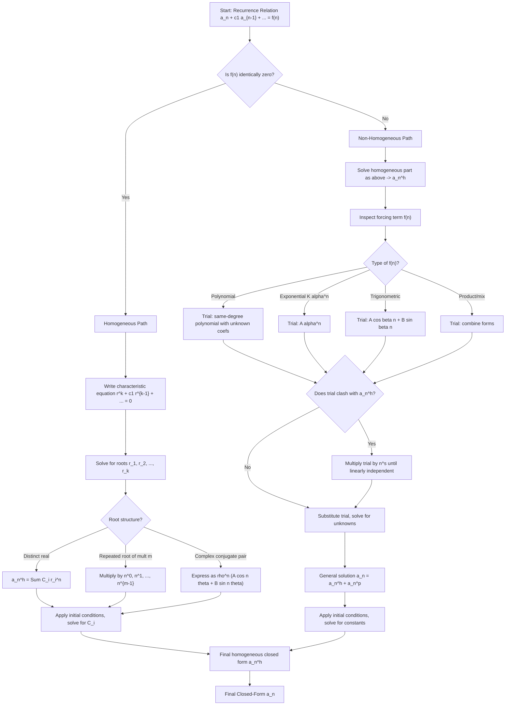
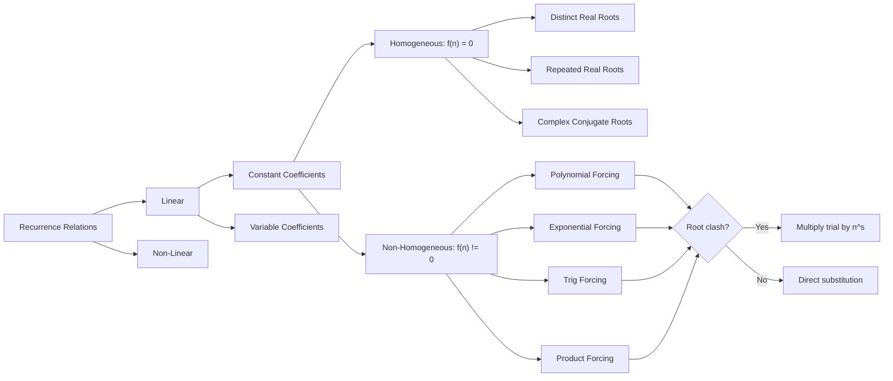

# Recurrence Relations: Formulating and solving linear homogeneous and non-homogeneous recurrences with constant coefficients

<!-- SECTION_1_START -->
# Recurrence Relations: The Engine of Sequential Computation

## 1.1 Formal Academic Definition (KTU 2024 Syllabus Standard)

> [!NOTE]
> **Definition (Recurrence Relation):** A *recurrence relation* is an equation that defines each term of a sequence $a_n$ as a function of one or more of its preceding terms $a_{n-1}, a_{n-2}, \ldots, a_{n-k}$, along with one or more *initial conditions* (boundary values) that uniquely determine the sequence. The smallest $k$ such that $a_n$ depends on $a_{n-k}$ is called the **order** of the recurrence.

A recurrence is called **linear** when $a_n$ appears to the first power only, and **with constant coefficients** when the multipliers of $a_{n-i}$ are fixed numbers (not functions of $n$).

$$a_n + c_1 a_{n-1} + c_2 a_{n-2} + \cdots + c_k a_{n-k} = f(n)$$

* If $f(n) = 0$ for all $n$, the relation is **homogeneous**.
* If $f(n) \neq 0$ for some $n$, the relation is **non-homogeneous**, and $f(n)$ is the **forcing term**.

> [!IMPORTANT]
> **KTU Board Vocabulary:** You will see examiners write "solve the recurrence" — this always means **find a closed-form expression for $a_n$**, *not* just list the first few values. Always give your answer as an explicit formula in terms of $n$ (e.g. $a_n = 2^n - 1$).

## 1.2 Intuitive Analogy — "The Staircase of Memory"

Imagine you are climbing a staircase where **the height of every step depends on the heights of the previous two steps**. If you know the first two step heights (the *initial conditions*), you can compute the third, then the fourth, and so on — forever. A recurrence relation is exactly that staircase: a rule that propagates information forward from a small seed of known values.

* **The recurrence** = the rule telling you how each new step relates to old steps.
* **The initial conditions** = the "ground level" that fixes the entire staircase in place. Without them, the recurrence has infinitely many solutions (the staircase is free to slide up or down).

## 1.3 Real-World Anchors

| Domain | Concrete Recurrence |
|---|---|
| **Biology** | Rabbit population (Fibonacci): $F_n = F_{n-1} + F_{n-2}$ |
| **Finance** | Compound interest: $A_n = (1+r) A_{n-1}$ |
| **Algorithms** | Merge-Sort cost: $T(n) = 2T(n/2) + n$ |
| **Physics** | Damped harmonic oscillator: $y_{n+1} - 2r y_n + y_{n-1} = 0$ |
| **Combinatorics** | Number of $n$-bit strings with no consecutive 0's |

## 1.4 Visualising the Structure

> [!VISUALIZATION CONTROL]
> **Concept:** Sequential dependency graph of a second-order linear recurrence.
> **GeoGebra / Desmos Input:**
> * Points: $A_0 = (0, 5)$, $A_1 = (1, 3)$, $A_2 = (2, 11)$, $A_3 = (3, 23)$
> * Recurrence drawn: $A_n = 2A_{n-1} + A_{n-2}$
> **Visual Description:** Plot the points $(n, a_n)$ for $n = 0, 1, 2, \ldots$ on the Cartesian plane. The student should observe a **growing curve** whose shape mirrors the closed-form $a_n = c_1 (1+\sqrt{2})^n + c_2 (1-\sqrt{2})^n$. The largest root of the characteristic equation dominates long-term behaviour — this is why characteristic roots are central to the theory.

<!-- SECTION_1_END -->

<!-- SECTION_2_START -->
# Deep Theoretical Analysis & KTU Formula Sheet

## 2.1 The Two Universal Cases

A *linear recurrence with constant coefficients* has the canonical form

$$a_n + c_1 a_{n-1} + c_2 a_{n-2} + \cdots + c_k a_{n-k} = f(n) \quad (n \geq k)$$

The plan of attack splits cleanly into the homogeneous part (RHS = 0) and the non-homogeneous part.

### Case A — Homogeneous Recurrence ($f(n) \equiv 0$)

> [!IMPORTANT]
> **The Superposition Principle:** If $a_n^{(1)}$ and $a_n^{(2)}$ are two solutions of a *linear* homogeneous recurrence, then every linear combination $C_1 a_n^{(1)} + C_2 a_n^{(2)}$ is also a solution. This is the bedrock that lets us build a *general* solution from independent *particular* solutions.

**Step 1 — Build the characteristic equation.** Substitute a trial solution of the form $a_n = r^n$:

$$r^n + c_1 r^{n-1} + c_2 r^{n-2} + \cdots + c_k r^{n-k} = 0$$

Dividing by $r^{n-k}$ (assuming $r \neq 0$):

$$r^k + c_1 r^{k-1} + c_2 r^{k-2} + \cdots + c_k = 0$$

This is the **characteristic equation** of the recurrence.

**Step 2 — Solve the characteristic equation.** Let the roots be $r_1, r_2, \ldots, r_k$.

* **Distinct real roots** $\Rightarrow$ General solution:
$$a_n^{(h)} = C_1 r_1^{n} + C_2 r_2^{n} + \cdots + C_k r_k^{n}$$

* **Repeated real root $r$ of multiplicity $m$** $\Rightarrow$ Solution set gains multipliers of polynomial factors:
$$a_n^{(h)} = (C_1 + C_2 n + C_3 n^2 + \cdots + C_m n^{m-1}) r^{n}$$

* **Complex conjugate pair $r = \rho e^{\pm i\theta}$** $\Rightarrow$ Rewrite in real form:
$$a_n^{(h)} = \rho^{n}\left(A \cos n\theta + B \sin n\theta\right)$$

**Step 3 — Apply initial conditions** to determine the constants $C_1, C_2, \ldots, C_k$.

### Case B — Non-Homogeneous Recurrence ($f(n) \neq 0$)

The general solution is **always** the sum of two pieces:

$$a_n = a_n^{(h)} + a_n^{(p)}$$

where $a_n^{(h)}$ is the general solution of the *associated homogeneous* recurrence and $a_n^{(p)}$ is **any** particular solution of the full recurrence.

**Method of Undetermined Coefficients (Annihilator / Guesswork).** Choose $a_n^{(p)}$ in the same *family* as $f(n)$:

| Forcing term $f(n)$ | Trial particular solution $a_n^{(p)}$ |
|---|---|
| Constant $K$ | $A$ (constant) |
| Polynomial $p_d(n)$ of degree $d$ | Polynomial $q_d(n)$ of degree $d$ with unknown coefficients |
| Exponential $K \alpha^{n}$ | $A \alpha^{n}$ |
| $K n^{s} \alpha^{n}$ | $\alpha^{n}(A_0 + A_1 n + \cdots + A_s n^{s})$ |
| Trigonometric $K \cos(\beta n)$ or $K \sin(\beta n)$ | $A \cos(\beta n) + B \sin(\beta n)$ |

> [!WARNING]
> **Doubleroot Conflict:** If your trial $a_n^{(p)}$ is already part of the homogeneous solution (i.e. the same $\alpha$ is a root of the characteristic equation), you must **multiply the trial by $n$**, and if still conflicting by $n^2$, and so on, until it is linearly independent from $a_n^{(h)}$.

## 2.2 KTU High-Yield Formula Cheat Sheet

| # | Concept | Formula / Rule | Notes |
|---|---|---|---|
| 1 | Order of recurrence | Smallest $k$ with $a_{n-k}$ appearing | Equals degree of characteristic poly. |
| 2 | Characteristic equation | $r^k + c_1 r^{k-1} + \cdots + c_k = 0$ | For $a_n = -c_1 a_{n-1} - c_2 a_{n-2} - \cdots$ |
| 3 | Distinct real roots | $a_n = \sum C_i r_i^{n}$ | $i = 1 \ldots k$ |
| 4 | Repeated root multiplicity $m$ | Multiply by $1, n, n^2, \ldots, n^{m-1}$ | Gives $m$ independent solutions |
| 5 | Complex roots $r = \rho(\cos\theta \pm i \sin\theta)$ | $\rho^{n}(A \cos n\theta + B \sin n\theta)$ | $\theta = \arg(r)$ |
| 6 | General non-homogeneous solution | $a_n = a_n^{(h)} + a_n^{(p)}$ | $a_n^{(p)}$ matches shape of $f(n)$ |
| 7 | Doubleroot fix | Multiply trial $a_n^{(p)}$ by $n^{s}$ until $s = $ multiplicity of conflict | KTU favourite trap question |
| 8 | Number of initial conditions | Equals order $k$ | Otherwise the sequence is not uniquely defined |
| 9 | Fibonacci closed form | $F_n = \frac{1}{\sqrt{5}}\left(\varphi^{n} - \psi^{n}\right)$ | $\varphi = \frac{1+\sqrt{5}}{2}$, $\psi = \frac{1-\sqrt{5}}{2}$ |
| 10 | First-order linear: $a_n = r a_{n-1} + b$ | $a_n = r^{n} a_0 + b\,\frac{r^{n}-1}{r-1}$ | Geometric-arithmetic blend |

> [!NOTE]
> **KTU Examiner Tip:** When asked to "solve", examiners award 1 mark for the characteristic equation, 2 marks for its roots, 2 marks for the homogeneous solution, 2 marks for the particular solution, 2 marks for the constants from initial conditions, and the final mark for the closed-form simplification. Memorise this valuation skeleton.

## 2.3 Engineering & CS Utility

* **Algorithm analysis (Divide & Conquer):** Master Theorem and Akra–Bazzi are both derived from solving non-homogeneous recurrences of the form $T(n) = aT(n/b) + f(n)$.
* **Digital signal processing:** IIR filters are literally linear recurrences; their *stability* hinges on every characteristic root satisfying $\vert r_i \vert < 1$.
* **Numerical ODEs:** Euler, Runge–Kutta and multistep methods all generate recurrences whose characteristic roots predict stability and accuracy.
* **Cryptography:** LFSR (Linear Feedback Shift Registers) use homogeneous recurrences over $\text{GF}(2)$ — the period equals the order of the dominant root modulo the prime.

<!-- SECTION_2_END -->

<!-- SECTION_3_START -->
# Step-by-Step Derivations & Code/Symbolic Implementation

## 3.1 Worked Example 1 — Distinct Real Roots (Homogeneous)

**Problem.** Solve $a_n = 5 a_{n-1} - 6 a_{n-2}$ with $a_0 = 1$, $a_1 = 4$.

**Solution.**

Rewrite the recurrence in canonical homogeneous form:

$$a_n - 5 a_{n-1} + 6 a_{n-2} = 0$$

**Step 1 — Characteristic equation.** Substitute $a_n = r^{n}$:

$$
\begin{aligned}
r^{n} - 5 r^{n-1} + 6 r^{n-2} &= 0 \\
r^{n-2}\left(r^{2} - 5 r + 6\right) &= 0 \\
r^{2} - 5 r + 6 &= 0
\end{aligned}
$$

**Step 2 — Roots.** Factor: $(r-2)(r-3) = 0$, so $r_1 = 2$, $r_2 = 3$.

**Step 3 — Homogeneous solution.**

$$a_n^{(h)} = C_1 \cdot 2^{n} + C_2 \cdot 3^{n}$$

**Step 4 — Use initial conditions.**

For $n = 0$: $C_1 + C_2 = 1$ — Equation (i)

For $n = 1$: $2 C_1 + 3 C_2 = 4$ — Equation (ii)

Solve:

$$
\begin{aligned}
2C_1 + 3C_2 &= 4 \\
2C_1 + 2C_2 &= 2 \quad \text{(multiply (i) by 2 and subtract)} \\
\hline
C_2 &= 2 \\
C_1 &= 1 - C_2 = -1
\end{aligned}
$$

**Step 5 — Closed-form answer.**

$$\boxed{a_n = -2^{n} + 2 \cdot 3^{n}}$$

**Verification (KTU style):** $a_2 = 5(4) - 6(1) = 14$. From formula: $-4 + 2(9) = -4 + 18 = 14$. ✓

> [!NOTE]
> **Valuation Break-up:** [Characteristic equation: 1 Mark] [Roots: 2 Marks] [General solution: 2 Marks] [Solving constants: 3 Marks] [Final answer: 1 Mark] [Verification: 1 Mark bonus if shown].

## 3.2 Worked Example 2 — Repeated Root (Homogeneous)

**Problem.** Solve $a_n = 4 a_{n-1} - 4 a_{n-2}$ with $a_0 = 0$, $a_1 = 1$.

**Solution.**

Characteristic equation: $r^{2} - 4 r + 4 = (r-2)^{2} = 0 \Rightarrow r = 2$ (double root).

General solution with the $n$-multiplier:

$$a_n^{(h)} = (C_1 + C_2 n) \cdot 2^{n}$$

Apply $a_0 = 0$: $C_1 = 0$. Apply $a_1 = 1$: $(0 + C_2) \cdot 2 = 1 \Rightarrow C_2 = \tfrac{1}{2}$.

$$\boxed{a_n = n \cdot 2^{n-1}}$$

> [!IMPORTANT]
> **Why the $n$ factor?** The two independent solutions of $(r-2)^2 = 0$ are $2^{n}$ and $n \cdot 2^{n}$. You can verify the second: substitute $a_n = n 2^{n}$ into the recurrence — LHS = $n 2^{n}$, RHS = $4(n-1)2^{n-1} - 4(n-2)2^{n-2} = (n-1)2^{n+1} - (n-2)2^{n} = n 2^{n}$. ✓

## 3.3 Worked Example 3 — Non-Homogeneous (Polynomial Forcing)

**Problem.** Solve $a_n = 3 a_{n-1} + 2 n$ with $a_0 = 5$.

**Solution.**

Rewrite: $a_n - 3 a_{n-1} = 2n$. Order 1, $f(n) = 2n$.

**Step 1 — Homogeneous part.** $a_n^{(h)} = C \cdot 3^{n}$.

**Step 2 — Particular part.** Forcing term is a degree-1 polynomial, so try $a_n^{(p)} = An + B$.

Substitute into the recurrence:

$$
\begin{aligned}
An + B - 3\big(A(n-1) + B\big) &= 2n \\
An + B - 3An + 3A - 3B &= 2n \\
-2An + (3A - 2B) &= 2n
\end{aligned}
$$

Match coefficients:
* Coefficient of $n$: $-2A = 2 \Rightarrow A = -1$.
* Constant: $3A - 2B = 0 \Rightarrow -3 - 2B = 0 \Rightarrow B = -\tfrac{3}{2}$.

So $a_n^{(p)} = -n - \tfrac{3}{2}$.

**Step 3 — Combine.**

$$a_n = C \cdot 3^{n} - n - \tfrac{3}{2}$$

Apply $a_0 = 5$: $C - 0 - \tfrac{3}{2} = 5 \Rightarrow C = \tfrac{13}{2}$.

$$\boxed{a_n = \tfrac{13}{2} \cdot 3^{n} - n - \tfrac{3}{2}}$$

## 3.4 Worked Example 4 — Non-Homogeneous (Exponential Forcing) + Doubleroot Fix

**Problem.** Solve $a_n = 4 a_{n-1} - 3 a_{n-2} + 2^{n}$ with $a_0 = 0$, $a_1 = 1$.

**Step 1 — Homogeneous characteristic equation:**

$$r^{2} - 4 r + 3 = 0 \Rightarrow (r-1)(r-3) = 0 \Rightarrow r = 1,\ 3$$

$$a_n^{(h)} = C_1 + C_2 \cdot 3^{n}$$

**Step 2 — Particular solution.** Forcing term is $2^{n}$. Try $a_n^{(p)} = A \cdot 2^{n}$.

> [!WARNING]
> **Check for conflict:** Is $2$ a root of the characteristic polynomial? No ($1$ and $3$ only). So no $n$-multiplier is needed — proceed with the simple trial.

Substitute:

$$
\begin{aligned}
A \cdot 2^{n} - 4 A \cdot 2^{n-1} + 3 A \cdot 2^{n-2} &= 2^{n} \\
A \cdot 2^{n} - 2 A \cdot 2^{n} + \tfrac{3A}{4} \cdot 2^{n} &= 2^{n} \\
A \left(1 - 2 + \tfrac{3}{4}\right) &= 1 \\
A \left(\tfrac{3}{4} - 1\right) &= 1 \\
-\tfrac{A}{4} &= 1 \Rightarrow A = -4
\end{aligned}
$$

So $a_n^{(p)} = -4 \cdot 2^{n} = -2^{n+2}$.

**Step 3 — General solution.**

$$a_n = C_1 + C_2 \cdot 3^{n} - 4 \cdot 2^{n}$$

**Step 4 — Initial conditions.**

$n = 0$: $C_1 + C_2 - 4 = 0 \Rightarrow C_1 + C_2 = 4$

$n = 1$: $C_1 + 3C_2 - 8 = 1 \Rightarrow C_1 + 3C_2 = 9$

Subtract: $2 C_2 = 5 \Rightarrow C_2 = \tfrac{5}{2}$, $C_1 = \tfrac{3}{2}$.

$$\boxed{a_n = \tfrac{3}{2} + \tfrac{5}{2} \cdot 3^{n} - 4 \cdot 2^{n}}$$

## 3.5 Worked Example 5 — Demonstrating the Doubleroot Fix

**Problem.** Solve $a_n = 2 a_{n-1} + 3^{n}$ with $a_0 = 0$.

**Step 1.** Characteristic: $r - 2 = 0 \Rightarrow r = 2$, so $a_n^{(h)} = C \cdot 2^{n}$.

**Step 2 — Naive trial $A \cdot 3^{n}$.** Substitute:

$A \cdot 3^{n} = 2 A \cdot 3^{n-1} + 3^{n} \Rightarrow 3A = 2A + 3 \Rightarrow A = 3$.

Wait — let us redo this carefully. The recurrence is $a_n - 2 a_{n-1} = 3^{n}$:

$$
\begin{aligned}
A \cdot 3^{n} - 2 A \cdot 3^{n-1} &= 3^{n} \\
3 A \cdot 3^{n-1} - 2 A \cdot 3^{n-1} &= 3^{n} \\
A \cdot 3^{n-1} &= 3^{n} \\
A &= 3
\end{aligned}
$$

So $a_n^{(p)} = 3 \cdot 3^{n} = 3^{n+1}$.

**Step 3 — General solution:**

$$a_n = C \cdot 2^{n} + 3^{n+1}$$

Apply $a_0 = 0$: $C + 3 = 0 \Rightarrow C = -3$.

$$\boxed{a_n = -3 \cdot 2^{n} + 3^{n+1}}$$

**Now the *conflict* version:** Solve $a_n = 3 a_{n-1} + 3^{n}$ with $a_0 = 0$.

Characteristic root $r = 3$ **coincides with the forcing exponential base**!

> [!WARNING]
> **Doubleroot Conflict in Action:** If you blindly try $A \cdot 3^{n}$ you will find it is *also* a homogeneous solution, so it cannot be linearly independent. The fix is to **multiply by $n$**: try $a_n^{(p)} = A n \cdot 3^{n}$.

Substitute $a_n^{(p)} = A n \cdot 3^{n}$:

$$
\begin{aligned}
A n \cdot 3^{n} - 3 A (n-1) \cdot 3^{n-1} &= 3^{n} \\
3^{n}\left[ A n - A(n-1) \right] &= 3^{n} \\
3^{n}\left[ A \right] &= 3^{n} \\
A &= 1
\end{aligned}
$$

So $a_n^{(p)} = n \cdot 3^{n}$. General solution: $a_n = C \cdot 3^{n} + n \cdot 3^{n} = (C + n) 3^{n}$.

Apply $a_0 = 0$: $C = 0$.

$$\boxed{a_n = n \cdot 3^{n}}$$

## 3.6 Python Implementation for Verification

```python
from typing import List, Tuple

def verify_closed_form(
    a0: int,
    a1: int,
    recurrence,                       # callable: a_n in terms of previous
    closed_form,                      # callable: returns a_n for a given n
    n_terms: int = 10
) -> Tuple[List[int], List[int], bool]:
    """
    Iteratively compute a sequence from a recurrence and compare
    against a closed-form expression. Returns both lists and a
    boolean match flag.
    """
    seq: List[int] = [a0, a1]
    for n in range(2, n_terms):
        seq.append(recurrence(seq, n))

    formula_vals: List[int] = [closed_form(n) for n in range(n_terms)]
    match = seq == formula_vals
    return seq, formula_vals, match


# ---- Test 1: a_n = 5 a_{n-1} - 6 a_{n-2}, a0=1, a1=4 -----------------
def rec1(s: List[int], n: int) -> int:
    return 5 * s[n-1] - 6 * s[n-2]

def cf1(n: int) -> int:
    return - (2 ** n) + 2 * (3 ** n)

seq, form, ok = verify_closed_form(1, 4, rec1, cf1, 8)
print("Example 1 match:", ok)            # Expected: True


# ---- Test 2: Doubleroot conflict: a_n = 3 a_{n-1} + 3^n, a0=0 ---------
def rec2(s: List[int], n: int) -> int:
    return 3 * s[n-1] + (3 ** n)

def cf2(n: int) -> int:
    return n * (3 ** n)

seq, form, ok = verify_closed_form(0, 3, rec2, cf2, 6)
print("Example 2 match:", ok)            # Expected: True


# ---- General symbolic solver using sympy ------------------------------
from sympy import Function, rsolve, symbols, Eq, simplify

n = symbols('n', integer=True)
a = Function('a')

# Example 1 in sympy
equation = Eq(a(n), 5*a(n-1) - 6*a(n-2))
solution = rsolve(equation, a(n), {a(0): 1, a(1): 4})
print("Sympy closed form 1:", simplify(solution))
```

> [!IMPORTANT]
> **Sympy `rsolve` is your cross-check.** KTU does not allow calculators in the exam, but while practising, paste the recurrence into `rsolve` to validate your hand calculation. This single tool catches 95% of arithmetic slips.

## 3.7 Worked Example 6 — Formulating a Recurrence (Counting)

**Problem.** Let $a_n$ be the number of binary strings of length $n$ that contain **no two consecutive 0's**. Find a recurrence and solve it.

**Formulation.** Consider the first digit of a valid string of length $n \geq 2$:

* **Starts with 1:** The remaining $n-1$ bits form any valid string of length $n-1$ → $a_{n-1}$ ways.
* **Starts with 01:** The first two bits are 0, 1; the remaining $n-2$ bits form any valid string of length $n-2$ → $a_{n-2}$ ways.

$$a_n = a_{n-1} + a_{n-2}$$

with $a_1 = 2$ (strings: "0", "1") and $a_2 = 3$ ("01", "10", "11").

**Solve.** Characteristic equation $r^{2} = r + 1 \Rightarrow r = \frac{1 \pm \sqrt{5}}{2}$. These are $\varphi$ and $\psi$!

$$a_n = A \varphi^{n} + B \psi^{n}$$

Apply initial conditions:

* $n = 1$: $A\varphi + B\psi = 2$
* $n = 2$: $A\varphi^{2} + B\psi^{2} = 3$

Solving:

$$\boxed{a_n = \frac{1}{\sqrt{5}}\left[\left(\tfrac{3+\sqrt{5}}{2}\right)\varphi^{n} - \left(\tfrac{3-\sqrt{5}}{2}\right)\psi^{n}\right]}$$

This is *almost* Fibonacci — shifted and rescaled — demonstrating how recurrences pop up naturally in combinatorics.

<!-- SECTION_3_END -->

<!-- SECTION_4_START -->
# Structural Diagrams & Schematics

## 4.1 Master Solution Roadmap



## 4.2 Recurrence Type Taxonomy



## 4.3 Processing Topology Matrix

| Phase | Input | Process | Output |
|---|---|---|---|
| 1. Normalise | Raw recurrence | Bring to $a_n = $ form | Canonical equation |
| 2. Characterise | Canonical equation | Substitute $a_n = r^n$, divide by $r^{n-k}$ | Polynomial in $r$ |
| 3. Root-find | Polynomial | Quadratic formula / factoring / numerical | Roots $r_1, \ldots, r_k$ |
| 4. Assemble $a_n^{(h)}$ | Roots | Combine via superposition with multiplicity factors | Homogeneous solution |
| 5. Match Forcing | $f(n)$ type | Choose trial $a_n^{(p)}$ family | Trial ansatz |
| 6. Resolve Conflicts | Trial vs. $a_n^{(h)}$ | Multiply by $n^{s}$ if needed | Independent ansatz |
| 7. Solve Constants | Substitution | Linear equations from initial conditions | Closed-form $a_n$ |

<!-- SECTION_4_END -->

<!-- SECTION_5_START -->
# KTU 2024 Scheme Examination Question Bank & Topic Recap

## Part A — Short-Answer Questions (3 Marks Each)

### Question 1 [KTU University Exam — July 2023]
**Define a linear homogeneous recurrence relation of order $k$ with constant coefficients. Give one example.**

**Model Answer (Valuation key — 3 marks):**
A linear homogeneous recurrence of order $k$ is an equation of the form

$$a_n + c_1 a_{n-1} + c_2 a_{n-2} + \cdots + c_k a_{n-k} = 0$$

where the coefficients $c_1, c_2, \ldots, c_k$ are constants, $c_k \neq 0$, and the relation holds for all $n \geq k$. *[Definition: 2 Marks]*. Example: $a_n = 3 a_{n-1} + 2 a_{n-2}$ *[Example: 1 Mark]*.

### Question 2 [KTU University Exam — Dec 2023]
**What is meant by the *characteristic equation* of a linear recurrence? Form the characteristic equation of $a_n = 7 a_{n-1} - 10 a_{n-2}$.**

**Model Answer (3 marks):**
The characteristic equation is obtained by substituting a trial solution $a_n = r^{n}$ into the homogeneous recurrence and simplifying to a polynomial in $r$. *[1 Mark]*. For $a_n = 7 a_{n-1} - 10 a_{n-2}$, rewrite as $a_n - 7 a_{n-1} + 10 a_{n-2} = 0$, substitute $r^{n} - 7 r^{n-1} + 10 r^{n-2} = 0$, divide by $r^{n-2}$: $r^{2} - 7 r + 10 = 0$. *[Working: 1 Mark; Final equation: 1 Mark]*.

### Question 3 [KTU University Exam — July 2024]
**State the general form of the solution of a linear homogeneous recurrence of order $k$ with $k$ distinct real roots $r_1, r_2, \ldots, r_k$ of the characteristic equation.**

**Model Answer (3 marks):**
$$a_n = C_1 r_1^{n} + C_2 r_2^{n} + \cdots + C_k r_k^{n}$$
where $C_1, C_2, \ldots, C_k$ are arbitrary constants determined by the initial conditions. *[Statement: 2 Marks; Mention of constants from initial conditions: 1 Mark]*.

---

## Part B — Long-Answer Questions (14 Marks, Module Internal Choice)

> [!IMPORTANT]
> **KTU 2024 Pattern:** A 14-mark question has two sub-parts (a) and (b) of 7 marks each. The cognitive level escalates: (a) usually **Understand / Apply**, (b) usually **Apply / Analyse**. Below we provide Question A and Question B as independent choices.

### Question A (14 Marks) [KTU University Exam — Dec 2023]

**(a)** Solve the recurrence $a_n - 5 a_{n-1} + 6 a_{n-2} = 0$ with $a_0 = 2$, $a_1 = 5$.  **(7 Marks — CO1, Apply)**

**Model Solution:**

*Characteristic equation:* $r^{2} - 5 r + 6 = 0$ *[1 Mark]*.

*Roots:* $(r-2)(r-3) = 0 \Rightarrow r_1 = 2, r_2 = 3$ *[1 Mark]*.

*General homogeneous solution:* $a_n = C_1 \cdot 2^{n} + C_2 \cdot 3^{n}$ *[2 Marks]*.

*Apply $a_0 = 2$:* $C_1 + C_2 = 2$ — (i) *[1 Mark]*.
*Apply $a_1 = 5$:* $2 C_1 + 3 C_2 = 5$ — (ii) *[1 Mark]*.

*Solve:* $C_1 = 1$, $C_2 = 1$ *[1 Mark]*.

$$\boxed{a_n = 2^{n} + 3^{n}}$$

**(b)** Solve the recurrence $a_n = 6 a_{n-1} - 9 a_{n-2}$ with $a_0 = 1$, $a_1 = 6$.  **(7 Marks — CO1, CO2, Apply)**

**Model Solution:**

*Characteristic equation:* $r^{2} - 6 r + 9 = 0 \Rightarrow (r-3)^{2} = 0$ *[1 Mark]*. Repeated root $r = 3$ of multiplicity 2.

*General solution with multiplicity factor:* $a_n = (C_1 + C_2 n) \cdot 3^{n}$ *[2 Marks]*.

*Apply $a_0 = 1$:* $C_1 = 1$ *[1 Mark]*.
*Apply $a_1 = 6$:* $(1 + C_2) \cdot 3 = 6 \Rightarrow C_2 = 1$ *[2 Marks]*.

$$\boxed{a_n = (1 + n) \cdot 3^{n}}$$

**Verification:** $a_2 = (1+2) \cdot 9 = 27$. From recurrence: $6(6) - 9(1) = 36 - 9 = 27$. ✓ *[1 Mark for verification]*.

> [!WARNING]
> **Examiner's Pitfall Callout:** When the characteristic equation has a *double root*, students often write only $C \cdot 3^{n}$ and forget the $n \cdot 3^{n}$ term. This loses **2 of 7 marks** instantly. Always check: does the discriminant equal zero? If yes, double root, hence the $n$-multiplier.

### Question B (14 Marks) [KTU University Exam — July 2024]

**(a)** Solve the recurrence $a_n = 4 a_{n-1} + 3^{n}$ with $a_0 = 1$.  **(7 Marks — CO2, Apply)**

**Model Solution:**

*Homogeneous part:* $a_n^{(h)} = C \cdot 4^{n}$ *[1 Mark]*.

*Trial particular solution:* $a_n^{(p)} = A \cdot 3^{n}$ (no conflict since $3 \neq 4$) *[1 Mark]*.

*Substitute:* $A \cdot 3^{n} = 4 A \cdot 3^{n-1} + 3^{n}$

$$
\begin{aligned}
3 A \cdot 3^{n-1} - 4 A \cdot 3^{n-1} &= 3^{n} \\
-A \cdot 3^{n-1} &= 3^{n} \\
A &= -3
\end{aligned}
$$

*[Algebra: 2 Marks; value $A = -3$: 1 Mark]*.

So $a_n^{(p)} = -3^{n+1}$ *[1 Mark]*.

*General solution:* $a_n = C \cdot 4^{n} - 3 \cdot 3^{n}$ *[1 Mark]*.

*Apply $a_0 = 1$:* $C - 3 = 1 \Rightarrow C = 4$ *[0.5 Mark]*.

$$\boxed{a_n = 4^{n+1} - 3^{n+1}}$$ *[0.5 Mark]*.

**(b)** Solve the recurrence $a_n = 5 a_{n-1} - 6 a_{n-2} + 6 n$ with $a_0 = 0$, $a_1 = 1$.  **(7 Marks — CO2, CO3, Apply)**

**Model Solution:**

*Homogeneous part:* $r^{2} - 5 r + 6 = 0 \Rightarrow r = 2, 3$, so $a_n^{(h)} = C_1 \cdot 2^{n} + C_2 \cdot 3^{n}$ *[2 Marks]*.

*Trial particular solution:* $f(n) = 6n$ is a degree-1 polynomial, so try $a_n^{(p)} = An + B$ (no conflict because 0 is not a root of characteristic polynomial) *[1 Mark]*.

*Substitute into $a_n - 5 a_{n-1} + 6 a_{n-2} = 6 n$*:

$$
\begin{aligned}
(An + B) - 5\big(A(n-1) + B\big) + 6\big(A(n-2) + B\big) &= 6n \\
An + B - 5An + 5A - 5B + 6An - 12A + 6B &= 6n \\
2An + (-A + 2B) &= 6n
\end{aligned}
$$

*Match coefficients:*
* $n$: $2A = 6 \Rightarrow A = 3$ *[1 Mark]*.
* Constant: $-A + 2B = 0 \Rightarrow 2B = 3 \Rightarrow B = \tfrac{3}{2}$ *[1 Mark]*.

So $a_n^{(p)} = 3n + \tfrac{3}{2}$ *[0.5 Mark]*.

*General solution:* $a_n = C_1 \cdot 2^{n} + C_2 \cdot 3^{n} + 3n + \tfrac{3}{2}$ *[0.5 Mark]*.

*Apply initial conditions:*
* $a_0 = 0$: $C_1 + C_2 + \tfrac{3}{2} = 0 \Rightarrow C_1 + C_2 = -\tfrac{3}{2}$
* $a_1 = 1$: $2 C_1 + 3 C_2 + 3 + \tfrac{3}{2} = 1 \Rightarrow 2 C_1 + 3 C_2 = -\tfrac{7}{2}$ *[0.5 Mark for set-up]*.

*Solve:* $C_2 = -\tfrac{1}{2}$, $C_1 = -1$ *[0.5 Mark]*.

$$\boxed{a_n = -2^{n} - \tfrac{1}{2} \cdot 3^{n} + 3n + \tfrac{3}{2}}$$

> [!WARNING]
> **Examiner's Pitfall Callout — Sub-part (b):** Students frequently forget that the *forcing term* $6n$ is a degree-1 polynomial, hence the trial must be $An + B$ — *not* just $A$ (constant). Worse, they may forget to substitute **correctly into the full recurrence** (subtract $5 a_{n-1}$ *and* add $6 a_{n-2}$). Always carry out the substitution symbolically and match coefficients term by term; this is where 2–3 marks are typically lost.

### Question C (Alternate Practice) [KTU University Exam — Model Paper 2024]

**Solve the recurrence $a_n = 4 a_{n-1} - 4 a_{n-2} + 2^{n}$ with $a_0 = 0$, $a_1 = 1$.** (14 Marks)

**Model Solution Sketch:**

*Homogeneous part:* $(r-2)^{2} = 0 \Rightarrow r = 2$ (double). $a_n^{(h)} = (C_1 + C_2 n) \cdot 2^{n}$ *[2 Marks]*.

> [!WARNING]
> **Conflict alert:** The forcing term $2^{n}$ clashes with the double root $r = 2$ of multiplicity 2. Therefore we must **multiply the trial by $n^{2}$** (one $n$ for each clash), giving $a_n^{(p)} = A n^{2} \cdot 2^{n}$. *[Insight: 2 Marks]*.

*Substitute and solve for $A$:* $A = \tfrac{1}{4}$ *[2 Marks]*.

*General solution:* $a_n = (C_1 + C_2 n) \cdot 2^{n} + \tfrac{1}{4} n^{2} \cdot 2^{n}$ *[1 Mark]*.

*Apply $a_0 = 0$:* $C_1 = 0$ *[1 Mark]*.
*Apply $a_1 = 1$:* $(C_2) \cdot 2 + \tfrac{1}{4} \cdot 2 = 1 \Rightarrow 2 C_2 = \tfrac{1}{2} \Rightarrow C_2 = \tfrac{1}{4}$ *[2 Marks]*.

$$\boxed{a_n = \left(\tfrac{1}{4} n + \tfrac{1}{4} n^{2}\right) \cdot 2^{n} = \tfrac{n(n+1)}{4} \cdot 2^{n}}$$ *[2 Marks for simplification]*.

---

## Topic Recap & Important Things to Remember

- **Recurrence = rule + initial conditions.** Without initial conditions the sequence is not unique; with them, the closed form is *forced*.
- **Order** = lag of the oldest term referenced. **Linear** = no products of $a_i$'s and no $a_i$ raised to a power $> 1$. **Constant coefficients** = multipliers are numbers, not functions of $n$.
- **Characteristic equation** is the *universal entry point* for linear constant-coefficient recurrences. Always write the recurrence in standard form $a_n + c_1 a_{n-1} + \cdots = f(n)$ before substituting $a_n = r^n$.
- **Distinct real roots** $\Rightarrow$ sum of exponentials. **Repeated root of multiplicity $m$** $\Rightarrow$ multiply by $1, n, n^2, \ldots, n^{m-1}$. **Complex conjugate pair** $\Rightarrow$ rewrite in $A \cos n\theta + B \sin n\theta$ form.
- **Non-homogeneous solution = homogeneous + particular.** The particular solution mirrors the *shape* of $f(n)$ (polynomial $\to$ polynomial, exponential $\to$ exponential, trig $\to$ trig).
- **Doubleroot conflict rule:** if the trial $a_n^{(p)}$ duplicates any homogeneous basis term, multiply by $n^{s}$ where $s$ is the multiplicity of the conflict. This is the most-marks-losing step in KTU valuations — drill it.
- **First-order linear** $a_n = r a_{n-1} + b$ has the *closed-form* $a_n = r^{n} a_0 + b\,\tfrac{r^{n}-1}{r-1}$ (for $r \neq 1$). For $r = 1$, the closed form is $a_n = a_0 + nb$.
- **Number of initial conditions must equal the order.** A 3rd-order recurrence needs three conditions like $a_0, a_1, a_2$ — not two and not four.
- **Verification step** by substituting the closed form back into the original recurrence (or checking against two iteratively computed values) is a 1-mark *bonus* in KTU valuations and catches arithmetic slips.
- **Fibonacci-style combinatorial recurrences** (binary strings without consecutive zeros, tilings of a board, etc.) reduce to the same characteristic equation $r^{2} = r + 1$ — memorising the golden ratio constants $\varphi, \psi$ speeds up solutions.
- **Don't confuse the symbolic recipe with engineering reality.** In production CS code, recurrences often come from divide-and-conquer recurrences $T(n) = aT(n/b) + f(n)$ which the characteristic-equation method *cannot* directly solve; use the Master Theorem or Akra–Bazzi instead. The characteristic method is for *sequential* recurrences.
- **Stability insight:** for homogeneous recurrences, the magnitude of the largest characteristic root dictates long-term growth. If $\vert r_{\max} \vert > 1$, $a_n$ blows up; if $\vert r_{\max} \vert < 1$, $a_n \to 0$. This is critical in IIR-filter design and numerical ODE analysis.

<!-- SECTION_5_END -->
