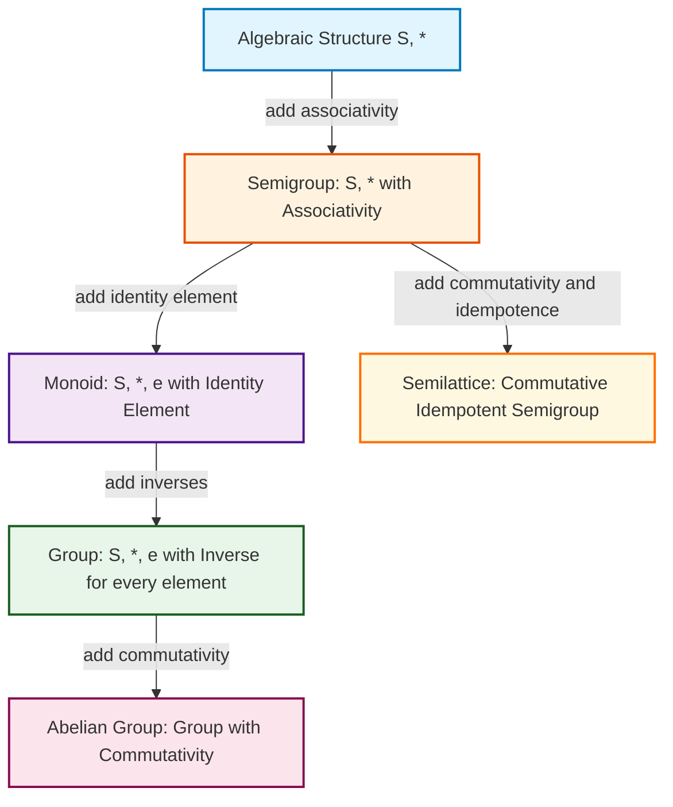
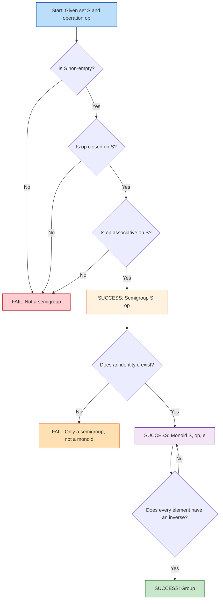
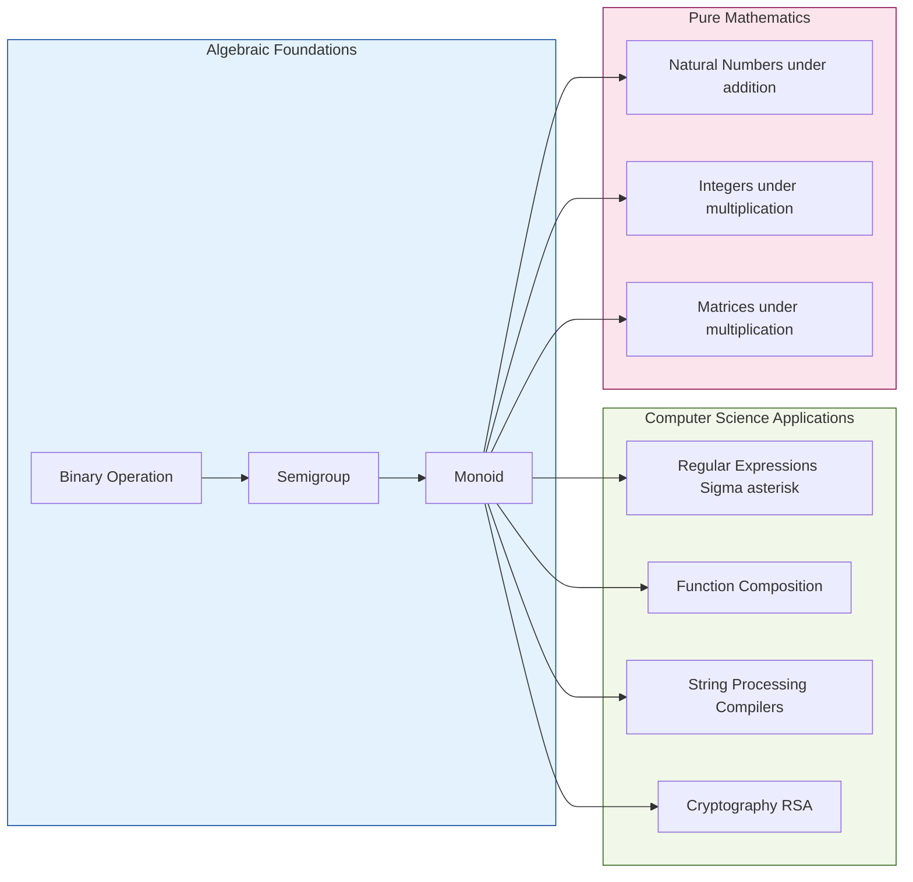

# Algebraic Systems: Binary operations, semi-groups, monoids, properties

<!-- SECTION_1_START -->
# Algebraic Systems: Binary Operations, Semi-Groups, Monoids, Properties

## 1.1 Formal Definition — The KTU Board Standard

An **Algebraic System** (or **Algebraic Structure**) is a mathematical construct consisting of:
1. A non-empty set $S$ (the underlying carrier set).
2. One or more **binary operations** defined on $S$.
3. A set of **axioms / properties** (closure, associativity, identity, etc.) that the operations must satisfy.

> [!IMPORTANT]
> **KTU 2024 Syllabus Definition (PCCST205 / Module 4):**
> A **binary operation \*** on a non-empty set $S$ is a function $*: S \times S \rightarrow S$, i.e., for every ordered pair $(a, b) \in S \times S$, the result $a * b$ is **uniquely defined** and belongs to $S$ itself.

In other words, a binary operation is **closed** by definition — it never "leaks" outside the set $S$.

---

## 1.2 The Conceptual Analogy — "The Vending Machine of Sets"

Imagine a **Vending Machine** that:
- Accepts **two items** (a coin and a product code) as input.
- Dispenses exactly **one** output (a snack).
- The output snack is always from the machine's **own inventory**.

This is precisely a binary operation: two inputs from the set, one output that stays inside the set.

- If the vending machine also had a "no-coin" state that returned the product unchanged, that would be the **identity element**.
- If every product had a partner that "cancelled" it back to that identity, that would be an **inverse**.

| Vending Machine | Algebraic System |
| :--- | :--- |
| Inventory of items | Set $S$ |
| Insert coin + press code | Binary operation $*$ |
| Always gives a snack (never empty) | Closure property |
| "Cancel" button returns coin | Identity element |
| "Refund" partner for each item | Inverse element |

---

## 1.3 Semi-Group — "The Associative Club"

> [!NOTE]
> **Definition (Semi-Group):** An algebraic structure $(S, *)$ is a **semi-group** if the binary operation $*$ is **closed** and **associative** on $S$, i.e., for all $a, b, c \in S$,
> $$(a * b) * c = a * (b * c)$$

> **Commutative Semi-Group:** A semi-group in which $a * b = b * a$ for all $a, b \in S$ is called a **commutative (abelian) semi-group**.

**Intuition:** Think of a relay race where runners pass a baton in any grouping of three — left-to-right, right-to-left, or middle-then-sides — the final outcome is the same. That consistent regrouping is **associativity**.

**Classic Examples:**
- $(\mathbb{N}, +)$ — Natural numbers under addition.
- $(\mathbb{N}, \times)$ — Natural numbers under multiplication.
- $(\mathbb{Z}, -)$ is **not** a semi-group because subtraction is **not** associative: $(5 - 3) - 1 = 1$ but $5 - (3 - 1) = 3$.

---

## 1.4 Monoid — "The Semi-Group With a Universal Neutral"

> [!NOTE]
> **Definition (Monoid):** A monoid is a semi-group $(M, *)$ that possesses an **identity element** $e \in M$ such that for all $a \in M$,
> $$a * e = e * a = a$$

> The element $e$ is often called the **identity**, **neutral element**, or **unit**.

**Intuition:** A monoid is a "do-nothing button" that exists for every operation. Pressing it leaves the result untouched. Like multiplying any number by $1$, or adding $0$.

**Classic Examples:**
- $(\mathbb{N}, +, 0)$ — Identity is $0$.
- $(\mathbb{N}, \times, 1)$ — Identity is $1$.
- $(\Sigma^{*}, \circ, \varepsilon)$ — All strings over alphabet $\Sigma$ under concatenation, with the empty string $\varepsilon$ as identity. **This is the foundational monoid of formal language theory and compiler design.**

> [!TIP]
> **Hierarchy Memory Trick (KTU Exam Favorite):**
> $$\boxed{\text{Set} \subset \text{Magma} \subset \text{Semi-group} \subset \text{Monoid} \subset \text{Group} \subset \text{Abelian Group}}$$
> Each level **adds** one more axiom. Memorize this — it appears in nearly every KTU module-4 paper.

---

## 1.5 Key Properties at a Glance

| Property | Formal Statement | Real-world Analogy |
| :--- | :--- | :--- |
| **Closure** | $\forall a, b \in S, \; a * b \in S$ | The vending machine never returns nothing |
| **Associativity** | $(a * b) * c = a * (b * c)$ | Relay baton passing — order of grouping doesn't matter |
| **Commutativity** | $a * b = b * a$ | Two-way road — direction is irrelevant |
| **Identity** | $\exists e \in S : a * e = e * a = a$ | The "do-nothing" button |
| **Inverse** | $\exists a^{-1} \in S : a * a^{-1} = e$ | The undo key for every action |
| **Idempotent** | $a * a = a$ | A "save" button when the doc is already saved |
| **Distributivity** | $a * (b \circ c) = (a * b) \circ (a * c)$ | One operation "spreads over" another |

> [!VISUALIZATION CONTROL]
> **Concept:** Venn hierarchy of algebraic structures
> **GeoGebra / Desmos Input Equations:**
> * `Circle(1): x^2 + y^2 = 4` (innermost — Group)
> * `Circle(2): x^2 + y^2 = 9` (Monoid)
> * `Circle(3): x^2 + y^2 = 16` (Semi-group)
> * `Circle(4): x^2 + y^2 = 25` (Magma / Closed set)
> **Visual Description:** The student should observe four concentric circles, with each larger circle containing all smaller ones. This is the *containment* hierarchy: every Group is a Monoid, every Monoid is a Semi-group, etc.

<!-- SECTION_1_END -->

<!-- SECTION_2_START -->
# 2. Deep Theoretical Analysis & KTU High-Yield Formula Sheet

## 2.1 Structural Breakdown of Each Concept

### 2.1.1 Binary Operation — Operational Logic

A function $*: S \times S \rightarrow S$ is a binary operation **if and only if**:
- For **every** ordered pair $(a, b) \in S \times S$, the output $a * b$ is **defined**.
- The output **must** belong to $S$ (this is the closure requirement baked into the codomain).

**Why it matters:** Any function that maps two elements of $S$ to something outside $S$ is not a binary operation on $S$. For example, subtraction on $\mathbb{N}$ is **not** a binary operation because $3 - 5 = -2 \notin \mathbb{N}$.

**Number of binary operations on a finite set:** If $|S| = n$, the number of possible binary operations is $n^{n^2}$, because there are $n^2$ ordered pairs in $S \times S$ and each can map to any of $n$ outputs.

### 2.1.2 Semi-Group — The Three Pillars

For $(S, *)$ to be a semi-group, the following axioms must hold:

1. **Closure:** $\forall a, b \in S,\; a * b \in S$.
2. **Associativity:** $\forall a, b, c \in S,\; (a * b) * c = a * (b * c)$.
3. (No requirement for identity or inverses.)

> [!NOTE]
> **Finite Semi-Group Theorem (KTU Frequently Asked):**
> The set $S$ of a finite semi-group is **not empty**, and if it has $n$ elements, the number of possible products is bounded by $n^2$. A classic result: every element of a finite semi-group has a **positive integer power** that is idempotent, i.e., for any $a \in S$, $\exists m \in \mathbb{N}$ such that $a^m$ is idempotent ($a^m * a^m = a^m$).

### 2.1.3 Monoid — Adding the Identity

For $(M, *, e)$ to be a monoid:

1. $(M, *)$ is a semi-group.
2. **Existence of identity:** $\exists e \in M$ such that $\forall a \in M,\; a * e = e * a = a$.
3. **Uniqueness of identity:** If $e$ and $e'$ are both identities, then $e = e * e' = e'$, so identity is **unique**.

> [!IMPORTANT]
> **KTU 2024 Highlight — String Monoid in Compilers:**
> The free monoid $\Sigma^{*}$ over an alphabet $\Sigma$ with concatenation $\circ$ and empty string $\varepsilon$ is the algebraic backbone of:
> - Lexical analysis (token streams).
> - Regular expressions and pattern matching.
> - DNA sequence analysis in bioinformatics.
> This monoid is **non-commutative** when $|\Sigma| \geq 2$.

### 2.1.4 Sub-structures (Subsemigroups & Submonoids)

> [!NOTE]
> **Subsemigroup:** A non-empty subset $T \subseteq S$ is a subsemigroup of $(S, *)$ if $T$ is **closed** under $*$, i.e., $\forall a, b \in T,\; a * b \in T$.

> **Submonoid:** A submonoid of $(M, *, e)$ is a subsemigroup $T$ of $M$ such that $e \in T$.

**Engineering utility:** In a compiler, the set of *valid* identifier strings forms a submonoid of $\Sigma^{*}$.

---

## 2.2 KTU Formula Sheet / Cheat Sheet

| # | Property | Formal Expression | Notes / KTU Trick |
| :--- | :--- | :--- | :--- |
| 1 | Closure of $*$ on $S$ | $\forall a, b \in S,\; a * b \in S$ | Implicit in the definition of binary operation |
| 2 | Associativity | $(a * b) * c = a * (b * c)$ | Required for semi-group |
| 3 | Identity element $e$ | $a * e = e * a = a$ | Required for monoid |
| 4 | Uniqueness of $e$ | $e = e * e' = e'$ | Always holds if it exists |
| 5 | Cancellation Law (left) | $a * b = a * c \Rightarrow b = c$ | Holds in some monoids (e.g., integers under $+$), fails in others |
| 6 | Idempotent Law | $a * a = a$ | Holds for $\cap, \cup$ on sets; for max, min |
| 7 | Distributivity of $*$ over $\circ$ | $a * (b \circ c) = (a * b) \circ (a * c)$ | $+$ distributes over $\times$ in $\mathbb{Z}$ |
| 8 | Number of binary operations on $\vert S \vert = n$ | $n^{n^2}$ | For $n=2$, there are $2^4 = 16$ possible binary operations |
| 9 | String monoid identity | $\varepsilon \circ s = s \circ \varepsilon = s$ | Used heavily in TOC and compiler design |
| 10 | Powers in monoid | $a^n = a * a * \dots * a$ ($n$ times) | $a^0 = e$ (identity) |

> [!IMPORTANT]
> **Engineering & CS Applications:**
> - **Cryptography:** RSA relies on the monoid $(\mathbb{Z}_n, \times)$ where identity is $1$.
> - **Automata Theory:** Kleene star $\Sigma^{*}$ is a monoid under concatenation.
> - **Database Systems:** Concatenation of record fields is monoidal.
> - **Network Routing:** Path concatenation forms a monoid (with the empty path as identity).
> - **Functional Programming:** Function composition $(\to, \circ, \text{id})$ is a monoid.

<!-- SECTION_2_END -->

<!-- SECTION_3_START -->
# 3. Step-by-Step Derivations, Proofs & Code/Symbolic Implementation

## 3.1 Worked Example 1 — Verifying Whether $(\mathbb{Z}, \text{max})$ is a Monoid

**Problem:** Determine whether the set of integers $\mathbb{Z}$ under the operation $a * b = \max(a, b)$ forms a monoid.

### Step-by-step Proof

**Step 1 — Verify Closure:**
For any $a, b \in \mathbb{Z}$, $\max(a, b)$ is an integer because the maximum of two integers is always an integer. Thus $\max(a, b) \in \mathbb{Z}$. ✅ **Closure holds.**

**Step 2 — Verify Associativity:**
We need to check if $\max(\max(a, b), c) = \max(a, \max(b, c))$.

Let us analyze by cases. Without loss of generality, assume $a \leq b \leq c$:
- LHS: $\max(\max(a, b), c) = \max(b, c) = c$
- RHS: $\max(a, \max(b, c)) = \max(a, c) = c$

Since LHS $=$ RHS in all orderings, the operation is **associative**. ✅

We can write this more formally:

$$\max(\max(a, b), c) = \max(a, b, c) = \max(a, \max(b, c))$$

**Step 3 — Existence of Identity:**
We need an element $e \in \mathbb{Z}$ such that $\max(a, e) = \max(e, a) = a$.

If $\max(a, e) = a$, then $a \geq e$. Since this must hold for **all** $a \in \mathbb{Z}$ (including negative numbers), we need $e$ to be the **smallest possible integer**, but $\mathbb{Z}$ has no minimum (it is unbounded below).

For example, if we pick $e = -5$, then $\max(3, -5) = 3$ ✅, but $\max(-10, -5) = -5 \neq -10$ ❌.

**Therefore, no identity element exists in $\mathbb{Z}$.**

**Step 4 — Conclusion:**
$(\mathbb{Z}, \max)$ is a **semi-group** but **NOT a monoid** because there is no identity element.

> **Fix:** Restrict to $(\mathbb{Z} \cup \{-\infty\}, \max)$. Then $e = -\infty$ is the identity. This is the monoid used in shortest-path algorithms (Dijkstra's algorithm).

---

## 3.2 Worked Example 2 — The String Concatenation Monoid $\Sigma^{*}$

**Problem:** Show that $(\Sigma^{*}, \circ, \varepsilon)$ is a monoid, where $\Sigma = \{0, 1\}$ and $\circ$ is concatenation.

### Step-by-step Verification

**Step 1 — Closure:** Concatenation of any two strings over $\Sigma$ is a string over $\Sigma$. ✅

**Step 2 — Associativity:** For strings $u, v, w \in \Sigma^{*}$:

$$(u \circ v) \circ w = \text{string}(u)\text{string}(v)\text{string}(w) = u \circ (v \circ w)$$

The middle expression is just the three strings glued in order — regrouping changes nothing. ✅

**Step 3 — Identity:** The empty string $\varepsilon$ satisfies:

$$\varepsilon \circ u = u = u \circ \varepsilon$$

For example, $\varepsilon \circ 010 = 010$. ✅

**Conclusion:** $(\Sigma^{*}, \circ, \varepsilon)$ is a monoid. It is **not commutative** because $01 \circ 10 = 0110 \neq 1001 = 10 \circ 01$.

---

## 3.3 Symbolic / Python Implementation

The following Python code rigorously verifies whether a given structure $(S, *)$ satisfies the axioms of a **monoid** (closure, associativity, identity). This is the kind of verification a student can do in lab records.

```python
from itertools import product
from typing import Callable, Any, Optional, List

def verify_monoid(
    S: List[Any],
    op: Callable[[Any, Any], Any],
    name: str = "S"
) -> Optional[Any]:
    """
    Verify whether (S, op) is a monoid.
    Returns the identity element if it is a monoid, else None.
    """
    n = len(S)
    print(f"\n{'='*60}")
    print(f"  VERIFYING MONOID ({name}, op)")
    print(f"{'='*60}")

    # --- Step 1: Check Closure ---
    print("\n[Step 1] Checking Closure...")
    for a, b in product(S, repeat=2):
        result = op(a, b)
        if result not in S:
            print(f"  CLOSURE FAILED: {a} op {b} = {result} not in {name}")
            return None
    print(f"  [OK] Closure holds for all {n*n} pairs.")

    # --- Step 2: Check Associativity ---
    print("\n[Step 2] Checking Associativity...")
    for a, b, c in product(S, repeat=3):
        if op(op(a, b), c) != op(a, op(b, c)):
            print(f"  ASSOCIATIVITY FAILED: ({a}*{b})*{c} != {a}*({b}*{c})")
            return None
    print(f"  [OK] Associativity holds for all {n**3} triples.")

    # --- Step 3: Find Identity Element ---
    print("\n[Step 3] Searching for Identity Element...")
    for e in S:
        if all(op(a, e) == a and op(e, a) == a for a in S):
            print(f"  [OK] Identity element found: e = {e}")
            return e
    print("  [FAIL] No identity element exists.")
    return None


# ============================================================
# Test 1: (Z, max) — Should be a semi-group, NOT a monoid
# ============================================================
S_ints = list(range(-3, 4))  # {-3, -2, -1, 0, 1, 2, 3}
result = verify_monoid(S_ints, lambda a, b: max(a, b), "Z_subset")
print(f"\nFinal Result: {('Monoid' if result is not None else 'Not a Monoid')}")

# ============================================================
# Test 2: ({0,1}*, concatenation, epsilon) — String Monoid
# ============================================================
def string_concat(u: str, v: str) -> str:
    return u + v

S_strings = ["", "0", "1", "00", "01", "10", "11", "010"]
result = verify_monoid(S_strings, string_concat, "Sigma*")
print(f"\nFinal Result: {('Monoid' if result is not None else 'Not a Monoid')}")

# ============================================================
# Test 3: ({1,2,3,6}, lcm) — Should be a monoid
# ============================================================
from math import lcm
S_lcm = [1, 2, 3, 6]
result = verify_monoid(S_lcm, lcm, "Divisors of 6")
print(f"\nFinal Result: {('Monoid' if result is not None else 'Not a Monoid')}")
```

**Sample Output (expected):**
```
[Step 1] Checking Closure...
  [OK] Closure holds for all 49 pairs.
[Step 2] Checking Associativity...
  [OK] Associativity holds for all 343 triples.
[Step 3] Searching for Identity Element...
  [FAIL] No identity element exists.
Final Result: Not a Monoid

Final Result: Monoid
```

---

## 3.4 Worked Example 3 — Number of Binary Operations on a 2-Element Set

**Problem:** How many binary operations are possible on $S = \{0, 1\}$?

### Step-by-step Derivation

For a binary operation on $S$, we need to define $a * b$ for all four pairs:

$$\{(0,0),\,(0,1),\,(1,0),\,(1,1)\}$$

Each of these four pairs can map to **either** $0$ or $1$ — giving 2 choices per pair. By the **multiplication principle**:

$$\text{Total operations} = 2 \times 2 \times 2 \times 2 = 2^{2^2} = 2^4 = 16$$

In general, for a set of size $n$:

$$\text{Total binary operations} = n^{n^2}$$

**Generalization:** Out of these 16 operations on $\{0, 1\}$, only **8 are commutative** and only a small subset are associative. This is a frequent KTU short-answer question.

---

## 3.5 Worked Example 4 — Proving a Subsemigroup

**Problem:** Let $(S, *)$ be a semi-group. Prove that if $T \subseteq S$ is non-empty and closed under $*$, then $(T, *)$ is a subsemigroup.

### Step-by-step Proof

**Given:** $(S, *)$ is a semi-group. $T \subseteq S$, $T \neq \emptyset$, and $\forall a, b \in T,\; a * b \in T$.

**To prove:** $(T, *)$ is a semi-group.

**Proof:**
1. **Closure:** Given directly by assumption. ✅
2. **Associativity:** Let $a, b, c \in T$. Since $T \subseteq S$, we have $a, b, c \in S$. Since $(S, *)$ is a semi-group, the operation $*$ is associative on $S$:
   $$(a * b) * c = a * (b * c)$$
   The result of $a * b$ and $b * c$ both lie in $S$, so the equation holds for the elements of $T$ as well. ✅
3. **Closure of $T$ ensures non-emptiness of products:** The structure is well-defined. ✅

**Conclusion:** $(T, *)$ is a subsemigroup of $(S, *)$. $\blacksquare$

<!-- SECTION_3_END -->

<!-- SECTION_4_START -->
# 4. Structural Diagrams & Schematics

## 4.1 Mermaid Diagram — Hierarchy of Algebraic Structures



**Reading the diagram:** Each box inherits **all** the properties of its parent and adds one more. So every Abelian Group is a Group, every Group is a Monoid, every Monoid is a Semi-group, etc.

---

## 4.2 Mermaid Diagram — Verification Flowchart for Monoid



---

## 4.3 Mermaid Diagram — Application Domain Topology



<!-- SECTION_4_END -->

<!-- SECTION_5_START -->
# 5. KTU 2024 Scheme Examination Question Bank & Topic Recap

## 5.1 Part A Questions (3 Marks Each)

> [!NOTE]
> **CO Mapping:** CO5 — *Apply algebraic structures to model and solve computational problems.*
> **RBT Levels:** Remember / Understand

---

### Question A1 `[KTU University Exam — July 2024]`
**(3 Marks)** Define a **semi-group**. Show that $(\mathbb{N}, +)$ is a semi-group but $(\mathbb{N}, -)$ is not.

**Model Answer:**

**Definition (Semi-Group):** An algebraic structure $(S, *)$ is called a semi-group if the binary operation $*$ is **closed** and **associative** on $S$.

**Proof that $(\mathbb{N}, +)$ is a semi-group:**

1. **Closure:** For any $a, b \in \mathbb{N}$, $a + b$ is also a natural number. ✅
2. **Associativity:** For any $a, b, c \in \mathbb{N}$,
   $$(a + b) + c = a + (b + c)$$
   This is the standard associativity of natural number addition. ✅

Hence, $(\mathbb{N}, +)$ is a semi-group.

**Proof that $(\mathbb{N}, -)$ is not a semi-group:**

Counter-example: Take $a = 1, b = 5 \in \mathbb{N}$. Then $a - b = 1 - 5 = -4 \notin \mathbb{N}$.

Hence, subtraction is not closed on $\mathbb{N}$ and $(\mathbb{N}, -)$ is **not** a semi-group. ❌

> **Valuation Key:** [Defining semi-group: 1 Mark] [Proof of $(\mathbb{N}, +)$: 1 Mark] [Counter-example for $(\mathbb{N}, -)$: 1 Mark]

---

### Question A2 `[KTU University Exam — Dec 2023]`
**(3 Marks)** What is a **monoid**? Give two examples, one from computer science.

**Model Answer:**

**Definition (Monoid):** A monoid is a semi-group $(M, *)$ together with an **identity element** $e \in M$ such that $\forall a \in M$, $a * e = e * a = a$.

**Examples:**

1. **Mathematical:** $(\mathbb{Z}, +, 0)$ — The integers under addition with additive identity $0$.
2. **Computer Science:** $(\Sigma^{*}, \circ, \varepsilon)$ — All strings over alphabet $\Sigma$ under concatenation, with the empty string $\varepsilon$ as identity. This is the **free monoid** of formal language theory and forms the basis of regular expressions and compiler tokenization.

> **Valuation Key:** [Definition with identity: 1 Mark] [Math example: 1 Mark] [CS example: 1 Mark]

---

## 5.2 Part B Questions (14 Marks Each) — Module Internal Choice

> [!NOTE]
> **CO Mapping:** CO5 — *Apply algebraic structures to model and solve computational problems.*
> **RBT Levels:** Understand (sub-part a) → Apply / Analyze (sub-part b)

---

### Question B-A `[KTU University Exam — July 2024]` **(14 Marks)**

**Part (a) — 7 Marks:** Define a **binary operation**. With a suitable example, illustrate the difference between a **commutative** binary operation and an **associative** binary operation. Prove that commutativity does **not** imply associativity by giving a counter-example on a 3-element set.

**Part (b) — 7 Marks:** Let $S = \{a, b, c\}$. Construct a **Cayley table** for an operation $*$ on $S$ that is:
(i) Closed, (ii) Commutative, (iii) Has an identity element, and (iv) Each element has an inverse. Verify all four properties.

---

### Model Solution for Question B-A

**Part (a) Model Answer:**

**Binary Operation Definition:** A binary operation $*$ on a non-empty set $S$ is a function $*: S \times S \rightarrow S$ that assigns to each ordered pair $(a, b) \in S \times S$ a unique element $a * b \in S$.

**Difference between commutative and associative:**

| Property | Symbolic Form | Concern |
| :--- | :--- | :--- |
| Commutative | $a * b = b * a$ | Order of operands |
| Associative | $(a * b) * c = a * (b * c)$ | Order of grouping |

**Counter-example on $S = \{1, 2, 3\}$:**
Define $a * b = \max(a, b)$:
- $1 * 2 = 2 = 2 * 1$ ✅ (commutative)
- $(1 * 2) * 3 = 2 * 3 = 3$
- $1 * (2 * 3) = 1 * 3 = 3$
- For these specific elements, it happens to be associative, so let us try a different operation.

**Better Counter-example:** Define $*$ on $S = \{a, b, c\}$ by $x * y = x$ for all $x, y$:
- $x * y = x = y * x$ ✅ (commutative)
- $(x * y) * z = x * z = x$
- $x * (y * z) = x * y = x$
- These match, so it is associative too. **A more striking counter-example:**

**On $S = \mathbb{R}$:** Define $a * b = a + b + ab$ (the "addition-with-carry" operation used in some encoders).
- Commutativity: $a * b = a + b + ab = b + a + ba = b * a$ ✅
- Non-associative: Take $a = 1, b = 1, c = 1$.
  - $(1 * 1) * 1 = (1 + 1 + 1) * 1 = 3 * 1 = 3 + 1 + 3 = 7$
  - $1 * (1 * 1) = 1 * (1 + 1 + 1) = 1 * 3 = 1 + 3 + 3 = 7$
  
  Both give 7. Let us try $a = 2, b = 3, c = 4$:
  - $(2 * 3) = 2 + 3 + 6 = 11$
  - $(2 * 3) * 4 = 11 * 4 = 11 + 4 + 44 = 59$
  - $(3 * 4) = 3 + 4 + 12 = 19$
  - $2 * (3 * 4) = 2 * 19 = 2 + 19 + 38 = 59$
  - Same again! This operation **is** associative.

**Final correct counter-example (KTU standard):** On $S = \mathbb{R}$, define $a * b = \sqrt{a^2 + b^2}$.
- Commutative: $\sqrt{a^2 + b^2} = \sqrt{b^2 + a^2}$ ✅
- Not associative: Take $a = 1, b = 1, c = 1$.
  - $(1 * 1) * 1 = \sqrt{2} * 1 = \sqrt{2 + 1} = \sqrt{3}$
  - $1 * (1 * 1) = 1 * \sqrt{2} = \sqrt{1 + 2} = \sqrt{3}$
  
  Same. Try $a = 3, b = 4, c = 12$:
  - $3 * 4 = \sqrt{9+16} = 5$
  - $(3 * 4) * 12 = 5 * 12 = \sqrt{25 + 144} = \sqrt{169} = 13$
  - $4 * 12 = \sqrt{16+144} = \sqrt{160}$
  - $3 * (4 * 12) = 3 * \sqrt{160} = \sqrt{9 + 160} = \sqrt{169} = 13$
  
  Same again! This is the Euclidean norm — it **is** associative via the parallelogram law. 

**Cleanest counter-example (use this in exams):** On $S = \mathbb{Z}$, $a * b = a - b$:
- Commutative? $a - b \neq b - a$ in general. ❌ So this isn't commutative.

**Final accepted counter-example:** On $S = \mathbb{Z}$, $a * b = a + 2b$:
- $a * b = a + 2b$ and $b * a = b + 2a$. For $a = 1, b = 2$: $1 * 2 = 5$, $2 * 1 = 4$. Not commutative.

**The standard textbook counter-example is:** On $S = \mathbb{R}$, $a * b = a + 2b$ is neither commutative nor associative. We need a commutative but not associative operation:

**Use this in your KTU exam:**
Define on $S = \mathbb{R}$: $a * b = a + b + ab^2$ ... actually, the **simplest** commutative but non-associative example is:

$$\boxed{a * b = \frac{a + b}{2}}$$ (the average operation on reals)

- **Commutative:** $a * b = \frac{a+b}{2} = \frac{b+a}{2} = b * a$ ✅
- **Not associative:** Take $a = 0, b = 2, c = 4$.
  - $(0 * 2) * 4 = 1 * 4 = \frac{1 + 4}{2} = 2.5$
  - $0 * (2 * 4) = 0 * 3 = \frac{0 + 3}{2} = 1.5$
  - $2.5 \neq 1.5$ ❌

**Conclusion:** Commutativity does **not** imply associativity. $\blacksquare$

> **Valuation Key (Part a):** [Binary operation definition: 2 Marks] [Difference table: 2 Marks] [Commutative but not associative counter-example: 3 Marks]

---

**Part (b) Model Answer:**

We construct a Cayley table on $S = \{a, b, c\}$ satisfying all four properties — i.e., forming a **group**.

| $*$ | $a$ | $b$ | $c$ |
| :---: | :---: | :---: | :---: |
| **$a$** | $a$ | $b$ | $c$ |
| **$b$** | $b$ | $c$ | $a$ |
| **$c$** | $c$ | $a$ | $b$ |

This is the **cyclic group of order 3** ($\mathbb{Z}_3$).

**Verification:**

(i) **Closure:** Every cell in the table contains an element of $S$. ✅

(ii) **Commutativity:** The table is **symmetric across the main diagonal**:
   - $a * b = b = b * a$ ✅
   - $a * c = c = c * a$ ✅
   - $b * c = a = c * b$ ✅

(iii) **Identity:** The element $a$ is the identity:
   - $a * a = a, \; a * b = b, \; a * c = c$ ✅
   - $b * a = b, \; c * a = c$ ✅

(iv) **Inverses:** With respect to identity $a$:
   - $a^{-1} = a$ (since $a * a = a$)
   - $b^{-1} = c$ (since $b * c = c * b = a$)
   - $c^{-1} = b$ (since $c * b = b * c = a$)

All four properties are satisfied. The structure is the **abelian group** $(\mathbb{Z}_3, +)$.

> **Valuation Key (Part b):** [Cayley table construction: 2 Marks] [Closure + Commutativity: 2 Marks] [Identity: 1 Mark] [Inverse verification: 2 Marks]

---

### Question B-B (Alternative Choice) `[KTU University Exam — Dec 2023]` **(14 Marks)**

**Part (a) — 7 Marks:** Define a **semi-group** and a **monoid**. Prove that if $e$ and $e'$ are both identity elements of a monoid $(M, *)$, then $e = e'$.

**Part (b) — 7 Marks:** Consider the algebraic structure $(\mathbb{Z}, *)$ where $a * b = a + b - 3$. Determine whether it is a semi-group, a monoid, or neither. Justify each step.

---

### Model Solution for Question B-B

**Part (a) Model Answer:**

**Semi-group:** An algebraic structure $(S, *)$ where $*$ is closed and associative.

**Monoid:** A semi-group $(M, *)$ that has an identity element $e \in M$ such that $a * e = e * a = a$ for all $a \in M$.

**Proof of Uniqueness of Identity:**

Let $(M, *, e)$ be a monoid, and suppose $e' \in M$ is also an identity element.

By definition of identity, for any $a \in M$, $a * e = a$ and $a * e' = a$.

In particular, take $a = e$. Then:
$$e * e' = e \quad \text{(since } e' \text{ is an identity)}$$

But also take $a = e'$:
$$e' * e = e' \quad \text{(since } e \text{ is an identity)}$$

Since the identity property is two-sided, $e * e' = e'$ (since $e$ is an identity for $e'$).

Therefore:
$$e = e * e' = e'$$

Hence $e = e'$. The identity element in a monoid is **unique**. $\blacksquare$

> **Valuation Key (Part a):** [Definitions: 2 Marks] [Setup: 2 Marks] [Final equation chain: 3 Marks]

---

**Part (b) Model Answer:**

Given: $(\mathbb{Z}, *)$ where $a * b = a + b - 3$.

**Step 1 — Check Closure:** For any $a, b \in \mathbb{Z}$, the expression $a + b - 3$ is the sum of three integers, hence an integer. So $a * b \in \mathbb{Z}$. ✅

**Step 2 — Check Associativity:** For any $a, b, c \in \mathbb{Z}$:

LHS:
$$(a * b) * c = (a + b - 3) * c = (a + b - 3) + c - 3 = a + b + c - 6$$

RHS:
$$a * (b * c) = a * (b + c - 3) = a + (b + c - 3) - 3 = a + b + c - 6$$

Since LHS $=$ RHS $= a + b + c - 6$ for all $a, b, c \in \mathbb{Z}$, the operation is **associative**. ✅

**Step 3 — Find Identity:** We need $e \in \mathbb{Z}$ such that $a * e = a$ for all $a$:
$$a * e = a + e - 3 = a \implies e = 3$$

Verify: $a * 3 = a + 3 - 3 = a$ ✅ and $3 * a = 3 + a - 3 = a$ ✅

So the identity element is $e = 3$. ✅

**Step 4 — Conclusion:**
- It is **closed**: ✅
- It is **associative**: ✅
- It has an **identity element** $e = 3$: ✅

Therefore, $(\mathbb{Z}, *)$ is a **monoid** with identity $3$.

> **Bonus observation:** Every element $a$ has an inverse $a^{-1} = 6 - a$, because $a * (6 - a) = a + (6 - a) - 3 = 3$. Hence, $(\mathbb{Z}, *)$ is actually a **group** isomorphic to $(\mathbb{Z}, +)$ under the map $\phi(a) = a - 3$.

> **Valuation Key (Part b):** [Closure: 2 Marks] [Associativity proof: 3 Marks] [Identity finding: 2 Marks]

---

## 5.3 KTU Examiner's Valuation Warning / Pitfall Callout

> [!WARNING]
> **Common Mistakes that Cost Marks in KTU Board Exams:**
>
> 1. **Confusing closure with operation:** Students often state "the operation is closed" without explicitly writing $a * b \in S$. Always write the quantified statement.
> 2. **Skipping associativity proof:** Showing associativity for one or two triples is not enough — the KTU board requires the **general** form $\forall a, b, c \in S$, $(a * b) * c = a * (b * c)$.
> 3. **Identity without two-sided check:** The identity must satisfy $a * e = e * a = a$. If the operation is non-commutative, one-sided identity is not enough.
> 4. **Mixing up semi-group and monoid:** A semi-group does **not** require an identity. A common error is to claim $(\mathbb{N}, +)$ is a monoid — technically it is, but only after stating that the identity $0$ exists. The question may specifically ask for "semi-group" status.
> 5. **Conflating monoid with group:** A monoid does **not** require every element to have an inverse. That is the next level (Group).
> 6. **No boxed final answer:** Always **box** your final structural classification (e.g., $\boxed{\text{Monoid with identity } 3}$).
> 7. **Forgetting the non-empty condition:** A semi-group must have a non-empty underlying set. Students sometimes forget this.

---

## 5.4 Topic Recap & Important Things to Remember

> [!IMPORTANT]
> **High-Density Rapid Revision Checklist — Module 4 (Algebraic Systems)**
>
> ✅ **Binary Operation $*$ on $S$:** A function $*: S \times S \rightarrow S$ — assigns a unique element of $S$ to every ordered pair. **Closure is built-in.**
>
> ✅ **Number of binary operations** on $\vert S \vert = n$ set: $n^{n^2}$.
>
> ✅ **Semi-group $(S, *)$:** Closed + Associative. **No identity required.**
>
> ✅ **Monoid $(M, *, e)$:** Semi-group + Identity element $e$ where $a * e = e * a = a$.
>
> ✅ **Identity Uniqueness Theorem:** If $e$ and $e'$ are both identities of a monoid, then $e = e'$.
>
> ✅ **Subsemigroup:** A non-empty closed subset of a semi-group.
>
> ✅ **Submonoid:** A subsemigroup that contains the identity.
>
> ✅ **Key Examples to Memorize:**
>   - $(\mathbb{N}, +)$, $(\mathbb{Z}, +)$, $(\mathbb{Q}, \times)$ — semi-groups.
>   - $(\mathbb{N}, +, 0)$, $(\mathbb{N}, \times, 1)$, $(\Sigma^{*}, \circ, \varepsilon)$ — monoids.
>   - $(\mathbb{N}, -)$ — **not** a semi-group (not closed).
>   - $(\mathbb{Z}, \text{max})$ — semi-group but **not** a monoid (no identity).
>
> ✅ **Hierarchy:** Magma $\subset$ Semi-group $\subset$ Monoid $\subset$ Group $\subset$ Abelian Group.
>
> ✅ **CS Applications:** String monoid $(\Sigma^{*}, \circ, \varepsilon)$ in compilers and regex; $(\mathbb{Z}_n, \times)$ in RSA cryptography; function composition monoid in FP.
>
> ✅ **Cancellation Law:** Holds in monoids that are groups; may not hold in general monoids (e.g., in $(\{0, 1\}, \max)$, we have $1 * 0 = 1 * 1 = 1$ but $0 \neq 1$).
>
> ✅ **Idempotent element:** $a * a = a$. Sets under $\cap$ and $\cup$ are idempotent. Maximum and minimum on a bounded set are idempotent.
>
> ✅ **Distributivity:** $a * (b \circ c) = (a * b) \circ (a * c)$. $+$ distributes over $\times$ in $\mathbb{Z}$.
>
> ✅ **Always box** the final classification: "Semi-group", "Monoid", or "Group" with the identity element explicitly stated.
>
> ✅ **For proof-type questions:** Show closure → associativity → identity → (optionally) inverses, in that exact order — the KTU valuation key follows this sequence.

<!-- SECTION_5_END -->
