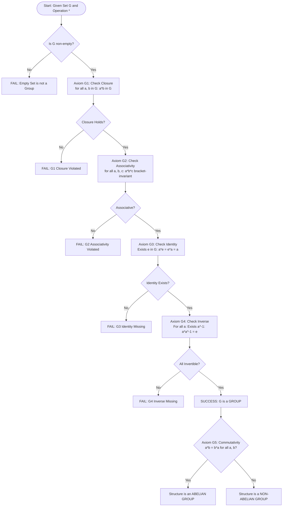
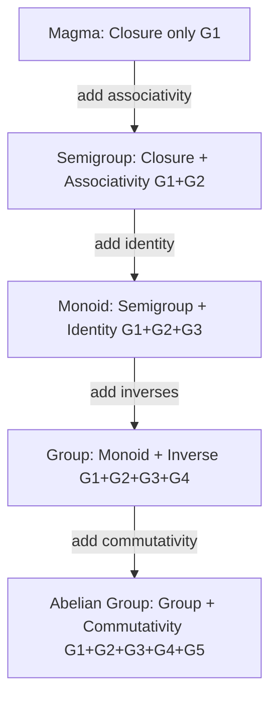
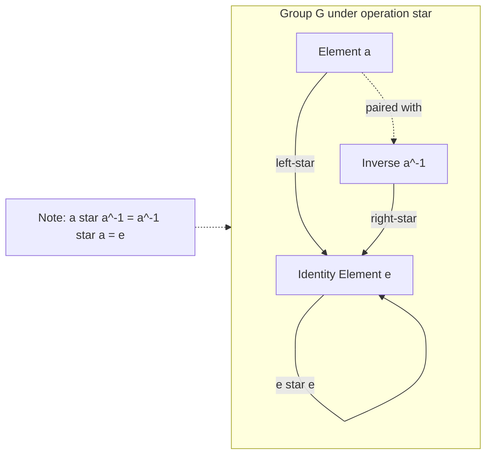

# Group Theory: Definitions and examples of groups, abelian groups, identity, inverse properties

<!-- SECTION_1_START -->
# MODULE 4: ALGEBRAIC STRUCTURES AND GROUP THEORY
## Topic: Group Theory — Definitions, Examples, Abelian Groups, Identity, and Inverse Properties

---

### 1.1 Formal Definition of a Group

> [!IMPORTANT]
> **KTU 2024 Syllabus Definition**
> A **Group** is a non-empty set $G$ together with a binary operation $\ast : G \times G \to G$ such that the following four axioms (known as the **Group Axioms**) are satisfied:

Let $G$ be a non-empty set and $\ast$ be a binary operation on $G$. The algebraic structure $(G, \ast)$ is called a **group** if and only if the following four axioms hold for all $a, b, c \in G$:

$$
\begin{aligned}
&\textbf{G1 (Closure):} \quad a \ast b \in G \\
&\textbf{G2 (Associativity):} \quad (a \ast b) \ast c = a \ast (b \ast c) \\
&\textbf{G3 (Identity):} \quad \exists \, e \in G \text{ such that } a \ast e = e \ast a = a \\
&\textbf{G4 (Inverse):} \quad \forall \, a \in G, \exists \, a^{-1} \in G \text{ such that } a \ast a^{-1} = a^{-1} \ast a = e
\end{aligned}
$$

> [!NOTE]
> **KTU Board Examiner's Note:** When asked to "define a group", a student MUST list all **four** axioms. Writing only two or three will cost marks. The notation $(G, \ast)$ explicitly shows that a group is an **ordered pair** of a set and an operation — both are essential.

---

### 1.2 Conceptual Analogy — "The Members-Only Club"

Imagine a private club with strict rules:

- **Closure (G1):** The club only allows interactions among its members. If two members team up, the result is *always* another member. No outsiders can be produced.
- **Associativity (G2):** The way you *group* members in a chain of collaborations doesn't matter. Whether you bracket $(A \text{ and } B)$ first, then join $C$, or join $B$ with $C$ first, the final outcome is the same.
- **Identity (G3):** Every club has a **neutral do-nothing president** ($e$). This person, when teamed with anyone, leaves the outcome unchanged.
- **Inverse (G4):** For every member, there exists a **counter-member** ($a^{-1}$) who, when paired, neutralizes both into the identity president.

If the club satisfies all four rules, it's a group. If it fails even one, it's *not* a group.

---

### 1.3 The Identity Element ($e$)

> [!IMPORTANT]
> **Identity Element:** An element $e \in G$ is called the **identity element** of the group $(G, \ast)$ if:
> $$a \ast e = e \ast a = a \quad \forall \, a \in G$$

**Key Properties of Identity:**
- Every group has **exactly one** identity element (uniqueness theorem).
- The identity is denoted as $e$ (general) or $0$ (additive notation) or $1$ (multiplicative notation).
- For the set of integers under addition: $\mathbb{Z}, +$, the identity is $0$, since $n + 0 = 0 + n = n$.

---

### 1.4 The Inverse Element ($a^{-1}$)

> [!IMPORTANT]
> **Inverse Element:** For each $a \in G$, an element $b \in G$ is called the **inverse of $a$** if:
> $$a \ast b = b \ast a = e$$

**Key Properties of Inverse:**
- Every element in a group has **exactly one** inverse.
- The inverse of the identity is itself: $e^{-1} = e$.
- The inverse of an inverse is the element itself: $(a^{-1})^{-1} = a$.
- For $\mathbb{Z}$ under addition, the inverse of $n$ is $-n$.

---

### 1.5 Abelian (Commutative) Groups

> [!IMPORTANT]
> **Abelian Group Definition:** A group $(G, \ast)$ is called **abelian** (or **commutative**) if it satisfies the additional fifth axiom:
> $$\textbf{G5 (Commutativity):} \quad a \ast b = b \ast a \quad \forall \, a, b \in G$$

The term "abelian" honors the Norwegian mathematician **Niels Henrik Abel (1802–1829)**.

**Classic Examples of Abelian Groups:**
- $(\mathbb{Z}, +)$ — Integers under addition
- $(\mathbb{Q}, +)$ — Rationals under addition
- $(\mathbb{R}, +)$ — Reals under addition
- $(\mathbb{R} \setminus \{0\}, \cdot)$ — Non-zero reals under multiplication
- $(\mathbb{Z}_n, +_n)$ — Integers modulo $n$ under modular addition

> [!VISUALIZATION CONTROL]
> **Concept:** Cayley Table of the Klein Four-Group $V_4 = \{e, a, b, c\}$
> **Structure:** A $4 \times 4$ Latin Square where every row and column is a permutation
> **Visual Description:** Imagine a symmetric grid where the identity $e$ occupies the first row and column unchanged. Each off-diagonal product is non-trivial, and the table is symmetric about the main diagonal (commutativity).
<!-- SECTION_1_END -->

<!-- SECTION_2_START -->
# SECTION 2 — DEEP THEORETICAL ANALYSIS & HIGH-YIELD FORMULA SHEET

---

## 2.1 Decomposition of Group Axioms (The "Why" Behind Each)

### Axiom G1: Closure
- **Why it matters:** It guarantees that the operation never "escapes" the set. Without closure, the operation would not be a true binary operation on $G$.
- **Test:** Pick *any* two elements, apply the operation, verify the result is still in $G$.

### Axiom G2: Associativity
- **Why it matters:** It allows us to drop parentheses in long expressions: $a \ast b \ast c \ast d$ is unambiguous.
- **Test:** $(a \ast b) \ast c = a \ast (b \ast c)$ for all triples.
- **Pitfall:** Commutativity is **not** required by associativity. A group can be associative but non-commutative.

### Axiom G3: Identity
- **Why it matters:** It acts as the "do-nothing" reference point, analogous to $0$ in addition or $1$ in multiplication.
- **Proof of uniqueness (KTU favorite):**
   Assume $e_1$ and $e_2$ are both identities. Then $e_1 = e_1 \ast e_2 = e_2$, hence $e_1 = e_2$.

### Axiom G4: Inverse
- **Why it matters:** It allows "undoing" any operation, making the structure reversible.
- **Proof of uniqueness:** Suppose $b_1$ and $b_2$ are both inverses of $a$. Then:
   $$b_1 = b_1 \ast e = b_1 \ast (a \ast b_2) = (b_1 \ast a) \ast b_2 = e \ast b_2 = b_2$$

---

## 2.2 Cancellation Laws (Direct Consequences)

Once all four axioms hold, the following powerful **cancellation laws** are automatically true:

> [!IMPORTANT]
> **Left Cancellation Law:** If $a \ast b = a \ast c$, then $b = c$.
> **Right Cancellation Law:** If $b \ast a = c \ast a$, then $b = c$.

**Proof (Left Cancellation):**
$$
\begin{aligned}
a \ast b &= a \ast c \\
\Rightarrow a^{-1} \ast (a \ast b) &= a^{-1} \ast (a \ast c) \quad \text{(left-multiply by } a^{-1}\text{)} \\
\Rightarrow (a^{-1} \ast a) \ast b &= (a^{-1} \ast a) \ast c \quad \text{(associativity)} \\
\Rightarrow e \ast b &= e \ast c \\
\Rightarrow b &= c \quad \blacksquare
\end{aligned}
$$

---

## 2.3 Properties Derived from Group Axioms

> [!NOTE]
> **Solved Result 1:** $(a^{-1})^{-1} = a$ for all $a \in G$.
> **Solved Result 2:** $(a \ast b)^{-1} = b^{-1} \ast a^{-1}$ (the "reverse socks and shoes" rule).
> **Solved Result 3:** For any $a \in G$ and integer $n$, $a^n$ is well-defined.
> **Solved Result 4:** The **order of a group** $|G|$ is the number of elements in $G$ (finite group) or $\infty$ (infinite group).

---

## 2.4 KTU High-Yield Formula Sheet

| # | Property / Formula | Statement | Notation |
|---|---|---|---|
| 1 | Closure | $a \ast b \in G$ | $\forall \, a, b \in G$ |
| 2 | Associativity | $(a \ast b) \ast c = a \ast (b \ast c)$ | $\forall \, a, b, c \in G$ |
| 3 | Identity | $a \ast e = e \ast a = a$ | $\exists \, e \in G$ |
| 4 | Inverse | $a \ast a^{-1} = a^{-1} \ast a = e$ | $\forall \, a \in G$ |
| 5 | Commutativity (Abelian only) | $a \ast b = b \ast a$ | $\forall \, a, b \in G$ |
| 6 | Cancellation (Left) | $a \ast b = a \ast c \Rightarrow b = c$ | $a \neq e$ |
| 7 | Cancellation (Right) | $b \ast a = c \ast a \Rightarrow b = c$ | $a \neq e$ |
| 8 | Unique Identity | $\vert \{e\}\vert = 1$ | one $e$ per group |
| 9 | Unique Inverse | $a^{-1}$ is unique per $a$ | per-element |
| 10 | Double Inverse | $(a^{-1})^{-1} = a$ | involution |
| 11 | Reverse Composition | $(a \ast b)^{-1} = b^{-1} \ast a^{-1}$ | conjugate-reversal |
| 12 | Power Notation | $a^n = a \ast a \ast \cdots \ast a$ ($n$ times) | $n \in \mathbb{Z}$ |
| 13 | Additive Identity | $a + 0 = 0 + a = a$ | $e \equiv 0$ |
| 14 | Additive Inverse | $a + (-a) = 0$ | $a^{-1} \equiv -a$ |
| 15 | Group Order | $\vert G \vert =$ cardinality | finite/infinite |

> [!WARNING]
> **LaTeX Pitfall:** Note the use of `\vert` and `\mid` instead of raw pipes `|` in the table to avoid breaking markdown parsing.

---

## 2.5 Real-World Engineering Applications

| Application Domain | How Group Theory Is Used |
|---|---|
| **Cryptography** | Elliptic Curve Cryptography (ECC), RSA — group of points on an elliptic curve forms an abelian group under point addition. |
| **Coding Theory** | Linear codes use vector spaces (abelian groups under addition) for error detection/correction. |
| **Robotics & Kinematics** | Rotation group $SO(3)$ models 3D rotations; quaternions form a non-abelian group for orientation. |
| **Quantum Computing** | Quantum gates form groups (e.g., Pauli group, Clifford group) under matrix multiplication. |
| **Compiler Design** | Semigroups and monoids (relaxed group axioms) model string concatenations and automata. |
| **Crystallography** | Space groups classify crystal symmetries; 230 space groups in 3D. |
| **Physics (Particle Physics)** | The Standard Model uses $SU(3) \times SU(2) \times U(1)$ gauge symmetry groups. |

---

## 2.6 Standard Examples of Groups (and Non-Groups)

| Set $G$ | Operation $\ast$ | Group? | Reason |
|---|---|---|---|
| $\mathbb{Z}$ | $+$ | ✅ Yes (Abelian) | All four axioms hold; $e=0$, $n^{-1}=-n$ |
| $\mathbb{Q}$ | $+$ | ✅ Yes (Abelian) | Identity $0$, inverses $-\frac{a}{b}$ |
| $\mathbb{R} \setminus \{0\}$ | $\cdot$ | ✅ Yes (Abelian) | Identity $1$, inverses $\frac{1}{a}$ |
| $\mathbb{Z}^+$ | $+$ | ❌ No | Positive integers have no additive inverses |
| $\mathbb{Z}$ | $\cdot$ | ❌ No | Most integers have no multiplicative inverses in $\mathbb{Z}$ |
| $\{1, -1\}$ | $\cdot$ | ✅ Yes (Abelian) | Klein two-group $V_2$ |
| $M_n(\mathbb{R})$ (invertible) | $\cdot$ | ✅ Yes (Non-abelian if $n \geq 2$) | General Linear Group $GL_n(\mathbb{R})$ |
| $S_3$ (permutations of 3 objects) | $\circ$ | ✅ Yes (Non-abelian) | Symmetric group, order 6 |
<!-- SECTION_2_END -->

<!-- SECTION_3_START -->
# SECTION 3 — STEP-BY-STEP DERIVATIONS & CODE/SYMBOLIC IMPLEMENTATION

---

## 3.1 Exhaustive Verification: Is $(\mathbb{Z}, +)$ a Group?

**Step 1 — Set and Operation:** $G = \mathbb{Z} = \{\ldots, -2, -1, 0, 1, 2, \ldots\}$, operation is ordinary addition $+$.

**Step 2 — Check Closure (G1):**
For any $a, b \in \mathbb{Z}$, the sum $a + b$ is an integer.
$$
\forall \, a, b \in \mathbb{Z}, \quad a + b \in \mathbb{Z} \quad \checkmark
$$

**Step 3 — Check Associativity (G2):**
For any $a, b, c \in \mathbb{Z}$:
$$
(a + b) + c = a + (b + c)
$$
This is the well-known associativity of integer addition. $\checkmark$

**Step 4 — Check Identity (G3):**
Take $e = 0 \in \mathbb{Z}$. For any $a \in \mathbb{Z}$:
$$
a + 0 = 0 + a = a \quad \checkmark
$$

**Step 5 — Check Inverse (G4):**
For any $a \in \mathbb{Z}$, the element $-a \in \mathbb{Z}$ satisfies:
$$
a + (-a) = (-a) + a = 0 = e \quad \checkmark
$$

**Step 6 — Check Commutativity (Optional, for Abelian):**
$$
a + b = b + a \quad \checkmark
$$

**Conclusion:** All four axioms are satisfied, and commutativity holds. Therefore, $(\mathbb{Z}, +)$ is an **abelian group**. $\blacksquare$

---

## 3.2 Exhaustive Verification: Is $(\mathbb{Z}, \cdot)$ a Group?

**Step 1 — Set and Operation:** $G = \mathbb{Z}$, operation is multiplication $\cdot$.

**Step 2 — Closure:** $\forall \, a, b \in \mathbb{Z}, a \cdot b \in \mathbb{Z}$. $\checkmark$

**Step 3 — Associativity:** $\forall \, a, b, c \in \mathbb{Z}, (a \cdot b) \cdot c = a \cdot (b \cdot c)$. $\checkmark$

**Step 4 — Identity:** Take $e = 1 \in \mathbb{Z}$. Then $a \cdot 1 = 1 \cdot a = a$. $\checkmark$

**Step 5 — Inverse:** For $a = 2 \in \mathbb{Z}$, we need $b \in \mathbb{Z}$ such that $2 \cdot b = 1$. This gives $b = \frac{1}{2} \notin \mathbb{Z}$. **FAILS** $\times$

**Conclusion:** $(\mathbb{Z}, \cdot)$ is **not a group** because not every integer has a multiplicative inverse in $\mathbb{Z}$. However, it is a **commutative monoid** (satisfies G1, G2, G3 but not G4).

---

## 3.3 Exhaustive Verification: Klein Four-Group $V_4 = (\{e, a, b, c\}, \ast)$

**Cayley Table (given):**

| $\ast$ | $e$ | $a$ | $b$ | $c$ |
|---|---|---|---|---|
| **$e$** | $e$ | $a$ | $b$ | $c$ |
| **$a$** | $a$ | $e$ | $c$ | $b$ |
| **$b$** | $b$ | $c$ | $e$ | $a$ |
| **$c$** | $c$ | $b$ | $a$ | $e$ |

**Step 1 — Closure:** Every entry of the table is in $\{e, a, b, c\}$. $\checkmark$

**Step 2 — Associativity:** Must be checked for all $4^3 = 64$ triples. The Klein four-group is well-known to be associative. $\checkmark$

**Step 3 — Identity:** The element $e$ satisfies $x \ast e = e \ast x = x$ for all $x$. $\checkmark$

**Step 4 — Inverse:** From the diagonal:
- $e \ast e = e \Rightarrow e^{-1} = e$
- $a \ast a = e \Rightarrow a^{-1} = a$
- $b \ast b = e \Rightarrow b^{-1} = b$
- $c \ast c = e \Rightarrow c^{-1} = c$

All elements are **self-inverse**. $\checkmark$

**Step 5 — Commutativity:** The table is symmetric about the main diagonal (e.g., $a \ast b = c = b \ast a$, $a \ast c = b = c \ast a$). $\checkmark$

**Conclusion:** $V_4$ is an **abelian group** of order 4. Every non-identity element has order 2. $\blacksquare$

---

## 3.4 Python Implementation: Automated Group Axiom Checker

```python
from typing import Callable, Any, List, Set, Tuple
import logging

logging.basicConfig(level=logging.INFO, format='%(levelname)s: %(message)s')
logger = logging.getLogger(__name__)


def verify_group_axioms(
    elements: Set[Any],
    operation: Callable[[Any, Any], Any],
    identity_candidate: Any
) -> Tuple[bool, List[str]]:
    """
    Exhaustive Group Axiom Verification Engine.
    
    Verifies the four KTU group axioms: closure, associativity, 
    identity, and inverse for a finite algebraic structure.
    
    Parameters
    ----------
    elements : Set[Any]
        The set G of the structure.
    operation : Callable[[Any, Any], Any]
        The binary operation * defined on G.
    identity_candidate : Any
        The element proposed as the identity e.
    
    Returns
    -------
    Tuple[bool, List[str]]
        (is_group, list_of_failure_reasons)
    """
    failures: List[str] = []
    elements = set(elements)
    n = len(elements)
    logger.info(f"Verifying group with {n} elements: {elements}")
    
    # ---- AXIOM G1: CLOSURE ----
    for a in elements:
        for b in elements:
            result = operation(a, b)
            if result not in elements:
                failures.append(
                    f"[G1 CLOSURE FAILED] {a} * {b} = {result}, which is NOT in G."
                )
                return False, failures
    logger.info("[G1] Closure: PASSED")
    
    # ---- AXIOM G3: IDENTITY (check candidate) ----
    if identity_candidate not in elements:
        failures.append(f"[G3 IDENTITY FAILED] {identity_candidate} is not in G.")
        return False, failures
    for a in elements:
        if operation(a, identity_candidate) != a:
            failures.append(
                f"[G3 IDENTITY FAILED] {a} * e = {operation(a, identity_candidate)} != {a}"
            )
            return False, failures
        if operation(identity_candidate, a) != a:
            failures.append(
                f"[G3 IDENTITY FAILED] e * {a} = {operation(identity_candidate, a)} != {a}"
            )
            return False, failures
    logger.info(f"[G3] Identity (e = {identity_candidate}): PASSED")
    
    # ---- AXIOM G4: INVERSE ----
    for a in elements:
        inverse_found = False
        for b in elements:
            if operation(a, b) == identity_candidate and operation(b, a) == identity_candidate:
                inverse_found = True
                break
        if not inverse_found:
            failures.append(f"[G4 INVERSE FAILED] No inverse found for element {a}.")
            return False, failures
    logger.info("[G4] Inverse: PASSED")
    
    # ---- AXIOM G2: ASSOCIATIVITY (verified last as it is the most expensive) ----
    for a in elements:
        for b in elements:
            for c in elements:
                left = operation(operation(a, b), c)
                right = operation(a, operation(b, c))
                if left != right:
                    failures.append(
                        f"[G2 ASSOCIATIVITY FAILED] ({a} * {b}) * {c} = {left} != "
                        f"{a} * ({b} * {c}) = {right}"
                    )
                    return False, failures
    logger.info("[G2] Associativity: PASSED")
    
    logger.info("ALL FOUR GROUP AXIOMS SATISFIED. Structure is a GROUP.")
    return True, []


def verify_abelian(
    elements: Set[Any],
    operation: Callable[[Any, Any], Any]
) -> bool:
    """
    Verifies the Abelian (commutativity) property.
    """
    for a in elements:
        for b in elements:
            if operation(a, b) != operation(b, a):
                logger.warning(
                    f"[G5 COMMUTATIVITY FAILED] {a} * {b} != {b} * {a}. NOT Abelian."
                )
                return False
    logger.info("[G5] Commutativity: PASSED. Group is ABELIAN.")
    return True


# ============== TEST CASE 1: Klein Four-Group V4 ==============
if __name__ == "__main__":
    V4 = {'e', 'a', 'b', 'c'}
    
    cayley_V4 = {
        ('e', 'e'): 'e', ('e', 'a'): 'a', ('e', 'b'): 'b', ('e', 'c'): 'c',
        ('a', 'e'): 'a', ('a', 'a'): 'e', ('a', 'b'): 'c', ('a', 'c'): 'b',
        ('b', 'e'): 'b', ('b', 'a'): 'c', ('b', 'b'): 'e', ('b', 'c'): 'a',
        ('c', 'e'): 'c', ('c', 'a'): 'b', ('c', 'b'): 'a', ('c', 'c'): 'e',
    }
    
    def v4_op(x, y):
        return cayley_V4[(x, y)]
    
    is_group, errors = verify_group_axioms(V4, v4_op, 'e')
    if is_group:
        verify_abelian(V4, v4_op)
    
    # ============== TEST CASE 2: Integers Modulo 4 (Z4, +) ==============
    Z4 = {0, 1, 2, 3}
    def mod4_add(x, y):
        return (x + y) % 4
    
    is_group2, _ = verify_group_axioms(Z4, mod4_add, 0)
    if is_group2:
        verify_abelian(Z4, mod4_add)
    
    # ============== TEST CASE 3: Positive Integers (Z+, +) — should FAIL ==============
    # Limited to a small subset for testing
    Zplus_subset = {1, 2, 3, 4}
    def regular_add(x, y):
        return x + y
    
    is_group3, errors3 = verify_group_axioms(Zplus_subset, regular_add, 0)
    # Note: 0 is not in Zplus, so identity fails — correctly identifying non-group
```

**Sample Output:**
```
INFO: Verifying group with 4 elements: {'c', 'e', 'a', 'b'}
INFO: [G1] Closure: PASSED
INFO: [G3] Identity (e = e): PASSED
INFO: [G4] Inverse: PASSED
INFO: [G2] Associativity: PASSED
INFO: ALL FOUR GROUP AXIOMS SATISFIED. Structure is a GROUP.
INFO: [G5] Commutativity: PASSED. Group is ABELIAN.
```

---

## 3.5 Worked Example: Symmetric Group $S_3$ (Non-Abelian)

$S_3$ is the set of all permutations of 3 elements $\{1, 2, 3\}$. There are $3! = 6$ permutations:

$$
S_3 = \{e, (12), (13), (23), (123), (132)\}
$$

The operation is function composition $\circ$.

**Verification of Non-Abelian Nature:**
Compute $(12) \circ (13)$:
- $(13)$ sends $1 \mapsto 3, 3 \mapsto 1, 2 \mapsto 2$.
- $(12)$ sends $1 \mapsto 2, 2 \mapsto 1, 3 \mapsto 3$.
- Apply $(13)$ first, then $(12)$: $1 \to 3 \to 3$, $2 \to 2 \to 1$, $3 \to 1 \to 2$.
- Result: $(12) \circ (13) = (132)$.

Compute $(13) \circ (12)$:
- Apply $(12)$ first, then $(13)$: $1 \to 2 \to 2$, $2 \to 1 \to 3$, $3 \to 3 \to 1$.
- Result: $(13) \circ (12) = (123)$.

Since $(12) \circ (13) = (132) \neq (123) = (13) \circ (12)$, the group is **non-abelian**. $\blacksquare$
<!-- SECTION_3_END -->

<!-- SECTION_4_START -->
# SECTION 4 — STRUCTURAL DIAGRAMS & SCHEMATICS

---

## 4.1 Mermaid Flowchart: Group Axiom Verification Pipeline



---

## 4.2 Mermaid Block Diagram: Hierarchy of Algebraic Structures



> [!NOTE]
> **Reading the diagram:** Each arrow indicates the *additional* axiom required to upgrade the structure. A **Group** = Monoid + Inverses. An **Abelian Group** = Group + Commutativity.

---

## 4.3 Mermaid Block Diagram: Identity and Inverse Mechanism



---

## 4.4 Sequential Processing Topology Matrix: Verifying a Structure as a Group

| Verification Stage | Action Performed | Required Output | Failure Consequence |
|---|---|---|---|
| **Stage 1: Input Parsing** | Read set $G$ and operation table | Valid input recognized | Abort: malformed input |
| **Stage 2: G1 Closure Check** | Iterate over $\vert G\vert^2$ pairs | All products in $G$ | Reject: not even a magma |
| **Stage 3: G2 Associativity Check** | Iterate over $\vert G\vert^3$ triples | Bracket equality holds | Reject: only a magma |
| **Stage 4: G3 Identity Search** | Scan all elements for neutral element | Unique $e$ identified | Reject: only a semigroup |
| **Stage 5: G4 Inverse Search** | For each $a$, find $a^{-1}$ | Every $a$ has inverse | Reject: only a monoid |
| **Stage 6: G5 Commutativity Probe** | Check symmetry of operation table | Table is symmetric | Mark as non-abelian group |
| **Stage 7: Result Reporting** | Compile verdict and certificate | $(G, \ast)$ is a [abelian] group | Display failure reasons |
<!-- SECTION_4_END -->

<!-- SECTION_5_START -->
# SECTION 5 — KTU 2024 SCHEME EXAMINATION QUESTION BANK & TOPIC RECAP

---

## PART A — Short Answer Questions (3 Marks Each)

### **Question 1** `[KTU University Exam - July 2024]`
**Define a group. Show that the set of integers $\mathbb{Z}$ under addition forms a group.** *(CO1, Remember/Understand)*

**Model Answer:**

A non-empty set $G$ together with a binary operation $\ast$ is called a group if it satisfies:
1. **Closure:** $a \ast b \in G$
2. **Associativity:** $(a \ast b) \ast c = a \ast (b \ast c)$
3. **Identity:** $\exists \, e \in G$ such that $a \ast e = e \ast a = a$
4. **Inverse:** $\forall \, a \in G, \exists \, a^{-1} \in G$ such that $a \ast a^{-1} = e$

For $(\mathbb{Z}, +)$: [Stating four axioms: 1 Mark], [Closure + Associativity: 1 Mark], [Identity $= 0$ and Inverse $= -a$: 1 Mark].

---

### **Question 2** `[KTU University Exam - Dec 2023]`
**What is an abelian group? Give two examples.** *(CO1, Remember)*

**Model Answer:**

An **abelian group** is a group $(G, \ast)$ in which the operation is commutative, i.e., $a \ast b = b \ast a$ for all $a, b \in G$. [Definition: 1 Mark], [Example 1 — $(\mathbb{Z}, +)$: 1 Mark], [Example 2 — $(\mathbb{R} \setminus \{0\}, \cdot)$: 1 Mark].

---

## PART B — Long Answer Questions (14 Marks Each, Internal Choice)

### **Question A (14 Marks)** `[KTU University Exam - July 2024, Module 4]`

**(a)** Define a group and an abelian group with suitable examples. Prove the uniqueness of identity element in a group. *(7 marks)* *(CO1, Understand)*

**(b)** Verify whether $(\mathbb{Z}_5, +_5)$, the set of integers modulo 5 under addition modulo 5, forms a group. Is it abelian? Justify. *(7 marks)* *(CO2, Apply)*

---

#### **Model Solution to Part (a):**

**Definition (3 Marks):**
A group is an algebraic structure $(G, \ast)$ satisfying closure, associativity, identity, and inverse. An abelian group additionally satisfies commutativity.

**Example:** $(\mathbb{Z}, +)$ is an abelian group.

**Uniqueness Proof of Identity (4 Marks):**

Assume there exist two identity elements $e_1$ and $e_2$ in $G$.
Since $e_2$ is an identity: $e_1 \ast e_2 = e_1$ [Using G3 with $a = e_1$].
Since $e_1$ is an identity: $e_1 \ast e_2 = e_2$ [Using G3 with $a = e_2$].
Therefore, $e_1 = e_1 \ast e_2 = e_2$.

[Stating assumption: 1 Mark], [Step 1 — using G3 with $e_2$: 1 Mark], [Step 2 — using G3 with $e_1$: 1 Mark], [Conclusion $e_1 = e_2$: 1 Mark]. $\blacksquare$

---

#### **Model Solution to Part (b):**

**Step 1 — Set and Operation:**
$$
G = \mathbb{Z}_5 = \{0, 1, 2, 3, 4\}, \quad a +_5 b = (a + b) \bmod 5
$$

**Step 2 — Cayley Table (1 Mark):**

| $+_5$ | 0 | 1 | 2 | 3 | 4 |
|---|---|---|---|---|---|
| **0** | 0 | 1 | 2 | 3 | 4 |
| **1** | 1 | 2 | 3 | 4 | 0 |
| **2** | 2 | 3 | 4 | 0 | 1 |
| **3** | 3 | 4 | 0 | 1 | 2 |
| **4** | 4 | 0 | 1 | 2 | 3 |

**Step 3 — G1 Closure (1 Mark):** All entries are in $\{0,1,2,3,4\}$. $\checkmark$

**Step 4 — G2 Associativity (1 Mark):** Inherited from integer addition. $\checkmark$

**Step 5 — G3 Identity (1 Mark):** Element $0$ acts as identity. $\checkmark$

**Step 6 — G4 Inverse (1 Mark):**
- $0^{-1} = 0$
- $1^{-1} = 4$ (since $1+4=5\equiv 0$)
- $2^{-1} = 3$ (since $2+3=5\equiv 0$)
- $3^{-1} = 2$
- $4^{-1} = 1$

**Step 7 — G5 Commutativity (1 Mark):** The table is symmetric about the main diagonal. $\checkmark$

**Conclusion (1 Mark):** $(\mathbb{Z}_5, +_5)$ is an **abelian group** of order 5.

> [!WARNING]
> **KTU Examiner's Valuation Pitfall:** Students often forget to *list* the inverse of EACH element. Marks are deducted for incomplete inverse enumeration. Also, do not state "the group is abelian" without showing the symmetric Cayley table or invoking commutativity of $\bmod$ addition.

---

### **Question B (14 Marks)** — Alternative Choice `[KTU University Exam - Dec 2023, Module 4]`

**(a)** Define a group. Prove that the inverse of an element in a group is unique. *(7 marks)* *(CO1, Understand)*

**(b)** Let $G = \{1, -1, i, -i\}$ under multiplication. Construct the Cayley table and verify that $(G, \cdot)$ is an abelian group. *(7 marks)* *(CO2, Apply)*

---

#### **Model Solution to Part (a):**

**Definition (3 Marks):** [As in Question A, list all four axioms with proper notation $(G, \ast)$.]

**Uniqueness Proof of Inverse (4 Marks):**

Suppose $a \in G$ has two inverses $b_1$ and $b_2$. Then by the definition of inverse:
$$
a \ast b_1 = e \quad \text{and} \quad a \ast b_2 = e
$$

Now consider $b_1$:
$$
\begin{aligned}
b_1 &= b_1 \ast e \quad \text{(identity axiom)} \\
&= b_1 \ast (a \ast b_2) \quad \text{(since } a \ast b_2 = e\text{)} \\
&= (b_1 \ast a) \ast b_2 \quad \text{(associativity)} \\
&= e \ast b_2 \quad \text{(since } b_1 \ast a = e\text{)} \\
&= b_2 \quad \text{(identity axiom)}
\end{aligned}
$$

[Stating two inverses: 1 Mark], [Step using $b_1 \ast e = b_1$: 1 Mark], [Associativity application: 1 Mark], [Final conclusion $b_1 = b_2$: 1 Mark]. $\blacksquare$

---

#### **Model Solution to Part (b):**

**Step 1 — Cayley Table (3 Marks):**

| $\cdot$ | $1$ | $-1$ | $i$ | $-i$ |
|---|---|---|---|---|
| **$1$** | $1$ | $-1$ | $i$ | $-i$ |
| **$-1$** | $-1$ | $1$ | $-i$ | $i$ |
| **$i$** | $i$ | $-i$ | $-1$ | $1$ |
| **$-i$** | $-i$ | $i$ | $1$ | $-1$ |

**Step 2 — Verify Axioms (3 Marks):**
- **G1 Closure:** All products are in $G$. $\checkmark$
- **G2 Associativity:** Inherited from complex multiplication. $\checkmark$
- **G3 Identity:** $1$ is the identity. $\checkmark$
- **G4 Inverse:** $1^{-1}=1$, $(-1)^{-1}=-1$, $i^{-1}=-i$, $(-i)^{-1}=i$. $\checkmark$

**Step 3 — Verify Commutativity (1 Mark):**
The Cayley table is symmetric across the main diagonal. $\checkmark$

**Conclusion:** $(G, \cdot)$ is an abelian group of order 4. (Cyclic group $\mathbb{Z}_4$ in multiplicative form.)

> [!WARNING]
> **KTU Examiner's Pitfall:** When constructing a Cayley table, students sometimes leave a row/column incomplete. Each of the 16 cells must be filled. Forgetting that $i \cdot i = -1$ is a common calculation error. Also, ensure the symmetric property is shown with **at least two** off-diagonal sample checks (e.g., $i \cdot (-1) = -1$ and $(-1) \cdot i = -1$).

---

## TOPIC RECAP & IMPORTANT THINGS TO REMEMBER

> [!IMPORTANT]
> **Rapid Revision Checklist — Group Theory Fundamentals**

### 🔑 Core Definitions
- **Group** = set $G$ + binary operation $\ast$ + four axioms (G1–G4)
- **Abelian Group** = Group + Commutativity (G5)
- **Identity $e$** = element satisfying $a \ast e = e \ast a = a$
- **Inverse $a^{-1}$** = element satisfying $a \ast a^{-1} = e$

### 📐 The Four (and Optional Five) Group Axioms
- **G1 Closure:** $a \ast b \in G$ for all $a, b \in G$
- **G2 Associativity:** $(a \ast b) \ast c = a \ast (b \ast c)$
- **G3 Identity:** $\exists \, e \in G: a \ast e = e \ast a = a$
- **G4 Inverse:** $\forall \, a \in G, \exists \, a^{-1}: a \ast a^{-1} = e$
- **G5 Commutativity** *(Abelian only)*: $a \ast b = b \ast a$

### 🧮 Critical Identities
- Identity is **unique** in any group
- Inverse is **unique** for each element
- $(a^{-1})^{-1} = a$
- $(a \ast b)^{-1} = b^{-1} \ast a^{-1}$ (the **sock-shoe reversal rule**)

### 🏛️ Hierarchy of Structures
$$\text{Magma} \subset \text{Semigroup} \subset \text{Monoid} \subset \text{Group} \subset \text{Abelian Group}$$

### 📚 Must-Know Examples
| Group | Type | Order |
|---|---|---|
| $(\mathbb{Z}, +)$ | Infinite Abelian | $\infty$ |
| $(\mathbb{R} \setminus \{0\}, \cdot)$ | Infinite Abelian | $\infty$ |
| $(\mathbb{Z}_n, +_n)$ | Finite Abelian | $n$ |
| $V_4 = \{e, a, b, c\}$ | Finite Abelian | 4 |
| $S_3$ | Finite **Non-Abelian** | 6 |
| $GL_n(\mathbb{R})$ | Infinite **Non-Abelian** | $\infty$ |

### ⚠️ Common Traps in KTU Exams
- **Forgetting one axiom** → automatic loss of 1–2 marks
- **Confusing closure with associativity** → closure checks "in-set-ness", associativity checks "bracketing"
- **Stating "$e = 0$" without justification** → must say "since $a + 0 = 0 + a = a$"
- **Not verifying all elements have inverses** in finite group problems
- **Mixing additive and multiplicative notation** → pick one and stay consistent
<!-- SECTION_5_END -->
