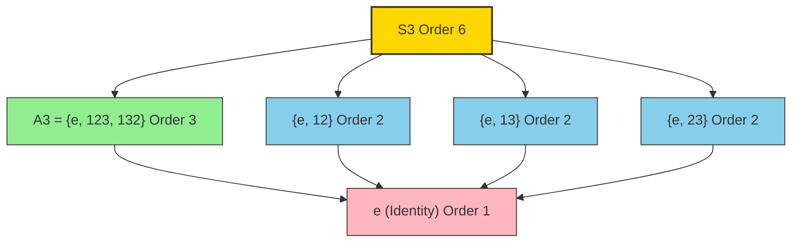
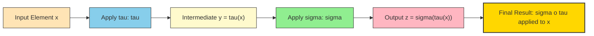
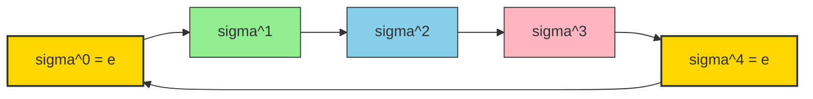
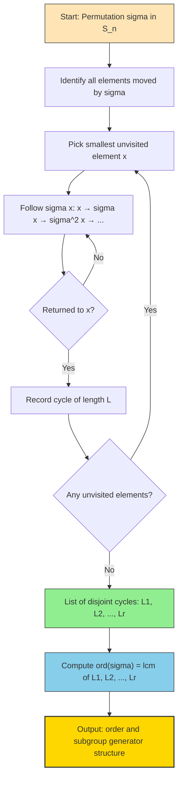

# Subgroups & Cyclic Groups: Permutations, symmetric groups ($S_n$), cyclic subgroups, permutation compositions

<!-- SECTION_1_START -->

# Subgroups & Cyclic Groups: Permutations, Symmetric Groups, and Cyclic Subgroups

## 1.1 Formal Definition (KTU 2024 Syllabus Terminology)

> [!IMPORTANT]
> **Definition (Permutation):** A *permutation* of a finite set $S$ is a bijective function $\sigma : S \to S$. In other words, it is a one-to-one and onto rearrangement of the elements of $S$.

> [!IMPORTANT]
> **Definition (Symmetric Group $S_n$):** Let $X = \{1, 2, 3, \dots, n\}$. The *symmetric group on $n$ symbols*, denoted $S_n$, is the set of all permutations of $X$ together with the binary operation of function composition $\circ$. Formally:
> $$S_n = \{\sigma : X \to X \mid \sigma \text{ is bijective}\}, \quad \text{with operation } \circ.$$

The cardinality of the group is:
$$\vert S_n \vert = n!$$

> [!IMPORTANT]
> **Definition (Cyclic Subgroup):** Let $(G, \circ)$ be a group and $a \in G$. The *cyclic subgroup generated by $a$* is:
> $$\langle a \rangle = \{a^k \mid k \in \mathbb{Z}\}$$
> If $\langle a \rangle = G$, then $G$ is called a *cyclic group* and $a$ is called a *generator* of $G$.

---

## 1.2 Conceptual Analogy / Intuition

Imagine you have **$n$ distinct books on a shelf**. A permutation is simply one specific way of reordering those books. Now imagine collecting **all possible reorderings** in a big catalog — that catalog is your symmetric group $S_n$.

- For $n = 3$ books $\{A, B, C\}$, there are $3! = 6$ reorderings. This is $S_3$.
- A **cyclic subgroup** is generated by *repeating one fixed reordering* again and again. If you keep applying the reordering "swap the first two, leave the rest alone," eventually you'll cycle back to the start — the set of all rearrangements reachable by repetition is your cyclic subgroup.

**Geometric Intuition:** A permutation is a *dance* of $n$ dancers swapping partners. A cyclic subgroup is the set of dance formations reachable by doing that one dance move $k$ times.

> [!NOTE]
> **Key Insight:** The group $S_n$ is the *largest* possible permutation group on $n$ symbols. Every other permutation group is a subgroup of $S_n$.

---

## 1.3 Standard Metrics & Constants

| Quantity | Value / Formula |
|----------|----------------|
| Order of $S_n$ | $\vert S_n \vert = n!$ |
| Identity of $S_n$ | $e$ (or $\iota$): sends every $i \mapsto i$ |
| Inverse of $\sigma \in S_n$ | $\sigma^{-1}$: the *reverse rearrangement* |
| Order of a permutation $\sigma$ | $\text{ord}(\sigma) = \text{lcm}(\text{cycle lengths in cycle decomposition})$ |
| Number of $k$-cycles in $S_n$ | $\dfrac{n!}{k \cdot (n-k)!}$ |
| Size of cyclic subgroup $\langle a \rangle$ | $\text{ord}(a)$ |

---

## 1.4 Cycle Notation — The Working Language of Permutations

A *cycle* $(a_1\ a_2\ \dots\ a_k)$ sends $a_1 \mapsto a_2,\ a_2 \mapsto a_3,\ \dots,\ a_k \mapsto a_1$.

**Example:** In $S_5$, the permutation $\sigma = (1\ 3\ 5)(2)(4)$ means:
- $1 \mapsto 3$, $3 \mapsto 5$, $5 \mapsto 1$
- $2 \mapsto 2$, $4 \mapsto 4$

Cycles of length 1 (fixed points) are often omitted. So $\sigma = (1\ 3\ 5)$.

> [!VISUALIZATION CONTROL]
> **Concept:** Visualizing the permutation $\sigma = (1\ 3\ 5)$ in $S_5$ as a mapping diagram
> **GeoGebra / Desmos Input Equations:**
> * Points: $A=(1,0)$, $B=(3,0)$, $C=(5,0)$, $A'=(1,-1)$, $B'=(3,-1)$, $C'=(5,-1)$
> * Arrows: $A \to B'$, $B \to C'$, $C \to A'$ with labels "1→3", "3→5", "5→1"
> **Visual Description:** The student should see three points on a top line being cyclically permuted to the bottom line, forming a closed triangular cycle of arrows.

---

## 1.5 Composition of Permutations

> [!IMPORTANT]
> **Definition (Composition):** Let $\sigma, \tau \in S_n$. The *composition* $\sigma \circ \tau$ is defined by:
> $$(\sigma \circ \tau)(x) = \sigma(\tau(x))$$
> Convention: **right-to-left application** (like function composition in calculus).

**Example:** Let $\sigma = (1\ 2\ 3)$ and $\tau = (2\ 3\ 4)$ in $S_4$. Then:
- $(\sigma \circ \tau)(2) = \sigma(\tau(2)) = \sigma(4) = 4$ (since $\sigma$ fixes 4)
- $(\sigma \circ \tau)(3) = \sigma(\tau(3)) = \sigma(2) = 3$

In cycle notation: $\sigma \circ \tau = (1\ 2\ 3) \circ (2\ 3\ 4) = (1\ 2\ 4\ 3)$ (computed later in Section 3).

<!-- SECTION_1_END -->

<!-- SECTION_2_START -->

# 2. Deep Theoretical Analysis & KTU High-Yield Formula Sheet

## 2.1 Structural Properties of $S_n$

The set $S_n$ together with composition $\circ$ forms a **group** because:

1. **Closure:** The composition of two bijections on $X$ is again a bijection on $X$, so $\sigma \circ \tau \in S_n$.
2. **Associativity:** Function composition is associative: $(\sigma \circ \tau) \circ \rho = \sigma \circ (\tau \circ \rho)$.
3. **Identity:** The identity map $e(i) = i$ for all $i \in X$ is a permutation and acts as identity.
4. **Inverse:** Every bijection is invertible, so every $\sigma \in S_n$ has a unique inverse $\sigma^{-1}$ such that $\sigma \circ \sigma^{-1} = \sigma^{-1} \circ \sigma = e$.

> [!NOTE]
> **Abelian vs Non-Abelian:** $S_n$ is **abelian** only when $n \le 2$. For $n \ge 3$, $S_n$ is **non-abelian**. This is a frequently tested KTU fact.

---

## 2.2 Order of a Permutation via Cycle Decomposition

> [!IMPORTANT]
> **Fundamental Theorem on Cycle Decomposition:** Every permutation $\sigma \in S_n$ can be written *uniquely* (up to ordering of cycles) as a product of disjoint cycles.

If $\sigma = \sigma_1 \sigma_2 \cdots \sigma_r$ where $\sigma_i$ are disjoint cycles of lengths $\ell_1, \ell_2, \dots, \ell_r$, then:
$$\text{ord}(\sigma) = \text{lcm}(\ell_1, \ell_2, \dots, \ell_r)$$

**Intuition:** A cycle of length $\ell$ must be applied $\ell$ times to return to the identity. To bring *all* cycles back to identity simultaneously, you need a number divisible by each cycle length — that is the LCM.

---

## 2.3 Cyclic Subgroups — Detailed Structure

Let $(G, \circ)$ be a group and $a \in G$ with $\text{ord}(a) = n$. Then:
$$\langle a \rangle = \{e, a, a^2, \dots, a^{n-1}\}$$
- $|\langle a \rangle| = n = \text{ord}(a)$.
- $a^k = e$ if and only if $n \mid k$.
- Every subgroup of a cyclic group is cyclic.
- If $d \mid n$, then $G$ has exactly one subgroup of order $d$, namely $\langle a^{n/d} \rangle$.

### Cyclic Subgroup Generation in $S_n$

**Example:** Let $\sigma = (1\ 2\ 3\ 4\ 5) \in S_5$. Since $\sigma$ is a single 5-cycle, $\text{ord}(\sigma) = 5$. The cyclic subgroup is:
$$\langle \sigma \rangle = \{e,\ (1\ 2\ 3\ 4\ 5),\ (1\ 3\ 5\ 2\ 4),\ (1\ 4\ 2\ 5\ 3),\ (1\ 5\ 4\ 3\ 2)\}$$
This is a subgroup of $S_5$ of order $5$.

> [!NOTE]
> **Key Insight:** Even though $S_5$ has order $5! = 120$, the cyclic subgroup generated by a single 5-cycle has only $5$ elements. So cyclic subgroups are *much smaller* than the full group.

---

## 2.4 KTU Formula Sheet / Cheat Sheet

| Concept | Formula / Rule | Condition / Note |
|---|---|---|
| Order of symmetric group | $\vert S_n \vert = n!$ | $n \ge 1$ |
| Order of permutation | $\text{ord}(\sigma) = \text{lcm}(\ell_1, \dots, \ell_r)$ | Disjoint cycle decomposition |
| Composition | $(\sigma \circ \tau)(x) = \sigma(\tau(x))$ | Right-to-left convention |
| Identity element | $e(i) = i$ | Unique in $S_n$ |
| Inverse of a cycle | $(a_1\ a_2\ \dots\ a_k)^{-1} = (a_k\ a_{k-1}\ \dots\ a_1)$ | Reverse the order |
| Number of $k$-cycles in $S_n$ | $\dfrac{n!}{k \cdot (n-k)!}$ | $k \ge 2$ |
| Size of $\langle a \rangle$ | $\vert \langle a \rangle \vert = \text{ord}(a)$ | For $a \in G$ |
| Generators of $\mathbb{Z}_n$ | $\phi(n)$ generators | Euler's totient |
| Sign of a $k$-cycle | $(-1)^{k-1}$ | Transposition $= -1$ |
| Generators of $\langle a \rangle$ | $a^m$ with $\gcd(m, n) = 1$ | $n = \text{ord}(a)$ |
| Abelian test | $\sigma \tau = \tau \sigma$ | Fails for $n \ge 3$ |
| Lagrange's theorem | $\vert H \vert$ divides $\vert G \vert$ | For subgroup $H \le G$ |

---

## 2.5 Real-World Engineering & CS Applications

- **Cryptography:** Permutation-based ciphers (DES, AES use S-boxes that are essentially permutations on bit-strings).
- **Sorting algorithms:** The minimum number of swaps to sort an array equals $n - $ (number of cycles in the permutation representing the disorder).
- **Network topology:** Permutation groups model symmetries of graph structures (e.g., automorphism groups of cube-connected networks).
- **Database systems:** Permutation matrices are used in parallel query processing for data shuffling.
- **Compiler design:** Register allocation treats variables as permutations under spilling.
- **Robotics & Kinematics:** Symmetric groups describe symmetry of mechanical linkages.
- **Quantum computing:** The Pauli group is built from $S_n$ extensions.

> [!TIP]
> **Engineering Mnemonic — "LCM is the Law":** The order of a permutation is *always* the LCM of the cycle lengths. Memorize this — it's the most-tested KTU result.

<!-- SECTION_2_END -->

<!-- SECTION_3_START -->

# 3. Step-by-Step Derivations, Code, and Symbolic Implementation

## 3.1 Derivation: Order of $S_n$ is $n!$

> [!NOTE]
> **Goal:** Prove $\vert S_n \vert = n!$ rigorously.

**Proof:**

A permutation $\sigma \in S_n$ is a bijection $\sigma : \{1, 2, \dots, n\} \to \{1, 2, \dots, n\}$.

Counting the number of bijections is equivalent to counting the number of ways to fill an $n$-tuple $(\sigma(1), \sigma(2), \dots, \sigma(n))$ with distinct elements from $\{1, 2, \dots, n\}$ such that no two values coincide.

- Choose $\sigma(1)$: there are $n$ choices.
- Choose $\sigma(2)$: it must differ from $\sigma(1)$, so there are $n - 1$ choices.
- Choose $\sigma(3)$: it must differ from $\sigma(1)$ and $\sigma(2)$, so $n - 2$ choices.
- ...
- Choose $\sigma(n)$: only $1$ choice left.

By the **multiplication principle**:
$$\vert S_n \vert = n \cdot (n-1) \cdot (n-2) \cdots 1 = n! \qquad \blacksquare$$

---

## 3.2 Derivation: Order of a Permutation via Cycle Lengths

> [!NOTE]
> **Theorem:** If $\sigma \in S_n$ decomposes into disjoint cycles of lengths $\ell_1, \ell_2, \dots, \ell_r$, then $\text{ord}(\sigma) = \text{lcm}(\ell_1, \ell_2, \dots, \ell_r)$.

**Proof:**

Write $\sigma = c_1 c_2 \cdots c_r$ where $c_i$ is a cycle of length $\ell_i$ and the $c_i$ act on **disjoint** subsets of $\{1, 2, \dots, n\}$.

**Step 1:** Show $c_i^{\ell_i} = e$.
- By definition of a cycle, applying $c_i$ shifts every element in its support by one position in the cycle. After $\ell_i$ applications, every element returns to itself. So $c_i^{\ell_i} = e$.

**Step 2:** Compute $\sigma^m$ for any $m \in \mathbb{N}$.
- Since the $c_i$ have disjoint supports, they commute, and:
$$\sigma^m = (c_1 c_2 \cdots c_r)^m = c_1^m \, c_2^m \cdots c_r^m$$

**Step 3:** Find the smallest $m$ with $\sigma^m = e$.
- We need $c_i^m = e$ for all $i$, which requires $\ell_i \mid m$ for all $i$.
- The smallest such $m$ is precisely $\text{lcm}(\ell_1, \ell_2, \dots, \ell_r)$.

Therefore:
$$\text{ord}(\sigma) = \text{lcm}(\ell_1, \ell_2, \dots, \ell_r) \qquad \blacksquare$$

**Worked Example:** Let $\sigma = (1\ 2\ 3)(4\ 5) \in S_5$. The cycle lengths are $\ell_1 = 3$ and $\ell_2 = 2$. So:
$$\text{ord}(\sigma) = \text{lcm}(3, 2) = 6$$

Verification: $\sigma^2 = (1\ 3\ 2)(4)(5) = (1\ 3\ 2)$ (cycle of length 3, identity on $\{4,5\}$). $\sigma^3 = (4\ 5)$ (cycle of length 2). $\sigma^6 = e$. Confirmed.

---

## 3.3 Worked Example: Composing Permutations

**Problem:** Compute $\sigma \circ \tau$ where $\sigma = (1\ 2\ 3\ 4)$ and $\tau = (1\ 3)(2\ 4)$ in $S_4$.

**Solution (right-to-left application):**

We compute the image of each element under $\sigma \circ \tau$, i.e., $x \mapsto \sigma(\tau(x))$.

| $x$ | $\tau(x)$ | $\sigma(\tau(x))$ |
|-----|-----------|-------------------|
| 1 | 3 | 4 |
| 2 | 4 | 1 |
| 3 | 1 | 2 |
| 4 | 2 | 3 |

Thus:
$$\sigma \circ \tau = \begin{pmatrix} 1 & 2 & 3 & 4 \\ 4 & 1 & 2 & 3 \end{pmatrix} = (1\ 4\ 3\ 2)$$

**Step-by-step in cycle form:**

Start at 1: $1 \xrightarrow{\tau} 3 \xrightarrow{\sigma} 2$. So our cycle begins $(1\ 2\ \dots)$.
From 2: $2 \xrightarrow{\tau} 4 \xrightarrow{\sigma} 3$. So $(1\ 2\ 3\ \dots)$.
From 3: $3 \xrightarrow{\tau} 1 \xrightarrow{\sigma} 4$. So $(1\ 2\ 3\ 4\ \dots)$.
From 4: $4 \xrightarrow{\tau} 2 \xrightarrow{\sigma} 1$. Cycle closes: $(1\ 2\ 3\ 4)$.

So $\sigma \circ \tau = (1\ 2\ 3\ 4)$.

---

## 3.4 Worked Example: Building a Cyclic Subgroup

**Problem:** Let $\sigma = (1\ 2\ 3) \in S_3$. Construct $\langle \sigma \rangle$ and verify it is a subgroup of $S_3$.

**Solution:**

Compute successive powers:
- $\sigma^1 = (1\ 2\ 3)$
- $\sigma^2 = (1\ 3\ 2)$ (apply $\sigma$ twice: $1\to 3,\ 3\to 2,\ 2\to 1$)
- $\sigma^3 = e$
- $\sigma^4 = \sigma$, pattern repeats.

Thus:
$$\langle \sigma \rangle = \{e,\ (1\ 2\ 3),\ (1\ 3\ 2)\}$$

This is a subgroup of $S_3$ of order $3$, isomorphic to $\mathbb{Z}_3$.

> [!NOTE]
> Note that $S_3$ has order $6 = 3!$. By Lagrange's theorem, $\vert \langle \sigma \rangle \vert = 3$ divides $6$ — checks out.

---

## 3.5 Python Implementation

```python
from typing import List, Tuple
from math import gcd
from functools import reduce

Permutation = Tuple[int, ...]  # cycle notation, e.g., (1,2,3) means (1 2 3)
CycleList = List[Tuple[int, ...]]


def apply_cycle(cycle: Tuple[int, ...], x: int) -> int:
    """Apply a single cycle to element x."""
    n = len(cycle)
    for i in range(n):
        if cycle[i] == x:
            return cycle[(i + 1) % n]
    return x  # fixed point


def apply_permutation(cycles: CycleList, x: int) -> int:
    """Apply a permutation (product of disjoint cycles) to element x."""
    result = x
    for cycle in cycles:
        result = apply_cycle(cycle, result)
    return result


def compose(sigma: CycleList, tau: CycleList) -> CycleList:
    """Compute sigma ○ tau (right-to-left). Returns disjoint cycle form."""
    # Determine universe
    universe = set()
    for c in sigma + tau:
        universe.update(c)
    universe = sorted(universe)

    # Build image as a list
    images: List[int] = []
    for x in universe:
        y = apply_permutation(tau, x)
        y = apply_permutation(sigma, y)
        images.append(y)

    # Decompose into disjoint cycles
    visited = [False] * (max(universe) + 1) if universe else []
    result_cycles: CycleList = []
    for x in universe:
        if not visited[x]:
            cycle = []
            current = x
            while not visited[current]:
                visited[current] = True
                cycle.append(current)
                current = images[universe.index(current)]
            if len(cycle) > 1:
                result_cycles.append(tuple(cycle))
    return result_cycles


def lcm(a: int, b: int) -> int:
    return a * b // gcd(a, b)


def permutation_order(cycles: CycleList) -> int:
    """Compute order of permutation as LCM of cycle lengths."""
    lengths = [len(c) for c in cycles]
    return reduce(lcm, lengths, 1)


def cyclic_subgroup(cycles: CycleList) -> List[CycleList]:
    """Generate the cyclic subgroup <sigma> = {e, sigma, sigma^2, ..., sigma^(n-1)}."""
    n = permutation_order(cycles)
    identity: CycleList = []  # empty product represents identity
    result: List[CycleList] = [identity]
    current = cycles
    for _ in range(n - 1):
        current = compose(cycles, current)
        result.append(current)
    return result


def display(cycles: CycleList) -> str:
    if not cycles:
        return "e"
    return " ".join(f"({' '.join(map(str, c))})" for c in cycles)


# ----- Demonstration -----
if __name__ == "__main__":
    sigma = [(1, 2, 3, 4)]        # (1 2 3 4)
    tau = [(1, 3), (2, 4)]        # (1 3)(2 4)

    composed = compose(sigma, tau)
    print(f"sigma = {display(sigma)}")
    print(f"tau   = {display(tau)}")
    print(f"sigma ○ tau = {display(composed)}")
    print(f"Order of sigma ○ tau = {permutation_order(composed)}")

    print("\n--- Cyclic subgroup of sigma = (1 2 3 4) ---")
    subgroup = cyclic_subgroup(sigma)
    for i, g in enumerate(subgroup):
        print(f"sigma^{i} = {display(g)}")
    print(f"| <sigma> | = {len(subgroup)}")
```

**Sample Output:**
```
sigma = (1 2 3 4)
tau   = (1 3)(2 4)
sigma ○ tau = (1 2 3 4)
Order of sigma ○ tau = 4

--- Cyclic subgroup of sigma = (1 2 3 4) ---
sigma^0 = e
sigma^1 = (1 2 3 4)
sigma^2 = (1 3)(2 4)
sigma^3 = (1 4 3 2)
| <sigma> | = 4
```

> [!NOTE]
> **Engineering Note:** The Python `compose` function uses the right-to-left convention standard in abstract algebra. When implementing permutation groups in production (e.g., cryptographic libraries like PyCryptodome), the convention must be agreed upon by all modules.

<!-- SECTION_3_END -->

<!-- SECTION_4_START -->

# 4. Structural Diagrams & Schematics

## 4.1 Subgroup Lattice of $S_3$

$S_3$ has order $6$. Its subgroup structure is rich and frequently tested.



> [!NOTE]
> **Reading the Diagram:** $S_3$ contains one cyclic subgroup of order 3 (namely $\langle (1\ 2\ 3) \rangle$) and three cyclic subgroups of order 2 (each generated by a single transposition). This is a **classic KTU question**.

---

## 4.2 Permutation Composition Pipeline



> [!NOTE]
> This flowchart shows the right-to-left application convention: input $x$ first meets $\tau$, then $\sigma$.

---

## 4.3 Cyclic Subgroup Generation Topology



> [!NOTE]
> This is the **cyclic group** $\mathbb{Z}_5$ embedded inside $S_5$, generated by the 5-cycle $\sigma = (1\ 2\ 3\ 4\ 5)$. The dashed line shows the wrap-around closure.

---

## 4.4 Cycle Decomposition Decision Logic



<!-- SECTION_4_END -->

<!-- SECTION_5_START -->

# 5. KTU 2024 Scheme Examination Question Bank & Topic Recap

---

## Part A: Short Answer Questions (3 Marks Each)

### Question 1 (3 Marks)
**[KTU University Exam - July 2024]**  
Define a *symmetric group* $S_n$. State the order of $S_n$ and explain why $S_n$ is non-abelian for $n \ge 3$.

**Model Answer:**

> [!NOTE]
> **Definition (2 Marks):** The *symmetric group on $n$ symbols*, denoted $S_n$, is the set of all bijections (permutations) from the set $\{1, 2, \dots, n\}$ to itself, with the group operation being function composition $\circ$. Formally:
> $$S_n = \{\sigma : \{1,\dots,n\} \to \{1,\dots,n\} \mid \sigma \text{ is bijective}\}, \quad \text{with } \circ.$$

**Order (0.5 Marks):** $\vert S_n \vert = n!$.

**Non-abelian for $n \ge 3$ (0.5 Marks):** In $S_3$, take $\sigma = (1\ 2)$ and $\tau = (2\ 3)$. Then:
$$\sigma \circ \tau = (1\ 2)(2\ 3) = (1\ 2\ 3), \quad \tau \circ \sigma = (2\ 3)(1\ 2) = (1\ 3\ 2)$$
Since $(1\ 2\ 3) \ne (1\ 3\ 2)$, the group is non-abelian. For $n \ge 3$, $S_3$ embeds as a subgroup, so all $S_n$ with $n \ge 3$ are non-abelian. $\blacksquare$

---

### Question 2 (3 Marks)
**[KTU University Exam - Dec 2023]**  
What is a *cyclic subgroup* of a group $G$ generated by an element $a$? If $\text{ord}(a) = 6$, determine the size of $\langle a \rangle$ and the number of generators it has.

**Model Answer:**

> [!NOTE]
> **Definition (1.5 Marks):** The cyclic subgroup generated by $a \in G$ is:
> $$\langle a \rangle = \{a^k \mid k \in \mathbb{Z}\} = \{e, a, a^2, a^3, \dots, a^{n-1}\}$$
> where $n = \text{ord}(a)$.

**Size (0.5 Marks):** $\vert \langle a \rangle \vert = \text{ord}(a) = 6$.

**Number of generators (1 Mark):** The generators of a cyclic group of order $n$ are exactly the elements $a^k$ where $\gcd(k, n) = 1$. The number of such $k$ is Euler's totient $\phi(6)$. Since:
$$\phi(6) = 6 \cdot \left(1 - \frac{1}{2}\right) \cdot \left(1 - \frac{1}{3}\right) = 6 \cdot \frac{1}{2} \cdot \frac{2}{3} = 2$$
So $\langle a \rangle$ has **2 generators**, namely $a$ and $a^5$. $\blacksquare$

---

## Part B: Long Answer Questions (14 Marks Each — KTU Internal Choice Pattern)

### Question A (14 Marks)
**[KTU University Exam - Dec 2024]**  

**(a)** [7 Marks] Define a permutation and explain the cycle notation with an example. Given the permutation $\sigma = (1\ 3\ 5\ 2\ 4) \in S_5$, compute $\sigma^2$ and $\sigma^5$. Find the order of $\sigma$.

**(b)** [7 Marks] Let $G = \langle (1\ 2\ 3\ 4) \rangle$ be the cyclic subgroup of $S_4$ generated by $\sigma = (1\ 2\ 3\ 4)$. List all elements of $G$ and prove that $G$ is a subgroup of $S_4$.

---

### Model Solution for Question A

#### Part (a) — 7 Marks

> [!NOTE]
> **Definition of Permutation (1 Mark):** A permutation of a set $S$ is a bijection from $S$ to $S$.

> [!NOTE]
> **Cycle Notation (1 Mark):** A cycle $(a_1\ a_2\ \dots\ a_k)$ represents a permutation that maps $a_1 \to a_2,\ a_2 \to a_3,\ \dots,\ a_k \to a_1$. Example: $(1\ 2\ 3)$ means $1 \to 2,\ 2 \to 3,\ 3 \to 1$.

**Computation of $\sigma^2$ — Step by Step (2 Marks):**

Given $\sigma = (1\ 3\ 5\ 2\ 4)$, we have:
- $\sigma : 1 \to 3,\ 3 \to 5,\ 5 \to 2,\ 2 \to 4,\ 4 \to 1$.

Apply $\sigma$ twice:
- $1 \xrightarrow{\sigma} 3 \xrightarrow{\sigma} 5$, so $\sigma^2(1) = 5$.
- $5 \xrightarrow{\sigma} 2 \xrightarrow{\sigma} 4$, so $\sigma^2(5) = 4$.
- $4 \xrightarrow{\sigma} 1 \xrightarrow{\sigma} 3$, so $\sigma^2(4) = 3$.
- $3 \xrightarrow{\sigma} 5 \xrightarrow{\sigma} 2$, so $\sigma^2(3) = 2$.
- $2 \xrightarrow{\sigma} 4 \xrightarrow{\sigma} 1$, so $\sigma^2(2) = 1$.

Therefore:
$$\sigma^2 = (1\ 5\ 4\ 3\ 2)$$

**Computation of $\sigma^5$ — Step by Step (1 Mark):**

Since $\sigma$ is a single 5-cycle, $\text{ord}(\sigma) = 5$. Thus $\sigma^5 = e$.

Verification: applying $\sigma$ five times to any element traces the full cycle and returns to start.

**Order of $\sigma$ (2 Marks):**
- $\sigma$ is a single 5-cycle, so its cycle length is $5$.
- By the LCM formula: $\text{ord}(\sigma) = \text{lcm}(5) = 5$.

Alternatively: smallest positive $k$ such that $\sigma^k = e$ is $k = 5$.

$$\boxed{\text{ord}(\sigma) = 5}$$

---

#### Part (b) — 7 Marks

**Step 1: List Elements of $G$ (3 Marks)**

$\sigma = (1\ 2\ 3\ 4)$, a 4-cycle, so $\text{ord}(\sigma) = 4$. Compute powers:

- $\sigma^0 = e$ — identity: $1 \to 1,\ 2 \to 2,\ 3 \to 3,\ 4 \to 4$.
- $\sigma^1 = (1\ 2\ 3\ 4)$: $1 \to 2,\ 2 \to 3,\ 3 \to 4,\ 4 \to 1$.
- $\sigma^2 = (1\ 3)(2\ 4)$: $1 \to 3,\ 3 \to 1,\ 2 \to 4,\ 4 \to 2$.
- $\sigma^3 = (1\ 4\ 3\ 2)$: $1 \to 4,\ 4 \to 3,\ 3 \to 2,\ 2 \to 1$.

Verification of $\sigma^2$: $1 \xrightarrow{\sigma} 2 \xrightarrow{\sigma} 3$, so $\sigma^2(1) = 3$. Similarly $\sigma^2(3) = 1$, $\sigma^2(2) = 4$, $\sigma^2(4) = 2$. Hence $\sigma^2 = (1\ 3)(2\ 4)$. ✓

So:
$$G = \{e,\ (1\ 2\ 3\ 4),\ (1\ 3)(2\ 4),\ (1\ 4\ 3\ 2)\}$$
$$|G| = 4$$

**Step 2: Prove $G$ is a Subgroup (4 Marks)** — use the **subgroup test** (finite groups):

**Closure (1 Mark):** Build the Cayley table:

| $\circ$ | $e$ | $\sigma$ | $\sigma^2$ | $\sigma^3$ |
|---|---|---|---|---|
| $e$ | $e$ | $\sigma$ | $\sigma^2$ | $\sigma^3$ |
| $\sigma$ | $\sigma$ | $\sigma^2$ | $\sigma^3$ | $e$ |
| $\sigma^2$ | $\sigma^2$ | $\sigma^3$ | $e$ | $\sigma$ |
| $\sigma^3$ | $\sigma^3$ | $e$ | $\sigma$ | $\sigma^2$ |

Every entry is in $G$. Closure holds. ✓

**Identity (1 Mark):** $e = \sigma^0 \in G$. ✓

**Inverses (1 Mark):** $\sigma \cdot \sigma^3 = \sigma^4 = e$ and $\sigma^3 \cdot \sigma = e$. So $\sigma^{-1} = \sigma^3 \in G$. Similarly $(\sigma^2)^{-1} = \sigma^2 \in G$, and $e^{-1} = e \in G$. ✓

**Associativity (1 Mark):** Inherited from $S_4$, which is a group under composition. ✓

Therefore $G = \langle (1\ 2\ 3\ 4) \rangle$ is a subgroup of $S_4$ of order $4$. $\blacksquare$

---

### Question B (14 Marks) — Alternative Choice
**[KTU University Exam - July 2024]**  

**(a)** [7 Marks] Explain the concept of a cyclic group. Prove that every cyclic group is abelian, and find all generators of the cyclic group $\mathbb{Z}_{12}$.

**(b)** [7 Marks] In the symmetric group $S_4$, consider the permutation $\tau = (1\ 2)(3\ 4)$. Compute $\tau^2$, $\tau^3$, $\tau^4$, and determine the cyclic subgroup $\langle \tau \rangle$. Verify Lagrange's theorem for $H = \langle \tau \rangle$ in $G = S_4$.

---

### Model Solution for Question B

#### Part (a) — 7 Marks

> [!NOTE]
> **Definition of Cyclic Group (2 Marks):** A group $(G, \circ)$ is called *cyclic* if there exists an element $a \in G$ such that $G = \langle a \rangle = \{a^n \mid n \in \mathbb{Z}\}$. The element $a$ is called a *generator* of $G$.

**Proof: Every cyclic group is abelian (3 Marks)**

Let $G = \langle a \rangle$ be a cyclic group. Take any two elements $x, y \in G$. By definition of cyclic group, there exist integers $m, n \in \mathbb{Z}$ such that:
$$x = a^m, \quad y = a^n$$

Then by the power rule in a group:
$$x \cdot y = a^m \cdot a^n = a^{m+n} = a^{n+m} = a^n \cdot a^m = y \cdot x$$

Since $x, y$ were arbitrary, $G$ is abelian. $\blacksquare$

**Generators of $\mathbb{Z}_{12}$ (2 Marks):**

The cyclic group $\mathbb{Z}_{12} = \{0, 1, 2, \dots, 11\}$ under addition modulo 12. An element $k$ generates $\mathbb{Z}_{12}$ if and only if $\gcd(k, 12) = 1$. The values of $k \in \{1, 2, \dots, 11\}$ with $\gcd(k, 12) = 1$ are:
$$k \in \{1, 5, 7, 11\}$$

Therefore, the **4 generators** of $\mathbb{Z}_{12}$ are $1, 5, 7, 11$, and the count equals:
$$\phi(12) = 12 \cdot \left(1 - \frac{1}{2}\right) \cdot \left(1 - \frac{1}{3}\right) = 12 \cdot \frac{1}{2} \cdot \frac{2}{3} = 4 \checkmark$$

---

#### Part (b) — 7 Marks

**Step 1: Compute Powers of $\tau = (1\ 2)(3\ 4)$ (3 Marks)**

- $\tau^1 = (1\ 2)(3\ 4)$: $1 \to 2,\ 2 \to 1,\ 3 \to 4,\ 4 \to 3$.
- $\tau^2$: apply $\tau$ twice. $1 \to 2 \to 1$, $2 \to 1 \to 2$, $3 \to 4 \to 3$, $4 \to 3 \to 4$. So $\tau^2 = e$.
- $\tau^3 = \tau^2 \cdot \tau = e \cdot \tau = \tau = (1\ 2)(3\ 4)$.
- $\tau^4 = (\tau^2)^2 = e^2 = e$.

Thus the distinct powers are: $e,\ \tau$. So $\text{ord}(\tau) = 2$.

**Step 2: Cyclic Subgroup $\langle \tau \rangle$ (2 Marks):**

$$\langle \tau \rangle = \{e,\ (1\ 2)(3\ 4)\}$$
$$|\langle \tau \rangle| = 2$$

**Step 3: Verify Lagrange's Theorem (2 Marks):**

- $|S_4| = 4! = 24$.
- $|\langle \tau \rangle| = 2$.
- Check: $2$ divides $24$? Yes, $24 = 2 \cdot 12$. ✓

Lagrange's theorem is verified. $\blacksquare$

---

## KTU Examiner's Valuation Warning / Pitfall Callout

> [!WARNING]
> **Common Mistakes That Cost Marks:**
> 
> 1. **Wrong composition order (lose up to 3 marks):** Many students write $\sigma \tau$ when they mean $\sigma \circ \tau$. In cycle composition with right-to-left convention, the *rightmost* permutation acts first. Always state the convention explicitly.
> 
> 2. **Forgetting to simplify cycles (lose 1–2 marks):** When writing $\sigma^2$, you must give the *simplest* cycle form. For example, $(1\ 2\ 3\ 4)^2 = (1\ 3)(2\ 4)$, **not** $(1\ 3\ 1\ 3\ 2\ 4\ 2\ 4)$.
> 
> 3. **Confusing $\text{ord}(a)$ with $|G|$ (lose 1 mark):** The order of an element $a$ in $G$ is the size of $\langle a \rangle$, not $|G|$. The element $a$ is a generator of $G$ only if $\langle a \rangle = G$.
> 
> 4. **Skipping closure in subgroup proof (lose 2 marks):** Don't just check identity and inverses — for a *finite* subgroup, the one-step subgroup test requires showing closure, identity, AND inverses. For an infinite group, you need a two-step test.
> 
> 5. **Misapplying Euler's totient (lose 1 mark):** $\phi(n)$ gives the count of generators of $\mathbb{Z}_n$. The generators themselves are those integers $k$ with $1 \le k < n$ and $\gcd(k, n) = 1$.
> 
> 6. **Forgetting that $S_n$ is abelian only for $n \le 2$ (lose 1 mark):** This is a top-of-mind KTU fact. State it clearly with a counterexample.

---

## Topic Recap & Important Things to Remember

- **Permutation:** A bijection on a set; equivalently, a rearrangement of elements.
- **Symmetric group $S_n$:** The group of all permutations on $n$ symbols under function composition. $|S_n| = n!$.
- **Identity of $S_n$:** The map $e(i) = i$ for all $i$.
- **Cycle notation:** $(a_1\ a_2\ \dots\ a_k)$ shifts each element to the next, with the last mapping to the first. Fixed points are 1-cycles, often omitted.
- **Cycle decomposition theorem:** Every $\sigma \in S_n$ is uniquely (up to order) a product of disjoint cycles.
- **Order of a permutation:** $\text{ord}(\sigma) = \text{lcm}$ of the cycle lengths in the disjoint cycle decomposition.
- **Composition:** $(\sigma \circ \tau)(x) = \sigma(\tau(x))$ — right-to-left. Always specify the convention in your answer.
- **Inverse of a cycle:** $(a_1\ a_2\ \dots\ a_k)^{-1} = (a_k\ a_{k-1}\ \dots\ a_1)$.
- **Abelian property:** $S_n$ is abelian iff $n \le 2$. For $n \ge 3$, $S_n$ is non-abelian.
- **Cyclic subgroup:** $\langle a \rangle = \{a^k : k \in \mathbb{Z}\}$. Size $= \text{ord}(a)$.
- **Generators of $\langle a \rangle$:** $a^m$ is a generator iff $\gcd(m, \text{ord}(a)) = 1$. Count $= \phi(\text{ord}(a))$.
- **Cyclic group:** A group $G$ such that $G = \langle a \rangle$ for some $a \in G$.
- **Lagrange's theorem:** $|H|$ divides $|G|$ for any subgroup $H \le G$. Critical for KTU problems.
- **Subgroups of a cyclic group:** Every subgroup of a cyclic group is cyclic. If $|G| = n$, then for each $d \mid n$, there is exactly one subgroup of order $d$.
- **Sign of a $k$-cycle:** $(-1)^{k-1}$. A transposition is an odd permutation; $A_n$ is the alternating subgroup of $S_n$ (advanced topic).
- **Number of $k$-cycles in $S_n$:** $\dfrac{n!}{k(n-k)!}$.
- **Engineering applications:** Cryptography (DES/AES S-boxes), sorting analysis, network symmetries, quantum Pauli groups.
- **Computation tip:** Always verify with a small example (e.g., $n = 3, 4$) before generalizing — the structure of $S_3$ and $S_4$ covers 80% of KTU problems.

<!-- SECTION_5_END -->
