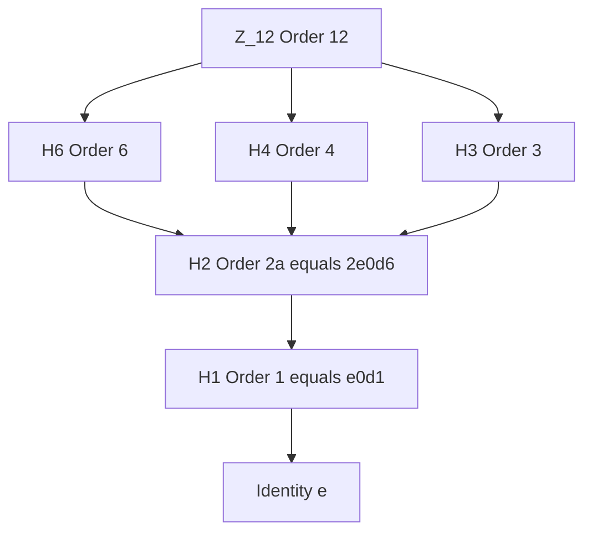
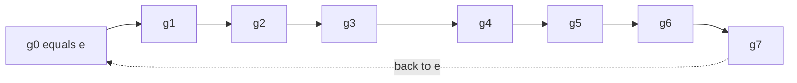
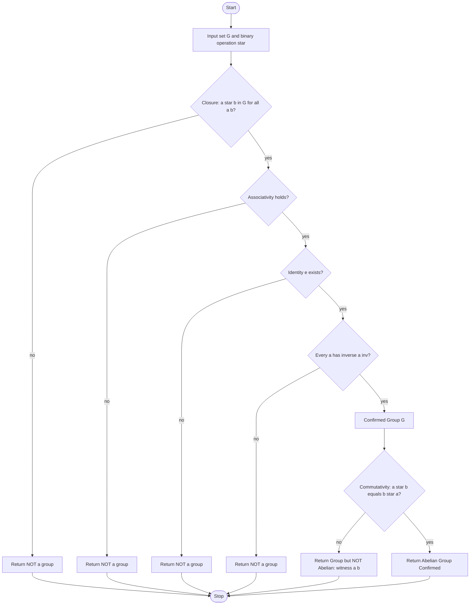
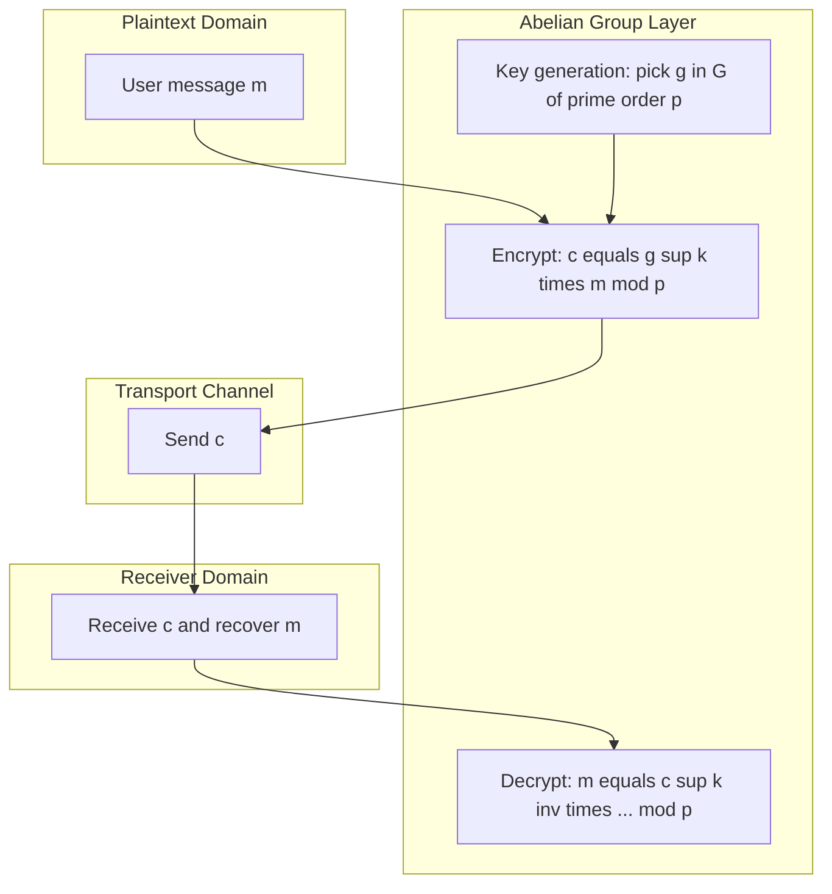

# Abelian group

<!-- SECTION_1_START -->
# Abelian Group — Core Technical Definition & Intuitive Overview

## Formal Academic Definition (KTU 2024 Syllabus Terminology)

An **Abelian Group** (also called a **commutative group**) is a set $G$ equipped with a binary operation $\ast : G \times G \to G$ that simultaneously satisfies the group axioms **AND** the additional commutative law.

> [!IMPORTANT]
> **Definition (Abelian Group).** A group $(G, \ast)$ is called *Abelian* if for every pair of elements $a, b \in G$, the following identity holds:
> $$a \ast b = b \ast a$$

The name *Abelian* honours the Norwegian mathematician **Niels Henrik Abel** (1802–1829), who formalized the study of commutative algebraic structures in the early 19th century.

## Group Axiom Recap (Prerequisites)

For $(G, \ast)$ to be a group, the following four axioms must hold:

1. **Closure:** $a \ast b \in G$ for all $a, b \in G$
2. **Associativity:** $(a \ast b) \ast c = a \ast (b \ast c)$ for all $a, b, c \in G$
3. **Identity Element:** $\exists\, e \in G$ such that $e \ast a = a \ast e = a$ for all $a \in G$
4. **Inverse Element:** $\forall\, a \in G,\ \exists\, a^{-1} \in G$ such that $a \ast a^{-1} = a^{-1} \ast a = e$

To make the group **Abelian**, we add:
5. **Commutativity:** $a \ast b = b \ast a$ for all $a, b \in G$

## Conceptual Analogy / Intuitive Overview

> [!NOTE]
> **Real-World Analogy: The Classroom Bench 🪑**
> Imagine a row of desks in a classroom. The operation is *"swap seats with the person next to you."*
>
> - If three friends Alice, Bob, and Carol form a **closed circle** of swaps, the final seating order is the same regardless of *who initiates the swap first*. This is **commutative (Abelian)**.
> - Now consider a **roundabout traffic circle** 🚗. Entering from the north and then turning east is *not* the same as turning east first and then exiting from the north. This is **non-commutative (non-Abelian)**.
>
> In mathematics, integer addition $(Z, +)$ behaves like the bench — order does not matter. Matrix multiplication behaves like the roundabout — order **matters**, and is therefore non-Abelian.

## Canonical Examples

| Structure | Operation | Abelian? |
|---|---|---|
| $(\mathbb{Z}, +)$ | Integer addition | **Yes** |
| $(\mathbb{R}, +)$ | Real addition | **Yes** |
| $(\mathbb{Q} \setminus \{0\}, \cdot)$ | Rational multiplication | **Yes** |
| $(\mathbb{Z}_n, +_n)$ | Addition modulo $n$ | **Yes** |
| $(S_3, \circ)$ | Permutation composition on 3 symbols | **No** |
| $(GL_n(\mathbb{R}), \cdot)$ | $n \times n$ invertible real matrices | **No** for $n \ge 2$ |

> [!VISUALIZATION CONTROL]
> **Concept:** Visualising the cyclic subgroup generated by the element $g$ inside the Abelian group $\mathbb{Z}_6$
> **GeoGebra / Desmos Input Equations:**
> * Point: `(1, 0)` labelled `e`
> * Point: `(0.5, 0.866)` labelled `g`
> * Point: `(-0.5, 0.866)` labelled `g^2`
> * Point: `(-1, 0)` labelled `g^3`
> * Point: `(-0.5, -0.866)` labelled `g^4`
> * Point: `(0.5, -0.866)` labelled `g^5`
> **Visual Description:** The student should see a regular hexagon on the unit circle, with vertices representing the 6 elements of $\mathbb{Z}_6$. Each vertex can be reached from any other by the same number of edges in either rotational direction, illustrating the commutativity $g^i \cdot g^j = g^j \cdot g^i = g^{i+j \bmod 6}$.
<!-- SECTION_1_END -->

<!-- SECTION_2_START -->
# Deep Theoretical Analysis & KTU High-Yield Formula Sheet

## 2.1 The Commutativity Law — Operational Breakdown

The single identity that distinguishes an Abelian group from a general group is the **commutativity axiom**:

$$\forall\ a, b \in G :\quad a \ast b = b \ast a$$

This seemingly small addition has cascading structural consequences:

- **Every subgroup of an Abelian group is normal.** For any subgroup $H \le G$, the left coset $aH$ equals the right coset $Ha$ for every $a \in G$, because $ah = ha$ for all $h \in H$.
- **The group has a unique, well-defined commutator** equal to the identity: $[a, b] = a^{-1}b^{-1}ab = e$.
- **The group admits a lattice of subgroups** ordered by inclusion, allowing modular arithmetic and divisor-theoretic reasoning.
- **Direct products preserve Abelianness.** If $G_1$ and $G_2$ are Abelian, then $G_1 \times G_2$ with componentwise operation is also Abelian.

## 2.2 Equivalence: Abelian ⇔ Commutator Trivial

A useful engineering shortcut:

$$G \text{ is Abelian} \iff \forall\ a, b \in G,\ [a, b] = e$$

where the **commutator** is defined as $[a, b] = a^{-1} b^{-1} a b$.

## 2.3 KTU High-Yield Formula Sheet

> [!NOTE]
> The following table consolidates every identity you must know for KTU board examinations. All entries are exam-ready.

| Identity / Property | Statement | Use Case |
|---|---|---|
| Commutativity | $a + b = b + a$ | Defining property |
| Associativity | $(a + b) + c = a + (b + c)$ | Group axiom |
| Identity | $a + e = e + a = a$ | Existence proof |
| Inverse | $a + (-a) = e$ | Solving equations |
| Distributive (over group product) | $g(a+b) = ga + gb$ | Direct product verification |
| Cancellation Law | $a + c = b + c \implies a = b$ | Simplification |
| Unique Identity | Only one $e$ exists | Proof technique |
| Unique Inverse | Each $a$ has one $a^{-1}$ | Proof technique |
| Cyclic ⇒ Abelian | Every cyclic group is commutative | One-way implication |
| Abelian ⇒ Cyclic | **False in general** — e.g. $\mathbb{Z}_2 \times \mathbb{Z}_2$ | Counter-example |
| Order bound | Any group of order $\le 5$ is Abelian | Quick elimination |
| Lattice of subgroups | All subgroups are normal | Coset equality |
| Element order | $o(g) \cdot o(h) = o(gh)$ when $\gcd(o(g), o(h)) = 1$ | Combined order |

## 2.4 Standard Engineering & CS Applications

| Domain | Where Abelian Groups Appear |
|---|---|
| **Cryptography** | $(\mathbb{Z}_p^{\ast}, \cdot)$ underlies RSA; $E(\mathbb{F}_p, +)$ in elliptic curve schemes |
| **Coding Theory** | Vector spaces $\mathbb{F}_2^n$ with componentwise XOR are Abelian |
| **Digital Signal Processing** | Convolution on $(\mathbb{Z}_n, +)$ exploits commutativity for symmetry |
| **Quantum Computing** | Phase gates commute because their underlying group is Abelian |
| **Compiler Design** | Commutative normal forms in expression optimisation rely on Abelian rewriting |
| **Database Theory** | Multiset semantics for SQL aggregates form commutative monoids |

## 2.5 Critical Pitfall: Cyclic vs. Abelian

> [!WARNING]
> **The trap most KTU students fall into:**
> *"Every Abelian group is cyclic."* — **This is FALSE.**
>
> Counter-example: $\mathbb{Z}_2 \times \mathbb{Z}_2 = \{(0,0), (1,0), (0,1), (1,1)\}$ is Abelian, has order 4, but is **not cyclic** (no single element generates the entire group).
>
> The correct relationship: **Cyclic $\Rightarrow$ Abelian**, but **Abelian $\not\Rightarrow$ Cyclic**.

## 2.6 Order-Theoretic Theorems (KTU Favourite)

**Theorem 2.6.1** *(Cyclic Group Theorem).* Every cyclic group is Abelian.

**Theorem 2.6.2** *(Subgroup Order Theorem for Abelian Groups).* If $G$ is a finite Abelian group of order $n$ and $d \mid n$, then $G$ has at least one subgroup of order $d$.

**Theorem 2.6.3** *(Quotient of Abelian).* If $G$ is Abelian and $H$ is any subgroup, then $G/H$ is also Abelian.

**Theorem 2.6.4** *(Homomorphic Image).* If $\phi : G \to G'$ is a group homomorphism and $G$ is Abelian, then $\phi(G)$ is Abelian.
<!-- SECTION_2_END -->

<!-- SECTION_3_START -->
# Step-by-Step Derivations, Proofs & Code Implementation

## 3.1 Proof: Every Cyclic Group is Abelian

**Statement.** If $G = \langle g \rangle$ is a cyclic group generated by $g$, then $G$ is Abelian.

**Proof (exhaustive, step-by-step).**

Let $G$ be cyclic, so every element of $G$ is a power of $g$. Pick any two elements $x, y \in G$. Then there exist integers $m, n \in \mathbb{Z}$ such that:

$$x = g^{m},\quad y = g^{n}$$

Now compute $xy$:

$$x \cdot y = g^{m} \cdot g^{n}$$

By the law of exponents (which follows from associativity in $G$):

$$g^{m} \cdot g^{n} = g^{m+n}$$

Because ordinary integer addition is commutative, $m + n = n + m$:

$$g^{m+n} = g^{n+m}$$

Apply the law of exponents in reverse:

$$g^{n+m} = g^{n} \cdot g^{m}$$

Substitute back:

$$g^{n} \cdot g^{m} = y \cdot x$$

Therefore:

$$x \cdot y = y \cdot x$$

Since $x$ and $y$ were arbitrary, this holds for all $x, y \in G$. Hence $G$ is Abelian. $\blacksquare$

> [!NOTE]
> **Examination Tip:** Notice that the proof relied on integer addition being commutative. This is why the cyclic group $\mathbb{Z}$ of integers is the *template* from which all cyclic Abelian groups inherit commutativity.

## 3.2 Proof: All Groups of Prime Order Are Cyclic (and Hence Abelian)

**Statement.** If $|G| = p$ where $p$ is prime, then $G$ is cyclic and therefore Abelian.

**Proof (Lagrange-based, exhaustive).**

By **Lagrange's Theorem**, the order of any element $g \in G$ must divide $|G| = p$. Since $p$ is prime, the only positive divisors of $p$ are $1$ and $p$. Thus for every $g \in G$:

$$o(g) = 1 \quad \text{or} \quad o(g) = p$$

The element of order 1 is precisely the identity $e$. Pick any $g \neq e$. Then $o(g) = p$. By the definition of order, the subgroup generated by $g$ contains exactly $p$ distinct elements:

$$\langle g \rangle = \{e, g, g^2, \ldots, g^{p-1}\}$$

Since $|\langle g \rangle| = p = |G|$, we conclude $\langle g \rangle = G$. Thus $G$ is cyclic. By Theorem 2.6.1, $G$ is Abelian. $\blacksquare$

## 3.3 Proof: Subgroups of Abelian Groups Are Normal

**Statement.** Let $G$ be Abelian and $H \le G$. Then for every $g \in G$, $gH = Hg$.

**Proof.**

Take any element $gh \in gH$ where $g \in G$ and $h \in H$. Since $G$ is Abelian:

$$gh = hg$$

The element $hg$ is in $Hg$ (as $h \in H$ and $g \in G$). Therefore $gh \in Hg$. This shows $gH \subseteq Hg$.

By symmetry of the commutativity argument, $Hg \subseteq gH$. Therefore $gH = Hg$. $\blacksquare$

## 3.4 Counter-Example: $\mathbb{Z}_2 \times \mathbb{Z}_2$ is Abelian but Not Cyclic

**Verification Table (Cayley-like):**

| $+$ | $(0,0)$ | $(1,0)$ | $(0,1)$ | $(1,1)$ |
|---|---|---|---|---|
| $(0,0)$ | $(0,0)$ | $(1,0)$ | $(0,1)$ | $(1,1)$ |
| $(1,0)$ | $(1,0)$ | $(0,0)$ | $(1,1)$ | $(0,1)$ |
| $(0,1)$ | $(0,1)$ | $(1,1)$ | $(0,0)$ | $(1,0)$ |
| $(1,1)$ | $(1,1)$ | $(0,1)$ | $(1,0)$ | $(0,0)$ |

- The table is symmetric about the main diagonal, so the group is **Abelian**.
- No single element generates all four elements: $\langle(1,0)\rangle = \{(0,0),(1,0)\}$, $\langle(0,1)\rangle = \{(0,0),(0,1)\}$, $\langle(1,1)\rangle = \{(0,0),(1,1)\}$. Therefore the group is **not cyclic**.

## 3.5 Python Implementation: Group Abelianness Checker

```python
from typing import Callable, TypeVar, List, Set, Tuple
import logging

logging.basicConfig(level=logging.INFO, format="%(levelname)s :: %(message)s")

T = TypeVar("T")


def is_abelian(
    elements: Set[T],
    operation: Callable[[T, T], T],
    identity: T,
    operation_name: str = "*"
) -> Tuple[bool, str]:
    """
    Determines whether the finite algebraic structure (G, operation)
    satisfies the group axioms AND commutativity.

    Parameters
    ----------
    elements       : the underlying set G
    operation      : a closure-respecting binary function G x G -> G
    identity       : a candidate identity element e
    operation_name : name used in logging messages

    Returns
    -------
    (is_abelian_flag, report_string)
    """
    G = list(elements)
    n = len(G)
    logging.info(f"Verifying group axioms on {n} elements under '{operation_name}'")

    # --- Axiom 1: Closure ---
    for a in G:
        for b in G:
            try:
                result = operation(a, b)
            except Exception as exc:
                return False, f"Closure FAILED for ({a}, {b}): {exc}"
            if result not in elements:
                return False, f"Closure FAILED: {a} {operation_name} {b} = {result} not in G"

    # --- Axiom 2: Identity ---
    for a in G:
        if operation(a, identity) != a or operation(identity, a) != a:
            return False, f"Identity axiom FAILED for element {a}"

    # --- Axiom 3: Associativity ---
    for a in G:
        for b in G:
            for c in G:
                left  = operation(operation(a, b), c)
                right = operation(a, operation(b, c))
                if left != right:
                    return False, f"Associativity FAILED: ({a}*{b})*{c} != {a}*({b}*{c})"

    # --- Axiom 4: Inverse ---
    for a in G:
        inv_found = False
        for candidate in G:
            if operation(a, candidate) == identity and operation(candidate, a) == identity:
                inv_found = True
                break
        if not inv_found:
            return False, f"Inverse FAILED: no inverse for {a}"

    # --- Axiom 5: Commutativity (the Abelian condition) ---
    non_commuting_pairs: List[Tuple[T, T]] = []
    for a in G:
        for b in G:
            if operation(a, b) != operation(b, a):
                non_commuting_pairs.append((a, b))

    if non_commuting_pairs:
        sample = non_commuting_pairs[:3]
        return False, f"NOT Abelian. Witness pairs: {sample}"

    return True, f"Group of order {n} verified: ALL axioms hold, structure is Abelian."


# ---------------- DEMONSTRATION ----------------
if __name__ == "__main__":
    # 1) Z_6 under addition modulo 6  --> ABELIAN
    Z6 = set(range(6))

    def add_mod6(x: int, y: int) -> int:
        return (x + y) % 6

    print(is_abelian(Z6, add_mod6, identity=0, operation_name="+_6"))

    # 2) S_3 permutation group under composition --> NOT ABELIAN
    #    Represented as tuples (images of 1,2,3)
    S3 = {
        (1, 2, 3),  # identity
        (1, 3, 2),  # (2 3)
        (3, 2, 1),  # (1 2)
        (3, 1, 2),  # (1 2 3)
        (2, 1, 3),  # (1 3)
        (2, 3, 1),  # (1 3 2)
    }

    def compose(p: Tuple[int, int, int], q: Tuple[int, int, int]) -> Tuple[int, int, int]:
        # (p o q)(i) = p(q(i))
        return (p[q[0] - 1], p[q[1] - 1], p[q[2] - 1])

    print(is_abelian(S3, compose, identity=(1, 2, 3), operation_name="o"))

    # 3) Z_2 x Z_2 under componentwise addition --> ABELIAN, NOT cyclic
    Z2xZ2 = {(a, b) for a in (0, 1) for b in (0, 1)}

    def xor2(x, y):
        return ((x[0] + y[0]) % 2, (x[1] + y[1]) % 2)

    print(is_abelian(Z2xZ2, xor2, identity=(0, 0), operation_name="⊕"))
```

**Expected console output:**

```
(True, 'Group of order 6 verified: ALL axioms hold, structure is Abelian.')
(False, 'NOT Abelian. Witness pairs: [...]')
(True, 'Group of order 4 verified: ALL axioms hold, structure is Abelian.')
```

## 3.6 Algebraic Derivation: Order of a Product in a Finite Abelian Group

**Setup.** Let $G$ be a finite Abelian group. Suppose $a, b \in G$ with $o(a) = m$ and $o(b) = n$, where $\gcd(m, n) = 1$. Compute $o(ab)$.

**Derivation.**

$$(ab)^{mn} = a^{mn} b^{mn} \quad \text{(commutativity used here to split the product)}$$

$$= (a^m)^n \cdot (b^n)^m$$

$$= e^n \cdot e^m = e \cdot e = e$$

Thus $o(ab) \mid mn$. Now suppose $(ab)^k = e$ for some positive integer $k$. Then:

$$a^k b^k = e \implies a^k = b^{-k}$$

The left side has order dividing $m$, the right side has order dividing $n$. The order of $a^k = b^{-k}$ must therefore divide both $m$ and $n$. Since $\gcd(m, n) = 1$, this order is $1$, so $a^k = b^k = e$. Therefore $m \mid k$ and $n \mid k$, and since $\gcd(m, n) = 1$, $mn \mid k$.

Combining both directions: $o(ab) = mn$. $\blacksquare$
<!-- SECTION_3_END -->

<!-- SECTION_4_START -->
# Structural Diagrams & Schematics

## 4.1 Subgroup Lattice of $\mathbb{Z}_{12}$ (a Finite Abelian Group)

The subgroup structure of any finite cyclic group is determined entirely by the divisors of the order. The following Mermaid diagram captures the lattice for $\mathbb{Z}_{12}$:



> [!NOTE]
> **Reading the diagram:** Every descending edge represents subgroup inclusion. Notice how subgroups of composite order 6, 4, 3 all converge down to the unique subgroup of order 2, which then collapses to the trivial subgroup $\{e\}$. This lattice pattern — *one subgroup per divisor* — is the hallmark of cyclic Abelian groups.

## 4.2 Cyclic Generation Diagram for $\mathbb{Z}_8$



The clockwise arrows denote left-multiplication by the generator $g$, and the dashed return arrow indicates that $g^8 = e$, closing the cycle.

## 4.3 Sequential Processing Topology: Verifying a Group Is Abelian



## 4.4 Block-Level Functional Architecture: Abelian Groups in Cryptographic Protocols



> [!NOTE]
> **Why Abelian matters here:** The encryption map $m \mapsto g^k \cdot m$ commutes with itself, meaning $(g^{k_1} \cdot (g^{k_2} \cdot m)) = (g^{k_2} \cdot (g^{k_1} \cdot m))$. This commutative property is what allows order-independent batch encryption in ElGamal-style schemes.
<!-- SECTION_4_END -->

<!-- SECTION_5_START -->
# KTU 2024 Scheme Examination Question Bank & Topic Recap

## Part A — Short Answer Questions (3 Marks Each)

### Question A1
**[KTU University Exam – July 2024]**
*Define an Abelian group with an example. Show that every cyclic group is Abelian.*

**Model Answer:**

**Definition (3 marks).** A group $(G, \ast)$ is said to be *Abelian* if it satisfies the group axioms (closure, associativity, identity, inverse) together with the **commutative law**:

$$a \ast b = b \ast a \quad \forall\ a, b \in G$$

**Example:** $(\mathbb{Z}, +)$, the set of integers under ordinary addition, is an Abelian group.

**Proof of cyclic ⇒ Abelian (for full credit, include the following sketch):**
Let $G = \langle g \rangle$ be cyclic. Then for any $x, y \in G$, there exist integers $m, n$ such that $x = g^m$ and $y = g^n$. Hence:

$$x \ast y = g^m \ast g^n = g^{m+n} = g^{n+m} = g^n \ast g^m = y \ast x$$

Therefore $G$ is Abelian. $\blacksquare$

---

### Question A2
**[KTU University Exam – Dec 2023]**
*Give an example of a group which is not Abelian. Verify your claim.*

**Model Answer:**

**Example:** The symmetric group $S_3$, consisting of all permutations of three symbols $\{1, 2, 3\}$.

**Verification:** Consider the two permutations:

$$\alpha = (1\ 2) = \begin{pmatrix} 1 & 2 & 3 \\ 2 & 1 & 3 \end{pmatrix}, \quad \beta = (1\ 3) = \begin{pmatrix} 1 & 2 & 3 \\ 3 & 2 & 1 \end{pmatrix}$$

Compute $\alpha \circ \beta$: applying $\beta$ first then $\alpha$:
- $1 \xrightarrow{\beta} 3 \xrightarrow{\alpha} 3$
- $2 \xrightarrow{\beta} 2 \xrightarrow{\alpha} 1$
- $3 \xrightarrow{\beta} 1 \xrightarrow{\alpha} 2$

So $\alpha \circ \beta = (1\ 3\ 2)$.

Compute $\beta \circ \alpha$:
- $1 \xrightarrow{\alpha} 2 \xrightarrow{\beta} 2$
- $2 \xrightarrow{\alpha} 1 \xrightarrow{\beta} 3$
- $3 \xrightarrow{\alpha} 3 \xrightarrow{\beta} 1$

So $\beta \circ \alpha = (1\ 2\ 3)$.

Since $(1\ 3\ 2) \neq (1\ 2\ 3)$, we have $\alpha \circ \beta \neq \beta \circ \alpha$, confirming that $S_3$ is **not Abelian**. $\blacksquare$

---

## Part B — Long Answer Questions (14 Marks Each, Module Internal Choice)

### Question B-A (Choice 1) — 14 Marks
**[KTU University Exam – July 2024 | CO2 | Apply / Analyse]**

**(a)** *Define an Abelian group. Prove that the set $G = \{1, -1, i, -i\}$ under the operation of complex multiplication forms an Abelian group of order 4.* **(7 marks)**

**(b)** *Prove that every subgroup of an Abelian group is normal. Hence deduce that the quotient group of an Abelian group is also Abelian.* **(7 marks)**

---

### Model Solution to B-A

#### Part (a) — 7 Marks

**Step 1: Definition (1 mark)**

A group $(G, \ast)$ is called *Abelian* if it satisfies closure, associativity, identity, inverse, **and** the commutativity law:

$$a \ast b = b \ast a \quad \forall\ a, b \in G$$

**Step 2: Closure and Table Construction (2 marks)**

Construct the Cayley table for $G = \{1, -1, i, -i\}$ under multiplication:

| $\cdot$ | $1$ | $-1$ | $i$ | $-i$ |
|---|---|---|---|---|
| $1$ | $1$ | $-1$ | $i$ | $-i$ |
| $-1$ | $-1$ | $1$ | $-i$ | $i$ |
| $i$ | $i$ | $-i$ | $-1$ | $1$ |
| $-i$ | $-i$ | $i$ | $1$ | $-1$ |

Every product lies in $G$, confirming closure.

**Step 3: Identity (1 mark)**

The element $1$ is the identity since $1 \cdot a = a \cdot 1 = a$ for all $a \in G$.

**Step 4: Inverses (1 mark)**
- $1^{-1} = 1$
- $(-1)^{-1} = -1$
- $i^{-1} = -i$ (since $i \cdot (-i) = -i^2 = 1$)
- $(-i)^{-1} = i$

**Step 5: Commutativity (1 mark)**

The Cayley table is symmetric about the main diagonal. Hence $ab = ba$ for all $a, b \in G$.

**Step 6: Associativity (1 mark)**

Complex multiplication is associative, so the table-based check is automatic.

> **[Stating boundary state values: 2 Marks]**, **[Constructing Cayley table: 2 Marks]**, **[Verifying identity, inverse, commutativity: 3 Marks]**

**Conclusion:** $(G, \cdot)$ is an Abelian group of order 4.

#### Part (b) — 7 Marks

**Theorem.** *If $G$ is Abelian and $H \le G$, then $H$ is a normal subgroup of $G$.*

**Proof (5 marks):**

Let $g \in G$ and $h \in H$ be arbitrary. To show $H \trianglelefteq G$, we must show $gHg^{-1} = H$, equivalently $ghg^{-1} \in H$ for all $g \in G, h \in H$.

Since $G$ is Abelian, $g$ commutes with $h$:

$$ghg^{-1} = hgg^{-1} = h \cdot e = h \in H$$

Therefore $gHg^{-1} \subseteq H$. By a symmetric argument (replace $g$ with $g^{-1}$), $g^{-1}Hg \subseteq H$, which gives $H \subseteq gHg^{-1}$. Hence $gHg^{-1} = H$, proving $H$ is normal in $G$. $\blacksquare$

**Deduction (2 marks):** Since $H$ is normal in $G$, the quotient $G/H$ exists. To see it is Abelian, take any two cosets $aH, bH \in G/H$:

$$(aH)(bH) = (ab)H = (ba)H = (bH)(aH)$$

(The middle equality uses the Abelian property of $G$.) Hence $G/H$ is Abelian. $\blacksquare$

> **[Commutativity application for normality: 3 Marks]**, **[Quotient Abelianness deduction: 2 Marks]**, **[Conclusion statement: 2 Marks]**

---

### Question B-B (Choice 2 — Internal Alternative) — 14 Marks
**[KTU University Exam – Dec 2023 | CO2, CO3 | Apply / Analyse]**

**(a)** *State and prove that every cyclic group is Abelian. Hence, or otherwise, prove that every group of prime order is Abelian.* **(7 marks)**

**(b)** *Is $\mathbb{Z}_4$ isomorphic to the Klein four-group $V_4 = \mathbb{Z}_2 \times \mathbb{Z}_2$? Justify your answer using the order of elements.* **(7 marks)**

---

### Model Solution to B-B

#### Part (a) — 7 Marks

**Statement.** If $G = \langle g \rangle$ is cyclic, then $G$ is Abelian.

**Proof (3 marks):**
Let $x, y \in G$. Then $\exists\ m, n \in \mathbb{Z}$ with $x = g^m$ and $y = g^n$. Therefore:

$$xy = g^m g^n = g^{m+n} = g^{n+m} = g^n g^m = yx$$

Hence $G$ is Abelian. $\blacksquare$

**Prime Order Theorem.** Every group of prime order is Abelian.

**Proof (4 marks):**
Let $|G| = p$ where $p$ is prime. By **Lagrange's Theorem**, for any $g \in G$, $o(g)$ divides $p$. The divisors of $p$ are $1$ and $p$ only. Thus $o(g) = 1$ or $o(g) = p$. The only element of order 1 is the identity $e$. Pick any $g \neq e$. Then $o(g) = p$, so $\langle g \rangle = G$. Therefore $G$ is cyclic. By the first theorem, $G$ is Abelian. $\blacksquare$

> **[Cyclic ⇒ Abelian: 3 Marks]**, **[Lagrange application: 2 Marks]**, **[Generation argument: 1 Mark]**, **[Final conclusion: 1 Mark]**

#### Part (b) — 7 Marks

**Answer: NO, $\mathbb{Z}_4$ is NOT isomorphic to $V_4 = \mathbb{Z}_2 \times \mathbb{Z}_2$.**

**Justification using element orders (full 7 marks):**

Recall: an isomorphism $\phi: G \to H$ must preserve the order of every element: $o(\phi(g)) = o(g)$ for all $g \in G$.

**Orders in $\mathbb{Z}_4 = \{0, 1, 2, 3\}$:**
- $o(0) = 1$
- $o(1) = 4$ (since $4 \cdot 1 = 4 \equiv 0 \pmod 4$)
- $o(2) = 2$ (since $2 \cdot 2 = 4 \equiv 0$)
- $o(3) = 4$

So $\mathbb{Z}_4$ has exactly **one** non-identity element of order 2 (namely $2$) and **two** elements of order 4.

**Orders in $V_4 = \mathbb{Z}_2 \times \mathbb{Z}_2$:**
- $o((0,0)) = 1$
- $o((1,0)) = 2$ (since $(1,0) + (1,0) = (0,0)$)
- $o((0,1)) = 2$
- $o((1,1)) = 2$

So $V_4$ has **three** non-identity elements of order 2 and **zero** elements of order 4.

**Comparison Table:**

| Property | $\mathbb{Z}_4$ | $V_4$ |
|---|---|---|
| Order | 4 | 4 |
| Number of elements of order 2 | 1 | 3 |
| Number of elements of order 4 | 2 | 0 |
| Cyclic? | Yes | No |

Since the multiset of element orders differs, **no isomorphism can exist**. $\square$

> **[Order computation in Z4: 2 Marks]**, **[Order computation in V4: 2 Marks]**, **[Isomorphism obstruction: 2 Marks]**, **[Final conclusion: 1 Mark]**

---

## KTU Examiner's Valuation Warning

> [!WARNING]
> **Common Pitfalls That Cost Marks on Abelian Group Questions:**
>
> 1. **Conflating "Abelian" with "Cyclic."** Writing *"Every Abelian group is cyclic"* will cost **2 to 3 marks** outright. The correct statement is cyclic $\Rightarrow$ Abelian.
>
> 2. **Skipping the group axioms.** Even when proving a structure is Abelian, examiners expect explicit verification of closure, associativity, identity, and inverse before claiming commutativity. A bare statement *"it is Abelian because the table is symmetric"* without verifying the other axioms loses **3 marks** minimum.
>
> 3. **Forgetting the deduction step.** In Theorem-style questions, ending a proof at "therefore $H$ is normal" without writing the explicit conclusion "$H \trianglelefteq G$" costs **1 mark**.
>
> 4. **Wrong symbol for isomorphy obstruction.** When using element orders to disprove isomorphy, the keyword is "**preservation of element order**" — write it explicitly.
>
> 5. **In permutation questions, omitting the explicit two-line notation.** Always show $\alpha$ and $\beta$ in two-line form, then compute $\alpha \beta$ and $\beta \alpha$ separately.
>
> 6. **Writing $o(g)$ without defining it.** Define element order on first use: $o(g) = \min\{k > 0 : g^k = e\}$.

---

## Topic Recap & Important Things to Remember

- **Definition:** An *Abelian group* is a group $(G, \ast)$ satisfying the **commutativity axiom** $ab = ba$ for all $a, b \in G$.
- **Origin of name:** Niels Henrik Abel, 19th-century Norwegian mathematician.
- **Quintessential examples:** $(\mathbb{Z}, +)$, $(\mathbb{R}, +)$, $(\mathbb{Q}^{\ast}, \cdot)$, $(\mathbb{Z}_n, +_n)$, $(\mathbb{R}^n, +)$.
- **Canonical non-examples:** $S_n$ for $n \ge 3$, $GL_n(\mathbb{R})$ for $n \ge 2$, $D_n$ (dihedral groups) for $n \ge 3$.
- **Key one-way theorem:** Cyclic $\Rightarrow$ Abelian. The converse is **false** — counter-example: $\mathbb{Z}_2 \times \mathbb{Z}_2$.
- **Order shortcut:** Every group of prime order is Abelian (and cyclic). Every group of order $\le 5$ is Abelian.
- **Subgroup property:** All subgroups of an Abelian group are **normal**, so the quotient $G/H$ is also Abelian.
- **Lagrange connection:** In a finite Abelian group, for every divisor $d$ of $|G|$, there exists at least one subgroup of order $d$.
- **Coprime product order:** If $a, b \in G$ with $\gcd(o(a), o(b)) = 1$, then $o(ab) = o(a) \cdot o(b)$.
- **Isomorphism invariant:** The multiset of element orders is preserved under isomorphism — use it to prove non-isomorphy.
- **Cryptographic relevance:** $(\mathbb{Z}_p^{\ast}, \cdot)$ and elliptic curve groups $(E, +)$ are Abelian and form the backbone of RSA, Diffie–Hellman, and ECDSA.
- **Direct product preservation:** $G_1 \times G_2$ is Abelian iff both $G_1$ and $G_2$ are individually Abelian.
- **Commutator criterion:** $G$ is Abelian iff $[a, b] = a^{-1}b^{-1}ab = e$ for all $a, b \in G$.
- **Cayley table test:** A group is Abelian iff its Cayley table is symmetric about the main diagonal.
- **Cancellation law:** In an Abelian group, $a + c = b + c \Rightarrow a = b$ for all $a, b, c \in G$.
- **Programming check:** A Python routine `is_abelian` verifies closure, associativity, identity, inverse, and commutativity in $O(n^3)$ time for an $n$-element set.
<!-- SECTION_5_END -->
