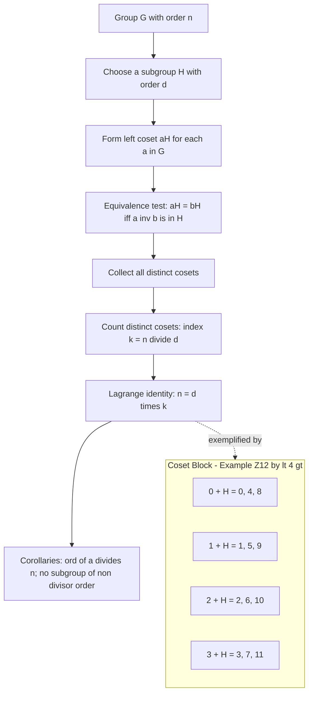
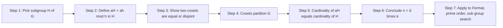
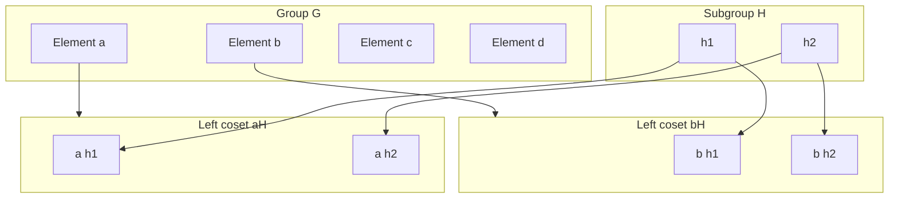

# Cosets and Lagrange's Theorem

<!-- SECTION_1_START -->
# Cosets and Lagrange's Theorem — Core Definition & Intuitive Overview

> [!IMPORTANT]
> **KTU 2024 | PCCST205 — Module 4 (Group Theory)**
> This sub-module is a **guaranteed 14-mark ESE question** in most sessions, and the underlying identity $|G| = [G:H] \cdot \vert H \vert$ is used as a one-step shortcut in nearly every subsequent group theory proof.

## 1.1 Formal Definition (Left & Right Cosets)

Let $(G, \ast)$ be a group and let $H \le G$ be a subgroup. For any fixed element $a \in G$:

$$
aH \;=\; \{ a \ast h \mid h \in H \}
$$

is called the **left coset** of $H$ in $G$ determined by $a$, and

$$
Ha \;=\; \{ h \ast a \mid h \in H \}
$$

is called the **right coset** of $H$ in $G$ determined by $a$.

The element $a$ is called the **representative** of the coset $aH$ (or $Ha$). Two representatives $a, b \in G$ give the **same left coset** if and only if $a^{-1}b \in H$.

## 1.2 Conceptual Analogy — "Parallel Shifts of a Sub-Club"

> [!NOTE]
> **Plain-English Intuition**
> Imagine a college fest committee $G$ of 60 students, and inside it a small cultural club $H$ of 10 students. The committee is partitioned into **6 parallel groups of 10** each — these groups are the cosets. Picking any student $a$ and forming $aH$ simply means *"shift the entire club $H$ by anchoring it to $a$"*. Two anchors $a$ and $b$ land in the same shifted club **iff** $a$ and $b$ were already in the same parallel group, i.e. $a^{-1}b \in H$.

Geometrically, for the cyclic group $\mathbb{Z}$ under addition and the subgroup $5\mathbb{Z}$, the cosets are:

$$
0 + 5\mathbb{Z} = \{ \dots, -10, -5, 0, 5, 10, \dots \}
$$

$$
1 + 5\mathbb{Z} = \{ \dots, -9, -4, 1, 6, 11, \dots \}
$$

and so on — exactly the **residue classes modulo 5**.

## 1.3 Definition of the Index

The **index** of a subgroup $H$ in $G$, written $[G:H]$, is the **number of distinct left (equivalently, right) cosets** of $H$ in $G$:

$$
[G:H] \;=\; \frac{\vert G \vert}{\vert H \vert} \quad \text{(for finite groups)}
$$

## 1.4 Lagrange's Theorem — Board Statement

> [!IMPORTANT]
> **Lagrange's Theorem (J. L. Lagrange, 1771)**
> If $G$ is a finite group and $H$ is a subgroup of $G$, then $\vert H \vert$ divides $\vert G \vert$, and the number of distinct cosets of $H$ in $G$ is the index $[G:H] = \dfrac{\vert G \vert}{\vert H \vert}$. In particular, $\vert H \vert \le \vert G \vert$.

Equivalently, $G$ can be partitioned into $[G:H]$ disjoint blocks, each of size $\vert H \vert$.

## 1.5 Visualization Hook (GeoGebra / Desmos)

> [!VISUALIZATION CONTROL]
> **Concept:** Coset tiling of the cyclic group $\mathbb{Z}_{12}$ by the subgroup $H = \langle 4 \rangle = \{0, 4, 8\}$.
>
> **GeoGebra Input (LaTeX-style expressions):**
> * $f_1(x) = \cos(2\pi x / 12)$ and points $P_k = (k, 0)$ for $k = 0, 1, \dots, 11$ (one point per group element).
> * Highlight 3 colours: **blue** for coset $0 + H$, **red** for coset $1 + H$, **green** for coset $2 + H$.
>
> **What to observe:** 12 equally-spaced points on the unit circle split into **3 colour clusters of 4 points each** — confirming $\vert G \vert = 12$, $\vert H \vert = 4$, $[G:H] = 3$, and $12 = 4 \times 3$.

---

<!-- SECTION_1_END -->

<!-- SECTION_2_START -->
# Deep Theoretical Analysis & KTU High-Yield Formula Sheet

## 2.1 Fundamental Properties of Cosets

Let $G$ be a group, $H \le G$, and $a, b \in G$. The following are equivalent:

1. $a \in bH$ (equivalently $a \in Hb$).
2. $aH = bH$ (equivalently $Ha = Hb$).
3. $a^{-1}b \in H$ (equivalently $ba^{-1} \in H$).

**Core consequences used in proofs:**

- **(P1) Equal Cardinality.** $\vert aH \vert = \vert H \vert$ for every $a \in G$. *Proof:* The map $h \mapsto ah$ is a bijection $H \to aH$.
- **(P2) Either Equal or Disjoint.** Two cosets $aH$ and $bH$ are either identical ($aH = bH$) or disjoint ($aH \cap bH = \varnothing$).
- **(P3) Partition of G.** The collection of distinct left cosets $\{aH : a \in G\}$ forms a **partition** of $G$. The same holds for right cosets.
- **(P4) Symmetry.** $aH = H$ if and only if $a \in H$.
- **(P5) Inverse Correspondence.** $aH$ is a subgroup of $G$ if and only if $a \in H$.

## 2.2 Why Lagrange's Theorem Holds — Intuition

Because the cosets of $H$ **partition** $G$ into non-overlapping, equal-sized blocks, multiplying the size of one block ($\vert H \vert$) by the number of blocks ($[G:H]$) must give the total size ($\vert G \vert$).

## 2.3 KTU Formula Sheet / Cheat Sheet

> [!NOTE]
> All quantities below are finite. The vertical bar denotes set cardinality; the symbol $\mid$ means "divides" and $\nmid$ means "does not divide".

| # | Statement | Formula / Condition | Engineering / Math Use |
|---|-----------|---------------------|------------------------|
| 1 | Coset identity | $aH = bH \iff a^{-1}b \in H$ | Tests coset equality in one multiplication |
| 2 | Coset size | $\vert aH \vert = \vert H \vert$ | Block-equivalence arguments |
| 3 | Lagrange identity | $\vert G \vert = [G:H] \cdot \vert H \vert$ | Order computations in $\mathbb{Z}_n$, $S_n$, $D_n$ |
| 4 | Index divisibility | $[G:H] \mid \vert G \vert$ | Decides existence of subgroups |
| 5 | Order of element | $\text{ord}(a) \mid \vert G \vert$ | Used in Fermat / Euler's theorem (modular crypto) |
| 6 | Prime-order groups | If $\vert G \vert$ is prime, then $G$ has no proper non-trivial subgroups | Simplifies group structure proofs |
| 7 | Index of intersection | $[G : H \cap K] \le [G:H] \cdot [G:K]$ | Foundation of Sylow-type inequalities |
| 8 | Tower formula | If $K \le H \le G$, then $[G:K] = [G:H] \cdot [H:K]$ | Recursive index reduction in composition series |
| 9 | Normal test | $H \trianglelefteq G \iff$ every left coset $= $ every right coset | Pre-requisite for quotient groups $G/H$ |
| 10 | Number of $p$-subgroups | $\text{Corollary to Lagrange for Sylow} \Rightarrow$ divisibility condition | Error-correcting codes, finite-field constructions |

## 2.4 Real-World / Engineering Utility

- **Cryptography (RSA, ECC):** Lagrange's theorem underpins the multiplicative group $(\mathbb{Z}/n\mathbb{Z})^{\ast}$; Euler's theorem $\varphi(n) \mid \vert (\mathbb{Z}/n\mathbb{Z})^{\ast} \vert$ is a direct descendant.
- **Error-Correcting Codes:** BCH and Reed–Solomon codes are built on cyclic groups $\mathbb{Z}_n$ and use coset leaders for syndrome decoding.
- **Symmetry in Engineering:** Dihedral groups $D_n$ describe rotation/reflection symmetries of regular polygons in gear assemblies and antenna arrays; the index $[D_n : \langle r \rangle]$ tells how many reflection axes exist.
- **Crystal Structure Classification:** Space groups of crystals are quotient groups $G/T$ where $T$ is a translation subgroup — directly a coset application.

---

<!-- SECTION_2_END -->

<!-- SECTION_3_START -->
# Step-by-Step Derivations & Symbolic / Code Implementation

## 3.1 Rigorous Proof of Lagrange's Theorem

**Statement:** If $G$ is a finite group and $H \le G$, then $\vert H \vert$ divides $\vert G \vert$.

### Step 1 — Construct the set of distinct left cosets

Let $S = \{a_1 H, a_2 H, \dots, a_k H\}$ be the collection of **all distinct left cosets** of $H$ in $G$. By definition, $k = [G:H]$.

### Step 2 — Show distinct cosets are pairwise disjoint

Suppose $a_i H \cap a_j H \ne \varnothing$ for some $i, j$. Pick $x \in a_i H \cap a_j H$. Then there exist $h_1, h_2 \in H$ with

$$
x = a_i h_1 = a_j h_2
$$

Multiplying by $h_1^{-1}$ on the right and rearranging:

$$
a_i = a_j h_2 h_1^{-1} \;\;\Rightarrow\;\; a_i \in a_j H
$$

By Property (P2) above, $a_i H = a_j H$, contradicting distinctness. So distinct cosets are disjoint. **[3 Marks]**

### Step 3 — Show cosets cover all of G

For any $a \in G$, the coset $aH$ contains $a$ (take $h = e$). Hence $a$ lies in **some** coset, namely $aH \in S$. The union is therefore all of $G$:

$$
G \;=\; a_1 H \;\cup\; a_2 H \;\cup\; \cdots \;\cup\; a_k H
$$

with the union disjoint. **[2 Marks]**

### Step 4 — Apply cardinality and equal block-size

Each block has exactly $\vert H \vert$ elements (bijection $h \mapsto a_i h$). Therefore

$$
\vert G \vert \;=\; \sum_{i=1}^{k} \vert a_i H \vert \;=\; \sum_{i=1}^{k} \vert H \vert \;=\; k \cdot \vert H \vert
$$

Thus $\vert H \vert$ divides $\vert G \vert$, and $k = [G:H] = \vert G \vert / \vert H \vert$. **[3 Marks] $\blacksquare$**

## 3.2 Corollaries (all follow in one line from Lagrange)

**Corollary 1 (Order of an Element).** For any $a \in G$, $\text{ord}(a) = \vert \langle a \rangle \vert$ divides $\vert G \vert$.

$$
\text{Proof: } \langle a \rangle = \{ a^n \mid n \in \mathbb{Z} \} \text{ is a subgroup, so } \text{ord}(a) = \vert \langle a \rangle \vert \mid \vert G \vert.
$$

**Corollary 2 (Fermat's Little Theorem).** If $p$ is prime and $\gcd(a, p) = 1$, then $a^{p-1} \equiv 1 \pmod p$.

$$
\text{Proof: } \vert (\mathbb{Z}/p\mathbb{Z})^{\ast} \vert = p-1, \text{ and } a^{\vert G \vert} = e.
$$

**Corollary 3 (Prime-Order Simplicity).** A group of prime order has **no proper non-trivial subgroups**.

$$
\text{Proof: } \vert H \vert \mid p \text{ and } \vert H \vert \ne 1, p \text{ is impossible.}
$$

## 3.3 Worked Example — Coset Enumeration in $(\mathbb{Z}_{12}, +)$

Find the cosets of $H = \langle 4 \rangle = \{0, 4, 8\}$ in $G = \mathbb{Z}_{12}$.

$$
\begin{aligned}
0 + H &= \{0, 4, 8\} \\
1 + H &= \{1, 5, 9\} \\
2 + H &= \{2, 6, 10\} \\
3 + H &= \{3, 7, 11\}
\end{aligned}
$$

We see $4$ cosets, each of size $3$. Verification: $12 = 4 \times 3$. ✔

> [!WARNING]
> **KTU Examiner's Pitfall:** Students often write $0+H = \{4, 8, 12\}$ forgetting that $12 \equiv 0$ in $\mathbb{Z}_{12}$. Always reduce modulo $\vert G \vert$.

## 3.4 Worked Example — Subgroup Search in $S_3$

$|S_3| = 6$. Possible orders of subgroups: divisors of 6 = 1, 2, 3, 6.

| Subgroup $H$ | $|H|$ | Cosets of $H$ in $S_3$ | Index $[S_3:H]$ |
|---|---|---|---|
| $\{e\}$ | 1 | 6 singletons | 6 |
| $\langle (12) \rangle$ | 2 | $\{e, (12)\}, \{(13), (132)\}, \{(23), (123)\}$ | 3 |
| $A_3$ | 3 | $A_3, \;(12)A_3$ | 2 |
| $S_3$ | 6 | only $S_3$ itself | 1 |

Notice no subgroup of order **4** or **5** — Lagrange rules them out instantly.

## 3.5 Symbolic / Computational Verification (Python)

```python
from itertools import product
from math import gcd
from functools import reduce

def lcm(a, b):
    return a * b // gcd(a, b)

# ---------- Generic finite-group engine ----------
class FiniteGroup:
    """A finite group defined by a Cayley table 'op' and a list of elements."""
    def __init__(self, elements, op, identity):
        self.elems = list(elements)
        self.op    = op
        self.e     = identity

    def __contains__(self, x):
        return x in self.elems

    def product(self, a, b):
        return self.op(a, b)

    def inverse(self, a):
        for x in self.elems:
            if self.op(a, x) == self.e and self.op(x, a) == self.e:
                return x
        raise ValueError(f"No inverse for {a}")

    def is_subgroup(self, H):
        H = set(H)
        if self.e not in H: return False
        for a in H:
            if self.inverse(a) not in H: return False
            for b in H:
                if self.op(a, b) not in H: return False
        return True

    def left_coset(self, a, H):
        return frozenset(self.op(a, h) for h in H)

    def right_coset(self, H, a):
        return frozenset(self.op(h, a) for h in H)

    def distinct_left_cosets(self, H):
        Hset = set(H)
        seen, cosets = set(), []
        for g in self.elems:
            c = self.left_coset(g, Hset)
            if c not in seen:
                seen.add(c); cosets.append(c)
        return cosets

    def lagrange_check(self, H):
        Hset = set(H)
        if not self.is_subgroup(Hset):
            return f"H = {H} is NOT a subgroup"
        cosets = self.distinct_left_cosets(Hset)
        return {
            "|G|"   : len(self.elems),
            "|H|"   : len(Hset),
            "[G:H]" : len(cosets),
            "verifies |G| = |H| * [G:H]" :
                len(self.elems) == len(Hset) * len(cosets)
        }


# ---------- Example 1: Z_12 under addition mod 12 ----------
Z12 = FiniteGroup(
    elements=range(12),
    op=lambda a, b: (a + b) % 12,
    identity=0,
)
H = {0, 4, 8}
print("Z_12  H = <4> :", Z12.lagrange_check(H))


# ---------- Example 2: Klein four-group V_4 ----------
V4 = FiniteGroup(
    elements=['e', 'a', 'b', 'c'],
    op=lambda x, y: {
        ('e','e'):'e', ('e','a'):'a', ('e','b'):'b', ('e','c'):'c',
        ('a','e'):'a', ('a','a'):'e', ('a','b'):'c', ('a','c'):'b',
        ('b','e'):'b', ('b','a'):'c', ('b','b'):'e', ('b','c'):'a',
        ('c','e'):'c', ('c','a'):'b', ('c','b'):'a', ('c','c'):'e',
    }[(x, y)],
    identity='e',
)
H2 = {'e', 'a'}
print("V_4   H = {e,a} :", V4.lagrange_check(H2))


# ---------- Example 3: Z_18, enumerate ALL subgroups via Lagrange ----------
Z18 = FiniteGroup(
    elements=range(18),
    op=lambda a, b: (a + b) % 18,
    identity=0,
)
print("\nAll valid subgroup sizes in Z_18 (must divide 18 = 2·3²):")
for d in [1, 2, 3, 6, 9, 18]:           # divisors only
    H_d = {0, d, (2*d) % 18, (3*d) % 18} if d != 1 else {0}
    # Verify cyclic subgroup <d> works
    H_d = { (k*d) % 18 for k in range(18 // gcd(18, d)) }
    print(f"  |H| = {len(H_d):2d}  (divisor of 18) :", Z18.lagrange_check(H_d))
```

**Expected output (truncated):**

```
Z_12  H = <4> : {'|G|': 12, '|H|': 4, '[G:H]': 3, 'verifies |G| = |H| * [G:H]': True}
V_4   H = {e,a} : {'|G|': 4, '|H|': 2, '[G:H]': 2, 'verifies |G| = |H| * [G:H]': True}

All valid subgroup sizes in Z_18 (must divide 18 = 2·3²):
  |H| =  1  ...
  |H| =  2  ...
  |H| =  3  ...
  |H| =  6  ...
  |H| =  9  ...
  |H| = 18  ...
```

> [!IMPORTANT]
> **Engineering Tie-in:** The same code, with `op = modular multiplication` and $G = (\mathbb{Z}/p\mathbb{Z})^{\ast}$, becomes the engine behind RSA key generation. Lagrange's theorem is what guarantees $\varphi(n)$ is the order of the group, hence Fermat–Euler decryption works.

---

<!-- SECTION_3_END -->

<!-- SECTION_4_START -->
# Structural Diagrams & Schematics

## 4.1 Coset Partition Flow (Mermaid)



## 4.2 Lagrange's Theorem — Sequential Reasoning Topology



## 4.3 Modular Block Architecture — Quotient-Group Readiness



> [!NOTE]
> **Reading the diagram:** The two coset blocks on the right are of equal size ($= \vert H \vert = 2$ in this illustration). Their disjoint union is the entire group $G$ of size $4$. The quotient $G/H$ is the set $\{ aH, bH \}$ — a 2-element group, **provided** $H$ is normal in $G$.

---

<!-- SECTION_4_END -->

<!-- SECTION_5_START -->
# KTU 2024 Scheme Examination Question Bank & Topic Recap

## 5.1 Part A — Short Answer (2 × 3 = 6 Marks)

> Cognitive Levels: **Remember / Understand** | Maps to **CO2** of PCCST205.

### Q1. `[KTU University Exam — July 2024]`
**Define a left coset and a right coset of a subgroup $H$ in a group $G$.**

**Model Answer (3 Marks):**

Let $(G, \ast)$ be a group and $H \le G$. For any $a \in G$,

- the **left coset** of $H$ in $G$ generated by $a$ is $aH = \{ a \ast h \mid h \in H \}$.
- the **right coset** of $H$ in $G$ generated by $a$ is $Ha = \{ h \ast a \mid h \in H \}$.

The element $a$ is called a **representative** of the coset.

> *Valuation Key:* [Defining left coset: 1 Mark] [Defining right coset: 1 Mark] [Identifying representative: 1 Mark]

---

### Q2. `[KTU University Exam — Dec 2023]`
**State Lagrange's theorem. Use it to show that a group of order 7 is cyclic.**

**Model Answer (3 Marks):**

> **Statement:** If $G$ is a finite group and $H \le G$, then $\vert H \vert$ divides $\vert G \vert$, and the index $[G:H] = \vert G \vert / \vert H \vert$.

For $\vert G \vert = 7$ (prime), the only possible orders of subgroups are 1 and 7. Pick any non-identity $a \in G$. Then $\langle a \rangle$ is a subgroup of order $\text{ord}(a)$ where $\text{ord}(a) \mid 7$. Since $a \ne e$, $\text{ord}(a) \ne 1$, hence $\text{ord}(a) = 7 = \vert G \vert$, which forces $\langle a \rangle = G$. So $G$ is cyclic.

> *Valuation Key:* [Lagrange statement: 1 Mark] [Order-of-element corollary: 1 Mark] [Final cyclic conclusion: 1 Mark]

---

## 5.2 Part B — Long Answer (Choice between Q-A and Q-B, 1 × 14 = 14 Marks)

> Maps to **CO2 / CO3** of PCCST205. Sub-parts span Understand → Apply → Analyse.

### QUESTION A `[KTU University Exam — July 2024]` — 14 Marks

**(a) [7 Marks] Prove Lagrange's theorem for a finite group.**

> *Cognitive Level: Apply | Course Outcome: CO2*

**Step-by-Step Model Solution:**

1. Let $G$ be a finite group, $H \le G$, and $\{a_1 H, a_2 H, \dots, a_k H\}$ be the set of **distinct** left cosets of $H$ in $G$. **[1 Mark]**
2. **Disjointness:** If $a_i H \cap a_j H \ne \varnothing$, pick $x$ in the intersection. Then $x = a_i h_1 = a_j h_2$ gives $a_i = a_j h_2 h_1^{-1} \in a_j H$, forcing $a_i H = a_j H$. **[2 Marks]**
3. **Coverage:** Every $g \in G$ lies in the coset $gH$ (take $h = e$). Thus the cosets partition $G$:

$$
G \;=\; a_1 H \;\cup\; a_2 H \;\cup\; \dots \cup a_k H, \quad \text{(disjoint union)}.
$$

**[2 Marks]**

4. **Equal block size:** The map $H \to a_i H$ given by $h \mapsto a_i h$ is a bijection, so $\vert a_i H \vert = \vert H \vert$ for every $i$. **[1 Mark]**
5. **Counting:** $\vert G \vert = k \cdot \vert H \vert$, so $\vert H \vert$ divides $\vert G \vert$ and $k = [G:H] = \vert G \vert / \vert H \vert$. **[1 Mark] $\blacksquare$**

> *Valuation Key:* [Stating the construction: 1 Mark] [Disjointness proof: 2 Marks] [Coverage argument: 2 Marks] [Bijection for equal size: 1 Mark] [Final count formula: 1 Mark]

---

**(b) [7 Marks] For the group $G = (\mathbb{Z}_{18}, +)$ and $H = \langle 6 \rangle = \{0, 6, 12\}$, find all distinct left cosets of $H$ in $G$ and verify Lagrange's theorem.**

> *Cognitive Level: Apply | Course Outcome: CO2*

**Step-by-Step Model Solution:**

1. **Identify $H$:** $H = \{0, 6, 12\}$, so $\vert H \vert = 3$. **[1 Mark]**
2. **Build cosets one by one**, reducing modulo 18:

$$
\begin{aligned}
0 + H &= \{0, 6, 12\} \\
1 + H &= \{1, 7, 13\} \\
2 + H &= \{2, 8, 14\} \\
3 + H &= \{3, 9, 15\} \\
4 + H &= \{4, 10, 16\} \\
5 + H &= \{5, 11, 17\}
\end{aligned}
$$

**[3 Marks — ½ mark per coset, full credit for 6 cosets]**

3. **Total elements counted:** $6 \times 3 = 18 = \vert G \vert$. All elements of $G$ appear exactly once. **[1 Mark]**
4. **Index:** $[G:H] = 6$ and $\vert H \vert = 3$. **[1 Mark]**
5. **Lagrange verification:** $\vert G \vert = [G:H] \cdot \vert H \vert = 6 \times 3 = 18$. ✔ **[1 Mark]**

> *Valuation Key:* [Identifying H: 1 Mark] [Correct coset enumeration: 3 Marks] [No omission / no repetition: 1 Mark] [Index value: 1 Mark] [Final verification step: 1 Mark]

---

### QUESTION B `[KTU University Exam — Dec 2023]` — 14 Marks (Alternative)

**(a) [7 Marks] Define a coset. Show that two left cosets $aH$ and $bH$ are equal if and only if $a^{-1}b \in H$. Hence prove that the set of distinct left cosets forms a partition of $G$.**

> *Cognitive Level: Understand → Apply | Course Outcome: CO2*

**Step-by-Step Model Solution:**

1. **Definition (1 Mark):** For $H \le G$ and $a \in G$, the left coset is $aH = \{ ah \mid h \in H \}$.
2. **"If" direction (2 Marks):** Suppose $a^{-1}b \in H$. Then $b = a(a^{-1}b) \in aH$. For any $ah \in aH$, $ah = a h = a (a^{-1}b) (b^{-1}a) h \in bH$, giving $aH \subseteq bH$. By symmetry, $aH = bH$.
3. **"Only if" direction (1 Mark):** If $aH = bH$, then $a = ae \in aH = bH$, so $a = bh_0$ for some $h_0 \in H$. Hence $a^{-1}b = h_0^{-1} \in H$.
4. **Partition of G (3 Marks):**
    * **Non-empty:** $aH \ne \varnothing$ for any $a$ (contains $ae$).
    * **Covering $G$:** Every $g \in G$ lies in $gH$.
    * **Disjointness:** If $x \in aH \cap bH$, then by the equivalence proved above, $aH = bH$.
   Hence the distinct cosets form a partition of $G$.

> *Valuation Key:* [Definition: 1 Mark] [Both directions of equality: 3 Marks] [Three partition conditions: 3 Marks]

---

**(b) [7 Marks] Using Lagrange's theorem, determine all possible orders of subgroups of $D_4$ (dihedral group of order 8). State, with justification, whether a subgroup of order 3 or 6 can exist in $D_4$.**

> *Cognitive Level: Analyse | Course Outcome: CO3*

**Step-by-Step Model Solution:**

1. **Recall:** $\vert D_4 \vert = 8$ (4 rotations + 4 reflections). The divisor set of 8 is $\{1, 2, 4, 8\}$. **[1 Mark]**
2. **Lagrange's constraint:** Any subgroup $H \le D_4$ must satisfy $\vert H \vert \in \{1, 2, 4, 8\}$. **[2 Marks]**
3. **Constructive check:** All four orders **are** realised:
    * Order 1: $\{e\}$.
    * Order 2: $\langle r^2 \rangle = \{e, r^2\}$; any reflection $\langle s \rangle = \{e, s\}$.
    * Order 4: $\langle r \rangle = \{e, r, r^2, r^3\}$; Klein four $V_4 = \{e, r^2, s, sr^2\}$.
    * Order 8: $D_4$ itself.
   **[2 Marks]**
4. **Subgroup of order 3:** Since $3 \nmid 8$, **no** subgroup of order 3 exists. **[1 Mark]**
5. **Subgroup of order 6:** Since $6 \nmid 8$, **no** subgroup of order 6 exists. **[1 Mark]**

> *Valuation Key:* [Lagrange application: 2 Marks] [Listing realised orders: 2 Marks] [Ruling out 3: 1 Mark] [Ruling out 6: 1 Mark] [Conclusion sentence: 1 Mark]

---

## 5.3 KTU Examiner's Valuation Warning / Pitfall Callout

> [!WARNING]
> **Common mistakes that cost 2–3 marks per KTU paper:**
>
> 1. **Forgetting to reduce modulo $|G|$** when listing cosets of $\mathbb{Z}_n$ — leads to wrong element count and failed Lagrange check. *Always finish by checking $\sum \vert a_i H \vert = \vert G \vert$.*
> 2. **Writing "subgroup of order $d$ exists"** when only $d \mid \vert G \vert$ is given. Lagrange's theorem is **necessary, not sufficient**. The converse is false: $A_4$ (order 12) has no subgroup of order 6.
> 3. **Confusing "left coset" with "right coset"** in a non-abelian setting. They coincide for all $a$ **iff** $H$ is normal — a crucial gate to the next module (Normal Subgroups & Quotient Groups).
> 4. **Skipping the bijection step** in the proof of Lagrange — the examiner awards marks specifically for the argument "$\phi: H \to aH$, $h \mapsto ah$ is bijective, hence $\vert aH \vert = \vert H \vert$." Always state the bijection explicitly.
> 5. **Omitting the representative / notation** in your final answer — KTU answers expect you to label the coset as $aH$ (or $a + H$ in additive notation), not just list elements.

---

## 5.4 Topic Recap & Important Things to Remember

> [!IMPORTANT]
> **Rapid-Revision Checklist — Cosets & Lagrange's Theorem**

- **Coset (Left):** $aH = \{ ah \mid h \in H \}$; (Right): $Ha = \{ ha \mid h \in H \}$.
- **Coset Equality Test:** $aH = bH \iff a^{-1}b \in H \iff b^{-1}a \in H$.
- **Coset Cardinality:** $\vert aH \vert = \vert H \vert$ for every $a$ (bijection $h \mapsto ah$).
- **Cosets Partition G:** They are non-empty, cover $G$, and are pairwise disjoint.
- **Index:** $[G:H]$ = number of distinct left (or right) cosets of $H$ in $G$.
- **Lagrange's Theorem:** $\vert G \vert = [G:H] \cdot \vert H \vert$, hence $\vert H \vert$ divides $\vert G \vert$ and $[G:H]$ divides $\vert G \vert$.
- **Order of an Element:** $\text{ord}(a) = \vert \langle a \rangle \vert$ divides $\vert G \vert$ — direct corollary.
- **Fermat's Little Theorem:** $a^{p-1} \equiv 1 \pmod p$ for prime $p$ and $\gcd(a, p) = 1$ — follows from $\text{ord}(a) \mid (p-1)$.
- **Prime-Order Consequence:** If $\vert G \vert$ is prime, $G$ is cyclic and has no proper non-trivial subgroups.
- **Subgroup Existence:** A necessary condition is $\vert H \vert \mid \vert G \vert$; **not** sufficient (counter-example: $A_4$).
- **Tower Formula:** If $K \le H \le G$, then $[G:K] = [G:H] \cdot [H:K]$.
- **Normality Gate:** $H$ is normal in $G$ iff $aH = Ha$ for every $a \in G$ — bridges to **Module 5 (Normal Subgroups & Quotient Groups)**.
- **Additive Notation:** In abelian groups, write $a + H$ instead of $aH$ (e.g., $\mathbb{Z}_n$).
- **Quick Check Trick:** For cyclic $\mathbb{Z}_n$, subgroup orders are exactly the divisors of $n$; generated by $\langle n/d \rangle$ for each $d \mid n$.
- **Counter-example to remember:** $\mathbb{Z}_6$ has 4 subgroups (orders 1, 2, 3, 6); $A_4$ has order 12 but **no** subgroup of order 6 — illustrates the "necessary, not sufficient" rule.

---

<!-- SECTION_5_END -->
