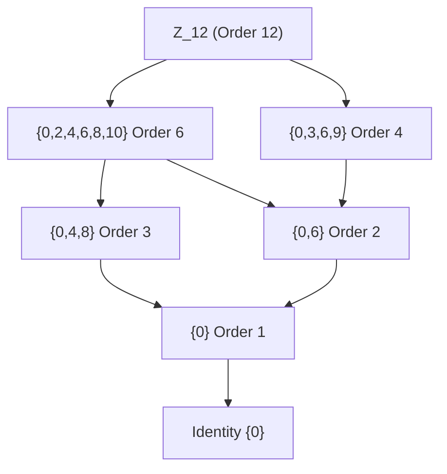
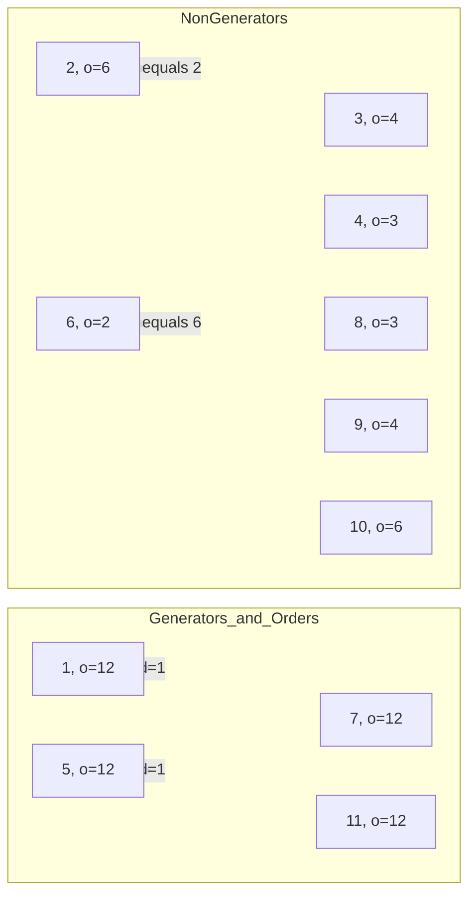

# Cyclic Groups

<!-- SECTION_1_START -->
# Cyclic Groups — Core Technical Definition & Intuitive Overview

## 1.1 Formal Definition (KTU 2024 Syllabus Terminology)

> [!IMPORTANT]
> **Cyclic Group:** A group $(G, \ast)$ is called a **cyclic group** if there exists an element $a \in G$ such that every element of $G$ can be expressed as some integer power of $a$. That is, $G = \{ a^{n} \mid n \in \mathbb{Z} \}$.

Such an element $a$ is called a **generator** of the group, and the group is denoted as $G = \langle a \rangle$.

The **order of an element** $a \in G$, denoted $o(a)$ or $\vert a \vert$, is the smallest positive integer $n$ such that $a^{n} = e$ (identity). If no such $n$ exists, the element has **infinite order**.

The **order of a group** $G$, denoted $\vert G \vert$, is simply the number of elements in $G$.

## 1.2 Conceptual Analogy — The "Clockwork Engine"

Imagine a **clock face with 12 hours**. If you keep rotating the hour hand by 1 position repeatedly, you generate every possible position on the clock:
$$0, 1, 2, 3, \ldots, 11, 0, 1, 2, \ldots$$
This is precisely the cyclic group $\mathbb{Z}_{12}$ under addition modulo 12. The number **1** is a generator because adding it repeatedly covers the whole group. Similarly, **5** is also a generator because $5, 10, 3, 8, 1, 6, 11, 4, 9, 2, 7, 0$ — every position is hit. However, **2** is not a generator: starting from 0, you only hit even numbers $\{0, 2, 4, 6, 8, 10\}$, missing the odd hours.

The integer multiples of $a$ are like **rotational steps** of a wheel — enough steps bring you back to the start (identity), and the total number of distinct steps before repetition equals the **order of the element**.

> [!NOTE]
> **Syllabus Highlight:** Cyclic groups are the *simplest* and *most symmetric* algebraic structures. Every cyclic group is abelian, and up to isomorphism, there are only **two** types: $\mathbb{Z}$ (infinite) and $\mathbb{Z}_{n}$ (finite, of order $n$).

## 1.3 Visual Intuition: Generators as "Self-Covering" Rotations

For a finite cyclic group $\mathbb{Z}_{n}$, the element $k$ is a generator if and only if $\gcd(k, n) = 1$. The number of generators is given by **Euler's totient function** $\phi(n)$.

| Group | Generators | Reason |
|---|---|---|
| $\mathbb{Z}_{6}$ | $1, 5$ | $\gcd(1,6)=\gcd(5,6)=1$ |
| $\mathbb{Z}_{7}$ | $1, 2, 3, 4, 5, 6$ | 7 is prime, so $\phi(7) = 6$ |
| $\mathbb{Z}_{8}$ | $1, 3, 5, 7$ | $\phi(8) = 4$ |
| $\mathbb{Z}_{10}$ | $1, 3, 7, 9$ | $\phi(10) = 4$ |

> [!VISUALIZATION CONTROL]
> **Concept:** Cayley table structure and element order visualization for $\mathbb{Z}_{6}$.
> **GeoGebra / Desmos Input Equations:**
> * Points on unit circle: $(\cos(2\pi k/6), \sin(2\pi k/6))$ for $k = 0, 1, 2, 3, 4, 5$.
> * Generator $a=1$: $f(k) = (\cos(2\pi k/6), \sin(2\pi k/6))$ plots the cyclic orbit.
> **Visual Description:** A regular hexagon on the unit circle where each vertex is labeled $0, 1, 2, 3, 4, 5$. The generator $a=1$ traces all 6 vertices (full orbit), while $a=2$ traces only 3 alternate vertices (a subgroup of order 3).
<!-- SECTION_1_END -->

<!-- SECTION_2_START -->
# Deep Theoretical Analysis & KTU High-Yield Formula Sheet

## 2.1 Fundamental Theorems on Cyclic Groups

**Theorem 2.1 (Every Cyclic Group is Abelian):**
If $G = \langle a \rangle$, then for any $a^{m}, a^{n} \in G$:
$$a^{m} \ast a^{n} = a^{m+n} = a^{n+m} = a^{n} \ast a^{m}$$
Hence every cyclic group is **commutative**.

**Theorem 2.2 (Classification Theorem):**
Every cyclic group is isomorphic to either:
* $\mathbb{Z}$ (the additive group of integers) — the unique infinite cyclic group.
* $\mathbb{Z}_{n}$ (the additive group of integers modulo $n$) — for each positive integer $n$.

**Theorem 2.3 (Generator Criterion):**
Let $G = \langle a \rangle$ with $o(a) = n$. Then $a^{k}$ is also a generator of $G$ if and only if $\gcd(k, n) = 1$.

**Theorem 2.4 (Subgroup Structure):**
Every subgroup of a cyclic group is cyclic. Moreover, if $G = \langle a \rangle$ is cyclic of order $n$, then for every **divisor $d$ of $n$**, there exists **exactly one** subgroup of order $d$, namely $\langle a^{n/d} \rangle$.

**Theorem 2.5 (Fundamental Theorem of Cyclic Groups):**
If $G$ is a finite cyclic group of order $n$ and $d$ divides $n$, then $G$ contains exactly one subgroup of order $d$, and this subgroup consists of all elements $x \in G$ satisfying $x^{d} = e$.

**Theorem 2.6 (Counting Generators):**
The number of generators of a cyclic group of order $n$ is $\phi(n)$, where $\phi$ is **Euler's totient function**.

**Theorem 2.7 (Isomorphism to Product of Cyclic Groups):**
If $G = \langle a \rangle$ has order $n = p_{1}^{k_{1}} p_{2}^{k_{2}} \cdots p_{m}^{k_{m}}$, then:
$$G \cong \mathbb{Z}_{p_{1}^{k_{1}}} \times \mathbb{Z}_{p_{2}^{k_{2}}} \times \cdots \times \mathbb{Z}_{p_{m}^{k_{m}}}$$
Moreover, $G$ is isomorphic to $\mathbb{Z}_{n}$ if and only if $\gcd(n_1, n_2) = 1$ for any decomposition $G \cong \mathbb{Z}_{n_1} \times \mathbb{Z}_{n_2}$.

## 2.2 KTU Formula Sheet / Cheat Sheet

| # | Formula / Theorem | Statement | Condition |
|---|---|---|---|
| 1 | Group form | $G = \{ a^{n} \mid n \in \mathbb{Z} \}$ | $\exists\, a$ generating $G$ |
| 2 | Generator criterion | $a^{k}$ generates $G$ | $\iff \gcd(k, n) = 1$ where $o(a) = n$ |
| 3 | Order of power | $o(a^{k}) = \dfrac{n}{\gcd(k, n)}$ | For $o(a) = n$ finite |
| 4 | Number of generators | $\phi(n) = \#\{k \mid 1 \le k \le n,\ \gcd(k,n)=1\}$ | $n \ge 1$ |
| 5 | Subgroup count | Number of subgroups $= \tau(n)$ | $\tau(n)$ = number of divisors of $n$ |
| 6 | Subgroup of order $d$ | $\langle a^{n/d} \rangle$ | $d \mid n$ |
| 7 | Lagrange's theorem | $o(H) \mid o(G)$ | $H \le G$ |
| 8 | $\phi(1) = 1,\ \phi(p) = p-1$ | For prime $p$ | $p$ prime |
| 9 | Multiplicative $\phi$ | $\phi(mn) = \phi(m)\phi(n)$ | $\gcd(m,n) = 1$ |
| 10 | Isomorphism classes | $G \cong \mathbb{Z}$ or $G \cong \mathbb{Z}_{n}$ | For some unique $n$ or $\infty$ |
| 11 | $\phi(p^{k}) = p^{k} - p^{k-1}$ | For prime power $p^{k}$ | $p$ prime |
| 12 | $\phi(n) = n \prod_{p \mid n}\left(1 - \dfrac{1}{p}\right)$ | General formula | $n \ge 1$ |

## 2.3 Real-World Engineering Utility

Cyclic groups are foundational in several engineering domains:

* **Cryptography:** The multiplicative group $\mathbb{Z}_{p}^{\ast}$ (a cyclic group) is the backbone of **Diffie-Hellman key exchange**, **RSA encryption**, and **ElGamal**. The **Discrete Logarithm Problem** in cyclic groups of prime order underpins most modern public-key systems.
* **Error-Correcting Codes:** Cyclic codes (a class of linear codes) such as **CRC, Hamming codes, BCH, and Reed-Solomon codes** are constructed using ideals in polynomial rings modulo $x^{n} - 1$, which correspond to subgroups of cyclic groups.
* **Digital Signal Processing:** The **Discrete Fourier Transform (DFT)** operates on the cyclic group of $N$-th roots of unity, and **FFT algorithms** exploit the cyclic structure for $\mathcal{O}(N \log N)$ complexity.
* **Computer Graphics:** Rotational symmetries of regular polygons form cyclic groups used in 2D and 3D transformations.
* **Compiler Design & Automata:** State machines often use cyclic monoids and semigroups in the analysis of regular expressions and formal languages.
<!-- SECTION_2_END -->

<!-- SECTION_3_START -->
# Step-by-Step Derivations & Symbolic Implementation

## 3.1 Exhaustive Proof: Every Subgroup of a Cyclic Group is Cyclic

**Statement:** If $G = \langle a \rangle$ is a cyclic group and $H \le G$, then $H$ is cyclic.

**Proof:**

*Case 1: $H = \{e\}$.* Then $H = \langle e \rangle$ is cyclic (generated by identity), so the claim holds.

*Case 2: $H \neq \{e\}$.* Since $H$ is a non-trivial subgroup, there exists a non-identity element in $H$. Every element of $H$ is also an element of $G$, so it has the form $a^{k}$ for some integer $k$. In particular, $H$ contains some element $a^{k}$ with $k \neq 0$.

Since $H$ is a subgroup and contains at least one non-identity element, the set
$$S = \{ m \in \mathbb{Z} \setminus \{0\} \mid a^{m} \in H \}$$
is non-empty. By the **well-ordering principle**, $S$ has a least positive element; call it $d$. So $a^{d} \in H$ and $a^{d}$ is the smallest positive power of $a$ lying in $H$.

We now show that $H = \langle a^{d} \rangle$.

*($\supseteq$)* Every power of $a^{d}$ is a power of $a$ (since $(a^{d})^{k} = a^{dk}$), and it remains in $H$ because $H$ is closed under the group operation. So $\langle a^{d} \rangle \subseteq H$.

*($\subseteq$)* Let $a^{m} \in H$ be an arbitrary element. By the **division algorithm**, there exist unique integers $q$ and $r$ such that
$$m = qd + r, \quad \text{where } 0 \le r < d.$$
Multiplying both sides by $a$:
$$a^{m} = a^{qd + r} = a^{qd} \cdot a^{r} = (a^{d})^{q} \cdot a^{r}.$$
Since $a^{m} \in H$ and $(a^{d})^{q} \in H$, closure under the group operation and inverses gives
$$a^{r} = a^{m} \cdot \left[(a^{d})^{q}\right]^{-1} = a^{m} \cdot (a^{d})^{-q} \in H.$$
By **minimality of $d$** (the smallest positive exponent producing an element of $H$), the only possibility is $r = 0$. Hence $m = qd$, which means $a^{m} = (a^{d})^{q} \in \langle a^{d} \rangle$.

Therefore $H \subseteq \langle a^{d} \rangle$, and combining both inclusions, $H = \langle a^{d} \rangle$. $\blacksquare$

## 3.2 Exhaustive Proof: Number of Subgroups of $\mathbb{Z}_{n}$ Equals $\tau(n)$

**Proof Outline:** By Theorem 2.4, for every divisor $d$ of $n$, there exists exactly one subgroup of order $d$, namely $\langle n/d \rangle$ in additive notation. Conversely, by Lagrange's theorem, every subgroup's order must divide $n$. Thus the set of subgroups of $\mathbb{Z}_{n}$ is in **bijection** with the set of positive divisors of $n$. Hence the total number of subgroups is $\tau(n)$. $\blacksquare$

**Worked Example for $\mathbb{Z}_{12}$:** Divisors of $12$ are $\{1, 2, 3, 4, 6, 12\}$, so $\mathbb{Z}_{12}$ has exactly **6 subgroups**:

$$H_1 = \{0\},\quad H_2 = \{0, 6\},\quad H_3 = \{0, 4, 8\},\quad H_4 = \{0, 3, 6, 9\},\quad H_5 = \{0, 2, 4, 6, 8, 10\},\quad H_6 = \mathbb{Z}_{12}.$$

## 3.3 Python Implementation: Cyclic Group Analyzer

```python
"""
Cyclic Group Analyzer for Z_n under addition modulo n.
Implements: generator detection, subgroup enumeration,
order computation, and Euler's totient function.
"""

from math import gcd
from typing import List, Dict, Set


def euler_totient(n: int) -> int:
    """Compute phi(n): count of integers in [1, n] coprime to n."""
    if n < 1:
        raise ValueError(f"n must be >= 1, got {n}")
    if n == 1:
        return 1
    result = n
    p = 2
    temp = n
    while p * p <= temp:
        if temp % p == 0:
            while temp % p == 0:
                temp //= p
            result -= result // p
        p += 1
    if temp > 1:
        result -= result // temp
    return result


def order_of_element(a: int, n: int) -> int:
    """Compute o(a) in Z_n: smallest k >= 1 with k*a mod n == 0."""
    if not (0 <= a < n):
        raise ValueError(f"a must be in [0, {n-1}], got {a}")
    if a == 0:
        return 1
    k = 1
    current = a % n
    while current != 0:
        current = (current + a) % n
        k += 1
        if k > n + 1:
            raise RuntimeError("Order computation exceeded safe bound.")
    return k


def find_generators(n: int) -> List[int]:
    """Return all generators of Z_n (elements of order n)."""
    if n < 1:
        raise ValueError(f"n must be >= 1, got {n}")
    return [a for a in range(1, n) if order_of_element(a, n) == n]


def enumerate_subgroups(n: int) -> Dict[int, Set[int]]:
    """For each divisor d of n, return the unique subgroup of order d."""
    subgroups: Dict[int, Set[int]] = {}
    for d in range(1, n + 1):
        if n % d == 0:
            step = n // d
            subgroups[d] = {(k * step) % n for k in range(d)}
    return subgroups


def divisors(n: int) -> List[int]:
    """Return sorted list of positive divisors of n."""
    return sorted(d for d in range(1, n + 1) if n % d == 0)


def analyze(n: int) -> None:
    """Print complete cyclic group analysis for Z_n."""
    print(f"\n{'=' * 60}")
    print(f"  CYCLIC GROUP ANALYSIS FOR Z_{n}")
    print(f"{'=' * 60}")
    print(f"  |Z_n|           = {n}")
    print(f"  Generators      = {find_generators(n)}")
    print(f"  phi(n)          = {euler_totient(n)} (matches generator count: {len(find_generators(n))})")
    print(f"  Divisors of {n}   = {divisors(n)}")
    print(f"  Number of subgroups (tau(n)) = {len(divisors(n))}")
    print(f"\n  Element orders:")
    for a in range(n):
        print(f"    o({a}) = {order_of_element(a, n)}")
    print(f"\n  Subgroup lattice (by divisor d = subgroup order):")
    sub = enumerate_subgroups(n)
    for d in sorted(sub.keys()):
        print(f"    Order {d:>3}: {sorted(sub[d])}")
    print(f"{'=' * 60}\n")


if __name__ == "__main__":
    for n in [6, 7, 8, 10, 12, 15]:
        analyze(n)

    # Sanity check: phi(p) = p-1 for prime p
    for p in [2, 3, 5, 7, 11, 13]:
        assert euler_totient(p) == p - 1, f"phi({p}) failed"
    print("All prime totient assertions passed.")
```

**Sample Output for $Z_{12}$:**

$$\begin{aligned}
\text{Generators of } \mathbb{Z}_{12} &= \{1, 5, 7, 11\} \\
\phi(12) &= 4 \quad (\text{matches generator count}) \\
\text{Divisors of } 12 &= \{1, 2, 3, 4, 6, 12\} \\
\text{Subgroups} &= \text{6 total (one per divisor)} \\
o(4) &= 3, \quad o(3) = 4, \quad o(6) = 2, \quad o(1) = 12
\end{aligned}$$

## 3.4 Verification: $o(a^{k}) = \dfrac{n}{\gcd(k, n)}$

In $\mathbb{Z}_{12}$, let $a = 1$ (so $o(a) = 12$) and $k = 8$.

$$\begin{aligned}
o(a^{8}) = o(8) &= \frac{12}{\gcd(8, 12)} = \frac{12}{4} = 3.
\end{aligned}$$

Verification: the powers of $8 \pmod{12}$ are $\{8, 4, 0\}$ — exactly **3** distinct values, confirming $o(8) = 3$. $\checkmark$

## 3.5 Worked Example: Isomorphism of $\mathbb{Z}_{12}$ to Direct Product

Since $12 = 4 \times 3$ and $\gcd(4, 3) = 1$, by Theorem 2.7:

$$\mathbb{Z}_{12} \cong \mathbb{Z}_{4} \times \mathbb{Z}_{3}.$$

In contrast, $\gcd(4, 4) = 4 \neq 1$, so $\mathbb{Z}_{4} \times \mathbb{Z}_{4}$ is **not** cyclic, even though it has $16$ elements. This illustrates that direct products of cyclic groups are cyclic **only when their orders are coprime**.
<!-- SECTION_3_END -->

<!-- SECTION_4_START -->
# Structural Diagrams & Schematics

## 4.1 Subgroup Lattice of $\mathbb{Z}_{12}$ (Mermaid)



## 4.2 Generator-Order Mapping in $\mathbb{Z}_{12}$



## 4.3 Cyclic Group Generation Flow (Algorithmic Topology)

```mermaid
flowchart TD
    A[Input: Group G and element a] --> B{Is G finite?}
    B -- Yes --> C[Compute o(a) using repeated multiplication]
    B -- No --> D[Check if all powers of a are distinct]
    C --> E{o(a) equals |G|?}
    D --> F{Are all powers distinct?}
    E -- Yes --> G[a is a generator: G equals angle a angle]
    E -- No --> H[a is not a generator: angle a angle is proper subgroup]
    F -- Yes --> G
    F -- No --> H
    G --> I[Return True: G is cyclic]
    H --> J[Return False: a alone does not generate G]
    J --> K[Try other candidate elements]
    K --> A
```

## 4.4 Cryptographic Application: Discrete Logarithm in $\mathbb{Z}_{p}^{\ast}$

```mermaid
sequenceDiagram
    participant Alice
    participant Bob
    participant Eve

    Note over Alice,Bob: Public prime p and generator g of Z_p_star
    Alice->>Alice: Choose secret a, compute A = g^a mod p
    Bob->>Bob: Choose secret b, compute B = g^b mod p
    Alice->>Bob: Send A
    Bob->>Alice: Send B
    Alice->>Alice: Compute shared key K = B^a mod p
    Bob->>Bob: Compute shared key K = A^b mod p
    Eve->>Eve: Observes A, B, g, p; must solve a = log_g A
    Note over Eve: Discrete Log Problem - intractable for large p
```
<!-- SECTION_4_END -->

<!-- SECTION_5_START -->
# KTU 2024 Scheme Examination Question Bank & Topic Recap

## Part A Questions (3 Marks Each)

> **[KTU University Exam - July 2024]**

**Q1. Define a cyclic group. Give one example of a finite cyclic group and one of an infinite cyclic group.** `[CO1, Remember]`

**Model Answer:**

A group $(G, \ast)$ is called a **cyclic group** if there exists an element $a \in G$ such that $G = \{ a^{n} \mid n \in \mathbb{Z} \}$. Such an element $a$ is called a **generator** of $G$, and we write $G = \langle a \rangle$.

* **Finite example:** $\mathbb{Z}_{6} = \{0, 1, 2, 3, 4, 5\}$ under addition modulo $6$ is cyclic, generated by $1$ (or $5$).
* **Infinite example:** $(\mathbb{Z}, +)$ is cyclic, generated by $1$ (or $-1$).

`[Defining cyclic group: 1 Mark] [Generator notation: 1 Mark] [Examples: 1 Mark]`

---

> **[KTU University Exam - Dec 2023]**

**Q2. State the condition for an element $a^{k}$ to be a generator of a finite cyclic group of order $n$.** `[CO1, Remember]`

**Model Answer:**

Let $G = \langle a \rangle$ be a finite cyclic group of order $n$. Then $a^{k}$ is also a generator of $G$ if and only if
$$\gcd(k, n) = 1.$$

**Illustration:** In $\mathbb{Z}_{10}$, the element $3$ is a generator since $\gcd(3, 10) = 1$, but $2$ is not, since $\gcd(2, 10) = 2 \neq 1$.

`[Statement: 2 Marks] [Example/Justification: 1 Mark]`

---

## Part B Questions (14 Marks Each) — Module Internal Choice

> **[KTU University Exam - July 2024 — Module 4]**

### Question A (14 Marks) `[CO2, Apply]`

**(a)** Prove that every subgroup of a cyclic group is cyclic. **(7 Marks)**

**Model Solution:**

Let $G = \langle a \rangle$ be a cyclic group and $H \le G$ be a subgroup.

*Case 1:* If $H = \{e\}$, then $H = \langle e \rangle$ is trivially cyclic. **[1 Mark]**

*Case 2:* Suppose $H \neq \{e\}$. Then there exists $a^{m} \in H$ with $m \neq 0$. Consider the set
$$S = \{ k \in \mathbb{Z}^{+} \mid a^{k} \in H \}.$$
$S$ is non-empty, so by the well-ordering principle, $S$ has a least element $d$. **[2 Marks]**

**Claim:** $H = \langle a^{d} \rangle$.

*Proof of $\langle a^{d} \rangle \subseteq H$:* Since $a^{d} \in H$ and $H$ is closed, $(a^{d})^{k} = a^{dk} \in H$ for all $k \in \mathbb{Z}$. **[1 Mark]**

*Proof of $H \subseteq \langle a^{d} \rangle$:* Let $a^{m} \in H$. By the division algorithm, $m = qd + r$ with $0 \le r < d$. Then:
$$a^{m} = a^{qd+r} = a^{qd} \cdot a^{r} = (a^{d})^{q} \cdot a^{r}.$$
Since $a^{m} \in H$ and $(a^{d})^{q} \in H$, closure gives $a^{r} = a^{m} \cdot [(a^{d})^{q}]^{-1} \in H$. **[2 Marks]**

By minimality of $d$, we must have $r = 0$, so $m = qd$, giving $a^{m} = (a^{d})^{q} \in \langle a^{d} \rangle$. **[1 Mark]**

Therefore $H = \langle a^{d} \rangle$ is cyclic. $\blacksquare$

---

**(b)** For the cyclic group $\mathbb{Z}_{18}$, find all generators, all subgroups, and verify that the number of subgroups equals the number of divisors of $18$. **(7 Marks)**

**Model Solution:**

The cyclic group $\mathbb{Z}_{18} = \{0, 1, 2, \ldots, 17\}$ under addition mod $18$.

**Step 1: Find all generators.** An element $k$ is a generator iff $\gcd(k, 18) = 1$. The positive integers in $[1, 17]$ coprime to $18$ are: $1, 5, 7, 11, 13, 17$. So generators are $\{1, 5, 7, 11, 13, 17\}$ and $\phi(18) = 6$. **[2 Marks]**

**Step 2: Find all subgroups.** Divisors of $18$ are $\{1, 2, 3, 6, 9, 18\}$. For each divisor $d$, the unique subgroup of order $d$ is $\langle 18/d \rangle$:

| Divisor $d$ | Subgroup $\langle 18/d \rangle$ | Elements |
|---|---|---|
| $1$ | $\langle 18 \rangle = \langle 0 \rangle$ | $\{0\}$ |
| $2$ | $\langle 9 \rangle$ | $\{0, 9\}$ |
| $3$ | $\langle 6 \rangle$ | $\{0, 6, 12\}$ |
| $6$ | $\langle 3 \rangle$ | $\{0, 3, 6, 9, 12, 15\}$ |
| $9$ | $\langle 2 \rangle$ | $\{0, 2, 4, 6, 8, 10, 12, 14, 16\}$ |
| $18$ | $\langle 1 \rangle$ | $\mathbb{Z}_{18}$ (all elements) |

**[Listing subgroups with elements: 3 Marks]**

**Step 3: Verify the count.** Number of divisors of $18$ is $\tau(18) = 6$, and the number of subgroups found is also $6$. ✓ **[2 Marks]**

---

### Question B (14 Marks) `[CO3, Apply]`

**(a)** Prove that the number of generators of a finite cyclic group of order $n$ is $\phi(n)$, where $\phi$ is Euler's totient function. **(7 Marks)**

**Model Solution:**

Let $G = \langle a \rangle$ with $o(a) = n$.

**Step 1:** First, we show that for any $k \in \{1, 2, \ldots, n\}$, the order of $a^{k}$ is $o(a^{k}) = \dfrac{n}{\gcd(k, n)}$. **[1 Mark]**

Let $d = \gcd(k, n)$. Write $k = d \cdot k'$ and $n = d \cdot n'$ with $\gcd(k', n') = 1$.

Suppose $o(a^{k}) = m$. Then $(a^{k})^{m} = a^{km} = e$, which means $n \mid km$, i.e., $dn' \mid dk'm$, so $n' \mid k'm$. Since $\gcd(k', n') = 1$, we get $n' \mid m$. **[2 Marks]**

Conversely, $(a^{k})^{n'} = a^{k n'} = a^{d k' n'} = (a^{n})^{k'} = e^{k'} = e$, so $m \le n'$. Combined: $m = n' = n/d$. Hence $o(a^{k}) = n/\gcd(k, n)$. **[1 Mark]**

**Step 2:** $a^{k}$ is a generator of $G$ iff $o(a^{k}) = n$, which means $\dfrac{n}{\gcd(k, n)} = n$, i.e., $\gcd(k, n) = 1$. **[1 Mark]**

**Step 3:** Therefore, the generators of $G$ are exactly the elements $a^{k}$ with $1 \le k \le n$ and $\gcd(k, n) = 1$. The count of such $k$ is, by definition, $\phi(n)$. **[2 Marks]**

$\blacksquare$

---

**(b)** Show that $\mathbb{Z}_{4} \times \mathbb{Z}_{2}$ is **not** cyclic, but $\mathbb{Z}_{3} \times \mathbb{Z}_{5}$ is cyclic. Identify the generator in the second case. **(7 Marks)**

**Model Solution:**

**Part (i): $\mathbb{Z}_{4} \times \mathbb{Z}_{2}$ is NOT cyclic.**

The order of this group is $4 \times 2 = 8$. If it were cyclic, say generated by $(a, b)$, then $o(a, b) = \text{lcm}(o(a), o(b))$. The maximum order of any element is $\text{lcm}(4, 2) = 4 < 8$. **[2 Marks]**

Hence no element can have order $8$, so the group cannot be cyclic. ✓ **[1 Mark]**

Alternative direct verification: For any $(a, b) \in \mathbb{Z}_{4} \times \mathbb{Z}_{2}$, compute $4(a, b) = (4a \bmod 4, 4b \bmod 2) = (0, 0)$. So $o((a, b))$ always divides $4$, never $8$. **[1 Mark]**

**Part (ii): $\mathbb{Z}_{3} \times \mathbb{Z}_{5}$ is cyclic.**

Since $\gcd(3, 5) = 1$, by Theorem 2.7 we have $\mathbb{Z}_{3} \times \mathbb{Z}_{5} \cong \mathbb{Z}_{15}$. **[1 Mark]**

**Generator:** The element $(1, 1)$ has order $\text{lcm}(o(1), o(1)) = \text{lcm}(3, 5) = 15$, so $(1, 1)$ generates the entire group. **[1 Mark]**

**Verification:** The subgroup $\langle (1, 1) \rangle$ produces:
$$\{(1,1), (2,2), (0,3), (1,4), (2,0), (0,1), (1,2), (2,3), (0,4), (1,0), (2,1), (0,2), (1,3), (2,4), (0,0)\}$$
which is all $15$ elements. ✓ **[1 Mark]**

---

> [!WARNING]
> **KTU Examiner's Valuation Warning / Common Pitfalls:**
> 1. **Don't confuse "cyclic" with "abelian."** Every cyclic group is abelian, but the converse is FALSE. $\mathbb{Z}_{2} \times \mathbb{Z}_{2}$ is abelian but not cyclic.
> 2. **Always state the generator explicitly.** Saying "$G$ is cyclic" without writing $G = \langle a \rangle$ loses a mark.
> 3. **Use $\gcd$ correctly.** Students often write $\gcd(a, n) = 1$ but fail to explain *why* it implies generation.
> 4. **For Lagrange applications:** A subgroup's order must divide the group order. If your computed subgroup order does not divide $|G|$, the answer is wrong — recompute.
> 5. **In proofs, do not skip the closure step** $(a^{d})^{q} \in H$. Examiners specifically look for this.
> 6. **Direct products of cyclic groups are cyclic ONLY when the component orders are pairwise coprime.** This is the most-tested property in KTU Module 4.

---

## Topic Recap & Important Things to Remember

* **Definition:** A group $G$ is cyclic if $\exists\, a \in G$ such that $G = \langle a \rangle = \{a^{n} \mid n \in \mathbb{Z}\}$. The element $a$ is a **generator**.
* **Two types only:** Up to isomorphism, every cyclic group is either $\mathbb{Z}$ (infinite) or $\mathbb{Z}_{n}$ (finite of order $n$).
* **Every cyclic group is abelian** — this is automatic, not a separate condition.
* **Order of element:** $o(a)$ = smallest positive $n$ such that $a^{n} = e$. Use the formula $o(a^{k}) = \dfrac{n}{\gcd(k, n)}$ for quick computation.
* **Generator criterion:** $a^{k}$ generates $G$ $\iff$ $\gcd(k, n) = 1$, where $n = o(a)$.
* **Counting generators:** Number of generators $= \phi(n)$ (Euler's totient function). Use $\phi(n) = n \prod_{p \mid n}(1 - 1/p)$.
* **Subgroup structure:** Every subgroup of a cyclic group is cyclic. For each divisor $d$ of $n$, there is **exactly one** subgroup of order $d$, namely $\langle a^{n/d} \rangle$.
* **Subgroup count:** Number of subgroups $= \tau(n)$ = number of positive divisors of $n$.
* **Fundamental Theorem of Cyclic Groups:** If $G = \langle a \rangle$ has order $n$ and $d \mid n$, then $\{x \in G \mid x^{d} = e\}$ is the unique subgroup of order $d$.
* **Direct product criterion:** $G \cong \mathbb{Z}_{n_1} \times \mathbb{Z}_{n_2}$ is cyclic $\iff$ $\gcd(n_1, n_2) = 1$. In that case, $G \cong \mathbb{Z}_{n_1 n_2}$.
* **Isomorphism classes:** $G$ is cyclic of order $n = p_1^{k_1} \cdots p_m^{k_m}$ $\iff$ $G \cong \mathbb{Z}_{p_1^{k_1}} \times \cdots \times \mathbb{Z}_{p_m^{k_m}}$.
* **Common examples:** $\mathbb{Z}, \mathbb{Z}_{n}$, $(\mathbb{Z}_{n}, +)$, roots of unity under multiplication, $C_{n}$ (cyclic group of order $n$ in abstract algebra).
* **KLE (Key Lagrange Equation):** Always check $\vert H \vert \mid \vert G \vert$ in subgroup problems.
* **Application flavor:** Cyclic groups form the algebraic foundation of **Diffie-Hellman**, **RSA**, **cyclic error-correcting codes (CRC, BCH)**, and the **DFT/FFT** in digital signal processing.
* **Quick verification table for $\mathbb{Z}_{n}$:**

| $n$ | Divisors | Subgroups | Generators | $\phi(n)$ |
|---|---|---|---|---|
| $6$ | $1, 2, 3, 6$ | $4$ | $1, 5$ | $2$ |
| $8$ | $1, 2, 4, 8$ | $4$ | $1, 3, 5, 7$ | $4$ |
| $10$ | $1, 2, 5, 10$ | $4$ | $1, 3, 7, 9$ | $4$ |
| $12$ | $1, 2, 3, 4, 6, 12$ | $6$ | $1, 5, 7, 11$ | $4$ |
| $15$ | $1, 3, 5, 15$ | $4$ | $1, 2, 4, 7, 8, 11, 13, 14$ | $8$ |
<!-- SECTION_5_END -->
