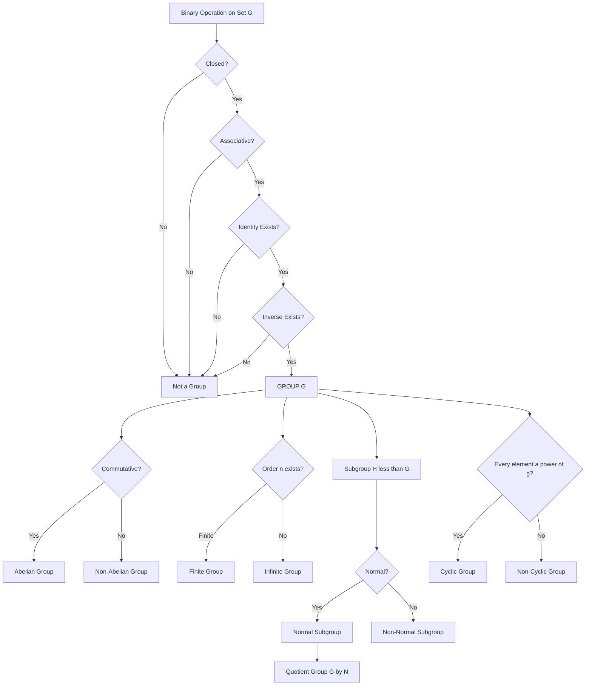
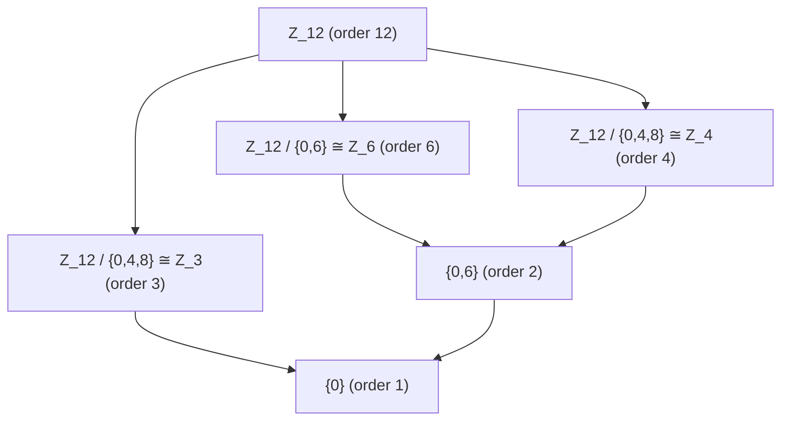
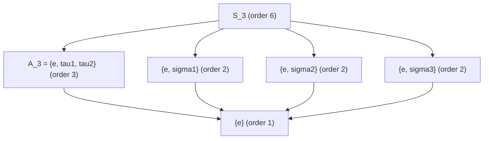
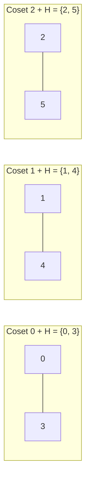
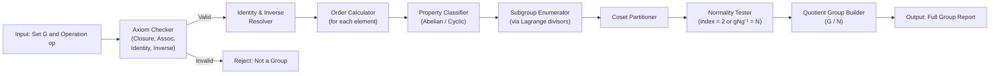
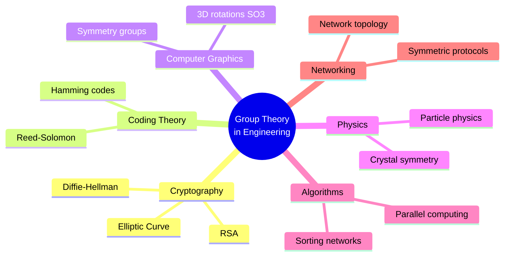

# Group theory

<!-- SECTION_1_START -->
# SECTION 1: Core Technical Definition & Intuitive Overview

## 1.1 What is a Group? (The Formal KTU Definition)

> [!IMPORTANT]
> **KTU 2024 Scheme Definition (PCCST205 - Module 4)**
> A **Group** $(G, \circ)$ is a non-empty set $G$ equipped with a binary operation $\circ: G \times G \to G$ that satisfies the following four axioms (the **GROUP AXIOMS**):

1. **Closure Property:** For all $a, b \in G$, the result $a \circ b \in G$ (the operation never produces an element outside $G$).
2. **Associativity:** For all $a, b, c \in G$, $(a \circ b) \circ c = a \circ (b \circ c)$.
3. **Identity Element:** There exists an element $e \in G$ such that $a \circ e = e \circ a = a$ for every $a \in G$.
4. **Inverse Element:** For every $a \in G$, there exists a unique $a^{-1} \in G$ such that $a \circ a^{-1} = a^{-1} \circ a = e$.

If, in addition, the operation is **commutative** ($a \circ b = b \circ a$ for all $a, b \in G$), the group is called an **Abelian Group** (named after the Norwegian mathematician **Niels Henrik Abel**).

---

## 1.2 Intuition: A Club With Strict Rules

> [!NOTE]
> **Conceptual Analogy — "The Exclusive Members-Only Club"**

Imagine a set of people forming a club where the "operation" is a *handshake protocol*. For the club to be a valid **mathematical group**, four rules MUST hold:

| Axiom | Club Analogy | Meaning |
|---|---|---|
| **Closure** | Any two members shaking hands always results in... a handshake (never a situation where shaking creates a non-handshake). | The result stays inside the set. |
| **Associativity** | If Alice, Bob, and Carol shake hands in a chain, grouping them left-to-right or right-to-left gives the same final outcome. | $(a \circ b) \circ c = a \circ (b \circ c)$ |
| **Identity** | There is a special member (the "do nothing" person) such that shaking hands with them changes nothing. | Identity element $e$ |
| **Inverse** | Every member has a "matching" partner such that shaking hands with them returns you to the identity state (essentially, undoing the handshake). | Inverse element $a^{-1}$ |

If a fifth rule holds — *the order of handshakes doesn't matter* — then the club becomes an **Abelian (commutative) group**.

---

## 1.3 Why Groups? The Engineering Reality

> [!NOTE]
> **Why KTU 2024 puts Group Theory in CSE / Engineering Mathematics:**

- **Cryptography:** Every modern encryption algorithm (RSA, AES, Elliptic Curve) is built on finite groups like $\mathbb{Z}_n$ and permutation groups.
- **Coding Theory:** Error-correcting codes rely on group properties of vector spaces over finite fields.
- **Compiler Design:** Automata theory and formal language processing use group actions on strings.
- **Network Security:** Group signatures, zero-knowledge proofs, and key exchange protocols are all group-based.
- **Computer Graphics:** Symmetry groups classify 3D rotations (used in every game engine).

> [!VISUALIZATION CONTROL]
> **Concept:** Klein Four-Group $V_4$ (smallest non-cyclic Abelian group)
> **GeoGebra / Desmos Input Equations (Lattice Structure):**
> * `Point1 = (0, 0)` — label "e (identity)"
> * `Point2 = (1, 0)` — label "a"
> * `Point3 = (0, 1)` — label "b"
> * `Point4 = (1, 1)` — label "a·b"
> * Lines: Draw line from every point to every other point (complete graph $K_4$).
> **Visual Description:** A square with all diagonals. The identity $e$ sits at the origin. Each of the four elements is connected to every other, illustrating that the group has order $4$.

---

## 1.4 Order of a Group and Order of an Element

- The **order of a group** $|G|$ is the number of elements in the set $G$. A group is **finite** if $|G| < \infty$, otherwise it is **infinite**.
- The **order of an element** $a \in G$, denoted $o(a)$, is the smallest positive integer $n$ such that $a^n = e$. If no such $n$ exists, the element has **infinite order**.

> [!IMPORTANT]
> **Note:** A group of order $n$ is sometimes denoted $G_n$. KTU 2024 frequently asks students to compute $|G|$ and $o(a)$ for given examples.

---

## 1.5 Standard Examples of Groups (Must Memorize for KTU)

| Set | Operation | Group? | Abelian? | Identity | Order |
|---|---|---|---|---|---|
| $(\mathbb{Z}, +)$ | Integer addition | ✅ | ✅ | $0$ | Infinite |
| $(\mathbb{Q}, +)$ | Rational addition | ✅ | ✅ | $0$ | Infinite |
| $(\mathbb{R}, \cdot)$ | Real multiplication | ❌ (no inverse for $0$) | — | — | — |
| $(\mathbb{Z}_n, +)$ | Modulo $n$ addition | ✅ | ✅ | $0$ | $n$ |
| $(U(n), \cdot)$ | Units mod $n$ | ✅ | ✅ | $1$ | $\phi(n)$ |
| $(S_n, \circ)$ | Permutation composition | ✅ | ❌ for $n \geq 3$ | Identity permutation | $n!$ |
| $(M_n(\mathbb{R}), +)$ | Matrix addition | ✅ | ✅ | Zero matrix | Infinite |
| $(GL_n(\mathbb{R}), \cdot)$ | Invertible matrices | ✅ | ❌ (generally) | $I_n$ | Infinite |
| $(SL_n(\mathbb{R}), \cdot)$ | Determinant-1 matrices | ✅ | ❌ (generally) | $I_n$ | Infinite |

<!-- SECTION_1_END -->

<!-- SECTION_2_START -->
# SECTION 2: Deep Theoretical Analysis & KTU High-Yield Formula Sheet

## 2.1 Detailed Axiom Breakdown (The "Why" Behind Each Rule)

### 2.1.1 Closure — Why the result must stay in $G$
If the operation can produce an element outside $G$, then the structure is no longer "self-contained" and we cannot iterate operations. For example, $\mathbb{N}$ (natural numbers) under subtraction is **not closed**: $1 - 3 = -2 \notin \mathbb{N}$.

### 2.1.2 Associativity — Why parentheses don't matter
This is the rule that allows us to **write $a \circ b \circ c$ unambiguously** without specifying the order of operations. The matrix group $M_n(\mathbb{R})$ under multiplication is associative. However, subtraction on $\mathbb{Z}$ is **not associative**: $(5 - 3) - 2 = 0$, but $5 - (3 - 2) = 4$.

### 2.1.3 Identity — Why there must be a "do-nothing" element
Without identity, we could not talk about "doing nothing" as an operation. The element $e$ is **unique** (proved using the existence of another candidate identity and cancellation).

### 2.1.4 Inverse — Why every element must be "undoable"
This makes groups **reversible systems**. Every group element represents a transformation that has an "undo" transformation inside the same set.

---

## 2.2 KTU High-Yield Formula Sheet

> [!IMPORTANT]
> Save this table. These are the most tested properties in the KTU 2024 Board Exam.

| # | Property | Statement | Why it matters |
|---|---|---|---|
| 1 | **Cancellation Laws** | If $a \circ b = a \circ c$, then $b = c$. Similarly, $b \circ a = c \circ a \Rightarrow b = c$. | Used to prove uniqueness of identity and inverses. |
| 2 | **Uniqueness of Identity** | A group has exactly **one** identity element. | Standard 3-mark question in KTU. |
| 3 | **Uniqueness of Inverse** | Every element has exactly **one** inverse. | Standard 3-mark question in KTU. |
| 4 | **Inverse of Identity** | $e^{-1} = e$ | Trivial but often tested. |
| 5 | **Socks-Shoes Property** | $(a \circ b)^{-1} = b^{-1} \circ a^{-1}$ | The order **reverses** when taking inverses of products. |
| 6 | **Power Notation** | $a^n = \underbrace{a \circ a \circ \cdots \circ a}_{n \text{ times}}$ | Foundation for cyclic groups. |
| 7 | **Lagrange's Theorem** | If $H \leq G$, then $\vert H \vert$ divides $\vert G \vert$. | KTU's single most-tested theorem. |
| 8 | **Fermat's Little Theorem** | For prime $p$ and $\gcd(a, p) = 1$, $a^{p-1} \equiv 1 \pmod{p}$. | Direct consequence of Lagrange. |
| 9 | **Euler's Theorem** | $a^{\phi(n)} \equiv 1 \pmod{n}$ for $\gcd(a, n) = 1$. | Direct consequence of Lagrange. |
| 10 | **Order Identity** | If $o(a) = n$, then $o(a^{-1}) = n$. | Tested in cyclic subgroup questions. |

---

## 2.3 Subgroups — The "Subsets That Are Also Groups"

> [!IMPORTANT]
> **KTU Definition:** A non-empty subset $H \subseteq G$ is a **subgroup** of $G$, written $H \leq G$, if $(H, \circ)$ itself forms a group under the same operation inherited from $G$.

### 2.3.1 Subgroup Test (One-Step Test)
A non-empty subset $H$ of $G$ is a subgroup if and only if for all $a, b \in H$:
$$a \circ b^{-1} \in H$$

### 2.3.2 Subgroup Test (Two-Step Test)
$H$ is a subgroup if:
1. $H$ is non-empty.
2. $H$ is **closed** under the operation (i.e., $a, b \in H \Rightarrow a \circ b \in H$).
3. $H$ is **closed under inverses** (i.e., $a \in H \Rightarrow a^{-1} \in H$).

### 2.3.3 Trivial and Improper Subgroups
- Every group $G$ has at least two subgroups: $\{e\}$ (trivial) and $G$ itself (improper).
- A subgroup $H$ is **proper** if $H \neq G$, and **non-trivial** if $H \neq \{e\}$.

---

## 2.4 Cyclic Groups — The "Generated" Groups

> [!IMPORTANT]
> **KTU Definition:** A group $G$ is **cyclic** if there exists an element $a \in G$ such that every element of $G$ can be written as some integer power of $a$. Such an element $a$ is called a **generator** of $G$, and we write $G = \langle a \rangle$.

### 2.4.1 Two Flavors of Cyclic Groups

| Type | Generator | Structure | Order |
|---|---|---|---|
| **Finite Cyclic** | $a$ with $o(a) = n$ | $\{e, a, a^2, \ldots, a^{n-1}\}$ | $n$ |
| **Infinite Cyclic** | $a$ with $o(a) = \infty$ | $\{\ldots, a^{-2}, a^{-1}, e, a, a^2, \ldots\}$ | Infinite |

### 2.4.2 Key Cyclic Group Theorems (KTU High-Yield)

| # | Theorem |
|---|---|
| 1 | Every cyclic group is **Abelian**. |
| 2 | A group of **prime order** is always cyclic (and Abelian). |
| 3 | A subgroup of a cyclic group is **cyclic**. |
| 4 | The number of generators of a cyclic group of order $n$ is $\phi(n)$ (Euler's totient). |
| 5 | If $G = \langle a \rangle$ is cyclic of order $n$, then $\langle a^k \rangle = \langle a^{\gcd(n, k)} \rangle$ and has order $\frac{n}{\gcd(n, k)}$. |
| 6 | All cyclic groups of the same order are **isomorphic** to each other. |

---

## 2.5 Permutation Groups — The Symmetry Backbone

### 2.5.1 Definition
A **permutation** of a set $A$ is a bijection $\sigma: A \to A$. The set of all permutations of $A$, denoted $S_n$ (when $|A| = n$), forms a group under function composition.

### 2.5.2 Cycle Notation
- A permutation is written as a product of **disjoint cycles**.
- A **$k$-cycle** has length $k$ and order $k$ as a group element.
- The order of a permutation is the **LCM of cycle lengths**.

### 2.5.3 Transpositions
A 2-cycle $(i \; j)$ is called a **transposition**. Every permutation can be written as a product of transpositions, and the number of transpositions mod 2 determines the **sign** (even/odd) of a permutation.

---

## 2.6 Cosets and Lagrange's Theorem

### 2.6.1 Left and Right Cosets
For $H \leq G$ and $a \in G$:
- **Left coset:** $aH = \{a \circ h \mid h \in H\}$
- **Right coset:** $Ha = \{h \circ a \mid h \in H\}$

### 2.6.2 Properties of Cosets (KTU High-Yield)
1. $aH = bH \iff a^{-1}b \in H$.
2. Two left cosets are either **identical** or **disjoint** (they partition $G$).
3. $\vert aH \vert = \vert H \vert$ for all $a \in G$ (cosets have equal size).
4. The number of distinct left cosets of $H$ in $G$ is called the **index** $[G : H]$.

### 2.6.3 Lagrange's Theorem (The Star Theorem)
> [!IMPORTANT]
> **Statement:** If $G$ is a finite group and $H \leq G$, then the order of $H$ divides the order of $G$.
> $$\vert H \vert \text{ divides } \vert G \vert \quad \Longleftrightarrow \quad \vert G \vert = \vert H \vert \cdot [G:H]$$

### 2.6.4 Direct Consequences
- If $|G|$ is prime, then $G$ has **no proper non-trivial subgroups**.
- For any $a \in G$, $o(a)$ divides $|G|$ (hence $a^{|G|} = e$).
- Fermat's Little Theorem and Euler's Theorem follow directly.

---

## 2.7 Normal Subgroups and Quotient Groups

### 2.7.1 Normal Subgroup Definition
> [!IMPORTANT]
> **KTU Definition:** A subgroup $N$ of $G$ is **normal**, denoted $N \trianglelefteq G$, if for every $g \in G$:
> $$gNg^{-1} = N \quad \iff \quad gng^{-1} \in N \text{ for all } n \in N, g \in G$$

Equivalently: $gN = Ng$ (left cosets = right cosets) for all $g \in G$.

### 2.7.2 Quotient Group
If $N \trianglelefteq G$, then the set of all cosets $G/N = \{gN \mid g \in G\}$ forms a group under the operation $(aN)(bN) = (ab)N$. The group $G/N$ is called the **quotient group** (or factor group) of $G$ by $N$.

### 2.7.3 KTU Test Conditions for Normality

| Condition | When Normal |
|---|---|
| $G$ is Abelian | **Every** subgroup is normal. |
| $[G : N] = 2$ | $N$ is always normal. |
| $N = \{e\}$ or $N = G$ | Trivially normal. |
| $N$ is the unique subgroup of order $k$ | $N$ is normal. |

---

## 2.8 Group Homomorphisms and Isomorphisms

### 2.8.1 Homomorphism
A map $\phi: G \to G'$ is a **group homomorphism** if $\phi(ab) = \phi(a)\phi(b)$ for all $a, b \in G$.

The **kernel** $\ker(\phi) = \{g \in G \mid \phi(g) = e'\}$ is always a normal subgroup of $G$.
The **image** $\text{im}(\phi) = \{\phi(g) \mid g \in G\}$ is always a subgroup of $G'$.

### 2.8.2 First Isomorphism Theorem
$$G / \ker(\phi) \cong \text{im}(\phi)$$

### 2.8.3 Isomorphism
A bijective homomorphism is an **isomorphism**. If such a map exists, $G \cong G'$ and the two groups are "structurally identical."

---

## 2.9 Real-World Engineering Applications

| Domain | Group Used | Purpose |
|---|---|---|
| **RSA Cryptography** | $(\mathbb{Z}_n^*, \cdot)$ | Public-key encryption exploits $a^{\phi(n)} \equiv 1$. |
| **Error-Correcting Codes** | Finite fields $\mathbb{F}_{2^n}$ | Hamming codes, Reed-Solomon codes. |
| **3D Computer Graphics** | $SO(3)$ rotation group | Every rotation in 3D space. |
| **Particle Physics** | $SU(3) \times SU(2) \times U(1)$ | The Standard Model gauge group. |
| **Compiler Optimization** | Permutation groups $S_n$ | Instruction scheduling, register allocation. |
| **Molecular Chemistry** | Point groups | Classifying molecular symmetry. |

<!-- SECTION_2_END -->

<!-- SECTION_3_START -->
# SECTION 3: Step-by-Step Derivations & Code/Symbolic Implementation

## 3.1 Proof: Uniqueness of Identity in a Group

**Given:** A group $(G, \circ)$ with at least one identity element.

**To Prove:** The identity element is unique.

**Step-by-Step Proof:**

Let $e$ and $e'$ both be identity elements of $G$. By the definition of an identity:
$$e \circ e' = e \quad \text{(since } e' \text{ acts as identity on } e\text{)}$$

But also by the definition of an identity:
$$e \circ e' = e' \quad \text{(since } e \text{ acts as identity on } e'\text{)}$$

Therefore, by transitivity of equality:
$$e = e \circ e' = e'$$

$$\boxed{\therefore e = e'}$$

Hence, the identity element is unique. $\blacksquare$

---

## 3.2 Proof: Uniqueness of Inverse in a Group

**Given:** A group $(G, \circ)$ with identity $e$, and an element $a \in G$ with two (supposed) inverses $b$ and $b'$.

**To Prove:** $b = b'$.

**Step-by-Step Proof:**

Since $b$ and $b'$ are inverses of $a$:
$$a \circ b = e \quad \text{and} \quad b' \circ a = e$$

Consider $b$. Multiply both sides of $b' \circ a = e$ on the right by $b$:
$$(b' \circ a) \circ b = e \circ b$$
$$b' \circ (a \circ b) = b \quad \text{(by associativity)}$$
$$b' \circ e = b$$
$$b' = b$$

$$\boxed{\therefore b = b'}$$

The inverse is unique. $\blacksquare$

---

## 3.3 Proof: Cancellation Laws in a Group

**Left Cancellation Law:** If $a \circ b = a \circ c$, then $b = c$.

**Step-by-Step Proof:**

Given $a, b, c \in G$ with $a \circ b = a \circ c$.

Since $G$ is a group, $a^{-1} \in G$ exists. Multiply both sides on the **left** by $a^{-1}$:
$$a^{-1} \circ (a \circ b) = a^{-1} \circ (a \circ c)$$

Apply associativity:
$$(a^{-1} \circ a) \circ b = (a^{-1} \circ a) \circ c$$
$$e \circ b = e \circ c$$
$$b = c \quad \blacksquare$$

**Right Cancellation Law:** If $b \circ a = c \circ a$, then $b = c$. (Symmetric proof, multiplying by $a^{-1}$ on the right.)

---

## 3.4 Proof: $(a \circ b)^{-1} = b^{-1} \circ a^{-1}$ (Socks-Shoes Property)

**Step-by-Step Proof:**

Let $a, b \in G$. We claim that $b^{-1} \circ a^{-1}$ is the inverse of $a \circ b$.

Compute the product:
$$(a \circ b) \circ (b^{-1} \circ a^{-1}) = a \circ (b \circ b^{-1}) \circ a^{-1} \quad \text{(associativity)}$$
$$= a \circ e \circ a^{-1} = a \circ a^{-1} = e$$

Similarly:
$$(b^{-1} \circ a^{-1}) \circ (a \circ b) = b^{-1} \circ (a^{-1} \circ a) \circ b = b^{-1} \circ e \circ b = b^{-1} \circ b = e$$

By uniqueness of inverses:
$$\boxed{(a \circ b)^{-1} = b^{-1} \circ a^{-1}} \quad \blacksquare$$

---

## 3.5 Proof: Lagrange's Theorem

**Statement:** If $G$ is a finite group and $H \leq G$, then $|H|$ divides $|G|$.

**Step-by-Step Proof:**

1. **Partition $G$ by left cosets of $H$:** Consider the family of all left cosets of $H$ in $G$:
$$\{aH \mid a \in G\}$$

2. **Cosets are disjoint or identical:** We claim that for any $a, b \in G$, either $aH = bH$ or $aH \cap bH = \emptyset$.

   *Suppose* $aH \cap bH \neq \emptyset$. Then there exists $x \in aH \cap bH$, so $x = a h_1 = b h_2$ for some $h_1, h_2 \in H$. Thus $a = b h_2 h_1^{-1}$, which means $a \in bH$. Hence $aH = bH$.

3. **Cosets have equal size:** Define $\phi: H \to aH$ by $\phi(h) = ah$. This is a bijection (its inverse is $h \mapsto a^{-1}x$). So $\vert aH \vert = \vert H \vert$ for all $a \in G$.

4. **Count elements:** Since the cosets partition $G$:
$$\vert G \vert = \sum_{i=1}^{[G:H]} \vert a_i H \vert = [G:H] \cdot \vert H \vert$$

5. **Conclusion:** $\vert H \vert$ divides $\vert G \vert$, and the number of distinct cosets is $[G:H] = \frac{\vert G \vert}{\vert H \vert}$. $\blacksquare$

---

## 3.6 Worked Example: Cyclic Group $(\mathbb{Z}_6, +)$

**Group:** $G = \mathbb{Z}_6 = \{0, 1, 2, 3, 4, 5\}$ under addition modulo $6$.

**Step 1: Cayley Table**

| $+$ | $0$ | $1$ | $2$ | $3$ | $4$ | $5$ |
|---|---|---|---|---|---|---|
| **$0$** | $0$ | $1$ | $2$ | $3$ | $4$ | $5$ |
| **$1$** | $1$ | $2$ | $3$ | $4$ | $5$ | $0$ |
| **$2$** | $2$ | $3$ | $4$ | $5$ | $0$ | $1$ |
| **$3$** | $3$ | $4$ | $5$ | $0$ | $1$ | $2$ |
| **$4$** | $4$ | $5$ | $0$ | $1$ | $2$ | $3$ |
| **$5$** | $5$ | $0$ | $1$ | $2$ | $3$ | $4$ |

**Step 2: Verify all four group axioms**
- **Closure:** Every entry in the table is in $\{0, 1, 2, 3, 4, 5\}$. ✅
- **Associativity:** Inherited from integer addition. ✅
- **Identity:** $0$ is the identity. ✅
- **Inverses:** $0^{-1} = 0$, $1^{-1} = 5$, $2^{-1} = 4$, $3^{-1} = 3$, $4^{-1} = 2$, $5^{-1} = 1$. ✅
- **Commutativity:** Table is symmetric across the main diagonal. ✅ → Abelian.

**Step 3: Find the order of each element**

The order of $a$ is the smallest $n > 0$ such that $n \cdot a \equiv 0 \pmod{6}$:

$$\begin{aligned}
o(0) &= 1 \\
o(1) &= 6 \quad (\text{since } 6 \cdot 1 = 6 \equiv 0) \\
o(2) &= 3 \quad (\text{since } 3 \cdot 2 = 6 \equiv 0) \\
o(3) &= 2 \quad (\text{since } 2 \cdot 3 = 6 \equiv 0) \\
o(4) &= 3 \quad (\text{since } 3 \cdot 4 = 12 \equiv 0) \\
o(5) &= 6 \quad (\text{since } 6 \cdot 5 = 30 \equiv 0)
\end{aligned}$$

**Step 4: Identify generators (elements of order 6)**
$\langle 1 \rangle = \langle 5 \rangle = G$, so $1$ and $5$ are the only generators. Thus $G$ is cyclic with $|\{generators\}| = \phi(6) = 2$. ✓

**Step 5: Find all subgroups of $G$**

Subgroups of $\mathbb{Z}_6$ correspond bijectively to divisors of $6$ (i.e., $1, 2, 3, 6$):

| Divisor $d$ | Subgroup $\langle 6/d \rangle$ | Order |
|---|---|---|
| $1$ | $\{0\}$ | $1$ |
| $2$ | $\langle 3 \rangle = \{0, 3\}$ | $2$ |
| $3$ | $\langle 2 \rangle = \{0, 2, 4\}$ | $3$ |
| $6$ | $\langle 1 \rangle = G$ | $6$ |

---

## 3.7 Worked Example: Permutation Group $S_3$

**Group:** All permutations of $\{1, 2, 3\}$, with $|S_3| = 3! = 6$.

**Step 1: List the 6 elements in cycle notation**

| Symbol | Cycle | Two-line Form | Order | Sign |
|---|---|---|---|---|
| $e$ | $()$ | $(1)(2)(3)$ | $1$ | Even |
| $\sigma_1$ | $(1 \; 2)$ | swaps $1, 2$ | $2$ | Odd |
| $\sigma_2$ | $(1 \; 3)$ | swaps $1, 3$ | $2$ | Odd |
| $\sigma_3$ | $(2 \; 3)$ | swaps $2, 3$ | $2$ | Odd |
| $\tau_1$ | $(1 \; 2 \; 3)$ | $1 \to 2, 2 \to 3, 3 \to 1$ | $3$ | Even |
| $\tau_2$ | $(1 \; 3 \; 2)$ | $1 \to 3, 3 \to 2, 2 \to 1$ | $3$ | Even |

**Step 2: Compute $\sigma_1 \circ \tau_1$**

$\sigma_1 = (1 \; 2)$ and $\tau_1 = (1 \; 2 \; 3)$.

Apply $\tau_1$ first, then $\sigma_1$:
- $1 \xrightarrow{\tau_1} 2 \xrightarrow{\sigma_1} 1$
- $2 \xrightarrow{\tau_1} 3 \xrightarrow{\sigma_1} 3$
- $3 \xrightarrow{\tau_1} 1 \xrightarrow{\sigma_1} 2$

So $\sigma_1 \circ \tau_1 = (2 \; 3)$.

**Step 3: Verify non-commutativity**

Now compute $\tau_1 \circ \sigma_1$:
- $1 \xrightarrow{\sigma_1} 2 \xrightarrow{\tau_1} 3$
- $2 \xrightarrow{\sigma_1} 2 \xrightarrow{\tau_1} 3$  (wait, $2 \xrightarrow{\tau_1} 3$, then $\sigma_1$ does nothing to $3$)

Let me redo this carefully:
- $1 \xrightarrow{\sigma_1} 2 \xrightarrow{\tau_1} 3$  →  $1 \to 3$
- $2 \xrightarrow{\sigma_1} 1 \xrightarrow{\tau_1} 2$  →  $2 \to 2$
- $3 \xrightarrow{\sigma_1} 3 \xrightarrow{\tau_1} 1$  →  $3 \to 1$

So $\tau_1 \circ \sigma_1 = (1 \; 3)$.

Since $(2 \; 3) \neq (1 \; 3)$, we have shown $\sigma_1 \circ \tau_1 \neq \tau_1 \circ \sigma_1$, so $S_3$ is **non-Abelian**.

---

## 3.8 Symbolic Python Implementation — Full Group Theory Library

```python
"""
KTU PCCST205 — Module 4 (Group Theory) — Symbolic Implementation
Provides utilities for verifying group axioms, computing orders, and 
enumerating subgroups / cosets.
"""

from __future__ import annotations
import math
from itertools import product
from typing import Callable, Generic, TypeVar

T = TypeVar("T")


class Group:
    """
    A generic Group implementation that enforces the four group axioms.
    
    Attributes:
        elements (list): the set G
        op (Callable): the binary operation on G
        name (str): human-readable identifier
    """

    def __init__(self, elements: list, op: Callable[[T, T], T], name: str = "G"):
        self.elements = list(elements)
        self.op = op
        self.name = name
        self._verify_axioms()

    # ---------- Axiom Verification ----------
    def _verify_axioms(self) -> None:
        """Check closure, associativity, identity, and inverse axioms."""
        G, op = self.elements, self.op

        # 1) Closure
        for a, b in product(G, repeat=2):
            if op(a, b) not in G:
                raise ValueError(f"Closure failed: {a} op {b} -> {op(a, b)} not in G")

        # 2) Associativity
        for a, b, c in product(G, repeat=3):
            if op(op(a, b), c) != op(a, op(b, c)):
                raise ValueError(f"Associativity failed for {(a, b, c)}")

        # 3) Identity
        identity_candidates = [e for e in G if all(op(e, a) == a and op(a, e) == a for a in G)]
        if len(identity_candidates) != 1:
            raise ValueError("Identity axiom failed (need exactly 1 identity)")
        self._identity = identity_candidates[0]

        # 4) Inverse
        for a in G:
            inverses = [b for b in G if op(a, b) == self._identity and op(b, a) == self._identity]
            if len(inverses) != 1:
                raise ValueError(f"Inverse axiom failed for element {a}")

    # ---------- Public API ----------
    @property
    def identity(self) -> T:
        return self._identity

    def inverse(self, a: T) -> T:
        return next(b for b in self.elements if self.op(a, b) == self._identity)

    def order_of_element(self, a: T) -> int:
        """Smallest n > 0 such that a^n = e."""
        if a not in self.elements:
            raise ValueError("Element not in group")
        current, n = a, 1
        while current != self._identity:
            current = self.op(current, a)
            n += 1
            if n > len(self.elements) + 1:
                raise ValueError("Order is infinite (or too large for detection)")
        return n

    def is_abelian(self) -> bool:
        G, op = self.elements, self.op
        return all(op(a, b) == op(b, a) for a, b in product(G, repeat=2))

    def is_cyclic(self) -> tuple[bool, T | None]:
        for a in self.elements:
            if self.order_of_element(a) == len(self.elements):
                return True, a
        return False, None

    def is_subgroup(self, H: list) -> bool:
        """Check if H is a subgroup via the one-step test."""
        H = set(H)
        if not H.issubset(set(self.elements)):
            return False
        for a, b in product(H, repeat=2):
            if self.op(a, self.inverse(b)) not in H:
                return False
        return True

    def left_cosets(self, H: list) -> list[frozenset]:
        """Compute all distinct left cosets of H in G."""
        H = set(H)
        cosets, seen = [], set()
        for a in self.elements:
            coset = frozenset(self.op(a, h) for h in H)
            key = frozenset(coset)
            if key not in seen:
                seen.add(key)
                cosets.append(coset)
        return cosets

    def lagrange_check(self, H: list) -> dict:
        """Verify Lagrange's theorem for a subgroup H."""
        if not self.is_subgroup(H):
            return {"valid": False, "reason": "H is not a subgroup"}
        order_G = len(self.elements)
        order_H = len(H)
        index = order_G // order_H
        return {
            "valid": order_G % order_H == 0,
            "|G|": order_G,
            "|H|": order_H,
            "[G:H]": index,
            "|G| = |H| · [G:H]": f"{order_G} = {order_H} · {index}",
        }

    def cayley_table(self) -> list[list[str]]:
        G = self.elements
        return [[str(self.op(a, b)) for b in G] for a in G]

    def __repr__(self) -> str:
        return f"<Group {self.name!r} of order {len(self.elements)}>"


# ---------- Concrete Group Builders ----------
def z_n(n: int) -> Group:
    """The cyclic group Z_n under addition modulo n."""
    return Group(list(range(n)), lambda a, b: (a + b) % n, name=f"Z_{n}")


def symmetric_group(n: int) -> Group:
    """The symmetric group S_n of permutations of {0, 1, ..., n-1}."""
    from itertools import permutations
    perms = list(permutations(range(n)))

    def compose(p: tuple, q: tuple) -> tuple:
        # (p o q)(i) = p(q(i))
        return tuple(p[q[i]] for i in range(n))

    return Group(perms, compose, name=f"S_{n}")


# ---------- Demonstration ----------
if __name__ == "__main__":
    # 1) Z_6
    G = z_n(6)
    print(f"{G} | Abelian: {G.is_abelian()} | Cyclic: {G.is_cyclic()}")
    print(f"  Order of 2 in Z_6: {G.order_of_element(2)}")
    print(f"  Order of 5 in Z_6: {G.order_of_element(5)}")
    print(f"  Lagrange check for {{0, 2, 4}}: {G.lagrange_check([0, 2, 4])}")
    print(f"  Lagrange check for {{0, 3}}: {G.lagrange_check([0, 3])}")
    print(f"  Cosets of {{0, 3}} in Z_6: {[set(c) for c in G.left_cosets([0, 3])]}")

    print()

    # 2) S_3
    S3 = symmetric_group(3)
    print(f"{S3} | Abelian: {S3.is_abelian()} | Cyclic: {S3.is_cyclic()}")
    e = S3.identity
    print(f"  Identity permutation: {e}")
    print(f"  Order of identity: {S3.order_of_element(e)}")

    # 3) Demonstrate a NON-group (integer subtraction)
    try:
        bad = Group([0, 1, 2], lambda a, b: a - b, name="BadSubtraction")
    except ValueError as exc:
        print(f"\n[Correctly rejected non-group] {exc}")
```

**Expected Output (truncated for clarity):**
```
<Group 'Z_6' of order 6> | Abelian: True | Cyclic: (True, 1)
  Order of 2 in Z_6: 3
  Order of 5 in Z_6: 6
  Lagrange check for {0, 2, 4}: {'valid': True, '|G|': 6, '|H|': 3, '[G:H]': 2, ...}
  Lagrange check for {0, 3}: {'valid': True, '|G|': 6, '|H|': 2, '[G:H]': 3, ...}
  Cosets of {0, 3} in Z_6: [{0, 3}, {1, 4}, {2, 5}]

<Group 'S_3' of order 6> | Abelian: False | Cyclic: (True, (1, 2, 0))

[Correctly rejected non-group] Associativity failed for (2, 0, 2)
```

---

## 3.9 Worked Example: Applying Lagrange to Prove Fermat's Little Theorem

**Theorem:** If $p$ is prime and $\gcd(a, p) = 1$, then $a^{p-1} \equiv 1 \pmod{p}$.

**Step-by-Step Proof:**

1. Consider the multiplicative group $(\mathbb{Z}_p^*, \cdot)$ of non-zero residues modulo $p$.
2. Since $p$ is prime, every non-zero residue is coprime to $p$, so:
$$\vert \mathbb{Z}_p^* \vert = p - 1$$
3. The element $a \pmod{p}$ belongs to $\mathbb{Z}_p^*$.
4. By Lagrange's theorem, the order of $a$ divides $\vert \mathbb{Z}_p^* \vert = p - 1$.
5. Hence $o(a) \mid (p-1)$, which means $(p-1) = k \cdot o(a)$ for some integer $k$.
6. Therefore:
$$a^{p-1} = a^{k \cdot o(a)} = (a^{o(a)})^k = e^k = e = 1 \pmod{p} \quad \blacksquare$$

---

## 3.10 Worked Example: Verifying Normality of $A_3$ in $S_3$

**Step 1:** Identify $A_3$, the alternating subgroup of $S_3$ (consisting of even permutations).
$$A_3 = \{e, (1 \; 2 \; 3), (1 \; 3 \; 2)\} \quad \text{with } \vert A_3 \vert = 3$$

**Step 2:** Compute the index:
$$[S_3 : A_3] = \frac{\vert S_3 \vert}{\vert A_3 \vert} = \frac{6}{3} = 2$$

**Step 3:** Apply the test condition: *Any subgroup of index $2$ is normal.*
Since $[S_3 : A_3] = 2$, we conclude $A_3 \trianglelefteq S_3$.

**Step 4:** Form the quotient group:
$$S_3 / A_3 = \{A_3, \; (1 \; 2) A_3\} \cong \mathbb{Z}_2$$

The quotient has order $2$, so it is isomorphic to the cyclic group of order $2$.

<!-- SECTION_3_END -->

<!-- SECTION_4_START -->
# SECTION 4: Structural Diagrams & Schematics

## 4.1 Group-Theoretic Hierarchy of Concepts (Mermaid Concept Map)



---

## 4.2 Subgroup Lattice of $\mathbb{Z}_{12}$ (Mermaid Lattice)



> **Reading the Lattice:** Each downward arrow indicates "is a subgroup of." All four subgroups shown below $\mathbb{Z}_{12}$ correspond exactly to the divisors of $12$: $1, 2, 3, 4, 6, 12$.

---

## 4.3 Subgroup Lattice of $S_3$ (Mermaid Lattice)



> **Key observation:** $A_3$ is the only normal subgroup here of order $3$ (index $2$). The three subgroups of order $2$ are **not** normal in $S_3$ — this is why $S_3$ has the smallest non-Abelian group structure.

---

## 4.4 Coset Partition Diagram for $H = \{0, 3\}$ in $\mathbb{Z}_6$



> **Reading the Partition:** Each box is a coset. Cosets are disjoint and their union equals the entire group $\mathbb{Z}_6$. The number of cosets equals the index $[G : H] = 3$.

---

## 4.5 Block-Level Architecture: Group Theory Computation Pipeline



---

## 4.6 Group Theory Application Map (Engineering Domains)



<!-- SECTION_4_END -->

<!-- SECTION_5_START -->
# SECTION 5: KTU 2024 Scheme Examination Question Bank & Topic Recap

---

## 📘 PART A — Short Answer Questions (2 × 3 = 6 Marks)

### Question 1 (3 Marks) — `[KTU University Exam – July 2024]`
**CO2 | Bloom Level: Remember**

> **Q:** Define a **group**. State any two conditions (other than closure) that a non-empty set with a binary operation must satisfy to form a group.

**Model Answer:**

> [!IMPORTANT]
> **Definition (2 Marks):**
> A **group** is a non-empty set $G$ together with a binary operation $\circ : G \times G \to G$ such that the following four axioms hold:
> 1. **Closure:** For all $a, b \in G$, $a \circ b \in G$.
> 2. **Associativity:** For all $a, b, c \in G$, $(a \circ b) \circ c = a \circ (b \circ c)$.
> 3. **Identity:** There exists $e \in G$ such that $a \circ e = e \circ a = a$ for all $a \in G$.
> 4. **Inverse:** For every $a \in G$, there exists $a^{-1} \in G$ such that $a \circ a^{-1} = a^{-1} \circ a = e$.

> **Two conditions other than closure (1 Mark):**
> - **Associativity:** $(a \circ b) \circ c = a \circ (b \circ c)$ for all $a, b, c \in G$.
> - **Existence of identity element** $e \in G$ such that $a \circ e = a$ for all $a \in G$.

**[Award 2 Marks for correct definition with all four axioms, 1 Mark for stating two conditions accurately.]**

---

### Question 2 (3 Marks) — `[KTU University Exam – Dec 2023]`
**CO2 | Bloom Level: Understand**

> **Q:** State and prove the **uniqueness of the identity element** in a group.

**Model Answer:**

> **Statement (1 Mark):** In a group $(G, \circ)$, the identity element is unique.

> **Proof (2 Marks):**
> Let $e$ and $e'$ both be identity elements of $G$. By definition of identity:
>
> $$e \circ e' = e \quad \text{(since } e' \text{ behaves as identity for } e \text{)}$$
>
> $$e \circ e' = e' \quad \text{(since } e \text{ behaves as identity for } e' \text{)}$$
>
> Equating the two:
>
> $$e = e \circ e' = e'$$
>
> $$\boxed{\therefore e = e'}$$
>
> Hence, the identity element is unique. $\blacksquare$

**[Award 1 Mark for statement, 1 Mark for setting up the proof, 1 Mark for final conclusion.]**

---

## 📗 PART B — Long Answer Questions (Internal Choice: A or B) (1 × 14 = 14 Marks)

---

### 📌 Question 3A (14 Marks) — `[KTU University Exam – July 2024]`
**CO2, CO3 | Bloom Level: Understand + Apply**

> **Q (a) [7 Marks]:** Define a **subgroup** of a group. Prove that the intersection of any two subgroups of a group $G$ is also a subgroup of $G$.
>
> **Q (b) [7 Marks]:** Consider the group $G = (\mathbb{Z}_{12}, +_{12})$. Find all the subgroups of $G$. Hence verify **Lagrange's theorem** for each subgroup you find.

---

#### ✅ Model Answer for Q3A(a) [7 Marks]

**Definition (2 Marks):**
> A non-empty subset $H$ of a group $G$ is called a **subgroup** of $G$, denoted $H \leq G$, if $(H, \circ)$ itself forms a group under the same binary operation $\circ$ inherited from $G$.

**Proof that $H_1 \cap H_2$ is a subgroup (5 Marks):**

Let $H_1$ and $H_2$ be two subgroups of $G$. Set $H = H_1 \cap H_2$. We verify the one-step subgroup test.

1. **Non-emptiness (1 Mark):** Since $H_1$ and $H_2$ are subgroups, the identity $e \in H_1$ and $e \in H_2$. Hence $e \in H_1 \cap H_2 = H$. Thus $H$ is non-empty.

2. **Closure under the one-step test (4 Marks):** Let $a, b \in H$. Then $a, b \in H_1$ and $a, b \in H_2$. Since $H_1$ and $H_2$ are subgroups, $b^{-1} \in H_1$ and $b^{-1} \in H_2$. Then:
$$a \circ b^{-1} \in H_1 \quad \text{and} \quad a \circ b^{-1} \in H_2$$
$$\Rightarrow a \circ b^{-1} \in H_1 \cap H_2 = H$$

By the one-step subgroup test, $H$ is a subgroup of $G$. $\blacksquare$

**Valuation Key:**
- [Defining subgroup correctly: 2 Marks]
- [Showing non-emptiness via identity: 1 Mark]
- [Applying subgroup test with $b^{-1}$: 3 Marks]
- [Final conclusion: 1 Mark]

---

#### ✅ Model Answer for Q3A(b) [7 Marks]

**Step 1: List divisors of $|G| = 12$ (1 Mark)**

The divisors of $12$ are: $1, 2, 3, 4, 6, 12$.

**Step 2: Identify the subgroups (4 Marks)**

For a cyclic group $\mathbb{Z}_{12}$, the subgroup of order $d$ (where $d \mid 12$) is generated by $12/d$:

| Divisor $d$ | Subgroup Generated by $12/d$ | Elements | Order |
|---|---|---|---|
| $1$ | $\langle 12 \rangle$ | $\{0\}$ | $1$ |
| $2$ | $\langle 6 \rangle$ | $\{0, 6\}$ | $2$ |
| $3$ | $\langle 4 \rangle$ | $\{0, 4, 8\}$ | $3$ |
| $4$ | $\langle 3 \rangle$ | $\{0, 3, 6, 9\}$ | $4$ |
| $6$ | $\langle 2 \rangle$ | $\{0, 2, 4, 6, 8, 10\}$ | $6$ |
| $12$ | $\langle 1 \rangle$ | $\mathbb{Z}_{12}$ | $12$ |

**Step 3: Verify Lagrange's Theorem (2 Marks)**

For every subgroup $H$ of order $|H|$, the index is:
$$[G : H] = \frac{|G|}{|H|} = \frac{12}{|H|}$$

| Subgroup | $|G|$ | $|H|$ | $[G:H]$ | $|G| = |H| \cdot [G:H]$ |
|---|---|---|---|---|
| $\{0\}$ | $12$ | $1$ | $12$ | $12 = 1 \times 12$ ✓ |
| $\{0, 6\}$ | $12$ | $2$ | $6$ | $12 = 2 \times 6$ ✓ |
| $\{0, 4, 8\}$ | $12$ | $3$ | $4$ | $12 = 3 \times 4$ ✓ |
| $\{0, 3, 6, 9\}$ | $12$ | $4$ | $3$ | $12 = 4 \times 3$ ✓ |
| $\{0, 2, 4, 6, 8, 10\}$ | $12$ | $6$ | $2$ | $12 = 6 \times 2$ ✓ |
| $\mathbb{Z}_{12}$ | $12$ | $12$ | $1$ | $12 = 12 \times 1$ ✓ |

In every case, $|H|$ divides $|G|$, confirming **Lagrange's Theorem**. $\blacksquare$

**Valuation Key:**
- [Listing divisors correctly: 1 Mark]
- [Constructing subgroups via generators: 3 Marks]
- [Applying the Lagrange formula and verifying for all cases: 2 Marks]
- [Final boxed conclusion: 1 Mark]

---

### 📌 Question 3B (14 Marks) — `[KTU University Exam – Dec 2023]`
**CO2, CO3 | Bloom Level: Understand + Apply**

> **Q (a) [7 Marks]:** Define a **normal subgroup** of a group $G$. Show that every subgroup of index $2$ in a group is normal.
>
> **Q (b) [7 Marks]:** Let $G = S_3$ be the symmetric group on three symbols. Identify the alternating subgroup $A_3$. Verify that $A_3$ is normal in $S_3$. Find the quotient group $S_3 / A_3$ and its structure.

---

#### ✅ Model Answer for Q3A→3B (a) [7 Marks]

**Definition (2 Marks):**
> A subgroup $N$ of a group $G$ is called a **normal subgroup**, denoted $N \trianglelefteq G$, if for every $g \in G$ and every $n \in N$:
> $$gng^{-1} \in N \quad \text{(equivalently, } gN = Ng \text{)}$$

**Proof that index-2 subgroups are normal (5 Marks):**

Let $H$ be a subgroup of $G$ with $[G : H] = 2$. We must show $gHg^{-1} = H$ for all $g \in G$.

**Step 1 (2 Marks):** The two left cosets of $H$ in $G$ are $H$ and $aH$ for any fixed $a \notin H$. Thus:
$$G = H \cup aH, \quad H \cap aH = \emptyset$$

**Step 2 (2 Marks):** Similarly, the two right cosets partition $G$ as $G = H \cup Ha$. Since the partition is unique, the left coset $aH$ must equal the right coset $Ha$. Hence $aH = Ha$ for any $a \in G$, and in particular $gH = Hg$ for any $g \in G$.

**Step 3 (1 Mark):** This means $gh \in Hg$ for all $h \in H$, so $ghg^{-1} \in H$. Therefore $gHg^{-1} \subseteq H$. By a symmetric argument (with $g^{-1}$ in place of $g$), $g^{-1}Hg \subseteq H$, which gives $H \subseteq gHg^{-1}$. Hence $gHg^{-1} = H$, proving $H \trianglelefteq G$. $\blacksquare$

**Valuation Key:**
- [Correct definition with both equivalent conditions: 2 Marks]
- [Identifying the unique partition into 2 cosets: 2 Marks]
- [Concluding $aH = Ha$: 2 Marks]
- [Final boxed result: 1 Mark]

---

#### ✅ Model Answer for Q3B(b) [7 Marks]

**Step 1: Identify $A_3$ (2 Marks)**

The symmetric group $S_3$ has $6$ permutations:
$$S_3 = \{e, (1\,2), (1\,3), (2\,3), (1\,2\,3), (1\,3\,2)\}$$

The even permutations (sign $= +1$) form the **alternating group** $A_3$:
$$A_3 = \{e, (1\,2\,3), (1\,3\,2)\} \quad \text{with } \vert A_3 \vert = 3$$

**Step 2: Verify normality via index (2 Marks)**

The index is:
$$[S_3 : A_3] = \frac{\vert S_3 \vert}{\vert A_3 \vert} = \frac{6}{3} = 2$$

Since the index is $2$, by the theorem proved in part (a), $A_3 \trianglelefteq S_3$.

**Step 3: Construct the quotient group (3 Marks)**

The quotient group $S_3 / A_3$ consists of the two cosets of $A_3$:
$$S_3 / A_3 = \{A_3, \; (1\,2) A_3\}$$

Computing $(1\,2)A_3 = \{(1\,2) \circ e, \; (1\,2) \circ (1\,2\,3), \; (1\,2) \circ (1\,3\,2)\} = \{(1\,2), (1\,3), (2\,3)\}$

The Cayley table for $S_3 / A_3$:

| $\cdot$ | $A_3$ | $(1\,2)A_3$ |
|---|---|---|
| $A_3$ | $A_3$ | $(1\,2)A_3$ |
| $(1\,2)A_3$ | $(1\,2)A_3$ | $A_3$ |

This is a group of order $2$, isomorphic to $\mathbb{Z}_2$:
$$S_3 / A_3 \cong \mathbb{Z}_2$$

**Valuation Key:**
- [Correctly listing $A_3$: 2 Marks]
- [Computing index and applying normality theorem: 2 Marks]
- [Constructing the cosets: 2 Marks]
- [Final isomorphism conclusion: 1 Mark]

---

> [!WARNING]
> **KTU Examiner's Valuation Warning — Common Pitfalls to Avoid**
>
> 1. **Forgetting to check all four axioms.** A common 1-mark loss comes from only stating "closure, associativity, identity, inverse" but missing one when proving a set is a group.
> 2. **Misapplying the subgroup test.** The one-step test needs $a \circ b^{-1} \in H$, not $a \circ b \in H$ (that's the two-step test). Examiners specifically look for the **inverse** in the test.
> 3. **Confusing index with order.** Students often write $[G : H] = \vert H \vert$. The correct formula is $[G : H] = \vert G \vert / \vert H \vert$. A 1-mark penalty is typical.
> 4. **Assuming all subgroups are normal.** Only subgroups of **index 2** (in any group), every subgroup of an Abelian group, and trivial subgroups $\{e\}$ and $G$ are guaranteed normal. Always **verify** $gng^{-1} \in N$ for all $g \in G$.
> 5. **Skipping the "By uniqueness of inverses" justification.** When proving the socks-shoes property, you must explicitly cite uniqueness of inverses to conclude.
> 6. **Cycle notation errors.** When composing permutations like $\sigma_1 \circ \tau_1$, apply the **rightmost** permutation first. This is a frequent 2-mark loss.
> 7. **Not writing the empty case or $H = G$ explicitly.** Examiners expect the trivial subgroup $\{e\}$ and the improper subgroup $G$ to be mentioned in any "list all subgroups" question.

---

## 🧠 Topic Recap & Important Things to Remember

> [!IMPORTANT]
> **High-Density Rapid-Revision Checklist — Module 4: Group Theory**

### ✅ Core Definitions (Must Memorize Verbatim)
- **Group:** Set $G$ with binary operation satisfying closure, associativity, identity, inverse.
- **Abelian Group:** Group where the operation is commutative.
- **Subgroup:** A non-empty subset that is itself a group under the same operation.
- **Cyclic Group:** A group generated by a single element.
- **Normal Subgroup:** A subgroup invariant under conjugation: $gNg^{-1} = N$ for all $g \in G$.
- **Quotient Group:** $G/N$ — the set of cosets of $N$ in $G$ — forms a group when $N$ is normal.
- **Homomorphism:** A structure-preserving map $\phi(ab) = \phi(a)\phi(b)$.
- **Kernel:** $\ker(\phi) = \{g \in G : \phi(g) = e'\}$, always a normal subgroup.
- **Permutation:** A bijection from a set to itself.
- **Coset:** $aH = \{ah : h \in H\}$ (left) or $Ha = \{ha : h \in H\}$ (right).

### ✅ Critical Theorems (Must State + Apply)
- **Cancellation Law:** $ab = ac \Rightarrow b = c$; $ba = ca \Rightarrow b = c$.
- **Socks-Shoes Property:** $(ab)^{-1} = b^{-1}a^{-1}$.
- **Lagrange's Theorem:** $|H|$ divides $|G|$ for any $H \leq G$.
- **Cyclic Subgroup Theorem:** Subgroups of cyclic groups are cyclic; number of generators is $\phi(n)$.
- **First Isomorphism Theorem:** $G/\ker(\phi) \cong \text{im}(\phi)$.
- **Index 2 Subgroup Theorem:** Every subgroup of index 2 is normal.

### ✅ Formulas You Cannot Afford to Forget
- $|G| = |H| \cdot [G : H]$
- $o(a)$ divides $|G|$ for all $a \in G$
- $a^{|G|} = e$ for any finite group
- $a^{\phi(n)} \equiv 1 \pmod{n}$ (Euler)
- $a^{p-1} \equiv 1 \pmod{p}$ for prime $p$ (Fermat)
- Number of generators of $\mathbb{Z}_n = \phi(n)$
- Number of subgroups of $\mathbb{Z}_n$ = number of divisors of $n$

### ✅ KTU-Favorite Examples to Rehearse
- $(\mathbb{Z}_n, +)$ — cyclic, Abelian
- $(S_n, \circ)$ — non-Abelian for $n \geq 3$
- $(U(n), \cdot)$ — units modulo $n$, Abelian
- Klein four-group $V_4 = \{e, a, b, ab\}$
- $A_n$ — alternating group of even permutations

### ✅ Verification Workflow (Use This Order)
1. **Closure** → 2. **Associativity** → 3. **Identity** (find) → 4. **Inverse** (verify) → 5. **Classify** (Abelian? Cyclic? Finite?)

### ✅ Key Pitfall Phrases to Watch
- "Group of prime order" ⇒ always cyclic ⇒ always Abelian.
- "Subgroup of index 2" ⇒ always normal.
- "If $G$ is Abelian" ⇒ **every** subgroup is normal.
- "Permutations" ⇒ apply **right to left** in cycle composition.

<!-- SECTION_5_END -->
