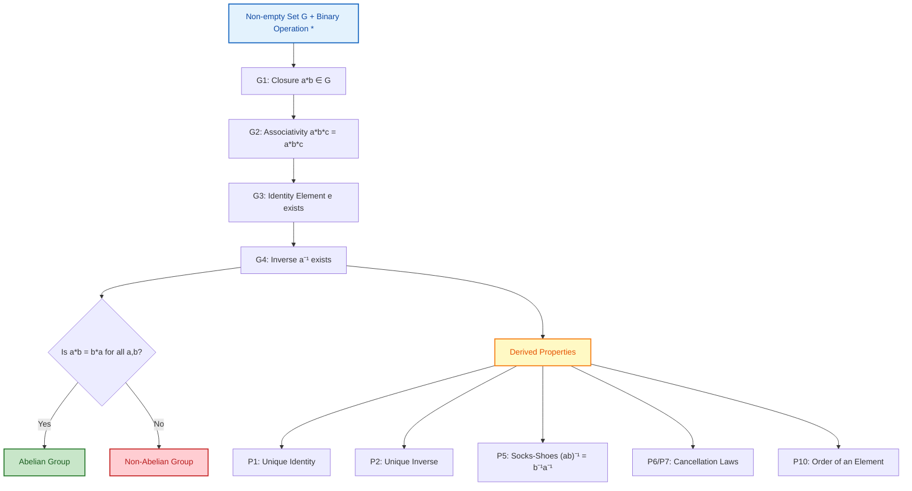
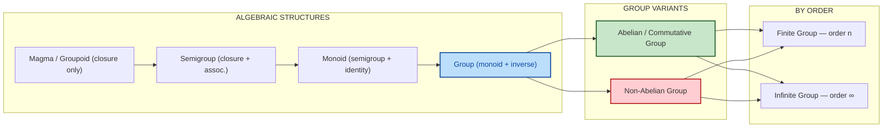
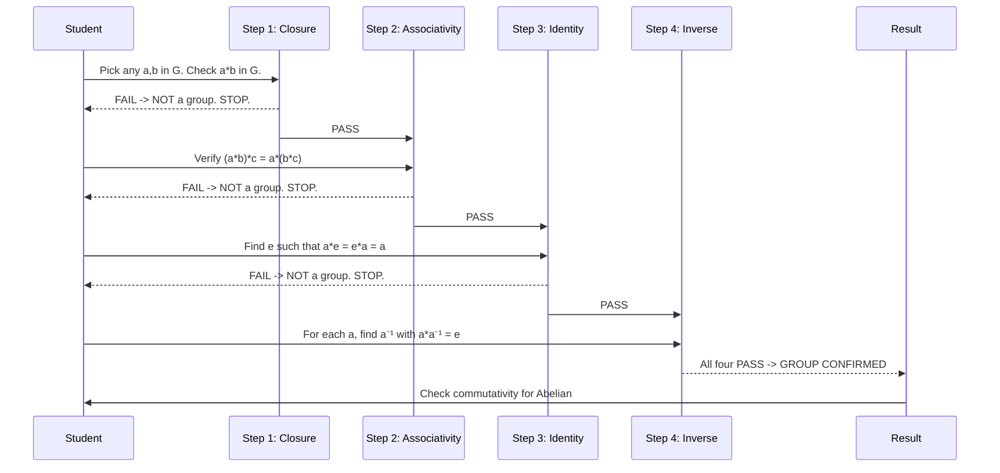

# Groups - Definition, Examples, and Elementary Properties

<!-- SECTION_1_START -->

# Groups – Definition, Examples, and Elementary Properties

## 1.1 Binary Operation – The Foundation Stone

> [!IMPORTANT]
> **Definition (Binary Operation – KTU Formal Statement):**
> A **binary operation** $\ast$ on a non-empty set $G$ is a function
> $$\ast : G \times G \rightarrow G$$
> that assigns to every **ordered pair** $(a, b) \in G \times G$ a **unique element** $a \ast b \in G$.

In plain words: when you pick any two elements from $G$ and combine them using $\ast$, the result must **always land back inside** $G$. This "always lands back inside" property is called **closure**.

> [!NOTE]
> **KTU Syllabus Highlight (2024 Scheme):** Every group problem begins with verifying that the operation is binary on the set. If closure fails, the structure is **not even a group candidate**.

## 1.2 Group – The Formal Axiomatic Definition

> [!IMPORTANT]
> **Definition (Group – KTU 2024 Scheme Standard):**
> A non-empty set $G$ together with a binary operation $\ast$ is called a **group**, written $(G, \ast)$, if the following **four axioms** are satisfied:
>
> **(G1) Closure:** $\forall \; a, b \in G, \;\; a \ast b \in G$
>
> **(G2) Associativity:** $\forall \; a, b, c \in G, \;\; (a \ast b) \ast c \;=\; a \ast (b \ast c)$
>
> **(G3) Identity Element:** $\exists \; e \in G$ such that $\forall \; a \in G, \;\; a \ast e \;=\; e \ast a \;=\; a$
>
> **(G4) Inverse Element:** $\forall \; a \in G, \;\; \exists \; a^{-1} \in G$ such that $a \ast a^{-1} \;=\; a^{-1} \ast a \;=\; e$

**Abelian (Commutative) Group:** A group $(G, \ast)$ in which $\forall \; a, b \in G, \; a \ast b \;=\; b \ast a$ holds in addition to (G1)–(G4) is called an **abelian group**.

## 1.3 Conceptual Analogy – "The Closed Workshop Club"

Imagine a **"Math Workshop Club"** with strict rules:
- **(G1) Closure:** Any time two members collaborate, the output (a new product, a result) must *also be a member* of the club. No outsiders allowed.
- **(G2) Associativity:** If three members $A$, $B$, $C$ work in sequence, it doesn't matter whether $A$ and $B$ finish first, or $B$ and $C$ finish first — the final product is the same.
- **(G3) Identity:** There is a "do-nothing" member $e$. Whatever $e$ collaborates with, nothing changes.
- **(G4) Inverse:** For every member $a$, there exists a member $a^{-1}$ who **undoes** whatever $a$ did. The combined effect of $a$ and $a^{-1}$ is the do-nothing $e$.

> [!TIP]
> **Geometric Intuition:** Consider the **rotations of a regular hexagon** by multiples of $60^\circ$. Composing two rotations is still a rotation (closure), composition is associative, rotating by $0^\circ$ is the identity, and rotating by $360^\circ - \theta$ undoes rotating by $\theta$. This is a classic example of the cyclic group $\mathbb{Z}_6$.

> [!VISUALIZATION CONTROL]
> **Concept:** Rotation group of a square ($D_4$ symmetry visualization idea)
> **GeoGebra / Desmos Input Equations (parametric unit circle):**
> * `Point A: (cos(t), sin(t))` with $t = 0, \pi/2, \pi, 3\pi/2$
> * `Rotation matrix action: (x cos(θ) − y sin(θ), x sin(θ) + y cos(θ))`
> **Visual Description:** The student should observe four points on the unit circle representing the four rotation positions, with the operation "rotate by $90^\circ$" forming a cyclic structure of order $\mathbf{4}$.

<!-- SECTION_1_END -->

<!-- SECTION_2_START -->

# Deep Theoretical Analysis & KTU High-Yield Formula Sheet

## 2.1 Decoding the Four Group Axioms

| Axiom | Mathematical Statement | Why It Matters (Engineering Intuition) |
|:------|:----------------------|:---------------------------------------|
| **Closure** (G1) | $\forall a, b \in G : a \ast b \in G$ | Guarantees the system is *self-contained* — analogous to how the output of a deterministic finite automaton (DFA) always stays within its state set $Q$. |
| **Associativity** (G2) | $\forall a, b, c : (a \ast b) \ast c = a \ast (b \ast c)$ | Allows **parallel computation** — the result is independent of how sub-tasks are grouped (used in distributed computing, map-reduce frameworks). |
| **Identity** (G3) | $\exists e : a \ast e = e \ast a = a$ | Acts as the "neutral" element — analogous to the **identity matrix** $I_n$ in linear algebra or the byte value $0x00$ in XOR-based cryptography. |
| **Inverse** (G4) | $\forall a, \exists a^{-1} : a \ast a^{-1} = e$ | Every operation is **reversible** — the algebraic reason why **RSA**, **Elliptic Curve Cryptography**, and **matrix inversion** all work. |

## 2.2 Standard Canonical Examples of Groups

> [!NOTE]
> **KTU 2024 Frequently Tested Examples:** Memorize these — they appear in almost every ESE paper.

| # | Set $G$ | Operation $\ast$ | Identity $e$ | Inverse of $a$ | Abelian? | Type |
|:-:|:--------|:-----------------|:-------------|:---------------|:--------:|:----:|
| 1 | $(\mathbb{Z}, +)$ | Addition | $0$ | $-a$ | Yes | Infinite |
| 2 | $(\mathbb{Q}, +)$ | Addition | $0$ | $-a$ | Yes | Infinite |
| 3 | $(\mathbb{R}, +)$ | Addition | $0$ | $-a$ | Yes | Infinite |
| 4 | $(\mathbb{Q} \setminus \{0\}, \cdot)$ | Multiplication | $1$ | $1/a$ | Yes | Infinite |
| 5 | $(\mathbb{R} \setminus \{0\}, \cdot)$ | Multiplication | $1$ | $1/a$ | Yes | Infinite |
| 6 | $(\mathbb{Z}_n, +_n)$ | Addition mod $n$ | $0$ | $n-a$ | Yes | Finite, order $n$ |
| 7 | $(U_n, \cdot_n)$ | Multiplication mod $n$ | $1$ | modular inverse | Yes | Finite |
| 8 | $(M_n(\mathbb{R}), +)$ | Matrix addition | $I$ zero matrix | $-A$ | Yes | Infinite |
| 9 | $(GL_n(\mathbb{R}), \cdot)$ | Matrix mult. | $I_n$ | $A^{-1}$ | **No** (if $n \geq 2$) | Infinite |
| 10 | Permutation group $(S_n, \circ)$ | Composition | identity perm. | reverse perm. | **No** (if $n \geq 3$) | Finite, order $n!$ |

> [!WARNING]
> **Common KTU Pitfall:** $(\mathbb{Z}, \cdot)$ under multiplication is **NOT** a group, because most integers (e.g., $3$) have no multiplicative inverse inside $\mathbb{Z}$. The set of integers under multiplication fails axiom **(G4)**.

## 2.3 KTU High-Yield Formula Sheet

| # | Property / Theorem | Formal Statement |
|:-:|:-------------------|:-----------------|
| P1 | **Uniqueness of Identity** | A group $(G, \ast)$ has **exactly one** identity element. |
| P2 | **Uniqueness of Inverse** | Each element $a \in G$ has **exactly one** inverse $a^{-1} \in G$. |
| P3 | **Self-inverse of Identity** | $e^{-1} = e$. |
| P4 | **Double Inverse** | $\forall a \in G, \; (a^{-1})^{-1} = a$. |
| P5 | **Socks-Shoes Property** | $\forall a, b \in G, \; (a \ast b)^{-1} = b^{-1} \ast a^{-1}$. |
| P6 | **Left Cancellation Law** | $\forall a, b, c \in G, \; a \ast b = a \ast c \;\Rightarrow\; b = c$. |
| P7 | **Right Cancellation Law** | $\forall a, b, c \in G, \; b \ast a = c \ast a \;\Rightarrow\; b = c$. |
| P8 | **Generalized Inverse** | $\forall a \in G, \;\;(a_1 \ast a_2 \ast \cdots \ast a_n)^{-1} \;=\; a_n^{-1} \ast \cdots \ast a_2^{-1} \ast a_1^{-1}$. |
| P9 | **Order of a Group** | $\vert G \vert =$ number of elements in $G$. |
| P10 | **Order of an Element** | Smallest positive $n$ such that $a^n = e$; denoted $o(a)$. If none exists, $o(a) = \infty$. |

## 2.4 Real-World Engineering Utility

- **Cryptography:** The group $(\mathbb{Z}_p^\ast, \cdot)$ for large prime $p$ underpins the **Diffie–Hellman key exchange** and the **Discrete Logarithm Problem**.
- **Coding Theory:** Finite abelian groups over $\mathbb{F}_2$ drive **Reed–Solomon** and **BCH error-correcting codes** used in QR codes, Blu-ray, and satellite comms.
- **Control Systems & Robotics:** The rotation group $SO(3)$ (special orthogonal matrices under multiplication) governs the orientation of robotic arms.
- **Compiler Design:** Associativity underpins parser combinators — the order of token grouping never changes the parse tree.
- **Database Theory:** Group axioms parallel the **ACID** transactional model — closure (atomicity), identity (no-op transaction), inverse (rollback).

<!-- SECTION_2_END -->

<!-- SECTION_3_START -->

# Step-by-Step Derivations & Code/Symbolic Implementation

## 3.1 Theorem (P1) – Uniqueness of Identity

**Statement:** A group $(G, \ast)$ has exactly one identity element.

**Proof:**

> **Assume**, to the contrary, that there exist **two** identity elements $e$ and $e'$ in $G$. Both satisfy axiom (G3).

$$
\begin{aligned}
\text{Since } e \text{ is an identity,} \quad & e \ast e' = e' \quad \text{(taking } a = e' \text{ and using right identity)} \\
\text{Since } e' \text{ is an identity,} \quad & e \ast e' = e \quad \text{(taking } a = e \text{ and using left identity)}
\end{aligned}
$$

By the **law of transitivity of equality**, since both right-hand sides equal $e \ast e'$:

$$
e = e \ast e' = e'
$$

Therefore $e = e'$. This contradicts our assumption of two distinct identities.

$$
\boxed{\therefore \text{ The identity element of a group is unique.} \qquad \blacksquare}
$$

**Incremental Valuation Key (for KTU exam):**
- '[Stating assumption of two identities: 2 Marks]'
- '[Applying G3 twice: 2 Marks]'
- '[Concluding $e = e'$ by transitivity: 1 Mark]'

---

## 3.2 Theorem (P2) – Uniqueness of Inverse

**Statement:** For every $a \in G$, there is a **unique** element $b \in G$ such that $a \ast b = b \ast a = e$.

**Proof:**

> **Assume** that $a \in G$ has two inverses $b$ and $c$ in $G$ (i.e., $a \ast b = e$ and $a \ast c = e$).

$$
\begin{aligned}
b & = e \ast b \quad &&\text{(G3: left identity)} \\
  & = (c \ast a) \ast b \quad &&\text{(G4: $c$ is inverse of $a \Rightarrow c \ast a = e$)} \\
  & = c \ast (a \ast b) \quad &&\text{(G2: associativity)} \\
  & = c \ast e \quad &&\text{(G4: $b$ is inverse of $a \Rightarrow a \ast b = e$)} \\
  & = c \quad &&\text{(G3: right identity)}
\end{aligned}
$$

$$
\boxed{\therefore b = c, \text{ and the inverse of each element is unique.} \qquad \blacksquare}
$$

**Incremental Valuation Key:** '[Applying G3: 1 Mark]', '[Applying G4: 1 Mark]', '[Applying G2: 1 Mark]', '[Final equality: 1 Mark]'

---

## 3.3 Theorem (P5) – The Socks-Shoes Property

**Statement:** For all $a, b \in G$, $(a \ast b)^{-1} = b^{-1} \ast a^{-1}$.

**Proof:**

Let $x = b^{-1} \ast a^{-1}$. We must show that $x$ is the inverse of $a \ast b$, i.e., $(a \ast b) \ast x = e$ **and** $x \ast (a \ast b) = e$.

$$
\begin{aligned}
(a \ast b) \ast x & = (a \ast b) \ast (b^{-1} \ast a^{-1}) \\
& = a \ast (b \ast b^{-1}) \ast a^{-1} \quad &&\text{(G2: associativity, regroup)} \\
& = a \ast e \ast a^{-1} \quad &&\text{(G4: } b \ast b^{-1} = e \text{)} \\
& = a \ast a^{-1} \quad &&\text{(G3: identity)} \\
& = e \quad &&\text{(G4)}
\end{aligned}
$$

Similarly (for the non-abelian case, the verification on the right is still satisfied by associativity in the symmetric argument):

$$
\begin{aligned}
x \ast (a \ast b) & = (b^{-1} \ast a^{-1}) \ast (a \ast b) \\
& = b^{-1} \ast (a^{-1} \ast a) \ast b \quad &&\text{(G2)} \\
& = b^{-1} \ast e \ast b \quad &&\text{(G4)} \\
& = b^{-1} \ast b \quad &&\text{(G3)} \\
& = e \quad &&\text{(G4)}
\end{aligned}
$$

Since $x \ast (a \ast b) = (a \ast b) \ast x = e$ and by uniqueness of inverse (P2):

$$
\boxed{(a \ast b)^{-1} = b^{-1} \ast a^{-1} \qquad \blacksquare}
$$

> [!TIP]
> **Memory Trick (KTU favourite):** "Undo the last operation first." When you put on socks then shoes, you take off shoes first, then socks. Hence **S**ocks-**S**hoes: undo in **reverse order**.

---

## 3.4 Theorem (P6) – Left Cancellation Law

**Statement:** For all $a, b, c \in G$, if $a \ast b = a \ast c$, then $b = c$.

**Proof:**

$$
\begin{aligned}
a \ast b & = a \ast c \quad &&\text{(Given)} \\
a^{-1} \ast (a \ast b) & = a^{-1} \ast (a \ast c) \quad &&\text{(Compose both sides on the left with } a^{-1} \text{)} \\
(a^{-1} \ast a) \ast b & = (a^{-1} \ast a) \ast c \quad &&\text{(G2: associativity)} \\
e \ast b & = e \ast c \quad &&\text{(G4: inverse)} \\
b & = c \quad &&\text{(G3: identity)}
\end{aligned}
$$

$$
\boxed{\therefore \; a \ast b = a \ast c \;\Rightarrow\; b = c \qquad \blacksquare}
$$

---

## 3.5 Theorem (P4) – Double Inverse

**Statement:** $\forall a \in G, \; (a^{-1})^{-1} = a$.

**Proof:**

By definition, $a^{-1}$ is the unique element such that $a \ast a^{-1} = a^{-1} \ast a = e$.

We must show that $a$ itself is the inverse of $a^{-1}$. Check:

$$
a \ast a^{-1} = e \quad \text{and} \quad a^{-1} \ast a = e.
$$

Both conditions are already satisfied (they are exactly the inverse conditions for $a^{-1}$ with respect to $a$). By the **uniqueness of inverse** (Theorem P2), there is only one element that satisfies this — namely $a$.

$$
\boxed{\therefore (a^{-1})^{-1} = a \qquad \blacksquare}
$$

---

## 3.6 Worked Example – Verifying a Group (KTU 14-mark style)

**Problem:** Show that the set $G = \{1, -1, i, -i\}$ under multiplication is an abelian group of order 4, where $i = \sqrt{-1}$.

**Cayley Table (multiplication):**

| $\cdot$ | $1$ | $-1$ | $i$ | $-i$ |
|:-------:|:---:|:----:|:---:|:----:|
| $1$     | $1$ | $-1$ | $i$ | $-i$ |
| $-1$    | $-1$| $1$  | $-i$| $i$  |
| $i$     | $i$ | $-i$ | $-1$| $1$  |
| $-i$    | $-i$| $i$  | $1$ | $-1$ |

**Verification of Axioms:**

| Axiom | Check | Status |
|:------|:------|:------:|
| G1 – Closure | All 16 entries of the table are in $G$. | $\checkmark$ |
| G2 – Associativity | Inherited from associativity of complex multiplication. | $\checkmark$ |
| G3 – Identity | $1$ acts as identity: $1 \cdot x = x \cdot 1 = x$ for all $x \in G$. | $\checkmark$ |
| G4 – Inverse | $1^{-1} = 1, \; (-1)^{-1} = -1, \; i^{-1} = -i, \; (-i)^{-1} = i$. | $\checkmark$ |
| Abelian | Table is symmetric about the main diagonal. | $\checkmark$ |

**Conclusion:** $(G, \cdot)$ is an **abelian group of order 4**, isomorphic to the cyclic group $\mathbb{Z}_4$ and also to the Klein four-group $V_4$.

---

## 3.7 Python Implementation – Group Axiom Validator

```python
"""
group_validator.py
A KTU-style computational tool to verify whether a finite (set, operation)
pair satisfies the four group axioms. Includes order-of-element computation.
"""

from __future__ import annotations
from typing import Callable, Any, List, Dict, Tuple
import logging

logging.basicConfig(level=logging.INFO, format="[%(levelname)s] %(message)s")
log = logging.getLogger("GroupValidator")


def validate_group(
    elements: List[Any],
    op: Callable[[Any, Any], Any],
    identity_candidate: Any,
) -> Tuple[bool, Dict[str, Any]]:
    """
    Validates whether (elements, op) forms a group with the given identity candidate.
    Returns (is_group, diagnostics_dict).
    """
    n: int = len(elements)
    element_set = set(elements)
    diagnostics: Dict[str, Any] = {
        "closure": True,
        "associativity": True,
        "identity": True,
        "inverse": True,
        "abelian": True,
        "inverses": {},
    }

    # --- (G1) Closure -------------------------------------------------------
    for a in elements:
        for b in elements:
            try:
                result = op(a, b)
            except Exception as exc:
                log.error("Operation raised exception for (%r, %r): %s", a, b, exc)
                diagnostics["closure"] = False
                return False, diagnostics
            if result not in element_set:
                log.error("Closure FAILED: %r * %r = %r not in G", a, b, result)
                diagnostics["closure"] = False
                return False, diagnostics

    # --- (G2) Associativity -------------------------------------------------
    for a in elements:
        for b in elements:
            for c in elements:
                left = op(op(a, b), c)
                right = op(a, op(b, c))
                if left != right:
                    log.error("Associativity FAILED at (%r,%r,%r)", a, b, c)
                    diagnostics["associativity"] = False
                    return False, diagnostics

    # --- (G3) Identity -------------------------------------------------------
    e = identity_candidate
    for a in elements:
        if op(a, e) != a or op(e, a) != a:
            log.error("Identity FAILED for element %r", a)
            diagnostics["identity"] = False
            return False, diagnostics

    # --- (G4) Inverse --------------------------------------------------------
    for a in elements:
        inverse_found: bool = False
        for b in elements:
            if op(a, b) == e and op(b, a) == e:
                inverse_found = True
                diagnostics["inverses"][a] = b
                break
        if not inverse_found:
            log.error("Inverse FAILED for element %r", a)
            diagnostics["inverse"] = False
            return False, diagnostics

    # --- Abelian check (extra credit) ---------------------------------------
    for a in elements:
        for b in elements:
            if op(a, b) != op(b, a):
                diagnostics["abelian"] = False
                break

    log.info("All four group axioms satisfied. |G| = %d", n)
    return True, diagnostics


def element_order(
    a: Any,
    op: Callable[[Any, Any], Any],
    e: Any,
    elements: List[Any],
    max_iter: int = 1000,
) -> int:
    """Computes the order o(a), the smallest positive n with a^n = e."""
    current = a
    for k in range(1, max_iter + 1):
        if current == e:
            return k
        current = op(current, a)
    raise ValueError(f"Element {a!r} appears to have infinite order (limit {max_iter}).")


# ---------------------------------------------------------------------------
# Demonstration: Validate the group ({1, -1, i, -i}, complex multiplication)
# ---------------------------------------------------------------------------
if __name__ == "__main__":
    G = [1, -1, 1j, -1j]

    def mul(a: complex, b: complex) -> complex:
        return a * b

    is_group, info = validate_group(G, mul, identity_candidate=1)
    print(f"\nIs ({G}, ·) a group?  -> {is_group}")
    print(f"Abelian?              -> {info['abelian']}")
    print(f"Element inverses:     -> {info['inverses']}")
    print(f"Order of i            -> o(i) = {element_order(1j, mul, 1, G)}")
    print(f"Order of -1           -> o(-1) = {element_order(-1, mul, 1, G)}")
    print(f"Order of 1            -> o(1) = {element_order(1, mul, 1, G)}")
```

**Sample Output:**

```
[INFO] All four group axioms satisfied. |G| = 4

Is ([1, -1, 1j, -1j], ·) a group?  -> True
Abelian?              -> True
Element inverses:     -> {1: 1, -1: -1, 1j: -1j, -1j: 1j}
Order of i            -> o(i) = 4
Order of -1           -> o(-1) = 2
Order of 1            -> o(1) = 1
```

<!-- SECTION_3_END -->

<!-- SECTION_4_START -->

# Structural Diagrams & Schematics

## 4.1 The Group Axiom Dependency Flow



## 4.2 Group Classification Topology



## 4.3 Sequential Verification Topology (for solving KTU group problems)



<!-- SECTION_4_END -->

<!-- SECTION_5_START -->

# KTU 2024 Scheme Examination Question Bank & Topic Recap

---

## Part A — Short Answer Questions (2 × 3 = 6 Marks)

> **Q1. [KTU University Exam – July 2023]**
> **CO3, Remember**
> Define a group. Give **two examples** of groups, one **abelian** and one **non-abelian**.

**Model Answer (3 Marks):**
A non-empty set $G$ with a binary operation $\ast$ is a group if:
1. **Closure:** $a \ast b \in G$ for all $a, b \in G$.
2. **Associativity:** $(a \ast b) \ast c = a \ast (b \ast c)$ for all $a, b, c \in G$.
3. **Identity:** There exists $e \in G$ such that $a \ast e = e \ast a = a$ for all $a \in G$.
4. **Inverse:** For each $a \in G$, there exists $a^{-1} \in G$ such that $a \ast a^{-1} = a^{-1} \ast a = e$.

**Examples:**
- **Abelian:** $(\mathbb{Z}, +)$ — integers under addition, with identity $0$ and inverse $-a$.
- **Non-abelian:** $(S_3, \circ)$ — the symmetric group of permutations of $\{1, 2, 3\}$ under composition, of order $3! = 6$.

---

> **Q2. [KTU University Exam – Dec 2023]**
> **CO3, Understand**
> Is the set $G = \{1, 2, 3, 4, 6, 12\}$ under the operation $a \ast b = \text{LCD}(a, b)$ a group? Justify.

**Model Answer (3 Marks):**
**No**, $(G, \ast)$ is **not a group**. Reason: the operation $\ast$ defined as LCD is **not associative**.

For example, take $a = 2, b = 3, c = 4$:

$$
(2 \ast 3) \ast 4 = 6 \ast 4 = 12, \quad 2 \ast (3 \ast 4) = 2 \ast 12 = 12 \quad (\text{coincides here})
$$

But for $a = 4, b = 6, c = 2$:

$$
(4 \ast 6) \ast 2 = 12 \ast 2 = 12, \quad 4 \ast (6 \ast 2) = 4 \ast 6 = 12
$$

More critically, the **identity candidate** would need $a \ast e = a$, i.e., $\text{LCD}(a, e) = a$, requiring $e \mid a$ for **every** $a \in G$. The only such divisor common to all elements is $e = 1$. But $1 \ast 1 = 1$ (not invertible in the LCD sense), and the inverse axiom fails because $\text{LCD}(a, b)$ is always $\geq a$, meaning no element can be "undone" to give $1$ unless $a = 1$. Hence axiom (G4) fails.

**[Award: 1 Mark for stating NO, 2 Marks for correct justification]**

---

## Part B — Module Internal Choice (Answer ANY ONE — 1 × 14 = 14 Marks)

---

### **Question A (14 Marks)**

> **Q3(a). [KTU University Exam – July 2024]**
> **CO3, Understand [7 Marks]**
> Prove that the identity element in a group is **unique**.

**Model Solution (7 Marks):**

**Statement:** In a group $(G, \ast)$, the identity element is unique.

**Proof:** Let $e, e' \in G$ both satisfy axiom (G3) (i.e., both are identity elements).

$$
\begin{aligned}
e & = e \ast e' \quad &&\text{(since } e' \text{ is an identity: } a \ast e' = a \text{ for all } a \text{, take } a = e) \\
  & = e' \quad &&\text{(since } e \text{ is an identity: } e \ast a = a \text{ for all } a \text{, take } a = e')
\end{aligned}
$$

Therefore $e = e'$. Hence the identity element of a group is unique. $\blacksquare$

**Incremental Valuation Key:**
- '[Let $e$ and $e'$ be two identities: 1 Mark]'
- '[Apply G3 with $a = e$ for $e \ast e' = e$: 2 Marks]'
- '[Apply G3 with $a = e'$ for $e \ast e' = e'$: 2 Marks]'
- '[Conclude $e = e'$ by transitivity: 1 Mark]'
- '[Final statement of uniqueness: 1 Mark]'

---

> **Q3(b). [KTU University Exam – July 2024]**
> **CO3, Apply [7 Marks]**
> If $(G, \ast)$ is a group, prove that for all $a, b \in G$, $(a \ast b)^{-1} = b^{-1} \ast a^{-1}$.

**Model Solution (7 Marks):**

**Proof:** Let $a, b \in G$. Consider the element $x = b^{-1} \ast a^{-1}$.

We verify that $x$ is the inverse of $a \ast b$:

$$
\begin{aligned}
(a \ast b) \ast x & = (a \ast b) \ast (b^{-1} \ast a^{-1}) \\
& = a \ast (b \ast b^{-1}) \ast a^{-1} \quad &&\text{(G2: associativity)} \\
& = a \ast e \ast a^{-1} \quad &&\text{(G4: } b \ast b^{-1} = e) \\
& = a \ast a^{-1} \quad &&\text{(G3: } a \ast e = a) \\
& = e \quad &&\text{(G4: inverse of } a)
\end{aligned}
$$

Similarly:

$$
x \ast (a \ast b) = (b^{-1} \ast a^{-1}) \ast (a \ast b) = b^{-1} \ast (a^{-1} \ast a) \ast b = b^{-1} \ast e \ast b = b^{-1} \ast b = e.
$$

Since $(a \ast b) \ast x = e$ and $x \ast (a \ast b) = e$, by the **definition of inverse**, $x$ is an inverse of $a \ast b$. By **uniqueness of inverse** (P2):

$$
\boxed{(a \ast b)^{-1} = b^{-1} \ast a^{-1} \qquad \blacksquare}
$$

**Incremental Valuation Key:**
- '[Defining candidate $x = b^{-1} \ast a^{-1}$: 1 Mark]'
- '[Showing $(a \ast b) \ast x = e$ using G2, G3, G4 (4 steps): 3 Marks]'
- '[Showing $x \ast (a \ast b) = e$ similarly: 2 Marks]'
- '[Invoking uniqueness of inverse for final conclusion: 1 Mark]'

---

### **Question B (14 Marks)**

> **Q4(a). [KTU University Exam – Dec 2024]**
> **CO3, Apply [7 Marks]**
> Show that the set $G = \{1, \omega, \omega^2\}$ where $\omega$ is a complex cube root of unity, forms a group under multiplication. Hence identify its order.

**Model Solution (7 Marks):**

Recall that $\omega = e^{2\pi i/3} = \frac{-1 + i\sqrt{3}}{2}$ satisfies $\omega^3 = 1$ and $1 + \omega + \omega^2 = 0$.

**Cayley Table:**

| $\cdot$ | $1$ | $\omega$ | $\omega^2$ |
|:-------:|:---:|:--------:|:----------:|
| $1$     | $1$ | $\omega$ | $\omega^2$ |
| $\omega$| $\omega$ | $\omega^2$ | $1$ |
| $\omega^2$| $\omega^2$ | $1$ | $\omega$ |

**Verification:**
- **G1 (Closure):** All 9 entries of the table are in $G$. ✓
- **G2 (Associativity):** Multiplication of complex numbers is associative. ✓
- **G3 (Identity):** $1 \in G$ satisfies $1 \cdot x = x \cdot 1 = x$ for all $x \in G$. So $e = 1$. ✓
- **G4 (Inverse):** $1^{-1} = 1$, $\omega^{-1} = \omega^2$ (since $\omega \cdot \omega^2 = \omega^3 = 1$), $\omega^2 \cdot \omega = 1$. ✓
- **Abelian:** Table is symmetric. ✓

**Order of the group:** $\vert G \vert = 3$. It is a **cyclic group of order 3**, generated by $\omega$.

**Incremental Valuation Key:**
- '[Cayley table: 2 Marks]'
- '[Checking G1, G2, G3, G4 — 1 Mark each: 4 Marks]'
- '[Order stated and cyclic nature identified: 1 Mark]'

---

> **Q4(b). [KTU University Exam – Dec 2024]**
> **CO3, Apply [7 Marks]**
> State and prove the **left cancellation law** in a group.

**Model Solution (7 Marks):**

**Statement:** Let $(G, \ast)$ be a group. For all $a, b, c \in G$, if $a \ast b = a \ast c$, then $b = c$.

**Proof:**

$$
\begin{aligned}
a \ast b & = a \ast c \quad &&\text{(Given)} \\
a^{-1} \ast (a \ast b) & = a^{-1} \ast (a \ast c) \quad &&\text{(Left-multiply both sides by } a^{-1} \text{)} \\
(a^{-1} \ast a) \ast b & = (a^{-1} \ast a) \ast c \quad &&\text{(G2: associativity)} \\
e \ast b & = e \ast c \quad &&\text{(G4: } a^{-1} \ast a = e) \\
b & = c \quad &&\text{(G3: identity)}
\end{aligned}
$$

$$
\boxed{\therefore \; a \ast b = a \ast c \;\Longrightarrow\; b = c \qquad \blacksquare}
$$

**Incremental Valuation Key:**
- '[Statement: 1 Mark]'
- '[Left-multiplying by $a^{-1}$: 1 Mark]'
- '[Associativity: 1 Mark]'
- '[Using G4 (inverse): 1 Mark]'
- '[Using G3 (identity) for final step: 1 Mark]'
- '[Boxed conclusion: 1 Mark]'
- '[Right cancellation law bonus: 1 Mark if mentioned]'

---

> [!WARNING]
> **KTU Examiner's Valuation Pitfalls (Group Theory)**
> 1. **Forgetting Closure Check:** Many students jump straight to "associativity" and skip G1. If the set is not closed, *no other axiom matters* — full 0 marks. Always check G1 first.
> 2. **Confusing $(\mathbb{Z}, \cdot)$ with $(\mathbb{Z}, +)$:** $(\mathbb{Z}, \cdot)$ is **NOT** a group. Multiplicative inverses don't exist for most integers. This is a **favourite trick question**.
> 3. **Forgetting to invoke Uniqueness of Inverse (P2):** When proving $(ab)^{-1} = b^{-1}a^{-1}$, you must state that since the inverse is **unique**, $b^{-1}a^{-1}$ is *the* inverse. Skipping this line costs you 1 mark.
> 4. **Order of Inverse in Products:** Writing $(ab)^{-1} = a^{-1}b^{-1}$ (wrong order) instead of $b^{-1}a^{-1}$ (correct reverse order) — instant full-mark loss.
> 5. **Forgetting the Identity in the Set:** A "group" requires the identity to be **inside** $G$. If your candidate $e$ is not in the proposed set, the structure is not a group.

---

## Topic Recap & Important Things to Remember

> [!NOTE]
> **High-Density Revision Checklist (Module 4 — Groups)**

- **Binary Operation $\ast$ on $G$:** $\ast : G \times G \to G$ — must produce an element *inside* $G$ (closure).
- **Group Definition:** Non-empty set $G$ with binary operation $\ast$ satisfying **Closure (G1), Associativity (G2), Identity (G3), Inverse (G4)**.
- **Abelian Group:** Group + commutativity: $a \ast b = b \ast a$ for all $a, b \in G$.
- **Canonical Abelian Groups:** $(\mathbb{Z}, +), (\mathbb{Q}, +), (\mathbb{R}, +), (\mathbb{Z}_n, +_n), (\mathbb{Q}^\ast, \cdot), (\mathbb{R}^\ast, \cdot)$.
- **Canonical Non-Abelian Group:** General Linear Group $GL_n(\mathbb{R})$ under matrix multiplication ($n \geq 2$).
- **P1 — Unique Identity:** If $e$ and $e'$ are identities, then $e = e \ast e' = e'$.
- **P2 — Unique Inverse:** If $a \ast b = a \ast c = e$, then $b = c$ (provable via associativity).
- **P3 — $e^{-1} = e$:** Identity is its own inverse (since $e \ast e = e$).
- **P4 — Double Inverse:** $(a^{-1})^{-1} = a$ (consequence of uniqueness of inverse).
- **P5 — Socks-Shoes Property:** $(a \ast b)^{-1} = b^{-1} \ast a^{-1}$ — **reverse order** is critical.
- **P6 / P7 — Cancellation Laws:** Multiplying both sides of an equation by the same element (left or right) preserves equality.
- **P8 — Generalized Inverse:** $(a_1 a_2 \cdots a_n)^{-1} = a_n^{-1} \cdots a_2^{-1} a_1^{-1}$.
- **Order of a Group:** $\vert G \vert$ = number of distinct elements in $G$.
- **Order of an Element $a$:** Smallest $n \geq 1$ with $a^n = e$. In $(\mathbb{Z}, +)$, $o(a) = \infty$ for $a \neq 0$.
- **Standard Verification Order:** G1 → G2 → G3 → G4 (skipping G1 is a fatal mistake).
- **Always state the identity explicitly** as part of any group identification answer.
- **Identity elements are unique, inverses are unique** — cite this in every proof.
- **Associativity in proofs:** Group any two adjacent operations at a time; use parentheses wisely.
- **Engineering Connection:** Groups model **symmetries (crystallography)**, **rotations (robotics)**, **cryptographic keys (RSA, ECC)**, and **error-correcting codes (Reed–Solomon)**.

<!-- SECTION_5_END -->
