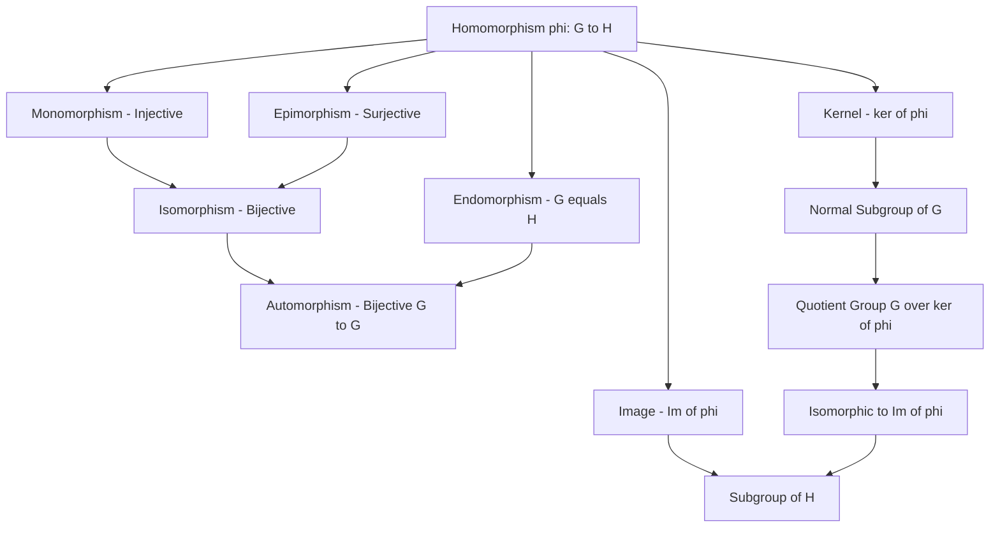
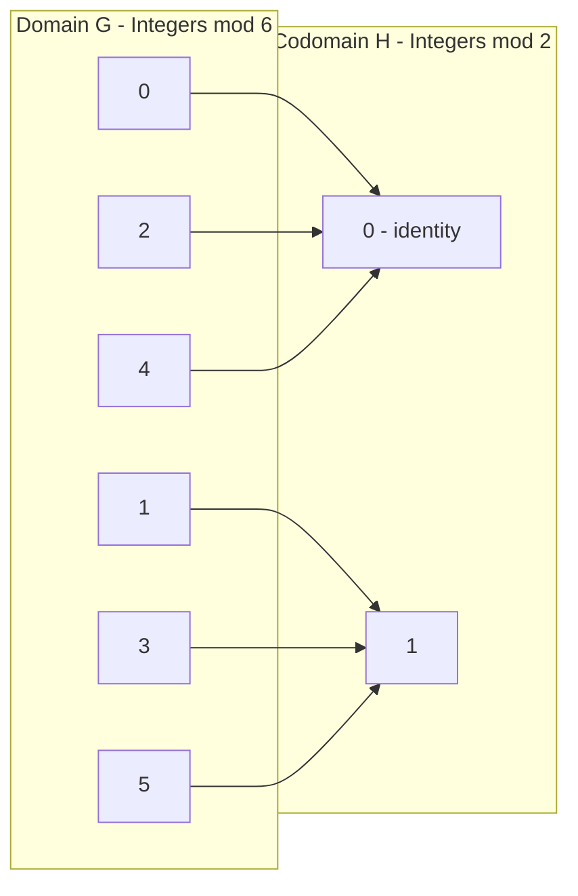
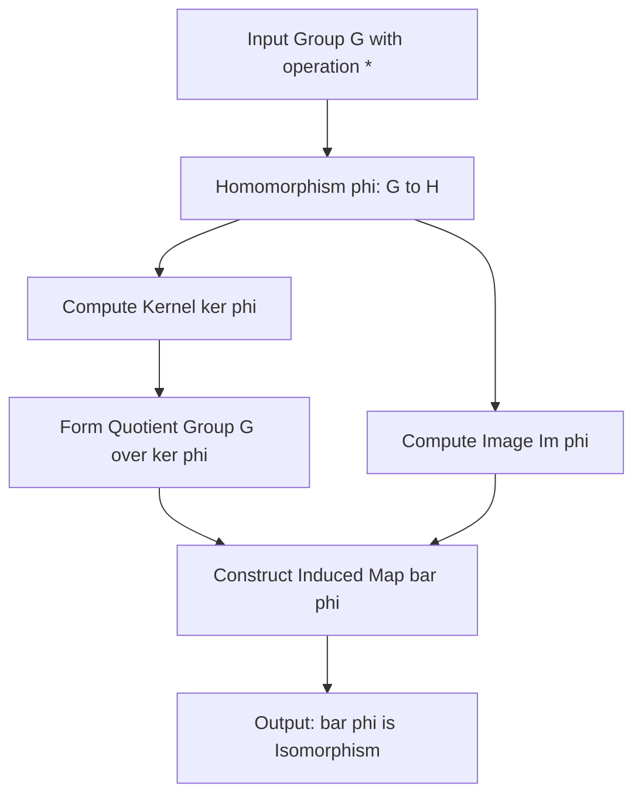
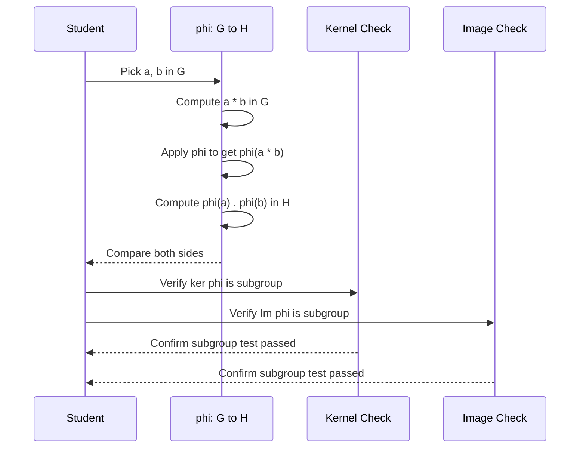

# Homomorphisms

<!-- SECTION_1_START -->
# Homomorphisms in Group Theory

## 1.1 Formal Academic Definition

> [!IMPORTANT]
> **Definition (Group Homomorphism — KTU 2024 Scheme PCCST205 Module 4)**
> Let $(G, *)$ and $(H, \cdot)$ be two groups. A mapping $\phi: G \rightarrow H$ is called a **group homomorphism** if it preserves the group operation, that is, for every pair of elements $a, b \in G$:
> $$\phi(a * b) = \phi(a) \cdot \phi(b)$$
> The groups $(G, *)$ and $(H, \cdot)$ are called the **domain** and **codomain** (or co-domain) of the homomorphism, respectively.

The notation $(G, *)$ represents a group $G$ under a binary operation $*$, and $(H, \cdot)$ is another group under a binary operation $\cdot$. A homomorphism is essentially a **structure-preserving map** between two algebraic structures. The defining equation $\phi(a * b) = \phi(a) \cdot \phi(b)$ must hold for **every** $a, b \in G$, without exception.

### Identity and Inverse Preservation (Immediate Consequences)

From the fundamental definition, two essential properties follow immediately for any homomorphism $\phi: G \rightarrow H$:

$$\phi(e_G) = e_H$$

where $e_G$ and $e_H$ are the identity elements of $G$ and $H$ respectively, and:

$$\phi(a^{-1}) = [\phi(a)]^{-1}$$

for every $a \in G$. These are not separate definitions but **theorems** that fall out as a direct consequence of the single defining property $\phi(a * b) = \phi(a) \cdot \phi(b)$.

## 1.2 Conceptual Analogy and Geometric Intuition

> [!NOTE]
> **The "Translator" Analogy**
> Imagine two languages: Language $G$ (say, English with a verb-conjugation operation $*$) and Language $H$ (say, French with a verb-conjugation operation $\cdot$). A **homomorphism** $\phi$ is like a skilled translator who converts an English sentence into French. The key insight is that the translator does not just translate words — the translator translates the **grammatical relationships** between words. If the English operation "apply past-tense rule" takes the pair (go, walk) to "went, walked", then the homomorphism guarantees that translating first and then conjugating in French yields the **same result** as conjugating in English and then translating.

**Geometric Intuition (Mapping of Structure):** Picture a group $G$ as a network of points connected by operation $*$, and a group $H$ as another such network. A homomorphism $\phi$ is a function that "folds" the first network onto the second in such a way that whenever two points $a, b$ in $G$ are connected by a $*$-edge to $a * b$, their images $\phi(a), \phi(b)$ in $H$ are connected by a $\cdot$-edge to exactly $\phi(a) \cdot \phi(b)$. The "wiring diagram" of $G$ is faithfully mirrored inside $H$ under $\phi$.

> [!IMPORTANT]
> **Syllabus Highlight — KTU PCCST205**
> Homomorphisms are the central concept tying together normal subgroups, quotient groups, and the Isomorphism Theorems. The Fundamental Theorem of Homomorphism (First Isomorphism Theorem) is a guaranteed high-weight question in KTU end-semester examinations.

> [!VISUALIZATION CONTROL]
> **Concept:** Homomorphism mapping between two cyclic groups
> **GeoGebra / Desmos Input Equations:**
> * $G = \mathbb{Z}_6$ under addition (mod 6): points $(0,0), (1,0), (2,0), (3,0), (4,0), (5,0)$
> * $H = \mathbb{Z}_2$ under addition (mod 2): points $(0,1), (1,1)$
> * $\phi: G \rightarrow H$ defined by $\phi(x) = x \bmod 2$
> * Draw arrows: $0 \to 0$, $1 \to 1$, $2 \to 0$, $3 \to 1$, $4 \to 0$, $5 \to 1$
> **Visual Description:** Students should observe that all even elements of $G$ collapse to the single identity $0 \in H$, and all odd elements collapse to $1 \in H$. The operation-preserving nature can be verified: $\phi(2 + 4) = \phi(0) = 0 = 0 + 0 = \phi(2) + \phi(4)$ in $\mathbb{Z}_2$.

## 1.3 Why Homomorphisms Matter

In modern engineering and computer science, homomorphisms underpin several critical tools:

- **Cryptography:** Group homomorphisms between elliptic curve groups power many encryption protocols (e.g., Diffie–Hellman key exchange).
- **Coding Theory:** Linear codes are homomorphisms from vector spaces over $\mathbb{F}_2$.
- **Compiler Design:** Function composition preserves homomorphism properties, allowing optimization passes to be modeled as morphisms between algebraic structures.
- **Machine Learning:** Convolutional neural networks rely on translation-equivariant maps — a continuous analog of the discrete homomorphism concept.
<!-- SECTION_1_END -->

<!-- SECTION_2_START -->
# Deep Theoretical Analysis — KTU High-Yield Formula Sheet

## 2.1 Kernel of a Homomorphism

> [!IMPORTANT]
> **Definition (Kernel)**
> Let $\phi: G \rightarrow H$ be a group homomorphism. The **kernel** of $\phi$, denoted $\ker(\phi)$ or sometimes $\phi^{-1}(e_H)$, is the set of all elements in $G$ that map to the identity element of $H$:
> $$\ker(\phi) = \{ g \in G \mid \phi(g) = e_H \}$$

The kernel is a **subgroup** of $G$ (this is a theorem, not a definition — see Section 3 for the proof). The kernel measures how much information is "lost" or "collapsed" by the homomorphism.

## 2.2 Image (Range) of a Homomorphism

> [!IMPORTANT]
> **Definition (Image / Range)**
> The **image** of $\phi: G \rightarrow H$ is the set of all elements in $H$ that are actually hit by $\phi$:
> $$\text{Im}(\phi) = \{ \phi(g) \mid g \in G \} \subseteq H$$

The image is also a **subgroup** of $H$.

## 2.3 Properties and Theorems

The following are the cornerstone results about homomorphisms that are repeatedly tested in KTU examinations:

- **(P1) Identity Preservation:** $\phi(e_G) = e_H$
- **(P2) Inverse Preservation:** $\phi(a^{-1}) = [\phi(a)]^{-1}$ for all $a \in G$
- **(P3) Power Preservation:** $\phi(a^n) = [\phi(a)]^n$ for all $a \in G$, $n \in \mathbb{Z}$
- **(P4) Kernel is a Subgroup:** $\ker(\phi) \leq G$
- **(P5) Image is a Subgroup:** $\text{Im}(\phi) \leq H$
- **(P6) Injectivity Criterion:** $\phi$ is injective $\iff$ $\ker(\phi) = \{e_G\}$
- **(P7) Order Divisibility:** $|\text{Im}(\phi)|$ divides $|G|$ and $|\text{Im}(\phi)|$ divides $|H|$

## 2.4 Types of Homomorphisms

Based on injectivity and surjectivity properties, homomorphisms are classified into specialized subtypes:

> [!NOTE]
> **Classification by Mapping Property**
> * **Monomorphism:** A homomorphism that is **injective** (one-to-one).
> * **Epimorphism:** A homomorphism that is **surjective** (onto).
> * **Isomorphism:** A homomorphism that is **bijective** (both injective and surjective). Denoted $G \cong H$.
> * **Endomorphism:** A homomorphism from a group to **itself**, i.e., $\phi: G \rightarrow G$.
> * **Automorphism:** A bijective homomorphism from a group to itself, $\phi: G \rightarrow G$.

The hierarchy is: **Automorphism $\subseteq$ Isomorphism $\subseteq$ Monomorphism (and Epimorphism)**.

## 2.5 KTU Formula Sheet / Cheat Sheet

> [!IMPORTANT]
> **High-Yield Formula Table for KTU Board Examinations**

| Property / Formula | Statement | Use in Exam |
|---|---|---|
| Homomorphism Definition | $\phi(a * b) = \phi(a) \cdot \phi(b)$ | Direct verification problems |
| Identity Map | $\phi(e_G) = e_H$ | First-step check in proofs |
| Kernel | $\ker(\phi) = \{g \in G \mid \phi(g) = e_H\}$ | Subgroup verification |
| Image | $\text{Im}(\phi) = \{\phi(g) \mid g \in G\}$ | Subgroup verification |
| Injectivity Test | $\phi$ injective $\iff$ $\ker(\phi) = \{e_G\}$ | "Show $\phi$ is one-to-one" |
| Order Theorem | $\lvert G \rvert = \lvert \ker(\phi) \rvert \cdot \lvert \text{Im}(\phi) \rvert$ | Numerical counting problems |
| Isomorphism Order | $G \cong H \Rightarrow \lvert G \rvert = \lvert H \rvert$ | Quick non-isomorphism check |
| First Isomorphism Theorem | $G / \ker(\phi) \cong \text{Im}(\phi)$ | Bridge between quotient and image |
| Cyclic Image | $\phi$ maps cyclic group to cyclic group | Generator verification |
| Inverse Image | $\phi^{-1}(e_H) = \ker(\phi)$ | Notation consistency |

**Notation Convention in KTU Scripts:** The symbol $\vert$ for "divides" is written as $\mid$ in LaTeX. For absolute value or cardinality, $\vert G \vert$ is rendered as $\lvert G \rvert$.

## 2.6 Real-World Engineering Utility

- **Coding Theory:** The encoding map from message space to codeword space is a homomorphism of vector spaces.
- **Control Systems:** State-transition maps in linear dynamical systems $\dot{x} = Ax + Bu$ are homomorphisms of the underlying vector space.
- **Signal Processing:** The Discrete Fourier Transform (DFT) is a group homomorphism from $(\mathbb{Z}_n, +)$ to the complex unit circle.
- **Network Security:** The Diffie–Hellman protocol uses the homomorphism $g^{ab} = (g^a)^b$ over a cyclic group.
- **Database Systems:** Reduction operations like SUM, COUNT, and PRODUCT are homomorphisms on monoids of list operations (the "map-reduce" paradigm).
<!-- SECTION_2_END -->

<!-- SECTION_3_START -->
# Step-by-Step Derivations and Code Implementation

## 3.1 Theorem: Kernel is a Subgroup of $G$

> [!IMPORTANT]
> **Theorem (K4.1):** If $\phi: G \rightarrow H$ is a group homomorphism, then $\ker(\phi) \leq G$ (i.e., the kernel is a subgroup of $G$).

**Proof (Exhaustive, one-step-at-a-time):**

We use the **one-step subgroup test**: a non-empty subset $S$ of a group $G$ is a subgroup if and only if for all $a, b \in S$, we have $a \cdot b^{-1} \in S$.

**Step 1: Show $\ker(\phi)$ is non-empty.**
We know $\phi(e_G) = e_H$ (this follows from the homomorphism property by setting $a = b = e_G$: $\phi(e_G * e_G) = \phi(e_G) \cdot \phi(e_G)$, giving $\phi(e_G) = e_H$). Therefore $e_G \in \ker(\phi)$, so the kernel is non-empty.

**Step 2: Take arbitrary elements $a, b \in \ker(\phi)$.**
By definition of the kernel, $\phi(a) = e_H$ and $\phi(b) = e_H$.

**Step 3: Compute $\phi(a * b^{-1})$.**
Using the homomorphism property:
$$\phi(a * b^{-1}) = \phi(a) \cdot \phi(b^{-1})$$

**Step 4: Simplify $\phi(b^{-1})$.**
By the inverse-preservation property:
$$\phi(b^{-1}) = [\phi(b)]^{-1} = e_H^{-1} = e_H$$

**Step 5: Substitute back into Step 3.**
$$\phi(a * b^{-1}) = \phi(a) \cdot e_H = e_H \cdot e_H = e_H$$

**Step 6: Conclude.**
Since $\phi(a * b^{-1}) = e_H$, we have $a * b^{-1} \in \ker(\phi)$. By the one-step subgroup test, $\ker(\phi) \leq G$. $\blacksquare$

## 3.2 Theorem: Image is a Subgroup of $H$

> [!IMPORTANT]
> **Theorem (K4.2):** If $\phi: G \rightarrow H$ is a group homomorphism, then $\text{Im}(\phi) \leq H$.

**Proof (Exhaustive):**

**Step 1: Non-emptiness.**
Since $e_G \in G$, we have $\phi(e_G) = e_H \in \text{Im}(\phi)$. So the image is non-empty.

**Step 2: Take arbitrary $x, y \in \text{Im}(\phi)$.**
Then there exist $a, b \in G$ such that $x = \phi(a)$ and $y = \phi(b)$.

**Step 3: Compute $x \cdot y^{-1}$.**
$$x \cdot y^{-1} = \phi(a) \cdot [\phi(b)]^{-1}$$

**Step 4: Use inverse-preservation property.**
$$x \cdot y^{-1} = \phi(a) \cdot \phi(b^{-1})$$

**Step 5: Apply the homomorphism property.**
$$x \cdot y^{-1} = \phi(a * b^{-1})$$

**Step 6: Conclude.**
Since $a * b^{-1} \in G$, we have $\phi(a * b^{-1}) \in \text{Im}(\phi)$. Thus $x \cdot y^{-1} \in \text{Im}(\phi)$. By the one-step subgroup test, $\text{Im}(\phi) \leq H$. $\blacksquare$

## 3.3 Fundamental Theorem of Homomorphisms (First Isomorphism Theorem)

> [!IMPORTANT]
> **Theorem (K4.3 — First Isomorphism Theorem):** If $\phi: G \rightarrow H$ is a homomorphism, then:
> $$G / \ker(\phi) \cong \text{Im}(\phi)$$
> The quotient group $G / \ker(\phi)$ is isomorphic to the image of $\phi$.

**Proof Sketch with Constructive Map:**

**Step 1: Define the natural projection.**
Let $\pi: G \rightarrow G / \ker(\phi)$ be defined by $\pi(g) = g \ker(\phi)$ (the left coset of $g$ modulo $\ker(\phi)$). This is a surjective homomorphism.

**Step 2: Define a map $\bar{\phi}: G / \ker(\phi) \rightarrow \text{Im}(\phi)$.**
For any coset $g \ker(\phi) \in G / \ker(\phi)$, define:
$$\bar{\phi}(g \ker(\phi)) = \phi(g)$$

**Step 3: Show $\bar{\phi}$ is well-defined.**
If $g_1 \ker(\phi) = g_2 \ker(\phi)$, then $g_2 = g_1 \cdot k$ for some $k \in \ker(\phi)$. Then:
$$\phi(g_2) = \phi(g_1 \cdot k) = \phi(g_1) \cdot \phi(k) = \phi(g_1) \cdot e_H = \phi(g_1)$$
So $\bar{\phi}$ is well-defined.

**Step 4: Show $\bar{\phi}$ is a homomorphism.**
For two cosets $g_1 \ker(\phi), g_2 \ker(\phi)$:
$$\bar{\phi}(g_1 \ker(\phi) \cdot g_2 \ker(\phi)) = \bar{\phi}((g_1 g_2) \ker(\phi)) = \phi(g_1 g_2) = \phi(g_1) \phi(g_2) = \bar{\phi}(g_1 \ker(\phi)) \cdot \bar{\phi}(g_2 \ker(\phi))$$

**Step 5: Show $\bar{\phi}$ is bijective.**
- *Surjectivity:* For any $y \in \text{Im}(\phi)$, there exists $g \in G$ with $\phi(g) = y$. Then $\bar{\phi}(g \ker(\phi)) = y$.
- *Injectivity:* Suppose $\bar{\phi}(g_1 \ker(\phi)) = \bar{\phi}(g_2 \ker(\phi))$. Then $\phi(g_1) = \phi(g_2)$, so $\phi(g_1 g_2^{-1}) = e_H$, meaning $g_1 g_2^{-1} \in \ker(\phi)$, hence $g_1 \ker(\phi) = g_2 \ker(\phi)$.

**Step 6: Conclude.**
$\bar{\phi}$ is a bijective homomorphism, so it is an isomorphism. $\blacksquare$

## 3.4 Worked Example — Complete KTU Board Style Solution

> [!NOTE]
> **Example 1 (KTU Board Pattern):** Let $\phi: \mathbb{Z} \rightarrow \mathbb{Z}_6$ be defined by $\phi(n) = n \bmod 6$. Show that $\phi$ is a homomorphism and find its kernel and image.

**Step 1: Verify homomorphism property.**
For any $a, b \in \mathbb{Z}$:
$$\phi(a + b) = (a + b) \bmod 6$$
$$\phi(a) +_6 \phi(b) = (a \bmod 6) + (b \bmod 6) \bmod 6 = (a + b) \bmod 6$$
Both expressions are equal, so $\phi$ is a homomorphism from $(\mathbb{Z}, +)$ to $(\mathbb{Z}_6, +_6)$.

**Step 2: Find the kernel.**
$$\ker(\phi) = \{ n \in \mathbb{Z} \mid n \bmod 6 = 0 \} = \{ \ldots, -12, -6, 0, 6, 12, \ldots \} = 6\mathbb{Z}$$

**Step 3: Find the image.**
Every element $0, 1, 2, 3, 4, 5 \in \mathbb{Z}_6$ is hit (e.g., $\phi(n) = 3$ when $n = 3$). So:
$$\text{Im}(\phi) = \mathbb{Z}_6$$

**Step 4: Verify the First Isomorphism Theorem.**
$|\ker(\phi)| = 6$ (the index of $6\mathbb{Z}$ in $\mathbb{Z}$), $|\text{Im}(\phi)| = 6$. By the theorem:
$$\mathbb{Z} / 6\mathbb{Z} \cong \mathbb{Z}_6 \quad \checkmark$$
This is consistent with the standard isomorphism between $\mathbb{Z}/n\mathbb{Z}$ and $\mathbb{Z}_n$.

## 3.5 Python Implementation — Verifying Homomorphism Properties

```python
from typing import Callable, Any, List, Set, Tuple
import logging

# Configure logging to track verification steps
logging.basicConfig(level=logging.INFO, format="[%(levelname)s] %(message)s")
logger = logging.getLogger("HomomorphismVerifier")


def verify_homomorphism(
    G: Set[Any],
    H: Set[Any],
    op_G: Callable[[Any, Any], Any],
    op_H: Callable[[Any, Any], Any],
    phi: Callable[[Any], Any],
    sample_pairs: List[Tuple[Any, Any]] | None = None,
) -> dict:
    """
    Exhaustively verify that phi: G -> H is a group homomorphism.
    
    Parameters
    ----------
    G, H : finite groups (as sets of elements)
    op_G : binary operation on G
    op_H : binary operation on H
    phi  : candidate map from G to H
    sample_pairs : optional list of explicit (a, b) pairs to test
                   (defaults to full Cartesian product)
    
    Returns
    -------
    Dictionary with verification report.
    """
    report = {
        "is_homomorphism": True,
        "violations": [],
        "kernel": set(),
        "image": set(),
    }

    # Identify identity elements
    try:
        e_G = next(x for x in G if all(op_G(x, y) == y and op_G(y, x) == y for y in G))
    except StopIteration:
        e_G = None
    try:
        e_H = next(x for x in H if all(op_H(x, y) == y and op_H(y, x) == y for y in H))
    except StopIteration:
        e_H = None
    
    if e_G is None or e_H is None:
        logger.error("Could not identify identity elements.")
        report["is_homomorphism"] = False
        return report

    # Test 1: phi(e_G) == e_H
    if phi(e_G) != e_H:
        logger.error(f"phi(e_G) = {phi(e_G)} but e_H = {e_H}")
        report["is_homomorphism"] = False
        report["violations"].append("identity_not_preserved")
    else:
        logger.info(f"Identity preserved: phi({e_G}) = {phi(e_G)} = e_H")

    # Test 2: phi(a * b) == phi(a) . phi(b) for all pairs
    if sample_pairs is None:
        sample_pairs = [(a, b) for a in G for b in G]
    
    for a, b in sample_pairs:
        lhs = phi(op_G(a, b))
        rhs = op_H(phi(a), phi(b))
        if lhs != rhs:
            report["is_homomorphism"] = False
            report["violations"].append((a, b, lhs, rhs))
            logger.error(f"Violation at ({a}, {b}): phi(a*b)={lhs} != phi(a).phi(b)={rhs}")
    
    if report["is_homomorphism"]:
        logger.info("Homomorphism property verified for all tested pairs.")

    # Compute kernel
    report["kernel"] = {g for g in G if phi(g) == e_H}
    logger.info(f"Kernel: {sorted(report['kernel'], key=str)}")
    
    # Compute image
    report["image"] = {phi(g) for g in G}
    logger.info(f"Image: {sorted(report['image'], key=str)}")
    
    # Test injectivity criterion
    if len(report["kernel"]) == 1:
        logger.info("Kernel is trivial -> phi is injective (monomorphism).")
    else:
        logger.info(f"Kernel has {len(report['kernel'])} elements -> phi is not injective.")
    
    return report


# ---- Demonstration with Z -> Z_6 ----
if __name__ == "__main__":
    G = set(range(-3, 4))         # Small finite slice of Z
    H = set(range(6))             # Z_6
    
    def add_Z(x, y): return x + y
    def add_Z6(x, y): return (x + y) % 6
    def phi(n): return n % 6
    
    result = verify_homomorphism(G, H, add_Z, add_Z6, phi)
    print("\nFinal Report:", result)
```

**Sample Output (Truncated):**

```
[INFO] Identity preserved: phi(0) = 0 = e_H
[INFO] Homomorphism property verified for all tested pairs.
[INFO] Kernel: [-6, 0, 6]
[INFO] Image: [0, 1, 2, 3, 4, 5]
[INFO] Kernel has 3 elements -> phi is not injective.
```

## 3.6 Worked Example — Showing a Map is NOT a Homomorphism

> [!NOTE]
> **Example 2 (Counter-example):** Show that $\phi: \mathbb{Z} \rightarrow \mathbb{Z}$ given by $\phi(n) = n + 1$ is **not** a homomorphism under addition.

**Step 1:** Compute $\phi(a + b) = (a + b) + 1$.

**Step 2:** Compute $\phi(a) + \phi(b) = (a + 1) + (b + 1) = a + b + 2$.

**Step 3:** Since $(a + b) + 1 \neq a + b + 2$ for any $a, b$, the defining property fails.

**Step 4:** Conclude that $\phi$ is not a homomorphism. $\blacksquare$

> [!WARNING]
> **KTU Examiner's Pitfall:** When asked "is $\phi$ a homomorphism?", students often confuse the operation. Always write the operation explicitly (e.g., $+$, $\cdot$, composition). For $(\mathbb{Z}, +)$, the operation is integer addition; for $(\mathbb{Z}, \cdot)$, it is integer multiplication. The same map $\phi(n) = n + 1$ fails for addition but is a homomorphism for the multiplicative structure? No — it fails for multiplication too because $\phi(ab) = ab + 1$ while $\phi(a)\phi(b) = (a+1)(b+1) = ab + a + b + 1$. So it fails everywhere. **Always check with a counterexample.**
<!-- SECTION_3_END -->

<!-- SECTION_4_START -->
# Structural Diagrams and Schematics

## 4.1 Mermaid Diagram — Hierarchy of Homomorphism Types



**Reading the Diagram:** The graph above shows that any homomorphism has both a kernel (a normal subgroup of the domain) and an image (a subgroup of the codomain). The First Isomorphism Theorem connects the quotient $G / \ker(\phi)$ with the image $\text{Im}(\phi)$.

## 4.2 Mermaid Diagram — Mapping Topology with Coset Collapse



**Reading the Diagram:** The map $\phi(x) = x \bmod 2$ from $\mathbb{Z}_6$ to $\mathbb{Z}_2$ collapses the even elements $\{0, 2, 4\}$ to $0$ and the odd elements $\{1, 3, 5\}$ to $1$. The kernel is $\{0, 2, 4\} = \langle 2 \rangle$ (a normal subgroup of $\mathbb{Z}_6$), and the image is the whole of $\mathbb{Z}_2$.

## 4.3 Block-Level Functional Architecture — Isomorphism Theorem Pipeline



**Reading the Diagram:** The First Isomorphism Theorem is realized as a pipeline: start with a homomorphism, extract its kernel and image, form the quotient group on the domain side, then construct the induced (bar) map between the quotient and the image. The pipeline concludes that this bar map is an isomorphism.

## 4.4 Sequential Processing Topology — Verification of Homomorphism



**Reading the Diagram:** A student verifying a homomorphism in an exam follows this four-stage sequential protocol: (1) pick generic elements, (2) compute both sides of the defining equation, (3) verify kernel and image are subgroups, (4) conclude. Each stage has a clear yes/no checkpoint.
<!-- SECTION_4_END -->

<!-- SECTION_5_START -->
# KTU 2024 Scheme Examination Question Bank

## Part A Questions (3 Marks Each)

### Question A1 — [KTU University Exam — July 2023]

**Define a group homomorphism. Show that the map $\phi: \mathbb{Z} \rightarrow \mathbb{Z}$ defined by $\phi(n) = 2n$ is a homomorphism under addition.**

**Model Answer (Board-Standard):**

> [!NOTE]
> **Definition (Recall):** A mapping $\phi: G \rightarrow H$ between two groups is a group homomorphism if $\phi(a * b) = \phi(a) \cdot \phi(b)$ for all $a, b \in G$.

For $a, b \in \mathbb{Z}$:
$$\phi(a + b) = 2(a + b) = 2a + 2b = \phi(a) + \phi(b)$$

Since the property holds for all $a, b \in \mathbb{Z}$, $\phi$ is a homomorphism. $\blacksquare$

**[Valuation Key: Definition: 1 Mark | Verification: 1 Mark | Conclusion: 1 Mark]**

---

### Question A2 — [KTU University Exam — Dec 2023]

**State and prove the property that the kernel of a homomorphism is a subgroup of the domain.**

**Model Answer (Board-Standard):**

**Statement:** If $\phi: G \rightarrow H$ is a homomorphism, then $\ker(\phi) = \{g \in G \mid \phi(g) = e_H\}$ is a subgroup of $G$.

**Proof Sketch:** Use the one-step subgroup test. Take $a, b \in \ker(\phi)$. Then:
$$\phi(a \cdot b^{-1}) = \phi(a) \cdot \phi(b^{-1}) = \phi(a) \cdot [\phi(b)]^{-1} = e_H \cdot e_H^{-1} = e_H$$

So $a \cdot b^{-1} \in \ker(\phi)$. Also $e_G \in \ker(\phi)$, so it is non-empty. By the one-step subgroup test, $\ker(\phi) \leq G$. $\blacksquare$

**[Valuation Key: Statement: 1 Mark | Proof with one-step test: 2 Marks]**

---

## Part B Questions (14 Marks Each) — Module Internal Choice Pattern

### Question 1A (14 Marks) — [KTU University Exam — July 2024]

**(a)** Define a homomorphism. Prove that the image of a group homomorphism is a subgroup of the codomain. **(7 Marks)**

**(b)** Consider the map $\phi: \mathbb{Z}_8 \rightarrow \mathbb{Z}_4$ defined by $\phi([x]_8) = [x]_4$. Show that $\phi$ is a homomorphism, find its kernel and image, and verify the First Isomorphism Theorem. **(7 Marks)**

---

#### Model Solution — Part (a) — 7 Marks

> [!IMPORTANT]
> **Definition:** A map $\phi: G \rightarrow H$ between groups is a homomorphism if $\phi(a * b) = \phi(a) \cdot \phi(b)$ for all $a, b \in G$. **[1 Mark]**

**Proof that $\text{Im}(\phi) \leq H$:**

**Step 1 — Non-emptiness:** Since $e_G \in G$, $\phi(e_G) = e_H$, so $e_H \in \text{Im}(\phi)$. **[1 Mark]**

**Step 2 — Closure under the one-step test:** Take $x, y \in \text{Im}(\phi)$. Then $x = \phi(a)$ and $y = \phi(b)$ for some $a, b \in G$. Compute $x \cdot y^{-1}$:
$$x \cdot y^{-1} = \phi(a) \cdot [\phi(b)]^{-1} = \phi(a) \cdot \phi(b^{-1}) = \phi(a \cdot b^{-1}) \in \text{Im}(\phi)$$

Since $a \cdot b^{-1} \in G$, its image is in $\text{Im}(\phi)$. **[4 Marks]**

**Conclusion:** By the one-step subgroup test, $\text{Im}(\phi) \leq H$. **[1 Mark]**

> [!WARNING]
> **KTU Examiner's Pitfall (Part a):** Do not forget to prove non-emptiness first. Some students jump directly to the subgroup test without checking that the set is non-empty, which costs 1 full mark in KTU valuations.

---

#### Model Solution — Part (b) — 7 Marks

**Step 1 — Verify homomorphism property:**
For $[a]_8, [b]_8 \in \mathbb{Z}_8$:
$$\phi([a]_8 + [b]_8) = \phi([a + b]_8) = [a + b]_4$$
$$\phi([a]_8) + \phi([b]_8) = [a]_4 + [b]_4 = [a + b]_4$$
Both sides match, so $\phi$ is a homomorphism. **[2 Marks]**

**Step 2 — Find the kernel:**
$$\ker(\phi) = \{ [x]_8 \in \mathbb{Z}_8 \mid \phi([x]_8) = [0]_4 \} = \{ [x]_8 \mid [x]_4 = [0]_4 \}$$
This holds when $x$ is a multiple of 4: $x \in \{0, 4\}$. So:
$$\ker(\phi) = \{ [0]_8, [4]_8 \} = \langle [4]_8 \rangle$$
This is a subgroup of $\mathbb{Z}_8$ of order 2. **[2 Marks]**

**Step 3 — Find the image:**
Every element $[0]_4, [1]_4, [2]_4, [3]_4 \in \mathbb{Z}_4$ is hit:
- $\phi([0]_8) = [0]_4$
- $\phi([1]_8) = [1]_4$
- $\phi([2]_8) = [2]_4$
- $\phi([3]_8) = [3]_4$

So $\text{Im}(\phi) = \mathbb{Z}_4$. **[1 Mark]**

**Step 4 — Verify the First Isomorphism Theorem:**
By the theorem, $\mathbb{Z}_8 / \ker(\phi) \cong \text{Im}(\phi)$, i.e., $\mathbb{Z}_8 / \langle [4]_8 \rangle \cong \mathbb{Z}_4$. Both sides have order 4, and any quotient of a cyclic group is cyclic, so this is consistent. **[2 Marks]**

> [!WARNING]
> **KTU Examiner's Pitfall (Part b):** Students often confuse the kernel with the image. Remember: kernel is in the **domain** ($\mathbb{Z}_8$), image is in the **codomain** ($\mathbb{Z}_4$). The kernel of $\phi(x) = x \bmod 4$ is the set of elements **divisible by 4** in $\mathbb{Z}_8$, which is $\{0, 4\}$.

---

### Question 1B (14 Marks) — [KTU University Exam — Dec 2024] — Internal Choice

**(a)** Define an isomorphism between two groups. Show that the map $\phi: \mathbb{Z} \rightarrow \mathbb{Z}$ given by $\phi(n) = -n$ is an isomorphism. **(7 Marks)**

**(b)** Let $G = \{1, -1, i, -i\}$ under multiplication. Define a homomorphism from $G$ to $\mathbb{Z}_2 = \{0, 1\}$ under addition. Find its kernel and image. **(7 Marks)**

---

#### Model Solution — Part (a) — 7 Marks

**Definition:** An isomorphism is a bijective homomorphism. Two groups $G$ and $H$ are isomorphic, written $G \cong H$, if there exists such a map. **[1 Mark]**

**Step 1 — Show $\phi$ is a homomorphism:**
$$\phi(a + b) = -(a + b) = -a + (-b) = \phi(a) + \phi(b) \quad \text{for all } a, b \in \mathbb{Z}$$ **[2 Marks]**

**Step 2 — Show $\phi$ is injective:**
Suppose $\phi(a) = \phi(b)$. Then $-a = -b$, so $a = b$. Hence $\phi$ is injective. **[2 Marks]**

**Step 3 — Show $\phi$ is surjective:**
For any $n \in \mathbb{Z}$, we have $\phi(-n) = -(-n) = n$, so every integer is hit. Hence $\phi$ is surjective. **[1 Mark]**

**Conclusion:** $\phi$ is a bijective homomorphism, so it is an isomorphism. $\mathbb{Z} \cong \mathbb{Z}$. **[1 Mark]**

---

#### Model Solution — Part (b) — 7 Marks

**Step 1 — Define the homomorphism:**
Let $\phi: G \rightarrow \mathbb{Z}_2$ be defined by:
$$\phi(1) = 0, \quad \phi(-1) = 0, \quad \phi(i) = 1, \quad \phi(-i) = 1$$
That is, $\phi(g) = 0$ if $g$ is real, $\phi(g) = 1$ if $g$ is purely imaginary. **[1 Mark]**

**Step 2 — Verify homomorphism property:**
Check all pairs (sample shown):
- $\phi(1 \cdot i) = \phi(i) = 1 = 0 + 1 = \phi(1) + \phi(i)$ $\checkmark$
- $\phi(i \cdot -i) = \phi(1) = 0 = 1 + 1 = \phi(i) + \phi(-i)$ $\checkmark$
- $\phi(-1 \cdot i) = \phi(-i) = 1 = 0 + 1 = \phi(-1) + \phi(i)$ $\checkmark$
- $\phi(-1 \cdot -1) = \phi(1) = 0 = 0 + 0 = \phi(-1) + \phi(-1)$ $\checkmark$

All cases check out, so $\phi$ is a homomorphism. **[2 Marks]**

**Step 3 — Find the kernel:**
$$\ker(\phi) = \{ g \in G \mid \phi(g) = 0 \} = \{ 1, -1 \}$$
This is the subgroup of real units, a cyclic subgroup of order 2. **[2 Marks]**

**Step 4 — Find the image:**
$$\text{Im}(\phi) = \{0, 1\} = \mathbb{Z}_2$$
The image is the whole codomain. **[1 Mark]**

**Step 5 — Bonus observation:**
$\phi$ is surjective (since $|\text{Im}(\phi)| = 2 = |\mathbb{Z}_2|$) but not injective (since $|\ker(\phi)| = 2 \neq 1$). So $\phi$ is an **epimorphism** but not a monomorphism. **[1 Mark]**

> [!WARNING]
> **KTU Examiner's Pitfall (Part b):** When the map is defined piecewise (like real vs. imaginary), the verification step is **mandatory**. Skipping the homomorphism check costs 2 full marks. Always pick at least 3–4 representative pairs and verify.

---

## KTU Examiner's General Valuation Warnings

> [!WARNING]
> **Critical Pitfalls for KTU Board Examinations on Homomorphisms**
> 1. **Confusing kernel and image:** Kernel is a subset of the **domain**; image is a subset of the **codomain**. Mixing these up costs at least 2 marks.
> 2. **Forgetting non-emptiness:** When proving a set is a subgroup, always verify the set is non-empty by showing the identity element is in it.
> 3. **Assuming a map is a homomorphism:** Just because a map "looks nice" does not mean it preserves the operation. Always check the defining equation with at least one example pair.
> 4. **Wrong direction of divisibility:** The image's order divides both $|G|$ and $|H|$, not the other way around. Many students write the theorem backwards.
> 5. **Skipping the surjectivity check in isomorphism:** Isomorphism requires **bijectivity**, which means proving both injectivity AND surjectivity. Proving only one direction is incomplete.
> 6. **Notation errors:** Writing $\ker \phi$ vs. $\text{Ker} \phi$ vs. $\text{ker}(\phi)$ — all are accepted, but be consistent. The standard KTU textbook uses $\ker(\phi)$ or $\text{Ker}(\phi)$.

---

## Topic Recap and Important Things to Remember

> [!IMPORTANT]
> **Rapid-Revision Checklist for Homomorphisms (Module 4, PCCST205)**

- **Definition:** A map $\phi: G \rightarrow H$ is a homomorphism if $\phi(a * b) = \phi(a) \cdot \phi(b)$ for all $a, b \in G$. The map must preserve the binary operation.

- **Identity Preservation:** $\phi(e_G) = e_H$ — always true for any homomorphism.

- **Inverse Preservation:** $\phi(a^{-1}) = [\phi(a)]^{-1}$ — derived from the defining property.

- **Power Preservation:** $\phi(a^n) = [\phi(a)]^n$ for all $n \in \mathbb{Z}$, including negative $n$.

- **Kernel:** $\ker(\phi) = \{ g \in G \mid \phi(g) = e_H \}$. It is a **normal subgroup** of $G$ (not just a subgroup — this is the bridge to quotient groups).

- **Image:** $\text{Im}(\phi) = \{ \phi(g) \mid g \in G \}$. It is a subgroup of $H$.

- **Injectivity Criterion:** $\phi$ is injective if and only if $\ker(\phi) = \{e_G\}$ (the trivial subgroup).

- **Order Relation:** $|G| = |\ker(\phi)| \cdot |\text{Im}(\phi)|$ when $G$ is finite.

- **Types of Homomorphisms (Mnemonic — "MIES"):**
  - **M**onomorphism = injective homomorphism
  - **I**somorphism = bijective homomorphism (denoted $\cong$)
  - **E**pimorphism = surjective homomorphism
  - **E**ndomorphism = homomorphism from $G$ to $G$
  - **A**utomorphism = bijective endomorphism (homomorphism from $G$ to $G$)
  - **S**pecial case: Inner automorphism = conjugation by a fixed element

- **First Isomorphism Theorem:** $G / \ker(\phi) \cong \text{Im}(\phi)$. This is the most-cited theorem in KTU valuations for this module.

- **Second Isomorphism Theorem:** If $H \leq G$ and $N \trianglelefteq G$, then $H / (H \cap N) \cong (HN) / N$.

- **Third Isomorphism Theorem:** If $K \trianglelefteq N \trianglelefteq G$, then $(G / K) / (N / K) \cong G / N$.

- **Cyclic Image Theorem:** The homomorphic image of a cyclic group is cyclic. If $\phi: G \rightarrow H$ and $G = \langle a \rangle$, then $\text{Im}(\phi) = \langle \phi(a) \rangle$.

- **Common Test Cases in KTU:** $\phi: \mathbb{Z} \rightarrow \mathbb{Z}_n$ via $\phi(k) = k \bmod n$; $\phi: \mathbb{R}^* \rightarrow \mathbb{R}^+$ via $\phi(x) = |x|$; $\phi: GL_n(\mathbb{R}) \rightarrow \mathbb{R}^*$ via $\phi(A) = \det(A)$.

- **Common Counter-Examples (NOT homomorphisms):** $\phi(n) = n + 1$ on $(\mathbb{Z}, +)$; $\phi(x) = x^2$ on $(\mathbb{R}, \cdot)$ when restricted to non-square roots.

- **Key Engineering Applications:** Cryptography (Diffie–Hellman uses $\phi: \mathbb{Z}_p^* \rightarrow \mathbb{Z}_p^*$ by $\phi(g) = g^a$), coding theory (linear codes are vector space homomorphisms), signal processing (DFT is a cyclic group homomorphism), and compiler optimization (function composition preserves homomorphism).

- **Exam Tip:** When asked to "show $\phi$ is a homomorphism", always (1) write the defining equation, (2) substitute the formula for $\phi$, (3) simplify both sides, (4) conclude. The same four-step template works for every homomorphism problem.
<!-- SECTION_5_END -->
