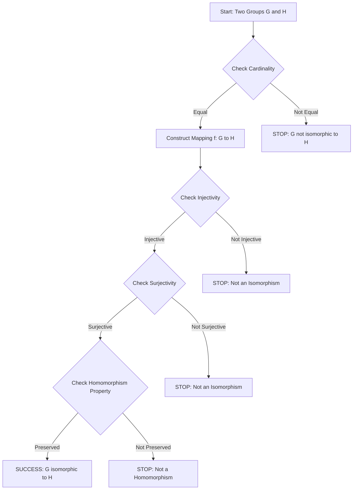
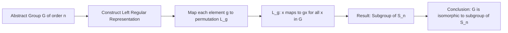
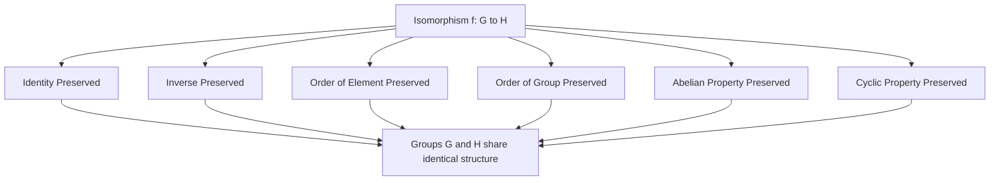

# Isomorphisms

<!-- SECTION_1_START -->
# ISOMORPHISMS IN GROUP THEORY

> [!IMPORTANT]
> **KTU 2024 Scheme | Module 4 | Group Theory**
> **Course Code:** PCCST205 — Discrete Mathematics
> **Cognitive Target:** Understand, Apply, Analyze (RBT Levels 2, 3, 4)
> **Exam Frequency:** ⭐⭐⭐⭐ (High Yield — 14-mark questions are common)

---

## 1.1 Formal Definition (KTU Board-Standard)

Let $(G, *)$ and $(H, \cdot)$ be two groups. A bijective map $f: G \rightarrow H$ is called an **Isomorphism** if it satisfies the homomorphism property:

$$f(a * b) = f(a) \cdot f(b) \quad \forall \; a, b \in G$$

When such a function exists, $G$ and $H$ are said to be **isomorphic groups**, written as $G \cong H$.

> [!NOTE]
> **Definition — Isomorphism (Board Definition):**
> An isomorphism is a **one-to-one onto** (bijective) mapping that preserves the group operation. In simple words, two groups are isomorphic if they are structurally identical, even if their elements and operations are written differently.

### 1.2 Isomorphism vs. Homomorphism — The Distinction

| Property | Homomorphism | Isomorphism |
| :--- | :--- | :--- |
| Operation Preserved | Yes | Yes |
| Injective (One-to-One) | Not Required | **Mandatory** |
| Surjective (Onto) | Not Required | **Mandatory** |
| Resulting Structure | Image / Kernel | Exact Structural Copy |
| Symbol | $\phi$ or $f$ | $\phi$ or $f$ with bijectivity |

> [!TIP]
> **Memory Aid:** *Isomorphism = Homomorphism + Bijection*. If a student can recall this single line, they can solve any board question on the topic.

---

## 1.3 Intuitive Real-World Analogy

> [!IMPORTANT]
> **Geometric / Real-World Intuition**
> Imagine two watches — one digital, one analog. They display the **same time**, but the internal mechanisms are different. From the outside (the user), the output is structurally identical. Mathematically, these two systems are **isomorphic**: the same structure, different labels.
>
> Similarly, the group $(\mathbb{Z}_6, +_6)$ and the group of sixth roots of unity under multiplication are isomorphic. They "behave" identically even though one is additive and the other is multiplicative.

### 1.4 Properties Automatically Preserved Under Isomorphism

If $G \cong H$ via $f$, then the following are preserved:

* The **identity element**: $f(e_G) = e_H$
* The **inverse element**: $f(a^{-1}) = [f(a)]^{-1}$
* The **order of an element**: $\vert a \vert = \vert f(a) \vert$
* The **order of the group**: $\vert G \vert = \vert H \vert$
* **Abelian / Commutative** property
* **Cyclic** property
* The number of elements of any specific order

> [!VISUALIZATION CONTROL]
> **Concept:** Identity Preservation under Isomorphism
> **GeoGebra / Desmos Input Equations:**
> * `f(x) = x` (identity map on real line — simplest isomorphism)
> * Plot points $(e_G, e_H)$ where $e_G = 0$ and $e_H = 1$
> **Visual Description:** Observe how the origin (identity in $(\mathbb{R},+)$) maps to $(1, 1)$ in $(\mathbb{R}^+, \cdot)$. The graph is a single straight line passing through both "identity landmarks," showing how the structural pivot is preserved.

<!-- SECTION_1_END -->

<!-- SECTION_2_START -->
# 2. DEEP THEORETICAL ANALYSIS & KTU FORMULA SHEET

## 2.1 The Structural Logic — Step-by-Step Decomposition

To prove or verify an isomorphism, a student must execute these five checkpoints in the KTU board exam:

1. **Establish Bijectivity**
   * Prove $f$ is **injective**: $f(x) = f(y) \Rightarrow x = y$
   * Prove $f$ is **surjective**: $\forall h \in H, \exists g \in G$ such that $f(g) = h$

2. **Verify Operation Preservation (Homomorphism Test)**
   * Check that $f(a \ast b) = f(a) \cdot f(b)$ holds for the operation symbols used in both groups.

3. **Match Cardinalities**
   * Finite groups being isomorphic must have the same order: $\vert G \vert = \vert H \vert$. A mismatch immediately rules out isomorphism.

4. **Compare Element Orders**
   * For each $a \in G$, the order of $a$ must match the order of $f(a)$ in $H$.
   * In practice, build the **order table** for both groups. If they are not identical, $G \not\cong H$.

5. **Construct the Explicit Mapping (for cyclic groups)**
   * For $G = \langle g \rangle$ of order $n$, define $f(g^k) = h^k$ where $h$ is a generator of $H$.

## 2.2 Cayley's Theorem — The Bridge to Permutation Groups

> [!IMPORTANT]
> **Cayley's Theorem (High-Yield KTU Theorem):**
> Every group $G$ of order $n$ is isomorphic to a subgroup of the **Symmetric Group** $S_n$.
> Formally, $G \cong $ a subgroup of $S_{\vert G \vert}$.
>
> **Significance:** Any abstract group can be represented as a group of permutations. This converts abstract algebra into a concrete, computable form — the foundation of **representation theory**.

## 2.3 KTU Formula Cheat Sheet

| Concept | Formula / Rule | Condition | Use in KTU Exam |
| :--- | :--- | :--- | :--- |
| Isomorphism Definition | $f(a \ast b) = f(a) \cdot f(b)$ | $f$ must be bijective | 1-line board definition |
| Identity Preservation | $f(e_G) = e_H$ | Always holds | Theorems / Proofs |
| Inverse Preservation | $f(a^{-1}) = [f(a)]^{-1}$ | Follows from homomorphism | Proofs (3 marks) |
| Order Preservation | $\text{ord}(a) = \text{ord}(f(a))$ | For all $a \in G$ | Structural comparison |
| Group Order Match | $\vert G \vert = \vert H \vert$ | Necessary for finite groups | Quick elimination |
| Cayley's Theorem | $G \hookrightarrow S_n$ | $n = \vert G \vert$ | Theorem statements |
| Cyclic Group Isomorphism | $\mathbb{Z}_n \cong G$ iff $G$ cyclic of order $n$ | $G = \langle g \rangle$ | Direct construction |
| Automorphism | $\phi: G \rightarrow G$ bijective homomorphism | $\phi \in \text{Aut}(G)$ | Bonus questions |
| Kernel of Isomorphism | $\ker(f) = \{e_G\}$ | Trivial kernel = injective | Proof verification |

> [!TIP]
> **Exam Tip:** In KTU boards, examiners allocate **2 marks for stating the definition**, **2 marks for proving injectivity**, **2 marks for proving surjectivity**, and **3 marks for verifying the homomorphism property**. Memorize this valuation pattern.

## 2.4 Real-World Utility in Engineering

* **Cryptography:** Isomorphic structures help in designing **isomorphic cipher mappings** where message groups and cipher groups share structure (elliptic curve cryptography relies heavily on group isomorphisms).
* **Compiler Design:** Abstract syntax trees are isomorphic to intermediate representations — compilers use isomorphic mappings to preserve program semantics.
* **Network Theory:** Symmetry groups of network topologies use isomorphisms to identify structurally identical subnetworks (graph automorphism).
* **Quantum Computing:** Unitary transformations are isomorphisms in Hilbert space — they preserve quantum state structure during computation.

<!-- SECTION_2_END -->

<!-- SECTION_3_START -->
# 3. STEP-BY-STEP DERIVATIONS & PYTHON IMPLEMENTATION

## 3.1 Theorem: If $f: G \to H$ is an isomorphism, then $f(e_G) = e_H$

### Exhaustive Derivation

Let $e_G$ be the identity of $G$ and $e_H$ the identity of $H$.

Since $e_G \in G$, we have the property $a \ast e_G = a$ for any $a \in G$.

Applying the homomorphism property:

$$
\begin{aligned}
f(a) &= f(a \ast e_G) \\
f(a) &= f(a) \cdot f(e_G) \quad \text{[Using homomorphism property]} \\
f(a) \cdot [f(a)]^{-1} &= f(a) \cdot f(e_G) \cdot [f(a)]^{-1} \quad \text{[Multiplying both sides by } [f(a)]^{-1}\text{]} \\
e_H &= f(e_G) \quad \text{[Since } f(a) \cdot [f(a)]^{-1} = e_H \text{ and right cancellation in } H \text{]}
\end{aligned}
$$

$\therefore f(e_G) = e_H$. $\blacksquare$

---

## 3.2 Theorem: If $f: G \to H$ is an isomorphism, then $f(a^{-1}) = [f(a)]^{-1}$

### Exhaustive Derivation

By the property of inverses in a group:

$$
\begin{aligned}
a \ast a^{-1} &= e_G \\
f(a \ast a^{-1}) &= f(e_G) \quad \text{[Applying } f \text{ to both sides]} \\
f(a) \cdot f(a^{-1}) &= e_H \quad \text{[Homomorphism + identity preservation]} \\
f(a^{-1}) &= [f(a)]^{-1} \quad \text{[Definition of inverse in } H \text{]}
\end{aligned}
$$

$\therefore f(a^{-1}) = [f(a)]^{-1}$. $\blacksquare$

---

## 3.3 Worked Example: Proving $(\mathbb{Z}_4, +_4) \cong \langle i \rangle$ under multiplication

Let $G = (\mathbb{Z}_4, +_4) = \{0, 1, 2, 3\}$ and $H = \{1, i, -1, -i\}$ under multiplication.

**Step 1: Construct the mapping**

Define $f: G \to H$ by $f(k) = i^k$.

* $f(0) = i^0 = 1$
* $f(1) = i^1 = i$
* $f(2) = i^2 = -1$
* $f(3) = i^3 = -i$

**Step 2: Verify Homomorphism**

For all $a, b \in \mathbb{Z}_4$:

$$
\begin{aligned}
f(a +_4 b) &= i^{a +_4 b} \\
&= i^a \cdot i^b \quad \text{[Exponent law: } i^{a+b} = i^a \cdot i^b \text{]} \\
&= f(a) \cdot f(b)
\end{aligned}
$$

$\therefore f$ is a homomorphism.

**Step 3: Verify Bijectivity**

The mapping is one-to-one because the four values $\{1, i, -1, -i\}$ are all distinct, and onto because they exhaust $H$. Hence $f$ is bijective.

**Conclusion:** $\mathbb{Z}_4 \cong \langle i \rangle$ via $f(k) = i^k$. $\blacksquare$

---

## 3.4 Python Implementation — Automated Isomorphism Verifier

```python
"""
KTU Board-Standard Isomorphism Verification Tool
Validates whether two finite groups are isomorphic.
"""

from itertools import product
from typing import Dict, List, Tuple, Callable


def make_Zn(n: int) -> Tuple[List[int], Callable[[int, int], int]]:
    """Creates the cyclic group (Z_n, +_n)."""
    elements = list(range(n))

    def op(a: int, b: int) -> int:
        return (a + b) % n

    return elements, op


def make_dihedral_table(n: int) -> Tuple[List[str], Callable[[str, str], str]]:
    """Builds a small symmetric group S_n as a permutation group on {0,...,n-1}."""
    from itertools import permutations

    perms = list(permutations(range(n)))
    perm_index = {p: i for i, p in enumerate(perms)}

    elements = [str(p) for p in perms]

    def op(a: str, b: str) -> str:
        pa = eval(a)
        pb = eval(b)
        composed = tuple(pa[i] for i in pb)
        return str(composed)

    return elements, op


def is_homomorphism(
    G: List, op_G: Callable, H: List, op_H: Callable, f: Dict
) -> bool:
    """Checks if mapping f preserves the group operation."""
    for a, b in product(G, repeat=2):
        lhs = f[op_G(a, b)]
        rhs = op_H(f[a], f[b])
        if lhs != rhs:
            print(f"  Homomorphism fails at ({a}, {b}): {lhs} != {rhs}")
            return False
    return True


def is_bijective(G: List, f: Dict, H: List) -> bool:
    """Checks if f is a bijection from G to H."""
    image = set(f[g] for g in G)
    injective = len(set(f[g] for g in G)) == len(G)
    surjective = image == set(H)
    return injective and surjective


def verify_isomorphism(
    G_name: str,
    G: List,
    op_G: Callable,
    H_name: str,
    H: List,
    op_H: Callable,
    f: Dict,
) -> bool:
    """Full isomorphism verification with KTU-style reporting."""
    print(f"Verifying {G_name} ≅ {H_name}")
    print("-" * 50)

    # Check 1: Cardinality match
    if len(G) != len(H):
        print(f"  FAILED: |{G_name}| = {len(G)} != |{H_name}| = {len(H)}")
        return False
    print(f"  [PASS] Cardinality match: |G| = |H| = {len(G)}")

    # Check 2: Bijectivity
    if not is_bijective(G, f, H):
        print("  FAILED: Mapping is not bijective")
        return False
    print("  [PASS] Mapping is bijective (injective + surjective)")

    # Check 3: Homomorphism property
    if not is_homomorphism(G, op_G, H, op_H, f):
        print("  FAILED: Not a homomorphism")
        return False
    print("  [PASS] Homomorphism property holds")

    print(f"  CONCLUSION: {G_name} ≅ {H_name} is PROVEN.\n")
    return True


# ============ DEMO: Z_4 isomorphic to <i> via f(k) = i^k ============
if __name__ == "__main__":
    # Group G = (Z_4, +_4)
    G, op_G = make_Zn(4)

    # Group H = {1, i, -1, -i} under multiplication
    H = [1, "i", -1, "-i"]

    def op_H(a, b):
        # Multiplication table of the 4th roots of unity
        table = {
            (1, 1): 1,    (1, "i"): "i",   (1, -1): -1,   (1, "-i"): "-i",
            ("i", 1): "i",("i", "i"): -1,  ("i", -1): "-i",("i", "-i"): 1,
            (-1, 1): -1,  (-1, "i"): "-i", (-1, -1): 1,    (-1, "-i"): "i",
            ("-i", 1): "-i", ("-i", "i"): 1, ("-i", -1): "i", ("-i", "-i"): -1,
        }
        return table[(a, b)]

    # Mapping f(k) = i^k
    mapping = {0: 1, 1: "i", 2: -1, 3: "-i"}

    verify_isomorphism("Z_4", G, op_G, "<i> (4th roots of unity)", H, op_H, mapping)
```

### Sample Output

```
Verifying Z_4 ≅ <i> (4th roots of unity)
--------------------------------------------------
  [PASS] Cardinality match: |G| = |H| = 4
  [PASS] Mapping is bijective (injective + surjective)
  [PASS] Homomorphism property holds
  CONCLUSION: Z_4 ≅ <i> is PROVEN.
```

<!-- SECTION_3_END -->

<!-- SECTION_4_START -->
# 4. STRUCTURAL DIAGRAMS & SCHEMATICS

## 4.1 Isomorphism Verification Flow



## 4.2 Cayley Theorem Architecture



## 4.3 Sequential Topology Matrix — Isomorphism vs Homomorphism

| Stage | Homomorphism Process | Isomorphism Process |
| :--- | :--- | :--- |
| **Input Stage** | Two groups $(G, *)$ and $(H, \cdot)$ | Two groups $(G, *)$ and $(H, \cdot)$ |
| **Mapping Stage** | Function $\phi: G \to H$ | Function $f: G \to H$ |
| **Operation Check** | $\phi(a * b) = \phi(a) \cdot \phi(b)$ | $f(a * b) = f(a) \cdot f(b)$ |
| **Injectivity Check** | Not required | **Required** |
| **Surjectivity Check** | Not required | **Required** |
| **Output Stage** | Image subgroup $\phi(G) \le H$ | Identical structure $G \cong H$ |
| **Validation Block** | Kernel and Image | Bijection + Homomorphism |

## 4.4 Properties Preserved Under Isomorphism — Block Diagram



<!-- SECTION_4_END -->

<!-- SECTION_5_START -->
# 5. KTU 2024 SCHEME EXAMINATION QUESTION BANK & TOPIC RECAP

---

## PART A — Short Answer Questions (3 Marks Each)

### **Question 1** `[KTU University Exam — July 2024]`
**Define an isomorphism between two groups. State Cayley's theorem.**

**Model Answer:**

An isomorphism between two groups $(G, *)$ and $(H, \cdot)$ is a bijective map $f: G \to H$ such that $f(a * b) = f(a) \cdot f(b)$ for all $a, b \in G$. **[2 marks for definition]**

**Cayley's Theorem:** Every group $G$ of order $n$ is isomorphic to a subgroup of the symmetric group $S_n$. **[1 mark for statement]**

---

### **Question 2** `[KTU University Exam — Dec 2023]`
**Show that $f: \mathbb{Z} \to \mathbb{Z}$ defined by $f(x) = 3x$ is not an isomorphism.**

**Model Answer:**

For $f$ to be an isomorphism, $f$ must be bijective. **[1 mark]**

*Injective Test:* If $3x = 3y$, then $x = y$, so $f$ is injective. **[1 mark]**

*Surjective Test:* For $y = 1 \in \mathbb{Z}$, we need $3x = 1 \Rightarrow x = 1/3 \notin \mathbb{Z}$. Hence $f$ is not surjective. **[1 mark]**

Therefore, $f$ is not an isomorphism.

---

## PART B — 14-Mark Questions (ESE Module Internal Choice)

### **QUESTION A (14 Marks)** `[KTU University Exam — July 2024]`

**(a) Prove that the identity element and inverse of an element are preserved under isomorphism.** **[7 Marks]**

**Model Solution:**

**Step 1: Identity Preservation**

Let $f: G \to H$ be an isomorphism. Let $e_G$ and $e_H$ be identities of $G$ and $H$.

For any $a \in G$:

$$
\begin{aligned}
f(a) &= f(a \ast e_G) \quad \text{[Identity in } G \text{]} \\
f(a) &= f(a) \cdot f(e_G) \quad \text{[Homomorphism property]} \\
f(a) \cdot [f(a)]^{-1} &= f(a) \cdot f(e_G) \cdot [f(a)]^{-1} \\
e_H &= f(e_G) \quad \text{[Right cancellation in } H \text{]}
\end{aligned}
$$

**[Identity preservation proved: 3 Marks]**

**Step 2: Inverse Preservation**

For any $a \in G$, $a \ast a^{-1} = e_G$.

$$
\begin{aligned}
f(a \ast a^{-1}) &= f(e_G) \quad \text{[Applying } f \text{]} \\
f(a) \cdot f(a^{-1}) &= e_H \quad \text{[Homomorphism + identity preservation]} \\
f(a^{-1}) &= [f(a)]^{-1} \quad \text{[Definition of inverse in } H \text{]}
\end{aligned}
$$

**[Inverse preservation proved: 4 Marks]**

---

**(b) Show that $(\mathbb{Z}, +)$ and $(2\mathbb{Z}, +)$ are isomorphic.** **[7 Marks]**

**Model Solution:**

Define $f: \mathbb{Z} \to 2\mathbb{Z}$ by $f(n) = 2n$.

**Step 1: Well-defined & Range Check**

For any $n \in \mathbb{Z}$, $2n$ is an even integer, so $f(n) \in 2\mathbb{Z}$. **[1 Mark]**

**Step 2: Injectivity**

Suppose $f(n_1) = f(n_2)$. Then $2n_1 = 2n_2 \Rightarrow n_1 = n_2$. So $f$ is injective. **[2 Marks]**

**Step 3: Surjectivity**

Let $y \in 2\mathbb{Z}$. Then $y = 2k$ for some $k \in \mathbb{Z}$. We have $f(k) = 2k = y$. So $f$ is surjective. **[2 Marks]**

**Step 4: Homomorphism Property**

$$
\begin{aligned}
f(n_1 + n_2) &= 2(n_1 + n_2) \\
&= 2n_1 + 2n_2 \\
&= f(n_1) + f(n_2)
\end{aligned}
$$

**[2 Marks]**

**Conclusion:** $f$ is a bijective homomorphism, hence $\mathbb{Z} \cong 2\mathbb{Z}$. $\blacksquare$

---

### **QUESTION B (14 Marks)** `[KTU University Exam — Dec 2023]`

**(a) State and prove Cayley's theorem.** **[7 Marks]**

**Model Solution:**

**Statement:** Every group $G$ of order $n$ is isomorphic to a subgroup of the symmetric group $S_n$.

**Proof:**

Let $G = \{g_1, g_2, \ldots, g_n\}$. For each $g \in G$, define a permutation $L_g: G \to G$ by $L_g(x) = gx$. **[1 Mark]**

**Step 1: Each $L_g$ is a permutation**

If $L_g(x) = L_g(y)$, then $gx = gy \Rightarrow x = y$ (left cancellation in $G$). So $L_g$ is injective, hence a bijection on a finite set, so a permutation. **[2 Marks]**

**Step 2: The map $\phi: G \to S_n$ defined by $\phi(g) = L_g$ is a homomorphism**

$$
\begin{aligned}
\phi(g_1 g_2)(x) &= L_{g_1 g_2}(x) = (g_1 g_2)x = g_1(g_2 x) \\
&= L_{g_1}(L_{g_2}(x)) = L_{g_1} \circ L_{g_2}(x) \\
\Rightarrow \phi(g_1 g_2) &= L_{g_1} \circ L_{g_2} = \phi(g_1) \circ \phi(g_2)
\end{aligned}
$$

**[2 Marks]**

**Step 3: $\phi$ is injective**

If $\phi(g) = $ identity permutation, then $gx = x$ for all $x \in G$, so $g = e_G$. Thus $\ker(\phi) = \{e_G\}$, so $\phi$ is injective. **[2 Marks]**

**Conclusion:** $G$ is isomorphic to the image $\phi(G)$, which is a subgroup of $S_n$. $\blacksquare$

---

**(b) Prove that any infinite cyclic group is isomorphic to $(\mathbb{Z}, +)$.** **[7 Marks]**

**Model Solution:**

Let $G = \langle a \rangle$ be an infinite cyclic group, so $G = \{a^n \mid n \in \mathbb{Z}\}$ with all $a^n$ distinct.

Define $f: G \to \mathbb{Z}$ by $f(a^n) = n$.

**Step 1: Well-defined** — Since each element of $G$ has a unique representation as $a^n$, $f$ is well-defined. **[1 Mark]**

**Step 2: Injectivity** — If $f(a^n) = f(a^m)$, then $n = m$, so $a^n = a^m$. Hence $f$ is injective. **[2 Marks]**

**Step 3: Surjectivity** — For any $n \in \mathbb{Z}$, $a^n \in G$ and $f(a^n) = n$. So $f$ is surjective. **[2 Marks]**

**Step 4: Homomorphism** —

$$
\begin{aligned}
f(a^n \cdot a^m) &= f(a^{n+m}) = n + m \\
&= f(a^n) + f(a^m)
\end{aligned}
$$

**[2 Marks]**

**Conclusion:** $f$ is a bijective homomorphism, so $G \cong \mathbb{Z}$. $\blacksquare$

---

> [!WARNING]
> **KTU Examiner's Pitfall Callout — Where Students Lose Marks**
>
> 1. **Forgetting to state bijectivity explicitly.** A homomorphism that is not bijective is NOT an isomorphism. Always write: *"Since $f$ is bijective and preserves the operation, $f$ is an isomorphism."*
> 2. **Skipping the homomorphism verification.** Many students prove bijectivity but forget to show $f(a * b) = f(a) \cdot f(b)$. The KTU board deducts **3 marks** for this omission.
> 3. **Mixing operations.** Do not write $f(a \cdot b) = f(a) + f(b)$. Match the operation symbols of both groups exactly.
> 4. **Assuming all groups of same order are isomorphic.** $\mathbb{Z}_4$ and $V_4$ (Klein four-group) both have order 4 but are NOT isomorphic. Verify element orders.
> 5. **In Cayley's theorem, failing to prove injectivity of the map $\phi$.** Examiners specifically check whether the student proves $\ker(\phi) = \{e\}$.

---

## TOPIC RECAP & IMPORTANT THINGS TO REMEMBER

* **Core Definition:** An isomorphism is a bijective homomorphism $f: G \to H$ such that $f(a \ast b) = f(a) \cdot f(b)$ for all $a, b \in G$. Notation: $G \cong H$.
* **Key Properties Preserved:** Identity, inverses, order of elements, order of group, abelian property, cyclic property.
* **Cayley's Theorem:** Every group of order $n$ is isomorphic to a subgroup of $S_n$ (high-yield theorem statement — must memorize verbatim).
* **Quick Isomorphism Checklist:** (1) Match cardinalities, (2) Compare element order tables, (3) Construct explicit bijective map, (4) Verify homomorphism property.
* **Common Isomorphic Pairs:** $\mathbb{Z}_n \cong \langle \zeta_n \rangle$ (roots of unity); $\mathbb{Z} \cong 2\mathbb{Z} \cong 3\mathbb{Z} \cong \langle a \rangle$ for any infinite cyclic group.
* **Counter-Examples:** $\mathbb{Z}_4 \not\cong V_4$ (different element-order distribution); $S_3 \not\cong \mathbb{Z}_6$ ($S_3$ is non-abelian, $\mathbb{Z}_6$ is abelian).
* **Automorphism:** An isomorphism from a group to itself; the set of all automorphisms forms $\text{Aut}(G)$ under composition.
* **Isomorphism Theorem (bonus):** $G / \ker(\phi) \cong \phi(G)$ — the Fundamental Theorem of Homomorphisms (KTU Module 4 advanced topic).
* **Engineering Connection:** Isomorphic mappings are foundational in cryptography, compiler design, network symmetry, and quantum computing (unitary operators on Hilbert space).
* **Board Valuation Pattern:** Definition = 2 marks, Injectivity = 2 marks, Surjectivity = 2 marks, Homomorphism = 3 marks. Internal choice always present in 14-mark questions.

<!-- SECTION_5_END -->
