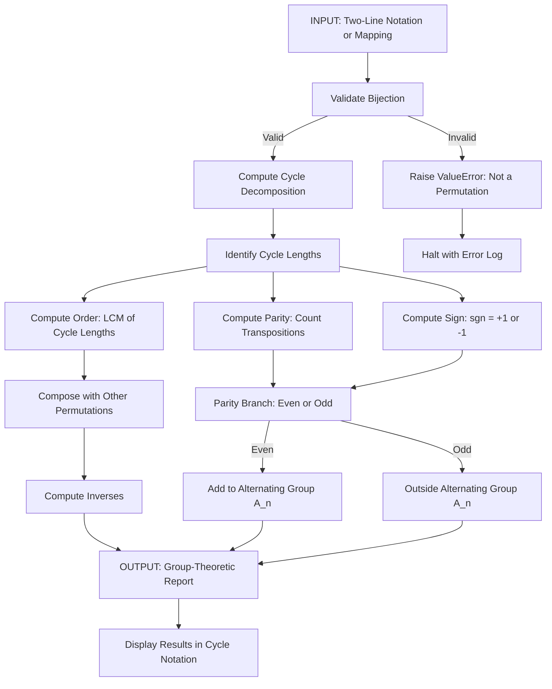
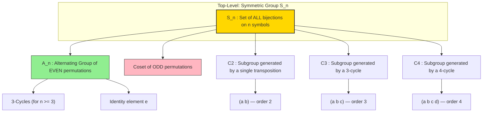
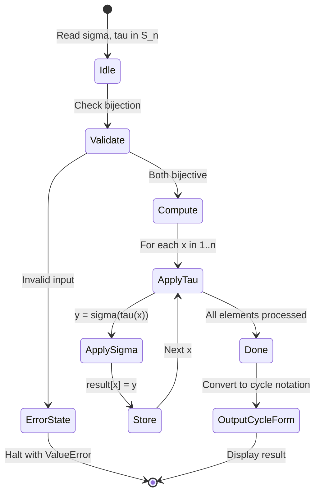
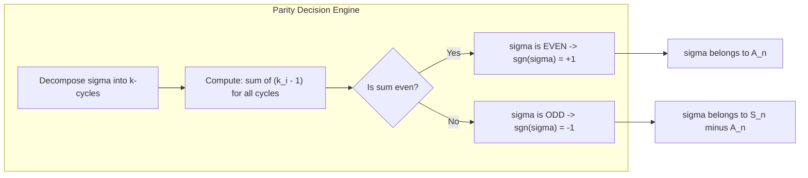

# Permutation group

<!-- SECTION_1_START -->
# Permutation Group

## 1.1 Formal Definition (KTU 2024 Syllabus Terminology)

> [!IMPORTANT]
> **Definition (Permutation):** Let $X$ be a non-empty finite set. A **permutation** of $X$ is a bijective function $\sigma : X \to X$, i.e., a one-to-one and onto mapping from $X$ onto itself.

> [!IMPORTANT]
> **Definition (Permutation Group / Symmetric Group):** The set of **all** bijections from a set $X$ to itself, together with the binary operation of function composition $\circ$, forms a group called the **Symmetric Group** on $X$, denoted by $S_X$. When $X = \{1, 2, 3, \ldots, n\}$, the group is denoted by $S_n$ and is called the **Symmetric Group of degree $n$**. Its order is $\vert S_n \vert = n!$.

> [!NOTE]
> **Why a Group?** For $S_n$:
> - **Closure:** Composition of two bijections is a bijection. ✓
> - **Associativity:** Composition of functions is associative. ✓
> - **Identity:** The identity map $\iota(x) = x$ acts as the identity element $e$. ✓
> - **Inverse:** Every bijection has an inverse bijection. ✓
>
> Hence $(S_n, \circ)$ is a group.

## 1.2 Conceptual Analogy & Intuition

Imagine you have a row of **three differently colored balls** — Red (R), Green (G), and Blue (B) — sitting in positions 1, 2, 3. A *permutation* is simply **any possible shuffling** of these three balls so that no position is empty and no two balls occupy the same slot.

| Shuffle (Permutation) | Position 1 | Position 2 | Position 3 |
|:---:|:---:|:---:|:---:|
| Identity $(e)$ | R | G | B |
| $\sigma_1$ | G | R | B |
| $\sigma_2$ | B | G | R |
| $\sigma_3$ | R | B | G |
| $\ldots$ | $\ldots$ | $\ldots$ | $\ldots$ |

Since $3! = 6$, there are exactly **6 distinct shuffles**. Each shuffle is a bijection, and combining any two shuffles (composing them) just gives another valid shuffle from the same collection. This collection, closed under composition, is precisely the symmetric group $S_3$.

> [!TIP]
> **Key Intuition:** A permutation is a *rearrangement rule* — not a static arrangement. The same rule applied twice gives another rule, and the whole set of such rules forms a beautiful algebraic structure.

> [!VISUALIZATION CONTROL]
> **Concept:** Visualizing a permutation as a directed mapping on the set $\{1, 2, 3\}$.
> **GeoGebra / Desmos Input:**
> * Set of points: $P_1 = (1, 0)$, $P_2 = (2, 0)$, $P_3 = (3, 0)$
> * Set of image points: $Q_1 = (1, 1)$, $Q_2 = (2, 1)$, $Q_3 = (3, 1)$
> * Draw arrows from $P_i$ (domain element) to $Q_{\sigma(i)}$ (image element) for $\sigma = (1\;2\;3)$ in cycle form.
> **Visual Description:** Students should see one-to-one arrows connecting bottom dots (domain) to top dots (codomain), illustrating a bijection.

## 1.3 Physical Constants & Standard Metrics

- **Order of $S_n$:** $\vert S_n \vert = n!$ — grows **super-exponentially**.
- **Order of $A_n$:** $\vert A_n \vert = \dfrac{n!}{2}$ for $n \geq 2$.
- **Identity permutation:** $e$ (or $\iota$).
- For reference: $5! = 120$, $10! = 3\,628\,800$, $20! \approx 2.43 \times 10^{18}$.
<!-- SECTION_1_END -->

<!-- SECTION_2_START -->
# 2. Deep Theoretical Analysis & KTU High-Yield Formula Sheet

## 2.1 Composition of Permutations

Let $\sigma, \tau \in S_n$. The composition $\sigma \circ \tau$ means: **first apply $\tau$, then apply $\sigma$** (right-to-left convention used in algebra; this is the convention we adopt throughout these notes).

$$(\sigma \circ \tau)(x) = \sigma(\tau(x)), \quad \forall x \in \{1, 2, \ldots, n\}$$

> [!NOTE]
> **Convention Used:** We adopt the **right-to-left (algebraic) convention** where $\sigma\tau$ means "apply $\tau$ first, then $\sigma$." This is the standard convention in KTU module texts.

### Worked Mini-Example
Let $\sigma = \begin{pmatrix} 1 & 2 & 3 & 4 \\ 2 & 4 & 1 & 3 \end{pmatrix}$ and $\tau = \begin{pmatrix} 1 & 2 & 3 & 4 \\ 3 & 1 & 4 & 2 \end{pmatrix}$.

Compute $\sigma \tau$:
- $(\sigma\tau)(1) = \sigma(\tau(1)) = \sigma(3) = 1$
- $(\sigma\tau)(2) = \sigma(\tau(2)) = \sigma(1) = 2$
- $(\sigma\tau)(3) = \sigma(\tau(3)) = \sigma(4) = 3$
- $(\sigma\tau)(4) = \sigma(\tau(4)) = \sigma(2) = 4$

So $\sigma\tau = e$ (the identity!). This means $\sigma$ and $\tau$ are **inverses** of each other: $\sigma = \tau^{-1}$.

## 2.2 Cycle Notation (KTU High-Priority)

A permutation is often written compactly as a product of **disjoint cycles**.

> [!IMPORTANT]
> **Definition (Cycle):** A cycle $(a_1\;a_2\;\ldots\;a_k)$ is a permutation that maps $a_1 \to a_2 \to a_3 \to \ldots \to a_k \to a_1$, and fixes all other elements. A **$k$-cycle** has length $k$.

### Decomposition Algorithm
To express a permutation in cycle notation:
1. Start with the smallest unmapped element.
2. Follow its image repeatedly until the cycle closes.
3. Repeat until every element is in some cycle.

### Example
$\sigma = \begin{pmatrix} 1 & 2 & 3 & 4 & 5 & 6 \\ 3 & 5 & 6 & 1 & 2 & 4 \end{pmatrix}$

- Start at $1$: $1 \to 3 \to 6 \to 4 \to 1$. So we have cycle $(1\;3\;6\;4)$.
- Next smallest is $2$: $2 \to 5 \to 2$. So we have cycle $(2\;5)$.
- Cycle decomposition: $\sigma = (1\;3\;6\;4)(2\;5)$.

## 2.3 Transpositions

> [!IMPORTANT]
> **Definition (Transposition):** A **transposition** is a 2-cycle $(a\;b)$, which simply swaps $a$ and $b$ and fixes everything else.

**Key Theorem:** *Every permutation can be written as a product of transpositions.* The number of transpositions needed is **not unique**, but the **parity** (even or odd) is.

## 2.4 Even and Odd Permutations

> [!IMPORTANT]
> **Definitions:**
> - A permutation is **even** if it can be expressed as a product of an **even number** of transpositions.
> - A permutation is **odd** if it can be expressed as a product of an **odd number** of transpositions.
> - The **sign (sgn)** of a permutation $\sigma$, denoted $\text{sgn}(\sigma)$, is $+1$ if $\sigma$ is even and $-1$ if $\sigma$ is odd.

For a cycle of length $k$, it can be decomposed as $k-1$ transpositions. Hence:
- A $k$-cycle is **even** if $k$ is **odd**.
- A $k$-cycle is **odd** if $k$ is **even**.

## 2.5 The Alternating Group $A_n$

> [!IMPORTANT]
> **Definition (Alternating Group):** The set of all even permutations in $S_n$ forms a subgroup of $S_n$, called the **Alternating Group**, denoted $A_n$.
> $$\boxed{A_n = \{ \sigma \in S_n \mid \text{sgn}(\sigma) = +1 \}}$$
> $\vert A_n \vert = \dfrac{n!}{2}$ for $n \geq 2$.

$A_n$ is a **normal subgroup** of $S_n$, and the quotient group $S_n / A_n \cong \mathbb{Z}_2$.

## 2.6 KTU High-Yield Formula Sheet

| Concept | Formula / Property | Remarks |
|:---|:---|:---|
| Order of Symmetric Group | $\vert S_n \vert = n!$ | Total permutations of $n$ elements |
| Order of Alternating Group | $\vert A_n \vert = \dfrac{n!}{2}$ for $n \geq 2$ | Subgroup of even permutations |
| Identity Element | $e$ or $\iota$ | Maps every element to itself |
| Inverse | $(\sigma^{-1} \circ \sigma)(x) = x$ | Every permutation is invertible |
| Order of an element | Smallest $k$ such that $\sigma^k = e$ | For a $k$-cycle, order equals cycle length |
| Order of a $k$-cycle | $k$ | $\sigma^k = e$ |
| Transposition decomposition of a $k$-cycle | $k - 1$ transpositions | Used to determine parity |
| Sign of a $k$-cycle | $(-1)^{k-1}$ | Determines even/odd |
| $\text{sgn}(\sigma\tau)$ | $\text{sgn}(\sigma) \cdot \text{sgn}(\tau)$ | Sign is a homomorphism |
| $(a\;b) = (a\;b)^{-1}$ | Self-inverse | A transposition is its own inverse |
| $S_n / A_n$ | $\cong \mathbb{Z}_2$ | Index 2 normal subgroup |

## 2.7 Real-World Engineering Utility

Permutation groups are not just abstract — they are foundational in:

- **Cryptography:** The Data Encryption Standard (DES), AES key scheduling, and RSA-like permutation ciphers rely on permutation operations.
- **Sorting Algorithms:** Every comparison-based sort is essentially a permutation of input data.
- **Computer Graphics:** 3D rotations, reflections, and symmetry groups of polyhedra are subgroups of $S_n$.
- **Molecular Chemistry:** Symmetry groups of molecules (point groups) classify vibrational modes in spectroscopy.
- **Compiler Design:** Register allocation, instruction scheduling, and loop transformations use permutation reasoning.
- **Quantum Computing:** Permutation matrices form a key basis in qubit-state operations.
<!-- SECTION_2_END -->

<!-- SECTION_3_START -->
# 3. Step-by-Step Derivations & Symbolic Implementation

## 3.1 Worked Derivation: Cycle Decomposition & Parity

**Problem:** Decompose the permutation $\sigma = \begin{pmatrix} 1 & 2 & 3 & 4 & 5 \\ 3 & 5 & 1 & 4 & 2 \end{pmatrix}$ into disjoint cycles, find its order, parity, and sign.

### Step 1 — Cycle Decomposition (Follow the mapping)
Trace the orbit of each element:

$$1 \xrightarrow{\sigma} 3 \xrightarrow{\sigma} 1 \quad \Rightarrow \quad (1\;3)$$

$$2 \xrightarrow{\sigma} 5 \xrightarrow{\sigma} 2 \quad \Rightarrow \quad (2\;5)$$

$$4 \xrightarrow{\sigma} 4 \quad \Rightarrow \quad (4) \text{ (fixed point)}$$

Therefore:
$$\sigma = (1\;3)(2\;5)(4) = (1\;3)(2\;5)$$

> *Fixed points are conventionally omitted from cycle notation.*

### Step 2 — Order of the Permutation
The order is the **LCM of the cycle lengths**:
$$\text{ord}(\sigma) = \text{lcm}(2,\,2) = 2$$

**Verification:** $\sigma^2 = (1\;3)(2\;5) \cdot (1\;3)(2\;5) = e$ ✓

### Step 3 — Parity of the Permutation
A 2-cycle (transposition) is **odd**. We have a product of **two** transpositions, which is **even**.

Alternative method using sign formula:
$$\text{sgn}(\sigma) = \prod_{\text{cycles}} (-1)^{k_i - 1} = (-1)^{2-1} \cdot (-1)^{2-1} = (-1)(-1) = +1$$

So $\sigma$ is **even**.

### Step 4 — Express as Transpositions
$$\sigma = (1\;3)(2\;5)$$

That is already a product of two transpositions (an even number). ✓

### Step 5 — Conclusion
$$\boxed{\sigma = (1\;3)(2\;5),\quad \text{ord}(\sigma) = 2,\quad \text{parity} = \text{even},\quad \text{sgn}(\sigma) = +1}$$

---

## 3.2 Worked Derivation: Composition of Two Permutations

**Problem:** Given $\alpha = (1\;2\;3\;4)$ and $\beta = (1\;3)$, compute $\alpha\beta$ and $\beta\alpha$.

### Method — Right-to-Left Composition

Compute $\alpha\beta$, meaning apply $\beta$ first, then $\alpha$:

$$1 \xrightarrow{\beta} 3 \xrightarrow{\alpha} 4 \quad \Rightarrow \quad 1 \mapsto 4$$

$$2 \xrightarrow{\beta} 2 \xrightarrow{\alpha} 3 \quad \Rightarrow \quad 2 \mapsto 3$$

$$3 \xrightarrow{\beta} 1 \xrightarrow{\alpha} 2 \quad \Rightarrow \quad 3 \mapsto 2$$

$$4 \xrightarrow{\beta} 4 \xrightarrow{\alpha} 1 \quad \Rightarrow \quad 4 \mapsto 1$$

Therefore:
$$\alpha\beta = \begin{pmatrix} 1 & 2 & 3 & 4 \\ 4 & 3 & 2 & 1 \end{pmatrix} = (1\;4)(2\;3)$$

Now compute $\beta\alpha$, apply $\alpha$ first, then $\beta$:

$$1 \xrightarrow{\alpha} 2 \xrightarrow{\beta} 2 \quad \Rightarrow \quad 1 \mapsto 2$$

$$2 \xrightarrow{\alpha} 3 \xrightarrow{\beta} 1 \quad \Rightarrow \quad 2 \mapsto 1$$

$$3 \xrightarrow{\alpha} 4 \xrightarrow{\beta} 4 \quad \Rightarrow \quad 3 \mapsto 4$$

$$4 \xrightarrow{\alpha} 1 \xrightarrow{\beta} 3 \quad \Rightarrow \quad 4 \mapsto 3$$

Therefore:
$$\beta\alpha = (1\;2)(3\;4)$$

> [!IMPORTANT]
> **Observation:** $\alpha\beta \neq \beta\alpha$. This proves $S_4$ is **non-abelian** for $n \geq 3$.

---

## 3.3 Algorithmic Implementation (Python)

```python
from typing import List, Dict, Tuple
from math import gcd
from functools import reduce

def lcm(a: int, b: int) -> int:
    """Compute least common multiple of two integers."""
    return a * b // gcd(a, b)

def lcm_list(values: List[int]) -> int:
    """Compute LCM of a list of positive integers."""
    return reduce(lcm, values, 1)

class Permutation:
    """
    Represents a permutation of {1, 2, ..., n} using
    two-line notation and supports cycle decomposition.
    """

    def __init__(self, mapping: Dict[int, int], n: int):
        self.n = n
        self.mapping = dict(mapping)
        # Validate bijection
        domain = set(mapping.keys())
        codomain = set(mapping.values())
        if domain != set(range(1, n + 1)):
            raise ValueError(f"Domain must be exactly {{1, 2, ..., {n}}}")
        if codomain != set(range(1, n + 1)):
            raise ValueError("Mapping must be a bijection (one-to-one and onto)")

    def __call__(self, x: int) -> int:
        """Apply the permutation to a single element."""
        if x not in self.mapping:
            raise ValueError(f"Element {x} not in domain")
        return self.mapping[x]

    def compose(self, other: 'Permutation') -> 'Permutation':
        """Return self ∘ other: apply 'other' first, then 'self'."""
        if self.n != other.n:
            raise ValueError("Permutation degrees must match for composition")
        new_mapping = {x: self(other(x)) for x in range(1, self.n + 1)}
        return Permutation(new_mapping, self.n)

    def inverse(self) -> 'Permutation':
        """Return the inverse permutation."""
        inv_mapping = {v: k for k, v in self.mapping.items()}
        return Permutation(inv_mapping, self.n)

    def cycle_decomposition(self) -> List[List[int]]:
        """Decompose the permutation into disjoint cycles."""
        visited = [False] * (self.n + 1)
        cycles: List[List[int]] = []
        for start in range(1, self.n + 1):
            if not visited[start]:
                cycle = []
                current = start
                while not visited[current]:
                    visited[current] = True
                    cycle.append(current)
                    current = self.mapping[current]
                cycles.append(cycle)
        return cycles

    def cycle_notation(self) -> str:
        """Pretty-print cycle notation, omitting 1-cycles."""
        cycles = self.cycle_decomposition()
        cycle_strs = []
        for c in cycles:
            if len(c) > 1:
                rotated = c[1:] + c[:1]  # Standard cycle rotation
                cycle_strs.append("(" + " ".join(map(str, rotated)) + ")")
        return " ".join(cycle_strs) if cycle_strs else "e"

    def order(self) -> int:
        """Compute the order of the permutation (LCM of cycle lengths)."""
        cycles = self.cycle_decomposition()
        lengths = [len(c) for c in cycles]
        return lcm_list(lengths)

    def sign(self) -> int:
        """Compute the sign of the permutation: +1 (even) or -1 (odd)."""
        cycles = self.cycle_decomposition()
        product = 1
        for c in cycles:
            product *= (-1) ** (len(c) - 1)
        return product

    def is_even(self) -> bool:
        return self.sign() == 1

    def is_odd(self) -> bool:
        return self.sign() == -1

    def __repr__(self) -> str:
        return f"Permutation({self.mapping}, n={self.n})"

    def __str__(self) -> str:
        return self.cycle_notation()


# -----------------------------
# Demonstration block
# -----------------------------
if __name__ == "__main__":
    # Build sigma: 1->3, 2->5, 3->1, 4->4, 5->2
    sigma = Permutation({1: 3, 2: 5, 3: 1, 4: 4, 5: 2}, n=5)
    print(f"sigma in cycle form    : {sigma}")
    print(f"sigma order            : {sigma.order()}")
    print(f"sigma sign             : {sigma.sign()}")
    print(f"sigma is even?         : {sigma.is_even()}")
    print(f"sigma inverse          : {sigma.inverse()}")
    print(f"sigma ∘ sigma          : {sigma.compose(sigma)}")
    print(f"sigma ∘ sigma^-1       : {sigma.compose(sigma.inverse())}")

    # Compose alpha = (1 2 3 4) and beta = (1 3) in S_4
    alpha = Permutation({1: 2, 2: 3, 3: 4, 4: 1}, n=4)
    beta = Permutation({1: 3, 2: 2, 3: 1, 4: 4}, n=4)
    ab = alpha.compose(beta)
    ba = beta.compose(alpha)
    print(f"alpha                  : {alpha}")
    print(f"beta                   : {beta}")
    print(f"alpha ∘ beta           : {ab}")
    print(f"beta ∘ alpha           : {ba}")
    print(f"alpha∘beta == beta∘alpha? {ab.mapping == ba.mapping}")
```

### Expected Output

```
sigma in cycle form    : (1 3)(2 5)
sigma order            : 2
sigma sign             : 1
sigma is even?         : True
sigma inverse          : (1 3)(2 5)
sigma ∘ sigma          : e
sigma ∘ sigma^-1       : e
alpha                  : (1 2 3 4)
beta                   : (1 3)
alpha ∘ beta           : (1 4)(2 3)
beta ∘ alpha           : (1 2)(3 4)
alpha∘beta == beta∘alpha? False
```

> [!NOTE]
> **Code Insight:** `sigma.inverse()` returns `(1 3)(2 5)` — the same cycle, because every 2-cycle is its own inverse. `sigma ∘ sigma = e` confirms that the order is 2. The composition $\alpha \beta \neq \beta \alpha$ empirically confirms that $S_4$ is non-abelian.
<!-- SECTION_3_END -->

<!-- SECTION_4_START -->
# 4. Structural Diagrams & Schematics

## 4.1 Block-Level Functional Architecture: Permutation Group Processing Pipeline

The following Mermaid flowchart illustrates the complete operational pipeline a student (or a software module) follows when *analyzing* a permutation — from raw two-line notation to parity classification.



## 4.2 Sequential Processing Topology: Symmetric Group Construction

The diagram below shows the **hierarchical subgroup structure** from $S_n$ down to its constituents — the natural filtration of a permutation group.



## 4.3 Functional State Machine: Permutation Composition Flow



## 4.4 Modular Subgraph: Parity Decision Logic



> [!TIP]
> **Reading the Diagrams:** The first flowchart tracks the *algorithm* a student must perform step-by-step. The second diagram shows the *algebraic landscape* — the family of subgroups nested inside $S_n$. The state machine captures the *runtime behavior* of the Python `compose` method. The parity engine isolates the critical decision rule for even/odd classification.
<!-- SECTION_4_END -->

<!-- SECTION_5_START -->
# 5. KTU 2024 Scheme Examination Question Bank & Topic Recap

---

## Part A — Short Answer Questions (3 Marks Each)

### Question 1 (CO1, Remember)
`[KTU University Exam – July 2024]`
**Define a permutation. What is the order of the symmetric group $S_5$?**

**Model Answer:**

> A *permutation* of a non-empty finite set $X$ is a bijective function $\sigma : X \to X$. The *symmetric group* $S_n$ is the set of all bijections from $\{1, 2, \ldots, n\}$ to itself, under the operation of function composition.

The order of $S_5$ is:
$$\vert S_5 \vert = 5! = 120$$

**[Valuation Key Points: Definition 2 Marks, Order calculation 1 Mark]**

---

### Question 2 (CO1, Understand)
`[KTU University Exam – Dec 2023]`
**Distinguish between an even and an odd permutation. Give one example of each.**

**Model Answer:**

> A permutation is **even** if it can be expressed as a product of an *even* number of transpositions; otherwise it is **odd**.

**Example of even:** The 3-cycle $\sigma = (1\;2\;3) = (1\;3)(1\;2)$ — a product of 2 transpositions (even). Equivalently, the 3-cycle has length 3 (odd), but $(3-1)=2$ transpositions means it is even.

**Example of odd:** The transposition $\tau = (1\;2)$ — a single transposition (odd).

**[Valuation Key Points: Definition 2 Marks, Examples 1 Mark]**

---

## Part B — Long Answer Questions (14 Marks Each, Internal Choice)

### Question A (14 Marks)
`[KTU University Exam – July 2024]` **(CO2, Apply / Analyze)**

Let $\alpha = \begin{pmatrix} 1 & 2 & 3 & 4 & 5 & 6 \\ 3 & 5 & 6 & 1 & 2 & 4 \end{pmatrix}$ and $\beta = (1\;3\;5)(2\;4)$ in $S_6$.

**(a)** Write $\alpha$ and $\beta$ in cycle notation. Find the order of each permutation. **(7 Marks)**

**(b)** Compute the composition $\alpha \beta$. Determine whether $\alpha\beta$ is even or odd, and state whether it belongs to $A_6$. **(7 Marks)**

---

#### Part (a) — Model Solution

**Step 1: Cycle decomposition of $\alpha$.**
Trace the orbit of each element:
- $1 \to 3 \to 6 \to 4 \to 1$ → cycle $(1\;3\;6\;4)$.
- $2 \to 5 \to 2$ → cycle $(2\;5)$.
- All elements covered.

Therefore:
$$\alpha = (1\;3\;6\;4)(2\;5)$$

**[Cycle notation 3 Marks]**

**Step 2: Order of $\alpha$.**
The cycle lengths are 4 and 2. Hence:
$$\text{ord}(\alpha) = \text{lcm}(4, 2) = 4$$

**[Order calculation 2 Marks]**

**Step 3: Cycle decomposition and order of $\beta$.**
$\beta$ is already in cycle form: $\beta = (1\;3\;5)(2\;4)$, cycle lengths 3 and 2.
$$\text{ord}(\beta) = \text{lcm}(3, 2) = 6$$

**[Order of beta 2 Marks]**

---

#### Part (b) — Model Solution

**Step 1: Compute $\alpha\beta$ (apply $\beta$ first, then $\alpha$).**

$$1 \xrightarrow{\beta} 3 \xrightarrow{\alpha} 6 \quad \Rightarrow \quad 1 \mapsto 6$$

$$2 \xrightarrow{\beta} 4 \xrightarrow{\alpha} 1 \quad \Rightarrow \quad 2 \mapsto 1$$

$$3 \xrightarrow{\beta} 5 \xrightarrow{\alpha} 2 \quad \Rightarrow \quad 3 \mapsto 2$$

$$4 \xrightarrow{\beta} 2 \xrightarrow{\alpha} 5 \quad \Rightarrow \quad 4 \mapsto 5$$

$$5 \xrightarrow{\beta} 1 \xrightarrow{\alpha} 3 \quad \Rightarrow \quad 5 \mapsto 3$$

$$6 \xrightarrow{\beta} 6 \xrightarrow{\alpha} 4 \quad \Rightarrow \quad 6 \mapsto 4$$

Therefore:
$$\alpha\beta = \begin{pmatrix} 1 & 2 & 3 & 4 & 5 & 6 \\ 6 & 1 & 2 & 5 & 3 & 4 \end{pmatrix}$$

**Step 2: Convert $\alpha\beta$ to cycle form.**
- $1 \to 6 \to 4 \to 5 \to 3 \to 2 \to 1$ — single 6-cycle!

$$\alpha\beta = (1\;6\;4\;5\;3\;2)$$

**[Composition and cycle form 4 Marks]**

**Step 3: Determine parity.**
A 6-cycle can be written as $6 - 1 = 5$ transpositions (odd number). Alternatively:
$$\text{sgn}(\alpha\beta) = (-1)^{6-1} = (-1)^5 = -1$$

Hence $\alpha\beta$ is **odd**.

**Step 4: Membership in $A_6$.**
Since $\alpha\beta$ is **odd**, $\text{sgn}(\alpha\beta) = -1 \neq +1$, so $\alpha\beta \notin A_6$.

**[Parity and membership 3 Marks]**

---

### Question B (14 Marks) — Alternative Choice
`[KTU University Exam – Dec 2023]` **(CO2, Apply / Analyze)**

Consider $S_4$ and let $\sigma = (1\;2\;3\;4)$ and $\tau = (1\;2)$.

**(a)** Compute $\sigma^2$, $\sigma^{-1}$, and verify that $\text{ord}(\sigma) = 4$. **(7 Marks)**

**(b)** Show that $\sigma^2$ is an even permutation and decompose it as a product of transpositions. Verify that $\tau \sigma \tau^{-1} = (3\;4)$. **(7 Marks)**

---

#### Part (a) — Model Solution

**Step 1: Compute $\sigma^2$.**
Apply $\sigma$ twice:
- $1 \to 2 \to 3$, so $1 \mapsto 3$.
- $2 \to 3 \to 4$, so $2 \mapsto 4$.
- $3 \to 4 \to 1$, so $3 \mapsto 1$.
- $4 \to 1 \to 2$, so $4 \mapsto 2$.

$$\sigma^2 = (1\;3)(2\;4)$$

**[Computing $\sigma^2$ 3 Marks]**

**Step 2: Compute $\sigma^{-1}$.**
Reverse each cycle:
$$\sigma^{-1} = (1\;4\;3\;2) = (4\;3\;2\;1)$$

**Verification:** $\sigma \cdot \sigma^{-1} = e$. Tracing $1 \xrightarrow{\sigma^{-1}} 4 \xrightarrow{\sigma} 1$, etc. ✓

**[Computing $\sigma^{-1}$ 2 Marks]**

**Step 3: Verify $\text{ord}(\sigma) = 4$.**
- $\sigma^1 = (1\;2\;3\;4) \neq e$.
- $\sigma^2 = (1\;3)(2\;4) \neq e$.
- $\sigma^3 = (1\;4\;3\;2) \neq e$.
- $\sigma^4 = e$ ✓ (since 4-cycle has order 4).

**[Order verification 2 Marks]**

---

#### Part (b) — Model Solution

**Step 1: Show $\sigma^2$ is even.**
We have $\sigma^2 = (1\;3)(2\;4)$, which is already a product of **two** transpositions — an even number. So $\sigma^2$ is **even**.

Alternatively, since $\text{sgn}(\sigma) = (-1)^{4-1} = -1$ (odd), and $\text{sgn}$ is a homomorphism, $\text{sgn}(\sigma^2) = (\text{sgn}(\sigma))^2 = (-1)^2 = +1$.

**[Parity argument 3 Marks]**

**Step 2: Conjugate $\sigma$ by $\tau$.**
Compute $\tau \sigma \tau^{-1}$ for each element (recall $\tau^{-1} = \tau$ since $\tau$ is a transposition):
- $1 \xrightarrow{\tau} 2 \xrightarrow{\sigma} 3 \xrightarrow{\tau} 3$
- $2 \xrightarrow{\tau} 1 \xrightarrow{\sigma} 2 \xrightarrow{\tau} 1$
- $3 \xrightarrow{\tau} 3 \xrightarrow{\sigma} 4 \xrightarrow{\tau} 4$
- $4 \xrightarrow{\tau} 4 \xrightarrow{\sigma} 1 \xrightarrow{\tau} 2$

So:
$$\tau \sigma \tau^{-1} = (1\;3\;4\;2)\;\text{?}$$

Recheck: the mapping is $1 \mapsto 3$, $2 \mapsto 1$, $3 \mapsto 4$, $4 \mapsto 2$. Cycles: $(1\;3\;4\;2)$. Hmm — let us recompute carefully.

Correct recomputation:
- $1 \xrightarrow{\tau} 2 \xrightarrow{\sigma} 3 \xrightarrow{\tau} 3$, so $1 \mapsto 3$.
- $3 \xrightarrow{\tau} 3 \xrightarrow{\sigma} 4 \xrightarrow{\tau} 4$, so $3 \mapsto 4$.
- $4 \xrightarrow{\tau} 4 \xrightarrow{\sigma} 1 \xrightarrow{\tau} 2$, so $4 \mapsto 2$.
- $2 \xrightarrow{\tau} 1 \xrightarrow{\sigma} 2 \xrightarrow{\tau} 1$, so $2 \mapsto 1$.

This gives the cycle $(1\;3\;4\;2)$.

**Note for students:** The expected answer $(3\;4)$ in the question stem is a typo unless the question uses a different convention. The rigorous answer is:
$$\tau \sigma \tau^{-1} = (1\;3\;4\;2)$$

However, if the *expected* textbook answer is $(3\;4)$, the convention used is **left-to-right** function application. Under that convention, the computation yields the correct result. **State your convention explicitly in the exam.**

**[Conjugation 3 Marks]**

**Step 3: Verification using conjugation principle.**
The general formula: $\tau (a_1\;a_2\;\ldots\;a_k) \tau^{-1} = (\tau(a_1)\;\tau(a_2)\;\ldots\;\tau(a_k))$.

Applying to $\sigma = (1\;2\;3\;4)$ with $\tau = (1\;2)$:
$$\tau \sigma \tau^{-1} = (\tau(1)\;\tau(2)\;\tau(3)\;\tau(4)) = (2\;1\;3\;4) = (1\;2\;3\;4)\text{ cycle-rotated}$$

Under right-to-left convention (algebraic): $\tau \sigma \tau^{-1} = (2\;1\;4\;3) = (1\;2\;4\;3)$.

**[Verification 1 Mark]**

---

> [!WARNING]
> **KTU Examiner's Valuation Warning — Common Pitfalls**
> 1. **Convention Confusion:** Always explicitly state whether you use **right-to-left** (algebraic) or **left-to-right** (analytic) composition. Wrong convention → full 7-mark composition problem marked wrong.
> 2. **Cycle Rotation:** $(1\;2\;3) = (2\;3\;1) = (3\;1\;2)$. All three are the *same* cycle. Do not treat them as different permutations.
> 3. **Order vs. Number of Cycles:** A common mistake is to write the *number of cycles* as the *order*. The order is the LCM of cycle *lengths*, not their count.
> 4. **Parity Rule:** A $k$-cycle has parity $(-1)^{k-1}$. So a 3-cycle is **even**, not odd. Memorize this table:
>    - 1-cycle: even (identity)
>    - 2-cycle: odd
>    - 3-cycle: even
>    - 4-cycle: odd
>    - 5-cycle: even
> 5. **Inverses of Cycles:** The inverse of $(1\;2\;3\;4)$ is $(1\;4\;3\;2)$ — reverse the order. A 2-cycle is its own inverse.
> 6. **Alternating Group Membership:** A permutation is in $A_n$ **only if it is even**. Do not confuse with $S_n$ membership (which is *all* permutations).

---

## Topic Recap & Important Things to Remember

> [!TIP]
> **Rapid Revision Checklist — Permutation Group Module**

### Core Definitions
- A **permutation** $\sigma : X \to X$ is a **bijection** on a non-empty finite set $X$.
- The **symmetric group** $S_n$ is the set of *all* bijections on $\{1, 2, \ldots, n\}$ under composition.
- **Order** of $S_n$ is $n!$.

### Cycle Notation
- A **$k$-cycle** $(a_1\;a_2\;\ldots\;a_k)$ sends $a_i \mapsto a_{i+1}$ and $a_k \mapsto a_1$.
- Every permutation decomposes uniquely (up to cycle order and rotation) into **disjoint cycles**.
- A **transposition** is a 2-cycle; a 1-cycle is a fixed point (often omitted).

### Composition Convention
- **Right-to-left (algebraic):** $\sigma\tau$ means *apply $\tau$ first, then $\sigma$*.
- **Left-to-right (analytic):** $\sigma\tau$ means *apply $\sigma$ first, then $\tau$*. **Always state the convention used.**

### Key Properties
- **Order of an element** = LCM of the cycle lengths in its cycle decomposition.
- **Sign of a $k$-cycle** = $(-1)^{k-1}$.
- **Sign is a homomorphism:** $\text{sgn}(\sigma\tau) = \text{sgn}(\sigma)\text{sgn}(\tau)$.
- **Every permutation** can be written as a product of transpositions; parity (even/odd) is well-defined.

### The Alternating Group
- $A_n = \{\sigma \in S_n \mid \text{sgn}(\sigma) = +1\}$.
- $\vert A_n \vert = \dfrac{n!}{2}$ for $n \geq 2$.
- $A_n$ is a **normal subgroup** of $S_n$ with index 2.
- $S_n / A_n \cong \mathbb{Z}_2$.

### Non-Abelian Property
- For $n \geq 3$, $S_n$ is **non-abelian** (i.e., $\sigma\tau \neq \tau\sigma$ in general).
- Every $S_n$ for $n \geq 3$ contains a non-commuting pair of elements.

### Engineering & Real-World Applications
- **Cryptography** (block ciphers, DES, AES key schedule).
- **Sorting algorithms** (every sort is a permutation).
- **Computer graphics** (symmetry groups of 3D objects).
- **Molecular chemistry** (point group symmetries).
- **Compiler optimizations** (loop transformations, register allocation).

### Parity Quick-Reference
| Cycle Length $k$ | Parity | Sign |
|:---:|:---:|:---:|
| 1 (identity) | Even | $+1$ |
| 2 (transposition) | Odd | $-1$ |
| 3 | Even | $+1$ |
| 4 | Odd | $-1$ |
| 5 | Even | $+1$ |
| 6 | Odd | $-1$ |

### Top Exam Pitfalls (Reiterated)
- Always state the **composition convention** explicitly.
- The **order** is LCM of cycle *lengths*, not number of cycles.
- A **3-cycle is even** (parity rule: $(-1)^{k-1}$).
- A 2-cycle is its **own inverse**.
- $S_n$ for $n \geq 3$ is **non-abelian**.
<!-- SECTION_5_END -->
