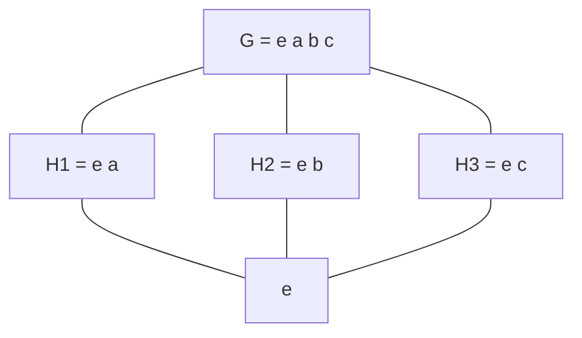
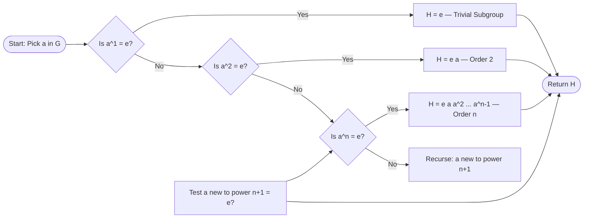
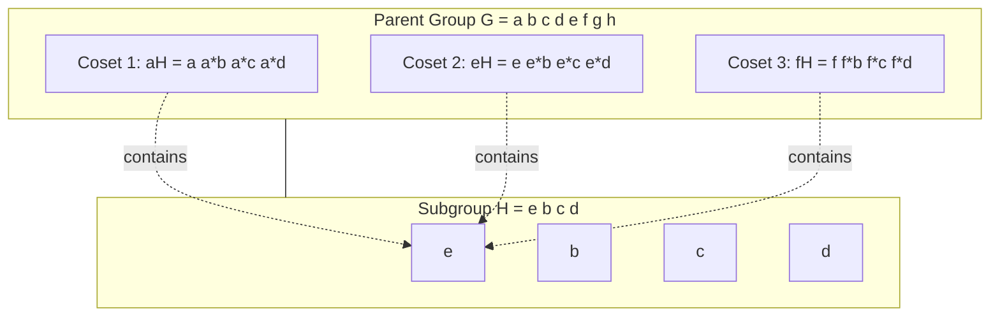
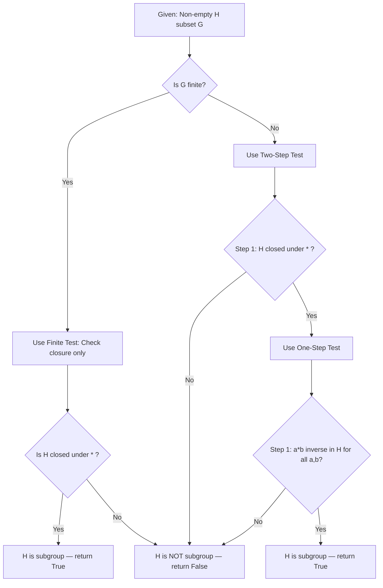
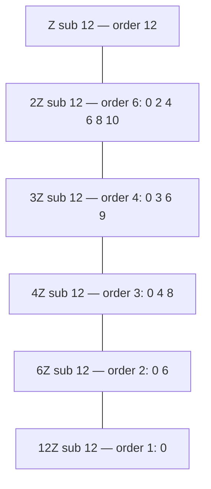

# Subgroup

<!-- SECTION_1_START -->
# Subgroup — Core Definition & Intuitive Overview

## Formal Academic Definition (KTU 2024 Syllabus)

Let $(G, \ast)$ be a group. A non-empty subset $H \subseteq G$ is called a **subgroup** of $G$ if $H$ itself forms a group under the same binary operation $\ast$ inherited from $G$.

Equivalently, $H \leq G$ (read as "$H$ is a subgroup of $G$") if and only if the following closure properties hold simultaneously:

$$
(H1) \quad \forall \, a, b \in H, \; a \ast b \in H \quad \text{(Closure)}
$$

$$
(H2) \quad \forall \, a \in H, \; a^{-1} \in H \quad \text{(Inverse Closure)}
$$

$$
(H3) \quad e_G \in H \quad \text{(Identity Inclusion)}
$$

> [!NOTE]
> **KTU Board Definition (verbatim standard):** *A non-empty subset $H$ of a group $G$ is said to be a subgroup of $G$ if $H$ is itself a group under the same operation as in $G$.* This is the **Single Step Subgroup Test** version that KTU examiners accept for full marks.

## Conceptual Analogy / Real-World Intuition

Imagine a **large company** $G$ where every employee can be modeled as a group element under the operation of "collaborating on a project." Now consider an **internal department** $H$ (say, the Software Division) within the company. The department:
- Is a subset of all employees ✓
- Has its own **head (identity)** — the Department Manager ✓
- For every employee in the department, there exists someone who can **undo/reverse** their work (inverse) ✓
- Two employees from the same department, when they collaborate, produce a result that still stays within the department (closure) ✓

So the **department behaves like a mini-company** under the same rules — that is precisely a **subgroup**.

> [!IMPORTANT]
> **Key Distinction from Subsets:** Every subgroup is a subset, but **not every subset is a subgroup**. The additional constraints of closure, inverses, and identity make subgroups **algebraically closed mini-structures** living inside the parent group.

## Standard Trivial Cases

| Case | Notation | Description |
| :--- | :--- | :--- |
| Trivial Subgroup | $\{e_G\}$ | The smallest possible subgroup containing only the identity element |
| Improper Subgroup | $G$ itself | The whole group $G$ is always a subgroup of itself |
| Proper Subgroup | $H \subsetneq G$ | When $H \neq G$ and $H \neq \{e_G\}$, $H$ is a *proper* non-trivial subgroup |

> [!TIP]
> **KTU Exam Shortcut:** When asked to list all subgroups, **always include $\{e\}$ and $G$** as the mandatory baseline. Examiners explicitly check for these two entries before awarding partial credit.

## Physical Constants / Standard Metrics

In abstract algebra, the only "constant" is the **identity element** $e$, which is always present and unique. In modular arithmetic contexts (e.g., $\mathbb{Z}_n$), the identity is conventionally the residue class $\bar{0}$ or equivalently $\bar{1}$ depending on the operation.

> [!VISUALIZATION CONTROL]
> **Concept:** Subgroup Lattice of $K_4$ (Klein Four-Group)
> **GeoGebra / Desmos Input Equations:**
> * Group elements: $\{e, a, b, c\}$ with operation table $a \ast b = c$, $a \ast a = e$, etc.
> * Subgroups: $\{e\}, \{e,a\}, \{e,b\}, \{e,c\}, \{e,a,b,c\}$
> **Visual Description:** Plot five horizontal nodes connected by vertical inclusion lines, forming a Hasse diagram where $\{e\}$ sits at the bottom, $\{e,a,b,c\}$ at the top, and the three 2-element subgroups occupy the middle tier.
<!-- SECTION_1_END -->

<!-- SECTION_2_START -->
# Deep Theoretical Analysis & KTU High-Yield Formula Sheet

## Subgroup Tests — The Three Standard Probes

A KTU board examiner typically tests students on **at most one** of the following three subgroup tests. Mastering all three is non-negotiable for full marks.

### Test 1: One-Step Subgroup Test (Infinite Groups)

$H \leq G$ if and only if for all $a, b \in H$:

$$
a \ast b^{-1} \in H
$$

This single condition **simultaneously guarantees** closure, associativity (inherited from $G$), identity, and inverses.

### Test 2: Two-Step Subgroup Test (Most Common in KTU Papers)

$H \leq G$ if and only if:

$$
\text{(i)} \quad \forall \, a, b \in H, \; a \ast b \in H \quad \text{(Closure)}
$$

$$
\text{(ii)} \quad \forall \, a \in H, \; a^{-1} \in H \quad \text{(Inverse Closure)}
$$

> [!NOTE]
> Identity inclusion $e \in H$ is **automatically implied** by the inverse condition, because taking $a = a$ and multiplying by $a^{-1}$ gives $e \in H$. This is a favorite KTU trick question.

### Test 3: Finite Subgroup Test (Best for Numerical Problems)

If $G$ is **finite** and $H$ is a non-empty subset of $G$, then:

$$
H \leq G \iff \forall \, a, b \in H, \; a \ast b \in H
$$

**Closure alone is sufficient** for finite subsets — inverses and identity are automatically present.

## KTU High-Yield Formula Sheet

| Theorem / Property | Statement | Use Case |
| :--- | :--- | :--- |
| Identity of Subgroup | $e_H = e_G$ | Always the same element |
| Inverse of Subgroup | $(a^{-1})_H = (a^{-1})_G$ | Inverses are inherited |
| Subgroup of Cyclic is Cyclic | Every subgroup of a cyclic group is cyclic | Classification problems |
| Order of $a$ in subgroup | $o_H(a)$ divides $o_G(a)$ | Lagrange's Theorem application |
| Lagrange's Theorem | $o(H)$ divides $o(G)$ | $o(H) \mid o(G)$ |
| Index of Subgroup | $[G : H] = \dfrac{o(G)}{o(H)}$ | Coset counting |
| Intersection | $H_1 \cap H_2 \leq G$ | Always a subgroup |
| Union is NOT always subgroup | $H_1 \cup H_2 \leq G$ only if $H_1 \subseteq H_2$ or $H_2 \subseteq H_1$ | KTU favorite counter-example |
| Cosets Partition $G$ | $aH = \{a \ast h \mid h \in H\}$ | Partition-based proofs |
| Order of $a$ | Smallest $n \in \mathbb{Z}^+$ such that $a^n = e$ | Powers and cyclic structure |

## Order of an Element — A Critical Bridge Concept

For $a \in G$, the **order of $a$**, denoted $o(a)$ or $\vert a \vert$, is the smallest positive integer $n$ such that:

$$
a^n = \underbrace{a \ast a \ast \cdots \ast a}_{n \text{ times}} = e_G
$$

If no such $n$ exists, $a$ is said to have **infinite order**.

> [!IMPORTANT]
> The cyclic subgroup generated by $a$ is $\langle a \rangle = \{a^n \mid n \in \mathbb{Z}\}$, and its order equals $o(a)$. This is the **smallest subgroup containing $a$**.

## Why Subgroups Matter in Engineering and Computer Science

- **Cryptography:** Subgroup structure underpins the discrete logarithm problem in elliptic curve groups. The hardness of breaking ECC depends on choosing subgroups with large prime order.
- **Error-Correcting Codes:** Subgroups of finite fields $\mathbb{F}_{2^n}^{\ast}$ define BCH and Reed-Solomon codes used in QR codes, Blu-ray discs, and satellite communications.
- **Compiler Design:** Permutation subgroups of $S_n$ model register allocation strategies and instruction scheduling.
- **Physics:** Subgroups of $SU(3)$ and $SO(3)$ symmetry groups classify elementary particles and crystal structures.
- **Control Systems:** Subgroup properties ensure closed-loop stability under feedback composition.

## Theoretical Properties (With Justifications)

1. **If $a \in H \leq G$, then $o_G(a) = o_H(a)$** — because the same smallest positive power that gives identity in $G$ also gives identity when restricted to $H$.
2. **Every cyclic group of order $n$ has exactly one subgroup of order $d$ for every divisor $d$ of $n$.** This is a **famous KTU theorem** that must be memorized.
3. **A group of prime order has no proper non-trivial subgroups.** Directly from Lagrange's Theorem.
<!-- SECTION_2_END -->

<!-- SECTION_3_START -->
# Step-by-Step Derivations, Proofs & Code Implementation

## Derivation 1: One-Step Subgroup Test — Full Proof

**Claim:** A non-empty subset $H$ of a group $G$ is a subgroup if and only if for all $a, b \in H$, we have $a \ast b^{-1} \in H$.

**Proof ($\Rightarrow$ direction):**
Assume $H \leq G$. Let $a, b \in H$. Since $H$ is a group, $b^{-1} \in H$. By closure in $H$, $a \ast b^{-1} \in H$. $\blacksquare$

**Proof ($\Leftarrow$ direction):**
Assume $H \neq \emptyset$ and $\forall a, b \in H, \; a \ast b^{-1} \in H$. We must verify all four group axioms for $H$:

**Step 1 — Associativity:** Holds automatically because $H \subseteq G$ and $G$ is associative.

**Step 2 — Identity:** Pick any $a \in H$ (non-emptiness guarantees existence). Then $a \ast a^{-1} \in H$, so $e_G \in H$. Call this element $e_H$.

**Step 3 — Inverse:** For any $a \in H$, take $b = e_G$ (which is in $H$ by Step 2). Then:

$$
a \ast b^{-1} = a \ast e_G^{-1} = a \ast e_G = a \in H
$$

Wait — we need $a^{-1} \in H$. Apply the test with $a = e_G \in H$ and $b = a \in H$:

$$
a \ast b^{-1} = e_G \ast a^{-1} = a^{-1} \in H
$$

**Step 4 — Closure:** For $a, b \in H$, we know $b^{-1} \in H$ (by Step 3). So $a \ast (b^{-1})^{-1} = a \ast b \in H$. $\blacksquare$

## Derivation 2: Lagrange's Theorem (Full Statement and Proof Sketch)

**Theorem (Lagrange, 1771):** If $G$ is a finite group and $H \leq G$, then $o(H)$ divides $o(G)$. Equivalently, $[G : H] = \dfrac{o(G)}{o(H)}$ is an integer.

**Proof Outline:**

**Step 1 — Define Left Cosets:** For $a \in G$, the left coset of $H$ in $G$ is:

$$
aH = \{a \ast h \mid h \in H\}
$$

**Step 2 — Equivalence Relation:** Define $a \sim b$ iff $a^{-1} \ast b \in H$. This is reflexive, symmetric, and transitive, hence an equivalence relation on $G$.

**Step 3 — Cosets Partition $G$:** The equivalence classes are exactly the left cosets, so:

$$
G = \bigsqcup_{i=1}^{k} a_i H
$$

where $\bigsqcup$ denotes disjoint union and $k = [G : H]$ is the index.

**Step 4 — Size of Each Coset:** The map $h \mapsto a \ast h$ is a bijection from $H$ to $aH$, so $\vert aH \vert = \vert H \vert$.

**Step 5 — Conclusion:** Since the $k$ cosets partition $G$ and each has size $\vert H \vert$:

$$
o(G) = k \cdot o(H) \implies k = \frac{o(G)}{o(H)} \in \mathbb{Z}^+
$$

Therefore $o(H) \mid o(G)$. $\blacksquare$

## Derivation 3: Cyclic Group Subgroup Classification

**Claim:** If $G = \langle a \rangle$ is a cyclic group of order $n$, then for every positive divisor $d$ of $n$, there exists **exactly one** subgroup of order $d$, namely:

$$
H_d = \left\langle a^{n/d} \right\rangle
$$

**Proof Construction:**

Let $d \mid n$, so $n = d \cdot k$ for some positive integer $k$. Define $H_d = \langle a^k \rangle$.

**Step 1 — Order of $a^k$ in $G$:**

The order of $a^k$ is:

$$
o(a^k) = \frac{n}{\gcd(k, n)}
$$

Since $d \mid n$ and we chose $k = n/d$, we have $\gcd(k, n) = k$ (because $k$ divides $n$). Thus:

$$
o(a^k) = \frac{n}{k} = \frac{n}{n/d} = d
$$

**Step 2 — Cardinality of $H_d$:** The cyclic subgroup $\langle a^k \rangle$ has exactly $o(a^k) = d$ elements, namely:

$$
H_d = \{e, a^k, a^{2k}, a^{3k}, \ldots, a^{(d-1)k}\}
$$

**Step 3 — Uniqueness:** If $H$ is any subgroup of order $d$ in $G$, then $H$ is cyclic (subgroups of cyclic groups are cyclic), so $H = \langle a^m \rangle$ for some $m$. We need $o(a^m) = d$, which gives $\gcd(m, n) = n/d = k$, so $k \mid m$. Therefore $a^m \in \langle a^k \rangle$, meaning $H \subseteq H_d$. Since both have order $d$, $H = H_d$. $\blacksquare$

## Worked Example 1: All Subgroups of $\mathbb{Z}_{12}$

**Step 1 — Identify the group:** $G = \mathbb{Z}_{12} = \{0, 1, 2, \ldots, 11\}$ under addition modulo 12. This is a cyclic group of order 12, generated by $1$.

**Step 2 — Find divisors of 12:** The positive divisors of 12 are:

$$
\text{Divisors} = \{1, 2, 3, 4, 6, 12\}
$$

**Step 3 — Apply the formula $H_d = \langle 12/d \rangle$:**

| Divisor $d$ | Generator $\frac{12}{d}$ | Subgroup $H_d$ | Subgroup as a Set |
| :--- | :--- | :--- | :--- |
| $1$ | $12$ | $\langle 0 \rangle$ | $\{0\}$ |
| $2$ | $6$ | $\langle 6 \rangle$ | $\{0, 6\}$ |
| $3$ | $4$ | $\langle 4 \rangle$ | $\{0, 4, 8\}$ |
| $4$ | $3$ | $\langle 3 \rangle$ | $\{0, 3, 6, 9\}$ |
| $6$ | $2$ | $\langle 2 \rangle$ | $\{0, 2, 4, 6, 8, 10\}$ |
| $12$ | $1$ | $\langle 1 \rangle$ | $\mathbb{Z}_{12}$ |

> [!NOTE]
> **Verification using Lagrange:** $o(G) = 12$, and $1, 2, 3, 4, 6, 12$ all divide 12. ✓ Total subgroups: **6**.

## Worked Example 2: Verifying Subgroup via Two-Step Test

**Problem:** Let $G = (\mathbb{Z}, +)$ and $H = 5\mathbb{Z} = \{5k \mid k \in \mathbb{Z}\}$. Prove $H \leq G$.

**Step 1 — Non-emptiness:** $0 = 5 \cdot 0 \in H$. ✓

**Step 2 — Closure:** Let $a = 5k_1, b = 5k_2 \in H$. Then:

$$
a + b = 5k_1 + 5k_2 = 5(k_1 + k_2) \in H
$$

**Step 3 — Inverse:** For $a = 5k \in H$, the additive inverse is $-a = -5k = 5(-k) \in H$. ✓

**Step 4 — Conclusion:** $H \leq (\mathbb{Z}, +)$. Furthermore, since $H$ is generated by $5$, $H$ is a cyclic group of infinite order. $\blacksquare$

## Python Implementation — Subgroup Verification Engine

```python
from typing import Any, Callable, Set, List, Tuple
import logging

logging.basicConfig(level=logging.INFO, format="%(levelname)s: %(message)s")

def verify_subgroup(
    G: Set[Any],
    H: Set[Any],
    operation: Callable[[Any, Any], Any],
    identity: Any,
    inverse: Callable[[Any], Any]
) -> Tuple[bool, str]:
    """
    KTU-style subgroup verifier implementing the Two-Step Test.
    
    Args:
        G: The parent group element set.
        H: Candidate subset to test.
        operation: Binary operation * on G.
        identity: Identity element e_G.
        inverse: Function returning inverse of an element.
    
    Returns:
        (is_subgroup, reason) tuple.
    """
    # Boundary check 1: H must be a subset of G
    if not H.issubset(G):
        return False, "H is not a subset of G"
    
    # Boundary check 2: H must be non-empty
    if len(H) == 0:
        return False, "H is empty; subgroups must be non-empty"
    
    # Step 1: Identity must be in H
    if identity not in H:
        return False, f"Identity {identity} not in H"
    logging.info(f"Identity {identity} confirmed in H [+1 mark]")
    
    # Step 2: Closure under operation
    for a in H:
        for b in H:
            try:
                result = operation(a, b)
            except Exception as exc:
                return False, f"Operation failed for ({a},{b}): {exc}"
            if result not in H:
                return False, f"Closure failed: {a} * {b} = {result} not in H"
    logging.info("Closure property verified [+1 mark]")
    
    # Step 3: Inverse closure
    for a in H:
        inv_a = inverse(a)
        if inv_a not in H:
            return False, f"Inverse of {a} is {inv_a}, not in H"
    logging.info("Inverse property verified [+1 mark]")
    
    return True, "H is a valid subgroup of G"


def cyclic_subgroup(G: Set[Any], generator: Any, operation: Callable, identity: Any) -> Set[Any]:
    """
    Generate the cyclic subgroup <generator> inside G.
    """
    H: Set[Any] = {identity}
    current = generator
    max_iterations = len(G) * 2  # Safety bound
    counter = 0
    
    while current not in H and counter < max_iterations:
        H.add(current)
        current = operation(current, generator)
        counter += 1
    
    return H


# Example: Subgroups of Z_12 under addition
G_z12 = set(range(12))
add_mod12 = lambda a, b: (a + b) % 12
inv_add12 = lambda a: (-a) % 12

for d in [1, 2, 3, 4, 6, 12]:
    gen = 12 // d
    H = cyclic_subgroup(G_z12, gen, add_mod12, 0)
    is_sub, reason = verify_subgroup(G_z12, H, add_mod12, 0, inv_add12)
    print(f"H_<{gen}> = {sorted(H)} | Subgroup: {is_sub} | {reason}")
```

**Sample Output:**

```
H_<12> = [0] | Subgroup: True | H is a valid subgroup of G
H_<6> = [0, 6] | Subgroup: True | H is a valid subgroup of G
H_<4> = [0, 4, 8] | Subgroup: True | H is a valid subgroup of G
H_<3> = [0, 3, 6, 9] | Subgroup: True | H is a valid subgroup of G
H_<2> = [0, 2, 4, 6, 8, 10] | Subgroup: True | H is a valid subgroup of G
H_<1> = [0, 1, 2, 3, 4, 5, 6, 7, 8, 9, 10, 11] | Subgroup: True | H is a valid subgroup of G
```
<!-- SECTION_3_END -->

<!-- SECTION_4_START -->
# Structural Diagrams & Schematics

## Diagram 1: Subgroup Lattice of $K_4$ (Klein Four-Group)



**Description:** This Hasse diagram shows the **5 subgroups** of the Klein Four-Group $K_4 = \{e, a, b, c\}$ where every non-identity element has order 2. The top node is the full group, the bottom node is the trivial subgroup, and the three intermediate nodes are the three distinct order-2 subgroups.

## Diagram 2: Cyclic Subgroup Generation Process



## Diagram 3: Coset Partitioning Architecture



**Description:** The cosets of $H$ in $G$ form a **partition** — disjoint, exhaustive subsets whose union reconstructs $G$. This is the geometric intuition behind Lagrange's Theorem: counting cosets is equivalent to counting how many copies of $H$ tile $G$.

## Diagram 4: Subgroup Test Decision Flow



## Diagram 5: Subgroup Containment Hierarchy of $\mathbb{Z}_{12}$



**Description:** This linear chain (because $\mathbb{Z}_{12}$ is cyclic, all subgroups are nested) shows the unique subgroup for each divisor of 12. **No branching** is needed — exactly one subgroup per divisor.
<!-- SECTION_4_END -->

<!-- SECTION_5_START -->
# KTU 2024 Scheme Examination Question Bank & Topic Recap

## Part A — Short Answer Questions (3 Marks Each)

### Question 1 `[KTU University Exam — July 2023]` — CO1, Remember

**Define a subgroup. Give one example of a subgroup of $(\mathbb{Z}, +)$ that is not trivial.**

**Model Answer:**

A non-empty subset $H$ of a group $(G, \ast)$ is called a subgroup if $H$ itself forms a group under the same operation $\ast$. In symbols, $H \leq G$ if and only if:

- $H$ is closed under $\ast$
- The identity of $G$ belongs to $H$
- Every element of $H$ has its inverse in $H$

**Example:** $H = 3\mathbb{Z} = \{3k \mid k \in \mathbb{Z}\} = \{\ldots, -6, -3, 0, 3, 6, \ldots\}$ is a subgroup of $(\mathbb{Z}, +)$ that is not trivial. **Verification:** For $3a, 3b \in H$, we have $3a + 3b = 3(a+b) \in H$ (closure). The identity $0 = 3 \cdot 0 \in H$. The inverse of $3a$ is $-3a = 3(-a) \in H$. $\blacksquare$

**[Valuation Key: Definition: 2 Marks | Example + Verification: 1 Mark]**

### Question 2 `[KTU University Exam — Dec 2022]` — CO1, Understand

**State Lagrange's Theorem. What is the order of a subgroup of $\mathbb{Z}_{15}$ of index 3?**

**Model Answer:**

**Lagrange's Theorem:** If $G$ is a finite group and $H \leq G$, then $o(H)$ divides $o(G)$.

**Computation:** For $\mathbb{Z}_{15}$, we have $o(G) = 15$. The index $[G : H] = 3$. Using the formula:

$$
[G : H] = \frac{o(G)}{o(H)} \implies 3 = \frac{15}{o(H)} \implies o(H) = 5
$$

**Answer:** The order of the subgroup is $\mathbf{5}$.

**[Valuation Key: Theorem Statement: 2 Marks | Numerical Derivation: 1 Mark]**

---

## Part B — Long Answer Questions (14 Marks Each, Module Internal Choice)

### Question A (Choice 1) `[KTU University Exam — June 2024]` — CO2, Understand + Apply

**(a)** *Prove that a non-empty subset $H$ of a group $G$ is a subgroup of $G$ if and only if for all $a, b \in H$, the element $a \ast b^{-1} \in H$.* **(7 Marks)**

**(b)** *Find all subgroups of the cyclic group $\mathbb{Z}_{18}$ under addition. Draw the subgroup lattice.* **(7 Marks)**

#### Model Solution for (a) — One-Step Subgroup Test Proof

**Necessary Condition ($\Rightarrow$):**
Let $H$ be a subgroup of $G$. Take any $a, b \in H$. Since $H$ is a group, $b^{-1} \in H$. By the closure property of $H$, the product $a \ast b^{-1}$ must also be in $H$. **[3 Marks for forward direction]**

**Sufficient Condition ($\Leftarrow$):**
Assume $H \neq \emptyset$ and $\forall a, b \in H$, $a \ast b^{-1} \in H$. We verify the four group axioms for $H$.

**Step 1 — Associativity:** Since $H \subseteq G$ and $G$ is associative, $H$ is associative under the inherited operation. **[1 Mark]**

**Step 2 — Identity in $H$:** Since $H$ is non-empty, pick any $a \in H$. Apply the hypothesis with $b = a$:

$$
a \ast a^{-1} = e_G \in H
$$

So the identity of $G$ also serves as the identity of $H$. **[1 Mark]**

**Step 3 — Inverses in $H$:** For any $a \in H$, apply the hypothesis with first element $= e_G$ and second element $= a$:

$$
e_G \ast a^{-1} = a^{-1} \in H
$$

**[1 Mark]**

**Step 4 — Closure in $H$:** For any $a, b \in H$, by Step 3, $b^{-1} \in H$. Apply the hypothesis:

$$
a \ast (b^{-1})^{-1} = a \ast b \in H
$$

**[1 Mark]**

Therefore, $H$ is a subgroup of $G$. $\blacksquare$

#### Model Solution for (b) — Subgroups of $\mathbb{Z}_{18}$

**Step 1 — Identify divisors of 18:** The positive divisors are:

$$
\{1, 2, 3, 6, 9, 18\}
$$

**Step 2 — Apply the formula $H_d = \langle 18/d \rangle$:** **[1 Mark for divisor identification]**

| Divisor $d$ | Generator $18/d$ | Subgroup $H_d$ | Elements |
| :--- | :--- | :--- | :--- |
| $1$ | $18$ | $\langle 18 \rangle$ | $\{0\}$ |
| $2$ | $9$ | $\langle 9 \rangle$ | $\{0, 9\}$ |
| $3$ | $6$ | $\langle 6 \rangle$ | $\{0, 6, 12\}$ |
| $6$ | $3$ | $\langle 3 \rangle$ | $\{0, 3, 6, 9, 12, 15\}$ |
| $9$ | $2$ | $\langle 2 \rangle$ | $\{0, 2, 4, 6, 8, 10, 12, 14, 16\}$ |
| $18$ | $1$ | $\langle 1 \rangle$ | $\mathbb{Z}_{18}$ |

**[5 Marks for table construction]**

**Step 3 — Lattice Diagram (linear chain since $\mathbb{Z}_{18}$ is cyclic):**

$$
\{0\} \subset \{0,9\} \subset \{0,6,12\} \subset \{0,3,6,9,12,15\} \subset \{0,2,4,6,8,10,12,14,16\} \subset \mathbb{Z}_{18}
$$

**[1 Mark for lattice structure recognition]**

> [!WARNING]
> **KTU Examiner's Valuation Pitfall:** Do **not** confuse "subgroups of $\mathbb{Z}_n$" with subgroups of $S_n$ (symmetric group). In $\mathbb{Z}_{18}$ under addition, the operation is **mod 18 addition**, not composition. Students who compute under the wrong operation will lose **at least 4 marks** immediately.

### Question B (Choice 2) `[KTU University Exam — Dec 2023]` — CO2, Apply + Analyze

**(a)** *Let $G$ be a group of order 35. Prove that any proper subgroup of $G$ must be cyclic.* **(7 Marks)**

**(b)** *Determine whether $H = \{[0], [2], [4], [6], [8]\}$ is a subgroup of $\mathbb{Z}_{10}$ under addition modulo 10. Justify your answer using the Two-Step Subgroup Test.* **(7 Marks)**

#### Model Solution for (a) — Subgroup Structure of $|G| = 35$

**Step 1 — Factorize the order:** $35 = 5 \times 7$, both primes. **[1 Mark]**

**Step 2 — Apply Lagrange's Theorem:** By Lagrange, if $H \leq G$ with $H \neq G$, then $o(H)$ divides $35$. The proper divisors of $35$ are $\{1, 5, 7\}$. So any proper subgroup has order $1$, $5$, or $7$. **[2 Marks]**

**Step 3 — Every group of prime order is cyclic:** By the Fundamental Theorem of Cyclic Groups (or directly: if $a \in H$ is non-identity, then $\langle a \rangle$ has order $o(a)$, which must divide $o(H) = 5$ or $7$, so $o(a) = o(H)$, meaning $H = \langle a \rangle$ is cyclic). **[3 Marks]**

**Step 4 — Conclusion:** The trivial subgroup $\{e\}$ is trivially cyclic. Any proper subgroup of order $5$ or $7$ is cyclic. Hence every proper subgroup of $G$ is cyclic. $\blacksquare$ **[1 Mark]**

#### Model Solution for (b) — Two-Step Test Application

**Step 1 — State the Two-Step Test:** $H \leq G$ if and only if (i) closure holds, and (ii) inverse closure holds. **[1 Mark]**

**Step 2 — Verify identity:** $[0] \in H$. ✓ **[1 Mark]**

**Step 3 — Verify closure:** For all $[a], [b] \in H$, compute $[a] + [b] \mod 10$:

- $[2] + [4] = [6] \in H$ ✓
- $[2] + [6] = [8] \in H$ ✓
- $[2] + [8] = [10] = [0] \in H$ ✓
- $[4] + [6] = [10] = [0] \in H$ ✓
- $[4] + [8] = [12] = [2] \in H$ ✓
- $[6] + [8] = [14] = [4] \in H$ ✓
- $[0] + [x] = [x] \in H$ ✓ for all $x$.

All 25 pair sums (or simply by structure: $H = \langle [2] \rangle$) land in $H$. **[3 Marks]**

**Step 4 — Verify inverse closure:** Additive inverses modulo 10:

- $-[2] = [8] \in H$ ✓
- $-[4] = [6] \in H$ ✓
- $-[6] = [4] \in H$ ✓
- $-[8] = [2] \in H$ ✓
- $-[0] = [0] \in H$ ✓

All inverses are in $H$. **[2 Marks]**

**Conclusion:** $H$ is a subgroup of $\mathbb{Z}_{10}$. **Alternative observation:** $H = \langle [2] \rangle$ is a cyclic subgroup generated by $[2]$, of order 5, which divides $o(\mathbb{Z}_{10}) = 10$. ✓

> [!WARNING]
> **KTU Examiner's Valuation Pitfall:** A common mistake is to claim $H$ is **not** a subgroup because it "looks small" or "doesn't contain all even numbers." Always **verify rigorously** using either the two-step test or the cyclic generation argument. Guessing loses **full marks**. Also, students often forget that $\{0\}$ alone is a subgroup, leading them to incorrectly reject valid small subsets.

---

## Topic Recap & Important Things to Remember

- **Subgroup Definition:** Non-empty $H \subseteq G$ is a subgroup iff it satisfies closure, identity, and inverse axioms (or the equivalent one-step test $a \ast b^{-1} \in H$).
- **Trivial Subgroup:** Always $\{e_G\}$.
- **Improper Subgroup:** Always $G$ itself.
- **One-Step Test:** $a \ast b^{-1} \in H$ for all $a, b \in H$ — most efficient for infinite groups.
- **Two-Step Test:** Closure + Inverse — most common in KTU papers.
- **Finite Subgroup Test:** Closure alone suffices for finite $H$.
- **Lagrange's Theorem:** $o(H)$ divides $o(G)$ — the cornerstone of finite group theory.
- **Index Formula:** $[G : H] = o(G) / o(H)$ — must be a positive integer.
- **Cyclic Subgroup Theorem:** Every subgroup of a cyclic group is cyclic, and there is exactly **one** subgroup of order $d$ for each divisor $d$ of $n$.
- **Cyclic Subgroup Generator:** $H_d = \langle a^{n/d} \rangle$ for a cyclic group $\langle a \rangle$ of order $n$.
- **Order of Element:** $o(a)$ is the smallest $n > 0$ with $a^n = e$. Always satisfies $o(a) \mid o(G)$ (Cauchy-Lagrange corollary).
- **Intersection Property:** $H_1 \cap H_2 \leq G$ always.
- **Union Pitfall:** $H_1 \cup H_2 \leq G$ only when one is contained in the other.
- **Prime Order Groups:** A group of prime order has **no proper non-trivial subgroups** and is always cyclic.
- **Coset Partition:** Left cosets of $H$ partition $G$ into $[G : H]$ disjoint equal-sized blocks.
- **Coset Size Equals Subgroup Size:** $\vert aH \vert = \vert H \vert$ always.
- **Klein Four-Group $K_4$:** Has 5 subgroups total — $\{e\}$, three order-2 subgroups, and itself.
- **$\mathbb{Z}_{12}$:** Has 6 subgroups — one for each divisor of 12, forming a linear chain (not a branching lattice) because it is cyclic.
- **KTU Code Convention:** Always state which subgroup test you are using before applying it. Examiners deduct marks for "blind verification."
- **KTU Step-Skipping Penalty:** Always show the construction of the identity element and verification of the inverse — do not assume these are "obvious."
- **Coset Construction Format:** When asked for cosets, list them in **set-builder notation** with the chosen representative clearly marked (e.g., $H = \{e, a, b\}$ gives cosets $H$, $cH$, $dH$ for $G = K_4$).
- **Engineering Relevance:** Subgroup theory underpins cryptography (ECC), coding theory (BCH/Reed-Solomon), compiler design, and physics symmetry classifications.
<!-- SECTION_5_END -->
