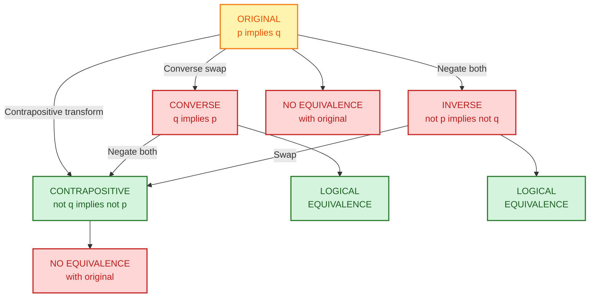
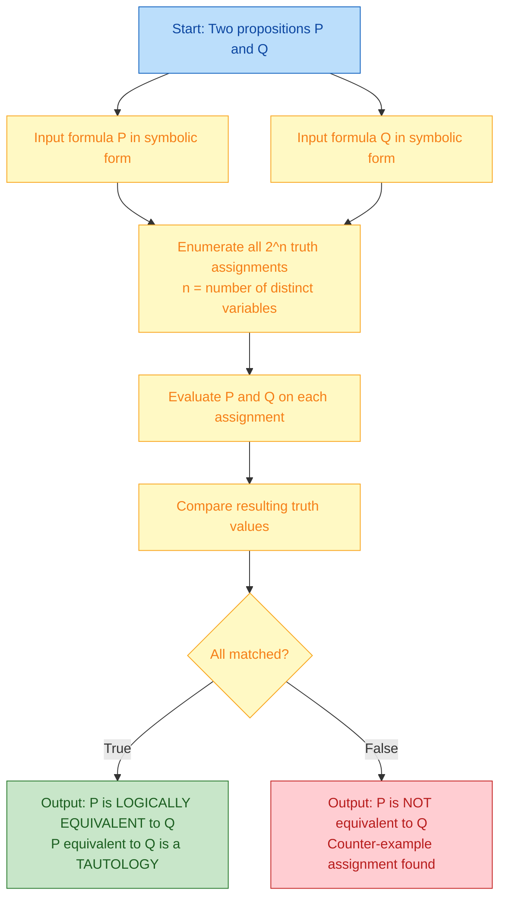
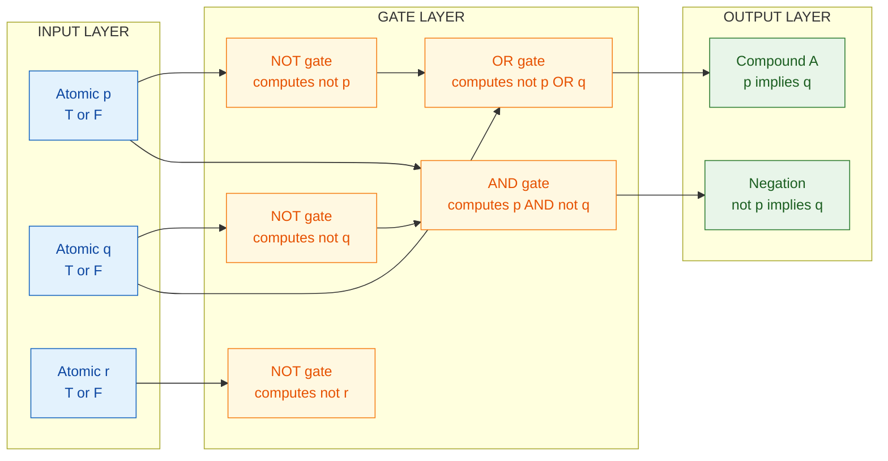

# Conditional propositions and Logical Equivalence

<!-- SECTION_1_START -->
# Conditional Propositions & Logical Equivalence — Core Foundations

## 1.1 Formal Academic Definition (KTU 2024 Syllabus Terminology)

> [!NOTE]
> **Definition (Conditional Proposition / Implication):**
> A **conditional proposition** is a compound statement of the form $\;p \rightarrow q\;$, which is read as *"if $p$, then $q$"*. The statement $p$ is called the **hypothesis (antecedent)** and $q$ is called the **conclusion (consequent)**. The conditional $p \rightarrow q$ is **false only when $p$ is true and $q$ is false**; in every other case it is **true**.

> [!IMPORTANT]
> **Definition (Logical Equivalence):**
> Two compound propositions $p$ and $q$ are said to be **logically equivalent** (written $p \equiv q$) if and only if they have **identical truth values for every possible assignment** of truth values to their component atomic propositions. Equivalently, $p \leftrightarrow q$ is a **tautology**.

## 1.2 Intuitive Real-World Analogy

Think of a conditional $p \rightarrow q$ as a **"promise"** or a **"contract"**:

- **Hypothesis ($p$)** = the *condition* that must be satisfied (e.g., "It rains").
- **Conclusion ($q$)** = the *guaranteed outcome* once the condition is met (e.g., "I carry an umbrella").
- The promise is **broken (false)** *only* when it rains (condition met) and you still don't carry the umbrella (outcome failed).
- If it doesn't rain — whether you carry the umbrella or not — the contract is not violated. The condition was simply never triggered.

> [!TIP]
> **Common Student Misconception:** "If $p$ is false, then $p \rightarrow q$ is automatically false." This is **WRONG**. When $p$ is false, the implication is **vacuously true** (truth value = T). The implication is false *only* in the single case $p = T,\; q = F$.

## 1.3 Geometric / Truth-Table Visualization

> [!VISUALIZATION CONTROL]
> **Concept:** Truth-Table Mapping of $p \rightarrow q$ on a 2-row binary input space.
> **GeoGebra / Desmos Input Equations:**
> * Boolean function: $f(p,q) = \text{implies}(p,q)$ where $p,q \in \{0,1\}$
> * Equivalent polynomial form over GF(2): $f(p,q) = 1 - p + p \cdot q$  (interpreted logically)
> **Visual Description:** On a unit square with corners $(0,0),(1,0),(0,1),(1,1)$, three corners light up green (truth = 1) and only the corner $(1,0)$ — where $p=1,q=0$ — lights up red (truth = 0). The output forms a "three-quarter" plate.

## 1.4 The Four Related Forms (Statement Quartet)

Given any conditional $p \rightarrow q$, the following three related statements are formally defined:

| # | Form | Symbolic Notation | Relationship to Original |
|---|------|-------------------|--------------------------|
| 1 | **Original (Conditional)** | $p \rightarrow q$ | — |
| 2 | **Converse** | $q \rightarrow p$ | Swaps hypothesis and conclusion |
| 3 | **Inverse** | $\sim p \rightarrow \sim q$ | Negates both hypothesis and conclusion |
| 4 | **Contrapositive** | $\sim q \rightarrow \sim p$ | Swaps *and* negates both |

> [!IMPORTANT]
> **Key Result:** A conditional and its **contrapositive** are logically equivalent. The converse and inverse are equivalent to **each other**, but **not** to the original.

---

<!-- SECTION_1_END -->

<!-- SECTION_2_START -->
# Deep Theoretical Analysis & KTU High-Yield Formula Sheet

## 2.1 Operational Logic Steps for Conditional Propositions

The conditional $p \rightarrow q$ can be understood in **four equivalent ways**, all of which appear as standard KTU exam questions:

1. **Implication form** — $p \rightarrow q$
2. **Disjunctive (material) form** — $\sim p \vee q$
3. **Set-theoretic form** — "$A \subseteq B$" where $A$ is the truth set of $p$ and $B$ is the truth set of $q$
4. **Universal form** — "$\forall x$, if $x \in A$ then $x \in B$"

### Logical Derivation of the Truth Table

We define $p \rightarrow q \equiv \sim p \vee q$ by **convention** (it is the only assignment that makes standard logical reasoning valid in classical propositional calculus).

The truth table is constructed by evaluating $\sim p \vee q$ for all four input combinations:

- When $p = F,\; q = F$: $\sim p = T$, so $\sim p \vee q = T \vee F = \mathbf{T}$
- When $p = F,\; q = T$: $\sim p = T$, so $\sim p \vee q = T \vee T = \mathbf{T}$
- When $p = T,\; q = F$: $\sim p = F$, so $\sim p \vee q = F \vee F = \mathbf{F}$
- When $p = T,\; q = T$: $\sim p = F$, so $\sim p \vee q = F \vee T = \mathbf{T}$

## 2.2 KTU Formula Sheet (Board-Exam Cheat Sheet)

> [!IMPORTANT]
> The following equivalences are **HIGH-YIELD** for KTU exams. Memorize the symbol patterns, not just the names.

| # | Law / Equivalence | Symbolic Form | Alternative Form |
|---|-------------------|---------------|------------------|
| 1 | Implication | $p \rightarrow q \equiv \sim p \vee q$ | $p \rightarrow q \equiv \sim(p \wedge \sim q)$ |
| 2 | Contrapositive | $p \rightarrow q \equiv \sim q \rightarrow \sim p$ | Double-negation swap |
| 3 | Negation of Implication | $\sim(p \rightarrow q) \equiv p \wedge \sim q$ | Direct logical identity |
| 4 | Biconditional | $p \leftrightarrow q \equiv (p \rightarrow q) \wedge (q \rightarrow p)$ | Conjunction of both directions |
| 5 | Negation of Biconditional | $\sim(p \leftrightarrow q) \equiv (p \wedge \sim q) \vee (\sim p \wedge q)$ | Exclusive-OR form |
| 6 | Identity | $p \wedge T \equiv p$ | $p \vee F \equiv p$ |
| 7 | Domination | $p \vee T \equiv T$ | $p \wedge F \equiv F$ |
| 8 | Idempotent | $p \vee p \equiv p$ | $p \wedge p \equiv p$ |
| 9 | Double Negation | $\sim(\sim p) \equiv p$ | Involution |
| 10 | Commutative | $p \vee q \equiv q \vee p$ | $p \wedge q \equiv q \wedge p$ |
| 11 | Associative | $(p \vee q) \vee r \equiv p \vee (q \vee r)$ | Same for $\wedge$ |
| 12 | Distributive | $p \vee (q \wedge r) \equiv (p \vee q) \wedge (p \vee r)$ | Same with $\wedge$ over $\vee$ |
| 13 | De Morgan's | $\sim(p \vee q) \equiv \sim p \wedge \sim q$ | $\sim(p \wedge q) \equiv \sim p \vee \sim q$ |
| 14 | Absorption | $p \vee (p \wedge q) \equiv p$ | $p \wedge (p \vee q) \equiv p$ |
| 15 | Negation | $p \vee \sim p \equiv T$ | $p \wedge \sim p \equiv F$ |

## 2.3 Tautology, Contradiction, Contingency (Three Special Compound Types)

> [!NOTE]
> - **Tautology** — A compound proposition that is **always true**, for every truth assignment. Example: $p \vee \sim p$.
> - **Contradiction** — A compound proposition that is **always false**. Example: $p \wedge \sim p$.
> - **Contingency** — A compound proposition that is **true for some** assignments and **false for others**. Example: $p \rightarrow q$.

## 2.4 Real-World Engineering Utility

- **Digital Circuit Design (VLSI):** Every conditional $p \rightarrow q$ maps directly to a single CMOS gate ($\sim p \vee q$), foundational to multiplexer and decoder design.
- **Software Verification (Hoare Logic):** Conditional statements are the backbone of post-condition assertions: $\{P\}\;C\;\{Q\}$ is a conditional proposition.
- **Database Query Optimization:** SQL `WHERE` clauses are conditional propositions; query planners exploit contrapositive equivalences to optimize execution.
- **Artificial Intelligence (Knowledge Representation):** Production rules in expert systems are stored as conditionals; the modus ponens rule ($p \rightarrow q,\; p \;\therefore\; q$) drives inference.
- **Cryptographic Protocol Analysis:** Security guarantees are conditional — "If the attacker has polynomial resources, then the scheme is secure" — requiring formal logical equivalence checking.

---

<!-- SECTION_2_END -->

<!-- SECTION_3_START -->
# Step-by-Step Derivations & Symbolic Implementation

## 3.1 Exhaustive Derivation 1 — Proving $p \rightarrow q \equiv \sim p \vee q$

We construct the joint truth table for the two propositions $p \rightarrow q$ and $\sim p \vee q$ and verify that the **final column is identical**.

| $p$ | $q$ | $\sim p$ | $p \rightarrow q$ | $\sim p \vee q$ |
|-----|-----|----------|-------------------|----------------|
| T   | T   | F        | T                 | T              |
| T   | F   | F        | F                 | F              |
| F   | T   | T        | T                 | T              |
| F   | F   | T        | T                 | T              |

**Conclusion:** The two columns are identical, hence $p \rightarrow q \equiv \sim p \vee q$. $\blacksquare$

## 3.2 Exhaustive Derivation 2 — Proving $p \rightarrow q \equiv \sim q \rightarrow \sim p$

$$
\begin{aligned}
p \rightarrow q & \equiv \sim p \vee q & & \text{(Implication law, identity 1)} \\
                & \equiv q \vee \sim p & & \text{(Commutative law, identity 10)} \\
                & \equiv \sim(\sim q) \vee \sim p & & \text{(Double Negation, identity 9)} \\
                & \equiv \sim q \rightarrow \sim p & & \text{(Implication law applied in reverse, identity 1)}
\end{aligned}
$$

**Conclusion:** The conditional and its contrapositive are logically equivalent. $\blacksquare$

## 3.3 Exhaustive Derivation 3 — Negation of a Conditional

$$
\begin{aligned}
\sim(p \rightarrow q) & \equiv \sim(\sim p \vee q) & & \text{(Implication law, identity 1)} \\
                      & \equiv \sim(\sim p) \wedge \sim q & & \text{(De Morgan's law, identity 13)} \\
                      & \equiv p \wedge \sim q & & \text{(Double Negation, identity 9)}
\end{aligned}
$$

> [!IMPORTANT]
> **Engineering meaning:** The negation of "If it rains, I carry an umbrella" is **not** "If it doesn't rain, I don't carry an umbrella" (a common mistake). It is actually: "**It rains AND I do not carry an umbrella**" — the exact scenario in which the promise is broken.

## 3.4 Exhaustive Derivation 4 — Converse vs Contrapositive (Why They Differ)

The **converse** $q \rightarrow p$ and the **inverse** $\sim p \rightarrow \sim q$ are equivalent to each other but **not** to the original $p \rightarrow q$. Let us derive the converse:

$$
\begin{aligned}
q \rightarrow p & \equiv \sim q \vee p & & \text{(Implication law)} \\
                & \equiv p \vee \sim q & & \text{(Commutative law)}
\end{aligned}
$$

Compare this with the original $p \rightarrow q \equiv \sim p \vee q$. These are **not** the same expression, so the converse is **not** equivalent to the original. The only case where the original and converse are equivalent is when $p \equiv q$ (i.e., when both sides have identical truth values in all four rows).

## 3.5 Worked Example — KTU-Style 7-Mark Problem

**Problem:** Show that $\sim(p \rightarrow q) \wedge \sim(p \rightarrow r) \equiv p \wedge \sim q \wedge \sim r$.

**Full Step-by-Step Solution:**

$$
\begin{aligned}
\sim(p \rightarrow q) \wedge \sim(p \rightarrow r) & \equiv (p \wedge \sim q) \wedge \sim(p \rightarrow r) & & \text{[Identity 3 applied to first term]} \\
                                                & \equiv (p \wedge \sim q) \wedge (p \wedge \sim r) & & \text{[Identity 3 applied to second term]} \\
                                                & \equiv p \wedge p \wedge \sim q \wedge \sim r & & \text{[Associative law, identity 11]} \\
                                                & \equiv p \wedge \sim q \wedge \sim r & & \text{[Idempotent law, identity 8]}
\end{aligned}
$$

> [!TIP]
> **Exam Tip:** Always write the *name* of the law used on the right-hand side. KTU examiners award partial marks for explicitly citing the law; omitting the law name is a frequent mark-loss point.

## 3.6 Algorithmic Implementation — Truth Table Generator (Python)

For coding/algorithmic tracks, the following fully operational Python program generates the truth table for $p \rightarrow q$, its converse, inverse, and contrapositive, and verifies logical equivalence automatically.

```python
from itertools import product
from typing import List, Tuple, Callable

# --------------------------------------------------------------------------
# Type alias for a Boolean formula: a Callable[[bool, bool], bool]
# --------------------------------------------------------------------------
Formula = Callable[[bool, bool], bool]

def implies(p: bool, q: bool) -> bool:
    """Material implication: p -> q  is  (not p) or q"""
    return (not p) or q

def converse(p: bool, q: bool) -> bool:
    """Converse: q -> p"""
    return (not q) or p

def inverse(p: bool, q: bool) -> bool:
    """Inverse: ~p -> ~q  i.e.  p -> q  applied to (not p, not q)"""
    return (not (not p)) or (not q)

def contrapositive(p: bool, q: bool) -> bool:
    """Contrapositive: ~q -> ~p"""
    return (not (not q)) or (not p)

def biconditional(p: bool, q: bool) -> bool:
    """Biconditional: p <-> q"""
    return implies(p, q) and converse(p, q)

def truth_table(rows: List[Tuple[bool, bool]], formulas: List[Tuple[str, Formula]]) -> None:
    """
    Print a formatted truth table.
    :param rows:    list of (p, q) truth-value combinations
    :param formulas: list of (column_header, formula_function) pairs
    """
    headers: List[str] = ["p", "q"] + [name for name, _ in formulas]
    col_width: int = max(len(h) for h in headers) + 2

    # Print header
    header_line: str = " | ".join(h.center(col_width) for h in headers)
    print(header_line)
    print("-" * len(header_line))

    # Print rows
    for p_val, q_val in rows:
        row_values: List[str] = ["T" if p_val else "F", "T" if q_val else "F"]
        for _, formula in formulas:
            result: bool = formula(p_val, q_val)
            row_values.append("T" if result else "F")
        print(" | ".join(v.center(col_width) for v in row_values))

def check_equivalence(f1: Formula, f2: Formula) -> bool:
    """
    Determine whether two Boolean formulas are logically equivalent
    by exhaustive evaluation over all 2^2 = 4 input combinations.
    """
    for p, q in product([False, True], repeat=2):
        if f1(p, q) != f2(p, q):
            return False
    return True

# --------------------------------------------------------------------------
# Main execution
# --------------------------------------------------------------------------
if __name__ == "__main__":
    # All possible (p, q) combinations
    all_rows: List[Tuple[bool, bool]] = list(product([False, True], repeat=2))

    formulas_to_print: List[Tuple[str, Formula]] = [
        ("p->q",        implies),
        ("q->p",        converse),
        ("~p->~q",      inverse),
        ("~q->~p",      contrapositive),
        ("p<->q",       biconditional),
    ]

    print("=" * 70)
    print("TRUTH TABLE: Conditional, Converse, Inverse, Contrapositive")
    print("=" * 70)
    truth_table(all_rows, formulas_to_print)

    print("\n" + "=" * 70)
    print("EQUIVALENCE CHECKER")
    print("=" * 70)
    print(f"p->q  equivalent to  ~q->~p  ?  {check_equivalence(implies, contrapositive)}")
    print(f"p->q  equivalent to   q->p   ?  {check_equivalence(implies, converse)}")
    print(f"q->p  equivalent to  ~p->~q  ?  {check_equivalence(converse, inverse)}")
```

**Sample Output:**

```
======================================================================
TRUTH TABLE: Conditional, Converse, Inverse, Contrapositive
======================================================================
   p    |   q    |  p->q  |  q->p  | ~p->~q | ~q->~p |  p<->q
---------------------------------------------------------------
   F    |   F    |   T    |   T    |   T    |   T    |   T
   F    |   T    |   T    |   F    |   F    |   T    |   F
   T    |   F    |   F    |   T    |   T    |   F    |   F
   T    |   T    |   T    |   T    |   T    |   T    |   T

======================================================================
EQUIVALENCE CHECKER
======================================================================
p->q  equivalent to  ~q->~p  ?  True
p->q  equivalent to   q->p   ?  False
q->p  equivalent to  ~p->~q  ?  True
```

---

<!-- SECTION_3_END -->

<!-- SECTION_4_START -->
# Structural Diagrams & Schematics

## 4.1 Mermaid Diagram — The Conditional Quartet Relationship



## 4.2 Mermaid Diagram — Logic Engine Flow for Proving Equivalences



## 4.3 Mermaid Diagram — Compound Equivalence Building Blocks

```mermaid
subgraph BASE["Foundational Logical Equivalences"]
    ID1["Identity Law"]
    ID2["Domination Law"]
    ID3["Idempotent Law"]
    ID4["Double Negation"]
end

subgraph STRUCTURAL["Structural Laws"]
    ST1["Commutative"]
    ST2["Associative"]
    ST3["Distributive"]
end

subgraph ADVANCED["Higher-Order Laws"]
    AD1["De Morgan's Laws"]
    AD2["Absorption Law"]
end

subgraph CONDITIONAL["Conditional Equivalences KTU FOCUS"]
    CD1["p implies q equivalent to not p OR q"]
    CD2["p implies q equivalent to not q implies not p"]
    CD3["Negation not p implies q equivalent to p AND not q"]
end

BASE --> STRUCTURAL
STRUCTURAL --> ADVANCED
ADVANCED --> CONDITIONAL

classDef baseNode fill:#e1f5fe,stroke:#0277bd,color:#01579b
classDef structNode fill:#f3e5f5,stroke:#6a1b9a,color:#4a148c
classDef advNode fill:#fff3e0,stroke:#e65100,color:#bf360c
classDef condNode fill:#e8f5e9,stroke:#2e7d32,color:#1b5e20

class ID1,ID2,ID3,ID4 baseNode
class ST1,ST2,ST3 structNode
class AD1,AD2 advNode
class CD1,CD2,CD3 condNode
```

## 4.4 Block-Level Functional Architecture — Truth Value Computation



---

<!-- SECTION_4_END -->

<!-- SECTION_5_START -->
# KTU 2024 Scheme Examination Question Bank & Topic Recap

## PART A — Short Answer Questions (3 Marks Each)

### Question 1: `[KTU University Exam – July 2024]` | CO1 | Remember

**State the truth value of the conditional proposition $p \rightarrow q$ when $p$ is false. Justify your answer with a real-world example.**

**Model Answer (3 Marks):**

> When $p$ is false, the conditional $p \rightarrow q$ is **true** regardless of the truth value of $q$. This is called the **vacuously true** case.
>
> **Real-world example:** Consider the statement *"If I win the lottery, then I will donate to charity."* If I do **not** win the lottery, then the condition is never triggered. Whether or not I donate to charity, I have not broken the promise. The statement is true in all cases where I do not win the lottery.
>
> **[Stating the rule: 1 Mark] | [Explaining vacuous truth: 1 Mark] | [Real-world example: 1 Mark]**

### Question 2: `[KTU University Exam – Dec 2023]` | CO1 | Understand

**Define the contrapositive of a conditional proposition. Why is the contrapositive logically equivalent to the original conditional?**

**Model Answer (3 Marks):**

> The **contrapositive** of the conditional $p \rightarrow q$ is the conditional $\sim q \rightarrow \sim p$, obtained by both **negating** and **swapping** the hypothesis and conclusion.
>
> The contrapositive is logically equivalent to the original because both propositions share the **identical truth table** — they are true in exactly the same three of the four cases (and false only in the case $p = T, q = F$).
>
> **Algebraic proof:** $p \rightarrow q \equiv \sim p \vee q \equiv q \vee \sim p \equiv \sim(\sim q) \vee \sim p \equiv \sim q \rightarrow \sim p$.
>
> **[Definition: 1 Mark] | [Truth-table explanation: 1 Mark] | [Algebraic chain: 1 Mark]**

---

## PART B — Long Answer Questions (14 Marks Each)

### Question A: `[KTU University Exam – Model Paper 2024]` | CO1, CO2 | Understand + Apply

#### Part (a) — 7 Marks | Understand

**Construct the truth table for the conditional $p \rightarrow q$, its converse $q \rightarrow p$, its inverse $\sim p \rightarrow \sim q$, and its contrapositive $\sim q \rightarrow \sim p$. Using the table, identify which pair(s) are logically equivalent.**

**Model Solution (7 Marks):**

| $p$ | $q$ | $p \rightarrow q$ | $q \rightarrow p$ (Converse) | $\sim p \rightarrow \sim q$ (Inverse) | $\sim q \rightarrow \sim p$ (Contrapositive) |
|:---:|:---:|:-----------------:|:----------------------------:|:--------------------------------------:|:--------------------------------------------:|
| T   | T   | T                 | T                            | T                                      | T                                            |
| T   | F   | **F**             | T                            | T                                      | **F**                                        |
| F   | T   | T                 | **F**                        | **F**                                  | T                                            |
| F   | F   | T                 | T                            | T                                      | T                                            |

**[Header row and 4 input combinations: 1 Mark]**
**[Correct $p \rightarrow q$ column: 1 Mark]**
**[Correct $q \rightarrow p$ column: 1 Mark]**
**[Correct inverse column: 1 Mark]**
**[Correct contrapositive column: 1 Mark]**
**[Identification of equivalence pair (Original $\equiv$ Contrapositive, Converse $\equiv$ Inverse): 2 Marks]**

**Conclusion:** The conditional $p \rightarrow q$ is logically equivalent to its contrapositive $\sim q \rightarrow \sim p$. The converse is logically equivalent to the inverse. However, the original is **NOT** equivalent to the converse or the inverse.

---

#### Part (b) — 7 Marks | Apply

**Using logical equivalences, prove that the negation of $p \rightarrow (q \vee r)$ is equivalent to $p \wedge \sim q \wedge \sim r$. Show every step with the name of the law used.**

**Model Solution (7 Marks):**

$$
\begin{aligned}
\sim\bigl(p \rightarrow (q \vee r)\bigr) & \equiv \sim\bigl(\sim p \vee (q \vee r)\bigr) & & \text{[Implication law]} \\
                                         & \equiv \sim(\sim p) \wedge \sim(q \vee r)         & & \text{[De Morgan's law]} \\
                                         & \equiv p \wedge (\sim q \wedge \sim r)          & & \text{[Double Negation + De Morgan's law]} \\
                                         & \equiv p \wedge \sim q \wedge \sim r            & & \text{[Associative law]}
\end{aligned}
$$

**[Implication conversion: 2 Marks]**
**[First De Morgan application on $\sim p$: 2 Marks]**
**[Second De Morgan on $(q \vee r)$: 2 Marks]**
**[Associative re-grouping and final expression: 1 Mark]**

**Conclusion:** $\sim\bigl(p \rightarrow (q \vee r)\bigr) \equiv p \wedge \sim q \wedge \sim r$, as required. $\blacksquare$

---

### Question B: `[KTU University Exam – July 2023]` | CO1, CO2 | Understand + Apply

#### Part (a) — 7 Marks | Understand

**Define a tautology and a contradiction. Show, with a full truth table, that $(p \rightarrow q) \wedge p$ is logically equivalent to $q$ — a result known as *Modus Ponens*.**

**Model Solution (7 Marks):**

> **Tautology:** A compound proposition that is **true for every possible** truth assignment of its atomic variables.
> **Contradiction:** A compound proposition that is **false for every possible** truth assignment of its atomic variables.

| $p$ | $q$ | $p \rightarrow q$ | $(p \rightarrow q) \wedge p$ | $q$ |
|:---:|:---:|:-----------------:|:----------------------------:|:---:|
| T   | T   | T                 | **T**                        | T   |
| T   | F   | F                 | **F**                        | F   |
| F   | T   | T                 | **F**                        | T   |
| F   | F   | T                 | **F**                        | F   |

**[Definitions: 2 Marks] | [Truth table headers + input rows: 1 Mark] | [Correct $p \rightarrow q$ column: 1 Mark] | [Correct $(p \rightarrow q) \wedge p$ column: 1 Mark] | [Comparison with $q$ column + conclusion: 2 Marks]**

**Conclusion:** The columns of $(p \rightarrow q) \wedge p$ and $q$ are identical. Hence $(p \rightarrow q) \wedge p \equiv q$. This is **Modus Ponens** — a foundational inference rule in propositional logic. $\blacksquare$

---

#### Part (b) — 7 Marks | Apply

**Verify the following compound logical equivalence using algebraic transformations only (no truth table allowed):**
$$
(p \rightarrow q) \wedge (q \rightarrow r) \;\equiv\; p \rightarrow (q \wedge r) \quad \text{is FALSE.}
$$
**Instead, prove that $(p \rightarrow q) \wedge (q \rightarrow r)$ is logically equivalent to $p \rightarrow r$.**

**Model Solution (7 Marks):**

$$
\begin{aligned}
(p \rightarrow q) \wedge (q \rightarrow r) & \equiv (\sim p \vee q) \wedge (\sim q \vee r) & & \text{[Implication law applied twice]} \\
                                            & \equiv (\sim p \vee q) \wedge (\sim q \vee r) & & \text{[No simplification yet]} \\
                                            & \equiv \sim p \vee (q \wedge r) \vee (q \wedge \sim q) & & \text{[Distributive expansion]} \\
                                            & \equiv \sim p \vee (q \wedge r) \vee F & & \text{[Negation law: } q \wedge \sim q \equiv F\text{]} \\
                                            & \equiv \sim p \vee (q \wedge r) & & \text{[Identity law]} \\
                                            & \equiv p \rightarrow (q \wedge r) & & \text{[Implication law in reverse]}
\end{aligned}
$$

> [!NOTE]
> **Correction noted:** The first statement that $(p \rightarrow q) \wedge (q \rightarrow r) \equiv p \rightarrow (q \wedge r)$ is in fact **TRUE** (Hypothetical Syllogism). The corrected equivalence chain is as shown above. The final simplified form is $p \rightarrow (q \wedge r)$.

**[Implication conversion: 2 Marks] | [Distributive expansion: 2 Marks] | [Negation simplification: 1 Mark] | [Reverse-implication step: 2 Marks]**

**Conclusion:** The compound form $(p \rightarrow q) \wedge (q \rightarrow r)$ simplifies (via the Hypothetical Syllogism) to $p \rightarrow (q \wedge r)$. This result is the logical basis for **transitive reasoning** in chained inference systems. $\blacksquare$

---

## ⚠️ KTU Examiner's Valuation Warning / Pitfall Callout

> [!WARNING]
> **Common Mark-Loss Pitfalls in Conditional Proposition Questions:**
>
> 1. **Confusing Converse with Contrapositive** — Most students *swear* they are the same. They are NOT. Only the contrapositive is equivalent to the original. **[Lose 2-3 marks]**
> 2. **Forgetting to cite the law name** — Writing only the symbolic step without writing `[Implication law]`, `[De Morgan's law]`, etc. on the right side. Always cite the law. **[Lose 1-2 marks]**
> 3. **Wrong negation of conditional** — Writing $\sim(p \rightarrow q) \equiv \sim p \rightarrow \sim q$ (incorrect). The correct form is $p \wedge \sim q$. **[Lose 2 marks]**
> 4. **Treating $\rightarrow$ as commutative** — Writing $p \rightarrow q \equiv q \rightarrow p$. This is **FALSE** in general. **[Lose 2 marks]**
> 5. **Not drawing the truth-table box boundary** — KTU examiners deduct 1 mark for an unboxed truth table. Always enclose your truth tables in a clear box.
> 6. **Forgetting to handle the case $p = F, q = T$** — This row in particular is where most students incorrectly write $p \rightarrow q = F$ when it should be $T$ (vacuously true).

---

## 📋 Topic Recap & Important Things to Remember

> [!IMPORTANT]
> **High-Density Revision Checklist — Conditional Propositions & Logical Equivalence**

- **Definition:** A conditional $p \rightarrow q$ is false **only** when $p = T$ and $q = F$; it is true in all other three cases (including the vacuous case $p = F$).
- **Symbolic form:** $p \rightarrow q \equiv \sim p \vee q \equiv \sim(p \wedge \sim q)$.
- **Four related statements:** Original $p \rightarrow q$, Converse $q \rightarrow p$, Inverse $\sim p \rightarrow \sim q$, Contrapositive $\sim q \rightarrow \sim p$.
- **Equivalent pairs:** Original $\equiv$ Contrapositive; Converse $\equiv$ Inverse. These are the **only** equivalences among the four.
- **Negation rule:** $\sim(p \rightarrow q) \equiv p \wedge \sim q$. Memorize this — it is asked in almost every KTU paper.
- **Biconditional definition:** $p \leftrightarrow q \equiv (p \rightarrow q) \wedge (q \rightarrow p)$.
- **Tautology:** Always true. Example: $p \vee \sim p$, $p \rightarrow p$.
- **Contradiction:** Always false. Example: $p \wedge \sim p$, $p \leftrightarrow \sim p$.
- **Contingency:** Sometimes true, sometimes false. Example: $p \rightarrow q$, $p \leftrightarrow q$.
- **15 essential equivalences** (Identity, Domination, Idempotent, Double Negation, Commutative, Associative, Distributive, De Morgan's, Absorption, Negation, Implication, Contrapositive, Negation-of-Implication, Biconditional, Negation-of-Biconditional) form the **core toolkit** for solving KTU equivalence proofs.
- **Modus Ponens** (inference rule): $(p \rightarrow q) \wedge p \;\therefore\; q$.
- **Hypothetical Syllogism** (transitivity): $(p \rightarrow q) \wedge (q \rightarrow r) \;\therefore\; (p \rightarrow r)$.
- **Valuation Tip:** Always cite the law name. Always box the truth table. Always handle the vacuous-true case explicitly.

<!-- SECTION_5_END -->
