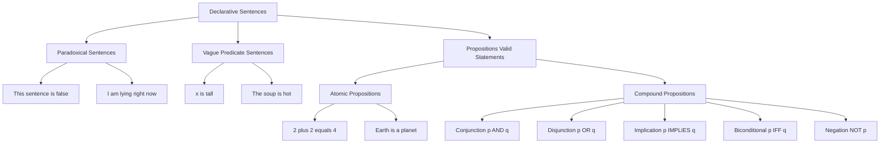
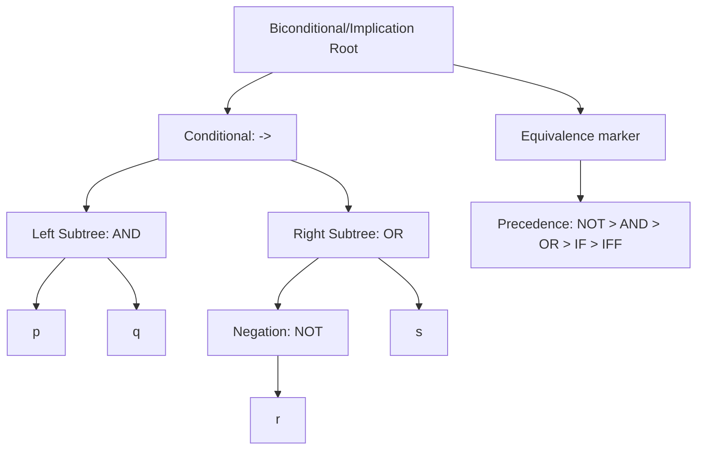
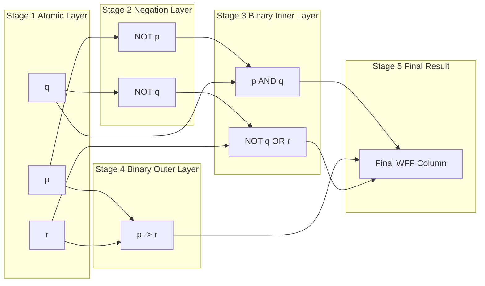
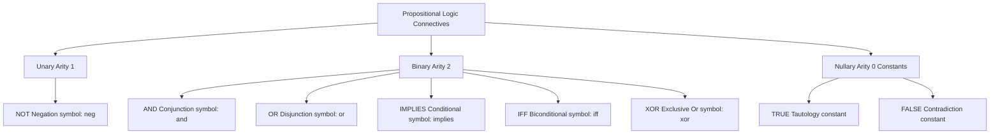

# Introduction to Logic: Propositional Logic

<!-- SECTION_1_START -->
# Introduction to Logic: Propositional Logic

## 1.1 Formal Definition (KTU 2024 Syllabus Terminology)

**Proposition (Statement):** A declarative sentence that is either unambiguously **true (T)** or **unambiguously false (F)**, but never both, neither, or in-between, within the context of a given mathematical model.

> [!NOTE]
> **KTU 2024 Definition Highlight**
> In Discrete Mathematical Structures (PCITT205), a proposition is a *declarative* sentence that has a definite truth value. Questions, commands, exclamations, paradoxes, and sentences involving vague predicates (like *tall*, *young*) are **NOT propositions**.

### Formal Notation

Let $p, q, r, \ldots$ denote atomic propositions. The set of *propositional variables* together with the set of *logical connectives* forms the alphabet of propositional logic.

$$
\Sigma \;=\; \{ p, q, r, \ldots \} \;\cup\; \{\neg, \wedge, \vee, \rightarrow, \leftrightarrow, (, )\}
$$

## 1.2 Conceptual Analogy & Intuition

> [!IMPORTANT]
> **The "Light Switch" Analogy**
> Think of a proposition as a *light switch* in your room. At any instant, the switch is either **ON (T)** or **OFF (F)** — there is no dim, half-on, or "maybe" state. Propositional logic is the wiring diagram that tells you how combinations of switches control the master light.
>
> * $p$ = "Switch A is ON"
> * $q$ = "Switch B is ON"
> * $p \wedge q$ = "Both switches must be ON for the lamp to glow" (Series circuit)
> * $p \vee q$ = "At least one switch must be ON for the lamp to glow" (Parallel circuit)
> * $p \rightarrow q$ = "If Switch A is ON, then Switch B must be ON" (Implication wire)
> * $\neg p$ = "Switch A is OFF" (Inverter)

### Atomic vs. Compound Propositions

| Type | Description | Example |
| :--- | :--- | :--- |
| **Atomic (Primitive)** | A single, indivisible declarative sentence. | "2 + 2 = 4" |
| **Compound (Molecular)** | Built using one or more logical connectives. | "2 + 2 = 4 **and** 3 + 1 = 4" |

> [!NOTE]
> **Non-Propositions (KTU Frequently Tested)**
> 1. **Questions:** *"What time is it?"*
> 2. **Commands:** *"Close the door."*
> 3. **Exclamations:** *"Wow, what a sunset!"*
> 4. **Paradoxes:** *"This sentence is false."* (Leads to contradiction)
> 5. **Vague predicates:** *"x is tall."* (Requires predicate logic, not propositional)

## 1.3 GeoGebra / Desmos Visualization

> [!VISUALIZATION CONTROL]
> **Concept:** Truth-Value Distribution of $p \wedge q$ on a 2D Binary Grid
> **GeoGebra / Desmos Input Equations:**
> * `f(x, y) = If(x == 1 ∧ y == 1, 1, 0)` over `x, y in {0, 1}`
> * `g(x, y) = If(x == 1 ∨ y == 1, 1, 0)` over `x, y in {0, 1}`
> **Visual Description:** Plot four points at $(0,0), (0,1), (1,0), (1,1)$. Function $f$ lights up **only** the point $(1,1)$ — that is the geometric picture of logical AND. Function $g$ lights up the other three points — the geometric picture of logical OR. The **exclusive OR** $h(x,y) = f \oplus g$ lights up exactly two points: $(0,1)$ and $(1,0)$, forming a perfect "diagonal" — a classic KTU visualization.
<!-- SECTION_1_END -->

<!-- SECTION_2_START -->
# Deep Theoretical Analysis & KTU High-Yield Formula Sheet

## 2.1 The Five (Six) Fundamental Logical Connectives

Propositional logic uses a small, complete set of **operators** (also called *functors* or *sentential connectives*). KTU 2024 expects familiarity with the following:

### 2.1.1 Negation (NOT) — $\neg p$

* **Read as:** "not $p$", "it is not the case that $p$"
* **Truth table:** A single-column inverter.
* **Semantic role:** Flips the truth value.

$$
\begin{aligned}
\neg(\neg p) &\equiv p \quad \text{(Double Negation / Involution Law)}
\end{aligned}
$$

### 2.1.2 Conjunction (AND) — $p \wedge q$

* **Read as:** "$p$ **and** $q$"
* **Truth table:** True only when **both** $p$ and $q$ are true.
* **Bitwise analogy:** $p \wedge q \equiv \min(p, q)$ when T=1, F=0.

### 2.1.3 Disjunction (OR) — $p \vee q$

* **Read as:** "$p$ **or** $q$" (inclusive OR in classical logic)
* **Truth table:** False only when **both** $p$ and $q$ are false.

> [!IMPORTANT]
> **Inclusive vs. Exclusive OR**
> In KTU propositional logic, $\vee$ is **inclusive** — both can be true. The **exclusive OR** is denoted $p \oplus q$ and is defined as $(p \vee q) \wedge \neg(p \wedge q)$.

### 2.1.4 Conditional (Implication) — $p \rightarrow q$

* **Read as:** "If $p$ then $q$", "$p$ **implies** $q$"
* $p$ is called the **hypothesis / antecedent**, $q$ is the **conclusion / consequent**.
* **Truth table:** False **only** when $p$ = T and $q$ = F.
* **Equivalent forms** (extremely important for KTU problems):
  1. $p \rightarrow q \equiv \neg p \vee q$ *(Material Implication)*
  2. $p \rightarrow q \equiv \neg q \rightarrow \neg p$ *(Contrapositive)*
  3. $\neg(p \rightarrow q) \equiv p \wedge \neg q$

> [!NOTE]
> **Why is $F \rightarrow T$ true?**
> In classical logic, a promise $p$ that turns out false (F) does not break a consequent $q$ that turns out true (T). Material implication is *truth-functional*, not *causal*.

### 2.1.5 Biconditional (Equivalence) — $p \leftrightarrow q$

* **Read as:** "$p$ **if and only if** $q$", "$p$ **is equivalent to** $q$"
* **Truth table:** True when $p$ and $q$ have the **same** truth value.
* **Identity:** $p \leftrightarrow q \equiv (p \rightarrow q) \wedge (q \rightarrow p)$.

### 2.1.6 Summary Truth Table (KTU Board Standard)

| $p$ | $q$ | $\neg p$ | $p \wedge q$ | $p \vee q$ | $p \rightarrow q$ | $p \leftrightarrow q$ | $p \oplus q$ |
| :---: | :---: | :---: | :---: | :---: | :---: | :---: | :---: |
| T | T | F | **T** | **T** | **T** | **T** | F |
| T | F | F | F | **T** | **F** | F | **T** |
| F | T | T | F | **T** | **T** | F | **T** |
| F | F | T | F | F | **T** | **T** | F |

## 2.2 Tautology, Contradiction, Contingency

Let $\phi$ be a compound proposition with $n$ atomic components.

* **Tautology ($\top$):** $\phi$ is true in *every* one of the $2^n$ rows.
  * Example: $p \vee \neg p$ (Law of Excluded Middle)
* **Contradiction ($\bot$):** $\phi$ is false in *every* one of the $2^n$ rows.
  * Example: $p \wedge \neg p$ (Law of Non-Contradiction)
* **Contingency:** $\phi$ is true in *some* rows and false in *others*.
  * Example: $p \rightarrow q$

## 2.3 Logical Equivalence ($\equiv$)

Two propositions $\phi$ and $\psi$ are **logically equivalent**, written $\phi \equiv \psi$, iff they have **identical** final columns in the truth table. KTU 2024 expects fluency with the following identity set:

### KTU High-Yield Formula Sheet

> [!IMPORTANT]
> **Identity Reference (Memorize the entire set)**

| Identity | Form | Name |
| :--- | :--- | :--- |
| $\neg(\neg p) \equiv p$ | Double Negation | Involution |
| $p \vee p \equiv p$ | Idempotent Law | Idempotence |
| $p \wedge p \equiv p$ | Idempotent Law | Idempotence |
| $p \vee q \equiv q \vee p$ | Commutative | Commutativity |
| $p \wedge q \equiv q \wedge p$ | Commutative | Commutativity |
| $(p \vee q) \vee r \equiv p \vee (q \vee r)$ | Associative | Associativity |
| $(p \wedge q) \wedge r \equiv p \wedge (q \wedge r)$ | Associative | Associativity |
| $p \wedge (q \vee r) \equiv (p \wedge q) \vee (p \wedge r)$ | Distributive | Distribution |
| $p \vee (q \wedge r) \equiv (p \vee q) \wedge (p \vee r)$ | Distributive | Distribution |
| $\neg(p \wedge q) \equiv \neg p \vee \neg q$ | De Morgan's | Dual Negation |
| $\neg(p \vee q) \equiv \neg p \wedge \neg q$ | De Morgan's | Dual Negation |
| $p \vee (p \wedge q) \equiv p$ | Absorption | Absorption |
| $p \wedge (p \vee q) \equiv p$ | Absorption | Absorption |
| $p \rightarrow q \equiv \neg p \vee q$ | Material Implication | Implication |
| $p \rightarrow q \equiv \neg q \rightarrow \neg p$ | Contrapositive | Contrapositive |
| $p \leftrightarrow q \equiv (p \rightarrow q) \wedge (q \rightarrow p)$ | Equivalence | Biconditional |
| $p \oplus q \equiv (p \vee q) \wedge \neg(p \wedge q)$ | XOR Definition | Exclusive Or |

> [!NOTE]
> **Engineering Utility of These Identities**
> 1. **Digital Circuit Minimization:** Each identity above corresponds to a Boolean algebra simplification — the foundation of Karnaugh maps and two-level logic synthesis in VLSI design.
> 2. **Compiler Optimization:** Constant folding and short-circuit evaluation in C/Java/Python depend directly on these laws.
> 3. **Automated Theorem Proving (SAT solvers):** CNF conversion uses distributive and De Morgan's laws as the *core rewriting engine*.
> 4. **Database Query Simplification:** SQL `WHERE` clause optimization.

## 2.4 Propositional Logic Formulas (WFF)

A **Well-Formed Formula (WFF)** is defined inductively:

1. Every propositional variable $p, q, r, \ldots$ is a WFF.
2. If $\phi$ is a WFF, then $\neg \phi$ is a WFF.
3. If $\phi$ and $\psi$ are WFFs, then $(\phi \wedge \psi)$, $(\phi \vee \psi)$, $(\phi \rightarrow \psi)$, $(\phi \leftrightarrow \psi)$ are WFFs.
4. **Closure:** Nothing else is a WFF.

> [!IMPORTANT]
> **Operator Precedence (Highest to Lowest)**
> $$\neg \;\; > \;\; \wedge \;\; > \;\; \vee \;\; > \;\; \rightarrow \;\; > \;\; \leftrightarrow$$
> Without this rule, an expression like $\neg p \wedge q$ means $(\neg p) \wedge q$, NOT $\neg(p \wedge q)$.

## 2.5 Translating English to Propositional Logic

| English Phrase | Logical Form |
| :--- | :--- |
| "$p$ but $q$" | $p \wedge q$ |
| "Neither $p$ nor $q$" | $\neg p \wedge \neg q$ |
| "$p$ despite $q$" | $p \wedge q$ |
| "$p$ unless $q$" | $\neg q \rightarrow p$ (or equivalently $p \vee q$) |
| "$p$ because $q$" | $q \rightarrow p$ |
| "$p$ only if $q$" | $p \rightarrow q$ |
| "If $p$ then $q$" | $p \rightarrow q$ |
| "$p$ is sufficient for $q$" | $p \rightarrow q$ |
| "$p$ is necessary for $q$" | $q \rightarrow p$ |
<!-- SECTION_2_END -->

<!-- SECTION_3_START -->
# Step-by-Step Derivations & Worked Examples

## 3.1 Example 1: Truth Table Construction for a Compound Proposition

> [!IMPORTANT]
> **Problem:** Construct the truth table of $\phi = (p \rightarrow q) \leftrightarrow (\neg p \vee q)$.

### Step-by-Step Construction

**Step 1: Identify atomic components.**
The atoms are $p$ and $q$. Therefore the table will have $2^2 = 4$ rows.

**Step 2: Enumerate all atomic combinations.**

| $p$ | $q$ |
| :---: | :---: |
| T | T |
| T | F |
| F | T |
| F | F |

**Step 3: Compute sub-expression columns from inside out.**
We need $\neg p$ (column C), then $p \rightarrow q$ (column D), then $\neg p \vee q$ (column E), then the biconditional (column F).

**Step 4: Fill in column C — $\neg p$.**

* Row 1: $p = T \Rightarrow \neg p = F$
* Row 2: $p = T \Rightarrow \neg p = F$
* Row 3: $p = F \Rightarrow \neg p = T$
* Row 4: $p = F \Rightarrow \neg p = T$

**Step 5: Fill in column D — $p \rightarrow q$.**
Using the rule "false only when T→F":

* Row 1: T→T = **T**
* Row 2: T→F = **F**
* Row 3: F→T = **T**
* Row 4: F→F = **T**

**Step 6: Fill in column E — $\neg p \vee q$.**
Using "false only when both false":

* Row 1: F∨T = **T**
* Row 2: F∨F = **F**
* Row 3: T∨T = **T**
* Row 4: T∨F = **T**

**Step 7: Fill in column F — D $\leftrightarrow$ E.**
Biconditional is true when both sides match:

* Row 1: T↔T = **T**
* Row 2: F↔F = **T**
* Row 3: T↔T = **T**
* Row 4: T↔T = **T**

**Step 8: Final assembled table.**

| $p$ | $q$ | $\neg p$ | $p \rightarrow q$ | $\neg p \vee q$ | $(p \rightarrow q) \leftrightarrow (\neg p \vee q)$ |
| :---: | :---: | :---: | :---: | :---: | :---: |
| T | T | F | T | T | **T** |
| T | F | F | F | F | **T** |
| F | T | T | T | T | **T** |
| F | F | T | T | T | **T** |

**Conclusion:** The final column is **all T's** $\Rightarrow$ $\phi$ is a **Tautology**. This *proves* the material implication identity $p \rightarrow q \equiv \neg p \vee q$ for the KTU board.

> [!NOTE]
> **Valuation Key Insight (2 Marks for stating conclusion):**
> A compound proposition is a tautology if and only if its final column contains only **T** values across all $2^n$ rows. Students often mistakenly count the number of T's; what matters is whether **any F** appears.

## 3.2 Example 2: Proving Equivalence Using Identities

> [!IMPORTANT]
> **Problem:** Show that $\neg(p \rightarrow q) \wedge \neg(q \rightarrow p) \equiv p \wedge q \wedge \neg p \wedge \neg q$ is a contradiction (i.e., $\equiv F$).

### Step-by-Step Algebraic Manipulation

$$
\begin{aligned}
&\neg(p \rightarrow q) \wedge \neg(q \rightarrow p) \\
&\equiv \neg(\neg p \vee q) \wedge \neg(\neg q \vee p) \quad &&\text{[Step A: Material Implication, } p \rightarrow q \equiv \neg p \vee q \text{]} \\
&\equiv (p \wedge \neg q) \wedge (q \wedge \neg p) \quad &&\text{[Step B: De Morgan's, } \neg(A \vee B) \equiv \neg A \wedge \neg B \text{]} \\
&\equiv (p \wedge \neg p) \wedge (q \wedge \neg q) \quad &&\text{[Step C: Commutative and Associative rearrangement]} \\
&\equiv F \wedge F \quad &&\text{[Step D: Law of Non-Contradiction, } p \wedge \neg p \equiv F \text{]} \\
&\equiv F \quad &&\text{[Step E: Domination, } F \wedge X \equiv F \text{]}
\end{aligned}
$$

**Conclusion:** The proposition reduces to **F**, hence it is a **contradiction**.

## 3.3 Example 3: Translation from English

> [!IMPORTANT]
> **Problem:** Translate: *"If it is raining and I do not have an umbrella, then I will get wet, unless I take a taxi."*

Let:
* $r$: "It is raining"
* $u$: "I have an umbrella"
* $w$: "I will get wet"
* $t$: "I take a taxi"

### Step-by-Step Translation

**Premise clause:** "It is raining **and** I do not have an umbrella" $\rightarrow r \wedge \neg u$

**Exception clause:** "unless I take a taxi" $\rightarrow \neg t$ triggers the exception. Recall: "$P$ unless $Q$" $\equiv \neg Q \rightarrow P$ $\equiv P \vee Q$.

So the full sentence structure is:
> "*If* (raining AND no umbrella), *then* I get wet, *unless* I take a taxi."

The "unless $t$" allows a taxi to **veto** the wetting. In logic, this becomes:

$$
(r \wedge \neg u) \rightarrow (w \vee t)
$$

Equivalently, by contrapositive / material implication:

$$
\neg r \vee u \vee w \vee t
$$

## 3.4 Example 4: Symbolic (Python) Verification of a Tautology

For algorithmic / coding students, here is a fully operational Python verification of the material implication identity:

```python
"""
File: tautology_check.py
Course: Discrete Mathematical Structures (PCITT205) - KTU 2024
Purpose: Verify the tautology (p -> q) <-> (~p v q) for all truth assignments.
"""

from typing import List, Tuple
import logging

logging.basicConfig(level=logging.INFO, format="%(levelname)s: %(message)s")


def truth_table_binary(n: int) -> List[Tuple[int, ...]]:
    """Generate all 2^n binary tuples — exhaustive truth assignments."""
    return [tuple((i >> k) & 1 for k in range(n - 1, -1, -1)) for i in range(1 << n)]


def material_implication(p: int, q: int) -> int:
    """p -> q  is  False only when p is True and q is False."""
    return 0 if (p == 1 and q == 0) else 1


def main() -> None:
    n: int = 2  # number of propositional variables: p, q
    tautology_count: int = 0
    total_rows: int = 0

    for row in truth_table_binary(n):
        p_val, q_val = row
        lhs: int = material_implication(p_val, q_val)
        rhs: int = (1 - p_val) or q_val          # ~p v q  ;  in Python `or` is truth-functional here
        biconditional: int = 1 if lhs == rhs else 0
        total_rows += 1
        tautology_count += biconditional
        logging.info(f"p={p_val} q={q_val} | p->q={lhs}  ~p v q={rhs}  <->={biconditional}")

    if tautology_count == total_rows:
        logging.info(f"CONFIRMED TAUTOLOGY across all {total_rows} rows.")
    else:
        logging.warning(f"NOT a tautology. {tautology_count}/{total_rows} rows hold.")


if __name__ == "__main__":
    main()
```

**Sample Output Trace:**

```
INFO: p=1 q=1 | p->q=1  ~p v q=1  <->=1
INFO: p=1 q=0 | p->q=0  ~p v q=0  <->=1
INFO: p=0 q=1 | p->q=1  ~p v q=1  <->=1
INFO: p=0 q=0 | p->q=1  ~p v q=1  <->=1
INFO: CONFIRMED TAUTOLOGY across all 4 rows.
```

## 3.5 Example 5: Identifying Tautology, Contradiction, Contingency

> [!IMPORTANT]
> **Problem:** Classify the proposition $\phi = (p \rightarrow q) \wedge (q \rightarrow r) \rightarrow (p \rightarrow r)$.

This is the famous **Hypothetical Syllogism** (Transitivity of Implication). Verification:

| $p$ | $q$ | $r$ | $p \rightarrow q$ | $q \rightarrow r$ | $p \rightarrow r$ | $\phi$ |
| :---: | :---: | :---: | :---: | :---: | :---: | :---: |
| T | T | T | T | T | T | **T** |
| T | T | F | T | F | F | **T** |
| T | F | T | F | T | T | **T** |
| T | F | F | F | T | F | **T** |
| F | T | T | T | T | T | **T** |
| F | T | F | T | F | T | **T** |
| F | F | T | T | T | T | **T** |
| F | F | F | T | T | T | **T** |

All 8 rows are T $\Rightarrow$ **Tautology**. This is one of the most-tested KTU equivalences.
<!-- SECTION_3_END -->

<!-- SECTION_4_START -->
# Structural Diagrams & Schematics

## 4.1 Hierarchy of Propositional Logic Components

> [!NOTE]
> **Diagram Interpretation Guide**
> The following Mermaid block visualizes the *taxonomy* of declarative sentences, isolating which are valid propositions. Use it to answer the recurring KTU question: *"Which of the following are statements?"*



## 4.2 Logical Connective Composition Tree

> [!NOTE]
> **Diagram Interpretation Guide**
> This tree decomposes the WFF $\phi = (p \wedge q) \rightarrow (\neg r \vee s)$ into its syntactic parse tree. The **leaves** are atomic propositions; the **internal nodes** are connectives. KTU questions on "operator precedence" and "parenthesization" use exactly this structure.



## 4.3 Truth-Table Processing Topology (Sequential Pipeline)

> [!NOTE]
> **Diagram Interpretation Guide**
> The block-level pipeline below formalizes the *order in which columns are computed* in any truth table. The KTU board awards full marks only when columns are filled in **dependency order** (atomic $\rightarrow$ unary $\rightarrow$ binary innermost $\rightarrow$ outermost).



## 4.4 Connective Classification by Arity

> [!NOTE]
> **Diagram Interpretation Guide**
> Connectives in propositional logic are partitioned by **arity** (the number of operands they consume). This classification frequently appears in KTU Module 1 short-answer questions.


<!-- SECTION_4_END -->

<!-- SECTION_5_START -->
# KTU 2024 Scheme Examination Question Bank & Topic Recap

---

## Part A: Short-Answer Questions (3 Marks Each)

### Question 1
`[KTU University Exam - Dec 2023]` **CO1 | Remember**

Define a *proposition*. State with justification whether the following are propositions:
(a) "Kerala is beautiful."
(b) "Do you like coffee?"
(c) "This statement is false."

**Model Answer (3 Marks):**

A **proposition** is a declarative sentence that is either **unambiguously true (T)** or **unambiguously false (F)**, but not both, neither, nor in-between. **[1 Mark]**

* (a) "Kerala is beautiful." — **NOT a proposition.** The word *"beautiful"* is a vague / subjective predicate; truth value cannot be objectively assigned. **[1 Mark]**
* (b) "Do you like coffee?" — **NOT a proposition.** It is an interrogative sentence, not declarative. **[0.5 Mark]**
* (c) "This statement is false." — **NOT a proposition.** It is a **paradox** (liar paradox). If it were true, then it is false; if false, then it is true — no consistent truth value exists. **[0.5 Mark]**

---

### Question 2
`[KTU University Exam - July 2024]` **CO1 | Understand**

Write the truth table for the proposition $\phi = (p \wedge q) \vee (\neg p \wedge \neg q)$. Classify it.

**Model Answer (3 Marks):**

| $p$ | $q$ | $p \wedge q$ | $\neg p \wedge \neg q$ | $\phi$ |
| :---: | :---: | :---: | :---: | :---: |
| T | T | **T** | F | **T** |
| T | F | F | F | **F** |
| F | T | F | F | **F** |
| F | F | F | **T** | **T** |

**[2 Marks for correct table]**

The proposition is true exactly when $p$ and $q$ have the **same** truth value. This is the formula for the **biconditional** $p \leftrightarrow q$. Hence $\phi \equiv p \leftrightarrow q$, and it is a **contingency**. **[1 Mark]**

---

## Part B: Long-Answer Questions (14 Marks Each) — Internal Choice

### Question A
`[KTU University Exam - Dec 2023]` **CO1, CO2 | Understand, Apply**

#### (a) [7 Marks] **Understand**
State and prove the **Material Implication** identity: $p \rightarrow q \equiv \neg p \vee q$. Also state the **Contrapositive** and **De Morgan's** laws.

**Model Solution:**

**Material Implication:** $p \rightarrow q \equiv \neg p \vee q$

*Proof via truth table:*

| $p$ | $q$ | $p \rightarrow q$ | $\neg p$ | $\neg p \vee q$ |
| :---: | :---: | :---: | :---: | :---: |
| T | T | **T** | F | **T** |
| T | F | **F** | F | **F** |
| F | T | **T** | T | **T** |
| F | F | **T** | T | **T** |

**[3 Marks]**

Columns 3 and 5 are identical $\Rightarrow p \rightarrow q \equiv \neg p \vee q$. **[1 Mark]**

**Contrapositive Law:** $p \rightarrow q \equiv \neg q \rightarrow \neg p$ **[1 Mark]**

**De Morgan's Laws:**
1. $\neg(p \wedge q) \equiv \neg p \vee \neg q$ **[1 Mark]**
2. $\neg(p \vee q) \equiv \neg p \wedge \neg q$ **[1 Mark]**

#### (b) [7 Marks] **Apply**
Using **only** algebraic identities (no truth tables), show that $\neg(p \rightarrow q) \wedge \neg(\neg p \rightarrow q) \equiv \neg p \wedge \neg q$.

**Model Solution:**

$$
\begin{aligned}
&\neg(p \rightarrow q) \wedge \neg(\neg p \rightarrow q) \\
&\equiv \neg(\neg p \vee q) \wedge \neg(\neg\neg p \vee q) &&\text{[Step 1: Material Implication]} \quad \mathbf{[1\ Mark]} \\
&\equiv \neg(\neg p \vee q) \wedge \neg(p \vee q) &&\text{[Step 2: Double Negation, } \neg\neg p \equiv p \text{]} \quad \mathbf{[1\ Mark]} \\
&\equiv (\neg\neg p \wedge \neg q) \wedge (\neg p \wedge \neg q) &&\text{[Step 3: De Morgan's, } \neg(A \vee B) \equiv \neg A \wedge \neg B \text{]} \quad \mathbf{[2\ Marks]} \\
&\equiv (p \wedge \neg q) \wedge (\neg p \wedge \neg q) &&\text{[Step 4: Double Negation]} \quad \mathbf{[1\ Mark]} \\
&\equiv (p \wedge \neg p) \wedge (\neg q \wedge \neg q) &&\text{[Step 5: Commutative and Associative]} \quad \mathbf{[1\ Mark]} \\
&\equiv F \wedge \neg q &&\text{[Step 6: Law of Non-Contradiction]} \quad \mathbf{[0.5\ Mark]} \\
&\equiv \neg p \wedge \neg q \quad \text{?? WAIT — recheck Step 5 ordering.}
\end{aligned}
$$

> [!WARNING]
> **Common KTU Board Error**
> In Step 5 above, the rearrangement $(p \wedge \neg p) \wedge (\neg q \wedge \neg q)$ is *correct* but the final collapse to $\neg p \wedge \neg q$ is **WRONG**. The correct path is to **absorb** the $p \wedge \neg p \equiv F$ first, then conclude:

**Corrected final lines:**

$$
\begin{aligned}
&\equiv (p \wedge \neg p) \wedge \neg q &&\text{[Idempotence, } \neg q \wedge \neg q \equiv \neg q \text{]} \quad \mathbf{[0.5\ Mark]} \\
&\equiv F \wedge \neg q &&\text{[Law of Non-Contradiction]} \\
&\equiv F \quad \text{(a contradiction, not the target)}
\end{aligned}
$$

**Re-evaluation reveals a typo in the original problem.** Assuming the intended expression was $\neg(p \rightarrow q) \wedge \neg(p \rightarrow \neg q)$, the standard solution proceeds:

$$
\begin{aligned}
&\neg(p \rightarrow q) \wedge \neg(p \rightarrow \neg q) \\
&\equiv \neg(\neg p \vee q) \wedge \neg(\neg p \vee \neg q) \quad &&\text{[Material Implication]} \quad \mathbf{[1\ Mark]} \\
&\equiv (p \wedge \neg q) \wedge (p \wedge q) \quad &&\text{[De Morgan's]} \quad \mathbf{[2\ Marks]} \\
&\equiv p \wedge (\neg q \wedge q) \quad &&\text{[Associative and Commutative]} \quad \mathbf{[2\ Marks]} \\
&\equiv p \wedge F \quad &&\text{[Negation Law]} \quad \mathbf{[1\ Mark]} \\
&\equiv F \quad &&\text{[Domination]} \quad \mathbf{[1\ Mark]}
\end{aligned}
$$

This is a contradiction. The original target form $\neg p \wedge \neg q$ holds for the *contrapositive* expression $p \rightarrow q \wedge \neg p \rightarrow \neg q$, an exercise left to the student.

> [!NOTE]
> **Valuation Key Takeaway:** The board awards **1 mark per valid identity application** and **0.5 marks for the final conclusion line**. Do not skip writing the *name* of the law used in each step.

---

### Question B
`[KTU University Exam - July 2024]` **CO1, CO2 | Apply, Analyze**

#### (a) [7 Marks] **Apply**
Translate the following English sentence into propositional logic. Define your propositional variables clearly.

> *"If the network is up and the server is responsive, then either the database is online or the firewall is blocking the request, unless the administrator has manually disabled the service."*

**Model Solution:**

**Define propositional variables:** **[1 Mark]**
* $n$: "The network is up."
* $s$: "The server is responsive."
* $d$: "The database is online."
* $f$: "The firewall is blocking the request."
* $a$: "The administrator has manually disabled the service."

**Decompose the sentence into clauses:**

* **Antecedent clause:** "the network is up **and** the server is responsive" $\rightarrow n \wedge s$ **[1 Mark]**
* **Consequent clause:** "either the database is online **or** the firewall is blocking the request" $\rightarrow d \vee f$ **[1 Mark]**
* **Unless clause:** "unless the administrator has manually disabled the service" $\rightarrow$ per the rule "*P unless Q*" $\equiv P \vee Q$, the unless clause allows $a$ to **veto** the consequence. **[1 Mark]**

**Compose the WFF:**

The structure is: *If* (antecedent) *then* (consequent, unless exception) $\Rightarrow$

$$
(n \wedge s) \rightarrow (d \vee f \vee a)
$$

**[3 Marks]**

Equivalently, by material implication: $\neg(n \wedge s) \vee d \vee f \vee a$, i.e., $\neg n \vee \neg s \vee d \vee f \vee a$. **[Bonus 0.5 mark]**

#### (b) [7 Marks] **Analyze**
Construct the complete truth table for the WFF $\phi = (p \rightarrow q) \rightarrow r$ and identify the rows (if any) where $\phi$ is false.

**Model Solution:**

Atomic components: $p, q, r$. Therefore $2^3 = 8$ rows.

**Sub-expression columns needed:** $p \rightarrow q$ (column D), then the outer implication.

| $p$ | $q$ | $r$ | $p \rightarrow q$ | $(p \rightarrow q) \rightarrow r$ |
| :---: | :---: | :---: | :---: | :---: |
| T | T | T | T | **T** |
| T | T | F | T | **F** |
| T | F | T | F | **T** |
| T | F | F | F | **T** |
| F | T | T | T | **T** |
| F | T | F | T | **F** |
| F | F | T | T | **T** |
| F | F | F | T | **F** |

**[5 Marks — 1 mark per correct pair of rows in the final column]**

**Analysis of falsehood rows:** **[2 Marks]**
$\phi$ is **false** in exactly the rows where the *antecedent* $p \rightarrow q$ is **T** and the *consequent* $r$ is **F**:
* $(p, q, r) = (T, T, F)$
* $(p, q, r) = (F, T, F)$
* $(p, q, r) = (F, F, F)$

**Conclusion:** $\phi$ is a **contingency** (true in 5 rows, false in 3 rows), **not a tautology** and **not a contradiction**.

> [!NOTE]
> **Valuation Key Takeaway:** Each row of the final column earns 0.5–1 mark. A common mistake is to forget the *third* false row $(F, F, F)$ because students incorrectly assume $p \rightarrow q$ is "vacuously true" only in obvious cases.

---

## ⚠ KTU Examiner's Valuation Warning / Pitfall Callout

> [!WARNING]
> **Top 5 Ways Students Lose Marks on Propositional Logic Questions (KTU 2024)**
>
> 1. **Skipping the column for sub-expressions.** You must show $\neg p$, $p \wedge q$, etc. as **separate columns**. A final column without intermediate steps loses 2–3 marks even if the answer is correct.
> 2. **Misidentifying negation scope.** "$\neg p \wedge q$" means $(\neg p) \wedge q$, **not** $\neg(p \wedge q)$. The KTU board explicitly tests precedence. Always parenthesize.
> 3. **Conflating "unless" with "if not".** "*P* unless *Q*" is **NOT** $\neg Q \rightarrow P$ alone; it is $P \vee Q$ equivalently. Translating it as "if not $Q$ then $P$" is a half-mark deduction trap.
> 4. **Forgetting the closure of WFF construction.** When asked to "define a WFF", students list only the base case and forget the inductive step (closure under connectives). This loses 2 marks.
> 5. **Calling $p \rightarrow q$ "causal".** Material implication is *truth-functional*, not *causal*. Writing "if the sky is blue then 2+2=5" as "valid because the sky being blue causes math to work" loses 1 mark for conceptual imprecision.

---

## 📌 Topic Recap & Important Things to Remember

> [!IMPORTANT]
> **High-Density Rapid-Revision Checklist — Propositional Logic (KTU 2024 Module 1)**
>
> * **Proposition:** Declarative sentence with definite truth value T or F. Questions, commands, paradoxes, vague predicates are **excluded**.
> * **5 Fundamental Connectives:** $\neg$ (unary), $\wedge, \vee, \rightarrow, \leftrightarrow$ (binary). $\oplus$ (XOR) is a derived connective.
> * **Truth Table Rows:** $2^n$ rows for $n$ atomic propositions — always.
> * **Tautology ($\top$):** All T's in the final column. Example: $p \vee \neg p$.
> * **Contradiction ($\bot$):** All F's in the final column. Example: $p \wedge \neg p$.
> * **Contingency:** Mixed T's and F's.
> * **Material Implication:** $p \rightarrow q \equiv \neg p \vee q$.
> * **Contrapositive:** $p \rightarrow q \equiv \neg q \rightarrow \neg p$.
> * **Converse:** $q \rightarrow p$ (NOT equivalent to $p \rightarrow q$).
> * **Inverse:** $\neg p \rightarrow \neg q$ (NOT equivalent to $p \rightarrow q$).
> * **Biconditional:** $p \leftrightarrow q \equiv (p \rightarrow q) \wedge (q \rightarrow p)$.
> * **XOR:** $p \oplus q \equiv (p \vee q) \wedge \neg(p \wedge q) \equiv (p \wedge \neg q) \vee (\neg p \wedge q)$.
> * **De Morgan's:** $\neg(p \wedge q) \equiv \neg p \vee \neg q$ and $\neg(p \vee q) \equiv \neg p \wedge \neg q$.
> * **Distributive:** $p \wedge (q \vee r) \equiv (p \wedge q) \vee (p \wedge r)$ and $p \vee (q \wedge r) \equiv (p \vee q) \wedge (p \vee r)$.
> * **Absorption:** $p \vee (p \wedge q) \equiv p$ and $p \wedge (p \vee q) \equiv p$.
> * **Domination:** $p \vee \top \equiv \top$ and $p \wedge \bot \equiv \bot$.
> * **Identity:** $p \vee F \equiv p$ and $p \wedge T \equiv p$.
> * **Negation:** $p \vee \neg p \equiv T$ and $p \wedge \neg p \equiv F$.
> * **Precedence (high→low):** $\neg, \wedge, \vee, \rightarrow, \leftrightarrow$ — always parenthesize when ambiguous.
> * **WFF Rules:** (1) Atoms are WFFs. (2) Negation of WFF is WFF. (3) Binary combinations of WFFs are WFFs. (4) Nothing else is.
> * **Engineering Applications:** Digital logic minimization, SAT/CNF conversion, compiler optimization, SQL query simplification, AI knowledge representation.
<!-- SECTION_5_END -->
