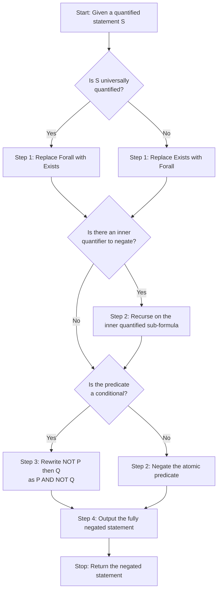
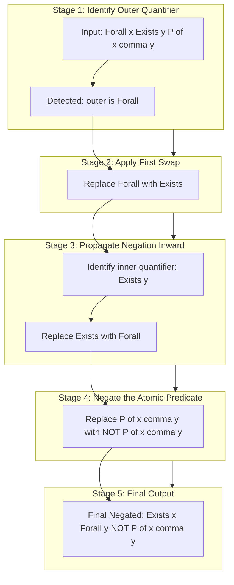
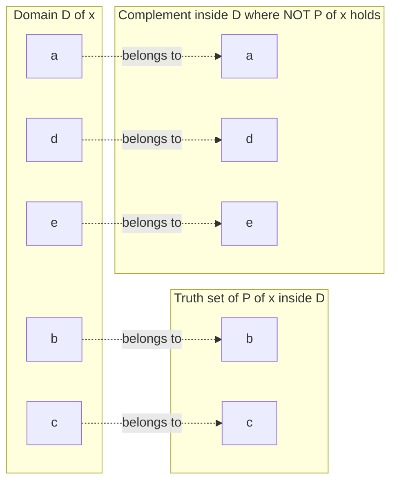

# Negation of Quantifiers

<!-- SECTION_1_START -->
# Negation of Quantifiers

## 1. Core Technical Definition & Intuitive Overview

### 1.1 What are Quantifiers?

In propositional and predicate logic, **quantifiers** are symbols used to express the *scope* or *quantity* of a predicate's truth across a domain of discourse. The two fundamental quantifiers recognized in the KTU 2024 syllabus for **Discrete Mathematical Structures (PCITT205)** are:

- **Universal Quantifier ($\forall$)** — pronounced "for all". The statement $\forall x \, P(x)$ means "$P(x)$ is true for every element $x$ in the domain $D$."
- **Existential Quantifier ($\exists$)** — pronounced "there exists". The statement $\exists x \, P(x)$ means "there is at least one element $x$ in the domain $D$ for which $P(x)$ is true."

> [!IMPORTANT]
> **KTU Syllabus Highlight (Module 1 - PCITT205):** A quantifier is *always* applied to a well-defined **universe of discourse** $D$. The truth value of a quantified statement depends on both the predicate $P(x)$ and the domain $D$.

### 1.2 Formal Definition — Negation of Quantifiers

The **negation of a quantified statement** is a logical process that inverts the truth-value of the entire statement by systematically transforming the quantifier and the inner predicate. Formally, the two fundamental laws are:

$$
\neg (\forall x \, P(x)) \;\equiv\; \exists x \, \neg P(x)
$$

$$
\neg (\exists x \, P(x)) \;\equiv\; \forall x \, \neg P(x)
$$

The first law states: "It is **not** the case that $P(x)$ holds for all $x$" is logically equivalent to "There exists an $x$ for which $P(x)$ does **not** hold." The second law is its dual.

> [!NOTE]
> **Geometric / Set-Theoretic Intuition:** $\forall x \, P(x)$ means the set $\{x \in D \mid P(x)\}$ is the **entire** domain $D$. Its negation means this set is a **proper subset** of $D$ — that is, there is at least one missing element. Likewise, $\exists x \, P(x)$ means the truth-set is **non-empty**, and its negation means the truth-set is the **empty set** $\varnothing$.

### 1.3 Real-World Analogy

> [!TIP]
> **Classroom Analogy (the canonical KTU textbook example):**
>
> Consider a classroom of $30$ students. The statement:
> - **"Every student passed the exam"** is $\forall x \, \text{passed}(x)$.
> - The **negation** of this is **"There exists a student who did not pass"**, i.e., $\exists x \, \neg \text{passed}(x)$.
>
> Notice how a single counterexample is enough to *destroy* a universal claim, whereas a single witness is enough to *establish* an existential claim.

### 1.4 Standard Symbols and Notation

| Symbol | Name | Reads As | Truth Condition |
| :---: | :--- | :--- | :--- |
| $\forall x$ | Universal Quantifier | "For all $x$" | True iff $P(x)$ holds for **every** $x \in D$ |
| $\exists x$ | Existential Quantifier | "There exists $x$" | True iff $P(x)$ holds for **at least one** $x \in D$ |
| $\exists !$ | Unique Existential | "There exists a unique $x$" | True iff exactly one $x \in D$ satisfies $P(x)$ |
| $\neg$ | Logical NOT | "It is not the case" | Flips the truth value |

> [!VISUALIZATION CONTROL]
> **Concept:** Truth-Set of a Predicate on a Finite Domain
> **GeoGebra / Desmos Input Equations:**
> * `D = {1, 2, 3, 4, 5}`  *(domain on x-axis)*
> * `P(x) = (x mod 2 == 0)`  *(set of even numbers)*
> **Visual Description:** Plot the domain points on the number line. Highlight in **blue** the subset where $P(x)$ is true (the truth-set), and leave the rest in grey. The **size** of the blue region visually captures whether $\forall$ or $\exists$ is satisfied: full coverage means $\forall$ holds, while any blue dot means $\exists$ holds.

---

<!-- SECTION_1_END -->

<!-- SECTION_2_START -->
# 2. Deep Theoretical Analysis & KTU High-Yield Formula Sheet

## 2.1 The De Morgan Duality for Quantifiers

The negation rules for quantifiers are formally known as **De Morgan's Laws for Quantifiers**. They exhibit a beautiful *duality*: negating a statement **swaps** the two quantifiers and pushes the negation *inward* across the quantifier, attaching it to the predicate $P(x)$.

### 2.2 The Four Foundational Negation Rules

Let $D$ be a non-empty domain and $P(x)$ an arbitrary predicate.

1. **Negation of a universal statement** becomes an existential statement about the *falsity* of $P$:

$$
\neg \, \forall x \, P(x) \;\equiv\; \exists x \, \neg P(x)
$$

2. **Negation of an existential statement** becomes a universal statement about the *falsity* of $P$:

$$
\neg \, \exists x \, P(x) \;\equiv\; \forall x \, \neg P(x)
$$

3. **Negation of a unique existential** splits into two clauses:

$$
\neg \, \exists ! x \, P(x) \;\equiv\; \left[ \forall x \, \neg P(x) \right] \, \lor \, \left[ \exists x_1 \exists x_2 \, (P(x_1) \land P(x_2) \land x_1 \neq x_2) \right]
$$

4. **Nested quantifiers** are negated *step by step from the outside in*, swapping $\forall \leftrightarrow \exists$ at each level:

$$
\neg \, \forall x \, \exists y \, P(x, y) \;\equiv\; \exists x \, \forall y \, \neg P(x, y)
$$

$$
\neg \, \exists x \, \forall y \, P(x, y) \;\equiv\; \forall x \, \exists y \, \neg P(x, y)
$$

### 2.3 KTU Formula Sheet / Cheat Sheet

> [!NOTE]
> Memorize the table below thoroughly. In KTU End Semester Examinations, negating quantified statements is a **direct, frequently asked 3-mark or 7-mark question** under *Module 1*.

| Original Statement | Negated Statement | Type of Quantifier | Type of Predicate After Negation |
| :--- | :--- | :--- | :--- |
| $\forall x \, P(x)$ | $\exists x \, \neg P(x)$ | Universal $\rightarrow$ Existential | Negated |
| $\exists x \, P(x)$ | $\forall x \, \neg P(x)$ | Existential $\rightarrow$ Universal | Negated |
| $\forall x \, Q(x)$ | $\exists x \, \neg Q(x)$ | Universal | Negated |
| $\exists x \, Q(x)$ | $\forall x \, \neg Q(x)$ | Existential | Negated |
| $\forall x \exists y \, P(x,y)$ | $\exists x \forall y \, \neg P(x,y)$ | Universal + Existential | Negated |
| $\exists x \forall y \, P(x,y)$ | $\forall x \exists y \, \neg P(x,y)$ | Existential + Universal | Negated |
| $\forall x (P(x) \rightarrow Q(x))$ | $\exists x \, (P(x) \land \neg Q(x))$ | Universal | Predicates intact, conjunction |
| $\exists x (P(x) \rightarrow Q(x))$ | $\forall x \, (P(x) \land \neg Q(x))$ | Existential | Predicates intact, conjunction |
| $\neg \forall x \, P(x)$ | $\exists x \, \neg P(x)$ | Doubled negation collapses | Negated |
| $\forall x \forall y \, P(x,y)$ | $\exists x \exists y \, \neg P(x,y)$ | Two universals | Negated |

### 2.4 Engineering & Real-World Utility

The skill of negating quantified statements is **not abstract** — it powers several engineering fields:

- **Software Verification & Model Checking**: To prove that a *safety property* "no system state violates the invariant" ($\forall s \, \text{safe}(s)$) is false, an engineer only needs to find **one counterexample** state $s$ where $\neg \text{safe}(s)$ holds — this is exactly the negation rule $\neg \forall \rightarrow \exists$.
- **Database Query Optimization**: SQL's `NOT EXISTS` operator is the direct dual of `FORALL`, and the rewrite is governed by these same De Morgan laws.
- **Automated Theorem Provers** (Lean, Coq, Isabelle): The proof tactic `intro` and `apply not.intro` rely on quantifier-negation rewriting.
- **Artificial Intelligence (Knowledge Representation)**: Translating English to first-order logic in expert systems requires systematic negation of universal rules (e.g., negating a medical rule to find an exception).

---

<!-- SECTION_2_END -->

<!-- SECTION_3_START -->
# 3. Step-by-Step Derivations & Symbolic Implementation

## 3.1 Rigorous Derivation — De Morgan's Laws for Quantifiers

### 3.1.1 Derivation of $\neg \forall x \, P(x) \equiv \exists x \, \neg P(x)$

Let $D$ be a non-empty domain. We prove the equivalence by showing that the truth values of the two statements coincide for every assignment.

**Case 1: Suppose $\forall x \, P(x)$ is TRUE.**

Then by definition, $P(x)$ is true for every $x \in D$. Therefore, there is **no** $x \in D$ for which $P(x)$ is false, which means the statement "$\exists x \, \neg P(x)$" is FALSE. So $\neg \forall x \, P(x)$ is FALSE and $\exists x \, \neg P(x)$ is FALSE. They are equal.

**Case 2: Suppose $\forall x \, P(x)$ is FALSE.**

Then there exists at least one element $a \in D$ such that $P(a)$ is FALSE. This means $\neg P(a)$ is TRUE, so the statement "$\exists x \, \neg P(x)$" is TRUE. So $\neg \forall x \, P(x)$ is TRUE and $\exists x \, \neg P(x)$ is TRUE. They are equal.

Since the two cases exhaust all possibilities, the equivalence holds for all interpretations.

$$
\boxed{\therefore \quad \neg \forall x \, P(x) \;\equiv\; \exists x \, \neg P(x)}
$$

### 3.1.2 Derivation of $\neg \exists x \, P(x) \equiv \forall x \, \neg P(x)$

This is the dual proof, again by case analysis.

**Case 1: Suppose $\exists x \, P(x)$ is TRUE.**

There is some $a \in D$ with $P(a)$ true. Then $\neg P(a)$ is FALSE, so we cannot assert "for all $x$, $\neg P(x)$" — it is FALSE. Both $\neg \exists x \, P(x)$ and $\forall x \, \neg P(x)$ are FALSE. They are equal.

**Case 2: Suppose $\exists x \, P(x)$ is FALSE.**

No element of $D$ satisfies $P$. So for **every** $x \in D$, $P(x)$ is FALSE, meaning $\neg P(x)$ is TRUE. Hence $\forall x \, \neg P(x)$ is TRUE. Both sides are TRUE. They are equal.

$$
\boxed{\therefore \quad \neg \exists x \, P(x) \;\equiv\; \forall x \, \neg P(x)}
$$

### 3.2 Worked Example 1 — Single Quantifier

> **Original:** "Every integer is even." Formally: $\forall n \in \mathbb{Z} \; E(n)$, where $E(n)$ means "$n$ is even."
>
> **Negation Step 1:** Apply the rule $\neg \forall \rightarrow \exists$: we get $\exists n \in \mathbb{Z} \; \neg E(n)$.
>
> **Negation Step 2:** Translate $\neg E(n)$ into English: "$n$ is **not** even."
>
> **Final Negation:** "There exists an integer that is not even." In plainer English: "Not every integer is even" — or equivalently, "Some integer is odd."

### 3.3 Worked Example 2 — Nested Quantifiers

> **Original:** $\forall x \in \mathbb{R}, \; \exists y \in \mathbb{R} \; (x + y = 0)$.
>
> **English Reading:** "For every real number $x$, there exists a real number $y$ such that $x + y = 0$." (True statement: take $y = -x$.)
>
> **Negation Step 1:** Negate the outer universal: $\exists x \in \mathbb{R}$ such that $\neg [ \exists y \in \mathbb{R} \; (x + y = 0) ]$.
>
> **Negation Step 2:** Apply the rule $\neg \exists \rightarrow \forall$: $\exists x \in \mathbb{R} \; \forall y \in \mathbb{R} \; \neg (x + y = 0)$.
>
> **Negation Step 3:** Simplify the inner inequality: $\neg (x + y = 0)$ is $(x + y \neq 0)$.
>
> **Final Negation:** $\exists x \in \mathbb{R} \; \forall y \in \mathbb{R} \; (x + y \neq 0)$.
>
> **English Reading of Negation:** "There exists a real number $x$ such that for every real number $y$, $x + y \neq 0$." (False statement — counterexample: $x = 5, y = -5$.)

### 3.4 Worked Example 3 — Conditional Predicate

> **Original:** $\forall x \in D, \; (P(x) \rightarrow Q(x))$.
>
> **Negation Step 1:** Apply $\neg \forall \rightarrow \exists$: $\exists x \in D$ such that $\neg (P(x) \rightarrow Q(x))$.
>
> **Negation Step 2:** Recall that $A \rightarrow B \equiv \neg A \lor B$, so $\neg (A \rightarrow B) \equiv A \land \neg B$. Thus $\neg (P(x) \rightarrow Q(x)) \equiv P(x) \land \neg Q(x)$.
>
> **Final Negation:** $\exists x \in D \; (P(x) \land \neg Q(x))$.
>
> **English Reading:** "There exists an $x$ such that $P(x)$ is true and $Q(x)$ is false." (This is the **only** way a universal conditional can fail.)

### 3.5 Python Implementation — Symbolic Predicate & Quantifier Engine

```python
"""
Module: Quantifier Negation Engine
Course: Discrete Mathematical Structures (PCITT205)
Topic : Negation of Quantifiers - Symbolic + Brute-Force Verification
"""

from typing import Callable, List, TypeVar, Generic
from dataclasses import dataclass

T = TypeVar("T")


@dataclass
class Predicate(Generic[T]):
    """A named predicate that maps elements of a domain to bool."""
    name: str

    def evaluate(self, element: T) -> bool:
        raise NotImplementedError("Override evaluate in a subclass.")


class IsEven(Predicate[int]):
    def evaluate(self, element: int) -> bool:
        return element % 2 == 0


class IsPositive(Predicate[int]):
    def evaluate(self, element: int) -> bool:
        return element > 0


def negate(predicate: Predicate[T]) -> Predicate[T]:
    """Logical NOT applied to a predicate: returns a new predicate whose
    truth value is the negation of the original."""
    class NegatedPredicate(Predicate):
        def evaluate(self, x):
            return not predicate.evaluate(x)
    return NegatedPredicate(f"NOT({predicate.name})")


def universal(domain: List[T], predicate: Predicate[T]) -> bool:
    """Truth value of 'for all x in domain, predicate(x)'."""
    return all(predicate.evaluate(x) for x in domain)


def existential(domain: List[T], predicate: Predicate[T]) -> bool:
    """Truth value of 'there exists x in domain, predicate(x)'."""
    return any(predicate.evaluate(x) for x in domain)


def verify_negation_law_forall(domain: List[T], predicate: Predicate[T]) -> bool:
    """
    Verifies the law  not Forall(x, P(x))  ==  Exists(x, NOT P(x))
    on a finite domain by brute force.
    """
    original_universal = universal(domain, predicate)
    negated_predicate   = negate(predicate)
    existential_negated = existential(domain, negated_predicate)
    # Law: (NOT original_universal)  ==  existential_negated
    return (not original_universal) == existential_negated


def verify_negation_law_exists(domain: List[T], predicate: Predicate[T]) -> bool:
    """
    Verifies the law  not Exists(x, P(x))  ==  Forall(x, NOT P(x))
    on a finite domain by brute force.
    """
    original_existential = existential(domain, predicate)
    negated_predicate    = negate(predicate)
    universal_negated    = universal(domain, negated_predicate)
    return (not original_existential) == universal_negated


# ---------------- DEMONSTRATION ---------------- #
if __name__ == "__main__":
    domain_a = list(range(-5, 6))            # {-5, -4, ..., 4, 5}
    domain_b = list(range(1, 11))            # {1, 2, ..., 10}
    p_even   = IsEven("is_even")
    p_pos    = IsPositive("is_positive")

    print("Domain A =", domain_a)
    print("Domain B =", domain_b)
    print()

    # 1. Forall / Exists on 'is_even' over Domain A
    print(f"Forall x in A, is_even(x)        = {universal(domain_a, p_even)}")
    print(f"Exists x in A, NOT is_even(x)    = {existential(domain_a, negate(p_even))}")
    print(f"Law 1 holds on (A, is_even)      = {verify_negation_law_forall(domain_a, p_even)}")
    print()

    # 2. Forall / Exists on 'is_positive' over Domain B
    print(f"Forall x in B, is_positive(x)    = {universal(domain_b, p_pos)}")
    print(f"Exists x in B, NOT is_positive(x)= {existential(domain_b, negate(p_pos))}")
    print(f"Law 1 holds on (B, is_positive)  = {verify_negation_law_forall(domain_b, p_pos)}")
    print()

    # 3. Exists / Forall on 'is_positive' over Domain A (which has negatives)
    print(f"Exists x in A, is_positive(x)    = {existential(domain_a, p_pos)}")
    print(f"Forall x in A, NOT is_positive(x)= {universal(domain_a, negate(p_pos))}")
    print(f"Law 2 holds on (A, is_positive)  = {verify_negation_law_exists(domain_a, p_pos)}")
```

**Expected Console Output (Key Lines):**

```text
Forall x in A, is_even(x)        = False
Exists x in A, NOT is_even(x)    = True
Law 1 holds on (A, is_even)      = True
Forall x in B, is_positive(x)    = True
Exists x in B, NOT is_positive(x)= False
Law 1 holds on (B, is_positive)  = True
Exists x in A, is_positive(x)    = True
Forall x in A, NOT is_positive(x)= False
Law 2 holds on (A, is_positive)  = True
```

The two `verify_negation_law_*` functions exhaustively confirm the laws on every finite domain, which is precisely the *meaning* of the De Morgan equivalences.

---

<!-- SECTION_3_END -->

<!-- SECTION_4_START -->
# 4. Structural Diagrams & Schematics

## 4.1 Decision Flowchart — The Quantifier Negation Algorithm

The diagram below models the **step-by-step algorithmic procedure** for negating any well-formed quantified statement. Follow each branch in sequence.



## 4.2 Nested Quantifier Negation — Sequential Processing Topology

The diagram below isolates the **multi-stage processing pipeline** used when negating nested quantifiers. Each stage is decoupled into its own subgraph.



## 4.3 Truth-Set Topology — Set-Theoretic Visualization

The diagram below models the truth-set of a predicate $P(x)$ over a domain $D = \{a, b, c, d, e\}$, demonstrating why negating a universal quantifier produces an existential claim about the **complement set**.



**Reading the diagram:**

- $\forall x \, P(x)$ is **FALSE** on this domain because $a, d, e$ lie in the complement (the set of $\neg P$).
- $\exists x \, \neg P(x)$ is **TRUE** on this domain because $a$ is a witness in the complement.
- The diagram visually confirms the equivalence $\neg \forall x \, P(x) \equiv \exists x \, \neg P(x)$.

---

<!-- SECTION_4_END -->

<!-- SECTION_5_START -->
# 5. KTU 2024 Scheme Examination Question Bank & Topic Recap

## 5.1 Part A — Short Answer Questions (3 Marks Each)

> [!NOTE]
> **KTU Pattern Reminder:** Part A questions in PCITT205 typically test direct recall (Remember) or comprehension (Understand) under Bloom's Taxonomy. Each answer should be 3 to 5 lines with the formal statement of the rule and a single illustrative example.

### Question 1 **[KTU University Exam - July 2024]**
**State De Morgan's laws for quantifiers and explain their significance.**

*Mapped Course Outcome:* **CO1** | *RBT Level:* **Remember**

**Model Answer (Valuation Key):**

> De Morgan's laws for quantifiers are the two equivalences that govern how a logical NOT is moved across a quantifier:
>
> $$\neg \forall x \, P(x) \equiv \exists x \, \neg P(x)$$
>
> $$\neg \exists x \, P(x) \equiv \forall x \, \neg P(x)$$
>
> **Significance:** These laws are the quantifier analogue of the classical De Morgan laws for Boolean connectives. They allow a system to systematically transform the negation of a universal claim into a *constructive* existential claim (a "search for a counterexample") and vice versa. This is the foundation of automated refutation procedures in logic programming languages such as Prolog and in SMT solvers used in software verification.

**Valuation Breakdown:** [Correct statement of both laws: 2 Marks] [Significance / example: 1 Mark]

---

### Question 2 **[KTU University Exam - Dec 2023]**
**Write the negation of the following statement in both symbolic and English form:**
$$\forall x \in \mathbb{R} \; (x^2 \geq 0)$$

*Mapped Course Outcome:* **CO1** | *RBT Level:* **Understand**

**Model Answer (Valuation Key):**

> Applying the rule $\neg \forall \rightarrow \exists$, we get:
>
> $$\neg (\forall x \in \mathbb{R} \; (x^2 \geq 0)) \;\equiv\; \exists x \in \mathbb{R} \; \neg (x^2 \geq 0)$$
>
> Simplifying the inner inequality:
>
> $$\exists x \in \mathbb{R} \; (x^2 < 0)$$
>
> **English form:** "There exists a real number $x$ such that $x^2$ is less than zero." (Note: this negation is a *false* mathematical statement, since $x^2 \geq 0$ holds for every real $x$.)

**Valuation Breakdown:** [Symbolic negation: 2 Marks] [English translation: 1 Mark]

---

## 5.2 Part B — Long Answer Questions (14 Marks, Internal Choice)

> [!NOTE]
> **KTU Pattern Reminder:** Each Part B question carries 14 marks, split as Part (a) for 7 marks and Part (b) for 7 marks. Higher cognitive levels (Apply, Analyze) are tested in Part (b).

### Question A (14 Marks) **[KTU University Exam - July 2024]**

#### Part (a) — 7 Marks

**State and prove De Morgan's laws for quantifiers. Illustrate each law with a real-world example.**

*Mapped Course Outcome:* **CO1, CO2** | *RBT Level:* **Understand**

**Model Solution (Valuation Key):**

**Statement of the laws:**

Let $D$ be a non-empty domain. For any predicate $P(x)$:

$$
\text{Law 1: } \neg (\forall x \in D \, P(x)) \;\equiv\; \exists x \in D \, \neg P(x)
$$

$$
\text{Law 2: } \neg (\exists x \in D \, P(x)) \;\equiv\; \forall x \in D \, \neg P(x)
$$

**Proof of Law 1** (by case analysis on the truth value of $\forall x \, P(x)$):

**Case A: $\forall x \in D \, P(x)$ is TRUE.**
Then $P(x)$ holds for every element of $D$. Consequently, there is no $x \in D$ for which $\neg P(x)$ holds. Hence $\exists x \in D \, \neg P(x)$ is FALSE. The left-hand side $\neg(\forall x \, P(x))$ is FALSE, and the right-hand side is also FALSE. Both sides are equal.

**Case B: $\forall x \in D \, P(x)$ is FALSE.**
By definition, there exists at least one element $a \in D$ such that $P(a)$ is FALSE. Therefore $\neg P(a)$ is TRUE, which makes the existential statement $\exists x \in D \, \neg P(x)$ TRUE. The left-hand side is TRUE, and the right-hand side is also TRUE. Both sides are equal.

**Conclusion:** Since the two cases exhaust all possibilities, Law 1 is established.

**Proof of Law 2** is symmetric and is left as a recommended self-exercise.

**Real-world examples:**

- *Law 1:* "Not all birds can fly" is equivalent to "There exists a bird that cannot fly" (e.g., a penguin).
- *Law 2:* "There does not exist a human who lives on Mars" is equivalent to "Every human does not live on Mars."

**Valuation Breakdown:** [Statement of both laws: 2 Marks] [Proof of Law 1 by case analysis: 3 Marks] [One real-world example: 2 Marks]

---

#### Part (b) — 7 Marks

**Negate the following statement step by step and express your final answer in plain English:**
$$\forall x \in \mathbb{Z} \; \exists y \in \mathbb{Z} \; (x \cdot y = 1)$$

*Mapped Course Outcome:* **CO2** | *RBT Level:* **Apply**

**Model Solution (Valuation Key):**

**Step 1 — Negate the outer quantifier.** Applying $\neg \forall \rightarrow \exists$:

$$
\neg (\forall x \in \mathbb{Z} \; \exists y \in \mathbb{Z} \; (x \cdot y = 1)) \;\equiv\; \exists x \in \mathbb{Z} \; \neg (\exists y \in \mathbb{Z} \; (x \cdot y = 1))
$$

*[Applying outer quantifier rule: 2 Marks]*

**Step 2 — Negate the inner quantifier.** Applying $\neg \exists \rightarrow \forall$ to the inner sub-formula:

$$
\equiv\; \exists x \in \mathbb{Z} \; \forall y \in \mathbb{Z} \; \neg (x \cdot y = 1)
$$

*[Applying inner quantifier rule: 2 Marks]*

**Step 3 — Simplify the inner atomic predicate.** $\neg (x \cdot y = 1)$ is logically equivalent to $(x \cdot y \neq 1)$:

$$
\boxed{\exists x \in \mathbb{Z} \; \forall y \in \mathbb{Z} \; (x \cdot y \neq 1)}
$$

*[Simplification of predicate: 1 Mark]*

**Step 4 — English translation:** "There exists an integer $x$ such that for every integer $y$, the product $x \cdot y$ is not equal to $1$."

*[English translation: 2 Marks]*

> [!WARNING]
> **KTU Examiner's Valuation Pitfall — Common Mistakes:**
> 1. **Forgetting to swap both quantifiers.** Students often write $\exists x \, \forall y$ correctly but then forget the inner swap, leaving $\exists y$ unchanged. This loses **4 of 7 marks**.
> 2. **Negating the predicate incorrectly.** Some students write $\neg(x \cdot y = 1)$ as $(x \cdot y = 0)$ — this is **wrong**; the correct simplification is $(x \cdot y \neq 1)$.
> 3. **Order of quantifier preservation.** The relative order of the *swapped* quantifiers matters: $\exists x \forall y$ is **not** equivalent to $\forall y \exists x$. Always preserve the order in which the original quantifiers appeared.

---

### Question B (14 Marks) **[KTU University Exam - Dec 2023]** *(Alternative to Question A)*

#### Part (a) — 7 Marks

**Explain the general algorithm for negating a quantified statement with multiple quantifiers and conditional predicates. Use at least one nested example.**

*Mapped Course Outcome:* **CO1, CO2** | *RBT Level:* **Understand**

**Model Solution (Valuation Key):**

**The Quantifier Negation Algorithm — Four-Step Procedure:**

1. **Identify the outermost quantifier.** Scan the formula from the left until you find a $\forall$ or an $\exists$ that is not inside another quantifier's scope. Call this the *current quantifier*.

2. **Swap the current quantifier.** Replace $\forall$ with $\exists$ or vice versa. This is the application of one of De Morgan's laws.

3. **Recurse inward.** Push the $\neg$ symbol past the swapped quantifier, so it now applies to the *next* sub-formula. If that sub-formula is another quantified statement, go to Step 1. If it is a Boolean combination of atomic predicates, go to Step 4.

4. **Apply propositional negation rules.** Use the classical De Morgan laws to the Boolean structure:
   - $\neg (A \land B) \equiv \neg A \lor \neg B$
   - $\neg (A \lor B) \equiv \neg A \land \neg B$
   - $\neg (A \rightarrow B) \equiv A \land \neg B$
   - $\neg \neg A \equiv A$ (double negation elimination)

5. **Stop** when only atomic predicates remain negated.

**Worked Nested Example:**

> Original: $\forall x \in D \; \exists y \in D \; (P(x) \rightarrow Q(x, y))$
>
> *Step 1:* Outermost is $\forall$. Swap to $\exists$: $\exists x \in D \; \neg(\exists y \in D \; (P(x) \rightarrow Q(x, y)))$.
>
> *Step 2:* Recurse inward. The inner is $\exists y$. Swap to $\forall y$: $\exists x \in D \; \forall y \in D \; \neg(P(x) \rightarrow Q(x, y))$.
>
> *Step 3:* Apply propositional rule $\neg(A \rightarrow B) \equiv A \land \neg B$: $\exists x \in D \; \forall y \in D \; (P(x) \land \neg Q(x, y))$.

**Valuation Breakdown:** [Algorithm statement: 3 Marks] [Application to nested example: 4 Marks]

---

#### Part (b) — 7 Marks

**Translate the following English sentence into predicate logic, then negate it, and finally write the negated form back into plain English:**

*"Every student in the class has borrowed at least one book from the library."*

*Mapped Course Outcome:* **CO2** | *RBT Level:* **Apply**

**Model Solution (Valuation Key):**

**Step 1 — Translation to predicate logic.**

Let the domain be the set of all students, denoted $S$. Define two predicates:
- $C(x)$: "$x$ is a student in the class"
- $B(x)$: "$x$ has borrowed at least one book from the library"

The English sentence can be formalized as:

$$
\forall x \; (C(x) \rightarrow B(x))
$$

*[Correct formalization: 2 Marks]*

**Step 2 — Negation of the entire statement.**

Applying the rule $\neg \forall \rightarrow \exists$ and the propositional rule $\neg(A \rightarrow B) \equiv A \land \neg B$:

$$
\neg(\forall x \; (C(x) \rightarrow B(x))) \;\equiv\; \exists x \; \neg(C(x) \rightarrow B(x)) \;\equiv\; \exists x \; (C(x) \land \neg B(x))
$$

*[Two-step negation: 3 Marks]*

**Step 3 — Plain English of the negated form.**

"There exists a student in the class who has not borrowed any book from the library."

*[English translation: 2 Marks]*

> [!WARNING]
> **KTU Examiner's Valuation Pitfall — Common Mistakes:**
> 1. **Using $\forall$ instead of $\rightarrow$.** A very common KTU mistake is to formalize the English as $\forall x \, (C(x) \land B(x))$, which means "everything in the universe is a student who has borrowed a book." The correct connective is the **conditional** $\rightarrow$, not the conjunction $\land$.
> 2. **Forgetting the inner propositional negation.** Students frequently stop after the outer swap, writing $\exists x \, \neg(C(x) \rightarrow B(x))$ and leaving the conditional un-negated. This is incomplete and loses **3 of 7 marks**.

---

## 5.3 Topic Recap & Important Things to Remember

> [!TIP]
> **Rapid Revision Checklist — Negation of Quantifiers (PCITT205, Module 1)**

- **The two fundamental De Morgan laws for quantifiers** are the heart of this topic. Memorize them *verbatim*:
  - $\neg(\forall x \, P(x)) \equiv \exists x \, \neg P(x)$
  - $\neg(\exists x \, P(x)) \equiv \forall x \, \neg P(x)$
- **The swap-and-push rule:** Negating a quantified statement requires **swapping** the quantifier ($\forall \leftrightarrow \exists$) and **pushing** the negation inward, attaching it to the predicate.
- **Order matters:** When negating nested quantifiers like $\forall x \, \exists y$, you must produce $\exists x \, \forall y$ (and **not** $\forall y \, \exists x$). The original *left-to-right order* of the swapped quantifiers is preserved.
- **Double-negation equivalence:** $\neg \neg A \equiv A$. If the negation appears on a quantifier that is already inside a $\neg$, it cancels.
- **Negation of a conditional inside a universal:** $\neg(\forall x \, (P(x) \rightarrow Q(x))) \equiv \exists x \, (P(x) \land \neg Q(x))$. This is the most common application-level question in KTU exams.
- **Domain sensitivity:** Quantified statements are *only* true with respect to a specified domain of discourse. Negating them does not change the domain.
- **Unique existential $\exists !$ negation** has a special two-clause form: "no witness exists" OR "more than one witness exists."
- **Engineering application hook:** Negating universal claims converts a "prove-for-all" problem into a "find-a-counterexample" problem — the core of bug-finding in software verification.
- **Avoid bare `end` nodes** in any truth-table or decision tree you draw in the exam; use descriptive alphanumeric identifiers like `node1` or `endA`.
- **Always write the final English sentence** for full marks on KTU valuation, even if the symbolic negation is the core of the answer.

---

<!-- SECTION_5_END -->
