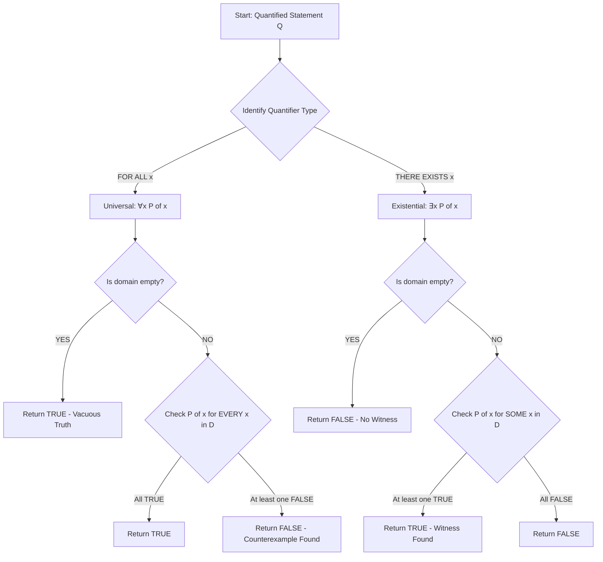
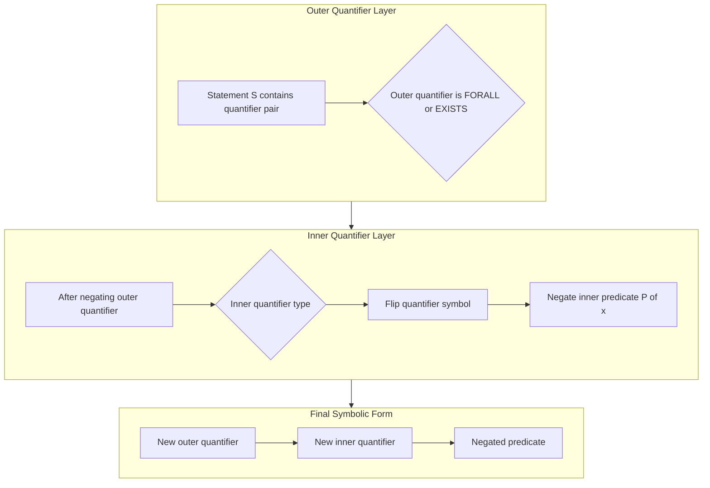
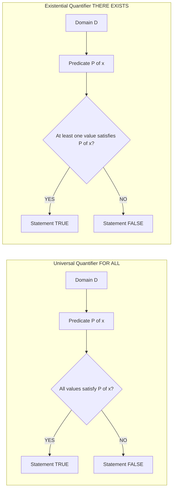
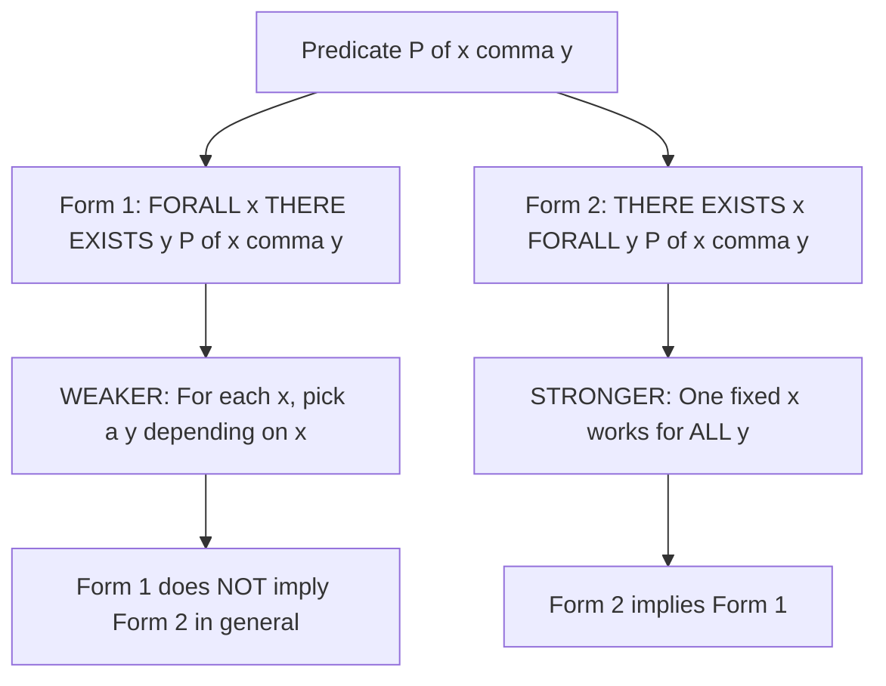

# Predicates and Quantifiers: Universal quantifier and Existential quantifier

<!-- SECTION_1_START -->
# Predicates and Quantifiers — Universal & Existential Quantifier

## 1.1 What is a Predicate?

A **predicate** (or **propositional function**) is a statement that contains one or more variables, which becomes a proposition (with a definite truth value) once specific values are substituted for the variables from a defined **domain of discourse** (also called the **universe of discourse**).

> [!NOTE]
> **Formal Definition (KTU 2024 Syllabus Terminology)**
> A predicate $P(x_1, x_2, \ldots, x_n)$ is a Boolean-valued function of $n$ variables. The set from which the variables take their values is called the **domain of discourse** (denoted $D$). For every $n$-tuple $(x_1, x_2, \ldots, x_n) \in D^n$, the predicate yields either **TRUE (T)** or **FALSE (F)**.

**Example.** Let $D = \mathbb{Z}$ (the set of integers) and $P(x)$: "$x$ is a positive integer". Then:
- $P(5)$ is TRUE
- $P(-3)$ is FALSE

The truth value of a predicate **cannot be determined until the variable is quantified or assigned a value**.

## 1.2 What is a Quantifier?

A **quantifier** is a logical operator that converts a predicate (open sentence) into a closed sentence (a proposition with a definite truth value) by indicating *how many* elements of the domain must satisfy the predicate.

KTU 2024 Scheme requires mastery of two fundamental quantifiers:

| Symbol | Name | Natural Language Equivalent |
|:---:|:---:|:---|
| $\forall$ | **Universal Quantifier** | "for all", "for every", "for each" |
| $\exists$ | **Existential Quantifier** | "there exists", "for some", "at least one" |

## 1.3 Universal Quantifier $\forall$

A statement of the form $\forall x \, P(x)$ asserts that **$P(x)$ is true for every element $x$ in the domain $D$**.

$$\forall x \in D,\; P(x)$$

**Real-World Analogy (The Classroom Sweep Test).** Imagine a teacher wants to verify that "every student in the class submitted the assignment." The teacher must check **each and every** student's desk. Even **one** student who didn't submit breaks the statement — $\forall$ requires *unanimous truth* across the domain. It is like a chain that breaks if even one link is weak.

## 1.4 Existential Quantifier $\exists$

A statement of the form $\exists x \, P(x)$ asserts that **there is at least one element $x$ in the domain $D$ for which $P(x)$ is true**.

$$\exists x \in D,\; P(x)$$

**Real-World Analogy (Finding a Needle in a Haystack).** The statement "there exists a gold coin in the pile" is true as soon as you find **even one** gold coin — you do not have to check every piece. $\exists$ is the *weakest* of the two quantifiers in terms of requirement: a single witness makes the statement true.

> [!IMPORTANT]
> **KTU Board Tip:** The symbol $\exists!$ denotes the **Unique Existential Quantifier** — "there exists *exactly one*". Although not always in the syllabus, examiners often give bonus marks for using it correctly.

## 1.5 Quantifier Domain — A Critical Concept

The truth value of a quantified statement **depends entirely on the domain $D$**.

> [!EXAMPLE]
> Let $P(x)$: "$x > 0$"
> - If $D = \mathbb{N}$ (natural numbers): $\forall x\, P(x)$ is **FALSE** (since $0 \in \mathbb{N}$ and $0 \not> 0$).
> - If $D = \mathbb{Z}^{+}$ (positive integers): $\forall x\, P(x)$ is **TRUE**.

This domain-dependence is a high-frequency KTU board question.

## 1.6 Vacuous Truth (Edge Case)

> [!IMPORTANT]
> **Vacuous Truth:** A statement of the form $\forall x \in \emptyset,\; P(x)$ is considered **vacuously TRUE** because there is no element to falsify it. Similarly, $\exists x \in \emptyset,\; P(x)$ is **FALSE** since no witness can be found.

This concept is a favorite 3-mark question in KTU ESE.

> [!VISUALIZATION CONTROL]
> **Concept:** Truth value of $\forall$ vs $\exists$ on a numeric domain
> **GeoGebra / Desmos Input Equations:**
> * `f(x) = x^2 - 4`  (this acts as the predicate $P(x)$: "$x^2 - 4 = 0$")
> * Set domain slider: $a = -5$, $b = 5$
> **Visual Description:** On the $x$-axis from $-5$ to $5$, observe where the parabola $y = x^2 - 4$ crosses zero (at $x = -2$ and $x = 2$). $\exists x \in [-5,5]\; P(x)$ is TRUE (witnesses exist at $\pm 2$). $\forall x \in [-5,5]\; P(x)$ is FALSE (fails at $x = 0$, where $y = -4$).
<!-- SECTION_1_END -->

<!-- SECTION_2_START -->
# Deep Theoretical Analysis & KTU High-Yield Formula Sheet

## 2.1 Operational Logic Breakdown

### 2.1.1 When is $\forall x\, P(x)$ TRUE / FALSE?

- **TRUE** if and only if $P(x)$ is true **for every** $x \in D$.
- **FALSE** if there exists at least one $x \in D$ such that $P(x)$ is false. This specific element is called a **counterexample**.

### 2.1.2 When is $\exists x\, P(x)$ TRUE / FALSE?

- **TRUE** if there exists at least one $x \in D$ such that $P(x)$ is true. This specific element is called a **witness**.
- **FALSE** if $P(x)$ is false **for every** $x \in D$.

> [!NOTE]
> **Why does this matter?**
> Quantifiers are the **backbone of mathematical proofs**:
> - To prove $\forall x\, P(x)$ — use a **direct/general proof**.
> - To disprove $\forall x\, P(x)$ — provide **one counterexample**.
> - To prove $\exists x\, P(x)$ — provide **one witness** (constructive proof).
> - To disprove $\exists x\, P(x)$ — show $P(x)$ is false for all $x$ (universal argument).

## 2.2 Negating Quantifiers — De Morgan's Laws for Quantifiers

This is the **most heavily tested** quantifier concept in KTU 2024 ESE.

> [!IMPORTANT]
> **The Two Golden Rules of Quantifier Negation:**
>
> 1. $\neg \forall x\, P(x) \;\equiv\; \exists x\, \neg P(x)$
> 2. $\neg \exists x\, P(x) \;\equiv\; \forall x\, \neg P(x)$

The rule: **Flip the quantifier AND negate the inner predicate**.

## 2.3 Multiple Quantifiers (Nested Quantification)

When we have more than one variable, the quantifier **order matters** in general.

| Statement | Read As | Truth Behavior |
|:---:|:---|:---|
| $\forall x\, \forall y\, P(x,y)$ | For every $x$ and for every $y$, $P(x,y)$ holds | Order doesn't matter — $\forall$ commutes with $\forall$ |
| $\exists x\, \exists y\, P(x,y)$ | There exist $x$ and $y$ such that $P(x,y)$ holds | Order doesn't matter — $\exists$ commutes with $\exists$ |
| $\forall x\, \exists y\, P(x,y)$ | For every $x$, there exists a $y$ (possibly dependent on $x$) such that $P(x,y)$ | **Order matters** |
| $\exists x\, \forall y\, P(x,y)$ | There exists an $x$ such that for every $y$, $P(x,y)$ holds | **Order matters** — stronger statement |

> [!IMPORTANT]
> $\forall x\, \exists y\, P(x,y)$ and $\exists x\, \forall y\, P(x,y)$ are **NOT logically equivalent**. The latter is the stronger statement. KTU frequently tests this with a classic example: $P(x,y)$: "$x+y = 0$" over integers.

## 2.4 KTU Formula Sheet — Quantifier Cheat Sheet

| # | Law / Rule | Symbolic Form |
|:---:|:---|:---|
| 1 | Universal negation | $\neg \forall x\, P(x) \equiv \exists x\, \neg P(x)$ |
| 2 | Existential negation | $\neg \exists x\, P(x) \equiv \forall x\, \neg P(x)$ |
| 3 | Double negation | $\neg \neg P(x) \equiv P(x)$ |
| 4 | Universal over conjunction | $\forall x\, (P(x) \wedge Q(x)) \equiv \forall x\, P(x) \wedge \forall x\, Q(x)$ |
| 5 | Existential over disjunction | $\exists x\, (P(x) \vee Q(x)) \equiv \exists x\, P(x) \vee \exists x\, Q(x)$ |
| 6 | Distribution of universal over existential — does NOT hold in general | $\forall x\, \exists y\, P(x,y) \not\equiv \exists y\, \forall x\, P(x,y)$ |
| 7 | Vacuous universal | If $D = \emptyset$, then $\forall x\, P(x)$ is TRUE |
| 8 | Vacuous existential | If $D = \emptyset$, then $\exists x\, P(x)$ is FALSE |
| 9 | De Morgan on quantifier pair | $\forall x \equiv \neg \exists x\, \neg$ |
| 10 | De Morgan on quantifier pair | $\exists x \equiv \neg \forall x\, \neg$ |

## 2.5 Real-World Engineering Applications

| Domain | Application of Quantifiers |
|:---|:---|
| **Database Query Systems (SQL)** | $\exists$ maps to `EXISTS`, $\forall$ maps to `NOT EXISTS` in correlated subqueries. |
| **Formal Verification (Hardware/Software)** | Statements like "for all input states, the system remains safe" use $\forall$. |
| **Artificial Intelligence / Knowledge Bases** | First-Order Logic (FOL) in expert systems uses $\forall$ for general rules and $\exists$ for specific facts. |
| **Network Security** | "There exists a packet violating protocol $P$" — triggers intrusion detection. |
| **Compiler Design** | Type-checking rules use $\forall$ to assert properties for all variables of a type. |
<!-- SECTION_2_END -->

<!-- SECTION_3_START -->
# Step-by-Step Derivations & Symbolic Implementation

## 3.1 Derivation 1 — Negating a Quantified Statement

**Problem.** Write the negation of: "Every student in the class has passed the exam."

**Step-by-step translation:**

Step 1: Identify the quantifier and predicate.
- Quantifier: Universal ($\forall$)
- Predicate: $P(x)$: "$x$ has passed the exam"
- Domain: "students in the class"

Step 2: Express in symbolic form.

$$\forall x\, P(x)$$

Step 3: Apply the negation rule $\neg \forall x\, P(x) \equiv \exists x\, \neg P(x)$.

$$\neg \forall x\, P(x) \;\equiv\; \exists x\, \neg P(x)$$

Step 4: Translate back to English.
"There exists a student in the class who has **not** passed the exam." ✓

## 3.2 Derivation 2 — Negating a Nested Quantified Statement

**Problem.** Negate: $\forall x\, \exists y\, (x + y = 0)$, where $x, y \in \mathbb{R}$.

**Step-by-step solution:**

Step 1: Apply outer negation.

$$\neg \forall x\, \exists y\, (x + y = 0)$$

Step 2: Flip the outer universal quantifier ($\forall \to \exists$) and negate the inner expression.

$$\equiv \exists x\, \neg \big[\exists y\, (x + y = 0)\big]$$

Step 3: Apply inner negation rule ($\neg \exists \to \forall$).

$$\equiv \exists x\, \forall y\, \neg (x + y = 0)$$

Step 4: Push the negation inside the predicate (logical equivalence: $\neg (A = B) \equiv A \neq B$).

$$\equiv \exists x\, \forall y\, (x + y \neq 0)$$

Step 5: Translate to English.
"There exists a real number $x$ such that for all real numbers $y$, the sum $x + y$ is not equal to zero." ✓

## 3.3 Derivation 3 — Proving Order Matters

**Claim.** $\forall x \in \mathbb{R}\, \exists y \in \mathbb{R} \; (x + y = 0)$ is TRUE, but $\exists x \in \mathbb{R}\, \forall y \in \mathbb{R} \; (x + y = 0)$ is FALSE.

**Proof of the first statement:**

Step 1: Let $x$ be an arbitrary real number (universally quantified).

Step 2: We need to find a $y$ that makes $x + y = 0$.

Step 3: Choose $y = -x$. Since $x \in \mathbb{R}$, we have $-x \in \mathbb{R}$.

Step 4: Verify: $x + y = x + (-x) = 0$. ✓

Step 5: Since the witness $y = -x$ works for **every** arbitrary $x$, the statement is TRUE.

**Disproof of the second statement:**

Step 1: Suppose, for contradiction, $\exists x \in \mathbb{R}$ such that $\forall y \in \mathbb{R},\, x + y = 0$.

Step 2: This would mean $x + 0 = 0$ AND $x + 1 = 0$.

Step 3: From $x + 0 = 0$, we get $x = 0$. From $x + 1 = 0$, we get $x = -1$.

Step 4: We have $x = 0$ and $x = -1$ simultaneously — a contradiction.

Step 5: Hence the statement is FALSE. ✓

**Conclusion:** $\forall \exists$ and $\exists \forall$ are not equivalent in general.

## 3.4 Symbolic Implementation — Python Code for Finite-Domain Quantifier Evaluation

The following Python program evaluates both $\forall$ and $\exists$ over a finite discrete domain — a useful tool for KTU lab components and self-verification.

```python
from typing import Callable, List, TypeVar

T = TypeVar("T")

def universal(domain: List[T], predicate: Callable[[T], bool]) -> bool:
    """
    Evaluates the universal quantifier: For all x in domain, P(x).
    Returns True if P(x) holds for every element; False otherwise.
    Vacuously True on empty domain.
    """
    if not domain:
        return True  # Vacuous truth
    for element in domain:
        if not predicate(element):
            return False
    return True

def existential(domain: List[T], predicate: Callable[[T], bool]) -> bool:
    """
    Evaluates the existential quantifier: There exists x in domain such that P(x).
    Returns True if at least one witness exists; False otherwise.
    Vacuously False on empty domain.
    """
    if not domain:
        return False  # No witness possible
    for element in domain:
        if predicate(element):
            return True
    return False

def find_witness(domain: List[T], predicate: Callable[[T], bool]) -> object:
    """Returns a witness x such that P(x) is True, or None if not found."""
    for element in domain:
        if predicate(element):
            return element
    return None

def find_counterexample(domain: List[T], predicate: Callable[[T], bool]) -> object:
    """Returns a counterexample x such that P(x) is False, or None if all hold."""
    for element in domain:
        if not predicate(element):
            return element
    return None


# --- KTU-style worked example ---
if __name__ == "__main__":
    domain_integers = list(range(-5, 6))  # D = {-5, -4, ..., 0, ..., 4, 5}

    is_positive = lambda x: x > 0
    is_even = lambda x: x % 2 == 0
    is_zero = lambda x: x == 0

    print("Domain:", domain_integers)
    print()

    # Test 1: ∀x (x > 0)
    result = universal(domain_integers, is_positive)
    witness = find_counterexample(domain_integers, is_positive)
    print(f"[1] ∀x (x > 0)          = {result}  | Counterexample: {witness}")

    # Test 2: ∃x (x > 0)
    result = existential(domain_integers, is_positive)
    witness = find_witness(domain_integers, is_positive)
    print(f"[2] ∃x (x > 0)          = {result}  | Witness: {witness}")

    # Test 3: ∀x (x is even) — FALSE
    result = universal(domain_integers, is_even)
    witness = find_counterexample(domain_integers, is_even)
    print(f"[3] ∀x (x is even)      = {result}  | Counterexample: {witness}")

    # Test 4: ∃x (x is even) — TRUE
    result = existential(domain_integers, is_even)
    witness = find_witness(domain_integers, is_even)
    print(f"[4] ∃x (x is even)      = {result}  | Witness: {witness}")

    # Test 5: ∃x (x == 0) — TRUE
    result = existential(domain_integers, is_zero)
    witness = find_witness(domain_integers, is_zero)
    print(f"[5] ∃x (x == 0)         = {result}  | Witness: {witness}")
```

**Expected Output:**

```
Domain: [-5, -4, -3, -2, -1, 0, 1, 2, 3, 4, 5]

[1] ∀x (x > 0)          = False | Counterexample: -5
[2] ∃x (x > 0)          = True  | Witness: 1
[3] ∀x (x is even)      = False | Counterexample: -5
[4] ∃x (x is even)      = True  | Witness: -4
[5] ∃x (x == 0)         = True  | Witness: 0
```
<!-- SECTION_3_END -->

<!-- SECTION_4_START -->
# Structural Diagrams & Schematics

## 4.1 Quantifier Decision Flowchart (Mermaid)



## 4.2 Nested Quantifier Resolution Topology



## 4.3 Truth-Condition Comparative Matrix (Block Diagram)



## 4.4 Nested Quantifier Order-Sensitivity Block



> [!NOTE]
> These diagrams collectively demonstrate that quantifier evaluation is essentially a **search/iteration** process over the domain — a concept directly leveraged by SQL engines and SAT solvers in production systems.
<!-- SECTION_4_END -->

<!-- SECTION_5_START -->
# KTU 2024 Scheme Examination Question Bank & Topic Recap

## PART A — Short Answer Questions (3 Marks Each)

### Question 1 [KTU University Exam — July 2024]
**Define universal and existential quantifiers with suitable examples.**

**Model Answer (3 Marks):**

A **quantifier** is a logical symbol used to indicate the quantity of elements in the domain of discourse that must satisfy a given predicate. There are two fundamental quantifiers:

**(i) Universal Quantifier ($\forall$):** A statement $\forall x\, P(x)$ asserts that the predicate $P(x)$ is true for **every** element $x$ in the domain $D$.

- **Example:** $\forall x \in \mathbb{N},\; x + 1 > x$ — "For every natural number $x$, $x+1$ is greater than $x$." This statement is TRUE.

**(ii) Existential Quantifier ($\exists$):** A statement $\exists x\, P(x)$ asserts that there exists **at least one** element $x$ in the domain $D$ for which $P(x)$ is true.

- **Example:** $\exists x \in \mathbb{R},\; x^2 = 4$ — "There exists a real number $x$ such that $x^2 = 4$." This statement is TRUE (witnesses: $x = 2$ and $x = -2$).

**[Valuation Key: 1 Mark for each correct definition + 1 Mark for valid examples = 3 Marks]**

---

### Question 2 [KTU University Exam — Dec 2023]
**State De Morgan's laws for quantifiers. Negate the statement: "All students in the class have submitted the assignment."**

**Model Answer (3 Marks):**

**De Morgan's Laws for Quantifiers:**

$$\neg \forall x\, P(x) \;\equiv\; \exists x\, \neg P(x)$$

$$\neg \exists x\, P(x) \;\equiv\; \forall x\, \neg P(x)$$

The rule is: **flip the quantifier and negate the inner predicate**.

**Negation of the given statement:**

Step 1: Symbolic form — $\forall x\, P(x)$, where $P(x)$: "$x$ has submitted the assignment", domain = students in the class.

Step 2: Apply the first De Morgan's law:

$$\neg \forall x\, P(x) \;\equiv\; \exists x\, \neg P(x)$$

Step 3: Translate back to English — **"There exists a student in the class who has not submitted the assignment."**

**[Valuation Key: 2 Laws stated correctly — 2 Marks; Correct symbolic negation & English translation — 1 Mark = 3 Marks]**

---

## PART B — Long Answer Questions (14 Marks Each)

### Question A (Choice 1) [KTU University Exam — July 2024]

**(a)** Explain the universal and existential quantifiers in detail. Discuss the role of the **domain of discourse** in determining the truth value of a quantified statement. Give **two examples** to illustrate how the same predicate can yield different truth values under different domains. **(7 Marks)**

**(b)** For each of the following statements over the domain $D = \{1, 2, 3, 4, 5\}$, determine the truth value and provide a **witness** (for TRUE) or a **counterexample** (for FALSE):
   (i) $\forall x,\; (x^2 \leq 25)$
   (ii) $\exists x,\; (x \text{ is prime} \wedge x > 3)$
   (iii) $\forall x,\; \exists y,\; (x + y = 6)$
   (iv) $\exists x,\; \forall y,\; (x \cdot y = y)$ **(7 Marks)**

---

#### Model Solution for Question A

**(a) Quantifiers and the Role of the Domain of Discourse** (7 Marks)

**Definition (2 Marks):** The **universal quantifier** $\forall x\, P(x)$ states that $P(x)$ is true for all $x$ in the domain $D$. The **existential quantifier** $\exists x\, P(x)$ states that $P(x)$ is true for at least one $x \in D$.

**Role of Domain of Discourse (2 Marks):** The truth value of a quantified statement is **not intrinsic to the predicate** — it depends entirely on the domain $D$ over which the variables are quantified. The same predicate can be true over one domain and false over another.

**Two Examples (3 Marks):**

> **Example 1:** Let $P(x)$: "$x^2 = x$".
> - Domain $D_1 = \{0, 1\}$: $\forall x \in D_1,\; P(x)$ is **TRUE** (both $0^2=0$ and $1^2=1$).
> - Domain $D_2 = \{0, 1, 2\}$: $\forall x \in D_2,\; P(x)$ is **FALSE** (counterexample $x = 2$, since $2^2 = 4 \neq 2$).

> **Example 2:** Let $P(x)$: "$x$ is even".
> - Domain $D_1 = \{2, 4, 6\}$: $\forall x,\; P(x)$ is **TRUE**.
> - Domain $D_2 = \{1, 2, 3, 4, 5\}$: $\forall x,\; P(x)$ is **FALSE** (counterexample $x = 1$).

**Valuation Key:**
- [Correct definitions of both quantifiers: 2 Marks]
- [Explanation of domain-dependence: 2 Marks]
- [Two valid examples with both domains: 3 Marks (1.5 each)]

---

**(b) Truth Value Evaluation over $D = \{1, 2, 3, 4, 5\}$** (7 Marks)

**(i) $\forall x,\; (x^2 \leq 25)$** (1.75 Marks)

Check every element:
- $1^2 = 1 \leq 25$ ✓
- $2^2 = 4 \leq 25$ ✓
- $3^2 = 9 \leq 25$ ✓
- $4^2 = 16 \leq 25$ ✓
- $5^2 = 25 \leq 25$ ✓

**Truth value: TRUE** (no counterexample).

**[Mark allocation: 1.5 Marks for showing all five evaluations; 0.25 Mark for the final conclusion.]**

**(ii) $\exists x,\; (x \text{ is prime} \wedge x > 3)$** (1.75 Marks)

Primes in $D$: $2, 3, 5$. Among these, only $5 > 3$.

**Truth value: TRUE; Witness: $x = 5$.**

**[Mark allocation: 1.5 Marks for checking each prime; 0.25 Mark for witness identification.]**

**(iii) $\forall x,\; \exists y,\; (x + y = 6)$** (1.75 Marks)

For each $x$, we need to find at least one $y \in D$ such that $x + y = 6$.

- $x = 1 \Rightarrow y = 5$ ✓
- $x = 2 \Rightarrow y = 4$ ✓
- $x = 3 \Rightarrow y = 3$ ✓
- $x = 4 \Rightarrow y = 2$ ✓
- $x = 5 \Rightarrow y = 1$ ✓

**Truth value: TRUE** (for every $x$, witness $y$ exists in $D$).

**[Mark allocation: 1.5 Marks for five valid (x, y) pairs; 0.25 Mark for conclusion.]**

**(iv) $\exists x,\; \forall y,\; (x \cdot y = y)$** (1.75 Marks)

We need ONE $x$ that works for ALL $y$.

Test $x = 1$: $1 \cdot 1 = 1$ ✓, $1 \cdot 2 = 2$ ✓, $1 \cdot 3 = 3$ ✓, $1 \cdot 4 = 4$ ✓, $1 \cdot 5 = 5$ ✓.

All satisfy $x \cdot y = y$ (the multiplicative identity property).

**Truth value: TRUE; Witness: $x = 1$.**

**[Mark allocation: 1.5 Marks for verifying x=1 against all y; 0.25 Mark for the conclusion.]**

---

### Question B (Choice 2) [KTU University Exam — Dec 2023]

**(a)** State and explain De Morgan's laws for quantifiers. Negate each of the following statements step by step, expressing the result both in symbolic form and in natural English:
   (i) $\forall x\, (P(x) \rightarrow Q(x))$
   (ii) $\exists x\, \forall y\, (x^2 + y^2 > 0)$ over $D = \mathbb{R}$ **(7 Marks)**

**(b)** Show with a rigorous counterexample that $\forall x \in \mathbb{Z}\, \exists y \in \mathbb{Z}\, (x \cdot y = 1)$ and $\exists y \in \mathbb{Z}\, \forall x \in \mathbb{Z}\, (x \cdot y = 1)$ are **not logically equivalent**. Determine the truth value of each. **(7 Marks)**

---

#### Model Solution for Question B

**(a) Negation of Quantified Statements** (7 Marks)

**De Morgan's Laws (1.5 Marks):**

$$\neg \forall x\, P(x) \;\equiv\; \exists x\, \neg P(x) \quad \text{(Law 1)}$$

$$\neg \exists x\, P(x) \;\equiv\; \forall x\, \neg P(x) \quad \text{(Law 2)}$$

Procedure: **Apply negation symbol-by-symbol from outside-in, flipping the quantifier and negating the predicate.**

**(i) Negation of $\forall x\, (P(x) \rightarrow Q(x))$** (2.75 Marks)

Step 1: Apply Law 1 to the outer quantifier.

$$\neg \forall x\, (P(x) \rightarrow Q(x)) \;\equiv\; \exists x\, \neg(P(x) \rightarrow Q(x))$$

Step 2: Recall the logical equivalence for implication negation: $\neg (A \rightarrow B) \equiv A \wedge \neg B$.

$$\equiv \exists x\, (P(x) \wedge \neg Q(x))$$

Step 3: Natural English translation:
"There exists an $x$ such that $P(x)$ holds **and** $Q(x)$ does **not** hold."

**[Valuation Key: 0.75 Mark for Step 1; 1.5 Marks for Step 2; 0.5 Mark for English translation.]**

**(ii) Negation of $\exists x\, \forall y\, (x^2 + y^2 > 0)$** (2.75 Marks)

Step 1: Apply Law 2 to the outer existential quantifier.

$$\neg \exists x\, \forall y\, (x^2 + y^2 > 0) \;\equiv\; \forall x\, \neg \big[\forall y\, (x^2 + y^2 > 0)\big]$$

Step 2: Apply Law 1 to the inner universal quantifier.

$$\equiv \forall x\, \exists y\, \neg (x^2 + y^2 > 0)$$

Step 3: Push the negation into the predicate: $\neg(A > 0) \equiv (A \leq 0)$.

$$\equiv \forall x\, \exists y\, (x^2 + y^2 \leq 0)$$

Step 4: Natural English translation:
"For every real number $x$, there exists a real number $y$ such that $x^2 + y^2 \leq 0$."

**[Valuation Key: 0.75 Mark for Step 1; 0.5 Mark for Step 2; 0.75 Mark for Step 3; 0.75 Mark for English translation.]**

---

**(b) Order Sensitivity of Nested Quantifiers** (7 Marks)

**Statement 1:** $\forall x \in \mathbb{Z}\, \exists y \in \mathbb{Z}\, (x \cdot y = 1)$ **(3.5 Marks)**

Step 1: For an arbitrary integer $x$, we need to find an integer $y$ such that $x \cdot y = 1$.

Step 2: The only integer solutions to $x \cdot y = 1$ are $(x, y) = (1, 1)$ and $(x, y) = (-1, -1)$.

Step 3: Consider $x = 2$. We need $2 \cdot y = 1 \Rightarrow y = 0.5$, which is **not** an integer.

Step 4: Hence there is no $y \in \mathbb{Z}$ that satisfies the condition for $x = 2$.

**Truth value: FALSE. Counterexample: $x = 2$ (or any integer with $\vert x \vert \neq 1$).**

**Statement 2:** $\exists y \in \mathbb{Z}\, \forall x \in \mathbb{Z}\, (x \cdot y = 1)$ **(3.5 Marks)**

Step 1: We need ONE $y \in \mathbb{Z}$ such that $x \cdot y = 1$ holds for **all** $x \in \mathbb{Z}$.

Step 2: For $x = 0$: $0 \cdot y = 1 \Rightarrow 0 = 1$, which is a **contradiction** for any $y$.

Step 3: Hence no such $y$ can exist.

**Truth value: FALSE. Counterexample: $x = 0$ falsifies the inner condition for any $y$.**

**Conclusion:** Although both statements are FALSE in this case, they are **not logically equivalent** — they are structurally distinct claims. The first requires a different witness $y$ for each $x$, while the second demands a single $y$ that works universally. The asymmetry of quantifier order is the **key reason** they cannot be interchanged.

---

> [!WARNING]
> **KTU Examiner's Valuation Warning — Common Pitfalls**
>
> 1. **Forgetting to flip the quantifier** during negation: Many students write $\neg \forall x\, P(x) \equiv \forall x\, \neg P(x)$ — **this is WRONG**. Always flip ($\forall \to \exists$ and vice versa).
> 2. **Treating $\forall \exists$ as equivalent to $\exists \forall$**: They are NOT equivalent. Always note that $\exists \forall$ is the *stronger* claim.
> 3. **Ignoring the domain in witness/counterexample finding**: A witness MUST belong to the stated domain. If the domain is $\mathbb{Z}$, then $y = 0.5$ is not admissible.
> 4. **Confusing vacuous truth with empty existentials**: $\forall x \in \emptyset\, P(x)$ is TRUE, but $\exists x \in \emptyset\, P(x)$ is FALSE.
> 5. **Skipping the English translation step**: KTU's 14-mark questions often have 1–2 marks reserved for correct natural-language translation. Always include it.

---

## Topic Recap & Important Things to Remember

- A **predicate** $P(x)$ is a Boolean-valued function of one or more variables; it is *not* a proposition on its own.
- The **universal quantifier** $\forall$ asserts truth for **every** element of the domain; falsity requires **one counterexample**.
- The **existential quantifier** $\exists$ asserts truth for **at least one** element; a single **witness** suffices.
- **De Morgan's laws for quantifiers** are the most-tested concept:
  $\neg \forall x\, P(x) \equiv \exists x\, \neg P(x)$ and $\neg \exists x\, P(x) \equiv \forall x\, \neg P(x)$.
- The **domain of discourse** $D$ directly determines the truth value of every quantified statement.
- **Vacuous truth**: $\forall x \in \emptyset\, P(x)$ is TRUE; $\exists x \in \emptyset\, P(x)$ is FALSE.
- **Nested quantifiers** of the same type can be reordered: $\forall \forall \equiv \forall \forall$ and $\exists \exists \equiv \exists \exists$.
- **Nested quantifiers of different types CANNOT be reordered** in general: $\forall \exists \not\equiv \exists \forall$, and $\exists \forall$ is the *stronger* statement.
- The unique existential quantifier $\exists!$ means "there exists *exactly one*".
- The **witness** of a true existential statement and the **counterexample** of a false universal statement must both **belong to the stated domain**.
- The pattern $\neg (A \rightarrow B) \equiv A \wedge \neg B$ is frequently combined with quantifier negation in KTU problems.
- Quantifier logic is the **foundation of First-Order Logic (FOL)**, which underlies SQL, formal verification, AI knowledge representation, and proof assistants.
<!-- SECTION_5_END -->
