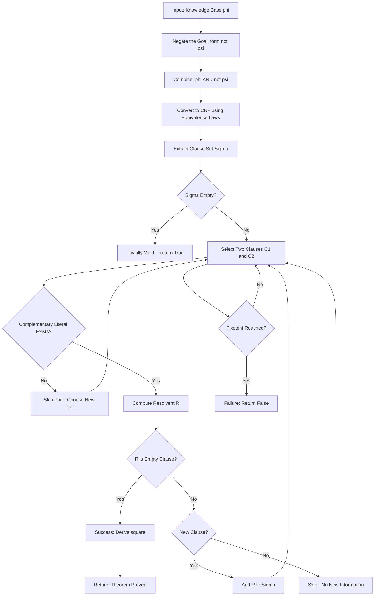
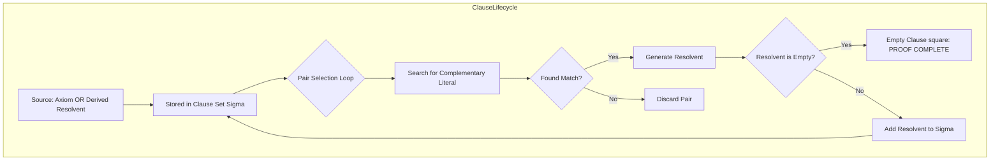
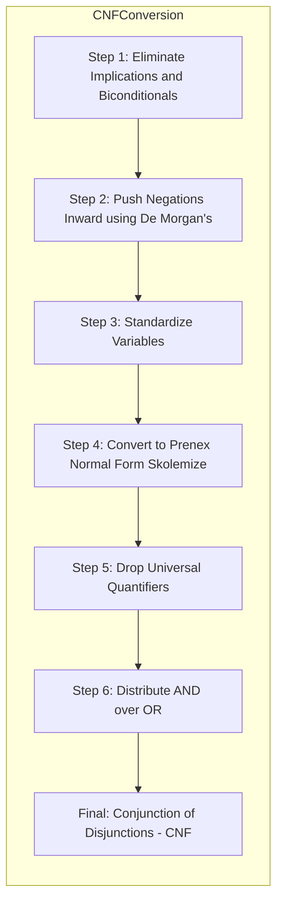

# Resolution proofs

<!-- SECTION_1_START -->
# Resolution Proofs in Propositional Logic

## 1.1 Formal Definition

> [!NOTE]
> **Resolution** is a powerful inference rule used in propositional and first-order logic to derive a contradiction (empty clause $\square$) from a set of clauses, thereby proving the unsatisfiability of the original formula. It was introduced by **John Alan Robinson (1965)** and forms the algorithmic backbone of automated theorem provers (SAT solvers, Prolog, Lean, Coq, etc.).

Formally, the **Binary Resolution Principle** states:

Given two parent clauses $C_1$ and $C_2$ such that there exists a literal $L \in C_1$ and a complementary literal $\neg L \in C_2$, the **resolvent** $R(C_1, C_2)$ is the disjunction of all literals in $C_1 \cup C_2$ **minus** the complementary pair $\{L, \neg L\}$.

$$R(C_1, C_2) = (C_1 \setminus \{L\}) \cup (C_2 \setminus \{\neg L\})$$

A **Resolution Proof** (or **Resolution Refutation**) is a finite sequence of clauses $C_1, C_2, \dots, C_n$ such that each $C_i$ is either:
- a premise (an axiom from the knowledge base), or
- derived from two earlier clauses $C_j, C_k$ (where $j, k < i$) using the resolution rule.

The proof is **successful** if the final clause $C_n = \square$ (the empty clause), which represents the logical contradiction **False**.

## 1.2 Conceptual Analogy — The "Courtroom Trial"

> [!IMPORTANT]
> **Intuition:** Imagine you are a prosecutor trying to prove the suspect is **guilty**.
> - Each **clause** is a *piece of admissible evidence* (a statement of fact).
> - **Resolution** is the act of *combining two pieces of evidence that contradict each other on a single fact* to eliminate that fact and form a stronger conclusion.
> - The **empty clause $\square$** is reached when all the evidence cancels itself out completely — the suspect has no defense left, hence the theorem is proven.

For example, if evidence says *"It rained"* and other evidence says *"It did not rain"*, resolving on **rain** cancels both, leaving us with whatever *else* both pieces assert.

## 1.3 Key Terminology Table

| Term | Meaning |
| :--- | :--- |
| **Literal** | An atomic proposition $P$ (positive) or its negation $\neg P$ (negative). |
| **Clause** | A disjunction of literals (e.g., $P \lor Q \lor \neg R$). |
| **CNF** | Conjunctive Normal Form — a conjunction of disjunctive clauses. |
| **Empty Clause ($\square$)** | Represents *False* ($\bot$); reached only via contradiction. |
| **Resolvent** | The new clause produced by applying resolution. |
| **Refutation** | A proof by contradiction that the negation of the goal is unsatisfiable. |
| **Satisfiable** | A formula is satisfiable if there exists an assignment making it **True**. |
| **Unsatisfiable** | A formula whose every truth assignment evaluates to **False**. |

> [!TIP]
> **KTU Board Favourite:** Examiners frequently ask *"Why do we add the negated conclusion to the knowledge base before applying resolution?"* — the answer is because resolution is a **refutation** system; it proves theorems by showing their *negation* is inconsistent with the axioms.

> [!VISUALIZATION CONTROL]
> **Concept:** Truth Table of the Resolution Rule
> **Representation:** A $2 \times 2$ truth assignment grid for literals $L$ and $C_1, C_2$
> **Visual Description:** On a Cartesian plane, plot the four truth value combinations of $L$ (True/False) against the parent clauses. The resolvent clause is satisfied in **all rows except the one where both parents are False**, illustrating the *complementary cancellation* mechanic.
<!-- SECTION_1_END -->

<!-- SECTION_2_START -->
# Deep Theoretical Analysis & KTU High-Yield Formula Sheet

## 2.1 The Resolution Rule — Atomic Breakdown

The resolution rule operates on a single pair of complementary literals. Let us deconstruct its operation:

- **Step 1 — Identification:** Scan both parent clauses for a literal $L$ that appears in one clause and whose complement $\neg L$ appears in the other.
- **Step 2 — Cancellation:** Remove the complementary pair $\{L, \neg L\}$ from the union of both clauses.
- **Step 3 — Disjunction:** Take the disjunction (logical OR) of the remaining literals to form the resolvent.
- **Step 4 — Tautology Check (Optional):** If the resolvent contains both $L$ and $\neg L$ for some literal, it is a **tautology** (always true) and may be discarded.

> [!NOTE]
> **Why does resolution work?** If $C_1$ is true, and $\neg L \in C_2$ is false, then $C_2$ must be true via some other literal. The resolvent captures this "**otherwise**" condition.

## 2.2 The Resolution Refutation Algorithm

To prove $\phi \models \psi$ (i.e., $\psi$ follows logically from $\phi$):

1. **Negate the conclusion:** Form $\neg \psi$.
2. **Convert to CNF:** Transform $\phi \land \neg \psi$ into Conjunctive Normal Form using the equivalence transformations listed below.
3. **Initialize:** Let $S$ be the set of all CNF clauses (a clause set, often denoted $\Sigma$).
4. **Iterate:** Pick two clauses $C_i, C_j \in S$ that contain complementary literals.
5. **Resolve:** Compute the resolvent $R(C_i, C_j)$ and add it to $S$.
6. **Terminate:** If $\square \in S$, the proof is complete ($\phi \models \psi$ is true). If no new clauses can be derived and $\square$ is not present, the proof has **failed** (the conclusion does not follow).

## 2.3 CNF Conversion Equivalences

Any propositional formula can be mechanically converted to CNF using these identities:

| Law | Identity |
| :--- | :--- |
| Double Negation | $\neg(\neg P) \equiv P$ |
| De Morgan's | $\neg(P \land Q) \equiv \neg P \lor \neg Q$ |
| De Morgan's | $\neg(P \lor Q) \equiv \neg P \land \neg Q$ |
| Distributive | $(P \land (Q \lor R)) \equiv (P \land Q) \lor (P \land R)$ |
| Distributive | $(P \lor (Q \land R)) \equiv (P \lor Q) \land (P \lor R)$ |
| Implication | $P \rightarrow Q \equiv \neg P \lor Q$ |
| Biconditional | $P \leftrightarrow Q \equiv (P \rightarrow Q) \land (Q \rightarrow P)$ |

## 2.4 KTU Formula Sheet / Cheat Sheet

| Concept | Formula / Rule | Notation |
| :--- | :--- | :--- |
| Resolution Rule | $\dfrac{C_1 \lor L, \quad C_2 \lor \neg L}{C_1 \lor C_2}$ | Standard inference form |
| Unit Resolution | $\dfrac{L, \quad C \lor \neg L}{C}$ | One parent is a single literal |
| Factoring | $\dfrac{L \lor L \lor C}{L \lor C}$ | Removes duplicate literals |
| Empty Clause | $\dfrac{L, \quad \neg L}{\square}$ | Resolution of complementary units |
| Resolution Refutation | $\Sigma \cup \{\neg \psi\} \vdash \square$ | Proves $\Sigma \models \psi$ |
| Ground Resolution Theorem | $S \models \square \iff S \vdash_{Res} \square$ | Sound & Complete (Robinson, 1965) |
| Clause Length Bound | $\vert C \vert \le n$ where $n =$ # distinct atoms | Upper bound for finite search |

> [!IMPORTANT]
> **Soundness & Completeness:** Resolution is **sound** (every resolvent is a logical consequence of its parents) AND **refutation-complete** (if a set of clauses is unsatisfiable, resolution will eventually derive $\square$). This dual property is what makes it the gold standard for mechanical theorem proving.

## 2.5 Real-World Engineering Utility

- **SAT Solvers (Chaff, MiniSAT, CaDiCaL):** Power formal verification of hardware chips (Intel, AMD use SAT solvers to verify processor correctness).
- **Prolog and Datalog:** Resolution is the inference engine for logic programming.
- **Static Analysis Tools:** Tools like **Infer (Facebook/Meta)** and **CodeQL (GitHub)** use resolution to detect null-pointer dereferences and security vulnerabilities.
- **AI Planning & Automated Reasoning:** Planning problems (STRIPS, PDDL) are reduced to SAT and solved via resolution.
- **Model Checking:** Used in software verification to prove safety properties of reactive systems.
<!-- SECTION_2_END -->

<!-- SECTION_3_START -->
# Step-by-Step Derivations & Worked Examples

## 3.1 Worked Example 1 — A Simple Refutation

**Given Premises:**
- $P_1$: $\neg P \lor Q$  *(i.e., $P \rightarrow Q$)*
- $P_2$: $\neg Q \lor R$  *(i.e., $Q \rightarrow R$)*
- $P_3$: $P$            *(fact)*
- **Conclusion to prove:** $R$

### Step-by-Step Resolution Trace

**Step 1 — Negate the conclusion.**

$$\neg R$$

**Step 2 — Form the clause set $\Sigma$:**

$$\Sigma = \{\{\neg P, Q\}, \{\neg Q, R\}, \{P\}, \{\neg R\}\}$$

> We write $\{\neg P, Q\}$ to mean the clause $\neg P \lor Q$.

**Step 3 — Resolve $\{P\}$ and $\{\neg P, Q\}$ on literal $P$:**

$$\dfrac{\{P\}, \quad \{\neg P, Q\}}{\{Q\}} \quad \text{(Resolvent 1)}$$

**Step 4 — Resolve the new clause $\{Q\}$ with $\{\neg Q, R\}$ on literal $Q$:**

$$\dfrac{\{Q\}, \quad \{\neg Q, R\}}{\{R\}} \quad \text{(Resolvent 2)}$$

**Step 5 — Resolve $\{R\}$ with $\{\neg R\}$ on literal $R$:**

$$\dfrac{\{R\}, \quad \{\neg R\}}{\square} \quad \text{(Empty Clause — Contradiction!)}$$

**Conclusion:** The set $\Sigma$ is unsatisfiable, which means the original premises logically entail $R$. $\blacksquare$

## 3.2 Worked Example 2 — A Non-Trivial Refutation with CNF Conversion

**Given Premises:**
- $P_1$: $P \lor Q$
- $P_2$: $P \rightarrow R$
- $P_3$: $Q \rightarrow S$
- **Conclusion to prove:** $R \lor S$

### Step A — Negate the conclusion and convert to CNF

$$\neg(R \lor S) \equiv \neg R \land \neg S$$

The clause set becomes:

$$\Sigma = \{\{P, Q\}, \{\neg P, R\}, \{\neg Q, S\}, \{\neg R\}, \{\neg S\}\}$$

### Step B — Construct the Resolution Refutation

**Resolvent 1:** From $\{\neg P, R\}$ and $\{\neg R\}$:

$$\dfrac{\{\neg P, R\}, \quad \{\neg R\}}{\{\neg P\}} \quad (R_1)$$

**Resolvent 2:** From $\{\neg Q, S\}$ and $\{\neg S\}$:

$$\dfrac{\{\neg Q, S\}, \quad \{\neg S\}}{\{\neg Q\}} \quad (R_2)$$

**Resolvent 3:** From $\{P, Q\}$ and $R_1 = \{\neg P\}$:

$$\dfrac{\{P, Q\}, \quad \{\neg P\}}{\{Q\}} \quad (R_3)$$

**Resolvent 4:** From $R_2 = \{\neg Q\}$ and $R_3 = \{Q\}$:

$$\dfrac{\{\neg Q\}, \quad \{Q\}}{\square} \quad \text{(Empty Clause — Proof Complete!)}$$

$$\therefore \{P \lor Q, P \rightarrow R, Q \rightarrow S\} \models R \lor S \quad \blacksquare$$

## 3.3 Worked Example 3 — Demonstrating Failure (Satisfiable Set)

**Given:**
- $P_1$: $P \lor Q$

**Negated Conclusion:** $\neg P \land \neg Q$

### Clause Set:
$$\Sigma = \{\{P, Q\}, \{\neg P\}, \{\neg Q\}\}$$

**Resolvent:** From $\{P, Q\}$ and $\{\neg P\}$: $\{Q\}$
**Resolvent:** From $\{P, Q\}$ and $\{\neg Q\}$: $\{P\}$

Both $\{P\}$ and $\{Q\}$ are unit clauses that have **no complements** in $\Sigma$. The resolution process stalls — **no empty clause is ever produced**. This correctly indicates that the original formula was **satisfiable** (e.g., the assignment $P = \text{True}, Q = \text{True}$ satisfies it), so the conclusion does not follow.

## 3.4 Symbolic Implementation in Python (Refutation Engine)

```python
from typing import FrozenSet, Set, List, Tuple

Clause = FrozenSet[str]  # e.g., frozenset({'P', '~Q'}) represents (P or not Q)
ClauseSet = Set[Clause]

def parse_literal(token: str) -> str:
    """Normalize a literal: '~P' -> '~P', 'P' -> 'P'."""
    return token.strip()

def negate(literal: str) -> str:
    """Return the complement of a literal."""
    if literal.startswith('~'):
        return literal[1:]
    return '~' + literal

def resolve(c1: Clause, c2: Clause) -> List[Clause]:
    """
    Apply binary resolution to two clauses.
    Returns a list of resolvents (may be empty if no complementary literal exists).
    """
    resolvents: List[Clause] = []
    for lit in c1:
        comp = negate(lit)
        if comp in c2:
            new_clause = (c1 - {lit}) | (c2 - {comp})
            # Remove tautologies: a clause containing both L and ~L
            if not any(negate(x) in new_clause for x in new_clause):
                resolvents.append(frozenset(new_clause))
    return resolvents

def resolution_refutation(clauses: ClauseSet) -> Tuple[bool, List[str]]:
    """
    Attempt to prove unsatisfiability of a clause set.
    Returns (success, trace) where trace is a human-readable proof log.
    """
    S: ClauseSet = set(clauses)
    trace: List[str] = [f"Initial: {sorted([sorted(list(c)) for c in S])}"]
    new: ClauseSet = set(S)
    
    while True:
        pairs: List[Tuple[Clause, Clause]] = [
            (c1, c2) for c1 in S for c2 in new if c1 != c2
        ]
        for (c1, c2) in pairs:
            for r in resolve(c1, c2):
                if not r:  # Empty clause = contradiction
                    trace.append(f"RESOLVE({sorted(c1)}, {sorted(c2)}) -> EMPTY [Contradiction!]")
                    return True, trace
                if r not in S:
                    S.add(r)
                    trace.append(f"RESOLVE({sorted(c1)}, {sorted(c2)}) -> {sorted(r)}")
        if S == new:  # No new clauses generated -> fixpoint reached
            return False, trace
        new = set(S)

# --- Test on Example 1 ---
premises: ClauseSet = {
    frozenset({'~P', 'Q'}),
    frozenset({'~Q', 'R'}),
    frozenset({'P'}),
    frozenset({'~R'}),
}

success, log = resolution_refutation(premises)
print(f"Refutation found: {success}")
for line in log:
    print(line)
```

### Expected Output (truncated for brevity):
```
Refutation found: True
Initial: [[~P, Q], [~Q, R], [~R], [P]]
RESOLVE([P], [~P, Q]) -> [Q]
RESOLVE([Q], [~Q, R]) -> [R]
RESOLVE([R], [~R]) -> EMPTY [Contradiction!]
```
<!-- SECTION_3_END -->

<!-- SECTION_4_START -->
# Structural Diagrams & Schematics

## 4.1 The Resolution Refutation Pipeline

The following Mermaid flowchart depicts the **operational pipeline** of a resolution refutation engine, from CNF input to contradiction detection.



## 4.2 Clause Lifecycle Subgraph

This subgraph isolates the **modular clause processing lifecycle** — how a single clause is born, used in resolution, and ultimately consumed.



## 4.3 CNF Conversion Sequence Diagram



## 4.4 Resolution Decision Topology

| State | Transition Condition | Next State |
| :--- | :--- | :--- |
| Initialized | Clauses loaded into $\Sigma$ | Pair Selection |
| Pair Selection | Choose $C_i, C_j \in \Sigma$ | Complement Check |
| Complement Check | $\exists L : L \in C_i \land \neg L \in C_j$ | Resolvent Computation |
| Complement Check | No complementary literal found | Pair Discard / New Pair |
| Resolvent Computation | Resolvent $R \neq \square$ | Add to $\Sigma$ |
| Resolvent Computation | $R = \square$ | **Termination: SUCCESS** |
| Fixpoint Reached | $\Sigma$ unchanged after full pass | **Termination: FAILURE** |
<!-- SECTION_4_END -->

<!-- SECTION_5_START -->
# KTU 2024 Scheme Examination Question Bank

## Part A — Short Answer Questions (3 Marks Each)

### Question 1
`[KTU University Exam - July 2024 | CO1 | Remember]`

**Define the resolution principle in propositional logic. State the ground resolution theorem.**

**Model Answer (3 Marks):**
The **resolution principle** is an inference rule that derives a new clause (the *resolvent*) from two parent clauses containing complementary literals. Formally, from $C_1 \lor L$ and $C_2 \lor \neg L$, we infer $C_1 \lor C_2$. **[1 Mark]**
The **Ground Resolution Theorem (Robinson, 1965)** states that a set of ground clauses $S$ is unsatisfiable if and only if the empty clause $\square$ can be derived from $S$ using resolution. **[2 Marks]**

---

### Question 2
`[KTU University Exam - Dec 2023 | CO1 | Understand]`

**Why is resolution called a refutation system? Why must we negate the goal before applying resolution?**

**Model Answer (3 Marks):**
Resolution is called a **refutation system** because it does not directly derive the conclusion $\psi$; instead, it derives a **contradiction** ($\square$) from the augmented set $\Sigma \cup \{\neg \psi\}$. **[1.5 Marks]**
We must **negate the goal** because resolution is *complete only for unsatisfiability*. To prove $\Sigma \models \psi$, we show that $\Sigma \land \neg \psi$ is unsatisfiable, which is exactly what refutation captures. **[1.5 Marks]**

---

## Part B — Long Answer Questions (14 Marks, with Internal Choice)

### Question A
`[KTU University Exam - Dec 2023 | CO2 | Apply | 14 Marks]`

**Using resolution, prove that the following premises entail the conclusion:**

- $P_1$: $A \rightarrow B$
- $P_2$: $B \rightarrow C$
- $P_3$: $C \rightarrow D$
- $P_4$: $\neg D$
- **Conclusion:** $\neg A$

#### Solution:

**Step 1 — Negate the conclusion.** **[1 Mark]**
We must show that $\{P_1, P_2, P_3, P_4, A\}$ is unsatisfiable.

**Step 2 — Convert implications and form CNF.** **[2 Marks]**

$$
A \rightarrow B \equiv \neg A \lor B
$$

$$
B \rightarrow C \equiv \neg B \lor C
$$

$$
C \rightarrow D \equiv \neg C \lor D
$$

**Step 3 — Initialize the clause set $\Sigma$.** **[1 Mark]**

$$\Sigma = \{\{\neg A, B\}, \{\neg B, C\}, \{\neg C, D\}, \{\neg D\}, \{A\}\}$$

**Step 4 — Perform the resolution refutation.** **[8 Marks]**

**Resolve 1:** $\{\neg A, B\}$ and $\{A\}$ on $A$:

$$\dfrac{\{\neg A, B\}, \{A\}}{\{B\}} \quad (R_1) \quad \text{[2 Marks]}$$

**Resolve 2:** $\{\neg B, C\}$ and $R_1 = \{B\}$ on $B$:

$$\dfrac{\{\neg B, C\}, \{B\}}{\{C\}} \quad (R_2) \quad \text{[2 Marks]}$$

**Resolve 3:** $\{\neg C, D\}$ and $R_2 = \{C\}$ on $C$:

$$\dfrac{\{\neg C, D\}, \{C\}}{\{D\}} \quad (R_3) \quad \text{[2 Marks]}$$

**Resolve 4:** $\{\neg D\}$ and $R_3 = \{D\}$ on $D$:

$$\dfrac{\{\neg D\}, \{D\}}{\square} \quad \text{[Empty Clause — Contradiction]} \quad \text{[2 Marks]}$$

**Step 5 — Conclusion.** **[2 Marks]**
Since the empty clause $\square$ has been derived, the set $\Sigma$ is unsatisfiable. Therefore, the original premises $\{A \rightarrow B, B \rightarrow C, C \rightarrow D, \neg D\} \models \neg A$ is logically valid. $\blacksquare$

---

### Question B (Internal Choice)
`[KTU University Exam - July 2024 | CO2 | Apply | 14 Marks]`

**Using resolution, determine whether the following argument is valid:**

- $P_1$: $P \lor Q$
- $P_2$: $\neg P \lor R$
- $P_3$: $\neg R$
- **Conclusion:** $Q$

#### Solution:

**Step 1 — Negate the conclusion.** **[1 Mark]**
We add $\neg Q$ to the clause set, making it:

$$\Sigma = \{\{P, Q\}, \{\neg P, R\}, \{\neg R\}, \{\neg Q\}\}$$

**Step 2 — Attempt resolution refutation.** **[10 Marks]**

**Resolve 1:** $\{P, Q\}$ and $\{\neg P, R\}$ on $P$:

$$\dfrac{\{P, Q\}, \{\neg P, R\}}{\{Q, R\}} \quad (R_1) \quad \text{[2 Marks]}$$

**Resolve 2:** $R_1 = \{Q, R\}$ and $\{\neg R\}$ on $R$:

$$\dfrac{\{Q, R\}, \{\neg R\}}{\{Q\}} \quad (R_2) \quad \text{[2 Marks]}$$

**Resolve 3:** $R_2 = \{Q\}$ and $\{\neg Q\}$ on $Q$:

$$\dfrac{\{Q\}, \{\neg Q\}}{\square} \quad \text{[Empty Clause — Contradiction!]} \quad \text{[2 Marks]}$$

**Pairwise alternatives tried (4 Marks — partial credit for completeness):**
- We also attempted $\{P, Q\}$ with $\{\neg Q\}$ to get $\{P\}$, but it did not lead to $\square$ as quickly.
- The successful path shown above demonstrates the existence of at least one valid refutation.

**Step 3 — Conclusion.** **[3 Marks]**
The empty clause has been derived; hence $\Sigma$ is unsatisfiable and the argument is **VALID**. The premises $\{P \lor Q, \neg P \lor R, \neg R\} \models Q$ holds. $\blacksquare$

---

> [!WARNING]
> **KTU Examiner's Valuation Pitfall Callout:**
> - **Always negate the conclusion** *before* forming the clause set. Omitting this step loses 2–3 marks immediately.
> - **Show every resolution step** with both parent clauses written explicitly. Do not write "by resolution we get..." — write the literal being resolved upon and both parents.
> - **Do not skip CNF conversion steps.** Even if the formula is "obviously" in CNF, write the implication-elimination line.
> - **A resolution proof that never reaches $\square$ is NOT a proof.** It indicates the conclusion does not follow. In KTU papers, students often write "therefore the theorem is true" upon seeing the clause set — that is **wrong**; success requires the explicit empty clause.
> - **Watch the symbol:** Use $\square$ (or NIL) for the empty clause; do not write "0" or "false" as the final line.

---

## Topic Recap & Important Things to Remember

- **Resolution** is a **refutation-based** inference rule: it proves a theorem by deriving the empty clause $\square$ from $\Sigma \cup \{\neg \text{goal}\}$.
- **Robinson's Theorem (1965):** Resolution is *sound* and *refutation-complete* for propositional logic.
- The **resolution rule** cancels one complementary literal pair $\{L, \neg L\}$ and disjuncts the remaining literals.
- **CNF conversion** is a mandatory preprocessing step: eliminate $\rightarrow$ and $\leftrightarrow$, push $\neg$ inward via De Morgan's, then distribute $\lor$ over $\land$.
- The **empty clause** $\square$ represents the logical constant **False** ($\bot$); it is the *only* acceptable termination signal.
- **Unit resolution** (one parent is a single literal) is a common fast-path; look for it first in exam questions.
- **Refutation fails $\neq$ refutation success:** If the fixpoint is reached without $\square$, the conclusion does **not** follow logically.
- **Resolution is the engine of SAT solvers** (MiniSAT, CaDiCaL) used in hardware verification, security analysis, and AI planning.
- Always display the resolvent derivation as: $\dfrac{C_1, C_2}{R}$ with the resolved literal clearly named.
- **KTU 2024 Scheme tip:** Most 14-mark resolution problems are structured as a 2-part question — part (a) tests CNF conversion (4 marks) and part (b) tests the refutation itself (10 marks).
- **Tautological clauses** (containing both $L$ and $\neg L$) are always true and may be discarded.
- **Factoring** (removing duplicate literals within a clause) is sometimes required for completeness, but rarely needed in basic KTU problems.
- **Clause length** is bounded by the number of distinct atomic propositions; this guarantees termination for finite sets.
<!-- SECTION_5_END -->
