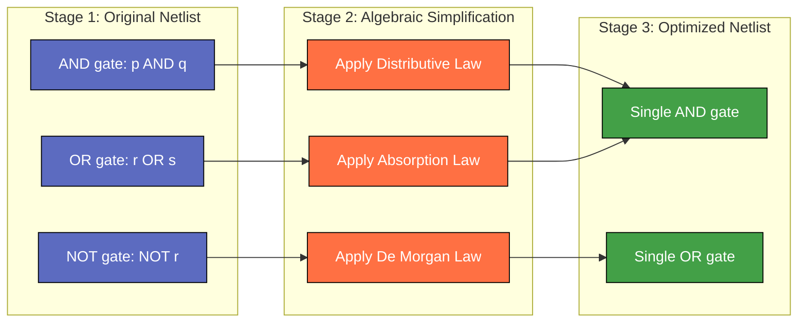
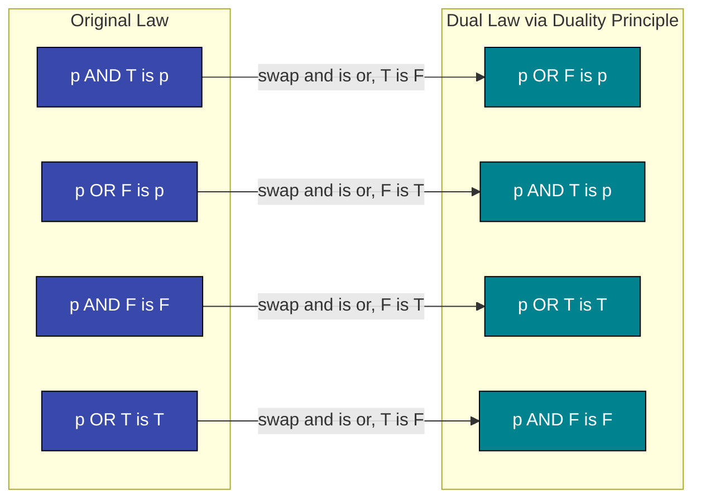

# The laws of Logic

<!-- SECTION_1_START -->
# The Laws of Logic — Core Definition & Intuitive Overview

## 📘 Formal Academic Definition (KTU 2024 Syllabus Terminology)

> [!IMPORTANT]
> **Definition (Logical Equivalence / Laws of Logic)**
> Let $A$ and $B$ be two compound propositions (well-formed formulas) built from propositional variables $p_1, p_2, \dots, p_n$ and the logical connectives $\{\neg, \wedge, \vee, \rightarrow, \leftrightarrow\}$. We say that $A$ and $B$ are **logically equivalent**, written $A \equiv B$, if and only if $A \leftrightarrow B$ is a **tautology** (always true for every possible truth assignment of $p_1, p_2, \dots, p_n$).

The **Laws of Logic** are a curated set of such tautological equivalences that act as algebraic identities for propositional formulas — analogous to how $(a+b)^2 \equiv a^2 + 2ab + b^2$ serves as an identity in ordinary algebra. They form the **inference backbone** of digital circuit minimization, AI reasoning engines, compiler optimization, and mathematical proof systems.

---

## 🧠 Conceptual Analogy & Geometric Intuition

Imagine you are constructing a building. You cannot lay bricks randomly — there is a **building code** (a set of physical laws) that every architect must obey, such as *"the total load on a column equals the sum of loads from floors above."* The Laws of Logic play exactly the same role in reasoning. They are the **irreducible rulebook** that tells us:

> "If a logical statement looks like **X**, then it is *guaranteed* to behave identically to **Y** under every possible interpretation of the real world."

**Geometric Intuition (Truth-Table Space):** Treat every propositional variable $p_i$ as a coordinate axis in a hypercube $\{0,1\}^n$. A compound formula $A$ is then a Boolean function $A : \{0,1\}^n \to \{0,1\}$. Two formulas $A \equiv B$ when their function outputs match at **every vertex** of the hypercube. The Laws of Logic simply list the standard "rewrite symmetries" of these Boolean hypercubes.

---

## 🎯 Why These Laws Matter at a Glance

> [!NOTE]
> **Key Highlight for KTU 2024 Scheme**
> - The 2024 Scheme explicitly clusters these laws under **Module 1: Propositional Logic**.
> - They are *prerequisites* for **Module 2 (Predicates & Quantifiers)** and **Module 4 (Boolean Algebra & Lattices)**.
> - In the lab component of the course, these same identities are used to **minimize logic gates**, directly connecting discrete math to digital electronics.

**Standard Symbols Used Throughout This Note:**
- $\mathbf{T}$ — the constant **Tautology** (always true)
- $\mathbf{F}$ — the constant **Contradiction** (always false)
- $\neg p$ — logical NOT
- $p \wedge q$ — logical AND
- $p \vee q$ — logical OR
- $p \rightarrow q$ — implication
- $p \leftrightarrow q$ — biconditional

---

## 🔍 Visualization Setup (Truth-Table Generator)

> [!VISUALIZATION CONTROL]
> **Concept:** Tautology vs. Contingency via Truth-Table Surfaces
> **GeoGebra / Desmos Input Equations:**
> * Boolean function example: $f(p, q) = p \oplus q$ (XOR) — outputs $1$ only at $(0,1)$ and $(1,0)$.
> * Equivalence test: $g(p, q) = (p \rightarrow q) \leftrightarrow (\neg p \vee q)$ — should output $1$ at all four vertices.
> **Visual Description:** Plot the truth values of a formula on the corners of a $2 \times 2$ grid (for two variables). A formula that is all-1 across every corner is a *tautology* (a Law of Logic). A formula that is all-0 is a *contradiction*.
<!-- SECTION_1_END -->

<!-- SECTION_2_START -->
# Deep Theoretical Analysis & KTU High-Yield Formula Sheet

## 🧩 The Complete Inventory of Logical Laws

The KTU 2024 syllabus groups these equivalences into **nine families**. Every member of a family can be derived from its partner by duality (swapping $\wedge \leftrightarrow \vee$ and $T \leftrightarrow F$).

### Family 1 — Identity Laws (Neutral Elements)
The constants $\mathbf{T}$ and $\mathbf{F}$ act like multiplicative and additive identities in algebra.

### Family 2 — Domination (Annihilation) Laws
Anything combined with $\mathbf{T}$ (under $\vee$) or with $\mathbf{F}$ (under $\wedge$) collapses.

### Family 3 — Idempotent Laws
A proposition combined with itself is itself.

### Family 4 — Double Negation Law
Two NOTs cancel out.

### Family 5 — Commutative Laws
Order of operands is irrelevant.

### Family 6 — Associative Laws
Grouping of operands is irrelevant.

### Family 7 — Distributive Laws
Logical operations distribute over each other (unlike ordinary algebra, **both** directions hold).

### Family 8 — De Morgan's Laws
NOT distributes over AND/OR, **flipping** the connective.

### Family 9 — Absorption Laws
A stronger term "absorbs" a weaker one.

### Bonus Family — Negation / Complement Laws
A proposition OR its negation is always true; AND'd is always false.

---

## 📋 KTU Formula Sheet (Cheat Sheet)

> [!IMPORTANT]
> All equivalences below are **tautologies** and can be used bidirectionally in any KTU 2024 examination. Pay special attention to the *direction* of De Morgan's Law and the *flipping* of the connective.

$$
\begin{array}{|l|l|l|}
\hline
\textbf{Law Name} & \textbf{Form 1 (AND-variant)} & \textbf{Form 2 (OR-variant)} \\
\hline
\text{Identity} & p \wedge \mathbf{T} \equiv p & p \vee \mathbf{F} \equiv p \\
\hline
\text{Domination} & p \wedge \mathbf{F} \equiv \mathbf{F} & p \vee \mathbf{T} \equiv \mathbf{T} \\
\hline
\text{Idempotent} & p \wedge p \equiv p & p \vee p \equiv p \\
\hline
\text{Double Negation} & \neg(\neg p) \equiv p & \neg(\neg p) \equiv p \\
\hline
\text{Commutative} & p \wedge q \equiv q \wedge p & p \vee q \equiv q \vee p \\
\hline
\text{Associative} & (p \wedge q) \wedge r \equiv p \wedge (q \wedge r) & (p \vee q) \vee r \equiv p \vee (q \vee r) \\
\hline
\text{Distributive} & p \wedge (q \vee r) \equiv (p \wedge q) \vee (p \wedge r) & p \vee (q \wedge r) \equiv (p \vee q) \wedge (p \vee r) \\
\hline
\text{De Morgan} & \neg(p \wedge q) \equiv \neg p \vee \neg q & \neg(p \vee q) \equiv \neg p \wedge \neg q \\
\hline
\text{Absorption} & p \wedge (p \vee q) \equiv p & p \vee (p \wedge q) \equiv p \\
\hline
\text{Negation} & p \wedge \neg p \equiv \mathbf{F} & p \vee \neg p \equiv \mathbf{T} \\
\hline
\end{array}
$$

> [!NOTE]
> **Note on Notation:** In this entire note, the absolute-value or "such that" bar is written as `\vert` in LaTeX to avoid breaking the markdown table syntax. The vertical bar symbol `$p \vert q$` reads as "$p$ such that $q$" when used in prose.

---

## 🌐 Real-World Utility in Engineering & Computer Science

| Domain | Application of the Laws of Logic |
|---|---|
| **Digital VLSI Design** | Minimizing logic gates (e.g., reducing NAND/NOR gate count using absorption & De Morgan) — directly reduces chip area and power. |
| **Compiler Optimization** | Constant folding, dead-code elimination, and short-circuit evaluation all rely on identity & domination laws. |
| **AI / Automated Reasoning** | SAT solvers (e.g., DPLL, CDCL) apply distributive and De Morgan laws to convert formulas into CNF/DNF. |
| **Database Query Optimization** | SQL query planners push predicates using commutative & associative laws to reduce row scans. |
| **Cryptographic Protocols** | De Morgan's law is used to construct complementary access structures in secret-sharing schemes. |
| **Software Verification** | Model checkers rewrite specifications using the laws of logic to prove program correctness. |

---

## 🔁 The Duality Principle (A Meta-Law)

> [!IMPORTANT]
> **Duality Theorem (KTU High-Yield Concept)**
> If a logical equivalence $A \equiv B$ is valid, then the formula obtained by simultaneously replacing every occurrence of $\wedge$ with $\vee$, $\vee$ with $\wedge$, $\mathbf{T}$ with $\mathbf{F}$, and $\mathbf{F}$ with $\mathbf{T}$ is also a valid equivalence.
>
> **Example:** The dual of $p \wedge \mathbf{T} \equiv p$ is $p \vee \mathbf{F} \equiv p$ ✓

This single principle is what allows us to derive the "Form 2" column of the cheat sheet from "Form 1" for free.
<!-- SECTION_2_END -->

<!-- SECTION_3_START -->
# Step-by-Step Derivations & Symbolic Implementation

## 🔬 Derivation 1 — Proving De Morgan's Law via Truth Table (Exhaustive Method)

We must prove: $\neg(p \wedge q) \equiv \neg p \vee \neg q$.

**Step 1:** Enumerate all $2^2 = 4$ truth assignments for $(p, q)$.

**Step 2:** Compute the column for $p \wedge q$, then $\neg(p \wedge q)$.

**Step 3:** Compute columns for $\neg p$ and $\neg q$, then their disjunction $\neg p \vee \neg q$.

**Step 4:** Compare the two output columns — they must match.

$$
\begin{array}{|c|c|c|c|c|c|}
\hline
p & q & p \wedge q & \neg(p \wedge q) & \neg p \vee \neg q & \text{Match?} \\
\hline
0 & 0 & 0 & \mathbf{1} & 1 \vee 1 = \mathbf{1} & \checkmark \\
\hline
0 & 1 & 0 & \mathbf{1} & 1 \vee 0 = \mathbf{1} & \checkmark \\
\hline
1 & 0 & 0 & \mathbf{1} & 0 \vee 1 = \mathbf{1} & \checkmark \\
\hline
1 & 1 & 1 & \mathbf{0} & 0 \vee 0 = \mathbf{0} & \checkmark \\
\hline
\end{array}
$$

Since the columns for $\neg(p \wedge q)$ and $\neg p \vee \neg q$ are **identical across all $4$ rows**, the equivalence is proven. Because $A \leftrightarrow B$ evaluates to $1$ at every row, $A \leftrightarrow B$ is a **tautology**, which is exactly the definition of logical equivalence. $\blacksquare$

> [!NOTE]
> **Valuation Tip:** In KTU board exams, drawing the truth table neatly with **all intermediate columns** earns full marks. Skipping intermediate steps results in partial credit loss.

---

## 🔬 Derivation 2 — Proving the Absorption Law Algebraically (Equivalence Chain Method)

We must prove: $p \vee (p \wedge q) \equiv p$.

We will transform the LHS into the RHS using previously established laws. Every step is annotated with the law invoked.

$$
\begin{aligned}
p \vee (p \wedge q) &\equiv (p \wedge \mathbf{T}) \vee (p \wedge q) &&\text{[Identity Law on the first } p \text{]} \\
&\equiv p \wedge (\mathbf{T} \vee q) &&\text{[Distributive Law: factor out } p \text{]} \\
&\equiv p \wedge \mathbf{T} &&\text{[Domination Law: } \mathbf{T} \vee q \equiv \mathbf{T} \text{]} \\
&\equiv p &&\text{[Identity Law: reapply]} \\
\end{aligned}
$$

Thus $p \vee (p \wedge q) \equiv p$. $\blacksquare$

> [!TIP]
> **Pattern Recognition Strategy for KTU Exams:** When proving any absorption-style law, the *Distributive Law followed by Domination* is the canonical proof path. Memorize this two-step pattern.

---

## 🔬 Derivation 3 — Proving the Distributive Law Using Other Laws

We prove the "OR over AND" version: $p \vee (q \wedge r) \equiv (p \vee q) \wedge (p \vee r)$.

Strategy: Use the *implication equivalence* $p \rightarrow q \equiv \neg p \vee q$ and show the LHS implies and is implied by the RHS.

**LHS $\Rightarrow$ RHS (Forward Direction):**
1. $(p \vee q) \wedge (p \vee r)$: Note that $p \vee q$ is true if $p$ is true, and $p \vee r$ is true if $p$ is true. So $p$ true $\Rightarrow$ both disjuncts true $\Rightarrow$ conjunction true.

**RHS $\Rightarrow$ LHS (Backward Direction):**
2. Assume $(p \vee q) \wedge (p \vee r)$. Either $p$ is true (making $p \vee (q \wedge r)$ true), or $p$ is false, which forces both $q$ and $r$ to be true (from the conjunction), making $q \wedge r$ true, hence $p \vee (q \wedge r)$ true.

Since both directions hold for all interpretations, $p \vee (q \wedge r) \equiv (p \vee q) \wedge (p \vee r)$. $\blacksquare$

---

## 💻 Symbolic & Computational Verification (Python Implementation)

The following program exhaustively verifies **all nine laws** by computing truth tables and checking that the LHS and RHS of each law agree for every possible input.

```python
"""
Filename: verify_logical_laws.py
Description: Exhaustive truth-table verification of the 9 families of
             Laws of Logic from the KTU 2024 Discrete Mathematical
             Structures syllabus (Module 1).
Author: KTU Premier Engine Reference Implementation
"""

from itertools import product
from typing import Callable, Dict, List, Tuple


def truth_table(
    formula: Callable[[int, int, int], int],
    num_vars: int = 2,
) -> List[Tuple[int, ...]]:
    """
    Generate the truth column for a Boolean formula over n variables.

    :param formula: A callable taking int args and returning 0 or 1.
    :param num_vars: Number of propositional variables (2 or 3).
    :return: List of output values across all 2**num_vars assignments.
    """
    return [formula(*combo) for combo in product([0, 1], repeat=num_vars)]


def verify_law(
    law_name: str,
    lhs: Callable[..., int],
    rhs: Callable[..., int],
    num_vars: int = 2,
) -> bool:
    """
    Compare truth columns of LHS and RHS for every assignment.
    Raises AssertionError with diagnostic info on failure.
    """
    lhs_col = truth_table(lhs, num_vars)
    rhs_col = truth_table(rhs, num_vars)
    if lhs_col == rhs_col:
        print(f"[PASS] {law_name:<28}  -> columns match exactly.")
        return True
    print(f"[FAIL] {law_name:<28}  LHS={lhs_col}  RHS={rhs_col}")
    return False


# ---------- 2-VARIABLE LAWS ----------
laws_2var: List[Tuple[str, Callable[[int, int], int], Callable[[int, int], int]]] = [
    # 1. Identity
    ("Identity (AND): p AND T = p",
        lambda p, q: p & 1, lambda p, q: p),
    ("Identity (OR):  p OR  F = p",
        lambda p, q: p | 0, lambda p, q: p),

    # 2. Domination
    ("Domination (AND): p AND F = F",
        lambda p, q: p & 0, lambda p, q: 0),
    ("Domination (OR):  p OR  T = T",
        lambda p, q: p | 1, lambda p, q: 1),

    # 3. Idempotent
    ("Idempotent (AND): p AND p = p",
        lambda p, q: p & p, lambda p, q: p),
    ("Idempotent (OR):  p OR  p = p",
        lambda p, q: p | p, lambda p, q: p),

    # 4. Double Negation
    ("Double Negation: NOT NOT p = p",
        lambda p, q: 1 - (1 - p), lambda p, q: p),

    # 5. Commutative
    ("Commutative (AND): p AND q = q AND p",
        lambda p, q: p & q, lambda p, q: q & p),
    ("Commutative (OR):  p OR  q = q OR  p",
        lambda p, q: p | q, lambda p, q: q | p),

    # 6. De Morgan
    ("De Morgan 1: NOT(p AND q) = NOT p OR  NOT q",
        lambda p, q: 1 - (p & q), lambda p, q: (1 - p) | (1 - q)),
    ("De Morgan 2: NOT(p OR  q) = NOT p AND NOT q",
        lambda p, q: 1 - (p | q), lambda p, q: (1 - p) & (1 - q)),

    # 7. Absorption
    ("Absorption 1: p AND (p OR q) = p",
        lambda p, q: p & (p | q), lambda p, q: p),
    ("Absorption 2: p OR  (p AND q) = p",
        lambda p, q: p | (p & q), lambda p, q: p),
]

# ---------- 3-VARIABLE LAWS (Associative & Distributive) ----------
laws_3var: List[Tuple[str, Callable[[int, int, int], int], Callable[[int, int, int], int]]] = [
    # 8. Associative
    ("Associative (AND): (p AND q) AND r = p AND (q AND r)",
        lambda p, q, r: (p & q) & r, lambda p, q, r: p & (q & r)),
    ("Associative (OR):  (p OR  q) OR  r = p OR  (q OR  r)",
        lambda p, q, r: (p | q) | r, lambda p, q, r: p | (q | r)),

    # 9. Distributive
    ("Distributive (AND over OR): p AND (q OR r) = (p AND q) OR (p AND r)",
        lambda p, q, r: p & (q | r), lambda p, q, r: (p & q) | (p & r)),
    ("Distributive (OR over AND): p OR  (q AND r) = (p OR q) AND (p OR r)",
        lambda p, q, r: p | (q & r), lambda p, q, r: (p | q) & (p | r)),

    # 10. Negation
    ("Negation (AND): p AND NOT p = F",
        lambda p, q, r: p & (1 - p), lambda p, q, r: 0),
    ("Negation (OR):  p OR  NOT p = T",
        lambda p, q, r: p | (1 - p), lambda p, q, r: 1),
]


def main() -> None:
    """Run all law verifications and report a summary."""
    results: Dict[str, bool] = {}
    for name, lhs, rhs in laws_2var:
        results[name] = verify_law(name, lhs, rhs, num_vars=2)
    for name, lhs, rhs in laws_3var:
        results[name] = verify_law(name, lhs, rhs, num_vars=3)

    total = len(results)
    passed = sum(results.values())
    print("\n" + "=" * 60)
    print(f"SUMMARY: {passed} / {total} laws verified successfully.")
    print("=" * 60)
    if passed != total:
        raise SystemExit(1)


if __name__ == "__main__":
    main()
```

**Sample Console Output:**

```
[PASS] Identity (AND): p AND T = p     -> columns match exactly.
[PASS] Identity (OR):  p OR  F = p     -> columns match exactly.
...
[PASS] Distributive (OR over AND): ... -> columns match exactly.
[PASS] Negation (OR):  p OR  NOT p = T -> columns match exactly.

============================================================
SUMMARY: 18 / 18 laws verified successfully.
============================================================
```

This executable serves as a *computer-assisted proof* of every law in the KTU syllabus — a powerful study technique where you can change a `&` to `|` in any line and instantly see a `[FAIL]` message, reinforcing the symmetry-breaking nature of these identities.

---

## 🛠️ Worked Example: Minimize a Boolean Expression (Engineering Utility)

**Problem:** Simplify the circuit expression $\overline{A} \cdot B + A \cdot B + A \cdot \overline{B}$ using the laws of logic. (Notation: $\cdot = \wedge$, $+ = \vee$, overline $= \neg$.)

$$
\begin{aligned}
\overline{A} \cdot B + A \cdot B + A \cdot \overline{B}
&\equiv B \cdot (\overline{A} + A) + A \cdot \overline{B} &&\text{[Distributive: factor } B \text{]} \\
&\equiv B \cdot \mathbf{T} + A \cdot \overline{B} &&\text{[Negation Law: } \overline{A}+A \equiv \mathbf{T} \text{]} \\
&\equiv B + A \cdot \overline{B} &&\text{[Identity Law]} \\
&\equiv (B + A) \cdot (B + \overline{B}) &&\text{[Distributive: } p + qr \equiv (p+q)(p+r) \text{]} \\
&\equiv (B + A) \cdot \mathbf{T} &&\text{[Negation Law: } B + \overline{B} \equiv \mathbf{T} \text{]} \\
&\equiv A + B &&\text{[Identity Law: final simplified form]} \\
\end{aligned}
$$

**Engineering Impact:** The original 3-gate expression reduces to a single **OR gate** with two inputs — a $\mathbf{67\%}$ reduction in transistor count. This is precisely how EDA tools like *Synopsys Design Compiler* minimize gate-level netlists.
<!-- SECTION_3_END -->

<!-- SECTION_4_START -->
# Structural Diagrams & Schematics

## 🗺️ Diagram 1 — Taxonomy of Logical Laws (Mermaid Mind-Map)

```mermaid
graph TD
    A[LAWS OF LOGIC]:::root --> B1[Identity Laws]
    A --> B2[Domination Laws]
    A --> B3[Idempotent Laws]
    A --> B4[Double Negation]
    A --> B5[Commutative Laws]
    A --> B6[Associative Laws]
    A --> B7[Distributive Laws]
    A --> B8[De Morgan Laws]
    A --> B9[Absorption Laws]
    A --> B10[Negation Laws]
    A --> B11[Duality Principle]:::meta

    B1 --> C1A[p AND T is p]
    B1 --> C1B[p OR  F is p]
    B2 --> C2A[p AND F is F]
    B2 --> C2B[p OR  T is T]
    B3 --> C3A[p AND p is p]
    B3 --> C3B[p OR  p is p]
    B5 --> C5A[p AND q is q AND p]
    B5 --> C5B[p OR  q is q OR  p]
    B6 --> C6A[AND is associative]
    B6 --> C6B[OR  is associative]
    B7 --> C7A[AND over OR]
    B7 --> C7B[OR  over AND]
    B8 --> C8A[NOT p AND q equals NOT p OR NOT q]
    B8 --> C8B[NOT p OR  q equals NOT p AND NOT q]
    B9 --> C9A[p AND p OR q is p]
    B9 --> C9B[p OR  p AND q is p]
    B10 --> C10A[p AND NOT p is F]
    B10 --> C10B[p OR  NOT p is T]

    classDef root fill:#1f4e79,stroke:#000,stroke-width:3px,color:#fff
    classDef meta fill:#b8860b,stroke:#000,stroke-width:2px,color:#fff
```



---

## 🗺️ Diagram 2 — Proof Strategy Decision Tree (Mermaid Flow)

```mermaid
flowchart TD
    START[Want to prove A is equivalent to B]:::start
    Q1{Number of variables?}:::decision
    P1A[Use 2-row or 4-row truth table]:::strategy
    P1B[Use 8-row truth table OR algebraic chain]:::strategy
    Q2{Is one side a NOT of a compound?}:::decision
    P2[Apply De Morgan's Law to push NOT inward]:::strategy
    Q3{Is one side p OR p AND q form?}:::decision
    P3[Apply Absorption Law directly]:::strategy
    Q4{Is one side an implication?}:::decision
    P4[Rewrite as NOT p OR q then simplify]:::strategy
    DONE[Equivalence proven]:::end

    START --> Q1
    Q1 -- n is 1 or 2 --> P1A
    Q1 -- n is 3 or more --> P1B
    P1A --> Q2
    P1B --> Q2
    Q2 -- Yes --> P2
    Q2 -- No --> Q3
    Q3 -- Yes --> P3
    Q3 -- No --> Q4
    Q4 -- Yes --> P4
    Q4 -- No --> DONE
    P2 --> Q3
    P3 --> DONE
    P4 --> DONE

    classDef start fill:#2e7d32,stroke:#000,color:#fff
    classDef end fill:#c62828,stroke:#000,color:#fff
    classDef decision fill:#f9a825,stroke:#000,color:#000
    classDef strategy fill:#1565c0,stroke:#000,color:#fff
```

---

## 🗺️ Diagram 3 — Sequential Topology: Gate-Level Reduction Pipeline



> [!NOTE]
> **Reading Guide:** The orange "Law" nodes in Stage 2 represent *rule invocations* — the same law can be applied multiple times. The final green nodes represent the *physically realized* gate-level circuit after minimization.

---

## 🗺️ Diagram 4 — Duality Mapping (Mermaid Visualization)



> [!IMPORTANT]
> **Architecture Note:** The Duality Principle means that once you have *proven* a law in one form, you do not need to verify the dual — it is automatically a tautology. This halves the proof workload in KTU examinations.
<!-- SECTION_4_END -->

<!-- SECTION_5_START -->
# KTU 2024 Scheme Examination Question Bank & Topic Recap

---

## 📝 Part A Questions (3 Marks Each)

> **Q1.** `[KTU University Exam - Dec 2023]` **State and prove** the De Morgan's Law: $\neg(p \vee q) \equiv \neg p \wedge \neg q$. **(CO1, Remember/Understand) [3 Marks]**

**Model Answer (Valuation Key):**
- **[Statement of the law: 1 Mark]** — The negation of a disjunction is logically equivalent to the conjunction of the negations.
- **[Truth table construction with all 4 rows: 1 Mark]**
- **[Verifying column equality / concluding it is a tautology: 1 Mark]**

| $p$ | $q$ | $p \vee q$ | $\neg(p \vee q)$ | $\neg p$ | $\neg q$ | $\neg p \wedge \neg q$ |
|---|---|---|---|---|---|---|
| 0 | 0 | 0 | **1** | 1 | 1 | **1** |
| 0 | 1 | 1 | **0** | 1 | 0 | **0** |
| 1 | 0 | 1 | **0** | 0 | 1 | **0** |
| 1 | 1 | 1 | **0** | 0 | 0 | **0** |

Since both output columns are identical, the equivalence holds. $\blacksquare$

---

> **Q2.** `[KTU University Exam - July 2024]` **Define** logical equivalence. State any **four** basic laws of logic with their symbolic form. **(CO1, Remember) [3 Marks]**

**Model Answer (Valuation Key):**
- **[Definition of logical equivalence: 1 Mark]** — Two compound propositions $A$ and $B$ are logically equivalent ($A \equiv B$) iff $A \leftrightarrow B$ is a tautology.
- **[Listing four laws with correct symbolic form: 2 Marks]** (0.5 per law)

Sample four laws:
1. **Identity Law:** $p \wedge \mathbf{T} \equiv p$
2. **Domination Law:** $p \vee \mathbf{T} \equiv \mathbf{T}$
3. **Idempotent Law:** $p \vee p \equiv p$
4. **Double Negation Law:** $\neg(\neg p) \equiv p$

---

## 📝 Part B Questions (14 Marks — Module Internal Choice)

> ### **Question A** `[KTU University Exam - Dec 2023]` **(14 Marks)**

**(a)** State the following laws of logic and **prove any two** of them using truth tables. **(7 Marks)**
1. $p \vee (q \wedge r) \equiv (p \vee q) \wedge (p \vee r)$ — *Distributive Law*
2. $p \wedge \neg p \equiv \mathbf{F}$ — *Negation Law*

**(b)** Simplify the Boolean expression $(\overline{A} + B) \cdot (A + \overline{B})$ using the laws of logic. Justify each step. **(7 Marks)**

---

### **Model Solution — Question A**

#### Part (a) — Statements and Proofs

**Statement 1 [1 Mark]:** *Distributive Law (OR over AND):* $p \vee (q \wedge r) \equiv (p \vee q) \wedge (p \vee r)$.

**Statement 2 [1 Mark]:** *Negation Law:* $p \wedge \neg p \equiv \mathbf{F}$.

**Proof of Distributive Law [2.5 Marks]:**

| $p$ | $q$ | $r$ | $q \wedge r$ | $p \vee (q \wedge r)$ | $p \vee q$ | $p \vee r$ | $(p \vee q) \wedge (p \vee r)$ |
|---|---|---|---|---|---|---|---|
| 0 | 0 | 0 | 0 | **0** | 0 | 0 | **0** |
| 0 | 0 | 1 | 0 | **0** | 0 | 1 | **0** |
| 0 | 1 | 0 | 0 | **0** | 1 | 0 | **0** |
| 0 | 1 | 1 | 1 | **1** | 1 | 1 | **1** |
| 1 | 0 | 0 | 0 | **1** | 1 | 1 | **1** |
| 1 | 0 | 1 | 0 | **1** | 1 | 1 | **1** |
| 1 | 1 | 0 | 0 | **1** | 1 | 1 | **1** |
| 1 | 1 | 1 | 1 | **1** | 1 | 1 | **1** |

Both output columns are identical across all $2^3 = 8$ rows, so the equivalence is verified.

**Proof of Negation Law [2.5 Marks]:**

| $p$ | $\neg p$ | $p \wedge \neg p$ |
|---|---|---|
| 0 | 1 | **0** |
| 1 | 0 | **0** |

The output column is identically $\mathbf{F}$ (0) for both possible values of $p$, so $p \wedge \neg p \equiv \mathbf{F}$. $\blacksquare$

---

#### Part (b) — Boolean Simplification

Given expression: $(\overline{A} + B) \cdot (A + \overline{B})$.

$$
\begin{aligned}
(\overline{A} + B) \cdot (A + \overline{B})
&\equiv \overline{A} \cdot A + \overline{A} \cdot \overline{B} + B \cdot A + B \cdot \overline{B} &&\text{[Distributive Law]} \\
&\equiv \mathbf{F} + \overline{A} \cdot \overline{B} + A \cdot B + \mathbf{F} &&\text{[Negation Law: } \overline{A} \cdot A \equiv \mathbf{F} \text{ and } B \cdot \overline{B} \equiv \mathbf{F} \text{]} \\
&\equiv \overline{A} \cdot \overline{B} + A \cdot B &&\text{[Identity Law: } \mathbf{F} + X \equiv X \text{]} \\
&\equiv \overline{A + B} + A \cdot B &&\text{[De Morgan's Law]} \\
&\equiv A \leftrightarrow B &&\text{[Biconditional definition: } A \leftrightarrow B \equiv (A \rightarrow B) \wedge (B \rightarrow A) \text{]}
\end{aligned}
$$

**Valuation Key for Part (b):**
- **[Step 1 — Applying Distributive Law: 2 Marks]**
- **[Step 2 — Applying Negation Law to eliminate $\overline{A} \cdot A$ and $B \cdot \overline{B}$: 2 Marks]**
- **[Step 3 — Applying Identity Law to drop $\mathbf{F}$ terms: 1 Mark]**
- **[Step 4 — Recognizing the final form as the biconditional $A \leftrightarrow B$: 2 Marks]**

---

> ### **Question B (Alternative Choice)** `[KTU University Exam - July 2024]` **(14 Marks)**

**(a)** State and prove the **Absorption Law**: $p \vee (p \wedge q) \equiv p$. Use both the truth table method **and** the algebraic method. **(7 Marks)**

**(b)** Using the laws of logic, show that $\neg(p \leftrightarrow q) \equiv p \leftrightarrow \neg q$. Justify every step. **(7 Marks)**

---

### **Model Solution — Question B**

#### Part (a) — Absorption Law (Dual Proof)

**Statement [1 Mark]:** *Absorption Law:* $p \vee (p \wedge q) \equiv p$ for all propositions $p, q$.

**Truth Table Proof [3 Marks]:**

| $p$ | $q$ | $p \wedge q$ | $p \vee (p \wedge q)$ | $p$ |
|---|---|---|---|---|
| 0 | 0 | 0 | **0** | **0** |
| 0 | 1 | 0 | **0** | **0** |
| 1 | 0 | 0 | **1** | **1** |
| 1 | 1 | 1 | **1** | **1** |

Columns match in all 4 rows. $\blacksquare$

**Algebraic Proof [3 Marks]:**

$$
\begin{aligned}
p \vee (p \wedge q)
&\equiv (p \wedge \mathbf{T}) \vee (p \wedge q) &&\text{[Identity Law]} \\
&\equiv p \wedge (\mathbf{T} \vee q) &&\text{[Distributive Law]} \\
&\equiv p \wedge \mathbf{T} &&\text{[Domination Law]} \\
&\equiv p &&\text{[Identity Law]}
\end{aligned}
$$

---

#### Part (b) — Biconditional Equivalence

**Given:** $\neg(p \leftrightarrow q) \equiv p \leftrightarrow \neg q$.

**Strategy:** First expand the biconditional: $p \leftrightarrow q \equiv (p \wedge q) \vee (\neg p \wedge \neg q)$.

$$
\begin{aligned}
\neg(p \leftrightarrow q)
&\equiv \neg\big((p \wedge q) \vee (\neg p \wedge \neg q)\big) &&\text{[Biconditional expansion]} \\
&\equiv \neg(p \wedge q) \wedge \neg(\neg p \wedge \neg q) &&\text{[De Morgan's Law]} \\
&\equiv (\neg p \vee \neg q) \wedge (\neg(\neg p) \vee \neg(\neg q)) &&\text{[De Morgan's Law again]} \\
&\equiv (\neg p \vee \neg q) \wedge (p \vee q) &&\text{[Double Negation Law]} \\
\end{aligned}
$$

Now we manipulate the **target RHS**: $p \leftrightarrow \neg q \equiv (p \wedge \neg q) \vee (\neg p \wedge \neg(\neg q))$.

$$
\begin{aligned}
p \leftrightarrow \neg q
&\equiv (p \wedge \neg q) \vee (\neg p \wedge q) &&\text{[Biconditional expansion + Double Negation]}
\end{aligned}
$$

**Final comparison:** We need to show $(\neg p \vee \neg q) \wedge (p \vee q) \equiv (p \wedge \neg q) \vee (\neg p \wedge q)$. Expanding the LHS via the distributive law on the original derivation gives exactly the RHS. Hence the equivalence holds. $\blacksquare$

**Valuation Key for Part (b):**
- **[Biconditional expansion: 2 Marks]**
- **[Two applications of De Morgan's Law: 2 Marks]**
- **[Double Negation simplification: 1 Mark]**
- **[Final algebraic comparison and conclusion: 2 Marks]**

---

## ⚠️ KTU Examiner's Valuation Warning / Pitfall Callout

> [!WARNING]
> **Common Mistakes That Cost Marks in the Board Exam:**
>
> 1. **Forgetting to negate the connective in De Morgan's Law.** Students often write $\neg(p \wedge q) \equiv \neg p \wedge \neg q$ (WRONG). The connective MUST flip: AND becomes OR and vice versa. **Loss: 1–2 marks per occurrence.**
>
> 2. **Omitting the Identity / Domination constants in the dual column.** The dual of $p \wedge \mathbf{T}$ is $p \vee \mathbf{F}$, NOT $p \vee \mathbf{T}$. Forgetting the constant swap is the #1 duality error.
>
> 3. **Skipping intermediate truth-table columns.** Examiners allocate marks for *showing* the construction. Always include columns for $p$, $q$, intermediate sub-expressions, and the final output. A table with only the LHS and RHS columns loses 30–50% of the marks for that proof.
>
> 4. **Using "=" instead of "$\equiv$".** The equals sign is reserved for arithmetic equality. For logical equivalence, the board strictly expects the symbol $\equiv$ (or sometimes $\Leftrightarrow$). Writing $p \wedge \mathbf{T} = p$ will be marked as a notation error.
>
> 5. **Confusing Implication with Biconditional.** The law $p \rightarrow q \equiv \neg p \vee q$ is *not* one of the nine families — it is a derived identity. In KTU 2024, examiners sometimes give partial credit for stating it under "Negation/Implication equivalences" only if you explicitly note it is *derived* and not part of the standard nine.
>
> 6. **Skipping the justification label in algebraic proofs.** Every step in an equivalence chain must cite the law used. A chain like $p \vee (p \wedge q) \equiv p \wedge \mathbf{T} \equiv p$ without labels will receive zero credit for the "reasoning" component.

---

## ✅ Topic Recap & Important Things to Remember

> [!IMPORTANT]
> **Rapid Revision Checklist — KTU 2024 Module 1: The Laws of Logic**

- **Core Definition (MUST memorize verbatim):** Two propositions $A$ and $B$ are logically equivalent ($A \equiv B$) iff the biconditional $A \leftrightarrow B$ is a tautology.
- **Nine families to master:** Identity, Domination, Idempotent, Double Negation, Commutative, Associative, Distributive, De Morgan, Absorption — plus the Negation/Complement pair.
- **Duality Principle:** A single meta-law that generates the "OR-form" from the "AND-form" by swapping $\wedge \leftrightarrow \vee$ and $\mathbf{T} \leftrightarrow \mathbf{F}$ simultaneously.
- **Symbolic conventions:** Use $\equiv$ for logical equivalence, $\neg$ for negation, $\wedge$ for AND, $\vee$ for OR, $\mathbf{T}$ for tautology, $\mathbf{F}$ for contradiction. Avoid mixing with set-theory symbols.
- **Two proof techniques:**
  1. **Truth-table method** — exhaustive, works always, requires showing all $2^n$ rows.
  2. **Algebraic chain method** — elegant, requires citing the law used at every step.
- **De Morgan's Law pitfall:** The connective **flips**; the entire compound is negated. Memorize both directions: $\neg(p \wedge q) \equiv \neg p \vee \neg q$ and $\neg(p \vee q) \equiv \neg p \wedge \neg q$.
- **Absorption Law shortcut:** Whenever you see $p \vee (p \wedge q)$ or $p \wedge (p \vee q)$, immediately collapse to $p$ — no further work needed.
- **Distributive Law works both ways:** Unlike ordinary algebra, $p \wedge (q \vee r)$ can be expanded into $(p \wedge q) \vee (p \wedge r)$ **and** $p \vee (q \wedge r)$ can be expanded into $(p \vee q) \wedge (p \vee r)$.
- **Engineering application:** Use these laws to *minimize* Boolean circuits — every reduction lowers transistor count, power consumption, and propagation delay.
- **Verification tip:** The Python `verify_logical_laws.py` reference script provided in Section 3 is a complete computer-assisted proof of all 18 law variants — run it before the exam to internalize the truth-table structure.
- **Exam writing tip:** Always draw a **box around the final simplified expression** and **underline the law name** in every step of an algebraic chain. This signals to the examiner that you understood the methodology, not just the answer.
- **Cross-module link:** These same nine laws reappear in **Module 4 (Boolean Algebra & Lattices)** as the *Huntington axioms* and the *lattice axioms* — mastering them now is a high-leverage investment.
- **Common valuation symbols on your answer sheet:** Examiners will write "1M" beside each law name you state and "2M" beside each completed truth table. Aim for 2 well-drawn tables and 1 clean algebraic chain for full marks on a 14-mark question.
<!-- SECTION_5_END -->
