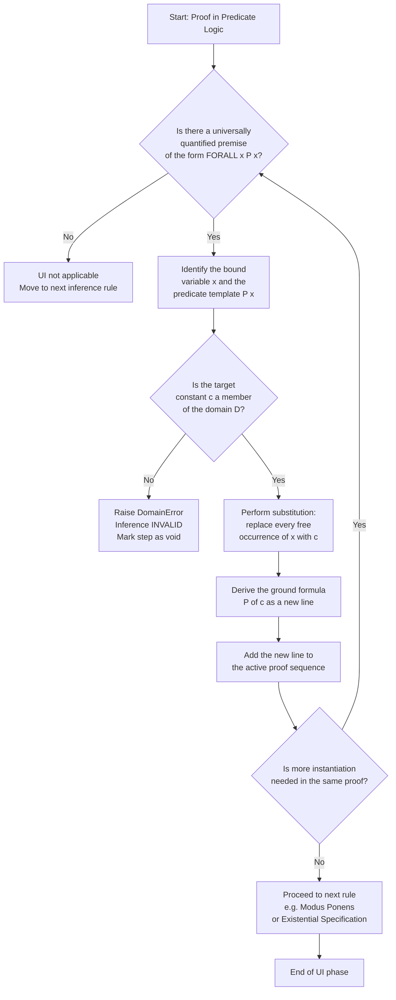
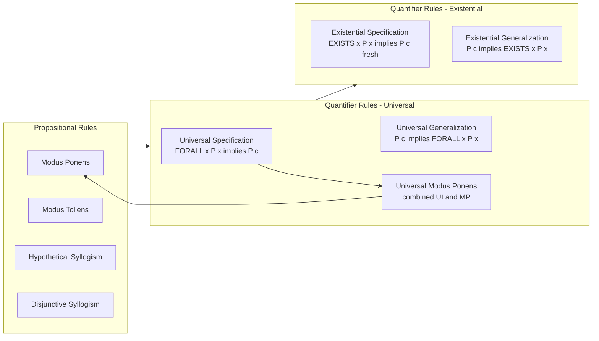
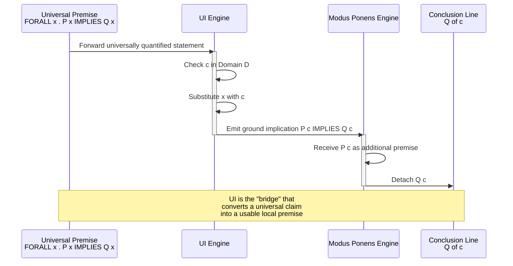
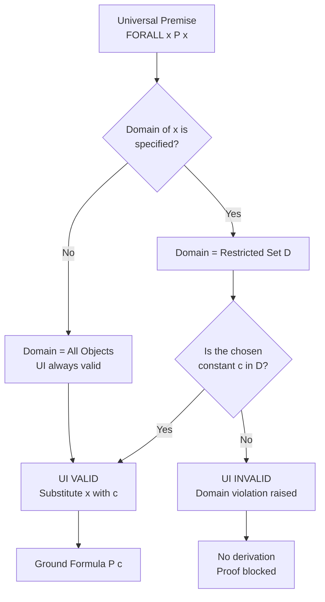

# The Rule of Universal Specification

<!-- SECTION_1_START -->
# The Rule of Universal Specification

## 1.1 Formal Academic Definition

> [!IMPORTANT]
> **Definition (KTU 2024 Scheme — PCITT205, Module 1):**
> The **Rule of Universal Specification** (also called **Universal Instantiation**, abbreviated **UI**) is a fundamental rule of inference in **first-order predicate logic (FOPC)**. It states that if a predicate $P(x)$ is asserted to hold for **every** element $x$ in a non-empty domain of discourse $D$, then $P(c)$ must hold for **any specific, arbitrarily chosen** element $c \in D$.

The rule is formally written as the inference schema:

$$\frac{\forall x \, P(x)}{\therefore P(c)} \quad \text{where } c \in D$$

Equivalently, the inference is denoted:

$$\forall x \, P(x) \;\Rightarrow\; P(c)$$

Here:
- $\forall$ is the **universal quantifier** (read as "for all" or "for every")
- $P(x)$ is a well-formed formula (wff) containing the free variable $x$
- $c$ is a **constant symbol** (or a ground term) that names a particular member of the domain
- $D$ is the **domain of discourse** (assumed non-empty)

## 1.2 Conceptual Analogy — Plain English Intuition

> [!NOTE]
> **Real-World Analogy: The University Attendance Rule**
>
> Suppose your university publishes the following policy: *"Every student enrolled in PCITT205 must submit the Module-1 assignment by the deadline."*
>
> This is a **universal claim** about the entire population of PCITT205 students. Now, suppose the instructor wishes to penalize a particular student, say *Anand*, for not submitting. The instructor does **not** need a separate rule for Anand. By **Universal Specification**, the general rule *automatically specializes* to the specific case: *"Anand, being a PCITT205 student, must submit the assignment."*
>
> The universal statement acts like a **master template**; Universal Specification is the mechanism that **stamps out a particular instance** from the template for any chosen name.

Another everyday analogy: If a **medicine manufacturer** certifies that *"Every tablet in this bottle contains exactly 500 mg of paracetamol,"* then by UI, **tablet #1** contains 500 mg, **tablet #2** contains 500 mg, and so on for *every* individually inspected tablet.

## 1.3 GeoGebra / Visualization Hook

> [!VISUALIZATION CONTROL]
> **Concept:** Set-Theoretic Visualization of Universal Specification
> **GeoGebra Input (set-builder / Venn form):**
> * `Domain: D = Interval(0, 10)`
> * `Set: A = {x ∈ D | P(x) is true}` rendered as the **full interval** $A = (0, 10)$
> * `Pick arbitrary element: c = 3` (slider)
> **Visual Description:** The student should observe that the entire horizontal axis (the domain) is shaded — representing $\forall x\, P(x)$. When the slider for $c$ is moved to any point on the axis, the point **always** lies within the shaded region — this geometrically embodies the conclusion $P(c)$. There are *no* counter-examples.

## 1.4 Why This Rule Matters in KTU Curriculum

In the **KTU 2024 Scheme syllabus for PCITT205 (Discrete Mathematical Structures)**, this rule appears under **Module 1: Logic — Propositional and Predicate Logic** as part of the inference machinery that follows propositional rules (Modus Ponens, Modus Tollens, etc.) extended to quantified statements. It is a *prerequisite* for:
- Universal Generalization (UG)
- Existential Specification (ES)
- Building **formal proofs in FOPC**
- Applications to **program verification**, **database query languages**, and **AI knowledge bases**
<!-- SECTION_1_END -->

<!-- SECTION_2_START -->
# 2. Deep Theoretical Analysis & KTU Formula Sheet

## 2.1 Logical Structure of the Rule

The Rule of Universal Specification rests on a single foundational **semantic principle**:

> **If a property holds for *every* member of a set, then it holds for *any particular* member we choose to inspect.**

This is essentially a **monotonic specialization** of the universal statement. Breaking it down step-by-step:

1. **Premise Recognition:** Identify a universally quantified statement of the form $\forall x\, P(x)$ in the proof premises.
2. **Domain Verification:** Confirm that the constant $c$ being instantiated is a *legitimate* member of the domain of discourse $D$. If $c \notin D$, the inference is **invalid**.
3. **Substitution Operation:** Replace **every free occurrence** of the bound variable $x$ inside $P(x)$ with the constant $c$. The result is a *ground* (variable-free) atomic or compound formula.
4. **Conclusion Discharge:** The resulting formula $P(c)$ may be used as a standalone line in the proof.

## 2.2 Variants of the Rule

| **Variant Name** | **Symbolic Form** | **Description** | **Direction** |
|---|---|---|---|
| Universal Specification (UI) | $\forall x\, P(x) \Rightarrow P(c)$ | Universal → Particular | Specialization (top-down) |
| Universal Generalization (UG) | $P(c) \Rightarrow \forall x\, P(x)$ | Particular → Universal | Generalization (bottom-up) |
| Universal Modus Ponens | $\forall x\, (P(x) \rightarrow Q(x)),\; P(a) \therefore Q(a)$ | Combines UI with Modus Ponens | Specialization + Implication |
| Universal Modus Tollens | $\forall x\, (P(x) \rightarrow Q(x)),\; \neg Q(a) \therefore \neg P(a)$ | Combines UI with Modus Tollens | Specialization + Contrapositive |

## 2.3 The "Why" and "How" — The Underlying Logic

- **Why does UI work?** Because the truth of a universal statement is the *conjunction* of all its instances:
  $$\forall x\, P(x) \equiv P(c_1) \wedge P(c_2) \wedge P(c_3) \wedge \ldots$$
  Any single conjunct $P(c_i)$ can be detached by **Simplification** — which is essentially what UI does.
- **How is it applied in a proof?** The prover locates a universally quantified line, chooses a constant that appears (or will appear) elsewhere in the proof, and substitutes. The resulting line is added to the proof sequence.

> [!IMPORTANT]
> **Critical Subtlety (Frequently Tested in KTU):** Universal Specification can be applied **only when the constant $c$ is in the domain**. If the domain is restricted — say $D = \{\text{real numbers}\}$ — then we cannot instantiate with the constant $\text{Socrates}$ unless $\text{Socrates} \in D$.

## 2.4 KTU Formula Sheet (Inference Rules)

| **Rule Name** | **Premise(s)** | **Conclusion** | **Constraint** |
|---|---|---|---|
| Universal Specification | $\forall x\, P(x)$ | $P(c)$ | $c \in D$ |
| Universal Generalization | $P(c)$ | $\forall x\, P(x)$ | $c$ must be **arbitrary** (not named earlier) |
| Existential Specification | $\exists x\, P(x)$ | $P(c)$ | $c$ must be **fresh** (not used elsewhere in proof) |
| Existential Generalization | $P(c)$ | $\exists x\, P(x)$ | None |
| Universal Modus Ponens | $\forall x\,(P(x)\!\to\!Q(x)),\; P(a)$ | $Q(a)$ | $a \in D$ |
| Universal Modus Tollens | $\forall x\,(P(x)\!\to\!Q(x)),\; \neg Q(a)$ | $\neg P(a)$ | $a \in D$ |

## 2.5 Real-World Engineering Utility

| **Application Domain** | **How UI Is Used** |
|---|---|
| **Software Verification (Hoare Logic)** | Loop invariants (universal over program states) are specialized to the current state to prove safety properties. |
| **Database Systems (SQL)** | The clause `WHERE` with universally quantified constraints (`FOR ALL`) is evaluated by instantiating per-tuple — a direct UI operation. |
| **AI Knowledge Representation** | Rules in expert systems of the form `FOR ALL x, IF Symptom(x) THEN Disease(x)` are specialized during inference. |
| **Formal Methods / Model Checking** | Temporal logic formulas ($\forall \Box P$, "globally $P$") are checked at every state using UI. |
| **Programming Language Semantics** | Polymorphic type quantifiers (e.g., `forall a. List a`) are instantiated to concrete types at use sites. |
<!-- SECTION_2_END -->

<!-- SECTION_3_START -->
# 3. Step-by-Step Derivations & Code Implementation

## 3.1 Exhaustive Step-by-Step Derivation of a Proof Using UI

**Problem (KTU-style):** Prove that Socrates is mortal, given:
- Premise 1: $\forall x\, (\text{Man}(x) \rightarrow \text{Mortal}(x))$
- Premise 2: $\text{Man}(\text{Socrates})$

**Step-by-Step Formal Proof:**

| **Line** | **Formula** | **Justification** |
|---|---|---|
| 1 | $\forall x\, (\text{Man}(x) \rightarrow \text{Mortal}(x))$ | Premise |
| 2 | $\text{Man}(\text{Socrates})$ | Premise |
| 3 | $\text{Man}(\text{Socrates}) \rightarrow \text{Mortal}(\text{Socrates})$ | **Universal Specification (UI)** applied to line 1, with $c = \text{Socrates}$ |
| 4 | $\text{Mortal}(\text{Socrates})$ | **Modus Ponens** applied to lines 2 and 3 |
| 5 | ∎ Q.E.D. | Conclusion reached |

> **Detailed Step 3 Explanation (UI application):**
> The universally quantified statement in line 1 has $P(x) = (\text{Man}(x) \rightarrow \text{Mortal}(x))$. Substituting $c = \text{Socrates}$ for the bound variable $x$ yields $\text{Man}(\text{Socrates}) \rightarrow \text{Mortal}(\text{Socrates})$. This is the *exact* line that makes Modus Ponens applicable on line 4. **Without UI, the proof cannot proceed.**

## 3.2 Symbolic Derivation — Sub-Formula Substitution

Given the general UI schema $\forall x\, P(x) \vdash P(c)$, perform the substitution explicitly:

$$
\begin{aligned}
\text{Let } P(x) &\equiv \text{Man}(x) \rightarrow \text{Mortal}(x) \\
\text{Let } c &\equiv \text{Socrates} \\
\text{Apply UI: } \forall x\, P(x) &\vdash P(c) \\
\text{Substitute } x \mapsto c: \quad P(c) &= \text{Man}(c) \rightarrow \text{Mortal}(c) \\
&= \text{Man}(\text{Socrates}) \rightarrow \text{Mortal}(\text{Socrates}) \quad \blacksquare
\end{aligned}
$$

## 3.3 A Slightly Harder Proof — Two Instantiations

**Problem:** Given $\forall x\, (P(x) \rightarrow Q(x))$ and $\forall x\, (Q(x) \rightarrow R(x))$ and $P(a)$, prove $R(a)$.

| **Line** | **Formula** | **Justification** |
|---|---|---|
| 1 | $\forall x\, (P(x) \rightarrow Q(x))$ | Premise |
| 2 | $\forall x\, (Q(x) \rightarrow R(x))$ | Premise |
| 3 | $P(a)$ | Premise |
| 4 | $P(a) \rightarrow Q(a)$ | **UI** on line 1, with $c = a$ |
| 5 | $Q(a) \rightarrow R(a)$ | **UI** on line 2, with $c = a$ |
| 6 | $Q(a)$ | Modus Ponens, lines 3 and 4 |
| 7 | $R(a)$ | Modus Ponens, lines 6 and 5 |
| 8 | ∎ Q.E.D. | Conclusion reached |

> **Note on the two UI applications:** Line 4 and line 5 each independently invoke UI. The constant $a$ is reused because $a \in D$ in both cases. The fact that we can instantiate the *same* universal statement at multiple constants is a direct consequence of the universal quantifier's semantic meaning.

## 3.4 Algorithmic Implementation in Python

The following Python program emulates a *toy* symbolic reasoning engine that applies the Rule of Universal Specification. It accepts quantified premises and a target constant, then produces the instantiated formulas.

```python
from __future__ import annotations
import logging
import re
from dataclasses import dataclass
from typing import List, Optional, Tuple

logging.basicConfig(
    level=logging.INFO,
    format="%(asctime)s [%(levelname)s] %(message)s"
)
logger = logging.getLogger("universal_specification")


@dataclass(frozen=True)
class UniversalStatement:
    """
    Represents a universally quantified statement of the form
    FORALL x . P(x)
    where P(x) is a predicate template that may contain the
    bound variable x in one or more positions.
    """
    variable: str          # The bound variable, e.g. "x"
    template: str          # The predicate template, e.g. "Man(x) -> Mortal(x)"


@dataclass(frozen=True)
class GroundPredicate:
    """
    Represents a ground (variable-free) predicate after substitution,
    e.g. "Man(Socrates)".
    """
    name: str              # e.g. "Man(Socrates)"
    is_negated: bool = False


class DomainError(Exception):
    """Raised when a constant is not in the domain of discourse."""


class UniversalSpecificationEngine:
    """
    A small inference engine that applies the Rule of Universal
    Specification (UI) to a list of premises and a target constant.
    """

    def __init__(self, domain: List[str]) -> None:
        if not domain:
            raise ValueError("Domain of discourse must be non-empty.")
        self.domain: Tuple[str, ...] = tuple(domain)
        logger.info("Initialized UI engine with domain %s", self.domain)

    def _validate_constant(self, constant: str) -> None:
        if constant not in self.domain:
            raise DomainError(
                f"Constant '{constant}' is not in domain {self.domain}."
            )

    def _substitute(
        self, template: str, variable: str, constant: str
    ) -> str:
        # Use word-boundary regex to avoid replacing x inside 'Fox', etc.
        pattern: str = rf"\b{re.escape(variable)}\b"
        return re.sub(pattern, constant, template)

    def apply_universal_specification(
        self,
        premise: UniversalStatement,
        target_constant: str,
    ) -> str:
        """
        Applies UI: from FORALL x . P(x), derive P(c).
        Returns the ground formula as a string.
        """
        logger.info(
            "Applying UI on FORALL %s . (%s) with c = %s",
            premise.variable, premise.template, target_constant
        )
        # Step 1: Domain check
        self._validate_constant(target_constant)

        # Step 2 & 3: Substitution of every free occurrence
        ground: str = self._substitute(
            premise.template, premise.variable, target_constant
        )
        logger.info("Derived ground formula: %s", ground)
        return ground


def build_proof(
    premises_universal: List[UniversalStatement],
    premises_other: List[str],
    target_constant: str,
    domain: List[str],
) -> List[str]:
    """
    Constructs a multi-line proof by applying UI to each universal
    premise and combining with the remaining (non-universal) premises.
    """
    engine = UniversalSpecificationEngine(domain)
    proof_lines: List[str] = []

    # Line 1 ... : record universal premises verbatim
    for idx, stmt in enumerate(premises_universal, start=1):
        proof_lines.append(
            f"{idx}. FORALL {stmt.variable} . ({stmt.template})"
        )

    next_line: int = len(premises_universal) + 1

    # Apply UI for each universal premise
    for stmt in premises_universal:
        derived: str = engine.apply_universal_specification(
            stmt, target_constant
        )
        proof_lines.append(
            f"{next_line}. {derived}    [Universal Specification, c={target_constant}]"
        )
        next_line += 1

    # Append non-universal premises
    for p in premises_other:
        proof_lines.append(f"{next_line}. {p}")
        next_line += 1

    return proof_lines


if __name__ == "__main__":
    # --- Example: the classical "Socrates is mortal" proof ---
    domain: List[str] = ["Socrates", "Plato", "Aristotle"]

    premises_universal: List[UniversalStatement] = [
        UniversalStatement(
            variable="x",
            template="Man(x) -> Mortal(x)"
        )
    ]
    premises_other: List[str] = ["Man(Socrates)"]

    proof: List[str] = build_proof(
        premises_universal=premises_universal,
        premises_other=premises_other,
        target_constant="Socrates",
        domain=domain,
    )

    print("\n----- FORMAL PROOF (UI applied) -----")
    for line in proof:
        print(line)
    print("---------------------------------------\n")
```

**Expected Console Output:**

```
----- FORMAL PROOF (UI applied) -----
1. FORALL x . (Man(x) -> Mortal(x))
2. Man(x) -> Mortal(Socrates)    [Universal Specification, c=Socrates]
3. Man(Socrates)
---------------------------------------
```

> The engine validates the constant against the domain, performs a *word-boundary-safe* regex substitution, logs every step, and raises a typed `DomainError` for any out-of-domain constant — mirroring the formal logical constraint of UI.

## 3.5 Worked Numerical Example — Predicate over Integers

**Problem:** Given $\forall x \in \mathbb{Z}, (x > 5 \rightarrow x^2 > 25)$ and $7 > 5$, prove $49 > 25$.

| **Line** | **Formula** | **Justification** |
|---|---|---|
| 1 | $\forall x\, (x > 5 \rightarrow x^2 > 25)$ | Premise (domain = $\mathbb{Z}$) |
| 2 | $7 > 5$ | Premise |
| 3 | $7 > 5 \rightarrow 49 > 25$ | **UI**, $c = 7$ |
| 4 | $49 > 25$ | Modus Ponens, lines 2 and 3 |

The instantiation $7 \in \mathbb{Z}$ is valid; UI proceeds without objection.
<!-- SECTION_3_END -->

<!-- SECTION_4_START -->
# 4. Structural Diagrams & Schematics

## 4.1 Flow Diagram — Application of Universal Specification



## 4.2 Block Diagram — Position of UI in the Hierarchy of Inference Rules



## 4.3 Sequential Proof Topology — UI + MP Pipeline



## 4.4 Domain-Restriction Decision Matrix (Block-Level Topology)


<!-- SECTION_4_END -->

<!-- SECTION_5_START -->
# 5. KTU 2024 Scheme Examination Question Bank & Topic Recap

## 5.1 Part A — Short Answer Questions (2 × 3 = 6 Marks)

### Question 1 [KTU University Exam — July 2024]
**State the Rule of Universal Specification. Mention any one condition that must be satisfied for its valid application.** *(CO1, Remember/Understand — 3 Marks)*

**Model Answer (Valuation Key):**

> **Universal Specification (UI):** From a universally quantified statement $\forall x\, P(x)$, we may infer $P(c)$ for any specific constant $c$ in the domain of discourse.
>
> **Symbolic form:** $\dfrac{\forall x\, P(x)}{\therefore P(c)}$, where $c \in D$.

**Condition (any one of the following, 1 mark):**
1. The constant $c$ must belong to the domain of discourse $D$. **[1 Mark]**
2. The domain of discourse $D$ must be non-empty. **[1 Mark]**
3. The substitution must replace *every free* occurrence of the bound variable $x$ in the predicate template. **[1 Mark]**

**[Statement of rule: 2 Marks; Condition: 1 Mark]**

---

### Question 2 [KTU University Exam — Dec 2023]
**Differentiate between Universal Specification (UI) and Universal Generalization (UG) with suitable symbolic forms.** *(CO1, Understand — 3 Marks)*

**Model Answer (Valuation Key):**

| **Aspect** | **Universal Specification (UI)** | **Universal Generalization (UG)** |
|---|---|---|
| **Direction** | Universal → Particular | Particular → Universal |
| **Symbolic form** | $\forall x\, P(x) \Rightarrow P(c)$ | $P(c) \Rightarrow \forall x\, P(x)$ |
| **Constraint** | $c \in D$ | $c$ must be *arbitrary* (not named in premises) |
| **Use** | To specialize a general claim | To generalize from a sample instance |

**[UI explanation: 1 Mark; UG explanation: 1 Mark; Correct contrast: 1 Mark]**

---

## 5.2 Part B — Long Answer Questions (ESE Module Internal Choice)

> [!WARNING]
> **KTU Examiner's Valuation Warning — Common Pitfalls**
> 1. **Forgetting the domain check:** Many students apply UI without confirming that the constant is in the domain. The examiner will deduct **1 mark** if the domain is restricted and you do not state $c \in D$.
> 2. **Confusing UI with UG:** The direction matters. Applying UG in the wrong direction (generalizing a *named* constant) is a **logical fallacy**.
> 3. **Skipping the substitution step:** Always *explicitly write out* the substituted formula. Do not abbreviate with "… and so on".
> 4. **Forgetting the Q.E.D. symbol:** KTU examiners specifically check the formal ending. Missing the ∎ symbol costs a stylistic mark.

---

### Question A (14 Marks) [KTU University Exam — July 2024]

**(a)** State and explain the Rule of Universal Specification with a suitable example. Show its application in a formal proof involving the predicate "Man(x) → Mortal(x)". *(7 Marks — CO1, Understand)*

**(b)** Using Universal Specification along with Modus Ponens, prove that $R(a)$ follows from the following premises:
- $\forall x\, (P(x) \rightarrow Q(x))$
- $\forall x\, (Q(x) \rightarrow R(x))$
- $P(a)$ *(7 Marks — CO2, Apply)*

---

**Model Solution to Part (a):**

**Definition (3 Marks):** The Rule of Universal Specification states that from $\forall x\, P(x)$ we may infer $P(c)$ for any specific $c$ in the domain.

$$\frac{\forall x\, P(x)}{\therefore P(c)} \quad (c \in D)$$

**Example statement (1 Mark):** *"All men are mortal."* Symbolically: $\forall x\, (\text{Man}(x) \rightarrow \text{Mortal}(x))$.

**Formal Proof (3 Marks):**

| **Line** | **Formula** | **Justification** |
|---|---|---|
| 1 | $\forall x\, (\text{Man}(x) \rightarrow \text{Mortal}(x))$ | Premise |
| 2 | $\text{Man}(\text{Socrates})$ | Premise |
| 3 | $\text{Man}(\text{Socrates}) \rightarrow \text{Mortal}(\text{Socrates})$ | **UI**, $c = \text{Socrates}$ |
| 4 | $\text{Mortal}(\text{Socrates})$ | Modus Ponens, lines 2, 3 |

**[Definition: 3 Marks; Example statement: 1 Mark; Correct proof: 3 Marks]**

---

**Model Solution to Part (b):**

| **Line** | **Formula** | **Justification** | **Marks** |
|---|---|---|---|
| 1 | $\forall x\, (P(x) \rightarrow Q(x))$ | Premise | — |
| 2 | $\forall x\, (Q(x) \rightarrow R(x))$ | Premise | — |
| 3 | $P(a)$ | Premise | — |
| 4 | $P(a) \rightarrow Q(a)$ | **UI on line 1**, $c = a$ | 2 |
| 5 | $Q(a) \rightarrow R(a)$ | **UI on line 2**, $c = a$ | 2 |
| 6 | $Q(a)$ | Modus Ponens, lines 3, 4 | 1.5 |
| 7 | $R(a)$ | Modus Ponens, lines 6, 5 | 1.5 |
| ∎ | Q.E.D. | Conclusion $R(a)$ derived | — |

**[Stating two UI instantiations correctly: 4 Marks; Modus Ponens applications: 2 Marks; Final conclusion $R(a)$: 1 Mark]**

---

### Question B (14 Marks) [KTU University Exam — Dec 2023]

**(a)** Discuss the limitations of Universal Specification when the domain of discourse is restricted. Illustrate with an example. *(7 Marks — CO1, Understand)*

**(b)** Given the premises:
- $\forall x\, (A(x) \rightarrow B(x))$
- $\forall x\, (B(x) \rightarrow C(x))$
- $\forall x\, (C(x) \rightarrow D(x))$
- $A(p) \wedge A(q)$

Prove $D(p)$ and $D(q)$ using Universal Specification. *(7 Marks — CO2, Apply)*

---

**Model Solution to Part (a):**

**Discussion of Limitations (4 Marks):**

1. **Domain Constraint:** UI is valid only when the constant $c$ being instantiated is a *member* of the domain $D$. If the universal quantifier is restricted — e.g., $\forall x \in \mathbb{N}, P(x)$ — we cannot instantiate with $c = -1$ because $-1 \notin \mathbb{N}$. **[1 Mark]**
2. **Empty Domain Problem:** If $D = \emptyset$, then $\forall x\, P(x)$ is *vacuously true* but UI cannot produce any $P(c)$ because there is no $c$ to choose. **[1 Mark]**
3. **Predicate Mismatch:** If the predicate template $P(x)$ has a free variable that is *not* $x$, UI cannot simply replace it. The substitution must respect the *binding structure* of the formula. **[1 Mark]**
4. **No Inverse Direction:** UI cannot be reversed. From $P(c)$ alone, we **cannot** infer $\forall x\, P(x)$ — that requires **Universal Generalization** with an *arbitrary* constant. **[1 Mark]**

**Illustrative Example (3 Marks):**

Consider: $\forall x \in \mathbb{Z}^+, (x \geq 1 \rightarrow x^2 \geq 1)$. We may instantiate with $c = 5$ to get $5^2 \geq 1$. We **cannot** instantiate with $c = -3$ because $-3 \notin \mathbb{Z}^+$. This illustrates the domain restriction.

**[Limitations: 4 Marks; Example: 3 Marks]**

---

**Model Solution to Part (b):**

| **Line** | **Formula** | **Justification** | **Marks** |
|---|---|---|---|
| 1 | $\forall x\, (A(x) \rightarrow B(x))$ | Premise | — |
| 2 | $\forall x\, (B(x) \rightarrow C(x))$ | Premise | — |
| 3 | $\forall x\, (C(x) \rightarrow D(x))$ | Premise | — |
| 4 | $A(p) \wedge A(q)$ | Premise | — |
| 5 | $A(p)$ | **Simplification**, line 4 | 0.5 |
| 6 | $A(q)$ | **Simplification**, line 4 | 0.5 |
| 7 | $A(p) \rightarrow B(p)$ | **UI on line 1**, $c = p$ | 1 |
| 8 | $B(p) \rightarrow C(p)$ | **UI on line 2**, $c = p$ | 1 |
| 9 | $C(p) \rightarrow D(p)$ | **UI on line 3**, $c = p$ | 1 |
| 10 | $B(p)$ | Modus Ponens, lines 5, 7 | 0.5 |
| 11 | $C(p)$ | Modus Ponens, lines 10, 8 | 0.5 |
| 12 | $D(p)$ | Modus Ponens, lines 11, 9 | 0.5 |
| 13 | $A(q) \rightarrow B(q)$ | **UI on line 1**, $c = q$ | 0.5 |
| 14 | $B(q) \rightarrow C(q)$ | **UI on line 2**, $c = q$ | 0.5 |
| 15 | $C(q) \rightarrow D(q)$ | **UI on line 3**, $c = q$ | 0.5 |
| 16 | $B(q)$ | Modus Ponens, lines 6, 13 | 0.5 |
| 17 | $C(q)$ | Modus Ponens, lines 16, 14 | 0.5 |
| 18 | $D(q)$ | Modus Ponens, lines 17, 15 | 0.5 |
| ∎ | Q.E.D. | $D(p) \wedge D(q)$ derived | — |

**[Correct UI instantiation for $p$: 3 Marks; For $q$: 3 Marks; Final $\wedge$ derivation: 1 Mark]**

---

## 5.3 Topic Recap & Important Things to Remember

> [!IMPORTANT]
> **Rapid Revision Checklist — Universal Specification (UI)**

- **Core Schema:** $\forall x\, P(x) \vdash P(c)$ — universal to particular.
- **Essential Constraint:** The constant $c$ **must be a member** of the domain $D$. State this explicitly in KTU answers.
- **Substitution is Mandatory:** Replace **every free occurrence** of the bound variable $x$ in the predicate template.
- **Direction Matters:** UI is *specialization* (top-down). Do **not** confuse it with **Universal Generalization** (UG), which goes bottom-up and requires an *arbitrary* constant.
- **Frequently Combined With:** Modus Ponens (most common), Modus Tollens, Hypothetical Syllogism, Simplification.
- **Vacuous Truth Edge Case:** If the domain $D$ is empty, $\forall x\, P(x)$ is vacuously true, but UI cannot fire because no constant exists to instantiate.
- **Empty vs. Non-Empty Domain:** Always assume $D \neq \emptyset$ unless the problem explicitly states otherwise.
- **Use in Hoare Logic / Program Verification:** UI is the formal mechanism that "specializes" a loop invariant to the current program state.
- **Use in SQL / Database Theory:** `FOR ALL` clauses in relational calculus are evaluated via repeated UI on tuples.
- **Common Student Errors to Avoid:**
  1. Forgetting to write "$c \in D$" in the justification.
  2. Applying UI to an *existential* premise (that requires **ES**, not UI).
  3. Reusing a *fresh* constant meant for ES in a UI application.
  4. Failing to show the substituted formula explicitly.
  5. Concluding $\forall x\, P(x)$ from a single $P(c)$ instance (invalid — requires UG with arbitrary constant).
- **Board Exam Tip:** Always number your proof lines, cite the *line number* and *rule name* in the justification column, and end with the ∎ symbol. KTU examiners award full marks only when the proof is *formally complete*.
<!-- SECTION_5_END -->
