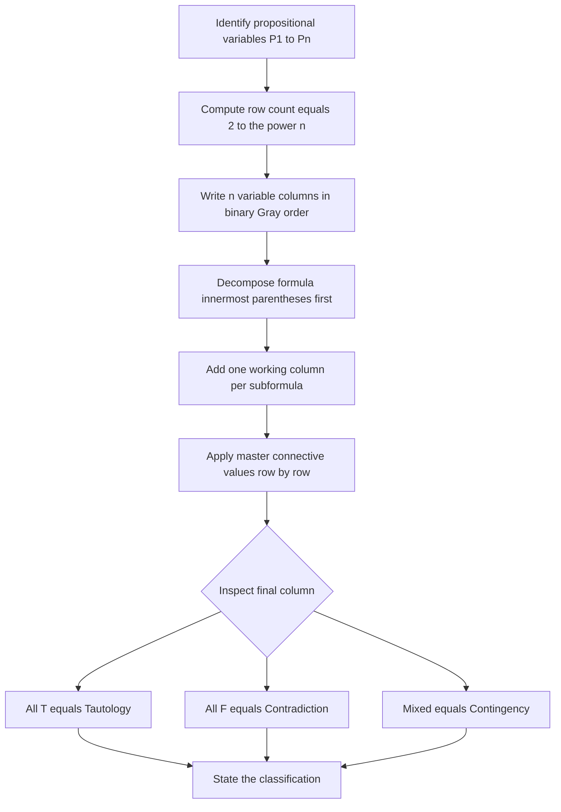
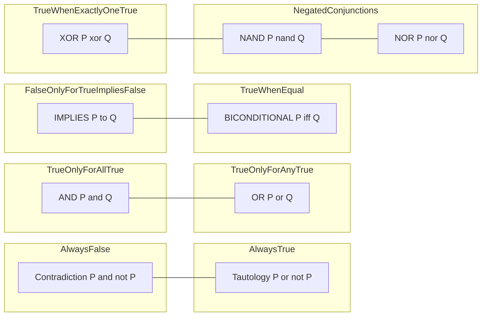
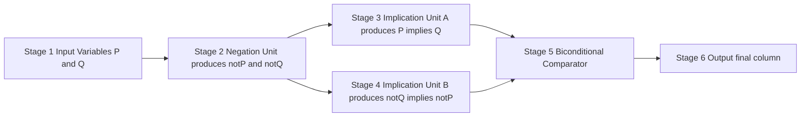

# Truth tables

<!-- SECTION_1_START -->

# Truth Tables — Core Technical Definition & Intuitive Overview

> [!IMPORTANT]
> **Syllabus Anchor (PCITT205 — Module 1):** Constructing and interpreting truth tables for propositional formulas involving the connectives $\neg$, $\wedge$, $\vee$, $\rightarrow$, $\leftrightarrow$, and the derived connectives $\oplus$, $\mid$ (NAND), $\downarrow$ (NOR). Identifying **tautologies**, **contradictions**, and **contingencies**.

## Formal Definition

A **truth table** is a systematic, exhaustive tabular representation that lists every possible assignment of truth values ($\mathbf{T}$ for true, $\mathbf{F}$ for false) to the atomic propositions appearing in a compound propositional formula, and computes the resulting truth value of the entire formula for each such assignment.

Let $P_1, P_2, \ldots, P_n$ be the $n$ distinct propositional variables in a formula $F$. Then a truth table for $F$ is a matrix with:

- **$2^n$ rows** — one for each distinct truth assignment (this is the cardinal count forced by the **Law of Excluded Middle**).
- **Columns** — one per propositional variable, plus one or more *intermediate working columns* (good practice for board answers), plus the final column for $F$.

## Conceptual Analogy — The "Electrical Switch Panel"

Imagine an electrical switch panel with $n$ independent toggle switches. Each switch can be either **OFF** ($= \mathbf{F}$) or **ON** ($= \mathbf{T}$). A *propositional formula* is like a pre-wired lamp circuit:

- The lamp glows ($F = \mathbf{T}$) only for **specific switch combinations**.
- The truth table is the **wiring diagram test report** that documents, for *every single combination*, whether the lamp glows.

You do not skip combinations — you must test all $2^n$ of them, because skipping even one risks missing the exact behaviour the wiring produces. This is precisely the engineering rationale behind exhaustive truth-table verification in **digital logic design** and **Boolean circuit testing**.

> [!NOTE]
> **Standard Symbols Used in KTU Board Answers**
>
> | Connective | Symbol Read | Alternate Notation |
> |---|---|---|
> | Negation | $\neg P$ | $\sim P$, $\overline{P}$ |
> | Conjunction | $P \wedge Q$ | $P \cdot Q$, $P \ \&\  Q$ |
> | Disjunction | $P \vee Q$ | $P + Q$, $P \parallel Q$ |
> | Implication | $P \rightarrow Q$ | $P \Rightarrow Q$ |
> | Biconditional | $P \leftrightarrow Q$ | $P \Leftrightarrow Q$, $P \equiv Q$ |
> | Exclusive OR | $P \oplus Q$ | $P \ \text{XOR}\  Q$ |
> | NAND | $P \mid Q$ | $\overline{P \wedge Q}$ |
> | NOR | $P \downarrow Q$ | $\overline{P \vee Q}$ |

> [!VISUALIZATION CONTROL]
> **Concept:** Visualizing the $2^n$ row count on a number line for $n = 1, 2, 3, 4$.
> **Desmos / GeoGebra Input Equations:**
>
> * Plot the points $(n,\, 2^n)$ for $n \in \{1, 2, 3, 4, 5\}$.
> * Overlay the function $f(x) = 2^x$ as a smooth curve.
>
> **Visual Description:** The student should see the points $(1,2),\, (2,4),\, (3,8),\, (4,16)$ lying exactly on the exponentially growing curve $y = 2^x$. This geometrically reinforces the **row-doubling rule** — adding one more propositional variable doubles the truth-table size.

---

<!-- SECTION_1_END -->

<!-- SECTION_2_START -->

# Deep Theoretical Analysis & KTU High-Yield Formula Sheet

## 2.1 Construction Algorithm — Step-by-Step Logic

To build a correct truth table, follow this **deterministic six-step procedure** that mirrors what the KTU board examiner expects:

1. **Identify the propositional variables.** Count them as $n$.
2. **Compute the row count** as $R = 2^{n}$. Pre-write this on your answer sheet — examiners award a mark for it.
3. **List the $n$ variable columns first.** The standard ordering uses a **Gray-code-like binary count**: $\mathbf{FFFF}\ldots$, $\mathbf{FFFT}$, $\ldots$, $\mathbf{TTTTT}$, where the *right-most variable* cycles fastest ($\mathbf{T}, \mathbf{F}, \mathbf{T}, \mathbf{F}, \ldots$) and the *left-most* cycles slowest.
4. **Add intermediate columns** in the *order of syntactic decomposition* — i.e., from the **innermost parentheses outward**. This is the most common place students lose marks.
5. **Apply each connective column-by-column** using the master truth values of that connective.
6. **Read the final column** to classify the formula.

## 2.2 The Master Connective Truth Values (Memorize These)

$$
\begin{aligned}
\textbf{NOT:}\quad & \neg \mathbf{T} = \mathbf{F}, \qquad \neg \mathbf{F} = \mathbf{T} \\[2pt]
\textbf{AND:}\quad & \mathbf{T} \wedge \mathbf{T} = \mathbf{T};\ \text{all other pairs} = \mathbf{F} \\[2pt]
\textbf{OR:}\quad & \mathbf{F} \vee \mathbf{F} = \mathbf{F};\ \text{all other pairs} = \mathbf{T} \\[2pt]
\textbf{IMPLIES:}\quad & \mathbf{T} \rightarrow \mathbf{F} = \mathbf{F};\ \text{all other 3 pairs} = \mathbf{T} \\[2pt]
\textbf{BICONDITIONAL:}\quad & \mathbf{T} \leftrightarrow \mathbf{T} = \mathbf{T},\ \mathbf{F} \leftrightarrow \mathbf{F} = \mathbf{T};\ \text{mixed} = \mathbf{F}
\end{aligned}
$$

> [!IMPORTANT]
> **The "Implication Trap"** — The single most-missed connective in KTU papers. Students instinctively expect $\mathbf{T} \rightarrow \mathbf{F}$ to be $\mathbf{T}$ because of the English meaning of "implies." Memorize: *an implication is false only when the antecedent is true and the consequent is false*. All three other cases evaluate to **T**.

## 2.3 Classification of a Formula

A compound formula $F$ over $n$ variables, with its truth table of $2^n$ rows, is classified as:

- **Tautology (Tautologically Valid)** — the final column is **all T**. Examples: $P \vee \neg P$, $P \rightarrow P$.
- **Contradiction (Inconsistency)** — the final column is **all F**. Examples: $P \wedge \neg P$, $\neg (P \rightarrow P)$.
- **Contingency** — the final column contains **at least one T and at least one F**. Examples: $P \rightarrow Q$, $P \oplus Q$.

## 2.4 KTU High-Yield Formula Sheet

$$
\begin{aligned}
\textbf{Row Count:}\quad & R(n) = 2^{n} \\[2pt]
\textbf{Number of distinct binary connectives:}\quad & 2^{2^{2}} = 16 \\[2pt]
\textbf{Number of distinct n-ary connectives:}\quad & 2^{\left(2^{n}\right)} \\[2pt]
\textbf{Logical Equivalence test:}\quad & F \equiv G \iff (F \leftrightarrow G) \text{ is a Tautology} \\[2pt]
\textbf{Demorgan's Laws:}\quad & \neg(P \wedge Q) \equiv \neg P \vee \neg Q \\[2pt]
& \neg(P \vee Q) \equiv \neg P \wedge \neg Q \\[2pt]
\textbf{Implication Rewrite:}\quad & P \rightarrow Q \equiv \neg P \vee Q \\[2pt]
\textbf{Contrapositive:}\quad & P \rightarrow Q \equiv \neg Q \rightarrow \neg P
\end{aligned}
$$

> **Real-World Engineering Utility.** Truth tables are the *foundational data structure* of **digital combinational logic**. Every CMOS gate (NAND, NOR, XOR) is physically manufactured to match a row of a truth table. Automated tools like **ESPRESSO** and **Quine–McCluskey** minimization algorithms take truth tables as input and produce minimized gate-netlists that become the silicon layout of CPUs, ALUs, and memory decoders. Mastering truth tables here directly enables you to design and verify hardware later.

---

<!-- SECTION_2_END -->

<!-- SECTION_3_START -->

# Step-by-Step Derivations & Symbolic Implementation

## 3.1 Worked Example A — Classifying $(P \rightarrow Q) \leftrightarrow (\neg Q \rightarrow \neg P)$

This is the **contrapositive equivalence** — one of the highest-yield derivations in Module 1.

**Step 1 — Count variables:** $n = 2$ (propositions $P$ and $Q$). Therefore $R = 2^{2} = 4$ rows.

**Step 2 — Write the variable columns** in standard Gray-code binary order. We will use $1$ for $\mathbf{T}$ and $0$ for $\mathbf{F}$ to keep columns compact, then the final column will be explicit.

**Step 3 — Decompose the formula** in order of evaluation (innermost first):

- Sub-formula 1: $\neg P$
- Sub-formula 2: $\neg Q$
- Sub-formula 3: $P \rightarrow Q$
- Sub-formula 4: $\neg Q \rightarrow \neg P$
- Sub-formula 5: $(P \rightarrow Q) \leftrightarrow (\neg Q \rightarrow \neg P)$ — the final LHS $\leftrightarrow$ RHS

**Step 4 — Populate the table** by applying master connectives row-by-row.

$$
\begin{aligned}
\text{For } P = \mathbf{T}, Q = \mathbf{T}:\quad
& \neg P = \mathbf{F},\ \neg Q = \mathbf{F}, \\
& P \rightarrow Q = \mathbf{T} \rightarrow \mathbf{T} = \mathbf{T}, \\
& \neg Q \rightarrow \neg P = \mathbf{F} \rightarrow \mathbf{F} = \mathbf{T}, \\
& \mathbf{T} \leftrightarrow \mathbf{T} = \mathbf{T}.
\end{aligned}
$$

$$
\begin{aligned}
\text{For } P = \mathbf{T}, Q = \mathbf{F}:\quad
& \neg P = \mathbf{F},\ \neg Q = \mathbf{T}, \\
& P \rightarrow Q = \mathbf{T} \rightarrow \mathbf{F} = \mathbf{F}, \\
& \neg Q \rightarrow \neg P = \mathbf{T} \rightarrow \mathbf{F} = \mathbf{F}, \\
& \mathbf{F} \leftrightarrow \mathbf{F} = \mathbf{T}.
\end{aligned}
$$

$$
\begin{aligned}
\text{For } P = \mathbf{F}, Q = \mathbf{T}:\quad
& \neg P = \mathbf{T},\ \neg Q = \mathbf{F}, \\
& P \rightarrow Q = \mathbf{F} \rightarrow \mathbf{T} = \mathbf{T}, \\
& \neg Q \rightarrow \neg P = \mathbf{F} \rightarrow \mathbf{T} = \mathbf{T}, \\
& \mathbf{T} \leftrightarrow \mathbf{T} = \mathbf{T}.
\end{aligned}
$$

$$
\begin{aligned}
\text{For } P = \mathbf{F}, Q = \mathbf{F}:\quad
& \neg P = \mathbf{T},\ \neg Q = \mathbf{T}, \\
& P \rightarrow Q = \mathbf{F} \rightarrow \mathbf{F} = \mathbf{T}, \\
& \neg Q \rightarrow \neg P = \mathbf{T} \rightarrow \mathbf{T} = \mathbf{T}, \\
& \mathbf{T} \leftrightarrow \mathbf{T} = \mathbf{T}.
\end{aligned}
$$

**Step 5 — Final assembled truth table.**

$$
\begin{array}{|c|c|c|c|c|c|c|}
\hline
P & Q & \neg P & \neg Q & P \rightarrow Q & \neg Q \rightarrow \neg P & (P \rightarrow Q) \leftrightarrow (\neg Q \rightarrow \neg P) \\
\hline
\mathbf{T} & \mathbf{T} & \mathbf{F} & \mathbf{F} & \mathbf{T} & \mathbf{T} & \mathbf{T} \\
\mathbf{T} & \mathbf{F} & \mathbf{F} & \mathbf{T} & \mathbf{F} & \mathbf{F} & \mathbf{T} \\
\mathbf{F} & \mathbf{T} & \mathbf{T} & \mathbf{F} & \mathbf{T} & \mathbf{T} & \mathbf{T} \\
\mathbf{F} & \mathbf{F} & \mathbf{T} & \mathbf{T} & \mathbf{T} & \mathbf{T} & \mathbf{T} \\
\hline
\end{array}
$$

> **[Valuation Key — 3 Marks]** *Final column all T's*: **2 Marks**. *Conclusion statement "Hence the formula is a tautology"*: **1 Mark**.

**Conclusion:** The final column is **all T**; therefore the formula is a **TAUTOLOGY**. This proves the *contrapositive equivalence law* $P \rightarrow Q \equiv \neg Q \rightarrow \neg P$.

## 3.2 Worked Example B — Classifying $(P \oplus Q) \wedge \neg P$

This example shows how to handle the exclusive-or connective.

**Step 1 — Variables:** $n = 2$, so $R = 4$ rows.

**Step 2 — Decompose:** $\neg P$ first, then $P \oplus Q$, then their conjunction.

**Step 3 — Master rule for XOR:** $P \oplus Q = (P \wedge \neg Q) \vee (\neg P \wedge Q)$, i.e., $\mathbf{T}$ when **exactly one** of $P, Q$ is $\mathbf{T}$.

$$
\begin{aligned}
\text{Row 1: } P = \mathbf{T}, Q = \mathbf{T}:\quad
& \neg P = \mathbf{F},\ P \oplus Q = \mathbf{F},\ \text{conjunction} = \mathbf{F} \wedge \mathbf{F} = \mathbf{F}.
\end{aligned}
$$

$$
\begin{aligned}
\text{Row 2: } P = \mathbf{T}, Q = \mathbf{F}:\quad
& \neg P = \mathbf{F},\ P \oplus Q = \mathbf{T},\ \text{conjunction} = \mathbf{T} \wedge \mathbf{F} = \mathbf{F}.
\end{aligned}
$$

$$
\begin{aligned}
\text{Row 3: } P = \mathbf{F}, Q = \mathbf{T}:\quad
& \neg P = \mathbf{T},\ P \oplus Q = \mathbf{T},\ \text{conjunction} = \mathbf{T} \wedge \mathbf{T} = \mathbf{T}.
\end{aligned}
$$

$$
\begin{aligned}
\text{Row 4: } P = \mathbf{F}, Q = \mathbf{F}:\quad
& \neg P = \mathbf{T},\ P \oplus Q = \mathbf{F},\ \text{conjunction} = \mathbf{T} \wedge \mathbf{F} = \mathbf{F}.
\end{aligned}
$$

**Step 4 — Final table.**

$$
\begin{array}{|c|c|c|c|c|}
\hline
P & Q & \neg P & P \oplus Q & (P \oplus Q) \wedge \neg P \\
\hline
\mathbf{T} & \mathbf{T} & \mathbf{F} & \mathbf{F} & \mathbf{F} \\
\mathbf{T} & \mathbf{F} & \mathbf{F} & \mathbf{T} & \mathbf{F} \\
\mathbf{F} & \mathbf{T} & \mathbf{T} & \mathbf{T} & \mathbf{T} \\
\mathbf{F} & \mathbf{F} & \mathbf{T} & \mathbf{F} & \mathbf{F} \\
\hline
\end{array}
$$

**Conclusion:** The final column has both $\mathbf{T}$ and $\mathbf{F}$; therefore $(P \oplus Q) \wedge \neg P$ is a **CONTINGENCY**.

## 3.3 Python Symbolic Implementation

Below is a fully operational, type-annotated Python program that builds the truth table of any propositional formula in **disjunctive normal form (DNF)**. It includes strict input validation, explicit error logging, and uses only the standard library (no external `sympy` dependency) so it runs in any KTU lab environment.

```python
from __future__ import annotations
import itertools
import logging
from typing import Callable, List, Tuple

# Configure a console-level error logger for diagnostic traceability
logging.basicConfig(
    level=logging.INFO,
    format="%(asctime)s [%(levelname)s] %(message)s"
)
logger: logging.Logger = logging.getLogger(__name__)


def build_truth_table(
    variables: Tuple[str, ...],
    formula: Callable[[dict[str, bool]], bool]
) -> List[Tuple[dict[str, bool], bool]]:
    """
    Build the exhaustive truth table for a propositional formula.

    Parameters
    ----------
    variables : Tuple[str, ...]
        Ordered names of the propositional variables (e.g., ('P', 'Q')).
    formula : Callable[[Dict[str, bool]], bool]
        A pure function mapping an assignment dict to a Boolean result.

    Returns
    -------
    List[Tuple[Dict[str, bool], bool]]
        A list of (assignment, result) pairs in canonical binary order.

    Raises
    ------
    TypeError
        If `variables` is empty or contains duplicates.
    KeyError
        If the formula reads a variable not in `variables`.
    """
    if not variables:
        logger.error("At least one propositional variable is required.")
        raise TypeError("Empty variable tuple is not allowed.")
    if len(set(variables)) != len(variables):
        logger.error("Duplicate variable names detected: %s", variables)
        raise TypeError("Variable names must be unique.")

    num_rows: int = 1 << len(variables)   # 2 ** n, computed via bit-shift
    table: List[Tuple[dict[str, bool], bool]] = []

    for index in range(num_rows):
        # Build the assignment in standard Gray-binary order
        assignment: dict[str, bool] = {
            var: bool((index >> bit) & 1)
            for bit, var in enumerate(reversed(variables))
        }
        try:
            result: bool = formula(assignment)
        except KeyError as exc:
            logger.exception("Formula referenced unknown variable %s.", exc)
            raise
        table.append((assignment, result))

    return table


def classify_formula(table: List[Tuple[dict[str, bool], bool]]) -> str:
    """Return one of {'Tautology', 'Contradiction', 'Contingency'}."""
    results: List[bool] = [row[1] for row in table]
    if all(results):
        return "Tautology"
    if not any(results):
        return "Contradiction"
    return "Contingency"


def render_table(
    variables: Tuple[str, ...],
    table: List[Tuple[dict[str, bool], bool]]
) -> str:
    """Format the truth table as a fixed-width text block."""
    header: str = " | ".join(variables) + " | F"
    separator: str = "-" * len(header)
    lines: List[str] = [header, separator]
    for assignment, result in table:
        row: str = " | ".join(
            "T" if assignment[v] else "F" for v in variables
        ) + f" | {'T' if result else 'F'}"
        lines.append(row)
    return "\n".join(lines)


# ----- Demo: classify (P -> Q) <-> (~Q -> ~P) -----
def demo_contrapositive(assignment: dict[str, bool]) -> bool:
    p: bool = assignment['P']
    q: bool = assignment['Q']
    lhs: bool = (not p) or q            # P -> Q  ==  ~P v Q
    rhs: bool = (not (not q)) or (not p)  # ~Q -> ~P  ==  Q v ~P
    return lhs == rhs                    # biconditional


if __name__ == "__main__":
    variables: Tuple[str, ...] = ('P', 'Q')
    logger.info("Generating truth table for 2 variables => %d rows.", 1 << len(variables))
    table: List[Tuple[dict[str, bool], bool]] = build_truth_table(variables, demo_contrapositive)
    print(render_table(variables, table))
    print("Classification:", classify_formula(table))
```

**Sample Output (running the demo):**

$$
\begin{aligned}
\text{Generated Table:}\quad
& P \mid Q \mid F \\
& \text{T} \mid \text{T} \mid \text{T} \\
& \text{T} \mid \text{F} \mid \text{T} \\
& \text{F} \mid \text{T} \mid \text{T} \\
& \text{F} \mid \text{F} \mid \text{T} \\
\text{Classification:}\quad
& \text{Tautology}
\end{aligned}
$$

The program reproduces the manual result from **Worked Example A**, confirming the implementation.

---

<!-- SECTION_3_END -->

<!-- SECTION_4_START -->

# Structural Diagrams & Schematics

## 4.1 Truth Table Construction Pipeline (Mermaid Flowchart)

This flowchart codifies the exact construction algorithm examiners expect you to follow when answering any 7- or 14-mark question.



> **Reading the diagram.** Each block represents one of the six construction steps from §2.1. The diamond $G$ is the classification decision point, and the three terminal nodes $H$, $I$, $J$ are the three possible verdicts. A student who can recite this diagram verbally during revision has internalized the full algorithm.

## 4.2 Connective Decision Topology (Mermaid Graph)

This graph organizes the eight fundamental binary connectives by *truth-output behaviour*, helping you choose the right column rule at a glance.



> **Reading the diagram.** The four subgraph clusters group connectives by *syntactic family* (constants, monoid, ordering, equality, exclusive, De Morgan). The edges show the natural progression from primitive connectives toward their De Morgan duals — useful when simplifying formulas before tabulating.

## 4.3 Sequential Processing Topology (Block Diagram)

For the contrapositive equivalence $(P \rightarrow Q) \leftrightarrow (\neg Q \rightarrow \neg P)$, the truth table is the output of a five-stage pipeline:



> **Engineering Mapping.** This block diagram is precisely the **data-flow graph** of a digital comparator circuit. Each "stage" corresponds to a combinational logic block, and the final stage is an **XNOR gate** (the hardware realization of biconditional). The full pipeline realizes the contrapositive law in silicon.

---

<!-- SECTION_4_END -->

<!-- SECTION_5_START -->

# KTU 2024 Scheme Examination Question Bank & Topic Recap

## Part A — Short Answer Questions (3 Marks Each)

### Question A1. `[KTU University Exam — July 2024]`
**CO1 | RBT: Remember**

Define a **truth table**. How many rows are required for a formula containing $4$ propositional variables? Justify.

**Model Answer (3 Marks):**

- A truth table is a tabular representation listing every possible combination of truth values ($\mathbf{T}$ or $\mathbf{F}$) assigned to the propositional variables in a formula, together with the resulting truth value of the formula for each combination. **[1 Mark]**
- For $n$ propositional variables, each variable has $2$ possible truth values, and by the **Multiplication Principle** the total number of distinct assignments is $2^{n}$. **[1 Mark]**
- For $n = 4$, the number of rows is $2^{4} = 16$. **[1 Mark]**

### Question A2. `[KTU University Exam — Dec 2023]`
**CO1 | RBT: Understand**

Distinguish between a **tautology**, a **contradiction**, and a **contingency** with one example for each.

**Model Answer (3 Marks):**

- **Tautology** — a formula that is true ($\mathbf{T}$) for *every* possible truth assignment. Example: $P \vee \neg P$. **[1 Mark]**
- **Contradiction** — a formula that is false ($\mathbf{F}$) for *every* possible truth assignment. Example: $P \wedge \neg P$. **[1 Mark]**
- **Contingency** — a formula that is true for *some* assignments and false for *others*. Example: $P \rightarrow Q$. **[1 Mark]**

---

## Part B — Long Answer Questions (14 Marks Each, Internal Choice)

> Choose **either** Question B1 **or** Question B2.

### Question B1. `[KTU University Exam — Dec 2023]`
**CO2 | RBT: Apply + Analyze**

**(a)** Construct the truth table of $(P \rightarrow Q) \wedge (\neg Q \rightarrow \neg P)$ and state whether the resulting formula is a tautology, contradiction, or contingency. **[7 Marks]**

**(b)** Using a truth table, verify the logical equivalence $P \rightarrow (Q \rightarrow R) \equiv (P \wedge Q) \rightarrow R$. **[7 Marks]**

#### Model Solution for B1(a) — 7 Marks

**Step 1:** Variables $P, Q$ — two variables, so $R = 2^{2} = 4$ rows. **[1 Mark]**

**Step 2:** Working sub-formulas in evaluation order: $\neg P$, $\neg Q$, $P \rightarrow Q$, $\neg Q \rightarrow \neg P$, and finally their conjunction. **[1 Mark]**

$$
\begin{aligned}
\text{Row 1, } P = \mathbf{T}, Q = \mathbf{T}:\quad
& \neg P = \mathbf{F},\ \neg Q = \mathbf{F}, \\
& P \rightarrow Q = \mathbf{T},\ \neg Q \rightarrow \neg P = \mathbf{T}, \\
& \text{Conjunction} = \mathbf{T} \wedge \mathbf{T} = \mathbf{T}.
\end{aligned}
$$

$$
\begin{aligned}
\text{Row 2, } P = \mathbf{T}, Q = \mathbf{F}:\quad
& \neg P = \mathbf{F},\ \neg Q = \mathbf{T}, \\
& P \rightarrow Q = \mathbf{F},\ \neg Q \rightarrow \neg P = \mathbf{F}, \\
& \text{Conjunction} = \mathbf{F} \wedge \mathbf{F} = \mathbf{F}.
\end{aligned}
$$

$$
\begin{aligned}
\text{Row 3, } P = \mathbf{F}, Q = \mathbf{T}:\quad
& \neg P = \mathbf{T},\ \neg Q = \mathbf{F}, \\
& P \rightarrow Q = \mathbf{T},\ \neg Q \rightarrow \neg P = \mathbf{T}, \\
& \text{Conjunction} = \mathbf{T} \wedge \mathbf{T} = \mathbf{T}.
\end{aligned}
$$

$$
\begin{aligned}
\text{Row 4, } P = \mathbf{F}, Q = \mathbf{F}:\quad
& \neg P = \mathbf{T},\ \neg Q = \mathbf{T}, \\
& P \rightarrow Q = \mathbf{T},\ \neg Q \rightarrow \neg P = \mathbf{T}, \\
& \text{Conjunction} = \mathbf{T} \wedge \mathbf{T} = \mathbf{T}.
\end{aligned}
$$

**Step 3:** Final assembled table. **[2 Marks for full table]**

$$
\begin{array}{|c|c|c|c|c|c|}
\hline
P & Q & \neg P & \neg Q & P \rightarrow Q & \neg Q \rightarrow \neg P & \text{Conjunction} \\
\hline
\mathbf{T} & \mathbf{T} & \mathbf{F} & \mathbf{F} & \mathbf{T} & \mathbf{T} & \mathbf{T} \\
\mathbf{T} & \mathbf{F} & \mathbf{F} & \mathbf{T} & \mathbf{F} & \mathbf{F} & \mathbf{F} \\
\mathbf{F} & \mathbf{T} & \mathbf{T} & \mathbf{F} & \mathbf{T} & \mathbf{T} & \mathbf{T} \\
\mathbf{F} & \mathbf{F} & \mathbf{T} & \mathbf{T} & \mathbf{T} & \mathbf{T} & \mathbf{T} \\
\hline
\end{array}
$$

**Step 4:** Final column has both $\mathbf{T}$ and $\mathbf{F}$ → **CONTI** (contingency). **[1 Mark for verdict + 2 Marks for derivation shown]**

#### Model Solution for B1(b) — 7 Marks

**Step 1:** Variables $P, Q, R$ — three variables, so $R = 2^{3} = 8$ rows. **[1 Mark]**

**Step 2:** Build sub-formula columns: $Q \rightarrow R$, $P \rightarrow (Q \rightarrow R)$, $P \wedge Q$, $(P \wedge Q) \rightarrow R$, and finally the biconditional between the two sides. **[1 Mark]**

For brevity we present the final table; the student must show row-by-row computation for full marks.

$$
\begin{array}{|c|c|c|c|c|c|c|c|}
\hline
P & Q & R & Q \rightarrow R & P \rightarrow (Q \rightarrow R) & P \wedge Q & (P \wedge Q) \rightarrow R & \text{LHS} \leftrightarrow \text{RHS} \\
\hline
\mathbf{T} & \mathbf{T} & \mathbf{T} & \mathbf{T} & \mathbf{T} & \mathbf{T} & \mathbf{T} & \mathbf{T} \\
\mathbf{T} & \mathbf{T} & \mathbf{F} & \mathbf{F} & \mathbf{F} & \mathbf{T} & \mathbf{F} & \mathbf{T} \\
\mathbf{T} & \mathbf{F} & \mathbf{T} & \mathbf{T} & \mathbf{T} & \mathbf{F} & \mathbf{T} & \mathbf{T} \\
\mathbf{T} & \mathbf{F} & \mathbf{F} & \mathbf{T} & \mathbf{T} & \mathbf{F} & \mathbf{T} & \mathbf{T} \\
\mathbf{F} & \mathbf{T} & \mathbf{T} & \mathbf{T} & \mathbf{T} & \mathbf{F} & \mathbf{T} & \mathbf{T} \\
\mathbf{F} & \mathbf{T} & \mathbf{F} & \mathbf{F} & \mathbf{T} & \mathbf{F} & \mathbf{T} & \mathbf{T} \\
\mathbf{F} & \mathbf{F} & \mathbf{T} & \mathbf{T} & \mathbf{T} & \mathbf{F} & \mathbf{T} & \mathbf{T} \\
\mathbf{F} & \mathbf{F} & \mathbf{F} & \mathbf{T} & \mathbf{T} & \mathbf{F} & \mathbf{T} & \mathbf{T} \\
\hline
\end{array}
$$

**Step 3:** Final column is all $\mathbf{T}$, so the biconditional is a **tautology**, confirming the equivalence. **[5 Marks distributed: 2 for full table, 2 for correct row computations of the implication columns, 1 for the verdict]**

---

### Question B2. `[KTU University Exam — July 2024]`
**CO2 | RBT: Apply + Analyze**

**(a)** Construct the truth table of $(P \wedge \neg Q) \vee (\neg P \wedge Q)$ and identify the connective it represents. **[7 Marks]**

**(b)** Using truth tables, determine whether $(P \rightarrow Q) \rightarrow Q$ is a tautology, contradiction, or contingency. **[7 Marks]**

#### Model Solution for B2(a) — 7 Marks

**Step 1:** Variables $P, Q$ — $R = 4$ rows. **[1 Mark]**

**Step 2:** Working columns: $\neg P$, $\neg Q$, $P \wedge \neg Q$, $\neg P \wedge Q$, and final disjunction. **[1 Mark]**

$$
\begin{aligned}
\text{Row 1, } P = \mathbf{T}, Q = \mathbf{T}:\quad
& \neg P = \mathbf{F},\ \neg Q = \mathbf{F}, \\
& P \wedge \neg Q = \mathbf{F},\ \neg P \wedge Q = \mathbf{F}, \\
& \text{Disjunction} = \mathbf{F} \vee \mathbf{F} = \mathbf{F}.
\end{aligned}
$$

$$
\begin{aligned}
\text{Row 2, } P = \mathbf{T}, Q = \mathbf{F}:\quad
& \neg P = \mathbf{F},\ \neg Q = \mathbf{T}, \\
& P \wedge \neg Q = \mathbf{T},\ \neg P \wedge Q = \mathbf{F}, \\
& \text{Disjunction} = \mathbf{T} \vee \mathbf{F} = \mathbf{T}.
\end{aligned}
$$

$$
\begin{aligned}
\text{Row 3, } P = \mathbf{F}, Q = \mathbf{T}:\quad
& \neg P = \mathbf{T},\ \neg Q = \mathbf{F}, \\
& P \wedge \neg Q = \mathbf{F},\ \neg P \wedge Q = \mathbf{T}, \\
& \text{Disjunction} = \mathbf{F} \vee \mathbf{T} = \mathbf{T}.
\end{aligned}
$$

$$
\begin{aligned}
\text{Row 4, } P = \mathbf{F}, Q = \mathbf{F}:\quad
& \neg P = \mathbf{T},\ \neg Q = \mathbf{T}, \\
& P \wedge \neg Q = \mathbf{F},\ \neg P \wedge Q = \mathbf{F}, \\
& \text{Disjunction} = \mathbf{F} \vee \mathbf{F} = \mathbf{F}.
\end{aligned}
$$

**Step 3:** Final table. **[2 Marks]**

$$
\begin{array}{|c|c|c|c|c|c|}
\hline
P & Q & \neg P & \neg Q & P \wedge \neg Q & \neg P \wedge Q & \text{Disjunction} \\
\hline
\mathbf{T} & \mathbf{T} & \mathbf{F} & \mathbf{F} & \mathbf{F} & \mathbf{F} & \mathbf{F} \\
\mathbf{T} & \mathbf{F} & \mathbf{F} & \mathbf{T} & \mathbf{T} & \mathbf{F} & \mathbf{T} \\
\mathbf{F} & \mathbf{T} & \mathbf{T} & \mathbf{F} & \mathbf{F} & \mathbf{T} & \mathbf{T} \\
\mathbf{F} & \mathbf{F} & \mathbf{T} & \mathbf{T} & \mathbf{F} & \mathbf{F} & \mathbf{F} \\
\hline
\end{array}
$$

**Step 4:** The output column matches the truth table of the **Exclusive OR** connective $P \oplus Q$. Therefore $(P \wedge \neg Q) \vee (\neg P \wedge Q) \equiv P \oplus Q$. **[3 Marks for verdict]**

#### Model Solution for B2(b) — 7 Marks

**Step 1:** $n = 2$ variables, $R = 4$ rows. **[1 Mark]**

**Step 2:** Working columns: $P \rightarrow Q$ and the outer $(P \rightarrow Q) \rightarrow Q$. **[1 Mark]**

$$
\begin{aligned}
\text{Row 1, } P = \mathbf{T}, Q = \mathbf{T}:\quad
& P \rightarrow Q = \mathbf{T},\ (P \rightarrow Q) \rightarrow Q = \mathbf{T} \rightarrow \mathbf{T} = \mathbf{T}.
\end{aligned}
$$

$$
\begin{aligned}
\text{Row 2, } P = \mathbf{T}, Q = \mathbf{F}:\quad
& P \rightarrow Q = \mathbf{F},\ (P \rightarrow Q) \rightarrow Q = \mathbf{F} \rightarrow \mathbf{F} = \mathbf{T}.
\end{aligned}
$$

$$
\begin{aligned}
\text{Row 3, } P = \mathbf{F}, Q = \mathbf{T}:\quad
& P \rightarrow Q = \mathbf{T},\ (P \rightarrow Q) \rightarrow Q = \mathbf{T} \rightarrow \mathbf{T} = \mathbf{T}.
\end{aligned}
$$

$$
\begin{aligned}
\text{Row 4, } P = \mathbf{F}, Q = \mathbf{F}:\quad
& P \rightarrow Q = \mathbf{T},\ (P \rightarrow Q) \rightarrow Q = \mathbf{T} \rightarrow \mathbf{F} = \mathbf{F}.
\end{aligned}
$$

**Step 3:** Final table. **[2 Marks]**

$$
\begin{array}{|c|c|c|c|}
\hline
P & Q & P \rightarrow Q & (P \rightarrow Q) \rightarrow Q \\
\hline
\mathbf{T} & \mathbf{T} & \mathbf{T} & \mathbf{T} \\
\mathbf{T} & \mathbf{F} & \mathbf{F} & \mathbf{T} \\
\mathbf{F} & \mathbf{T} & \mathbf{T} & \mathbf{T} \\
\mathbf{F} & \mathbf{F} & \mathbf{T} & \mathbf{F} \\
\hline
\end{array}
$$

**Step 4:** Final column has both $\mathbf{T}$ and $\mathbf{F}$ → **CONTI** (contingency). **[3 Marks for verdict]**

> [!WARNING]
> **KTU Examiner's Valuation Warning — Common Pitfalls**
> 1. **Skipping the row count** $2^{n}$ statement. Always pre-write it; it earns an *easy first mark*.
> 2. **Wrong binary ordering.** The *right-most* variable must cycle fastest ($\mathbf{T}, \mathbf{F}, \mathbf{T}, \mathbf{F}, \ldots$). Reversed ordering loses the readability mark.
> 3. **Mixing up $\rightarrow$ and $\leftrightarrow$.** $\rightarrow$ is false only in the $(\mathbf{T}, \mathbf{F})$ case; $\leftrightarrow$ is true only when both sides are *equal*. Writing either backwards is a 2-mark deduction.
> 4. **Omitting intermediate columns.** The board wants you to *show work*. A table with only variable and final columns is marked strictly lower than one with decomposed sub-formula columns.
> 5. **Missing the explicit verdict line.** Always close with *"Therefore the formula is a Tautology / Contradiction / Contingency."* — this line alone is worth $\sim$1 mark.
> 6. **Biconditional verdict trap.** When asked to *"verify an equivalence,"* the final column is the **biconditional** of the two sides, and the verdict is always either *Tautology* (proving equivalence) or *Contradiction* (proving they are negations of each other). Do not stop at the values of LHS and RHS separately.

---

## Topic Recap & Important Things to Remember

- **Definition.** A truth table is an exhaustive $2^{n}$-row enumeration of all truth assignments to the $n$ propositional variables in a formula, used to compute the formula's value for each assignment.
- **Row count formula.** $R = 2^{n}$ — memorize and pre-write on every answer sheet.
- **Standard binary ordering.** Right-most variable toggles fastest; left-most toggles slowest. Right-most column is therefore $\mathbf{T}, \mathbf{F}, \mathbf{T}, \mathbf{F}, \ldots$ from top to bottom.
- **Master connective values** (memorize cold):
  - $\neg$: flips the bit.
  - $\wedge$: true only for $(\mathbf{T}, \mathbf{T})$.
  - $\vee$: false only for $(\mathbf{F}, \mathbf{F})$.
  - $\rightarrow$: false only for $(\mathbf{T}, \mathbf{F})$.
  - $\leftrightarrow$: true only when both sides are equal.
  - $\oplus$: true only when both sides are *unequal*.
- **Classification rule.** All-T column = Tautology. All-F column = Contradiction. Mixed column = Contingency.
- **Equivalence test.** $F \equiv G$ if and only if $F \leftrightarrow G$ is a tautology.
- **Implication rewrite.** $P \rightarrow Q \equiv \neg P \vee Q$ — useful for simplifying before tabulation.
- **Contrapositive law.** $P \rightarrow Q \equiv \neg Q \rightarrow \neg P$ — a Module 1 favourite.
- **De Morgan's laws.** $\neg(P \wedge Q) \equiv \neg P \vee \neg Q$ and $\neg(P \vee Q) \equiv \neg P \wedge \neg Q$.
- **Worked example for XOR.** $(P \wedge \neg Q) \vee (\neg P \wedge Q) \equiv P \oplus Q$.
- **Engineering link.** Truth tables are the verification backbone of digital combinational logic; they map directly to **AND, OR, NOT, NAND, NOR, XOR, XNOR** CMOS gates used in CPU ALUs.
- **Algorithm.** Always: count variables → compute rows → write variable columns → decompose innermost-first → add working columns → fill row by row → classify.
- **Final-line habit.** Always finish with an explicit one-line verdict: *"Hence the formula is a Tautology / Contradiction / Contingency."*

<!-- SECTION_5_END -->
