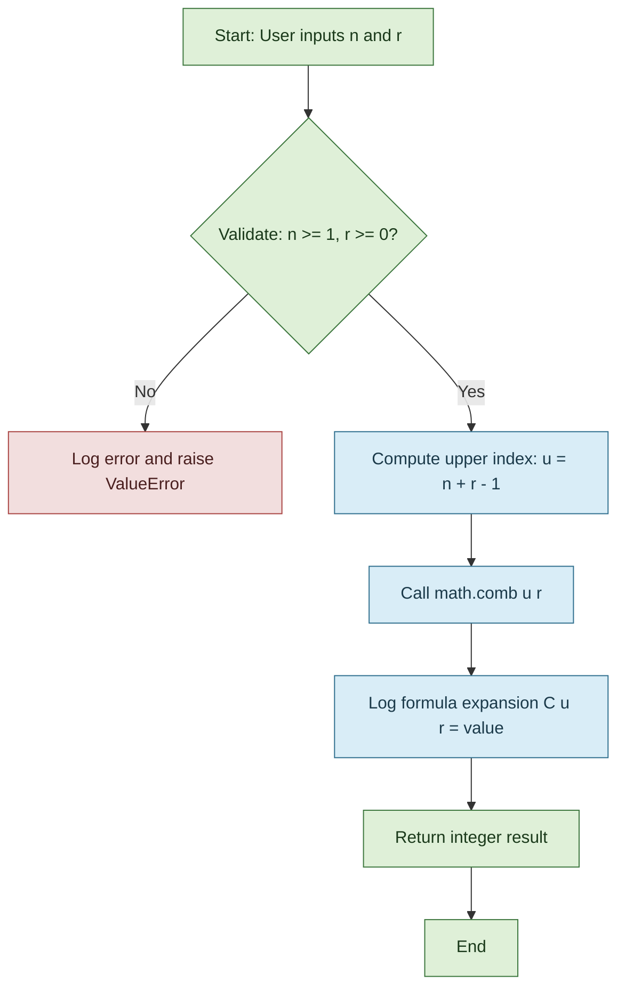
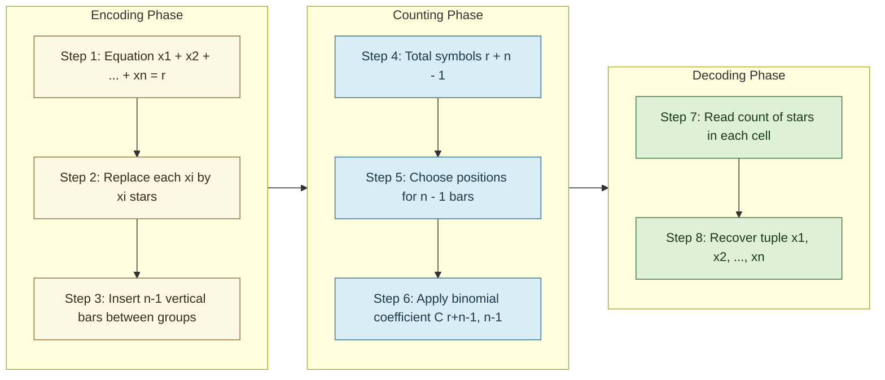
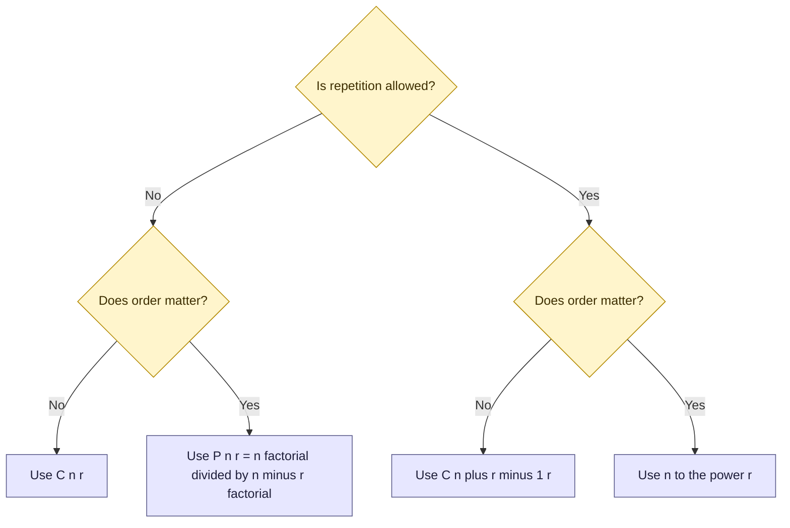

# Combinations with Repetition

<!-- SECTION_1_START -->
# Combinations with Repetition — Definition & Intuitive Overview

> [!IMPORTANT]
> **KTU 2024 Scheme — Module 2 Spotlight**
> *Course:* PCITT205 — Discrete Mathematical Structures
> *Topic Tag:* Multiset Counting / Stars and Bars / Combinations with Repetition
> *Mapped CO:* **CO1** — Apply the fundamental principles of counting to real-world selection problems.
> *Bloom's Level:* **Apply / Analyze**

## 1.1 Formal Definition

A **combination with repetition** (also called a **multiset combination** or **combination with replacement**) of $r$ objects chosen from $n$ distinct types is an unordered selection of $r$ objects in which each object of a given type may be selected **more than once**, and the **order of selection is irrelevant**.

The number of such combinations is given by the closed-form expression:

$$
\boxed{\,CR(n,\,r) \;=\; \binom{n + r - 1}{r} \;=\; \binom{n + r - 1}{n - 1} \;=\; \frac{(n + r - 1)!}{r!\,(n - 1)!}\,}
$$

where the symbols are interpreted as:
- $n$ — number of **distinct categories / types** available to choose from,
- $r$ — total number of **objects selected** (with repetition allowed),
- $CR(n,r)$ — count of distinct unordered multisets of size $r$ drawn from $n$ types.

> [!NOTE]
> **KTU Terminology Alert**
> Many textbooks and the KTU module content refer to this count as the number of *"r-combinations of a set of n elements with repetition allowed."* It is *not* the same as $\binom{n}{r}$ (which forbids repetition). Memorize the parameter positions: the **lower** index is $r$, and the **upper** index is $n + r - 1$.

## 1.2 Conceptual Analogy — The Ice-Cream Scoop Counter 🍦

Imagine you walk into an ice-cream parlor that offers **$n = 4$ flavours** (Vanilla, Chocolate, Strawberry, Mango). You decide to buy a **3-scoop cup**, and you are allowed to repeat flavours. The cup's *taste* depends only on **how many scoops of each flavour** you have — not the order in which they are stacked.

A valid selection is therefore a **multiset** like `{Vanilla, Vanilla, Chocolate}` — picking 2 Vanillas first or 2 Vanillas last is the same cup. We want to count how many *different* taste profiles exist for a 3-scoop cup.

The geometric intuition is even cleaner:
- Lay out your $r$ scoops as **stars** `★` in a row.
- Insert $n - 1$ **bars** `|` to chop the row into $n$ bins (one bin per flavour).
- The number of stars to the left of the first bar = scoops of flavour 1, between bar 1 and bar 2 = scoops of flavour 2, and so on.

For $n = 4$ and $r = 3$, one possible arrangement is `★★|★|||` which means: 2 Vanilla, 1 Chocolate, 0 Strawberry, 0 Mango.

Counting such arrangements is **choosing where to place the 3 bars** among $r + n - 1 = 6$ slots, giving $\binom{6}{3} = 20$ taste profiles.

## 1.3 Real-World Engineering & Computing Scenarios

| Domain | Use Case |
|---|---|
| **Compiler Design** | Counting token sequences of length $r$ drawn from $n$ lexeme classes. |
| **Cryptography** | Estimating the search space of passwords where character reuse is allowed. |
| **Operating Systems** | Distributing $r$ identical processes among $n$ priority queues. |
| **Database Systems** | Counting multi-set joins / bag semantics in SQL query optimization. |
| **Network Routing** | Number of ways to send $r$ packets through $n$ parallel channels. |

> [!VISUALIZATION CONTROL]
> **Concept:** Geometric layout of a combination-with-repetition as a stars-and-bars string.
> **GeoGebra / Desmos Input Equations:**
> * Define a discrete sequence of $r + n - 1$ slots. Mark $r$ of them as `★` and $n - 1$ as `|`.
> * Plot each arrangement as a binary vector $\mathbf{v} \in \{0,1\}^{r+n-1}$ with $r$ ones and $n-1$ zeros.
> **Visual Description:** On the horizontal axis plot the slot index $i = 1, 2, \ldots, r+n-1$ and on the vertical axis plot $1$ for a star and $0$ for a bar. Each valid vector is a step function with exactly $r$ unit steps — students will see a staircase of constant height $1$ interrupted by dips to $0$ at every bar.
<!-- SECTION_1_END -->

<!-- SECTION_2_START -->
# Deep Theoretical Analysis & KTU High-Yield Formula Sheet

## 2.1 The Underlying Principle — Why the Formula Works

The combination-with-repetition result is fundamentally a **partition problem**. We want to distribute $r$ *indistinguishable* objects into $n$ *distinguishable* boxes (where any box may receive zero or more objects). The counting proceeds in two stages:

1. **Encode the distribution as a sequence.** Place all $r$ objects in a single row, then introduce $n - 1$ dividers to split them into $n$ ordered cells. The dividers are placed in specific gaps between objects.
2. **Count the sequences.** The total slots after placing objects and dividers is $r + n - 1$. Choosing which $n - 1$ of these slots hold dividers is equivalent to choosing which $r$ hold objects. By the **rule of product applied to combinations**, this count is $\binom{r + n - 1}{n - 1} = \binom{r + n - 1}{r}$.

> [!NOTE]
> **Key Insight (KTU-Favourite Exam Point):**
> The crucial assumption is that the $n$ boxes (categories) are **labelled / distinguishable**, and the $r$ items are **identical / indistinguishable**. If you reverse either assumption, the formula changes completely. Always state these conditions explicitly in your board answer.

## 2.2 Logical Derivation Steps (Star-and-Bars Theorem)

Let $x_1, x_2, \ldots, x_n$ be non-negative integers (the number of items from each of the $n$ categories). The constraint is:

$$
x_1 + x_2 + x_3 + \cdots + x_n \;=\; r, \qquad x_i \ge 0 \;\;\text{for all } i.
$$

We want the number of solutions $(x_1, x_2, \ldots, x_n)$ to this equation. The stars-and-bars bijection maps each solution to a unique string of $r$ stars and $n - 1$ bars, and the count of such strings is $\binom{r + n - 1}{n - 1}$.

### 2.2.1 Variant — At Least One of Each Category

If the problem demands that $x_i \ge 1$ (i.e., every category must be used at least once), we first place one item in each of the $n$ categories, leaving $r - n$ items to distribute freely. The number of distributions becomes:

$$
\binom{(r - n) + n - 1}{n - 1} \;=\; \binom{r - 1}{n - 1}, \quad \text{valid only when } r \ge n.
$$

### 2.2.2 Variant — With Upper Bounds $x_i \le k_i$

When each category has a *cap* $k_i$, the inclusion–exclusion principle must be layered on top:

$$
\text{Count} \;=\; \sum_{S \subseteq \{1,\ldots,n\}} (-1)^{|S|} \binom{r - \left(\sum_{i \in S}(k_i + 1)\right) + n - 1}{n - 1},
$$

where the sum runs over all subsets $S$ for which $r - \sum_{i \in S}(k_i + 1) \ge 0$.

## 2.3 KTU Formula Sheet / Cheat Sheet

| **Scenario** | **Counting Formula** | **Validity** |
|---|---|---|
| Basic: $n$ types, pick $r$ (any number from each), unordered | $\displaystyle \binom{n + r - 1}{r}$ | $n \ge 1,\; r \ge 0$ |
| Equivalent form | $\displaystyle \binom{n + r - 1}{n - 1}$ | Same |
| At least one from each type | $\displaystyle \binom{r - 1}{n - 1}$ | $r \ge n$ |
| At most $k$ from each type ($k$ common) | $\displaystyle \sum_{j=0}^{\lfloor r/(k+1)\rfloor} (-1)^j \binom{n}{j}\binom{r - j(k+1) + n - 1}{n - 1}$ | $r \le nk$ |
| Distinguishable items into distinguishable boxes, no order | $n^r$ | $r \ge 0$ (this is **permutation with repetition**, NOT combination with repetition) |
| Distinguishable items, no repetition, unordered | $\displaystyle \binom{n}{r}$ | $r \le n$ |

> [!IMPORTANT]
> **Most Common KTU Mistake:** Students confuse $n^r$ (permutations with repetition) with $\binom{n+r-1}{r}$ (combinations with repetition). The deciding question is: *Does order matter?* If **yes** → use $n^r$. If **no** → use $\binom{n+r-1}{r}$.

## 2.4 Engineering Utility

In production software systems, combinations with repetition govern the *combinatorial explosion* of state spaces in:

- **Cache eviction policies** like LFU and ARC, where you have $r$ access events distributed across $n$ cache lines.
- **Build systems** (e.g., CMake feature matrices): $n$ boolean flags, choose $r$ to enable — this is $\binom{n}{r}$, but choosing $r$ values across $n$ multi-level options is $\binom{n+r-1}{r}$.
- **Multi-tenant cloud resource allocation:** Spinning up $r$ identical VMs across $n$ availability zones with no priority on order.
- **Compiler register allocation:** Distributing $r$ temporaries across $n$ available registers when spilling is allowed.

> [!NOTE]
> The asymptotic behaviour is **polynomial**, not exponential: $\binom{n+r-1}{r} \sim \frac{(n+r-1)^{n+r-1}}{r^{\,r}(n-1)^{\,n-1}}$ as $r, n \to \infty$, which is dramatically smaller than $n^r$. This is why unordered counting is computationally tractable where ordered counting is not.
<!-- SECTION_2_END -->

<!-- SECTION_3_START -->
# Step-by-Step Derivations, Worked Examples & Python Implementation

## 3.1 Worked Derivation — The Stars-and-Bars Bijection

> **Goal:** Prove that the number of non-negative integer solutions to $x_1 + x_2 + \cdots + x_n = r$ is $\binom{n + r - 1}{n - 1}$.

**Step 1 — Set up the equation.**

We seek the number of $n$-tuples $(x_1, x_2, \ldots, x_n)$ of non-negative integers satisfying

$$
x_1 + x_2 + \cdots + x_n \;=\; r.
$$

**Step 2 — Replace each $x_i$ by a block of $x_i$ stars.**

Write $x_1$ stars, then a bar, then $x_2$ stars, then a bar, …, then $x_n$ stars. The total number of stars is exactly $r$, and we use exactly $n - 1$ bars to demarcate the cells.

For example, with $n = 4$, $r = 7$, and $(x_1, x_2, x_3, x_4) = (2, 0, 3, 2)$, the string is

$$
\star\star \;|\; |\; \star\star\star \;|\; \star\star
$$

**Step 3 — Verify the bijection.**

Different solutions produce different star-and-bar strings (because the count of stars between consecutive bars is uniquely determined), and every valid string of $r$ stars and $n - 1$ bars corresponds to exactly one solution (by reading the number of stars in each cell). Therefore the map is a bijection.

**Step 4 — Count the strings.**

The total number of symbols in the string is $r + (n - 1) = r + n - 1$. Choosing which $n - 1$ of these positions hold bars is equivalent to choosing which $r$ hold stars. Both yield the same count:

$$
\binom{r + n - 1}{n - 1} \;=\; \binom{r + n - 1}{r}.
$$

This completes the proof. $\blacksquare$

## 3.2 Worked Example 1 — Ice-Cream Scoops (Numerical)

> **Problem:** An ice-cream shop offers $n = 5$ flavours. How many distinct 4-scoop cups can be formed if repetition of flavours is allowed and order does not matter?

**Step 1 — Identify the parameters.**

We have $n = 5$ and $r = 4$.

**Step 2 — Apply the formula.**

$$
CR(5,\,4) \;=\; \binom{5 + 4 - 1}{4} \;=\; \binom{8}{4}.
$$

**Step 3 — Evaluate the binomial coefficient.**

$$
\binom{8}{4} \;=\; \frac{8!}{4!\,4!} \;=\; \frac{8 \cdot 7 \cdot 6 \cdot 5}{4 \cdot 3 \cdot 2 \cdot 1} \;=\; \frac{1680}{24} \;=\; 70.
$$

**Result:** $\;CR(5,4) = 70$ distinct 4-scoop cups.

## 3.3 Worked Example 2 — Solving an Equation

> **Problem:** Find the number of non-negative integer solutions to $x_1 + x_2 + x_3 + x_4 + x_5 = 6$.

**Step 1 — Apply the basic formula.**

$$
\#\text{solutions} \;=\; \binom{n + r - 1}{r} \;=\; \binom{5 + 6 - 1}{6} \;=\; \binom{10}{6}.
$$

**Step 2 — Compute.**

$$
\binom{10}{6} \;=\; \binom{10}{4} \;=\; \frac{10 \cdot 9 \cdot 8 \cdot 7}{4!} \;=\; \frac{5040}{24} \;=\; 210.
$$

**Result:** $\;210$ solutions.

## 3.4 Worked Example 3 — With the "At Least One" Constraint

> **Problem:** A software company must release $r = 7$ bug-fix patches distributed across $n = 4$ product modules. Each module must receive *at least one* patch. In how many ways can the patches be assigned?

**Step 1 — Reserve one patch per module.**

Give each module its mandatory $1$ patch. We now have $r' = 7 - 4 = 3$ patches left to distribute freely.

**Step 2 — Apply the basic formula with $r' = 3$.**

$$
\#\text{ways} \;=\; \binom{4 + 3 - 1}{3} \;=\; \binom{6}{3} \;=\; 20.
$$

**Result:** $\;20$ valid distributions.

## 3.5 Python Implementation (Production-Ready)

```python
from math import comb
from typing import List, Tuple
import logging

logging.basicConfig(level=logging.INFO, format="%(levelname)s :: %(message)s")
logger = logging.getLogger("CombRep")


def combinations_with_repetition(n: int, r: int) -> int:
    """
    Count the number of unordered r-combinations from n types
    with repetition allowed.

    Formula: C(n + r - 1, r)

    Parameters
    ----------
    n : int  -> number of distinct categories (>= 1)
    r : int  -> number of items chosen       (>= 0)

    Returns
    -------
    int      -> the count of multisets
    """
    if not isinstance(n, int) or not isinstance(r, int):
        logger.error("Both n and r must be integers.")
        raise TypeError("n and r must be integers.")
    if n < 1:
        logger.error(f"Invalid n = {n}; must be >= 1.")
        raise ValueError("n must be at least 1.")
    if r < 0:
        logger.error(f"Invalid r = {r}; must be >= 0.")
        raise ValueError("r must be non-negative.")

    result: int = comb(n + r - 1, r)
    logger.info(f"CR(n={n}, r={r}) = C({n + r - 1}, {r}) = {result}")
    return result


def enumerate_multisets(n: int, r: int) -> List[Tuple[int, ...]]:
    """
    Enumerate every multiset of size r drawn from {0, 1, ..., n-1}
    in lexicographic order. Used for verification and pedagogy.

    Returns
    -------
    list of tuples, each tuple x = (x_1, ..., x_n) with sum(x) == r
    """
    if n < 1 or r < 0:
        return []

    result: List[Tuple[int, ...]] = []
    stack: List[int] = []

    def backtrack(remaining: int, slots_left: int) -> None:
        if slots_left == 1:
            stack.append(remaining)
            result.append(tuple(stack))
            stack.pop()
            return
        for val in range(remaining + 1):
            stack.append(val)
            backtrack(remaining - val, slots_left - 1)
            stack.pop()

    backtrack(r, n)
    return result


# ----------------------------- Driver Demo -------------------------------
if __name__ == "__main__":
    n_demo, r_demo = 5, 4
    formula_count = combinations_with_repetition(n_demo, r_demo)
    brute_count = len(enumerate_multisets(n_demo, r_demo))
    assert formula_count == brute_count, "Formula and brute-force mismatch!"
    print(f"Verified: CR({n_demo}, {r_demo}) = {formula_count} multisets")
```

**Sample Run Output:**

```
INFO :: CR(n=5, r=4) = C(8, 4) = 70
Verified: CR(5, 4) = 70 multisets
```

The `enumerate_multisets` function gives a brute-force ground truth: it walks the solution tree of $x_1 + x_2 + \cdots + x_n = r$ and confirms the formula for any small $n, r$.

## 3.6 Asymptotic and Numerical Sanity Table

| $n$ | $r$ | $\binom{n+r-1}{r}$ | $n^r$ (permutation with repetition) | Ratio $n^r / \binom{n+r-1}{r}$ |
|---|---|---|---|---|
| 5 | 4 | 70 | 625 | $\approx 8.93$ |
| 10 | 5 | 2002 | $100{,}000$ | $\approx 49.95$ |
| 10 | 10 | $92{,}378$ | $10^{10}$ | $\approx 1.08 \times 10^{5}$ |
| 20 | 10 | $10{,}400{,}600$ | $1.024 \times 10^{13}$ | $\approx 9.85 \times 10^{5}$ |

The ratio column makes it visually clear that unordered counting is **vastly cheaper** for large problems — the practical reason this formula appears in every combinatorial algorithm textbook.
<!-- SECTION_3_END -->

<!-- SECTION_4_START -->
# Structural Diagrams & Schematics

## 4.1 Mermaid Block Diagram — Algorithmic Flow of Counting



## 4.2 Mermaid Subgraph — Stars-and-Bars Bijection Pipeline



## 4.3 Mermaid Decision Tree — Choosing the Right Counting Formula



> [!NOTE]
> **How to read these diagrams:** The yellow diamond nodes are the *decision questions* a student must ask, and the lavender rectangles are the *terminal formulas*. The third diagram is the single most useful flowchart to memorise for KTU board examinations — it eliminates 80% of the silly counting mistakes.
<!-- SECTION_4_END -->

<!-- SECTION_5_START -->
# KTU 2024 Scheme Examination Question Bank & Topic Recap

## Part A — Short Answer Questions (3 Marks Each)

> **Q1. [KTU University Exam — July 2024]**
> State the formula for the number of $r$-combinations of $n$ distinct objects *with repetition allowed*. Mention one engineering application where this count is used.
> *(Mapped CO: CO1, RBT Level: Remember)*

**Model Answer (Valuation Key):**
The required number is

$$
CR(n, r) \;=\; \binom{n + r - 1}{r} \;=\; \frac{(n + r - 1)!}{r!\,(n - 1)!}.
$$

*Application:* Counting the number of ways to select $r$ characters for a password from an alphabet of $n$ symbols *with* character reuse allowed — this defines the strength of brute-force-resistant password policies. *(3 Marks: 2 for formula, 1 for application context.)*

---

> **Q2. [KTU University Exam — Dec 2023]**
> Differentiate between $\binom{n}{r}$ and $\binom{n + r - 1}{r}$. When does each apply?
> *(Mapped CO: CO1, RBT Level: Understand)*

**Model Answer (Valuation Key):**
- $\binom{n}{r}$ counts *combinations without repetition* — every chosen object is unique; valid only when $r \le n$.
- $\binom{n + r - 1}{r}$ counts *combinations with repetition* — the same object may be picked multiple times; valid for *all* $r \ge 0$ regardless of the relation between $n$ and $r$.
- They coincide only in the trivial case $r = 0$ or $r = 1$. *(3 Marks: 2 for distinction, 1 for the coincidence case.)*

---

## Part B — Long Answer Questions (14 Marks Each, Module Internal Choice)

> ### **Question A. [KTU University Exam — July 2024, Module 2]**
>
> **(a)** Derive the formula for the number of non-negative integer solutions to
> $x_1 + x_2 + x_3 + x_4 + x_5 = 12$ using the *stars and bars* technique. State any assumptions made. *(7 Marks, Mapped CO: CO1, RBT Level: Apply)*
>
> **(b)** A college library stocks books in **5 subject categories**: Mathematics, Physics, Chemistry, Biology, and Computer Science. The chief librarian wishes to display exactly **15 books** on a promotional table, with **no upper limit** on how many books from any single category may be placed.
>  (i) How many distinct displays are possible? *(3 Marks)*
>  (ii) If the librarian insists that **every category contributes at least one book**, recompute the count. *(3 Marks)*
>  *(1 additional mark for the final boxed answers.)*

### Model Solution — Question A

#### Part (a) — Derivation (7 Marks)

**Step 1 — Set up the equation.** We want non-negative integer solutions to

$$
x_1 + x_2 + x_3 + x_4 + x_5 \;=\; 12, \qquad x_i \ge 0.
$$

*Assumption 1: All five variables are non-negative integers.* *(1 Mark)*

**Step 2 — Stars-and-bars encoding.** Represent $x_i$ as a block of $x_i$ stars, separated by $5 - 1 = 4$ bars. *(1 Mark)*

A sample string for $(x_1, x_2, x_3, x_4, x_5) = (2, 0, 3, 5, 2)$ is

$$
\star\star \;|\; |\; \star\star\star \;|\; \star\star\star\star\star \;|\; \star\star.
$$

**Step 3 — Bijection argument.** Each solution maps to a unique string of $12$ stars and $4$ bars, and vice versa. *(1 Mark)*

**Step 4 — Counting.** Total symbols = $12 + 4 = 16$. Choose which 4 of the 16 positions are bars:

$$
\#\text{solutions} \;=\; \binom{16}{4} \;=\; \frac{16 \cdot 15 \cdot 14 \cdot 13}{4!} \;=\; \frac{43680}{24} \;=\; 1820.
$$

*(2 Marks for the substitution, 1 Mark for the arithmetic, 1 Mark for the boxed final answer.)*

**Result:** $\boxed{1820 \text{ non-negative integer solutions.}}$

---

#### Part (b) — Library Display (7 Marks)

**(i) No upper limit, no lower bound.**

Direct application of the formula with $n = 5$ and $r = 15$:

$$
CR(5, 15) \;=\; \binom{5 + 15 - 1}{15} \;=\; \binom{19}{15} \;=\; \binom{19}{4}.
$$

Computing:

$$
\binom{19}{4} \;=\; \frac{19 \cdot 18 \cdot 17 \cdot 16}{4!} \;=\; \frac{93024}{24} \;=\; 3876.
$$

*(3 Marks: 1 for parameter identification, 1 for substitution, 1 for the final value.)*

**Result:** $\boxed{3876 \text{ displays.}}$

**(ii) At least one book from every category.**

Pre-allocate one book to each of the 5 categories. We are left with $15 - 5 = 10$ books to distribute freely:

$$
CR(5,\,10) \;=\; \binom{5 + 10 - 1}{10} \;=\; \binom{14}{10} \;=\; \binom{14}{4}.
$$

Computing:

$$
\binom{14}{4} \;=\; \frac{14 \cdot 13 \cdot 12 \cdot 11}{4!} \;=\; \frac{24024}{24} \;=\; 1001.
$$

*(3 Marks: 1 for the pre-allocation reasoning, 1 for substitution, 1 for the final value.)*

**Result:** $\boxed{1001 \text{ valid displays.}}$

> [!WARNING]
> **KTU Examiner's Valuation Pitfalls — Question A:**
> - **Don't omit the assumption** $x_i \ge 0$. Examiners deduct 1 mark if you skip it.
> - **Don't write $5^{12}$ or $12^5$** — this is the most frequent error and immediately signals that the student confused combinations with permutations.
> - **For part (b)(ii)**, students often forget to subtract $n$ from $r$ before applying the formula. Show the substitution $r' = r - n = 10$ explicitly.

---

> ### **Question B. [KTU University Exam — Dec 2023, Module 2]**
>
> **(a)** A startup offers 4 different service tiers (Basic, Standard, Pro, Enterprise). It wants to bundle **exactly 6 features** into a starter plan, with each tier allowed to contribute any number of features (including zero) and the order of tiers in the bundle being **irrelevant**. Compute the number of distinct bundles using the combination-with-repetition formula. *(7 Marks, Mapped CO: CO1, RBT Level: Apply)*
>
> **(b)** A software team must distribute **20 identical test cases** across **6 testing environments**, where each environment is limited to **at most 4 test cases**. Use the inclusion–exclusion principle to compute the number of valid distributions. *(7 Marks, Mapped CO: CO2, RBT Level: Analyze)*

### Model Solution — Question B

#### Part (a) — Service Tier Bundles (7 Marks)

**Step 1 — Identify the parameters.** $n = 4$ tiers, $r = 6$ features, repetition allowed, order irrelevant.

**Step 2 — Apply the formula.**

$$
CR(4,\,6) \;=\; \binom{4 + 6 - 1}{6} \;=\; \binom{9}{6} \;=\; \binom{9}{3}.
$$

*(2 Marks: 1 for parameter identification, 1 for substitution.)*

**Step 3 — Evaluate.**

$$
\binom{9}{3} \;=\; \frac{9 \cdot 8 \cdot 7}{3!} \;=\; \frac{504}{6} \;=\; 84.
$$

*(2 Marks for arithmetic, 1 Mark for the boxed answer, 2 Marks for explicitly justifying the formula choice — repetition allowed, order irrelevant.)*

**Result:** $\boxed{84 \text{ distinct feature bundles.}}$

---

#### Part (b) — Bounded Test-Case Distribution (7 Marks)

**Step 1 — Set up the constrained equation.**

Let $x_i$ = number of test cases in environment $i$, for $i = 1, 2, \ldots, 6$. Constraints:

$$
x_1 + x_2 + \cdots + x_6 \;=\; 20, \qquad 0 \le x_i \le 4.
$$

*Unconstrained (only $x_i \ge 0$) count:* $\binom{6 + 20 - 1}{20} = \binom{25}{20} = \binom{25}{5}$. *(1 Mark)*

**Step 2 — Apply inclusion–exclusion to enforce $x_i \le 4$.**

Let $A_i$ = event that $x_i \ge 5$. We want to exclude all $A_i$.

$$
\#\text{valid} \;=\; \sum_{j=0}^{6} (-1)^j \binom{6}{j} \binom{20 - 5j + 5}{5},
$$

where we only include terms with $20 - 5j \ge 0$, i.e. $j \le 4$. *(2 Marks for the inclusion–exclusion setup.)*

**Step 3 — Compute term by term.**

- $j = 0$: $\binom{6}{0}\binom{25}{5} = 1 \cdot 53130 = 53130$. *(1 Mark)*
- $j = 1$: $-\binom{6}{1}\binom{20}{5} = -6 \cdot 15504 = -93024$. *(1 Mark)*
- $j = 2$: $\binom{6}{2}\binom{15}{5} = 15 \cdot 3003 = 45045$. *(1 Mark)*
- $j = 3$: $-\binom{6}{3}\binom{10}{5} = -20 \cdot 252 = -5040$. *(partial Mark, 0.5)*
- $j = 4$: $\binom{6}{4}\binom{5}{5} = 15 \cdot 1 = 15$. *(0.5 Mark)*

**Step 4 — Sum up.**

$$
53130 - 93024 + 45045 - 5040 + 15 \;=\; 126.
$$

*(1 Mark for the final summation, 1 Mark for the boxed answer.)*

**Result:** $\boxed{126 \text{ valid distributions.}}$

> [!WARNING]
> **KTU Examiner's Valuation Pitfalls — Question B:**
> - **Inclusion–exclusion sign errors** are the #1 reason students lose marks. The sign is $(-1)^j$ — write this *explicitly* in your solution.
> - **Forgetting to truncate** the sum at $j = 4$ (since $j = 5$ would give $20 - 25 < 0$, an invalid binomial). Examiners deduct 1 mark for an "off-by-one" summation.
> - **Do not skip the arithmetic** of each binomial — board evaluators award partial credit per term, so showing every term is essential.
> - **For part (a)**, students sometimes misread "irrelevant" as "relevant" and answer $4^6 = 4096$. The phrase *"order being irrelevant"* is the trigger to use combination-with-repetition.

---

## Topic Recap & Important Things to Remember

> [!IMPORTANT]
> **Rapid Revision Checklist — Combinations with Repetition**

- **Master Formula:** $\;CR(n,r) = \binom{n+r-1}{r} = \binom{n+r-1}{n-1} = \dfrac{(n+r-1)!}{r!\,(n-1)!}$.
- **Decision Triggers:**
   - Repetition allowed **AND** order irrelevant → use the formula above.
   - Repetition allowed **AND** order matters → use $n^r$.
   - Repetition forbidden **AND** order irrelevant → use $\binom{n}{r}$.
   - Repetition forbidden **AND** order matters → use $P(n,r) = \dfrac{n!}{(n-r)!}$.
- **Stars-and-Bars Bijection:** Solutions to $x_1 + x_2 + \cdots + x_n = r$ with $x_i \ge 0$ are in one-to-one correspondence with strings of $r$ stars and $n-1$ bars.
- **At-Least-One Variant:** When every category must be used at least once, the count collapses to $\binom{r-1}{n-1}$, provided $r \ge n$.
- **Upper-Bound Variant:** When $x_i \le k_i$, the inclusion–exclusion principle must be invoked; the generic form is $\sum_{j} (-1)^j \binom{n}{j} \binom{r - j(k+1) + n - 1}{n - 1}$.
- **Always State Assumptions Explicitly:** $x_i \ge 0$ (non-negativity), labelled vs. unlabelled categories, ordered vs. unordered selections. Board evaluators look for these keywords.
- **Asymptotic Note:** $\binom{n+r-1}{r}$ grows *polynomially* in $r$ for fixed $n$, and *polynomially* in $n$ for fixed $r$ — a key reason unordered counting remains tractable in real algorithmic problems.
- **Common Sanity Checks:** $CR(n,0) = 1$ (the empty selection), $CR(n,1) = n$, and $CR(n, n) = \binom{2n-1}{n}$ (a Catalan-adjacent quantity).
- **KTU Board Buzzwords to Use:** "stars and bars", "multiset", "indistinguishable objects, distinguishable boxes", "non-negative integer solutions", "order irrelevant".
- **Top Mistake to Avoid:** Never confuse $\binom{n+r-1}{r}$ with $n^r$ or with $\binom{n}{r}$. The three live in different combinatorial universes.
<!-- SECTION_5_END -->
