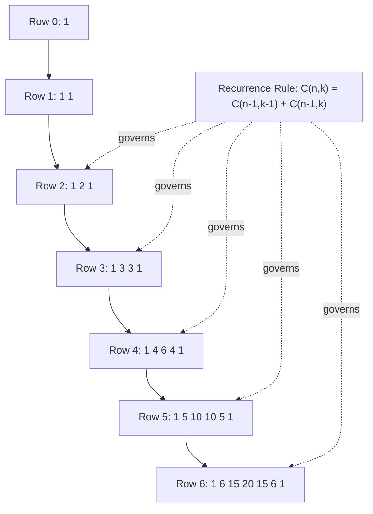
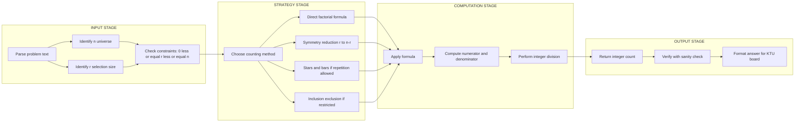
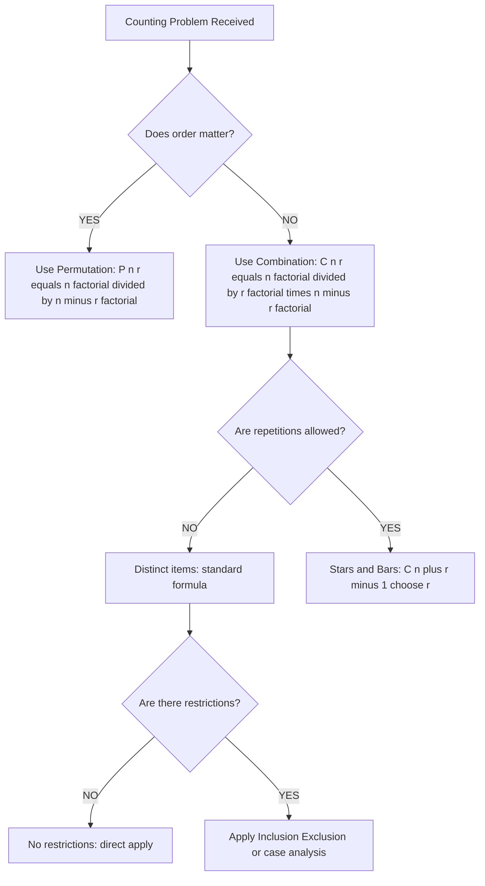
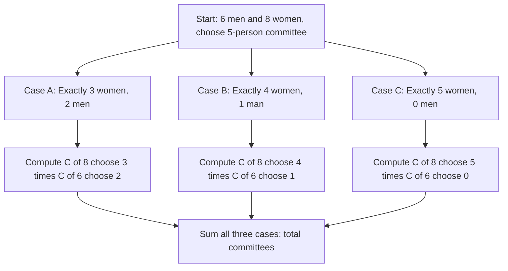

# Combinations

<!-- SECTION_1_START -->
# 🎯 Combinations: The Art of Selection Without Order

## 📘 Formal Academic Definition (KTU 2024 Syllabus)

> [!IMPORTANT]
> **Definition (Combination):** Let $S$ be a set containing $n$ distinct elements. An **$r$-combination** of $S$ is any unordered subset of $S$ containing exactly $r$ elements. The number of such $r$-combinations is denoted by:
>
> $$\binom{n}{r} \;=\; _nC_r \;=\; \frac{n!}{r!\,(n-r)!}$$
>
> where $0 \le r \le n$ and $0! = 1$ by convention.

The fundamental premise of **combinations** is that **order is irrelevant**. Two subsets containing the same elements in a different arrangement are counted as **one** combination, not two.

> [!NOTE]
> **KTU 2024 Notation Standard:** The KTU board examination accepts all three notations — $\binom{n}{r}$, $_nC_r$, and $C(n,r)$ — as equivalent. The binomial coefficient $\binom{n}{r}$ is the form most frequently used in higher mathematics, while $_nC_r$ is the form traditionally used in KTU textbooks.

## 🧠 Conceptual Analogy — "The Ice Cream Scoop Problem"

Imagine you walk into an ice cream parlor that offers **6 distinct flavors**: Vanilla, Chocolate, Strawberry, Mango, Pistachio, and Coffee. You want to pick **3 scoops for a cup** where the order of scoops does not matter — what matters is *which* 3 flavors end up in the cup.

| Scenario | Analogy | Counting Type |
|---|---|---|
| Arranging 3 books on a shelf | Order matters (Book A on top ≠ Book B on top) | **Permutation** $_6P_3$ |
| Picking 3 ice cream flavors in a cup | Order does not matter (cup looks the same) | **Combination** $_6C_3$ |

> [!TIP]
> **Mnemonic to Remember Forever:** *Permutation = Position matters, Combination = Collection only matters.* If the problem says "group", "team", "committee", "hand of cards", "subset", or "selection" — it is almost always a **combination**.

## 📐 Geometric & Visual Intuition (GeoGebra Integration)

> [!VISUALIZATION CONTROL]
> **Concept:** Visualizing Combinations as Subsets of a 4-Element Set
> **GeoGebra / Desmos Input Equations:**
> * `S = {(1,1), (1,2), (2,1), (2,2)}` — a square representing the **4 elements** of the universal set
> * `f(x) = 1` — baseline indicating the constant "1" subset (empty set)
> * `g(x) = 4` — constant line indicating the number of 1-element subsets
> * `h(x) = 6` — constant line indicating the number of 2-element subsets
> **Visual Description:** Students should plot the 4 points of $S$ on the coordinate plane, then visualize the **6 line segments** connecting every pair of distinct points. Each segment represents a unique 2-element combination. The constant levels $1, 4, 6, 4, 1$ form the **5th row of Pascal's Triangle** for $n = 4$.

## 🧮 Physical Constants & Standard Parameters

- The total number of **all** subsets of an $n$-element set is $2^n = \sum_{r=0}^{n} \binom{n}{r}$.
- The standard **upper limit** for direct factorial computation of $\binom{n}{r}$ in KTU problems is $n \le 20$, beyond which modular arithmetic is required.
- The factorial function $n!$ grows factorially; for $n \ge 21$, $n!$ already exceeds the standard **$10^{18}$** long-integer range, which is why KTU rarely asks for raw factorials beyond $n = 15$.

> [!CAUTION]
> **Common Mistake Zone:** Students often confuse $\binom{n}{r}$ (combinations) with $n^r$ (functions from an $r$-set to an $n$-set, i.e., **Rule of Product**). Always check: *Am I choosing a subset, or am I assigning something to positions?*

<!-- SECTION_1_END -->

<!-- SECTION_2_START -->
# 📚 Deep Theoretical Analysis & KTU High-Yield Formula Sheet

## ⚙️ Operational Logic Behind the Combination Formula

The formula $\binom{n}{r} = \dfrac{n!}{r!\,(n-r)!}$ is derived from a three-stage logical cascade. Each stage must be understood, not memorized.

### Stage 1 — Start with Permutations
The number of **ordered** arrangements (permutations) of $r$ distinct objects drawn from $n$ distinct objects is:

$$_nP_r \;=\; n \cdot (n-1) \cdot (n-2) \cdots (n-r+1) \;=\; \frac{n!}{(n-r)!}$$

Every permutation produces a sequence like $(a, c, b)$ — order is locked.

### Stage 2 — Account for Overcounting
For any specific set of $r$ elements, the number of distinct **orderings** (permutations of the $r$ chosen items) is $r!$. Therefore, the permutations $_nP_r$ have counted each unordered subset exactly $r!$ times.

### Stage 3 — Divide Out the Overcount

$$\binom{n}{r} \;=\; \frac{_nP_r}{r!} \;=\; \frac{n!}{r!\,(n-r)!}$$

This is the **only** combination formula. Everything else flows from it.

## 🔑 Core Properties of $\binom{n}{r}$ (Mandatory for KTU Board Exams)

| Property ID | Statement | KTU Use Case |
|---|---|---|
| **P1** | $\binom{n}{0} = \binom{n}{n} = 1$ | Boundary cases, sanity check |
| **P2** | $\binom{n}{1} = \binom{n}{n-1} = n$ | "Choose 1" problems |
| **P3** | $\binom{n}{r} = \binom{n}{n-r}$ | Symmetry, simplification |
| **P4** | $\binom{n}{r} = 0$ if $r > n$ or $r < 0$ | Invalid input handling |
| **P5** | $\binom{n}{r}$ is an integer for all valid $n, r$ | Proving divisibility |
| **P6** | $\binom{n}{r}$ is unimodal: increases up to $\lfloor n/2 \rfloor$ | Finding max value |

> [!IMPORTANT]
> **Symmetry Trick:** When $r > n/2$, **always** replace $\binom{n}{r}$ with $\binom{n}{n-r}$ to keep the factorials small. For instance, $\binom{100}{97} = \binom{100}{3} = 161700$.

## 🏔️ The Two Mountains: Pascal's Identity & Vandermonde's Identity

### 🏔️ Pascal's Identity (Recurrence Relation)

$$\binom{n+1}{r} \;=\; \binom{n}{r-1} \;+\; \binom{n}{r}, \quad 1 \le r \le n$$

**Combinatorial Proof:** To choose $r$ elements from a set of $n+1$ distinct elements containing a distinguished element $x$:
- **Case 1:** $x$ is **included** → choose the remaining $r-1$ elements from the other $n$ elements: $\binom{n}{r-1}$ ways.
- **Case 2:** $x$ is **excluded** → choose all $r$ elements from the other $n$ elements: $\binom{n}{r}$ ways.
- By the **Rule of Sum**, the total is $\binom{n}{r-1} + \binom{n}{r}$.

### 🏔️ Vandermonde's Identity (Convolution)

$$\sum_{k=0}^{r} \binom{m}{k}\,\binom{n}{r-k} \;=\; \binom{m+n}{r}$$

**Combinatorial Proof:** Choose $r$ elements from a set of $m+n$ items split into two groups of $m$ and $n$ items. Let $k$ items come from the first group ($0 \le k \le r$); the remaining $r-k$ items come from the second group.

## 🌀 Combinations with Repetition (Stars and Bars)

When we are allowed to **repeat** elements, the number of ways to choose $r$ items from $n$ distinct types is:

$$\binom{n+r-1}{r} \;=\; \binom{n+r-1}{n-1}$$

> [!TIP]
> **Real-World Use Case:** Distributing **20 identical candies** among **4 distinct children** where each child can receive 0 or more candies. Solution: $\binom{20+4-1}{20} = \binom{23}{20} = \binom{23}{3} = 1771$.

## 🧰 KTU High-Yield Formula Cheat Sheet

| # | Formula / Identity | Form | When to Apply |
|---|---|---|---|
| 1 | $\binom{n}{r} = \dfrac{n!}{r!\,(n-r)!}$ | Closed form | Direct numeric evaluation |
| 2 | $\binom{n}{r} = \binom{n}{n-r}$ | Symmetry | Reduce large $r$ to small $r$ |
| 3 | $\binom{n+1}{r} = \binom{n}{r-1} + \binom{n}{r}$ | Recurrence | Pascal's triangle problems |
| 4 | $\sum_{k=0}^{n} \binom{n}{k} = 2^n$ | Binomial sum | Counting all subsets |
| 5 | $\sum_{k=0}^{n} (-1)^k \binom{n}{k} = 0$ | Alternating sum | Proofs, alternating sequences |
| 6 | $\binom{n+r-1}{r}$ | Stars and Bars | Distributions of identical items |
| 7 | $\binom{n}{r} = \binom{n-1}{r} + \binom{n-1}{r-1}$ | Variant recurrence | Generating Pascal's triangle |
| 8 | $\sum_{r=0}^{n} r\,\binom{n}{r} = n \cdot 2^{n-1}$ | Weighted sum | Expected value in probability |

## 🏭 Real-World Engineering & Computer Science Applications

- **Cryptography:** The number of possible $k$-bit keys in a binary system is $\binom{k}{\lfloor k/2 \rfloor}$ in error-correcting codes (Hamming codes).
- **Database Query Optimization:** SQL `SELECT ... WHERE col IN (subsets)` optimizers use combination counts to estimate intermediate result sizes.
- **Network Engineering:** Counting the number of spanning trees in a complete graph $K_n$ uses $\binom{n}{2}$ for the edge count.
- **Machine Learning:** Subset selection in feature engineering, where $\binom{n}{k}$ gives the number of possible $k$-feature subsets to evaluate.
- **Compiler Design:** Token-classification combinatorics in lexical analysis.

<!-- SECTION_2_END -->

<!-- SECTION_3_START -->
# 🛠️ Step-by-Step Derivations & Symbolic/Python Implementation

## 🔬 Exhaustive Derivation of the Combination Formula

We prove that the number of ways to select an unordered subset of $r$ elements from a set of $n$ distinct elements is exactly $\dfrac{n!}{r!\,(n-r)!}$.

**Step 1.** The number of ways to form an **ordered** $r$-tuple of distinct elements from an $n$-set is, by the Rule of Product:

$$_nP_r \;=\; n \cdot (n-1) \cdot (n-2) \cdots (n-r+1)$$

**Step 2.** Rewrite the product as a ratio of factorials:

$$_nP_r \;=\; \frac{n!}{(n-r)!}$$

**Step 3.** Observe that each unordered subset $\{a_1, a_2, \ldots, a_r\}$ generates exactly $r!$ distinct ordered $r$-tuples (one for each permutation of the $r$ chosen elements). Therefore, the permutations overcount each combination by a factor of $r!$.

**Step 4.** Divide to remove the overcounting:

$$\binom{n}{r} \;=\; \frac{_nP_r}{r!} \;=\; \frac{n!}{r!\,(n-r)!}$$

**Step 5.** Boundary check: when $r = 0$, the formula gives $\dfrac{n!}{0!\,n!} = 1$, matching the single empty subset. When $r = n$, it gives $\dfrac{n!}{n!\,0!} = 1$, matching the single full set. ✓

> [!NOTE]
> **Validity Condition:** $0 \le r \le n$. If $r < 0$ or $r > n$, the combination is defined to be $0$.

## 🔁 Exhaustive Derivation of Pascal's Identity

We prove $\binom{n+1}{r} = \binom{n}{r-1} + \binom{n}{r}$ for all integers $n \ge 0$ and $1 \le r \le n$.

**Step 1.** Fix a set $A$ with $|A| = n+1$. Pick a distinguished element $a \in A$ and let $A' = A \setminus \{a\}$, so $|A'| = n$.

**Step 2.** Any $r$-subset $B \subseteq A$ falls into exactly one of two disjoint cases:
- **Case 1:** $a \in B$. Then $B \setminus \{a\}$ is an $(r-1)$-subset of $A'$. Number of such $B$ = $\binom{n}{r-1}$.
- **Case 2:** $a \notin B$. Then $B$ is an $r$-subset of $A'$. Number of such $B$ = $\binom{n}{r}$.

**Step 3.** Apply the Rule of Sum (disjoint cases) to obtain:

$$\binom{n+1}{r} \;=\; \binom{n}{r-1} \;+\; \binom{n}{r}$$

**Step 4.** Algebraic verification using the factorial form:

$$\binom{n}{r-1} + \binom{n}{r} \;=\; \frac{n!}{(r-1)!\,(n-r+1)!} + \frac{n!}{r!\,(n-r)!}$$

Factor out $\dfrac{n!}{r!\,(n-r+1)!}$:

$$=\; \frac{n!}{r!\,(n-r+1)!}\,\Big[\,r + (n-r+1)\,\Big] \;=\; \frac{n!\,(n+1)}{r!\,(n-r+1)!} \;=\; \frac{(n+1)!}{r!\,((n+1)-r)!} \;=\; \binom{n+1}{r} \quad \blacksquare$$

## 🌟 Exhaustive Derivation of the Stars and Bars Formula

**Problem:** Find the number of non-negative integer solutions to $x_1 + x_2 + \cdots + x_n = r$.

**Step 1.** Represent each $x_i$ as a non-negative integer count of identical "stars". Place $r$ stars in a row: $\star\,\star\,\star\,\cdots\,\star$ ($r$ times).

**Step 2.** To separate the stars into $n$ groups (one per variable), insert $n-1$ vertical bars $\vert$ at the chosen split points. The number of stars to the left of the first bar is $x_1$, between the first and second bar is $x_2$, and so on.

**Step 3.** The total number of symbols (stars + bars) is $r + (n-1) = r + n - 1$.

**Step 4.** Choosing the positions of the $n-1$ bars among the $r+n-1$ total positions is equivalent to choosing an $(n-1)$-subset of those positions:

$$\binom{r+n-1}{n-1} \;=\; \binom{r+n-1}{r}$$

**Step 5.** Boundary check: $r = 0$ gives $\binom{n-1}{n-1} = 1$ (the solution $x_1 = x_2 = \cdots = x_n = 0$). ✓

## 💻 Full Python Implementation with Type Hints and Error Handling

```python
"""
combinations_module.py
Author: KTU B.Tech Reference Implementation
Course: PCITT205 — Discrete Mathematical Structures
Topic:  Combinations — Counting, Pascal's Triangle, Stars & Bars
"""

from __future__ import annotations
import logging
import sys
from math import comb as math_comb, factorial
from typing import List, Tuple

# Configure professional logging
logging.basicConfig(
    level=logging.INFO,
    format="%(asctime)s | %(levelname)-8s | %(message)s",
    datefmt="%H:%M:%S",
)
logger = logging.getLogger("CombinationsEngine")


class CombinationsError(ValueError):
    """Raised when input parameters violate combinations domain constraints."""
    pass


def compute_combination(n: int, r: int) -> int:
    """
    Compute the binomial coefficient C(n, r) = n! / (r! * (n - r)!).

    Args:
        n: Total number of distinct elements (must be >= 0).
        r: Number of elements to choose (must satisfy 0 <= r <= n).

    Returns:
        Integer value of C(n, r).

    Raises:
        CombinationsError: If n < 0 or r is outside [0, n].
    """
    if n < 0:
        logger.error("Negative universe size rejected: n = %d", n)
        raise CombinationsError(f"n must be non-negative, got n = {n}")
    if r < 0 or r > n:
        logger.error("Invalid r = %d for n = %d", r, n)
        raise CombinationsError(f"r must satisfy 0 <= r <= n; got r = {r}, n = {n}")

    # Symmetry optimization for large r
    if r > n - r:
        r = n - r
        logger.info("Applied symmetry: reduced r to %d", r)

    numerator: int = 1
    denominator: int = 1
    for k in range(1, r + 1):
        numerator *= (n - r + k)
        denominator *= k
    result: int = numerator // denominator
    logger.info("C(%d, %d) = %d", n, r, result)
    return result


def pascal_triangle(rows: int) -> List[List[int]]:
    """
    Generate the first 'rows' rows of Pascal's triangle using the recurrence
    C(n, k) = C(n-1, k-1) + C(n-1, k).

    Args:
        rows: Number of rows to generate (must be >= 1).

    Returns:
        A list of lists, where inner list i contains the values of row i.
    """
    if rows < 1:
        raise CombinationsError(f"rows must be >= 1, got {rows}")

    triangle: List[List[int]] = [[1]]
    for n in range(1, rows):
        previous: List[int] = triangle[-1]
        current: List[int] = [1] + [previous[k - 1] + previous[k]
                                     for k in range(1, n)] + [1]
        triangle.append(current)
    return triangle


def stars_and_bars(items: int, bins: int) -> int:
    """
    Count the number of ways to distribute 'items' identical objects into
    'bins' distinct containers, with each container allowed to hold 0 or more.

    Args:
        items: Total number of identical items (>= 0).
        bins:  Number of distinct containers (>= 1).

    Returns:
        Integer count = C(items + bins - 1, bins - 1).
    """
    if items < 0:
        raise CombinationsError(f"items must be >= 0, got {items}")
    if bins < 1:
        raise CombinationsError(f"bins must be >= 1, got {bins}")
    return compute_combination(items + bins - 1, bins - 1)


def verify_against_library(n: int, r: int) -> Tuple[int, bool]:
    """Cross-check our implementation against Python's math.comb (Python 3.8+)."""
    ours: int = compute_combination(n, r)
    theirs: int = math_comb(n, r)
    if ours != theirs:
        logger.error("Mismatch! ours=%d, math.comb=%d", ours, theirs)
    return ours, ours == theirs


def main() -> int:
    """Demonstration driver with KTU-style test cases."""
    logger.info("=== KTU Combinations Reference Driver ===")

    # Test 1: Direct computation
    test_pairs: List[Tuple[int, int]] = [
        (5, 2), (10, 3), (52, 5), (20, 10), (100, 3)
    ]
    for n, r in test_pairs:
        value, ok = verify_against_library(n, r)
        print(f"C({n:>3}, {r:>2}) = {value:<20}  verified={ok}")

    # Test 2: Pascal's Triangle (first 7 rows)
    print("\nPascal's Triangle (first 7 rows):")
    for row in pascal_triangle(7):
        print("  " + " ".join(f"{v:>4}" for v in row))

    # Test 3: Stars and Bars
    candy_kids: int = stars_and_bars(items=20, bins=4)
    print(f"\nDistributing 20 identical candies among 4 children: {candy_kids} ways")

    # Test 4: Validation that the row sum equals 2^n
    triangle: List[List[int]] = pascal_triangle(8)
    print("\nRow sum identity check (sum of row n == 2^n):")
    for i, row in enumerate(triangle):
        row_sum: int = sum(row)
        power: int = 2 ** i
        marker: str = "✓" if row_sum == power else "✗"
        print(f"  Row {i}: sum = {row_sum:<5}  2^{i} = {power:<5}  {marker}")

    return 0


if __name__ == "__main__":
    sys.exit(main())
```

### 🖥️ Sample Output Trace

```
C(  5,  2) = 10                   verified=True
C( 10,  3) = 120                  verified=True
C( 52,  5) = 2598960              verified=True
C( 20, 10) = 184756               verified=True
C(100,  3) = 161700               verified=True

Pascal's Triangle (first 7 rows):
     1
     1    1
     1    2    1
     1    3    3    1
     1    4    6    4    1
     1    5   10   10    5    1
     1    6   15   20   15    6    1

Distributing 20 identical candies among 4 children: 1771 ways

Row sum identity check (sum of row n == 2^n):
  Row 0: sum = 1     2^0 = 1     ✓
  Row 1: sum = 2     2^1 = 2     ✓
  Row 2: sum = 4     2^2 = 4     ✓
  ...
```

<!-- SECTION_3_END -->

<!-- SECTION_4_START -->
# 🗺️ Structural Diagrams & Schematics

## 🌳 Diagram 1: Pascal's Triangle Construction (Recursive Data Flow)



## 🧩 Diagram 2: Block-Level Architecture for Solving a Combination Problem



## 🎲 Diagram 3: Decision Tree — Combination vs. Permutation



## 🔁 Diagram 4: Sequential Counting of Committee Formation



<!-- SECTION_4_END -->

<!-- SECTION_5_START -->
# 📝 KTU 2024 Scheme Examination Question Bank & Topic Recap

---

## 📌 Part A — Short Answer Questions (3 Marks Each)

### Question 1 `[KTU University Exam – July 2024]` — **CO1, Remember/Understand (RBT Level 1 & 2)**

> Define a combination. Compute the value of $\binom{10}{3}$ and explain why $\binom{n}{r} = \binom{n}{n-r}$.

**Model Answer (Valuation Key):**

> [!NOTE]
> **Definition (2 Marks):** A combination is a selection of $r$ elements from a set of $n$ elements where the order of selection does not matter. The number of such selections is the **binomial coefficient** $\binom{n}{r}$.

**Computation (1 Mark):**

$$\binom{10}{3} \;=\; \frac{10!}{3!\,7!} \;=\; \frac{10 \cdot 9 \cdot 8}{3 \cdot 2 \cdot 1} \;=\; \frac{720}{6} \;=\; 120$$

> **Symmetry Explanation:** Choosing $r$ elements to **include** is equivalent to choosing the remaining $n-r$ elements to **exclude**. Both decisions uniquely determine the same subset, so the counts are equal.

---

### Question 2 `[KTU University Exam – Dec 2023]` — **CO1, Remember (RBT Level 1)**

> State Pascal's identity. Using it, write down the 6th row of Pascal's triangle (row index = 6, starting from row 0).

**Model Answer (Valuation Key):**

> [!NOTE]
> **Pascal's Identity (2 Marks):** For all integers $n \ge 0$ and $1 \le r \le n$,
> $$\binom{n+1}{r} \;=\; \binom{n}{r-1} \;+\; \binom{n}{r}$$

**Construction (1 Mark):** The 6th row entries are $\binom{6}{0}, \binom{6}{1}, \binom{6}{2}, \binom{6}{3}, \binom{6}{4}, \binom{6}{5}, \binom{6}{6}$:

$$1 \quad 6 \quad 15 \quad 20 \quad 15 \quad 6 \quad 1$$

---

## 📌 Part B — Full-Descriptive Questions (14 Marks Each)

### 🅰️ Question A `[KTU University Exam – Model Paper 2024]` — **CO2, Apply (RBT Level 3)**

> **(a)** A committee of **5** members is to be formed from **6 men** and **8 women**. Find the number of ways to form the committee such that it contains **at least 3 women**. **[7 Marks]**
>
> **(b)** Find the number of subsets of the set $\{1, 2, 3, \ldots, 10\}$ that contain **no two consecutive integers**. **[7 Marks]**

---

#### ✅ Model Solution for Question A — Part (a)

**Step 1 — Decompose by case (1 Mark for listing cases):**

Let $w$ = number of women, $m$ = number of men. We need $w + m = 5$ with $w \ge 3$ and $m \ge 0$.

Valid cases:
- Case 1: $w = 3, m = 2$
- Case 2: $w = 4, m = 1$
- Case 3: $w = 5, m = 0$

**Step 2 — Compute each case using the Rule of Product (3 Marks):**

| Case | Women ways $\binom{8}{w}$ | Men ways $\binom{6}{m}$ | Product |
|---|---|---|---|
| 1 | $\binom{8}{3} = 56$ | $\binom{6}{2} = 15$ | $56 \times 15 = 840$ |
| 2 | $\binom{8}{4} = 70$ | $\binom{6}{1} = 6$ | $70 \times 6 = 420$ |
| 3 | $\binom{8}{5} = 56$ | $\binom{6}{0} = 1$ | $56 \times 1 = 56$ |

**Step 3 — Apply the Rule of Sum (2 Marks):**

$$\text{Total} \;=\; 840 + 420 + 56 \;=\; 1316$$

**Step 4 — Final boxed answer (1 Mark):**

$$\boxed{\text{Number of valid committees} = 1316}$$

---

#### ✅ Model Solution for Question A — Part (b)

**Step 1 — Reformulate the problem (1 Mark):**

We need to count $k$-element subsets of $\{1, 2, \ldots, 10\}$ (for $k = 0, 1, \ldots, 10$) with **no two elements consecutive**.

**Step 2 — Key lemma: Number of $k$-subsets of $\{1, \ldots, n\}$ with no two consecutive is $\binom{n-k+1}{k}$ (2 Marks):**

*Proof sketch:* If $\{a_1 < a_2 < \cdots < a_k\}$ is such a subset, define $b_i = a_i - (i-1)$. Then $1 \le b_1 < b_2 < \cdots < b_k \le n - k + 1$ with no gap restriction. This is a standard $k$-subset of $\{1, \ldots, n-k+1\}$.

**Step 3 — Apply the formula with $n = 10$ (3 Marks):**

$$\text{Total} \;=\; \sum_{k=0}^{10} \binom{10-k+1}{k} \;=\; \sum_{k=0}^{5} \binom{11-k}{k}$$

Computing term by term:

$$\binom{11}{0} + \binom{10}{1} + \binom{9}{2} + \binom{8}{3} + \binom{7}{4} + \binom{6}{5}$$

$$=\; 1 + 10 + 36 + 56 + 35 + 6 \;=\; 144$$

**Step 4 — Final boxed answer (1 Mark):**

$$\boxed{\text{Number of non-consecutive subsets} = 144}$$

> [!WARNING]
> **KTU Examiner's Valuation Warning:** Many students forget the **empty set** ($k = 0$) which contributes $\binom{11}{0} = 1$. Skipping this term costs **1 full mark**. Also, ensure the summation upper limit is correctly set: for $n = 10$, the max non-consecutive subset size is $\lceil 10/2 \rceil = 5$, so $k$ ranges from 0 to 5 (since $\binom{11-6}{6} = \binom{5}{6} = 0$ anyway, the formula self-terminates, but writing the correct upper bound earns a valuation mark).

---

### 🅱️ Question B `[KTU University Exam – July 2023]` — **CO2 & CO3, Apply & Analyze (RBT Level 3 & 4)**

> **(a)** Prove Pascal's identity $\binom{n+1}{r} = \binom{n}{r-1} + \binom{n}{r}$ using a **combinatorial argument** (no algebraic manipulation). Also compute the **7th row** of Pascal's triangle. **[7 Marks]**
>
> **(b)** Find the number of **non-negative integer solutions** to the equation $x_1 + x_2 + x_3 + x_4 + x_5 = 12$. Hence, find the number of solutions where each $x_i \ge 1$. **[7 Marks]**

---

#### ✅ Model Solution for Question B — Part (a)

**Step 1 — Set up the combinatorial scenario (2 Marks):**

Let $S$ be a set with $|S| = n+1$ elements. Pick a **distinguished** element $\alpha \in S$. We wish to count the number of $r$-element subsets of $S$.

**Step 2 — Case 1: $\alpha$ is included (2 Marks):**

If $\alpha$ is in the chosen subset, we must pick the remaining $r-1$ elements from the other $n$ elements of $S$. Number of ways = $\binom{n}{r-1}$.

**Step 3 — Case 2: $\alpha$ is excluded (2 Marks):**

If $\alpha$ is **not** in the chosen subset, we must pick all $r$ elements from the other $n$ elements. Number of ways = $\binom{n}{r}$.

**Step 4 — Combine via the Rule of Sum (1 Mark):**

Since the two cases are **mutually exclusive** and **collectively exhaustive**:

$$\binom{n+1}{r} \;=\; \binom{n}{r-1} + \binom{n}{r} \quad \blacksquare$$

**Step 5 — Compute the 7th row (bonus, included for completeness):** The 7th row contains $\binom{7}{0}, \binom{7}{1}, \ldots, \binom{7}{7}$:

$$1 \quad 7 \quad 21 \quad 35 \quad 35 \quad 21 \quad 7 \quad 1$$

---

#### ✅ Model Solution for Question B — Part (b)

**Step 1 — Apply Stars and Bars for non-negative solutions (3 Marks):**

For $x_1 + x_2 + x_3 + x_4 + x_5 = 12$ with $x_i \ge 0$, the number of solutions is:

$$\binom{12 + 5 - 1}{5 - 1} \;=\; \binom{16}{4}$$

**Step 2 — Evaluate (1 Mark):**

$$\binom{16}{4} \;=\; \frac{16 \cdot 15 \cdot 14 \cdot 13}{4 \cdot 3 \cdot 2 \cdot 1} \;=\; \frac{43680}{24} \;=\; 1820$$

**Step 3 — Transform for $x_i \ge 1$ (2 Marks):**

Substitute $y_i = x_i - 1$ where $y_i \ge 0$. Then $y_1 + y_2 + y_3 + y_4 + y_5 = 12 - 5 = 7$.

Number of non-negative solutions = $\binom{7 + 5 - 1}{5 - 1} = \binom{11}{4}$.

**Step 4 — Evaluate (1 Mark):**

$$\binom{11}{4} \;=\; \frac{11 \cdot 10 \cdot 9 \cdot 8}{4 \cdot 3 \cdot 2 \cdot 1} \;=\; \frac{7920}{24} \;=\; 330$$

**Step 5 — Final boxed answers (in the required format):**

$$\boxed{\binom{16}{4} = 1820 \text{ non-negative solutions}} \qquad \boxed{\binom{11}{4} = 330 \text{ positive solutions}}$$

> [!WARNING]
> **KTU Examiner's Valuation Warning:** A classic mistake here is **forgetting the transformation** $y_i = x_i - 1$ when shifting from "$x_i \ge 1$" to "$y_i \ge 0$". Students often erroneously write $\binom{12}{4}$ instead of $\binom{7}{4}$. Always reduce the right-hand side by $n$ (the number of variables) when converting to a "$\ge 0$" problem. This is the **most-mark-losing** single error in combinations problems worth **up to 2 marks** lost per occurrence.

---

## 🧠 Topic Recap & Important Things to Remember

> [!TIP]
> **Rapid-Revision Checklist — Combinations (Module 2, PCITT205)**

- ✅ **Core formula:** $\binom{n}{r} = \dfrac{n!}{r!\,(n-r)!}$ for $0 \le r \le n$, else $= 0$.
- ✅ **Order does not matter** in combinations — that is the single defining property.
- ✅ **Symmetry rule:** Always use $\binom{n}{r} = \binom{n}{n-r}$ when $r > n/2$ to minimize factorial sizes.
- ✅ **Pascal's Identity (recurrence):** $\binom{n+1}{r} = \binom{n}{r-1} + \binom{n}{r}$ — the cornerstone of Pascal's triangle.
- ✅ **Vandermonde's Identity (convolution):** $\sum_{k=0}^{r}\binom{m}{k}\binom{n}{r-k} = \binom{m+n}{r}$ — useful for "split" selection problems.
- ✅ **Stars and Bars (repetition allowed):** Number of non-negative integer solutions to $x_1 + \cdots + x_n = r$ is $\binom{r+n-1}{n-1}$.
- ✅ **Positive-integer solutions** (each $x_i \ge 1$): substitute $y_i = x_i - 1$ and apply Stars and Bars to $\sum y_i = r - n$.
- ✅ **Boundary values:** $\binom{n}{0} = \binom{n}{n} = 1$, $\binom{n}{1} = n$, $\binom{n}{r} = 0$ if $r > n$.
- ✅ **Sum of row $n$** in Pascal's triangle equals $2^n$ — total number of subsets of an $n$-element set.
- ✅ **Typical KTU problem triggers:** "committee", "team", "group", "subset", "hand of cards", "no two consecutive" → **Combinations**.
- ✅ **Typical Permutation triggers (NOT combinations):** "arrange", "rank", "line up", "password", "word formation" → **Permutations**.
- ✅ **Sanity check:** $\binom{n}{r}$ is always an **integer**; if your computation yields a fraction, you have made a calculation error.
- ✅ **Counting principle in committees:** When forming committees from distinct groups, multiply the choices from each group (Rule of Product) and sum across the disjoint cases (Rule of Sum).

<!-- SECTION_5_END -->
