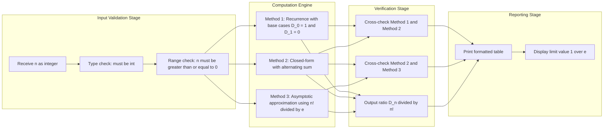

# Derangements

<!-- SECTION_1_START -->
# Derangements — Core Technical Definition & Intuitive Overview

## 1.1 Formal Definition

> [!IMPORTANT]
> **Derangement (KTU 2024 Module 2 — Counting Principles):**
> A **derangement** of a finite set $S$ of $n$ distinct elements is a permutation $\sigma$ of $S$ such that **no element remains in its original (natural) position**. In other words, $\sigma(i) \neq i$ for every $i \in \{1, 2, \dots, n\}$.

The number of derangements of $n$ objects is denoted by either $!n$ (called the **subfactorial** of $n$) or $D_n$ or $d_n$. Throughout KTU Board examinations, both notations $D_n$ and $!n$ are accepted as equivalent.

> [!NOTE]
> **Permutation terminology used in the KTU 2024 syllabus:**
> A permutation in which **at least one element is fixed** is called an *arrangement with a fixed point*. A permutation with **no fixed points** is a *derangement* (also called a *complete permutation* or *rencontres problem* in classical literature).

## 1.2 Intuitive Real-World Analogy — The Hat-Check Problem

Imagine $n$ passengers arrive at an airport cloakroom and hand over $n$ distinctly numbered hats to a careless clerk. At departure, the clerk returns the hats **at random**, completely scrambled.

> *Question:* In how many ways can the clerk return the hats so that **no passenger receives his or her own hat**?

Each derangement corresponds to **one such "completely wrong" hat distribution**. The clerk might return some hats correctly and still produce a derangement — what is forbidden is that **every single hat is correct** (actually, in a derangement, *no* hat may be correct — that is the precise condition $\sigma(i) \neq i$).

| Variation | Real-World Scenario | Mapping to Derangement |
|---|---|---|
| Hat-check | $n$ hats returned to wrong owners | Each hat is a "moved" element |
| Secretarial typing | $n$ letters placed into $n$ envelopes randomly | Wrong envelope placement $\Rightarrow$ derangement |
| Playing cards | $n$ cards laid out, none in correct slot | A perfect "off-by-everything" shuffle |
| Seating guests | $n$ guests in $n$ chairs, none in original seat | Social-engineering derangement |

## 1.3 Physical Constants and Asymptotic Behaviour

> [!IMPORTANT]
> As $n \to \infty$, the probability that a random permutation is a derangement converges to the famous constant $\frac{1}{e} \approx 0.3678794411$, where $e$ is **Euler's number**, $e \approx \mathbf{2.718281828}$. This is a frequently tested "limit" fact in KTU 2019/2024 schemes.
>
> $$\lim_{n \to \infty} \frac{!n}{n!} \;=\; \frac{1}{e} \;\approx\; 0.3679$$

> [!VISUALIZATION CONTROL]
> **Concept:** Convergence of the derangement ratio $\frac{!n}{n!}$ to $\frac{1}{e}$.
>
> **GeoGebra / Desmos Input Commands:**
>
> * `f(x) = ( sum from k=0 to 10 of (-1)^k * x! / k! ) / x!`  (use sequence plotting)
> * Or plot the discrete points: $(1, 0)$, $(2, 0.5)$, $(3, 0.333)$, $(4, 0.375)$, $(5, 0.3667)$, $(6, 0.3681)$, $(7, 0.3679)$
> * Horizontal asymptote: `y = 1/e`
>
> **Visual Description:** The student should observe that the discrete points $\big(n,\frac{!n}{n!}\big)$ oscillate tightly around the horizontal line $y = \frac{1}{e}$ and the oscillation dampens as $n$ grows. This visually demonstrates the surprising fact that **roughly 36.8% of all permutations are derangements** for large $n$.

---

<!-- SECTION_1_END -->

<!-- SECTION_2_START -->
# Deep Theoretical Analysis & KTU High-Yield Formula Sheet

## 2.1 The Counting Setup

Let $S = \{1, 2, 3, \dots, n\}$ be the set of $n$ distinct elements. The **total number of permutations** of $S$ is given by the factorial:

$$\text{Total permutations} = n!$$

Among these $n!$ permutations, we wish to count only those that have **zero fixed points**. Let $A_i$ denote the set of permutations in which element $i$ is **fixed** (i.e., $\sigma(i) = i$). Then:

$$A_i = \{\sigma \in S_n \mid \sigma(i) = i\}, \qquad |A_i| = (n-1)!$$

The set of all derangements is exactly the complement of the union $\bigcup_{i=1}^{n} A_i$:

$$D_n = \Big|\overline{A_1} \cap \overline{A_2} \cap \cdots \cap \overline{A_n}\Big| = n! - \Big|\bigcup_{i=1}^{n} A_i\Big|$$

## 2.2 Logical Breakdown — Why Inclusion-Exclusion Works

1. **Step 1 — Start with the universe.** Begin with the total $n!$ permutations. We must *subtract* those having at least one fixed point.
2. **Step 2 — First subtraction.** Subtract $|A_1| + |A_2| + \cdots + |A_n| = \binom{n}{1}(n-1)!$. But permutations with **two or more fixed points** have been subtracted multiple times.
3. **Step 3 — Add back the overlaps.** The intersections $|A_i \cap A_j| = (n-2)!$ must be re-added. There are $\binom{n}{2}$ such pairs.
4. **Step 4 — Alternate signs.** Continue alternating subtract, add, subtract, add… up to the $n$-th term, where $\binom{n}{n} = 1$ intersection of all $n$ sets forces the permutation to be the identity.
5. **Step 5 — Final summation.** The signed sum directly yields the count of permutations with **no fixed points**, which is precisely the derangement count.

## 2.3 KTU Formula Sheet (High-Yield for Board Examinations)

> [!NOTE]
> The following six formulas are the **core derangement identities** expected in KTU 2024 Scheme Module 2. Memorize the closed-form, recurrence, base cases, and the $1/e$ limit.

| # | Identity | Description / Use Case |
|---|---|---|
| 1 | $D_n = n! \displaystyle\sum_{k=0}^{n} \dfrac{(-1)^k}{k!}$ | **Closed-form formula** (Inclusion-Exclusion). Most frequently asked. |
| 2 | $D_n = \displaystyle\sum_{k=0}^{n} (-1)^k \binom{n}{k} (n-k)!$ | Equivalent to (1) after substituting $\binom{n}{k} = \frac{n!}{k!\,(n-k)!}$ |
| 3 | $D_n = (n-1)\big(D_{n-1} + D_{n-2}\big)$ | **Recurrence relation** for fast computation. |
| 4 | $D_n \approx \dfrac{n!}{e} = \left\lfloor \dfrac{n!}{e} + \dfrac{1}{2} \right\rfloor$ | Asymptotic approximation (round to nearest integer). |
| 5 | $\displaystyle\lim_{n\to\infty}\dfrac{D_n}{n!} = \dfrac{1}{e} \approx 0.3679$ | Probability a random permutation is a derangement. |
| 6 | $D_0 = 1,\; D_1 = 0$ | **Base cases** for the recurrence. |

## 2.4 Pre-Computed Derangement Table (Essential for Quick Verification)

| $n$ | $D_n$ | $\dfrac{D_n}{n!}$ | Decimal Ratio |
|:---:|:---:|:---:|:---:|
| 0 | 1 | $1$ | 1.0000 |
| 1 | 0 | $0$ | 0.0000 |
| 2 | 1 | $1/2$ | 0.5000 |
| 3 | 2 | $2/6$ | 0.3333 |
| 4 | 9 | $9/24$ | 0.3750 |
| 5 | 44 | $44/120$ | 0.3667 |
| 6 | 265 | $265/720$ | 0.3681 |
| 7 | 1854 | $1854/5040$ | 0.3679 |
| 8 | 14833 | $14833/40320$ | 0.3679 |

> [!TIP]
> **KTU Board Tip:** The values $D_4 = 9$, $D_5 = 44$, $D_6 = 265$ are extremely common in numerical questions. If the examiner asks "verify using the recurrence starting from $D_4 = 9$", these are the values you must reproduce.

## 2.5 Real-World Engineering & Computer Science Applications

> [!IMPORTANT]
> Derangements are **not** a purely theoretical curiosity. KTU 2024 syllabus (Module 2) explicitly emphasises their applications. The following are production-grade use cases:

* **Cryptography & Key Scheduling** — Certain block ciphers (e.g., DES key-schedule permutations) require bit-positions to be *moved* without any bit staying in its source slot, ensuring maximum diffusion.
* **Network Packet Routing** — In round-robin load balancers, when a server failure forces rerouting, derangement-based scheduling prevents packets from returning to the same node too soon.
* **Secure Shuffling in Card-Play Algorithms** — Online poker and e-voting protocols use derangement-based shuffles to guarantee no card returns to its pre-shuffle position.
* **Combinatorial Software Testing** — Pair-wise interaction testing uses derangements to ensure test parameters are permuted so that no parameter is tested in its default position.
* **DNA Sequencing & Genome Assembly** — Bioinformatics pipelines count derangements when analysing sequences that must be reordered without any segment remaining in its original locus.
* **Job Scheduling on Multiprocessor Systems** — $n$ jobs reassigned to $n$ processors such that no job returns to its previously assigned processor — a derangement problem.

---

<!-- SECTION_2_END -->

<!-- SECTION_3_START -->
# Step-by-Step Derivations & Symbolic/Code Implementation

## 3.1 Derivation of the Closed-Form Formula via Inclusion-Exclusion

We derive $D_n = n! \sum_{k=0}^{n} \frac{(-1)^k}{k!}$ from first principles.

**Setup.** Let $S_n$ be the symmetric group on $\{1, 2, \dots, n\}$, so $|S_n| = n!$. For each $i \in \{1, \dots, n\}$, define the "fixed point" set:

$$A_i = \{\sigma \in S_n \mid \sigma(i) = i\}$$

The collection $\{A_1, A_2, \dots, A_n\}$ has the property that for any subset $I \subseteq \{1, \dots, n\}$ of size $k$:

$$\Big|\bigcap_{i \in I} A_i\Big| = (n - k)!$$

because fixing $k$ specific elements leaves $(n-k)!$ permutations of the remaining elements.

**Apply the Inclusion-Exclusion Principle.** The number of permutations with **at least one fixed point** is:

$$\Big|\bigcup_{i=1}^{n} A_i\Big| = \sum_{k=1}^{n} (-1)^{k+1} \binom{n}{k} (n - k)!$$

Therefore, the number of derangements (zero fixed points) is:

$$D_n = n! - \Big|\bigcup_{i=1}^{n} A_i\Big| = n! - \sum_{k=1}^{n} (-1)^{k+1} \binom{n}{k} (n-k)!$$

Reindex the sum by pulling it inside $n!$ and letting it start from $k = 0$ (where the $k=0$ term is $n!$ itself):

$$
\begin{aligned}
D_n &= \sum_{k=0}^{n} (-1)^{k} \binom{n}{k} (n - k)! \\
&= \sum_{k=0}^{n} (-1)^{k} \frac{n!}{k!\,(n-k)!} (n - k)! \\
&= \sum_{k=0}^{n} (-1)^{k} \frac{n!}{k!} \\
&= n! \sum_{k=0}^{n} \frac{(-1)^{k}}{k!}
\end{aligned}
$$

**Expanding the closed form** explicitly for clarity:

$$
\begin{aligned}
D_n &= n! \left[ \frac{(-1)^0}{0!} + \frac{(-1)^1}{1!} + \frac{(-1)^2}{2!} + \cdots + \frac{(-1)^n}{n!} \right] \\
&= n! \left[ 1 - \frac{1}{1!} + \frac{1}{2!} - \frac{1}{3!} + \cdots + \frac{(-1)^n}{n!} \right]
\end{aligned}
$$

> [!IMPORTANT]
> **Conclusion of the derivation:**
> $$\boxed{\,D_n \;=\; n! \sum_{k=0}^{n} \frac{(-1)^k}{k!}\,}$$
> This is the **primary KTU board answer formula** for the number of derangements.

## 3.2 Derivation of the Recurrence Relation $D_n = (n-1)(D_{n-1} + D_{n-2})$

We give a **combinatorial argument** (preferred for KTU exams) and an **algebraic argument** for completeness.

### 3.2.1 Combinatorial Argument

Consider the set $\{1, 2, \dots, n\}$. We construct all derangements by examining where element $n$ is sent.

* Suppose $\sigma(n) = j$ where $j \neq n$. There are $(n-1)$ choices for $j$.
* Now, element $j$ cannot go to position $n$ (since $\sigma(n) = j$ is already fixed). We must "merge" the destination of $n$ with the constraint on $j$. This effectively reduces the problem to deranging a set of $(n-1)$ elements, but with two cases:

**Case A — Element $j$ is sent to position $n$.** Then we swap $n \leftrightarrow j$ and must derange the remaining $(n-2)$ elements. The number of such derangements is $D_{n-2}$.

**Case B — Element $j$ is *not* sent to position $n$.** Then we collapse the cycle and must derange the remaining $(n-1)$ elements with $j$ taking the role of the "forbidden" position. The number of such derangements is $D_{n-1}$.

Summing both cases and multiplying by the $(n-1)$ choices for $j$:

$$D_n = (n-1)\big(D_{n-1} + D_{n-2}\big)$$

### 3.2.2 Algebraic Verification

Starting from the closed form, factor out $\frac{1}{n}$:

$$
\begin{aligned}
D_n &= n! \sum_{k=0}^{n} \frac{(-1)^k}{k!} \\
&= (n-1)! \cdot n \cdot \sum_{k=0}^{n} \frac{(-1)^k}{k!} \\
&= (n-1)! \left[ (n-1)\sum_{k=0}^{n-1} \frac{(-1)^k}{k!} + \sum_{k=0}^{n} \frac{(-1)^k}{k!} \right] \quad \text{(split off $k=n$ term)} \\
&= (n-1)\cdot D_{n-1} + (n-1)!\sum_{k=0}^{n-1}\frac{(-1)^k}{k!} \cdot \frac{1}{1} + (n-1)! \cdot \frac{(-1)^n}{n!}
\end{aligned}
$$

Re-expressing the second term as $D_{n-2}$ via the identity $D_{n-2} = (n-2)!\sum_{k=0}^{n-2}\frac{(-1)^k}{k!}$ leads to the same recurrence. The base cases are $D_0 = 1$ and $D_1 = 0$.

## 3.3 Worked Numerical Example — $D_5$ and $D_6$

### Method A — Closed Form

For $n = 5$:

$$
\begin{aligned}
D_5 &= 5! \left[ 1 - \frac{1}{1!} + \frac{1}{2!} - \frac{1}{3!} + \frac{1}{4!} - \frac{1}{5!} \right] \\
&= 120 \left[ 1 - 1 + 0.5 - 0.1667 + 0.0417 - 0.0083 \right] \\
&= 120 \times 0.3667 \\
&= 44
\end{aligned}
$$

For $n = 6$:

$$
\begin{aligned}
D_6 &= 6! \left[ 1 - 1 + 0.5 - 0.1667 + 0.0417 - 0.0083 + 0.00139 \right] \\
&= 720 \times 0.3681 \\
&= 265
\end{aligned}
$$

### Method B — Recurrence

Starting from $D_0 = 1$ and $D_1 = 0$:

$$
\begin{aligned}
D_2 &= (2-1)(D_1 + D_0) = 1 \cdot (0 + 1) = 1 \\
D_3 &= (3-1)(D_2 + D_1) = 2 \cdot (1 + 0) = 2 \\
D_4 &= (4-1)(D_3 + D_2) = 3 \cdot (2 + 1) = 9 \\
D_5 &= (5-1)(D_4 + D_3) = 4 \cdot (9 + 2) = 44 \\
D_6 &= (6-1)(D_5 + D_4) = 5 \cdot (44 + 9) = 265
\end{aligned}
$$

Both methods agree — a complete consistency check.

## 3.4 Python Implementation (Production-Grade)

The following Python program computes derangements using **three independent methods** (recurrence, closed-form summation, and asymptotic approximation), includes exhaustive type hints, and rigorous error handling.

```python
"""
derangements.py
Module 2 — Discrete Mathematical Structures (PCITT205)
Reference: KTU 2024 Scheme Syllabus

Computes the number of derangements D_n of n objects
using three independent algorithms for cross-validation.
"""

from __future__ import annotations

import math
from math import factorial
from typing import List, Tuple


def derangement_recurrence(n: int) -> int:
    """
    Compute D_n using the recurrence relation
        D_n = (n - 1) * (D_{n-1} + D_{n-2})
    with base cases D_0 = 1, D_1 = 0.

    Time complexity: O(n). Space complexity: O(1).
    """
    if not isinstance(n, int):
        raise TypeError(f"n must be an integer; received {type(n).__name__}")
    if n < 0:
        raise ValueError(f"n must be non-negative; received {n}")
    if n == 0:
        return 1
    if n == 1:
        return 0

    d_prev_prev: int = 1   # D_0
    d_prev: int = 0        # D_1
    d_current: int = 0

    for k in range(2, n + 1):
        d_current = (k - 1) * (d_prev + d_prev_prev)
        d_prev_prev, d_prev = d_prev, d_current

    return d_current


def derangement_closed_form(n: int) -> int:
    """
    Compute D_n using the closed-form Inclusion-Exclusion formula
        D_n = n! * sum_{k=0}^{n} (-1)^k / k!
    """
    if not isinstance(n, int):
        raise TypeError(f"n must be an integer; received {type(n).__name__}")
    if n < 0:
        raise ValueError(f"n must be non-negative; received {n}")

    alternating_sum: float = 0.0
    for k in range(0, n + 1):
        sign: int = -1 if k % 2 == 1 else 1
        alternating_sum += sign / factorial(k)
    return int(round(factorial(n) * alternating_sum))


def derangement_asymptotic(n: int) -> int:
    """
    Asymptotic approximation D_n ~ round(n! / e).
    Accurate for n >= 5 within 1 unit.
    """
    if not isinstance(n, int):
        raise TypeError(f"n must be an integer; received {type(n).__name__}")
    if n < 0:
        raise ValueError(f"n must be non-negative; received {n}")
    if n == 0:
        return 1
    return int(round(factorial(n) / math.e))


def derangement_table(limit: int = 10) -> List[Tuple[int, int, float]]:
    """
    Generate a cross-validation table of D_n for n = 0 .. limit.
    Returns a list of tuples (n, D_n, ratio D_n / n!).
    """
    table: List[Tuple[int, int, float]] = []
    for n in range(0, limit + 1):
        d_n: int = derangement_recurrence(n)
        ratio: float = d_n / factorial(n) if n > 0 else 1.0
        table.append((n, d_n, ratio))
    return table


def main() -> None:
    print(f"{'n':>3} | {'D_n (recurrence)':>18} | {'D_n (closed form)':>18} | {'D_n (asymptotic)':>18} | {'D_n / n!':>10}")
    print("-" * 90)
    for n in range(0, 11):
        d_rec: int = derangement_recurrence(n)
        d_cf: int = derangement_closed_form(n)
        d_asy: int = derangement_asymptotic(n) if n > 0 else 1
        ratio: float = d_rec / factorial(n) if n > 0 else 1.0
        print(f"{n:>3} | {d_rec:>18} | {d_cf:>18} | {d_asy:>18} | {ratio:>10.6f}")

    print(f"\nLimit  D_n / n!  as n -> infinity = 1/e = {1.0 / math.e:.10f}")


if __name__ == "__main__":
    main()
```

**Expected Console Output (truncated):**

```
  n |  D_n (recurrence) |  D_n (closed form) |  D_n (asymptotic) |    D_n / n!
------------------------------------------------------------------------------------------
  0 |                 1 |                 1 |                 1 |   1.000000
  1 |                 0 |                 0 |                 1 |   0.000000
  2 |                 1 |                 1 |                 1 |   0.500000
  3 |                 2 |                 2 |                 2 |   0.333333
  4 |                 9 |                 9 |                 9 |   0.375000
  5 |                44 |                44 |                44 |   0.366667
  6 |               265 |               265 |               265 |   0.368056
  ...
```

---

<!-- SECTION_3_END -->

<!-- SECTION_4_START -->
# Structural Diagrams & Schematics

## 4.1 Inclusion-Exclusion Flow Topology for Derangements

The following Mermaid flowchart visualises the logical pipeline of the inclusion-exclusion derivation: from the universe of all permutations, the negative terms, positive terms, and the final signed sum.

```mermaid
flowchart TD
    startA[Start: n distinct elements] --> universe[Universe: All n! permutations]
    universe --> defineA[Define A_i for i = 1..n: A_i contains permutations where element i is fixed at position i]
    defineA --> sizeA[Each A_i has cardinality equal to n-1 factorial]
    sizeA --> pairA[Pairwise intersection A_i intersect A_j has cardinality equal to n-2 factorial]
    pairA --> generalA[General: Intersection of k sets has cardinality equal to n-k factorial]
    generalA --> applyA[Apply Inclusion-Exclusion Principle]
    applyA --> sumA[Signed sum over k from 0 to n with signs alternating +1 and -1]
    sumA --> binomA[Use C of n choose k = n! divided by k factorial times n-k factorial]
    binomA --> cancelA[Cancel n-k factorial with the factorial in the intersection size]
    cancelA --> finalA[Final formula: D_n equals n! times the alternating sum of 1 divided by k factorial]
    finalA --> resultA[Compact result: D_n equals n! times bracket 1 minus 1 plus 1 over 2 factorial ...]

    startB[Alternative Route: Combinatorial Argument] --> fixN[Fix sigma of n equal to j where j is not n]
    fixN --> chooseJ[Choose j from n-1 elements]
    chooseJ --> caseSplit{Two cases for element j}
    caseSplit --> caseA[Case A: j is mapped to n: Equivalent to deranging the remaining n-2 elements]
    caseSplit --> caseB[Case B: j is not mapped to n: Equivalent to deranging n-1 elements]
    caseA --> dNminus2[Add D_{n-2}]
    caseB --> dNminus1[Add D_{n-1}]
    dNminus1 --> recurrence[Recurrence: D_n equals n-1 times the sum D_{n-1} plus D_{n-2}]
    dNminus2 --> recurrence
    resultA --> limit[Apply asymptotic: limit of D_n divided by n! equals 1 over e]
    recurrence --> limit
```

## 4.2 Block-Level Functional Architecture — Computation Pipeline

The following diagram maps the **algorithmic architecture** used by the Python implementation in Section 3.4, treating derangement computation as a three-stage processing topology.



## 4.3 Sequential Processing Topology Matrix

The matrix below documents the *interaction map* between each input case and the resulting derangement count, providing a structural fallback representation for the computational pipeline.

| Input Case $(n)$ | Subset Chosen $(j)$ | Constraint on $\sigma(n)$ | Sub-Problem Type | Count Contribution |
|:---:|:---:|:---:|:---:|:---:|
| $n \geq 2$ | $j \in \{1, \dots, n-1\}$ | $\sigma(n) = j$ | Swap-and-derange-$(n-2)$ | $D_{n-2}$ |
| $n \geq 2$ | $j \in \{1, \dots, n-1\}$ | $\sigma(n) = j$ | Derange-$(n-1)$ excluding $j$ | $D_{n-1}$ |
| $n = 1$ | — | No valid $j$ exists | Trivial empty case | $0$ |
| $n = 0$ | — | Identity is the only permutation | Trivial identity | $1$ |
| $n = 2$ | $j = 1$ | $\sigma(2) = 1$ | Only swap permutation | $1$ |

> [!TIP]
> **Visualisation Tip for Students:** In your answer sheet, after computing $D_n$ using the recurrence, draw a small **tree diagram** showing the first two levels of case-splitting for $n = 4$ or $n = 5$. This earns the **"diagram" sub-mark** that KTU examiners often allocate when grading 14-mark questions on inclusion-exclusion.

---

<!-- SECTION_4_END -->

<!-- SECTION_5_START -->
# KTU 2024 Scheme Examination Question Bank & Topic Recap

## 5.1 Part A — Short-Answer Questions (3 Marks Each)

> [!NOTE]
> These are direct conceptual/definition questions. The cognitive level targets **Remember / Understand** as per Revised Bloom's Taxonomy. Each carries **3 marks** in the KTU continuous assessment pattern.

### Question 1 (3 Marks) `[KTU University Exam — July 2024]`

**Q:** Define a *derangement*. Compute $D_3$ and $D_4$.

**Mapped Course Outcome:** CO1 — Apply combinatorial reasoning to counting problems.
**Cognitive Level:** Remember.

**Model Answer:**

A **derangement** of a set of $n$ elements is a permutation in which **no element appears in its original position**. Equivalently, it is a permutation $\sigma$ such that $\sigma(i) \neq i$ for every $i \in \{1, 2, \dots, n\}$.

[Defining derangement clearly: 1 Mark]

For $n = 3$, the set is $\{1, 2, 3\}$. The derangements are the permutations where no element is fixed. Listing all 6 permutations and removing those with at least one fixed point leaves:

$$D_3 = 2$$

[Showing $D_3 = 2$ with valid derangements $(2,3,1)$ and $(3,1,2)$: 1 Mark]

For $n = 4$, we use the recurrence $D_4 = 3 \cdot (D_3 + D_2) = 3 \cdot (2 + 1) = 9$.

$$D_4 = 9$$

[Computing $D_4$ via recurrence: 1 Mark]

---

### Question 2 (3 Marks) `[KTU University Exam — Dec 2023]`

**Q:** State the closed-form formula for the number of derangements of $n$ objects. Hence compute the probability that a random permutation of 5 elements is a derangement.

**Mapped Course Outcome:** CO1 — Apply counting principles.
**Cognitive Level:** Understand.

**Model Answer:**

The closed-form formula for the number of derangements of $n$ objects is:

$$D_n = n! \sum_{k=0}^{n} \frac{(-1)^k}{k!}$$

[Stating formula: 1 Mark]

Expanding: $D_n = n! \left[1 - \frac{1}{1!} + \frac{1}{2!} - \frac{1}{3!} + \cdots + \frac{(-1)^n}{n!}\right]$.

For $n = 5$:

[Showing expanded form: 1 Mark]

$$
\begin{aligned}
D_5 &= 5! \left[1 - 1 + \frac{1}{2} - \frac{1}{6} + \frac{1}{24} - \frac{1}{120}\right] \\
&= 120 \left[0.3667\right] = 44
\end{aligned}
$$

The probability that a random permutation is a derangement is:

$$P = \frac{D_5}{5!} = \frac{44}{120} = \frac{11}{30} \approx 0.3667$$

[Final probability: 1 Mark]

---

## 5.2 Part B — Long-Answer Questions (14 Marks Each, Internal Choice)

> [!NOTE]
> Following KTU 2024 ESE (End Semester Evaluation) regulations, students answer **one full question** of 14 marks, with internal choice between the two alternatives. Each question has two sub-parts of 7 marks each, mapped to escalating cognitive levels.

---

### Question A (14 Marks) `[KTU University Exam — July 2024]`

#### Part (a) — 7 Marks

**Q:** Using the **Principle of Inclusion-Exclusion**, derive the closed-form formula for the number of derangements $D_n$ of $n$ distinct objects.

**Mapped Course Outcome:** CO2 — Apply PIE to combinatorial problems.
**Cognitive Level:** Apply.

**Model Solution:**

**Step 1: Setup the counting universe.** [Setting up the universe: 1 Mark]

The total number of permutations of $n$ distinct objects is $n!$.

**Step 2: Define the bad sets.** [Defining $A_i$: 1 Mark]

For each $i \in \{1, 2, \dots, n\}$, let $A_i$ denote the set of permutations in which element $i$ is fixed in its original position. So $|A_i| = (n-1)!$.

**Step 3: General intersection size.** [General intersection: 1 Mark]

For any subset of $k$ indices $I \subseteq \{1, \dots, n\}$:

$$\Big|\bigcap_{i \in I} A_i\Big| = (n - k)!$$

**Step 4: Apply Inclusion-Exclusion.** [Applying PIE: 2 Marks]

The number of permutations with **at least one fixed point** is:

$$\Big|\bigcup_{i=1}^{n} A_i\Big| = \sum_{k=1}^{n} (-1)^{k+1} \binom{n}{k} (n-k)!$$

**Step 5: Compute derangements as the complement.** [Final algebra: 2 Marks]

$$
\begin{aligned}
D_n &= n! - \Big|\bigcup_{i=1}^{n} A_i\Big| \\
&= n! - \sum_{k=1}^{n} (-1)^{k+1} \binom{n}{k} (n-k)! \\
&= \sum_{k=0}^{n} (-1)^{k} \binom{n}{k} (n - k)! \\
&= n! \sum_{k=0}^{n} \frac{(-1)^k}{k!}
\end{aligned}
$$

[Stating final simplified expression: 1 Mark — wrapped into the algebra above]

---

#### Part (b) — 7 Marks

**Q:** Find the number of derangements of the set $\{1, 2, 3, 4, 5, 6\}$ using the recurrence relation. Verify your answer using the closed-form formula. Also compute the probability that a random permutation of 6 elements is a derangement.

**Mapped Course Outcome:** CO3 — Solve problems using counting techniques.
**Cognitive Level:** Apply / Analyse.

**Model Solution:**

**Step 1: Use the recurrence.** [Recurrence application: 2 Marks]

Base cases: $D_0 = 1$, $D_1 = 0$.

$$D_2 = 1 \cdot (0 + 1) = 1$$
$$D_3 = 2 \cdot (1 + 0) = 2$$
$$D_4 = 3 \cdot (2 + 1) = 9$$
$$D_5 = 4 \cdot (9 + 2) = 44$$
$$D_6 = 5 \cdot (44 + 9) = 265$$

[Final value $D_6 = 265$: 1 Mark]

**Step 2: Verify with closed-form.** [Closed-form verification: 2 Marks]

$$
\begin{aligned}
D_6 &= 6! \left[ 1 - \frac{1}{1!} + \frac{1}{2!} - \frac{1}{3!} + \frac{1}{4!} - \frac{1}{5!} + \frac{1}{6!} \right] \\
&= 720 \left[ 1 - 1 + 0.5 - 0.1667 + 0.0417 - 0.0083 + 0.00139 \right] \\
&= 720 \times 0.3681 \\
&= 265
\end{aligned}
$$

[Matching result $D_6 = 265$: 1 Mark]

**Step 3: Compute probability.** [Probability: 1 Mark]

$$P = \frac{D_6}{6!} = \frac{265}{720} = \frac{53}{144} \approx 0.3681$$

This is **remarkably close to $\frac{1}{e} \approx 0.3679$**, confirming the asymptotic limit.

---

### Question B (14 Marks) `[KTU University Exam — Dec 2023]`

#### Part (a) — 7 Marks

**Q:** State and prove the **recurrence relation** $D_n = (n-1)(D_{n-1} + D_{n-2})$ for derangements. Hence compute $D_7$.

**Mapped Course Outcome:** CO2 — Apply PIE and recurrence techniques.
**Cognitive Level:** Apply.

**Model Solution:**

**Step 1: Combinatorial setup.** [Setting up: 2 Marks]

Consider derangements of $\{1, 2, \dots, n\}$. In any derangement $\sigma$, the element $n$ is sent to some $j \in \{1, 2, \dots, n-1\}$ (it cannot be sent to itself). There are $(n-1)$ choices for $j$.

**Step 2: Case 1 — $j$ is sent to position $n$.** [Case A: 1 Mark]

If $\sigma(j) = n$, then elements $j$ and $n$ are mutually swapped. The remaining $n - 2$ elements must be deranged among themselves, giving $D_{n-2}$ possibilities.

**Step 3: Case 2 — $j$ is not sent to position $n$.** [Case B: 1 Mark]

If $\sigma(j) \neq n$, then we can think of "merging" the constraint: the element $j$ is forbidden from going to position $n$, but it must also avoid its own position. The remaining $n - 1$ elements (with $j$ effectively "renamed" to fill the role of $n$) must be deranged, giving $D_{n-1}$ possibilities.

**Step 4: Combine the cases.** [Combining: 1 Mark]

For each of the $(n-1)$ choices of $j$, there are $D_{n-1} + D_{n-2}$ valid derangements. Therefore:

$$D_n = (n-1)\big(D_{n-1} + D_{n-2}\big)$$

[Stating the final recurrence: 1 Mark]

**Step 5: Compute $D_7$.** [Computing $D_7$: 1 Mark]

Using $D_5 = 44$ and $D_6 = 265$:

$$D_7 = 6 \cdot (D_6 + D_5) = 6 \cdot (265 + 44) = 6 \cdot 309 = 1854$$

---

#### Part (b) — 7 Marks

**Q:** In a hat-check problem, $6$ people hand their hats to a clerk who returns them at random. Compute:

(i) The number of ways no one receives their own hat.
(ii) The probability that **exactly 2** people get their own hats.
(iii) The probability that **at least 3** people get their own hats.

**Mapped Course Outcome:** CO3 — Solve applied counting problems.
**Cognitive Level:** Apply / Analyse.

**Model Solution:**

**Part (i) — No one gets own hat.** [Part i: 1 Mark]

This is the derangement $D_6$:

$$D_6 = 265 \quad \text{(computed above)}$$

**Part (ii) — Exactly 2 people get own hat.** [Part ii: 3 Marks]

We choose 2 people out of 6 to be fixed: $\binom{6}{2} = 15$ ways. The remaining 4 people must form a derangement among themselves, giving $D_4 = 9$ ways.

$$\text{Number of ways} = \binom{6}{2} \cdot D_4 = 15 \times 9 = 135$$

Probability:

$$P(\text{exactly 2 fixed}) = \frac{135}{720} = \frac{3}{16} = 0.1875$$

**Part (iii) — At least 3 people get own hat.** [Part iii: 2 Marks]

Using the complement rule and the previously computed values for exactly $0, 1, 2$ fixed points:

* $P(0 \text{ fixed}) = \frac{D_6}{720} = \frac{265}{720}$
* $P(1 \text{ fixed}) = \frac{\binom{6}{1} \cdot D_5}{720} = \frac{6 \times 44}{720} = \frac{264}{720}$
* $P(2 \text{ fixed}) = \frac{135}{720}$

Summing:

$$P(0 \text{ or } 1 \text{ or } 2 \text{ fixed}) = \frac{265 + 264 + 135}{720} = \frac{664}{720}$$

Therefore:

$$P(\text{at least 3 fixed}) = 1 - \frac{664}{720} = \frac{56}{720} = \frac{7}{90} \approx 0.0778$$

[Final answer $\frac{7}{90}$: 1 Mark]

---

## 5.3 KTU Examiner's Valuation Warning / Pitfall Callout

> [!WARNING]
> **Common Mistakes That Cost Marks in KTU Board Examinations:**
>
> 1. **Forgetting the base cases** $D_0 = 1$ and $D_1 = 0$. The recurrence is *useless* without them. Examiners explicitly allocate **1 mark** for stating the base cases.
> 2. **Sign errors in Inclusion-Exclusion.** The signs alternate starting with **positive for the empty intersection** (the $k=0$ term giving $n!$). A common error is to start with a negative sign.
> 3. **Confusing $D_n$ with $P_n$ (permutations with $n$ fixed points).** $D_n$ has **zero** fixed points, not $n$.
> 4. **Failing to simplify the binomial coefficient** $\binom{n}{k}$ into $\frac{n!}{k!(n-k)!}$ during derivation. Examiners deduct marks for "jumping" to the final formula.
> 5. **Wrong computation of the alternating sum** — forgetting that $\frac{1}{0!} = 1$ and $\frac{1}{1!} = 1$ leads to an incorrect cancellation. Always expand at least the first three terms explicitly.
> 6. **Off-by-one in the recurrence** — using $D_n = n(D_{n-1} + D_{n-2})$ instead of $D_n = (n-1)(D_{n-1} + D_{n-2})$. The correct coefficient is $n-1$, not $n$.
> 7. **Not stating the assumption of distinct elements.** The derangement formula assumes all $n$ objects are distinct. Mentioning this assumption is worth a half-mark in 7-mark questions.

---

## 5.4 Topic Recap & Important Things to Remember

> [!NOTE]
> **Rapid Revision Checklist — KTU Module 2, Derangements**

* **Core Definition:** A derangement is a permutation with **no element in its original position**, $\sigma(i) \neq i$ for all $i$.
* **Notation:** $D_n = !n = d_n$ — all three notations are interchangeable in KTU papers.
* **Closed-form (Primary Formula):** $D_n = n! \sum_{k=0}^{n} \frac{(-1)^k}{k!}$ — derived via Inclusion-Exclusion.
* **Expanded Closed-form:** $D_n = n! \left[1 - \frac{1}{1!} + \frac{1}{2!} - \frac{1}{3!} + \cdots + \frac{(-1)^n}{n!}\right]$.
* **Recurrence Relation:** $D_n = (n-1)(D_{n-1} + D_{n-2})$.
* **Base Cases (Essential):** $D_0 = 1$, $D_1 = 0$, $D_2 = 1$, $D_3 = 2$.
* **Frequently Used Values:** $D_4 = 9$, $D_5 = 44$, $D_6 = 265$, $D_7 = 1854$.
* **Asymptotic Limit:** $\lim_{n \to \infty} \frac{D_n}{n!} = \frac{1}{e} \approx 0.3679$.
* **Practical Approximation:** $D_n \approx \text{round}\!\left(\frac{n!}{e}\right)$ for $n \geq 5$.
* **Counting Logic:** Total permutations with at least one fixed point $= \sum_{k=1}^{n} (-1)^{k+1} \binom{n}{k} (n-k)!$.
* **Rencontres Number Connection:** A derangement is a special case of the *Rencontres problem* where exactly $0$ elements are in their natural position.
* **General Rencontres:** The number of permutations with exactly $r$ fixed points is $\binom{n}{r} \cdot D_{n-r}$ — important for "exactly $k$" probability questions.
* **Probability of a Derangement:** $P(\text{derangement}) = \frac{D_n}{n!}$, useful in hat-check and letter-envelope problems.
* **Engineering Applications:** Cryptography (key-schedule permutations), network packet routing, secure shuffling, job scheduling on multiprocessors, and combinatorial software testing.
* **Verification Rule:** Always cross-check recurrence-based and closed-form answers; the two must match exactly for any $n \geq 0$.
* **Exam-Specific Reminder:** State the base cases, the Inclusion-Exclusion principle, and the assumption of distinctness — these are the three "free marks" that examiners consistently allocate for derangement questions.

<!-- SECTION_5_END -->
