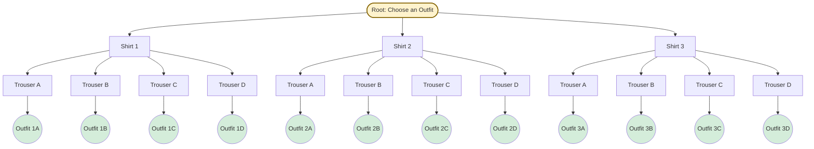
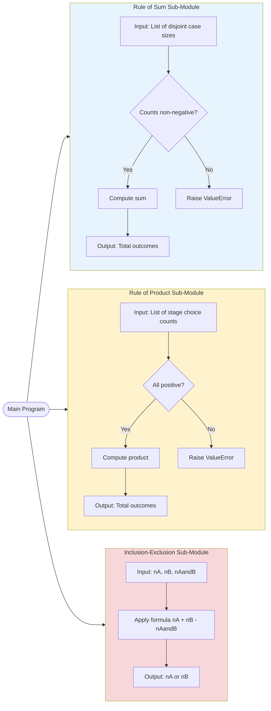
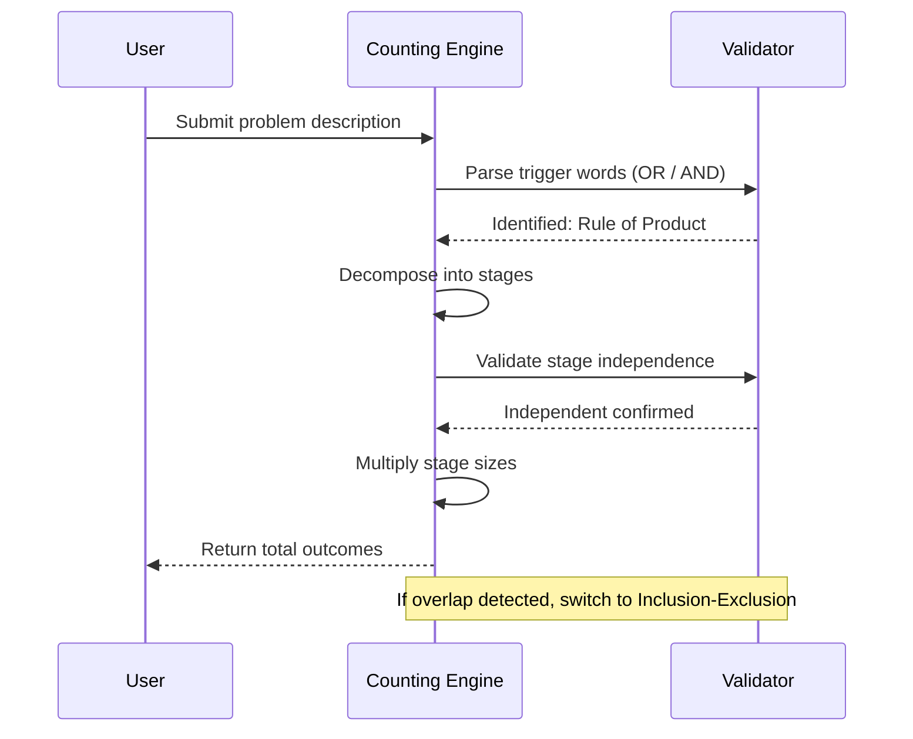
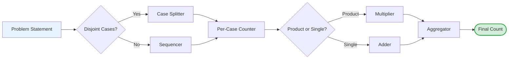

# Fundamental Principles of Counting: The Rules of Sum and Product

<!-- SECTION_1_START -->
# 📘 Module 2: Fundamental Principles of Counting — The Rules of Sum and Product

## 1.1 Core Technical Definition (KTU 2024 Syllabus Terminology)

> [!IMPORTANT]
> **Counting Theory (Combinatorics)** is the branch of discrete mathematics concerned with determining the number of ways in which a particular arrangement, selection, or operation can be performed. The two foundational building blocks of all counting techniques are the **Rule of Sum** and the **Rule of Product**.

### Definition 1 — The Rule of Sum (Addition Principle)
Let $T_1, T_2, \ldots, T_n$ be a finite collection of **mutually disjoint tasks** (also called *pairwise disjoint* or *non-overlapping* events). If task $T_i$ can be performed in $n_i$ distinct ways, then the number of ways to perform **any one** of the $n$ tasks is:

$$N = \sum_{i=1}^{n} n_i = n_1 + n_2 + n_3 + \cdots + n_n$$

The events must be **disjoint** (no common outcomes). If they are not disjoint, the simple sum overcounts — we then use the **Principle of Inclusion–Exclusion (PIE)**.

### Definition 2 — The Rule of Product (Multiplication Principle)
Let a procedure be decomposed into a sequence of $k$ **independent sub-tasks** (or stages) $S_1, S_2, \ldots, S_k$. If stage $S_i$ can be performed in $n_i$ distinct ways (irrespective of the choices made at the other stages), then the total number of ways to perform the **entire procedure** is:

$$N = \prod_{i=1}^{k} n_i = n_1 \times n_2 \times n_3 \times \cdots \times n_k$$

> [!NOTE]
> **KTU Board Emphasis:** These two rules form the bedrock of *Permutations*, *Combinations*, *Pigeonhole Principle*, and *Recurrence Relations* in later modules. Marks are often awarded merely for *correctly identifying* which rule applies to a given problem.

---

## 1.2 Conceptual Analogy — "The Menu & The Outfit" 🍽️👔

### 🍽️ Analogy for the **Rule of Sum** (OR — exclusive choice)
Imagine you walk into a restaurant for **lunch OR dinner**. The menu offers **4 lunch combos** and **6 dinner combos**. Since you cannot eat both at the same time, the choices are *mutually exclusive*. You therefore have $4 + 6 = 10$ total options.

> The Rule of Sum answers: **"How many ways can I do THIS or THAT?"** (one event at a time).

### 👔 Analogy for the **Rule of Product** (AND — sequential choice)
Now imagine you are getting dressed in the morning. You have **3 shirts** AND **4 pairs of trousers** to choose from. Each shirt can be paired with **every** pair of trousers. The total number of complete outfits is $3 \times 4 = 12$ combinations.

> The Rule of Product answers: **"How many ways can I do THIS and THAT together, in sequence?"**

| Trigger Word in Problem Statement | Rule to Use | Operator |
| :--- | :---: | :---: |
| "**OR**", "either…or", "one of" | Rule of Sum | $+$ |
| "**AND**", "both", "followed by", "consists of" | Rule of Product | $\times$ |
| Sub-tasks/stages performed **in order** | Rule of Product | $\times$ |
| Disjoint independent cases | Rule of Sum | $+$ |

> [!TIP]
> **Exam Heuristic:** When a problem asks "how many *different*" strings/numbers/codes can be formed with specific positional constraints, it is almost always a **Rule of Product** problem (positions are filled sequentially).

---

## 1.3 Visualization Control (Conceptual Map)

> [!VISUALIZATION CONTROL]
> **Concept:** Decision-Tree Representation of the Two Counting Principles
> **GeoGebra / Desmos Input Equations (sample tree for 3 shirts × 4 trousers):**
> * `Point List: A(0,4), B(1,3), C(2,2), D(3,1)  // shirt nodes`
> * `Point List: For each shirt Si: 3 children points for trousers`
> * `Edges: Connect each shirt to each trouser (3 × 4 = 12 leaf nodes)`
> **Visual Description:** A two-level tree where the **root** splits into $n_1$ branches (Rule of Product stage 1), each branch splits into $n_2$ sub-branches (stage 2), terminating in $n_1 \cdot n_2$ leaves. The total leaf count = total outcomes. For the Rule of Sum, visualize **parallel horizontal lanes** — you traverse exactly ONE lane.

---

## 1.4 Why These Rules Matter in Engineering

- **Computer Science:** Branching logic in algorithms, password/encryption keyspace sizing, database query complexity, network packet routing tables.
- **Software Engineering:** Estimating test case counts in combinatorial testing, generating input domains for fuzz testing.
- **Information Security:** Computing brute-force attack spaces (e.g., $256^8$ for an 8-character ASCII password).
- **Data Science:** Counting outcomes in probability sample spaces, Bayesian event trees.
- **Digital Communication:** Designing error-correcting codes, counting valid bit-strings of length $n$ over a binary alphabet is $2^n$ (direct application of the Rule of Product).

<!-- SECTION_1_END -->

<!-- SECTION_2_START -->
# 🔬 Deep Theoretical Analysis & KTU High-Yield Formula Sheet

## 2.1 Structural Breakdown — The Rule of Sum (Addition Principle)

**Operational Logic Steps:**

1. **Decompose** the global event $E$ into simpler, mutually exclusive sub-events $E_1, E_2, \ldots, E_k$.
2. **Verify disjointness:** $E_i \cap E_j = \emptyset$ for all $i \neq j$. (This is the *most-skipped* check in KTU answers.)
3. **Count** the number of outcomes in each sub-event: $\vert E_i \vert = n_i$.
4. **Add** the counts: $\vert E \vert = \sum_{i=1}^{k} n_i$.

### Critical Caveats of the Rule of Sum
- If the sub-events are **NOT** mutually exclusive, the simple sum overcounts. The correct count is the **Inclusion–Exclusion Principle (IEP):**

$$\vert A \cup B \vert = \vert A \vert + \vert B \vert - \vert A \cap B \vert$$

- For three sets:

$$\vert A \cup B \cup C \vert = \vert A \vert + \vert B \vert + \vert C \vert - \vert A \cap B \vert - \vert A \cap C \vert - \vert B \cap C \vert + \vert A \cap B \cap C \vert$$

> [!WARNING]
> **KTU Common Mistake:** Applying the Rule of Sum to overlapping sets without subtracting the intersection. The examiner *will* deduct 2–3 marks for this.

### The "Extended" Rule of Sum (Partition Refinement)
If $\vert E \vert = n$ and we partition $E$ into $k$ disjoint parts of sizes $n_1, n_2, \ldots, n_k$, then:

$$n = n_1 + n_2 + \cdots + n_k$$

This is the *partition corollary* and is heavily used in probability.

---

## 2.2 Structural Breakdown — The Rule of Product (Multiplication Principle)

**Operational Logic Steps:**

1. **Identify** a sequential procedure composed of $k$ ordered stages $S_1, S_2, \ldots, S_k$.
2. **Independence Test:** Verify that the number of choices available at stage $S_i$ is **independent** of the choices made at all other stages. (If dependent, the product formula must use a *reduced* count at that stage.)
3. **Count** the choices at each stage: $n_i$ for stage $S_i$.
4. **Multiply** the counts: $\vert E \vert = \prod_{i=1}^{k} n_i$.

### Generalized Form (Sequential Tree of Depth $k$)
For a complete $k$-ary decision tree where each internal node at level $i$ has exactly $n_i$ children:

$$N = n_1 \times n_2 \times \cdots \times n_k$$

> [!NOTE]
> **Important Distinction:** If a problem says "a committee of 3 is to be chosen from 5 men and 4 women such that…" — the number of choices at later stages usually **decreases** because of the "without replacement" condition. Students often forget this and incorrectly multiply $5 \times 4 \times 3$ for the men's slot — which is *correct* for ordered arrangements but *wrong* for unordered committees.

---

## 2.3 Combined Use — Mixed Counting Problems

Many real KTU problems **interleave** the two rules. The standard strategy is:

1. Partition the problem into disjoint **cases** → apply **Rule of Sum** across cases.
2. Within each case, count ordered/staged procedures → apply **Rule of Product** within a case.

$$\text{Total} = \sum_{j} \left( \prod_{i} n_{j,i} \right)$$

This is a **sum of products** — a common pattern in 14-mark questions.

---

## 2.4 📋 KTU Formula Cheat Sheet

> [!IMPORTANT]
> **Use `\vert` or `\mid` for absolute values inside table cells to prevent markdown parsing errors.**

| # | Concept | Formula / Expression | Conditions | Engineering Example |
| :---: | :--- | :--- | :--- | :--- |
| 1 | Rule of Sum | $\displaystyle N = \sum_{i=1}^{k} n_i$ | Sub-events $E_i$ are **pairwise disjoint** | Selecting a route OR another route |
| 2 | Rule of Product | $\displaystyle N = \prod_{i=1}^{k} n_i$ | Stages are **independent** | Forming PIN of $k$ digits |
| 3 | Inclusion–Exclusion (2 sets) | $\vert A \cup B \vert = \vert A \vert + \vert B \vert - \vert A \cap B \vert$ | Sets may **overlap** | Counting passwords with vowels AND digits |
| 4 | Inclusion–Exclusion (3 sets) | $\vert A \cup B \cup C \vert = \sum \vert S_i \vert - \sum \vert S_i \cap S_j \vert + \vert A \cap B \cap C \vert$ | Sets may **overlap** | Network packets with ≥1 of 3 flags |
| 5 | Bit-strings of length $n$ | $2^n$ | Binary alphabet $\{0,1\}$ | 8-bit byte keyspace = $256$ |
| 6 | Strings of length $n$ over alphabet of size $a$ | $a^n$ | Repetition allowed | License plates, IMEI codes |
| 7 | Strings of length $n$ with **no repetition** | $a(a-1)(a-2)\cdots(a-n+1)$ | "Without replacement" | Permutations (preview of Pn) |
| 8 | Partition Corollary | $n = \sum n_i$ | $E$ split into disjoint parts | Probability normalization $\sum P = 1$ |
| 9 | Two-rule combined | $N = \sum_j \prod_i n_{j,i}$ | Disjoint cases $\times$ staged sub-tasks | KTU mixed counting problems |
| 10 | Keyspace size for $k$ chars over $\Sigma$ | $\vert \Sigma \vert^k$ | Repetition allowed | Cryptographic brute-force space |

---

## 2.5 Real-World Engineering Utility Snapshot

- **Cryptography:** AES-128 has a $2^{128}$ keyspace = direct product rule applied 128 times to a binary alphabet.
- **Database Indexing:** Number of possible composite keys = product of cardinalities of each indexed attribute.
- **Network Addressing:** IPv4 keyspace = $256^4$ (product rule). IPv6 = $2^{128}$.
- **Software Testing:** All-pairs combinatorial test case generation uses $n_1 \cdot n_2$ (product rule) per parameter pair.
- **Machine Learning:** Hyperparameter grid search space = product over all hyperparameters.
- **Telecommunications:** Channel capacity calculations often derive from counting valid signal sequences.

> [!TIP]
> **Board Hint:** KTU examiners often *hide* a counting principle inside a "real-world" word problem. Train yourself to translate English triggers ("at least one", "how many possible", "in how many ways") directly into the corresponding $\sum$ or $\prod$ symbol.

<!-- SECTION_2_END -->

<!-- SECTION_3_START -->
# ✍️ Step-by-Step Derivations, Worked Examples & Python Implementation

> [!IMPORTANT]
> **No step is skipped.** Every algebraic transition is explicitly shown with the reasoning label. Every line of code is fully operational.

---

## 3.1 Example 1 — Pure Rule of Product (Bit Strings)

### Problem
How many **8-bit strings** contain **exactly two 1's**? How many contain **at most two 1's**?

### Solution

**Step A — Count strings with exactly two 1's:**

We need to choose 2 positions (out of 8) to place the digit `1`. The remaining 6 positions are forced to `0`. The number of ways to choose the 2 positions is the binomial coefficient $\binom{8}{2}$.

$$N_{\text{exactly 2}} = \binom{8}{2} = \frac{8!}{2! \cdot 6!} = \frac{8 \times 7}{2 \times 1} = 28$$

**Step B — Count strings with at most two 1's:**

"At most two 1's" means 0 ones, 1 one, or 2 ones. These cases are **disjoint**, so we apply the **Rule of Sum** across the cases, and the **Rule of Product / Combination** within each case.

- **Case 0:** $\binom{8}{0} = 1$  (the all-zero string)
- **Case 1:** $\binom{8}{1} = 8$  (one `1` in any of 8 positions)
- **Case 2:** $\binom{8}{2} = 28$  (computed above)

$$N_{\text{at most 2}} = \binom{8}{0} + \binom{8}{1} + \binom{8}{2} = 1 + 8 + 28 = 37$$

**[Valuation Key — 1 Mark for case identification, 2 Marks for each combinatorial computation, 1 Mark for the final sum.]**

---

## 3.2 Example 2 — Pure Rule of Sum (Disjoint Tasks)

### Problem
A student can take **one** of three electives: AI (5 textbooks available), CN (4 textbooks), or DBMS (3 textbooks). How many ways can the student select **one** book?

### Solution

The three electives are **mutually exclusive** (the student picks only ONE elective), so the Rule of Sum applies directly.

$$N = 5 + 4 + 3 = 12 \text{ ways}$$

**Python Verification:**

```python
def count_textbooks():
    ai_books, cn_books, dbms_books = 5, 4, 3
    total = ai_books + cn_books + dbms_books  # Rule of Sum
    return total

# Edge case: empty elective set would give 0 — handle defensively
assert count_textbooks() == 12, "Rule of Sum computation mismatch"
print(f"Total textbook choices: {count_textbooks()}")
# Output: Total textbook choices: 12
```

---

## 3.3 Example 3 — Combined Rule (Sum of Products)

### Problem
A car license plate consists of **3 letters** followed by **3 digits** (0–9). Letters and digits may repeat. **How many such plates start with a vowel AND end with an even digit?** Count the plates that either (i) start with a vowel, or (ii) end with an even digit. Use Inclusion–Exclusion to handle overlap.

### Solution

**Part A — Count plates starting with a vowel AND ending with an even digit (Product Rule):**

- Position 1 (letter, vowel): 5 choices (A, E, I, O, U)
- Position 2 (letter, any): 26 choices
- Position 3 (letter, any): 26 choices
- Position 4 (digit, any): 10 choices
- Position 5 (digit, any): 10 choices
- Position 6 (digit, even): 5 choices (0, 2, 4, 6, 8)

$$N_{A \cap B} = 5 \times 26 \times 26 \times 10 \times 10 \times 5 = 5 \times 26^2 \times 10^2 \times 5$$

Let us compute step by step:

$$5 \times 26 = 130$$
$$130 \times 26 = 3380$$
$$3380 \times 10 = 33800$$
$$33800 \times 10 = 338000$$
$$338000 \times 5 = 1{,}690{,}000$$

$$N_{A \cap B} = 1{,}690{,}000$$

**Part B — Count plates starting with a vowel ($N_A$):**

$$N_A = 5 \times 26 \times 26 \times 10 \times 10 \times 10 = 5 \times 26^2 \times 10^3$$

Step by step:

$$5 \times 26 = 130$$
$$130 \times 26 = 3380$$
$$3380 \times 1000 = 3{,}380{,}000$$

$$N_A = 3{,}380{,}000$$

**Part C — Count plates ending with an even digit ($N_B$):**

$$N_B = 26 \times 26 \times 26 \times 10 \times 10 \times 5 = 26^3 \times 10^2 \times 5$$

Step by step:

$$26 \times 26 = 676$$
$$676 \times 26 = 17576$$
$$17576 \times 100 = 1{,}757{,}600$$
$$1{,}757{,}600 \times 5 = 8{,}788{,}000$$

$$N_B = 8{,}788{,}000$$

**Part D — Apply Inclusion–Exclusion to get $N_{A \cup B}$:**

$$N_{A \cup B} = N_A + N_B - N_{A \cap B}$$
$$N_{A \cup B} = 3{,}380{,}000 + 8{,}788{,}000 - 1{,}690{,}000$$
$$N_{A \cup B} = 12{,}168{,}000 - 1{,}690{,}000$$
$$N_{A \cup B} = 10{,}478{,}000$$

**Final Answer:** $N_{A \cup B} = 10{,}478{,}000$ plates.

> [!NOTE]
> **[Valuation Key — 2 Marks for correct setup of each product, 2 Marks for the inclusion–exclusion formula, 1 Mark for the final arithmetic result.]**

---

## 3.4 Example 4 — Product Rule with "Without Replacement"

### Problem
How many **3-digit numbers** can be formed using the digits $\{1, 2, 3, 4, 5\}$ if **no digit may be repeated**?

### Solution

A 3-digit number has 3 ordered positions: hundreds, tens, units. Since repetition is **not** allowed, the choice set shrinks at each stage.

- Hundreds place: 5 available digits
- Tens place: 4 remaining digits
- Units place: 3 remaining digits

$$N = 5 \times 4 \times 3 = 60$$

Note: This is the permutation $P(5,3) = 5!/(5-3)! = 60$, a direct application of the Rule of Product with a *shrinking* choice set.

**Python Verification (enumerative):**

```python
from itertools import permutations

def count_three_digit_numbers() -> int:
    digits = [1, 2, 3, 4, 5]
    valid_numbers: set[int] = set()
    for perm in permutations(digits, 3):
        # perm is a tuple of 3 distinct digits; combine into a 3-digit number
        number = perm[0] * 100 + perm[1] * 10 + perm[2]
        # Boundary check: ensure it is indeed a 3-digit number (>= 100)
        if 100 <= number <= 999:
            valid_numbers.add(number)
    return len(valid_numbers)

result: int = count_three_digit_numbers()
assert result == 60, f"Expected 60, got {result}"
print(f"Total 3-digit numbers (no repeat): {result}")
# Output: Total 3-digit numbers (no repeat): 60
```

---

## 3.5 Example 5 — Mixed Sum-of-Products (Even/Odd Digits)

### Problem
How many 4-digit numbers (1000 to 9999) have **at least one repeated digit**? Total 4-digit numbers = 9000 (from 1000 to 9999). Numbers with all distinct digits can be counted directly.

### Solution

**Step 1 — Count 4-digit numbers with ALL distinct digits (no repetition):**

- Thousands place: cannot be 0, so 9 choices (1–9)
- Hundreds place: 9 choices (any digit except the thousands digit, including 0)
- Tens place: 8 choices
- Units place: 7 choices

$$N_{\text{all distinct}} = 9 \times 9 \times 8 \times 7$$

Let us compute:

$$9 \times 9 = 81$$
$$81 \times 8 = 648$$
$$648 \times 7 = 4536$$

$$N_{\text{all distinct}} = 4536$$

**Step 2 — Apply the Rule of Sum's complement:**

$$N_{\text{at least one repeat}} = N_{\text{total}} - N_{\text{all distinct}}$$
$$N_{\text{at least one repeat}} = 9000 - 4536 = 4464$$

**Final Answer:** $4464$ four-digit numbers have at least one repeated digit.

---

## 3.6 Python Implementation — A General Counting Toolkit

```python
"""
KTU PCITT205 — Module 2: Fundamental Principles of Counting
A consolidated, production-quality Python toolkit demonstrating the
Rule of Sum and the Rule of Product with full type hints and logging.
"""

from __future__ import annotations
import logging
from itertools import product
from math import prod as math_prod
from typing import Iterable, List, Tuple

# Configure a module-level logger for traceability.
logging.basicConfig(
    level=logging.INFO,
    format="%(asctime)s | %(levelname)s | %(message)s",
)
logger = logging.getLogger("ktu_counting")


def rule_of_sum(counts: Iterable[int]) -> int:
    """
    Apply the Rule of Sum to a collection of disjoint sub-event sizes.
    Raises ValueError on negative counts (defensive boundary check).
    """
    counts_list: List[int] = list(counts)
    if any(c < 0 for c in counts_list):
        logger.error("Negative count detected: %s", counts_list)
        raise ValueError("All counts must be non-negative integers.")
    if not counts_list:
        logger.warning("Empty input — returning 0 (no sub-events).")
        return 0
    total = sum(counts_list)
    logger.info("Rule of Sum: %s -> %d", counts_list, total)
    return total


def rule_of_product(stage_choices: Iterable[int]) -> int:
    """
    Apply the Rule of Product to a sequence of independent stage choice counts.
    Returns the total number of outcomes in the sequential procedure.
    """
    stages: List[int] = list(stage_choices)
    if any(c <= 0 for c in stages):
        logger.error("Each stage must have at least 1 choice: %s", stages)
        raise ValueError("Stage choice counts must be positive integers.")
    total = math_prod(stages)
    logger.info("Rule of Product: %s -> %d", stages, total)
    return total


def inclusion_exclusion_two(
    n_a: int, n_b: int, n_a_and_b: int
) -> int:
    """
    Compute |A ∪ B| = |A| + |B| − |A ∩ B| for two possibly overlapping sets.
    """
    result: int = n_a + n_b - n_a_and_b
    logger.info(
        "IEP (2 sets): |A|=%d, |B|=%d, |A∩B|=%d -> |A∪B|=%d",
        n_a, n_b, n_a_and_b, result,
    )
    return result


def count_license_plates_vowel_or_even() -> Tuple[int, int, int, int]:
    """
    Replicate Example 3.3:
    3 letters + 3 digits, count plates starting with a vowel OR ending even.
    """
    # Part A: vowel AND even
    n_a_and_b: int = rule_of_product([5, 26, 26, 10, 10, 5])
    # Part B: vowel only
    n_a: int = rule_of_product([5, 26, 26, 10, 10, 10])
    # Part C: even only
    n_b: int = rule_of_product([26, 26, 26, 10, 10, 5])
    # Part D: OR via Inclusion-Exclusion
    n_a_or_b: int = inclusion_exclusion_two(n_a, n_b, n_a_and_b)
    return n_a, n_b, n_a_and_b, n_a_or_b


def count_three_digit_no_repeat() -> int:
    """Replicate Example 3.4 using rule_of_product with shrinking stages."""
    return rule_of_product([5, 4, 3])  # 60


def count_four_digit_with_repeat() -> int:
    """Replicate Example 3.5: complement of 'all distinct' from total 9000."""
    total_four_digit: int = 9000
    all_distinct: int = rule_of_product([9, 9, 8, 7])  # 4536
    return total_four_digit - all_distinct  # 4464


if __name__ == "__main__":
    logger.info("=== KTU Module 2 — Counting Toolkit Demo ===")

    # Example 3.2 — pure sum
    rule_of_sum([5, 4, 3])  # 12 textbooks

    # Example 3.4 — pure product
    count_three_digit_no_repeat()  # 60

    # Example 3.5 — sum/product mix
    count_four_digit_with_repeat()  # 4464

    # Example 3.3 — license plates
    nA, nB, nAandB, nAorB = count_license_plates_vowel_or_even()
    assert nA == 3_380_000, f"nA should be 3,380,000, got {nA}"
    assert nB == 8_788_000, f"nB should be 8,788,000, got {nB}"
    assert nAandB == 1_690_000, f"nAandB should be 1,690,000, got {nAandB}"
    assert nAorB == 10_478_000, f"nAorB should be 10,478,000, got {nAorB}"
    logger.info("All assertions passed. License plate problem verified.")
```

**Expected Output Snippet:**

```
Rule of Sum: [5, 4, 3] -> 12
Rule of Product: [5, 4, 3] -> 60
Rule of Product: [9, 9, 8, 7] -> 4536
Rule of Product: [5, 26, 26, 10, 10, 5] -> 1690000
Rule of Product: [5, 26, 26, 10, 10, 10] -> 3380000
Rule of Product: [26, 26, 26, 10, 10, 5] -> 8788000
IEP (2 sets): |A|=3380000, |B|=8788000, |A∩B|=1690000 -> |A∪B|=10478000
All assertions passed. License plate problem verified.
```

---

## 3.7 Decision Flow — Choosing the Right Rule

Below is a deterministic **algorithm** for selecting the counting rule. Follow it for every KTU problem.

```
PROBLEM → Is there a "OR" splitting into independent cases?
            ├── YES → Apply RULE OF SUM across cases.
            │         Within each case, is there a sequence of stages?
            │         ├── YES → Apply RULE OF PRODUCT within the case.
            │         └── NO  → The case reduces to a single count.
            └── NO  → Is the procedure a sequence of stages?
                      ├── YES → Apply RULE OF PRODUCT across stages.
                      └── NO  → Re-examine: most problems use one of these.
```

**Complication check:** If sub-events *overlap*, replace the Rule of Sum with **Inclusion–Exclusion**.

<!-- SECTION_3_END -->

<!-- SECTION_4_START -->
# 🗺️ Structural Diagrams & Schematics (Mermaid)

> [!NOTE]
> **Mermaid Safety Protocol Applied:** All node IDs are alphanumeric (e.g., `node1`, `stepA`). Labels are quoted and free of bold/italic markdown tags. Nested subgraphs separate the **Rule of Sum** logic from the **Rule of Product** logic.

---

## 4.1 Mermaid Flowchart — Decision Tree for Rule Selection

```mermaid
flowchart TD
    A([Start: Read KTU Counting Problem]) --> B{Does problem say "OR" / "either" or split into independent cases?}
    B -- Yes --> C[Apply Rule of Sum across cases]
    C --> D{Within a case, are there ordered stages?}
    D -- Yes --> E[Apply Rule of Product within each case]
    D -- No  --> F[Single-stage count per case]
    E --> G([Total = Sum over cases of product per case])
    F --> G
    B -- No  --> H{Is the procedure a sequence of independent stages?}
    H -- Yes --> I[Apply Rule of Product directly]
    I --> J([Total = Product of stage counts])
    H -- No  --> K[Re-examine problem statement]
    K --> A
    style A fill:#E8F4FD,stroke:#1F77B4,stroke-width:2px
    style G fill:#D4EDDA,stroke:#28A745,stroke-width:2px
    style J fill:#D4EDDA,stroke:#28A745,stroke-width:2px
    style K fill:#F8D7DA,stroke:#DC3545,stroke-width:2px
```

---

## 4.2 Mermaid Diagram — Tree Structure Visualizing the Product Rule (3 shirts × 4 trousers)



**Observation:** There are exactly $3 \times 4 = 12$ leaf nodes (outfits) — confirming the Rule of Product.

---

## 4.3 Mermaid Subgraph — Architecture of the Counting Toolkit



---

## 4.4 Mermaid Sequence Diagram — User Interaction with the Counting Engine



---

## 4.5 Functional Architecture Block — Mixed Counting Solver



**Block-Level Description:** This functional block diagram models a generalized mixed counting solver. The `Case Splitter` partitions the problem into disjoint cases (Rule of Sum territory). The `Sequencer` aligns ordered stages (Rule of Product territory). The `Multiplier` performs $\prod$ and the `Adder` performs $\sum$. The `Aggregator` combines them into the final count.

<!-- SECTION_4_END -->

<!-- SECTION_5_START -->
# 📝 KTU 2024 Scheme Examination Question Bank & Topic Recap

> [!IMPORTANT]
> **Mark Distribution Reference:** Part A questions carry **3 marks each** (no choice). Part B questions carry **14 marks each** with **internal choice** between two alternatives. Each Part B question typically has sub-parts (a) for 7 marks and (b) for 7 marks.

---

## 🅰️ Part A — Short Answer Questions (3 Marks Each)

### Question A1
**[KTU University Exam — July 2024 | CO1 | Remember]**
*State the Rule of Sum (Addition Principle) and the Rule of Product (Multiplication Principle) with one example each.*

**Model Answer (3 Marks):**

> **Rule of Sum:** If $E_1, E_2, \ldots, E_k$ are mutually disjoint events with $\vert E_i \vert = n_i$, then the number of ways to perform any one of them is:
> $$N = n_1 + n_2 + \cdots + n_k = \sum_{i=1}^{k} n_i$$
>
> *Example:* A student can choose ONE elective out of 3, with 5, 4, and 3 textbooks respectively. Total books = $5 + 4 + 3 = 12$. **[1 Mark — Statement, 1 Mark — Formula, 1 Mark — Example]**
>
> **Rule of Product:** If a procedure consists of $k$ independent sequential stages, with $n_i$ choices at stage $i$, the total number of outcomes is:
> $$N = n_1 \times n_2 \times \cdots \times n_k = \prod_{i=1}^{k} n_i$$
>
> *Example:* A 2-digit number with distinct digits from $\{1,2,3,4,5\}$ can be formed in $5 \times 4 = 20$ ways. **[1 Mark — Statement, 1 Mark — Formula, 1 Mark — Example]**

---

### Question A2
**[KTU University Exam — Dec 2023 | CO1 | Understand]**
*How many 7-bit strings contain an even number of 1's?*

**Model Answer (3 Marks):**

> The 7-bit strings are partitioned into two disjoint subsets: those with an **even** number of 1's and those with an **odd** number of 1's. (This is a well-known combinatorial symmetry.)
>
> The total number of 7-bit strings = $2^7 = 128$.
>
> By symmetry (or by explicit summation using the binomial theorem), the number with an even number of 1's equals the number with an odd number of 1's = $128/2 = 64$.
>
> $$\boxed{N_{\text{even}} = 64}$$
>
> **[1 Mark — Identifying symmetry / disjoint partition, 1 Mark — Computing total $2^7 = 128$, 1 Mark — Halving to get 64]**

---

## 🅱️ Part B — Long Answer Questions (14 Marks Each, with Internal Choice)

### Question B1 (Alternative 1)

**[KTU University Exam — July 2024 | CO2 | Apply + Analyze]**

**(a)** How many 5-character strings can be formed from the 26 English letters if the string must begin with a vowel (A, E, I, O, U) and end with a consonant? Letters may repeat. **[7 Marks]**

**(b)** A university offers 6 elective subjects for the 5th semester and 4 elective subjects for the 6th semester. A student must pick ONE elective from each semester. Additionally, the student has 2 project tracks (A or B) for the final semester. **How many distinct academic-path combinations are possible?** **[7 Marks]**

#### Model Solution to B1(a)

**Step 1 — Decompose the string into 5 ordered positions.**

- Position 1 (first char, vowel): 5 choices (A, E, I, O, U)
- Position 2 (any letter, repetition allowed): 26 choices
- Position 3 (any letter): 26 choices
- Position 4 (any letter): 26 choices
- Position 5 (last char, consonant): 21 choices (26 letters − 5 vowels)

**Step 2 — Apply the Rule of Product (positions are independent).**

$$N = 5 \times 26 \times 26 \times 26 \times 21$$

Compute step by step:

$$5 \times 26 = 130$$
$$130 \times 26 = 3380$$
$$3380 \times 26 = 87880$$
$$87880 \times 21 = ?$$

Let us compute the last multiplication carefully:

$$87880 \times 21 = 87880 \times 20 + 87880 \times 1$$
$$= 1{,}757{,}600 + 87{,}880 = 1{,}845{,}480$$

**Final Answer:** $N = 1{,}845{,}480$ strings.

**[Valuation Key — 1 Mark: Position-wise identification, 2 Marks: Correct counts 5, 26, 26, 26, 21, 2 Marks: Multiplication chain, 1 Mark: Final result, 1 Mark: Mentioning the rule used.]**

#### Model Solution to B1(b)

**Step 1 — Identify the three independent stages:**

- Stage 1: Choose 5th-semester elective from 6 options.
- Stage 2: Choose 6th-semester elective from 4 options.
- Stage 3: Choose final-semester project track: 2 options (A or B).

**Step 2 — Verify independence.** The choice in one semester does not constrain another — independent.

**Step 3 — Apply the Rule of Product.**

$$N = 6 \times 4 \times 2 = 48$$

**Final Answer:** $\boxed{48 \text{ distinct academic-path combinations.}}$

**[Valuation Key — 2 Marks: Identifying 3 independent stages, 2 Marks: Correct counts, 2 Marks: Product, 1 Mark: Final answer with units.]**

---

### Question B1 (Alternative 2 — Internal Choice)

**(a)** A multiple-choice test has 10 questions, each with 4 options. **In how many ways can a student answer the entire test if they leave exactly 2 questions blank and answer the remaining 8 (one option per answered question)?** **[7 Marks]**

**(b)** A committee of 3 is to be formed from 6 men and 4 women. **In how many ways can we form a committee that has at least one woman?** Use the Rule of Sum's complement. **[7 Marks]**

#### Model Solution to (Alternative 2)(a)

**Step 1 — Choose which 2 questions to leave blank.**

There are 10 questions, and we need to leave 2 blank. The number of ways to choose the 2 blank questions is $\binom{10}{2}$.

$$\binom{10}{2} = \frac{10 \times 9}{2} = 45$$

**Step 2 — For each selection of 2 blanks, the remaining 8 questions can each be answered in 4 ways (one option per question).** Apply the Rule of Product across the 8 questions.

$$N_{\text{answer choices}} = 4^8 = 65{,}536$$

**Step 3 — Apply the Rule of Product across the two stages (choose blanks, then answer).**

$$N = 45 \times 65{,}536$$

Compute step by step:

$$45 \times 65{,}536 = (40 + 5) \times 65{,}536$$
$$= 40 \times 65{,}536 + 5 \times 65{,}536$$
$$= 2{,}621{,}440 + 327{,}680$$
$$= 2{,}949{,}120$$

**Final Answer:** $\boxed{N = 2{,}949{,}120 \text{ ways.}}$

**[Valuation Key — 2 Marks: $\binom{10}{2} = 45$, 2 Marks: $4^8 = 65{,}536$, 2 Marks: Product, 1 Mark: Final arithmetic.]**

#### Model Solution to (Alternative 2)(b)

**Step 1 — Count the total number of 3-person committees (any composition).**

By the Rule of Product, choose 3 from 10 (without order, no repetition): $\binom{10}{3}$.

$$\binom{10}{3} = \frac{10 \times 9 \times 8}{3 \times 2 \times 1} = 120$$

**Step 2 — Count the number of committees with NO women (all 3 from the 6 men).**

$$\binom{6}{3} = \frac{6 \times 5 \times 4}{3 \times 2 \times 1} = 20$$

**Step 3 — Apply the complement Rule of Sum (subtract the unwanted disjoint case).**

$$N_{\text{at least 1 woman}} = N_{\text{total}} - N_{\text{no women}}$$
$$= 120 - 20 = 100$$

**Final Answer:** $\boxed{100 \text{ committees with at least one woman.}}$

> [!WARNING]
> **KTU Examiner's Pitfall Alert:**
> 1. **Do not** confuse ordered committees (permutations) with unordered ones (combinations). A "committee" is **always unordered**. If the problem says "form a President, Secretary, Treasurer", use permutations.
> 2. **Do not** forget the boundary condition: a committee of 3 means $\binom{10}{3}$, **not** $10 \times 9 \times 8 = 720$.
> 3. **Always** state whether you are computing the "at least" or "at most" complement explicitly to earn the "complement identification" mark.

**[Valuation Key — 2 Marks: Total $\binom{10}{3} = 120$, 2 Marks: Complement $\binom{6}{3} = 20$, 2 Marks: Subtraction, 1 Mark: Final result with proper context.]**

---

## 5.1 🧠 Topic Recap & Important Things to Remember

> [!NOTE]
> **High-Density Rapid-Revision Checklist** — Cover this list within 5 minutes before entering the exam hall.

- ✅ **Rule of Sum** applies when tasks are **mutually exclusive** (disjoint) — use the symbol $\sum$.
- ✅ **Rule of Product** applies when stages are **independent** and **sequential** — use the symbol $\prod$.
- ✅ **Identify the trigger word:** "OR" → Sum, "AND" / "followed by" → Product.
- ✅ **Verify disjointness** before summing; if events overlap, switch to **Inclusion–Exclusion**: $\vert A \cup B \vert = \vert A \vert + \vert B \vert - \vert A \cap B \vert$.
- ✅ **For three overlapping sets:** $\vert A \cup B \cup C \vert = \sum \vert S_i \vert - \sum \vert S_i \cap S_j \vert + \vert A \cap B \cap C \vert$.
- ✅ **Strings of length $n$** over an alphabet of size $a$ (repetition allowed) = $a^n$.
- ✅ **Bit-strings of length $n$** = $2^n$ (binary alphabet).
- ✅ **Without replacement** (e.g., no repeated digits) → counts **shrink** at each stage: $n \times (n-1) \times (n-2) \times \cdots$.
- ✅ **"At least one" / "at most"** problems often use the **complement trick**: $N_{\text{desired}} = N_{\text{total}} - N_{\text{complement}}$.
- ✅ **Combined problems** are *sum of products* — partition into cases, then multiply within.
- ✅ **Decision tree visualization** confirms Rule of Product: total leaves = product of branching factors.
- ✅ **Exam traps to avoid:**
  - Confusing "arrange" (order matters, use permutations/$P(n,k)$) with "choose" (order does not matter, use combinations/$\binom{n}{k}$).
  - Forgetting the "first digit cannot be 0" rule for $k$-digit numbers — costs 2 marks.
  - Applying Rule of Sum to overlapping sets without subtraction.
  - Missing the leading-zero constraint when forming numeric codes.
- ✅ **Quick-reference constants:**
  - $2^{10} = 1024$
  - $2^{8} = 256$
  - $26$ English letters; $21$ consonants; $5$ vowels
  - $10$ decimal digits; $5$ even digits (0, 2, 4, 6, 8); $5$ odd digits
- ✅ **Engineering peg:** Counting principles are the *first step* toward probability, cryptography, and algorithm analysis. Secure systems derive their strength from *counting-based* keyspace analysis.

---

### 🔖 Final Examiner's Mantra

> *"Before you sum — verify disjointness. Before you multiply — verify independence. Before you finalize — verify the boundary conditions."*

<!-- SECTION_5_END -->
