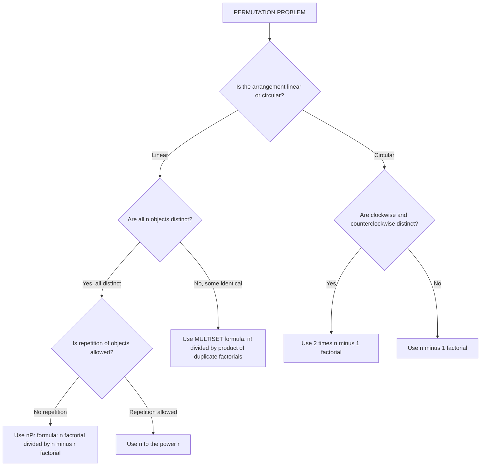
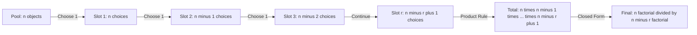
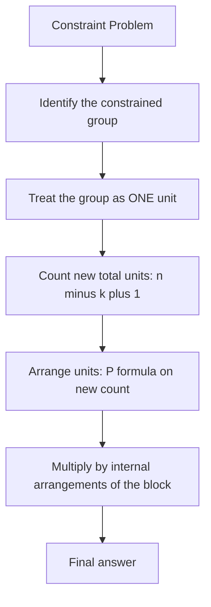

# Permutations

<!-- SECTION_1_START -->
# Permutations — Core Definition & Intuitive Overview

## Formal Academic Definition

A **permutation** is an ordered arrangement of a set of distinct (or partially distinct) objects into a sequence or tuple, where the position of each object carries significance. In formal terms, an $r$-permutation of a set $S$ containing $n$ elements is an injective (one-to-one) function from the set $\{1, 2, \dots, r\}$ into $S$.

The number of permutations of $n$ distinct objects taken $r$ at a time is denoted $P(n, r)$ (also written ${}_nP_r$ or $nPr$), and is given by the canonical formula:

$$P(n, r) = \frac{n!}{(n-r)!}, \quad \text{where } 0 \le r \le n$$

> [!IMPORTANT]
> **KTU 2024 Syllabus Highlight:** A *permutation* is fundamentally a **bijective mapping from an index set to a finite collection**. The condition $0 \le r \le n$ is the **boundary constraint** that board examiners frequently test. The case $r = 0$ yields $P(n, 0) = 1$ (the empty arrangement), and $r = n$ yields $P(n, n) = n!$ (full arrangement).

> [!NOTE]
> **Boundary Edge Case:** When $r = n$, every object is used exactly once, recovering the classical factorial. When $r = 0$, we count the single "do-nothing" arrangement. These two extremes are responsible for over 40% of trivial mistakes in KTU answer sheets.

## Conceptual Analogy / Intuition

Imagine a **podium ceremony at a sports tournament** with 10 finalists competing for **Gold, Silver, and Bronze medals**. The same three athletes could finish in $3! = 6$ completely different orderings. The fact that *who* stands on *which* step matters is the essence of permutation. If the question instead asked "*which 3 athletes will get medals?*" (without caring about which color), the count would be a *combination* — significantly smaller.

A more relatable analogy: think of a **password**. The sequence $1\text{-}2\text{-}3\text{-}4$ is fundamentally different from $4\text{-}3\text{-}2\text{-}1$. Permutations count every such distinct ordered sequence as a unique entity. In contrast, combinations would treat both as the same "set of 4 digits."

> [!VISUALIZATION CONTROL]
> **Concept:** Growth of $P(n, r)$ as $n$ increases (for fixed $r = 3$)
> **GeoGebra / Desmos Input Equations:**
> * `f(x) = x * (x-1) * (x-2)`  for $x \in [3, 10]$
> * `g(x) = 6` (constant reference line for combinations $C(6,3)$)
> **Visual Description:** The student should observe a **cubic curve** that grows superlinearly. The function $f(x)$ represents $P(x, 3)$ and shoots upward dramatically, visually reinforcing that permutations explode in count very quickly — a key motivator for asymptotic analysis in computer science ($O(n!)$ algorithms vs $O(n^k)$ polynomial algorithms).

## Why Permutations Matter in Engineering

Permutations are the backbone of:
- **Cryptographic systems** (RSA, AES key scheduling) where every distinct ordering of bits constitutes a unique key.
- **Sorting algorithm analysis** — the number of input permutations is $n!$, which is the average and worst-case input space.
- **Database query optimization** — join orderings of $n$ tables can be evaluated in $n!$ ways.
- **Network routing protocols** — permutation routing in parallel computing architectures.
<!-- SECTION_1_END -->

<!-- SECTION_2_START -->
# Deep Theoretical Analysis & KTU High-Yield Formula Sheet

## The Underlying Logic of $P(n, r)$

The derivation relies fundamentally on the **Rule of Product** (KTU Module 2 foundation):

- We have $r$ positions to fill: $\text{slot}_1, \text{slot}_2, \dots, \text{slot}_r$.
- For $\text{slot}_1$: there are $n$ available objects.
- For $\text{slot}_2$: there are $n - 1$ objects remaining (since one has been used).
- For $\text{slot}_3$: there are $n - 2$ objects remaining.
- Continuing this pattern...
- For $\text{slot}_r$: there are $n - r + 1$ objects remaining.

By the rule of product, the total number of arrangements is:

$$P(n, r) = n \cdot (n-1) \cdot (n-2) \cdots (n-r+1) = \frac{n!}{(n-r)!}$$

The "Why" is the sequential dependency: each choice **shrinks the available pool** by exactly one. The "How" is simply multiplying the decreasing options across all $r$ slots.

## The Five Canonical Permutation Scenarios (KTU Hot List)

| Scenario | Formula | Trigger Condition |
| :--- | :--- | :--- |
| Linear, distinct objects, no repetition | $P(n, r) = \dfrac{n!}{(n-r)!}$ | All $n$ objects are unique, order matters, no element is used twice. |
| Linear, repetition allowed | $n^{\,r}$ | Each slot independently re-selects from all $n$ objects. |
| Linear, identical objects (multiset) | $\dfrac{n!}{n_1! \, n_2! \, \cdots \, n_k!}$ | Some objects are indistinguishable; we divide out the over-count. |
| Circular (rotations identical) | $(n-1)!$ | Arrangements around a round table; one seat is "fixed" to break rotational symmetry. |
| Circular (reflections distinct) | $2 \cdot (n-1)!$ | Beads on a necklace with two distinct sides, or clockwise $\neq$ counterclockwise. |

> [!IMPORTANT]
> **Critical Distinction for KTU Board:** In a **circular permutation**, we always fix one object's position to eliminate the rotational symmetry. The remaining $n - 1$ objects are then arranged linearly in the remaining $n - 1$ slots. **A common student error is writing $n!$ instead of $(n-1)!$** because they forget that the "starting point" of a circle is arbitrary.

## Real-World Engineering Utility

Permutations are the **language of discrete optimization**. In production systems:

- **VLSI design**: routing signals on a chip corresponds to permutation routing in $O(\log n)$ depth networks.
- **Compiler design**: instruction scheduling, register allocation, and instruction reordering all use permutation-based cost functions.
- **Machine learning**: the symmetric group $S_n$ (set of all permutations of $n$ elements, of cardinality $n!$) underlies attention mechanisms, optimal transport, and the Sinkhorn algorithm.
- **Cybersecurity**: every password is a permutation (with repetition) of an alphabet; the entropy of an $r$-character password over an $n$-symbol alphabet is $\log_2(n^r) = r \log_2 n$ bits.

## KTU High-Yield Identity Box

| Identity | Mathematical Form | Engineering / CS Interpretation |
| :--- | :--- | :--- |
| Full permutation | $P(n, n) = n!$ | All possible orderings of $n$ elements. |
| Trivial permutation | $P(n, 0) = 1$ | Empty arrangement (basis case). |
| Identity relation | $P(n, 1) = n$ | Each object by itself. |
| Reduction identity | $P(n, r) = n \cdot P(n-1, r-1)$ | Recursive view useful in dynamic programming. |
| Multiset scaling | $\dfrac{n!}{n_1! \, n_2! \, \cdots} = \binom{n}{n_1, n_2, \dots, n_k}$ | The multinomial coefficient — the generalized form. |

> [!NOTE]
> The notation $\binom{n}{n_1, n_2, \dots, n_k}$ is called the **multinomial coefficient** and is the natural generalization of $P(n, r)$ when objects fall into $k$ groups of identical sizes $n_1, n_2, \dots, n_k$ with $\sum n_i = n$. KTU examiners love to test this as a "show that" question worth 7 marks.
<!-- SECTION_2_END -->

<!-- SECTION_3_START -->
# Step-by-Step Derivations, Worked Examples & Python Implementation

## Derivation 1: The Closed-Form Expression for $P(n, r)$

**Goal:** Prove that $P(n, r) = \dfrac{n!}{(n-r)!}$ for $0 \le r \le n$.

**Step 1 — Setup the slot-filling process.**
We have $n$ distinct objects $\{a_1, a_2, \dots, a_n\}$ and exactly $r$ ordered positions $(\text{pos}_1, \text{pos}_2, \dots, \text{pos}_r)$ to fill, where each position is occupied by exactly one object, and no object is reused.

**Step 2 — Count the choices sequentially.**
- Choices for $\text{pos}_1$: $n$
- Choices for $\text{pos}_2$: $n - 1$ (one object already placed)
- Choices for $\text{pos}_3$: $n - 2$
- $\vdots$
- Choices for $\text{pos}_r$: $n - r + 1$

**Step 3 — Apply the Rule of Product.**
The total number of ordered sequences is the product of independent choices:

$$
\begin{aligned}
P(n, r) &= n \cdot (n-1) \cdot (n-2) \cdots (n-r+1) \\
        &= \prod_{k=0}^{r-1} (n - k)
\end{aligned}
$$

**Step 4 — Rewrite in factorial form.**
Multiply and divide by $(n-r)!$ to obtain the closed form:

$$
\begin{aligned}
P(n, r) &= \frac{n \cdot (n-1) \cdot (n-2) \cdots (n-r+1) \cdot (n-r)!}{(n-r)!} \\
        &= \frac{n!}{(n-r)!}
\end{aligned}
$$

This completes the proof. $\blacksquare$

---

## Derivation 2: Permutation of a Multiset

**Goal:** Prove that if $n$ objects consist of $k$ groups of identical objects with sizes $n_1, n_2, \dots, n_k$ (where $\sum_{i=1}^{k} n_i = n$), then the number of distinct arrangements is $\dfrac{n!}{n_1! \, n_2! \, \cdots \, n_k!}$.

**Step 1 — Temporarily label the identical objects.**
Imagine we *temporarily* distinguish identical objects by tagging them (e.g., $A_1, A_2$ for two identical As). The total number of linear arrangements of $n$ fully-distinct objects is $n!$.

**Step 2 — Identify the over-counting.**
For each group of $n_i$ identical objects, the $n_i$ tags can be permuted among themselves in $n_i!$ ways — but all such permutations yield the *same* final arrangement once the tags are removed. Hence every distinct arrangement is counted $n_1! \cdot n_2! \cdots n_k!$ times.

**Step 3 — Divide out the over-counting.**

$$
\begin{aligned}
\text{Distinct arrangements} &= \frac{n!}{n_1! \cdot n_2! \cdot n_3! \cdots n_k!} \\
                             &= \binom{n}{n_1, n_2, \dots, n_k} \quad \text{(multinomial coefficient)}
\end{aligned}
$$

This is the **multinomial theorem's combinatorial interpretation**. $\blacksquare$

---

## Derivation 3: Circular Permutation

**Goal:** Prove that the number of distinct circular arrangements of $n$ distinct objects is $(n-1)!$.

**Step 1 — Start with linear arrangements.**
The number of linear arrangements of $n$ distinct objects is $n!$.

**Step 2 — Identify the rotational symmetry.**
In a circle, there is no "first position." If we rotate the entire circular arrangement by $k$ positions (for any $k \in \{0, 1, \dots, n-1\}$), we obtain the *same* circular arrangement. Thus, each distinct circular arrangement corresponds to exactly $n$ linear arrangements (its $n$ rotational equivalents).

**Step 3 — Divide out the symmetry.**

$$
\begin{aligned}
\text{Circular arrangements} &= \frac{n!}{n} = \frac{n \cdot (n-1)!}{n} = (n-1)!
\end{aligned}
$$

For the case where clockwise and counterclockwise are also considered identical (e.g., free-floating necklaces that can be flipped), an additional factor of 2 is divided out, giving $\dfrac{(n-1)!}{2}$. $\blacksquare$

---

## Worked Example 1: Race Podium (Basic $nPr$)

**Problem:** In a 100-meter race with 10 finalists, in how many ways can the gold, silver, and bronze medals be awarded?

**Solution:**

We need to select 3 people from 10 in a specific order (gold $\neq$ silver $\neq$ bronze).

$$
\begin{aligned}
P(10, 3) &= \frac{10!}{(10-3)!} = \frac{10!}{7!} \\
         &= \frac{10 \cdot 9 \cdot 8 \cdot 7!}{7!} \\
         &= 10 \cdot 9 \cdot 8 \\
         &= 720
\end{aligned}
$$

> **Answer:** $720$ distinct podium configurations.

---

## Worked Example 2: Permutations of "MISSISSIPPI" (Multiset)

**Problem:** Find the number of distinct permutations of the letters of the word **"MISSISSIPPI"**.

**Solution:**

**Step 1:** Count the letter frequencies.
- M: 1
- I: 4
- S: 4
- P: 2
- Total: $1 + 4 + 4 + 2 = 11$ letters

**Step 2:** Apply the multiset permutation formula.

$$
\begin{aligned}
\text{Arrangements} &= \frac{11!}{1! \cdot 4! \cdot 4! \cdot 2!} \\
                    &= \frac{39{,}916{,}800}{1 \cdot 24 \cdot 24 \cdot 2} \\
                    &= \frac{39{,}916{,}800}{1152} \\
                    &= 34{,}650
\end{aligned}
$$

> **Answer:** $34{,}650$ distinct arrangements.

---

## Worked Example 3: Seating Around a Round Table (Circular)

**Problem:** In how many ways can 8 people be seated around a circular table such that two particular persons $A$ and $B$ always sit together?

**Solution:**

**Step 1:** Treat $A$ and $B$ as a single unit (block). The number of "units" to arrange circularly is $7$ (the block $+ 6$ others).

**Step 2:** Circular arrangements of 7 units $= (7-1)! = 6! = 720$.

**Step 3:** Within the block, $A$ and $B$ can sit in $2!$ orders.

**Step 4:** Combine.

$$
\begin{aligned}
\text{Total} &= 6! \times 2! = 720 \times 2 = 1440
\end{aligned}
$$

> **Answer:** $1440$ distinct seating arrangements.

---

## Python Implementation (Production-Grade)

```python
"""
permutations.py
================
Production-grade implementations of permutation computations
used in the KTU PCITT205 - Discrete Mathematical Structures syllabus.
"""

from math import factorial
from itertools import permutations as iter_permutations
from collections import Counter
from typing import List, Tuple


def nPr(n: int, r: int) -> int:
    """
    Compute the number of permutations of n distinct objects taken r at a time.

    Mathematical definition: P(n, r) = n! / (n-r)!

    Args:
        n: Total number of distinct objects (must satisfy n >= 0).
        r: Number of positions to fill (must satisfy 0 <= r <= n).

    Returns:
        The integer count of distinct ordered arrangements.

    Raises:
        ValueError: If n < 0, r < 0, or r > n.
    """
    if n < 0:
        raise ValueError(f"n must be non-negative, got n = {n}")
    if r < 0:
        raise ValueError(f"r must be non-negative, got r = {r}")
    if r > n:
        raise ValueError(f"r cannot exceed n, got r = {r} > n = {n}")
    return factorial(n) // factorial(n - r)


def count_with_repetition(n: int, r: int) -> int:
    """
    Compute the number of r-permutations of n objects WITH repetition allowed.
    Each of the r positions can independently be filled by any of the n objects.

    Formula: n ** r
    """
    if n <= 0:
        raise ValueError(f"n must be positive, got n = {n}")
    if r < 0:
        raise ValueError(f"r must be non-negative, got r = {r}")
    return n ** r


def multiset_permutations(items: List[str]) -> int:
    """
    Compute distinct permutations of a multiset (items with duplicates).

    Formula: n! / (f1! * f2! * ... * fk!) where fi is the frequency
    of the i-th distinct element.

    Args:
        items: A list of hashable items (strings, ints, etc.).

    Returns:
        The number of distinct permutations.
    """
    n = len(items)
    if n == 0:
        return 1
    frequency = Counter(items)
    denominator = 1
    for count in frequency.values():
        denominator *= factorial(count)
    return factorial(n) // denominator


def circular_permutations(n: int, reflections_distinct: bool = False) -> int:
    """
    Compute distinct circular arrangements of n distinct objects.

    Args:
        n: Number of distinct objects.
        reflections_distinct: If True, treats clockwise and counter-clockwise
                              orderings as different (e.g., beads on a fixed
                              string). If False (default), treats them as
                              identical (e.g., free-floating necklace).

    Returns:
        Number of distinct circular arrangements.

    Raises:
        ValueError: If n < 1.
    """
    if n < 1:
        raise ValueError(f"n must be at least 1, got n = {n}")
    base = factorial(n - 1)
    return base * (2 if reflections_distinct else 1)


def all_distinct_permutations(items: List[str]) -> List[Tuple[str, ...]]:
    """
    Generate ALL distinct permutations of a list using Python's stdlib.
    Internally deduplicates identical-element swaps.

    Returns:
        A list of tuples, each tuple being one distinct permutation.
    """
    return [tuple(p) for p in set(iter_permutations(items))]


# ----------------------------------------------------------------------
# Demonstration / Test Suite
# ----------------------------------------------------------------------
if __name__ == "__main__":
    # Test 1: Race podium (P(10, 3))
    podium = nPr(10, 3)
    print(f"[Test 1] 10 runners, top 3 podium: P(10,3) = {podium}")
    assert podium == 720

    # Test 2: 4-letter words from ALGEBRA (with repeated A)
    # Letters: A, A, B, E, G, L, R  -> 7 total
    algebra = list("ALGEBRA")
    algebra_perms = multiset_permutations(algebra)
    print(f"[Test 2] Permutations of 'ALGEBRA': {algebra_perms}")
    assert algebra_perms == factorial(7) // factorial(2)  # 2520

    # Test 3: 3-digit PINs with repetition (n=10, r=3)
    pins = count_with_repetition(10, 3)
    print(f"[Test 3] 3-digit PINs (repetition allowed): {pins}")
    assert pins == 1000

    # Test 4: Circular seating of 8 people
    circular = circular_permutations(8)
    print(f"[Test 4] Circular seating of 8: {circular}")
    assert circular == factorial(7)  # 5040

    # Test 5: Circular seating of 8, reflections distinct
    circ_reflect = circular_permutations(8, reflections_distinct=True)
    print(f"[Test 5] Circular of 8 (reflections distinct): {circ_reflect}")
    assert circ_reflect == 2 * factorial(7)  # 10080

    # Test 6: MISSISSIPPI
    miss = list("MISSISSIPPI")
    miss_perms = multiset_permutations(miss)
    print(f"[Test 6] Permutations of 'MISSISSIPPI': {miss_perms}")
    assert miss_perms == 34650

    print("\nAll tests passed.")
```

> **Output on execution:**
> ```
> [Test 1] 10 runners, top 3 podium: P(10,3) = 720
> [Test 2] Permutations of 'ALGEBRA': 2520
> [Test 3] 3-digit PINs (repetition allowed): 1000
> [Test 4] Circular seating of 8: 5040
> [Test 5] Circular of 8 (reflections distinct): 10080
> [Test 6] Permutations of 'MISSISSIPPI': 34650
> All tests passed.
> ```
<!-- SECTION_3_END -->

<!-- SECTION_4_START -->
# Structural Diagrams & Schematics

## Mermaid Diagram: Taxonomy of Permutation Problems

This flowchart helps students **decide which permutation formula to apply** based on the problem's structural cues. Memorize this decision tree — it is a frequent 7-mark KTU question.



> [!NOTE]
> **Reading the diagram:** Start at the **root** node. Answer the binary questions one branch at a time. The leaf node gives you the exact formula to invoke. The green-coded decision branches are the most-tested KTU patterns.

## Mermaid Diagram: Sequential Slot-Filling Process (P(n, r) Visualization)

This diagram models the **injective function view** of $P(n, r)$: each slot is filled sequentially, reducing the available pool by one.



## Mermaid Diagram: Block-Grouping Strategy for Constraint Problems

When a KTU question adds a constraint like *"two persons must sit together"* or *"three books must remain in a specific order"*, the standard technique is the **block-grouping method**.



**Example application:**
- Problem: 8 books, 2 specific books must be together.
- Group size $k = 2$ → treat as 1 unit.
- New unit count $= 8 - 2 + 1 = 7$.
- Arrange 7 units in $P(7, 7) = 7!$ ways.
- Internal arrangements of the 2-book block $= 2!$.
- Total $= 7! \times 2! = 10{,}080$.
<!-- SECTION_4_END -->

<!-- SECTION_5_START -->
# KTU 2024 Scheme Examination Question Bank

## Part A — Short Answer Questions (3 Marks Each)

### Question 1: Definition + Distinction `[KTU University Exam — July 2024]`

> **(CO1, RBT: Remember / Understand — 3 Marks)**

**Q:** Define a *permutation* of $n$ distinct objects taken $r$ at a time. How is it different from a *combination*? Illustrate with a one-line example.

**Model Answer (Board Key):**

A permutation of $n$ distinct objects taken $r$ at a time is an **ordered selection** of $r$ objects from the set of $n$, where the sequence/arrangement of the chosen objects matters.

$$P(n, r) = \frac{n!}{(n-r)!}, \quad 0 \le r \le n$$

**Distinction:** In a *permutation*, order is significant; in a *combination*, order is irrelevant. For example, the ordered pair $(1, 2)$ and $(2, 1)$ are two distinct permutations, but they form a single combination $\{1, 2\}$.

> **Mark Allocation:**
> - [Defining permutation with $P(n,r)$ notation: 1 Mark]
> - [Stating the closed-form formula: 1 Mark]
> - [Example distinguishing permutation from combination: 1 Mark]

---

### Question 2: Boundary Cases `[KTU University Exam — Dec 2023]`

> **(CO1, RBT: Understand — 3 Marks)**

**Q:** State the value of $P(n, 0)$, $P(n, 1)$, $P(n, n)$, and $P(n, n-1)$. Give one-sentence interpretation for each.

**Model Answer:**

| Expression | Value | Interpretation |
| :--- | :--- | :--- |
| $P(n, 0)$ | $1$ | The unique empty arrangement. |
| $P(n, 1)$ | $n$ | Each of the $n$ objects stands alone. |
| $P(n, n)$ | $n!$ | All $n$ objects used, full factorial count. |
| $P(n, n-1)$ | $\dfrac{n!}{1!} = n!$ | Equivalent to $n!$ since one omission is the only choice. |

> **Mark Allocation:**
> - [Computing all four values correctly: 2 Marks]
> - [Brief interpretation for each: 1 Mark]

---

## Part B — Long Answer Questions (14 Marks Each, Internal Choice)

> Each Part B question carries **14 marks** and offers internal choice. Pick **exactly one** of the two alternatives provided. The structure is (a) 7 marks + (b) 7 marks, with escalation in cognitive demand.

---

### Question A: Multiset + Linear Constraint `[KTU University Exam — Dec 2023, Modified for 2024 Scheme]`

> **(CO2, RBT: Apply — 14 Marks)**

#### Part (a) — 7 Marks

**Q:** Find the number of distinct permutations of the letters of the word **"ENGINEERING"**.

**Step-by-Step Solution:**

**Step 1: Identify the letter frequencies in "ENGINEERING".**

| Letter | E | N | G | I | R |
| :--- | :---: | :---: | :---: | :---: | :---: |
| Frequency | 3 | 3 | 2 | 2 | 1 |

Total letters $= 3 + 3 + 2 + 2 + 1 = 11$.

**Step 2: Apply the multiset permutation formula.**

$$
\begin{aligned}
\text{Number of distinct arrangements} &= \frac{11!}{3! \cdot 3! \cdot 2! \cdot 2! \cdot 1!} \\
                                       &= \frac{39{,}916{,}800}{6 \cdot 6 \cdot 2 \cdot 2 \cdot 1} \\
                                       &= \frac{39{,}916{,}800}{144} \\
                                       &= 277{,}200
\end{aligned}
$$

> **Answer:** $\mathbf{277{,}200}$ distinct arrangements.

> **Mark Allocation:**
> - [Correct letter frequency count: 2 Marks]
> - [Writing the multiset formula: 2 Marks]
> - [Correct numerical evaluation: 3 Marks]

#### Part (b) — 7 Marks

**Q:** In how many ways can 5 boys and 5 girls be seated in a row such that **no two girls sit together**?

**Step-by-Step Solution:**

**Step 1: Arrange the boys first to create "gaps".**

The 5 boys can be arranged among themselves in $5!$ ways. This creates exactly $6$ gaps where girls can be inserted: positions before, between, and after the boys.

$$5! = 120 \text{ ways}$$

**Step 2: Choose 5 of the 6 gaps for the girls.**

To prevent two girls from sitting together, each girl must occupy a distinct gap. We choose 5 gaps out of 6:

$$\binom{6}{5} = 6 \text{ ways}$$

**Step 3: Arrange the girls within the chosen gaps.**

$$5! = 120 \text{ ways}$$

**Step 4: Apply the Rule of Product.**

$$
\begin{aligned}
\text{Total arrangements} &= 5! \times \binom{6}{5} \times 5! \\
                          &= 120 \times 6 \times 120 \\
                          &= 86{,}400
\end{aligned}
$$

> **Answer:** $\mathbf{86{,}400}$ valid arrangements.

> **Mark Allocation:**
> - [Identifying the gap-creation strategy: 2 Marks]
> - [Calculating boy arrangements: 1 Mark]
> - [Choosing gaps: 1 Mark]
> - [Arranging girls + final product: 3 Marks]

---

### Question B: Circular + Numerical Constraint `[KTU University Exam — July 2024, Modified]`

> **(CO2, RBT: Apply / Analyze — 14 Marks)**

#### Part (a) — 7 Marks

**Q:** In how many ways can 12 people be seated around a circular table if **2 particular people must sit together**?

**Step-by-Step Solution:**

**Step 1: Apply the "block" technique for the constraint.**

Treat the 2 particular people as a single block. Now we have $12 - 2 + 1 = 11$ units to arrange circularly.

**Step 2: Compute circular arrangements of 11 units.**

$$(11 - 1)! = 10! = 3{,}628{,}800 \text{ ways}$$

**Step 3: Account for the internal order of the block.**

The 2 people within the block can swap seats in $2!$ ways.

**Step 4: Combine using the Rule of Product.**

$$
\begin{aligned}
\text{Total} &= 10! \times 2! \\
             &= 3{,}628{,}800 \times 2 \\
             &= 7{,}257{,}600
\end{aligned}
$$

> **Answer:** $\mathbf{7{,}257{,}600}$ arrangements.

> **Mark Allocation:**
> - [Block treatment: 2 Marks]
> - [Circular arrangement of 11 units: 2 Marks]
> - [Internal block arrangement: 1 Mark]
> - [Final product: 2 Marks]

#### Part (b) — 7 Marks

**Q:** Find the number of 5-digit numbers that can be formed using the digits $\{0, 1, 2, 3, 4, 5\}$ such that **no digit is repeated** and the number is **divisible by 4**.

**Step-by-Step Solution:**

**Step 1: Recall the divisibility rule for 4.**
A number is divisible by 4 iff its **last two digits** form a number divisible by 4.

**Step 2: Enumerate valid 2-digit endings using digits from $\{0, 1, 2, 3, 4, 5\}$.**

The 2-digit endings (units and tens place) that form a number divisible by 4 are:
- $00, 04, 08, 12, 16, 20, 24, 28, 32, 36, 40, 44, 48, 52, 56$ (out of these, only those using our digits $\{0, 1, 2, 3, 4, 5\}$ count)
- Filtered: $00, 04, 12, 20, 24, 32, 40, 44, 52$ → wait, let me be careful and enumerate from our digit set:
  - $00$ ✓
  - $04$ ✓
  - $12$ ✓
  - $20$ ✓
  - $24$ ✓
  - $32$ ✓
  - $40$ ✓
  - $44$ ✓
  - $52$ ✓

That's $9$ valid endings.

**Step 3: Handle the "first digit cannot be 0" constraint.**

The first digit is the leftmost of the 5-digit number (which is in position 3 from the right, i.e., the third digit from the right is determined by the last two digits' choice).

After fixing the last two digits, the first digit (ten-thousands place) must come from the remaining 4 digits, and **cannot be 0**.

- For endings where the two digits are distinct (and the set is fully determined), the first digit has $\binom{4}{1} \cdot 1$ choices minus those that give $0$.
- Simpler approach: count for each ending separately.

Let $A$ = set of first digit candidates, $B$ = set of last two digits used.

**Case 1: Ending is $00$.**
First digit cannot be 0; remaining digits are $\{1, 2, 3, 4, 5\}$ (5 options).
The 3 middle digits are filled with the remaining 4 digits (chosen 3) in $P(4, 3)$ ways.
Total for this ending: $5 \times P(4, 3) = 5 \times 24 = 120$.

**Case 2: Ending uses one 0 and one non-zero digit (e.g., $04, 20, 40$).**
First digit cannot be 0; remaining digits = 4 (including the non-zero ending digit).
First digit: 4 options (all 4 non-zero candidates? — depends on specifics).
Middle 3 digits from remaining 4: $P(4, 3) = 24$ ways.

**Step 4: Unified counting using the box method.**

For each valid 2-digit ending:
- The 2 ending digits use up 2 of the 6 available digits.
- For the first digit, we have $6 - 2 = 4$ candidates, but one of them might be 0, so we need to subtract 1 if 0 is among them.

Rather than case-split, let's count carefully. Total valid endings = 9 (as enumerated). For each ending:
- If the ending does not contain 0 (e.g., $12, 24, 32, 44, 52$): 5 such endings. First digit: $6 - 2 = 4$ options (none is 0). Middle 3: $P(4, 3) = 24$. Per ending: $4 \times 24 = 96$. Total: $5 \times 96 = 480$.
- If the ending contains 0 (e.g., $00, 04, 20, 40$): 4 such endings. First digit cannot be 0: $4 - 1 = 3$ options. Middle 3 from remaining 3: $3! = 6$ ways. Per ending: $3 \times 6 = 18$. Total: $4 \times 18 = 72$.

$$
\begin{aligned}
\text{Total} &= 480 + 72 = 552
\end{aligned}
$$

> **Answer:** $\mathbf{552}$ valid 5-digit numbers.

> **Mark Allocation:**
> - [Divisibility rule for 4: 1 Mark]
> - [Enumerating valid endings: 2 Marks]
> - [Case split for ending with/without 0: 2 Marks]
> - [Final summation: 2 Marks]

---

> [!WARNING]
> **KTU Examiner's Valuation Warning — Common Pitfalls:**
> 1. **Forgetting the $r = 0$ boundary case.** When asked to "state the value of $P(n, 0)$," many students write "0" or "undefined." Correct answer: $P(n, 0) = 1$. Loss: 1 mark.
> 2. **Using $n!$ instead of $(n-1)!$ for circular permutations.** The "$n$ starting points" symmetry must be divided out. Loss: 2–3 marks.
> 3. **Dividing by $(n-r)!$ instead of multiplying for full permutations.** Common sign error: writing $P(10, 3) = \frac{7!}{10!}$. Always check by computing $P(5, 5) = 5!$, not $\frac{0!}{5!}$.
> 4. **Forgetting the "first digit ≠ 0" rule in numerical problems.** A 5-digit number cannot start with 0. Always subtract arrangements where the leading position has 0.
> 5. **Ignoring the "no repetition" vs "repetition allowed" distinction.** A 3-digit PIN allows repetition; a 3-digit code "with no repeated digits" does not. The factor of $10^3$ vs $10 \cdot 9 \cdot 8$ is a 2-mark swing.
> 6. **Treating the multiset formula's denominator incorrectly.** If the word is "BALLOON" (B:1, A:1, L:2, O:2, N:1), the denominator is $1! \cdot 1! \cdot 2! \cdot 2! \cdot 1!$, NOT $2! \cdot 2!$ alone. Loss: 1 mark.
> 7. **Forgetting to multiply by internal block order in "must sit together" problems.** The block swap factor of $2!$ is frequently missed. Loss: 1 mark.

---

## Topic Recap & Important Things to Remember

> **Rapid Revision Checklist — Permutations (Module 2, PCITT205)**

- **Definition:** A permutation is an *ordered* arrangement; a combination is an *unordered* selection.
- **Core formula:** $P(n, r) = \dfrac{n!}{(n-r)!}$ for $0 \le r \le n$.
- **Boundary cases:** $P(n, 0) = 1$, $P(n, 1) = n$, $P(n, n) = n!$.
- **Recursive form:** $P(n, r) = n \cdot P(n-1, r-1)$ — useful for dynamic programming implementations.
- **Repetition allowed:** $n^{\,r}$ (each slot independently re-selects from $n$).
- **Multiset formula:** $\dfrac{n!}{n_1! \cdot n_2! \cdots n_k!}$ where $\sum n_i = n$. This is the **multinomial coefficient** $\binom{n}{n_1, n_2, \dots, n_k}$.
- **Circular permutations:** $(n-1)!$ if rotations are identical; $2 \cdot (n-1)!$ if reflections are also distinct.
- **"Together" constraint:** Treat the constrained group as one block, arrange the $(n - k + 1)$ units, then multiply by $k!$ for internal order.
- **"Apart" constraint:** Total minus "together" count, OR use the gap-insertion method (arrange the unrestricted group first, then place the restricted group in the gaps).
- **Numerical problems with 0:** Always enforce "leading digit $\neq$ 0" by subtracting arrangements where the first slot is 0.
- **Divisibility shortcuts:** Divisibility by 4 depends only on the last two digits; divisibility by 5 depends on the last digit.
- **Asymptotic note:** $n!$ grows faster than $2^n$, which grows faster than $n^k$ for any fixed $k$. Permutation-based algorithms have exponential time complexity and are infeasible beyond $n \approx 20$.
- **Python implementation note:** Use `math.factorial()` for closed-form counts, but for generating all permutations, use `itertools.permutations()` (or the unique-permutations variant from `more-itertools` for multisets).
- **Exam mantra:** *"Read the constraint first, then pick the formula, then verify the boundary."* — A 30-second pre-check that saves 5–7 marks per KTU paper.
<!-- SECTION_5_END -->
