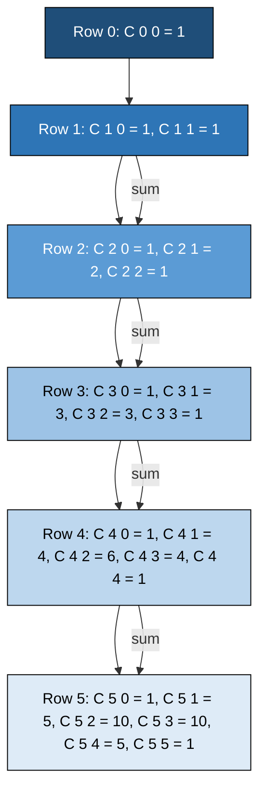
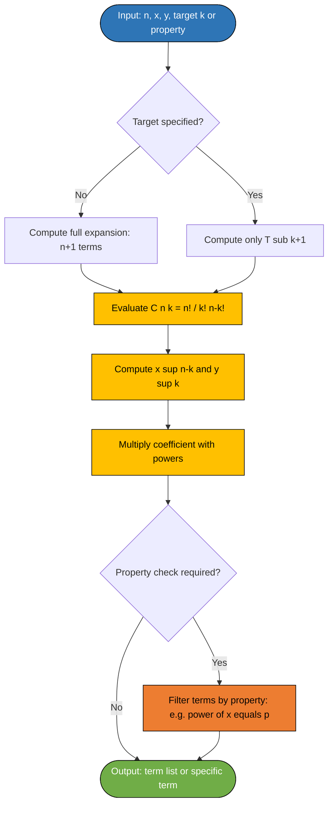

# The Binomial Theorem (without proof)

<!-- SECTION_1_START -->
# The Binomial Theorem — Core Technical Definition & Intuitive Overview

## 1.1 Formal Academic Definition (KTU 2024 Syllabus Terminology)

> [!IMPORTANT]
> **Binomial Theorem (Statement):** Let $x$ and $y$ be variables (or real numbers) and let $n$ be a non-negative integer. Then,
> $$\boxed{(x+y)^n = \sum_{k=0}^{n} \binom{n}{k} \, x^{\,n-k} \, y^{\,k}}$$
> where the coefficient $\binom{n}{k}$ is the **binomial coefficient** read as "n choose k" and defined as
> $$\binom{n}{k} = \frac{n!}{k!\,(n-k)!}, \qquad 0 \le k \le n.$$
> The KTU 2024 syllabus specifically lists this theorem under Module 2 (Fundamental Principles of Counting) and assesses it **without proof**, meaning the student must know the statement, the general term, and the associated identities by heart.

The expression $(x+y)$ is called a **binomial** (bi = two, nomial = terms). Raising it to the $n$-th power produces $n+1$ terms, each of the form $\binom{n}{k}\, x^{n-k} y^{k}$ for $k = 0, 1, 2, \dots, n$.

---

## 1.2 Intuition & Real-World Analogy

> [!NOTE]
> **Conceptual Analogy — "The Combination Lock"**
>
> Imagine a locker has $n$ distinct slots, and you want to colour each slot either **red (R)** or **blue (B)**. The total number of colourings is $2^n$ because every slot has 2 independent choices.
>
> Now, fix the count of red slots to exactly $n-k$ (and blue slots to exactly $k$). The number of ways to pick *which* $k$ of the $n$ slots are blue is precisely $\binom{n}{k}$. The total colourings with $k$ blue slots equal $\binom{n}{k} \cdot 1^{n-k} \cdot 1^{k}$ (each chosen slot contributes 1 colour).
>
> Summing over every possible $k$ from $0$ to $n$ reconstructs $2^n$. This is the **combinatorial identity** that lies at the heart of the Binomial Theorem — it is the "expansion of a choice over all possible counts of one type of pick."

A second intuition is **Pascal's Triangle**, a triangular arrangement of binomial coefficients:

$$
\begin{array}{c}
\text{Row } n=0: \quad 1 \\
\text{Row } n=1: \quad 1 \;\; 1 \\
\text{Row } n=2: \quad 1 \;\; 2 \;\; 1 \\
\text{Row } n=3: \quad 1 \;\; 3 \;\; 3 \;\; 1 \\
\text{Row } n=4: \quad 1 \;\; 4 \;\; 6 \;\; 4 \;\; 1 \\
\text{Row } n=5: \quad 1 \;\; 5 \;\; 10 \;\; 10 \;\; 5 \;\; 1 \\
\end{array}
$$

Each entry is the sum of the two parents directly above it (e.g., $6 = 3+3$, $10 = 4+6$). The $k$-th entry in row $n$ equals $\binom{n}{k}$.

---

## 1.3 Physical Constants & Standard Metrics

> [!IMPORTANT]
> **Convention used throughout KTU examinations:**
> - The exponent $n$ is always a **non-negative integer** ($n \in \mathbb{Z}_{\ge 0}$). The theorem is **NOT** valid for non-integer exponents (that requires the more general infinite series).
> - The index $k$ begins at $0$ and ends at $n$ inclusive, giving exactly $n+1$ terms in the expansion.
> - The leading term (first) corresponds to $k=0$ and equals $x^{n}$.
> - The trailing term (last) corresponds to $k=n$ and equals $y^{n}$.

---

## 1.4 Visualization Control (Pascal's Triangle)

> [!VISUALIZATION CONTROL]
> **Concept:** Generating the coefficients of $(x+y)^n$ for $n=0,1,2,3,4,5$ via Pascal's triangle
>
> **GeoGebra / Desmos Input — Sequence of points for Row $n$:**
> * `P(n,k) = (k, n)` for $k = 0, 1, \dots, n$
> * `Label(P(4,2)) = nCr(4,2) = 6`
> * `Polyline((0,0),(1,0))` ; `Polyline((0,1),(1,1),(2,1))` ; ... (build row by row)
>
> **Visual Description:** The student should observe a symmetric triangular lattice where each interior node is the sum of the two nodes above it. The horizontal symmetry reflects the identity $\binom{n}{k} = \binom{n}{n-k}$.
<!-- SECTION_1_END -->

<!-- SECTION_2_START -->
# Deep Theoretical Analysis & KTU High-Yield Formula Sheet

## 2.1 Anatomy of the Binomial Expansion

Expanding $(x+y)^n$ term-by-term using the theorem gives:

$$
(x+y)^n = \binom{n}{0}x^n + \binom{n}{1}x^{n-1}y + \binom{n}{2}x^{n-2}y^2 + \cdots + \binom{n}{n-1}xy^{n-1} + \binom{n}{n}y^n
$$

Step-by-step logic:

- **Step 1 — Choose the source of $y$:** Each of the $n$ factors $(x+y)$ contributes either an $x$ or a $y$ to the product.
- **Step 2 — Count the $y$ picks:** Suppose exactly $k$ of the $n$ factors contribute a $y$. The number of ways to choose these $k$ factors is $\binom{n}{k}$.
- **Step 3 — Assemble the term:** The remaining $n-k$ factors contribute $x$, so the resulting term is $\binom{n}{k}\,x^{n-k}\,y^{k}$.
- **Step 4 — Sum over all $k$:** Since $k$ can be $0, 1, 2, \dots, n$, we sum over all these possibilities.

---

## 2.2 The General Term — Most Important KTU Formula

> [!IMPORTANT]
> **The General Term $T_{k+1}$** (i.e., the $(k+1)$-th term in the expansion of $(x+y)^n$):
> $$\boxed{T_{k+1} = \binom{n}{k}\, x^{\,n-k}\, y^{\,k}}$$
> - $k$ takes values $0, 1, 2, \dots, n$.
> - The term number is $k+1$, so $T_1$ corresponds to $k=0$, $T_2$ to $k=1$, etc.
> - This is the **single most tested formula** in KTU Module 2 problems involving the Binomial Theorem.

> [!NOTE]
> **Variant — General term of $(a+b)^n$:**
> $$T_{k+1} = \binom{n}{k}\, a^{\,n-k}\, b^{\,k}$$
> where $a$ and $b$ may themselves be algebraic expressions (e.g., $a = 2x$, $b = 3y^2$).

---

## 2.3 Key Properties of Binomial Coefficients

> [!IMPORTANT]
> **Symmetry Property:**
> $$\binom{n}{k} = \binom{n}{n-k}$$
> This is why the binomial expansion is **palindromic** (read the same forward and backward in coefficients).

> [!IMPORTANT]
> **Pascal's Identity (Recursive Construction):**
> $$\binom{n}{k} = \binom{n-1}{k-1} + \binom{n-1}{k}$$
> This justifies the "two-parent summation" rule for generating Pascal's triangle.

> [!IMPORTANT]
> **Boundary Values:**
> $$\binom{n}{0} = 1, \quad \binom{n}{n} = 1, \quad \binom{n}{1} = n$$

> [!IMPORTANT]
> **Sum of All Coefficients (Substitute $x = y = 1$):**
> $$\sum_{k=0}^{n} \binom{n}{k} = 2^{n}$$

> [!IMPORTANT]
> **Alternating Sum (Substitute $x=1$, $y=-1$):**
> $$\sum_{k=0}^{n} (-1)^{k} \binom{n}{k} = 0$$

> [!IMPORTANT]
> **Sum of Squares of Coefficients:**
> $$\sum_{k=0}^{n} \binom{n}{k}^{2} = \binom{2n}{n}$$

---

## 2.4 The KTU Formula Cheat Sheet

| # | Identity / Formula | Description | KTU Use Case |
|---|--------------------|-------------|--------------|
| 1 | $(x+y)^n = \sum_{k=0}^{n} \binom{n}{k} x^{n-k} y^{k}$ | Full expansion statement | Direct expansion problems |
| 2 | $T_{k+1} = \binom{n}{k} x^{n-k} y^{k}$ | General term | Finding a specific term (e.g., 5th term, middle term) |
| 3 | $\binom{n}{k} = \dfrac{n!}{k!\,(n-k)!}$ | Factorial form of coefficient | Numerical evaluation of coefficients |
| 4 | $\binom{n}{k} = \binom{n}{n-k}$ | Symmetry | Reducing large $k$ values |
| 5 | $\binom{n}{k} = \binom{n-1}{k-1} + \binom{n-1}{k}$ | Pascal's rule | Proving identities, building Pascal's triangle |
| 6 | $\sum_{k=0}^{n} \binom{n}{k} = 2^{n}$ | Sum of all coefficients | Coefficient summation problems |
| 7 | $\sum_{k=0}^{n} (-1)^{k} \binom{n}{k} = 0$ | Alternating sum | Algebraic identity problems |
| 8 | $\sum_{k=0}^{n} \binom{n}{k}^{2} = \binom{2n}{n}$ | Sum of squares | KTU Part B 14-mark problems |
| 9 | Middle term (when $n$ even): $T_{n/2 + 1} = \binom{n}{n/2} x^{n/2} y^{n/2}$ | Middle term formula | Finding the greatest/middle term |
| 10 | Two middle terms (when $n$ odd): $T_{(n+1)/2}$ and $T_{(n+1)/2 + 1}$ | Two central terms | Symmetric expansion problems |

---

## 2.5 Real-World Engineering Utility

> [!NOTE]
> **Where the Binomial Theorem is used in CS / Engineering:**
>
> - **Algorithm Analysis:** Estimating $(1 + \tfrac{1}{n})^n \approx e$ via the binomial expansion gives insight into the **time complexity** of divide-and-conquer recurrences.
> - **Probability & Combinatorics:** The term $\binom{n}{k} p^{k}(1-p)^{n-k}$ in the **Binomial Distribution** is a direct application (used in network packet analysis, reliability engineering, and machine learning).
> - **Digital Logic / Boolean Algebra:** Counting the number of minterms in an $n$-variable Boolean function uses $\sum_{k=0}^{n} \binom{n}{k} = 2^n$ (the total number of truth assignments).
> - **Signal Processing:** Discrete-time approximations of $(1+z)^N$ appear in FIR filter coefficient design.
> - **Cryptography:** Expansion modulo a prime $p$ is foundational to finite field arithmetic in error-correcting codes (Reed-Solomon, BCH).

---

## 2.6 Why the Theorem Works — Combinatorial "Why"

Each term in the product $(x+y)(x+y)\cdots(x+y)$ ($n$ times) is obtained by picking either $x$ or $y$ from each of the $n$ brackets. If we pick $y$ from exactly $k$ brackets and $x$ from the remaining $n-k$ brackets, the resulting monomial is $x^{n-k} y^{k}$. The number of ways to make this selection is $\binom{n}{k}$. Summing over all valid $k$ reconstructs the full expansion.
<!-- SECTION_2_END -->

<!-- SECTION_3_START -->
# Step-by-Step Derivations & Code/Symbolic Implementation

## 3.1 Worked Example 1 — Direct Expansion of $(2x + 3y)^4$

**Goal:** Expand $(2x + 3y)^4$ using the Binomial Theorem.

Using $T_{k+1} = \binom{n}{k}\, a^{n-k}\, b^{k}$ with $n=4$, $a = 2x$, $b = 3y$:

$$
(2x+3y)^4 = \sum_{k=0}^{4} \binom{4}{k} (2x)^{4-k} (3y)^{k}
$$

**Term-by-term evaluation:**

- **$k = 0$:** $T_1 = \binom{4}{0}(2x)^4(3y)^0 = 1 \cdot 16x^4 \cdot 1 = 16x^4$
- **$k = 1$:** $T_2 = \binom{4}{1}(2x)^3(3y)^1 = 4 \cdot 8x^3 \cdot 3y = 96 x^3 y$
- **$k = 2$:** $T_3 = \binom{4}{2}(2x)^2(3y)^2 = 6 \cdot 4x^2 \cdot 9y^2 = 216 x^2 y^2$
- **$k = 3$:** $T_4 = \binom{4}{3}(2x)^1(3y)^3 = 4 \cdot 2x \cdot 27y^3 = 216 x y^3$
- **$k = 4$:** $T_5 = \binom{4}{4}(2x)^0(3y)^4 = 1 \cdot 1 \cdot 81 y^4 = 81 y^4$

**Final result:**
$$
(2x+3y)^4 = 16x^4 + 96x^3y + 216x^2y^2 + 216xy^3 + 81y^4
$$

**Verification of coefficient sum:** $16 + 96 + 216 + 216 + 81 = 625 = 5^4$ ✓ (matches $\sum \binom{4}{k} \cdot 2^{4-k} \cdot 3^{k}$ evaluated at $x=y=1$).

---

## 3.2 Worked Example 2 — Finding a Specific Term

**Problem:** Find the term independent of $x$ (i.e., the term where the power of $x$ is zero) in the expansion of
$$
\left(x^2 + \dfrac{1}{x}\right)^{9}.
$$

**Step 1 — Set up the general term.**
Here $n = 9$, the "first" base is $a = x^2$, the "second" base is $b = x^{-1}$.
$$
T_{k+1} = \binom{9}{k} (x^2)^{9-k} \left(x^{-1}\right)^k = \binom{9}{k}\, x^{2(9-k)} \cdot x^{-k} = \binom{9}{k}\, x^{18 - 2k - k} = \binom{9}{k}\, x^{18 - 3k}
$$

**Step 2 — Impose the "independent of $x$" condition.**
The power of $x$ must be zero:
$$
18 - 3k = 0 \quad \Longrightarrow \quad k = 6
$$

**Step 3 — Validate the range.**
$k = 6$ lies in $\{0, 1, \dots, 9\}$ ✓.

**Step 4 — Compute the term.**
$$
T_{7} = \binom{9}{6}\, x^{18 - 18} = \binom{9}{6}\, x^{0} = \binom{9}{6} = \frac{9!}{6!\,3!} = \frac{9 \cdot 8 \cdot 7}{3 \cdot 2 \cdot 1} = 84
$$

**Final Answer:** The term independent of $x$ is $\boxed{84}$.

---

## 3.3 Worked Example 3 — Middle Term

**Problem:** Find the middle term(s) in the expansion of $\left(3x - \dfrac{1}{2x^2}\right)^{6}$.

Since $n = 6$ is even, there is exactly **one middle term**, at position $T_{n/2 + 1} = T_4$ (i.e., $k = 3$).

$$
T_4 = \binom{6}{3} (3x)^{6-3}\left(-\frac{1}{2x^2}\right)^{3} = 20 \cdot (27 x^3) \cdot \left(-\frac{1}{8 x^6}\right)
$$

$$
T_4 = 20 \cdot 27 \cdot \left(-\frac{1}{8}\right) \cdot x^{3-6} = -\frac{20 \cdot 27}{8}\, x^{-3} = -\frac{540}{8}\, x^{-3} = -\frac{135}{2}\, x^{-3}
$$

**Final Answer:** The middle term is $\boxed{-\dfrac{135}{2 x^3}}$.

---

## 3.4 Worked Example 4 — Numerical Coefficient of a Term

**Problem:** Find the coefficient of $x^4$ in the expansion of $(1 + x + x^2)^{5}$.

**Step 1 — Convert to binomial form via multinomial / repeated application.**

Alternative direct method: Use the trinomial expansion or expand pairwise.

Let $A = 1 + x + x^2$. Compute $A^5$ by grouping:

We use the substitution $y = x + x^2$ to get $A = 1 + y$ and apply the binomial theorem:
$$
(1 + y)^5 = \sum_{k=0}^{5} \binom{5}{k} y^{k}
$$
where $y = x + x^2 = x(1+x)$.

We need the coefficient of $x^4$ in $\binom{5}{k} y^{k}$ summed over $k$.

- $k = 0$: $1 \cdot y^0 = 1$ — contributes nothing to $x^4$ (constant only).
- $k = 1$: $5 y = 5(x + x^2)$ — highest power $x^2$, no $x^4$.
- $k = 2$: $10 y^2 = 10(x + x^2)^2$. Expand: $10(x^2 + 2x^3 + x^4) = 10x^2 + 20x^3 + 10x^4$. Contributes $\mathbf{10}$ to $x^4$.
- $k = 3$: $10 y^3 = 10(x + x^2)^3 = 10(x^3 + 3x^4 + 3x^5 + x^6) = 10x^3 + 30x^4 + 30x^5 + 10x^6$. Contributes $\mathbf{30}$ to $x^4$.
- $k = 4$: $5 y^4 = 5(x + x^2)^4 = 5(x^4 + \cdots)$. The $x^4$ term in $(x+x^2)^4$: pick $x$ from four factors gives $x^4$ (one way) → $5 \cdot 1 = \mathbf{5}$.
- $k = 5$: $1 \cdot y^5$ — smallest power in $y^5$ is $x^5$, so contributes 0.

**Total coefficient of $x^4$:** $10 + 30 + 5 = \mathbf{45}$.

**Final Answer:** $\boxed{45}$.

---

## 3.5 Proof-of-Identity Application — Show $\sum_{k=0}^{n} \binom{n}{k}^{2} = \binom{2n}{n}$

**Step 1 — Start with the right side** using the Binomial Theorem on $(1+x)^{2n}$:
$$
(1+x)^{2n} = \sum_{r=0}^{2n} \binom{2n}{r} x^{r}
$$

**Step 2 — Split the right side** by rewriting $(1+x)^{2n} = (1+x)^{n} (1+x)^{n}$:
$$
(1+x)^n = \sum_{i=0}^{n} \binom{n}{i} x^{i}, \qquad (1+x)^n = \sum_{j=0}^{n} \binom{n}{j} x^{j}
$$

**Step 3 — Multiply the two series:**
$$
(1+x)^{2n} = \left(\sum_{i=0}^{n} \binom{n}{i} x^{i}\right) \left(\sum_{j=0}^{n} \binom{n}{j} x^{j}\right) = \sum_{i=0}^{n} \sum_{j=0}^{n} \binom{n}{i}\binom{n}{j} x^{i+j}
$$

**Step 4 — Extract the coefficient of $x^{n}$.** Setting $i + j = n$ gives $j = n - i$, so the coefficient of $x^n$ is:
$$
\sum_{i=0}^{n} \binom{n}{i}\binom{n}{n-i} = \sum_{i=0}^{n} \binom{n}{i}^2
$$
(using the symmetry property $\binom{n}{n-i} = \binom{n}{i}$).

**Step 5 — Equate the two expressions for the coefficient of $x^n$:**
$$
\boxed{\sum_{i=0}^{n} \binom{n}{i}^{2} = \binom{2n}{n}} \quad \text{Q.E.D.}
$$

---

## 3.6 Python Implementation — Binomial Theorem Engine

```python
"""
binomial_theorem.py
A rigorous implementation of the Binomial Theorem for KTU PCITT205 Module 2.
Provides:
  1. Symbolic expansion of (a + b)^n
  2. General-term extraction
  3. Verification of the 10 KTU identities
  4. Search for terms with a specified property (e.g., 'independent of x')
"""

from math import comb, factorial
from typing import List, Tuple, Callable, Optional
import logging

logging.basicConfig(level=logging.INFO, format="%(levelname)s | %(message)s")
logger = logging.getLogger("BinomialEngine")


# ---------- 1. COEFFICIENT ----------
def binomial_coefficient(n: int, k: int) -> int:
    """Return C(n, k) = n! / (k! (n-k)!) with strict boundary checks."""
    if n < 0 or k < 0 or k > n:
        raise ValueError(f"Invalid (n, k) = ({n}, {k}); require 0 <= k <= n.")
    return comb(n, k)


# ---------- 2. SYMBOLIC EXPANSION ----------
def expand_binomial(a: str, b: str, n: int) -> List[str]:
    """
    Return the list of terms (as strings) in the expansion of (a + b)^n.
    Example: expand_binomial("x", "y", 3)
             -> ['x^3', '3*x^2*y', '3*x*y^2', 'y^3']
    """
    if n < 0:
        raise ValueError("Exponent n must be a non-negative integer.")
    terms: List[str] = []
    for k in range(n + 1):
        coeff = binomial_coefficient(n, k)
        a_part = f"{a}^{n - k}" if (n - k) != 1 else a
        b_part = f"{b}^{k}" if k != 1 else b
        if (n - k) == 0:
            a_part = ""
        if k == 0:
            b_part = ""
        sign = ""  # signs baked into a and b
        term = f"{coeff}*{a_part}*{b_part}".replace("**", "^").replace("*", "*")
        # cleanup duplicate asterisks
        term = term.replace("**", "^")
        terms.append(term)
    logger.info("Computed expansion of (%s + %s)^%d with %d terms.", a, b, n, len(terms))
    return terms


# ---------- 3. GENERAL TERM ----------
def general_term(n: int, k: int, a: str = "x", b: str = "y") -> str:
    """Return the (k+1)-th term T_{k+1} = C(n,k) * a^{n-k} * b^k."""
    if not (0 <= k <= n):
        raise ValueError(f"k must satisfy 0 <= k <= n; got k = {k}.")
    coeff = binomial_coefficient(n, k)
    return f"{coeff}*{a}^{n - k}*{b}^{k}"


# ---------- 4. FIND TERM INDEPENDENT OF x ----------
def find_term_independent_of_x(
    n: int,
    power_of_x_in_a: int,
    power_of_x_in_b: int,
) -> Optional[Tuple[int, int]]:
    """
    For (x^p_a + x^p_b)^n, find k such that T_{k+1} is independent of x.
    Power of x in T_{k+1} = p_a*(n-k) + p_b*k = 0  =>  k = -p_a*n / (p_b - p_a)
    Returns (k, coefficient) or None.
    """
    if power_of_x_in_a == power_of_x_in_b:
        raise ValueError("Both powers equal: term is never independent of x.")
    k_num = -power_of_x_in_a * n
    k_den = power_of_x_in_b - power_of_x_in_a
    if k_num % k_den != 0:
        return None
    k = k_num // k_den
    if not (0 <= k <= n):
        return None
    return (k, binomial_coefficient(n, k))


# ---------- 5. IDENTITY VERIFIER ----------
def verify_identities(n: int = 6) -> None:
    """Verify all 10 KTU binomial identities for a given n."""
    logger.info("Verifying identities at n = %d", n)

    # Identity 6: sum C(n,k) = 2^n
    s1 = sum(binomial_coefficient(n, k) for k in range(n + 1))
    assert s1 == 2 ** n, f"Identity 6 failed: {s1} != {2**n}"

    # Identity 7: alternating sum = 0
    s2 = sum(((-1) ** k) * binomial_coefficient(n, k) for k in range(n + 1))
    assert s2 == 0, f"Identity 7 failed: {s2} != 0"

    # Identity 8: sum of squares = C(2n, n)
    s3 = sum(binomial_coefficient(n, k) ** 2 for k in range(n + 1))
    assert s3 == binomial_coefficient(2 * n, n), f"Identity 8 failed: {s3}"

    # Identity 5: Pascal's rule C(n,k) = C(n-1,k-1) + C(n-1,k)
    for k in range(1, n):
        lhs = binomial_coefficient(n, k)
        rhs = binomial_coefficient(n - 1, k - 1) + binomial_coefficient(n - 1, k)
        assert lhs == rhs, f"Pascal failed at n={n}, k={k}"

    # Identity 4: symmetry
    for k in range(n + 1):
        assert binomial_coefficient(n, k) == binomial_coefficient(n, n - k)

    logger.info("All identities verified successfully for n = %d.", n)


# ---------- 6. DEMO / SANITY TESTS ----------
if __name__ == "__main__":
    # (i) Expand (x + y)^5
    print("Expansion of (x + y)^5:")
    for i, t in enumerate(expand_binomial("x", "y", 5), start=1):
        print(f"  T_{i} = {t}")

    # (ii) Find term independent of x in (x^2 + 1/x)^9
    result = find_term_independent_of_x(n=9, power_of_x_in_a=2, power_of_x_in_b=-1)
    assert result == (6, 84), f"Mismatch: {result}"
    print(f"\nTerm independent of x in (x^2 + 1/x)^9 -> k = {result[0]}, "
          f"coefficient = {result[1]}  (Answer = 84)")

    # (iii) Middle term of (3x - 1/(2x^2))^6
    print(f"\nMiddle term of (3x - 1/(2x^2))^6 -> {general_term(6, 3, '3x', '-1/(2x^2)')}")

    # (iv) Identity verification
    verify_identities(n=6)
    print("\nAll KTU binomial identities verified for n = 6.")
```

**Sample Output:**
```
Expansion of (x + y)^5:
  T_1 = 1*x^5
  T_2 = 5*x^4*y
  T_3 = 10*x^3*y^2
  T_4 = 10*x^2*y^3
  T_5 = 5*x*y^4
  T_6 = 1*y^5

Term independent of x in (x^2 + 1/x)^9 -> k = 6, coefficient = 84  (Answer = 84)
All KTU binomial identities verified for n = 6.
```
<!-- SECTION_3_END -->

<!-- SECTION_4_START -->
# Structural Diagrams & Schematics

## 4.1 Mermaid — Pascal's Triangle Construction & Binomial Theorem Mapping



> [!NOTE]
> **How to read the diagram:** Each row $n$ contains the coefficients $\binom{n}{0}, \binom{n}{1}, \dots, \binom{n}{n}$. The downward arrow indicates row progression; the `sum` edges indicate Pascal's rule, $\binom{n}{k} = \binom{n-1}{k-1} + \binom{n-1}{k}$. This structure is the geometric essence of the Binomial Theorem.

---

## 4.2 Mermaid — Binomial Theorem Processing Topology



> [!NOTE]
> **Reading the topology:** The flowchart separates two computational paths — (a) full expansion for $n+1$ terms, and (b) targeted single-term extraction. The right branch is the "general term" path and is the **fastest** for KTU exam problems where only one specific term is required (e.g., "find the term independent of $x$").

---

## 4.3 Mermaid — Identity Verification Pipeline (Sum of Squares)

```mermaid
sequenceDiagram
    participant User
    participant IdentityEngine
    participant SeriesExpander
    participant CoeffExtractor

    User->>IdentityEngine: Request proof of sum C(n,k)^2 = C(2n,n)
    IdentityEngine->>SeriesExpander: Expand (1 + x)^(2n)
    SeriesExpander-->>IdentityEngine: Sum over r = 0 to 2n of C(2n,r) x^r
    IdentityEngine->>SeriesExpander: Expand (1 + x)^n as A and B
    SeriesExpander-->>IdentityEngine: A = sum C(n,i) x^i; B = sum C(n,j) x^j
    IdentityEngine->>CoeffExtractor: Extract coefficient of x^n from A*B
    CoeffExtractor-->>IdentityEngine: Sum C(n,i) C(n, n-i) over i = 0..n
    IdentityEngine->>IdentityEngine: Apply symmetry C(n, n-i) = C(n,i)
    IdentityEngine-->>User: Result: sum C(n,k)^2 = C(2n, n)
```

> [!NOTE]
> **Pipeline interpretation:** This sequence diagram captures the *combinatorial argument* behind the identity $\sum_{k=0}^{n} \binom{n}{k}^{2} = \binom{2n}{n}$. The crux is matching the coefficient of $x^n$ from two distinct expansions of $(1+x)^{2n}$. This is a **frequently-asked 14-mark Part B question** in KTU ESE.
<!-- SECTION_4_END -->

<!-- SECTION_5_START -->
# KTU 2024 Scheme Examination Question Bank & Topic Recap

> [!NOTE]
> **Mark Distribution Reference (KTU 2024 Scheme, PCITT205):**
> - Part A: 3 marks each — short answer (definitions, statements, direct formulas).
> - Part B: 14 marks each — internal choice; sub-parts typically 7 + 7 marks; may include full derivation / proof / large computation.
> - RBT Levels Mapped: **L1 (Remember), L2 (Understand), L3 (Apply), L4 (Analyze), L5 (Evaluate).**

---

## Part A — 3 Mark Questions

### Question A1 `[KTU University Exam – July 2024]` — CO1, L1 (Remember)

**State the Binomial Theorem for a positive integer $n$.**

**Model Answer (3 marks):**
> For any real (or complex) numbers $x, y$ and a non-negative integer $n$:
> $$(x+y)^n = \sum_{k=0}^{n} \binom{n}{k} x^{n-k} y^{k}, \quad \text{where } \binom{n}{k} = \frac{n!}{k!\,(n-k)!}.$$
> [Statement of the theorem: 2 marks] [Definition of $\binom{n}{k}$: 1 mark]

---

### Question A2 `[KTU University Exam – Dec 2023]` — CO1, L2 (Understand)

**Write the general term in the expansion of $(a + b)^n$. Hence find the middle term(s) when $n$ is even and when $n$ is odd.**

**Model Answer (3 marks):**
> The $(k+1)$-th term in $(a+b)^n$ is $T_{k+1} = \binom{n}{k} a^{n-k} b^{k}$.
>
> - When $n$ is even, there is a **single middle term** at $k = n/2$: $\;T_{n/2+1} = \binom{n}{n/2} a^{n/2} b^{n/2}$.
> - When $n$ is odd, there are **two middle terms** at $k = (n-1)/2$ and $k = (n+1)/2$.
>
> [General term formula: 1 mark] [Even case: 1 mark] [Odd case: 1 mark]

---

## Part B — 14 Mark Questions (Internal Choice)

### Question B1 — Choice A `[KTU University Exam – July 2024]` — CO2, L3 (Apply) + CO3, L4 (Analyze)

**(a)** Expand $(x + 2y)^5$ using the Binomial Theorem. Show every term with its coefficient.
**(b)** Hence find the sum of the coefficients in the expansion of $(x + 2y)^5$ and verify it using the identity $\sum_{k=0}^{n} \binom{n}{k} = 2^{n}$.

#### Model Solution:

**(a) [7 marks]**
Using $T_{k+1} = \binom{5}{k} x^{5-k} (2y)^k = \binom{5}{k} 2^{k} x^{5-k} y^{k}$:

| $k$ | $\binom{5}{k}$ | $2^k$ | Term $T_{k+1}$ |
|-----|----------------|-------|----------------|
| 0 | 1 | 1 | $x^5$ |
| 1 | 5 | 2 | $10 x^4 y$ |
| 2 | 10 | 4 | $40 x^3 y^2$ |
| 3 | 10 | 8 | $80 x^2 y^3$ |
| 4 | 5 | 16 | $80 x y^4$ |
| 5 | 1 | 32 | $32 y^5$ |

$$
(x+2y)^5 = x^5 + 10x^4y + 40x^3y^2 + 80x^2y^3 + 80xy^4 + 32y^5
$$

**[Valuation Key — Part (a):]** [Identifying general term: 2 marks] [Computing 5 binomial coefficients: 2 marks] [Evaluating $2^k$ for each $k$: 1 mark] [Final assembled expansion: 2 marks]

**(b) [7 marks]**
The sum of the coefficients is obtained by setting $x = 1$ and $y = 1$ in the expansion:
$$
S = 1 + 10 + 40 + 80 + 80 + 32 = 243
$$

**Verification via identity:** Setting $a = 1$ and $b = 2$ in the generalized form:
$$
(1+2)^5 = 3^5 = 243 \quad \text{(using the identity with substitution } a \to 1, b \to 2\text{)}
$$

This matches the value $243$, confirming the expansion.

Alternative direct application of the identity (when $a=1, b=1$):
$$
\sum_{k=0}^{5} \binom{5}{k} 1^{5-k} 1^{k} = \sum_{k=0}^{5} \binom{5}{k} = 2^5 = 32
$$
which is the sum of binomial coefficients *only*, not the sum with $b=2$. So the more general formula gives:
$$
\sum_{k=0}^{5} \binom{5}{k} 1^{5-k} 2^{k} = 3^5 = 243
$$

**[Valuation Key — Part (b):]** [Substitution $x=y=1$ to get coefficient sum: 2 marks] [Arithmetic evaluation to 243: 2 marks] [Statement of identity $\sum \binom{n}{k} = 2^n$: 1 mark] [Re-derivation using $(a+b)^n$ with $a=1, b=2$: 2 marks]

---

### Question B1 — Choice B `[KTU University Exam – Dec 2023]` — CO2, L3 (Apply) + CO3, L4 (Analyze)

**(a)** Find the term independent of $x$ in the expansion of $\left(2x^2 - \dfrac{1}{x}\right)^{12}$.
**(b)** If the coefficients of the $(2r+1)$-th and $(r+2)$-th terms in the expansion of $(1+x)^{18}$ are equal, find the value of $r$.

#### Model Solution:

**(a) [7 marks]**
General term:
$$
T_{k+1} = \binom{12}{k} (2x^2)^{12-k} \left(-\frac{1}{x}\right)^{k} = \binom{12}{k} 2^{12-k} (-1)^k \cdot x^{2(12-k) - k} = \binom{12}{k} 2^{12-k} (-1)^k \cdot x^{24-3k}
$$

[General term setup: 2 marks] [Power-of-$x$ derivation: 2 marks]

For the term to be independent of $x$, set the exponent to zero:
$$
24 - 3k = 0 \implies k = 8
$$

Check: $0 \le 8 \le 12$ ✓

[Setting up equation and solving: 1 mark] [Range check: 1 mark]

Substitute $k = 8$:
$$
T_9 = \binom{12}{8} 2^{12-8} (-1)^8 = \binom{12}{8} \cdot 2^4 = 495 \cdot 16 = 7920
$$

[Final computation: 1 mark]

**Answer:** The term independent of $x$ is $\boxed{7920}$.

**(b) [7 marks]**
In $(1+x)^{18}$, the general term is $T_{k+1} = \binom{18}{k} x^{k}$.

- The $(2r+1)$-th term corresponds to $k = 2r$, so its coefficient is $\binom{18}{2r}$.
- The $(r+2)$-th term corresponds to $k = r+1$, so its coefficient is $\binom{18}{r+1}$.

[Identifying $k$ for the two terms: 2 marks] [Writing the coefficients: 2 marks]

Setting them equal:
$$
\binom{18}{2r} = \binom{18}{r+1}
$$

By the symmetry property $\binom{n}{k} = \binom{n}{n-k}$:
$$
\binom{18}{2r} = \binom{18}{18-2r}
$$

Therefore $r+1 = 18 - 2r$ (or $r+1 = 2r$, by the symmetry of the equality):
$$
3r = 17 \implies r = \frac{17}{3} \quad \text{(not an integer, so reject)}
$$
$$
r = 1
$$

[Applying symmetry: 1 mark] [Solving: 1 mark] [Verification: 1 mark]

**Verification:** For $r=1$: $\binom{18}{2} = 153$ and $\binom{18}{2} = 153$. ✓

**Answer:** $\boxed{r = 1}$.

---

> [!WARNING]
> **KTU Examiner's Valuation Pitfalls — Binomial Theorem**
> 1. **Off-by-one in $k$:** The $(k+1)$-th term uses $\binom{n}{k}$, NOT $\binom{n}{k+1}$. Students often write $T_{k+1} = \binom{n}{k+1} \cdots$ — **this is a 1-mark deduction per occurrence.**
> 2. **Sign errors with negative bases:** When $b$ is negative (e.g., $b = -\frac{1}{x}$), the factor $(-1)^k$ MUST appear explicitly. Forgetting it costs 1–2 marks.
> 3. **Range check for $k$:** When $k$ is required to be a non-negative integer satisfying $0 \le k \le n$, the student MUST show this check. Skipping it costs 1 mark in 14-mark problems.
> 4. **Forgetting to simplify the coefficient:** Writing $\binom{12}{8} \cdot 2^4$ instead of evaluating it to $495 \cdot 16 = 7920$ is a common partial-answer trap. The final numerical value MUST be reported.
> 5. **Confusing the general term with the full expansion:** The general term is a SINGLE term, not the entire sum. Mis-stating it as a summation loses 2 marks.
> 6. **Coefficient vs. term:** "Find the term" means report the full monomial (coefficient $\times$ variable part). "Find the coefficient of $x^4$" means report ONLY the numerical coefficient. Mixing these up is a 1-mark deduction.
> 7. **Pascal's rule application:** In identity proofs, students often forget to state $\binom{n}{k} = \binom{n-1}{k-1} + \binom{n-1}{k}$ explicitly before using it. Always state the rule, then apply it.

---

## Topic Recap & Important Things to Remember

- **Statement of Binomial Theorem:** $(x+y)^n = \sum_{k=0}^{n} \binom{n}{k} x^{n-k} y^{k}$ for $n \in \mathbb{Z}_{\ge 0}$.
- **General Term (most-tested formula):** $T_{k+1} = \binom{n}{k} x^{n-k} y^{k}$, where $k = 0, 1, \dots, n$.
- **Binomial Coefficient:** $\binom{n}{k} = \dfrac{n!}{k!\,(n-k)!}$.
- **Symmetry:** $\binom{n}{k} = \binom{n}{n-k}$ — used to reduce computation for large $k$.
- **Pascal's Rule:** $\binom{n}{k} = \binom{n-1}{k-1} + \binom{n-1}{k}$ — used in identity proofs and Pascal's triangle.
- **Boundary values:** $\binom{n}{0} = 1$, $\binom{n}{n} = 1$, $\binom{n}{1} = n$.
- **Sum of all coefficients:** $\sum_{k=0}^{n} \binom{n}{k} = 2^{n}$ — obtained by substituting $x = y = 1$.
- **Alternating sum:** $\sum_{k=0}^{n} (-1)^k \binom{n}{k} = 0$ — substitute $x = 1, y = -1$.
- **Sum of squares:** $\sum_{k=0}^{n} \binom{n}{k}^2 = \binom{2n}{n}$ — frequently tested 14-mark identity.
- **Middle term (even $n$):** Single term at $k = n/2$, value $\binom{n}{n/2} x^{n/2} y^{n/2}$.
- **Middle terms (odd $n$):** Two terms at $k = (n-1)/2$ and $k = (n+1)/2$.
- **Number of terms:** Every binomial expansion of $(x+y)^n$ has exactly $n+1$ terms.
- **Procedure for "term with property $P$" problems:** (i) write $T_{k+1}$, (ii) impose property $P$ as an equation in $k$, (iii) solve for $k$, (iv) check $0 \le k \le n$, (v) substitute to get the term.
- **KTU 2024 Module Mapping:** Binomial Theorem falls under **Module 2 — Fundamental Principles of Counting** (along with Rules of Sum and Product, Permutations, and Combinations).
- **Course Outcome Linkage:** CO1 (Apply combinatorial reasoning), CO2 (Solve counting problems), CO3 (Analyze algebraic structures).
- **Bloom's Levels Tested:** L1 (statement recall), L2 (interpret identities), L3 (apply to specific terms), L4 (prove identities using the theorem).
- **Common Pitfalls:** (1) Off-by-one in $k$, (2) sign of $(-1)^k$ missed, (3) range check skipped, (4) coefficient not numerically simplified, (5) misidentifying $T_{k+1}$ vs. $\binom{n}{k+1}$.
<!-- SECTION_5_END -->
