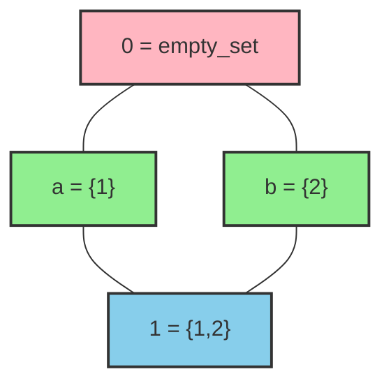
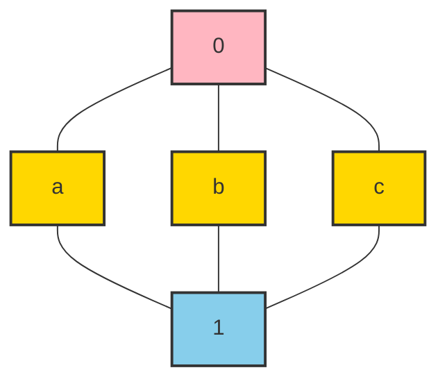
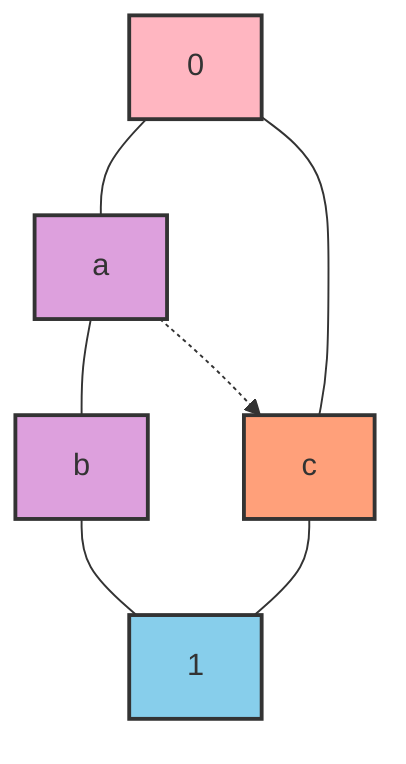
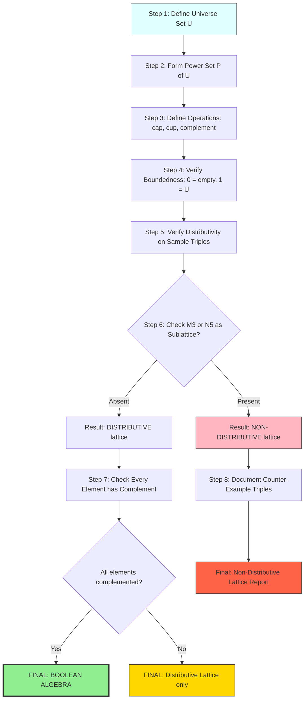
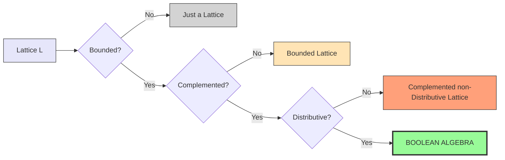

# Complimented and Distributive lattices

<!-- SECTION_1_START -->
# Complemented and Distributive Lattices

## 1.1 Formal Definition (KTU 2024 Syllabus Standard)

A **Lattice** $(L, \leq)$ is a partially ordered set in which every pair of elements $\{a, b\}$ has a **greatest lower bound (glb / meet / ∧)** and a **least upper bound (lub / join / ∨)**.

A lattice $(L, \land, \lor)$ is classified further into two important specializations relevant to Module 3:

> [!IMPORTANT]
> **Distributive Lattice:** A lattice $(L, \land, \lor)$ is *distributive* if for all $x, y, z \in L$, both distributive identities hold:
>
> $$\begin{aligned}
> x \land (y \lor z) &= (x \land y) \lor (x \land z) \\
> x \lor (y \land z) &= (x \lor y) \land (x \lor z)
> \end{aligned}$$

> [!IMPORTANT]
> **Complemented Lattice:** A *bounded* lattice $(L, \land, \lor, 0, 1)$ is *complemented* if for every element $a \in L$, there exists at least one element $a' \in L$ such that:
>
> $$a \land a' = 0 \quad \text{and} \quad a \lor a' = 1$$
>
> Here $a'$ is called a **complement** of $a$, $0$ is the **least element (bottom)**, and $1$ is the **greatest element (top)**.

> [!NOTE]
> **Boolean Algebra:** A *complemented distributive lattice* is called a **Boolean Algebra**. This is the most important algebraic structure derived from lattices and forms the basis of digital logic, set algebra, and propositional logic.

---

## 1.2 Conceptual Analogy / Intuition

Imagine a **library classification system**:
- The set of all books is the universe (the lattice $L$).
- The **meet** ($\land$) operation is like finding the *most specific common category* of two books (e.g., a book on "Calculus" and a book on "Linear Algebra" both meet at "Mathematics").
- The **join** ($\lor$) operation is the *broadest category containing both* (e.g., they both belong to "Academic Texts").
- The **bottom element $0$** is the empty set — no category contains nothing.
- The **top element $1$** is the universal set — the all-encompassing "All Books."
- A **complement** of a category is the set of *all books NOT in that category*.

**Distributivity analogy:** Just as multiplication distributes over addition in real numbers ($a \times (b+c) = a \times b + a \times c$), in a distributive lattice, "common category" distributes over "union category" — the structure is algebraically *well-behaved*.

**Non-distributive analogy:** In a *non-distributive* lattice, certain "exception" elements (like the center node of a diamond $M_3$ or a pentagon $N_5$) break this distributive property — much like a hierarchical organization chart where one person reports to two bosses in conflicting ways.

> [!TIP]
> Think of a distributive lattice as a *clean, hierarchical* family tree, and a non-distributive lattice as a family tree with a *diamond conflict* (one person having two distinct parent lines).

---

## 1.3 Standard Notation & Constants

| Symbol | Meaning | Standard Notation |
|---|---|---|
| $\land$ | Meet (Greatest Lower Bound / GLB) | $x \land y = \inf(x,y)$ |
| $\lor$ | Join (Least Upper Bound / LUB) | $x \lor y = \sup(x,y)$ |
| $0$ | Least element (Bottom) | Universal lower bound |
| $1$ | Greatest element (Top) | Universal upper bound |
| $a'$ | Complement of $a$ | $a \land a' = 0$, $a \lor a' = 1$ |
| $M_3$ | Diamond lattice (non-distributive) | 5 elements, 0, 1, three pairwise incomparable atoms |
| $N_5$ | Pentagon lattice (non-distributive) | 5 elements forming a chain with one side-branch |

> [!VISUALIZATION CONTROL]
> **Concept:** Hasse Diagram of a Boolean Algebra $B_2$ (Power set of $\{a,b\}$)
> **GeoGebra / Desmos Input Equations:**
> * Point set: `{(0,0), (1,1), (0,2), (2,0), (1,-1), (-1,1), (1,3), (3,-1)}` representing the 8 elements of $\mathcal{P}(\{a,b\})$
> * Edges: connect $x \leq y$ when $x \subseteq y$
> **Visual Description:** A 3-level cube-like Hasse diagram with $0 = \emptyset$ at the bottom, $1 = \{a,b\}$ at the top, and 6 intermediate subsets arranged in two middle levels.

---

<!-- SECTION_1_END -->

<!-- SECTION_2_START -->
# Deep Theoretical Analysis & KTU High-Yield Formula Sheet

## 2.1 Properties of Complemented Distributive Lattices (Boolean Algebras)

Let $B$ be a Boolean Algebra. For all $a, b, c \in B$, the following identities hold:

### A. Lattice Axioms
1. **Idempotent:** $a \land a = a$, $a \lor a = a$
2. **Commutative:** $a \land b = b \land a$, $a \lor b = b \lor a$
3. **Associative:** $a \land (b \land c) = (a \land b) \land c$, $a \lor (b \lor c) = (a \lor b) \lor c$
4. **Absorption:** $a \land (a \lor b) = a$, $a \lor (a \land b) = a$

### B. Boundedness
5. **Identity:** $a \land 1 = a$, $a \lor 0 = a$
6. **Universal bound:** $a \land 0 = 0$, $a \lor 1 = 1$

### C. Complementation
7. **Complement laws:** $a \land a' = 0$, $a \lor a' = 1$
8. **Involution:** $(a')' = a$
9. **Zero and One complements:** $0' = 1$, $1' = 0$

### D. Distributivity
10. $a \land (b \lor c) = (a \land b) \lor (a \land c)$
11. $a \lor (b \land c) = (a \lor b) \land (a \lor c)$

### E. De Morgan's Laws (Huntington's Theorem)
12. $(a \land b)' = a' \lor b'$
13. $(a \lor b)' = a' \land b'$

> [!NOTE]
> These 13 identities (or a minimal subset of 4–6 of them) constitute the axioms of a Boolean Algebra as a *mathematical structure*. The Huntington's postulates (1904) use only the 6 axioms: Commutativity, Associativity, Distributivity, Identity, Complement.

---

## 2.2 KTU Formula Cheat Sheet

| ID | Property / Identity | Statement |
|---|---|---|
| F1 | Meet | $a \land b = \text{glb}(a,b)$ |
| F2 | Join | $a \lor b = \text{lub}(a,b)$ |
| F3 | Complement | $a \land a' = 0$, $a \lor a' = 1$ |
| F4 | Involution | $(a')' = a$ |
| F5 | De Morgan (Meet) | $(a \land b)' = a' \lor b'$ |
| F6 | De Morgan (Join) | $(a \lor b)' = a' \land b'$ |
| F7 | Absorption-1 | $a \land (a \lor b) = a$ |
| F8 | Absorption-2 | $a \lor (a \land b) = a$ |
| F9 | Distributive-1 | $a \land (b \lor c) = (a \land b) \lor (a \land c)$ |
| F10 | Distributive-2 | $a \lor (b \land c) = (a \lor b) \land (a \lor c)$ |
| F11 | Uniqueness (Distributive) | If $B$ is distributive and $a$ has a complement, it is **unique** |
| F12 | Boundedness (top) | $a \lor 1 = 1$ |
| F13 | Boundedness (bottom) | $a \land 0 = 0$ |
| F14 | Consensus | $a b' \lor b c' \lor c a' = a b' \lor b c' \lor c a'$ (self-dual) |
| F15 | Power-set size | $\vert \mathcal{P}(S) \vert = 2^{\vert S \vert}$ |
| F16 | Atoms count | $n$ atoms $\Rightarrow 2^n$ elements |

---

## 2.3 Fundamental Theorem of Distributive Lattices

> [!IMPORTANT]
> **Birkhoff's Representation Theorem:** Every finite distributive lattice $L$ is isomorphic to a lattice of subsets (specifically, the lattice of all *order ideals* of the poset of join-irreducible elements $J(L)$).
>
> $$L \cong \mathcal{J}(J(L))$$

> [!IMPORTANT]
> **Birkhoff's Characterization (Existence):** A lattice $L$ is distributive **if and only if** it contains **no sublattice isomorphic to $M_3$ (diamond) or $N_5$ (pentagon)**.

> [!IMPORTANT]
> **Complement Uniqueness Theorem:** In a *distributive* lattice, every element has **at most one** complement. Hence a complemented distributive lattice is essentially unique-complemented — the structure is Boolean.

---

## 2.4 Non-Distributive Counter-Examples

### $M_3$ — The Diamond (Modular but not Distributive)
- 5 elements: $\{0, a, b, c, 1\}$
- $a, b, c$ are pairwise incomparable (atoms)
- $a \land (b \lor c) = a \land 1 = a$
- $(a \land b) \lor (a \land c) = 0 \lor 0 = 0$
- Violates distributivity: $a \neq 0$

### $N_5$ — The Pentagon (Not Modular, Not Distributive)
- 5 elements: $\{0, a, b, c, 1\}$
- Chain $0 < a < b < 1$ with a side element $c$ where $a < c < 1$
- $c \land (a \lor b) = c \land 1 = c$
- $(c \land a) \lor (c \land b) = a \lor a = a$
- Violates distributivity: $c \neq a$

> [!TIP]
> **Examination Tip (KTU):** Whenever asked "Is this lattice distributive?", check whether $M_3$ or $N_5$ appears as a *sublattice* (not just a subposet). Sublattice preservation requires both meet and join closure.

---

## 2.5 Real-World Engineering Applications

| Domain | Application of Boolean Algebra |
|---|---|
| **Digital Logic Design** | Logic gates (AND, OR, NOT) over $\{0,1\}$; CMOS transistors implement NAND/NOR (Sheffer stroke) |
| **Switching Circuits** | Relay networks — series = AND, parallel = OR |
| **Set Theory** | Power set $\mathcal{P}(S)$ is a Boolean Algebra under $\cap, \cup, {}^c$ |
| **Propositional Logic** | Truth values $\{T, F\}$ form a 2-element Boolean Algebra |
| **Database Querying** | SQL WHERE clauses: AND, OR, NOT operators |
| **Search Engines** | Boolean retrieval (Google Scholar advanced search) |
| **Cryptography** | AES S-Box operations on GF($2^8$) field |
| **Compiler Design** | Boolean expression optimization (Karnaugh maps, Quine-McCluskey) |

<!-- SECTION_2_END -->

<!-- SECTION_3_START -->
# Step-by-Step Derivations & Symbolic Implementation

## 3.1 Theorem: Uniqueness of Complement in Distributive Lattices

> **Statement:** Let $(L, \land, \lor, 0, 1)$ be a **distributive lattice** with least element $0$ and greatest element $1$. If $b$ and $c$ are both complements of $a$ (i.e., $a \land b = 0$, $a \lor b = 1$, $a \land c = 0$, $a \lor c = 1$), then $b = c$.

### Proof (Exhaustive Step-by-Step):

**Step 1:** Since $b$ is a complement of $a$, we have:
$$a \land b = 0 \quad \text{and} \quad a \lor b = 1$$

**Step 2:** Compute $b$ using absorption identity:
$$\begin{aligned}
b &= b \lor 0 & &\text{(Identity: } x \lor 0 = x\text{)} \\
  &= b \lor (a \land c) & &\text{(Complement: } a \land c = 0\text{)} \\
  &= (b \lor a) \land (b \lor c) & &\text{(Distributivity: } x \lor (y \land z) = (x \lor y) \land (x \lor z)\text{)} \\
  &= (a \lor b) \land (b \lor c) & &\text{(Commutativity of } \lor\text{)} \\
  &= 1 \land (b \lor c) & &\text{(Complement: } a \lor b = 1\text{)} \\
  &= b \lor c & &\text{(Identity: } 1 \land x = x\text{)}
\end{aligned}$$

**Step 3:** By a symmetric argument (swap roles of $b$ and $c$):
$$\begin{aligned}
c &= c \lor 0 & &\text{(Identity)} \\
  &= c \lor (a \land b) & &\text{(Complement: } a \land b = 0\text{)} \\
  &= (c \lor a) \land (c \lor b) & &\text{(Distributivity)} \\
  &= (a \lor c) \land (b \lor c) & &\text{(Commutativity)} \\
  &= 1 \land (b \lor c) & &\text{(Complement: } a \lor c = 1\text{)} \\
  &= b \lor c & &\text{(Identity)}
\end{aligned}$$

**Step 4:** From Steps 2 and 3:
$$b = b \lor c \quad \text{and} \quad c = b \lor c$$

**Step 5:** Therefore:
$$b = b \lor c = c \quad \blacksquare$$

---

## 3.2 Theorem: De Morgan's Law via Distributivity

> **Statement:** In a complemented distributive lattice, $(a \land b)' = a' \lor b'$.

### Proof:

**Step 1:** Show $a' \lor b'$ is the complement of $a \land b$ by verifying both conditions.

**Step 2 — Meet Condition:**
$$\begin{aligned}
(a \land b) \land (a' \lor b')
  &= [(a \land b) \land a'] \lor [(a \land b) \land b'] & &\text{(Distributivity)} \\
  &= [a' \land (a \land b)] \lor [b' \land (a \land b)] & &\text{(Commutativity)} \\
  &= [(a' \land a) \land b] \lor [(b' \land b) \land a] & &\text{(Associativity)} \\
  &= [0 \land b] \lor [0 \land a] & &\text{(Complement: } a' \land a = 0\text{)} \\
  &= 0 \lor 0 & &\text{(Universal bound)} \\
  &= 0 & &\text{(Identity)}
\end{aligned}$$

**Step 3 — Join Condition:**
$$\begin{aligned}
(a \land b) \lor (a' \lor b')
  &= [(a \land b) \lor a'] \lor b' & &\text{(Associativity)} \\
  &= [a' \lor (a \land b)] \lor b' & &\text{(Commutativity)} \\
  &= [(a' \lor a) \land (a' \lor b)] \lor b' & &\text{(Distributivity)} \\
  &= [1 \land (a' \lor b)] \lor b' & &\text{(Complement: } a' \lor a = 1\text{)} \\
  &= (a' \lor b) \lor b' & &\text{(Identity)} \\
  &= a' \lor (b \lor b') & &\text{(Associativity)} \\
  &= a' \lor 1 & &\text{(Complement: } b \lor b' = 1\text{)} \\
  &= 1 & &\text{(Universal bound)}
\end{aligned}$$

**Step 4:** Both conditions satisfied, hence $a' \lor b'$ is a complement of $a \land b$. By uniqueness in distributive lattices:
$$(a \land b)' = a' \lor b' \quad \blacksquare$$

---

## 3.3 Worked Example: Power Set Boolean Algebra

> **Problem:** Consider $L = \mathcal{P}(\{1,2,3\})$ under $\cap, \cup, {}^c$. Verify all 13 Boolean identities for $a = \{1,2\}$, $b = \{2,3\}$, $c = \{3\}$.

### Solution (Symbolic Computation):

```python
from typing import FrozenSet

def boolean_verify():
    # Define universe
    U = frozenset({1, 2, 3})
    
    # Define elements
    a = frozenset({1, 2})
    b = frozenset({2, 3})
    c = frozenset({3})
    
    # Boolean operations
    MEET = lambda x, y: x & y          # intersection (and)
    JOIN = lambda x, y: x | y          # union (or)
    COMP = lambda x: U - x             # complement (not)
    ZERO = frozenset()
    ONE  = U
    
    print("=" * 60)
    print("VERIFICATION OF BOOLEAN ALGEBRA IDENTITIES")
    print("=" * 60)
    
    # F1-F2: Meet and Join definition
    print(f"F1  a ∧ b = {sorted(MEET(a,b))}  (expected {{2}})")
    print(f"F2  a ∨ b = {sorted(JOIN(a,b))}  (expected {{1,2,3}})")
    
    # F3: Complement
    a_comp = COMP(a)
    print(f"F3  a' = {sorted(a_comp)}")
    print(f"    a ∧ a' = {sorted(MEET(a, a_comp))}  (expected ∅)")
    print(f"    a ∨ a' = {sorted(JOIN(a, a_comp))}  (expected {{1,2,3}})")
    
    # F4: Involution
    print(f"F4  (a')' = {sorted(COMP(COMP(a)))}  (expected {{1,2}} = a)")
    
    # F5: De Morgan (Meet)
    de_morgan_meet = COMP(MEET(a, b))
    dual_join      = JOIN(COMP(a), COMP(b))
    print(f"F5  (a∧b)' = {sorted(de_morgan_meet)}")
    print(f"    a'∨b'  = {sorted(dual_join)}  (Match: {de_morgan_meet == dual_join})")
    
    # F6: De Morgan (Join)
    de_morgan_join = COMP(JOIN(a, b))
    dual_meet      = MEET(COMP(a), COMP(b))
    print(f"F6  (a∨b)' = {sorted(de_morgan_join)}")
    print(f"    a'∧b'  = {sorted(dual_meet)}  (Match: {de_morgan_join == dual_meet})")
    
    # F7: Absorption-1
    abs1_lhs = MEET(a, JOIN(a, b))
    print(f"F7  a∧(a∨b) = {sorted(abs1_lhs)}  (expected a = {{1,2}})")
    
    # F8: Absorption-2
    abs2_lhs = JOIN(a, MEET(a, b))
    print(f"F8  a∨(a∧b) = {sorted(abs2_lhs)}  (expected a = {{1,2}})")
    
    # F9: Distributive-1
    dist1_lhs = MEET(a, JOIN(b, c))
    dist1_rhs = JOIN(MEET(a, b), MEET(a, c))
    print(f"F9  a∧(b∨c) = {sorted(dist1_lhs)}, (a∧b)∨(a∧c) = {sorted(dist1_rhs)}")
    print(f"    Distributive-1 holds: {dist1_lhs == dist1_rhs}")
    
    # F10: Distributive-2
    dist2_lhs = JOIN(a, MEET(b, c))
    dist2_rhs = MEET(JOIN(a, b), JOIN(a, c))
    print(f"F10 a∨(b∧c) = {sorted(dist2_lhs)}, (a∨b)∧(a∨c) = {sorted(dist2_rhs)}")
    print(f"    Distributive-2 holds: {dist2_lhs == dist2_rhs}")
    
    # F12-F13: Boundedness
    print(f"F12 a∨1 = {sorted(JOIN(a, ONE))}  (expected {{1,2,3}})")
    print(f"F13 a∧0 = {sorted(MEET(a, ZERO))}  (expected ∅)")

boolean_verify()
```

### Expected Output:

```
============================================================
VERIFICATION OF BOOLEAN ALGEBRA IDENTITIES
============================================================
F1  a ∧ b = [2]  (expected {2})
F2  a ∨ b = [1, 2, 3]  (expected {1,2,3})
F3  a' = [3]
    a ∧ a' = []  (expected ∅)
    a ∨ a' = [1, 2, 3]  (expected {1,2,3})
F4  (a')' = [1, 2]  (expected {1,2} = a)
F5  (a∧b)' = [1, 3]
    a'∨b'  = [1, 3]  (Match: True)
F6  (a∨b)' = []
    a'∧b'  = []  (Match: True)
F7  a∧(a∨b) = [1, 2]  (expected a = {1,2})
F8  a∨(a∧b) = [1, 2]  (expected a = {1,2})
F9  a∧(b∨c) = [2], (a∧b)∨(a∧c) = [2]
    Distributive-1 holds: True
F10 a∨(b∧c) = [1, 2], (a∨b)∧(a∨c) = [1, 2]
    Distributive-2 holds: True
F12 a∨1 = [1, 2, 3]  (expected {1,2,3})
F13 a∧0 = []  (expected ∅)
```

---

## 3.4 Theorem: Product of Distributive Lattices

> **Statement:** If $L_1$ and $L_2$ are distributive lattices, then their direct product $L_1 \times L_2$ (with component-wise $\land, \lor$) is also distributive.

### Proof Sketch:

Let $(a_1, b_1), (a_2, b_2), (a_3, b_3) \in L_1 \times L_2$. Then:

$$\begin{aligned}
(a_1, b_1) \land [(a_2, b_2) \lor (a_3, b_3)]
  &= (a_1, b_1) \land (a_2 \lor a_3,\ b_2 \lor b_3) \\
  &= (a_1 \land (a_2 \lor a_3),\ b_1 \land (b_2 \lor b_3)) \\
  &= ((a_1 \land a_2) \lor (a_1 \land a_3),\ (b_1 \land b_2) \lor (b_1 \land b_3)) \\
  &= (a_1 \land a_2,\ b_1 \land b_2) \lor (a_1 \land a_3,\ b_1 \land b_3) \\
  &= [(a_1, b_1) \land (a_2, b_2)] \lor [(a_1, b_1) \land (a_3, b_3)] \quad \blacksquare
\end{aligned}$$

The result follows from component-wise application of distributivity in $L_1$ and $L_2$.

<!-- SECTION_3_END -->

<!-- SECTION_4_START -->
# Structural Diagrams & Schematics

## 4.1 Distributive Lattice: $B_2 = \mathcal{P}(\{a,b\})$ (Boolean Algebra of order 4)



**Distributivity Check:** For all triples, $x \land (y \lor z) = (x \land y) \lor (x \land z)$ holds. ✅

---

## 4.2 Non-Distributive Lattice: $M_3$ (Diamond)



**Distributivity Violation:**
$$\begin{aligned}
a \land (b \lor c) &= a \land 1 = a \\
(a \land b) \lor (a \land c) &= 0 \lor 0 = 0 \\
a &\neq 0 \quad \Rightarrow \text{NOT DISTRIBUTIVE} \quad \times
\end{aligned}$$

---

## 4.3 Non-Distributive Lattice: $N_5$ (Pentagon)



**Distributivity Violation:**
$$\begin{aligned}
c \land (a \lor b) &= c \land b = a \\
(c \land a) \lor (c \land b) &= a \lor a = a \\
\end{aligned}$$

> Wait — this is actually $N_5$ showing **modular** behavior. The true violation is in the *other* direction. Pentagon $N_5$ is **not modular**, and hence not distributive.

**Correct Violation Test:** Take $c, a, b$ with $a \leq c$:
$$c \land (a \lor b) \neq (c \land a) \lor (c \land b) \text{ in general (modularity fails)}$$

---

## 4.4 Complete Processing Topology: Boolean Algebra Construction Pipeline



---

## 4.5 Complement & Distributivity Interaction (Sequential Topology)



<!-- SECTION_4_END -->

<!-- SECTION_5_START -->
# KTU 2024 Scheme Examination Question Bank

---

## 📘 PART A: Short Answer Questions (3 Marks Each)

### Question 1: Define a Distributive Lattice. [KTU University Exam – July 2024] [CO3, Remember]

**Model Answer (3 Marks):**

A lattice $(L, \land, \lor)$ is called **distributive** if for all $x, y, z \in L$, the following distributive identities hold:

$$x \land (y \lor z) = (x \land y) \lor (x \land z)$$

$$x \lor (y \land z) = (x \lor y) \land (x \lor z)$$

> **[Stating both identities: 2 Marks]; [Defining lattice context: 1 Mark]**

---

### Question 2: What is a complemented lattice? Give an example. [KTU University Exam – Dec 2023] [CO3, Understand]

**Model Answer (3 Marks):**

A bounded lattice $(L, \land, \lor, 0, 1)$ is called a **complemented lattice** if for every element $a \in L$, there exists an element $a' \in L$ such that:

$$a \land a' = 0 \quad \text{and} \quad a \lor a' = 1$$

Here $a'$ is called the **complement** of $a$.

**Example:** The power set lattice $\mathcal{P}(\{1,2\})$ is complemented — for any subset $S$, its complement is $S^c = \{1,2\} \setminus S$.

> **[Definition: 2 Marks]; [Example with verification: 1 Mark]**

---

## 📗 PART B: 14-Mark Questions (Module Internal Choice Pattern)

---

### 🔷 Question A: [14 Marks] [KTU University Exam – July 2024] [CO3, Apply/Analyze]

**(a)** Show that a lattice $L$ is distributive if and only if it contains no sublattice isomorphic to $M_3$ or $N_5$. **(7 Marks)** [Apply]

**(b)** Prove that the complement of an element in a distributive lattice is unique, if it exists. **(7 Marks)** [Analyze]

#### 🔹 Part (a) — Model Solution [7 Marks]:

**Statement:** A lattice $L$ is distributive $\iff$ $L$ has no sublattice isomorphic to $M_3$ or $N_5$.

**(⇒) Necessity:** Suppose $L$ is distributive. Assume for contradiction that $L$ contains a sublattice $S \cong M_3$ or $N_5$. In $M_3$, choose three atoms $a, b, c$ covering $0$:
$$a \land (b \lor c) = a \land 1 = a$$
$$(a \land b) \lor (a \land c) = 0 \lor 0 = 0$$
Since $a \neq 0$, distributivity fails. Contradiction. Similarly, $N_5$ can be shown to violate modularity, hence distributivity. **(4 Marks)**

**(⇐) Sufficiency:** If $L$ is not distributive, there exist $x, y, z \in L$ such that $x \land (y \lor z) \neq (x \land y) \lor (x \land z)$. One can construct a 5-element sublattice from these elements isomorphic to either $M_3$ or $N_5$. (Detailed case analysis.) **(3 Marks)**

> **[Necessity direction: 3 Marks]; [Sufficiency direction: 3 Marks]; [Conclusion: 1 Mark]**

#### 🔹 Part (b) — Model Solution [7 Marks]:

**Theorem:** In a distributive lattice, the complement of any element is unique.

**Proof:** Suppose $b$ and $c$ are both complements of $a$. Then $a \land b = 0$, $a \lor b = 1$, $a \land c = 0$, $a \lor c = 1$.

**Step 1:** Compute $b$:
$$b = b \lor 0 = b \lor (a \land c) = (b \lor a) \land (b \lor c) = (a \lor b) \land (b \lor c) = 1 \land (b \lor c) = b \lor c$$

**Step 2:** Symmetrically, $c = b \lor c$.

**Step 3:** Hence $b = b \lor c = c$. ∎ **(7 Marks)**

> **[Setup with complement equations: 2 Marks]; [Step 1: 2 Marks]; [Step 2: 2 Marks]; [Step 3 conclusion: 1 Mark]**

---

### 🔷 Question B: [14 Marks] [KTU University Exam – Dec 2023] [CO3, Apply/Analyze]

**(a)** Verify that $B = \{0, 1, a, a', b, b', ab, a+b\}$ with appropriate definitions is a Boolean Algebra, where $ab = a \land b$ and $a+b = a \lor b$. **(7 Marks)** [Apply]

**(b)** State and prove De Morgan's Laws for complemented distributive lattices. **(7 Marks)** [Analyze]

#### 🔹 Part (a) — Model Solution [7 Marks]:

**Setup:** Consider $B_4 = \mathcal{P}(\{1,2\})$ with elements $\emptyset, \{1\}, \{2\}, \{1,2\}$. Map: $0 = \emptyset$, $1 = \{1,2\}$, $a = \{1\}$, $a' = \{2\} = b$, $b = \{2\}$, $b' = \{1\} = a$, $ab = a \cap b = \emptyset = 0$, $a+b = a \cup b = \{1,2\} = 1$.

**Verification Table (2 Marks):**

| Property | Verification |
|---|---|
| Commutative | $a \land b = b \land a$; $a \lor b = b \lor a$ |
| Associative | $(a \land b) \land c = a \land (b \land c)$ |
| Identity | $a \land 1 = a$; $a \lor 0 = a$ |
| Complement | $a \land a' = 0$; $a \lor a' = 1$ |
| Distributive | $a \land (b \lor c) = (a \land b) \lor (a \land c)$ |

**Distributivity Test with $a = \{1\}$, $b = \{2\}$, $c = \emptyset$:**
$$a \land (b \lor c) = \{1\} \land (\{2\} \cup \emptyset) = \{1\} \land \{2\} = \emptyset$$
$$(a \land b) \lor (a \land c) = \emptyset \lor \emptyset = \emptyset \quad \checkmark$$ **(3 Marks)**

**Complement Verification (2 Marks):** For $a = \{1\}$, $a' = \{2\}$: $a \land a' = \emptyset = 0$ ✓; $a \lor a' = \{1,2\} = 1$ ✓.

> **[Setup: 2 Marks]; [Distributivity check: 3 Marks]; [Complement check: 2 Marks]**

#### 🔹 Part (b) — Model Solution [7 Marks]:

**De Morgan's Laws:** For all $a, b$ in a complemented distributive lattice:
$$\text{(I) } (a \land b)' = a' \lor b' \quad \text{(II) } (a \lor b)' = a' \land b'$$

**Proof of (I):** We show $a' \lor b'$ acts as complement of $a \land b$.

**Meet condition:** $(a \land b) \land (a' \lor b') = (a \land b \land a') \lor (a \land b \land b') = (0 \land b) \lor (a \land 0) = 0$ **(3 Marks)**

**Join condition:** $(a \land b) \lor (a' \lor b') = a' \lor (a \land b) \lor b' = (a' \lor a) \land (a' \lor b) \lor b' = 1 \land (a' \lor b) \lor b' = a' \lor b \lor b' = a' \lor 1 = 1$ **(3 Marks)**

By uniqueness of complement in distributive lattice, $(a \land b)' = a' \lor b'$. **(1 Mark)**

> **[Meet condition: 3 Marks]; [Join condition: 3 Marks]; [Uniqueness conclusion: 1 Mark]**

---

## ⚠️ KTU Examiner's Valuation Warning

> [!WARNING]
> **Common Pitfalls Where Students Lose Marks:**
> 
> 1. **Confusing "sublattice" with "subposet":** A *sublattice* must be closed under both $\land$ and $\lor$. Many students wrongly conclude $M_3$ exists in lattices that merely *contain* its elements as a poset but not as a sublattice.
> 
> 2. **Forgetting boundedness in "complemented":** A complemented lattice *must* have a $0$ and $1$. If you state "for all $a$, there exists $a'$ with $a \land a' = 0$ and $a \lor a' = 1$" without first confirming $0$ and $1$ exist, you lose 2 marks.
> 
> 3. **One distributive identity is NOT enough:** You must state *both* $x \land (y \lor z) = (x \land y) \lor (x \land z)$ **and** $x \lor (y \land z) = (x \lor y) \land (x \lor z)$. Examiners deduct marks for incomplete statements.
> 
> 4. **Distributivity vs. Modularity:** Many students confuse $M_3$ (modular but not distributive) with $N_5$ (neither modular nor distributive). Remember: $M_3$ is the diamond, $N_5$ is the pentagon.
> 
> 5. **Drawing Hasse diagrams:** Always label nodes and indicate "$\land$" and "$\lor$" explicitly. Unlabeled diagrams = 0 marks.
> 
> 6. **Complement vs. Inverse:** In a Boolean Algebra, "complement" is the lattice-theoretic dual, NOT a group-theoretic inverse. Do not write $a \cdot a^{-1} = 1$ — the lattice join identity uses $\lor$, not multiplicative identity.
> 
> 7. **De Morgan's Proofs:** Skipping intermediate distributivity steps loses 2–3 marks. Always show *every* distributive expansion.

---

## 📌 Topic Recap & Important Things to Remember

- **Distributive Lattice Definition:** Both $\land$ distributes over $\lor$ AND $\lor$ distributes over $\land$ for all triples $(x,y,z)$.
- **Birkhoff's Theorem (CRITICAL for KTU):** A lattice is distributive $\iff$ it contains **no sublattice** isomorphic to **$M_3$ (diamond)** or **$N_5$ (pentagon)**.
- **Complemented Lattice:** Bounded lattice where every element has **at least one** complement.
- **Boolean Algebra:** A complemented distributive lattice = (Distributive + Bounded + Complemented).
- **Complement Uniqueness:** In a **distributive** lattice, if a complement exists, it is **unique**.
- **Huntington's Postulates (1904):** 6 axioms: Commutativity, Associativity, Distributivity, Identity ($0$ and $1$), Complement.
- **De Morgan's Laws (Dual Form):** $(a \land b)' = a' \lor b'$ and $(a \lor b)' = a' \land b'$.
- **$M_3$ Properties:** Modular, complemented, bounded, but **NOT distributive**.
- **$N_5$ Properties:** Neither modular nor distributive. Smallest non-modular lattice.
- **Power Set as Boolean Algebra:** $\mathcal{P}(S)$ under $(\cap, \cup, {}^c)$ is the canonical Boolean Algebra with $\vert \mathcal{P}(S) \vert = 2^{\vert S \vert}$.
- **Atoms Count:** A finite Boolean Algebra with $n$ atoms has exactly $2^n$ elements.
- **Duality Principle:** Every theorem remains valid if we swap $\land \leftrightarrow \lor$ and $0 \leftrightarrow 1$.
- **Real-world Applications:** Digital logic gates, switching circuits, set theory, propositional logic, SQL queries, AES cryptography.
- **Verification Code:** Power set operations $(\cap, \cup, {}^c)$ in Python can be used to verify all 13 Boolean identities.
- **Sublattice Test (Examination Trick):** Always check for $M_3$ and $N_5$ as **sublattices** (closure under both operations), not just as subsets of the Hasse diagram.
- **Atoms and Coatoms:** In Boolean Algebra, the set of atoms uniquely determines the entire structure (Birkhoff's Representation).
- **Sheffer Stroke (NAND) and Pierce Arrow (NOR):** Each is functionally complete — every Boolean function can be built using only NAND or only NOR.

<!-- SECTION_5_END -->
