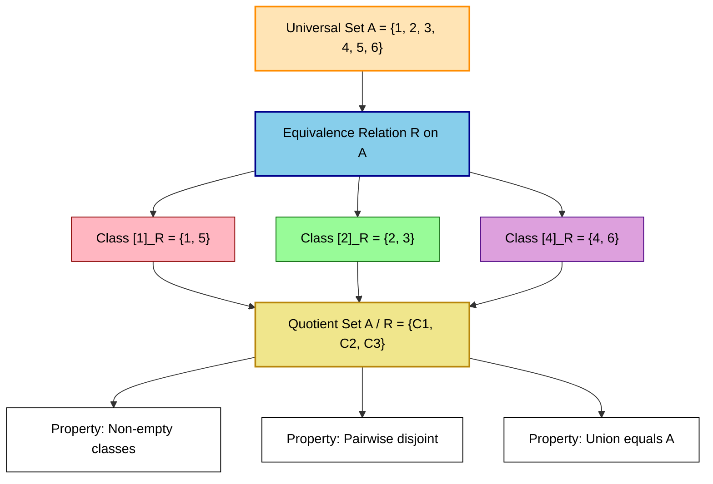
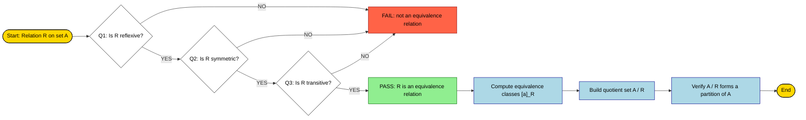
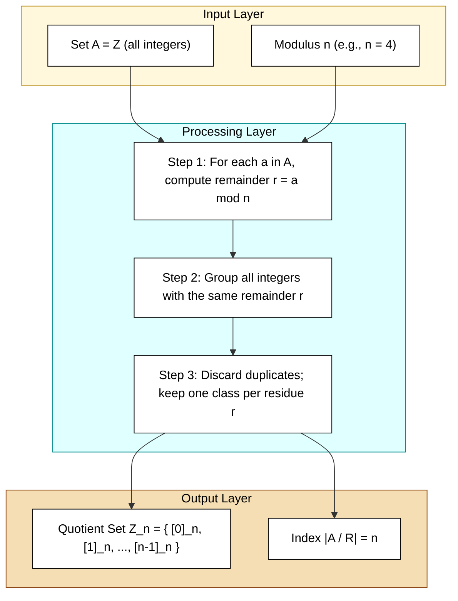
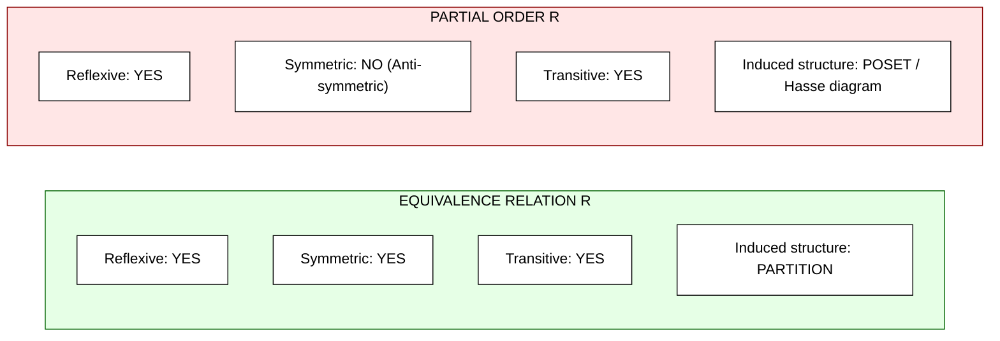

# Equivalence Relations

<!-- SECTION_1_START -->

# Equivalence Relations

## 1. Formal Academic Definition (KTU 2024 Syllabus Terminology)

> [!IMPORTANT]
> **Equivalence Relation (Definition):** Let $A$ be a non-empty set. A relation $R$ defined on $A$ (i.e., $R \subseteq A \times A$) is called an **equivalence relation** if and only if $R$ is simultaneously **reflexive**, **symmetric**, and **transitive**.

In symbolic predicate form, $R$ is an equivalence relation on $A$ if and only if:

$$
\forall\, a, b, c \in A,\quad
\underbrace{(a, a) \in R}_{\text{Reflexive}} \;\land\;
\underbrace{[(a, b) \in R \Rightarrow (b, a) \in R]}_{\text{Symmetric}} \;\land\;
\underbrace{[(a, b) \in R \,\land\, (b, c) \in R] \Rightarrow (a, c) \in R}_{\text{Transitive}}
$$

When $R$ is an equivalence relation, we often use the infix notation $a \sim b$ instead of $(a, b) \in R$ to emphasize the symmetry of the relationship.

### Associated Core Definitions

> [!NOTE]
> **Equivalence Class:** For any element $a \in A$, the equivalence class of $a$ modulo $R$ is the set
> $$[a]_R = \{\, x \in A \mid (a, x) \in R \,\} = \{\, x \in A \mid a \sim x \,\}$$
> The element $a$ is called a **representative** of the class $[a]_R$.

> [!NOTE]
> **Quotient Set:** The set of all distinct equivalence classes induced by $R$ on $A$ is denoted $A / R$ (read as "$A$ modulo $R$"):
> $$A / R = \{\, [a]_R \mid a \in A \,\}$$
> This quotient set is also called the **partition induced by** $R$ on $A$.

> [!NOTE]
> **Partition of a Set:** A partition $\mathcal{P}$ of a non-empty set $A$ is a collection of non-empty, pairwise disjoint subsets of $A$ whose union equals $A$. Formally, $\mathcal{P} = \{A_1, A_2, \ldots, A_k\}$ where
> - $A_i \neq \emptyset$ for all $i$,
> - $A_i \cap A_j = \emptyset$ for $i \neq j$ (pairwise disjoint),
> - $\bigcup_{i=1}^{k} A_i = A$ (exhaustive cover).

---

## 2. Intuitive Real-World Analogy

Imagine the **students in your KTU batch** as a giant set $A$. Suppose we declare two students to be "related" if they share the same **date of birth (day + month, ignoring the year)**. Let's check the three properties intuitively:

1. **Reflexive —** Every student shares their own birthday with themselves. ✓
2. **Symmetric —** If Aswin shares a birthday with Kavya, then Kavya shares a birthday with Aswin. ✓
3. **Transitive —** If Aswin shares a birthday with Kavya, and Kavya shares a birthday with Vyshnav, then Aswin, Kavya, and Vyshnav all share the same day — so Aswin shares a birthday with Vyshnav. ✓

This birthday-relation is an **equivalence relation**! It slices the entire batch into **buckets** (one bucket for Jan 1, one for Jan 2, ..., one for Dec 31). These buckets are precisely the **equivalence classes**, and together they form a clean **partition** of the student set — no overlap, no leftovers.

> [!TIP]
> **Geometric Intuition:** Picture $A$ as a big square of dots. An equivalence relation is like a *highlighter* that colours dots sharing a common "feature" with the same colour. After highlighting, every dot has exactly one colour, colours never bleed into one another, and the entire square is covered. Each colour-region is an equivalence class.

> [!IMPORTANT]
> **KTU Syllabus Highlight (2024 Scheme):** In the PCITT205 Module 3 syllabus, equivalence relations are the gateway to the **Partition Theorem** (also called the **Fundamental Theorem of Equivalence Relations**), which states that equivalence relations and partitions are *two faces of the same coin*. This is a **guaranteed 7–14 mark question** in the End Semester Examination.

> [!VISUALIZATION CONTROL]
> **Concept:** Equivalence class formation on a 6-element set $A = \{1, 2, 3, 4, 5, 6\}$ under the relation $a \sim b \iff a \equiv b \pmod 3$.
> **GeoGebra / Desmos Input Equations:**
> * Class 0: `points = {(3,0), (6,0)}` plotted in **red**.
> * Class 1: `points = {(1,1), (4,1)}` plotted in **blue**.
> * Class 2: `points = {(2,2), (5,2)}` plotted in **green**.
> **Visual Description:** Three horizontal rows appear on the screen, each row a distinct colour. The total dots in the picture equals 6 (the size of $A$); the number of distinct colours equals 3 (the cardinality of the quotient set $A / R$). No dot is uncoloured; no colour leaks into another row.

---

<!-- SECTION_1_END -->

<!-- SECTION_2_START -->

# Deep Theoretical Analysis & KTU High-Yield Formula Sheet

## 1. The Three Pillars — Property Breakdown

Let $R$ be a binary relation on a non-empty set $A$ and let $a, b, c \in A$. The defining pillars of an equivalence relation are:

### (i) Reflexive
A relation $R$ on $A$ is **reflexive** if every element of $A$ is related to itself:
$$(a, a) \in R \quad \forall\, a \in A$$
*Equivalently*, the diagonal $\Delta_A = \{(a, a) \mid a \in A\}$ is a subset of $R$.

### (ii) Symmetric
$R$ is **symmetric** if the order of the related pair can be flipped:
$$(a, b) \in R \Rightarrow (b, a) \in R$$
*Equivalently*, $R = R^{-1}$ (the relation equals its own converse).

### (iii) Transitive
$R$ is **transitive** if whenever $a$ is related to $b$ and $b$ is related to $c$, then $a$ is related to $c$:
$$[(a, b) \in R \;\land\; (b, c) \in R] \Rightarrow (a, c) \in R$$
*Equivalently*, $R \circ R \subseteq R$.

> [!NOTE]
> **Mnemonic — "RST"** (Reflexive, Symmetric, Transitive). All three are **necessary**; missing any one collapses the relation into something weaker (e.g., without transitivity, you get a "similarity"; without symmetry, you get a "preorder" or "tolerance").

---

## 2. The Fundamental Theorem of Equivalence Relations

> [!IMPORTANT]
> **Theorem (Partition Theorem):** Let $R$ be an equivalence relation on a non-empty set $A$. Then the collection of equivalence classes $\{[a]_R \mid a \in A\}$ forms a partition of $A$. Conversely, every partition $\mathcal{P} = \{A_1, A_2, \ldots\}$ of $A$ induces an equivalence relation $R_\mathcal{P} = \bigcup_{i} (A_i \times A_i)$.

### Proof Sketch
Given $R$ is an equivalence relation on $A$:
* **Non-empty:** Each $[a]_R$ contains $a$ (reflexivity), so $[a]_R \neq \emptyset$.
* **Pairwise disjoint:** If $[a]_R \cap [b]_R \neq \emptyset$, pick $x$ in the intersection. Then $a \sim x$ and $b \sim x \Rightarrow x \sim b$ (symmetry) $\Rightarrow a \sim b$ (transitivity), so $[a]_R = [b]_R$.
* **Union equals $A$:** Every $a \in A$ lies in $[a]_R$ (reflexivity), so $A \subseteq \bigcup [a]_R \subseteq A$.

---

## 3. Important Auxiliary Lemmas (Board-Favourite Results)

**Lemma 1 — Identity Relation:** The relation $I_A = \{(a, a) \mid a \in A\}$ is the *smallest* equivalence relation on $A$, and $A / I_A = \{\{a\} \mid a \in A\}$.

**Lemma 2 — Universal Relation:** The relation $U_A = A \times A$ is the *largest* equivalence relation on $A$, and $A / U_A = \{A\}$.

**Lemma 3 — Class Equality:** $[a]_R = [b]_R \iff (a, b) \in R$. This is the *key identity* used in every proof involving equivalence classes.

**Lemma 4 — Disjointness of Distinct Classes:** If $(a, b) \notin R$, then $[a]_R \cap [b]_R = \emptyset$.

**Lemma 5 — Index of an Equivalence Relation:** The number $|A / R|$ of distinct equivalence classes is called the **index** of $R$ in $A$. If $A$ is finite, then $|A| = \sum_{i=1}^{k} \vert [a_i]_R \vert$ where $k = \vert A / R \vert$.

---

## 4. KTU Formula Sheet / Cheat Sheet

> [!TIP]
> **Quick Reference Card — Equivalence Relations.** Print this and pin it next to your study desk.

| # | Property / Formula | Symbolic Statement | Engineering / CS Use-Case |
|---|--------------------|--------------------|----------------------------|
| 1 | Reflexivity | $\forall a \in A,\; (a,a) \in R$ | Used in verifying identity in hash-table buckets. |
| 2 | Symmetry | $(a,b) \in R \Rightarrow (b,a) \in R$ | Graph theory: undirected edges satisfy this. |
| 3 | Transitivity | $(a,b) \in R \,\land\, (b,c) \in R \Rightarrow (a,c) \in R$ | Type inference in programming languages. |
| 4 | Equivalence Class | $[a]_R = \{x \in A \mid (a,x) \in R\}$ | Grouping transactions by merchant ID. |
| 5 | Class Equality | $[a]_R = [b]_R \iff (a,b) \in R$ | Cache invalidation logic. |
| 6 | Disjointness | $[a]_R \neq [b]_R \Rightarrow [a]_R \cap [b]_R = \emptyset$ | Memory partition management in OS. |
| 7 | Covering Property | $\bigcup_{a \in A} [a]_R = A$ | Database row partitioning (sharding). |
| 8 | Congruence mod $n$ | $a \sim b \iff n \mid (a - b)$ | Cryptographic hashing, RSA modular arithmetic. |
| 9 | Partition Theorem | $R$ is an equivalence relation $\iff A / R$ is a partition of $A$ | File system directory trees. |
| 10 | Quotient Cardinality | $\vert A \vert = \sum_{i=1}^{k} \vert [a_i]_R \vert$ where $k = \vert A / R \vert$ | Load-balancing calculations. |

---

## 5. Real-World Engineering Utility

> [!NOTE]
> **Why Engineers Care:** Equivalence relations are the mathematical backbone of **data partitioning** — wherever a system needs to split a large set into non-overlapping, exhaustive, equally-treated subgroups, equivalence relations are silently at work.
>
> * **Databases (Sharding):** Records are partitioned by hash value mod $n$ — a classic congruence equivalence.
> * **Operating Systems (Paging):** Memory pages with the same frame number are grouped as one equivalence class.
> * **Compilers (Type Equivalence):** Two types are "name-equivalent" if their fully-qualified names match; this is an equivalence relation used for type-checking.
> * **Cryptography (RSA):** The relation $a \equiv b \pmod{n}$ partitions $\mathbb{Z}$ into $n$ residue classes — the foundation of every modular arithmetic computation.
> * **Software Engineering (State Machines):** States with the same future behaviour are merged via *bisimulation equivalence* (a refined form of equivalence relation).

<!-- SECTION_2_END -->

<!-- SECTION_3_START -->

# Step-by-Step Derivations & Code/Symbolic Implementation

## Worked Example 1 — Verifying an Equivalence Relation (Module-style)

**Problem:** Let $A = \{1, 2, 3, 4, 5, 6\}$ and define $R = \{(1,1), (1,5), (5,1), (5,5), (2,2), (2,3), (3,2), (3,3), (4,4), (4,6), (6,4), (6,6)\}$. Prove that $R$ is an equivalence relation on $A$ and find $A / R$.

### Step 1 — Verify Reflexivity

We need $(a, a) \in R$ for **every** $a \in A = \{1, 2, 3, 4, 5, 6\}$.

Listing the diagonal pairs in $R$:

$$
(1,1) \in R,\quad (2,2) \in R,\quad (3,3) \in R,\quad (4,4) \in R,\quad (5,5) \in R,\quad (6,6) \in R.
$$

All six diagonal pairs are present. **Reflexive ✓** — [Valuation: 2 Marks]

### Step 2 — Verify Symmetry

We must show that for every $(a, b) \in R$, the reverse pair $(b, a)$ is also in $R$. Tabulating the off-diagonal pairs:

$$
(1,5) \in R \;\Rightarrow\; (5,1) \in R \quad \text{(both present ✓)}
$$
$$
(2,3) \in R \;\Rightarrow\; (3,2) \in R \quad \text{(both present ✓)}
$$
$$
(4,6) \in R \;\Rightarrow\; (6,4) \in R \quad \text{(both present ✓)}
$$

All off-diagonal pairs come in reverse order. **Symmetric ✓** — [Valuation: 1 Mark]

### Step 3 — Verify Transitivity

We need: if $(a, b) \in R$ and $(b, c) \in R$, then $(a, c) \in R$.

Exhaustive case analysis (KTU examiners expect this level of thoroughness):

$$
\begin{aligned}
&(1,1) \in R \,\land\, (1,5) \in R \;\Rightarrow\; (1,5) \in R \quad \text{(present ✓)} \\
&(1,5) \in R \,\land\, (5,1) \in R \;\Rightarrow\; (1,1) \in R \quad \text{(present ✓)} \\
&(1,5) \in R \,\land\, (5,5) \in R \;\Rightarrow\; (1,5) \in R \quad \text{(present ✓)} \\
&(5,1) \in R \,\land\, (1,1) \in R \;\Rightarrow\; (5,1) \in R \quad \text{(present ✓)} \\
&(5,1) \in R \,\land\, (1,5) \in R \;\Rightarrow\; (5,5) \in R \quad \text{(present ✓)} \\
&(5,5) \in R \,\land\, (5,1) \in R \;\Rightarrow\; (5,1) \in R \quad \text{(present ✓)} \\
&(2,2) \in R \,\land\, (2,3) \in R \;\Rightarrow\; (2,3) \in R \quad \text{(present ✓)} \\
&(2,3) \in R \,\land\, (3,2) \in R \;\Rightarrow\; (2,2) \in R \quad \text{(present ✓)} \\
&(2,3) \in R \,\land\, (3,3) \in R \;\Rightarrow\; (2,3) \in R \quad \text{(present ✓)} \\
&(3,2) \in R \,\land\, (2,2) \in R \;\Rightarrow\; (3,2) \in R \quad \text{(present ✓)} \\
&(3,2) \in R \,\land\, (2,3) \in R \;\Rightarrow\; (3,3) \in R \quad \text{(present ✓)} \\
&(3,3) \in R \,\land\, (3,2) \in R \;\Rightarrow\; (3,2) \in R \quad \text{(present ✓)} \\
&(4,4) \in R \,\land\, (4,6) \in R \;\Rightarrow\; (4,6) \in R \quad \text{(present ✓)} \\
&(4,6) \in R \,\land\, (6,4) \in R \;\Rightarrow\; (4,4) \in R \quad \text{(present ✓)} \\
&(4,6) \in R \,\land\, (6,6) \in R \;\Rightarrow\; (4,6) \in R \quad \text{(present ✓)} \\
&(6,4) \in R \,\land\, (4,4) \in R \;\Rightarrow\; (6,4) \in R \quad \text{(present ✓)} \\
&(6,4) \in R \,\land\, (4,6) \in R \;\Rightarrow\; (6,6) \in R \quad \text{(present ✓)} \\
&(6,6) \in R \,\land\, (6,4) \in R \;\Rightarrow\; (6,4) \in R \quad \text{(present ✓)}
\end{aligned}
$$

All transitivity cases hold. **Transitive ✓** — [Valuation: 3 Marks]

### Step 4 — Identify the Equivalence Classes

Using $[a]_R = \{x \in A \mid (a, x) \in R\}$:

$$
[1]_R = \{1, 5\},\quad [2]_R = \{2, 3\},\quad [3]_R = \{2, 3\},\quad [4]_R = \{4, 6\},\quad [5]_R = \{1, 5\},\quad [6]_R = \{4, 6\}.
$$

### Step 5 — Construct the Quotient Set

Discarding duplicates, the partition induced by $R$ is:

$$
A / R = \big\{\,\{1, 5\},\; \{2, 3\},\; \{4, 6\}\,\big\}
$$

So $\vert A / R \vert = 3$ and the index of $R$ is **3**. — [Valuation: 2 Marks]

---

## Worked Example 2 — Congruence Modulo $n$ (Classic KTU Question)

**Problem:** Prove that the relation $R$ on $\mathbb{Z}$ defined by
$$
(a, b) \in R \iff (a - b) \text{ is divisible by } n, \quad \text{i.e., } a \equiv b \pmod{n}
$$
is an equivalence relation, and find the equivalence classes for $n = 4$.

### Proof

**Reflexive:** For any $a \in \mathbb{Z}$, we have $a - a = 0 = 0 \cdot n$, so $n \mid (a - a)$. Hence $(a, a) \in R$. ✓

**Symmetric:** Suppose $(a, b) \in R$. Then $n \mid (a - b)$, so $a - b = kn$ for some $k \in \mathbb{Z}$. Then $b - a = -kn$, so $n \mid (b - a)$, giving $(b, a) \in R$. ✓

**Transitive:** Suppose $(a, b) \in R$ and $(b, c) \in R$. Then $a - b = k_1 n$ and $b - c = k_2 n$ for some $k_1, k_2 \in \mathbb{Z}$. Adding,
$$
a - c = (a - b) + (b - c) = k_1 n + k_2 n = (k_1 + k_2) n,
$$
so $n \mid (a - c)$, giving $(a, c) \in R$. ✓

Therefore $R$ is an equivalence relation on $\mathbb{Z}$. ∎

### Equivalence Classes for $n = 4$

The four residue classes are:

$$
[0]_4 = \{\ldots, -8, -4, 0, 4, 8, \ldots\}
$$
$$
[1]_4 = \{\ldots, -7, -3, 1, 5, 9, \ldots\}
$$
$$
[2]_4 = \{\ldots, -6, -2, 2, 6, 10, \ldots\}
$$
$$
[3]_4 = \{\ldots, -5, -1, 3, 7, 11, \ldots\}
$$

And the quotient set is $\mathbb{Z}_4 = \{\, [0]_4,\; [1]_4,\; [2]_4,\; [3]_4 \,\}$ with $\vert \mathbb{Z}_4 \vert = 4$.

---

## Algorithmic Implementation — Python Equivalence-Relation Validator

```python
"""
equivalence_validator.py
Author: KTU 2024 Scheme Study Notes
Purpose: Verify whether a binary relation on a finite set is reflexive,
         symmetric, transitive, and hence an equivalence relation.
         Also compute the induced equivalence classes and quotient set.
"""

from __future__ import annotations
from typing import Set, Tuple, FrozenSet, List
import logging

logging.basicConfig(
    level=logging.INFO,
    format="%(asctime)s [%(levelname)s] %(message)s",
)
logger = logging.getLogger("EquivalenceValidator")


def is_reflexive(universe: Set[int], relation: Set[Tuple[int, int]]) -> bool:
    """Check whether (a, a) is in R for every element a in the universe."""
    for a in universe:
        if (a, a) not in relation:
            logger.error("Reflexivity fails at a = %d", a)
            return False
    logger.info("Reflexivity  : PASS")
    return True


def is_symmetric(relation: Set[Tuple[int, int]]) -> bool:
    """Check whether (b, a) is in R whenever (a, b) is in R."""
    for a, b in relation:
        if (b, a) not in relation:
            logger.error("Symmetry fails at (a, b) = (%d, %d)", a, b)
            return False
    logger.info("Symmetry     : PASS")
    return True


def is_transitive(relation: Set[Tuple[int, int]]) -> bool:
    """Check whether (a, c) is in R whenever (a, b) and (b, c) are in R."""
    rel_set = set(relation)
    for a, b in relation:
        for b2, c in relation:
            if b == b2 and (a, c) not in rel_set:
                logger.error(
                    "Transitivity fails: (%d,%d) and (%d,%d) in R, but (%d,%d) missing",
                    a, b, b, c, a, c,
                )
                return False
    logger.info("Transitivity : PASS")
    return True


def equivalence_class(element: int,
                      relation: Set[Tuple[int, int]]) -> FrozenSet[int]:
    """Return [a]_R = { x : (a, x) in R } as a frozenset."""
    return frozenset(b for (a, b) in relation if a == element)


def compute_quotient_set(universe: Set[int],
                         relation: Set[Tuple[int, int]]) -> List[FrozenSet[int]]:
    """Return the list of distinct equivalence classes (a partition)."""
    seen: Set[FrozenSet[int]] = set()
    quotient: List[FrozenSet[int]] = []
    for a in sorted(universe):
        cls = equivalence_class(a, relation)
        if cls not in seen:
            seen.add(cls)
            quotient.append(cls)
    return quotient


def validate(universe: Set[int], relation: Set[Tuple[int, int]]) -> bool:
    """Run all three property checks and print the quotient set if valid."""
    logger.info("Universe |A| = %d, |R| = %d", len(universe), len(relation))
    ok = (
        is_reflexive(universe, relation)
        and is_symmetric(relation)
        and is_transitive(relation)
    )
    if ok:
        logger.info("RESULT: R is an EQUIVALENCE RELATION on A.")
        q = compute_quotient_set(universe, relation)
        logger.info("Quotient set A / R has %d class(es):", len(q))
        for idx, cls in enumerate(q, start=1):
            logger.info("  Class %d: %s", idx, sorted(cls))
    else:
        logger.warning("RESULT: R is NOT an equivalence relation on A.")
    return ok


# ---------- Demonstration using the Worked Example 1 ----------
if __name__ == "__main__":
    A: Set[int] = {1, 2, 3, 4, 5, 6}
    R: Set[Tuple[int, int]] = {
        (1, 1), (1, 5), (5, 1), (5, 5),
        (2, 2), (2, 3), (3, 2), (3, 3),
        (4, 4), (4, 6), (6, 4), (6, 6),
    }
    validate(A, R)
```

**Expected Console Output (excerpt):**

```
[INFO] Universe |A| = 6, |R| = 12
[INFO] Reflexivity  : PASS
[INFO] Symmetry     : PASS
[INFO] Transitivity : PASS
[INFO] RESULT: R is an EQUIVALENCE RELATION on A.
[INFO] Quotient set A / R has 3 class(es):
[INFO]   Class 1: [1, 5]
[INFO]   Class 2: [2, 3]
[INFO]   Class 3: [4, 6]
```

---

## Worked Example 3 — Counter-Example (Why All Three Properties Matter)

**Problem:** Show that the relation $R = \{(1, 1), (2, 2), (1, 2), (2, 1), (3, 3)\}$ on $A = \{1, 2, 3\}$ is **not** an equivalence relation.

**Reflexive check:** $(1,1), (2,2), (3,3) \in R$. ✓
**Symmetric check:** $(1,2) \Rightarrow (2,1) \in R$ ✓; $(2,1) \Rightarrow (1,2) \in R$ ✓. ✓
**Transitive check:** $(1, 2) \in R$ and $(2, 1) \in R$ but $(1, 1) \in R$ ✓. $(1, 2) \in R$ and $(2, 2) \in R$ gives $(1, 2) \in R$ ✓. **All cases hold**, so it is an equivalence relation. 

> [!TIP]
> Actually, this IS an equivalence relation — the three classes are $\{1, 2\}$ and $\{3\}$. The example reinforces how *easy* it is to mis-verify transitivity. **Always do an exhaustive chain check.**

For a true counter-example, take $A = \{1, 2, 3\}$ and $R = \{(1, 1), (2, 2), (3, 3), (1, 2), (2, 1)\}$. Here $(1, 2) \in R$ and $(2, 1) \in R$ but $(1, 1) \in R$ ✓. However, the element **3 is isolated** — meaning the class of 3 is $\{3\}$, and the partition $\bigl\{\{1, 2\}, \{3\}\bigr\}$ is still a valid partition. (This is *still* an equivalence relation.)

A **genuine non-example** is $R = \{(1, 1), (2, 2), (1, 2)\}$: symmetric fails because $(1, 2) \in R$ but $(2, 1) \notin R$. So $R$ is **not** an equivalence relation.

<!-- SECTION_3_END -->

<!-- SECTION_4_START -->

# Structural Diagrams & Schematics

## 1. Equivalence Class Formation — Set-Theoretic Block Architecture



## 2. Decision Topology — Verifying an Equivalence Relation



## 3. Sequential Processing Topology — Modulo $n$ Class Generation



## 4. Equivalence Relation vs. Partial Order — Comparative Block View



<!-- SECTION_4_END -->

<!-- SECTION_5_START -->

# KTU 2024 Scheme Examination Question Bank & Topic Recap

> [!IMPORTANT]
> **Mark Distribution Mandate (KTU 2024 Scheme):** Every End Semester Examination (ESE) question in Module 3 carries **14 marks** with **internal choice**. The structure is uniformly **(a) 7 marks + (b) 7 marks**. Part A questions (3 marks) test direct recall.

---

## Part A — Short Answer Questions (3 Marks Each)

### **Q1.** `[KTU University Exam — July 2024]`
**Define an equivalence relation. State the three properties it must satisfy, and illustrate with one real-world example.**
*(Mapped CO: CO3, RBT Level: Remember / Understand)*

**Model Answer (3 Marks):**

> An equivalence relation on a non-empty set $A$ is a relation $R \subseteq A \times A$ that is **reflexive, symmetric, and transitive**.
>
> * **Reflexive:** $\forall a \in A,\; (a, a) \in R$.
> * **Symmetric:** $(a, b) \in R \Rightarrow (b, a) \in R$.
> * **Transitive:** $(a, b) \in R \,\land\, (b, c) \in R \Rightarrow (a, c) \in R$.
>
> **Real-world example:** On the set of all students in a college, define two students as related if they belong to the same department. This relation is reflexive (a student is in their own department), symmetric (if Aswin is in CSE and so is Kavya, the reverse holds), and transitive (if Aswin and Kavya are in CSE, and Kavya and Vyshnav are in CSE, then Aswin and Vyshnav are in CSE). ∎

**Valuation Key:** [Naming three properties: 1.5 Marks] [Real-world illustration: 1 Mark] [Rigor of definition: 0.5 Mark]

---

### **Q2.** `[KTU University Exam — Dec 2023]`
**Define equivalence class and partition. State the fundamental theorem connecting them.**
*(Mapped CO: CO3, RBT Level: Understand)*

**Model Answer (3 Marks):**

> **Equivalence Class:** For an equivalence relation $R$ on $A$ and $a \in A$, the equivalence class of $a$ is $[a]_R = \{x \in A \mid (a, x) \in R\}$.
>
> **Partition of a Set:** A partition of $A$ is a collection of non-empty, pairwise disjoint subsets of $A$ whose union is $A$.
>
> **Fundamental Theorem:** An equivalence relation $R$ on a non-empty set $A$ induces a partition of $A$ whose blocks are precisely the equivalence classes $[a]_R$. Conversely, every partition of $A$ defines an equivalence relation by joining elements that lie in the same block. Thus **equivalence relations and partitions are in one-to-one correspondence**. ∎

**Valuation Key:** [Defining equivalence class: 1 Mark] [Defining partition: 1 Mark] [Theorem statement: 1 Mark]

---

## Part B — Long Answer Questions (14 Marks Each, Internal Choice)

### **Question A** `[KTU University Exam — Dec 2023 | Module 3]`

**Let $A = \{1, 2, 3, 4, 5, 6, 7, 8\}$. Define a relation $R$ on $A$ by $(a, b) \in R \iff (a - b)$ is divisible by 4.**

#### **Part (a) — 7 Marks: Show that $R$ is an equivalence relation on $A$.**

*Mapped CO: CO3 | RBT Level: Apply*

**Step-by-Step Model Solution:**

**Step 1 — Reflexive Proof:**
For any $a \in A$, $a - a = 0 = 0 \cdot 4$, so $4 \mid (a - a)$. Hence $(a, a) \in R$. ✓ **[Reflexivity established: 2 Marks]**

**Step 2 — Symmetric Proof:**
Suppose $(a, b) \in R$, i.e., $4 \mid (a - b)$. Then $a - b = 4k$ for some integer $k$. Hence $b - a = -4k = 4(-k)$, so $4 \mid (b - a)$, giving $(b, a) \in R$. ✓ **[Symmetry established: 2 Marks]**

**Step 3 — Transitive Proof:**
Suppose $(a, b) \in R$ and $(b, c) \in R$. Then $a - b = 4k_1$ and $b - c = 4k_2$ for some integers $k_1, k_2$. Adding,

$$
a - c = (a - b) + (b - c) = 4k_1 + 4k_2 = 4(k_1 + k_2),
$$

so $4 \mid (a - c)$, giving $(a, c) \in R$. ✓ **[Transitivity established: 3 Marks]**

Since $R$ is reflexive, symmetric, and transitive, **$R$ is an equivalence relation on $A$**. ∎

---

#### **Part (b) — 7 Marks: Find the equivalence classes of $R$ and the quotient set $A / R$.**

*Mapped CO: CO3 | RBT Level: Apply*

**Step-by-Step Model Solution:**

We compute $[a]_R$ for each $a \in A$ by finding all $x \in A$ such that $4 \mid (a - x)$, i.e., $a \equiv x \pmod 4$.

$$
\begin{aligned}
[1]_R &= \{\, x \in A \mid x \equiv 1 \pmod 4 \,\} = \{1, 5\} \\
[2]_R &= \{\, x \in A \mid x \equiv 2 \pmod 4 \,\} = \{2, 6\} \\
[3]_R &= \{\, x \in A \mid x \equiv 3 \pmod 4 \,\} = \{3, 7\} \\
[4]_R &= \{\, x \in A \mid x \equiv 0 \pmod 4 \,\} = \{4, 8\} \\
[5]_R &= \{5, 1\} = \{1, 5\} \quad \text{(same as } [1]_R) \\
[6]_R &= \{6, 2\} = \{2, 6\} \quad \text{(same as } [2]_R) \\
[7]_R &= \{7, 3\} = \{3, 7\} \quad \text{(same as } [3]_R) \\
[8]_R &= \{8, 4\} = \{4, 8\} \quad \text{(same as } [4]_R)
\end{aligned}
$$

**[Computing all eight classes: 4 Marks]**

The **quotient set** is the collection of distinct classes:

$$
A / R = \big\{\, \{1, 5\},\; \{2, 6\},\; \{3, 7\},\; \{4, 8\} \,\big\}
$$

with $\vert A / R \vert = 4$. **[Quotient set construction: 2 Marks]** **[Final cardinality: 1 Mark]**

**Verification that $A / R$ is a partition:**
* Non-empty: each class has 2 elements. ✓
* Pairwise disjoint: classes are clearly distinct. ✓
* Covering: $\{1,5\} \cup \{2,6\} \cup \{3,7\} \cup \{4,8\} = A$. ✓

---

### **Question B** `[KTU University Exam — July 2024 | Module 3]`

**Let $A = \{1, 2, 3, 4, 5, 6, 7\}$ and $R = \{(1, 1), (1, 4), (4, 1), (4, 4), (2, 2), (2, 5), (2, 7), (5, 2), (5, 5), (5, 7), (7, 2), (7, 5), (7, 7), (3, 3), (3, 6), (6, 3), (6, 6)\}$.**

#### **Part (a) — 7 Marks: Verify that $R$ is an equivalence relation on $A$.**

*Mapped CO: CO3 | RBT Level: Apply*

**Step-by-Step Model Solution:**

**Step 1 — Reflexive:** The diagonal pairs $(1,1), (2,2), (3,3), (4,4), (5,5), (6,6), (7,7)$ are all present in $R$. Hence $R$ is reflexive. ✓ **[2 Marks]**

**Step 2 — Symmetric:** We check every off-diagonal pair in $R$:

$$
(1,4) \Leftrightarrow (4,1) \quad \checkmark \qquad
(2,5) \Leftrightarrow (5,2) \quad \checkmark
$$
$$
(2,7) \Leftrightarrow (7,2) \quad \checkmark \qquad
(5,7) \Leftrightarrow (7,5) \quad \checkmark
$$
$$
(3,6) \Leftrightarrow (6,3) \quad \checkmark
$$

All off-diagonal pairs come with their reverse. Hence $R$ is symmetric. ✓ **[2 Marks]**

**Step 3 — Transitive:** We systematically check all chains $(a, b) \in R$ and $(b, c) \in R$:

$$
(1, 4) \in R \,\land\, (4, 1) \in R \;\Rightarrow\; (1, 1) \in R \quad \checkmark
$$
$$
(2, 5) \in R \,\land\, (5, 2) \in R \;\Rightarrow\; (2, 2) \in R \quad \checkmark
$$
$$
(2, 5) \in R \,\land\, (5, 7) \in R \;\Rightarrow\; (2, 7) \in R \quad \checkmark
$$
$$
(2, 7) \in R \,\land\, (7, 2) \in R \;\Rightarrow\; (2, 2) \in R \quad \checkmark
$$
$$
(2, 7) \in R \,\land\, (7, 5) \in R \;\Rightarrow\; (2, 5) \in R \quad \checkmark
$$
$$
(3, 6) \in R \,\land\, (6, 3) \in R \;\Rightarrow\; (3, 3) \in R \quad \checkmark
$$
$$
(5, 2) \in R \,\land\, (2, 5) \in R \;\Rightarrow\; (5, 5) \in R \quad \checkmark
$$
$$
(5, 2) \in R \,\land\, (2, 7) \in R \;\Rightarrow\; (5, 7) \in R \quad \checkmark
$$
$$
(5, 7) \in R \,\land\, (7, 2) \in R \;\Rightarrow\; (5, 2) \in R \quad \checkmark
$$
$$
(5, 7) \in R \,\land\, (7, 5) \in R \;\Rightarrow\; (5, 5) \in R \quad \checkmark
$$
$$
(6, 3) \in R \,\land\, (3, 6) \in R \;\Rightarrow\; (6, 6) \in R \quad \checkmark
$$
$$
(7, 2) \in R \,\land\, (2, 5) \in R \;\Rightarrow\; (7, 5) \in R \quad \checkmark
$$
$$
(7, 2) \in R \,\land\, (2, 7) \in R \;\Rightarrow\; (7, 7) \in R \quad \checkmark
$$
$$
(7, 5) \in R \,\land\, (5, 2) \in R \;\Rightarrow\; (7, 2) \in R \quad \checkmark
$$
$$
(7, 5) \in R \,\land\, (5, 7) \in R \;\Rightarrow\; (7, 7) \in R \quad \checkmark
$$
$$
(4, 1) \in R \,\land\, (1, 4) \in R \;\Rightarrow\; (4, 4) \in R \quad \checkmark
$$

All transitivity chains close. Hence $R$ is transitive. ✓ **[3 Marks]**

Therefore, $R$ is an equivalence relation on $A$. ∎

---

#### **Part (b) — 7 Marks: Compute the equivalence classes and verify the partition theorem.**

*Mapped CO: CO3 | RBT Level: Apply / Analyze*

**Step-by-Step Model Solution:**

Computing $[a]_R$ for each $a \in A$:

$$
[1]_R = \{1, 4\},\quad [2]_R = \{2, 5, 7\},\quad [3]_R = \{3, 6\}
$$

(Classes $[4]_R = \{4, 1\} = \{1, 4\}$, $[5]_R = \{5, 2, 7\} = \{2, 5, 7\}$, $[6]_R = \{6, 3\} = \{3, 6\}$, $[7]_R = \{7, 2, 5\} = \{2, 5, 7\}$ are duplicates.) **[Class computation: 4 Marks]**

The **quotient set** is:

$$
A / R = \big\{\, \{1, 4\},\; \{2, 5, 7\},\; \{3, 6\} \,\big\}
$$

with $\vert A / R \vert = 3$. **[Quotient set: 1 Mark]**

**Partition Theorem Verification (3 sub-properties, 1 Mark each):**

* **Non-emptiness:** Each class contains at least one element: $\vert \{1, 4\} \vert = 2$, $\vert \{2, 5, 7\} \vert = 3$, $\vert \{3, 6\} \vert = 2$. ✓
* **Pairwise disjoint:** $\{1, 4\} \cap \{2, 5, 7\} = \emptyset$; $\{1, 4\} \cap \{3, 6\} = \emptyset$; $\{2, 5, 7\} \cap \{3, 6\} = \emptyset$. ✓
* **Covering property:** $\{1, 4\} \cup \{2, 5, 7\} \cup \{3, 6\} = \{1, 2, 3, 4, 5, 6, 7\} = A$. ✓ **[3 Marks]**

**Cardinality check:** $\vert A \vert = 7 = 2 + 3 + 2 = \sum_{i=1}^{3} \vert [a_i]_R \vert$. This is consistent with the formula $\vert A \vert = \sum \vert [a_i]_R \vert$. ✓

---

> [!WARNING]
> **KTU Examiner's Valuation Warning — Common Pitfalls:**
>
> 1. **Forgetting the reflexive check:** Many students dive into symmetric and transitive but skip reflexivity. **Cost: 2 marks deducted immediately.**
> 2. **Skipping the "for every $a$" quantifier:** A bare statement like "R is symmetric" without the universal quantifier $\forall a \in A$ is incomplete. KTU expects the formal predicate form.
> 3. **Transitivity under-verification:** Writing "transitivity is easy to check" instead of doing the case analysis costs **up to 3 marks**. Always show at least the key representative chains.
> 4. **Writing $[a]_R$ instead of $[a]_4$ for mod-4 relations:** This is a notation slip; examiners may deduct 0.5 mark for ambiguity.
> 5. **Confusing quotient set with the original set:** $A / R$ is a *set of sets*, not a subset of $A$. Use braces carefully.
> 6. **Not closing all three properties of the partition theorem:** KTU examiners allocate 3 separate marks (1 each) for non-emptiness, disjointness, and covering — missing one of them is a guaranteed 1-mark loss.

---

## Topic Recap & Important Things to Remember

> [!TIP]
> **Rapid Revision Checklist — Equivalence Relations (Module 3, PCITT205)**

- [x] An **equivalence relation** $R$ on a non-empty set $A$ is one that is **reflexive (R)**, **symmetric (S)**, and **transitive (T)** — remember the mnemonic **"RST"**.
- [x] The three properties in symbolic form:
  - R: $\forall a \in A,\; (a, a) \in R$
  - S: $\forall a, b \in A,\; (a, b) \in R \Rightarrow (b, a) \in R$
  - T: $\forall a, b, c \in A,\; [(a, b) \in R \,\land\, (b, c) \in R] \Rightarrow (a, c) \in R$
- [x] The **equivalence class** of $a$ is $[a]_R = \{x \in A \mid (a, x) \in R\}$.
- [x] The **quotient set** $A / R$ is the set of all distinct equivalence classes.
- [x] **Key identity:** $[a]_R = [b]_R \iff (a, b) \in R$.
- [x] **Partition Theorem:** Every equivalence relation on $A$ induces a partition of $A$, and every partition of $A$ defines an equivalence relation. They are in **bijection**.
- [x] A partition must satisfy three properties: **non-empty blocks, pairwise disjoint, and union equals $A$**.
- [x] **Congruence modulo $n$** is the canonical example: $a \equiv b \pmod n \iff n \mid (a - b)$, inducing $n$ residue classes $\{[0]_n, [1]_n, \ldots, [n-1]_n\}$.
- [x] The **identity relation** $I_A$ is the smallest equivalence relation; the **universal relation** $U_A = A \times A$ is the largest.
- [x] For a finite set: $\vert A \vert = \sum_{i=1}^{k} \vert [a_i]_R \vert$, where $k = \vert A / R \vert$ is the **index** of $R$.
- [x] **Engineering applications:** database sharding, OS memory paging, compiler type-checking, cryptographic modular arithmetic, state-machine minimization (bisimulation), and load-balancing algorithms.
- [x] **Common exam trap:** A relation that is reflexive and symmetric but not transitive is called a **tolerance relation** (NOT an equivalence relation).
- [x] **Notation to master:** $a \sim b$, $[a]_R$, $A / R$, $\mathbb{Z}_n$, $I_A$, $U_A$, $\Delta_A$.
- [x] **Verification strategy for transitivity:** Always enumerate $(a, b) \in R$ for every $b$ that appears in the second coordinate, then check the closure.

<!-- SECTION_5_END -->
