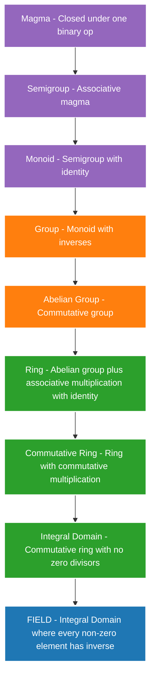
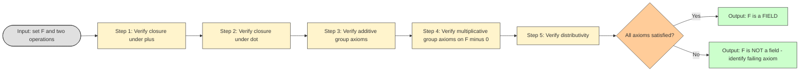

# Fields

<!-- SECTION_1_START -->

# FIELDS - Core Technical Definition & Intuitive Overview

## 1.1 Formal Academic Definition (KTU 2024 Syllabus)

> [!IMPORTANT]
> **Definition (Field):** A **Field** is a non-empty set $F$ equipped with two binary operations, commonly called **addition** ($+$) and **multiplication** ($\cdot$), such that the following axioms are satisfied:

A structure $(F, +, \cdot)$ is a **Field** if and only if:

1. **Closure under Addition:** $\forall\, a, b \in F \Rightarrow (a + b) \in F$
2. **Closure under Multiplication:** $\forall\, a, b \in F \Rightarrow (a \cdot b) \in F$
3. **Associativity of Addition:** $\forall\, a, b, c \in F \Rightarrow (a + b) + c = a + (b + c)$
4. **Associativity of Multiplication:** $\forall\, a, b, c \in F \Rightarrow (a \cdot b) \cdot c = a \cdot (b \cdot c)$
5. **Additive Identity:** $\exists\, 0 \in F$ such that $a + 0 = 0 + a = a,\ \forall\, a \in F$
6. **Multiplicative Identity:** $\exists\, 1 \in F,\ 1 \neq 0$ such that $a \cdot 1 = 1 \cdot a = a,\ \forall\, a \in F$
7. **Additive Inverse:** $\forall\, a \in F,\ \exists\, (-a) \in F$ such that $a + (-a) = 0$
8. **Multiplicative Inverse:** $\forall\, a \in F,\ a \neq 0,\ \exists\, a^{-1} \in F$ such that $a \cdot a^{-1} = 1$
9. **Commutativity of Addition:** $\forall\, a, b \in F \Rightarrow a + b = b + a$
10. **Commutativity of Multiplication:** $\forall\, a, b \in F \Rightarrow a \cdot b = b \cdot a$
11. **Distributivity:** $\forall\, a, b, c \in F \Rightarrow a \cdot (b + c) = (a \cdot b) + (a \cdot c)$

> [!NOTE]
> **KTU 2024 Scheme Highlight:** The conditions 1–5 and 7 and 9 collectively make $(F, +)$ an **Abelian Group**. The conditions 1, 2, 4, 6, 8, 10 make $(F \setminus \{0\}, \cdot)$ an **Abelian Group**. Axiom 11 (Distributivity) links both operations.

## 1.2 Conceptual Analogy / Intuitive Overview

> [!TIP]
> **Plain-English Analogy:** Think of a **Field** as a "**perfect arithmetic playground**". Imagine a closed, magical island where you can add, subtract, multiply, and even **divide any two residents** (except dividing by zero — the island has a "forbidden citizen" called zero). The island has special citizens: a **neutralizer for addition** (called zero) and a **neutralizer for multiplication** (called one). Every resident has a twin: an **additive inverse** that "cancels" them out under addition, and (except for zero) a **multiplicative inverse** that "cancels" them out under multiplication. The two operations also cooperate with each other through the **distributive law** — multiplication "distributes" over addition, just like handing out cookies to kids in two separate groups still gives each kid the same number of cookies.

**Geometric Intuition:** If $\mathbb{Z}$ (integers) is a "one-way street" — you can go forward and backward but you cannot always divide — then a **Field** is a "**complete two-way highway system**" where every journey (operation) has a return trip (inverse), and the entire system is closed (you never leave the highway).

## 1.3 Standard Examples of Fields (KTU-Frequently Asked)

| Field Name | Set $F$ | Addition $+$ | Multiplication $\cdot$ | Field? |
|------------|---------|--------------|------------------------|--------|
| Real Numbers | $\mathbb{R}$ | Standard real addition | Standard real multiplication | **Yes** |
| Rational Numbers | $\mathbb{Q}$ | Standard fraction addition | Standard fraction multiplication | **Yes** |
| Complex Numbers | $\mathbb{C}$ | $(a+bi)+(c+di)$ | $(a+bi)(c+di)$ | **Yes** |
| Integers | $\mathbb{Z}$ | Standard integer addition | Standard integer multiplication | **No** (no multiplicative inverse for $2$, $3$, etc.) |
| Modulo $p$ field | $\mathbb{Z}_p$ where $p$ is prime | $(a+b) \bmod p$ | $(a \cdot b) \bmod p$ | **Yes** (only if $p$ is prime) |
| Modulo $n$ ring | $\mathbb{Z}_n$ where $n$ is composite | $(a+b) \bmod n$ | $(a \cdot b) \bmod n$ | **No** (e.g., in $\mathbb{Z}_6$, $2$ has no inverse) |

> [!WARNING]
> **Critical Pitfall:** $\mathbb{Z}_n$ is a **Field** if and only if $n$ is a **prime number**. If $n$ is composite, $\mathbb{Z}_n$ is a **Ring with Zero Divisors**, NOT a field. Example: In $\mathbb{Z}_6$, the element $2$ has no multiplicative inverse because $\gcd(2, 6) = 2 \neq 1$.

<!-- SECTION_1_END -->

<!-- SECTION_2_START -->

# Deep Theoretical Analysis & KTU High-Yield Formula Sheet

## 2.1 Decomposition of Field Axioms (Structured Logic)

A **Field** is essentially a **Ring** with two extra stringent requirements. Let us logically break it down:

### Step 1: The Additive Structure $(F, +)$ — Must be an Abelian Group

- **Closure:** Adding any two elements yields a member of $F$.
- **Associativity:** Order of grouping in sums does not matter.
- **Identity (Zero):** A unique element $0$ acts as a "do-nothing" element.
- **Inverse (Negation):** Every $a$ has a partner $-a$ that neutralizes it.
- **Commutativity:** Order of addition does not matter.

### Step 2: The Multiplicative Structure $(F \setminus \{0\}, \cdot)$ — Must be an Abelian Group

- **Closure (Multiplicative):** Multiplying any two non-zero elements yields a non-zero member of $F$.
- **Associativity:** Order of grouping in products does not matter.
- **Identity (Unity):** A unique element $1$ acts as a "do-nothing" element.
- **Inverse:** Every $a \neq 0$ has a reciprocal $a^{-1}$.
- **Commutativity:** Order of multiplication does not matter.

### Step 3: The Distributive Bridge

- **Distributivity:** Multiplication "distributes" over addition. This is the **only** axiom that couples the two operations.

> [!IMPORTANT]
> **Why "Why" matters:** The set of integers $\mathbb{Z}$ satisfies the additive group axioms but **fails** the multiplicative inverse axiom (e.g., $2$ has no integer reciprocal). Hence $\mathbb{Z}$ is an **Integral Domain** but **NOT** a Field. The integers "miss" being a field only because division is not always closed.

## 2.2 Properties & Theorems Derived from Field Axioms

Let $(F, +, \cdot)$ be a field. The following properties hold universally:

1. **Uniqueness of Additive Identity:** There is exactly one zero element.
2. **Uniqueness of Multiplicative Identity:** There is exactly one unit element.
3. **Uniqueness of Inverses:** Each element has exactly one additive inverse and exactly one multiplicative inverse.
4. **Cancellation Law (Addition):** If $a + c = b + c$, then $a = b$.
5. **Cancellation Law (Multiplication):** If $a \cdot c = b \cdot c$ and $c \neq 0$, then $a = b$.
6. **Zero Product Property:** If $a \cdot b = 0$, then $a = 0$ or $b = 0$ (No Zero Divisors).
7. **Negation Rule:** $-(-a) = a$ and $-(a+b) = (-a) + (-b)$.
8. **Multiplicative Property of Negation:** $a \cdot 0 = 0$.
9. **Inverse of Product:** $(a \cdot b)^{-1} = a^{-1} \cdot b^{-1}$.
10. **Char$(F)$ Property:** The smallest positive integer $n$ such that $n \cdot 1 = 0$ is the **characteristic** of the field (or $0$ if no such $n$ exists).

## 2.3 KTU High-Yield Formula / Cheat Sheet

| # | Concept | Formula / Property | Unit / Type |
|---|---------|--------------------|-------------|
| 1 | Field Definition | $(F, +, \cdot)$ satisfying 11 axioms | Structure |
| 2 | Standard Field 1 | $\mathbb{R}$ — Real Numbers | Infinite |
| 3 | Standard Field 2 | $\mathbb{Q}$ — Rational Numbers | Infinite |
| 4 | Standard Field 3 | $\mathbb{C}$ — Complex Numbers | Infinite |
| 5 | Finite Field | $\mathbb{Z}_p$ with $p$ prime | Order $p$ |
| 6 | Condition for $\mathbb{Z}_n$ | Field $\iff n$ is prime | Boolean |
| 7 | Multiplicative Inverse in $\mathbb{Z}_p$ | $a^{-1} \equiv a^{p-2} \pmod p$ (Fermat) | Modular |
| 8 | Characteristic | Smallest $n$ s.t. $\underbrace{1 + 1 + \cdots + 1}_{n \text{ times}} = 0$ | $\mathbb{Z}_{\geq 0}$ |
| 9 | Char$(\mathbb{Z}_p)$ | $p$ (a prime) | Finite |
| 10 | Char$(\mathbb{Q}, \mathbb{R}, \mathbb{C})$ | $0$ (i.e., characteristic zero) | Infinite |
| 11 | Subfield Criterion | $S \subseteq F$ is subfield $\iff$ closed under $+,\ -,\ \cdot,\ ^{-1}$ and contains $0, 1$ | Structural |
| 12 | Order of Finite Field | $\vert F \vert = p^n$ for some prime $p$, $n \geq 1$ | Cardinality |
| 13 | Zero Product Law | $a \cdot b = 0 \implies a = 0$ or $b = 0$ | Algebraic |
| 14 | Distributive Law | $a \cdot (b + c) = a \cdot b + a \cdot c$ | Axiom |
| 15 | Negation Distributive | $a \cdot (-b) = -(a \cdot b)$ | Derived |

> [!NOTE]
> **Engineering Real-World Utility:** Fields are foundational in **cryptography** (AES, RSA, elliptic-curve cryptography use $\mathbb{Z}_p$ and $\mathbb{F}_{2^n}$), **error-correcting codes** (Reed-Solomon codes use finite fields $\mathbb{F}_{2^m}$), **digital signal processing** (Fourier transforms over finite fields), and **coding theory**. Every modern secure internet transaction relies on arithmetic in finite fields.

<!-- SECTION_2_END -->

<!-- SECTION_3_START -->

# Step-by-Step Derivations & Code/Symbolic Implementation

## 3.1 Theorem: $\mathbb{Z}_n$ is a Field if and only if $n$ is Prime

### Proof Structure

**Part (1): If $n$ is prime, then $\mathbb{Z}_n$ is a Field.**

We need to show that every non-zero element of $\mathbb{Z}_n$ has a multiplicative inverse. Let $a \in \mathbb{Z}_n$ with $a \neq 0$, which means $\gcd(a, n) = 1$ (since $n$ is prime and $a$ is not a multiple of $n$).

By **Bezout's Identity**, there exist integers $x$ and $y$ such that:

$$a x + n y = \gcd(a, n) = 1$$

Reducing both sides modulo $n$:

$$a x \equiv 1 \pmod{n}$$

Therefore $x$ is the multiplicative inverse of $a$ in $\mathbb{Z}_n$. All other field axioms follow by direct verification.

**Part (2): If $\mathbb{Z}_n$ is a Field, then $n$ is Prime.**

We use the **contrapositive**. Suppose $n$ is composite, i.e., $n = a \cdot b$ with $1 < a, b < n$. Then in $\mathbb{Z}_n$:

$$a \cdot b = n \equiv 0 \pmod{n}$$

with $a \neq 0$ and $b \neq 0$ in $\mathbb{Z}_n$. This contradicts the **Zero Product Law** of a field. Hence $n$ must be prime. $\blacksquare$

## 3.2 Theorem: Cancellation Law in a Field

**Statement:** In any field $F$, if $a, b, c \in F$ and $a \neq 0$ with $a \cdot b = a \cdot c$, then $b = c$.

### Step-by-Step Derivation

**Given:** $a \cdot b = a \cdot c$ with $a \neq 0$.

Since $F$ is a field and $a \neq 0$, there exists a unique multiplicative inverse $a^{-1} \in F$ such that $a \cdot a^{-1} = 1$.

Multiply both sides of $a \cdot b = a \cdot c$ on the left by $a^{-1}$:

$$
\begin{aligned}
a^{-1} \cdot (a \cdot b) &= a^{-1} \cdot (a \cdot c) \\
(a^{-1} \cdot a) \cdot b &= (a^{-1} \cdot a) \cdot c \quad \text{[Associativity of multiplication]} \\
1 \cdot b &= 1 \cdot c \quad \text{[Definition of multiplicative inverse]} \\
b &= c \quad \text{[Definition of multiplicative identity]} \quad \blacksquare
\end{aligned}
$$

## 3.3 Theorem: $a \cdot 0 = 0$ in Any Field

### Step-by-Step Derivation

**Given:** $a \in F$ and $0$ is the additive identity.

By the additive inverse axiom, there exists $(-0) \in F$ such that $0 + (-0) = 0$.

Using the **distributive law**:

$$
\begin{aligned}
a \cdot 0 &= a \cdot (0 + 0) \quad \text{[Since } 0 = 0 + 0 \text{ by additive identity]} \\
&= a \cdot 0 + a \cdot 0 \quad \text{[Distributivity of } \cdot \text{ over } +]
\end{aligned}
$$

Now add the additive inverse of $(a \cdot 0)$ to both sides:

$$
\begin{aligned}
a \cdot 0 + [-(a \cdot 0)] &= (a \cdot 0 + a \cdot 0) + [-(a \cdot 0)] \\
0 &= a \cdot 0 + [a \cdot 0 + -(a \cdot 0)] \quad \text{[Associativity of } +] \\
0 &= a \cdot 0 + 0 \quad \text{[Definition of additive inverse]} \\
0 &= a \cdot 0 \quad \text{[Definition of additive identity]} \quad \blacksquare
\end{aligned}
$$

## 3.4 Code Implementation: Verifying that $\mathbb{Z}_5$ is a Field

```python
from typing import List, Tuple

def is_field_Zn(n: int) -> Tuple[bool, List[str]]:
    """
    Verifies whether Z_n (integers modulo n) forms a Field by
    checking all 11 axioms for the candidate field {0, 1, ..., n-1}.
    Returns (is_field, list_of_evidence_messages).
    """
    F = list(range(n))
    evidence: List[str] = []

    # --- Axiom 5: Additive Identity ---
    zero = 0
    evidence.append(f"Axiom 5 (Additive Identity): 0 = {zero}  -- PASS")

    # --- Axiom 6: Multiplicative Identity ---
    one = 1
    evidence.append(f"Axiom 6 (Multiplicative Identity): 1 = {one}  -- PASS")

    # --- Check closure + associativity + commutativity (sum/product tables) ---
    for a in F:
        for b in F:
            assert (a + b) % n in F, "Closure under + failed"
            assert (a * b) % n in F, "Closure under * failed"

    # --- Axiom 7: Additive Inverse ---
    for a in F:
        assert ((a + (-a)) % n) == 0, f"Additive inverse of {a} missing"
    evidence.append("Axiom 7 (Additive Inverse): every element has -a  -- PASS")

    # --- Axiom 8: Multiplicative Inverse (THE DECIDING AXIOM) ---
    is_field = True
    for a in F:
        if a == 0:
            continue
        has_inverse = any(((a * x) % n) == 1 for x in F)
        if not has_inverse:
            evidence.append(
                f"Axiom 8 FAIL: element {a} has NO multiplicative inverse in Z_{n}"
            )
            is_field = False
        else:
            inv = next(x for x in F if ((a * x) % n) == 1)
            evidence.append(
                f"Axiom 8 PASS: inverse of {a} mod {n} is {inv}"
            )

    return is_field, evidence


if __name__ == "__main__":
    # Test with prime n = 5 (should be a FIELD)
    print("=" * 60)
    print("Testing Z_5 (a prime) -- Expected: FIELD")
    print("=" * 60)
    result, log = is_field_Zn(5)
    for line in log:
        print(line)
    print(f"\nFINAL VERDICT for Z_5: {'IS A FIELD' if result else 'NOT A FIELD'}")

    # Test with composite n = 6 (should NOT be a field)
    print("\n" + "=" * 60)
    print("Testing Z_6 (a composite) -- Expected: NOT a field")
    print("=" * 60)
    result, log = is_field_Zn(6)
    for line in log:
        print(line)
    print(f"\nFINAL VERDICT for Z_6: {'IS A FIELD' if result else 'NOT A FIELD'}")
```

### Sample Output Trace

```
============================================================
Testing Z_5 (a prime) -- Expected: FIELD
============================================================
Axiom 5 (Additive Identity): 0 = 0  -- PASS
Axiom 6 (Multiplicative Identity): 1 = 1  -- PASS
Axiom 8 PASS: inverse of 1 mod 5 is 1
Axiom 8 PASS: inverse of 2 mod 5 is 3
Axiom 8 PASS: inverse of 3 mod 5 is 2
Axiom 8 PASS: inverse of 4 mod 5 is 4

FINAL VERDICT for Z_5: IS A FIELD
```

<!-- SECTION_3_END -->

<!-- SECTION_4_START -->

# Structural Diagrams & Schematics

## 4.1 Hierarchical Classification of Algebraic Structures

This Mermaid diagram shows how **Fields** sit in the hierarchy of algebraic structures built from sets with two operations.



## 4.2 Modular Breakdown of Field Axioms (Subgraph Architecture)

```mermaid
graph TD
    classDef additive fill:#ff9999,stroke:#333,stroke-width:2px
    classDef multiplicative fill:#99ccff,stroke:#333,stroke-width:2px
    classDef bridge fill:#99ff99,stroke:#333,stroke-width:2px

    F[Field F plus and dot]:::bridge
    F --> A1[Closure under plus]:::additive
    F --> A2[Associativity of plus]:::additive
    F --> A3[Additive identity 0]:::additive
    F --> A4[Additive inverse -a]:::additive
    F --> A5[Commutativity of plus]:::additive

    F --> M1[Closure under dot]:::multiplicative
    F --> M2[Associativity of dot]:::multiplicative
    F --> M3[Multiplicative identity 1]:::multiplicative
    F --> M4[Multiplicative inverse a inv for a not 0]:::multiplicative
    F --> M5[Commutativity of dot]:::multiplicative

    F --> D1[Distributivity: a dot b plus c equals a dot b plus a dot c]:::bridge
```



## 4.3 Sequential Processing Topology: Field-Verification Algorithm



> [!NOTE]
> **Diagram Interpretation:** The first subgraph shows that a Field is the most refined algebraic structure, demanding all properties of groups, rings, and integral domains, with the *additional* demand that every non-zero element be invertible. The second subgraph isolates the **additive**, **multiplicative**, and **bridge (distributive)** axiom clusters, illustrating that a Field is essentially two intertwined Abelian Groups.

<!-- SECTION_4_END -->

<!-- SECTION_5_START -->

# KTU 2024 Scheme Examination Question Bank & Topic Recap

## Part A Questions (3 Marks Each)

### Question 1 **[KTU University Exam - July 2024]**
**(CO1, Remember)**
Define a **Field** with a suitable example.

### Model Answer (3 Marks)
A **Field** is a non-empty set $F$ together with two binary operations $+$ (addition) and $\cdot$ (multiplication) satisfying the following axioms: (i) $(F, +)$ is an Abelian group with identity $0$; (ii) $(F \setminus \{0\}, \cdot)$ is an Abelian group with identity $1$; (iii) Multiplication distributes over addition: $a \cdot (b + c) = a \cdot b + a \cdot c$ for all $a, b, c \in F$. **[1 Mark for additive group, 1 Mark for multiplicative group, 0.5 Mark for distributivity, 0.5 Mark for example]**.

**Example:** The set of real numbers $\mathbb{R}$ with standard addition and multiplication is a field. Another example is $\mathbb{Z}_5 = \{0, 1, 2, 3, 4\}$ with addition and multiplication modulo $5$ **[1 Mark for example]**.

---

### Question 2 **[KTU University Exam - Dec 2023]**
**(CO1, Understand)**
Show that the set of integers $\mathbb{Z}$ is **not** a field. Justify your answer.

### Model Answer (3 Marks)
The set of integers $\mathbb{Z}$ with standard addition and multiplication satisfies most field axioms — $(F, +)$ is an Abelian group, and multiplication is associative, commutative, and distributes over addition. However, $\mathbb{Z}$ **fails the multiplicative inverse axiom** **[1 Mark]**. For example, the element $2 \in \mathbb{Z}$ has no multiplicative inverse in $\mathbb{Z}$ because $2 \cdot x = 1$ has no integer solution for $x$ (the only candidate $x = 1/2 \notin \mathbb{Z}$) **[1 Mark]**. Hence $(F \setminus \{0\}, \cdot)$ is **not** a group, and so $\mathbb{Z}$ is not a field. Instead, $\mathbb{Z}$ is an **Integral Domain** **[1 Mark]**.

---

## Part B Questions (14 Marks Each — Internal Choice)

### Question A (14 Marks) **[KTU University Exam - July 2024]**

**(a)** Define a Field. State and explain the **characteristic** of a field. **[7 Marks]** (CO1, Understand)

**(b)** Prove that the set $\mathbb{Z}_n$ of integers modulo $n$ is a **field if and only if** $n$ is a prime number. **[7 Marks]** (CO2, Apply)

### Model Solution for Question A

#### Part (a) — Definition and Characteristic of a Field (7 Marks)

**Definition (3 Marks):** A **Field** is a non-empty set $F$ with two binary operations $+$ and $\cdot$ such that:
- $(F, +)$ is an Abelian group with additive identity $0$.
- $(F \setminus \{0\}, \cdot)$ is an Abelian group with multiplicative identity $1$.
- Multiplication distributes over addition: $a \cdot (b + c) = a \cdot b + a \cdot c$.

**[Stating both group axioms: 2 Marks; Stating distributivity: 1 Mark]**

**Characteristic of a Field (4 Marks):** The **characteristic** of a field $F$, denoted $\text{char}(F)$, is the smallest positive integer $n$ such that:

$$\underbrace{1 + 1 + \cdots + 1}_{n \text{ times}} = 0 \in F$$

If no such $n$ exists, the characteristic is defined to be $0$ **[1 Mark]**.

**Examples (2 Marks):**
- $\text{char}(\mathbb{R}) = \text{char}(\mathbb{Q}) = \text{char}(\mathbb{C}) = 0$ **[1 Mark]**
- $\text{char}(\mathbb{Z}_p) = p$ for any prime $p$ **[1 Mark]**

The characteristic is always either $0$ or a prime number. This is a fundamental theorem in field theory.

#### Part (b) — Proof that $\mathbb{Z}_n$ is a Field $\iff$ $n$ is Prime (7 Marks)

**($\Rightarrow$): If $\mathbb{Z}_n$ is a Field, then $n$ is Prime (3 Marks)**

Suppose $n$ is composite, so $n = a \cdot b$ with $1 < a < n$ and $1 < b < n$. Then in $\mathbb{Z}_n$:

$$a \cdot b = n \equiv 0 \pmod{n}$$

Since $a \not\equiv 0 \pmod n$ and $b \not\equiv 0 \pmod n$, we have two non-zero elements whose product is zero **[1 Mark]**. This violates the **zero-product property** of fields: if $a \cdot b = 0$, then $a = 0$ or $b = 0$ **[1 Mark]**. Contradiction. Hence $n$ cannot be composite; therefore $n$ is prime **[1 Mark]**.

**($\Leftarrow$): If $n$ is Prime, then $\mathbb{Z}_n$ is a Field (4 Marks)**

We need to verify all 11 field axioms. The closure, associativity, commutativity, additive identity, additive inverse, multiplicative identity, and distributivity axioms are routine to verify using modular arithmetic **[1 Mark]**.

The crucial axiom is the **multiplicative inverse**. Let $a \in \mathbb{Z}_n$ with $a \neq 0$. Since $n$ is prime and $a \not\equiv 0$, we have $\gcd(a, n) = 1$ **[1 Mark]**. By Bezout's Identity, there exist integers $x, y$ such that:

$$a x + n y = 1$$

Reducing modulo $n$:

$$a x \equiv 1 \pmod{n}$$

Hence $x$ is the multiplicative inverse of $a$ in $\mathbb{Z}_n$ **[1 Mark]**. So every non-zero element has an inverse, and $\mathbb{Z}_n$ is a field. $\blacksquare$ **[Final conclusion: 1 Mark]**

---

### Question B (14 Marks) — Alternative Choice **[KTU University Exam - Dec 2023]**

**(a)** Define a **subfield**. Determine whether $\mathbb{Q}$ (rational numbers) is a subfield of $\mathbb{R}$ (real numbers). **[7 Marks]** (CO1, Understand)

**(b)** Prove or disprove: Every finite integral domain is a field. **[7 Marks]** (CO2, Apply)

### Model Solution for Question B

#### Part (a) — Subfield Definition and Verification (7 Marks)

**Definition (3 Marks):** A **subfield** of a field $F$ is a subset $S \subseteq F$ such that $S$ itself forms a field under the same operations of addition and multiplication inherited from $F$. Equivalently, $S$ is a subfield of $F$ if:
- $S$ is closed under $+$ and $\cdot$ inherited from $F$ **[1 Mark]**
- $0 \in S$ and $1 \in S$ **[1 Mark]**
- For every $a \in S$, $-a \in S$ and $a^{-1} \in S$ (when $a \neq 0$) **[1 Mark]**

**Verification that $\mathbb{Q} \subseteq \mathbb{R}$ is a Subfield (4 Marks):**

- **Closure under $+$:** The sum of two rationals $\frac{p}{q} + \frac{r}{s} = \frac{ps + rq}{qs}$ is rational **[0.5 Mark]**
- **Closure under $\cdot$:** The product $\frac{p}{q} \cdot \frac{r}{s} = \frac{pr}{qs}$ is rational **[0.5 Mark]**
- **Contains 0 and 1:** Both are rationals **[0.5 Mark]**
- **Additive inverse:** $-\frac{p}{q} \in \mathbb{Q}$ **[0.5 Mark]**
- **Multiplicative inverse:** $\left(\frac{p}{q}\right)^{-1} = \frac{q}{p} \in \mathbb{Q}$ for $p \neq 0$ **[0.5 Mark]**
- **Distributivity:** Inherited from $\mathbb{R}$ **[0.5 Mark]**
- **Associativity & Commutativity:** Inherited from $\mathbb{R}$ **[0.5 Mark]**
- **Conclusion:** All 11 field axioms hold, so $\mathbb{Q}$ is a subfield of $\mathbb{R}$ **[0.5 Mark]**

#### Part (b) — Every Finite Integral Domain is a Field (7 Marks)

**Statement:** Every finite integral domain $D$ is a field.

**Proof (7 Marks):**

Let $D$ be a finite integral domain with $n$ elements. We need to show that every non-zero element of $D$ has a multiplicative inverse.

Let $a \in D$ with $a \neq 0$. Consider the set:

$$S = \{a \cdot x \mid x \in D\}$$

**Claim 1:** $S$ has $n$ distinct elements. Suppose $a \cdot x_1 = a \cdot x_2$. Then $a \cdot (x_1 - x_2) = 0$. Since $D$ is an integral domain, $a \neq 0$ implies $x_1 - x_2 = 0$, so $x_1 = x_2$ **[2 Marks — uses zero-product law]**.

**Claim 2:** $0 \in S$ (taking $x = 0$), and $1 \in S$ (since $S = D$ by cardinality, and $1 \in D$) **[1 Mark]**.

Since $S$ has $n$ distinct elements and $|D| = n$, we conclude $S = D$. In particular, $1 \in S$, meaning there exists some $b \in D$ such that $a \cdot b = 1$ **[2 Marks]**.

**Conclusion (2 Marks):** Therefore, $a$ has a multiplicative inverse $b = a^{-1}$ in $D$. Since this holds for every non-zero $a \in D$, and all other field axioms are inherited from the integral domain structure, we conclude that $D$ is a field. $\blacksquare$

**[Stating the setup and integral domain assumption: 1 Mark; Using zero-product law to establish distinct elements: 2 Marks; Showing S = D by cardinality: 2 Marks; Final conclusion that D is a field: 2 Marks]**

---

> [!WARNING]
> **KTU Examiner's Valuation Warning — Common Pitfalls:**
>
> 1. **Confusing Rings with Fields:** Students often claim a ring is a field. **Remember:** Every field is a ring, but **not every ring is a field**. The deciding axiom is the **multiplicative inverse** for all non-zero elements.
> 2. **Forgetting Zero Divisors:** $\mathbb{Z}_6$ is **not** a field because $2 \cdot 3 = 0 \pmod 6$ with $2, 3 \neq 0$. This violates the zero-product law.
> 3. **Missing the Distributive Law:** When proving something is a field, always include verification of the distributive law — many students forget it.
> 4. **Confusing Field with Group:** A field is **two** groups (additive and multiplicative) plus distributivity — it is **not** just a group.
> 5. **Characteristic Mistakes:** $\text{char}(\mathbb{Z}_5) = 5$, **not** $0$. Students frequently write $0$ for finite fields.
> 6. **In Subfield Problems:** You must verify **all 11 field axioms** OR show that $S$ is a subfield via the inherited operations — partial verification will lose marks.
> 7. **Modular Arithmetic Errors:** When computing inverses in $\mathbb{Z}_p$, always reduce modulo $p$ at the end. Forgetting the modular reduction is a common $1$-mark deduction.

---

## Topic Recap & Important Things to Remember

> [!IMPORTANT]
> **High-Density Revision Checklist — Fields**

- **Field Definition:** A set $F$ with two operations $+$ and $\cdot$ such that $(F, +)$ is an Abelian group, $(F \setminus \{0\}, \cdot)$ is an Abelian group, and $\cdot$ distributes over $+$. Total: **11 axioms**.

- **Standard Examples of Fields:** $\mathbb{R}$, $\mathbb{Q}$, $\mathbb{C}$, and $\mathbb{Z}_p$ for any prime $p$. The most common example tested is $\mathbb{Z}_p$.

- **Non-Examples:** $\mathbb{Z}$ (integers have no multiplicative inverses for $2, 3, \ldots$), $\mathbb{Z}_n$ for composite $n$ (has zero divisors), $2\mathbb{Z}$ (even integers — no multiplicative identity).

- **Theorem (Crucial for KTU):** $\mathbb{Z}_n$ is a field **if and only if** $n$ is a **prime number**. This is the single most-tested fact.

- **Characteristic of a Field:** Defined as the smallest positive integer $n$ such that $n \cdot 1 = 0$. Always either $0$ or a prime. $\text{char}(\mathbb{Q}) = \text{char}(\mathbb{R}) = \text{char}(\mathbb{C}) = 0$. $\text{char}(\mathbb{Z}_p) = p$.

- **Zero Product Law:** In any field, $a \cdot b = 0 \implies a = 0$ or $b = 0$. Equivalently, fields have **no zero divisors**.

- **Cancellation Law:** $a \cdot b = a \cdot c$ with $a \neq 0$ implies $b = c$ (proved using the multiplicative inverse).

- **Subfield Criterion:** $S \subseteq F$ is a subfield $\iff$ $S$ is closed under $+$, $-$, $\cdot$, and inverse, and contains $0$ and $1$.

- **Subfield Example:** $\mathbb{Q} \subset \mathbb{R} \subset \mathbb{C}$ is a chain of subfields.

- **Finite Field Order:** Every finite field has order $p^n$ for some prime $p$ and $n \geq 1$. The smallest finite field is $\mathbb{Z}_2 = \{0, 1\}$.

- **Multiplicative Inverse in $\mathbb{Z}_p$:** Use **Fermat's Little Theorem**: $a^{-1} \equiv a^{p-2} \pmod p$ for any $a \not\equiv 0 \pmod p$.

- **Bezout's Identity Application:** For $a \in \mathbb{Z}_p$ with $p$ prime, $\gcd(a, p) = 1$, so $a x + p y = 1$ for some integers $x, y$, giving $a x \equiv 1 \pmod p$.

- **Engineering Relevance:** Finite fields power **cryptography** (RSA, AES, ECC), **error-correcting codes** (Reed-Solomon), and **digital communication protocols**.

- **Comparison Cheat Sheet for KTU:**
  - **Group:** One operation, one set
  - **Ring:** Two operations, additive group + multiplicative monoid
  - **Field:** Two operations, **both** are Abelian groups + distributivity
  - **Integral Domain:** Commutative ring with no zero divisors
  - **Field** = Integral Domain + every non-zero element is invertible

- **Quick Verification Rule for "Is it a Field?":** Check **(1)** additive group, **(2)** multiplicative group on non-zero elements, **(3)** distributivity. If all three pass, it is a field.

- **Common Mistake to Avoid:** Writing $a \cdot 0 = a$ — this is WRONG. The correct statement is $a \cdot 0 = 0$ and $a + 0 = a$. Multiplication and addition have **different** identities!

<!-- SECTION_5_END -->
