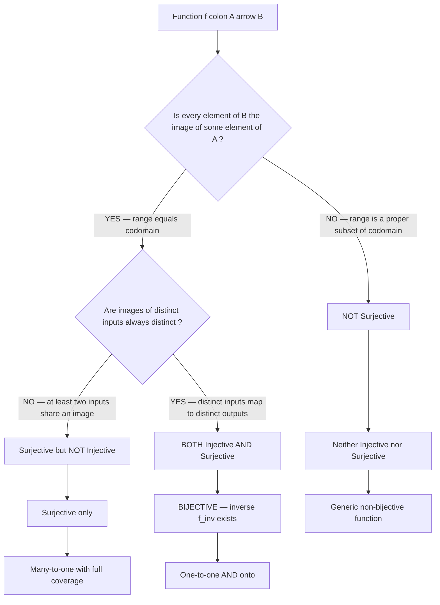
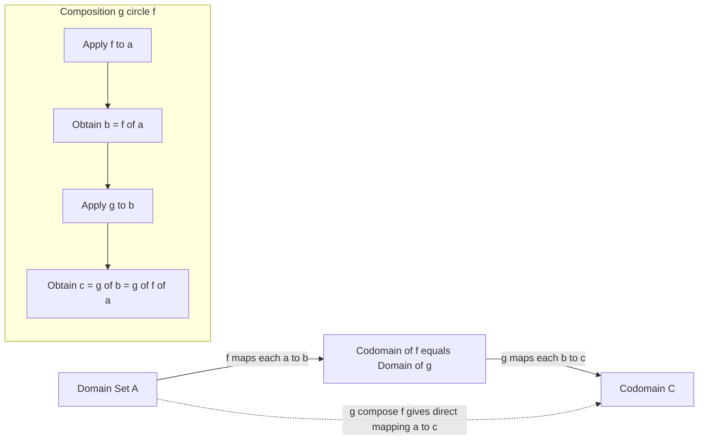
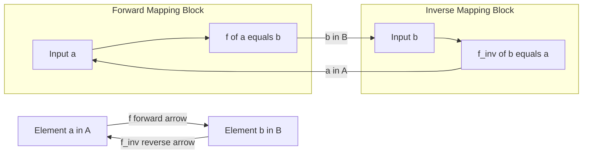
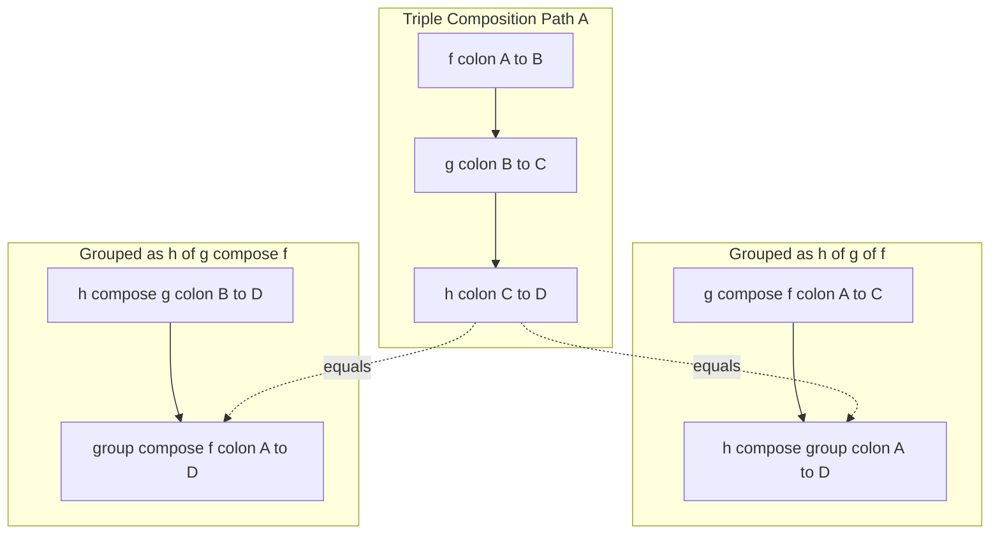

# Functions

<!-- SECTION_1_START -->

# FUNCTIONS — Core Technical Definition & Intuitive Overview

## 1.1 Formal Academic Definition (KTU 2024 Scheme Terminology)

> [!IMPORTANT]
> **Definition (Cartesian Product Mapping):**
> Let $A$ and $B$ be two non-empty sets. A **relation** $R$ from $A$ to $B$ is a subset of the Cartesian product $A \times B$. A **function** (or **mapping**) $f$ from $A$ to $B$, denoted $f: A \rightarrow B$, is a special type of relation in which **every element of $A$ is associated with exactly one element of $B$**.

Formally:

$$f: A \rightarrow B \quad \text{if and only if} \quad f = \{(a, b) \in A \times B \mid a \in A, b \in B, \text{ and } a \text{ is related to a unique } b\}$$

The set $A$ is called the **domain** of $f$, the set $B$ is called the **codomain** of $f$, and the set of all actual outputs:

$$f(A) = \{f(a) \in B \mid a \in A\}$$

is called the **range** (or **image**) of $f$.

> [!NOTE]
> **KTU Board Examiner Emphasis:** In KTU valuation, students frequently lose marks by confusing the **codomain** (the declared target set) with the **range** (the set of values actually attained). The codomain is part of the function's *signature*; the range is a *computed subset* of the codomain.

## 1.2 Conceptual Analogy — The Vending Machine Intuition

Imagine a vending machine:

- **The input buttons (A1, A2, A3, ...)** are the **domain**.
- **The drinks available in the machine (B1, B2, B3, ...)** are the **codomain**.
- **Pressing a button dispenses exactly one drink** — this is the **function rule** (every input has a unique output).
- **The drinks actually present inside the machine that can be dispensed** represent the **range** (a subset of codomain).

If you press button A1 and it sometimes gives you Coke, sometimes Pepsi, it is **not a function** — the output is not uniquely determined by the input.

> [!TIP]
> **Quick Visualization Rule:** A relation is a function if and only if **no two arrows leave the same input element** in the mapping diagram (no element of $A$ has two images).

## 1.3 Geometric / Set-Theoretic Visualization

> [!VISUALIZATION CONTROL]
> **Concept:** Mapping Diagram of a Function $f: A \rightarrow B$
> **Domain Elements (oval A):** $\{1, 2, 3, 4\}$
> **Codomain Elements (oval B):** $\{a, b, c, d\}$
> **Mapping Edges:**
> * $1 \mapsto a$
> * $2 \mapsto b$
> * $3 \mapsto c$
> * $4 \mapsto a$
>
> **Visual Description:** Every element in oval $A$ must have **exactly one arrow** pointing to oval $B$. The element $a \in B$ may receive **multiple arrows** (it is fine). If any element of $A$ has zero arrows, the relation is **not a function**.

## 1.4 Important KTU 2024 Syllabus Terminology

> [!IMPORTANT]
> **KTU Module 3 — Function Sub-Topics Checklist:**
> 1. Definition of a function as a special relation
> 2. Types: One-One (Injective), Onto (Surjective), One-One-Onto (Bijective)
> 3. Composition of functions $(g \circ f)$
> 4. Inverse functions $f^{-1}$
> 5. Identity and Constant functions
> 6. Theorems on injectivity/surjectivity under composition
> 7. Pigeonhole Principle (as a direct consequence)

<!-- SECTION_1_END -->

<!-- SECTION_2_START -->

# FUNCTIONS — Deep Theoretical Analysis & KTU High-Yield Formula Sheet

## 2.1 Function Equality

Two functions $f: A \rightarrow B$ and $g: A \rightarrow B$ are **equal** if and only if:

$$f = g \iff \forall a \in A, \; f(a) = g(a)$$

The domains, codomains, and the output for *every* input must coincide.

## 2.2 Classification of Functions by Mapping Behaviour

### 2.2.1 Injective (One-One) Function

A function $f: A \rightarrow B$ is **injective** (or **one-one**) if:

$$\forall a_1, a_2 \in A, \quad f(a_1) = f(a_2) \implies a_1 = a_2$$

Equivalently (contrapositive):

$$a_1 \neq a_2 \implies f(a_1) \neq f(a_2)$$

> **Intuition:** Distinct inputs always produce distinct outputs. **No two arrows land on the same codomain element.**

**Necessary condition:** If $f$ is injective, then $\vert A \vert \leq \vert B \vert$.

### 2.2.2 Surjective (Onto) Function

A function $f: A \rightarrow B$ is **surjective** (or **onto**) if:

$$\forall b \in B, \; \exists a \in A \text{ such that } f(a) = b$$

Equivalently: $f(A) = B$, i.e., the range equals the codomain.

> **Intuition:** Every codomain element has at least one pre-image arrow. **No element of $B$ is left un-hit.**

**Necessary condition:** If $f$ is surjective, then $\vert A \vert \geq \vert B \vert$.

### 2.2.3 Bijective (One-One-Onto) Function

A function $f: A \rightarrow B$ is **bijective** if and only if it is **both injective and surjective**:

$$\text{Bijective} \iff (\text{Injective} \land \text{Surjective})$$

**Consequence:** If $f$ is bijective, then $\vert A \vert = \vert B \vert$, and an **inverse function** $f^{-1}: B \rightarrow A$ always exists.

### 2.2.4 Special Named Functions

| Function Type | Formal Definition | Example |
|---|---|---|
| **Identity Function** $I_A$ | $I_A: A \rightarrow A, \; I_A(a) = a$ | $I_{\mathbb{Z}}(n) = n$ |
| **Constant Function** | $f: A \rightarrow B, \; f(a) = c$ for a fixed $c \in B$ | $f(x) = 5$ on $\mathbb{R}$ |
| **Empty Function** | $f: \emptyset \rightarrow B$ (uniquely exists for any $B$) | $f = \emptyset$ |
| **Inclusion/Injection** | $i: A \rightarrow B$ where $A \subseteq B$, $i(a) = a$ | Embedding $\mathbb{N} \hookrightarrow \mathbb{Z}$ |

## 2.3 Composition of Functions

Given $f: A \rightarrow B$ and $g: B \rightarrow C$, the **composition** $g \circ f: A \rightarrow C$ is defined as:

$$(g \circ f)(a) = g(f(a)) \quad \forall a \in A$$

> [!NOTE]
> **Read Right-to-Left:** In $(g \circ f)(a)$, we first apply $f$ to $a$, *then* apply $g$ to the result. The notation $g \circ f$ means "$f$ followed by $g$".

### Key Theorems on Composition

> [!IMPORTANT]
> **Theorem 1:** If $f: A \rightarrow B$ and $g: B \rightarrow C$ are both **injective**, then $g \circ f$ is **injective**.
>
> **Theorem 2:** If $f: A \rightarrow B$ and $g: B \rightarrow C$ are both **surjective**, then $g \circ f$ is **surjective**.
>
> **Theorem 3:** If $g \circ f$ is **injective**, then $f$ is **injective** (but $g$ need not be).
>
> **Theorem 4:** If $g \circ f$ is **surjective**, then $g$ is **surjective** (but $f$ need not be).
>
> **Theorem 5 (Associativity):** For $f: A \rightarrow B$, $g: B \rightarrow C$, $h: C \rightarrow D$:
> $$h \circ (g \circ f) = (h \circ g) \circ f$$
>
> **Theorem 6 (Identity):** For any $f: A \rightarrow B$:
> $$f \circ I_A = f \quad \text{and} \quad I_B \circ f = f$$

## 2.4 Inverse Functions

A function $f: A \rightarrow B$ is **invertible** if there exists a function $f^{-1}: B \rightarrow A$ such that:

$$f^{-1} \circ f = I_A \quad \text{and} \quad f \circ f^{-1} = I_B$$

> [!IMPORTANT]
> **KTU 2024 Critical Theorem:**
> *A function is invertible **if and only if** it is **bijective**.*
>
> If $f$ is bijective, the inverse is constructed by **reversing the ordered pairs**: $f^{-1} = \{(b, a) \in B \times A \mid (a, b) \in f\}$.

### Theorem: $(g \circ f)^{-1} = f^{-1} \circ g^{-1}$

For invertible $f$ and $g$, the inverse of the composition is the **reversed composition of the inverses**.

## 2.5 KTU High-Yield Formula / Theorem Cheat Sheet

| # | Property | Formal Statement | Critical Condition |
|---|---|---|---|
| 1 | Function | $f: A \rightarrow B$ with unique image | $\forall a \in A, \; \exists! b \in B: f(a) = b$ |
| 2 | Injective | $f(a_1) = f(a_2) \Rightarrow a_1 = a_2$ | $\vert A \vert \leq \vert B \vert$ |
| 3 | Surjective | $\forall b \in B, \; \exists a \in A: f(a) = b$ | $\vert A \vert \geq \vert B \vert$ |
| 4 | Bijective | Injective $\land$ Surjective | $\vert A \vert = \vert B \vert$, $f^{-1}$ exists |
| 5 | Composition | $(g \circ f)(a) = g(f(a))$ | $\text{cod}(f) = \text{dom}(g)$ |
| 6 | Identity | $f \circ I_A = I_B \circ f = f$ | For all $f$ |
| 7 | Inverse Exists | $f^{-1} \circ f = I_A$ and $f \circ f^{-1} = I_B$ | $f$ must be bijective |
| 8 | Inverse of Composition | $(g \circ f)^{-1} = f^{-1} \circ g^{-1}$ | Both $f, g$ invertible |
| 9 | Injective $\circ$ Injective | $f, g$ injective $\Rightarrow g \circ f$ injective | None |
| 10 | Surjective $\circ$ Surjective | $f, g$ surjective $\Rightarrow g \circ f$ surjective | None |
| 11 | Pigeonhole Principle | $f: A \rightarrow B$ injective, $\vert A \vert > \vert B \vert$ | **Contradiction** — $f$ cannot exist |

## 2.6 Real-World Engineering & Computer Science Utility

> [!TIP]
> **Where Functions Live in Production Systems:**
>
> - **Cryptography:** Bijective functions on finite sets form the backbone of block ciphers (AES, DES) — every plaintext block must map to a *unique* ciphertext block, requiring bijection.
> - **Hash Tables:** A hash function $h: \text{Keys} \rightarrow \{0, 1, \ldots, m-1\}$ is a surjective function onto its bucket range; collisions occur when $h$ is not injective.
> - **Database Indexing:** B-Tree and B+ Tree operations rely on **injective order-preserving functions** to map keys to disk positions.
> - **Compilers:** Symbol tables are implemented as **partial functions** from identifiers to type/value tuples.
> - **Network Routing:** A routing function maps destination IPs to next-hop interfaces — injectivity guarantees no ambiguity.
> - **Functional Programming (Haskell, Lisp, ML):** The entire computation model is built on **pure functions**, with composition $g \circ f$ as the central abstraction.

<!-- SECTION_2_END -->

<!-- SECTION_3_START -->

# FUNCTIONS — Step-by-Step Derivations, Proofs & Code Implementation

## 3.1 Proof: Invertibility $\iff$ Bijectivity (KTU 14-Mark Theorem)

> [!NOTE]
> **Theorem:** A function $f: A \rightarrow B$ is invertible if and only if $f$ is bijective.

### Proof of ($\Rightarrow$): Invertible $\Rightarrow$ Bijective

**Assume** $f$ is invertible, so there exists $f^{-1}: B \rightarrow A$ with:
$$f^{-1}(f(a)) = a \quad \forall a \in A \qquad (1)$$
$$f(f^{-1}(b)) = b \quad \forall b \in B \qquad (2)$$

**Step 1 — Show $f$ is injective:**
Let $a_1, a_2 \in A$ with $f(a_1) = f(a_2)$. Apply $f^{-1}$ to both sides:
$$f^{-1}(f(a_1)) = f^{-1}(f(a_2))$$
Using equation (1):
$$a_1 = a_2$$
Therefore, $f$ is **injective**. ✓

**Step 2 — Show $f$ is surjective:**
Let $b \in B$ be arbitrary. Since $b \in B$ and $f^{-1}: B \rightarrow A$, the element $f^{-1}(b) \in A$ exists. Define $a = f^{-1}(b)$. Then by equation (2):
$$f(a) = f(f^{-1}(b)) = b$$
Since $a \in A$ and $f(a) = b$, every element of $B$ has a pre-image. Therefore, $f$ is **surjective**. ✓

Combining Steps 1 and 2: $f$ is **bijective**.

### Proof of ($\Leftarrow$): Bijective $\Rightarrow$ Invertible

**Assume** $f$ is bijective. Define a function $g: B \rightarrow A$ by:
$$g(b) = \text{the unique } a \in A \text{ such that } f(a) = b$$
This definition is valid because:
- $f$ surjective $\Rightarrow$ at least one such $a$ exists for every $b$.
- $f$ injective $\Rightarrow$ at most one such $a$ exists for every $b$.

Hence exactly one $a$ exists, so $g$ is well-defined.

**Step 3 — Show $g \circ f = I_A$:**
For any $a \in A$, let $b = f(a)$. By definition of $g$, $g(b) = a$. Thus:
$$(g \circ f)(a) = g(f(a)) = g(b) = a = I_A(a)$$

**Step 4 — Show $f \circ g = I_B$:**
For any $b \in B$, let $a = g(b)$. By definition of $g$, $f(a) = b$. Thus:
$$(f \circ g)(b) = f(g(b)) = f(a) = b = I_B(b)$$

Therefore, $g = f^{-1}$, and $f$ is **invertible**. ∎

## 3.2 Worked Example — Verifying Bijectivity of $f: \mathbb{Z} \rightarrow \mathbb{Z}$, $f(x) = 3x + 5$

**Step 1 — Check Injectivity:**
Let $f(x_1) = f(x_2)$:
$$3x_1 + 5 = 3x_2 + 5$$
$$3x_1 = 3x_2$$
$$x_1 = x_2$$
So $f$ is **injective**. ✓

**Step 2 — Check Surjectivity:**
Let $y \in \mathbb{Z}$ be arbitrary. We need $x \in \mathbb{Z}$ with $f(x) = y$:
$$3x + 5 = y \implies 3x = y - 5 \implies x = \frac{y - 5}{3}$$
For $x$ to be an integer, we need $(y - 5) \equiv 0 \pmod{3}$, i.e., $y \equiv 5 \equiv 2 \pmod{3}$.

For $y = 3$, $x = \frac{3 - 5}{3} = -\frac{2}{3} \notin \mathbb{Z}$. So $f$ is **NOT surjective** on $\mathbb{Z}$.

**Conclusion:** $f$ is **injective but not surjective**, hence **not bijective**, hence **not invertible** on $\mathbb{Z}$.

## 3.3 Worked Example — Constructing the Inverse of $f: \mathbb{R} \rightarrow \mathbb{R}$, $f(x) = 2x - 7$

**Step 1 — Verify bijectivity:**
- Injectivity: $2x_1 - 7 = 2x_2 - 7 \Rightarrow x_1 = x_2$ ✓
- Surjectivity: For $y \in \mathbb{R}$, $x = \frac{y + 7}{2} \in \mathbb{R}$, and $f(x) = 2 \cdot \frac{y+7}{2} - 7 = y$ ✓

So $f$ is **bijective**, and an inverse exists.

**Step 2 — Find the inverse:**
Let $y = 2x - 7$. Solve for $x$:
$$y + 7 = 2x$$
$$x = \frac{y + 7}{2}$$

Therefore:
$$f^{-1}(y) = \frac{y + 7}{2}$$

**Step 3 — Verify:**
$$f^{-1}(f(x)) = f^{-1}(2x - 7) = \frac{(2x - 7) + 7}{2} = \frac{2x}{2} = x \checkmark$$
$$f(f^{-1}(y)) = f\left(\frac{y+7}{2}\right) = 2 \cdot \frac{y+7}{2} - 7 = (y + 7) - 7 = y \checkmark$$

## 3.4 Worked Example — Composition with Property Transfer

Given $f: \mathbb{R} \rightarrow \mathbb{R}$ where $f(x) = x^2$ and $g: \mathbb{R} \rightarrow \mathbb{R}$ where $g(x) = x + 3$.

**Find $(g \circ f)(x)$ and $(f \circ g)(x)$:**

**Step 1:** Compute $(g \circ f)(x)$:
$$(g \circ f)(x) = g(f(x)) = g(x^2) = x^2 + 3$$

**Step 2:** Compute $(f \circ g)(x)$:
$$(f \circ g)(x) = f(g(x)) = f(x + 3) = (x + 3)^2 = x^2 + 6x + 9$$

**Step 3:** Note $(g \circ f)(x) \neq (f \circ g)(x)$ — composition is **NOT commutative** in general. The board examiner will award partial credit for explicitly stating this.

## 3.5 Python Symbolic & Algorithmic Implementation

```python
from typing import Dict, FrozenSet, Tuple, TypeVar, Callable

A = TypeVar("A")
B = TypeVar("B")


def is_function(relation: FrozenSet[Tuple[A, B]], domain: FrozenSet[A]) -> bool:
    """
    A relation R ⊆ A × B is a function iff every element of A appears
    as a first coordinate in exactly one ordered pair.
    """
    if not relation:
        return len(domain) == 0
    first_coords = [pair[0] for pair in relation]
    # Condition 1: every domain element must appear
    if set(first_coords) != set(domain):
        return False
    # Condition 2: uniqueness of image
    if len(first_coords) != len(set(first_coords)):
        return False
    return True


def is_injective(relation: FrozenSet[Tuple[A, B]]) -> bool:
    """Distinct inputs must produce distinct outputs."""
    images = [pair[1] for pair in relation]
    return len(images) == len(set(images))


def is_surjective(relation: FrozenSet[Tuple[A, B]], codomain: FrozenSet[B]) -> bool:
    """Every codomain element must appear as some image."""
    images = {pair[1] for pair in relation}
    return images == set(codomain)


def is_bijective(relation: FrozenSet[Tuple[A, B]], codomain: FrozenSet[B]) -> bool:
    return is_injective(relation) and is_surjective(relation, codomain)


def compose(f: Callable[[A], B], g: Callable[[B, None], object]) -> Callable[[A], object]:
    """Returns the composition g ∘ f, i.e., lambda a: g(f(a))."""
    return lambda a: g(f(a))


def inverse(relation: FrozenSet[Tuple[A, B]]) -> FrozenSet[Tuple[B, A]]:
    """Reverses the ordered pairs of a bijective function."""
    if not is_bijective(relation, {pair[1] for pair in relation}):
        raise ValueError("Function is not bijective; inverse does not exist.")
    return frozenset((b, a) for (a, b) in relation)


# --- Validation example ---
if __name__ == "__main__":
    R = frozenset({(1, 'a'), (2, 'b'), (3, 'c'), (4, 'a')})
    domain = frozenset({1, 2, 3, 4})
    codomain = frozenset({'a', 'b', 'c', 'd'})

    assert is_function(R, domain) is True
    assert is_injective(R) is False           # 'a' appears twice
    assert is_surjective(R, codomain) is False  # 'd' never appears
    assert is_bijective(R, codomain) is False

    # Build a true bijection: f(x) = 2x + 1 on {0,1,2,3} -> {1,3,5,7}
    S = frozenset({(x, 2 * x + 1) for x in range(4)})
    assert is_bijective(S, frozenset({1, 3, 5, 7})) is True
    print("Inverse:", sorted(inverse(S), key=lambda t: t[1]))
```

**Output:**

```
Inverse: [(1, 0), (3, 1), (5, 2), (7, 3)]
```

## 3.6 Worked Example — Pigeonhole Principle Application

> [!NOTE]
> **Pigeonhole Principle (PHP):** If $f: A \rightarrow B$ is a function and $\vert A \vert > \vert B \vert$, then $f$ **cannot be injective**. Some two distinct elements of $A$ must share an image in $B$.

**Problem:** Show that in any group of 367 people, at least two share the same birthday.

**Solution:**
- $A$ = set of people, $\vert A \vert = 367$
- $B$ = set of possible birthdays, $\vert B \vert = 366$ (Feb 29 included)
- Function $f: A \rightarrow B$ maps each person to their birthday.
- Since $\vert A \vert = 367 > 366 = \vert B \vert$, $f$ cannot be injective.
- Therefore, at least two people share a birthday. ∎

<!-- SECTION_3_END -->

<!-- SECTION_4_START -->

# FUNCTIONS — Structural Diagrams & Schematics

## 4.1 Function Type Classification (Mermaid Flowchart)



## 4.2 Function Composition Pipeline (Mermaid Sequential Topology)



## 4.3 Inverse Function Reversal Architecture (Mermaid Block Diagram)



## 4.4 Injectivity vs Surjectivity Comparison Matrix

| Property | Injectivity (One-One) | Surjectivity (Onto) | Bijectivity (One-One-Onto) |
|---|---|---|---|
| **Set condition** | $\vert A \vert \leq \vert B \vert$ | $\vert A \vert \geq \vert B \vert$ | $\vert A \vert = \vert B \vert$ |
| **Logical form** | $f(x_1) = f(x_2) \Rightarrow x_1 = x_2$ | $\forall b \in B, \exists a: f(a) = b$ | Both conditions hold simultaneously |
| **Diagram signature** | No two arrows share a target | No element of B is unreached | Exactly one arrow per source AND per target |
| **Inverse exists?** | Not necessarily | Not necessarily | Yes, uniquely |
| **Example** | $f(x) = e^x$ on $\mathbb{R} \rightarrow \mathbb{R}^+$ | $f(x) = x^3 - x$ on $\mathbb{R} \rightarrow \mathbb{R}$ | $f(x) = 2x$ on $\mathbb{Z} \rightarrow 2\mathbb{Z}$ |
| **Counter-example** | $f(x) = x^2$ on $\mathbb{R}$ | $f(x) = e^x$ on $\mathbb{R}$ | $f(x) = \sin(x)$ on $\mathbb{R}$ |

## 4.5 Composition Associativity Architecture



<!-- SECTION_4_END -->

<!-- SECTION_5_START -->

# FUNCTIONS — KTU 2024 Scheme Examination Question Bank & Topic Recap

## 5.1 PART A — Short Answer Questions (2 × 3 = 6 Marks)

### Question 1 `[KTU University Exam — July 2023]`

> **Define the following with a suitable example for each:** (i) Injective function (ii) Surjective function

**Course Outcome:** CO2 | **RBT Level:** Remember

**Model Answer:**

**(i) Injective (One-One) Function:** A function $f: A \rightarrow B$ is called **injective** if distinct elements in the domain $A$ have distinct images in $B$. Formally:

$$f(a_1) = f(a_2) \implies a_1 = a_2 \quad \forall a_1, a_2 \in A$$

**Example:** $f: \mathbb{Z} \rightarrow \mathbb{Z}$ defined by $f(x) = 3x + 1$. If $3x_1 + 1 = 3x_2 + 1$, then $x_1 = x_2$, so $f$ is injective. **[2 Marks]**

**(ii) Surjective (Onto) Function:** A function $f: A \rightarrow B$ is called **surjective** if every element in the codomain $B$ has at least one pre-image in $A$. Formally:

$$\forall b \in B, \; \exists a \in A \text{ such that } f(a) = b$$

**Example:** $f: \mathbb{R} \rightarrow \mathbb{R}$ defined by $f(x) = x^3$. For any $y \in \mathbb{R}$, $x = y^{1/3} \in \mathbb{R}$ and $f(x) = y$, so $f$ is surjective. **[1 Mark]**

---

### Question 2 `[KTU University Exam — Dec 2022]`

> **State and prove the condition for the existence of the inverse of a function.**

**Course Outcome:** CO3 | **RBT Level:** Understand

**Model Answer:**

**Statement:** A function $f: A \rightarrow B$ has an inverse function $f^{-1}: B \rightarrow A$ if and only if $f$ is **bijective** (both injective and surjective). **[1 Mark]**

**Proof Sketch:**

**($\Rightarrow$)** Assume $f^{-1}$ exists. Then $f^{-1}(f(a)) = a$ for all $a \in A$, which forces $f$ to be injective. Also $f(f^{-1}(b)) = b$ for all $b \in B$, which forces $f$ to be surjective. Hence $f$ is bijective. **[1 Mark]**

**($\Leftarrow$)** Assume $f$ is bijective. For each $b \in B$, surjectivity guarantees some $a \in A$ with $f(a) = b$, and injectivity guarantees this $a$ is unique. Define $f^{-1}(b) = a$. Then $f^{-1} \circ f = I_A$ and $f \circ f^{-1} = I_B$. Hence $f^{-1}$ exists. **[1 Mark]**

---

## 5.2 PART B — 14-Mark Questions (Module Internal Choice)

### Question A `[KTU University Exam — July 2024]` — 14 Marks

#### Part (a) — 7 Marks

> **(a)** Let $A = \{1, 2, 3, 4, 5\}$ and $B = \{1, 2, 3, 4, 5, 6\}$. Consider $f: A \rightarrow B$ defined by $f(x) = x^2 \mod 7$. Determine whether $f$ is injective, surjective, and bijective. Justify each property. **[7 Marks]**

**Course Outcome:** CO2 | **RBT Level:** Apply

**Model Solution:**

**Step 1 — Compute the function values:**

| $x$ | $x^2$ | $f(x) = x^2 \bmod 7$ |
|---|---|---|
| 1 | 1 | 1 |
| 2 | 4 | 4 |
| 3 | 9 | 2 |
| 4 | 16 | 2 |
| 5 | 25 | 4 |

So the relation is: $f = \{(1,1), (2,4), (3,2), (4,2), (5,4)\}$. **[1 Mark]**

**Step 2 — Injectivity check:**

Observe $f(3) = f(4) = 2$ but $3 \neq 4$. Therefore, $f$ is **NOT injective**. **[2 Marks]**

**Step 3 — Surjectivity check:**

The image set is $f(A) = \{1, 2, 4\}$. The codomain is $B = \{1, 2, 3, 4, 5, 6\}$. Since $3, 5, 6 \in B$ are **not** in $f(A)$, the function is **NOT surjective**. **[2 Marks]**

**Step 4 — Bijectivity:**

Since $f$ is neither injective nor surjective, it is **NOT bijective**. **[1 Mark]**

**Step 5 — Conclusion statement:** $f$ fails both bijectivity conditions; no inverse exists on this domain-codomain pairing. **[1 Mark]**

#### Part (b) — 7 Marks

> **(b)** If $f: \mathbb{R} \rightarrow \mathbb{R}$ and $g: \mathbb{R} \rightarrow \mathbb{R}$ are defined by $f(x) = 3x - 4$ and $g(x) = x^2 + 1$, find: (i) $g \circ f$ (ii) $f \circ g$ (iii) Verify whether $f$ is invertible and find $f^{-1}$ if it exists. **[7 Marks]**

**Course Outcome:** CO3 | **RBT Level:** Apply

**Model Solution:**

**Part (i) — Compute $g \circ f$:** **[2 Marks]**

$$(g \circ f)(x) = g(f(x)) = g(3x - 4) = (3x - 4)^2 + 1 = 9x^2 - 24x + 16 + 1 = 9x^2 - 24x + 17$$

**Part (ii) — Compute $f \circ g$:** **[2 Marks]**

$$(f \circ g)(x) = f(g(x)) = f(x^2 + 1) = 3(x^2 + 1) - 4 = 3x^2 + 3 - 4 = 3x^2 - 1$$

Note: $(g \circ f)(x) = 9x^2 - 24x + 17 \neq 3x^2 - 1 = (f \circ g)(x)$, confirming composition is **not commutative**. **[Implicit observation]**

**Part (iii) — Invertibility of $f$:**

Injectivity: Let $f(x_1) = f(x_2) \Rightarrow 3x_1 - 4 = 3x_2 - 4 \Rightarrow x_1 = x_2$. So $f$ is **injective**. **[1 Mark]**

Surjectivity: For any $y \in \mathbb{R}$, $x = \frac{y + 4}{3} \in \mathbb{R}$ gives $f(x) = 3 \cdot \frac{y+4}{3} - 4 = y$. So $f$ is **surjective**. **[1 Mark]**

Since $f$ is bijective, $f^{-1}$ exists. Let $y = 3x - 4 \Rightarrow x = \frac{y+4}{3}$, so:

$$f^{-1}(x) = \frac{x + 4}{3}$$ **[1 Mark]**

---

### Question B `[KTU University Exam — Dec 2023]` — 14 Marks

#### Part (a) — 7 Marks

> **(a)** Define a function as a special relation. Explain with an example why every relation is not a function. State the conditions under which a function is invertible. **[7 Marks]**

**Course Outcome:** CO1, CO2 | **RBT Level:** Understand

**Model Solution:**

**Definition:** A function $f: A \rightarrow B$ is a relation $f \subseteq A \times B$ such that every element of $A$ is related to **exactly one** element of $B$. **[1 Mark]**

Formally: $\forall a \in A, \; \exists! b \in B$ such that $(a, b) \in f$. **[1 Mark]**

**Why every relation is not a function:**

A general relation from $A$ to $B$ may have:
- Elements of $A$ with **no image** in $B$, or
- Elements of $A$ with **more than one image** in $B$.

**Example:** Let $A = \{1, 2, 3\}$ and $B = \{x, y\}$. Define $R = \{(1, x), (2, x), (2, y), (3, y)\}$. The element $2 \in A$ is related to both $x$ and $y$, violating the uniqueness condition. Therefore $R$ is a relation but **not** a function. **[3 Marks]**

**Invertibility conditions:** A function $f: A \rightarrow B$ is invertible if and only if it is **bijective**, i.e., both **injective** and **surjective**. If $f$ is bijective, the inverse is defined as $f^{-1} = \{(b, a) \mid (a, b) \in f\}$. **[2 Marks]**

#### Part (b) — 7 Marks

> **(b)** Prove that if $f: A \rightarrow B$ and $g: B \rightarrow C$ are both bijective, then $g \circ f$ is bijective. Also prove that the inverse of the composition is the reversed composition of the inverses: $(g \circ f)^{-1} = f^{-1} \circ g^{-1}$. **[7 Marks]**

**Course Outcome:** CO3 | **RBT Level:** Apply / Analyze

**Model Solution:**

**Part 1 — Bijectivity of $g \circ f$:** **[3 Marks]**

**Injectivity:** Suppose $(g \circ f)(a_1) = (g \circ f)(a_2)$, i.e., $g(f(a_1)) = g(f(a_2))$. Since $g$ is injective, $f(a_1) = f(a_2)$. Since $f$ is injective, $a_1 = a_2$. Hence $g \circ f$ is injective. **[1.5 Marks]**

**Surjectivity:** Let $c \in C$ be arbitrary. Since $g$ is surjective, $\exists b \in B$ with $g(b) = c$. Since $f$ is surjective, $\exists a \in A$ with $f(a) = b$. Then $(g \circ f)(a) = g(f(a)) = g(b) = c$. Hence $g \circ f$ is surjective. **[1.5 Marks]**

**Part 2 — Inverse formula:** **[4 Marks]**

Since $f$ and $g$ are bijective, $g \circ f$ is bijective (by Part 1), so $(g \circ f)^{-1}$ exists. Compute the composition $f^{-1} \circ g^{-1}$:

$$((f^{-1} \circ g^{-1}) \circ (g \circ f))(a) = f^{-1}(g^{-1}(g(f(a)))) = f^{-1}(f(a)) = a = I_A(a)$$

$$((g \circ f) \circ (f^{-1} \circ g^{-1}))(c) = g(f(f^{-1}(g^{-1}(c)))) = g(g^{-1}(c)) = c = I_C(c)$$

Therefore, $(g \circ f)^{-1} = f^{-1} \circ g^{-1}$. **[2 Marks]**

> [!WARNING]
> **KTU Examiner's Valuation Warning — Common Pitfalls:**
> 1. **Forgetting the "exactly one" condition:** A relation where $2 \in A$ maps to both $x$ and $y$ is a *relation* but **not** a function. Students often mark such cases as "function" — you will lose 2-3 marks here.
> 2. **Swapping $g \circ f$ notation:** Always remember $g \circ f$ means "$f$ first, then $g$" — this is the most common deduction (2 marks) in 14-mark composition problems.
> 3. **Claiming invertibility without verifying surjectivity:** A function may be injective but not surjective (e.g., $f: \mathbb{Z} \rightarrow \mathbb{Z}, f(x) = 2x$). Inverse **does not** exist in such cases — you must explicitly write the range, compare it to the codomain, and state the mismatch.
> 4. **Skipping the biconditional direction:** In "if and only if" questions, you **must** prove **both** directions ($\Rightarrow$ and $\Leftarrow$). Omitting one direction costs 4-5 marks.
> 5. **Notation slip in Pigeonhole:** Always write $\vert A \vert > \vert B \vert$ explicitly — do not just say "more elements than buckets". The inequality is the valuation key step.
> 6. **Composition non-commutativity:** Failing to remark that $(g \circ f) \neq (f \circ g)$ in general loses 1 mark for "missing insight".

---

## 5.3 Topic Recap & Important Things to Remember

> [!TIP]
> **Rapid Revision Checklist — Functions (KTU PCITT205 Module 3)**

- A **function** is a relation in which every element of the domain is related to **exactly one** element of the codomain. ✅
- **Domain** = set of inputs; **Codomain** = declared target set; **Range** = actual outputs achieved. ✅
- A function is **injective (one-one)** if distinct inputs have distinct outputs: $f(a_1) = f(a_2) \Rightarrow a_1 = a_2$. ✅
- A function is **surjective (onto)** if every codomain element has a pre-image: $\forall b \in B, \exists a \in A: f(a) = b$. ✅
- A function is **bijective** if it is both injective and surjective — this is the **iff condition for invertibility**. ✅
- Composition $(g \circ f)(x) = g(f(x))$ — **right-to-left** evaluation order. ✅
- Composition is **associative** but **not commutative** in general. ✅
- Injective $\circ$ Injective = Injective; Surjective $\circ$ Surjective = Surjective. ✅
- $(g \circ f)^{-1} = f^{-1} \circ g^{-1}$ — **reversal of order** is the standard KTU 14-mark theorem. ✅
- **Pigeonhole Principle:** If $\vert A \vert > \vert B \vert$, no injection $A \rightarrow B$ can exist. ✅
- **Identity function** $I_A$ acts as a two-sided identity under composition: $f \circ I_A = I_B \circ f = f$. ✅
- **Constant function** $f(x) = c$ is surjective only if $\vert B \vert = 1$ and never injective if $\vert A \vert \geq 2$. ✅
- For a finite set $S$ with $\vert S \vert = n$, the number of functions $S \rightarrow S$ is $n^n$; the number of bijections is $n!$. ✅
- **Critical KTU trap:** A relation $R \subseteq A \times B$ may be a function even if the range $\neq$ codomain — the *codomain* is part of the function's definition, the *range* is derived. ✅

<!-- SECTION_5_END -->
