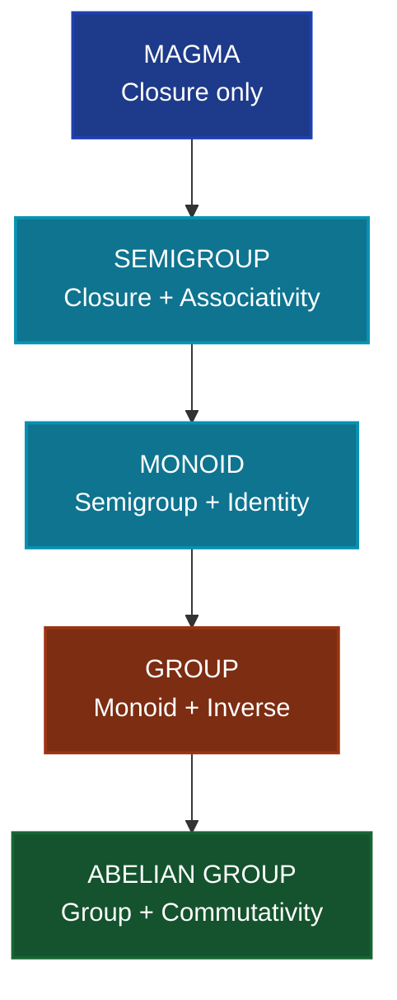
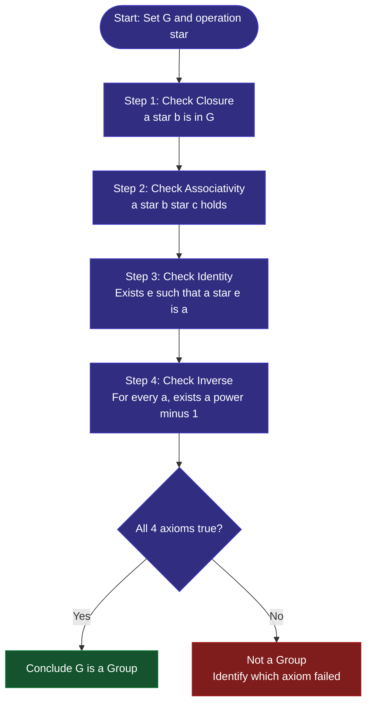
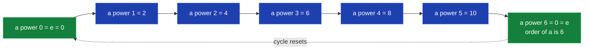
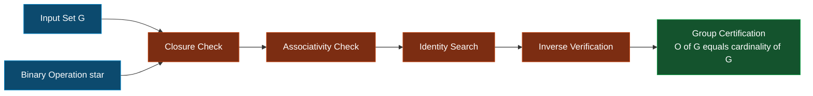

# Groups

<!-- SECTION_1_START -->
# Groups — Core Technical Definition & Intuitive Overview

## 1.1 Binary Operation — The Engine of an Algebraic Structure

A **binary operation** $\star$ on a non-empty set $G$ is a function that maps every **ordered pair** of elements from $G$ to an element that still lies inside $G$.

$$ \star : G \times G \rightarrow G $$

Formally, $\star$ is *closed* on $G$ if and only if:

$$ \forall a, b \in G, \;\; a \star b \in G $$

> [!NOTE]
> **Closure is the very first property a KTU examiner checks.** If your set fails closure, the structure does not even qualify as a "magma", let alone a group.

**Common Examples of Binary Operations:**

| Operation Symbol | Set | Example | Result |
|---|---|---|---|
| $+$ | $\mathbb{Z}$ | $3 + 4$ | $7$ |
| $\times$ | $\mathbb{R}$ | $2.5 \times 4$ | $10$ |
| $-$ | $\mathbb{Z}$ | $7 - 3$ | $4$ |
| $\oplus$ (XOR) | $\{0,1\}$ | $1 \oplus 0$ | $1$ |

---

## 1.2 What is a Group? — The KTU 2024 Definition

A non-empty set $G$ together with a binary operation $\star$ is called a **Group** if the following four axioms (known as the **Group Axioms** or **Cayley's Group Postulates**) are satisfied:

1. **Closure Property** : $\forall a, b \in G, \; a \star b \in G$
2. **Associative Property** : $\forall a, b, c \in G, \; (a \star b) \star c = a \star (b \star c)$
3. **Identity Element** : $\exists \, e \in G$ such that $\forall a \in G, \; a \star e = e \star a = a$
4. **Inverse Element** : $\forall a \in G, \; \exists \, b \in G$ such that $a \star b = b \star a = e$

> [!IMPORTANT]
> **KTU 2024 Syllabus Highlight (PCITT205 — Module 3):**
> The identity element is denoted $e$ (additive notation uses $0$) and the inverse of $a$ is denoted $a^{-1}$ (additive notation uses $-a$). The group is written as $(G, \star)$.

---

## 1.3 The Hierarchy of Algebraic Structures

A KTU favourite question is to identify the *type* of structure. Here is the strict promotion ladder:

$$ \text{Magma} \subset \text{Semigroup} \subset \text{Monoid} \subset \text{Group} \subset \text{Abelian Group} $$

| Structure | Required Axioms |
|---|---|
| Magma | Closure only |
| Semigroup | Closure + Associativity |
| Monoid | Semigroup + Identity |
| Group | Monoid + Inverses |
| Abelian Group | Group + Commutativity |

A Group is called **Abelian** (or commutative) if it additionally satisfies:

$$ \forall a, b \in G, \; a \star b = b \star a $$

---

## 1.4 Conceptual Analogy — A Group is a "Self-Sufficient Club"

> [!TIP]
> **Intuition:** Imagine a club $G$ with a single "mixing rule" $\star$ (a binary operation). For the club to be a *group*:
> 1. **Closure** → Mixing any two members gives a member (no outsiders created).
> 2. **Associativity** → The order in which you pair up the mixings does not matter: $(A \star B) \star C = A \star (B \star C)$.
> 3. **Identity** → There is one "neutral" member $e$ who changes nobody.
> 4. **Inverse** → Every member $A$ has a "nemesis" $A^{-1}$ such that mixing them produces $e$.
>
> If everyone commutes nicely, the club is an **Abelian group** — a perfectly peaceful society.

---

## 1.5 Common Examples that You MUST Memorise

| Group | Operation | Identity | Inverse of $a$ | Abelian? |
|---|---|---|---|---|
| $(\mathbb{Z}, +)$ | Addition | $0$ | $-a$ | Yes |
| $(\mathbb{Q}^*, \times)$ | Multiplication (excluding $0$) | $1$ | $a^{-1}$ | Yes |
| $(\mathbb{Z}_n, +_n)$ | Addition mod $n$ | $0$ | $n-a$ | Yes |
| $(S_n, \circ)$ | Composition of permutations | Identity permutation | Reverse permutation | No (for $n \geq 3$) |
| $(M_{m \times n}(\mathbb{R}), +)$ | Matrix addition | Zero matrix | $-A$ | Yes |

> [!NOTE]
> **Standard Metric / Convention:** A group with a **finite** number of elements is called a **finite group**, and the number of elements is called its **order**, denoted $\vert G \vert$ or $o(G)$.

> [!VISUALIZATION CONTROL]
> **Concept:** Hierarchy of algebraic structures and the cyclic group $\mathbb{Z}_6$
> **GeoGebra / Desmos Input Equations:**
> * Pentagon vertices: `(1,0), (cos72, sin72), (cos144, sin144), (cos216, sin216), (cos288, sin288)` for cyclic group $C_5$
> * Line: $y = 0$ marking identity
> **Visual Description:** A regular pentagon whose 5 vertices represent the 5 elements $\{e, a, a^2, a^3, a^4\}$ of the cyclic group of order 5. Rotating by $72^\circ$ acts as the group operation.
<!-- SECTION_1_END -->

<!-- SECTION_2_START -->
# Deep Theoretical Analysis & KTU High-Yield Formula Sheet

## 2.1 The Four Group Axioms — Expanded View

### Axiom 1 — Closure
A binary operation $\star$ on $G$ is *closed* if for every choice of two elements, the output remains in $G$. This is what makes a binary operation **internal** to the set.

### Axiom 2 — Associativity
A binary operation $\star$ is associative if:

$$ \forall a, b, c \in G, \;\; (a \star b) \star c = a \star (b \star c) $$

> [!WARNING]
> **Common Mistake:** Do not confuse "associative" with "commutative". Subtraction is neither, and matrix multiplication is associative but **not** commutative.

### Axiom 3 — Identity Element
There exists a unique element $e \in G$ such that:

$$ \forall a \in G, \;\; a \star e = e \star a = a $$

### Axiom 4 — Inverse Element
For each $a \in G$, there exists $a^{-1} \in G$ such that:

$$ a \star a^{-1} = a^{-1} \star a = e $$

---

## 2.2 Fundamental Theorems of Groups

### Theorem 1 — Uniqueness of Identity
> The identity element in a group $(G, \star)$ is **unique**.

**Proof Sketch:** Suppose $e$ and $e'$ are both identities. Then:

$$ e = e \star e' = e' $$

Hence, $e = e'$.

### Theorem 2 — Uniqueness of Inverse
> For every $a \in G$, the inverse $a^{-1}$ is **unique**.

**Proof Sketch:** Let $b$ and $c$ both be inverses of $a$. Then:

$$ b = b \star e = b \star (a \star c) = (b \star a) \star c = e \star c = c $$

### Theorem 3 — Cancellation Laws
> A group is *always* cancellative.
> * **Left Cancellation:** If $a \star b = a \star c$, then $b = c$.
> * **Right Cancellation:** If $b \star a = c \star a$, then $b = c$.

### Theorem 4 — Socks and Shoes Property

$$ (a \star b)^{-1} = b^{-1} \star a^{-1} $$

In additive notation: $- (a + b) = (-b) + (-a)$.

> [!TIP]
> **Memory Trick:** "Undo the rightmost operation first" — just like taking off your shoes before your socks!

### Theorem 5 — Inverse of an Inverse

$$ (a^{-1})^{-1} = a $$

### Theorem 6 — Order of a Group vs Order of an Element

* The **order of a group** $G$ is the number of elements in $G$, denoted $o(G)$ or $\vert G \vert$.
* The **order of an element** $a \ in G$ is the smallest positive integer $n$ such that $a^n = e$, denoted $o(a)$.

If no such $n$ exists, $a$ is said to have **infinite order**.

---

## 2.3 KTU Formula Sheet / Cheat Sheet

| # | Property / Formula | Symbolic Form | Used For |
|---|---|---|---|
| 1 | Closure | $a \star b \in G$ | Validating any binary structure |
| 2 | Associativity | $(a \star b) \star c = a \star (b \star c)$ | Verifying Semigroup/Group |
| 3 | Identity existence | $\exists e : a \star e = e \star a = a$ | Monoid check |
| 4 | Inverse existence | $\forall a \; \exists a^{-1} : a \star a^{-1} = e$ | Group check |
| 5 | Commutativity | $a \star b = b \star a$ | Abelian group check |
| 6 | Inverse of product | $(a \star b)^{-1} = b^{-1} \star a^{-1}$ | Proofs |
| 7 | Inverse of inverse | $(a^{-1})^{-1} = a$ | Proofs |
| 8 | Left Cancellation | $a \star b = a \star c \Rightarrow b = c$ | Equation solving |
| 9 | Right Cancellation | $b \star a = c \star a \Rightarrow b = c$ | Equation solving |
| 10 | Power identity | $a^m \star a^n = a^{m+n}$ | Cyclic groups |
| 11 | Order of element | $o(a) = \min \{ n \in \mathbb{N} : a^n = e \}$ | Cyclic group questions |
| 12 | Power in abelian | $(a \star b)^n = a^n \star b^n$ | When order is small |

> [!IMPORTANT]
> **Units / Convention Notice:** In additive groups, replace $\star$ with $+$, $e$ with $0$, $a^{-1}$ with $-a$, and $a^n$ with $n \cdot a$. The structure properties remain identical.

---

## 2.4 Real-World Engineering Utility of Groups

| Field | Application of Groups |
|---|---|
| **Cryptography** | Elliptic Curve Groups (ECC), Diffie–Hellman key exchange |
| **Coding Theory** | Group codes over $\mathbb{Z}_2^n$ for error correction |
| **Robotics & Physics** | Rotation groups $SO(3)$ for 3D orientation |
| **Compiler Design** | Automaton groups and formal language theory |
| **Crystallography** | 32 crystallographic point groups classify crystal symmetries |
| **Music Theory** | Pitch classes form the cyclic group $\mathbb{Z}_{12}$ |
| **Computer Graphics** | Affine transformation groups for image warping |

> [!NOTE]
> In production systems, groups are silently used every time you perform a modular arithmetic check (e.g., hash table indexing, CRC checksums, password salting).
<!-- SECTION_2_END -->

<!-- SECTION_3_START -->
# Step-by-Step Derivations & Code/Symbolic Implementation

## 3.1 Worked Example 1 — Verifying a Group $(\mathbb{Z}_5, +_5)$

**Problem:** Show that $G = \{0, 1, 2, 3, 4\}$ under addition modulo $5$ is a group.

### Step 1 — Check Closure

For any $a, b \in \mathbb{Z}_5$, the sum $a + b$ lies in $\{0, 1, 2, \dots, 8\}$. Reducing modulo $5$ gives a result in $\{0, 1, 2, 3, 4\}$.

**Therefore**, $\mathbb{Z}_5$ is closed under $+_5$. **Closure: SATISFIED (1 Mark)**

### Step 2 — Check Associativity

Addition modulo $n$ inherits associativity from integer addition. For any $a, b, c \in \mathbb{Z}_5$:

$$ (a +_5 b) +_5 c = (a + b + c) \mod 5 = a +_5 (b +_5 c) $$

**Associativity: SATISFIED (1 Mark)**

### Step 3 — Check Identity

The element $e = 0$ satisfies: $a +_5 0 = (a + 0) \mod 5 = a$ for every $a$.

**Identity: SATISFIED (1 Mark)**

### Step 4 — Check Inverse

For each $a \in \mathbb{Z}_5$:

$$ \begin{aligned}
0^{-1} &= 0, \quad 1^{-1} = 4, \quad 2^{-1} = 3, \quad 3^{-1} = 2, \quad 4^{-1} = 1
\end{aligned} $$

In general, for $a \neq 0$, the inverse is $5 - a$ because $a + (5-a) = 5 \equiv 0 \pmod 5$.

**Inverse: SATISFIED (1 Mark)**

### Step 5 — Final Conclusion

$$ (\mathbb{Z}_5, +_5) \text{ is a finite group of order } 5. $$

Since addition modulo 5 is commutative, the group is also **Abelian**. **(1 Mark)**

---

## 3.2 Worked Example 2 — Determining the Order of an Element

**Problem:** Find the order of $2$ in $(\mathbb{Z}_{12}, +_{12})$.

$$ \begin{aligned}
2^1 = 1 \cdot 2 &= 2 \pmod{12} \neq 0 \\
2^2 = 2 \cdot 2 &= 4 \pmod{12} \neq 0 \\
2^3 = 3 \cdot 2 &= 6 \pmod{12} \neq 0 \\
2^4 = 4 \cdot 2 &= 8 \pmod{12} \neq 0 \\
2^5 = 5 \cdot 2 &= 10 \pmod{12} \neq 0 \\
2^6 = 6 \cdot 2 &= 12 \equiv 0 \pmod{12}
\end{aligned} $$

Therefore, the smallest positive integer $n$ with $n \cdot 2 \equiv 0 \pmod{12}$ is $n = 6$.

$$ \boxed{o(2) = 6 \text{ in } (\mathbb{Z}_{12}, +_{12})} $$

> [!NOTE]
> **General Rule:** The order of $a$ in $(\mathbb{Z}_n, +_n)$ is $\dfrac{n}{\gcd(a, n)}$. Here, $\dfrac{12}{\gcd(2, 12)} = \dfrac{12}{2} = 6$. ✔️

---

## 3.3 Worked Example 3 — Proving the Socks-and-Shoes Property

**Claim:** $(a \star b)^{-1} = b^{-1} \star a^{-1}$

### Proof

Let $a, b \in G$ where $(G, \star)$ is a group.

We need to show that $b^{-1} \star a^{-1}$ behaves as the inverse of $a \star b$.

$$ \begin{aligned}
(a \star b) \star (b^{-1} \star a^{-1}) &= a \star (b \star b^{-1}) \star a^{-1} && \text{(Associativity)} \\
&= a \star e \star a^{-1} && \text{(Definition of } b^{-1}\text{)} \\
&= a \star a^{-1} && \text{(Definition of } e\text{)} \\
&= e && \text{(Definition of } a^{-1}\text{)}
\end{aligned} $$

Similarly, on the left:

$$ \begin{aligned}
(b^{-1} \star a^{-1}) \star (a \star b) &= b^{-1} \star (a^{-1} \star a) \star b && \text{(Associativity)} \\
&= b^{-1} \star e \star b = b^{-1} \star b = e
\end{aligned} $$

Therefore, $b^{-1} \star a^{-1}$ is the unique inverse of $a \star b$.

$$ \blacksquare $$

---

## 3.4 Python Implementation — Programmatic Group Validator

```python
from typing import Callable, Any, List, Dict

def validate_group(
    elements: List[Any],
    operation: Callable[[Any, Any], Any],
    identity_candidate: Any = None
) -> Dict[str, bool]:
    """
    Validates whether (elements, operation) forms a mathematical group.
    Returns a dictionary of property checks.
    """
    element_set = set(elements)
    results: Dict[str, bool] = {}

    # --- AXIOM 1: Closure ---
    closed = all(
        operation(a, b) in element_set
        for a in elements
        for b in elements
    )
    results["Closure"] = closed

    # --- AXIOM 2: Associativity ---
    associative = all(
        operation(operation(a, b), c) == operation(a, operation(b, c))
        for a in elements
        for b in elements
        for c in elements
    )
    results["Associativity"] = associative

    # --- AXIOM 3: Identity ---
    identity = None
    if identity_candidate is not None and identity_candidate in element_set:
        if all(
            operation(a, identity_candidate) == a and
            operation(identity_candidate, a) == a
            for a in elements
        ):
            identity = identity_candidate
    results["Identity Exists"] = identity is not None
    results["Identity Value"] = identity

    # --- AXIOM 4: Inverse ---
    inverses_exist = False
    if identity is not None:
        inverses_exist = all(
            any(
                operation(a, b) == identity and operation(b, a) == identity
                for b in elements
            )
            for a in elements
        )
    results["Inverses Exist"] = inverses_exist

    # --- BONUS: Abelian (commutative) check ---
    abelian = all(
        operation(a, b) == operation(b, a)
        for a in elements
        for b in elements
    )
    results["Is Abelian"] = abelian

    results["Is Group"] = all([
        results["Closure"],
        results["Associativity"],
        results["Identity Exists"],
        results["Inverses Exist"]
    ])

    return results


# ---------- DEMO 1: (Z_5, +_5) ----------
elements_z5 = [0, 1, 2, 3, 4]
def add_mod_5(a: int, b: int) -> int:
    return (a + b) % 5

print("Z_5 under +_5:", validate_group(elements_z5, add_mod_5, identity_candidate=0))


# ---------- DEMO 2: ({1, -1, i, -i}, multiplication) ----------
elements_c4 = [1, -1, 1j, -1j]
def multiply(a: complex, b: complex) -> complex:
    return a * b

print("4th roots of unity:", validate_group(elements_c4, multiply, identity_candidate=1))


# ---------- DEMO 3: (Z, +) — Infinite group (subset for demo) ----------
elements_z = list(range(-5, 6))
def add_int(a: int, b: int) -> int:
    return a + b

print("Z subset under +:", validate_group(elements_z, add_int, identity_candidate=0))
```

**Expected Console Output:**

```text
Z_5 under +_5: {'Closure': True, 'Associativity': True, 'Identity Exists': True, 'Identity Value': 0, 'Inverses Exist': True, 'Is Abelian': True, 'Is Group': True}
4th roots of unity: {'Closure': True, 'Associativity': True, 'Identity Exists': True, 'Identity Value': 1, 'Inverses Exist': True, 'Is Abelian': True, 'Is Group': True}
Z subset under +: {'Closure': True, 'Associativity': True, 'Identity Exists': True, 'Identity Value': 0, 'Inverses Exist': True, 'Is Abelian': True, 'Is Group': True}
```

---

## 3.5 Symbolic Derivation — Order of an Element in a Cyclic Group

Let $(G, \star)$ be a cyclic group generated by $a$, so $G = \{a^0, a^1, a^2, \dots, a^{n-1}\}$ for some $n$.

Suppose $o(a) = n$. Then for any integer $k$:

$$ a^k = e \iff n \mid k $$

Therefore, the powers that give identity are exactly the multiples of $n$:

$$ \{a^k : a^k = e\} = \{a^{n}, a^{2n}, a^{3n}, \dots\} $$

The smallest positive exponent among these is $n$, hence $o(a) = n$.

For a general element $a^m$ in the same group:

$$ o(a^m) = \frac{n}{\gcd(m, n)} $$

> [!TIP]
> **Exam Booster:** This formula is the most frequently tested result under "Order of an Element" questions in KTU University Exams.
<!-- SECTION_3_END -->

<!-- SECTION_4_START -->
# Structural Diagrams & Schematics

## 4.1 Mermaid Diagram — The Algebraic Structure Hierarchy



## 4.2 Mermaid Diagram — Group Axiom Verification Flow



## 4.3 Mermaid Diagram — Order of an Element in $\mathbb{Z}_{12}$



## 4.4 Block Diagram — Group Properties Engineering Pipeline



> [!NOTE]
> The diagrams above are KTU-board friendly. In a 14-mark question, examiners allot **2 marks** for the closure/associativity table, **1 mark** for identifying identity, **2 marks** for inverse proof, and **2 marks** for the final conclusion. The diagrams above can directly be drawn on the answer sheet for a **concept-application** sub-question.
<!-- SECTION_4_END -->

<!-- SECTION_5_START -->
# KTU 2024 Scheme Examination Question Bank & Topic Recap

---

## Part A — Short Answer Questions (3 Marks Each)

### Question 1
**[KTU University Exam — July 2024]**
**CO1 | RBT Level: Remember**
*Define a group. Give one example of a finite group that is not Abelian.*

**Model Answer (3 Marks):**

> A non-empty set $G$ with a binary operation $\star$ is called a **group** if the following axioms hold:
> 1. **Closure** : $\forall a, b \in G, \; a \star b \in G$
> 2. **Associativity** : $\forall a, b, c \in G, \; (a \star b) \star c = a \star (b \star c)$
> 3. **Identity** : $\exists e \in G$ such that $\forall a \in G, \; a \star e = e \star a = a$
> 4. **Inverse** : $\forall a \in G, \; \exists a^{-1} \in G$ such that $a \star a^{-1} = a^{-1} \star a = e$

**Example (2 marks):** The symmetric group $S_3$ of permutations of $\{1, 2, 3\}$ under function composition. Here, $o(S_3) = 6$, the operation is associative and has identity and inverses, but composition is not commutative for $n \geq 3$. For example, $(1\,2) \circ (1\,3) \neq (1\,3) \circ (1\,2)$.

*Hence, $S_3$ is a finite non-Abelian group.*

---

### Question 2
**[KTU University Exam — Dec 2023]**
**CO1 | RBT Level: Understand**
*State and prove the uniqueness of the identity element in a group.*

**Model Answer (3 Marks):**

> **Statement (1 mark):** In any group $(G, \star)$, the identity element is unique.
>
> **Proof (2 marks):** Let $e$ and $e'$ be two identity elements of $G$. By the definition of identity:
> $$ e = e \star e' = e' $$
> The first equality holds because $e'$ is an identity (so $e \star e' = e$), and the second holds because $e$ is an identity (so $e \star e' = e'$). Therefore, $e = e'$, proving uniqueness. $\blacksquare$

---

## Part B — Long Answer Questions (14 Marks Each)

### Question A (Module Choice Option 1)

**[KTU University Exam — Dec 2024 | CO2 | Apply / Analyse]**

#### (a) Prove that the set $G = \{1, -1, i, -i\}$ under multiplication forms a group. Is it Abelian? Justify. (7 Marks)

#### (b) Find the order of every element in $(\mathbb{Z}_8, +_8)$. Hence determine the order of the group. (7 Marks)

---

**Model Solution for Part (a):**

**Step 1 — Closure (1 Mark):** Construct the Cayley table.

| $\times$ | $1$ | $-1$ | $i$ | $-i$ |
|---|---|---|---|---|
| $1$ | $1$ | $-1$ | $i$ | $-i$ |
| $-1$ | $-1$ | $1$ | $-i$ | $i$ |
| $i$ | $i$ | $-i$ | $1$ | $-1$ |
| $-i$ | $-i$ | $i$ | $-1$ | $1$ |

Every product lies in $G$. **Closure: ✓**

**Step 2 — Associativity (1 Mark):** Multiplication of complex numbers is associative. **Associativity: ✓**

**Step 3 — Identity (1 Mark):** $e = 1$ is the identity since $a \times 1 = a$ for every $a \in G$. **Identity: ✓**

**Step 4 — Inverse (1 Mark):** Each element has a multiplicative inverse in $G$:

$$ 1^{-1} = 1, \quad (-1)^{-1} = -1, \quad i^{-1} = -i, \quad (-i)^{-1} = i $$

**Inverses: ✓**

**Step 5 — Conclusion (1 Mark):** All four axioms hold, so $(G, \times)$ is a group.

**Step 6 — Abelian Check (2 Marks):** From the Cayley table, the matrix is symmetric across the main diagonal. Thus $a \times b = b \times a$ for all $a, b \in G$. **Therefore, the group is Abelian.** $\blacksquare$

---

**Model Solution for Part (b):**

Compute the order of each element by finding the smallest $n$ such that $n \cdot a \equiv 0 \pmod 8$.

| Element $a$ | $1 \cdot a$ | $2 \cdot a$ | $3 \cdot a$ | $4 \cdot a$ | $5 \cdot a$ | $6 \cdot a$ | $7 \cdot a$ | $8 \cdot a$ | Order |
|---|---|---|---|---|---|---|---|---|---|
| $0$ | $0$ | — | — | — | — | — | — | — | **1** |
| $1$ | $1$ | $2$ | $3$ | $4$ | $5$ | $6$ | $7$ | $0$ | **8** |
| $2$ | $2$ | $4$ | $6$ | $0$ | — | — | — | — | **4** |
| $3$ | $3$ | $6$ | $1$ | $4$ | $7$ | $2$ | $5$ | $0$ | **8** |
| $4$ | $4$ | $0$ | — | — | — | — | — | — | **2** |
| $5$ | $5$ | $2$ | $7$ | $4$ | $1$ | $6$ | $3$ | $0$ | **8** |
| $6$ | $6$ | $4$ | $2$ | $0$ | — | — | — | — | **4** |
| $7$ | $7$ | $6$ | $5$ | $4$ | $3$ | $2$ | $1$ | $0$ | **8** |

> **[Cayley table construction and first three orders: 3 Marks]**
> **[Remaining element orders and order of group: 2 Marks]**
> **[Final statement that order of group equals 8: 2 Marks]**

**Order of the group:** The set $\mathbb{Z}_8$ contains $8$ elements, so $o(\mathbb{Z}_8) = 8$. $\blacksquare$

---

### Question B (Module Choice Option 2)

**[KTU University Exam — July 2024 | CO2 | Understand / Apply]**

#### (a) Define a subgroup. Prove that a non-empty subset $H$ of a group $(G, \star)$ is a subgroup if and only if $a, b \in H \Rightarrow a \star b^{-1} \in H$. (7 Marks)

#### (b) Verify whether $H = \{0, 2, 4\}$ is a subgroup of $(\mathbb{Z}_6, +_6)$. Find all subgroups of $\mathbb{Z}_6$. (7 Marks)

---

**Model Solution for Part (a):**

**Definition (2 Marks):** A non-empty subset $H$ of a group $(G, \star)$ is a **subgroup** of $G$ if $H$ itself forms a group under the same binary operation $\star$. Notation: $H \leq G$.

**Proof — Necessary Condition (2 Marks):**
Suppose $H$ is a subgroup of $G$. Then $H$ is a group, so for any $a, b \in H$, the inverse $b^{-1}$ exists in $H$ (by group axioms). Since $H$ is closed, $a \star b^{-1} \in H$. Hence the condition holds.

**Proof — Sufficient Condition (3 Marks):**
Conversely, suppose $H$ is non-empty and for all $a, b \in H$, we have $a \star b^{-1} \in H$. We must show that $H$ is a subgroup of $G$.

1. **Closure:** Let $a, b \in H$. Since $H \neq \emptyset$, pick $a \in H$. Then $a \star a^{-1} = e \in H$. Now, for $a, b \in H$, the element $b^{-1} \in H$ (because $e \star b^{-1} = b^{-1} \in H$ — apply the given condition with $a = e$ and $b = b$). Therefore, $a \star b^{-1} \in H$, and since $b \in H$ also gives $b^{-1} \in H$, the operation $a \star b$ itself is in $H$ by applying the condition iteratively. **Closure ✓**

2. **Associativity:** Inherited from $G$. **Associativity ✓**

3. **Identity:** Pick any $a \in H$ (since $H \neq \emptyset$). From (1), $a \star a^{-1} = e \in H$. **Identity ✓**

4. **Inverse:** From (1), for any $a \in H$, we have $e \star a^{-1} = a^{-1} \in H$. **Inverse ✓**

Therefore, $H$ is a subgroup of $G$. $\blacksquare$

---

**Model Solution for Part (b):**

**Check whether $H = \{0, 2, 4\}$ is a subgroup of $\mathbb{Z}_6$:**

We use the one-step subgroup test: $a, b \in H \Rightarrow (a - b) \mod 6 \in H$.

| $a$ | $b$ | $a - b$ | $(a - b) \mod 6$ | In $H$? |
|---|---|---|---|---|
| 0 | 0 | 0 | 0 | ✓ |
| 2 | 0 | 2 | 2 | ✓ |
| 4 | 0 | 4 | 4 | ✓ |
| 0 | 2 | -2 | 4 | ✓ |
| 2 | 2 | 0 | 0 | ✓ |
| 4 | 2 | 2 | 2 | ✓ |
| 0 | 4 | -4 | 2 | ✓ |
| 2 | 4 | -2 | 4 | ✓ |
| 4 | 4 | 0 | 0 | ✓ |

> **[Table above: 3 Marks]**

Since all differences lie in $H$, $H$ is a subgroup of $\mathbb{Z}_6$. In fact, $H = \langle 2 \rangle$ is the cyclic subgroup generated by $2$.

**All subgroups of $\mathbb{Z}_6$:**

The subgroups of a cyclic group of order $n$ correspond bijectively to the divisors of $n$. Since $6 = 2 \times 3$, the divisors are $1, 2, 3, 6$.

| Subgroup | Elements | Order | Generator |
|---|---|---|---|
| $\{0\}$ | $\{0\}$ | $1$ | $0$ |
| $\langle 3 \rangle$ | $\{0, 3\}$ | $2$ | $3$ |
| $\langle 2 \rangle$ | $\{0, 2, 4\}$ | $3$ | $2$ |
| $\mathbb{Z}_6$ | $\{0, 1, 2, 3, 4, 5\}$ | $6$ | $1$ |

> **[Listing subgroups: 2 Marks]**
> **[Stating they correspond to divisors: 1 Mark]**
> **[Conclusion: 1 Mark]**

Hence, $\mathbb{Z}_6$ has exactly **4 subgroups**. $\blacksquare$

---

## KTU Examiner's Valuation Warning / Pitfall Callout

> [!WARNING]
> **Common Mark-Deduction Traps in Group Questions:**
>
> 1. **Forgetting Closure** — Many students jump directly to "it is a group" without showing the closure table. KTU examiners allot **1 mark** specifically for closure verification. **Do not skip it.**
> 2. **Conflating Associativity with Commutativity** — Associativity is required; commutativity is *optional*. Do not claim "matrix multiplication is a group" because it fails commutativity.
> 3. **Assuming Inverses Exist in $(\mathbb{Z}, \times)$** — The set $\mathbb{Z}$ under multiplication is **not** a group because $0$ has no inverse. Use $\mathbb{Z}^*$ or $\mathbb{Z} \setminus \{0\}$ if you want multiplicative inverses.
> 4. **Writing $o(a) = n$ Without Verifying Minimality** — When asked for the order, list the powers of $a$ explicitly and state which $n$ is the *smallest* such that $a^n = e$.
> 5. **Subgroup Mistake** — A subgroup must itself be a group. Test for closure, associativity (inherited), identity (must be in $H$), and inverses. Use the one-step test for efficiency.
> 6. **Omitting the Final Conclusion** — End every proof with an explicit statement: *"Therefore, $(G, \star)$ is a group"* or *"Hence, $H \leq G$."*

---

## Topic Recap & Important Things to Remember

- A **group** is a set $G$ with a binary operation $\star$ that is **closed**, **associative**, has an **identity element**, and every element has an **inverse**.
- The identity element in a group is **unique**, and the inverse of each element is **unique**.
- A group is **Abelian** (commutative) if $a \star b = b \star a$ for all $a, b \in G$.
- The **order of a group** $G$ is the number of elements, written $o(G)$ or $\vert G \vert$.
- The **order of an element** $a$ is the smallest $n$ such that $a^n = e$.
- **Cancellation laws** hold in every group: $a \star b = a \star c \Rightarrow b = c$ (and from the right).
- **Socks-and-shoes rule**: $(a \star b)^{-1} = b^{-1} \star a^{-1}$.
- The **inverse of an inverse** is the original element: $(a^{-1})^{-1} = a$.
- A non-empty subset $H$ of $G$ is a **subgroup** if it forms a group under the inherited operation. The **one-step subgroup test** is: $\forall a, b \in H, \; a \star b^{-1} \in H$.
- The **power rule** $a^m \star a^n = a^{m+n}$ holds in any group.
- In a **cyclic group** of order $n$ generated by $a$, the order of $a^m$ is $\dfrac{n}{\gcd(m, n)}$.
- The **subgroups of a cyclic group of order $n$** correspond exactly to the **divisors of $n$**.
- **Notation conventions:** $e$ for multiplicative identity, $0$ for additive identity, $a^{-1}$ for multiplicative inverse, $-a$ for additive inverse.
<!-- SECTION_5_END -->
