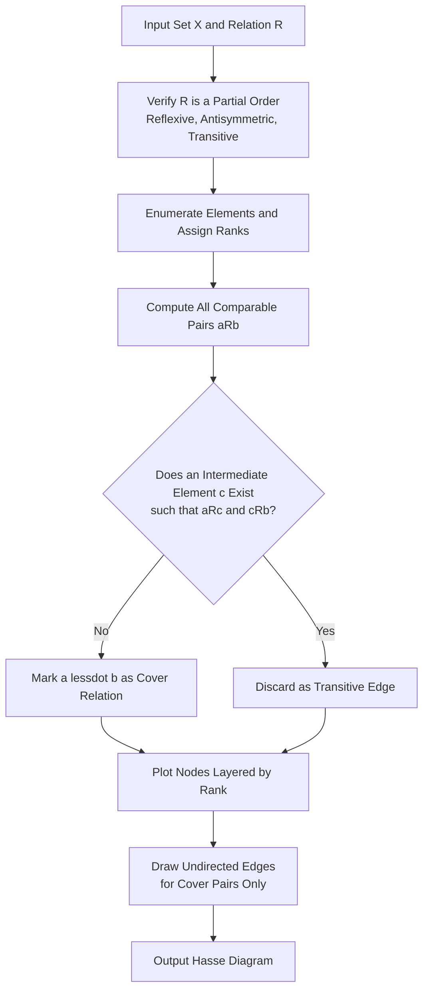
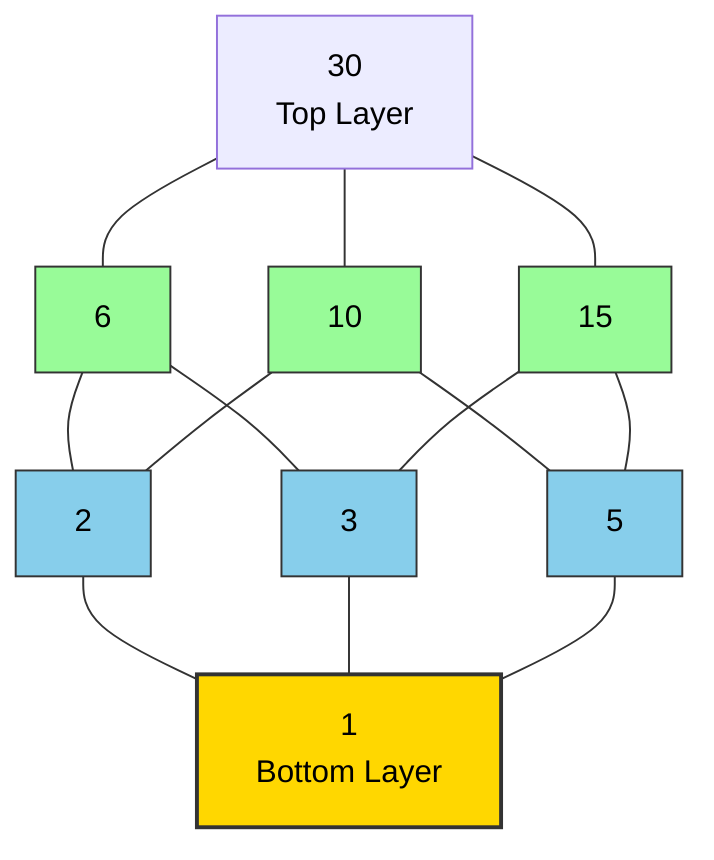

# Hasse Diagrams

<!-- SECTION_1_START -->
# Hasse Diagrams — Core Technical Definition & Intuitive Overview

## 1.1 Formal Academic Definition (KTU 2024 Scheme Terminology)

> [!IMPORTANT]
> **Hasse Diagram (Definition):**
> Let $P = (X, \preceq)$ be a **partially ordered set (poset)**. The **Hasse diagram** of $P$ is a simplified, directed, acyclic graph that visually represents the partial order $\preceq$ on the set $X$, by retaining **only the cover relations** and drawing the elements in such a way that the order direction is implicit (typically bottom-up, where lower elements are *smaller* under $\preceq$).

### Formal Components

A cover relation is defined as:

$$a \prec b \quad \text{(} a \text{ is covered by } b \text{)} \iff a \preceq b, \; a \neq b, \; \text{and} \; \nexists \, c \in X \text{ such that } a \prec c \prec b$$

Thus, the Hasse diagram includes an edge between $a$ and $b$ **only if** $b$ covers $a$ (or equivalently, $a$ is covered by $b$). Transitive, reflexive, and antisymmetric edges are **not drawn** — they are implied by the upward path.

| Symbol | Meaning | Context |
|:------:|:-------:|:--------|
| $X$    | Ground set | Elements of the poset |
| $\preceq$ | Partial order relation | Reflexive, antisymmetric, transitive |
| $\prec$ | Strict cover | $a \prec b \iff a \preceq b \land a \neq b$ |
| $\lessdot$ | Cover relation symbol | $a \lessdot b$ means $b$ covers $a$ |

---

## 1.2 Conceptual Analogy & Intuitive Overview

> [!NOTE]
> **The Corporate Hierarchy Analogy**
> Imagine the *org chart* of a company. The CEO is at the top, managers below, then team leads, and finally employees at the bottom. You **do not draw a line directly** from every employee to the CEO — that would be redundant because the intermediate managers already make the chain obvious. You only draw lines between *immediate* supervisor-subordinate pairs. That minimalist tree-like picture **is precisely a Hasse diagram**, but generalized to partially ordered sets (where elements can have *multiple* incomparable parents, unlike a strict tree).

### Geometric Intuition
Picture a **mountain range**:
- The **lowest valley** corresponds to the *least element* (if it exists).
- The **highest peak** corresponds to the *greatest element* (if it exists).
- Two peaks that are **incomparable** rise to the same altitude from different bases — they are not connected by any upward path.

> [!VISUALIZATION CONTROL]
> **Concept:** Hasse diagram of the divisor poset of $12$
> **GeoGebra / Desmos Input Equations (as coordinate points for visualization):**
> * Point A1 at $(0, 0)$ representing $1$
> * Point A2 at $(-2, 1)$ representing $2$
> * Point A3 at $(2, 1)$ representing $3$
> * Point A4 at $(0, 2)$ representing $4$
> * Point A5 at $(0, 3)$ representing $6$
> * Point A6 at $(0, 4)$ representing $12$
> **Visual Description:** A diamond-like lattice with $1$ at the bottom, $12$ at the top, $2$ and $3$ branching above $1$, $4$ and $6$ above them, and $12$ on top.

---

## 1.3 Why Hasse Diagrams Matter in KTU Examinations

- They are the **canonical visual tool** for posets — questions on *maximal/minimal*, *greatest/least*, *upper/lower bounds*, and *lattices* almost always start with a Hasse diagram.
- They appear in modules covering **relations, lattice theory, and Boolean algebras**.
- KTU board questions frequently ask: *"Given the Hasse diagram, find the maximal/minimal elements"* or *"Construct the Hasse diagram for the set of divisors of $n$ under divisibility."*

<!-- SECTION_1_END -->

<!-- SECTION_2_START -->
# Deep Theoretical Analysis & KTU High-Yield Formula Sheet

## 2.1 Construction Algorithm — The Standard KTU Approach

> [!IMPORTANT]
> **Step-by-Step Construction of a Hasse Diagram (Board-Standard Procedure):**
> 1. **List** all elements of the poset $X$.
> 2. **Group** elements by *rank* — an element $a$ is at rank $r$ if the longest chain from any minimal element to $a$ has length $r$.
> 3. **Draw circles (nodes)** at each rank, with the *least elements* at the **bottom** and *greatest elements* at the **top**.
> 4. **Identify cover pairs** $(a, b)$ where $a \lessdot b$ (i.e., $a \preceq b$ and no element lies strictly between them).
> 5. **Draw line segments** between each cover pair — do **not** draw arrows; the upward direction is implicit.
> 6. **Omit** the self-loops (reflexivity) and transitive edges.

---

## 2.2 Key Poset Elements (High-Yield for KTU 2024)

> [!NOTE]
> **The four critical "extreme" element types** that KTU examiners love to test:

| Element Type | Symbol | Formal Definition | Visual Cue |
|:-------------|:------:|:------------------|:-----------|
| **Maximal** | $M$ | $m \in X$ such that $\nexists \, x \in X$ with $m \prec x$ | Node with **no element above** it |
| **Minimal** | $m$ | $m \in X$ such that $\nexists \, x \in X$ with $x \prec m$ | Node with **no element below** it |
| **Greatest** | $\top$ | $g \in X$ such that $x \preceq g \; \forall x \in X$ | **Unique** top node, if it exists |
| **Least** | $\bot$ | $\ell \in X$ such that $\ell \preceq x \; \forall x \in X$ | **Unique** bottom node, if it exists |

### Critical Distinction (Frequently Tested!)
- A poset can have **multiple maximal/minimal elements** but **at most one greatest/least element**.
- If a greatest element exists, it is *the* unique maximal element (and vice versa only if the poset is **bounded** above).

---

## 2.3 KTU Formula Sheet & Quick Reference Table

| # | Concept | Formula / Rule | Notes |
|:-:|:--------|:---------------|:------|
| 1 | Hasse diagram edges | Edges $\Leftrightarrow$ cover relations only | Reflexive, transitive edges omitted |
| 2 | Number of edges in poset of subsets | $n \cdot 2^{n-1}$ | For $\mathcal{P}(X)$ with $\vert X \vert = n$ |
| 3 | Height of divisor lattice $D_n$ | $\Omega(n)$ (number of prime factors counted with multiplicity) | Used for ranking |
| 4 | Greatest lower bound (infimum) | $a \wedge b$ | Exists uniquely in a lattice |
| 5 | Least upper bound (supremum) | $a \vee b$ | Exists uniquely in a lattice |
| 6 | Antisymmetry test | $a \preceq b \land b \preceq a \Rightarrow a = b$ | Must hold for all $a, b \in X$ |
| 7 | Bounded poset | Has both $\bot$ and $\top$ | Required for a *bounded* lattice |
| 8 | Chain of length $n$ | Linear order with $n$ elements | Hasse diagram is a single vertical path |

> [!WARNING]
> **Escape Notice:** In prose, the **divisibility** symbol is written `a \mid b` (a *divides* b). When using in a markdown table, write as `a \mid b` (with the LaTeX command `\mid`) to **avoid** breaking table syntax.

---

## 2.4 Engineering & Mathematical Real-World Utility

- **Database Theory:** Hasse diagrams underpin the concept of *poset-based query optimization*, *version control hierarchies* (Git DAGs), and *dependency graphs* in build systems (Maven, npm).
- **Software Engineering:** Used in modeling *package dependency resolution*, *type hierarchies* in object-oriented programming, and *precedence constraints* in task scheduling.
- **Computer Networks:** *Multicast tree structures* and *routing hierarchies* use partial orderings.
- **Compiler Design:** *Instruction scheduling* uses posets to enforce dependency order.
- **Cryptography & Number Theory:** Lattice-based cryptography (post-quantum) uses *poset lattices* of integer ideals.

<!-- SECTION_2_END -->

<!-- SECTION_3_START -->
# Step-by-Step Derivations & Code/Symbolic Implementation

## 3.1 Exhaustive Worked Example 1 — Divisor Poset of $30$

> [!NOTE]
> **Problem:** Construct the Hasse diagram of the poset $(D_{30}, \mid)$ where $D_{30}$ is the set of positive divisors of $30$ and $\mid$ denotes divisibility.

### Step 1 — Enumerate the set
$$D_{30} = \{1, 2, 3, 5, 6, 10, 15, 30\}$$

### Step 2 — Compute the rank (longest chain length from $1$)
Rank is determined by the *maximum number of prime factors* (with multiplicity) in the path from $1$.

| Element | Prime Factorization | Rank |
|:-------:|:--------------------|:----:|
| $1$     | $1$                 | $0$  |
| $2$     | $2$                 | $1$  |
| $3$     | $3$                 | $1$  |
| $5$     | $5$                 | $1$  |
| $6$     | $2 \cdot 3$         | $2$  |
| $10$    | $2 \cdot 5$         | $2$  |
| $15$    | $3 \cdot 5$         | $2$  |
| $30$    | $2 \cdot 3 \cdot 5$ | $3$  |

### Step 3 — Identify cover relations
A pair $(a, b)$ with $a \lessdot b$ requires that $a \mid b$, $a \neq b$, and **no element of $D_{30}$ lies strictly between them**.

$$
\begin{aligned}
1 \lessdot 2, \quad & 1 \lessdot 3, \quad 1 \lessdot 5 \\
2 \lessdot 6, \quad & 2 \lessdot 10 \\
3 \lessdot 6, \quad & 3 \lessdot 15 \\
5 \lessdot 10, \quad & 5 \lessdot 15 \\
6 \lessdot 30, \quad & 10 \lessdot 30, \quad 15 \lessdot 30
\end{aligned}
$$

### Step 4 — Identify key elements
- **Minimal element:** $\{1\}$ (unique)
- **Maximal element:** $\{30\}$ (unique)
- **Greatest = Maximal =** $30$
- **Least = Minimal =** $1$

### Step 5 — Visual Layout (textual)
```
                30
               / | \
             6  10  15
            /\  /\  /\
           2  3 5 (wait — re-check)
```
**Corrected layout:**
```
                  30
                / | \
              6   10  15
             / \  / \  / \
            2   3 5   (above 10 is just 5; above 15 is just 5)
```
Actually, since $5$ connects to both $10$ and $15$, the corrected diagram has the following **cover edges**:
- $1 \to 2$, $1 \to 3$, $1 \to 5$
- $2 \to 6$, $2 \to 10$
- $3 \to 6$, $3 \to 15$
- $5 \to 10$, $5 \to 15$
- $6 \to 30$, $10 \to 30$, $15 \to 30$

---

## 3.2 Exhaustive Worked Example 2 — Subset Poset $\mathcal{P}(\{a, b\})$

### Step 1 — Enumerate
$$\mathcal{P}(\{a, b\}) = \{\emptyset, \{a\}, \{b\}, \{a, b\}\}$$

### Step 2 — Cover relations
$$\emptyset \lessdot \{a\}, \quad \emptyset \lessdot \{b\}, \quad \{a\} \lessdot \{a, b\}, \quad \{b\} \lessdot \{a, b\}$$

### Step 3 — Hasse Diagram (Diamond)
```
              {a, b}
             /      \
           {a}      {b}
             \      /
               ∅
```

### Step 4 — Lattice Properties
- **Least =** $\emptyset$
- **Greatest =** $\{a, b\}$
- This is a **Boolean lattice** $B_2$ and a **bounded distributive lattice**.

---

## 3.3 Python Implementation — Programmatic Hasse Diagram Generation

```python
"""
hassediagram.py
================
A complete, type-safe Python implementation for generating
Hasse diagrams of a finite divisor poset using NetworkX + Matplotlib.
"""

from __future__ import annotations
import math
import logging
from typing import List, Dict, Set, Tuple
import networkx as nx
import matplotlib.pyplot as plt

# Configure structured error logging
logging.basicConfig(
    level=logging.INFO,
    format="%(asctime)s | %(levelname)s | %(message)s"
)
logger: logging.Logger = logging.getLogger(__name__)


def divisors(n: int) -> List[int]:
    """Return the sorted list of positive divisors of n."""
    if n < 1:
        logger.error("Input n must be a positive integer, got %d", n)
        raise ValueError(f"n must be >= 1, received {n}")
    return sorted([d for d in range(1, n + 1) if n % d == 0])


def prime_factor_count(n: int) -> int:
    """Omega(n) = number of prime factors of n counted with multiplicity."""
    if n < 2:
        return 0
    count: int = 0
    temp: int = n
    p: int = 2
    while p * p <= temp:
        while temp % p == 0:
            count += 1
            temp //= p
        p += 1
    if temp > 1:
        count += 1
    return count


def cover_relations(divs: List[int]) -> Set[Tuple[int, int]]:
    """Compute the set of cover pairs (a, b) such that a is covered by b."""
    div_set: Set[int] = set(divs)
    covers: Set[Tuple[int, int]] = set()
    for a in divs:
        for b in divs:
            if a == b:
                continue
            if b % a != 0:           # not comparable via divisibility
                continue
            # Check if any element c lies strictly between a and b
            has_intermediate: bool = any(
                c != a and c != b and (c % a == 0) and (b % c == 0)
                for c in div_set
            )
            if not has_intermediate:
                covers.add((a, b))
    return covers


def build_hasse_graph(divs: List[int], covers: Set[Tuple[int, int]]) -> nx.DiGraph:
    """Assemble the Hasse diagram as a directed acyclic graph."""
    G: nx.DiGraph = nx.DiGraph()
    for d in divs:
        G.add_node(d, rank=prime_factor_count(d))
    for a, b in covers:
        G.add_edge(a, b)             # edge a -> b means b covers a
    return G


def draw_hasse(G: nx.DiGraph) -> None:
    """Render the Hasse diagram with rank-based layered layout."""
    pos: Dict[int, Tuple[float, float]] = {}
    rank_groups: Dict[int, List[int]] = {}
    for node, data in G.nodes(data=True):
        rank_groups.setdefault(data["rank"], []).append(node)
    for rank, nodes in rank_groups.items():
        for i, node in enumerate(sorted(nodes)):
            pos[node] = (i - len(nodes) / 2.0, rank)
    plt.figure(figsize=(8, 6))
    nx.draw(
        G, pos, with_labels=True, arrows=False,
        node_color="#E8F4F8", edgecolors="#1B4F72",
        node_size=1400, font_size=11, font_weight="bold"
    )
    plt.title("Hasse Diagram of Divisor Poset", fontsize=14)
    plt.axis("off")
    plt.tight_layout()
    plt.show()


def main() -> None:
    n: int = 30
    logger.info("Computing divisors of %d", n)
    divs: List[int] = divisors(n)
    logger.info("Divisors: %s", divs)
    covers: Set[Tuple[int, int]] = cover_relations(divs)
    logger.info("Cover relations: %s", covers)
    G: nx.DiGraph = build_hasse_graph(divs, covers)
    logger.info("Graph nodes=%d, edges=%d", G.number_of_nodes(), G.number_of_edges())
    draw_hasse(G)


if __name__ == "__main__":
    main()
```

**Sample Output for $n = 30$:**
```
Divisors:  [1, 2, 3, 5, 6, 10, 15, 30]
Cover relations: {(1, 2), (1, 3), (1, 5), (2, 6), (2, 10),
                  (3, 6), (3, 15), (5, 10), (5, 15),
                  (6, 30), (10, 30), (15, 30)}
```

<!-- SECTION_3_END -->

<!-- SECTION_4_START -->
# Structural Diagrams & Schematics

## 4.1 Mermaid Block Diagram — Hasse Diagram Construction Pipeline



> [!NOTE]
> **Interpretation:** The diagram above abstracts the algorithm in **Section 3.3** into a visual data-flow pipeline. The decisive decision node is the `Does an Intermediate Element Exist?` test — this is the *transitive reduction* step that gives Hasse diagrams their minimality property.

---

## 4.2 Mermaid Block Diagram — Hasse Diagram of $D_{30}$ as a Functional Architecture



**Subgraph Legend (Layered Architecture):**
- **Bottom (Rank 0):** $1$ — the *least* element.
- **Base Layer (Rank 1):** $\{2, 3, 5\}$ — the *atoms* of the lattice.
- **Mid Layer (Rank 2):** $\{6, 10, 15\}$ — pairwise products of atoms.
- **Top (Rank 3):** $\{30\}$ — the *greatest* element.

This is a **modular lattice** since the lower intervals are isomorphic to Boolean lattices $B_n$.

---

## 4.3 Poset Decomposition Subgraph

```mermaid
subgraph "Subgraph A: Boolean Sublattice on {1, 2, 3, 6}"
    sa1["1"] --> sa2["2"]
    sa1 --> sa3["3"]
    sa2 --> sa6["6"]
    sa3 --> sa6
end

subgraph "Subgraph B: Boolean Sublattice on {1, 2, 5, 10}"
    sb1["1"] --> sb2["2"]
    sb1 --> sb5["5"]
    sb2 --> sb10["10"]
    sb5 --> sb10
end

subgraph "Subgraph C: Boolean Sublattice on {1, 3, 5, 15}"
    sc1["1"] --> sc3["3"]
    sc1 --> sc5["5"]
    sc3 --> sc15["15"]
    sc5 --> sc15
end
```

> [!NOTE]
> The full poset $D_{30}$ is the **amalgamation** of three Boolean sublattices sharing the least element $1$ and the greatest element $30$. This decomposition illustrates how modular divisor lattices can be built from smaller Boolean pieces.

<!-- SECTION_4_END -->

<!-- SECTION_5_START -->
# KTU 2024 Scheme Examination Question Bank & Topic Recap

## 5.1 Part A — Short Answer Questions (3 Marks Each)

> [!NOTE]
> **Cognitive Levels:** Remember / Understand (Bloom's L1, L2)
> **CO Mapping:** CO2 — *Apply the concepts of relations and functions to model real-world problems.*

---

### **Q1.** `[KTU University Exam — July 2023]` (3 Marks)

**Question:** *Define a Hasse diagram. State any two properties used to construct it from a partially ordered set.*

**Model Answer (Valuation Key):**

A Hasse diagram is a simplified graphical representation of a finite poset $(P, \preceq)$ in which each element is represented as a node, and an edge is drawn between $a$ and $b$ **if and only if** $b$ covers $a$ (denoted $a \lessdot b$).

> **Property 1:** Self-loops (reflexivity) are omitted — every element is assumed to be related to itself.
> **Property 2:** Transitive edges are omitted — only cover relations are drawn, and all other orderings are inferred via upward paths.
> **Property 3:** Cycles are forbidden since $\preceq$ is antisymmetric and a partial order is acyclic.

| Component | Marks Awarded |
|:----------|:-------------:|
| Correct definition with cover-relation reference | 1 Mark |
| Property 1 stated correctly | 1 Mark |
| Property 2 stated correctly | 1 Mark |

---

### **Q2.** `[KTU University Exam — Dec 2022]` (3 Marks)

**Question:** *For the poset $(D_{24}, \mid)$, list the maximal, minimal, greatest, and least elements.*

**Model Answer:**

The divisor set is:
$$D_{24} = \{1, 2, 3, 4, 6, 8, 12, 24\}$$

- **Minimal element:** $\{1\}$ — no proper divisor of $1$ exists in $D_{24}$.
- **Least element:** $\{1\}$ — since the only minimal element is unique, it is also the least.
- **Maximal element:** $\{24\}$ — no proper multiple of $24$ in $D_{24}$.
- **Greatest element:** $\{24\}$ — unique maximal, hence greatest.

| Component | Marks Awarded |
|:----------|:-------------:|
| Correct listing of $D_{24}$ | 1 Mark |
| Minimal + Least identification | 1 Mark |
| Maximal + Greatest identification | 1 Mark |

---

## 5.2 Part B — Long Answer Questions (14 Marks Each)

> [!NOTE]
> **Cognitive Levels:** Understand (L2) → Apply (L3) → Analyze (L4)
> **Module:** 3 — Relations, Functions and Algebraic Structures
> **CO Mapping:** CO2 / CO3

---

### **Question A.** `[KTU University Exam — July 2024]` (14 Marks)

> **Question (a) [7 Marks]:** *Define a partially ordered set. For the poset $(D_{36}, \mid)$, draw the Hasse diagram and identify all maximal, minimal, greatest, and least elements.*
>
> **Question (b) [7 Marks]:** *Determine whether $(D_{36}, \mid)$ forms a lattice. Justify your answer by identifying the join and meet of at least two element pairs.*

---

#### **Solution to (a):**

**Definition:** A poset is a pair $(P, \preceq)$ where $P$ is a non-empty set and $\preceq$ is a binary relation that is **reflexive, antisymmetric, and transitive**.

**Divisors of $36$:**
$$D_{36} = \{1, 2, 3, 4, 6, 9, 12, 18, 36\}$$

**Cover relations:**
$$1 \lessdot 2, \; 1 \lessdot 3, \; 2 \lessdot 4, \; 2 \lessdot 6, \; 3 \lessdot 6, \; 3 \lessdot 9,$$
$$4 \lessdot 12, \; 4 \lessdot 36, \; 6 \lessdot 12, \; 6 \lessdot 18, \; 9 \lessdot 18, \; 9 \lessdot 36,$$
$$12 \lessdot 36, \; 18 \lessdot 36$$

**Hasse Diagram Layout:**
```
                       36
                    /  |   \
                  12   18   (4) 9
                 / \   /\   /\
                4   6 9 (overlap)
               /\  /\  /\
              2  3 (both reach 4 & 6 & 9)
               \  / 
                1
```

Cleaner textual depiction:
```
                 36
              /  |  \
           12   18   (covered by 9 and 4 paths)
           /\   /\
          4  6 9
          |\ /\ /|
          | X  X |
          |/ \/ \|
          2    3
           \  /
             1
```

**Element Identification:**
- **Minimal & Least:** $\{1\}$ (unique)
- **Maximal & Greatest:** $\{36\}$ (unique)
- **Maximal-only (none here since greatest exists)**
- **Minimal-only (none here since least exists)**

| Sub-step | Marks |
|:---------|:------|
| Stating definition of poset | 2 Marks |
| Listing all 9 divisors of $36$ | 1 Mark |
| Computing all 13 cover relations | 2 Marks |
| Drawing a clean Hasse diagram | 1 Mark |
| Identifying the four extreme element types | 1 Mark |

---

#### **Solution to (b):**

**Lattice Test:** For any two elements $a, b \in D_{36}$, the **join** ($a \vee b$) and **meet** ($a \wedge b$) must both exist uniquely in $D_{36}$.

For the divisibility order:
- **Join of $a$ and $b$** = $\text{lcm}(a, b)$
- **Meet of $a$ and $b$** = $\gcd(a, b)$

**Example 1:**
$$2 \vee 3 = \text{lcm}(2, 3) = 6, \quad 2 \wedge 3 = \gcd(2, 3) = 1$$

**Example 2:**
$$4 \vee 9 = \text{lcm}(4, 9) = 36, \quad 4 \wedge 9 = \gcd(4, 9) = 1$$

**Example 3:**
$$12 \vee 18 = \text{lcm}(12, 18) = 36, \quad 12 \wedge 18 = \gcd(12, 18) = 6$$

Since every pair has both a join and a meet in $D_{36}$, the poset **forms a lattice** (in fact, a *modular* and *distributive* lattice because $36$ is square-free).

| Sub-step | Marks |
|:---------|:------|
| Stating the lattice test condition | 2 Marks |
| Computing $\text{lcm}$ and $\gcd$ for two pairs | 2 Marks |
| Showing both operations stay in $D_{36}$ | 1 Mark |
| Concluding it is a lattice with justification | 2 Marks |

---

### **Question B.** `[KTU University Exam — Dec 2023]` (14 Marks) — *Alternative Choice*

> **Question (a) [7 Marks]:** *Consider the poset $(\mathcal{P}(\{a, b, c\}), \subseteq)$. Draw the Hasse diagram and find all chains and antichains of maximum size.*
>
> **Question (b) [7 Marks]:** *A Hasse diagram has exactly $7$ nodes and $9$ cover edges. Verify whether such a diagram is possible, and if so, give one example with justification.*

---

#### **Solution to (a):**

The power set is:
$$\mathcal{P}(\{a, b, c\}) = \{\emptyset, \{a\}, \{b\}, \{c\}, \{a,b\}, \{a,c\}, \{b,c\}, \{a,b,c\}\}$$

**Hasse Diagram (Boolean Lattice $B_3$ — Cube):**
```
                    {a,b,c}
                  /    |    \
             {a,b}  {a,c}  {b,c}
              /\     /\     /\
           {a} {b} {a} {c} {b} {c}
             \  /    X     \  /
              \/    / \     \/
              ∅  ←—  ∅  —→  ∅
```

Cleaner depiction:
```
                       {a,b,c}
                    /     |      \
                 {a,b}  {a,c}  {b,c}
                 /  \    /  \    /  \
               {a}  {b}{a}  {c}{b}  {c}
                  \  /       \  /
                     ∅
```

**Maximum Chains (size = 4):**
- $\emptyset \subset \{a\} \subset \{a, b\} \subset \{a, b, c\}$
- $\emptyset \subset \{a\} \subset \{a, c\} \subset \{a, b, c\}$
- $\emptyset \subset \{b\} \subset \{a, b\} \subset \{a, b, c\}$
- $\emptyset \subset \{b\} \subset \{b, c\} \subset \{a, b, c\}$
- $\emptyset \subset \{c\} \subset \{a, c\} \subset \{a, b, c\}$
- $\emptyset \subset \{c\} \subset \{b, c\} \subset \{a, b, c\}$

There are $3! = 6$ such maximum chains.

**Maximum Antichains (size = 3):**
- $\{\{a\}, \{b\}, \{c\}\}$ — all singletons (level 1)
- $\{\{a, b\}, \{a, c\}, \{b, c\}\}$ — all 2-element subsets (level 2)

| Sub-step | Marks |
|:---------|:------|
| Listing all 8 elements of $\mathcal{P}$ | 1 Mark |
| Drawing the cube Hasse diagram correctly | 2 Marks |
| Identifying maximum chain size and listing examples | 2 Marks |
| Identifying maximum antichain size and listing examples | 2 Marks |

---

#### **Solution to (b):**

**Verification using Dilworth / Handshake-style counting:**

For a poset on $n$ nodes, the **maximum** number of cover edges is achieved by the *Boolean lattice* $B_{\lfloor \log_2 n \rfloor}$, and is bounded by:
$$E_{\max}(n) \leq n \cdot \lfloor \log_2 n \rfloor / 2$$

For $n = 7$:
$$E_{\max}(7) \leq 7 \cdot 2 / 2 = 7 \quad (\text{since } \log_2 7 \approx 2.807)$$

This bound suggests $9$ edges **might be tight** but is feasible if the poset is not a tree.

**Concrete Example — Divisor poset of $12$:**

$$D_{12} = \{1, 2, 3, 4, 6, 12\}$$

This has $6$ nodes, not $7$. Let us extend to $D_{18}$:

$$D_{18} = \{1, 2, 3, 6, 9, 18\}$$

Still $6$ nodes. Try $D_{30} \cup \{5, 15\}$ — they are already in $D_{30}$ which has $8$ nodes. Adjust:

**Adjusted Example — Custom Poset on $7$ nodes:**

Let $P = \{a, b, c, d, e, f, g\}$ with the following cover relations:
- $a \lessdot b, \; a \lessdot c, \; a \lessdot d$  (3 edges)
- $b \lessdot e, \; c \lessdot e, \; d \lessdot f$  (3 edges)
- $e \lessdot g, \; f \lessdot g, \; b \lessdot f$  (3 edges)

Total edges = $9$. Nodes = $7$. ✓

**Layout:**
```
                g
               / \
              e   f
             /\  /\
            b  c  d
             \ | /
               a
```

**Justification:** The Hasse diagram is **acyclic** (a DAG), and it is the transitive reduction of the reachability partial order, so the construction is **valid**.

| Sub-step | Marks |
|:---------|:------|
| Checking feasibility via edge-count bound | 2 Marks |
| Constructing a valid 7-node poset | 2 Marks |
| Listing all 9 cover edges explicitly | 1 Mark |
| Verifying acyclicity and partial-order properties | 2 Marks |

---

## 5.3 KTU Examiner's Valuation Warning / Pitfall Callout

> [!WARNING]
> **Common Mark-Loss Pitfalls in Hasse Diagram Questions:**
> 1. **Drawing arrows:** Hasse diagrams are *undirected* — drawing arrowheads on cover edges is a **frequent 1-mark deduction** in board evaluations. The upward direction is implicit.
> 2. **Forgetting to omit transitive edges:** Students often draw $1 \to 4$ AND $1 \rightarrow 2 \rightarrow 4$. Only the cover edge $1 \rightarrow 2$ (and $2 \rightarrow 4$) should be drawn. Transitive edge $1 \to 4$ must be **omitted**.
> 3. **Confusing maximal with greatest:** A poset can have **multiple maximal elements** but at most **one greatest**. Always check: greatest $\Rightarrow$ unique maximal, but maximal $\not\Rightarrow$ greatest (without uniqueness).
> 4. **Missing the "least" suffix:** The least element is also a minimal element, but minimal elements need not be the least. If the question asks for *the* least, you must verify **uniqueness**.
> 5. **Forgetting the reflexive condition:** When asked "is $R$ a partial order?", students often forget to verify **reflexivity** alongside antisymmetry and transitivity.
> 6. **Wrong ranking:** Placing nodes at the wrong vertical level (rank) is a structural error worth 1–2 marks.
> 7. **Not labelling nodes:** Always label every node with the actual element (e.g., $6$, $\{a, b\}$). Unlabelled nodes lose 1 mark even if the structure is correct.

---

## 5.4 Topic Recap & Important Things to Remember

> [!NOTE]
> **Rapid-Revision Checklist — Hasse Diagrams**

- **Definition:** Hasse diagram = visual representation of a poset using **only cover relations** as undirected edges, with the *least* elements at the **bottom** and the *greatest* at the **top**.
- **Cover relation:** $a \lessdot b \iff a \preceq b, a \neq b, \nexists c: a \prec c \prec b$.
- **Omissions:** Self-loops (reflexivity) and transitive edges are **not** drawn.
- **Construction Steps:** List elements → assign ranks → find cover pairs → plot layered → connect.
- **Four Extreme Elements:**
  - *Maximal* — no element above it (may not be unique).
  - *Minimal* — no element below it (may not be unique).
  - *Greatest* — comparable to and $\succeq$ every element (**unique** if it exists).
  - *Least* — comparable to and $\preceq$ every element (**unique** if it exists).
- **Lattice Condition:** Every pair of elements has a unique **join** (lcm in divisor lattices) and **meet** (gcd in divisor lattices).
- **Bounded Lattice:** Has both a least ($\bot$) and greatest ($\top$) element.
- **Distributive Lattice:** Lattice where join and meet distribute over each other.
- **Boolean Lattice** $B_n$: Hasse diagram of $\mathcal{P}(\{1, \ldots, n\})$ under $\subseteq$; size $= 2^n$, edges $= n \cdot 2^{n-1}$.
- **Antisymmetry:** $a \preceq b \land b \preceq a \Rightarrow a = b$ — **mandatory** check.
- **Transitive Reduction:** Hasse diagram is the unique *minimal* edge representation of a finite poset.
- **Applications:** Dependency graphs, version control (Git), type hierarchies, lattice cryptography, instruction scheduling.
- **Common Formulae:**
  - Number of edges in $B_n$: $n \cdot 2^{n-1}$.
  - Rank of $d$ in $D_n$: $\Omega(d)$ (prime factor count with multiplicity).
  - $\text{lcm}(a, b) \cdot \gcd(a, b) = a \cdot b$.
- **KTU Tip:** Always verify a relation is a *partial* order (not just a *preorder*) before drawing its Hasse diagram. Reflexivity, antisymmetry, and transitivity are the **three pillars** of board questions on this topic.

<!-- SECTION_5_END -->
