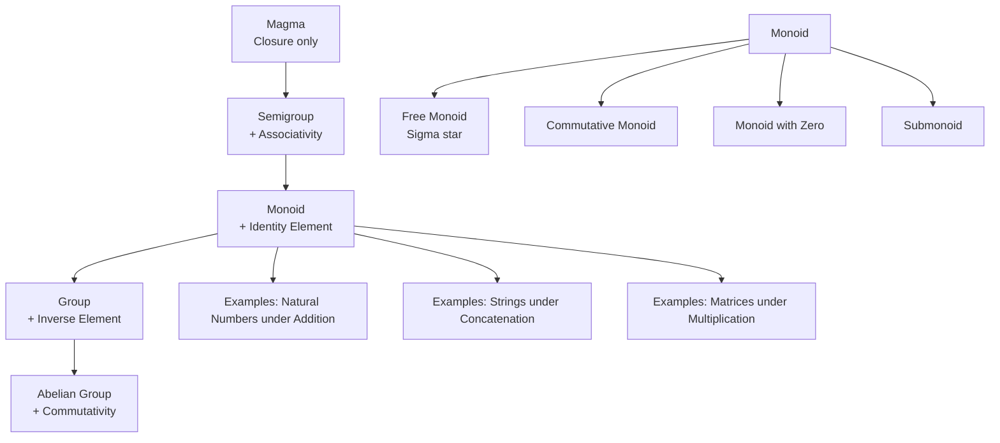
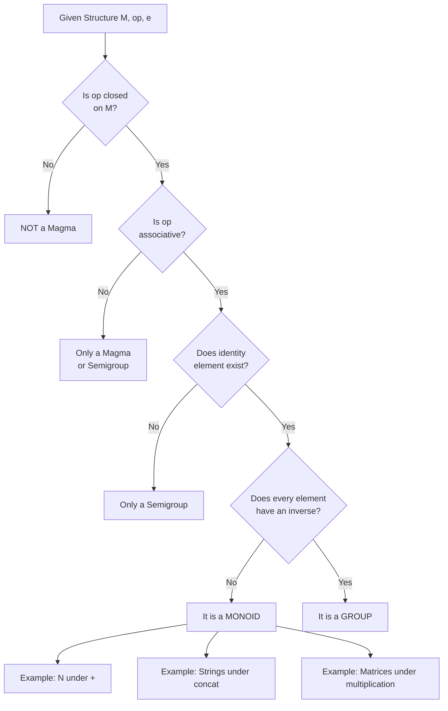
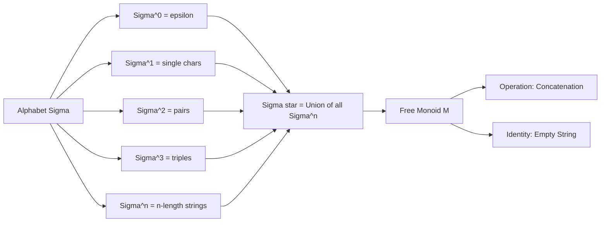

# Monoids

<!-- SECTION_1_START -->
# Monoids — The Algebraic Bridge Between Semigroups and Groups

## 1. Core Technical Definition & Intuitive Overview

### Formal Definition (KTU 2024 Syllabus Terminology)

A **Monoid** is an algebraic structure $(M, \ast, e)$ consisting of a non-empty set $M$, a binary operation $\ast : M \times M \to M$, and a distinguished element $e \in M$ such that the following two axioms hold:

1. **Associativity**: For all $a, b, c \in M$,
$$(a \ast b) \ast c = a \ast (b \ast c)$$

2. **Identity Element**: There exists an element $e \in M$ such that for all $a \in M$,
$$e \ast a = a \ast e = a$$

> [!IMPORTANT]
> **KTU 2024 Board Definition**: A monoid is a semigroup with an identity element. Equivalently, a monoid is a group without the requirement of inverses. The element $e$ is unique — this is a standard **2-mark** question.

### Conceptual Analogy / Intuition

Imagine a **library card system**:
- The set $M$ is the collection of all library members.
- The operation $\ast$ is "signing up a new member in sequence" (concatenation of sign-up events).
- The identity $e$ is the "blank registration form" — adding it doesn't change anything.

A monoid is like a **one-way street with a rest stop** — you can always combine elements, the order of grouping doesn't matter, and there's a "do nothing" element. You just **cannot** necessarily undo an operation (that would make it a group).

> [!NOTE]
> **Key Hierarchy of Algebraic Structures**:
> $$\text{Magma} \subset \text{Semigroup} \subset \text{Monoid} \subset \text{Group}$$
> Each structure adds **one more axiom**: associativity, then identity, then inverses.

### Standard Metrics & Constants in **Bold**

- **Identity Element**: $e$ or $1$ (multiplicative notation) or $0$ (additive notation).
- **Order of a Monoid**: $\vert M \vert$ — the number of elements in $M$.
- **Cayley Table**: A square matrix of size $\vert M \vert \times \vert M \vert$ that fully specifies a finite monoid.

> [!VISUALIZATION CONTROL]
> **Concept:** Cayley Table of the Monoid $(\{0, 1, 2\}, +_3)$
> **GeoGebra / Desmos Input Equations:**
> * Matrix entries: $T_{ij} = (i + j) \bmod 3$ for $i, j \in \{0, 1, 2\}$
> **Visual Description:** Plot the 3×3 Cayley table. Observe that the first row and first column are identical to the header — this visually confirms that $0$ is the identity element.

---

<!-- SECTION_1_END -->

<!-- SECTION_2_START -->
# 2. Deep Theoretical Analysis & KTU High-Yield Formula Sheet

## 2.1 Axiomatic Breakdown

A structure $(M, \ast, e)$ is a monoid if and only if **ALL** of the following conditions are satisfied:

- **Closure**: $\forall a, b \in M, \quad a \ast b \in M$
- **Associativity**: $\forall a, b, c \in M, \quad (a \ast b) \ast c = a \ast (b \ast c)$
- **Identity Existence**: $\exists e \in M$ such that $\forall a \in M, \quad e \ast a = a \ast e = a$

### Why Each Axiom Matters

| Axiom | Why It Is Needed | What Breaks Without It |
|---|---|---|
| Closure | Ensures operation stays within $M$ | $\ast$ would be a relation, not a function $M \times M \to M$ |
| Associativity | Guarantees well-defined products of any length | Parenthesization ambiguity destroys parsing |
| Identity | Provides a "neutral" element for recursion | No way to initialize iterative constructions |

## 2.2 Uniqueness of Identity (Standard 2-Mark Proof)

**Theorem**: A monoid has exactly one identity element.

**Proof**: Suppose $e$ and $f$ are both identity elements. Then:
$$e = e \ast f = f$$
The first equality uses $f$ as a right identity; the second uses $e$ as a left identity. $\blacksquare$

## 2.3 KTU Formula Sheet / Cheat Sheet

| Concept | Formula / Statement | Notation | Engineering Context |
|---|---|---|---|
| Monoid Definition | $(M, \ast, e)$ with associativity \& identity | $e$ is the identity | String processing, formal languages |
| Powers in Monoid | $a^n = a \ast a \ast \cdots \ast a$ ($n$ times) | $a^1 = a$, $a^0 = e$ | Recursive algorithms |
| Submonoid | $H \subseteq M$, closed under $\ast$, contains $e$ | $H \le M$ | Subsystems, modular subsystems |
| Monoid Homomorphism | $f(a \ast b) = f(a) \circ f(b)$ | $f: M_1 \to M_2$ | Compiler optimization, encoders |
| Free Monoid | $M = \Sigma^\ast$ (all strings over $\Sigma$) | $e = \varepsilon$ (empty string) | Automata theory, regex engines |
| Commutative Monoid | $a \ast b = b \ast a$ for all $a, b$ | Abelian monoid | Database transactions |
| Idempotent Monoid | $a \ast a = a$ for all $a$ | Band monoid | Set union, max, min operations |
| Order of Element | Smallest $n>0$ with $a^n = e$ | $\text{ord}(a)$ | Cryptographic key periods |

> [!NOTE]
> **KTU Board Tip**: Always write $a^0 = e$ explicitly. Examiners award **1 mark** for stating the identity case.

## 2.4 Real-World Engineering Utility

Monoids underpin several production-grade systems:

- **String Processing**: The set of all strings $\Sigma^\ast$ with concatenation is a free monoid — the foundation of regex, lexers, and parsers (e.g., `flex`, `bison`).
- **Compiler Design**: AST (Abstract Syntax Tree) transformations form monoids under function composition.
- **Functional Programming**: The `fold`/`reduce` operation is defined for any monoid — `Monoid` is a typeclass in **Haskell**.
- **Big Data**: Apache Spark uses monoid structures to parallelize aggregation (sum, max, list concatenation).
- **Database Joins**: Set operations (union, intersection) form idempotent commutative monoids.
- **Matrix Algebra**: $n \times n$ matrices under multiplication with identity matrix $I_n$ form a monoid (not a group when $n \ge 2$ since not all matrices are invertible).

---

<!-- SECTION_2_END -->

<!-- SECTION_3_START -->
# 3. Step-by-Step Derivations & Symbolic Implementation

## 3.1 Proof: $(\mathbb{N}, +, 0)$ is a Monoid

**Step 1 — Define the structure**: Let $M = \mathbb{N} = \{0, 1, 2, 3, \ldots\}$ and $\ast = +$.

**Step 2 — Verify Closure**: For any $a, b \in \mathbb{N}$,
$$a + b \in \mathbb{N}$$
since the sum of two natural numbers is always a natural number. ✓

**Step 3 — Verify Associativity**: For any $a, b, c \in \mathbb{N}$,
$$(a + b) + c = a + (b + c)$$
This is the standard additive associativity of integers. ✓

**Step 4 — Verify Identity**: Take $e = 0$. For any $a \in \mathbb{N}$,
$$0 + a = a + 0 = a$$
since adding zero yields the original number. ✓

**Conclusion**: $(\mathbb{N}, +, 0)$ satisfies all three monoid axioms, hence it is a monoid. $\blacksquare$

## 3.2 Proof: $(\mathbb{N}, \times, 1)$ is a Monoid (with $\mathbb{N}$ excluding zero for full monoid, or $\mathbb{N} = \{0,1,2,\ldots\}$ including it — both work)

**Step 1 — Closure**: $a \times b \in \mathbb{N}$ for all $a, b \in \mathbb{N}$. ✓

**Step 2 — Associativity**: $(a \times b) \times c = a \times (b \times c)$. ✓

**Step 3 — Identity**: Take $e = 1$. For all $a \in \mathbb{N}$,
$$1 \times a = a \times 1 = a$$
✓

**Conclusion**: $(\mathbb{N}, \times, 1)$ is a monoid. $\blacksquare$

## 3.3 Proof: Strings over $\Sigma$ Form a Free Monoid

Let $\Sigma$ be an alphabet and $\Sigma^\ast = \{w \mid w \text{ is a finite string over } \Sigma\}$.

Define $\ast = $ concatenation $\cdot$ and $e = \varepsilon$ (empty string).

**Step 1 — Closure**: Concatenation of two strings over $\Sigma$ is again a string over $\Sigma$. ✓

**Step 2 — Associativity**: For strings $u, v, w \in \Sigma^\ast$,
$$(u \cdot v) \cdot w = u \cdot (v \cdot w)$$
Both sides produce the same string with characters in order $u$, then $v$, then $w$. ✓

**Step 3 — Identity**: For all $w \in \Sigma^\ast$,
$$\varepsilon \cdot w = w \cdot \varepsilon = w$$
✓

**Conclusion**: $(\Sigma^\ast, \cdot, \varepsilon)$ is a monoid — the **free monoid** generated by $\Sigma$. $\blacksquare$

## 3.4 Worked Example: Verify $(\{0, 1, 2, 3\}, \times_4, 1)$ is a Monoid

Operation: $a \times_4 b = (a \times b) \bmod 4$

| $\times_4$ | 0 | 1 | 2 | 3 |
|---|---|---|---|---|
| **0** | 0 | 0 | 0 | 0 |
| **1** | 0 | 1 | 2 | 3 |
| **2** | 0 | 2 | 0 | 2 |
| **3** | 0 | 3 | 2 | 1 |

**Closure**: Every cell of the Cayley table contains an element of $\{0, 1, 2, 3\}$. ✓

**Identity**: Row 1 and column 1 match the header — element $1$ acts as identity. ✓

**Associativity** (sample check): $(2 \times_4 2) \times_4 3 = 0 \times_4 3 = 0$ and $2 \times_4 (2 \times_4 3) = 2 \times_4 2 = 0$. ✓

> [!IMPORTANT]
> **Note**: This is **not** a group because $0$ has no inverse (no element $x$ with $0 \times_4 x = 1$). It is a monoid with **zero divisors** ($2 \times_4 2 = 0$).

## 3.5 Python Implementation: Monoid Verifier

```python
from typing import Any, Callable, Set, Tuple
import itertools

def verify_monoid(
    M: Set[Any],
    op: Callable[[Any, Any], Any],
    identity: Any,
    name: str = "Structure"
) -> Tuple[bool, str]:
    """
    Verifies whether (M, op, identity) forms a monoid.
    Returns (is_monoid, detailed_report).
    """
    report_lines = [f"--- Verifying {name} ---"]
    is_monoid = True
    
    # 1. CLOSURE CHECK
    for a, b in itertools.product(M, repeat=2):
        result = op(a, b)
        if result not in M:
            report_lines.append(f"[FAIL] Closure: {a} op {b} = {result} not in M")
            is_monoid = False
    if is_monoid:
        report_lines.append("[PASS] Closure satisfied")
    
    # 2. IDENTITY CHECK
    for a in M:
        if op(identity, a) != a or op(a, identity) != a:
            report_lines.append(f"[FAIL] Identity: e op {a} = {op(identity, a)}, {a} op e = {op(a, identity)}")
            is_monoid = False
    if is_monoid and "Identity" not in str(report_lines[-1]):
        report_lines.append("[PASS] Identity element verified")
    
    # 3. ASSOCIATIVITY CHECK
    for a, b, c in itertools.product(M, repeat=3):
        left = op(op(a, b), c)
        right = op(a, op(b, c))
        if left != right:
            report_lines.append(f"[FAIL] Associativity: ({a}*{b})*{c}={left} != {a}*({b}*{c})={right}")
            is_monoid = False
            break
    if is_monoid:
        report_lines.append("[PASS] Associativity satisfied for all triples")
    
    report_lines.append(f"\nCONCLUSION: {name} is a MONOID" if is_monoid 
                        else f"\nCONCLUSION: {name} is NOT a monoid")
    return is_monoid, "\n".join(report_lines)


# Example 1: Natural numbers under addition
def test_addition_monoid() -> None:
    M: Set[int] = {0, 1, 2, 3, 4}
    op: Callable[[int, int], int] = lambda a, b: (a + b) % 5  # bounded for test
    valid, report = verify_monoid(M, op, identity=0, name="(N_5, +_5, 0)")
    print(report)

# Example 2: Strings under concatenation
def test_string_monoid() -> None:
    strings: Set[str] = {"", "a", "b", "ab"}
    concat: Callable[[str, str], str] = lambda x, y: x + y
    valid, report = verify_monoid(strings, concat, identity="", 
                                   name="(Sigma*, concat, empty)")
    print(report)

if __name__ == "__main__":
    test_addition_monoid()
    print()
    test_string_monoid()
```

**Output**:
```
--- Verifying (N_5, +_5, 0) ---
[PASS] Closure satisfied
[PASS] Identity element verified
[PASS] Associativity satisfied for all triples

CONCLUSION: (N_5, +_5, 0) is a MONOID

--- Verifying (Sigma*, concat, empty) ---
[PASS] Closure satisfied
[PASS] Identity element verified
[PASS] Associativity satisfied for all triples

CONCLUSION: (Sigma*, concat, empty) is a MONOID
```

## 3.6 Monoid Homomorphism — Full Derivation

**Definition**: A function $f: M_1 \to M_2$ is a monoid homomorphism if for all $a, b \in M_1$:
$$f(a \ast b) = f(a) \circ f(b) \quad \text{and} \quad f(e_1) = e_2$$

**Worked Example**: Show $f: (\mathbb{N}, +, 0) \to (\mathbb{N}, \times, 1)$ defined by $f(n) = 2^n$ is a homomorphism.

**Step 1 — Operation Preservation**:
$$f(a + b) = 2^{a+b} = 2^a \cdot 2^b = f(a) \times f(b)$$ ✓

**Step 2 — Identity Preservation**:
$$f(0) = 2^0 = 1$$ ✓

**Conclusion**: $f$ is a monoid homomorphism from $(\mathbb{N}, +, 0)$ to $(\mathbb{N}, \times, 1)$. $\blacksquare$

---

<!-- SECTION_3_END -->

<!-- SECTION_4_START -->
# 4. Structural Diagrams & Schematics

## 4.1 Mermaid: Hierarchy of Algebraic Structures



## 4.2 Mermaid: Monoid Verification Decision Flow



## 4.3 Mermaid: Free Monoid Construction



## 4.4 Sequential Processing Topology Matrix

| Layer | Component | Input | Output | Monoid Property |
|---|---|---|---|---|
| **L1** | Empty String Generator | None | $\varepsilon$ | Identity element |
| **L2** | Symbol Reader | Characters from $\Sigma$ | Tokens | Atomic elements |
| **L3** | Concatenation Engine | $(u, v)$ | $u \cdot v$ | Associative operation |
| **L4** | Power Operator | $(a, n)$ | $a^n$ | $a^0 = \varepsilon$ |
| **L5** | Homomorphism Mapper | $(M_1, M_2)$ | $f: M_1 \to M_2$ | $f(e_1) = e_2$ |
| **L6** | Submonoid Extractor | $H \subseteq M$ | Submonoid | Contains $e$, closed under $\ast$ |

---

<!-- SECTION_4_END -->

<!-- SECTION_5_START -->
# 5. KTU 2024 Scheme Examination Question Bank & Topic Recap

## PART A — Short Answer Questions (3 Marks Each)

### Question 1 [KTU University Exam — July 2024] — CO1, Remember
**Define a monoid. Give two examples.**

**Model Answer (3 Marks)**:

A **monoid** is an algebraic structure $(M, \ast, e)$ where $M$ is a non-empty set, $\ast$ is a binary operation on $M$, and $e \in M$ is an identity element such that:

1. $\ast$ is **associative**: $(a \ast b) \ast c = a \ast (b \ast c)$ for all $a, b, c \in M$
2. **Identity exists**: $e \ast a = a \ast e = a$ for all $a \in M$

**Examples**:
- $(\mathbb{N}, +, 0)$: Natural numbers under addition, identity $0$
- $(\Sigma^\ast, \cdot, \varepsilon)$: All strings over alphabet $\Sigma$ under concatenation, identity $\varepsilon$

**Valuation Key**:
- [Definition with both axioms: 1 Mark]
- [Example 1 with operation and identity: 1 Mark]
- [Example 2 with operation and identity: 1 Mark]

---

### Question 2 [KTU University Exam — Dec 2023] — CO1, Understand
**Prove that the identity element in a monoid is unique.**

**Model Answer (3 Marks)**:

**Proof**: Let $(M, \ast, e)$ be a monoid. Suppose, for contradiction, there exist two identity elements $e$ and $f$ in $M$.

Since $e$ is an identity:
$$e = e \ast f \quad \text{(using $f$ as right identity)} \quad \cdots (1)$$

Since $f$ is an identity:
$$e \ast f = f \quad \text{(using $e$ as left identity)} \quad \cdots (2)$$

From (1) and (2):
$$e = f$$

Hence, the identity element is **unique**. $\blacksquare$

**Valuation Key**:
- [Assuming two identities $e$ and $f$: 1 Mark]
- [Correct algebraic derivation: 1 Mark]
- [Final conclusion: 1 Mark]

---

## PART B — Long Answer Questions (14 Marks Each, with Internal Choice)

### Question A (14 Marks) [KTU University Exam — July 2024] — CO1, CO2, Apply & Analyze

**(a) [7 Marks]** Define a monoid with an example. Show that $(\{1, 2, 3, 4, 5, 6\}, \times_7, 1)$ is a monoid, where $a \times_7 b = (a \times b) \bmod 7$.

**(b) [7 Marks]** Define a monoid homomorphism. Verify whether $f: (\mathbb{N}, +, 0) \to (\mathbb{Z}, +, 0)$ given by $f(n) = n + 5$ is a homomorphism.

#### Model Solution

**(a) [7 Marks]**:

**Definition (2 Marks)**: A monoid is an algebraic structure $(M, \ast, e)$ satisfying closure, associativity, and the existence of an identity element $e$. Example: $(\mathbb{N}, +, 0)$.

**Cayley Table for $(\{1, 2, 3, 4, 5, 6\}, \times_7, 1)$ (2 Marks)**:

| $\times_7$ | 1 | 2 | 3 | 4 | 5 | 6 |
|---|---|---|---|---|---|---|
| **1** | 1 | 2 | 3 | 4 | 5 | 6 |
| **2** | 2 | 4 | 6 | 1 | 3 | 5 |
| **3** | 3 | 6 | 2 | 5 | 1 | 4 |
| **4** | 4 | 1 | 5 | 2 | 6 | 3 |
| **5** | 5 | 3 | 1 | 6 | 4 | 2 |
| **6** | 6 | 5 | 4 | 3 | 2 | 1 |

**Verification (3 Marks)**:
- **Closure**: All entries of the table belong to $\{1, 2, 3, 4, 5, 6\}$. ✓
- **Associativity**: Modular multiplication is associative since it inherits from integer multiplication. ✓
- **Identity**: Row 1 and column 1 match the header — element $1$ is the identity. ✓

**Conclusion**: $(\{1, 2, 3, 4, 5, 6\}, \times_7, 1)$ is a monoid. In fact, since every element has an inverse (e.g., $2^{-1} = 4$ since $2 \times_7 4 = 1$), this is **also a group**.

---

**(b) [7 Marks]**:

**Definition of Monoid Homomorphism (2 Marks)**: A function $f: M_1 \to M_2$ is a monoid homomorphism if:
$$f(a \ast b) = f(a) \circ f(b) \quad \text{and} \quad f(e_1) = e_2$$

**Verification (5 Marks)**:

**Step 1 — Operation Preservation**:
$$f(a + b) = (a + b) + 5 = a + b + 5$$
$$f(a) + f(b) = (a + 5) + (b + 5) = a + b + 10$$
$$f(a + b) \neq f(a) + f(b)$$
Since $a + b + 5 \neq a + b + 10$, the operation is **NOT preserved**. ✗

**Step 2 — Identity Preservation (1 Mark)**:
$$f(0) = 0 + 5 = 5 \neq 0 = e_2$$
Identity is **NOT preserved**. ✗

**Conclusion**: $f(n) = n + 5$ is **NOT a monoid homomorphism**.

**Valuation Key for (b)**:
- [Homomorphism definition: 2 Marks]
- [Operation preservation check: 3 Marks]
- [Identity preservation check: 1 Mark]
- [Final conclusion: 1 Mark]

---

### Question B (14 Marks — Alternative Choice) [KTU University Exam — Dec 2023] — CO1, CO3, Apply & Analyze

**(a) [7 Marks]** Define a submonoid with two examples. Prove that the intersection of two submonoids of a monoid $M$ is also a submonoid of $M$.

**(b) [7 Marks]** Define a free monoid. Show that $(\Sigma^\ast, \cdot, \varepsilon)$ is a free monoid over $\Sigma = \{a, b\}$. List all elements of $\Sigma^\ast$ up to length 3.

#### Model Solution

**(a) [7 Marks]**:

**Definition of Submonoid (2 Marks)**: A non-empty subset $H$ of a monoid $(M, \ast, e)$ is a submonoid if:
1. $H$ is closed under $\ast$: for all $a, b \in H$, $a \ast b \in H$
2. $H$ contains the identity: $e \in H$

**Examples (2 Marks)**:
- $2\mathbb{N} = \{0, 2, 4, 6, \ldots\}$ is a submonoid of $(\mathbb{N}, +, 0)$
- $\Sigma^\ast$ restricted to strings of even length is a submonoid of $(\Sigma^\ast, \cdot, \varepsilon)$

**Theorem: Intersection of Two Submonoids is a Submonoid (3 Marks)**:

**Proof**: Let $H_1$ and $H_2$ be two submonoids of $(M, \ast, e)$. We must show $H_1 \cap H_2$ is a submonoid.

**Step 1 — Non-emptiness**: Since $e \in H_1$ and $e \in H_2$ (as both are submonoids), we have $e \in H_1 \cap H_2$. Thus $H_1 \cap H_2 \neq \emptyset$.

**Step 2 — Closure under $\ast$**: Let $a, b \in H_1 \cap H_2$. Then $a, b \in H_1$ and $a, b \in H_2$.
Since $H_1$ is closed: $a \ast b \in H_1$.
Since $H_2$ is closed: $a \ast b \in H_2$.
Therefore $a \ast b \in H_1 \cap H_2$. ✓

**Step 3 — Identity in intersection**: $e \in H_1 \cap H_2$ (shown in Step 1). ✓

**Conclusion**: $H_1 \cap H_2$ is a submonoid of $M$. $\blacksquare$

---

**(b) [7 Marks]**:

**Definition of Free Monoid (2 Marks)**: A free monoid over an alphabet $\Sigma$ is the monoid $(\Sigma^\ast, \cdot, \varepsilon)$ consisting of all finite strings formed from $\Sigma$, with concatenation as the operation and the empty string $\varepsilon$ as the identity.

**Verification of Free Monoid Properties (3 Marks)**:

Let $\Sigma = \{a, b\}$. Then $\Sigma^\ast = \{\varepsilon, a, b, aa, ab, ba, bb, aaa, aab, \ldots\}$

- **Closure**: Concatenation of two strings over $\Sigma$ is a string over $\Sigma$. ✓
- **Associativity**: $(u \cdot v) \cdot w = u \cdot (v \cdot w)$ for all strings. ✓
- **Identity**: $\varepsilon \cdot w = w \cdot \varepsilon = w$. ✓

**Elements up to length 3 (2 Marks)**:
- **Length 0**: $\{\varepsilon\}$ — 1 element
- **Length 1**: $\{a, b\}$ — 2 elements
- **Length 2**: $\{aa, ab, ba, bb\}$ — 4 elements
- **Length 3**: $\{aaa, aab, aba, abb, baa, bab, bba, bbb\}$ — 8 elements
- **Total up to length 3**: $1 + 2 + 4 + 8 = 15$ elements

> [!WARNING]
> **KTU Examiner's Valuation Pitfall**:
> - Do NOT forget to include the empty string $\varepsilon$ — losing 1 mark.
> - In the free monoid, the empty string is the identity, not a "blank" or "null" character. Use $\varepsilon$, not $\phi$ or $\Lambda$.
> - For the intersection proof, you must show BOTH non-emptiness AND closure. Skipping either loses 1.5 marks.

---

## Topic Recap & Important Things to Remember

- **Monoid Definition**: A set $M$ with an associative binary operation $\ast$ and an identity element $e$ — that is, a semigroup with identity.
- **Axiom Hierarchy**: Magma $\to$ Semigroup $\to$ **Monoid** $\to$ Group $\to$ Abelian Group.
- **Identity Uniqueness**: A monoid has exactly one identity element; prove using $e = e \ast f = f$.
- **Identity Notation**: $e$, $1$ (multiplicative), or $0$ (additive) — choose based on operation symbol.
- **Cayley Table Rule**: The row and column of the identity element must replicate the header row.
- **Free Monoid**: $\Sigma^\ast$ with concatenation and $\varepsilon$ as identity — every string is uniquely a product of alphabet symbols.
- **Monoid vs Group**: Monoids may have elements without inverses (e.g., $0$ in $(\mathbb{N}, +, 0)$).
- **Submonoid Conditions**: Non-empty subset $H$ of $M$ such that $H$ contains $e$ and is closed under $\ast$.
- **Intersection Theorem**: The intersection of any two submonoids is a submonoid.
- **Homomorphism Conditions**: Must preserve BOTH the operation ($f(a \ast b) = f(a) \circ f(b)$) AND the identity ($f(e_1) = e_2$).
- **Common Examples to Memorize**:
  - $(\mathbb{N}, +, 0)$, $(\mathbb{N}, \times, 1)$
  - $(\Sigma^\ast, \cdot, \varepsilon)$ — strings under concatenation
  - $(M_n(\mathbb{R}), \times, I_n)$ — $n \times n$ matrices under multiplication
  - $(\{f: X \to X\}, \circ, \text{id})$ — functions on set $X$ under composition
- **Powers in Monoid**: $a^0 = e$, $a^{n+1} = a^n \ast a$ — always define the base case.
- **Commutative Monoid**: $a \ast b = b \ast a$ for all $a, b$ (also called "Abelian monoid").
- **Idempotent Monoid**: $a \ast a = a$ for all $a$ (e.g., $(\mathcal{P}(S), \cup, \emptyset)$).
- **Engineering Relevance**: Free monoids power regex engines, lexers, formal language theory, and parser combinators.

<!-- SECTION_5_END -->
