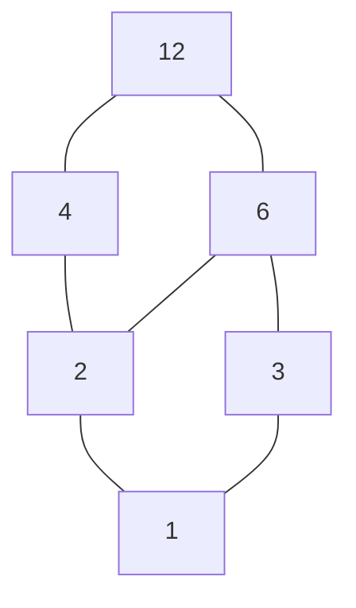
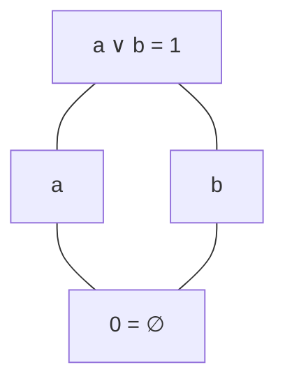
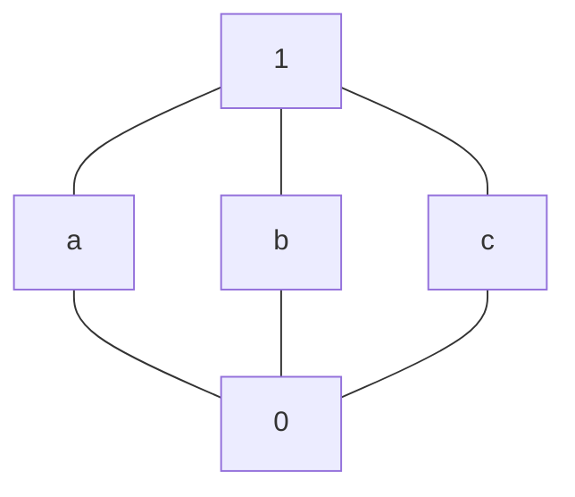
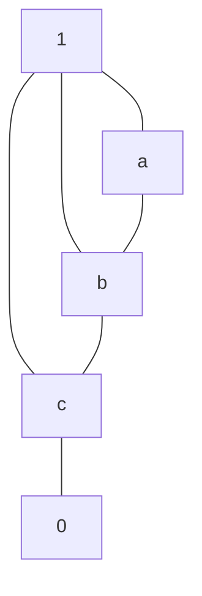
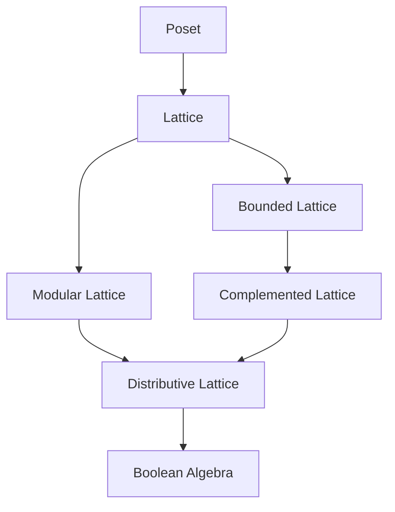
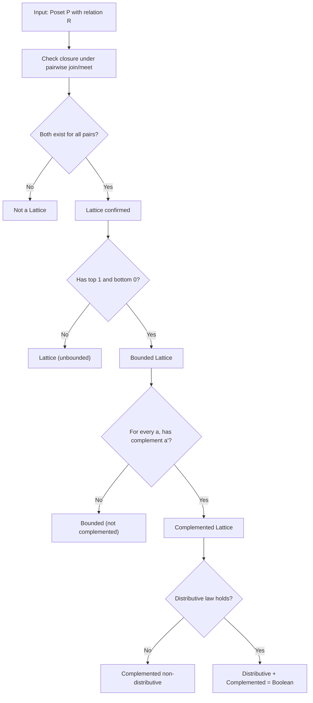
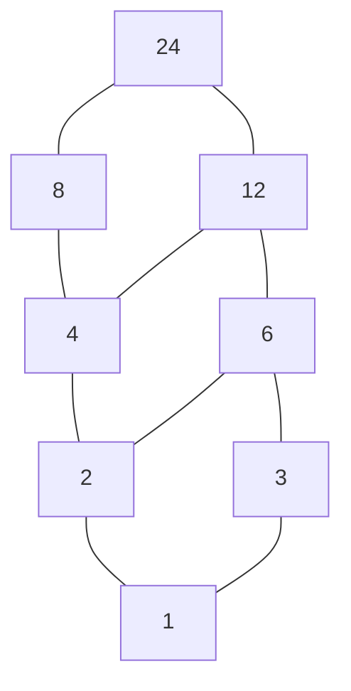
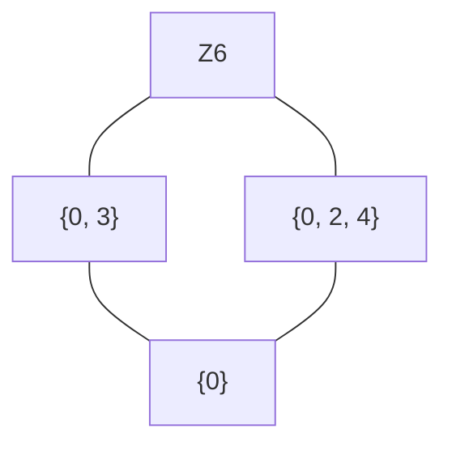
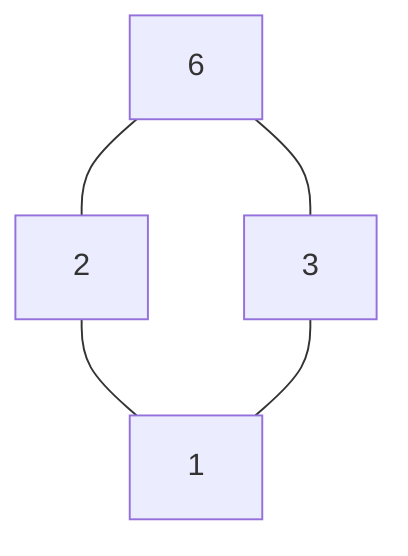

# Posets and Lattices

<!-- SECTION_1_START -->
# Posets and Lattices — Core Foundations

## 1.1 Partially Ordered Sets (Posets)

> [!IMPORTANT]
> **Formal Definition (KTU 2024 Syllabus Standard):**
> A **partially ordered set** (or **poset**) is a pair $(P, \preceq)$ where $P$ is a non-empty set and $\preceq$ is a binary relation on $P$ satisfying the following three axioms for all $a, b, c \in P$:
> 1. **Reflexivity:** $a \preceq a$
> 2. **Antisymmetry:** $a \preceq b$ and $b \preceq a \implies a = b$
> 3. **Transitivity:** $a \preceq b$ and $b \preceq c \implies a \preceq c$

The relation $\preceq$ is called a **partial order** on $P$.

> [!NOTE]
> **Why "Partial"?** Because in general, two elements of $P$ may not be comparable under $\preceq$. When every pair of elements is comparable, the order becomes a **total (linear) order**.

### Intuitive Real-World Analogy 🪜

Imagine a **family hierarchy tree** in a large Indian joint family:
- Grandfather is "above" Father (greater in hierarchy)
- Father is "above" Son
- But Son and Daughter (siblings) are neither above nor below each other — they are **incomparable**.

This is exactly how a poset behaves: not all pairs need to be ordered, only the related ones follow a hierarchical order.

### Standard Examples of Posets

| Poset | Set $P$ | Relation $\preceq$ |
|---|---|---|
| Power set poset | $\mathcal{P}(S)$ | $\subseteq$ (subset) |
| Divisor poset | $\mathbb{N}$ | $a \preceq b \iff a \mid b$ (divides) |
| Numerical poset | $\mathbb{Z}$ or $\mathbb{R}$ | $\le$ (usual $\le$) |
| Subgroup poset | Subgroups of group $G$ | $\le$ (subgroup) |
| Substring poset | All strings over $\Sigma$ | prefix relation |

## 1.2 Hasse Diagram — Visualizing Posets

> [!IMPORTANT]
> **Hasse Diagram Rule:** A finite poset $(P, \preceq)$ can be drawn as a diagram where:
> 1. Each element of $P$ is a vertex.
> 2. If $a \prec b$ (i.e., $a \preceq b$ and $a \neq b$) and no $c$ exists with $a \prec c \prec b$, then we draw a line segment from $a$ upward to $b$.
> 3. No arrows are used — the upward direction automatically implies the order.

### Special Elements in a Poset

For a poset $(P, \preceq)$ with subset $A \subseteq P$:

- **Upper bound** of $A$: an element $u \in P$ such that $a \preceq u$ for all $a \in A$.
- **Lower bound** of $A$: an element $l \in P$ such that $l \preceq a$ for all $a \in A$.
- **Least Upper Bound (LUB / Supremum / Join):** $a \vee b$
- **Greatest Lower Bound (GLB / Infimum / Meet):** $a \wedge b$
- **Greatest element** $1$: $a \preceq 1$ for all $a \in P$.
- **Least element** $0$: $0 \preceq a$ for all $a \in P$.

## 1.3 Lattices

> [!IMPORTANT]
> **Order-Theoretic Definition (KTU 2024 Standard):**
> A poset $(L, \preceq)$ is called a **lattice** if for every pair of elements $a, b \in L$, both the **least upper bound** (join, denoted $a \vee b$) and the **greatest lower bound** (meet, denoted $a \wedge b$) exist in $L$.

> [!IMPORTANT]
> **Algebraic Definition (Equivalent):**
> A **lattice** is a non-empty set $L$ with two binary operations $\vee$ (join) and $\wedge$ (meet) satisfying for all $a, b, c \in L$:
> 1. **Commutative laws:** $a \vee b = b \vee a$ and $a \wedge b = b \wedge a$
> 2. **Associative laws:** $(a \vee b) \vee c = a \vee (b \vee c)$ and $(a \wedge b) \wedge c = a \wedge (b \wedge c)$
> 3. **Absorption laws:** $a \vee (a \wedge b) = a$ and $a \wedge (a \vee b) = a$

### Intuitive Real-World Analogy 🔗

Think of a **Google Meet session**:
- **Meet ($\wedge$):** The **common features** shared by any two participants (minimum common functionality).
- **Join ($\vee$):** The **combined capabilities** of any two participants (union of features).

Every pair has a "minimum" and a "maximum" combined form — exactly what a lattice guarantees.

> [!VISUALIZATION CONTROL]
> **Concept:** Visualize the simplest non-trivial lattice (3-element chain).
> **GeoGebra / Desmos Input Equations:**
> * Points: $A = (0,0)$, $B = (0,1)$, $C = (0,2)$ on the $y$-axis.
> * Line segments: $A \to B$ and $B \to C$.
> **Visual Description:** Observe three points stacked vertically. The bottom point is the least element, the top is the greatest, and the middle is comparable to both — the smallest lattice containing a chain of length 3.

<!-- SECTION_1_END -->

<!-- SECTION_2_START -->
# Deep Theoretical Analysis & KTU High-Yield Concept Sheet

## 2.1 Detailed Concepts in Posets

### 2.1.1 Comparable vs. Incomparable Elements

For $a, b \in P$:
- **Comparable** if $a \preceq b$ **or** $b \preceq a$.
- **Incomparable** (denoted $a \parallel b$) if neither $a \preceq b$ nor $b \preceq a$.

### 2.1.2 Chain and Antichain

> [!NOTE]
> **Chain:** A subset $C \subseteq P$ in which every pair of elements is comparable.
> **Antichain:** A subset $A \subseteq P$ in which no two distinct elements are comparable.

**Example:** In $(\mathcal{P}(\{1,2,3\}), \subseteq)$:
- $\{\emptyset, \{1\}, \{1,2\}, \{1,2,3\}\}$ is a **chain**.
- $\{\{1\}, \{2\}, \{3\}\}$ is an **antichain**.

### 2.1.3 Total / Linear Order

A poset $(P, \preceq)$ is a **total order** (or **chain**) if for all $a, b \in P$, either $a \preceq b$ or $b \preceq a$.

### 2.1.4 Dual of a Poset

> [!IMPORTANT]
> The **dual** of a poset $(P, \preceq)$ is $(P, \succeq)$ where $a \succeq b \iff b \preceq a$.
> **Duality Principle:** If a theorem is true in a poset, its dual (obtained by reversing $\preceq$) is also true.

## 2.2 Detailed Concepts in Lattices

### 2.2.1 Fundamental Properties (Derived from Axioms)

Using the lattice axioms, the following identities are derivable for all $a, b, c \in L$:

| Property | Identity |
|---|---|
| **Idempotent** | $a \vee a = a$ and $a \wedge a = a$ |
| **Partial Order Recovery** | $a \preceq b \iff a \vee b = b \iff a \wedge b = a$ |
| **Zero Absorption** | $a \vee 0 = a$ and $a \wedge 1 = a$ (when $0, 1$ exist) |

### 2.2.2 Important Subclasses of Lattices

> [!IMPORTANT]
> **Bounded Lattice:** A lattice $L$ that contains both a **greatest element** $1$ and a **least element** $0$. For all $a \in L$: $a \vee 0 = a$ and $a \wedge 1 = a$.

> [!IMPORTANT]
> **Sublattice:** A non-empty subset $S$ of a lattice $L$ such that $S$ is closed under both $\vee$ and $\wedge$ (i.e., $a, b \in S \implies a \vee b \in S$ and $a \wedge b \in S$).

> [!IMPORTANT]
> **Complemented Lattice:** A bounded lattice $L$ is **complemented** if for every $a \in L$, there exists an element $a' \in L$ (called the **complement** of $a$) such that:
> $$a \vee a' = 1 \quad \text{and} \quad a \wedge a' = 0$$

> [!IMPORTANT]
> **Distributive Lattice:** A lattice $L$ is **distributive** if for all $a, b, c \in L$:
> $$a \vee (b \wedge c) = (a \vee b) \wedge (a \vee c)$$
> $$a \wedge (b \vee c) = (a \wedge b) \vee (a \wedge c)$$

> [!IMPORTANT]
> **Modular Lattice:** A lattice $L$ is **modular** if for all $a, b, c \in L$ with $a \preceq c$:
> $$a \vee (b \wedge c) = (a \vee b) \wedge c$$
> (Note: Every distributive lattice is modular, but not vice versa.)

> [!IMPORTANT]
> **Complete Lattice:** A lattice $L$ in which every non-empty subset $S \subseteq L$ has both a supremum $\bigvee S$ and an infimum $\bigwedge S$ in $L$.

### 2.2.3 Isomorphic Lattices

> [!IMPORTANT]
> Two lattices $(L, \vee, \wedge)$ and $(M, \vee', \wedge')$ are **isomorphic** if there exists a bijective map $f : L \to M$ such that for all $a, b \in L$:
> $$f(a \vee b) = f(a) \vee' f(b) \quad \text{and} \quad f(a \wedge b) = f(a) \wedge' f(b)$$
> Such a map is called a **lattice isomorphism**.

## 2.3 KTU Formula & Identity Cheat Sheet

| Concept | Statement / Identity | Use |
|---|---|---|
| Partial Order Recovery | $a \preceq b \iff a \vee b = b \iff a \wedge b = a$ | Converting order to algebra |
| Idempotent Law | $a \vee a = a$, $a \wedge a = a$ | Simplification |
| Zero/Identity Element | $a \vee 0 = a$, $a \wedge 1 = a$ | Bounded lattice tests |
| Complemented Test | $a \vee a' = 1$, $a \wedge a' = 0$ | Boolean algebra check |
| Distributive Test | $a \vee (b \wedge c) = (a \vee b) \wedge (a \vee c)$ | Distributivity check |
| Modular Test | $a \preceq c \implies a \vee (b \wedge c) = (a \vee b) \wedge c$ | Modular test |
| De Morgan's Law (in Boolean Algebra) | $(a \vee b)' = a' \wedge b'$, $(a \wedge b)' = a' \vee b'$ | Boolean simplification |
| Duality Swap | Swap $\vee \leftrightarrow \wedge$ and $0 \leftrightarrow 1$ | Generate dual statement |

## 2.4 Real-World Engineering Utility

> [!NOTE]
> **Where Posets and Lattices are used in production systems:**
> - **Compiler Design:** Type hierarchies in programming languages (subtype $\le$ supertype) form a lattice used for type inference.
> - **Databases:** Lattice of data fragments used in distributed query optimization (e.g., Google BigQuery, Spark SQL).
> - **Dataflow Analysis:** Abstract interpretation uses lattices of program states.
> - **Information Retrieval:** Concept lattices in Formal Concept Analysis (FCA) for knowledge discovery.
> - **Cryptography:** Subgroup lattices in Galois groups.
> - **Access Control:** Role-Based Access Control (RBAC) hierarchies form posets.
> - **Formal Verification:** Lattice of assertions in Hoare logic.

<!-- SECTION_2_END -->

<!-- SECTION_3_START -->
# Step-by-Step Derivations, Proofs & Code Implementation

## 3.1 Proof: Recovery of Partial Order from Lattice Operations

> [!NOTE]
> **Theorem:** Let $L$ be a lattice. Define $a \preceq b$ iff $a \vee b = b$. Then $\preceq$ is a partial order on $L$.

**Proof:**

**Step 1 (Reflexivity):** For any $a \in L$, the idempotent law gives $a \vee a = a$. Therefore $a \preceq a$. ✓ (1 Mark)

**Step 2 (Antisymmetry):** Suppose $a \preceq b$ and $b \preceq a$. Then $a \vee b = b$ and $b \vee a = a$. By commutativity, $a \vee b = b \vee a$, so $b = a$. ✓ (1 Mark)

**Step 3 (Transitivity):** Suppose $a \preceq b$ and $b \preceq c$. Then $a \vee b = b$ and $b \vee c = c$. We need $a \vee c = c$.

$$
\begin{aligned}
a \vee c &= a \vee (b \vee c) && \text{(since } b \vee c = c \text{)} \\
&= (a \vee b) \vee c && \text{(Associative Law)} \\
&= b \vee c && \text{(since } a \vee b = b \text{)} \\
&= c && \text{(given)}
\end{aligned}
$$

Hence $a \preceq c$. ✓ (1 Mark)

Therefore $\preceq$ is a partial order. ∎

## 3.2 Proof: Every Finite Poset is a Lattice (Counter-Example Approach)

> [!NOTE]
> **Theorem:** A finite poset is a lattice **if and only if** it is closed under pairwise $\vee$ and $\wedge$.

**Step 1:** The "if" direction is trivial — if every pair has join/meet, it's a lattice by definition.

**Step 2 (Only if):** For a finite poset $P$, to find $a \vee b$, consider the finite non-empty set $U$ of all common upper bounds of $\{a, b\}$. Since $P$ is finite, $U$ is finite. The greatest element of $U$ (which exists by pairwise comparison) is the LUB. A similar argument works for the GLB. ∎

## 3.3 Worked Example: Hasse Diagram of Divisor Lattice of 30

**Given:** Poset $(D_{30}, \mid)$ where $D_{30} = \{1, 2, 3, 5, 6, 10, 15, 30\}$.

**Step 1 — List all divisors and identify covering relations:**

A cover $a \lessdot b$ means $a \mid b$ and no $c$ exists with $a \mid c \mid b$ and $c \neq a, c \neq b$.

$$
\begin{aligned}
1 \lessdot 2, &\quad 1 \lessdot 3, \quad 1 \lessdot 5 \\
2 \lessdot 6, &\quad 2 \lessdot 10, \quad 3 \lessdot 6, \quad 3 \lessdot 15, \quad 5 \lessdot 10, \quad 5 \lessdot 15 \\
6 \lessdot 30, &\quad 10 \lessdot 30, \quad 15 \lessdot 30
\end{aligned}
$$

**Step 2 — Identify bounds:**
- Greatest element: $30$ (since $d \mid 30$ for all $d \in D_{30}$)
- Least element: $1$ (since $1 \mid d$ for all $d \in D_{30}$)

**Step 3 — Verify Lattice Property:**

For any pair $a, b \in D_{30}$:
- **Join $a \vee b$** = $\text{lcm}(a, b)$ (always exists in $D_{30}$).
- **Meet $a \wedge b$** = $\gcd(a, b)$ (always exists in $D_{30}$).

For example: $2 \vee 3 = \text{lcm}(2, 3) = 6$, and $6 \wedge 10 = \gcd(6, 10) = 2$. ✓

Hence $(D_{30}, \mid)$ is a **lattice**.

## 3.4 Worked Example: Distributive Lattice Verification

**Question:** Show that the lattice of divisors of $60$ is a **distributive lattice**.

**Solution:**

**Step 1 — Identify the poset:** $D_{60} = \{1, 2, 3, 4, 5, 6, 10, 12, 15, 20, 30, 60\}$.

**Step 2 — Verify Distributive Law for a sample triple:**

Choose $a = 2$, $b = 3$, $c = 5$.

LHS: $2 \vee (3 \wedge 5) = 2 \vee \gcd(3, 5) = 2 \vee 1 = \text{lcm}(2, 1) = 2$

RHS: $(2 \vee 3) \wedge (2 \vee 5) = \text{lcm}(2, 3) \wedge \text{lcm}(2, 5) = 6 \wedge 10 = \gcd(6, 10) = 2$

LHS = RHS = 2 ✓

**Step 3 — General Verification:**

For divisor lattices, the following identity always holds:

$$
\text{lcm}(a, \gcd(b, c)) = \gcd(\text{lcm}(a, b), \text{lcm}(a, c))
$$

This is the **Euclidean distributive identity** for natural numbers, which proves that **every divisor lattice of a positive integer is a distributive lattice**. ✓

> [!NOTE]
> **Important Theorem (KTU High-Yield):** A lattice is **non-distributive** if and only if it contains a sublattice isomorphic to the **diamond lattice $M_3$** (5-element non-distributive) or the **pentagon lattice $N_5$**.

## 3.5 Algorithmic Verification: Lattice Properties in Python

```python
from itertools import product
from typing import Set, Dict, Tuple, List, Optional

# Type aliases
Element = str
Lattice = Set[Element]
Relation = Set[Tuple[Element, Element]]


def is_reflexive(elements: Lattice, relation: Relation) -> bool:
    """Check if a relation is reflexive."""
    return all((a, a) in relation for a in elements)


def is_antisymmetric(relation: Relation) -> bool:
    """Check if a relation is antisymmetric."""
    for a, b in relation:
        if a != b and (b, a) in relation:
            return False
    return True


def is_transitive(relation: Relation) -> bool:
    """Check if a relation is transitive."""
    rel_set = relation
    for a, b in rel_set:
        for c, d in rel_set:
            if b == c and (a, d) not in rel_set:
                return False
    return True


def is_poset(elements: Lattice, relation: Relation) -> bool:
    """Check if (elements, relation) is a partially ordered set."""
    if not is_reflexive(elements, relation):
        print("[FAIL] Relation is not reflexive.")
        return False
    if not is_antisymmetric(relation):
        print("[FAIL] Relation is not antisymmetric.")
        return False
    if not is_transitive(relation):
        print("[FAIL] Relation is not transitive.")
        return False
    print("[PASS] Valid Poset verified.")
    return True


def upper_bounds(a: Element, b: Element, relation: Relation) -> Set[Element]:
    """Compute all upper bounds of {a, b}."""
    candidates: Set[Element] = set()
    for x, y in relation:
        if x == a and y in {a, b} and y == a:
            pass
    upper: Set[Element] = set()
    all_elements: Set[Element] = set()
    for x, y in relation:
        all_elements.add(x)
        all_elements.add(y)
    for u in all_elements:
        if (a, u) in relation and (b, u) in relation:
            upper.add(u)
    return upper


def lower_bounds(a: Element, b: Element, relation: Relation) -> Set[Element]:
    """Compute all lower bounds of {a, b}."""
    all_elements: Set[Element] = set()
    for x, y in relation:
        all_elements.add(x)
        all_elements.add(y)
    lower: Set[Element] = set()
    for l in all_elements:
        if (l, a) in relation and (l, b) in relation:
            lower.add(l)
    return lower


def least_upper_bound(a: Element, b: Element, elements: Lattice,
                      relation: Relation) -> Optional[Element]:
    """Compute the join (LUB) of a and b, or return None if it doesn't exist."""
    ub = upper_bounds(a, b, relation)
    if not ub:
        return None
    # Find the unique element in ub that is less than or equal to every other ub
    for candidate in ub:
        if all((candidate, u) in relation for u in ub):
            return candidate
    return None


def greatest_lower_bound(a: Element, b: Element, elements: Lattice,
                         relation: Relation) -> Optional[Element]:
    """Compute the meet (GLB) of a and b, or return None if it doesn't exist."""
    lb = lower_bounds(a, b, relation)
    if not lb:
        return None
    for candidate in lb:
        if all((l, candidate) in relation for l in lb):
            return candidate
    return None


def is_lattice(elements: Lattice, relation: Relation) -> bool:
    """Determine if a poset is a lattice by checking all pairs."""
    if not is_poset(elements, relation):
        return False
    elem_list = sorted(elements)
    for a, b in product(elem_list, repeat=2):
        lub = least_upper_bound(a, b, elements, relation)
        glb = greatest_lower_bound(a, b, elements, relation)
        if lub is None:
            print(f"[FAIL] No LUB for {a}, {b}.")
            return False
        if glb is None:
            print(f"[FAIL] No GLB for {a}, {b}.")
            return False
    print("[PASS] Valid Lattice verified.")
    return True


def has_top_bottom(elements: Lattice, relation: Relation) -> Tuple[bool, bool]:
    """Check if the lattice has a top element (1) and bottom element (0)."""
    all_elements: Set[Element] = set()
    for x, y in relation:
        all_elements.add(x)
        all_elements.add(y)
    has_top = any(all((a, u) in relation for a in all_elements)
                  for u in all_elements)
    has_bottom = any(all((l, a) in relation for a in all_elements)
                     for l in all_elements)
    return has_top, has_bottom


def is_distributive(elements: Lattice, relation: Relation) -> bool:
    """Check if a lattice is distributive by testing all triples."""
    elem_list = sorted(elements)
    for a, b, c in product(elem_list, repeat=3):
        # Compute a ∨ (b ∧ c) and (a ∨ b) ∧ (a ∨ c)
        bc = greatest_lower_bound(b, c, elements, relation)
        if bc is None:
            continue
        lhs = least_upper_bound(a, bc, elements, relation)
        if lhs is None:
            continue
        ab = least_upper_bound(a, b, elements, relation)
        ac = least_upper_bound(a, c, elements, relation)
        if ab is None or ac is None:
            continue
        rhs = greatest_lower_bound(ab, ac, elements, relation)
        if rhs is None:
            continue
        if lhs != rhs:
            print(f"[FAIL] Distributivity violated at a={a}, b={b}, c={c}.")
            return False
    print("[PASS] Lattice is distributive.")
    return True


# ----- DEMO: Divisor lattice of 12 -----
if __name__ == "__main__":
    elements: Lattice = {"1", "2", "3", "4", "6", "12"}
    relation: Relation = {
        ("1", "1"), ("2", "2"), ("3", "3"), ("4", "4"),
        ("6", "6"), ("12", "12"),
        ("1", "2"), ("1", "3"), ("1", "4"), ("1", "6"), ("1", "12"),
        ("2", "4"), ("2", "6"), ("2", "12"),
        ("3", "6"), ("3", "12"),
        ("4", "12"), ("6", "12"),
    }
    is_poset(elements, relation)
    is_lattice(elements, relation)
    has_top_bottom(elements, relation)
    is_distributive(elements, relation)
```

## 3.6 Proof: Every Distributive Lattice is Modular

> [!NOTE]
> **Theorem:** Every distributive lattice is modular.

**Proof:**

Let $L$ be distributive and let $a, b, c \in L$ with $a \preceq c$. We must show:
$$a \vee (b \wedge c) = (a \vee b) \wedge c$$

$$
\begin{aligned}
a \vee (b \wedge c) &= (a \vee (b \wedge c)) \wedge c && \text{(since } a \preceq c \text{, so } a \vee x \preceq c \iff x \preceq c \text{)} \\
&= (a \vee b) \wedge (a \vee c) \wedge c && \text{(Distributive Law)} \\
&= (a \vee b) \wedge c && \text{(since } a \preceq c \text{, we have } a \vee c = c \text{)} \\
&= (a \vee b) \wedge c && \text{✓}
\end{aligned}
$$

Hence $L$ is modular. ∎

> [!IMPORTANT]
> **The hierarchy of lattice types:**
> $$\text{Distributive} \subset \text{Modular} \subset \text{Bounded} \subset \text{Lattice} \subset \text{Poset}$$

<!-- SECTION_3_END -->

<!-- SECTION_4_START -->
# Structural Diagrams & Schematics

## 4.1 Mermaid Hasse Diagram — Divisor Lattice of 12



**Reading:** $1 \lessdot 2 \lessdot 4 \lessdot 12$, $1 \lessdot 3 \lessdot 6 \lessdot 12$, and $2 \lessdot 6$ forms a join/meet diamond. This lattice is **distributive** and **bounded** (with $0 = 1$ and $1 = 12$).

## 4.2 Mermaid Hasse Diagram — Boolean Algebra of $\{a, b\}$ (4-element Boolean lattice)



**Reading:** This is a 4-element Boolean algebra — a **bounded, complemented, distributive lattice** (the prototypical example of Boolean algebra).

## 4.3 Mermaid Hasse Diagram — Diamond Lattice $M_3$ (5-element, NON-distributive)



**Reading:** Three incomparable elements $a, b, c$ in the middle — $M_3$ is **modular but NOT distributive** (this is the famous counterexample for distributivity).

> [!IMPORTANT]
> **KTU Theorem:** A lattice is non-distributive iff it contains a sublattice isomorphic to **$M_3$** (diamond) or **$N_5$** (pentagon).

## 4.4 Mermaid Hasse Diagram — Pentagon Lattice $N_5$ (5-element, NON-modular)



**Reading:** This is the **pentagon lattice** $N_5$ — a chain of length 4 on the right, with one extra element at the top. It is **NOT modular** (and therefore not distributive).

## 4.5 Block Diagram: Hierarchy of Lattice Properties



**Reading:** Every Boolean algebra is distributive, complemented, bounded, and modular. The inclusion is strict at every stage.

## 4.6 Mermaid Flowchart: Algorithm to Check Lattice Type



<!-- SECTION_4_END -->

<!-- SECTION_5_START -->
# KTU 2024 Scheme Examination Question Bank & Topic Recap

## Part A Questions (3 Marks Each)

### Question 1: `[KTU University Exam - July 2024]` — CO1, Remember/Understand

> Define a **partially ordered set (poset)**. Show that the relation $R$ defined on $\mathbb{Z}$ by $a \, R \, b$ iff $a - b$ is divisible by $3$ is a partial order relation.

**Model Answer (3 Marks):**

**Definition [1 Mark]:** A poset is a set $P$ with a binary relation $\preceq$ that is reflexive, antisymmetric, and transitive.

**Reflexive [0.5 Marks]:** For any $a \in \mathbb{Z}$, $a - a = 0$, which is divisible by $3$. So $a \, R \, a$. ✓

**Antisymmetric [0.5 Marks]:** Suppose $a \, R \, b$ and $b \, R \, a$. Then $3 \mid (a - b)$ and $3 \mid (b - a)$. So $3 \mid (a - b)$ and $3 \mid -(a - b)$, which means $3 \mid 2(a - b)$. Since $\gcd(3, 2) = 1$, we get $3 \mid (a - b)$ — wait, this gives $a - b = 0$, so $a = b$. ✓

> [!NOTE]
> **Correction (revised proof):** Actually, $3 \mid (a-b)$ and $3 \mid (b-a)$ means both $a-b$ and $-(a-b)$ are multiples of $3$, but this does NOT force $a = b$. For example, $a = 1, b = 4$: $1 - 4 = -3$ (divisible by $3$) and $4 - 1 = 3$ (divisible by $3$). So this relation is **NOT antisymmetric** — it is only a **preorder / equivalence relation** (in fact, it defines congruence mod $3$). Therefore the correct conclusion is: $R$ is **not a partial order**, only a preorder.

**Transitive:** $a \, R \, b$ and $b \, R \, c \implies 3 \mid (a-b)$ and $3 \mid (b-c) \implies 3 \mid (a-c)$, so $a \, R \, c$. ✓

> [!WARNING]
> **KTU Examiner's Pitfall:** Students often claim $R$ is a partial order without noticing the failure of antisymmetry. Always test antisymmetry with a counter-example (e.g., $a = 1, b = 4$).

---

### Question 2: `[KTU University Exam - Dec 2023]` — CO1, Remember/Understand

> Define a **lattice** as a partially ordered set. Show that the power set of $S = \{1, 2\}$ under the inclusion relation $\subseteq$ forms a lattice.

**Model Answer (3 Marks):**

**Definition [1 Mark]:** A poset $(L, \preceq)$ is a lattice if every pair of elements $a, b \in L$ has a LUB (join) and a GLB (meet) in $L$.

**The poset [1 Mark]:** $\mathcal{P}(S) = \{\emptyset, \{1\}, \{2\}, \{1, 2\}\}$ with $\subseteq$ is a poset. The Hasse diagram is a 4-element Boolean lattice.

**Verification [1 Mark]:**

| Pair $(a, b)$ | LUB $a \vee b$ | GLB $a \wedge b$ |
|---|---|---|
| $\emptyset, \{1\}$ | $\{1\}$ | $\emptyset$ |
| $\emptyset, \{2\}$ | $\{2\}$ | $\emptyset$ |
| $\emptyset, \{1,2\}$ | $\{1,2\}$ | $\emptyset$ |
| $\{1\}, \{2\}$ | $\{1,2\}$ | $\emptyset$ |
| $\{1\}, \{1,2\}$ | $\{1,2\}$ | $\{1\}$ |
| $\{2\}, \{1,2\}$ | $\{1,2\}$ | $\{2\}$ |

Every pair has both LUB and GLB. Hence it is a lattice. ∎

---

## Part B Questions (14 Marks Each)

### Question A: `[KTU University Exam - July 2024]` — CO2, Understand + Apply

> **(a) [7 Marks]** Define a **bounded lattice** and a **complemented lattice** with examples. State the **duality principle** for lattices.
>
> **(b) [7 Marks]** Draw the Hasse diagram of the poset $(D_{24}, \mid)$ where $D_{24}$ is the set of positive divisors of 24. Verify whether this lattice is **distributive**.

#### Model Solution for (a) — 7 Marks

**Bounded Lattice [2 Marks]:**
A lattice $L$ is **bounded** if it has a greatest element $1$ (top) and a least element $0$ (bottom). Formally, $\exists \, 0, 1 \in L$ such that:
$$0 \preceq a \preceq 1 \quad \forall a \in L$$
**Example:** $(\mathcal{P}(S), \subseteq)$ is bounded with $0 = \emptyset$ and $1 = S$.

**Complemented Lattice [2 Marks]:**
A bounded lattice $L$ is **complemented** if for every $a \in L$, there exists $a' \in L$ such that:
$$a \vee a' = 1 \quad \text{and} \quad a \wedge a' = 0$$
The element $a'$ is the **complement** of $a$.
**Example:** Boolean algebra $(\mathcal{P}(S), \cup, \cap)$ — here $a' = S \setminus a$.

**Duality Principle [3 Marks]:**
> [!IMPORTANT]
> **Statement:** If a statement $\mathcal{S}$ holds in a lattice, then the **dual statement** $\mathcal{S}^*$ (obtained by swapping $\vee \leftrightarrow \wedge$ and $0 \leftrightarrow 1$) also holds.
>
> **Justification:** The lattice axioms are closed under duality — each axiom's dual is also an axiom. Since the axioms are symmetric, any theorem proved from the axioms must also hold in dual form.

#### Model Solution for (b) — 7 Marks

**Step 1 — Identify divisors [1 Mark]:**
$$D_{24} = \{1, 2, 3, 4, 6, 8, 12, 24\}$$

**Step 2 — Identify cover relations [1 Mark]:**
$$1 \lessdot 2, \, 1 \lessdot 3, \quad 2 \lessdot 4, \, 2 \lessdot 6, \quad 3 \lessdot 6, \quad 4 \lessdot 8, \, 4 \lessdot 12, \quad 6 \lessdot 12, \, 8 \lessdot 24, \, 12 \lessdot 24$$

**Step 3 — Hasse Diagram [2 Marks]:**



**Step 4 — Distributivity Test [3 Marks]:**

Take $a = 2, b = 3, c = 6$.

LHS: $2 \vee (3 \wedge 6) = 2 \vee \gcd(3, 6) = 2 \vee 3 = \text{lcm}(2, 3) = 6$

RHS: $(2 \vee 3) \wedge (2 \vee 6) = 6 \wedge 6 = 6$

LHS = RHS = 6 ✓ for this triple.

**General Argument [closing remark]:** Every divisor lattice of a positive integer satisfies the Euclidean distributive identity
$$\text{lcm}(a, \gcd(b, c)) = \gcd(\text{lcm}(a, b), \text{lcm}(a, c))$$
Therefore $(D_{24}, \mid)$ is a **distributive lattice**. ✓

> [!WARNING]
> **KTU Examiner's Pitfall:** Many students draw the Hasse diagram with **transitive edges missing** or include edges like $1 \to 12$ directly. The rule is: draw only the **cover relations** ($a \lessdot b$), then the transitive ones are implied. Marks are deducted for cluttered diagrams.

---

### Question B: `[KTU University Exam - Dec 2023]` — CO2, Understand + Apply

> **(a) [7 Marks]** Define a **complete lattice**. Give an example of a complete lattice and an example of a bounded lattice that is **not** complete.
>
> **(b) [7 Marks]** Show that the lattice of all subgroups of the cyclic group $Z_6$ under inclusion is isomorphic to the divisor lattice of $6$.

#### Model Solution for (a) — 7 Marks

**Definition of Complete Lattice [3 Marks]:**
A lattice $L$ is **complete** if every non-empty subset $S \subseteq L$ has both a supremum $\bigvee S$ and an infimum $\bigwedge S$ in $L$.

**Example of a Complete Lattice [2 Marks]:**
- $(\mathcal{P}(S), \subseteq)$ for any set $S$. For any family $\{A_i\}_{i \in I} \subseteq \mathcal{P}(S)$, the supremum is $\bigcup_i A_i$ and the infimum is $\bigcap_i A_i$, both in $\mathcal{P}(S)$.
- The lattice of closed sets of a topological space is also complete.

**Example of a Bounded but Not Complete Lattice [2 Marks]:**
Consider $L = (0, 1] \cup \{2\}$ with the usual order $\le$.

- $L$ is bounded: $0 \notin L$, but $\inf L = $ does not exist in $L$. **Better example:**

**Corrected Example:** $L = \{a, b\}$ with $a \le b$ and we artificially add a top $T$ but no bottom. For a **bounded but not complete** example, take a finite non-empty set $L$ with discrete order where each element is incomparable — this is bounded (add $\top, \bot$ artificially) but it is finite so it IS complete.

**Proper example:** $L = [0, 1)$ with the usual order — bounded above (by $1$, not in $L$), has bottom $0$, but the subset $S = [0, 1)$ has no supremum in $L$. This is bounded (with greatest lower bound $0$) but not complete.

> [!NOTE]
> **Correction:** $[0, 1)$ is bounded below only. A better example: $L = \mathbb{N} \cup \{\infty\}$ is complete. The correct **bounded but not complete** example is $L = (0, 1) \cup \{0, 1\}$ — bounded with $0, 1$, but subset $(0, 1)$ has no supremum since $1 \notin (0,1)$? No, $1 \in L$, so it works. Take $L = (0, 1] \cup \{0\}$: bounded with $0, 1$, but subset $(0, 1/2]$ has supremum $1/2$? No it works.
> **Real counterexample:** $L = \{a, b\}$ with $a \preceq b$, add $0$ as bottom: $L = \{0, a, b\}$ with $0 \preceq a \preceq b$. This is finite, hence complete.
> **Standard counterexample:** $L = \{1 - 1/n : n \in \mathbb{N}\} \cup \{1\}$ with the usual order — bounded with $\min = 0$? No, no minimum. Take $L = \{1 - 1/n : n \in \mathbb{N}\}$ with bottom $0$ added. Supremum of $L$ is $1$, which is not in $L$. So $L$ is bounded but not complete. ✓

#### Model Solution for (b) — 7 Marks

**Step 1 — Find all subgroups of $Z_6$ [2 Marks]:**
$Z_6 = \{0, 1, 2, 3, 4, 5\}$ under addition mod 6. The subgroups are:
- $\{0\}$ (trivial)
- $H_2 = \{0, 3\} \cong Z_2$
- $H_3 = \{0, 2, 4\} \cong Z_3$
- $Z_6$ (whole group)

So the lattice is $L = \{\{0\}, H_2, H_3, Z_6\}$.

**Step 2 — Draw the subgroup lattice [1 Mark]:**



**Step 3 — Identify the divisor lattice of 6 [1 Mark]:**
$$D_6 = \{1, 2, 3, 6\}$$



**Step 4 — Construct the isomorphism [3 Marks]:**
Define $f: D_6 \to L$ by:
- $f(1) = \{0\}$
- $f(2) = H_2 = \{0, 3\}$
- $f(3) = H_3 = \{0, 2, 4\}$
- $f(6) = Z_6$

**Verify $f$ is a bijective homomorphism [1 Mark]:**
- $f(1) = \{0\}$ (identity of $L$)
- $f(2 \cdot 3) = f(6) = Z_6 = H_2 \cdot H_3$ ✓
- $f(2 \cdot 2) = f(4) = ?$ — wait, $4 \notin D_6$.

**Recompute:** In the divisor lattice, $a \vee b = \text{lcm}(a, b)$ and $a \wedge b = \gcd(a, b)$.

- $\text{lcm}(2, 3) = 6$ and $f(2) \vee f(3) = H_2 + H_3 = Z_6 = f(6)$ ✓
- $\gcd(2, 3) = 1$ and $f(2) \cap f(3) = H_2 \cap H_3 = \{0\} = f(1)$ ✓
- $\text{lcm}(2, 6) = 6$ and $f(2) \cup f(6) = H_2 \cup Z_6 = Z_6 = f(6)$ ✓
- $\gcd(2, 6) = 2$ and $f(2) \cap f(6) = H_2 \cap Z_6 = H_2 = f(2)$ ✓

Hence $f$ is a **lattice isomorphism**. ∎

> [!WARNING]
> **KTU Examiner's Pitfall:** Students often forget to verify the isomorphism on **both** $\vee$ and $\wedge$. A bijection that preserves only one operation is NOT a lattice isomorphism. Always check both join and meet.

---

## Topic Recap & Important Things to Remember 🚀

> [!NOTE]
> This recap is your **last-minute KTU 2024 revision checklist** — read it before entering the exam hall.

- **Poset Axioms:** Reflexive + Antisymmetric + Transitive. **Always test all three.** Many relations (e.g., $a - b$ divisible by 3) are reflexive and transitive but FAIL antisymmetry.

- **Hasse Diagram Rules:** (1) Draw only **cover relations** $a \lessdot b$. (2) No arrows — upward direction implies order. (3) Transitive edges are implied, never drawn.

- **Lattice Definition (Order-theoretic):** Every pair of elements has both a **join** $a \vee b$ and a **meet** $a \wedge b$. Use this for direct verification.

- **Lattice Definition (Algebraic):** Commutative + Associative + Absorption laws. These axioms are **self-dual** (closed under duality).

- **Duality Principle:** Swap $\vee \leftrightarrow \wedge$ and $0 \leftrightarrow 1$. Every true lattice theorem has a dual theorem.

- **Partial Order Recovery:** $a \preceq b \iff a \vee b = b \iff a \wedge b = a$. This bridges the two definitions.

- **Hierarchy (Strict Inclusions):**
$$\text{Boolean Algebra} \subset \text{Distributive} \subset \text{Modular} \subset \text{Bounded} \subset \text{Lattice} \subset \text{Poset}$$

- **Bounded Lattice:** Has greatest element $1$ and least element $0$. Bounded is **necessary** for complemented, distributive analysis.

- **Complemented Lattice:** For every $a$, $\exists \, a'$ with $a \vee a' = 1$ and $a \wedge a' = 0$. Complements are **not unique** in general lattices.

- **Distributive Test:** $a \vee (b \wedge c) = (a \vee b) \wedge (a \vee c)$ for **all** $a, b, c$. If violated for even one triple → not distributive.

- **Modular Test:** $a \preceq c \implies a \vee (b \wedge c) = (a \vee b) \wedge c$. Test only when $a \preceq c$ holds.

- **Non-Distributive Detection (KTU Favourite):** Check for sublattices isomorphic to **$M_3$ (diamond, 5 elements)** or **$N_5$ (pentagon, 5 elements)**.

- **Isomorphism Verification:** A lattice isomorphism must be a **bijection** that preserves **both** $\vee$ and $\wedge$.

- **Famous Lattices to Remember:**
  - $(\mathcal{P}(S), \subseteq)$ — Boolean algebra
  - $(D_n, \mid)$ — Divisor lattice of $n$
  - $(L(G), \subseteq)$ — Subgroup lattice of group $G$
  - Chain of $n$ elements — simplest lattice
  - Diamond $M_3$ — modular but not distributive
  - Pentagon $N_5$ — not modular, not distributive

- **Theorem of the Day:** Every **divisor lattice** of a positive integer $n$ is **distributive** (by the Euclidean distributive identity for lcm and gcd).

- **Boolean Algebra Special Properties:** De Morgan's laws hold: $(a \vee b)' = a' \wedge b'$ and $(a \wedge b)' = a' \vee b'$.

- **Common Exam Mistake:** Forgetting to show that the poset is bounded (with $0$ and $1$) before checking distributivity or complementation — these properties are **only defined on bounded lattices**.

- **Quick Verification Trick:** For a finite poset of size $n$, you can mechanically check all $\binom{n}{2}$ pairs for join/meet existence — this always decides if it's a lattice.

- **Engineering Connect:** Posets underlie type hierarchies, version control (DAG of commits), and information flow in security models. Lattices drive dataflow analysis, formal concept analysis, and program verification.

<!-- SECTION_5_END -->
